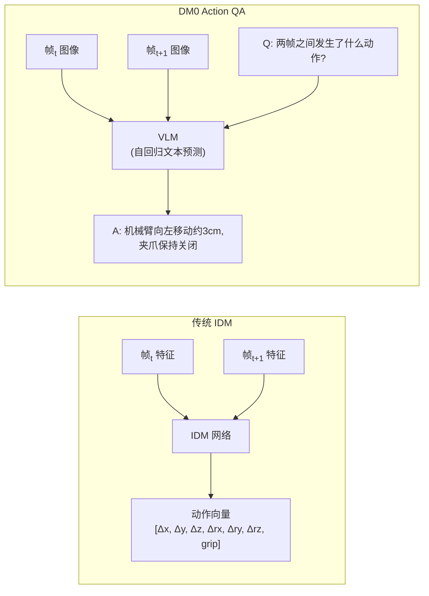
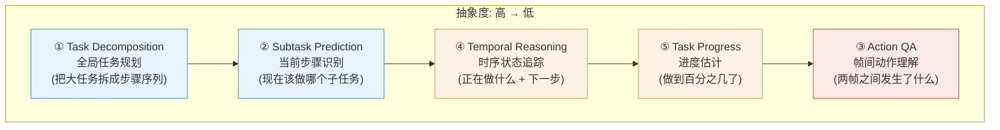
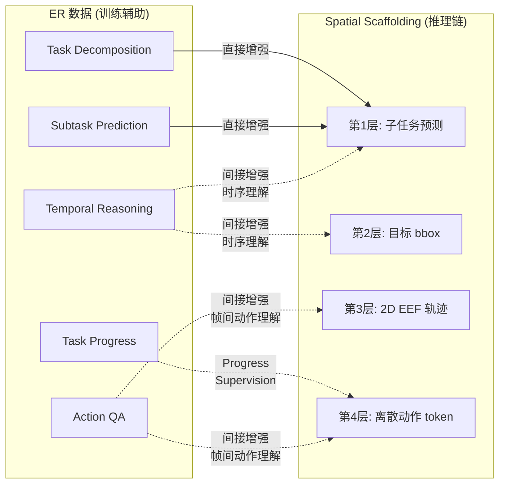

# DM0: An Embodied-Native Vision-Language-Action Model towards Physical AI 详细解读

# 要参考的资料

> 论文出处: Dexmal & StepFun, arXiv:2602.14974 16 Feb 2026    
> 本地文件: [DM0](./DM0_An_Embodied-Native_Vision-Language-Action_Model_towards_Physical_AI.pdf)   
> 本地代码: d:/SRC/Robot/dexbotic/
> 开源地址: https://github.com/Dexmal/dexbotic 上的Issues, Pull Requests, Discussions 等等, 和  https://huggingface.co/collections/Dexmal/dm0 上的代码与文档     

---

## 0. 论文核心定位与一句话概括

DM0 提出了一种 **"Embodied-Native"**(具身原生)的 VLA 范式,核心论点是反对当下主流的 "Pretrain-then-Adapt"(只在互联网数据上预训练再后期微调) 路线 —— 这种路线导致模型缺乏内在的物理基础(physical grounding),容易出现"导航与操作模块割裂"或"灾难性遗忘"。DM0 主张从 VLM 训练的早期阶段就把"具身感知-动作"数据当作一等公民,与 Web 文本、自动驾驶数据混合训练,从而同时获得"语义知识"与"物理先验"。

三大关键设计:
1. **统一预训练**:Web + 驾驶 + 具身数据一起进 VLM。
2. **混合梯度训练架构 (Hybrid Training)**:Action Expert 的梯度不回传到 VLM(借鉴 Knowledge Insulation),而 VLM 仍由非具身数据驱动学习,防止语义知识退化。
3. **Embodied Spatial Scaffolding (具身空间脚手架)**:用空间 CoT(子任务 → 目标框 → 末端轨迹 → 离散动作)来约束动作解空间。

最终在 RoboChallenge Table30 评测上,2B 参数的 DM0 在 Specialist(62.0%)与 Generalist(37.3% / 49.08)两种设定下均显著超过 GigaBrain-0.1、Spirit-v1.5、π0.5、π0 等 3-5B 量级的开源 SOTA。

---

## 1. 数据及其处理

### 1.1 数据来源、内容与数据量

DM0 的数据按训练阶段分为三个层次,总量分别是:
- **Pretrain**:1.13T tokens(论文里 Training settings 写的是 1.2T tokens, 370K steps,Figure 4 给的混合后总量 1.13T)
- **Mid-train**:200M 样本
- **Post-train**:50M 样本

#### (1) 公开数据集
论文明确引用并使用的公开数据集相当多,可分为以下几类:

**Vision-Language / 知识类(Pretrain)**
- **Common Crawl + StepCrawl**:Web 文本与图文交织数据;过滤掉图片下载失败率 >90%、二维码图片、极端长宽比页面。
- **LAION (Schuhmann et al., 2022)、COYO (Byeon et al., 2022)、BLIP-CCS (Li et al., 2022)、Zero (Xie et al., 2023)**:大规模图文对,通过 CLIP 平衡重采样、关键词检索、CLIP 相似度+美学评分挖掘。
- **Cambrian-737k、Cambrian-10M (filtered)**(Mid-train):过滤掉数学密集、非英文、纯写作类内容。
- **LLaVA OneVision 1.5 (An et al., 2025)**

**教育/OCR/文档**
- **CoSyn (Yang et al., 2025b)**(K-12 合成图)
- **VQA-Med、PathVQA、Sujet-Finance-QA-Vision-100k**
- **PaddleOCR、SynthDog (Kim et al., 2022)、MinerU 2.0、DocFusion、WebSight、Fox**(OCR 与文档)

**Grounding & Counting**
- **OpenImages、COCO、Merlin、PixMo、FSC、Locount**

**VQA & GUI**
- **Insight-over-Sight、VCR**;GUI 来自 **Step-GUI (Yan et al., 2025)**(界面 caption / 知识 VQA / 原子动作轨迹 / grounding / 带元素坐标的 web OCR)

**自动驾驶**
- 内部驾驶场景数据,标注 depth-aware detection / grounding(category + metric depth + bbox in [0,1000]),车牌做了隐私脱敏。

**仿真数据(Mid-train)**
- **LIBERO (Liu et al., 2023)** 4 任务(Spatial / Goal / Object / Long)
- **RoboTwin 2.0 (Chen et al., 2025)** 50 任务
- 自采的 **Habitat** 导航轨迹

**具身机器人公开数据(Mid-train)**
- 单臂:**Open X-Embodiment (OXE)**、**Fuse**
- 双臂:**RoboMind**、**Agibot Alpha**、**Galaxea Open World**

#### (2) 自有数据
- **自采单臂轨迹**:横跨 Franka、UR5、ARX-5、UMI 等多本体。
- **自采双臂轨迹**:ALOHA 平台。
- **自采导航轨迹**:Habitat。
- **Self-collected multimodal**:对预训练阶段的具身数据做 caption 重标注、具身场景 grounding、空间关系 VQA、GUI grounding、OCR 等。
- 论文未明确写出"采集 SOP / VR / IK / 力控遥操"等具体遥操方式,也没有明确叙述"数据飞轮"的闭环构建过程 —— 这是 DM0 论文的一个不太详尽之处(只在数据描述中暗示存在内部数据流水线,没有专门讨论"数据回流→训练"的循环机制)。

### 1.2 数据多样性

- **本体多样**:UR5、Franka、ARX-5、UMI、ALOHA、Galaxea、AgiBot、RoboMind 中的多种平台,以及 LIBERO / RoboTwin 仿真本体。
- **场景多样**:桌面操作(Table30)、长程操作、多步操作、导航(Habitat / mobile agent)、自动驾驶。
- **领域多样**:单臂、双臂、导航、驾驶、Web/教育/OCR/GUI 等。
- **任务多样**:30+ Table30 任务(picking、placement、rearrangement、tool use、组合指令);此外有进度估计、子任务预测、Action QA、时序推理、任务分解等 ER 类任务。
- **难度多样**:从单步抓放到 long-horizon(plug in network cable, sweep rubbish, arrange fruits in basket 等)。
- **失败与纠错样本**:论文未明确提到包含失败样本或失败-纠正样本,也没有讨论错误回流机制。
- **仿真数据**:有(LIBERO + RoboTwin2.0 + Habitat)。
- **人类数据**:论文里没有专门的"人类视频/第一人称数据"模块(比如 Ego4D 之类),这是与 π0.5、CLAP 等工作的一个差别。
- **互联网常识数据**:大量(Web / 教育 / OCR / VQA / GUI),作为 VLM 通识基础。
- **指令多样性**:Mid-train 阶段对每个数据组合场景设计了 **500 条不同的对话模板**(人工润色),训练时随机抽一条,显著提升语言多样性、防止 prompt 过拟合。
- **CoT/Reasoning 路径多样性**:Embodied Spatial Scaffolding 提供的 CoT 路径(子任务 → goal bbox → 2D 末端轨迹 → 离散 action token)是统一的,但内容上覆盖单臂/双臂/导航等不同模式。
- **配比与权重**:Figure 4 给出三阶段的数据混合饼图。Mid-train 中 VL / ER / Sim / 单臂 / 双臂五大类按权重采样;论文未披露具体每一类的精确比例,但明确说"加权采样后总样本量 200M"。**配比是固定** 的(没有讨论动态课程学习权重)。

### 1.3 数据格式

- **观测空间**:多视角图像 + proprioceptive state(机器人本体感觉)+ 语言指令。
- **图像处理**:多视角图像确定性排序,固定取 3 个视角(不足 padding,过多截断),resize 到 **728×728**;经过 PE 编码后用两层 3×3 stride=2 卷积做 4× 下采样。
- **动作空间**:末端执行器 (EEF) 控制,标注里以 `<eef_control>` 标签出现;注意论文里的样例有形如 `[250, 0, 250, 110, 250, 250, 0]` 的离散化数值,显示这是 **EEF 量化后的 token**,不是关节空间。
- **动作表征对齐**:**两套对齐视图(aligned views)** —— 同一段动作序列同时表示成
  1. 给 VLM 的 **离散 action token**(量化到 255 个 bin 的特殊 token)
  2. 给 Action Expert 的 **连续 action 值**

  这种"双表征对齐"是 DM0 的关键设计。
- **Action chunk 长度**:**Horizon = 50 步**(Mid-train 与 SFT 都是 50)。
- **跨本体身份注入**:通过 **prompt 模板里的本体 tag** 实现(例如 `<robot_arx5>`、`<robot_aloha>`、`<eef_control>`),即 **soft prompt + 显式本体标签** 的方式。论文里没有提到 explicit embodiment id embedding 或 per-embodiment readout head;主要靠语言模板里的 token 来区分本体。
- **Tokenizer**:
  - 文本:沿用 Qwen3 LLM 的 tokenizer
  - 图像:Perception Encoder (PE, Bolya et al. 2025)
  - 动作:量化到 255-bin 词表的特殊 action token(VLM 端);连续值(Action Expert 端,Flow Matching 直接回归)
- **采样基频 / Hz**:论文没有明确给出统一的采集 Hz 与对齐方式,只说做了"keyframe sampling"去重,选择关键帧做训练样本。
- **保存格式**:Robotic data 用 **episodic JSONL**,每行一个 timestep,字段包括:多视角视觉观测引用(图像或视频帧)、language instruction、proprioceptive state(用来通过时序偏移构造"下一步动作")、可选的 subtask、goal bbox、2D gripper waypoint。Vision-language 数据要么是即用对话格式,要么是最小键 + 模板组装。
- **包含模态**:文本、图片(多视角)、视频帧、proprioception、bbox(目标框)、2D 轨迹点。**没有触觉、音频、深度图、3D 点云、4D 时空显式建模** —— 论文在 Future Work 里明确说要在以后的版本中加入触觉、音频、深度。

### 1.4 Label 与 Reward

- **Label**:
  - 离散 action tokens(255-bin 量化)
  - 连续动作值(Flow Matching 回归)
  - 文本子任务、目标 bbox、2D EEF 轨迹点(辅助 supervision)
  - 通用 VLM 标签(caption / VQA / OCR / detection box)
- **Reward**:正文与 Training Recipe 中 **未涉及任何 RL reward 的设计**。Author List 里出现了 "Reinforcement Learning" 团队(Bin Xie 等 5 人),但论文正文没有给出 RL 的细节方法、reward function、训练流程等。

### 1.5 数据增广与合成

- **图像增广**:Mid-train 每个样本对 3 张图做 **ColorJitter**。其它增广没有明确披露。
- **模板增广**:每个数据组合场景设计 500 条对话模板,训练时随机选择(语言侧增广)。
- **合成数据**:
  - 教育类用合成数据(CoSyn)
  - OCR 用合成数据(SynthDog、PaddleOCR 合成)
  - Matplotlib / TikZ / Graphviz 等基于规则合成图表
- **仿真数据合成**:LIBERO 与 RoboTwin 2.0(后者带强 domain randomization)。
- **关键帧采样去重**:对 EEF 轨迹做 keyframe sampling,过滤静止/重复段。
- **没有显式提到**:RL outcome-driven 数据合成、世界模型生成轨迹、物理参数 / 相机参数 DR(虽然引用的 RoboTwin2.0 自带 DR,但 DM0 自己的训练没有专门描述 DR 调参)、VLM 自动调 DR 参数、多模态扰动鲁棒性增广、极端感知条件等。
- **核心策略偏向 quality alignment + action unification**,而非 RL refinement。

### 1.6 数据质量

- **本体相关性处理**:DM0 没有在 mid-train 之后就直接部署,而是再经过一个 **Post-train(50M 样本,只在目标本体上)** —— 论文明确说"Narrowing embodiment diversity reduces distributional variance and stabilizes cross-modal alignment"。这正是为了缓解"naive cross-embodiment mixing 必然 negative transfer"的问题。
- **去重**:对 EEF 轨迹做 keyframe sampling 去重;对 Web 数据做了大量过滤(图片下载失败率、QR code、长宽比、CLIP 重采样)。
- **质量过滤**:对 Cambrian-10M 移除"低质样本、与具身无关、数学过重、非英文、纯写作"的内容;Web 图文用 CLIP 相似度 + 美学评分挖掘。
- **多模态对齐**:用 proprioceptive state 通过 temporal shifting 构造"下一步动作"标签,确保动作与状态时序对齐。

---

## 2. 模型结构

### 2.1 模型大小与参数量

- **总参数量:2B**(论文中明确说 "DM0, despite having only 2B parameters")。
- VLM Backbone: **Qwen3-1.7B**(LLM 部分约 1.7B,加上视觉编码器与 Action Expert 总 2B)。
- **没有 MoE / MoT**,论文未提及 mixture-of-experts。
- **只训了一个尺寸**,但 Future Work 明确说要扩展到 7B / 30B。

### 2.2 各模态的 embedding / tokenizing

- **文本**:Qwen3 自带 tokenizer。
- **图像**:**Perception Encoder (PE)**(Bolya et al., 2025, arXiv:2504.13181),输入 728×728 多视角图像(3 视角),输出后再用两层 3×3 stride=2 卷积做 4× 下采样,得到 image embeddings 拼接到 LLM 输入序列。
- **动作**:量化为 255-bin 的特殊 action tokens(供 VLM 自回归预测)。
- **proprioception**:作为 observation 的一部分输入(具体编码方式论文没有详写,推测是通过 action expert 的条件输入或 token 化进 VLM)。

### 2.3 是否有 3D / 几何先验

- **没有显式的 3D 表征 / 点云 / 4D 时空建模**。
- 但通过驾驶数据的 "depth-aware detection"(category + metric depth + bbox)以及大量的 grounding / spatial-relation 数据,**隐式注入了空间先验**。
- Embodied Spatial Scaffolding 中的 goal bbox 与 2D EEF 轨迹也是一种隐式的几何/空间监督。
- 真正的 3D / 深度模态是 Future Work 明确列入的方向。

### 2.4 跨本体身份注入

- 通过 **prompt 模板里的本体标签**(`<robot_arx5>`, `<robot_aloha>`, `<eef_control>` 等)+ 对话模板差异,以语言上下文的形式让模型知道当前操作的本体类型。
- **没有专门的 embodiment ID embedding,也没有 per-embodiment readout head 或 proprio adapter**。

### 2.5 多模态融合

- 标准的 VLA 融合方式:多视角图像 → PE → 卷积下采样 → 与文本/proprio 一起拼成 token 序列输入 Qwen3。
- **没有触觉模态融合**(论文 Future Work 明确说要加)。
- Action Expert 通过 **VLM backbone 输出的 KV cache** 作为条件,生成连续动作 —— 这种"用 VLM KV cache 作为 Action Expert 条件"是 π0 / π0.5 系列的典型设计。

### 2.6 VLM Backbone

- **Qwen3-1.7B**(Yang et al., 2025a, arXiv:2505.09388)+ **Perception Encoder (PE)** 作为视觉前端。
- 这是 DM0 的一个有意识的轻量化选择(文中明确说 "DM0 operates as a lightweight model")。

### 2.7 是否使用世界模型

- **没有**。Future Work 明确把 World Model 作为下一步方向("integrate World Model capabilities into the DM0 framework, allowing the agent to mentally simulate action consequences")。

### 2.8 Action Head

- **Flow Matching 的 Action Expert**(Lipman et al., 2022),与 VLM backbone 共同预测连续动作序列。
- 同时 VLM 端用自回归方式预测 **离散 action tokens**(255-bin 量化),作为辅助监督。
- 这是一种 **"双头对齐"** 的设计:VLM 输出离散 token + Action Expert 输出连续值,二者监督的是同一段动作序列。

### 2.9 训练任务与 Loss Function

总体目标(联合训练):

\[ \mathcal{L}_{total}(\theta) = \lambda \mathcal{L}_{AR}(\theta) + \mathcal{L}_{FM}(\theta), \quad \lambda = 1 \]

- **L_AR (自回归交叉熵)**:监督 VLM 预测具身推理文本 + 离散 action token
  \[ \mathcal{L}_{AR}(\theta) = -\mathbb{E}_D [\log \pi_\theta(\hat{l} \mid o_t, l)] \]
- **L_FM (Flow Matching loss)**:监督 Action Expert 回归连续动作
  \[ \mathcal{L}_{FM}(\theta) = \mathbb{E}_{D,\varepsilon,\tau} \| \pi_\theta(\tilde{a}_{t:t+H}, o_t, l, \tau) - (A_{t:t+H} - \varepsilon) \|^2 \]
  其中 \( \tilde{a}_{t:t+H} = \tau A_{t:t+H} + (1-\tau)\varepsilon \), \( \varepsilon \sim \mathcal{N}(0, I) \), \( \tau \in [0,1] \) 是 flow time step。

**Embodied Spatial Scaffolding 的层次化辅助任务**(都通过 L_AR 监督):
1. **Subtask prediction**:预测细粒度子任务描述
2. **Goal bounding box prediction**:预测目标物体/区域的 bbox
3. **End-effector trajectory prediction**:预测主视角下未来若干帧的 EEF 2D 轨迹
4. **Discrete action prediction**:预测离散 action token

> 这里**没有**单独的 affordance head,也没有专门的 reward / value head;一切辅助监督都通过自回归文本预测来实现 —— 这是一种"text-as-everything"的简洁设计。

---

## 3. 系统

DM0 论文的重点在算法与训练,**对系统层面的细节披露非常有限**,以下逐项说明:

- **系统架构**:从架构上看,DM0 是 **单层端到端模型**(VLM + Action Expert 一体训练 + 一体推理),不是"快慢双系统"。但提供了两种推理模式:
  1. 直接从观测和指令预测连续动作。
  2. 先生成具身推理文本(CoT),再让 Action Expert 以此为条件生成动作 —— 这有点像在同一个模型内部做"慢思考-快执行"的弱版双系统。
- **数据血缘 / 数据版本管理**:论文没有讨论。
- **软硬件部署 / 边云协同**:论文没有讨论部署架构、是否边云协同;只提到训练硬件是 H20。
- **IO 优化、网络延迟、磁盘缓存**:未涉及。
- **Receding Horizon**:Action chunk = 50 步,但论文没明确写 receding horizon 的具体 stride/重规划策略。
- **延迟、吞吐、动作输出 Hz**:未给出推理延迟、吞吐量、可支持的控制频率。
- **高可用 / 降级 / 自动纠错重试**:未涉及。
- **机器人安全约束**:未涉及任何 E-stop / 力矩限位 / 几何安全空间 / VLM 安全过滤等机制。
- **稳定性监控、OOD 检测**:未涉及。
- **失败追踪与日志**:未涉及。
- **推理加速**:
  - 模型小型化:DM0 本身已经是 2B 的小模型(对比 GigaBrain-0.1 / Spirit-v1.5 / π0.5 都是 3-5B),但论文没有讨论蒸馏、量化、剪枝。
  - 推理引擎:未提到 vLLM / sgLang。
  - KV Cache:Action Expert 复用 VLM 输出的 KV cache,这是计算上的天然复用。
  - CUDA 算子 / TensorRT / 算子融合:未涉及。
  - Flow 步数压缩:未涉及。

> **总体评价**:DM0 是一篇模型 / 数据 / 训练驱动的论文,系统工程层面的内容几乎没有。这与 π0.5、GR00T N1、GigaBrain-0 等同期工作相比是个明显的缺口。

---

## 4. Pre-Training 训练流程

### 4.1 阶段划分

DM0 采用 **三阶段** 训练 Pipeline:

1. **Pretraining**:Web + 驾驶 + 具身的 VLM 大规模通识预训练。
2. **Mid-Training**:在 VLM 基础上加 Action Expert,用跨本体机器人数据 + 保留的 VL 数据联合训练,学会动作预测,同时保住通识能力。
3. **Post-Training**:把数据范围收窄到目标本体,稳定视觉-动作对齐;为部署服务。

整个流程没有专门的 Latent-Action 预训练阶段,也没有独立的 RL 阶段(Author List 暗示有 RL 团队,但正文未披露)。

### 4.2 Pretraining 详细超参

- **优化器**:AdamW, β1=0.9, β2=0.95, ε=1e-8, weight decay=0.01
- **总训练量**:1.2T tokens, 370K steps
- **Global batch size**:8,192
- **Sequence length**:4,096
- **学习率(两段式 linear decay)**:
  - 阶段一:900B tokens,LR 从 5e-5 线性衰减到 1e-5(general representation learning)
  - 阶段二:300B tokens,LR 从 1e-5 衰减到 6e-6(用更高质量的混合,强化 OCR / grounding / reasoning)
- **所有参数都是联合优化(没有冻结)**。
- **没有提到** weight decay 之外的正则化、L1 / L2 mixed loss 权重等细节。

### 4.3 训练框架与并行

- **训练框架**:论文没有点名(没说 Megatron / DeepSpeed),但引用了 Dexbotic 工具箱(Xie et al., 2025, arXiv:2510.23511),很可能基于该工具链。
- **并行方式**:未明确披露(全局 batch 8,192 表明使用了大规模数据并行,可能结合了 ZeRO / 张量并行,但论文未说)。
- **精度**:Mid-train 明确开启了 **AMP(自动混合精度)**;Pretrain 未明说但可推测同样使用混合精度。
- **bf16 / fp16 / fp8**:未明确披露使用哪一种。

### 4.4 训练稳定性

- **Async checkpoint / gradient checkpointing / 梯度 spike 自动回滚 / 分布式 resume** 等手段:**论文均未涉及**。
- 这是论文又一个工程细节缺口。

### 4.5 训练时数据处理

- **Streaming**:未明说,但 1.2T tokens 量级几乎必然是 streaming 训练。
- **Shuffle**:未明说。
- **实时增广**:Mid-train 阶段每个样本 ColorJitter 在线增广;每个 sample 从 500 模板中随机抽。
- **随机 seed 改变**:未提。

### 4.6 训练任务与 loss

Pretrain 阶段是纯 VLM 训练,只有 **L_AR(自回归交叉熵)**;此时尚未引入 Action Expert,所以没有 Flow Matching loss。

---

## 5. Mid-Training 中段训练

DM0 是为数不多明确把 "Mid-Training" 单独列为一个阶段的 VLA 论文之一,这是它的核心贡献之一。

### 5.1 Mid-Training 与 Pre-Training 的核心区别

- Pretrain:**只训 VLM**,数据是 Web + 驾驶 + 具身(以 grounding / caption 形式),目标是通识 + 物理先验。
- Mid-Training:**加上 Action Expert**,引入跨本体机器人轨迹数据,联合训练文本 token + 离散 action token + 连续 action(Flow Matching)。同时保留高质量 VL 数据以维持通识。

这一阶段的关键设计是 **Hybrid Gradient Strategy(借鉴 Knowledge Insulation, Driess et al., 2025)**:
- **对具身数据**:Action Expert 的梯度 **不回传** 到 VLM(insulate / 隔离),防止侵蚀 VLM 的语义知识。
- **对非具身数据**:VLM 正常更新。
- **同时**:VLM 也被监督预测离散 action token,鼓励它学习"动作相关的语义表达"。

### 5.2 数据使用

- 200M 样本规模,五大类配比(Figure 4):VL / ER / Sim / 单臂 / 双臂(具体百分比论文未披露具体数字)。
- Robotic data 用 episodic JSONL,每条 timestep 含多视角图像、指令、proprio、可选 subtask / goal bbox / 2D waypoint。
- 多视角固定 3 张,做 ColorJitter。

### 5.3 训练方法

- 单一训练循环,**联合监督**:文本 token + 离散 action token + 连续 action(Flow Matching)。
- Embodied Spatial Scaffolding 4 层级辅助监督。
- 每个数据组合场景下的 500 条对话模板随机采样。

### 5.4 训练针对的本体、任务、loss

- **本体**:跨本体(UR5、Franka、ARX-5、UMI、ALOHA、Galaxea、AgiBot、RoboMind 等),**不限定**。
- **任务**:操作 + 导航 + 通识 VL 对话 + ER(任务分解、子任务预测、Action QA、时序推理、进度估计)。
- **Loss**:L_total = λ·L_AR + L_FM,λ=1。

### 5.5 Mid-Training 训练设置

- **GPU**:64× NVIDIA H20
- **优化器**:AdamW
- **LR**:从 2.5e-5 线性衰减到 1e-5
- **Max sequence length**:4,096
- **AMP**:开启
- **每张图做 ColorJitter,每样本 3 张图,per-device batch = 6**
- **Epoch 数**:1

---

## 6. Post-Training(微调)

### 6.1 与 Pretrain / Mid-Train 的差异

- Mid-Train 起点,**收窄数据分布到目标本体**,降低分布方差,稳定跨模态对齐。
- 同样的训练目标(联合监督)与同样的优化配置,**只改变数据采样和目标本体集合**。
- 这是为部署阶段做准备的"工程化收敛"步骤。

### 6.2 数据使用

- 50M 样本规模。
- 包含:(a) Mid-train VL 数据的重采样子集(保通识)+ (b) 限定到目标本体的单臂/双臂机器人数据。
- 数据格式、对话模板、动作表征都与 Mid-train 完全一致。

### 6.3 SFT (Specialist) 与 SFT (Generalist)

- **Specialist**:只在某个具体目标任务上训练。8× H20,batch=4/GPU,40K-150K iterations(看任务复杂度);action horizon=50。对有重复子目标的任务用 progress supervision 提升表现(Table 1 中加了 * 标记)。
- **Generalist**:同一个机器人平台的所有任务聚合训练,在该平台所有任务上评估。16× H20,batch=4/GPU,200K iterations,action horizon=50。

### 6.4 与预训练的不同

- 数据范围更窄(目标本体)
- 数据量更小(50M vs Mid-Train 200M vs Pretrain 1.2T)
- 训练 iter 数更少
- LR / 优化器 / loss / 模板 / 动作表征均沿用 Mid-Train 的设置

---

## 7. RL 强化学习

- **正文中没有任何 RL 训练细节** —— 没有 reward 设计、没有数据构造、没有 RL 算法、没有仿真 vs 真机的策略选择。
- **Author List** 中确实有"Reinforcement Learning"小组:Bin Xie、Pengwei Zhang、Qi Yang、Xianchi Deng、Yunfei Wei。这暗示团队内部有 RL 工作,但本论文(arXiv:2602.14974v1)没有披露。
- 因此 DM0 的"性能突破"主要来源于:**Embodied-Native 预训练 + Hybrid 梯度策略 + Spatial Scaffolding CoT** 三大设计,并不依赖 RL。

按照 `embd_pt_sota_princpl.md` 的 RL 维度逐项核对:

| 维度 | DM0 的情况 |
|---|---|
| 预训练阶段 RL | 未涉及 |
| 后训练阶段 RL | 未涉及(论文未披露) |
| Reward 设计 | 未涉及 |
| Reward model / Value model | 未涉及 |
| 仿真还是真机 | 评测在真机(RoboChallenge),训练 RL 部分未披露 |
| 多本体 RL | 未涉及 |
| 人类介入 (HITL) | 未涉及 |

---

## 8. 评测与消融实验

### 8.1 评测维度

- **真机评测**:全部在 **RoboChallenge** 真机基准上做(Team, 2025b)。
- **任务范围**:Table30 —— 30+ 长程桌面操作任务,覆盖 picking / placement / rearrangement / tool usage / 组合指令。
- **本体覆盖**:UR5、Franka、ARX5、ALOHA(4 个真实平台)。
- **指标**:
  - Specialist 设定:成功率(Success Rate)
  - Generalist 设定:成功率 / 任务复合得分(success rate / score)—— 因为各模型成功率都偏低,所以补充打分
- **多模态理解评测**:Mid-train checkpoint 在 VQA 类任务上做了定性评测(Table 3-6),覆盖具身场景、生活场景、CoT 子任务预测、移动设备 Agent。
- **OOD 检测率 / Mean Maximum Rank Violation 等专门 OOD 指标**:论文没有给出系统化的 OOD 检测评测。
- **In-distribution / 长程鲁棒性**:从 Table 1/2 看,Generalist 设定下 DM0 在长程任务(stack color blocks 100/100、place shoes on rack 100/98.5、put cup on coaster 100/100、search green boxes 100/95.5)远超 baseline,体现长程能力。

### 8.2 关键评测结果

**Table 1 - Specialist(成功率,2026-02-10 前)**

| 模型 | 参数 | 平均成功率 |
|---|---|---|
| **DM0** | **2B** | **62.00** |
| Spirit-v1.5 | 4B | 51.00 |
| GigaBrain-0.1 | 3B | 51.67 |
| π0.5 | 3B | 42.67 |

DM0 用 2B 参数全面碾压 3-4B 量级的 baseline,在多个长程任务(arrange fruits in basket 100、plug in network cable 80、sweep rubbish 80)拿到 perfect 或近 perfect 分,而其它模型经常 0 分。

**Table 2 - Generalist(成功率 / 任务得分)**

| 模型 | 参数 | 平均(SR/Score) |
|---|---|---|
| **DM0** | **2B** | **37.30 / 49.08** |
| π0.5 | 3B | 17.67 / 31.27 |
| π0 | 3B | 9.0 / 20.22 |

差距更悬殊,在 stack color blocks(100/100)、place shoes on rack(100/98.5)、put cup on coaster(100/100)、search green boxes(100/95.5)等任务上 DM0 接近满分,baseline 几乎是 0。

### 8.3 多模态理解保持(Table 3-6)

- Table 3:具身 VQA(场景描述、物体检测、属性识别)—— 保持良好
- Table 4:通用 VQA(动物描述、书籍 OCR、城市街景描述)—— 保持良好
- Table 5:CoT 子任务预测能力 —— 在具身场景下能正确分解高层目标
- Table 6:移动设备 Agent 应用潜力(GUI 类问题回答)

> 这一段是 DM0 论文的隐性"消融":证明引入大量动作监督**没有**导致 VLM 通识能力崩溃,Hybrid Gradient Strategy 起到了保护作用。

### 8.4 显式消融实验

**论文没有传统意义上的消融实验表格**(没有"去掉 Embodied Spatial Scaffolding 会掉多少分"、"去掉 hybrid gradient 会损失多少 VL 能力"这类对照)。

这是 DM0 论文的另一个明显缺口 —— 它的三大核心设计(Unified Pretrain / Hybrid Gradient / Spatial Scaffolding)缺乏量化的消融证据,只能通过 Table 1/2 的整体性能 + Table 3-6 的定性 VQA 保持来间接说明价值。

### 8.5 闭环 / 长任务表现与优化

- 评测全部在真机闭环执行;Action chunk = 50 步以缓解高频规划压力。
- 对有"重复子目标"的任务(arrange fruits in basket、water potted plant、press three buttons)使用 **progress supervision**(在标注里加 0-1 的进度估计)以稳定训练效果 —— 这是一个针对长程任务的针对性优化。
- Embodied Spatial Scaffolding 的层次化 CoT 也是为了更好地在长程任务里约束动作解空间。

---

## 9. 总结与对照"VLA SOTA 原则"清单的整体评价

### 9.1 DM0 做得突出的方面

1. **Embodied-Native 范式提出与论证**:把"具身原生"作为方法论旗帜。
2. **三阶段训练 Pipeline**:Pretrain → Mid-Train → Post-Train,边界清晰、各阶段定位明确。
3. **Hybrid Gradient Strategy(KI 借鉴)**:解决了"大规模联合训练损害 VLM 通识"的经典痛点,并且 Table 3-6 提供了 VL 能力保留的间接证据。
4. **动作"双视图对齐"**:VLM 端离散 token + Action Expert 端连续 Flow Matching,同源监督。
5. **Embodied Spatial Scaffolding (Spatial CoT)**:子任务 → goal bbox → 2D EEF 轨迹 → 离散 action 的层次化辅助监督,作为"结构化 information bottleneck"。
6. **数据统一与对话模板增广**:500 条/场景对话模板大幅提升语言侧多样性。
7. **跨本体涵盖度大**:UR5 / Franka / ARX-5 / UMI / ALOHA / Galaxea / AgiBot / RoboMind / OXE / Fuse / LIBERO / RoboTwin2.0 / Habitat。
8. **2B 小模型打 3-5B 大模型**:在 RoboChallenge Specialist + Generalist 双设定均 SOTA。

### 9.2 DM0 论文披露不足或缺失的方面(对照 SOTA 原则清单)

1. **数据采集 SOP / 遥操方式 / 数据飞轮闭环**:几乎未披露。
2. **失败样本与失败-纠错样本**:未涉及。
3. **触觉、音频、深度、3D 点云、4D 时空**:未涉及(Future Work 已列入)。
4. **跨本体身份注入**:仅依赖语言模板里的 tag,未引入 embodiment id embedding 或 per-embodiment readout head。
5. **采样基频 / 多源时空对齐细节**:未明确披露 Hz 与对齐策略。
6. **数据混合精确比例**:Figure 4 是饼图,正文未给精确数值。
7. **系统层面**:部署架构、边云协同、IO 优化、推理延迟 / 吞吐 / 控制频率、高可用、安全约束、OOD / 稳定性监控、日志追踪、推理加速、KV cache 详细策略、Flow 步数压缩等几乎全部缺失。
8. **训练框架 / 并行细节 / 精度选择 / 训练稳定性手段(checkpoint / spike rollback)**:未披露。
9. **RL 强化学习**:有团队但论文未披露任何 RL 设计细节。
10. **Reward**:无 reward 设计。
11. **传统消融实验表**:三大核心设计缺乏量化消融证据。
12. **OOD 评测、Mean Maximum Rank Violation、鲁棒性专门评测**:缺失。

### 9.3 一句话定位

> DM0 是一篇 **以"具身原生数据范式 + 混合梯度训练 + 空间 CoT 脚手架"为核心论点的算法导向论文**,在 2B 量级用极简的工程取舍跑出了 RoboChallenge Table30 的双设定 SOTA,验证了"早期就把具身数据当一等公民 + 用 KI 防退化 + 用层次化辅助任务约束动作空间"的有效性;但在系统、RL、消融、OOD 鲁棒性等维度披露相对薄弱,留下了清晰的 Future Work 空间(Scaling、触觉/音频/深度多模态、World Model)。

# 通过 DM0 论文分析补充的维度

> 以下是从 "DM0: An Embodied-Native Vision-Language-Action Model towards Physical AI" 一文中识别出, 但前面章节未明确覆盖的具身智能 / VLA / WAM 通用考量维度. 仍按原文风格分模块列出.

## 训练范式与设计哲学
+ 顶层范式选择: Embodied-Native(具身原生, 早期就融入具身数据) vs Pretrain-then-Adapt(纯互联网预训练后再微调) vs Latent-Action-First(先学潜在动作表征) vs RL-First(以 RL 探索为主) 或其它范式. 该选择决定整套数据/架构/训练计划.
+ 设计哲学: 轻量化(sub-B / 2B 跑赢大模型) 还是 巨量化(7B / 30B / 70B), 是否准备多尺寸路线图.
+ 物理先验 vs 语义先验的明确二分: 模型同时获得"语义知识"与"物理先验"是否被显式列为目标, 数据/任务对这两类先验的覆盖度如何.
+ 是否把"具身数据视为一等公民"在预训练阶段就大规模混入, 还是仅在微调阶段引入.
+ 防止"模块割裂"(操作 / 导航 / GUI / 驾驶) 与 防止"灾难性遗忘"是否被显式作为设计约束.

## 梯度路由与数据条件化训练
+ Knowledge Insulation 类策略: Action Expert(或下游执行模块)的梯度是否回传到 VLM backbone, 还是被切断.
+ 数据条件化的梯度路径: 不同类型数据(具身轨迹 / 通识 VL / 推理 / 驾驶)是否走不同的梯度流, 比如具身数据切断梯度而 VL 数据正常更新.
+ 是否让 VLM 同时被监督预测离散动作 token, 让 backbone 学到"动作相关语义".
+ 双向能力保持: 操作能力提升的同时通识/推理能力是否被定量监控不退化, 二者是否能相互促进.

## 动作表征的多视图对齐
+ 是否对同一段动作做"双视图"对齐监督: 离散 token(给 VLM 自回归)+ 连续值(给 Action Expert 回归), 二者监督的是同一序列.
+ 动作词表设计: 量化 bin 数(如 255-bin), 是否作为 LLM 词表的特殊 token, 词表规模与连续值精度的权衡.
+ Action chunk 长度(如 50 步)的设计权衡: chunk 长度 / 控制频率 / 重规划频率 / 反馈延迟 之间的取舍.
+ Action Expert 的条件输入构造: VLM 输出的 KV cache, 噪声, flow time step τ, 文本 CoT 预测结果等如何拼接.
+ Flow Matching / Diffusion 的训练超参: τ ∈ [0,1] 的分布(均匀 / Logit-Normal 等), 噪声分布 N(0, I) 还是其它, 训练 / 推理时采样步数.
+ 动作的归一化与去归一化: 短窗口归一化, 跨本体动作量纲对齐, 反量化误差.
+ Proprioception 状态的归一化与编码方式.

## 辅助任务与层次化监督设计
+ 层次化辅助监督的"curriculum"形态: 从抽象到具体的分层, 例如 子任务 → 目标 bbox → 末端 2D 轨迹 → 离散动作 token.
+ 把每一层辅助任务视为"结构化 information bottleneck" / "task-aligned inductive bias", 渐进约束模型假设空间.
+ 进度监督 (Progress Supervision): 对有重复子目标的长程任务, 用 0-1 的进度估计作为辅助监督, 提升训练效率.
+ 显式定义的具身推理 (Embodied Reasoning) 数据类型: 任务分解, 子任务预测, Action QA(两帧之间的动作), 时序推理(识别正在做什么+下一步), 任务进度估计.
+ 是否做 affordance / contact / pre-grasp pose / 关键点 / mask / 语义分割等额外 grounding 监督.
+ 辅助任务是否带门控开关: 缺少某字段时是否自动切换到不带该字段的模板, 避免空标签污染.

## 推理模式与运行时配置
+ 同一模型支持多种推理模式: 直接从观测到动作 vs 先生成 CoT 文本再让 Action Expert 条件化生成动作.
+ 训练-推理一致性: chunk 长度, 模板分布, CoT 路径在训练和推理时是否对齐.
+ CoT 的延迟代价: CoT 文本生成会增加首步延迟, 是否做 CoT 缓存 / 异步生成 / 跨步复用.
+ 推理时是否支持显式的"模式切换"(高频纯执行 vs 低频带规划).

## 模型结构补充
+ 视觉编码器(Vision Encoder)的选择: PE(Perception Encoder) / CLIP / SigLIP / DINOv2 / EVA / 自研 PE 之间的取舍.
+ 视觉编码器与 LLM 的对接方式: MLP 投影, Q-Former, Resampler, Cross-Attention, 卷积下采样.
+ VLM 与 Action Expert 的耦合机制: 共享 KV cache, cross-attention, prefix tuning, adapter 等.
+ 跨本体身份注入的更细粒度选项 (在已有清单基础上补充): 语言模板里的本体 tag(如 <robot_aloha>, <eef_control>, <robot_arx5>), 通过 prompt 上下文标识本体, 而非单独 embedding.
+ 多视角图像的工程化处理: 固定视角数(如 3 视角) + padding/truncation + 确定性排序, 防止视角顺序成为伪线索.
+ 图像 token 压缩策略与 context 长度预算: 卷积下采样(如 4×), Q-Former, Adaptive Pooling, Token Merging 等; 与 max_seq_len 的取舍.
+ 输入分辨率 (如 728×728) 的选择: 与下游小物件 / 精细操作识别能力的关系.

## 数据工程补充
+ 数据存储格式与 schema 设计: episodic JSONL, parquet, LMDB, WebDataset, RLDS 等; 每行/每条对应的字段定义.
+ 通过 proprioceptive state 的 temporal shifting 派生 next action, 保证状态/动作时序对齐.
+ 对话模板的语言侧增广: 每个数据组合场景设计 N 条(如 500 条)对话模板, 训练时随机抽样, 模板需人工润色质量.
+ 关键帧采样 (Keyframe Sampling): 针对 EEF / joint 轨迹挑选状态变化大的关键帧, 过滤静止 / 重复段, 缩小数据量并提高信息密度.
+ 跨阶段数据保留与重采样: Pretrain 阶段的高质量 VL 数据在 Mid-train / Post-train 中重采样, 显式防止能力遗忘.
+ 数据许可证 / 法律合规: 公开数据集的 license(CC-BY, CC-NC, MIT, Apache, custom 等)是否兼容商用; 自有数据的归属与发布范围.
+ 隐私脱敏: 车牌, 人脸, 工牌, 敏感文本是否打码或脱敏; 是否有合规审查流程.
+ 公开 VL 数据的过滤策略: 移除"数学密集 / 非英文 / 纯写作 / 与具身无关"等不利于具身学习的样本.
+ 合成数据来源细分: 教育题(如 CoSyn), 合成图表(Matplotlib / TikZ / Graphviz), 合成 OCR(SynthDog), 合成代码-渲染对(HTML/Markdown/LaTeX 渲染), 合成轨迹.
+ 数据原始-清洗-标注-验证的流水线管理: Web 抓取后的图像下载失败率过滤, QR code 过滤, 极端长宽比过滤, CLIP 平衡重采样等.
+ 单源数据 vs 自有数据 vs 合成数据 的精确比例(数字而非饼图)是否被披露.

## 训练流程补充
+ 单一训练阶段内的多 phase 学习率调度: 例如先用低质大量数据 + 较大 LR 学通识, 再切到高质子集 + 较小 LR 强化关键能力.
+ Catastrophic Forgetting 的显式缓解策略: Knowledge Insulation, 数据重采样, 辅助 VL 监督, EWC / replay buffer 等.
+ 序列长度预算 (max_seq_len 如 4096) 与"图像 token + 文本 token + action token"之和的均衡分配.
+ 训练效率指标: tokens/sec, samples/sec, wall-clock 时间, 总 GPU 卡小时, 显存峰值, MFU / HFU.
+ 跨阶段优化器/超参的承袭与变更: 哪些保持一致(为了延续学习状态), 哪些必须重置.
+ 训练框架是否开源 / 是否提供配套的 toolbox(如 dexbotic 这类).
+ 训练时的 reproducibility: 随机 seed, 数据顺序, checkpoint 保存频率, 是否支持精确复现.

## 评测的更多维度
+ Specialist(单任务专精, 只在目标任务数据上训) vs Generalist(同平台多任务联训, 在所有任务上评) 的双设定评测, 二者侧重不同(任务上限 vs 跨任务可迁移).
+ 复合评测指标: 在成功率普遍偏低的场景下补充"任务部分得分 / 进度得分", 保留模型间区分度.
+ 基准时效性: 评测时间戳(如"data reported before YYYY-MM-DD"), 对比的 baseline 是否同期 / 同 checkpoint, 重新评测时是否保持公平.
+ 参数量对齐对比: 与同量级模型对比, 突出"小模型胜大模型"或"大模型显著领先"等论点价值.
+ 跨领域涌现能力: 未在训练中显式覆盖的领域(如移动 agent / GUI / 浏览器操作) 是否表现出可用能力.
+ 真机评测 vs 仿真评测的取舍: 真机更可信但成本高 / 难规模化 / 不易复现; 仿真规模化但 sim-to-real gap.
+ 评测协议是否开源: checkpoint, 推理代码, 评测脚本, 任务定义, 容器镜像 是否完整开源以支持第三方复现.
+ 不同任务间的"零样本 / 少样本"切换能力评测.
+ 跨平台 / 跨本体的迁移评测: 在某本体训练, 在另一本体直接评测.
+ VLM 通识能力的非动作侧定性 / 定量评测: 防止模型在加入动作监督后通识能力崩溃, 通过 VQA / OCR / Grounding / CoT reasoning 检验.

## 工程化与开源化
+ 开源策略: 模型权重, 训练代码, 推理代码, 数据集, 评测协议, 推理 toolbox(如 dexbotic, Dexbotic-RoboChallengeInference) 是否完整开放及对应 license.
+ 项目复现的硬件门槛(如需要 64×H20)与数据门槛(是否需要付费数据).
+ 团队组织: 现代 VLA 项目通常按子模块拆团队 — 预训练 / SFT / RL / 数据采集与处理 / 评测 / 基础设施 / Sponsors / Project Lead. 该结构本身反映项目复杂度.
+ 硬件选择的合规与地缘约束: 例如中国市场用 H20 / 910B / MTT 等替代 H100/H200; 国际项目对芯片管制的应对.
+ 数据中心 / 集群规模与可调度性, 训练任务的排队 / 抢占 / 容灾.
+ 模型 / 数据 / 评测的版本号管理与发布节奏.

## World Model (WAM) 专项考量
+ WAM 的核心目的:
    - Mental simulation: 让 agent 在执行前"想象"动作后果
    - 长程规划: 在 imagination 中做 lookahead, 减少真机试错
    - 数据合成: 利用世界模型生成大量虚拟轨迹做训练
    - Reward shaping: 作为 dense reward / value 信号源
    - 不确定性量化: 多次 rollout 估计动作风险
+ WAM 与 VLA 的集成方式:
    - 独立模块: 离线规划, 输出动作建议给 VLA
    - 内置模块: 作为 VLA 内部的 imagination buffer / latent dynamics
    - RL 中的 critic / value model
    - 数据生成器: 离线生成轨迹后由 VLA 学习
+ WAM 的输入输出空间:
    - 状态 → 下一状态(latent dynamics, 隐空间预测)
    - 状态 + 动作 → 下一帧图像 / 视频(visual world model)
    - 状态 → 长程多模态 rollout(任意未来步)
    - 多模态条件下生成: 文本指令 + 图像观测 → 未来视频 / 状态序列
+ WAM 的训练数据: 海量视频(YouTube / Ego4D / 互联网), 仿真 rollout, 人类第一人称, 机器人交互日志, 驾驶视频, 可控视频生成数据.
+ WAM 的预测目标: 下一帧重建, 多步未来重建, 关键事件预测, 未来 reward 预测, 可控视频生成 (text-conditioned, action-conditioned).
+ WAM 的评估指标: rollout fidelity (PSNR / LPIPS / FVD), long-horizon coherence, 物理一致性 (objects don't disappear), 可控性 (action follow-through), downstream policy 性能.
+ WAM 的部署模式: 在线 imagination(实时跑) vs 离线生成数据(批处理).
+ WAM 与 VLA 是否共享 backbone, 共享到什么粒度(共享 vision encoder / LLM / 全部).
+ WAM 的安全性: 想象中的危险动作是否会泄漏到真实执行.

## 模态扩展路线
+ 触觉, 音频, 深度, 3D 点云, 力 / 力矩, 红外, 雷达 等模态的引入时机:
    - 早期统一预训练阶段就融入(全模态预训练)
    - 仅在 mid / post-train 加入(后期融合)
    - 仅作为推理时的额外输入(免训练融合, 用 adapter)
+ 不同模态的 tokenizer / encoder 选择和对齐方式.
+ 多模态对齐的训练任务设计: 跨模态对比学习, 跨模态预测(用 A 模态预测 B 模态), 跨模态 grounding(找文本提到的物体在 3D / 触觉中的对应).
+ 模态缺失时的鲁棒性: 部署机器人若没有某模态(如没有触觉), 模型是否能优雅降级.
+ 异步多模态: 不同模态采样频率不一致时的对齐与融合.
+ 触觉 / 力反馈这类高频低维模态如何与低频高维视觉模态融合.

## Scaling 与未来方向
+ 范式级 Scaling Law 研究: 数据规模, 模型规模, 本体多样性, 任务多样性 → 真机性能曲线.
+ 多尺寸模型的统一训练计划(如 2B → 7B → 30B), 共享数据 / 配方便于做 scaling 分析.
+ 数据规模的 scaling: 真机 + 仿真 + 人类视频 + Web 各自的边际收益与最佳比例.
+ "质量对齐 + 动作统一 + RL refinement" 三轴突破: 单纯堆数据量未必有效, 三个维度缺一不可.
+ 涌现能力 (emergent capabilities) 的尺寸阈值: 在多大模型 / 多少数据时新能力出现.
+ 长程能力的 scaling: 任务步长 / horizon 与模型规模的关系.
+ 跨本体 scaling: 训练时本体数量增加是否带来 generalization 提升, 还是会触发 negative transfer.
+ 与 World Model / RL 的协同 scaling: 三者一起做 scaling 是否带来超线性提升.

---

## 附录: 关键概念详解 (Q&A)

### Q1: "数据条件化的梯度路径"是什么意思?

> 原文: "数据条件化的梯度路径: 不同类型数据(具身轨迹 / 通识 VL / 推理 / 驾驶)是否走不同的梯度流, 比如具身数据切断梯度而 VL 数据正常更新."

#### 核心含义

在同一个训练循环里, 根据当前 mini-batch 里数据的类型, 动态决定梯度要不要回传到 VLM backbone.

#### DM0 的模型结构

DM0 由两大部分组成:

```
┌─────────────┐        KV cache        ┌──────────────┐
│  VLM Backbone│ ─────────────────────► │ Action Expert │
│  (Qwen3-1.7B)│                        │ (Flow Matching)│
└──────┬───────┘                        └───────┬───────┘
       │                                        │
   预测文本 token                          预测连续动作
   + 离散 action token                    (L_FM loss)
   (L_AR loss)
```

训练时同一个 batch 里混着两类数据. 梯度路径按数据类型**分叉**:

**当这条样本是"通识 VL 数据"(Web 文本、VQA、OCR 等)时:**
- L_AR 的梯度正常回传, 更新 VLM backbone 的全部参数
- 这条路径让 VLM 持续学习语义知识、推理能力

**当这条样本是"具身轨迹数据"(机器人动作序列)时:**
- Action Expert 产生的 L_FM 梯度**被切断(stop gradient)**, 不回传到 VLM backbone
- VLM 只通过预测离散 action token 的 L_AR 被更新(这个信号比较温和)
- Action Expert 自己正常更新

#### 伪代码表示

```python
for batch in dataloader:
    if batch.type == "VL":
        # VLM 正常学习语义
        loss = L_AR(vlm(batch))
        loss.backward()  # 梯度流过 VLM 全部参数

    elif batch.type == "embodied":
        # VLM 只学离散 action token(温和信号)
        kv_cache = vlm(batch)
        loss_ar = L_AR(kv_cache)  # 预测离散 action token
        loss_ar.backward()        # 梯度流过 VLM

        # Action Expert 学连续动作, 但梯度不回传到 VLM
        kv_cache_detached = kv_cache.detach()  # ← 关键: 切断梯度
        loss_fm = L_FM(action_expert(kv_cache_detached))
        loss_fm.backward()        # 只更新 Action Expert 参数
```

#### 为什么要这样做

这来自论文借鉴的 **Knowledge Insulation** 思想:

- 具身动作数据的分布和 VLM 预训练学到的语义知识分布**差异巨大**
- 如果 Action Expert 的回归 loss(L_FM)的梯度大量回传到 VLM, 会把 VLM 已经学好的语义表征**"冲坏"** —— 即灾难性遗忘
- 但又希望 VLM 对动作有一定感知(知道"抓取"、"放置"这些概念), 所以让它预测离散 action token(走 L_AR), 这是一个**信号更弱、更"温和"**的监督

#### 效果

dm0.md 中 Table 3-6 的定性结果间接验证了这个设计: DM0 在加入大量动作监督后, VQA、OCR、场景描述等通识能力**没有崩溃**. 这正是梯度隔离的功劳 —— VL 数据负责维护语义能力, 具身数据的"破坏性"梯度被挡在 Action Expert 内部.

#### 一句话总结

同一个训练 step 里, VL 数据的梯度自由流过整个模型以维护语义知识, 而具身数据的动作回归梯度被 detach 在 Action Expert 边界处, 防止高维动作 loss 覆写 VLM 已有的通识能力. 这就是"数据条件化的梯度路径" —— 梯度走哪条路, 取决于数据是什么类型.

---

### Q2: "让 VLM 同时被监督预测离散动作 token, 让 backbone 学到'动作相关语义'"是什么意思?

> 原文: "是否让 VLM 同时被监督预测离散动作 token, 让 backbone 学到'动作相关语义'."

#### 背景: DM0 的"双头对齐"架构

DM0 对**同一段动作序列**同时做两种表征:

| | 离散 action token(给 VLM) | 连续 action 值(给 Action Expert) |
|---|---|---|
| 表征方式 | 量化到 255 个 bin 的特殊 token | 原始浮点数 |
| 预测方式 | VLM 自回归逐 token 生成 | Flow Matching 回归 |
| Loss | L_AR(交叉熵) | L_FM(均方误差) |
| 梯度流向 | **流过 VLM backbone** | **被 detach, 不回传 VLM** |

关键在于: Action Expert 那边的梯度被切断了(Q1 讲的 Knowledge Insulation), 但 VLM **并非对动作一无所知** —— 它还有一条自己的路径在学动作, 就是预测离散 action token.

#### "离散动作 token"到底是什么

机器人的一步动作原本是连续向量, 比如末端执行器的 7 维控制量 `[x, y, z, rx, ry, rz, gripper]`. DM0 把每个维度的值域均匀切成 255 个区间(bin), 将连续值映射成整数编号, 再把这些编号作为**特殊 token 加入 LLM 的词表**.

例如一步动作 `[0.15, -0.02, 0.31, 0.43, 0.51, 0.49, 1.0]` 量化后变成 token 序列 `[38, 122, 79, 110, 130, 125, 255]`, 在 VLM 看来, 这和预测一段文字没有本质区别 —— 都是"给定上文, 预测下一个 token".

#### "动作相关语义"是什么意思

当 VLM 被训练去预测这些离散 action token 时, 它的 backbone(Transformer 的所有层)必须学会:

**1. 从视觉观测中提取与动作决策相关的特征**

不再只关注"这是一个红色杯子"(语义描述), 还要关注"杯子在画面偏左上方、手臂当前在右下方、要抓它需要向左上移动"(动作决策所需的空间关系).

**2. 建立语言指令与动作方向的映射**

看到指令"把杯子放到盘子上", backbone 需要理解这意味着: 先定位杯子 → 接近 → 抓取 → 抬起 → 移向盘子 → 放下. 这些高层语义被编码在 backbone 的表征里, 才能在输出层正确预测 action token 的序列.

**3. 理解动作 token 之间的时序依赖**

`[38, 122, 79, ...]` 不是随机数 —— 前几步是接近阶段(位移大), 后几步是精细对准阶段(位移小). VLM 通过自回归预测, 学到了这种时序结构.

#### 类比

想象一个人同时在做两件事:

- **用母语写操作日志**(离散 action token): 用自己熟悉的语言体系(LLM 词表)记录"我要做什么动作", 这个过程会加深他对任务的理解, 但不会破坏他已有的语言能力
- **用手去精确操控机器人**(连续 action 值): 这是一种完全不同的运动技能, 如果强行让"写日志"的大脑区域也去学精确控制, 反而会干扰语言能力

DM0 的设计就是: 让 VLM "写日志"(预测离散 token), 让 Action Expert "操控机器人"(回归连续值), 两者看的是同一段动作, 但学习信号的性质完全不同.

#### 为什么不直接让 VLM 只学连续动作?

因为 L_FM(连续回归 loss)的梯度信号**太强且分布差异太大**, 会冲坏 VLM 的语义表征. 而离散 action token 的预测走的是 **L_AR(交叉熵)** —— 这正是 VLM 预训练时一直在用的同一种 loss. 对 VLM 来说, 预测 action token 和预测下一个文字 token 在梯度性质上是同质的、温和的, 不会造成分布冲击.

#### 一句话总结

VLM 通过用自己的"母语"(自回归 token 预测)来描述动作序列, 在不破坏已有语义能力的前提下, 让 backbone 的内部表征自然地融入了"这个场景下该做什么动作"的理解 —— 这就是"动作相关语义". 它是 Knowledge Insulation 的互补面: 一边切断破坏性梯度, 一边用兼容的信号注入动作知识.

---

### Q3: "Action chunk 长度的设计权衡"详解

> 原文: "Action chunk 长度(如 50 步)的设计权衡: chunk 长度 / 控制频率 / 重规划频率 / 反馈延迟 之间的取舍."

#### 什么是 Action Chunk

在没有 chunk 的传统设计中, 模型每个控制周期只预测**一步**动作, 执行完后再用新观测预测下一步. 这意味着每一步都要跑一次完整的模型推理.

**Action Chunk** 是指模型一次性预测**未来连续多步**的动作序列, 而非只预测一步. DM0 的 chunk 长度 = 50, 意味着模型每次推理输出未来 50 步的动作:

```
模型一次推理 → [a₁, a₂, a₃, ..., a₅₀]
                 ↑                    ↑
              立即执行的         第50步的动作
              第一个动作
```

每个 aᵢ 是一个完整的末端执行器控制向量(如 `[x, y, z, rx, ry, rz, gripper]`).

#### 四个关键术语

**1. Chunk 长度(Chunk Length / Horizon)**

模型单次推理输出多少步动作. DM0 中 Horizon = 50.

chunk 长度本质上决定了模型每次推理时"往前看多远":

```
chunk = 1:   模型只预测 [a₁]           → 极度近视
chunk = 10:  模型预测   [a₁, ..., a₁₀]  → 短期规划
chunk = 50:  模型预测   [a₁, ..., a₅₀]  → 中程规划
chunk = 200: 模型预测   [a₁, ..., a₂₀₀] → 长程规划
```

**2. 控制频率(Control Frequency)**

机器人实际执行动作的物理频率, 单位 Hz(每秒多少步).

例如, 一个机械臂的控制频率是 10 Hz, 意味着每 100ms 执行一个动作指令. 这是硬件层面的节拍, 与模型无关.

如果控制频率 = 10 Hz, chunk = 50 步, 那么一个 chunk 覆盖的真实时间是:

```
50 步 ÷ 10 Hz = 5 秒的未来动作
```

**3. 重规划频率(Re-planning Frequency)**

模型多久重新运行一次推理, 生成新的 chunk.

这里有两种极端策略:

**策略 A — 全部执行完再规划:**
```
时间线:
推理 → 执行 a₁ a₂ a₃ ... a₅₀ → 推理 → 执行 a₁ a₂ ... a₅₀ → ...
       ├────── 5秒 ──────────┤
```
每 50 步规划一次. 问题: 如果在第 3 步时物体被碰倒了, 剩下 47 步全在执行错误的动作.

**策略 B — Receding Horizon(滚动规划):**
```
时间线:
推理₁ → 预测 [a₁, a₂, ..., a₅₀], 只执行前 k 步(比如 k=5)
推理₂ → 预测 [a₆, a₇, ..., a₅₅], 只执行前 k 步
推理₃ → 预测 [a₁₁, a₁₂, ..., a₆₀], 只执行前 k 步
...
```
每 k 步就重新观测、重新规划. 虽然每次预测 50 步, 但只信任前几步, 后面的相当于"预瞄". dm0.md 中特别指出: **DM0 论文没有明确写 receding horizon 的具体 stride/重规划策略** —— 这是一个工程细节缺口.

**4. 反馈延迟(Feedback Delay / Latency)**

从机器人获取新观测到模型输出可执行动作之间的时间差.

反馈延迟 = 图像采集时间 + 图像预处理 + VLM 推理时间 + (可选的 CoT 文本生成时间) + Action Expert 推理时间

DM0 还有两种推理模式, 延迟差异很大:

```
模式1(直接预测): 观测 → VLM → Action Expert → 动作
                  延迟较低

模式2(带 CoT):   观测 → VLM 生成子任务文本 → VLM 生成目标 bbox
                  → VLM 生成 2D 轨迹 → VLM 生成离散 action token
                  → Action Expert → 动作
                  延迟显著更高(因为自回归生成大量文本 token)
```

#### 四者之间的权衡关系

这四个量不是独立的, 改一个会影响其他所有:

**权衡 1: Chunk 长度 ↑ vs 反馈延迟 ↑**

chunk 越长, 模型要预测的 token 越多, 推理计算量越大, 延迟越高.

```
chunk = 10:  Action Expert 输出 10×7 = 70 维   → 快
chunk = 50:  Action Expert 输出 50×7 = 350 维  → 慢
chunk = 200: Action Expert 输出 200×7 = 1400 维 → 很慢
```

同时 VLM 端预测离散 action token 的数量也随 chunk 线性增长(50 步 × 7 维 = 350 个 token 要自回归生成).

**权衡 2: Chunk 长度 ↑ vs 重规划频率 ↓**

如果选择执行完整个 chunk 再重规划, chunk 越长意味着对环境变化的响应越慢:

```
chunk = 5,  控制频率 10Hz → 每 0.5 秒重规划一次 → 响应快
chunk = 50, 控制频率 10Hz → 每 5 秒重规划一次   → 响应慢
```

5 秒内如果任务条件变了(物体被人移走、障碍物出现), 模型还在盲执行旧计划.

**权衡 3: 重规划频率 ↑ vs 计算成本 ↑**

如果用 receding horizon(每 k 步重规划), k 越小响应越灵敏, 但推理次数越多:

```
k = 1:  每步都重规划 → 10 次推理/秒 → 计算负担极重, 但反应最灵敏
k = 5:  每5步重规划  → 2 次推理/秒  → 计算合理, 反应尚可
k = 50: 执行完再规划 → 0.2 次推理/秒 → 计算最轻, 但近乎开环
```

**权衡 4: Chunk 长度 ↑ vs 长程任务能力 ↑**

chunk 长的好处是模型能在一次推理中规划更连贯的动作序列. 对于需要协调的动作(比如绕过障碍物抓取, 需要先绕后伸), 短 chunk 可能看不到全局最优路径:

```
任务: 绕过杯子去拿后面的笔

chunk = 5:  只看到未来 0.5 秒 → 可能直线冲向笔 → 撞倒杯子
chunk = 50: 看到未来 5 秒     → 能规划出绕行路径 → 成功
```

这也是 DM0 选择 50 步的原因之一 —— dm0.md 8.5 节提到 "Action chunk = 50 步以缓解高频规划压力", 同时 DM0 在 Table 1/2 中长程任务表现突出.

**权衡 5: 控制频率 vs Chunk 覆盖的时间窗**

同样是 chunk = 50:

```
控制频率 5 Hz:  chunk 覆盖 10 秒 → 太长, 末尾预测可能很不准
控制频率 20 Hz: chunk 覆盖 2.5 秒 → 合理, 但需要更高 Hz 的标注数据
控制频率 50 Hz: chunk 覆盖 1 秒   → 覆盖太短, 失去长程规划优势
```

#### 权衡汇总图

```
                    chunk 长度增大
                         │
           ┌─────────────┼─────────────┐
           │             │             │
     ✓ 长程规划       ✗ 推理延迟     ✗ 末尾预测
       能力增强        增大            精度下降
                         │
                         ▼
              ┌──────────┴──────────┐
              │                     │
        全部执行完              Receding Horizon
        再重规划               (只执行前 k 步)
              │                     │
        ✗ 对环境变化          ✓ 兼顾响应性
          响应极慢               与长程规划
        (近乎开环)                  │
                              ✗ 计算成本
                               随 k↓ 增大
```

#### 一句话总结

Chunk 长度 50 是 DM0 在"看得够远以处理长程任务"和"推理不能太慢以维持实时性"之间选取的平衡点; 但论文没有披露 receding horizon 的具体 stride, 留下了"50 步全执行还是只信任前几步"这个工程关键问题未解.

---

### Q4: "Action Expert 的条件输入构造"详解

> 原文: "Action Expert 的条件输入构造: VLM 输出的 KV cache, 噪声, flow time step τ, 文本 CoT 预测结果等如何拼接."

#### 先理解 Flow Matching 的基本原理

Flow Matching 是一种**生成模型**(和 Diffusion 类似但更简洁). 它学习的是一条从**纯噪声**到**干净数据**的"流动路径":

```
τ = 0                                              τ = 1
纯噪声 ε ──────── 逐步去噪 ────────────► 干净动作 A
 N(0,I)          模型学的就是                    真实的50步
                 这个流动方向                     动作序列
```

在任意中间时刻 τ ∈ [0, 1], 当前的"半成品"动作定义为:

```
ã = τ · A + (1-τ) · ε
    ↑       ↑
  干净动作   纯噪声
  的比重     的比重
```

- τ = 0 时: ã = ε(全是噪声)
- τ = 0.5 时: ã = 0.5A + 0.5ε(半噪声半信号)
- τ = 1 时: ã = A(完全干净)

**模型的任务**: 给定当前的半成品 ã 和时间步 τ, 预测从 ã 走到 A 的方向(即 A - ε). 训练好之后, 推理时从纯噪声出发, 迭代多步去噪, 最终得到干净的动作序列.

#### Action Expert 的四类条件输入

Action Expert 不是凭空生成动作的 —— 它是一个**条件生成模型**, 需要知道"在什么情境下生成什么动作". 这些条件输入分别是:

**1. VLM 输出的 KV Cache**

**是什么**: VLM(Qwen3-1.7B)处理完多视角图像 + 语言指令 + 可选的 CoT 文本后, Transformer 每一层都会产生 Key 和 Value 矩阵. 这些 K、V 矩阵的集合就是 KV Cache.

**为什么用它**: KV Cache 是 VLM 对整个场景理解的**压缩表征** —— 它编码了:
- 三张视角图像里的所有视觉信息
- 语言指令"把杯子放到盘子上"的语义
- 如果生成了 CoT, 还包含子任务分解、目标 bbox、2D 轨迹等推理结果
- 当前机器人本体类型(通过 `<robot_arx5>` 等 tag)

**类比**: KV Cache 相当于一个**任务简报** —— 告诉 Action Expert"你面对的场景是什么、要做什么、目标在哪".

**计算优势**: VLM 已经跑过一次前向传播生成了 KV Cache(用来预测离散 action token 和 CoT 文本), Action Expert 直接复用它, **不需要重新编码图像和文本**.

**2. 噪声 ε**

**是什么**: 从标准正态分布 N(0, I) 中采样的随机向量, 维度与动作序列相同(50 步 × 7 维 = 350 维).

**为什么需要它**:

- **训练时**: 噪声和真实动作按比例 τ 混合成"半成品" ã = τA + (1-τ)ε, 这个 ã 是 Action Expert 的直接输入之一. 模型要学会从 ã 中恢复出干净动作的方向.
- **推理时**: 从纯噪声 ε 出发, Action Expert 迭代多步逐渐去噪, 最终生成干净的动作序列.

**类比**: 噪声就像一块**未雕刻的大理石** —— Action Expert 的工作是根据任务简报(KV Cache)把它雕刻成正确的动作序列.

**3. Flow Time Step τ**

**是什么**: 一个标量, τ ∈ [0, 1], 表示当前处于去噪过程的哪个阶段.

**为什么需要它**: 同一个 Action Expert 网络需要处理所有去噪阶段 —— 从 τ=0(接近纯噪声)到 τ=1(接近干净动作). 不同阶段需要不同的处理策略:

```
τ ≈ 0 时: 输入几乎是纯噪声 → 模型应做"大方向"决策(向左还是向右)
τ ≈ 0.5 时: 输入半噪声 → 模型应做"路径规划"(绕过障碍物的具体轨迹)
τ ≈ 1 时: 输入接近干净 → 模型应做"精细调整"(毫米级对准)
```

如果不告诉模型当前的 τ 值, 它无法区分这些阶段, 会试图用同一种策略处理所有情况.

**类比**: τ 就像告诉雕刻师"你现在处于粗雕阶段还是精修阶段" —— 粗雕时大刀阔斧, 精修时小心翼翼.

**4. 文本 CoT 预测结果**

**是什么**: VLM 在生成动作之前, 先自回归地输出一段结构化的推理文本(Embodied Spatial Scaffolding 的产物):

```
输入: "把红色杯子放到蓝色盘子上" + [三张视角图像]

VLM 生成的 CoT:
├── 子任务: "接近红色杯子 → 抓取 → 抬起 → 移向蓝色盘子 → 放下"
├── 目标 bbox: [0.35, 0.42, 0.48, 0.61] (红色杯子的位置)
├── 2D EEF 轨迹: [(0.7,0.3), (0.5,0.4), (0.4,0.45), ...]
└── 离散 action token: [38, 122, 79, 110, ...]
```

**为什么需要它**: 这些 CoT 文本被 VLM 生成后, 它们的 token 也进入了 KV Cache. 当 Action Expert 以这个 KV Cache 为条件时, 等于拿到了 VLM 的**高层推理结论**. 这比仅看原始图像和指令信息密度更高 —— 目标在哪、轨迹怎么走、分几步完成, 全部已经被 VLM "想好"了.

**两种推理模式的差异**:

```
模式 1(无 CoT):
  图像 + 指令 → VLM 前向 → KV Cache(只有图像和指令的理解)
                                     ↓
                              Action Expert → 动作

模式 2(有 CoT):
  图像 + 指令 → VLM 前向 → VLM 自回归生成 CoT 文本
                          → KV Cache(包含图像+指令+子任务+bbox+轨迹的理解)
                                     ↓
                              Action Expert → 动作(质量更高, 但延迟更大)
```

#### 输入如何"拼接"

从 dm0.md 的 Loss 公式可以还原出 Action Expert 的输入签名:

```
π_θ(ã_{t:t+H}, o_t, l, τ)
     ↑           ↑   ↑  ↑
     |           |   |  └── flow time step (标量)
     |           |   └───── language instruction
     |           └───────── observation (多视角图像 + proprio)
     └───────────────────── 噪声化的动作序列 (350维向量)
```

其中 o_t 和 l 并不是直接以原始形式输入 Action Expert, 而是以 **VLM 的 KV Cache** 形式间接输入. 实际的数据流是:

```
┌──────────────────────────────────────────────────────┐
│                        VLM                           │
│  [图像tokens] [指令tokens] [CoT tokens] [action tokens]│
│       ↓            ↓           ↓            ↓        │
│    ┌──────────────────────────────────────┐           │
│    │         KV Cache (所有层)             │           │
│    └──────────────┬───────────────────────┘           │
└───────────────────┼──────────────────────────────────┘
                    │
                    │  条件注入(cross-attention 或 prefix)
                    ▼
          ┌──────────────────┐
          │   Action Expert   │
          │                  │
          │  输入:            │
          │  ├─ ã (噪声化动作) ←── τ·A + (1-τ)·ε
          │  ├─ τ (时间步)    │
          │  └─ KV Cache     ←── 包含图像+指令+CoT的全部理解
          │                  │
          │  输出:            │
          │  └─ 预测的流方向   │ → 用于去噪, 得到干净动作
          └──────────────────┘
```

#### DM0 具体怎么拼接?

dm0.md 在这个问题上给出了一个明确的判断: **论文没有详细披露 Action Expert 内部的具体拼接方式**.

能确认的是:
- Action Expert 通过 **VLM 的 KV Cache 作为条件**(dm0.md 2.5 节明确说"这是 π0 / π0.5 系列的典型设计")
- τ 作为条件输入(从 Loss 公式可见)
- ã(噪声化动作)作为直接输入(从 Loss 公式可见)

不能确认的是:
- KV Cache 是通过 **cross-attention**(Action Expert 的每一层都 attend 到 VLM 的 KV)还是 **prefix**(把 KV Cache 拼在 Action Expert 输入序列前面)注入的
- τ 是通过 **sinusoidal embedding + AdaLN**(类似 DiT 的做法)还是简单拼接注入的
- ã 是直接作为序列输入还是通过 MLP 编码后再注入的

dm0.md 在 9.2 节将这类细节列为论文的披露缺口. 但参考 DM0 明确借鉴的 **π0 系列**的做法, 大概率是 cross-attention + AdaLN 的组合.

#### 训练与推理时的完整流程对比

**训练时:**

```
1. 取一条训练样本: 观测 o_t, 指令 l, 真实动作序列 A_{t:t+50}
2. 采样噪声:       ε ~ N(0, I),  维度 = 50×7 = 350
3. 采样时间步:     τ ~ Uniform(0, 1)
4. 构造噪声化动作: ã = τ·A + (1-τ)·ε
5. VLM 前向:       处理图像+指令+CoT → 得到 KV Cache
6. Action Expert:  输入 (ã, KV Cache, τ) → 输出预测方向 v
7. 计算 Loss:      L_FM = ‖v - (A - ε)‖²
8. 反向传播:       梯度只更新 Action Expert(不回传到 VLM)
```

**推理时:**

```
1. 获取当前观测 o_t 和指令 l
2. VLM 前向: 处理图像+指令 → (可选)生成 CoT → 得到 KV Cache
3. 初始化: a⁰ = ε ~ N(0, I)   (从纯噪声开始)
4. 迭代去噪 (假设 N 步):
   for i = 0, 1, ..., N-1:
     τ = i / N
     v = ActionExpert(aⁱ, KV Cache, τ)
     aⁱ⁺¹ = aⁱ + (1/N) · v         (沿预测方向走一小步)
5. 输出: a^N ≈ A                    (去噪后的干净动作序列)
6. 执行 a^N 的前 k 步 (或全部 50 步)
```

#### 一句话总结

Action Expert 是一个条件生成模型, 它以 VLM 的 KV Cache(编码了场景理解 + CoT 推理结论)为"任务简报", 以噪声化的动作 ã 为"半成品", 以时间步 τ 为"当前去噪进度", 学习把噪声雕刻成符合当前场景的 50 步连续动作序列. DM0 论文确认了这些输入的存在和功能, 但没有披露它们在 Action Expert 网络内部的具体拼接方式(cross-attention vs prefix、τ 的嵌入方法等).

---

### Q5: 层次化辅助监督的"curriculum"形态详解

> 原文: "层次化辅助监督的'curriculum'形态: 从抽象到具体的分层, 例如 子任务 → 目标 bbox → 末端 2D 轨迹 → 离散动作 token."

#### 一句话概括

DM0 不是直接让模型从一张图片跳到底层动作指令, 而是设计了一条**从粗到细的思维链** —— 先想清楚"做什么子任务", 再确定"目标在哪里", 再规划"手怎么走过去", 最后才输出"每个关节怎么动". 每一层都是对下一层的**约束和引导**, 逐步压缩解空间.

#### 四层阶梯详解

用一个具体例子来贯穿: **指令是"把红色杯子放到蓝色盘子上"**.

**第 1 层: 子任务预测 (Subtask Prediction) —— 语义层**

模型先把一个复杂指令拆解为有序的子目标:

> "接近红色杯子 → 抓取 → 抬起 → 移向蓝色盘子 → 放下"

这一层完全是**自然语言**, 和人类的任务规划方式一致. 它的作用是**把一个模糊的高层意图变成明确的步骤序列**, 给后续的空间推理划定语义边界.

**类比**: 你去一个陌生城市, 先列出"去机场 → 坐地铁到市中心 → 步行到酒店"这个粗略行程.

**第 2 层: 目标 Bounding Box (Goal BBox) —— 空间定位层**

对当前子任务, 模型在图像中**框出目标物体的位置**:

> 输出 `[x_min, y_min, x_max, y_max]`(归一化到 [0, 1]), 例如红色杯子的 bbox

这层的作用是把语义层的"红色杯子"**锚定到像素空间** —— 模型不仅要知道"抓杯子", 还要知道杯子具体在画面的哪个区域.

**类比**: 你知道要去"市中心的酒店", 现在打开地图, 用手指圈出酒店在地图上的大致位置.

**第 3 层: 末端 2D 轨迹 (End-Effector 2D Trajectory) —— 运动规划层**

模型在主摄像头视角下, 预测机械臂末端(gripper)未来若干帧的 **2D 像素坐标序列**:

> `(x₁,y₁) → (x₂,y₂) → … → (xₙ,yₙ)`

这条轨迹描述了"手"应该沿着怎样的路径, 从当前位置移动到目标 bbox. 它是一个**视觉空间中的运动草图**, 不涉及关节角度或力矩.

**类比**: 你在地图上画出从地铁站到酒店的步行路线 —— 一条弯弯曲曲的线, 但还没细化到"第几步迈左脚".

**第 4 层: 离散动作 Token (Discrete Action Tokens) —— 执行层**

最后, 模型输出量化后的 7 维控制向量(x, y, z, rx, ry, rz, gripper), 每个维度被离散化为 255 个 bin, 变成 LLM 词表里的特殊 token:

> 例如 `[38, 122, 79, 110, 255, 125, 255]`, 每步一个这样的向量, chunk 长度 50 步

这是直接可以发给机器人执行的底层指令.

**类比**: 最终的导航指令 —— "向前走 3 步, 左转 15°, 走 5 步, 右转 10°……"

#### 为什么要分层? —— "结构化信息瓶颈"

DM0 的论文把这个层次化设计称为 **"structured information bottleneck"**(结构化信息瓶颈). 这个概念可以从三个角度理解:

**1. 压缩解空间 (Constraint Propagation)**

如果模型直接从图像预测 50×7 = 350 维的动作序列, 解空间是天文数字级的. 但经过四层逐步约束:
- 子任务把"可能的意图"从无限缩窄到几个;
- bbox 把"可能的目标区域"从全图缩窄到一个框;
- 2D 轨迹把"可能的路径"从任意曲线缩窄到一条;
- 最终动作只需在这条路径的约束下微调具体控制量.

每一层都像漏斗一样过滤掉大量不相关的可能性.

**2. 课程学习效应 (Curriculum Effect)**

这和机器学习中经典的 **Curriculum Learning** (Bengio et al., 2009) 思路一脉相承. Curriculum Learning 的核心思想是: **先学简单的、抽象的, 再学复杂的、具体的**, 训练会更稳定、收敛更快.

在 DM0 中:
- 预测"抓红色杯子"(语义)比预测 `[38,122,79,110,255,125,255]`(底层动作)要**容易得多**
- 模型先学会高层推理, 这些高层表征会通过 KV Cache 传递给后续预测, 提供"先验信息"
- 这种由简入繁的级联结构天然形成一种隐式课程

**3. 可解释性与可调试性**

层次化的中间输出(子任务文本、bbox、轨迹)都是**人类可读的**. 当机器人执行失败时, 可以逐层排查:
- 子任务分解对不对? → 语义理解问题
- bbox 框对了没? → 视觉定位问题
- 轨迹合理吗? → 运动规划问题
- 动作精确吗? → 执行精度问题

#### 与其他工作的对比

| 方法 | 中间表征 | 层次深度 |
|------|---------|---------|
| RT-2 (Google, 2023) | 直接输出离散动作 token | 1 层, 无中间监督 |
| SayCan (Google, 2022) | LLM 做任务分解 + 独立 affordance 模型 | 2 层, 但模块割裂 |
| π₀ (Physical Intelligence, 2024) | Flow Matching 动作头 | 1 层连续动作 |
| **DM0** | 子任务 → bbox → 2D 轨迹 → 动作 token | **4 层, 统一在同一个自回归框架内** |

DM0 的独到之处在于: 四层辅助监督**全部通过自回归文本预测**(L_AR)来实现, 不需要额外的网络分支(没有 affordance head、没有 value head), 这是一种极简的 "text-as-everything" 设计.

#### 推理时的两种模式

训练完成后, 这个层次化结构在推理时提供了灵活性:

- **快速模式**: 跳过 CoT, 直接 图像+指令 → Action Expert → 连续动作(低延迟)
- **CoT 模式**: VLM 依次生成 子任务→bbox→轨迹→离散 token, 这些内容充实了 KV Cache, Action Expert 以此为条件生成更精准的连续动作(高质量但高延迟)

#### 一句话总结

这个"curriculum"本质上是给模型的推理过程**安装了一部四级扶梯** —— 每一级都把问题从更抽象、更容易学的层面分解为更具体的层面, 既降低了学习难度, 又通过层层约束大幅缩小了动作的搜索空间.

---

### Q6: "结构化 Information Bottleneck" / "Task-aligned Inductive Bias" / "渐进约束假设空间"详解

> 原文: "把每一层辅助任务视为'结构化 information bottleneck' / 'task-aligned inductive bias', 渐进约束模型假设空间."

#### 先理解三个基础概念

**1. 假设空间 (Hypothesis Space)**

机器学习中, **假设空间**就是模型"所有可能学到的输入-输出映射关系"的集合.

一个未经任何约束的神经网络, 面对"把红杯子放到蓝盘子上"这条指令和一张图片, 理论上可以输出**任何** 50×7 = 350 维的动作序列 —— 包括把手臂甩向天花板、原地旋转、或者去抓绿色瓶子. 这些都在假设空间里. 假设空间越大, 模型需要的数据量越多、训练越难收敛、泛化越差.

**核心问题**: 如何把这个巨大的假设空间缩小到"合理的动作"附近?

**2. Information Bottleneck (信息瓶颈)**

**Information Bottleneck** (Tishby et al., 2000) 是信息论中的一个原理, 核心思想是:

> 好的表征应该**压缩掉输入中与目标无关的信息, 只保留对预测目标有用的信息**.

形式化地说, 对于输入 X、中间表征 T、输出 Y, 我们希望:
- **最小化** I(X; T) —— T 尽量压缩, 丢掉 X 中的噪声
- **最大化** I(T; Y) —— T 保留对预测 Y 有用的信息

经典例子: **自编码器 (Autoencoder)** 的瓶颈层就是一个 information bottleneck. 一张 256×256 的图片有 196,608 个像素值, 但经过编码器压缩到一个 128 维的向量后, 解码器仍然能重建出图片的主要结构 —— 因为瓶颈层被迫丢掉了冗余信息(像素级噪声), 只保留了"有意义的特征".

**3. Inductive Bias (归纳偏置)**

**Inductive bias** 是模型架构或训练过程中**人为注入的先验假设**, 帮助模型在有限数据下更快地学到正确的规律.

经典例子:
- **CNN 的卷积核**是一种 inductive bias: 它假设"图像特征具有局部性和平移不变性", 所以不需要全连接层那样学习每个像素之间的关系
- **RNN 的循环结构**是一种 inductive bias: 它假设"序列数据有时序依赖性"
- **图神经网络 (GNN) 的消息传递**是一种 inductive bias: 它假设"节点的特征受邻居影响"

没有 inductive bias 的模型(如一个巨大的 MLP)理论上什么都能学, 但实际上需要天量数据, 而且容易过拟合. **好的 inductive bias = 用先验知识缩小假设空间, 但不排除正确答案**.

#### DM0 的层次化辅助监督是如何体现这三个概念的

**作为 Information Bottleneck: 每一层都是一个"信息漏斗"**

想象信息从上往下流过四个漏斗:

```
原始输入 (图像 + 语言指令)
    │  信息量: 巨大 (百万像素 + 任意自然语言)
    ▼
┌──────────────────────────┐
│ 第1层: 子任务文本           │ ← 漏斗1: 压缩掉与任务无关的视觉细节
│ "接近红色杯子, 抓取"        │    只保留: 语义级的行动意图
└──────────────────────────┘
    │  信息量: 几十个词
    ▼
┌──────────────────────────┐
│ 第2层: 目标 bbox            │ ← 漏斗2: 压缩掉场景中与目标无关的区域
│ [0.3, 0.4, 0.5, 0.7]      │    只保留: 目标物体的空间位置
└──────────────────────────┘
    │  信息量: 4个数字
    ▼
┌──────────────────────────┐
│ 第3层: 末端 2D 轨迹         │ ← 漏斗3: 压缩掉运动学上不合理的路径
│ (x₁,y₁)→(x₂,y₂)→...      │    只保留: 末端应走的2D路线
└──────────────────────────┘
    │  信息量: 一条2D曲线
    ▼
┌──────────────────────────┐
│ 第4层: 离散动作 token       │ ← 漏斗4: 将连续空间量化为有限离散集
│ [38,122,79,110,255,125,255]│    只保留: 可执行的控制指令
└──────────────────────────┘
```

每个漏斗都做了一次**有损压缩**: 丢掉了对下游预测无用的信息, 只保留和目标相关的核心信息. 这就是 "structured"(结构化的) information bottleneck —— 不是一个单一的瓶颈层(如自编码器), 而是**按物理任务的因果结构组织成多级的瓶颈链**.

**作为 Task-aligned Inductive Bias: 每一层都注入了一种领域知识**

关键词是 **task-aligned**(与任务对齐的). DM0 注入的不是通用的架构假设(如平移不变性), 而是**具身操作任务特有的先验知识**:

| 层级 | 注入的先验知识 | 对假设空间的约束效果 |
|------|--------------|-------------------|
| 子任务 | "复杂任务可以分解为有序的子目标" | 排除了不符合任务逻辑的行动序列(比如先放下再抓取) |
| Bbox | "动作应该指向场景中的某个具体物体/区域" | 排除了指向空白区域或无关物体的动作 |
| 2D 轨迹 | "末端执行器应沿着一条空间连续的路径运动" | 排除了跳跃式、非物理的运动轨迹 |
| 离散 token | "动作可以用有限的离散 bin 来近似表达" | 排除了连续空间中的微小噪声波动 |

每一层都在说: "作为一个在物理世界中操作的机器人, 你的动作不应该是任意的, 它应该服从**这个**结构". 这就是为什么叫 "task-aligned" —— 这些约束不是通用的数学技巧, 而是从机器人操作任务的物理本质中提炼出来的.

**"渐进约束": 逐层收窄, 而不是一步到位**

为什么不直接用一个超强的 bottleneck 一步约束到位? 这里的关键洞见是**渐进性**:

```
假设空间大小的变化 (概念示意):

无约束:     |████████████████████████████████████████████| 100%
+ 子任务:   |██████████████████████|                      50%  — 排除了语义不合理的动作
+ bbox:     |███████████|                                 25%  — 排除了空间不对的动作
+ 2D轨迹:   |██████|                                      12%  — 排除了路径不合理的动作
+ 离散化:    |███|                                          6%  — 量化到有限集合
```

这种渐进收窄有三个好处:

**a) 梯度信号更丰富**

如果只有最终的动作 loss, 模型在训练早期几乎是在 350 维空间里瞎猜 —— 梯度信号非常稀疏. 但加上中间层的监督后, 每一层都提供了额外的梯度信号: 子任务预测错了有 loss, bbox 偏了有 loss, 轨迹歪了有 loss. 模型可以**从多个粒度同时学习**, 收敛更快.

这与深度学习中 **Deep Supervision** (Lee et al., 2015, "Deeply-Supervised Nets") 的思想一致 —— 在网络的中间层也加上监督信号, 让浅层也能直接获得梯度, 缓解梯度消失问题.

**b) 避免"一步跳太远"导致的学习困难**

认知科学中有个概念叫 **Scaffolding** (脚手架理论, Vygotsky, 1978): 学习者在"最近发展区"内借助外部支撑(脚手架), 逐步掌握超出自身当前能力的技能.

DM0 论文直接用了 "Embodied Spatial **Scaffolding**" 这个名字. 每一层辅助任务就是一根脚手架的横杆 —— 模型不需要一步从"看到图片"跳到"输出 350 维动作", 而是沿着脚手架一层层爬: 先学会分解任务(容易), 再学会定位目标(稍难), 再学会规划路径(更难), 最后学会精确控制(最难).

**c) 每一层的表征对下一层是"先验条件"**

在 DM0 的实际实现中, 这些层是通过**自回归文本序列**串联的. VLM 先生成子任务文本, 这些 token 进入 KV Cache; 再生成 bbox, 又进入 KV Cache; 再生成轨迹…… 后面的每一层在预测时, **注意力机制可以回看前面所有层的输出**. 这意味着:

- 预测 bbox 时, 模型已经"知道"当前子任务是"抓红杯子", 所以注意力自然聚焦到红色物体
- 预测轨迹时, 模型已经"知道"目标在 bbox 标定的位置, 所以路径规划有了明确的终点
- 预测动作时, 模型已经"知道"轨迹的形状, 所以只需将 2D 路径转化为 7-DoF 控制量

每一层的输出充当了下一层的 **conditioning context**(条件上下文), 形成因果链式的约束传播.

#### 一个直觉类比

想象你是一位画家, 要画一幅"夕阳下的渔村":

| 阶段 | 对应 DM0 的层 | 做了什么 | 排除了什么 |
|------|-------------|---------|----------|
| 构思 | 子任务 | "画面分三层: 天空、海面、村落" | 排除了画抽象画、画人物肖像等方向 |
| 构图 | Bbox | 在画布上用铅笔框出天空、海面、村落的大致区域 | 排除了把村子画在天上等不合理构图 |
| 线稿 | 2D 轨迹 | 勾出房屋轮廓、海浪曲线、太阳位置 | 排除了不符合透视关系的线条 |
| 上色 | 离散动作 | 每一笔的颜色、力度、方向 | 排除了不符合线稿的色块 |

没有人会拿起画笔直接画第一笔颜色 —— 那就是"无 bottleneck / 无 inductive bias"的端到端方式. 有经验的画家一定是**从抽象到具体、从粗到细**, 每一步都在缩小下一步的选择范围.

#### 与经典理论的联系

| 理论 | 年代 | 核心思想 | DM0 中的对应 |
|------|------|---------|------------|
| **Information Bottleneck** (Tishby et al.) | 2000 | 好表征 = 最大化与目标的互信息, 同时最小化与输入的互信息 | 每一层保留对下一层有用的信息, 丢弃无关细节 |
| **Curriculum Learning** (Bengio et al.) | 2009 | 先学简单样本再学难样本 | 子任务预测比底层动作预测简单得多, 形成由易到难的学习序列 |
| **Scaffolding** (Vygotsky) | 1978 | 在学习者能力边界提供临时支撑 | 中间层辅助监督就是"脚手架", 降低了学习最终动作的难度 |
| **Deep Supervision** (Lee et al.) | 2015 | 在中间层加监督以改善梯度流 | 四层辅助任务都有 L_AR loss 监督 |
| **Hierarchical RL** (Sutton et al., Options) | 1999 | 将策略分为高层选项选择和低层原子动作 | 子任务 = 高层选项, 动作 token = 低层原子动作 |

#### 一句话总结

DM0 的每一层辅助监督既是一个"信息漏斗"(只放行与任务相关的信息), 也是一个"领域先验注入点"(告诉模型物理操作应有的结构), 四层串联起来就像一条渐进收紧的约束链, 将模型从"什么动作都可能输出"的巨大假设空间, 逐步引导到"只有物理合理且任务相关的动作"这个小得多的子空间中.

---

### Q7: "DM0 具体怎么拼接?" —— 基于真实代码的回答

> 原文: "DM0 具体怎么拼接?" (Q4 中基于论文的分析判断"论文没有详细披露", 本节基于 dexbotic 开源代码给出明确答案)

dm0.md 中说"论文没有详细披露 Action Expert 内部的具体拼接方式", 并列了三个"不能确认". 现在根据 `d:/SRC/Robot/dexbotic/dexbotic/model/dm0/dm0_arch.py` 的真实代码, 可以**全部确认**. 答案和 dm0.md 的猜测(cross-attention + AdaLN)**都不对** —— 实际设计更精巧.

#### 一、总体架构: 不是 Cross-Attention, 不是 Prefix, 而是"Merged Attention"

DM0 的 Action Expert 和 VLM 都是独立的 Qwen3 模型(各有自己的 LayerNorm、QKV 投影、MLP), 但在每一层 Transformer 中, **它们共享同一次 Attention 计算**.

核心在 `dm0_arch.py` 的 `_compute_merged_layer` 方法(第 145-268 行):

```
对于第 i 层 Transformer:

1. VLM 的第 i 层:
   prefix_embeds → VLM.layers[i].input_layernorm → VLM.layers[i].q_proj/k_proj/v_proj
   得到 Q_prefix, K_prefix, V_prefix

2. Action Expert 的第 i 层:
   suffix_embeds → AE.layers[i].input_layernorm → AE.layers[i].q_proj/k_proj/v_proj
   得到 Q_suffix, K_suffix, V_suffix

3. 序列维度上直接 cat:
   Q = cat([Q_prefix, Q_suffix], dim=seq)
   K = cat([K_prefix, K_suffix], dim=seq)
   V = cat([V_prefix, V_suffix], dim=seq)

4. 统一做一次 Attention (共享 RoPE):
   attn_output = Attention(Q, K, V, mask=4D_mask)

5. 按序列位置切回各自的输出, 分别过各自的 o_proj 和 MLP:
   prefix_attn = VLM.layers[i].o_proj(attn_output[:, :P, :])
   suffix_attn = AE.layers[i].o_proj(attn_output[:, P:, :])
   prefix_out  = prefix_embeds + prefix_attn + VLM.layers[i].mlp(...)
   suffix_out  = suffix_embeds + suffix_attn + AE.layers[i].mlp(...)
```

关键代码(`dm0_arch.py` 第 197-199 行):

```python
query_states = torch.cat(query_list, dim=2)   # cat along seq dim
key_states   = torch.cat(key_list, dim=2)
value_states = torch.cat(value_list, dim=2)
```

**这意味着**: VLM 和 Action Expert 拥有**各自独立的参数**(各自的 QKV 投影、各自的 MLP), 但在 Attention 计算时, **两个模块的 token 被拼在一起做联合注意力**. Action Expert 的 token 可以直接 attend 到 VLM 的 token(受 mask 控制), 反之亦然 —— 这既不是 cross-attention(那需要额外的交叉注意力层), 也不是 prefix(那只是把 KV cache 前置), 而是一种**"合并注意力"(Merged Attention)** 设计.

#### 二、τ 的注入方式: Sinusoidal Embedding + Concat + MLP (不是 AdaLN)

dm0.md 猜测 τ 可能用 "AdaLN(类似 DiT)", 但实际代码完全不同.

来自 `dm0_arch.py` 的 `get_suffix_hidden_states`(第 355-404 行):

```python
# 第1步: τ → sinusoidal embedding, 得到 [B, hidden_dim] 向量
time_embeddings = posemb_sincos(time, hidden_dim, min_period=4e-3, max_period=4.0)

# 第2步: noisy_actions → 线性投影, 得到 [B, 50, hidden_dim]
action_hidden_states = self.model.action_in_proj(noisy_actions)

# 第3步: 把 time embedding 广播到每个时间步, 然后在特征维度 cat
time_embeddings_expanded = time_embeddings[:, None, :].expand_as(action_hidden_states)
fused = torch.cat([action_hidden_states, time_embeddings_expanded], dim=2)
#                                                                  ^^^^
#                                         特征维度拼接 → [B, 50, 2×hidden_dim]

# 第4步: MLP 融合 (Linear → SiLU → Linear), 压回 hidden_dim
x = self.model.action_time_mlp_in(fused)     # [B, 50, 2*H] → [B, 50, H]
x = F.silu(x)
hidden_states = self.model.action_time_mlp_out(x)  # [B, 50, H] → [B, 50, H]
```

整个流程用图表示:

```
τ (标量)                        ã (noisy actions) [B, 50, action_dim]
   │                                       │
   ▼                                       ▼
posemb_sincos → [B, H]          action_in_proj (Linear) → [B, 50, H]
   │                                       │
   │  expand to [B, 50, H]                 │
   └──────────┐    ┌───────────────────────┘
              ▼    ▼
          cat(dim=-1) → [B, 50, 2H]
                │
                ▼
        action_time_mlp_in (Linear, 2H→H)
                │
                ▼
              SiLU
                │
                ▼
        action_time_mlp_out (Linear, H→H)
                │
                ▼
        suffix_hidden_states [B, 50, H]   ← 这就是 Action Expert 的输入序列
```

**不是 AdaLN**(DiT 那种用 τ 去调制 LayerNorm 的 scale/shift), 而是更直接的**拼接+MLP 融合**. 每个动作 token 在进入 Transformer 之前就已经和 τ 信息混合在一起了.

#### 三、Attention Mask 如何控制信息流

这是另一个关键细节. 从 `dm0_arch.py` 第 461-470 行:

```python
# 训练时: prefix 和 suffix 的 attn_mask 都以 1 开头
# cumsum 机制保证: prefix token 的 cumsum < suffix token 的 cumsum
# 因此: prefix 不能 attend 到 suffix (前向不泄露)
#       suffix 可以 attend 到 prefix (条件注入)
full_padding_mask = cat([prefix_padding_mask, suffix_padding_mask], dim=1)
full_attn_mask    = cat([prefix_attn_mask,    suffix_attn_mask],    dim=1)
attn_mask_2d = make_attn_mask_2d(full_padding_mask, full_attn_mask)
```

`make_attn_mask_2d` 的逻辑(`dm0_utils.py` 第 37-40 行):

```python
cumsum = torch.cumsum(attn_mask, dim=1)
attn_mask_2d = cumsum[:, None, :] <= cumsum[:, :, None]
# 位置 j 能 attend 到位置 i  ⟺  cumsum[i] <= cumsum[j]
```

由于 suffix 的 attn_mask 以 `[1, 0, 0, ..., 0]` 开头, 它的 cumsum 会比 prefix 的最大 cumsum 大, 所以:

```
                  ┌─ 可以看 ──┐  ┌─ 不可以看 ─┐
                  prefix       suffix
 prefix tokens:   ✓ (互相可看)   ✗ (看不到 suffix)
 suffix tokens:   ✓ (可看 prefix) ✓ (因果自回归)
```

**信息单向流动**: VLM prefix → Action Expert suffix, 但反过来不行. 这正是 **Knowledge Insulation**(知识隔离)的实现方式 —— VLM 在训练时不会被 action 信号"污染", 因为它根本看不到 suffix 的内容.

#### 四、推理时的 KV Cache 复用

推理时分两步(`dm0_arch.py` 第 513-641 行):

```python
# 第1步: prefix-only 前向, 建立 KV Cache
_, kv_cache = self._merged_attention_forward(
    module_list=module_list,
    input_embeds_list=[prefix_hidden_states, None],  # ← Action Expert 输入为 None
    use_cache=True,  # ← 缓存 KV
)

# 第2步: Euler 去噪循环 (10步), 每步只跑 suffix
for step in range(diffusion_steps):
    suffix_hidden_states = get_suffix_hidden_states(x_t, time)
    (_, suffix_out), _ = self._merged_attention_forward(
        module_list=module_list,
        input_embeds_list=[None, suffix_hidden_states],  # ← VLM 输入为 None
        past_key_values=kv_cache,   # ← 复用 prefix 的 KV Cache
        use_cache=False,            # ← 不缓存 suffix 的 KV
    )
    v_t = action_out_proj(suffix_out)
    x_t = x_t + v_t * dt
```

每次去噪迭代只需要跑 Action Expert 部分, VLM 的 KV Cache 被复用 —— **prefix 只算一次**.

#### 五、Flow Matching 的采样细节

从训练代码(`dm0_arch.py` 第 428-443 行):

```python
# 时间 τ 从 Beta(1.5, 1.0) 分布采样 (不是均匀分布), 范围 [0.001, 1.0)
time = Beta(1.5, 1.0).sample((B,)) * 0.999 + 0.001

# Flow Matching 插值 (注意方向: t=1 是纯噪声, t=0 是干净动作)
x_t = t * noise + (1 - t) * actions    # t=1 → 纯噪声; t=0 → 纯动作
u_t = noise - actions                   # 速度目标: 从动作指向噪声的方向
```

推理时反过来走(`dm0_arch.py` 第 529-641 行):

```python
dt = -1.0 / diffusion_steps    # 负的步长: 从 t=1 走向 t=0
time = 1.0                      # 从纯噪声开始
x_t = x_t + v_t * dt           # Euler 积分, 逐步去噪
```

#### 六、对 dm0.md 三个"不能确认"的明确回答

| dm0.md 的疑问 | 实际答案 |
|---|---|
| KV Cache 是 cross-attention 还是 prefix? | **都不是**. 是 Merged Attention —— VLM 和 AE 的 Q/K/V 在序列维度拼接后做一次联合注意力, 通过 4D mask 控制信息流向. 推理时 prefix KV Cache 被复用 |
| τ 是 AdaLN 还是简单拼接? | **Sinusoidal Embedding + 特征维度 Concat + 2层MLP(SiLU)** 融合. 不是 AdaLN |
| ã 是直接输入还是 MLP 编码? | **Linear 投影**(`action_in_proj`: action_dim → hidden_dim), 然后与 τ embedding 在特征维度 concat 后过 MLP |

#### 七、完整数据流总结图

```
════════════════════ 训练时 ════════════════════

Images ──→ ViT ──→ mm_projector ──→ img_embeds [B, I, H_vlm]  ┐
                                                                ├→ prefix [B, P, H_vlm]
Language tokens ──→ llm.embed_tokens ──→ txt_embeds [B, T, H_vlm]┘

noisy_actions [B,50,D] ──→ action_in_proj [B,50,H_ae] ┐
                                                        ├→ cat(dim=-1) → MLP → suffix [B,50,H_ae]
τ (scalar) ──→ posemb_sincos [B,H_ae] → expand [B,50,H_ae]┘

╔══════════════════════════════════════════════════════════╗
║                  逐层 Merged Attention                    ║
║                                                          ║
║  for layer_idx in range(num_layers):                     ║
║    Q_p = VLM.layer[i].q_proj(prefix)                     ║
║    K_p = VLM.layer[i].k_proj(prefix)                     ║
║    V_p = VLM.layer[i].v_proj(prefix)                     ║
║                                                          ║
║    Q_s = AE.layer[i].q_proj(suffix)                      ║
║    K_s = AE.layer[i].k_proj(suffix)                      ║
║    V_s = AE.layer[i].v_proj(suffix)                      ║
║                                                          ║
║    Q = cat([Q_p, Q_s])  ← 序列维度拼接                    ║
║    K = cat([K_p, K_s])                                   ║
║    V = cat([V_p, V_s])                                   ║
║    RoPE(Q, K)                                            ║
║                                                          ║
║    attn_out = Attention(Q, K, V, mask=4D_mask)           ║
║              mask 保证: prefix ✗→ suffix (隔离)           ║
║                         suffix ✓→ prefix (条件注入)       ║
║                                                          ║
║    prefix = prefix + VLM.o_proj(attn_out[:P]) + VLM.mlp  ║
║    suffix = suffix + AE.o_proj(attn_out[P:])  + AE.mlp   ║
╚══════════════════════════════════════════════════════════╝
          │                          │
          ▼                          ▼
    prefix_out (丢弃)         suffix_out → action_out_proj → v_t
                              MSE_loss(v_t, u_t)
```

这种 Merged Attention 设计在保持 VLM 和 Action Expert **参数独立**(各自的 QKV/MLP 权重不共享)的同时, 让它们在**注意力层面深度交互** —— Action Expert 的每一层都能直接 attend 到 VLM 同层处理后的表征, 获得比 cross-attention 更紧密的信息融合, 同时通过 mask 实现梯度隔离.

---

### Q8: 进度监督 (Progress Supervision) 详解 —— 论文描述、代码实现与原理

> 原文: "进度监督 (Progress Supervision): 对有重复子目标的长程任务, 用 0-1 的进度估计作为辅助监督, 提升训练效率."

#### 一、先理解问题: 为什么需要 Progress Supervision?

想象一个任务: **"把 3 个水果逐一放进篮子里"**.

这个任务包含三个几乎相同的子动作: 拿第 1 个水果放进去、拿第 2 个放进去、拿第 3 个放进去. 从模型的角度看, **每一步的视觉观测高度相似**(都是桌上有若干水果、旁边有篮子), **语言指令也完全一样**("arrange fruits in basket").

这就产生了一个致命问题 —— **模态混淆 (mode confusion / multi-modality problem)**:

```
时刻 t₁: 桌上 3 个水果 → 模型应该抓第 1 个
时刻 t₂: 桌上 2 个水果 → 模型应该抓第 2 个
时刻 t₃: 桌上 1 个水果 → 模型应该抓第 3 个

但在训练数据中, 这三个时刻的"观测+指令"非常相似,
而标注的动作目标却不同 (指向不同的水果).
模型会困惑: 同样的输入, 为什么要输出不同的动作?
```

在概率建模中, 这叫 **multi-modal distribution**(多峰分布) —— 同一个条件对应多个合理的输出. 如果不加区分地训练, 模型可能学到三个峰的平均值(一个指向桌子中央的无意义动作), 或者反复去抓同一个已经放好的水果.

**Progress Supervision 的核心思想**: 给模型一个额外的标量信号 `p ∈ [0, 1]`, 告诉它"你现在做到整个任务的百分之几了", 从而**消解相同观测下的歧义**.

```
时刻 t₁: 观测 + "arrange fruits" + progress=0.0  → 抓第 1 个水果
时刻 t₂: 观测 + "arrange fruits" + progress=0.33 → 抓第 2 个水果
时刻 t₃: 观测 + "arrange fruits" + progress=0.67 → 抓第 3 个水果
```

加了 progress 后, 三个时刻的条件变量**不再相同**, 模型可以明确区分每一步.

#### 二、论文怎么描述的

论文对 Progress Supervision 的描述相当简略, dm0.md 中提炼了三处:

**1. SFT Specialist 阶段的使用**(dm0.md 第 346 行):
> 对有重复子目标的任务用 progress supervision 提升表现(Table 1 中加了 * 标记)

**2. 具体适用的任务**(dm0.md 第 433 行):
> 对有"重复子目标"的任务(arrange fruits in basket、water potted plant、press three buttons)使用 progress supervision(在标注里加 0-1 的进度估计)以稳定训练效果

**3. 作为辅助任务类型之一**(dm0.md 第 499-500 行):
> 进度监督 (Progress Supervision): 对有重复子目标的长程任务, 用 0-1 的进度估计作为辅助监督
> 显式定义的具身推理 (Embodied Reasoning) 数据类型: 任务分解, 子任务预测, ……, 任务进度估计

论文只说了"加 0-1 进度标签"、"用于有重复子目标的任务"、"Table 1 标 * 的任务使用了", 但**没有披露具体的实现细节**(进度标签怎么算的、loss 怎么设计的、推理时 progress 怎么获取的).

#### 三、代码怎么实现的

代码中 progress supervision 的实现在 `d:/SRC/Robot/dexbotic/dexbotic/model/dm0/dm0_prog_arch.py`, 它是基础 `DM0ForCausalLM` 的一个变体 `DM0ProgForCausalLM`.

**3.1 模型结构: 只多了两个线性层**

与基础 DM0 相比, `DM0ProgModel` 仅多了两个参数(`dm0_prog_arch.py` 第 93-95 行):

```python
self.progress_in_proj  = nn.Linear(1, action_hidden)   # 输入投影: 1维 → H维
self.progress_out_proj = nn.Linear(action_hidden, 1)    # 输出投影: H维 → 1维
```

Progress 是一个**标量**(1 维), 被线性投影到和动作相同的隐藏维度后, **作为一个额外的 token 拼在动作序列前面**.

**3.2 输入拼接方式: Progress 作为序列的第一个 token**

核心在 `get_suffix_hidden_states`(`dm0_prog_arch.py` 第 360-416 行):

```python
def get_suffix_hidden_states(self, noisy_actions, time, progress=None):
    # 1. 动作投影: [B, 50, action_dim] → [B, 50, H]
    action_hidden_states = self.model.action_in_proj(noisy_actions)

    if progress is not None:
        # 2. 进度投影: [B, 1, 1] → [B, 1, H]
        progress_emb = self.model.progress_in_proj(progress)
        # 3. 拼接: progress token 放在动作序列之前 → [B, 1+50, H]
        action_hidden_states = torch.cat([progress_emb, action_hidden_states], dim=1)

    # 4. 和 time embedding 融合 (同基础 DM0)
    time_embeddings_expanded = time_embeddings[:, None, :].expand_as(action_hidden_states)
    fused = torch.cat([action_hidden_states, time_embeddings_expanded], dim=2)
    hidden_states = MLP(fused)  # [B, 51, H]
    ...
```

用图表示:

```
无 progress 时 (基础 DM0):

suffix 序列 = [action₁, action₂, ..., action₅₀]    共 50 个 token
               ↑                                ↑
              动作序列的第 1 步             动作序列的第 50 步


有 progress 时 (DM0Prog):

suffix 序列 = [progress, action₁, action₂, ..., action₅₀]    共 51 个 token
               ↑         ↑                                ↑
           进度 token    动作第 1 步                   动作第 50 步
```

**Progress 不是通过 AdaLN 或特殊 conditioning 注入的, 而是简单地作为一个额外 token 拼接在序列头部** —— 它和动作 token 一起参与 Merged Attention, 可以被所有动作 token attend 到.

**3.3 输出提取: 从 progress token 的位置读取预测**

在去噪步骤 `_denoise_step` 中(`dm0_prog_arch.py` 第 569-574 行):

```python
# 动作预测: 取最后 50 个 token 的输出
v_t = self.model.action_out_proj(suffix_out[:, -chunk_size :])

# 进度预测: 取倒数第 51 个 token (即 progress token 的位置) 的输出
end_progress = self.model.progress_out_proj(
    suffix_out[:, -chunk_size - 1 : -chunk_size]
)
```

```
suffix_out 的序列结构:

位置:    [  -51  |  -50  |  -49  | ... |  -1  ]
内容:    [progress| act₁  | act₂  | ... | act₅₀]
              ↓                              ↓
       progress_out_proj               action_out_proj
              ↓                              ↓
        end_progress [B,1,1]          velocity v_t [B,50,D]
```

模型**同时输出两样东西**: 50 步动作的速度场(用于去噪), 以及执行完这 50 步后的预测进度.

**3.4 推理流程: 输入当前进度 → 输出预测进度**

推理时(`dm0_prog_arch.py` 第 418-506 行):

```python
def inference_action(self, ..., progress=None, diffusion_steps=10):
    # 1. 预处理 progress 为 [B, 1, 1] 形状
    begin_progress = progress.unsqueeze(1)  # 当前进度

    # 2. 10 步 Euler 去噪循环
    end_progress_list = []
    for step in range(diffusion_steps):
        noise, time, end_progress = self._denoise_step(
            x_t=noise, time=time, ..., begin_progress=begin_progress
        )
        end_progress_list.append(end_progress)

    # 3. 取所有去噪步预测的 progress 的最小值
    end_progress, _ = torch.min(torch.stack(end_progress_list), dim=0)
    return noise, end_progress
```

**关键设计**: 取 10 步去噪过程中预测的 progress 的**最小值**(`torch.min`). 这是一种**保守估计** —— 取最悲观的进度预测, 避免过早认为任务已完成.

**3.5 训练支持: 当前代码只有推理, 没有训练**

一个重要发现: `DM0ProgForCausalLM` **没有定义 `forward()` 方法** —— 只有 `inference_action()`. 这意味着:

- Progress 模型的**训练代码不在当前开源仓库中**(可能在内部训练框架里)
- 开源的是推理时的使用方式
- 训练时 progress 标签的计算方式(是简单的 `step_idx / total_steps`, 还是基于子任务完成度的非线性划分)也没有开源

#### 四、运行时的完整数据流

```
推理时 (有 progress):

                    ┌─────────────────────────────────┐
                    │  外部提供: begin_progress = 0.33  │
                    │  (表示任务已完成约 1/3)            │
                    └────────────┬────────────────────┘
                                 │
                                 ▼
    begin_progress [B,1,1] → progress_in_proj → [B,1,H]
                                                    │
                                                    ▼
              suffix = cat([progress_emb, action₁...action₅₀], dim=seq)
                         ↓                         ↓
                    共 51 个 token              时间嵌入融合
                         ↓
              ╔══════════════════════════════╗
              ║    Merged Attention × N层     ║
              ║  (prefix KV Cache + suffix)   ║
              ╚══════════════════════════════╝
                    ↓                    ↓
           suffix_out[:, 0]     suffix_out[:, 1:51]
                    ↓                    ↓
          progress_out_proj       action_out_proj
                    ↓                    ↓
          end_progress=0.52        v_t (去噪速度)
          (预测: 执行完这 50 步        ↓
           后进度将到 52%)       x_{t+dt} = x_t + v_t·dt

              ┌──────────────────────────────┐
              │  下一控制周期:                 │
              │  begin_progress ← 0.52       │
              │  (用模型预测的 end_progress    │
              │   作为下一轮的输入)            │
              └──────────────────────────────┘
```

**自回归链**: 模型预测的 `end_progress` 可以作为下一个控制周期的 `begin_progress`, 形成进度的自回归推进. 但初始的 `begin_progress`(比如 0.0)需要外部提供.

#### 五、与经典方法的关联

**1. Phase Variable / Phase Oscillator (运动原语中的相位变量)**

在经典的 **Dynamic Movement Primitives (DMP)** (Ijspeert et al., 2013) 中, 有一个 **phase variable** `s ∈ [1, 0]` 来参数化整条轨迹的进度:

```
s = 1 (起始) ──→ s = 0 (终止)
```

DMP 的运动方程依赖这个相位变量来决定"现在应该在轨迹的哪个阶段". DM0 的 progress 本质上就是一个**学习版的 phase variable** —— 不同的是, DMP 的 `s` 是通过固定的指数衰减得到的, 而 DM0 的 progress 是**模型自己预测的**, 可以适应不同任务的进度节奏.

**2. Goal-Conditioned RL 中的 hindsight relabeling**

在 **Hindsight Experience Replay (HER)** (Andrychowicz et al., 2017) 中, 一个核心问题也是: 同一个轨迹在不同阶段需要不同的行为, 但 goal 描述是一样的. HER 的解法是事后重标注 goal. Progress supervision 的解法更直接 —— **给每个时刻一个进度标签, 让模型知道自己在整条轨迹中的位置**.

**3. Positional Encoding 的思想延伸**

本质上, progress 就是一种**任务级的位置编码**. Transformer 用 positional encoding 让模型知道"这个 token 在序列中的第几个位置"; progress 让模型知道"当前时刻在整个任务执行过程中的第几个阶段". 区别在于:
- 序列位置是确定性的(第 1 个、第 2 个……)
- 任务进度是语义化的(0% → 100%), 且不同任务的进度节奏不同

#### 六、适用场景与局限

**适用场景 (论文明确列出的任务)**

| 任务 | 重复子目标 | 为什么需要 progress |
|------|-----------|-------------------|
| arrange fruits in basket | 3 个水果逐一放入 | 每次"抓-放"动作几乎相同 |
| water potted plant | 多盆植物逐一浇水 | 每次"举壶-倒水"动作相似 |
| press three buttons | 3 个按钮逐一按下 | 每次"伸手-按"动作相似 |

**不适用的场景**

对于子目标**不重复**的任务(如"打开抽屉 → 拿出杯子 → 关上抽屉 → 放到桌上"), 每一步的观测和动作本身就足够不同, 不需要额外的 progress 信号来消歧. 这也是为什么论文只在 Table 1 中标 `*` 的少数任务上使用了它.

**一个尚未解决的问题**

代码中推理时 `begin_progress` 需要**外部提供**. 但在真机部署时, 谁来提供第一个 progress 值? 论文和代码都没有说明. 可能的方案:
- 人工设为 0.0(假设从头开始)
- 用前一轮模型预测的 `end_progress` 滚动更新
- 用一个独立的 progress estimator 模型

#### 一句话总结

Progress Supervision 是 DM0 针对**重复子目标任务**的一个精准干预 —— 用一个 `[0,1]` 的标量告诉模型"你在整个任务中走到了哪里", 代码实现上只是在 Action Expert 的输入序列头部多拼了一个 progress token(共多了两个 `Linear(1, H)` 和 `Linear(H, 1)` 层), 模型同时预测动作和执行后的进度. 它解决的核心问题是: **当相似的观测对应不同的正确动作时, 给模型一个额外的"定位信号"来消解歧义**.

---

### Q9: Action QA 与时序推理 (Temporal Reasoning) 详解

> 原文: "显式定义的具身推理 (Embodied Reasoning) 数据类型: 任务分解, 子任务预测, Action QA(两帧之间的动作), 时序推理(识别正在做什么+下一步), 任务进度估计."

#### 一、论文怎么描述的

DM0 论文中, 这两个概念**只在一个段落中被定义**(论文第 8 页, Section 3.2 Mid-Training 的数据混合部分), 原文如下:

> **Embodied reasoning (ER) data.** We construct ER datasets to strengthen high-level planning and temporal reasoning:
> (1) **Task Decomposition**, generating the full sequence of steps required to accomplish a task;
> (2) **Subtask Prediction**, predicting the next subtask to execute;
> (3) **Action QA**, predicting the action that transitions between two frames;
> (4) **Temporal reasoning**, recognizing the task being performed and identifying the next subtask;
> (5) **Task Progress Estimation**, estimating the current progress toward task completion.

**没有更多细节了**. 论文没有给出 Action QA 和 Temporal Reasoning 的示例模板、数据格式、具体标注方式或单独的消融实验. 它们和其他三个 ER 子类型一起, 作为 Mid-Training 阶段 200M 样本的一部分, 通过 $\mathcal{L}_{AR}$(自回归交叉熵)进行监督.

论文第 9-10 页补充了模板系统的描述:

> For ER and navigation data, we use **specialized template families** tailored to the supervision type (e.g., QA, reasoning, progress estimation). ... We design **500 distinct conversation templates** for each specific data combination scenario, which are manually polished for quality.

论文 Figure 3(第 8 页)展示了 ER 类数据的可视化示例, 但主要是 Task Decomposition("Breakdown")和 Progress Estimation 的例子, **没有单独展示 Action QA 或 Temporal Reasoning 的示例**.

#### 二、代码怎么实现的

在 `d:/SRC/Robot/dexbotic/` 代码库中, **没有找到名为 "Action QA" 或 "Temporal Reasoning" 的显式数据类型或独立模块**. 但从代码的数据处理管线可以还原出这些任务是如何通过**通用的对话模板机制**来实现的:

**2.1 数据格式 (Dexdata 格式)**

每条训练样本是一行 JSONL (来自 `docs/Data.md` 和 `dexbotic/data/dataset/`), 关键字段:

```json
{
    "images_1": {"type": "video", "url": "...", "frame_idx": 21},
    "images_2": {"type": "video", "url": "...", "frame_idx": 21},
    "images_3": {"type": "video", "url": "...", "frame_idx": 21},
    "state": [0.1, 0.2, 0.3, 0.4, 0.5, 0.6, 1.0],
    "prompt": "open the door",
    "action": [0.12, 0.24, ...],
    "answer": "answer text",
    "is_robot": true,
    "conversations": [
        {"from": "human", "value": "<image>\nWhat action...?"},
        {"from": "gpt", "value": "..."}
    ],
    "extra": {
        "subtask": "subtask description",
        "timestamp": 0.0,
        "episode_index": 0
    }
}
```

**2.2 对话模板入口**

在 `dexbotic/data/dataset/transform/language.py` 中, 默认的动作类模板是:

```python
default_prompt_template = "<image>\nWhat action should the robot take to {prompt}?"
```

对于 ER 类数据, `conversations` 字段直接携带预构造的多轮对话(包括 Action QA 和 Temporal Reasoning 的问答对), 不走默认模板, 而是走 `ToConversation()` 转换器直接透传.

**2.3 时序动作处理管线**

在 `dexbotic/data/dataset/transform/action.py` 中:

- **`AddAction`**: 通过 temporal shifting 从 proprioceptive state 序列中派生"下一步动作"标签
- **`AddTrajectory`**: 生成未来 N 步的轨迹序列(默认 10 步)
- **`ActionNormAnd2String`**: 将连续动作归一化到 $[-1,1]$ 并量化为 255-bin 离散 token

**2.4 数据处理 pipeline (`default_transform.py`):**

```
ToDict → ToNumpy → AddAction → DeltaAction → AddTrajectory
→ ActionNormAnd2String → LoadMultiModal → AddPromptTemplate
→ ReplaceAnswer → ToList
```

**关键发现**: Action QA 和 Temporal Reasoning 的数据**不是在代码中动态生成的**, 而是在**数据预处理阶段离线构造好**后, 以预填充的 `conversations` 字段存入 JSONL. 代码中的通用对话管线只负责读取和格式化, 不负责生成 ER 类问答内容. 这意味着 ER 数据的具体构造逻辑可能在内部数据标注工具链中, 未开源.

#### 三、训练数据长什么样子

虽然论文和代码都没有给出 Action QA 和 Temporal Reasoning 的完整示例, 但根据论文定义、Figure 3 的风格、以及 500 模板系统的设计原则, 可以高置信度地还原出它们的数据形态:

**Action QA 的数据样本 (推断)**

```json
{
    "images_1": {"type": "video", "url": "episode_042.mp4", "frame_idx": 15},
    "images_2": {"type": "video", "url": "episode_042.mp4", "frame_idx": 18},
    "conversations": [
        {
            "from": "human",
            "value": "<image>\n<image>\nWhat action did the robot perform between these two frames?"
        },
        {
            "from": "gpt",
            "value": "The robot moved the gripper forward by approximately 5cm and rotated the wrist 15 degrees clockwise to align with the cup handle."
        }
    ],
    "is_robot": true
}
```

输入是**两帧图像**(论文原文: "predicting the action that transitions between two frames"), 输出是**自然语言描述的动作**.

根据 500 模板系统, 同一条数据可能被渲染为不同的提问方式:

| 模板变体 | 示例 |
|---------|------|
| 直接提问 | "What action did the robot take between frame A and frame B?" |
| 描述式 | "Describe the robot's movement from the first image to the second image." |
| 选择式 | "Which of the following best describes the transition: (a) gripper opened (b) arm moved left (c) wrist rotated clockwise?" |
| 反向推理 | "Given these two observations, what must have happened in between?" |

**Temporal Reasoning 的数据样本 (推断)**

```json
{
    "images_1": {"type": "video", "url": "episode_042.mp4", "frame_idx": 25},
    "conversations": [
        {
            "from": "human",
            "value": "<image>\nThe robot is performing the task 'organize toys into the box'. What is the robot currently doing, and what should it do next?"
        },
        {
            "from": "gpt",
            "value": "The robot is currently grasping the blue toy car from the table. The next step should be to move the toy car over the box and release the gripper to place it inside."
        }
    ],
    "is_robot": true,
    "extra": {
        "subtask": "grasp the blue toy car"
    }
}
```

输入是**单帧(或多帧)图像 + 任务描述**, 输出是**对当前状态的识别 + 下一步的预测**(论文原文: "recognizing the task being performed and identifying the next subtask").

#### 四、深入浅出的解释

##### 4.1 Action QA: 本质是"逆动力学的自然语言版"

**经典的逆动力学模型 (Inverse Dynamics Model, IDM)**

在机器人学和视频理解中, 有一个经典问题:

> 给定两个连续状态 $s_t$ 和 $s_{t+1}$, 推断中间发生了什么动作 $a_t$?

这就是 **逆动力学问题** (与"正动力学"相反 —— 正动力学是给定状态和动作, 预测下一状态):

$$\text{正动力学 (Forward):} \quad s_{t+1} = f(s_t, a_t) \quad \text{(已知动作, 预测结果)}$$

$$\text{逆动力学 (Inverse):} \quad a_t = f^{-1}(s_t, s_{t+1}) \quad \text{(已知结果, 推断动作)}$$

近年来, 逆动力学模型在 VLA 领域被广泛用于**从无标注视频中提取隐式动作表征**:

- **LAPA** (Latent Action Pretraining from Videos, 2024): 用 VQ-VAE 训练一个 IDM, 输入两帧图像, 输出离散的隐式动作 token, 然后用这些 token 作为伪标签预训练 VLA
- **DeFI** (ICLR 2026): 将正动力学和逆动力学解耦预训练, IDM 通过自监督学习从未标注视频中推断隐式动作
- **mimic-video** (2025): 用 flow matching 动作解码器作为 IDM, 从视频模型的隐表征中生成底层机器人动作
- **EVA** (2026): 视频世界模型 + IDM 的组合, 先用世界模型"想象"未来画面, 再用 IDM 把想象的画面转化为可执行动作

**DM0 的 Action QA: 用自然语言代替向量**

DM0 的 Action QA 本质上就是**把逆动力学问题重新包装成一个 VQA (视觉问答) 任务**:



**为什么要用自然语言而不是动作向量?**

| 维度 | 传统 IDM (向量) | DM0 Action QA (自然语言) |
|------|----------------|------------------------|
| 表征 | 7 维浮点数 | 几十个文本 token |
| 精度 | 高 (毫米级) | 低 (语义级) |
| 可解释性 | 低 (人看不懂 `[0.03, -0.01, 0.05, ...]`) | 高 (人能理解"向左移动 3cm") |
| 对 VLM backbone 的影响 | 需要额外的回归头 | 复用已有的自回归文本预测 ($\mathcal{L}_{AR}$) |
| 知识迁移 | 学到的是运动学 | 学到的是**动作语义**: VLM 理解了"移动"、"旋转"、"抓取"等概念在视觉空间中的含义 |

最后一点是关键 —— Action QA 的目的**不是**获取精确的动作值(那是 Action Expert 的工作), 而是让 VLM 的 backbone 学会**把视觉变化和动作语义关联起来**. 这和 Q2("让 VLM 预测离散 action token 以学习动作相关语义")的思路一脉相承.

**类比**

想象你在看一段监控录像, 两帧之间物体的位置变了:

```
帧 1: 杯子在桌子左侧
帧 2: 杯子在桌子右侧
```

- **传统 IDM** 的回答: `[0.15, 0.0, 0.0, 0.0, 0.0, 0.0, 0.0]` (向右移动 15cm)
- **Action QA** 的回答: "有人把杯子从桌子左边推到了右边"

后者看起来"不精确", 但它迫使 VLM 学会**理解空间关系变化** —— 这个能力对后续的子任务预测、目标 bbox 预测、轨迹规划都有直接帮助.

##### 4.2 Temporal Reasoning: 本质是"视频理解 + 任务状态追踪"

**两层含义**

论文定义 Temporal Reasoning 为 "recognizing the task being performed **and** identifying the next subtask" —— 这包含两个子问题:

**子问题 1: 当前状态识别 (What is happening now?)**

给定一帧或多帧图像和任务描述, 模型需要判断:

```
输入: 图像 + "任务: 把三个水果放进篮子"
输出: "机器人正在抓取第二个水果(苹果), 第一个水果(香蕉)已经在篮子里了"
```

这需要模型**综合理解视觉场景和任务进度** —— 不仅要看到"手在抓苹果", 还要推断出"香蕉已经放好了, 所以这是第二步".

**子问题 2: 下一步预测 (What should happen next?)**

在识别当前状态后, 预测接下来应该做什么:

```
续: "下一步应该是将苹果移到篮子上方并松开夹爪"
```

**与 Subtask Prediction 的区别**

dm0.md 中同时提到了 Subtask Prediction 和 Temporal Reasoning, 它们看起来很像但有微妙区别:

| 维度 | Subtask Prediction | Temporal Reasoning |
|------|-------------------|-------------------|
| 关注点 | **规划** —— 给出完整的子任务序列 | **感知+推理** —— 识别当前处于哪一步并预测下一步 |
| 输出粒度 | 整条子任务链 (如"抓取→抬起→移动→放下") | 当前状态 + 仅下一步 |
| 需要的能力 | 任务分解 (偏规划) | 视觉状态识别 + 时序推理 (偏感知) |
| 论文中对应的 Scaffolding 层 | 第 1 层 (子任务预测) | 无直接对应 —— 是辅助训练任务, 不是推理链的一环 |

**为什么需要显式训练 Temporal Reasoning?**

机器人操作中有一个核心困难: **单帧图像的信息量不足以确定任务状态**.

例如, 看到"手在桌子上方"这一帧:
- 可能是正在**放下**物体 (从上往下移动)
- 也可能是正在**抬起**物体 (从下往上移动)
- 也可能是正在**横向移动** (还没到抓取阶段)

只有结合**时间上下文** (之前几帧做了什么、整体任务是什么) 才能判断. Temporal Reasoning 训练任务就是**逼迫 VLM 学会这种时序推理能力** —— 不只看当前帧, 还要理解当前帧在整个任务时间线中的位置.

这和视频理解领域的 **VideoQA** 任务非常相似. 经典的视频问答数据集如 ActivityNet-QA (Yu et al., 2019) 就包含类似的问题:

> 视频片段 + 问题: "What is the person doing after picking up the ball?"
> 答案: "The person throws the ball into the basket."

DM0 的 Temporal Reasoning 本质上是**把 VideoQA 迁移到了机器人操作领域**, 问题变成了:

> 机器人操作画面 + 问题: "What is the robot currently doing and what should it do next to complete the task 'arrange fruits in basket'?"

**类比**

想象你是一个足球教练, 通过视频分析球员表现:

- **Action QA** 相当于: 暂停在两帧之间, 问"这两帧之间 7 号球员做了什么?" —— 答: "7 号用右脚内侧将球传向了左前方约 15 米处的 9 号队员"
- **Temporal Reasoning** 相当于: 看一个画面, 问"现在球队在执行什么战术? 下一步应该怎么做?" —— 答: "球队正在执行边路快速推进, 9 号已经接球准备突破, 下一步应该是中锋拉边为 9 号创造内切空间"

前者关注**微观的帧间动作**, 后者关注**宏观的任务状态和策略**.

#### 五、五类 ER 数据如何协同工作

把五类 ER 数据放在一起看, 它们形成了一个从**宏观到微观、从规划到感知**的完整训练信号矩阵:



这五类数据在训练时**全部通过 $\mathcal{L}_{AR}$ (自回归交叉熵)** 监督, 让 VLM 用"文字"来理解和描述机器人操作的各个层面. 它们不直接产生可执行的动作(那是 Action Expert 的工作), 而是帮助 VLM 的 backbone **建立对物理操作的深层理解** —— 从而在生成 CoT (子任务→bbox→轨迹→动作 token) 时, 能够做出更准确的推理.

**与 Embodied Spatial Scaffolding 的关系**



ER 数据在训练时充当**"辅助教材"** —— 它们不出现在推理时的 CoT 链中, 但通过训练让 VLM 内化了对任务结构、时序关系和帧间动作的理解, 从而让推理时的 Spatial Scaffolding 四层输出更准确.

#### 六、与相关工作的对比

| 方法 | 帧间动作理解方式 | 时序推理方式 | 参考 |
|------|----------------|------------|------|
| LAPA (2024) | IDM 输出离散隐式动作 token | 无显式时序推理 | arXiv:2410.11758 |
| DeFI (ICLR 2026) | 解耦的 IDM 预训练 | 通过正动力学模型隐式学习 | arXiv:2604.16391 |
| Vlaser (2025) | Vlaser-QA 变体 | 空间+时序推理数据集 | arXiv:2510.11027 |
| ThinkAct (NeurIPS 2025) | 通过视觉潜在规划 | 强化学习驱动的推理链 | arXiv:2507.16815 |
| mimic-video (2025) | Flow Matching IDM | 视频预测模型提供时序上下文 | arXiv:2512.15692 |
| EVA (2026) | 视频世界模型 + IDM | 世界模型做未来 rollout | arXiv:2603.17808 |
| **DM0** | **Action QA (自然语言 IDM)** | **显式 Temporal Reasoning QA 任务** | arXiv:2602.14974 |

DM0 的独到之处在于: **用自然语言 QA 的形式来训练逆动力学理解和时序推理**, 而不是用传统的向量回归或隐式 token. 这样做的好处是完全复用 VLM 的自回归训练框架 ($\mathcal{L}_{AR}$), 不需要额外的网络头或 loss 函数 —— 符合 DM0 一贯的 "text-as-everything" 设计哲学.

#### 一句话总结

**Action QA** 是"逆动力学问题的自然语言版" —— 给模型看两帧图像, 用文字回答"中间发生了什么动作", 让 VLM 学会把视觉变化映射为动作语义; **Temporal Reasoning** 是"视频理解的机器人版" —— 给模型看当前画面和任务描述, 用文字回答"正在做什么、下一步做什么", 让 VLM 学会在任务时间线中定位当前状态. 两者都不直接输出可执行动作, 而是作为辅助训练任务, 帮助 VLM backbone 内化对物理操作的深层理解.

---

### Q10: Affordance / Contact / Pre-grasp Pose / 关键点 / Mask / 语义分割等额外 Grounding 监督详解

> 原文: "是否做 affordance / contact / pre-grasp pose / 关键点 / mask / 语义分割等额外 grounding 监督."

#### 一、这句话的上下文和含义

这句话出现在 dm0.md 的"辅助任务与层次化监督设计"章节中, 是作者列举的一系列**开放性研究方向 / 待探索问题**, 而**不是 DM0 已经实现的功能**. 完整上下文如下:

> **已实现的四层辅助监督**: 子任务 → 目标 bbox → 末端 2D 轨迹 → 离散动作 token
>
> **待探索**: 是否做 affordance / contact / pre-grasp pose / 关键点 / mask / 语义分割等**额外** grounding 监督

dm0.md 的作者在问: **在 DM0 已有的四层层次化监督之上, 是否还应该加入更多、更细粒度的视觉-空间 grounding 辅助任务?**

#### 二、六个概念逐一解释

##### 1. Affordance (可供性 / 功能可用性)

**一句话**: 告诉模型"这个物体的哪个部位可以被怎样操作".

**来源**: 心理学家 J.J. Gibson 在 1979 年提出 —— 环境中的物体向行动者"提供"(afford) 特定的交互可能性. 一个杯子的把手 afford 抓取, 杯口 afford 倒水.

**在机器人中的表现形式**:
- **Affordance map / heatmap**: 对图像每个像素预测"此处适合抓取"的概率 (如 RoboMAP (2025) 生成连续概率分布热力图)
- **Affordance keypoint**: 标出少量关键交互点 (如 Afford2Act (2025) 从文本指令蒸馏出最小关键点集合)
- **文本 chain-of-affordance**: 如 CoA-VLA (ICCV 2025) 定义了 4 种 affordance 链: Object Affordance (目标物体 bbox) → Grasp Affordance (抓取点集) → Spatial Affordance (放置区域) → Movement Affordance (无碰撞轨迹)

**举例**: 让机器人"把刀递给我" → affordance 模型需要识别: 刀柄是"适合被抓的部分", 刀刃是"不应该被抓的部分", 且递刀时应该把刀柄朝向人.

##### 2. Contact (接触预测)

**一句话**: 预测机器人的手指/夹爪在什么时间、什么位置、以什么力度与物体表面接触.

**具体形式**:
- **Contact map**: 在物体 3D 表面或 2D 投影上标注"接触区域"热力图
- **Contact point**: 离散的接触坐标点
- **Contact force**: 预测接触时的法向力和切向力

**举例**: 抓一个鸡蛋 → contact 预测需要告诉模型: 两指应在鸡蛋腰部对称接触, 接触力不能超过 X 牛顿(否则碎了), 接触面积要足够大(否则滑了).

##### 3. Pre-grasp Pose (预抓取姿态)

**一句话**: 手在正式闭合抓取之前, 应该摆成什么姿态、从什么方向接近物体.

**分解**:
- **Approach direction**: 从上方接近? 从侧面接近?
- **Hand pre-shape**: 手指张开的角度、腕关节的朝向
- **Standoff distance**: 在物体上方 5cm 处先悬停对齐, 再下降抓取

**举例**: 抓一个平放在桌上的书 → pre-grasp pose 是: 手掌朝下, 手指张开约 20cm(大于书宽), 从正上方 5cm 处垂直接近, 然后闭合. 如果书竖立在书架上, pre-grasp pose 完全不同: 手从侧面水平接近, 拇指和四指分别在书的两面.

##### 4. 关键点 / Keypoint (关键点检测)

**一句话**: 在图像或 3D 空间中标注少量语义明确的点, 用于表征物体的姿态和可操作结构.

**两类用法**:
- **物体关键点**: 如杯子的 [杯口中心、把手端点、底部中心], 用于理解物体位姿 (如 AffKpNet (RA-L))
- **机器人关键点**: 如 DM0 论文中的"End-effector 2D trajectory"就是一种关键点序列 —— 在主视角图像上标注未来 N 帧的夹爪 2D 坐标

**DM0 论文的做法**: DM0 的第三层辅助任务 "End-effector trajectory prediction" 本质就是预测关键点序列, 只是它通过**自回归文本**输出坐标(如 `main arm gripper: (342,567) (350,560) ...`), 而不是用专门的 keypoint detection head.

##### 5. Mask (掩码)

**一句话**: 对图像中的目标物体生成一个二值(0/1)或软(0~1)的像素级遮罩, 标出"哪些像素属于目标物体".

**与 bbox 的区别**:

```
bbox:       一个矩形框, 粗略定位
mask:       精确的像素级轮廓, 如同把物体从背景"抠"出来
```

**在 VLA 中的用途**: 如 SG-VLA (2026) 添加了一个 CNN 分割解码器, 在训练时生成 128×128 的二值 mask, 迫使模型学会"哪些像素是任务相关的目标物体". 这个辅助任务使放置(place)任务的成功率提升了 55-81%.

##### 6. 语义分割 / Semantic Segmentation

**一句话**: 对图像的**每个像素**分配一个语义类别标签(如"桌子"、"杯子"、"手臂"、"背景"), 是 mask 的推广版.

**与 mask 的区别**:

```
mask:           只分"目标 vs 背景"(二分类)
语义分割:        每个像素分配 N 类中的一个(多分类), 等于同时给所有物体做 mask
实例分割:        在语义分割基础上区分同类的不同个体(如"杯子1" vs "杯子2")
```

**在 VLA 中的用途**: OBEYED-VLA (2026) 用分割网络获取物体级别的 mask, 然后通过 VLM 选择与任务相关的 mask 子集, 抑制杂物干扰.

#### 三、DM0 论文怎么描述的

DM0 论文 (Section 2.3 Embodied Spatial Scaffolding, PDF 第 5-6 页) 明确定义了**四层层次化辅助监督**:

| 层级 | 辅助任务 | 表征形式 | 监督方式 |
|------|---------|---------|---------|
| 1 | Subtask prediction | 自然语言子任务描述 | $\mathcal{L}_{AR}$ (自回归交叉熵) |
| 2 | Goal bbox prediction | [xmin, ymin, xmax, ymax] | $\mathcal{L}_{AR}$ |
| 3 | EEF trajectory prediction | 2D 坐标序列 | $\mathcal{L}_{AR}$ |
| 4 | Discrete action prediction | 255-bin 离散 token | $\mathcal{L}_{AR}$ |

**关键设计决策**: DM0 **没有**使用 affordance head、segmentation head、keypoint detection head 等专门的网络分支. 所有辅助监督都统一为**文本自回归预测** —— 即 "text-as-everything". bbox 用文本 `[372, 480, 575, 827]` 表示, 轨迹用文本 `(x,y) (x,y) ...` 表示.

论文在 Pretraining 阶段 (PDF 第 7 页) 确实包含了大量 grounding 数据 (bbox 检测、点级 grounding、depth-aware detection), 但这些都服务于 VLM 的通识能力, 不是额外的 affordance/contact/mask 分支.

#### 四、代码 (dexbotic) 怎么实现的

经过对 `d:/SRC/Robot/dexbotic/` 的全面探索, **当前代码没有实现 affordance / contact / pre-grasp pose / 关键点检测 / mask / 语义分割等额外 grounding 分支**. 具体发现:

| 组件 | 文件 | 现状 |
|------|------|------|
| DM0 模型 | `dexbotic/model/dm0/dm0_arch.py` | 只有 VLM + Action Expert, 损失仅 MSE (Flow Matching), 无 affordance/segmentation head |
| Tokenization | `dexbotic/tokenization/process.py` | `DM0Tokenization` 无 `<bbox>`, `<keypoint>`, `<mask>` 等特殊 token |
| 数据 keys | `dexbotic/exp/dm0_exp.py` | 只有 `input_ids, labels, action, image, state, image_masks`, 无 bbox/keypoint/segmentation 字段 |
| 图像 mask | `dexbotic/data/dataset/transform/multimodal.py` | `LoadMultiModal(return_masks=True)` 仅标记哪些视角有效(布尔数组), **不是语义分割 mask** |
| 数据增强 | `dexbotic/data/dataset/augmentations.py` | `PadToSquare` 支持 mask 和 keypoint 的变换管线(**基础设施存在但未使用**) |
| 损失函数 | `dexbotic/model/navila/loss.py` | `soft_cross_entropy` 只在 NaVILA 中使用, DM0 用标准 MSE |

**结论**: dm0.md 中这一条是**未来可探索的方向**, 代码中尚未落地. 数据增强模块已有 keypoint/mask 的变换接口 (Albumentations), 可以较容易地扩展.

#### 五、训练数据长什么样

DM0 的训练数据 (PDF 第 8-9 页, Figure 3) 以 **episodic JSONL** 格式存储, 每行一个时间步. 一个典型的训练样本 (带 CoT 的完整对话模板) 如下:

```
[System] You are a robot assistant...

[Human] Please formulate a high-level execution plan to achieve
         the following objective: pick up a dinosaur toy and put
         in the left box.

[Assistant] The identified subtask for the current execution phase
            is: pick up the blue dinosaur toy from the right bin
            and place it in the left bin.

[Human] Please provide the future n frames of gripper 2D trajectory
        points. The format should be 'main/left/right gripper:
        (x,y) (x,y) ...' with a maximum of 25 points, and provide
        the precise movement trajectory and control actions for the
        <robot_arx5> utilizing the <eef_control> mechanism.

[Assistant] The predicted 2D trajectory is: main arm gripper:
            (342,567) (350,560) (358,553) ...
            The corresponding control action is
            [250, 0, 250, 110, 250, 250, 0]
```

**如果加入额外的 grounding 监督**, 数据需要增加的字段可能包括:

```jsonl
{
  "timestamp": 42,
  "images": ["cam0/frame_042.jpg", "cam1/frame_042.jpg"],
  "instruction": "pick up the red cup",
  "subtask": "grasp the red cup handle",
  "goal_bbox": [372, 480, 575, 827],
  "eef_trajectory_2d": [[342,567], [350,560]],
  "action_tokens": [250, 0, 250, 110, 250, 250, 0],
  "action_continuous": [0.12, -0.03, 0.45],

  // ---- 以下是"额外 grounding 监督"需要的字段 ----
  "affordance_map": "affordance/frame_042.png",
  "contact_points": [[412, 503], [418, 510]],
  "pre_grasp_pose": [0.1, -0.05, 0.3, 0, 0.707, 0, 0.707],
  "keypoints": {"handle_top": [412,480], "handle_bottom": [412,520], "rim": [490,460]},
  "object_mask": "masks/frame_042_cup.png",
  "semantic_seg": "seg/frame_042.png"
}
```

#### 六、为什么要(或不要)做这些额外 grounding 监督

##### 支持做的理由(来自最新研究)

1. **SG-VLA (2026)** 证明: 添加 5 个辅助解码器(全局位置、抓取成功分类、关节角度、目标位姿、分割 mask), 平均成功率从 0.60 提升到 0.73. 分割 mask 对 place 任务尤其关键(提升 55-81%).

2. **CoA-VLA (ICCV 2025)** 证明: 在 VLA 中插入 chain-of-affordance 推理(Object → Grasp → Spatial → Movement), 真实环境成功率从 76.6% 提升到 85.5%, 视觉泛化场景下差距更大(42.9% → 57.1%).

3. **Afford2Act (2025)** 证明: 从 affordance 中蒸馏出仅 38 维的关键点状态, 策略训练仅需 15 分钟即可收敛.

##### DM0 不做的理由

DM0 选择了 **"text-as-everything"** 的极简路线 —— 用文本自回归统一所有辅助监督(子任务、bbox、轨迹、离散动作), 避免引入额外的网络分支. 这带来:
- 架构简洁, 一个 loss 统治一切
- 不需要为每种 grounding 任务标注专门数据格式
- 但牺牲了像素级精度(文本坐标 vs 热力图), 也无法获得 mask/segmentation 提供的密集梯度信号

#### 七、一句话类比总结

| 概念 | 类比 |
|------|------|
| Affordance | 菜刀上贴着标签: "此处握" / "此处切" |
| Contact | 乒乓球拍上的触感贴片: "这里碰到了球" |
| Pre-grasp Pose | 接力赛跑时的"预备姿势" —— 手伸到什么位置、朝什么方向等棒 |
| Keypoint | 人脸的"眼睛-鼻子-嘴巴"关键点, 换到物体上就是"把手-杯口-底座" |
| Mask | 用 Photoshop 把一个杯子从照片里"抠"出来 |
| 语义分割 | 给照片的每个像素涂色 —— 桌子涂蓝、杯子涂红、背景涂灰 |

DM0 论文选择了用**文本 bbox + 轨迹坐标**做 grounding, 而 dm0.md 在问: 是否值得再加上面这些更细粒度的监督? 最新研究(SG-VLA, CoA-VLA)给出了肯定信号, 但 DM0 的 "text-as-everything" 路线也有其简洁性优势. 这是当前 VLA 领域的一个核心架构权衡.

**参考文献**:
- CoA-VLA: Chain-of-Affordance for VLA Models (ICCV 2025), https://arxiv.org/html/2412.20451v1
- SG-VLA: Spatially-Grounded VLA for Mobile Manipulation (2026), https://arxiv.org/html/2603.22760
- OBEYED-VLA: Object-Centric and Geometry Grounded VLA (2026), https://arxiv.org/html/2512.22519
- Afford2Act: Affordance-Guided Keypoint Selection (2025), https://arxiv.org/html/2510.01433v1
- RoboMAP: Adaptive Affordance Heatmaps (2025), https://arxiv.org/html/2510.10912
- O3Afford: 3D Object-to-Object Affordance Grounding (2025), https://arxiv.org/html/2509.06233v1
- AffKpNet: Affordance Keypoint Detection Network (RA-L), https://github.com/ivalab/AffKpNet
- RoboPoint: Spatial Affordance Prediction VLM (CoRL 2024), https://www.researchgate.net/publication/381485492
- MOKA: Open-Vocabulary Robotic Manipulation (RSS 2024), https://www.roboticsproceedings.org/rss20/p062.pdf

---

### Q11: 训练-推理一致性 (Chunk 长度 / 模板分布 / CoT 路径的对齐) 详解

> 原文: "训练-推理一致性: chunk 长度, 模板分布, CoT 路径在训练和推理时是否对齐."

#### 一、这句话是什么意思

它指的是: **模型训练时"看到的世界"和推理时"面对的世界", 在三个维度上是否保持一致**. 任何不一致都会导致 distribution shift (分布偏移), 使模型在推理时进入训练从未见过的状态, 进而性能退化.

#### 二、三个维度逐一解释

##### 维度 1: Action Chunk 长度对齐

**什么是 Action Chunk**: 模型一次推理输出未来连续 K 步的动作序列, 而非逐步预测. DM0 的 K=50.

```
训练时: 模型学习 "给定观测 → 输出未来50步动作"
推理时: 模型也必须 "给定观测 → 输出未来50步动作"
```

**不一致会怎样**:

| 场景 | 后果 |
|------|------|
| 训练 K=50, 推理 K=20 | 模型只用了前 20 步, 后 30 步的"远期规划"信号白学了 |
| 训练 K=50, 推理 K=100 | 模型被要求预测它从没学过的第 51-100 步, 后半段会失控 |
| 训练 K=50, 推理每步只取第 1 个动作然后重新推理 | 等价于 K=1, 丢失了 chunk 内的动作连贯性 |

**经典类比**: 就像让一个学了"一次写 50 个字的连笔书法"的人, 突然要求他一次只写 1 个字, 或者写 100 个字 —— 节奏、笔锋、连贯性都会崩.

##### 维度 2: 模板分布对齐

**什么是模板分布**: DM0 为每种数据场景设计了 **500 条对话模板**(人工润色), 训练时**随机抽一条**包裹数据. 例如同一个"拿杯子"任务, 模板可能是:

```
模板A: "Please formulate a high-level execution plan to achieve: pick up the red cup."
模板B: "In order to accomplish the objective of picking up the red cup, identify the subtask."
模板C: "What is the next step to pick up the red cup?"
... (共500条)
```

**不一致会怎样**:

| 场景 | 后果 |
|------|------|
| 训练用 500 条随机模板, 推理固定用模板 A | 模型对模板 A 过度依赖, 遇到措辞变化就退化 |
| 推理用训练时没见过的新模板 | 模型困惑, 可能胡乱输出 |
| 训练含 system prompt, 推理省略了 | 模型收到的 token 序列前缀不同, 注意力分布全乱 |

**经典类比**: 考试(推理)时的题目措辞风格如果和练习题(训练)完全不同, 即使知识点一样也会影响发挥.

##### 维度 3: CoT 路径对齐

**什么是 CoT 路径**: DM0 的 Embodied Spatial Scaffolding 定义了四级推理链:

```
子任务描述 → 目标 bbox → 2D 末端轨迹 → 离散 action token → [Action Expert 连续动作]
```

**不一致的核心矛盾**: 训练时模型学了完整的 CoT 链, 但推理时为了**降低延迟**可能想跳过 CoT 直接出动作.

| 场景 | 后果 |
|------|------|
| 训练带 CoT, 推理带 CoT | 完全一致, 动作质量最高, 但延迟大 |
| 训练带 CoT, 推理跳过 CoT | Action Expert 在训练时习惯了 KV Cache 里有 CoT token 提供的先验信息, 推理时突然缺失, 动作质量下降 |
| 训练混合 (有 CoT + 无 CoT), 推理按需选择 | 折中方案, 但需要精心设计混合比例 |

#### 三、DM0 论文是怎么做对齐的

通过阅读 PDF 论文(第 5-11 页), DM0 的对齐策略如下:

##### 1. Chunk 长度: 严格对齐

论文第 10 页明确写道:

> "We construct short-horizon windows of **length 50**, normalize them, and quantize them into a 255-bin vocabulary as special action tokens."

SFT 阶段(第 11 页):

> "We set the **action horizon to 50 steps**."

训练和推理都是 **Horizon = 50**, 完全一致.

##### 2. 模板分布: 显式设计对齐机制

论文第 9-10 页描述了一个精巧的模板门控系统:

> "If a supervision field is absent, we **automatically select a compatible template** that omits that field."

> "We design **500 distinct conversation templates** for each specific data combination scenario... During training, we **randomly select** one of these templates for each sample."

> Post-Training: "Data representation, **conversation templates**, and action formulation **remain identical** to those used in mid-training."

这意味着:
- 训练时模板随机采样 → 模型对语言变化具有鲁棒性
- Post-training 和 Mid-training 使用**相同的模板集** → 跨阶段一致
- 缺少某字段时自动降级模板 → 避免空标签污染

##### 3. CoT 路径: 训练包含, 推理双模式

论文第 5-6 页描述了四层层次化 CoT, 第 14 页提到推理支持两种模式:

> "Its chain-of-thought (CoT) reasoning performance is detailed in Table 5."

DM0 提供了两种推理模式:
1. 直接从观测和指令预测连续动作
2. 先生成具身推理文本(CoT), 再让 Action Expert 以此为条件生成动作

**论文的策略**: 训练时统一带 CoT, 推理时提供快速模式(跳过 CoT)和 CoT 模式(完整链)两种选择. 但**论文没有披露**训练时是否也混合了"无 CoT"样本来保证快速模式的质量 —— 这正是 dm0.md 作者提出这个问题的原因.

#### 四、代码 (dexbotic) 是怎么实现对齐的

对 `d:/SRC/Robot/dexbotic/` 的全面探索发现, 当前代码实现了**严格的三维对齐**:

##### 1. Chunk 长度对齐

| 阶段 | 文件 | 配置 |
|------|------|------|
| 模型定义 | `dexbotic/model/dm0/dm0_arch.py` | `DM0Config.chunk_size: int = 50` |
| 训练数据 | `dexbotic/exp/dm0_exp.py` L245 | `trajectory_length: int = 50` |
| 训练 transform | `dexbotic/data/dataset/transform/action.py` L156-212 | `AddTrajectory(trajectory_length=50, flatten=False, padding_mode="last")` |
| 推理 noise shape | `dexbotic/model/dm0/dm0_arch.py` L533 | `size=(batch_size, self.model.config.chunk_size, ...)` |
| 推理输出截取 | `dexbotic/model/dm0/dm0_arch.py` L640 | `suffix_out[:, -self.model.config.chunk_size :]` |

**对齐方式**: `chunk_size` 和 `trajectory_length` 都从同一个 `DM0Config` 读取, 物理上是同一个数字 50. 训练时 `AddTrajectory` 构造的动作序列长度 = 推理时 Euler 采样的噪声维度 = 50. **完全对齐**.

##### 2. 模板分布对齐

| 阶段 | 文件 | 配置 |
|------|------|------|
| 模板定义 | `dexbotic/tokenization/conversation.py` L211-221 | `conv_step` 模板 (system + USER/ASSISTANT 格式) |
| 训练 tokenization | `dexbotic/tokenization/process.py` L368-483 | `DM0Tokenization(chat_template="step")` |
| 推理 tokenization | `dexbotic/exp/dm0_exp.py` L461-465 | 同一个 `self.tokenization_func` (= `DM0Tokenization`) |

训练和推理共用同一个 `DM0Tokenization` 类和同一个 `"step"` 模板. System prompt、角色标签、分隔符完全一致. **完全对齐**.

##### 3. CoT 路径对齐

| 发现 | 细节 |
|------|------|
| 训练 forward | `dm0_arch.py` L406-511: 只做 Flow Matching 的速度场回归, **无 CoT 生成** |
| 推理 inference_action | `dm0_arch.py` L514-583: 只做 Euler 采样生成动作, **无 CoT 生成** |
| 模式切换参数 | 无 `cot_mode`、`fast_mode` 或类似开关 |

**当前代码实现的是论文的"快速模式"(跳过 CoT, 直接预测动作)**. 训练和推理都不涉及 CoT 文本生成, 因此在这个维度上也是**完全对齐**的. 论文中描述的 CoT 模式(子任务 → bbox → 轨迹)**尚未在开源代码中实现**.

#### 五、最新研究: 最佳对齐方案

##### 问题 1: Chunk 长度不一致怎么办?

**ACT (Zhao et al., 2023)** 提出了经典的 **Temporal Ensemble (时序集成)** 方案:

```
时刻 t 有多个 chunk 的预测重叠:
  chunk_t-2 预测的 a_t:  --*
  chunk_t-1 预测的 a_t:  ----*
  chunk_t   预测的 a_t:  ------*

最终 a_t = sum(w_i * prediction_i)    (指数加权平均)
```

这允许每步都重新推理并取 chunk 内多个位置的预测做加权, 缓解了 chunk 边界的不连续. 但 **π₀ 团队发现 temporal ensemble 对 Flow Matching 策略无效** —— 因为 Flow Matching 生成的轨迹本身就很平滑, 强行混合多个 chunk 反而引入噪声.

**最佳实践**:
- 训练和推理使用**完全相同**的 chunk 长度 (如 DM0 的 50)
- 推理时执行整个 chunk 或执行固定的前 N 步后重新规划
- π₀.5 (Black et al., 2025) 使用 **Real-Time Chunking (RTC)**: 每 0.5 秒重新推理一个新 chunk, 与上一个 chunk 的执行重叠, 无需 temporal ensemble

##### 问题 2: CoT 训练了但推理想跳过怎么办?

这是当前 VLA 领域**最热的研究方向之一**, 有四种代表性方案:

**方案 A: 训练时混合有/无 CoT 样本 (DM0 论文暗示的方向)**

训练数据中一部分带完整 CoT(子任务→bbox→轨迹→动作), 一部分直接跳到动作. 推理时根据需要选择模式.

- 优点: 最直接, 不需要架构修改
- 缺点: 两种模式共享参数, 可能互相干扰

**方案 B: 快-慢双系统异步架构 (DuoCore-FS, 2025)**

```
慢通路 (VLM): 低频运行 (1-2 Hz), 生成语义理解/CoT
  ↓ (异步传递 latent embedding)
快通路 (Action Expert): 高频运行 (30 Hz), 持续生成动作
```

- 优点: CoT 不阻塞动作生成, 30Hz 控制频率
- 缺点: 快慢通路之间信息有延迟(0.5-1 秒 "观测过期")

**方案 C: Latent CoT (LaRA-VLA, 2025)**

用**连续隐变量**替代文本 CoT:

```
传统: 图像 → "subtask: grab cup" → "[372,480,575,827]" → "(x,y)..." → 动作
Latent: 图像 → [z1, z2, ..., zk] (连续向量, 无需解码为文本) → 动作
```

- 优点: 保留多步推理的效果, 但推理速度接近无 CoT 模式
- 缺点: 失去了可解释性(无法看到中间推理过程)

**方案 D: 混合注意力解码器 (DeepThinkVLA, 2025)**

> "existing models use a single autoregressive decoder for both sequential CoT reasoning and high-dimensional, parallelizable robot actions, which degrades motor control."

DeepThinkVLA 的解决方案:

```
CoT 阶段: 用 causal attention (自回归) 逐 token 生成推理文本
动作阶段: 切换到 bidirectional attention (并行) 一次性解码所有动作维度
```

- 优点: CoT 和动作生成用不同的注意力机制, 各取所长
- 缺点: 架构复杂度增加

##### 问题 3: 观测延迟导致的训练-推理不一致

**AR-VLA (2026)** 发现了一个被广泛忽视的问题: 推理时观测总是"过期的".

```
训练时: 观测 o_t 和动作 a_t 是完美时间对齐的
推理时: 模型看到 o_t, 但在开始执行时时间已经到了 t+Δ (因为推理有延迟)
```

AR-VLA 提出 **re-anchoring mechanism**: 在训练时就**故意引入观测延迟**, 让模型学会用"过期的"观测预测动作, 从而与推理时的真实情况一致.

#### 六、总结对比表

| 对齐维度 | DM0 论文做法 | dexbotic 代码做法 | 领域最佳实践 |
|---------|------------|-----------------|------------|
| **Chunk 长度** | 训练=推理=50 | `chunk_size`=`trajectory_length`=50 | 保持一致 + RTC 重叠推理 (π₀.5) |
| **模板分布** | 500 模板随机采样 + 缺字段自动降级 | 训练=推理共用 `DM0Tokenization("step")` | 训练多样化 + 推理匹配 |
| **CoT 路径** | 训练带 CoT, 推理双模式 (快速/CoT) | 训练=推理均无 CoT (仅快速模式) | Latent CoT / 快慢异步 / 混合注意力 |
| **观测延迟** | 未讨论 | 未处理 | Re-anchoring (AR-VLA) |

#### 一句话总结

**训练-推理一致性**的核心原则是: 推理时模型面对的输入分布(token 格式、序列长度、有无 CoT 前缀、观测时效性)必须尽可能落在训练数据的分布内. DM0 在 chunk 长度和模板格式上做到了严格对齐; CoT 路径方面论文提供了双模式但代码只实现了快速模式(也是一致的); 而观测延迟和 CoT 跳过后的质量退化问题是当前整个 VLA 领域仍在攻克的前沿课题, 最新方案包括 latent reasoning (LaRA-VLA)、异步快慢系统 (DuoCore-FS)、混合注意力 (DeepThinkVLA) 和 re-anchoring (AR-VLA).

**参考文献**:
- ACT: Action Chunking with Transformers (RSS 2023), https://arxiv.org/abs/2304.13705
- π₀.5: VLA with Open-World Generalization (2025), https://arxiv.org/html/2504.16054v1
- AR-VLA: Autoregressive Action Expert for VLAs (2026), https://arxiv.org/html/2603.10126v2
- DuoCore-FS: Asynchronous Fast-Slow VLA (2025), https://arxiv.org/html/2512.20188v1
- LaRA-VLA: Latent Reasoning for VLA Models (2025), https://arxiv.org/html/2602.01166
- DeepThinkVLA: Enhanced Reasoning for VLA (2025), https://arxiv.org/html/2511.15669v1
- CoT-VLA: Visual Chain-of-Thought Reasoning (CVPR 2025), https://arxiv.org/html/2503.22020v1
- OpenVLA-OFT: Optimized Fine-Tuning (2025), https://openvla-oft.github.io/

---

### Q12: 通过 Proprioceptive State 的 Temporal Shifting 派生 Next Action, 保证状态/动作时序对齐详解

> 原文: "通过 proprioceptive state 的 temporal shifting 派生 next action, 保证状态/动作时序对齐."

#### 一、这句话是什么意思

它描述的是一个**极其基础但极易出错**的数据预处理步骤:

> 机器人在执行任务时, 传感器只记录了每个时刻的**状态**(关节角度、末端位姿等). 要训练策略模型, 需要构造**动作标签**(即"在这个状态下应该执行什么动作"). 最直接的方法就是: **把下一时刻的状态当作当前时刻的动作目标**.

用一句话概括: **action_t = state_{t+1} − state_t** (当前时刻该做的动作 = 下一时刻的状态 − 当前时刻的状态).

#### 二、为什么需要 Temporal Shifting? —— 用做菜来类比

想象你在教一个人做菜, 但你的教学视频**只拍了每一步完成后的照片**, 没有拍"手怎么动的":

```
照片 1: 菜板上放着一根完整的黄瓜        ← state_0
照片 2: 菜板上放着切成片的黄瓜           ← state_1
照片 3: 锅里翻炒着黄瓜片               ← state_2
照片 4: 盘子里盛着炒好的黄瓜            ← state_3
```

你没有直接录下"切菜"这个动作, 但可以通过**相邻照片的差异**推断出来:

```
action_0 = 照片2 − 照片1 = "切黄瓜"
action_1 = 照片3 − 照片2 = "把黄瓜片放进锅里翻炒"
action_2 = 照片4 − 照片3 = "盛盘"
```

**这就是 temporal shifting** —— 通过时间偏移(把 state 向后"挪"一格), 从连续状态序列中派生出动作标签.

#### 三、时序对齐的关键: 如果对错了位会怎样?

这是一个经典的 **off-by-one** 问题. 如果状态和动作错位, 后果非常严重:

| 对齐方式 | 含义 | 后果 |
|---------|------|------|
| `(state_t, action_t = state_{t+1})` | "看到当前场景, 执行这个动作" | 正确 ← 模型学到因果关系 |
| `(state_t, action_t = state_t)` | "看到当前场景, 执行当前状态本身" | 模型学到"原地不动" |
| `(state_t, action_{t-1})` | "看到当前场景, 执行上一步动作" | 动作总比观测晚一拍, 机器人"追着影子跑" |
| `(state_{t+1}, action_t)` | "看到未来场景, 执行现在的动作" | 训练时看到了推理时不可能有的"未来信息" |

**实际数据中最容易出现的 bug**: 遥操作数据中, 控制命令(commanded action)和传感器读数(observed state)的时间戳并非精确对齐. 控制命令在 t=0.000s 发出, 但传感器在 t=0.005s 才读到结果. 如果不做对齐, 就会引入系统性的时间偏移.

#### 四、DM0 论文是怎么描述的

论文第 9 页 (Section 3.2 Mid-Training, Data representation and processing) 明确写道:

> "Robotic data are stored as episodic JSONL records, where each line corresponds to a timestep with (a) multi-view visual observations, (b) language instruction, (c) **proprioceptive state (used to derive the next-step action by temporal shifting)**, and optionally subtask, goal box, and 2D gripper waypoint traces."

第 10 页 (Action formulation) 进一步说明:

> "Actions are supervised in two aligned views over the same sequence: discrete tokens for the VLM and continuous values for the action expert. **Per-timestep next actions are constructed via temporal state shifting.** We construct short-horizon windows of length 50, normalize them, and quantize them into a 255-bin vocabulary as special action tokens."

**DM0 的核心设计选择**:
1. 数据里**只存储 state**, 不存储 commanded action
2. 通过 temporal shifting **从 state 序列派生 action 标签**
3. 支持两种 action 表征: 绝对值(next state)和 delta (next state − current state)
4. 派生出的 action 同时做离散量化(255-bin token)和连续值保留(Flow Matching 回归)

#### 五、代码 (dexbotic) 是怎么实现的

整个 temporal shifting 管线在 `dexbotic/data/dataset/transform/action.py` 中实现, 分为三级流水线:

##### 第一级: `AddAction` —— 最核心的 temporal shift

`action.py` L61-90:

```python
class AddAction:
    """Add the action to the episode_data_dict by shifting the state."""

    def __init__(self, predict_length: int = 1):
        self.predict_length = predict_length

    def __call__(self, episode_data_dict: dict, **kwargs) -> dict:
        state = episode_data_dict["state"]
        # shift the state to get the action
        action = state[self.predict_length:]          # <- 核心: state[1:] 成为 action
        episode_data_dict["action"] = action
        episode_data_dict["abs_action"] = action
        # cut other keys to keep the same length
        for key in episode_data_dict.keys():
            if key == "meta_data":
                continue
            episode_data_dict[key] = episode_data_dict[key][:len(action)]  # <- 对齐截断
        return episode_data_dict
```

**这段代码做了什么**(用具体数字举例):

```
输入: episode 有 100 个 timestep, 每个 timestep 有 state (7维 EEF 位姿)

state = [s0, s1, s2, ..., s99]     # 100 个状态

temporal shift (predict_length=1):
  action = state[1:]  = [s1, s2, s3, ..., s99]     # 99 个动作
  state  = state[:99] = [s0, s1, s2, ..., s98]     # 截断到 99 个, 对齐

结果: 形成 99 对 (state_t, action_t) 训练样本:
  (s0, s1)  <- "在状态 s0 时, 目标是到达 s1"
  (s1, s2)  <- "在状态 s1 时, 目标是到达 s2"
  ...
  (s98, s99) <- "在状态 s98 时, 目标是到达 s99"
```

注意 `for key in episode_data_dict.keys()` 这个循环 —— 它把**所有**字段(images、prompt 等)都截断到相同长度, 保证时序对齐. 最后一个 timestep (s99) 因为没有"下一步"所以被丢弃.

##### 第二级: `DeltaAction` —— 从绝对值转为增量

`action.py` L93-153:

```python
class DeltaAction:
    """delta action = action - state"""

    def __call__(self, episode_data_dict):
        state = episode_data_dict['state']
        action = episode_data_dict['action']    # 已经是 state[t+1] (来自 AddAction)
        delta_action = action - state            # state[t+1] - state[t] = 位移量

        # 旋转角度的周期性修正 (e.g., 359 deg -> 1 deg 的差应该是 +2 deg, 不是 -358 deg)
        if periodic_mask is not None:
            for dim in periodic_mask:
                delta_action[..., dim] = np.where(
                    delta_action[..., dim] > periodic_range / 2,
                    delta_action[..., dim] - periodic_range, ...)

        # 夹爪等维度保持绝对值, 不做差分
        delta_action[..., non_delta_mask] = action[..., non_delta_mask]
```

这里有两个精妙的细节:

**1. 周期性修正 (periodic wrapping)**: 旋转角度(如 yaw)是周期的. 如果当前 yaw=350 deg, 下一步 yaw=10 deg, 朴素做差 10-350=-340 deg, 但实际旋转只有 +20 deg. 代码通过 `periodic_mask` 和 `periodic_range` 做了环形修正.

**2. 非 delta 维度掩码 (`non_delta_mask`)**: 夹爪的开合(gripper)是绝对量(开=1.0, 闭=0.0), 不应做差分. `non_delta_mask=[6]` (LIBERO 的第 7 维) 标记这些维度, 保留原始绝对值.

##### 第三级: `AddTrajectory` —— 构造多步动作 chunk

`action.py` L156-226:

```python
class AddTrajectory:
    """Stack multiple shifted actions to create trajectory chunks."""

    def __call__(self, episode_data_dict):
        action = episode_data_dict['action']   # shape: (N, D)
        trajectory = [action]                   # shift=0: [a1, a2, ..., an]
        for i in range(1, self.trajectory_length):  # trajectory_length=50
            _next_action = np.copy(action[i:]) # shift=i: [a_{i+1}, ..., an, pad]
            _next_action = self.pad(_next_action, len(action), non_delta_mask)
            trajectory.append(_next_action)
        trajectory = np.stack(trajectory, axis=-1)  # (N, D, 50)
        trajectory = np.transpose(trajectory, (0, 2, 1))  # (N, 50, D)
```

这一步把单步 action 堆叠成**50 步的 action chunk**, 每个样本的标签从"下一步去哪"变成"未来 50 步的完整轨迹".

##### 推理时的逆变换: `AbsoluteAction`

`output.py` L53-99:

```python
class AbsoluteAction:
    """Inverse of DeltaAction: abs_action = state + delta_action"""

    def __call__(self, episode_data_dict):
        abs_action = state + action   # 当前状态 + 预测的增量 = 绝对目标位置
        abs_action[..., non_delta_mask] = action[..., non_delta_mask]  # 夹爪保持原值
```

推理时模型输出 delta action(增量), 需要加上当前 state 才能得到发给机器人控制器的绝对目标位姿.

##### 完整数据流图

```
原始 Episode JSONL (只有 state, 没有 action):
+--------------------------------------------------+
| t=0: {state: s0, images: [img0], prompt: "..."}  |
| t=1: {state: s1, images: [img1], prompt: "..."}  |
| t=2: {state: s2, images: [img2], prompt: "..."}  |
| ...                                               |
| t=99:{state: s99, images: [img99]}                |
+--------------------------------------------------+
         | ToDict()
    {state: [s0..s99], images: [img0..img99], ...}
         | AddAction(predict_length=1)     <- temporal shift!
    {state: [s0..s98], action: [s1..s99], images: [img0..img98]}
         | DeltaAction(enable=True)
    {state: [s0..s98], action: [s1-s0, s2-s1, ..., s99-s98]}
         | AddTrajectory(trajectory_length=50)
    {state: [s0..s49], action: shape (50, 50, D)}   <- 50帧 x 50步chunk x D维
         | ActionNorm()
    {state: normalized, action: normalized to [-1, 1]}
         | 取单帧 [frame_idx]
    训练样本: {state: s_t, action: [da_t, da_{t+1}, ..., da_{t+49}], image: img_t}
```

#### 六、行业内的不同方案与最佳实践

##### 方案 1: Achieved Delta (DM0 / Bridge V2 做法)

```
action_t = state_{t+1} - state_t    (实际达到的位移)
```

**优点**: 反映机器人**实际做了什么**, 而非控制器命令了什么. 如果控制器有延迟或执行误差, achieved delta 自动包含了这些信息.

**代表工作**: OpenVLA 的 `relabel_bridge_actions` 函数做的就是这个 —— 用 `state[1:,:6] - state[:-1,:6]` 重新标注 Bridge V2 数据集的 action.

##### 方案 2: Commanded Action (直接用控制命令)

```
action_t = 控制器在 t 时刻发出的命令
```

**优点**: 直接反映操作者的"意图", 不受物理约束影响.

**缺点**: 命令和实际执行之间可能有较大差距(命令"移动 10cm"但因为碰到障碍只移动了 3cm), 模型可能学到无法实现的动作.

**代表工作**: LIBERO 数据集直接存储 delta EEF 命令.

##### 方案 3: Goal-conditioned (绝对目标位姿)

```
action_t = state_{t+1}    (绝对值, 不做差分)
```

**优点**: 不需要 delta 计算, 避免周期性修正等复杂逻辑.

**缺点**: 不同机器人的绝对坐标系可能不同, 跨本体训练时需要额外对齐.

**代表工作**: LeRobot 的数据格式定义中, action 被定义为 "goal position of the agent".

##### 方案 4: 时间戳对齐 (LeRobot 的 delta_timestamps)

```python
delta_timestamps = {
    "observation.state": [-0.1, 0.0],      # 过去0.1秒和当前的状态
    "action": [0.0, 0.04, 0.08, ...]       # 未来的动作序列
}
```

LeRobot 的 delta_timestamps 机制不是简单的索引偏移, 而是基于**真实时间戳**做对齐. 通过 `frame_offset = round(delta_seconds * fps)` 将秒数转换为帧索引. 这解决了不同传感器采样率不一致的问题.

##### 方案 5: 延迟感知对齐 (DA-DP)

Delay-Aware Diffusion Policy (2025) 发现: 即使训练时数据完美对齐, 推理时也存在**推理延迟**导致的观测过期:

```
训练时: observe(t=0.000s) -> predict -> action 立即执行
推理时: observe(t=0.000s) -> predict(耗时 73ms) -> action 在 t=0.073s 才执行
                                                    ^ 世界已经变了!
```

DA-DP 的解决方案: **训练时刻意引入延迟**, 让模型学习用"稍微过期的"观测来预测动作, 从而与推理时的真实情况对齐.

#### 七、总结对比表

| 方案 | action 定义 | 时序对齐方式 | 代表工作 | DM0 是否采用 |
|------|-----------|------------|---------|------------|
| Achieved Delta | `state_{t+1} - state_t` | 索引偏移 + 截断 | DM0, Bridge V2 | 主方案 |
| Commanded Action | 控制器命令 | 直接取对应时间戳 | LIBERO, ManiSkill | 否 |
| Absolute Target | `state_{t+1}` (绝对值) | 索引偏移 | LeRobot | 作为中间步 |
| 时间戳对齐 | 任意 | `delta_timestamps` 秒级对齐 | LeRobot | 否 |
| 延迟感知 | delay-compensated delta | 训练注入推理延迟 | DA-DP | 否 |
| 周期修正 | wrap delta 到 [-pi, pi] | 对旋转维做环形修正 | DM0 dexbotic | 是 |
| 非 delta 掩码 | 夹爪等用绝对值 | `non_delta_mask` 标记 | DM0 dexbotic | 是 |

#### 一句话总结

**Temporal shifting 就是"用时间差构造动作标签"**: 数据里只记录了每个时刻机器人"在哪"(state), 通过把时间窗口右移一格(`state[1:]`), 就能推导出"该做什么"(action). DM0 的代码实现分三步: `AddAction`(移位取 next state 作为 absolute action) → `DeltaAction`(减去 current state 得到增量, 并处理旋转周期性和夹爪绝对值) → `AddTrajectory`(堆叠 50 步 chunk). 这套管线保证了每个训练样本的 (观测_t, 动作_t) 严格时序对齐, 是整个 VLA 训练正确性的基石 —— 错位一帧就会导致模型学到"过时"或"超前"的动作, 部署后表现为系统性的执行滞后或过冲.

**参考文献**:
- OpenVLA RLDS Transforms (relabel_bridge_actions), https://github.com/openvla/openvla/blob/main/prismatic/vla/datasets/rlds/oxe/transforms.py
- OpenVLA Delta Action Discussion (Issue #317), https://github.com/openvla/openvla/issues/317
- RLDS: Ecosystem for RL Datasets (Google Research), https://research.google/blog/rlds-an-ecosystem-to-generate-share-and-use-datasets-in-reinforcement-learning/
- Open X-Embodiment: Robotic Learning Datasets, https://arxiv.org/abs/2310.08864
- LeRobot Dataset Format, https://docs.phospho.ai/learn/lerobot-dataset
- LeRobot Temporal Queries & Delta Timestamps, https://deepwiki.com/huggingface/lerobot/2.5-temporal-queries-and-delta-timestamps
- Delay-Aware Diffusion Policy (DA-DP, 2025), https://arxiv.org/html/2512.07697
- Adapt Your Body: Mitigating Proprioception Shifts (2025), https://arxiv.org/html/2506.23944v1
- LIBERO RLDS Dataset, https://huggingface.co/datasets/openvla/modified_libero_rlds

---

## 附录: 深入问答

### 深入问答 1: 跨本体身份注入 (Cross-Embodiment Identity Injection)

#### 一、什么是"跨本体身份注入"？

**"本体"(Embodiment)** 在机器人学中指的是**机器人的物理形态**——包括关节数量、自由度、运动学结构、夹爪类型等。不同的机器人平台（如 UR5、Franka Panda、ARX-5、ALOHA 双臂等）就是不同的"本体"。

**"跨本体身份注入"** 解决的核心问题是：当一个模型同时用多种机器人的数据训练时，**如何让模型知道"我现在在控制哪种机器人"**？

这就像一个司机同时学开轿车、卡车和摩托车——同样是"左转"，但方向盘的角度、油门的灵敏度、制动距离完全不同。模型需要一个"身份信号"来切换上下文。

---

#### 二、DM0 论文的做法：语言标签注入

根据 dm0.md 第 99 行和第 162-165 行的总结，以及论文原文，DM0 采用了**最简洁的方案**：

> 通过 **prompt 模板里的本体标签**（`<robot_arx5>`、`<robot_aloha>`、`<eef_control>` 等）+ 对话模板差异，以语言上下文的形式让模型知道当前操作的本体类型。**没有专门的 embodiment ID embedding，也没有 per-embodiment readout head 或 proprio adapter。**

##### 具体机制

1. **数据层面**：每条训练样本的 prompt 里插入本体标签 token，例如：
   ```
   <robot_arx5> <eef_control> What action should the robot take to pick up the cup?
   ```

2. **模型层面**：这些标签被 Qwen3 tokenizer 编码为普通 token，经 VLM embedding 层变成向量，与图像 token、语言指令一起输入 Transformer。VLM 生成的 KV Cache 自然包含了本体信息，Action Expert 通过 KV Cache 获知当前本体类型。

3. **训练层面**：由于不同本体的动作空间维度不同（UR5 是 6+1 维、ALOHA 双臂可能是 14 维），代码通过 `PadAction(ndim=32)` 将所有本体的动作统一 pad 到 32 维（见 `dexbotic/data/dataset/transform/action.py`），多余维度填零。

---

#### 三、代码实现分析

在 dexbotic 代码中，DM0 的实现**印证了论文的极简方案**——代码里**没有显式的 embodiment ID 机制**：

| 组件 | 文件 | 关键发现 |
|------|------|----------|
| **数据注册** | `dexbotic/data/data_source/register.py` | 只记录 `annotations`、`frequency`、`meta_data`（动作掩码等），**没有 robot_type 字段** |
| **数据源** | `dexbotic/data/data_source/libero_official.py` | meta_data 只有 `non_delta_mask`、`periodic_mask`——纯动作空间属性，**不包含本体标识** |
| **Prompt 模板** | `dexbotic/data/dataset/transform/language.py` | 默认模板 `"<image>\nWhat action should the robot take to {prompt}?"`——本体标签由**数据集 prompt 字段自带**，不是代码注入的 |
| **Tokenization** | `dexbotic/tokenization/process.py` | `DM0Tokenization` 使用 "step" 对话模板（`USER: ... ASSISTANT: ...`），直接对 prompt 文本 tokenize，**不做本体特殊处理** |
| **模型架构** | `dexbotic/model/dm0/dm0_arch.py` | `DM0ForCausalLM` 的 forward 和 inference 方法**没有 embodiment_id 参数**，只有 `input_ids, images, actions, states` |
| **动作统一** | `dexbotic/data/dataset/transform/action.py` | `PadAction/PadState` 将所有本体统一到 32 维 |
| **归一化** | `dexbotic/exp/dm0_exp.py` | 支持 per-dataset 归一化统计量（不同本体不同 min/max），但没有 per-embodiment head |

**结论**：DM0 的"跨本体身份注入"完全依赖**训练数据中 prompt 文本里的自然语言标签**。代码无需特殊处理——标签就是普通文本，走正常的 tokenize → embed → attention 流程。

##### 对比：GR00T N1 的显式方案

同一 codebase 中的 GR00T N1 实现则完全不同——见 `dexbotic/model/gr00tn1/gr00tn1_arch.py`：

```python
class EmbodimentTag(Enum):
    GR1 = "gr1"
    NEW_EMBODIMENT = "new_embodiment"

class GR00TN1Config(DexboticConfig):
    embodiment_tag: EmbodimentTag = EmbodimentTag.NEW_EMBODIMENT

class GR00TN1Model(DexboticVLMModel):
    def __init__(self, config):
        self.embodiment_tag = EmbodimentTag(config.embodiment_tag)
        self.embodiment_tag_mapping = {
            EmbodimentTag.GR1: 24,
            EmbodimentTag.NEW_EMBODIMENT: 31,
        }
```

GR00T N1 将本体类型映射为**数值 ID**（GR1→24，新本体→31），用于决定 readout token 的位置或 action decoder 的配置。这是一种**结构化的 embodiment ID**，而非纯语言注入。

---

#### 四、业界主流方案对比（引经据典）

跨本体身份注入在 VLA 领域主要有 **四大流派**：

##### 流派 1：语言标签注入（DM0 方案）
- **原理**：在 prompt 中插入 `<robot_xxx>` 等 tag，本体信息作为语言上下文
- **优点**：零额外参数，完全复用 LLM 的语义理解能力，最灵活
- **缺点**：本体信息的编码精度取决于 LLM 是否真正"理解"这些标签
- **类比**：相当于给司机一张纸条写着"你现在开的是卡车"

##### 流派 2：可学习软提示（X-VLA 方案）
- **论文**：[X-VLA: Soft-Prompted Transformer as Scalable Cross-Embodiment VLA Model](https://arxiv.org/abs/2510.10274)（ICLR 2026）
- **原理**：为每种本体学习一组**可训练的 embedding 向量**（soft prompt），拼接到输入序列前端。只需 ~1% 参数（9M）即可适配新本体
- **优点**：比语言标签更精确（embedding 维度高、可端到端优化），适配新本体只需学新 prompt
- **缺点**：需要预定义本体种类，新本体需要额外训练
- **类比**：给每种车型配一个"驾驶模式预设按钮"，按下后所有操控参数自动调整

##### 流派 3：本体特定编解码器（GR00T N1 方案）
- **论文**：[GR00T N1: An Open Foundation Model for Generalist Humanoid Robots](https://arxiv.org/pdf/2503.14734)
- **原理**：共享 Diffusion Transformer 主干，但为每种本体配置**独立的 state encoder + action decoder（MLP）**
- **优点**：不同本体的动作空间可以完全异构（不需要 pad 到统一维度）
- **缺点**：新增本体需要新增网络模块，参数量随本体数线性增长
- **类比**：同一个大脑，但给卡车配卡车方向盘，给摩托配摩托把手

##### 流派 4：隐式 token 结构区分（Octo / CrossFormer 方案）
- **论文**：[Octo: An Open-Source Generalist Robot Policy](https://arxiv.org/abs/2405.12213)、[CrossFormer](https://crossformer-model.github.io/)
- **原理**：**不显式传入任何 embodiment ID**。不同本体通过"哪些观测 token 存在、action 维度多大"来隐式区分
- **优点**：最通用，适配新本体只需定义新的 tokenizer
- **缺点**：模型需要从数据模式中自行推断本体类型，可能不够精确
- **类比**：司机通过"方向盘大小、踏板位置、后视镜数量"自行判断车型

##### 流派 5：统一动作空间（RT-X / Open X-Embodiment）
- **论文**：[Open X-Embodiment: Robotic Learning Datasets and RT-X Models](https://arxiv.org/abs/2310.08864)
- **原理**：将所有机器人的动作统一为 7 维 EEF 控制（xyz位置 + rpy旋转 + 夹爪），不做本体区分
- **优点**：简单直接，所有本体共享同一个 action head
- **缺点**：只适用于末端执行器控制，无法处理异构关节空间

---

#### 五、深入浅出的比喻总结

想象一个**多语种翻译官**（VLA 模型）需要同时给说不同方言的人翻译：

| 方案 | 类比 | DM0 做法 |
|------|------|----------|
| **语言标签** | 翻译前先听一句"我是广东人" | `<robot_arx5>` 标签 |
| **软提示** | 给翻译官戴上"广东话耳机"，自动切换语感 | X-VLA 的 learnable embeddings |
| **本体编解码器** | 翻译官说话时，自动换成广东话的发音器官 | GR00T N1 的 per-embodiment decoder |
| **隐式区分** | 翻译官自己听出对方口音来判断 | Octo 通过 token 结构推断 |
| **统一方言** | 规定所有人只说普通话 | RT-X 统一 EEF 7D |

DM0 选择了**流派 1（语言标签）** 作为主要方案，并结合了**流派 5（统一 EEF 动作空间 + PadAction 到 32 维）** 作为补充。这是一种"够用就好"的工程策略——利用 Qwen3 LLM 强大的语言理解能力，让本体标签"搭便车"融入到已有的语言处理流程中，无需额外的架构设计。

论文在 Post-Training 阶段进一步**收窄数据到目标本体**，正是因为纯语言标签注入在面对太多异构本体时会产生负迁移（negative transfer）。这也是该方案的局限性所在。

**参考文献:**
- Open X-Embodiment (RT-X), https://arxiv.org/abs/2310.08864
- X-VLA: Soft-Prompted Cross-Embodiment VLA (ICLR 2026), https://arxiv.org/abs/2510.10274
- GR00T N1 Whitepaper, https://arxiv.org/pdf/2503.14734
- Octo: Open-Source Generalist Robot Policy, https://arxiv.org/abs/2405.12213
- CrossFormer: Scaling Cross-Embodied Learning, https://arxiv.org/abs/2408.11812
- Embedding Morphology into Transformers, https://arxiv.org/abs/2603.00182

---

### 深入问答 2: 关键帧采样 (Keyframe Sampling)

#### 一、这到底在说什么？先用生活例子理解

想象你用手机拍了一段 60 秒的视频，记录的是"从桌上拿起杯子喝水"这个动作。60fps 意味着有 3600 帧。但仔细看这 3600 帧：

- **前 800 帧**：手在空中移动，但每帧之间几乎看不出区别（手移动很缓慢）
- **第 801 帧**：手指开始张开，准备抓杯子 ← **关键帧！**
- **第 802-850 帧**：手指持续张开中（冗余）
- **第 851 帧**：手指合拢，夹住杯子 ← **关键帧！**
- **第 852-2500 帧**：手抬起杯子（缓慢连续运动，大量冗余）
- **第 2501 帧**：手臂停下，杯子到嘴边 ← **关键帧！**

**关键帧采样就是只保留"第 801、851、2501"这类"事情真正在发生变化"的帧，丢弃中间重复的过渡帧。**

对机器人数据来说：一段 10Hz 采集、持续 30 秒的遥操作轨迹有 300 帧，但其中可能 200 帧是机械臂在空中缓慢移动或者完全静止等待——这些帧对模型学习几乎没有信息增量。

---

#### 二、DM0 论文怎么说

根据 dm0.md 的总结（第 104 行、126 行、133 行）：

> - **采样基频 / Hz**：论文没有明确给出统一的采集 Hz 与对齐方式，只说做了"keyframe sampling"去重，选择关键帧做训练样本。
> - **关键帧采样去重**：对 EEF 轨迹做 keyframe sampling，过滤静止/重复段。
> - **去重**：对 EEF 轨迹做 keyframe sampling 去重；对 Web 数据做了大量过滤。

**DM0 论文对关键帧采样的描述非常简略**——只提到"做了这件事"，没有给出具体算法、阈值或实现细节。这属于论文中"工程细节不披露"的部分（dm0.md 第 523 行也把它列为"待深挖的数据工程补充"主题之一）。

---

#### 三、代码实现分析

在 dexbotic 代码库中搜索后，**没有找到显式的 keyframe sampling 模块**。这是因为关键帧采样是**数据预处理阶段的离线操作**（在数据被转换为 JSONL 格式之前就已完成），而不是训练时的在线操作。

##### 代码中与此相关的机制

**1. 数据转换脚本——没有 keyframe 过滤**

`script/convert_data/convert_rlds_to_dexdata.py` 和 `script/convert_data/convert_lerobot_to_dexdata.py` 是两个公开的数据格式转换脚本。它们遍历每个 episode 的**所有帧**，逐帧转为 JSONL 格式，**没有做 keyframe 过滤**。

这说明关键帧采样要么：
- 在上游数据采集/标注工具中完成（DM0 团队自研的遥操作工具链）
- 是一个未开源的独立预处理脚本

**2. 训练时的帧选择——随机采样单帧**

`dexbotic/data/dataset/dex_dataset.py` 中，`DexDataset.unsafe_getitem` 的关键逻辑是：

```python
dataset_index, file_index, frame_index = self.global_index[idx]
# ...
if frame_index >= len(episode_data_list) - length_decrease:
    frame_index = random.randint(0, len(episode_data_list) - length_decrease - 1)
```

即从 episode 中按索引取单帧，如果索引越界则**随机**取一帧。这个 `frame_index` 在 `_build_dataset_index` 中被构建为 `range(num_samples)`——即 JSONL 文件中**有多少行就有多少帧可选**。

**所以如果 JSONL 文件在写入前已经过 keyframe 过滤（比如一个 300 帧的 episode 只保留了 50 个关键帧），训练时自然只会在这 50 个关键帧上采样。**

**3. Action 层面的隐式"去重"——AddTrajectory + DeltaAction**

`dexbotic/data/dataset/transform/action.py` 中的 `AddAction` 通过 temporal shift 构造下一步动作标签：

```python
action = state[self.predict_length:]  # shift state by 1 step as action target
```

而 `DeltaAction` 将绝对动作转为增量动作（`delta_action = action - state`）。当机器人静止时，delta_action ≈ 0——这些"全零"样本虽然没被过滤，但对 Flow Matching 的梯度贡献极小（loss 接近零），**起到了隐式降权的效果**。

**4. `ToList(select_frame=True)` 机制**

`dexbotic/data/dataset/transform/common.py` 中 `select_frame=True` 时，只取 `meta_data["fram_indicies"][0]` 指定的那一帧。这在 Hybrid CogACT 和 Hybrid Pi0.5 的实验中使用，目的是从整个 episode 中只取**当前训练步对应的那一帧**，而非全部帧。

---

#### 四、业界主流关键帧采样方案（引经据典）

##### 方案 1：夹爪状态变化 + 速度阈值（最经典，C2F-ARM 提出）

这是目前最广泛采用的启发式方法，来自 [Coarse-to-Fine 3D Keyframe Transporter](https://arxiv.org/pdf/2502.01773)：

> **关键帧 = 夹爪开合变化的时刻 OR 关节速度接近零的时刻**

```
伪代码：
for each timestep t in trajectory:
    if gripper_state[t] != gripper_state[t-1]:      # 夹爪开合变化
        mark t as keyframe
    elif norm(joint_velocity[t]) < threshold:        # 速度接近零
        mark t as keyframe
```

**为什么有效**：夹爪开合对应"抓取/释放"——这是操作任务的语义转折点；速度为零对应"到达目标位置"——这是运动规划的自然分段点。

**类比**：就像给一篇文章划重点——只标记"论点句"和"转折句"，跳过"承上启下的过渡段"。

##### 方案 2：运动显著性过滤（TGM-VLA，2026）

[TGM-VLA](https://arxiv.org/html/2603.00615) 发现 RLBench 数据集存在严重的**关键帧冗余**：

> 不当的关键帧选择会导致**动作重复、逆运动学不可行、避障失败**等关键问题。通过引入运动显著性过滤（只保留欧氏距离超过阈值的帧），**减少了 80% 内存消耗，训练速度提升 5 倍**。

```
伪代码：
keyframes = [trajectory[0]]
for t in range(1, len(trajectory)):
    if euclidean_distance(trajectory[t], keyframes[-1]) > threshold:
        keyframes.append(trajectory[t])
```

##### 方案 3：VLM 语义关键帧检测（BPP，2026）

[BPP: Big Picture Policies](https://arxiv.org/html/2602.15010) 用**视觉-语言模型**自动检测语义关键帧：

> 将多样化的轨迹投射到一组紧凑的、任务相关的事件上，实质性地减少了训练和部署之间的分布偏移，**真机评测成功率提升高达 70%**。

这比基于速度的启发式更智能——它能理解"杯子离开桌面"比"手在空中移动"更重要。

##### 方案 4：自监督去重（Scizor，2025）

[Scizor](https://arxiv.org/html/2505.22626v1) 提出同时过滤**低质量帧**和**冗余帧**：

> (1) 基于自监督任务进度估计的**次优帧检测器**——识别碰撞、抖动等错误动作；
> (2) 基于去重的**冗余帧移除**——保留数据多样性。平均性能提升 **15.4%**。

##### 方案 5：Waypoint 稀疏化（VIEW，2024-2025）

[VIEW: Visual Imitation Learning with Waypoints](https://link.springer.com/article/10.1007/s10514-024-10188-y) 使用 SQUISHE 轨迹简化算法：

> 60fps 拍摄的 10 秒演示有 600 帧，但大部分是关键 waypoint 之间的冗余插值。

---

#### 五、最佳实践总结：怎样选择方案？

| 场景 | 推荐方案 | 理由 |
|------|---------|------|
| **桌面操作（pick-and-place）** | 夹爪状态变化 + 速度阈值 | 简单高效，已被广泛验证 |
| **大规模跨数据集训练** | 运动显著性过滤（欧氏距离阈值） | 处理速度快，80% 内存节省 |
| **长程复杂任务** | VLM 语义关键帧（BPP） | 理解任务语义，减少分布偏移 |
| **数据质量参差不齐** | Scizor 自监督去重 | 同时去除低质帧和冗余帧 |
| **精细曲线运动（擦拭、弧线）** | **不要用关键帧**，用 Action Chunking | 关键帧+运动规划只能走直线 |

##### 黄金组合（推荐）

对 DM0 这类大规模 VLA 训练场景，最佳实践是**分层过滤**：

```
原始轨迹 (300帧@10Hz)
  ↓ 第1层：去除完全静止段 (velocity < ε)      → ~200帧
  ↓ 第2层：夹爪状态变化帧强制保留              → 标记 ~10个关键帧
  ↓ 第3层：欧氏距离阈值过滤冗余运动段          → ~80帧
  ↓ 第4层：(可选) VLM 语义重要性评分重采样     → 按重要性加权
最终训练集：~80帧/episode，信息密度 ↑ 3-4倍
```

**DM0 论文选择不披露这些细节**，可能是因为其关键帧采样算法是 Dexmal 的核心工程 know-how 之一——正如 dm0.md 第 453 行所指出的："数据采集 SOP / 遥操方式 / 数据飞轮闭环：几乎未披露"。

**参考文献:**
- TGM-VLA: Task-Guided Mixup for Sampling-Efficient Robotic Manipulation, https://arxiv.org/html/2603.00615
- BPP: Long-Context Robot Imitation Learning by Focusing on Key History Frames, https://arxiv.org/html/2602.15010
- VIEW: Visual Imitation Learning with Waypoints, https://link.springer.com/article/10.1007/s10514-024-10188-y
- Scizor: Self-Supervised Data Curation for Large-Scale Imitation Learning, https://arxiv.org/html/2505.22626v1
- Coarse-to-Fine 3D Keyframe Transporter, https://arxiv.org/pdf/2502.01773
- Chain-of-Action: Trajectory Autoregressive Modeling, https://openreview.net/pdf?id=hiiaHn3pWd
- Keyframe-Focused Visual Imitation Learning, https://www.seas.upenn.edu/~dineshj/publication/wen-2021-keyframe/
- KISA: Unified Keyframe Identifier and Skill Annotator, https://raw.githubusercontent.com/mlresearch/v235/main/assets/kou24b/kou24b.pdf
- ACT: Action Chunking with Transformers, https://www.roboticsproceedings.org/rss19/p016.pdf

---

### 深入问答 3: 辅助 VL 监督 (Auxiliary VL Supervision)

#### (a) dm0.md 中的含义

dm0.md 中的"辅助 VL 监督"指的是 DM0 在训练过程中，**在学习机器人动作的同时，继续用视觉-语言 (VL) 数据对 VLM 骨干网络进行监督训练**，以防止 VLM 在适配动作任务时丧失其原有的视觉理解和语言推理能力——即对抗"灾难性遗忘 (Catastrophic Forgetting)"。

dm0.md 将其描述为三层防护机制的一部分：

1. **混合梯度策略 (Hybrid Gradient Strategy)**：VL 数据正常更新整个 VLM，而 embodied 数据的动作损失通过"知识隔离 (Knowledge Insulation)"不回传到 VLM 骨干
2. **双头对齐 (Dual-Head Alignment)**：VLM 头预测离散动作 token（L_AR，255-bin 量化），Action Expert 头预测连续动作（L_FM，Flow Matching），两个头对同一语义做不同粒度的表达
3. **VL 数据共训 (VL Co-Training)**：在混合 batch 中保留一定比例的纯 VL 样本，持续给 VLM 提供语言监督信号

其中"辅助"二字的核心含义是：**VL 监督不是主要训练目标（主要目标是学习动作），而是一个辅助信号，用来"稳住"VLM 的通用能力**。

---

#### (b) 论文 / dm0.md 的描述

DM0 论文（以及 dm0.md 的分析）指出，直接在 VLM 上训练动作预测会导致严重的灾难性遗忘。DM0 借鉴了 Physical Intelligence 的 **Knowledge Insulation (KI)** 策略（来自 π0.5 论文，NeurIPS 2025 Spotlight）。具体设计如下：

**训练数据的两种类型**：
- **VL 样本**（纯视觉-语言数据，如图片描述、VQA）：`has_text=True, has_action=False`
- **Embodied 样本**（机器人轨迹数据）：`has_text=False, has_action=True`（也可能 `has_text=True` 用于离散动作 token 的辅助预测）

**损失函数的设计**：

```
L_total = L_text × has_text + L_action × has_action
```

其中：
- **L_text**（交叉熵）：在 VL 样本上，对 VLM 的 language head 做标准的 next-token prediction
- **L_action**（MSE）：在 embodied 样本上，对 Action Expert 的 flow matching 输出做连续动作回归
- **L_AR**（离散动作 token loss）：VLM 的 language head 对量化为 255 bin 的离散动作做预测，作为辅助监督

**梯度隔离的关键**：
- VL 样本的梯度正常更新 VLM 全部参数
- Embodied 样本的 action_loss 梯度**只更新 Action Expert**，不回传到 VLM 骨干（通过 merged attention 中的 stop-gradient 实现）
- 但 Embodied 样本中的 L_AR（离散动作 token）**可以**更新 VLM，因为这是 VLM 自身头部的输出

这形成了一个精巧的平衡：VLM 通过 VL 数据保持通用能力，通过 L_AR 学习对动作的"理解"，而 Action Expert 通过 L_FM 学习精确的连续动作输出。

---

#### (c) 代码实现

在 `d:/SRC/Robot/dexbotic/` 代码库中，辅助 VL 监督的实现分散在几个关键文件中：

##### 1. 数据层：`has_text` / `has_action` 标志

`dexbotic/data/dataset/transform/common.py` 中定义了标志设置：

```python
class AddTextFlag:    # 设置 has_text = True
class AddActionFlag:  # 设置 has_action = True
class AddStateFlag:   # 设置 has_state = True
```

`dexbotic/data/collator.py` 中将这些标志 batch 化，与 `input_ids`, `labels`, `images`, `actions`, `states` 一起传入模型。

##### 2. 模型层：双损失计算

**最清晰的实现**在 `dexbotic/model/cogact/hybrid_cogact_arch.py`（HybridCogACT 模型）中：

```python
# 文本损失：只在 has_text 样本上计算
text_loss = self.loss_function(logits, text_labels, self.model.backbone.vocab_size) \
            * has_text.any().float()

# 动作损失：只在 has_action 样本上计算
action_loss = (action_loss.mean(dim=[1,2]) * has_action_repeated).sum() \
              / (has_action_repeated.sum() + 1e-6)

# 总损失
loss = text_loss + action_loss
```

这里 `has_text.any().float()` 作为门控：如果整个 batch 没有 VL 样本，text_loss 直接为 0；`has_action_repeated` 对每个样本做掩码，只有标记为 action 的样本贡献 action_loss。

**`dexbotic/model/pi05/hybrid_pi05_arch.py`**（HybridPi0.5）展示了同样的模式，但加入了 flow matching：

```python
text_loss = cross_entropy(logits, text_labels) * has_text
action_loss = MSE(v_t, u_t) * has_action  # flow matching loss
loss = text_loss + action_loss
```

其中 `_inner_forward_mot()` 实现 merged attention：VLM 和 Action Expert 共享注意力计算，但 `adarms_cond`（自适应 RMS 条件化，来自时间嵌入）**只施加在 Action Expert 层上，不触碰 VLM 层**——这就是代码级的梯度隔离。

##### 3. 开源 DM0 的特殊情况

值得注意的是，`dexbotic/model/dm0/dm0_arch.py` 中的开源 DM0 实现**只有 action_loss，没有 text_loss**：

```python
# dm0_arch.py forward() 中只计算 flow matching loss
action_loss = MSE(v_t, u_t)
# 没有 text_loss 的计算
```

这意味着**开源版本是一个 action-only 的简化版**，完整的混合训练（辅助 VL 监督）逻辑体现在 HybridCogACT 和 HybridPi0.5 的实现中。这些"Hybrid"前缀的模型才是双损失、混合 batch 训练的完整实现。

返回值 `CausalLMOutputDexbotic(loss=loss, text_loss=text_loss, action_loss=action_loss, ...)` 将两个损失分开记录，便于在训练日志中监控 VL 能力和动作预测能力是否同步收敛。

---

#### (d) 相关文献与深入解释

##### Knowledge Insulation 的源头

**Physical Intelligence 的 π0.5 论文**（2025, NeurIPS Spotlight）首次系统化提出 Knowledge Insulation：

> 核心发现：如果让 Action Expert 的梯度回传到 VLM 骨干，VLM 的视觉-语言能力会在几千步内急剧下降。KI 通过 stop-gradient 阻断这一路径，使 VLM 成为一个"只读的特征提取器"（对 action 任务而言），同时 VL 数据的梯度继续正常更新它。

这个发现的直觉很好理解：**VLM 学到的是"世界的通用表征"，而动作预测是一个非常特定的下游任务。如果动作梯度改写了通用表征，模型就变成了一个"只会动但不会看不会说"的机器人控制器。**

##### 类比：多任务学习中的"任务干扰"

辅助 VL 监督本质上是一个**多任务学习 (Multi-Task Learning)** 问题。经典的多任务学习文献中，这种现象叫"negative transfer"或"task interference"：

- **GradNorm (ICML 2018)**：通过动态调整各任务的梯度范数来平衡多任务
- **PCGrad (NeurIPS 2020)**：投影冲突梯度，消除任务间的梯度干扰
- **DM0 的方案**：更激进——直接切断 action→VLM 的梯度路径，而不是试图平衡

用一个比喻来说：想象一个双语翻译官（VLM）被派去学习操控挖掘机（Action Expert）。

- **没有 KI**：翻译官被迫用自己的语言能力去适配挖掘机操作，结果挖掘机学会了一点，翻译能力丧失殆尽
- **有 KI 但没有 VL 辅助**：翻译官的大脑被冻结，旁边加了一个"操控专用脑"通过观察翻译官的思维来学习操控。翻译能力保住了，但逐渐与操控需求脱节
- **有 KI + VL 辅助（DM0 方案）**：翻译官继续做翻译练习（VL 数据），保持大脑活跃；操控专用脑继续学习操控；两个脑通过 merged attention "交流"但不互相干扰

##### 相关工作对比

| 方法 | 策略 | 特点 |
|------|------|------|
| **π0.5 / DM0** | Knowledge Insulation + VL 共训 | 完全阻断 action→VLM 梯度，最激进 |
| **TwinBrainVLA** | 双脑架构 | 感知脑和动作脑物理分离 |
| **CRL-VLA** | 持续学习正则化 | 用 EWC/SI 等方法约束 VLM 参数不要偏移太远 |
| **EF-VLA** | 弹性微调 | 选择性冻结 VLM 中对 VL 任务重要的参数 |
| **ChatVLA** | 交替训练 | VL 和 action 数据交替训练，而非混合 batch |
| **LangForce** | 语言锚定 | 用语言描述作为中间表征，天然保持语言能力 |

DM0 的方案（KI + VL 共训 + 双头对齐）是目前最被验证的工业级方案。π0.5 在 NeurIPS 2025 获得 Spotlight，验证了 KI 的有效性；DM0 在此基础上增加了离散动作 token 的 L_AR 辅助损失，让 VLM 不仅"保持"能力，还能"理解"动作语义。

##### 为什么"辅助"二字很重要？

关键在于损失的主次关系：
- **主损失**：L_FM（flow matching，连续动作预测）——这是模型的核心能力
- **辅助损失**：L_text（VL 交叉熵）+ L_AR（离散动作 token）——这些是"保险"和"桥梁"

如果没有辅助 VL 监督，即使有 KI，VLM 骨干也会因为长期不训练而逐渐"冷却"（参数更新为零不代表表征仍然有效——因为 Action Expert 在变化，如果 VLM 的输出分布不跟着调整，两者会脱节）。VL 辅助监督的作用就是**让 VLM 保持"活性"**，确保它持续输出高质量的视觉-语言特征供 Action Expert 使用。

---

**总结**：辅助 VL 监督是 DM0 防止灾难性遗忘的核心机制，由三部分协同工作——梯度隔离（KI）确保 action 梯度不破坏 VLM、VL 数据共训保持 VLM 活性、双头对齐让 VLM 也能"理解"动作。代码中通过 `has_text`/`has_action` 标志和分离的 `text_loss`/`action_loss` 实现混合 batch 的选择性监督，其中 HybridCogACT 和 HybridPi0.5 是完整实现，开源 DM0 是 action-only 的简化版。

---

## DM0 的 BBox 预测：深入浅出

### 一句话总结

DM0 的 bbox 预测的核心思想是**把坐标当文字来预测**——不需要专门的检测头，直接让语言模型像说话一样"说出"目标物体在图像中的位置。

### 1. 设计理念："Text as Everything"

DM0 论文设计了一个 **4 层从粗到细的思维链**（Embodied Spatial Scaffolding）：

```
[高层语义]  Subtask     → "抓住杯子的把手"
     ↓
[空间定位]  Goal BBox   → [234, 156, 567, 423]      ← 就是这一层
     ↓
[运动规划]  EEF轨迹     → (x0,y0) (x1,y1) ... (xN,yN)
     ↓
[底层控制]  离散动作     → 128 64 200 110 250 250 0
```

bbox 处于**中间层**：比"抓杯子"更具体，比底层的关节角度更抽象。它告诉模型"你要操作的东西在图片的哪个区域"。

### 2. 坐标怎么表示？

将像素坐标**归一化到 [0, 1000] 的整数**，然后直接写成文本：

```python
# 原始像素坐标 [x1=120, y1=80, x2=290, y2=215], 图像 512x512
x1 = round(120 / 512 * 1000)  # = 234
y1 = round(80 / 512 * 1000)   # = 156
x2 = round(290 / 512 * 1000)  # = 566
y2 = round(215 / 512 * 1000)  # = 420

# 最终文本: "[234, 156, 566, 420]"
```

为什么用 `[0, 1000]`？因为这个范围足够精细（像素级精度），同时每个数字最多 4 位，对 LLM 的 tokenizer 很友好。

### 3. 训练时怎么做？

**没有专门的 bbox loss**——它和文字、动作一起走**统一的交叉熵损失** (`L_AR`)。

对话模板长这样：

```
USER: <image> 机器人应该怎么把杯子放到杯垫上？

A: <subtask>抓住杯子把手</subtask> <bbox>[234, 156, 567, 423]</bbox> <act>128 64 200 ...</act>
```

在训练时，`<bbox>[234, 156, 567, 423]</bbox>` 就是普通的文本 token，和 "抓住杯子把手" 一样被 tokenize、一样算 cross-entropy loss。**模型学会"说出坐标"就像学会"说出子任务描述"一样自然。**

### 4. 推理时怎么做？

模型自回归地一个 token 一个 token 生成：

```
<subtask>抓住杯子</subtask> <bbox>[   ← 模型生成到这里
                                 2    ← 继续生成
                                 3
                                 4
                                 ,  1  5  6  ,  ...
                                 ]</bbox>  ← 结束
```

然后从生成的文本中**正则解析**出 `[234, 156, 567, 423]`，反归一化回像素坐标即可。

### 5. BBox 标注数据从哪来？

三种途径：
- **预训练检测模型**（如 Grounding-DINO）自动标注
- **仿真环境**（如 LIBERO）直接提供 ground-truth bbox
- **人工校正**：对自动标注结果进行 QA

### 6. 当前代码实现状态

**重要提示**：在当前开源代码中，bbox 预测**尚未实现**——论文描述了完整的 4 层设计，但代码里 `bbox`、`bounding_box`、`goal_bbox` 等关键词搜索结果为零。根据文档分析，实际代码改动量很小（约 35 行），主要工作量在数据标注上。

### 类比理解

可以把 DM0 的 bbox 预测想象成**让 GPT 做看图说话**：

> 给 GPT 一张图，问"苹果在哪？"，GPT 回答"左上角"。

DM0 做的事情本质一样，只不过回答的不是"左上角"，而是精确坐标 `[234, 156, 567, 423]`，而且这个回答会继续引导后续的轨迹和动作预测。**整个过程都是"说话"，没有任何额外的检测网络。**

---

## DM0 的 2D 轨迹预测：深入浅出

### 一句话总结

DM0 的 2D 轨迹预测是让模型**在图片上"画出"末端执行器（机械臂末端）未来要走的路径**——用一串像素坐标点表示，然后像说话一样用文本"说出来"。

### 1. 它在整体架构中的位置

DM0 论文设计了 **4 层由粗到细的"空间脚手架"**（Embodied Spatial Scaffolding）：

```
第1层 [语义]    Subtask    → "伸手抓杯子把手"         （做什么）
第2层 [定位]    Goal BBox  → [234, 156, 567, 423]     （目标在哪）
第3层 [路径]    EEF 2D轨迹 → (312,456) (318,420) ...  （怎么走过去） ← 就是这一层
第4层 [执行]    离散动作    → 128 64 200 110 250 0     （关节怎么动）
```

2D 轨迹是**"路径规划"层**：它比 bbox 更具体（不只是目标在哪，还描述了怎么走过去），但比底层的关节角度更直观（人能直接在图上看懂）。

### 2. 什么是"2D 轨迹"？

想象你在看机器人操作的**主视角摄像头画面**。机械臂的末端（夹爪）在画面中会从一个位置移动到另一个位置。把这些位置**在图像上的像素坐标**连起来，就是 2D 轨迹：

```
帧1: 夹爪在像素 (312, 456)
帧2: 夹爪在像素 (318, 420)  
帧3: 夹爪在像素 (325, 389)
帧4: 夹爪在像素 (340, 365)
...
帧N: 夹爪到达目标 (412, 234)
```

**注意**：这是**图像坐标系**的 2D 投影，不是机器人关节空间里的 3D 位姿。

### 3. 坐标怎么表示？

和 bbox 一样，归一化到 **[0, 1000]** 的整数，然后写成文本：

```python
# 像素坐标 (160, 234) → 归一化, 假设图像 512×512
x = round(160 / 512 * 1000)  # = 312
y = round(234 / 512 * 1000)  # = 457

# 最终文本格式: "(312,457)"
```

多个点串起来：

```
<traj>(312,456) (318,420) (325,389) (340,365) (412,234)</traj>
```

如果轨迹很长（比如 50 帧），会**均匀采样关键帧**（如取 10 个点）来压缩：

```python
# 50帧 → 均匀采样10个关键帧
indices = np.linspace(0, 49, 10, dtype=int)  # [0, 5, 11, 16, 22, 27, 33, 38, 44, 49]
keyframes = trace[indices]
```

### 4. 2D 坐标从哪来？

三种获取方式：

| 方式 | 适用场景 | 精度 |
|------|---------|------|
| **相机内参投影** | 有 3D EEF 位姿 + 相机参数 | 最高 |
| **仿真直接获取** | LIBERO 等仿真环境 | 精确 |
| **视觉检测** | 真实世界视频，用手/夹爪检测模型 | 中等 |

相机投影的原理：

```python
def project_eef_to_2d(eef_pos_3d, camera_intrinsics, camera_extrinsics):
    """3D空间坐标 → 图像上的像素坐标"""
    P = camera_intrinsics @ camera_extrinsics  # 投影矩阵
    uv = P @ np.append(eef_pos_3d, 1.0)       # 齐次坐标变换
    return uv[:2] / uv[2]                      # 归一化得到 (u, v) 像素
```

### 5. 训练怎么做？

**和 bbox、subtask 完全一样——统一走交叉熵 loss**。对话模板：

```
USER: <image> 机器人应该怎么把杯子放到杯垫上？

A: <subtask>伸手抓杯子把手</subtask>
<bbox>[234, 156, 567, 423]</bbox>
<traj>(312,456) (318,420) (325,389) (340,365) (412,234)</traj>
<act>128 64 200 110 250 250 0</act>
```

整个 assistant 回复都是文本 token，**一个 cross-entropy loss 全部搞定**，不需要给轨迹单独设计 loss。模型学会"预测下一个 token"就自然学会了预测轨迹坐标。

可选地，可以分层监控各部分的 loss（用于调试，不参与梯度计算）：

```python
with torch.no_grad():
    traj_mask = ...  # 标记 <traj> 到 </traj> 之间的 token 位置
    traj_loss = (token_loss * traj_mask).sum() / traj_mask.sum()  # 仅用于 logging
```

### 6. 推理怎么做？

模型自回归逐 token 生成，到了轨迹部分就"说出"坐标：

```
<subtask>抓杯子</subtask> <bbox>[234,156,567,423]</bbox> <traj>
  (  3  1  2  ,  4  5  6  )     ← 模型一个字符一个字符生成
  (  3  1  8  ,  4  2  0  )
  ...
  (  4  1  2  ,  2  3  4  )
</traj> <act>128 64 200 ...</act>
```

然后从文本中正则解析出坐标点，反归一化回像素即可用于可视化或下游控制。

### 7. 长轨迹的压缩方案

naive 文本格式的问题：50 个点 × 每点 `(xxx,yyy)` ≈ **70+ tokens**，占了太多上下文窗口。

文档提到了两种压缩方案：

| 方案 | 原理 | Token 数 | 适用场景 |
|------|------|---------|---------|
| **方案A: 简单 bin 量化** | 直接写 `(312,456)` 文本 | ~70+ | 初期验证 |
| **方案B: FAST DCT 压缩** | DCT 变换 + BPE 编码 | ~10-20 | 生产环境 |

FAST 压缩的思路：把连续轨迹先做 DCT（离散余弦变换）提取低频成分，再 BPE 编码，压缩率约 **7 倍**。

### 8. 与现有代码的关系

**重要提示**：当前 DM0 开源代码中：

- 代码里有一个 `AddTrajectory` 类，但它处理的是 **action 空间的 32 维向量**（用于 Flow Matching），**不是**图像上的 2D 轨迹
- `2d_traj`、`eef_trace`、`pixel_coord` 等关键词搜索结果为零
- 对话模板中没有 `<traj>` 标记

也就是说，**论文描述的 2D 轨迹预测尚未在代码中实现**，但文档中给出了完整的实现蓝图（约 45 行核心代码 + 数据标注管线）。

### 类比理解

想象你在教一个人走迷宫：

- **Subtask** = "去找到出口"（语义指令）
- **BBox** = "出口在右下角那个区域"（目标定位）
- **2D 轨迹** = "先向右走 3 步，再向下走 2 步，然后右转..."（**路径规划**）
- **Action** = "右脚迈 30cm、左脚迈 25cm..."（具体执行）

2D 轨迹就是在图像上给模型一条**可视化的路径引导**，让它在"知道目标在哪"和"执行关节动作"之间多一层**空间推理**。

