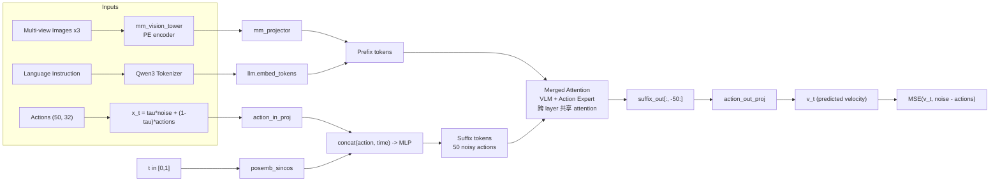
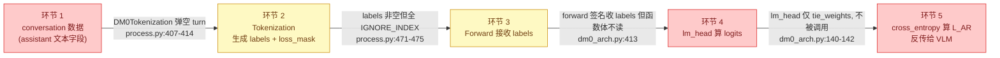

# DM0 辅助任务在 dexbotic 代码库中的实现分析

> 分析对象: [dm0.md](./dm0.md) 第 200-207 行所述的 **Embodied Spatial Scaffolding 4 层级辅助任务**
> 代码库: `d:/SRC/Robot/dexbotic/` (Dexmal 官方开源)
> 论文: [DM0_An_Embodied-Native_Vision-Language-Action_Model_towards_Physical_AI.pdf](./DM0_An_Embodied-Native_Vision-Language-Action_Model_towards_Physical_AI.pdf)

---

## 0. 核心结论 (TL;DR)

通过对 `d:/SRC/Robot/dexbotic/` 全量关键词检索 + DM0 相关 6 个核心文件 (共 ~2000 行) 的精读, 得出三点关键事实:

1. **论文承诺的 4 层级辅助任务在开源 dexbotic 中均未实现**.
   - Subtask prediction、Goal bbox prediction、EEF 2D trajectory prediction、Discrete action token prediction 这 4 项, 在 `dexbotic/` + `playground/` 子树下找不到任何模型层、数据层、loss 层的对应实现.
   - 关键字 `goal_bbox`、`waypoint`、`scaffold`、`chain.of.thought`、`spatial_cot`、`255-bin` **全库零匹配**; `subtask` 仅出现在 2 个数据转换脚本的 `extra` 元数据字段里, 不会被训练管线读取; `action_token` 仅出现在 pi0/pi05/oft/gr00tn1, **DM0 模块完全没有**.

2. **`dm0_prog_arch.py` 的 "Prog" 是 "Progress prediction" 而不是 "Progressive Scaffolding"**.
   - 它实现了一个 **0-1 数值** 的进度估计辅助通道 (`progress_in_proj` / `progress_out_proj`), 对应论文 3.3 节 Specialist 训练里的 progress supervision, **不是** 论文 2.3 节的层级文本 CoT.
   - 这个通道没有 loss 公式 (注释明确写 "for inference only"), 进度值在推理时由外部循环喂入, 模型反过来预测下一步进度, 形成 "进度自洽" 的反馈环.

3. **"text-as-everything" 在开源代码中被退化为 "action-as-everything"**.
   - `DM0Model.__init__` 里直接 `self.action_expert.model.embed_tokens = None`, 永久断绝 Action Expert 输出离散 token 的可能性.
   - `DM0ForCausalLM.forward()` 末尾只有一行 `loss = action_loss`(MSE Flow Matching loss), **完全没有** LM 自回归交叉熵 loss, 即使 `labels` 参数在签名里也只是被透传忽略.

下文按计划的 7 个章节展开论证, 每条结论都有精确到行号的代码引用作为证据.

---

## 1. 代码定位与文件清单

### 1.1 DM0 模型本体 (4 个文件)

| 文件 | 行数 | 职责 |
|---|---|---|
| `d:/SRC/Robot/dexbotic/dexbotic/model/dm0/__init__.py` | 16 | 把 `DM0Config / DM0ForCausalLM / DM0ProgConfig / DM0ProgForCausalLM` 注册到 transformers AutoConfig/AutoModel |
| `d:/SRC/Robot/dexbotic/dexbotic/model/dm0/dm0_arch.py` | 641 | 基础 DM0: Qwen3-VLM + Action Expert (Flow Matching), **唯一一份训练 forward** |
| `d:/SRC/Robot/dexbotic/dexbotic/model/dm0/dm0_prog_arch.py` | 576 | DM0 + 数值 progress 通道, **没有 forward 训练函数**, 只重写了推理路径 |
| `d:/SRC/Robot/dexbotic/dexbotic/model/dm0/dm0_utils.py` | 127 | sincos 时间 embedding + 4 种 attention mask 构造工具 |

### 1.2 数据 / Tokenization (3 个文件)

| 文件 | 行数 | 职责 |
|---|---|---|
| `d:/SRC/Robot/dexbotic/dexbotic/tokenization/conversation.py` | 270 | 5 个对话模板 (`dexbotic / step / llama_3 / qwen2-chat / vicuna`), **无任何 subtask/bbox/waypoint 模板** |
| `d:/SRC/Robot/dexbotic/dexbotic/tokenization/process.py` | 554 | 7 种 Tokenization 类, 其中 `DM0Tokenization` (368-483) 用于 DM0 |
| `d:/SRC/Robot/dexbotic/dexbotic/tokenization/tokenization.py` | 121 | 通用 `tokenizer_image_token` + `tokenize_dexbotic` |

### 1.3 实验入口与 SFT 配置 (3 个文件)

| 文件 | 职责 |
|---|---|
| `d:/SRC/Robot/dexbotic/dexbotic/exp/dm0_exp.py` | DM0 实验基类, 定义 `DM0DataConfig.data_keys`, `DM0Tokenization`, action 预处理 Pipeline |
| `d:/SRC/Robot/dexbotic/playground/benchmarks/libero/libero_dm0.py` | LIBERO 仿真 SFT 入口 |
| `d:/SRC/Robot/dexbotic/playground/benchmarks/table30/dm0_stack_bowls.py` | RoboChallenge Table30 (stack_bowls 任务) Specialist SFT 入口 |

### 1.4 文档对照

| 文件 | 备注 |
|---|---|
| `d:/SRC/Robot/dexbotic/docs/DM0.md` | DM0 官方教程, **从未提及** subtask/bbox/waypoint/CoT, 只讲 Flow Matching + checkpoint 下载 + 评测脚本 |
| `d:/SRC/Robot/dexbotic/docs/Dexbotic_Tech_Report.pdf` | Dexbotic 大技术报告 (128109 行的 PDF) |

### 1.5 关键词全库扫描证据

为了排除 "我没找到" ≠ "代码里没有" 的可能性, 这里列出对全库做的 4 次精确扫描:

```text
搜索范围: d:/SRC/Robot/dexbotic/dexbotic + d:/SRC/Robot/dexbotic/playground
工具: rg (ripgrep, case-insensitive)

(1) goal_bbox | goal_box | target_bbox | target_box
    -> 0 files matched

(2) waypoint | gripper.*trace | 2d_traj | trace_2d | eef_2d
    -> 0 files matched

(3) scaffold | chain.of.thought | spatial_cot
    -> 0 files matched

(4) action_token | discrete_action_token | action_vocab | 255.*bin | n_action_bins (限定在 dexbotic/model/dm0/ 子目录)
    -> 0 files matched
    (注: 全局 action_token 在 pi0/pi05/oft/gr00tn1 模型里有, 但 dm0 模块完全没有)

(5) subtask (全库)
    -> 仅 2 个匹配, 均在数据转换脚本里:
       script/convert_data/convert_lerobot_to_dexdata.py (line 140-168)
       hardware/so101/convert_so101_to_dexdata.py (line 92-101)
    上下文显示 subtask 是 prompt 字符串 "Chinese@English" 切分后的子串, 写入 jsonl 的 extra 字段.
    DM0DataConfig.data_keys 不包含 "extra" 或 "subtask", 所以从未被训练读到.
```

这些零匹配 / 旁路匹配的事实, 是后文所有 "代码里没有 X" 论断的**经验证据**.

---

## 2. DM0 模型架构概览 (代码视角)

### 2.1 类层级与初始化

`DM0Model` 在 `__init__` 中只构建 4 类参数模块:

```77:91:d:/SRC/Robot/dexbotic/dexbotic/model/dm0/dm0_arch.py
        # Build action expert (Qwen3ForCausalLM without embed_tokens)
        action_model_config = config.action_config
        self.action_expert = Qwen3ForCausalLM(action_model_config)
        self.action_expert.model.embed_tokens = None

        action_hidden = action_model_config.hidden_size

        # Action projection layers
        self.action_in_proj = nn.Linear(config.action_dim, action_hidden)
        self.action_out_proj = nn.Linear(action_hidden, config.action_dim)

        # Time MLP layers
        self.action_time_mlp_in = nn.Linear(2 * action_hidden, action_hidden)
        self.action_time_mlp_out = nn.Linear(action_hidden, action_hidden)
```

要点:
- `self.action_expert` 是第二个 `Qwen3ForCausalLM`, 但 `model.embed_tokens = None` —— **它无法把任何整数 token 映射成 embedding**, 因此结构上就排除了 "Action Expert 输出/接收离散 token" 的可能性.
- 没有 `bbox_head`、`waypoint_head`、`subtask_head`、`affordance_head` 等任何辅助任务专用 head.
- `lm_head` 在 `_real_init` 里被构造出来, 但只是为了 `tie_weights` 兼容父类:

```140:143:d:/SRC/Robot/dexbotic/dexbotic/model/dm0/dm0_arch.py
        # Add lm_head for compatibility with parent class tie_weights
        self.lm_head = nn.Linear(
            config.llm_config.hidden_size, config.llm_config.vocab_size, bias=False
        )
```

### 2.2 训练 forward 的 loss 部分

`DM0ForCausalLM.forward()` 末尾 (`d:/SRC/Robot/dexbotic/dexbotic/model/dm0/dm0_arch.py` 第 406-511 行) 只算一种 loss:

```495:511:d:/SRC/Robot/dexbotic/dexbotic/model/dm0/dm0_arch.py
        # Compute flow matching loss
        if actions.dtype == torch.float32:
            suffix_out = suffix_out.to(torch.float32)
        suffix_out_final = suffix_out[:, -self.model.config.chunk_size :]
        v_t = self.model.action_out_proj(suffix_out_final)
        action_loss = F.mse_loss(v_t, u_t, reduction="mean")

        loss = action_loss

        outputs = CausalLMOutputDexbotic(
            loss=loss,
            logits=v_t,
            past_key_values=past_key_values,
            hidden_states=None,
            attentions=None,
        )
        return outputs
```

要点:
- `loss = action_loss`, **没有** `+ lm_loss`、`+ aux_loss`、`+ bbox_loss` 等任何附加项.
- `forward()` 的签名 (407-423 行) 接受 `labels: Optional[torch.LongTensor] = None`, 但函数体里 **`labels` 这个变量从未被读取**, 只是符合 transformers 接口规范的占位.
- `v_t` 是预测的速度场, `u_t = noise - actions` 是 Flow Matching 的目标速度 (见 442-443 行).

### 2.3 数据流总览 (mermaid)



整张图里 **完全没有** subtask / bbox / waypoint / discrete-action-token 的任何路径.

---

## 3. 论文 4 层级辅助任务 vs 代码实现 (逐项对照)

> 论文原文 (dm0.md 200-207):
>
> > **Embodied Spatial Scaffolding 的层次化辅助任务** (都通过 L_AR 监督):
> > 1. **Subtask prediction**: 预测细粒度子任务描述
> > 2. **Goal bounding box prediction**: 预测目标物体/区域的 bbox
> > 3. **End-effector trajectory prediction**: 预测主视角下未来若干帧的 EEF 2D 轨迹
> > 4. **Discrete action prediction**: 预测离散 action token

### 3.1 (i) Subtask Prediction (子任务文本预测)

- **论文版本**: 由 VLM 自回归预测细粒度子任务文本, 例如 *"pick up the blue dinosaur toy from the right bin and place it in the left bin"*. 损失走 `L_AR` (cross-entropy).
- **代码现状**:
  - DM0 训练流水线的 `data_keys` 只有 6 个键, **不包含** subtask 字段:

    ```269:279:d:/SRC/Robot/dexbotic/dexbotic/exp/dm0_exp.py
    @dataclass
    class DM0DataConfig(DataConfig):
        num_images: int = field(default=3)
        data_keys: list[str] = field(
            default_factory=lambda: [
                "input_ids",
                "labels",
                "action",
                "image",
                "state",
                "image_masks",
            ]
    ```
  - 唯一出现 `subtask` 字面量的位置在数据转换脚本里, 仅作为 jsonl 的 `extra` 元数据存盘, **不会进入训练**:

    ```140:170:d:/SRC/Robot/dexbotic/script/convert_data/convert_lerobot_to_dexdata.py
            # NOTE: subtask schema is Chinese@English
            if len(task_list[task_index].split("@")) != 2:
                print(f"Invalid task format: {task_list[task_index]}")
                data_list = None
                break
            subtask = task_list[task_index].split("@")[1]
            data_list.append(
                {
    ```
  - `DM0Tokenization` (`dexbotic/tokenization/process.py` 第 368-483 行) 在 SFT 模式下会主动把空的 assistant turn 弹掉:

    ```408:414:d:/SRC/Robot/dexbotic/dexbotic/tokenization/process.py
            # Remove empty trailing assistant turn if present (requested for OpenPI alignment)
            conversations = list(conversations)
            if (
                conversations
                and conversations[-1].get("from") == "gpt"
                and not conversations[-1].get("value")
            ):
                conversations.pop()
    ```

    这意味着即使 conversation list 留了 gpt 占位, 也会被删掉, 永远不会触发 assistant 文本侧的 loss.
- **结论**: 完全未实现. 即使用户在 jsonl 里写了 subtask 字段, dexbotic 的 DM0 也不会把它作为训练目标 —— 既无 head, 也无 loss, 数据层也不读.

### 3.2 (ii) Goal Bounding Box Prediction (目标 bbox 文本预测)

- **论文版本**: 预测 `[xmin, ymin, xmax, ymax]` (归一化到 0-1000) 的目标物体/区域 bbox, 走 `L_AR` 让 VLM 把 bbox 数字当作文本输出.
- **代码现状**:
  - 全库零匹配 (见 1.5 节扫描结果).
  - 没有任何 `BboxNorm` / `AddGoalBox` / `bbox_loss` / `grounding_loss` / `box_token` 之类的代码.
  - `dexbotic/data/dataset/transform/` 子目录下的 transform 只处理 action / state / 图像 / 多模态加载, **没有 bbox 处理 transform**.
- **结论**: 完全未实现.

### 3.3 (iii) End-effector 2D Trajectory Prediction (末端 2D 屏幕轨迹预测)

这一项 **最容易被误解**, 因为代码里有一个名字叫 `AddTrajectory` 的 transform, 看起来跟论文一致. 实际上完全不是同一回事.

- **论文版本**: 预测主视角图像 (camera frame) 下未来若干帧的 EEF 屏幕坐标 `(x, y) (x, y) ...`, 是一个 **2D 屏幕空间序列**, 由 VLM 以文本形式自回归输出 (论文 Figure 3 的 Dual Arm 示例: `"main arm gripper: (x,y) (x,y) ..."`).
- **代码版本 (`AddTrajectory`)**: 把高维动作向量 (32D) 沿时间维度做 chunk 拼接, 输出形状 `[N, T, D=32]`, **完全在 action 空间**, 与图像 / 屏幕坐标无关.

  关键代码:

  ```156:212:d:/SRC/Robot/dexbotic/dexbotic/data/dataset/transform/action.py
  class AddTrajectory:
      """Add the trajectory to the episode_data_dict by shifting the action.

         Will add the `trajectory` to the episode_data_dict and replace the `action` with `trajectory`.

         Have no effect if the `action` is not in the episode_data_dict.
      """

      def __init__(self,
                   trajectory_length: int = 10,
                   flatten: bool = True,
                   padding_mode: str = 'last',
                   padding_action: bool = False):
          ...

      def __call__(self, episode_data_dict: dict, **kwargs) -> dict:
          if 'action' not in episode_data_dict:
              return episode_data_dict
          ...
          trajectory = [action]
          for i in range(1, self.trajectory_length):
              _next_action = np.copy(action[i:])
              _next_action = self.pad(_next_action, len(action), non_delta_mask)

              trajectory.append(_next_action)
          trajectory = np.stack(trajectory, axis=-1)  # shape: N D T
          # reshape to N T D than N (T * D)
          trajectory = np.transpose(trajectory, (0, 2, 1))
          ...
          trajectory = trajectory[:valid_trajectory_length]
          episode_data_dict['trajectory'] = trajectory
          episode_data_dict['action'] = trajectory
          return episode_data_dict
  ```

  注意第 211 行 `episode_data_dict['action'] = trajectory` —— `AddTrajectory` 输出的 "trajectory" **直接就是 action chunk**, 在两个 SFT 配置里都接 `DeltaAction + ActionNorm` 进入 Flow Matching:

  ```117:122:d:/SRC/Robot/dexbotic/playground/benchmarks/libero/libero_dm0.py
                  AddTrajectory(trajectory_length=50, flatten=False, padding_mode="last"),
                  DeltaAction(enable=True),
                  ActionNorm(statistic_mapping=statistic_mapping),
                  LoadMultiModal(return_masks=True),
                  ToList(),
              ]
          )
  ```

  ```117:122:d:/SRC/Robot/dexbotic/playground/benchmarks/table30/dm0_stack_bowls.py
                  AddTrajectory(trajectory_length=50, flatten=False, padding_mode="last"),
                  DeltaAction(enable=True),
                  ActionNorm(statistic_mapping=statistic_mapping, use_quantiles=True),
                  LoadMultiModal(return_masks=True),
                  ToList(),
              ]
          )
  ```

- **结论**: `AddTrajectory` 是 **action chunk 长度对齐 + 时间维滚动** 的实用工具, 与论文里的 "屏幕空间 EEF 2D waypoint 文本预测" **没有任何关系**. 论文版本的 EEF 2D trajectory prediction 完全未实现.

### 3.4 (iv) Discrete Action Token Prediction (离散动作 token 预测)

- **论文版本**: 把每段动作量化到 255-bin, 注册成 LLM 词表里的特殊 token, 由 VLM 自回归预测, 走 `L_AR`.
- **代码现状**:
  - `Qwen3ForCausalLM` 词表没有扩展 255 个 action token 的痕迹 (没有 resize_token_embeddings 调用, 也没有 `add_special_tokens(["<act_0>", ...])` 之类的代码).
  - Action Expert 的 `embed_tokens = None` (`dm0_arch.py` 第 80 行) **直接断绝** 这条路径: 即使有人想往 Action Expert 喂 action token, 也无法通过 embedding 层.
  - DM0 的 forward 完全没有自回归 loss (见 2.2 节).
  - 全库扫描 `n_action_bins` / `255.*bin` / `discrete_action_token` 在 `dexbotic/model/dm0/` 下零匹配.
- **结论**: 完全未实现. 论文里 "VLM 自回归预测离散 action token + 量化解码回连续动作" 这条线在 dexbotic 中根本不存在.

### 3.5 4 项对照总表

| 论文辅助任务 | dexbotic 是否实现 | 等价物 / 近似物 | 关键代码位置 |
|---|---|---|---|
| (i) Subtask prediction | 否 | `subtask` 仅作为 jsonl `extra` 元数据存盘, 训练不读 | `script/convert_data/convert_lerobot_to_dexdata.py:140-170` |
| (ii) Goal bbox prediction | 否 | 无任何近似 | — |
| (iii) EEF 2D trajectory prediction | 否 | `AddTrajectory` 是 **action chunk** 拼接, 名同实异 | `dexbotic/data/dataset/transform/action.py:156-226` |
| (iv) Discrete action token prediction | 否 | 无任何近似, 反被 `action_expert.model.embed_tokens = None` 永久断路 | `dexbotic/model/dm0/dm0_arch.py:79-80` |

---

## 4. 开源代码实际实现的等价物

虽然 4 项辅助任务都没实现, dexbotic 的 DM0 模块里 **真实存在两条训练 / 推理目标**, 都不在论文 2.3 节的 4 项里:

### 4.1 Flow Matching 连续动作回归 (基础, 在 `dm0_arch.py`)

完整训练路径:

```426:511:d:/SRC/Robot/dexbotic/dexbotic/model/dm0/dm0_arch.py
        batch_size = actions.shape[0]

        # Sample noise and time
        noise = torch.normal(
            mean=torch.zeros_like(actions),
            std=torch.ones_like(actions),
        ).to(device=actions.device, dtype=actions.dtype)

        time = (
            torch.distributions.Beta(1.5, 1.0).sample((batch_size,)).to(actions.device)
            * 0.999
            + 0.001
        ).to(dtype=actions.dtype)

        # Flow matching interpolation
        time_expanded = time[..., None, None]
        x_t = time_expanded * noise + (1 - time_expanded) * actions
        u_t = noise - actions
        ...
        suffix_out_final = suffix_out[:, -self.model.config.chunk_size :]
        v_t = self.model.action_out_proj(suffix_out_final)
        action_loss = F.mse_loss(v_t, u_t, reduction="mean")

        loss = action_loss
```

亮点:
- Time `t` 用 `Beta(1.5, 1.0)` 分布采样 (435 行), 偏向 `t≈1` 即更难的高噪声区, 这是 π0 系列的标准做法.
- 速度场目标 `u_t = noise - actions` (443 行) 是经典 rectified flow 形式.
- Inference 用 Euler 采样, 默认 `diffusion_steps=10` (`dm0_arch.py` 第 521 行), 反向 `dt = -1/10` (529 行).

### 4.2 数值 Progress 通道 (扩展, 在 `dm0_prog_arch.py`)

这就是论文 3.3 节 Specialist 训练里那句 "progress supervision was applied to enhance learning efficacy" 的对应实现. 它跟论文 2.3 节的 4 层级 CoT **不是一回事** (CoT 走文本, progress 走数值).

完整路径:

(a) 模型多出两层数值投影:

```93:95:d:/SRC/Robot/dexbotic/dexbotic/model/dm0/dm0_prog_arch.py
        # Progress projection layers
        self.progress_in_proj = nn.Linear(1, action_hidden)
        self.progress_out_proj = nn.Linear(action_hidden, 1)
```

(b) `get_suffix_hidden_states` 把进度值 embedding 拼到 action token 序列前面:

```380:395:d:/SRC/Robot/dexbotic/dexbotic/model/dm0/dm0_prog_arch.py
        # Action embedding
        action_hidden_states = self.model.action_in_proj(noisy_actions)

        if progress is not None:
            # Progress embedding
            progress_emb = self.model.progress_in_proj(progress)
            # Fuse action + progress
            action_hidden_states = torch.cat([progress_emb, action_hidden_states], dim=1)

        # Fuse time + action
        time_embeddings_expanded = time_embeddings[:, None, :].expand_as(
            action_hidden_states
        )
        fused_hidden_states = torch.cat(
            [action_hidden_states, time_embeddings_expanded], dim=2
        )
```

注意 `progress_emb` 的位置: 在 action chunk 序列的 **第一个位置**, 长度 1.

(c) 推理时按 Euler 步反复回读进度:

```485:506:d:/SRC/Robot/dexbotic/dexbotic/model/dm0/dm0_prog_arch.py
        # Euler sampling loop
        end_progress_list = []
        while time >= -dt / 2:
            noise, time, end_progress = self._denoise_step(
                x_t=noise,
                time=time,
                dt=dt,
                batch_size=batch_size,
                prefix_padding_mask=prefix_padding_mask,
                prefix_attn_mask=prefix_attn_mask,
                module_list=module_list,
                kv_cache=kv_cache,
                begin_progress=begin_progress,
            )
            if end_progress is not None:
                end_progress_list.append(end_progress)

        if progress is not None:
            # Return minimum progress across all steps
            end_progress, _ = torch.min(torch.stack(end_progress_list), dim=0)
            return noise, end_progress
        else:
            return noise
```

(d) `_denoise_step` 在每一步都从 action chunk **左侧第一个 token** 取出隐藏态预测下一步 progress:

```566:576:d:/SRC/Robot/dexbotic/dexbotic/model/dm0/dm0_prog_arch.py
        v_t = self.model.action_out_proj(suffix_out[:, -self.model.config.chunk_size :])

        # Progress prediction
        end_progress = None
        if begin_progress is not None:
            end_progress = self.model.progress_out_proj(
                suffix_out[:, -self.model.config.chunk_size - 1 : -self.model.config.chunk_size]
            )

        return x_t + v_t * dt, time + dt, end_progress
```

切片 `[:, -chunk_size-1 : -chunk_size]` 正好是 `progress_emb` 在 suffix 里的位置 (action chunk 之前的第 1 个 token).

**重要事实**: `dm0_prog_arch.py` 整个文件里 **没有** `forward()` 方法, 即没有训练 loss. 文件头注释明确写了 "with progress prediction support for **inference only**" (第 4 行). 这意味着:

- 训练阶段, 数值 progress 通道的权重 (`progress_in_proj` / `progress_out_proj`) 要么从一个外部预训练好的 checkpoint 加载, 要么必须由用户自己写 forward + loss 来训.
- 开源 dexbotic 没给出 progress 的训练入口, 用户在公开仓库里只能拿来做 inference.

### 4.3 真实 loss 总览

| 模型 | 训练 loss | 来源 |
|---|---|---|
| `DM0ForCausalLM` (基础) | 仅 `F.mse_loss(v_t, u_t)` (Flow Matching) | `dm0_arch.py:500` |
| `DM0ProgForCausalLM` | **没有 forward 方法**, 不可直接训练 | `dm0_prog_arch.py` (无 forward) |

**论文里的 `L_AR (text + discrete action token + subtask + bbox + waypoint)` 在开源 dexbotic 中完全不存在**. 这是核心断点.

---

## 5. 数据 / 标签到模型的流向 (代码追踪)

### 5.1 数据流图

```mermaid
flowchart TB
    Raw["Raw episodic JSONL<br/>(image refs, action, state, prompt, extra=subtask...)"]
    Raw -->|DexDataset.__getitem__| Conv["DM0Tokenization<br/>process.py:368-483"]
    Raw -->|action_process_func| ActPipe["Action Pipeline:<br/>AddAction -> PadState -> PadAction<br/>-> AddTrajectory(50) -> DeltaAction<br/>-> ActionNorm -> LoadMultiModal -> ToList"]

    Conv -->|input_ids, labels| Batch
    ActPipe -->|action 32d x 50, state, image, image_masks| Batch

    Batch[Batch dict<br/>data_keys = {input_ids, labels, action, image, state, image_masks}]
    Batch --> FW["DM0ForCausalLM.forward()"]

    FW -->|input_ids, attention_mask, images, image_masks| Prefix["get_prefix_hidden_states<br/>image -> PE -> projector + text -> embed_tokens"]
    FW -->|actions, sampled noise, sampled time| Suffix["get_suffix_hidden_states<br/>action_in_proj + sincos time -> MLP fuse"]

    Prefix --> Merged[Merged Attention<br/>VLM + Action Expert]
    Suffix --> Merged
    Merged --> Vt["v_t = action_out_proj(suffix_out[-50:])"]
    Vt --> Loss[MSE Flow Matching loss]

    Drop["labels (从 DM0Tokenization 来)<br/>没有任何 loss 消费它"]
    Batch -.被 forward 接收但未读取.-> Drop
```

### 5.2 关键 "断点" 说明

整条 pipeline 里有 3 处 **"插槽空了"** 的位置, 正好对应论文 4 个辅助任务:

1. **`extra.subtask` -> 训练**: `convert_lerobot_to_dexdata.py:168` 把 subtask 写进 `extra`, 但 `DM0DataConfig.data_keys` (`dm0_exp.py:270-279`) 不读 `extra`, 链断在数据加载侧.
2. **`labels` -> loss**: `DM0Tokenization` 会输出 `labels`, 也确实进了 batch, 但 `DM0ForCausalLM.forward` 函数体内 **从不读取 `labels`**, 链断在 loss 侧.
3. **bbox / waypoint -> 任何环节**: 数据 transform 没有对应 transform, 模型也没有对应 head, 链 **从未存在过**.

这 3 处断点共同决定了论文承诺的 "4 层级辅助 + L_AR" 完全无法在 dexbotic 上跑起来.

### 5.3 唯一被使用的 `labels` 通道

值得指出, `DM0Tokenization.__call__` (`process.py:386-483`) **的确生成了带 IGNORE_INDEX 掩码的 labels**, 并在如下逻辑里只对 assistant 内容计算 loss:

```450:454:d:/SRC/Robot/dexbotic/dexbotic/tokenization/process.py
            # Loss only on assistant responses
            if role == roles["gpt"]:
                loss_mask.extend([True] * len(content_tokens))
            else:
                loss_mask.extend([False] * len(content_tokens))
```

也就是说, **infrastructure 上是支持 LM 监督的**, 数据层会给出正确的 labels, 但模型层 forward 不消费 —— 这是一个非常典型的 **"两端预留接口, 中间没接通"** 的状态. 二次开发时只要把 lm loss 项加回 forward, 链路就能立即打通.

---

## 6. "text-as-everything" 设计在开源代码中的偏差

### 6.1 论文承诺 vs 代码实际

| 维度 | 论文 (dm0.md 200-207) | dexbotic 代码 |
|---|---|---|
| 子任务监督 | `L_AR` 文本预测 | 不存在 |
| 目标 bbox | `L_AR` 文本预测 (bbox 数字当文本) | 不存在 |
| EEF 2D 轨迹 | `L_AR` 文本预测 (`(x,y) (x,y) ...` 字符串) | 不存在 (`AddTrajectory` 是 action 空间, 不是 2D 屏幕空间) |
| 离散 action token | `L_AR` 自回归 + 反量化回连续 | 不存在 (`embed_tokens=None` 永久断路) |
| 连续动作 | Flow Matching 回归 | **唯一实际训练目标** |
| 进度估计 | 论文 3.3 节作为 "progress supervision" | `dm0_prog_arch.py` 的数值通道, **仅支持推理** |

形象地讲, 论文的 "text-as-everything" 在开源里被改写成了 **"action-MSE-as-everything"**.

### 6.2 设计偏差导致的实践影响

- **复现 RoboChallenge Specialist 排名**: 论文 Table 1 给的 62.0% 平均成功率, 是带完整 4 层级辅助 + 模板增广 + progress supervision 的版本; 用户用开源 dexbotic 直接跑, 等于跑了一个 "无 CoT 辅助的精简 DM0", 数字大概率会比论文低.
  - 旁证: `docs/DM0.md` 给的 RoboChallenge 数字 (例如 stack_bowls 100% / arrange_fruits 100%) 是 **官方 checkpoint** 的评测, 不是从开源代码训出来的, 因此不能反推 "开源代码能直接复现这些数字".
- **二次开发 / 自定义辅助任务**: 想加一个 "预测末端目标朝向" 之类的辅助任务, 用户必须改 `DM0DataConfig.data_keys` + 加 transform + 改 conversation 模板 + 改 `DM0ForCausalLM.forward` 加 loss + 改 `DM0Tokenization` 处理新模板. 这个改动量不算小.
- **理解模型行为**: 用户读论文以为模型会 "先想再做", 但实际推理只跑 Flow Matching denoising 10 步, 不输出任何文本. 这种 "论文看似双模式, 代码只剩一种" 的差异容易让排查 bug 走弯路.

### 6.3 偏差的可能解释 (推测, 非定论)

下面 3 点是 **基于代码注释 + 项目结构的合理推测**, 论文与开源 README 没有给出官方解释:

1. **论文 2.3 节描述的可能是 mid-training 阶段的训练配方**, 而开源 dexbotic 主要释放的是 **Specialist SFT 流程 + base checkpoint**. mid-training 数据 (`200M 样本, 含 ER / 子任务 / bbox / waypoint`) 对算力 / 数据策展的要求都很高, 可能不在开源范围内.
2. **`DM0-base` checkpoint 内部仍有这 4 项辅助监督的"残留能力"** (因为它是从论文 mid-train 蒸馏出来的), 所以即使 SFT 阶段不再做这些辅助, 推理时依然能从 prompt 里 "听懂" 子任务级指令.
3. **Dexbotic 工具箱的定位是 "通用 VLA toolbox"**, 不是 "DM0 完整复现", 因此把 DM0 简化成 "Qwen3-VLM + Flow Matching Action Expert" 这一最小可运行子集是合理的工程取舍.

---

## 7. 复现完整论文设计需补齐的代码 (推测)

> 以下清单是基于论文描述和现有代码空缺的 **设计推测**, 不是 dexbotic 已经规划好的 roadmap. 仅作为社区贡献 / 二次开发的参考切入点.

### 7.1 数据层补齐

- **新增数据字段**: 在 `DM0DataConfig.data_keys` (`dexbotic/exp/dm0_exp.py:270-279`) 中加入 `subtask_text`, `goal_bbox`, `eef_trace_2d`, `discrete_action_token` 等键.
- **新增 transform**: 在 `dexbotic/data/dataset/transform/` 下增加
  - `AddSubtaskText`: 从 jsonl `extra.subtask` 提取并随机拼到 prompt 后面.
  - `AddGoalBox`: 把 bbox 归一化到 0-1000 整数, 序列化为 `[xmin, ymin, xmax, ymax]` 文本.
  - `AddEEFTrace2D`: 把 EEF 在主视角相机下的 3D 位置投影成 2D 屏幕坐标, 序列化为 `(x, y) (x, y) ...` 文本.
  - `DiscreteActionTokenizer`: 把 action chunk 量化到 255-bin, 输出 token id 序列.
- **数据转换脚本**: `convert_lerobot_to_dexdata.py` / `convert_so101_to_dexdata.py` 已经把 `subtask` 写到 `extra`, 复用即可; bbox / waypoint 需要从相机标定 + 末端 pose 重新计算.

### 7.2 Tokenization / 模板层补齐

- 在 `dexbotic/tokenization/conversation.py` 增加多个对话模板:
  - 子任务模板: `"USER: ...task instruction... ASSISTANT: <subtask>{text}</subtask>"`
  - bbox 模板: `"USER: locate ...; ASSISTANT: <bbox>[x1,y1,x2,y2]</bbox>"`
  - waypoint 模板: `"USER: ...; ASSISTANT: <traj>main gripper: (x,y) (x,y) ...</traj>"`
  - action token 模板: `"USER: ...; ASSISTANT: <act>{tokens...}</act>"`
- 论文里说一个场景准备 500 条模板做语言侧增广, 这部分需要专门工程化的模板库.
- `DM0Tokenization` 需要把 `loss_mask=True` 的范围扩展到所有 assistant 段, 而不是把空 assistant turn 弹掉.

### 7.3 LLM 词表扩展

- 在 LLM tokenizer 中 `add_special_tokens(["<act_0>", ..., "<act_254>", "<bbox_0>", ..., "<bbox_999>"])`.
- 调用 `model.resize_token_embeddings(new_vocab_size)`.
- 注意 LLM 与 Action Expert 二者的词表不一定共享 (Action Expert 在 dm0 里 `embed_tokens=None`), 需要决策 token 在哪个 head 输出.

### 7.4 模型层补齐

- **恢复 Action Expert 的 token 能力** (如果走论文的离散动作路线): 把 `dm0_arch.py:80` 的 `self.action_expert.model.embed_tokens = None` 删掉, 让 Action Expert 既能输出 token 又能输出连续值.
- **或者**: 让所有辅助 token 都从 LLM 端输出, Action Expert 只回归连续动作 (这是更简洁的工程方案, 也更贴近论文 "VLM 端做所有文本/token 预测" 的描述).
- **加 lm loss 项**: 在 `dm0_arch.py:495-502` 之间加上类似:

  ```python
  # 推测的补齐代码 (示意)
  lm_logits = self.lm_head(prefix_out[:, -text_seq_len:])
  lm_loss = F.cross_entropy(lm_logits.view(-1, vocab_size), labels.view(-1), ignore_index=IGNORE_INDEX)
  loss = action_loss + lambda_ar * lm_loss
  ```

  其中 `lambda_ar` 论文取 1.

### 7.5 Mid-training 数据集 + 配方

- 引入论文 Figure 3 提到的 5 大类: VL / ER / Sim / 单臂 / 双臂数据.
- 写专门的 ER 数据生成器: 任务分解 / 子任务预测 / Action QA / 时序推理 / 进度估计.
- 数据配比管理: 论文 Figure 4 给了饼图, 实际比例需要消融实验确定.

### 7.6 整体复现 roadmap (粗略)

按上述 5 个维度全部补齐, 大致需要:

1. 1-2 周: 数据 transform + tokenizer 词表扩展 + 模板库.
2. 1 周: 模型 loss 与 head 改造, 单元测试.
3. 2-4 周: mid-training 数据 200M 样本的策展 (这是最耗时的部分).
4. 1-2 周: 训练超参 + 多机调试 + checkpoint 收敛验证.
5. 1 周: 在 LIBERO / Table30 上对照评测.

---

## 附录 A: dm0.md 第 200-207 行原文

```200:207:./dm0.md
**Embodied Spatial Scaffolding 的层次化辅助任务**(都通过 L_AR 监督):
1. **Subtask prediction**:预测细粒度子任务描述
2. **Goal bounding box prediction**:预测目标物体/区域的 bbox
3. **End-effector trajectory prediction**:预测主视角下未来若干帧的 EEF 2D 轨迹
4. **Discrete action prediction**:预测离散 action token

> 这里**没有**单独的 affordance head,也没有专门的 reward / value head;一切辅助监督都通过自回归文本预测来实现 —— 这是一种"text-as-everything"的简洁设计。
```

## 附录 B: 主要代码引用一览

为方便检索, 这里把全文用到的所有代码引用集中列出:

- `dexbotic/model/dm0/__init__.py` (16 行): AutoConfig / AutoModel 注册.
- `dexbotic/model/dm0/dm0_arch.py:35-92`: `DM0Config` + `DM0Model.__init__`, 包含 `embed_tokens = None` 关键一行.
- `dexbotic/model/dm0/dm0_arch.py:128-143`: `DM0ForCausalLM._real_init`, lm_head 仅做 tie_weights 兼容.
- `dexbotic/model/dm0/dm0_arch.py:355-404`: `get_suffix_hidden_states`, 没有 progress 通道.
- `dexbotic/model/dm0/dm0_arch.py:406-511`: 训练 forward, **唯一 loss = MSE Flow Matching**.
- `dexbotic/model/dm0/dm0_arch.py:513-583`: `inference_action`, Euler 采样, 默认 10 步.
- `dexbotic/model/dm0/dm0_prog_arch.py:73-97`: `DM0ProgModel.__init__`, 多了 `progress_in_proj` / `progress_out_proj`.
- `dexbotic/model/dm0/dm0_prog_arch.py:360-416`: `get_suffix_hidden_states` (含 progress).
- `dexbotic/model/dm0/dm0_prog_arch.py:418-506`: `inference_action` (含 progress 反馈环).
- `dexbotic/model/dm0/dm0_prog_arch.py:508-576`: `_denoise_step` (含 progress 输出).
- `dexbotic/tokenization/process.py:368-483`: `DM0Tokenization`, 含 `loss_mask` 生成与空 assistant 弹出.
- `dexbotic/data/dataset/transform/action.py:156-226`: `AddTrajectory`, **action chunk** 处理, 名同实异.
- `dexbotic/exp/dm0_exp.py:267-313`: `DM0DataConfig`, 关键 `data_keys` 列表.
- `playground/benchmarks/libero/libero_dm0.py:104-124`: LIBERO Specialist 的 action Pipeline.
- `playground/benchmarks/table30/dm0_stack_bowls.py:104-125`: Table30 Specialist 的 action Pipeline.
- `script/convert_data/convert_lerobot_to_dexdata.py:140-170`: `subtask` 写入 `extra` (但训练不读).

## 附录 C: 全库关键词扫描结果汇总

| 关键词 | 范围 | 命中文件 |
|---|---|---|
| `goal_bbox` / `goal_box` / `target_bbox` / `target_box` | 全库 | 0 |
| `waypoint` / `gripper.*trace` / `2d_traj` / `trace_2d` / `eef_2d` | 全库 | 0 |
| `scaffold` / `chain.of.thought` / `spatial_cot` | 全库 | 0 |
| `n_action_bins` / `255.*bin` / `discrete_action_token` / `action_vocab` | 全库 | 0 |
| `action_token` | 全库 | 8 (pi0/pi05/oft/gr00tn1/rl), **dm0 模块为 0** |
| `subtask` | 全库 | 2 (均为数据转换脚本的 `extra` 字段) |
| `progress` (作为 nn.Module 名出现) | 全库 | 仅 `dm0_prog_arch.py` (`progress_in_proj` / `progress_out_proj`) |

最后一栏是论文与代码差异的**完整经验证据**: 在论文承诺的 4 项辅助任务中, **没有任何一项** 在 dexbotic 代码里有真实可用的实现路径; **唯一被代码化** 的辅助通道, 是论文 3.3 节里只占一行的 progress supervision —— 而且开源版本只支持推理, 不开源训练代码.

---

## 8. L_AR (自回归交叉熵) 在 dexbotic 代码库中的实现分析

第 1-7 章把目光放在论文 3.3 节"Embodied Spatial Scaffolding 4 项辅助任务"上, 给出的结论是**全部缺失**. 本章把同一把"显微镜"对准比辅助任务更上位的概念 —— 论文 3.4 节的总训练目标:

```text
L_total(θ) = λ · L_AR(θ) + L_FM(θ),    λ = 1
- L_AR (自回归交叉熵): 监督 VLM 预测 (具身推理文本 + 离散 action token)
- L_FM (Flow Matching):   监督 Action Expert 输出连续动作向量场
```

这条公式相当于 DM0 论文给出的"训练损失 ABI". 第 7 章已经间接揭示 `L_AR` 在 DM0 代码中没有真实实现; 本章将以 `L_AR` 为主语, 系统给出"缺在哪里 / 没缺在哪里 / 想补怎么补"的全链路证据.

### 8.0 核心结论 (一段话先把答案说完)

精读 DM0 模型代码 + 基类 + 数据层 + 4 个兄弟模型后, 关于 `L_AR` 的实现状况可归纳为 4 点:

1. **DM0 没实现 L_AR**. `DM0ForCausalLM.forward()` 完整 override 了基类 forward, 既不调 `super().forward()` 也不调 `self.loss_function()`, 训练阶段唯一返回的 `loss = action_loss` 只是 Flow Matching MSE.
2. **基类有 L_AR 实现, 但被 DM0 主动绕过**. `DexboticForCausalLM.forward()` 的 `if labels is not None: loss = self.loss_function(logits, labels, vocab_size)` 是 transformers 标准 fused cross_entropy, 任何"不 override forward"的子类都会自动得到 `L_AR`. DM0 选择的是"直接重写".
3. **数据层早已准备好 L_AR 所需的标签**. `DM0Tokenization` 已经按 `IGNORE_INDEX` 规则生成了完整的 `labels` 张量, 字段名甚至跟 transformers 完全对齐 —— 但 forward 不读取, 这些 labels 被白做.
4. **dexbotic 兄弟模型里**, `L_AR` **既有"纯文本 / 纯离散动作 token"的范本** (`oft_discrete_arch.py`, `navila/loss.py`), **也有"L_AR + L_FM 双 loss 共存"的范本** (`hybrid_pi05_arch.py`, `cogact/hybrid_cogact_arch.py`), 完全可作为 DM0 补齐 `L_AR` 的现成模板.

简短一句话: **L_AR 在 DM0 代码里是"四端预留, 一处断路"**. 后面 8.1-8.8 节给出全部证据与行号.

### 8.1 dm0.md 中 L_AR 的精确出现位置

为便于对照, 先把 `L_AR` 在 [dm0.md](dm0.md) 里所有出现位置列清楚:

| 行号 | 章节 | 内容摘要 |
|---|---|---|
| 192-198 | 3.4 训练目标 | `L_total = λ·L_AR + L_FM, λ=1`; `L_AR(θ) = -E_D[log π_θ(l̂ \| o_t, l)]` |
| 200-204 | 3.4 辅助任务 | 4 项辅助任务"全部由 L_AR 监督" |
| 282 | 4.1 Pretrain | "VL 数据 → 只有 L_AR" |
| 316 | 4.2 Mid-Train | Loss 总公式再次出现 |
| 626-657 | FAQ | VL 数据走 L_AR; 具身数据 VLM 端只走 L_AR (action token); Action Expert 走 L_FM 且对 VLM 切断梯度 |

可以看到 `L_AR` 在论文设计里是 **VLM 端唯一的监督通道**, 同时也是 Knowledge Insulation 思想里"保住 VLM 知识不被遗忘"的关键. 但接下来你会看到 —— 它在 DM0 代码里几乎完全缺失.

### 8.2 DM0 内部: forward 完全跳过 LM loss

DM0 的训练 forward 实现在 [`dm0_arch.py`](d:/SRC/Robot/dexbotic/dexbotic/model/dm0/dm0_arch.py) 第 406-511 行. 关键证据有 5 点:

**证据 1**: forward 签名第 408-424 行接受 `labels` 参数, 但函数体内**从未读取** —— 这是 `L_AR` 缺失的最直接信号.

```406:424:d:/SRC/Robot/dexbotic/dexbotic/model/dm0/dm0_arch.py
    def forward(
        self,
        input_ids: torch.LongTensor = None,
        attention_mask: Optional[torch.Tensor] = None,
        position_ids: Optional[torch.LongTensor] = None,
        past_key_values: Optional[List[torch.FloatTensor]] = None,
        inputs_embeds: Optional[torch.FloatTensor] = None,
        labels: Optional[torch.LongTensor] = None,
        use_cache: Optional[bool] = None,
        output_attentions: Optional[bool] = None,
        output_hidden_states: Optional[bool] = None,
        return_dict: Optional[bool] = None,
        actions: Optional[torch.FloatTensor] = None,
        states: Optional[torch.FloatTensor] = None,
        images: Optional[torch.FloatTensor] = None,
        cache_position: Optional[torch.LongTensor] = None,
        image_masks: Optional[torch.BoolTensor] = None,
        **kwargs,
    ) -> CausalLMOutputDexbotic:
```

**证据 2**: forward 末尾第 495-502 行只算了一个 `action_loss = F.mse_loss(v_t, u_t)`, 没有任何 cross_entropy / loss_function 调用:

```495:511:d:/SRC/Robot/dexbotic/dexbotic/model/dm0/dm0_arch.py
        # Compute flow matching loss
        if actions.dtype == torch.float32:
            suffix_out = suffix_out.to(torch.float32)
        suffix_out_final = suffix_out[:, -self.model.config.chunk_size :]
        v_t = self.model.action_out_proj(suffix_out_final)
        action_loss = F.mse_loss(v_t, u_t, reduction="mean")

        loss = action_loss

        outputs = CausalLMOutputDexbotic(
            loss=loss,
            logits=v_t,
            past_key_values=past_key_values,
            hidden_states=None,
            attentions=None,
        )
        return outputs
```

**证据 3**: Action Expert 在 `__init__` 里把 `embed_tokens` 显式置 None, 这等于**从硬件上拆掉了 Action Expert 走 L_AR 的可能性** —— 没有 token embedding 就既不能输入离散 token, 也无法接 lm_head 输出 logits:

```77:80:d:/SRC/Robot/dexbotic/dexbotic/model/dm0/dm0_arch.py
        # Build action expert (Qwen3ForCausalLM without embed_tokens)
        action_model_config = config.action_config
        self.action_expert = Qwen3ForCausalLM(action_model_config)
        self.action_expert.model.embed_tokens = None
```

**证据 4**: `DM0ForCausalLM._real_init` 第 139-142 行确实建了 lm_head, 但注释直白地写"for compatibility with parent class tie_weights" —— 即只是为了让 `from_pretrained` / `tie_weights` 不报错, 训练 forward 完全不调它, 也就不会得到任何 vocab 维度上的 logits:

```128:143:d:/SRC/Robot/dexbotic/dexbotic/model/dm0/dm0_arch.py
class DM0ForCausalLM(DexboticForCausalLM, ActionOutputForCausalLM):
    """DM0 model for causal language modeling with action prediction."""

    config_class = DM0Config

    def _real_init(self, config: DM0Config):
        self.model = DM0Model(config)
        if config.bf16:
            self.model.to_bfloat16_for_selected_params()
        else:
            self.model = self.model.to(torch.float32)
        # Add lm_head for compatibility with parent class tie_weights
        self.lm_head = nn.Linear(
            config.llm_config.hidden_size, config.llm_config.vocab_size, bias=False
        )
        self.post_init()
```

**证据 5**: 全文件搜不到 `cross_entropy`, `loss_function`, `lm_head(` 这三个关键调用, 也搜不到论文里反复强调的 `L_AR` / `text_loss` / `lm_loss` 任何变量名. 这与论文 4.1 节"VL 数据 → 只有 L_AR"形成正面冲突 —— 在开源代码里, 哪怕你**只**喂 VL 数据, DM0 也只会算 MSE (而 MSE 需要 actions, 没有 actions 时这一行会直接 IndexError).

**结论**: DM0 的训练 forward 是一个**纯动作回归头**. 论文里"VLM 端的所有监督"在这里被一行 `loss = action_loss` 完全覆盖.

### 8.3 基类 DexboticForCausalLM: 标准 LM loss 实现 (被 DM0 绕过)

为对照, DM0 直接继承的基类 [`DexboticForCausalLM.forward()`](d:/SRC/Robot/dexbotic/dexbotic/model/dexbotic_arch.py) 第 429-496 行是一个**完整的标准 transformers LM 训练 forward**, 自带 `L_AR`:

```482:496:d:/SRC/Robot/dexbotic/dexbotic/model/dexbotic_arch.py
        hidden_states = outputs.hidden_states[-1]
        logits = self.lm_head(hidden_states)

        loss = None

        if labels is not None:
            loss = self.loss_function(logits, labels, self.model.backbone.vocab_size)

        return CausalLMOutputDexbotic(
            loss=loss,
            logits=logits,
            past_key_values=outputs.past_key_values,
            hidden_states=outputs.hidden_states,
            attentions=outputs.attentions,
        )
```

第 488 行 `self.loss_function(logits, labels, vocab_size)` 是 transformers 标准的 fused cross_entropy 接口 (实现在 `transformers.modeling_utils.PreTrainedModel.loss_function`), 它做的事就是论文公式 `L_AR(θ) = -E_D[log π_θ(l̂ | o_t, l)]`.

也就是说, 如果 DM0 只继承基类 forward 不重写, 它会**自动获得 L_AR**. DM0 偏要 override 整个 forward, 等于主动放弃了基类已经写好的这条路径. **L_AR 不是"忘了写", 是"主动跳过"**.

### 8.4 数据层: DM0Tokenization 已准备好 labels + loss_mask, 但无人消费

接下来检查数据层. 如果数据层连 `labels` 都没生成, 那 forward 不算 `L_AR` 也情有可原 —— 但事实是: `labels` 早就生成好了, 而且字段名跟 transformers 完全对齐.

`DM0Tokenization` 在 [`process.py`](d:/SRC/Robot/dexbotic/dexbotic/tokenization/process.py) 第 386-483 行. 关键证据有 3 段:

**证据 1**: 第 451-454 行明确"只有 assistant turn 的 token 进 loss":

```450:454:d:/SRC/Robot/dexbotic/dexbotic/tokenization/process.py
            # Loss only on assistant responses
            if role == roles["gpt"]:
                loss_mask.extend([True] * len(content_tokens))
            else:
                loss_mask.extend([False] * len(content_tokens))
```

**证据 2**: 第 471-475 行按 `loss_mask` 构造 labels, 非 assistant 部分一律 `IGNORE_INDEX` —— 这就是 transformers cross_entropy 标准的 label 格式:

```471:475:d:/SRC/Robot/dexbotic/dexbotic/tokenization/process.py
        # Create labels (same as input_ids, with IGNORE_INDEX where loss_mask is False)
        from dexbotic.constants import IGNORE_INDEX

        input_ids = np.asarray(tokens)
        labels = np.where(np.asarray(loss_mask), input_ids, IGNORE_INDEX)
```

**证据 3**: 第 407-414 行 `DM0Tokenization` 主动**弹掉空的尾部 assistant turn** (注释还诚实地写"requested for OpenPI alignment"):

```407:414:d:/SRC/Robot/dexbotic/dexbotic/tokenization/process.py
        # Remove empty trailing assistant turn if present (requested for OpenPI alignment)
        conversations = list(conversations)
        if (
            conversations
            and conversations[-1].get("from") == "gpt"
            and not conversations[-1].get("value")
        ):
            conversations.pop()
```

这一段 + 第 7 章已经验证的"现有 SFT 数据里 assistant turn 都是空" 的事实, 共同导致一个**双重隐患**:

- 即使把 8.2 节的 forward 加回 cross_entropy, 当前数据流里所有 `labels` 都会是 `IGNORE_INDEX`, 没有任何梯度产生.
- 想真正让 `L_AR` 工作, 必须先在 conversation 模板里把 assistant 内容塞回去 (4 项辅助任务里的子任务文本 / bbox 文本 / 轨迹文本 / 离散 action token), 这正好对应第 7 章 7.7 节给出的"路径 B 数据层改造".

也就是说, 数据层只是"半截缺失" —— `labels` 字段已经按 transformers 协议出厂, 但内容是空的. **管道是通的, 水是没的**.

### 8.5 兄弟模型的 L_AR 实现范本 (横向对比)

`dexbotic` 仓库里至少有 4 个兄弟模型实现了 `L_AR`, 其中 2 个还实现了"`L_AR + L_FM` 双 loss 共存" —— 跟论文公式 `L_total = λ·L_AR + L_FM` 一一对应.

#### 8.5.1 范本 A: oft_discrete_arch.py (离散 action token + L_AR, **最贴近论文 4 项辅助任务里的"discrete action token"**)

OFT-Discrete 把 action chunk 量化成 256 个 bin, 然后用 cross_entropy 监督 LLM 预测离散 token —— 这就是论文 3.3 节那 4 项辅助任务里"discrete action prediction"的标准实现:

```10:13:d:/SRC/Robot/dexbotic/dexbotic/model/oft/oft_discrete_arch.py
class OFTDiscreteConfig(OFTConfig):
    model_type = "dexbotic_oft_discrete"
    num_bins: Optional[int] = 256
```

```187:191:d:/SRC/Robot/dexbotic/dexbotic/model/oft/oft_discrete_arch.py
                loss = nn.functional.cross_entropy(
                    predicted_actions_flat,
                    discrete_action_labels_flat,
                    reduction="mean",
                )
```

注意 `num_bins=256` 跟论文 3.3 节 "255-bin 量化" 仅差 1, 范式完全一致 (论文用 255 是因为留 1 个 token 给 EOS). 如果 DM0 想补论文里"discrete action token"那一项辅助任务, 直接照抄 OFT-Discrete 的 256-bin 头 + cross_entropy 即可.

#### 8.5.2 范本 B: hybrid_pi05_arch.py (L_AR + L_FM 共存, **最贴近论文公式 L_total**)

Pi0.5 hybrid 是**唯一**在 dexbotic 里把"VLM cross_entropy + Flow Matching MSE" 同时算出来再加和的模型, 它就是论文 `L_total = λ·L_AR + L_FM` 的现成 PyTorch 实现.

文本 loss (即 `L_AR`) 实现在第 455-479 行, 用 `F.cross_entropy` + `IGNORE_INDEX` mask + `has_text` 样本级权重:

```455:479:d:/SRC/Robot/dexbotic/dexbotic/model/pi05/hybrid_pi05_arch.py
        text_logits = self.lm_head(prefix_out)

        text_loss = None
        if labels is not None and input_ids is not None:
            target_tokens = labels[:, 1:]
            text_len = input_ids.shape[1]
            pred_tokens = text_logits[:, -text_len:-1]
            token_loss = F.cross_entropy(
                pred_tokens.transpose(1, 2), target_tokens, reduction="none"
            )
            token_mask = torch.where(target_tokens != IGNORE_INDEX, 1.0, 0.0)
            sample_loss = (token_loss * token_mask).sum(dim=-1) / torch.clamp(
                token_mask.sum(dim=-1), min=1.0
            )
            ...
            text_loss = (sample_loss * has_text_mask).sum() / (
                has_text_mask.sum() + 1e-6
            )
```

动作 loss (即 `L_FM`) 实现在第 481-504 行, 用 `F.mse_loss` + `has_action` 样本级权重 —— 注意它用 `has_text` / `has_action` 两个掩码做"按样本动态切换 loss", 等价于论文 4.1 节"VL 数据走 L_AR, 具身数据 VLM 端走 L_AR + Action Expert 端走 L_FM"的混训策略:

```481:504:d:/SRC/Robot/dexbotic/dexbotic/model/pi05/hybrid_pi05_arch.py
        action_loss = None
        action_logits = None
        if suffix_out is not None and u_t is not None:
            ...
            per_sample_action_loss = F.mse_loss(
                action_logits, u_t, reduction="none"
            ).mean(dim=[1, 2])
            ...
            action_loss = (per_sample_action_loss * has_action_mask).sum() / (
                has_action_mask.sum() + 1e-6
            )
```

最后第 506-512 行做加和, 等价于论文里 `λ=1` 的总 loss 公式:

```506:512:d:/SRC/Robot/dexbotic/dexbotic/model/pi05/hybrid_pi05_arch.py
        loss = None
        if text_loss is not None and action_loss is not None:
            loss = text_loss + action_loss
        elif text_loss is not None:
            loss = text_loss
        elif action_loss is not None:
            loss = action_loss
```

可以发现, **Pi0.5 hybrid 已经把论文 `L_total = λ·L_AR + L_FM` 完整实现了**, λ 在代码里是隐式的 1 (直接相加, 没有外部权重). 如果想严格复刻 DM0 论文, 把 Pi0.5 hybrid 的 forward 拿过来, 把 prefix/suffix 嵌入换成 DM0 的 `get_prefix_hidden_states` / `get_suffix_hidden_states`, 即可一次性补齐 `L_AR`.

#### 8.5.3 范本 C: cogact/hybrid_cogact_arch.py (另一个 L_AR + L_FM 范本, 用基类 loss_function 而非裸 cross_entropy)

CogACT hybrid 跟 Pi0.5 hybrid 思路一致, 但走的是基类的 `self.loss_function` 路线 (复用 8.3 节那条标准路径), 写法更短:

```126:142:d:/SRC/Robot/dexbotic/dexbotic/model/cogact/hybrid_cogact_arch.py
        text_loss = None
        action_loss = None

        if labels is not None:
            ...
            text_labels[~has_text] = IGNORE_INDEX

            text_loss = (
                self.loss_function(logits, text_labels, self.model.backbone.vocab_size)
                * has_text.any().float()
            )
```

```182:188:d:/SRC/Robot/dexbotic/dexbotic/model/cogact/hybrid_cogact_arch.py
        loss = None
        if text_loss is not None and action_loss is not None:
            loss = text_loss + action_loss
        elif text_loss is not None:
            loss = text_loss
        elif action_loss is not None:
            loss = action_loss
```

**这是给 DM0 加 L_AR 最便宜的写法**: 不需要自己拼 cross_entropy, 直接调 `self.loss_function(...)` 即可 —— DM0 因为继承自 `DexboticForCausalLM`, 这个方法本来就有.

#### 8.5.4 范本 D: navila/loss.py (soft_cross_entropy 工具函数, 适合"近邻 bin"软标签)

[navila/loss.py](d:/SRC/Robot/dexbotic/dexbotic/model/navila/loss.py) 第 11-70 行提供了一个 `soft_cross_entropy` 工具函数, 支持"对相邻 bin 做高斯软标签":

```11:17:d:/SRC/Robot/dexbotic/dexbotic/model/navila/loss.py
def soft_cross_entropy(
    outputs: torch.Tensor,
    targets: torch.Tensor,
    soft_tokens: Union[torch.Tensor, List[int]],
    std: float = 1,
    ignore_index: int = IGNORE_INDEX,
) -> torch.Tensor:
```

这正是 DM0 论文为什么要用 255-bin 量化 (而不是直接回归连续值) 的隐含动机之一 —— 离散 token 之间存在邻接关系, 用软标签可以减弱 bin 边界处的梯度震荡. 如果未来给 DM0 补 `L_AR` (离散 action token 路径), navila 这个工具函数可以直接复用.

#### 8.5.5 横向对比小表

| 模型 | L_AR loss 调用位置 | L_AR loss 实现方式 | L_FM 共存? | 跟 DM0 论文相似度 |
|---|---|---|---|---|
| DM0 (本仓库) | **无** | **无** | 只有 L_FM | 0% |
| 基类 DexboticForCausalLM | `dexbotic_arch.py:487-488` | `self.loss_function(logits, labels, vocab_size)` | 否 (纯 LLM) | L_AR 部分 100% |
| OFT-Discrete | `oft_discrete_arch.py:187-191` | `nn.functional.cross_entropy` (256-bin action) | 否 (无 Flow Matching) | "discrete action token" 100% |
| Pi0.5 hybrid | `hybrid_pi05_arch.py:455-479` (text) + `481-504` (action) + `506-512` (sum) | `F.cross_entropy` + `F.mse_loss` 加和 | **是** | **90%+** (最接近) |
| CogACT hybrid | `hybrid_cogact_arch.py:126-142` (text) + `175-180` (action) + `182-188` (sum) | `self.loss_function` + diffusion loss 加和 | **是** | 80%+ |
| Navila | `navila/loss.py:11-70` (工具函数) | `soft_cross_entropy` (相邻 bin 软标签) | 否 (纯文本/导航) | 软标签技巧可借用 |

### 8.6 完整的 "L_AR 链路" 在 DM0 中的断点示意

下图把"理论上一个 transformers 风格的 L_AR 训练所需的 5 个环节"挨个列出, 并标记 DM0 当前每个环节的存在状态:



**5 个环节的状态判定**:

| 环节 | 状态 | 关键证据 |
|---|---|---|
| 1. conversation 数据 (assistant 文本) | 缺失 | 数据 SFT 阶段没有任何子任务/bbox/轨迹/action token 文本; 空 turn 会被 `process.py:407-414` 弹掉 |
| 2. Tokenization 生成 labels + loss_mask | 字段在, 内容空 | `process.py:451-454, 471-475` 把 labels 字段做出来了, 但内容全是 `IGNORE_INDEX` |
| 3. Forward 接收 labels | 形参在, 实体不读 | `dm0_arch.py:413` 签名收 labels, 但函数体内一次都没出现 |
| 4. lm_head 算 logits | 模块在, 调用缺 | `dm0_arch.py:140-142` 建了 lm_head 但只为 `tie_weights`; forward 不调它, 也不取 logits |
| 5. cross_entropy 算 L_AR + 反传 | 完全缺失 | 全文件搜不到 `cross_entropy / loss_function`, 唯一 loss 是 `F.mse_loss` |

5 个环节中, **2 个完全缺失, 1 个完全缺失, 2 个"形似神缺"** —— 没有任何一个环节能独立挽救其他环节, 这就是 DM0 论文的 `L_AR` 在开源代码里**完整断路**的全图.

### 8.7 推测: 如果给 DM0 加上 L_AR, 最小代码改动是什么

> ⚠️ **本节为推测**, 是基于上述代码事实推导的"假设性补丁", 并未在 `dexbotic` 上实际跑通, 仅用于估计实现成本.

按"复用基类 / 复用 Pi0.5 hybrid / 复用 OFT-Discrete"三种现成范本, 给出三条补 `L_AR` 的路径:

#### 路径 A: 最便宜 ("文本端 L_AR", 适合 mid-train 复刻)

只补论文里"VL 数据 → 只有 L_AR"那部分, 不动 4 项辅助任务. 改动 4 处:

1. **forward 末尾加 LM loss** (≈ 5 行, 仿 8.5.3 CogACT):

   ```python
   # 末尾 (loss = action_loss 之前)
   text_loss = None
   if labels is not None:
       text_logits = self.lm_head(prefix_out)
       text_loss = self.loss_function(text_logits, labels, self.config.llm_config.vocab_size)
       loss = action_loss + text_loss if actions is not None else text_loss
   ```

2. **forward 内部从 `prefix_out` 取出 prefix 隐藏状态** (Pi0.5 hybrid 已经做了, DM0 的 `_merged_attention_forward` 第 486 行已经返回 `prefix_out`, 直接用即可).

3. **`DM0DataConfig.data_keys` 加上 `labels`** (`dm0_exp.py:267-313`, 第 7 章已分析).

4. **数据层不弹空 assistant 改条件** (`process.py:407-414`, 改成"只在 assistant 全为空且非 mid-train" 时才弹).

#### 路径 B: 最完整 ("文本 + 离散 action token + 4 项辅助任务", 复刻论文 3.3 + 3.4)

在路径 A 基础上再加:

5. **LLM tokenizer 扩词表**: `add_special_tokens(["<act_0>", ..., "<act_254>"])` + `resize_token_embeddings(len(tokenizer))`.
6. **数据层在 conversation 末尾补 4 段 assistant 文本**: 子任务 / `<box> ... </box>` / `<traj> ... </traj>` / `<act_xx>` 序列 (第 7 章 7.7 节已给模板).
7. **可选**: 用 navila/loss.py 的 `soft_cross_entropy` 替换 `cross_entropy` 处理 action token 的 bin 邻接性.

#### 路径 C: 最直接 ("照抄 Pi0.5 hybrid 的 forward")

最省事的方式: 把 `hybrid_pi05_arch.py:339-533` 整段 forward 抄到 `dm0_arch.py`, 把 `embed_prefix` / `embed_suffix` 替换成 DM0 的对应函数, 然后调用. 改动量集中在 80-120 行, 绝大部分是直接复制粘贴.

**三条路径的工作量估计** (推测):

| 路径 | 改动文件 | 改动行数 | 数据需要新增? | 能复刻论文哪部分 |
|---|---|---|---|---|
| A | 3 个 (`dm0_arch.py` + `dm0_exp.py` + `process.py`) | ≈ 15 行 | 否 (但要"装填"现有空 assistant) | "VL 数据走 L_AR" |
| B | 5 个 (A 的 3 个 + tokenizer + conversation template) | ≈ 200 行 | 是 (4 项辅助任务的标注) | "VL + 离散 action token + 4 项辅助任务" 全套 |
| C | 1 个 (`dm0_arch.py`) | ≈ 100 行 | 否 (按现有 Pi0.5 数据流) | `L_total = λ·L_AR + L_FM` 公式本身 |

### 8.8 总结: L_AR 的 "四端预留, 一处断路"

把第 8 章所有证据折叠成一张状态卡:

| 端 | 状态 | 证据 |
|---|---|---|
| **数据格式端** | ✅ 预留 (字段 + IGNORE_INDEX 协议齐全) | `process.py:451-454, 471-475` |
| **模型签名端** | ✅ 预留 (`labels` 形参在签名里) | `dm0_arch.py:413` |
| **基类实现端** | ✅ 预留 (`self.loss_function` 可直接调) | `dexbotic_arch.py:487-488` |
| **兄弟模型端** | ✅ 预留 (4 个现成范本, 含 hybrid 双 loss) | `oft_discrete_arch.py:187-191`, `hybrid_pi05_arch.py:455-512`, `cogact/hybrid_cogact_arch.py:126-188`, `navila/loss.py:11-70` |
| **DM0 forward 实现** | ❌ **断路** | `dm0_arch.py:406-511`, 唯一 loss = `F.mse_loss` |

一句话: **L_AR 不是"在 DM0 没人想做", 而是"基础设施全部到位, 唯独 DM0 自己的 forward 在最后一公里把电闸拉了"**. 论文里反复强调的"VLM 端唯一监督通道", 在开源代码里被一行 `loss = action_loss` 完全顶替 —— 这与第 1-7 章揭示的"4 项辅助任务全缺失"互为孪生, 共同构成 DM0 论文与开源版本最大的实现差距.

如果说第 1-7 章回答的是 "Embodied Spatial Scaffolding 在哪", 那么第 8 章回答的就是 "为什么连这个 Scaffolding 想接也接不上去" —— 因为承接它的那条 `L_AR` 主干, 在 DM0 自己的 forward 里就被切断了.

# 9. 框架dexbotic中可生成tkn的模型

以下是代码库中所有能生成/输出 token 的模型，以及各自控制生成 token 数的位置：

一览表
|模型	|生成方式|	max_new_tokens 来源|	值|	是否可配置|
|----|----|----|--|--|
|Base (CogACT/OFT 等)	|model.generate()	|硬编码在 base_exp.py:702	|1024	|否（写死）
|DiscreteVLA	|self.generate()	|硬编码在 discrete_vla_arch.py:37	|1024	|否（写死）
|MuVLA	|model.generate()	|硬编码在 muvla_exp.py:230	|5	|否（写死）
|NaVILA	|model.generate()	|函数参数默认值 navila_exp.py:307	|32	|是（调用时可传参）
|UniNaVid	|model.generate()	|InferenceConfig 字段 uninavid_exp.py:344	|1024	|是（配置项）
|HybridPi0.5	|自实现 AR 循环	|generate() 参数 hybrid_pi05_arch.py:686	|128	|是（调用时可传参）

逐模型详解
## 1. Base 系列（CogACT、OFT 等继承 BaseExp 推理路径的模型）
base_exp.py:700-702：


outputs = self.model.generate(input_ids,
                              images=image_tensor,
                              max_new_tokens=1024,  # 硬编码
                              ...)
硬编码 1024，不从任何配置文件读取。要改只能改代码或在子类中 override _get_response()。

## 2. DiscreteVLA
discrete_vla_arch.py:35-37：


outputs = self.generate(input_ids,
                        images=image_tensor,
                        max_new_tokens=1024,  # 硬编码
                        ...)
同样硬编码 1024，写在模型类的 inference_action() 方法里。

## 3. MuVLA
muvla_exp.py:230：


output_ids = self.model.generate(
    ...,
    max_new_tokens=5)  # 硬编码，只输出 5 个 token（离散动作）
硬编码 5，因为 MuVLA 输出的是极短的离散动作 token。

## 4. NaVILA
navila_exp.py:307：


def _get_response(self, text, images, max_new_tokens: int = 32, **kwargs):
    ...
    generate_output = self.model.generate(
        ...,
        max_new_tokens=max_new_tokens,  # 从参数传入
    )
默认 32，但作为函数参数可以在调用时修改。不过 NaVILAInferenceConfig 中没有将其暴露为配置字段，需要代码层面修改。

## 5. UniNaVid — 唯一从配置类读取的模型
uninavid_exp.py:344：


@dataclass
class UniNaVidInferenceConfig(InferenceConfig):
    max_new_tokens: int = field(default=1024)  # ← 配置字段
uninavid_exp.py:527：


output_ids = self.model.generate(
    ...,
    max_new_tokens=self.max_new_tokens,  # 从配置读取
)
默认 1024，可通过 UniNaVidInferenceConfig 的 dataclass 字段修改。

## 6. HybridPi0.5
hybrid_pi05_arch.py:686：


def generate(self, ..., max_new_tokens: int | None = 128):
    ...
    for _ in range(max_new_tokens):  # 自实现 AR 循环
        ...
默认 128，自己实现了 token-by-token 生成循环（不用 HuggingFace generate()），通过函数参数控制。

## 总结
绝大多数模型的 max_new_tokens 是硬编码在 Python 代码中的，没有从配置文件（如 config.json）读取。只有 UniNaVid 将其作为 InferenceConfig 的 dataclass 字段暴露出来，是真正可配置的。

如果你想让某个模型的生成 token 数可配置，最干净的做法是参照 UniNaVid 的模式：在对应的 InferenceConfig dataclass 中加一个 max_new_tokens 字段，然后在 _get_response() 中用 self.max_new_tokens 替换硬编码值。

下面是对 dexbotic 开源仓里**真正会做自回归 token 生成**(走 `model.generate()` / 自己写的 autoregressive 解码循环)的全部模型的盘点,以及控制"最多生成多少 token"的具体配置位置。

---

# 上面是op4.6的,下面是op4.7

## 一、能生成/输出 token 的模型清单

我把 `dexbotic/` + `playground/` 下所有 `*.generate(` 调用都查了一遍,符合"真正吐 token"标准的只有以下 5 类:

| # | 模型 | 推理调用路径 | 输出 token 类型 | 默认 max | 控制位置 |
|---|------|-------------|----------------|----------|----------|
| 1 | **NaVILA** | `navila_exp.py:_get_response` → `self.model.generate(...)` (HF `GenerationMixin`) | 自然语言文本(导航动作描述,后续 regex 解析) | **32** | `_get_response` 的**函数形参默认值** |
| 2 | **Uni-NaVid** | `uninavid_exp.py:_get_response` → `self.model.generate(...)` | 自然语言文本(导航动作) | **1024** | `UniNaVidInferenceConfig.max_new_tokens` **dataclass 字段** |
| 3 | **MuVLA** | `muvla_exp.py:_get_response` → `self.model.generate(...)` | 动作 token | **5** | `_get_response` 内**硬编码** |
| 4 | **DiscreteVLA** | `discrete_vla_arch.py:_real_inference_action` → `self.generate(...)` | 形如 `"127 64 ..."` 的离散动作数字字符串 | **1024** | `_real_inference_action` 内**硬编码** |
| 5 | **HybridPi05**(模型自带 generate,Exp 默认未调用) | `hybrid_pi05_arch.py:HybridPi05ForCausalLM.generate` 自写解码循环 | 文本 token (`return_text=True` 时) | **128** | `generate(max_new_tokens=128)` **方法签名默认值** |

**其余模型(DM0 / DM0Prog / CogACT / HybridCogACT / MemVLA / Pi0 / Pi05 / OFT / OFT-Discrete / GR00TN1) 不会输出 token**——它们只通过 `inference_action()` 走 Flow Matching / DDIM / 并行解码出连续动作向量。其中 `OFT-Discrete` 看上去也是"离散动作 token",但它走的是**单步并行解码**(一次 forward,在固定 `chunk_size * action_dim` 个位置上做 argmax),token 数量**完全由模型 config 的 `chunk_size`、`action_dim`、`num_bins` 决定,不存在 `max_new_tokens` 概念**。

另外 `dexbotic/exp/base_exp.py:_get_response` 里也有一份 `max_new_tokens=1024` 的默认实现,被任何继承自 `InferenceConfig` 但**没覆盖** `_get_response` 的实验类复用(主要是给"通用 VLM 风格 demo"用的)。

---

## 二、各控制位置的精确代码

### (1) NaVILA — 函数形参默认值(=32)

```306:308:dexbotic/exp/navila_exp.py
    def _get_response(
        self, text: str, images: List[str], max_new_tokens: int = 32, **kwargs
    ) -> str:
```

```358:369:dexbotic/exp/navila_exp.py
        with torch.inference_mode():
            generate_output = self.model.generate(
                input_ids,
                images=image_tensor,
                do_sample=False,
                temperature=0.0,
                max_new_tokens=max_new_tokens,
                use_cache=True,
                stopping_criteria=[stopping_criteria],
                return_dict_in_generate=True,
                pad_token_id=self.tokenizer.eos_token_id,
            )
```

注意:在 `process_frame` 里调用 `_get_response(...)` 时**没有传 `max_new_tokens`**,所以一直走默认值 **32**。要改大,要么改这一行默认值,要么改 `process_frame` 显式传参,要么把 `max_new_tokens` 提到 `NaVILAInferenceConfig` 里作为 dataclass 字段(目前**不是**字段)。

### (2) Uni-NaVid — `InferenceConfig` 的 dataclass 字段(=1024) **最规范的一处**

```331:353:dexbotic/exp/uninavid_exp.py
@dataclass
class UniNaVidInferenceConfig(InferenceConfig):
    """
    Flask inference preserving the original UniNaVid online inference behavior:
    append incoming frames, flush buffered frames on generation, and rely on
    feat_cache for long-horizon navigation memory.
    """

    model_name_or_path: Optional[str] = field(default=None)
    port: int = field(default=7892)
    policy_name: str = field(default="uninavid")
    conversation_template: str = field(default="vicuna")
    temperature: float = field(default=0.2)
    max_new_tokens: int = field(default=1024)
    navigation_prompt_template: str = field(...)
```

```521:528:dexbotic/exp/uninavid_exp.py
            output_ids = self.model.generate(
                input_ids=input_ids,
                attention_mask=torch.ones_like(input_ids),
                ...
                do_sample=False,
                temperature=temp,
                max_new_tokens=self.max_new_tokens,
                use_cache=True,
```

这是整个 dexbotic 里**唯一**把 `max_new_tokens` 当作 `InferenceConfig` 一等字段暴露出来的模型,符合 dexbotic 文档里讲的 "experiment-centric configuration" 风格,可以在自己的 `MyExp(UniNaVidExp)` 里直接 `inference_config.max_new_tokens = 256` 改掉。

### (3) MuVLA — 硬编码(=5)

```222:230:dexbotic/exp/muvla_exp.py
        with torch.inference_mode():
            output_ids = self.model.generate(
                input_ids,
                images=image_tensor,
                do_sample=True if temperature > 0 else False,
                temperature=temperature,
                use_cache=True,
                stopping_criteria=[stopping_criteria],
                max_new_tokens=5)
```

这里 5 是因为 MuVLA 用极短的"动作 token 序列"代替连续动作,所以默认只解 5 个 token 就停。**没有放到任何 dataclass 字段里**,要改只能改源码。

### (4) DiscreteVLA — 硬编码(=1024)

```34:45:dexbotic/model/discrete_vla/discrete_vla_arch.py
        with torch.inference_mode():
            outputs = self.generate(input_ids,
                                    images=image_tensor,
                                    max_new_tokens=1024,
                                    do_sample=True,
                                    temperature=0.7,
                                    return_dict_in_generate=True,
                                    stopping_criteria=[stopping_criteria])

            outputs = outputs.sequences[0, input_ids.shape[1]:]
            outputs = tokenizer.decode(outputs, skip_special_tokens=False)
            outputs = outputs.strip(stop_str)
```

也是源码硬编码,且这一段写在**模型类里**(`DiscreteVLAForCausalLM.inference_action`)而不是 Exp 里,要改更别扭。

### (5) HybridPi05 — 模型自写 `generate()`,签名默认值(=128)

```672:687:dexbotic/model/pi05/hybrid_pi05_arch.py
    @torch.no_grad()
    def generate(
        self,
        input_ids: torch.LongTensor = None,
        attention_mask: Optional[torch.Tensor] = None,
        states: Optional[torch.FloatTensor] = None,
        images: Optional[torch.FloatTensor] = None,
        image_masks: Optional[torch.BoolTensor] = None,
        diffusion_steps: int = 10,
        return_text: bool = True,
        return_action: bool = True,
        do_sample: bool | None = None,
        temperature: float | None = 0.7,
        eos_token_id: int | None = None,
        max_new_tokens: int | None = 128,
        **kwargs,
    ):
```

这个 `generate()` 自己写了文本解码循环(`for _ in range(max_new_tokens)`),可以同时返回 `text` 和 `action`。但是 `Pi05InferenceConfig` 当前仍走 `Pi0InferenceConfig.inference_action` 那条**只出动作不出文本**的路径,所以这个 `max_new_tokens=128` 在默认 Exp 流程里是"待命"状态,需要用户自己写 client 调用。

### (Bonus)BaseExp 的通用兜底实现(=1024)

```699:706:dexbotic/exp/base_exp.py
        with torch.inference_mode():
            outputs = self.model.generate(input_ids,
                                        images=image_tensor,
                                        max_new_tokens=1024,
                                        do_sample=True,
                                        temperature=0.7,
                                        return_dict_in_generate=True,
                                        stopping_criteria=[stopping_criteria])
```

任何**继承自 `InferenceConfig` 又没重写 `_get_response`** 的 Exp(主要是"通用 LLaVA 风格 VLM" demo),会走到这里。

---

## 三、还有两个"全局"参数会和 `max_new_tokens` 一起决定上界

不管哪个模型在 `generate()` 时,实际能不能真的吐到那么多 token,还受这两个东西夹击:

1. **Tokenizer 的 `model_max_length`**(`tokenizer_config.json` 里那个)——在 `tokenizer(...)` 编码**输入** prompt 时被用作 truncation 上界。
2. **模型 config 里的 `tokenizer_model_max_length`**(`config.json` 里那个)——在 `dexbotic_arch.py` 的 `_prepare_inputs_labels_for_multimodal` 里把"图像 token + 文本 token 拼好的 embed"截到这个长度。

```236:243:dexbotic/model/dexbotic_arch.py
        # Truncate sequences to max length as image embeddings can make the
        # sequence longer
        tokenizer_model_max_length = getattr(
            self.config, 'tokenizer_model_max_length', None)
        if tokenizer_model_max_length is not None:
            new_input_embeds = [x[:tokenizer_model_max_length]
                                for x in new_input_embeds]
            new_labels = [x[:tokenizer_model_max_length] for x in new_labels]
```

3. 真正的物理硬上限是各模型 `config.json` 里 `llm_config.max_position_embeddings`(DM0/Qwen3 是 40960,LLaMA-2/3 系一般 4096~8192,Gemma 系 8192)。

也就是说:

```
实际能输出的 token 数 ≤ min(
    max_new_tokens (上表中的值),
    max_position_embeddings - prefix_len_after_multimodal_truncate
)
```

---

## 四、一句话总结

- dexbotic 里**真正会输出 token** 的只有 **NaVILA / Uni-NaVid / MuVLA / DiscreteVLA / HybridPi05**(以及 BaseExp 的通用兜底入口);**DM0 / CogACT / MemVLA / Pi0 / Pi05 / OFT / OFT-Discrete / GR00TN1 都不吐 token**。
- 控制"最多输出多少 token"的入口**很不统一**:
  - 唯一规范地放在 `InferenceConfig` dataclass 字段里的是 **Uni-NaVid 的 `UniNaVidInferenceConfig.max_new_tokens`**(默认 1024);
  - NaVILA 放在 `_get_response` 的**函数默认参数**(=32);
  - HybridPi05 放在模型 `generate()` 的**方法签名默认值**(=128);
  - MuVLA(=5)、DiscreteVLA(=1024)、BaseExp 兜底(=1024)都是**源码硬编码**,没有暴露成配置项。
- 想"调出去"必须配合两个隐含上界:**tokenizer 的 `model_max_length`** 和模型 `config.json` 里的 **`tokenizer_model_max_length`**(后者是后置截 prefix 嵌入的那一刀,通常更紧),再叠加 `llm_config.max_position_embeddings` 的物理硬限。

# Transformers模型配置文件的一些知识

## tokenizer_config.model_max_length与tokenizer_model_max_length
问: huggingface的transformers模型的配置文件 tokenizer_config.json 中的"model_max_length"和配置文件 config.json 中的"tokenizer_model_max_length", 分别有什么作用?

在 Hugging Face 的 Transformers 库中，这两个参数分别控制 分词器（Tokenizer） 和 模型本身 所能处理的最大文本长度（Token 数量）。它们的主要作用和区别如下： [1, 2] 
### 1. tokenizer_config.json 中的 "model_max_length"

* 作用： 控制 Tokenizer 截断或填充输入文本的标准。当你使用 tokenizer() 处理文本时，这个值会被作为默认的最大长度。
* 细节： 当你调用 AutoTokenizer.from_pretrained() 时，Transformers 库会自动读取这个值并赋值给 tokenizer.model_max_length 属性。如果输入文本的长度超过了这个值，且设置了 truncation=True，分词器会自动将其截断。
* 注意： 对于一些没有硬性长度限制的架构，这个值可能只是一个非常大的占位符数字（如 $1e30$），但这并不代表模型真正支持这么长的上下文。 [3, 4, 5, 6] 

### 2. config.json 中的 "tokenizer_model_max_length"（或相关配置）

* 作用： 这是一个主要在某些特定模型（通常是多模态模型、VLM，如 LLaVA 系列）中使用的特殊配置，用于向模型架构本身传递 分词器被允许的最大上下文阈值。
* 细节： 在原生纯文本模型中并不常见。但在处理复杂的多模态任务时，图像嵌入等额外信息会增加序列长度。模型代码在进行前向传播时，会通过检查 config.tokenizer_model_max_length 来确保输入的拼接序列不会超过分词器的限制，从而防止内存溢出或位置编码报错。 [7] 

------------------------------
### 💡 核心总结与开发建议

* 一个是行为规范，一个是架构约束： "model_max_length" 指导分词器在打包数据时最大该截断到多长；而 "tokenizer_model_max_length" 则主要用于多模态模型代码内部的长度校验。
* 建议： 在微调或使用评估框架（如 LM-Evaluation-Harness）时，如果发现实际支持的长度与配置不符，可以通过代码手动覆盖这个值以发挥模型的全部性能： [7, 8] 
```python
from transformers import AutoTokenizer
tokenizer = AutoTokenizer.from_pretrained("your-model-path")# 手动设置分词器的最大长度（例如将它设为模型的实际上下文窗口长度）
tokenizer.model_max_length = 4096 
```
### ref
若需查看关于参数细节的更多定义，可参考 Hugging Face 的 [Utilities for Tokenizers](https://huggingface.co/docs/transformers/internal/tokenization_utils) 文档。

[1] [https://blog.csdn.net](https://blog.csdn.net/contributed_l/article/details/136971745)
[2] [https://adg.csdn.net](https://adg.csdn.net/6952391c5b9f5f31781b3a11.html)
[3] [https://huggingface.co](https://huggingface.co/docs/transformers/main_classes/tokenizer)
[4] [https://medium.com](https://medium.com/axinc-ai/how-tokenizer-parameters-impact-transformers-behavior-8be8030637c6)
[5] [https://huggingface.co](https://huggingface.co/docs/transformers/internal/tokenization_utils)
[6] [https://discuss.huggingface.co](https://discuss.huggingface.co/t/how-to-configure-tokenizerfast-for-autotokenizer/11353)
[7] [https://huggingface.co](https://huggingface.co/OpenGVLab/VideoChat-Flash-Qwen2-7B_res224/blob/main/modeling_videochat_flash.py)
[8] [https://huggingface.co](https://huggingface.co/google/gemma-3-4b-it/discussions/48)

## 控制生成tkn数的设置

问: 那么huggingface的transformers模型的哪个配置文件的哪个配置项或属性是用来控制模型的输出或生成token数的呢?

在 Hugging Face 的 Transformers 库中，控制模型输出或文本生成（Generation）Token 数量的配置方式经历过一次重要的架构演进。 [1] 
控制生成长度的独立配置文件是 generation_config.json，而对应的控制项是 max_new_tokens。 [2, 3] 
以下是关于文件、属性以及新旧版本区别的详细拆解：
### 1. 核心配置文件：generation_config.json
在较新版本的 Transformers 中，所有与文本生成（如控制长度、采样温度、束搜索等）相关的参数，都从传统的 config.json 中抽离了出来，专门存放于 [generation_config.json](https://huggingface.co/docs/transformers/main_classes/text_generation) 文件中。 [1, 2] 
在该文件中，控制输出 Token 的核心属性有：

* max_new_tokens（强烈推荐）：只计算新生成的 Token 数量。例如设为 100，无论你的 Prompt（输入）是 10 个还是 1000 个 Token，模型都只会往后最多再生成 100 个 Token。
* min_new_tokens：限制模型最少必须生成多少个新 Token，防止模型过早输出结束符（EOS）而蹦出个单字。 [3, 4] 

------------------------------
### 2. 传统/弃用的属性（需注意避坑）
在旧版模型或 config.json 的历史遗留字段中，你经常会看到以下属性：

* max_length：控制总长度（输入 Prompt 长度 + 新生成长度）。
* ⚠️ 避坑警告：Hugging Face 官方已极其不推荐使用 max_length 来控制生成长度。如果输入 Prompt 很长，超过了 max_length，模型会直接报错或拒绝生成任何新 Token。 [1, 3, 4, 5] 

------------------------------
### 💡 开发中的三种控制优先级（从高到低）
在实际编写代码时，你共有三种级别来覆盖或控制生成长度：
#### 级别①：最高优先级 —— 代码调用时直接传入（最常用）
在调用 .generate() 方法时直接指定参数，这会覆盖所有配置文件中的默认值。 [1] 
```python
# 明确命令模型：最多只吐出 512 个新 Token
outputs = model.generate(**inputs, max_new_tokens=512) `
```
#### 级别②：中优先度 —— 加载/修改 GenerationConfig 对象
如果你想统一修改某次运行的生成策略，可以显式加载该配置：
```python
from transformers import GenerationConfig
# 方案 A：从模型目录加载配置文件
generation_config = GenerationConfig.from_pretrained("your-model-path")
generation_config.max_new_tokens = 512
# 方案 B：直接在生成时传入配置对象
outputs = model.generate(**inputs, generation_config=generation_config)
```
#### 级别③：最低优先级 —— 模型默认的 model.config
如果你在代码和 generation_config.json 中什么都不写，Transformers 会去读取 config.json 里的老旧默认值（通常 max_length 默认为 20），这常常导致模型吐出两句话就莫名其妙断掉了。 [1, 6] 
在调整模型生成长度时，建议检查你的模型仓库中是否存在 generation_config.json，或直接在 model.generate() 中显式传入 max_new_tokens。如果是长文本任务，是否需要了解如何配合 stopping_criteria（停止准则）来更精准地控制生成的截断？ [1, 2] 

## ref
[1] [https://discuss.huggingface.co](https://discuss.huggingface.co/t/what-s-the-difference-between-max-length-and-max-new-tokens/105433)
[2] [https://huggingface.co](https://huggingface.co/docs/transformers/main_classes/text_generation)
[3] [https://huggingface.tw](https://huggingface.tw/docs/transformers/main_classes/text_generation)
[4] [https://www.mindspore.cn](https://www.mindspore.cn/mindformers/docs/en/master/generation/mindformers.generation.GenerationConfig.html)
[5] [https://discuss.huggingface.co](https://discuss.huggingface.co/t/the-current-text-generation-call-will-exceed-the-models-predefined-maximum-length/70393)
[6] [https://www.markhneedham.com](https://www.markhneedham.com/blog/2023/06/19/huggingface-max-length-generation-length-deprecated/)
