# DM0 Backward Pass 与梯度流完整分析

> 基于 dexbotic 本地代码库的深入分析，覆盖 loss function、梯度流向、权重更新、以及代码调用过程。

---

## 0. TL;DR

DM0 训练时**仅使用一个 Flow Matching MSE loss** (`L_FM = MSE(v_t, u_t)`)，**没有 L_AR (autoregressive text loss)**。梯度从 `action_out_proj` 出发，经过 action_expert 的 28 层 Transformer，再通过 **merged attention 的共享 KV 机制**流向 LLM backbone 的 28 层 Transformer、`mm_projector`、以及 `PEVisionTower` 的 23 层 ViT。代码中**没有任何 `.detach()` 或梯度隔离**，所有模块共享同一学习率 `2.5e-5`。`lm_head`、`action_expert.model.embed_tokens`(=None)、`action_expert.lm_head` 三个模块不与 loss 连接，不会收到梯度。

---

## 1. 网络结构总览

### 1.1 模块组成

| 模块 | 类型 | 维度 | 层数 | 代码位置 |
|------|------|------|------|----------|
| `model.llm` | Qwen3ForCausalLM | hidden=2048 | 28层 | [dm0_arch.py:75](dexbotic/model/dm0/dm0_arch.py#L75) |
| `model.mm_vision_tower` | PEVisionTower | hidden=1152 | 23层 ViT | [dm0_arch.py:75](dexbotic/model/dm0/dm0_arch.py#L75) via [dexbotic_arch.py:65](dexbotic/model/dexbotic_arch.py#L65) |
| `model.mm_projector` | Linear4x | 4608→2048 | 1层 | [dexbotic_arch.py:68](dexbotic/model/dexbotic_arch.py#L68) |
| `model.action_expert` | Qwen3ForCausalLM | hidden=1024 | 28层 | [dm0_arch.py:79](dexbotic/model/dm0/dm0_arch.py#L79) |
| `model.action_in_proj` | Linear | 32→1024 | - | [dm0_arch.py:85](dexbotic/model/dm0/dm0_arch.py#L85) |
| `model.action_out_proj` | Linear | 1024→32 | - | [dm0_arch.py:86](dexbotic/model/dm0/dm0_arch.py#L86) |
| `model.action_time_mlp_in` | Linear | 2048→1024 | - | [dm0_arch.py:89](dexbotic/model/dm0/dm0_arch.py#L89) |
| `model.action_time_mlp_out` | Linear | 1024→1024 | - | [dm0_arch.py:90](dexbotic/model/dm0/dm0_arch.py#L90) |
| `lm_head` | Linear | 2048→vocab_size | - | [dm0_arch.py:139-141](dexbotic/model/dm0/dm0_arch.py#L139-L141) |

### 1.2 网络结构图

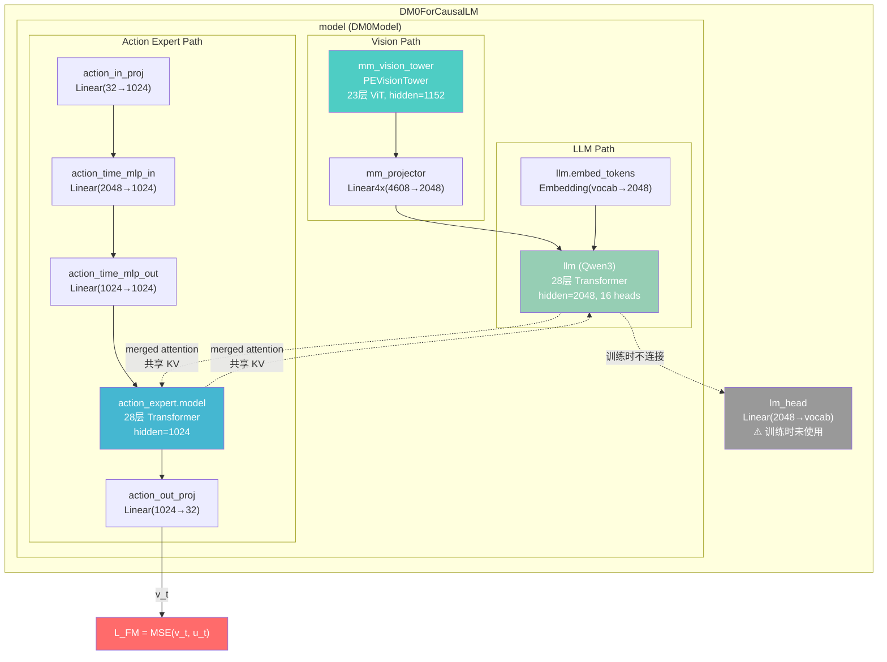
```mermaid
graph TD
    subgraph DM0ForCausalLM
        subgraph DM0Model["model (DM0Model)"]
            subgraph VisionPath["Vision Path"]
                VT["mm_vision_tower<br/>PEVisionTower<br/>23层 ViT, hidden=1152"]
                PROJ["mm_projector<br/>Linear4x(4608→2048)"]
            end
            
            subgraph LLMPath["LLM Path"]
                EMB["llm.embed_tokens<br/>Embedding(vocab→2048)"]
                LLM["llm (Qwen3)<br/>28层 Transformer<br/>hidden=2048, 16 heads"]
            end
            
            subgraph ActionPath["Action Expert Path"]
                AIN["action_in_proj<br/>Linear(32→1024)"]
                TMLP_IN["action_time_mlp_in<br/>Linear(2048→1024)"]
                TMLP_OUT["action_time_mlp_out<br/>Linear(1024→1024)"]
                AE["action_expert.model<br/>28层 Transformer<br/>hidden=1024"]
                AOUT["action_out_proj<br/>Linear(1024→32)"]
            end
        end
        
        LMH["lm_head<br/>Linear(2048→vocab)<br/>⚠️ 训练时未使用"]
    end
    
    VT --> PROJ
    PROJ --> LLM
    EMB --> LLM
    AIN --> TMLP_IN
    TMLP_IN --> TMLP_OUT
    TMLP_OUT --> AE
    
    LLM -.->|"merged attention<br/>共享 KV"| AE
    AE -.->|"merged attention<br/>共享 KV"| LLM
    
    AE --> AOUT
    AOUT -->|"v_t"| LOSS["L_FM = MSE(v_t, u_t)"]
    
    LLM -.->|"训练时不连接"| LMH

    style LOSS fill:#ff6b6b,color:#fff
    style LMH fill:#999,color:#fff
    style VT fill:#4ecdc4,color:#fff
    style AE fill:#45b7d1,color:#fff
    style LLM fill:#96ceb4,color:#fff
```

---

## 2. Forward Pass 计算图

以下 Mermaid 图展示训练时 `forward()` 的完整数据流 ([dm0_arch.py:409-514](dexbotic/model/dm0/dm0_arch.py#L409-L514)):

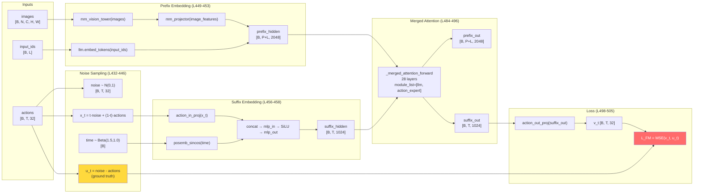
```mermaid
graph LR
    subgraph Inputs
        IMG["images<br/>[B, N, C, H, W]"]
        IDS["input_ids<br/>[B, L]"]
        ACT["actions<br/>[B, T, 32]"]
    end
    
    subgraph "Noise Sampling (L432-446)"
        NOISE["noise ~ N(0,1)<br/>[B, T, 32]"]
        TIME["time ~ Beta(1.5,1.0)<br/>[B]"]
        XT["x_t = t·noise + (1-t)·actions"]
        UT["u_t = noise - actions<br/>(ground truth)"]
    end
    
    subgraph "Prefix Embedding (L449-453)"
        VE["mm_vision_tower(images)"]
        PE["mm_projector(image_features)"]
        TE["llm.embed_tokens(input_ids)"]
        PH["prefix_hidden<br/>[B, P+L, 2048]"]
    end
    
    subgraph "Suffix Embedding (L456-458)"
        AI["action_in_proj(x_t)"]
        POSEMB["posemb_sincos(time)"]
        FUSE["concat → mlp_in → SiLU → mlp_out"]
        SH["suffix_hidden<br/>[B, T, 1024]"]
    end
    
    subgraph "Merged Attention (L484-496)"
        MA["_merged_attention_forward<br/>28 layers<br/>module_list=[llm, action_expert]"]
        PO["prefix_out<br/>[B, P+L, 2048]"]
        SO["suffix_out<br/>[B, T, 1024]"]
    end
    
    subgraph "Loss (L498-505)"
        AOUTP["action_out_proj(suffix_out)"]
        VT["v_t [B, T, 32]"]
        LOSS["L_FM = MSE(v_t, u_t)"]
    end
    
    IMG --> VE --> PE --> PH
    IDS --> TE --> PH
    ACT --> NOISE
    ACT --> XT
    ACT --> UT
    XT --> AI --> FUSE
    TIME --> POSEMB --> FUSE
    FUSE --> SH
    PH --> MA
    SH --> MA
    MA --> PO
    MA --> SO
    SO --> AOUTP --> VT --> LOSS
    UT --> LOSS
    
    style LOSS fill:#ff6b6b,color:#fff
    style UT fill:#ffd93d,color:#333
```

### 2.1 Forward 核心代码调用链

```
DM0Exp.train()                                    # dm0_exp.py:596
  → BaseExp.train()                                # base_exp.py:865
    → BaseExp._initialize_train()                  # base_exp.py:779
      → DM0ModelConfig.build_model()               # dm0_exp.py:203 (注意: 不调用 _freeze_model)
      → DexboticTrainer(**kwargs)                   # base_exp.py:823
    → trainer.train()                              # HuggingFace Trainer
      → DexboticTrainer.training_step()            # trainer.py:188
        → DexboticTrainer.compute_loss()           # trainer.py:170
          → DM0ForCausalLM.forward()               # dm0_arch.py:409
            → get_prefix_hidden_states()           # dm0_arch.py:310
              → encode_images() → embed_image()    # dm0_arch.py:94-102
              → embed_language_tokens()            # dm0_arch.py:104-106
            → get_suffix_hidden_states()           # dm0_arch.py:358
              → posemb_sincos()                    # dm0_utils.py:95
              → action_in_proj()                   # dm0_arch.py:378
              → action_time_mlp_in → SiLU → out   # dm0_arch.py:389-391
            → _merged_attention_forward()          # dm0_arch.py:273
              → _compute_merged_layer() × 28      # dm0_arch.py:148
            → action_out_proj(suffix_out)          # dm0_arch.py:502
            → F.mse_loss(v_t, u_t)                # dm0_arch.py:503
          → loss.backward()                        # PyTorch autograd (由 HF Trainer 调用)
```

---

## 3. Loss Function 与 Ground Truth

### 3.1 Flow Matching 公式

给定 clean action trajectory $a \in \mathbb{R}^{T \times D}$:

1. **采样噪声和时间步**:
   $$\epsilon \sim \mathcal{N}(0, I), \quad t \sim \text{Beta}(1.5, 1.0) \cdot 0.999 + 0.001$$

2. **Flow Matching 插值** (构造 noisy trajectory):
   $$x_t = t \cdot \epsilon + (1 - t) \cdot a$$

3. **目标速度场** (ground truth):
   $$u_t = \epsilon - a$$

4. **模型预测速度场**:
   $$v_t = \text{action\_out\_proj}(\text{merged\_attention}(\text{prefix}, \text{suffix}(x_t, t)))$$

5. **Loss**:
   $$\mathcal{L}_{FM} = \frac{1}{T \cdot D} \sum_{i,j} (v_t^{(i,j)} - u_t^{(i,j)})^2$$

### 3.2 代码实现

```python
# dm0_arch.py:432-446
noise = torch.normal(mean=torch.zeros_like(actions), std=torch.ones_like(actions))
time = torch.distributions.Beta(1.5, 1.0).sample((batch_size,)) * 0.999 + 0.001

time_expanded = time[..., None, None]
x_t = time_expanded * noise + (1 - time_expanded) * actions  # noisy trajectory
u_t = noise - actions                                         # target velocity

# dm0_arch.py:498-505
suffix_out_final = suffix_out[:, -self.model.config.chunk_size:]
v_t = self.model.action_out_proj(suffix_out_final)            # predicted velocity
action_loss = F.mse_loss(v_t, u_t, reduction="mean")          # MSE loss
loss = action_loss                                             # 唯一的 loss
```

### 3.3 与论文的差异

| 方面 | 论文描述 | 代码实现 |
|------|----------|----------|
| Loss 组成 | $\mathcal{L} = \lambda \cdot \mathcal{L}_{AR} + \mathcal{L}_{FM}$, $\lambda=1$ | 仅 $\mathcal{L}_{FM}$ |
| L_AR | 对 text/action token 的 cross-entropy | **完全缺失** |
| labels 参数 | 用于计算 L_AR | `forward()` 接收但从未使用 |
| lm_head | 产出 text logits 用于 L_AR | 仅在 `generate()` 推理时使用 |

### 3.4 梯度起点

$$\frac{\partial \mathcal{L}_{FM}}{\partial v_t} = \frac{2}{T \cdot D}(v_t - u_t)$$

这是整个 backward pass 的起点。从这里出发，PyTorch autograd 沿计算图反向传播。

---

## 4. Backward 梯度流完整图

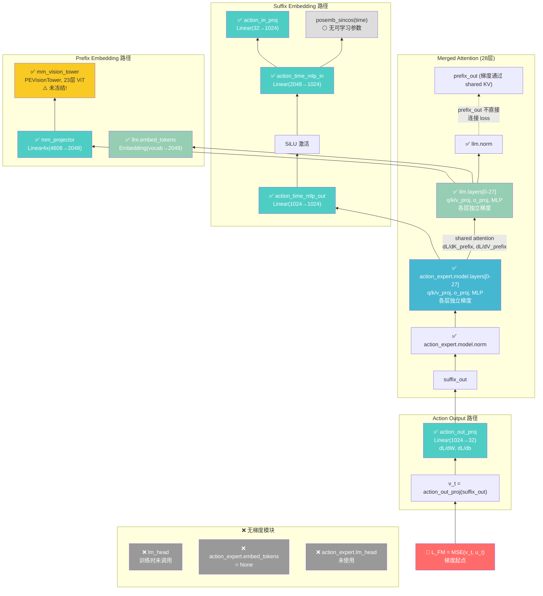
```mermaid
graph BT
    LOSS["🔴 L_FM = MSE(v_t, u_t)<br/>梯度起点"]
    
    subgraph ActionOutput["Action Output 路径"]
        VT["v_t = action_out_proj(suffix_out)"]
        AOUT["✅ action_out_proj<br/>Linear(1024→32)<br/>dL/dW, dL/db"]
    end
    
    subgraph MergedAttn["Merged Attention (28层)"]
        SO["suffix_out"]
        AENORM["✅ action_expert.model.norm"]
        AE_L["✅ action_expert.model.layers[0-27]<br/>q/k/v_proj, o_proj, MLP<br/>各层独立梯度"]
        
        PO["prefix_out (梯度通过 shared KV)"]
        LLMNORM["✅ llm.norm"]
        LLM_L["✅ llm.layers[0-27]<br/>q/k/v_proj, o_proj, MLP<br/>各层独立梯度"]
    end
    
    subgraph SuffixEmbed["Suffix Embedding 路径"]
        TMLP_O["✅ action_time_mlp_out<br/>Linear(1024→1024)"]
        SILU["SiLU 激活"]
        TMLP_I["✅ action_time_mlp_in<br/>Linear(2048→1024)"]
        AIN["✅ action_in_proj<br/>Linear(32→1024)"]
        POSEMB["posemb_sincos(time)<br/>⚪ 无可学习参数"]
    end
    
    subgraph PrefixEmbed["Prefix Embedding 路径"]
        PROJ["✅ mm_projector<br/>Linear4x(4608→2048)"]
        VTOWER["✅ mm_vision_tower<br/>PEVisionTower, 23层 ViT<br/>⚠️ 未冻结!"]
        EMBED["✅ llm.embed_tokens<br/>Embedding(vocab→2048)"]
    end
    
    subgraph NoGrad["❌ 无梯度模块"]
        LMH["❌ lm_head<br/>训练时未调用"]
        AE_EMB["❌ action_expert.embed_tokens<br/>= None"]
        AE_LMH["❌ action_expert.lm_head<br/>未使用"]
    end
    
    LOSS --> VT --> AOUT
    AOUT --> SO --> AENORM --> AE_L
    
    AE_L -->|"shared attention<br/>dL/dK_prefix, dL/dV_prefix"| LLM_L
    LLM_L --> LLMNORM -.->|"prefix_out 不直接<br/>连接 loss"| PO
    
    AE_L --> TMLP_O --> SILU --> TMLP_I
    TMLP_I --> AIN
    TMLP_I --> POSEMB
    
    LLM_L --> PROJ --> VTOWER
    LLM_L --> EMBED
    
    style LOSS fill:#ff6b6b,color:#fff
    style LMH fill:#999,color:#fff
    style AE_EMB fill:#999,color:#fff
    style AE_LMH fill:#999,color:#fff
    style POSEMB fill:#ddd,color:#333
    style AOUT fill:#4ecdc4,color:#fff
    style AE_L fill:#45b7d1,color:#fff
    style LLM_L fill:#96ceb4,color:#fff
    style VTOWER fill:#f9ca24,color:#333
    style PROJ fill:#4ecdc4,color:#fff
    style AIN fill:#4ecdc4,color:#fff
    style TMLP_O fill:#4ecdc4,color:#fff
    style TMLP_I fill:#4ecdc4,color:#fff
    style EMBED fill:#96ceb4,color:#fff
```

**图例**: ✅ 绿/蓝 = 收到梯度并更新权重 | ❌ 灰色 = 无梯度 | ⚪ 无可学习参数 | ⚠️ 值得注意

---

## 5. Merged Attention 梯度流详解

这是理解 DM0 backward 的**最关键部分**。merged attention 使得 action loss 的梯度能流向 LLM backbone。

### 5.1 单层 Merged Attention 前向过程

代码位置: [dm0_arch.py:148-271](dexbotic/model/dm0/dm0_arch.py#L148-L271) (`_compute_merged_layer`)

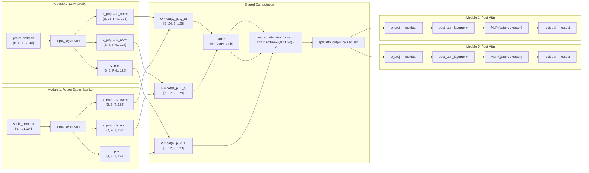
```mermaid
graph LR
    subgraph "Module 0: LLM (prefix)"
        P_IN["prefix_embeds<br/>[B, P+L, 2048]"]
        P_LN["input_layernorm"]
        P_Q["q_proj → q_norm<br/>[B, 16, P+L, 128]"]
        P_K["k_proj → k_norm<br/>[B, 8, P+L, 128]"]
        P_V["v_proj<br/>[B, 8, P+L, 128]"]
    end
    
    subgraph "Module 1: Action Expert (suffix)"
        S_IN["suffix_embeds<br/>[B, T, 1024]"]
        S_LN["input_layernorm"]
        S_Q["q_proj → q_norm<br/>[B, 8, T, 128]"]
        S_K["k_proj → k_norm<br/>[B, 4, T, 128]"]
        S_V["v_proj<br/>[B, 4, T, 128]"]
    end
    
    subgraph "Shared Computation"
        CAT_Q["Q = cat(Q_p, Q_s)<br/>[B, 24, ?, 128]"]
        CAT_K["K = cat(K_p, K_s)<br/>[B, 12, ?, 128]"]
        CAT_V["V = cat(V_p, V_s)<br/>[B, 12, ?, 128]"]
        ROPE["RoPE<br/>(llm.rotary_emb)"]
        ATTN["eager_attention_forward<br/>Attn = softmax(QK^T/√d) · V"]
        SPLIT["split attn_output by seq_len"]
    end
    
    subgraph "Module 0: Post-Attn"
        P_O["o_proj → residual"]
        P_PLN["post_attn_layernorm"]
        P_MLP["MLP (gate+up+down)"]
        P_RES["residual → output"]
    end
    
    subgraph "Module 1: Post-Attn"
        S_O["o_proj → residual"]
        S_PLN["post_attn_layernorm"]
        S_MLP["MLP (gate+up+down)"]
        S_RES["residual → output"]
    end
    
    P_IN --> P_LN --> P_Q & P_K & P_V
    S_IN --> S_LN --> S_Q & S_K & S_V
    
    P_Q --> CAT_Q
    S_Q --> CAT_Q
    P_K --> CAT_K
    S_K --> CAT_K
    P_V --> CAT_V
    S_V --> CAT_V
    
    CAT_Q --> ROPE --> ATTN
    CAT_K --> ROPE --> ATTN
    CAT_V --> ATTN
    
    ATTN --> SPLIT
    SPLIT --> P_O --> P_PLN --> P_MLP --> P_RES
    SPLIT --> S_O --> S_PLN --> S_MLP --> S_RES
```

### 5.2 为什么 Prefix (LLM) 会收到 Action Loss 的梯度

**核心机制: 共享 Attention 中的交叉注意力**

在 `_compute_merged_layer` 中:

```python
# dm0_arch.py:200-202 — Q, K, V 沿 head 维度拼接
query_states = torch.cat(query_list, dim=2)   # [B, n_heads_total, seq_total, head_dim]
key_states = torch.cat(key_list, dim=2)
value_states = torch.cat(value_list, dim=2)

# dm0_arch.py:236-243 — 在拼接后的 KV 上做 attention
attn_output, _ = modeling_qwen3.eager_attention_forward(
    layers[0].self_attn,
    query_states, key_states, value_states,
    attention_mask, scaling=layers[0].self_attn.scaling,
)
```

**Attention 计算**:

$$\text{Attn}(Q, K, V) = \text{softmax}\left(\frac{Q K^T}{\sqrt{d}}\right) V$$

其中 $K = [K_{prefix}; K_{suffix}]$, $V = [V_{prefix}; V_{suffix}]$

**Attention Mask 分析** (参考 [dm0_utils.py:12-41](dexbotic/model/dm0/dm0_utils.py#L12-L41)):

由 `make_attn_mask_2d` 的 cumsum 机制:
- Prefix 的 attn_mask 全为 `[1, 1, 1, ...]` → cumsum 单调递增
- Suffix 的 attn_mask 为 `[1, 0, 0, ...]` → 第一个 suffix token 的 cumsum 比所有 prefix 大

**结果**: suffix 的第一个 token (time token) 可以 attend to 所有 prefix tokens，后续 suffix tokens 是 causal 的。

**梯度流**: 当 suffix output 有梯度 $\frac{\partial \mathcal{L}}{\partial O_s}$ 时:

$$\frac{\partial \mathcal{L}}{\partial V_{prefix}} = \text{softmax}\left(\frac{Q_s K^T}{\sqrt{d}}\right)^T_{prefix部分} \cdot \frac{\partial \mathcal{L}}{\partial O_s} \neq 0$$

因为 $Q_s$ 对 $K_{prefix}$ 的 attention weight 非零 (suffix attend to prefix)，所以 $V_{prefix}$ 的梯度非零。同理 $K_{prefix}$ 也会收到梯度 (通过 softmax 的反向传播)。

### 5.3 单层 Backward 梯度流图

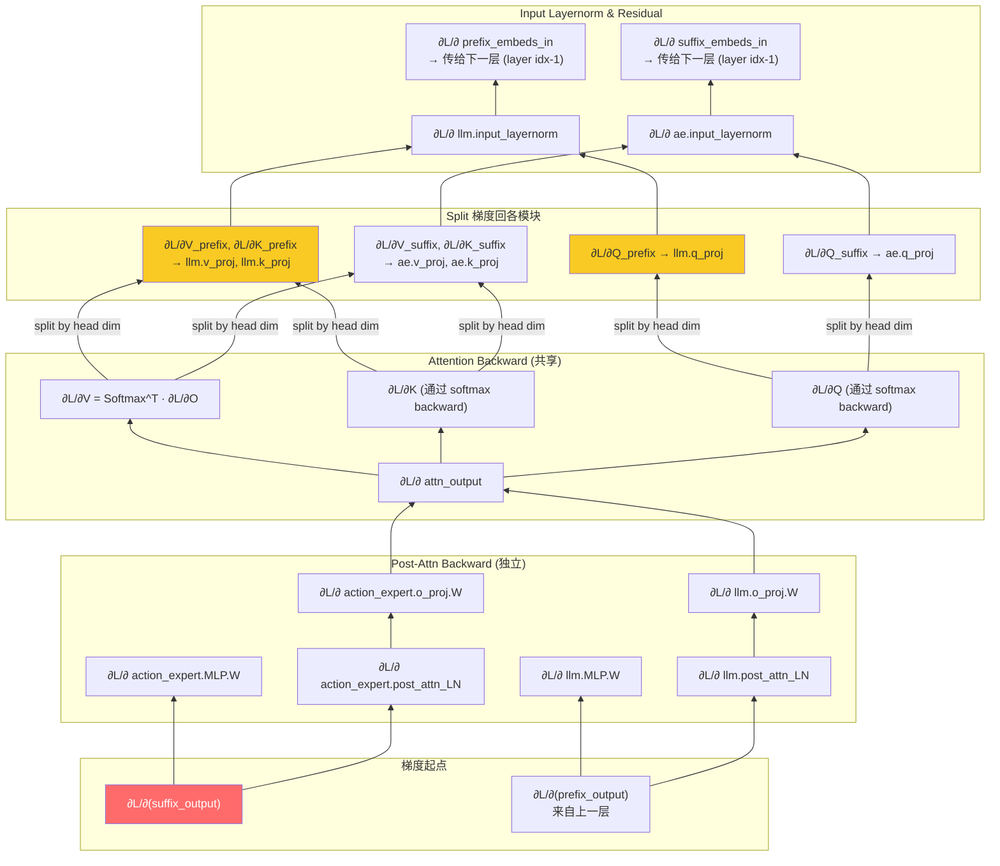
```mermaid
graph BT
    subgraph "梯度起点"
        DL_S_OUT["∂L/∂(suffix_output)"]
        DL_P_OUT["∂L/∂(prefix_output)<br/>来自上一层"]
    end
    
    subgraph "Post-Attn Backward (独立)"
        DL_S_MLP["∂L/∂ action_expert.MLP.W"]
        DL_S_PLN["∂L/∂ action_expert.post_attn_LN"]
        DL_S_O["∂L/∂ action_expert.o_proj.W"]
        DL_P_MLP["∂L/∂ llm.MLP.W"]
        DL_P_PLN["∂L/∂ llm.post_attn_LN"]
        DL_P_O["∂L/∂ llm.o_proj.W"]
    end
    
    subgraph "Attention Backward (共享)"
        DL_ATTN["∂L/∂ attn_output"]
        DL_V["∂L/∂V = Softmax^T · ∂L/∂O"]
        DL_K["∂L/∂K (通过 softmax backward)"]
        DL_Q["∂L/∂Q (通过 softmax backward)"]
    end
    
    subgraph "Split 梯度回各模块"
        DL_VK_P["∂L/∂V_prefix, ∂L/∂K_prefix<br/>→ llm.v_proj, llm.k_proj"]
        DL_VK_S["∂L/∂V_suffix, ∂L/∂K_suffix<br/>→ ae.v_proj, ae.k_proj"]
        DL_Q_P["∂L/∂Q_prefix → llm.q_proj"]
        DL_Q_S["∂L/∂Q_suffix → ae.q_proj"]
    end
    
    subgraph "Input Layernorm & Residual"
        DL_P_LN["∂L/∂ llm.input_layernorm"]
        DL_S_LN["∂L/∂ ae.input_layernorm"]
        DL_P_IN["∂L/∂ prefix_embeds_in<br/>→ 传给下一层 (layer idx-1)"]
        DL_S_IN["∂L/∂ suffix_embeds_in<br/>→ 传给下一层 (layer idx-1)"]
    end
    
    DL_S_OUT --> DL_S_MLP & DL_S_PLN
    DL_S_PLN --> DL_S_O
    DL_P_OUT --> DL_P_MLP & DL_P_PLN
    DL_P_PLN --> DL_P_O
    
    DL_S_O --> DL_ATTN
    DL_P_O --> DL_ATTN
    
    DL_ATTN --> DL_V & DL_K & DL_Q
    
    DL_V -->|"split by head dim"| DL_VK_P & DL_VK_S
    DL_K -->|"split by head dim"| DL_VK_P & DL_VK_S
    DL_Q -->|"split by head dim"| DL_Q_P & DL_Q_S
    
    DL_VK_P --> DL_P_LN --> DL_P_IN
    DL_Q_P --> DL_P_LN
    DL_VK_S --> DL_S_LN --> DL_S_IN
    DL_Q_S --> DL_S_LN
    
    style DL_S_OUT fill:#ff6b6b,color:#fff
    style DL_VK_P fill:#f9ca24,color:#333
    style DL_Q_P fill:#f9ca24,color:#333
```

### 5.4 梯度隔离分析

**代码中没有任何梯度隔离措施**:

```python
# dm0_arch.py:200-202 — 直接 cat，无 detach
query_states = torch.cat(query_list, dim=2)    # 无 .detach()
key_states = torch.cat(key_list, dim=2)        # 无 .detach()
value_states = torch.cat(value_list, dim=2)    # 无 .detach()
```

搜索整个 `dm0_arch.py`:
- `detach` 仅出现在推理方法 (`inference_action`, `generate`) 中
- `forward()` 中没有任何 `detach()`, `no_grad()`, 或 `stop_gradient` 调用

**对比论文**: 论文提到 "Knowledge Insulation" (知识隔离) 策略，防止 action expert 的梯度回传到 VLM，但代码中**完全没有实现**。

---

## 6. Suffix Embedding 路径梯度

从 merged attention 的第 0 层输入 `suffix_embeds` 反向传播:

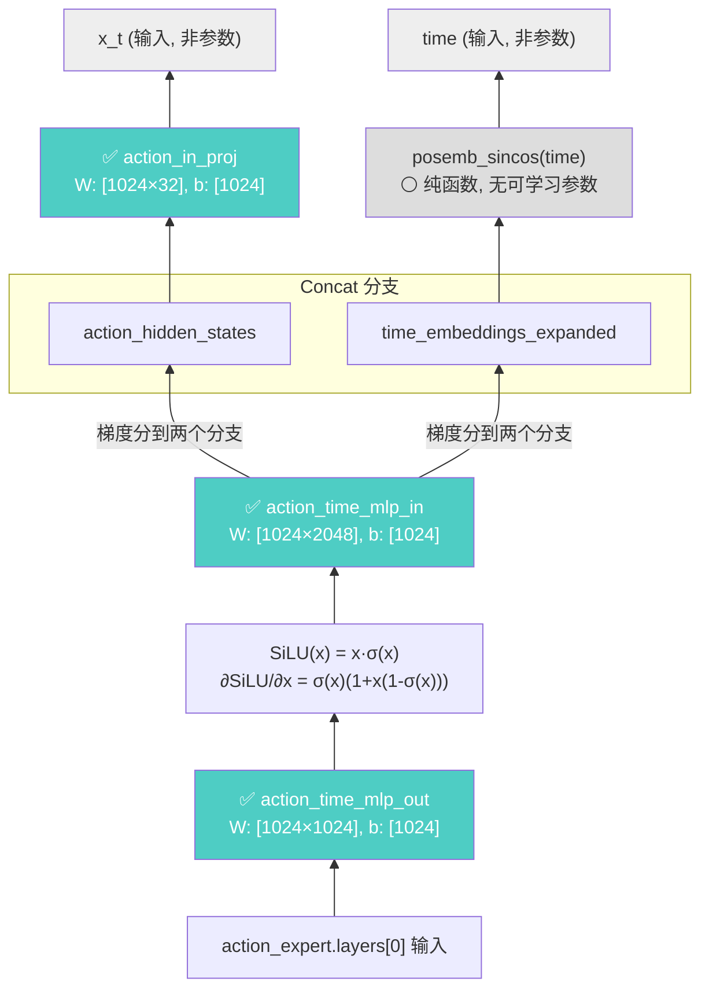
```mermaid
graph BT
    AE_L0["action_expert.layers[0] 输入"]
    
    TMLP_O["✅ action_time_mlp_out<br/>W: [1024×1024], b: [1024]"]
    SILU["SiLU(x) = x·σ(x)<br/>∂SiLU/∂x = σ(x)(1+x(1-σ(x)))"]
    TMLP_I["✅ action_time_mlp_in<br/>W: [1024×2048], b: [1024]"]
    
    subgraph "Concat 分支"
        ACT_H["action_hidden_states"]
        TIME_H["time_embeddings_expanded"]
    end
    
    AIN["✅ action_in_proj<br/>W: [1024×32], b: [1024]"]
    XT["x_t (输入, 非参数)"]
    
    POSEMB["posemb_sincos(time)<br/>⚪ 纯函数, 无可学习参数"]
    TIME_IN["time (输入, 非参数)"]
    
    AE_L0 --> TMLP_O --> SILU --> TMLP_I
    TMLP_I -->|"梯度分到两个分支"| ACT_H & TIME_H
    ACT_H --> AIN --> XT
    TIME_H --> POSEMB --> TIME_IN
    
    style AIN fill:#4ecdc4,color:#fff
    style TMLP_O fill:#4ecdc4,color:#fff
    style TMLP_I fill:#4ecdc4,color:#fff
    style POSEMB fill:#ddd,color:#333
    style XT fill:#eee,color:#333
    style TIME_IN fill:#eee,color:#333
```

代码对应:

```python
# dm0_arch.py:369-391 (get_suffix_hidden_states)
time_embeddings = posemb_sincos(time, dim, min_period=4e-3, max_period=4.0)  # 无可学习参数
action_hidden_states = self.model.action_in_proj(noisy_actions)              # ✅ 有梯度
fused = torch.cat([action_hidden_states, time_embeddings_expanded], dim=2)   # concat
x = self.model.action_time_mlp_in(fused)                                    # ✅ 有梯度
x = F.silu(x)                                                                # 激活函数
hidden_states = self.model.action_time_mlp_out(x)                           # ✅ 有梯度
```

注意: `x_t` 和 `time` 都是输入数据或采样值，不是模型参数，所以梯度到达 `action_in_proj.weight` 和 `action_time_mlp*.weight` 后就停止了 (没有更深层的可学习参数)。

---

## 7. Prefix Embedding 路径梯度

从 merged attention 的第 0 层输入 `prefix_embeds` 反向传播:

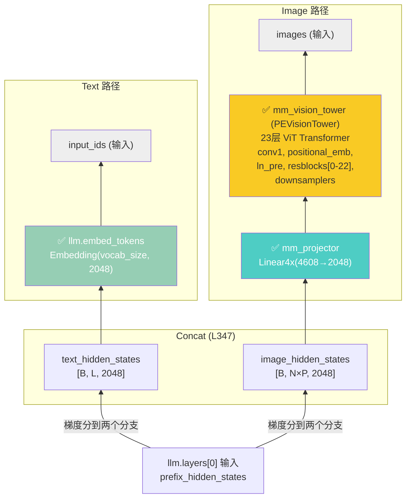
```mermaid
graph BT
    LLM_L0["llm.layers[0] 输入<br/>prefix_hidden_states"]
    
    subgraph "Concat (L347)"
        IMG_H["image_hidden_states<br/>[B, N×P, 2048]"]
        TXT_H["text_hidden_states<br/>[B, L, 2048]"]
    end
    
    subgraph "Image 路径"
        PROJ["✅ mm_projector<br/>Linear4x(4608→2048)"]
        VT["✅ mm_vision_tower (PEVisionTower)<br/>23层 ViT Transformer<br/>conv1, positional_emb,<br/>ln_pre, resblocks[0-22],<br/>downsamplers"]
        IMG_IN["images (输入)"]
    end
    
    subgraph "Text 路径"
        EMB["✅ llm.embed_tokens<br/>Embedding(vocab_size, 2048)"]
        IDS_IN["input_ids (输入)"]
    end
    
    LLM_L0 -->|"梯度分到两个分支"| IMG_H & TXT_H
    IMG_H --> PROJ --> VT --> IMG_IN
    TXT_H --> EMB --> IDS_IN
    
    style PROJ fill:#4ecdc4,color:#fff
    style VT fill:#f9ca24,color:#333
    style EMB fill:#96ceb4,color:#fff
    style IMG_IN fill:#eee,color:#333
    style IDS_IN fill:#eee,color:#333
```

### 7.1 PEVisionTower 未冻结 — 关键发现

**PEVisionTower** ([pe_encoder.py:27-41](dexbotic/model/modules/mm_vision/pe/pe_encoder.py#L27-L41)):

```python
class PEVisionTower(nn.Module):
    def __init__(self, vision_tower):
        super().__init__()
        self.config = get_config(vision_tower)
        self.load_model()
    
    def load_model(self):
        self.vision_tower = self.config.build_model()
        self.is_loaded = True
        # ⚠️ 注意: 没有 requires_grad_(False) !
```

**对比 CLIPVisionTower** ([clip_encoder.py:21-29](dexbotic/model/modules/mm_vision/clip/clip_encoder.py#L21-L29)):

```python
class CLIPVisionTower(nn.Module):
    def load_model(self):
        self.vision_tower = CLIPVisionModel.from_pretrained(...)
        self.vision_tower.requires_grad_(False)  # ← 明确冻结!
```

**同时, DM0ModelConfig.build_model() 不调用 _freeze_model():**

```python
# dm0_exp.py:200-205
class DM0ModelConfig(ModelConfig):
    def build_model(self) -> DM0ForCausalLM:
        model = DM0ForCausalLM.from_pretrained(self.model_name_or_path)
        return model  # ← 直接返回, 不调用 self._freeze_model(model)
```

而 base class `ModelConfig.build_model()` ([base_exp.py:293-316](dexbotic/exp/base_exp.py#L293-L316)) 会调用 `self._freeze_model(model)`:

```python
# base_exp.py:314
self._freeze_model(model)  # DM0 不走这个路径
```

**结论**: DM0 的 PEVisionTower **所有参数都是可训练的**，并且通过 prefix embedding → merged attention 与 action loss 连接，**梯度会更新整个 vision encoder**。

---

## 8. 权重更新总览

### 8.1 完整模块梯度状态表

| 模块 | requires_grad | 连接 loss | 收到梯度 | 权重被 update | 原因说明 |
|------|:---:|:---:|:---:|:---:|------|
| `model.action_out_proj` | ✅ | ✅ 直接 | ✅ | ✅ | 直接产出 v_t，MSE loss 的直接输入 |
| `model.action_expert.model.layers[0-27]` | ✅ | ✅ | ✅ | ✅ | suffix_out 经过 28 层 Transformer |
| `model.action_expert.model.norm` | ✅ | ✅ | ✅ | ✅ | 最终 LayerNorm |
| `model.action_time_mlp_out` | ✅ | ✅ | ✅ | ✅ | suffix embedding 融合层 |
| `model.action_time_mlp_in` | ✅ | ✅ | ✅ | ✅ | suffix embedding 融合层 |
| `model.action_in_proj` | ✅ | ✅ | ✅ | ✅ | action → hidden 投影 |
| `model.llm.layers[0-27]` | ✅ | ✅ 间接 | ✅ | ✅ | 通过 merged attention 共享 KV |
| `model.llm.norm` | ✅ | ✅ 间接 | ✅ | ✅ | LLM 最终 LayerNorm |
| `model.mm_projector` | ✅ | ✅ 间接 | ✅ | ✅ | 通过 prefix → merged attention |
| `model.mm_vision_tower` | ✅ | ✅ 间接 | ✅ | ✅ | PEVisionTower 未冻结 |
| `model.llm.embed_tokens` | ✅ | ✅ 间接 | ✅ | ✅ | text embedding 路径 |
| `model.llm.rotary_emb` | - | - | - | ❌ | 无可学习参数 (sin/cos 预计算) |
| `lm_head` | ✅ | ❌ | ❌ | ❌* | `forward()` 不调用, 仅 `generate()` 使用 |
| `model.action_expert.model.embed_tokens` | - | - | - | ❌ | 被设为 `None` |
| `model.action_expert.lm_head` | ✅ | ❌ | ❌ | ❌* | Qwen3ForCausalLM 自带, 未使用 |

> *注: `lm_head` 和 `action_expert.lm_head` 虽然 `requires_grad=True` 且在 optimizer 中，但因为不与 loss 连接，梯度为零。唯一的影响来自 `weight_decay=1e-10`，几乎可以忽略。

### 8.2 梯度流路径总结

```
Loss (MSE)
  │
  ├── 直接路径 (Action Expert 路径)
  │     action_out_proj → action_expert.norm → action_expert.layers[27→0]
  │     → action_time_mlp_out → SiLU → action_time_mlp_in → action_in_proj
  │
  └── 间接路径 (通过 Merged Attention 的 LLM 路径)
        action_expert.layers[i].attention 中的共享 KV
        → llm.layers[i].k_proj, v_proj (梯度通过 softmax backward)
        → llm.layers[i].q_proj, o_proj, MLP
        → llm.layers[i-1] ... → llm.layers[0]
        → prefix_hidden_states
        ├── mm_projector → mm_vision_tower (PEVisionTower 全部参数)
        └── llm.embed_tokens
```

---

## 9. 优化器与学习率

### 9.1 DM0 Optimizer 配置

代码位置: [dm0_exp.py:209-225](dexbotic/exp/dm0_exp.py#L209-L225)

```python
@dataclass
class DM0OptimizerConfig(OptimizerConfig):
    base_lr: float = 2.5e-5
    adam_beta2: float = 0.95        # 比标准 0.999 更小, 更关注近期梯度
    warmup_steps: int = 1000
    weight_decay: float = 1e-10     # 几乎为零

    def _get_optimizer_grouped_parameters(self, model):
        # 单一参数组: 所有 requires_grad=True 的参数
        return [{
            "params": [p for n, p in model.named_parameters() if p.requires_grad],
            "weight_decay": self.weight_decay,
        }]
```

**关键**: DM0 覆盖了 base class 的 `_get_optimizer_grouped_parameters`，使用**单一参数组**。base class ([base_exp.py:94-203](dexbotic/exp/base_exp.py#L94-L203)) 支持 `mm_projector_lr`, `mm_vision_lr`, `action_head_lr` 等独立学习率，但 DM0 全部不使用。

### 9.2 学习率调度

| 参数 | 值 | 代码位置 |
|------|----|----|
| `lr_scheduler_type` | `cosine_with_min_lr` | [dm0_exp.py:239](dexbotic/exp/dm0_exp.py#L239) |
| `min_lr_rate` | 0.1 (即最低 LR = 2.5e-6) | [dm0_exp.py:240](dexbotic/exp/dm0_exp.py#L240) |
| `warmup_steps` | 1000 | [dm0_exp.py:212](dexbotic/exp/dm0_exp.py#L212) |
| `num_train_steps` | 30000 | [dm0_exp.py:232](dexbotic/exp/dm0_exp.py#L232) |

学习率曲线:
```
LR
2.5e-5 ┤ ╭──────╮
       │ │       ╲
       │╱         ╲
       │            ╲
       │             ╲
2.5e-6 ┤──────────────╲──────
       ┼──────┼───────┼──────→ steps
       0    1000          30000
       warmup  cosine decay
```

### 9.3 Trainer 配置

代码位置: [trainer.py:130-168](dexbotic/exp/trainer.py#L130-L168)

| 参数 | 值 | 影响 |
|------|----|----|
| `gradient_checkpointing` | True | 减少显存，增加计算 (~33%) |
| `bf16` | True | 混合精度训练 |
| `max_grad_norm` | 1.0 | 梯度裁剪 ([trainer.py:166](dexbotic/exp/trainer.py#L166)) |
| `ddp_find_unused_parameters` | True | 处理 lm_head 等未使用参数 ([trainer.py:165](dexbotic/exp/trainer.py#L165)) |
| `gradient_accumulation_steps` | 1 | 每步更新 (benchmark 中可能为 2) |

### 9.4 权重更新公式

AdamW 对每个参数 $\theta$ 的更新:

$$m_t = \beta_1 m_{t-1} + (1-\beta_1) g_t$$
$$v_t = \beta_2 v_{t-1} + (1-\beta_2) g_t^2$$
$$\hat{m}_t = \frac{m_t}{1-\beta_1^t}, \quad \hat{v}_t = \frac{v_t}{1-\beta_2^t}$$
$$\theta_t = \theta_{t-1} - \eta_t \left( \frac{\hat{m}_t}{\sqrt{\hat{v}_t} + \epsilon} + \lambda \theta_{t-1} \right)$$

其中 $\beta_1=0.9$, $\beta_2=0.95$, $\epsilon=10^{-8}$, $\lambda=10^{-10}$, $\eta_t$ 由 cosine schedule 决定。

对于 **lm_head** 等未连接 loss 的参数: $g_t = 0$，所以 $m_t \to 0$, $v_t \to 0$，唯一的更新来自 weight decay 项 $\lambda \theta_{t-1}$，因为 $\lambda = 10^{-10}$ 极小，几乎不影响权重。

---

## 10. 关键设计观察

### 10.1 无梯度隔离 vs 论文 "Knowledge Insulation"

| 方面 | 论文描述 | 代码实现 |
|------|----------|----------|
| 策略 | Action Expert 梯度不应回传到 VLM | 无任何隔离 |
| 实现方式 | 应使用 `.detach()` 或独立 optimizer | 单一 optimizer group, 无 detach |
| 影响 | 防止 VLM 语义知识被 action loss 侵蚀 | VLM 完全暴露在 action loss 的梯度下 |

**实际影响**: 由于 action loss 的梯度通过 merged attention 流向 LLM 的所有层，长期训练可能导致 LLM 的语言能力退化 (catastrophic forgetting)。这在 finetune 场景下可能是有意为之 (全量微调)，但与论文描述的架构设计不符。

### 10.2 无 L_AR Loss

DM0 `forward()` 中 `labels` 参数被接收但**从未使用**:

```python
# dm0_arch.py:409 — forward 签名接收 labels
def forward(self, ..., labels: Optional[torch.LongTensor] = None, ...):
    # labels 在整个 forward 中从未被引用
    # loss 仅来自 action_loss = F.mse_loss(v_t, u_t)
```

这意味着:
- LLM 的 text generation 能力没有被 L_AR 保持
- 论文中描述的 "text-as-everything" 方法 (包括 subtask prediction, goal bbox, EEF trajectory, discrete action tokens) 都没有实现
- 模型只学习 action prediction，不学习任何文本生成任务

### 10.3 lm_head 的特殊状态

`lm_head` 在训练时处于一种"存在但无用"的状态:

- **定义**: [dm0_arch.py:139-141](dexbotic/model/dm0/dm0_arch.py#L139-L141) — `nn.Linear(2048, vocab_size)`
- **requires_grad**: True (默认)
- **在 optimizer 中**: 是 (因为 `_get_optimizer_grouped_parameters` 收集所有 `requires_grad=True` 参数)
- **收到梯度**: 否 (forward 中不调用)
- **weight_decay 影响**: $10^{-10}$，可忽略
- **实际用途**: 仅在 `generate()` ([dm0_arch.py:704, 742](dexbotic/model/dm0/dm0_arch.py#L704)) 推理时使用
- **tie_lm_head()**: 方法存在 ([dm0_arch.py:144-146](dexbotic/model/dm0/dm0_arch.py#L144-L146))，但训练流程中**不被调用**

`ddp_find_unused_parameters=True` ([trainer.py:165](dexbotic/exp/trainer.py#L165)) 确保 DDP 不会因为 `lm_head` 未使用而报错。

### 10.4 PEVisionTower 完全可训练

这是与其他 VLA 模型 (如 CogACT 使用 CLIP 并冻结) 的重要区别:

| Vision Tower | 模型 | 冻结方式 | 代码 |
|-------------|------|---------|------|
| CLIPVisionTower | CogACT 等 | `requires_grad_(False)` | [clip_encoder.py:27](dexbotic/model/modules/mm_vision/clip/clip_encoder.py#L27) |
| PEVisionTower | DM0 | **不冻结** | [pe_encoder.py:36-41](dexbotic/model/modules/mm_vision/pe/pe_encoder.py#L36-L41) |

DM0 的 vision tower (PE-Lang-L14-728) 有约 300M 参数的 ViT，全部参与训练和权重更新。

### 10.5 bf16 混合精度对 Backward 的影响

[dm0_arch.py:108-125](dexbotic/model/dm0/dm0_arch.py#L108-L125) (`to_bfloat16_for_selected_params`):

- 大部分参数: bf16 (8-bit 尾数, 精度约 3-4 位有效数字)
- 保留 float32 的参数: `conv1.weight/bias`, `positional_embedding`, `input_layernorm`, `post_attention_layernorm`, `model.norm`
- loss 计算时 suffix_out 被转回 float32 ([dm0_arch.py:499-500](dexbotic/model/dm0/dm0_arch.py#L499-L500)): 确保 loss 计算精度

```python
# dm0_arch.py:499-500
if actions.dtype == torch.float32:
    suffix_out = suffix_out.to(torch.float32)  # 确保 loss 计算在 float32
```

### 10.6 Gradient Checkpointing

`gradient_checkpointing=True` ([dm0_exp.py:236](dexbotic/exp/dm0_exp.py#L236)):

- 前向传播时不保存中间激活 (在 Transformer 层边界处)
- 反向传播时按需重新计算中间激活
- 对 DM0 的影响: LLM 28层 + Action Expert 28层 + PEVisionTower 23层 = 79 层 Transformer，节省大量显存
- `use_reentrant=False` ([trainer.py:164](dexbotic/exp/trainer.py#L164)): 使用新式 gradient checkpointing，兼容性更好

---

## 附录 A: 核心代码文件索引

| 文件 | 关键内容 | Backward 相关行号 |
|------|----------|-------------------|
| [dm0_arch.py](dexbotic/model/dm0/dm0_arch.py) | 模型定义, forward, loss 计算 | L148-271 (merged attention), L409-514 (forward+loss) |
| [dm0_utils.py](dexbotic/model/dm0/dm0_utils.py) | attention mask, posemb_sincos | L12-41 (mask), L95-127 (posemb, 无可学习参数) |
| [dm0_exp.py](dexbotic/exp/dm0_exp.py) | optimizer config, model build | L200-205 (build, 无 freeze), L209-225 (optimizer) |
| [base_exp.py](dexbotic/exp/base_exp.py) | freeze 逻辑, train loop | L318-331 (_freeze_model), L865-881 (train) |
| [trainer.py](dexbotic/exp/trainer.py) | Trainer, compute_loss | L170-198 (loss+backward) |
| [dexbotic_arch.py](dexbotic/model/dexbotic_arch.py) | 基类, VLM 模型 | L51-107 (DexboticVLMModel) |
| [pe_encoder.py](dexbotic/model/modules/mm_vision/pe/pe_encoder.py) | PEVisionTower (无 freeze) | L27-41 (load_model, 对比 CLIP) |
| [clip_encoder.py](dexbotic/model/modules/mm_vision/clip/clip_encoder.py) | CLIPVisionTower (有 freeze) | L27 (requires_grad_(False)) |
| [builder.py](dexbotic/model/modules/mm_projector/builder.py) | mm_projector 构建 | L48-60 (linear4x) |

## 附录 B: Merged Attention 梯度数学推导

对于单层 merged attention，设:
- $Q = [Q_p; Q_s]$, $K = [K_p; K_s]$, $V = [V_p; V_s]$ (p=prefix, s=suffix)
- Attention: $O = \text{softmax}(QK^T / \sqrt{d}) \cdot V$
- 设 $A = \text{softmax}(QK^T / \sqrt{d})$ 为 attention weight matrix

Suffix 部分的输出:
$$O_s = A_{s \to p} \cdot V_p + A_{s \to s} \cdot V_s$$

其中 $A_{s \to p}$ 是 suffix query 对 prefix key 的 attention weight (非零，因为 attention mask 允许)。

反向传播对 $V_p$ 的梯度:
$$\frac{\partial \mathcal{L}}{\partial V_p} = A_{s \to p}^T \cdot \frac{\partial \mathcal{L}}{\partial O_s}$$

由于 $A_{s \to p} \neq 0$ (suffix attend to prefix) 且 $\frac{\partial \mathcal{L}}{\partial O_s} \neq 0$ (来自 action loss):

$$\frac{\partial \mathcal{L}}{\partial V_p} \neq 0$$

因此 $V_p = W_v^{(p)} \cdot h_p$ 中的 $W_v^{(p)}$ (LLM 的 v_proj 权重) 收到梯度:

$$\frac{\partial \mathcal{L}}{\partial W_v^{(p)}} = \frac{\partial \mathcal{L}}{\partial V_p} \cdot h_p^T \neq 0$$

同理，$K_p$ 通过 softmax 的反向传播也会收到梯度 (推导类似但涉及 softmax Jacobian)。

**结论**: 在 merged attention 中，只要 suffix tokens 能 attend to prefix tokens，action loss 的梯度就**必然**流向 prefix 模块 (LLM) 的参数。

---

## 11. Action Loss 对 VLM 的影响 — 深度梯度流分析

> 本节是对 [dm0_lAr.md](./dm0_lAr.md) §4.3 "可能的隐式梯度路由"中提出问题的完整回答。  
> 核心问题：**`action_loss` 到底能不能影响 VLM？VLM 是没有计算 gradient 还是计算了但无法 update？为什么称之为"间接的/部分的梯度隔离效果"？**

### 11.1 结论先行

| 维度 | 结论 |
|---|---|
| action_loss 能否影响 VLM？ | **能**。梯度通过 merged attention 的共享 K/V 机制从 action expert 流向 LLM 所有层 |
| VLM 有没有计算 gradient？ | **有**。VLM 几乎所有参数都收到非零梯度 |
| VLM 能不能 update？ | **能**。单一 optimizer group，统一 LR=2.5e-5，所有参数正常更新 |
| 为什么称"间接的/部分的"？ | 最后一层 (layer 27) 存在 **K/V 瓶颈效应**：只有 k_proj 和 v_proj 收到梯度，q_proj、o_proj、MLP 梯度为零；但这个瓶颈仅限于最后一层，layers 0-26 全部参数都有梯度 |

**一句话总结**：DM0 的 action_loss 梯度**确实**影响 VLM，但通过一种"**最后一层 K/V 瓶颈 + 注意力掩码单向性**"的架构自然约束实现了**隐式的、不完全的**梯度衰减，不是显式的梯度阻断。

---

### 11.2 理解的前提 — 共享注意力头维度

理解梯度流的第一步是理解 DM0 的一个关键设计决策：**LLM 和 Action Expert 共享完全相同的注意力头配置**。

来自 [config.json](../../m/dm0/base/config.json) 的配置：

| 参数 | LLM (Qwen3) | Action Expert (Qwen3) |
|---|---|---|
| `hidden_size` | 2048 | 1024 |
| `num_attention_heads` | **16** | **16** |
| `num_key_value_heads` | **8** | **8** |
| `head_dim` | **128** | **128** |
| `num_hidden_layers` | 28 | 28 |

注意：AE 的 `hidden_size=1024`，但 Q 的输出维度是 `num_attention_heads × head_dim = 16 × 128 = 2048`。这意味着 AE 的 `q_proj` 是 `Linear(1024, 2048)` — 一个**升维**投影。同理，K/V 的投影是 `Linear(1024, 1024)`。

这种设计使得 Q/K/V 在注意力头空间中**完全兼容**，可以在序列维度上直接拼接。

```
LLM:  q_proj: Linear(2048 → 2048)    → reshape → [B, 16, P, 128]
      k_proj: Linear(2048 → 1024)    → reshape → [B, 8,  P, 128]
      v_proj: Linear(2048 → 1024)    → reshape → [B, 8,  P, 128]

AE:   q_proj: Linear(1024 → 2048)    → reshape → [B, 16, S, 128]
      k_proj: Linear(1024 → 1024)    → reshape → [B, 8,  S, 128]
      v_proj: Linear(1024 → 1024)    → reshape → [B, 8,  S, 128]

Merged (cat on dim=2, 即 seq 维度):
      Q_merged: [B, 16, P+S, 128]    ← heads 匹配，可以 cat ✓
      K_merged: [B, 8,  P+S, 128]    ← heads 匹配，可以 cat ✓
      V_merged: [B, 8,  P+S, 128]    ← heads 匹配，可以 cat ✓
```

**代码** ([dm0_arch.py:200-202](dexbotic/model/dm0/dm0_arch.py#L200-L202)):
```python
query_states = torch.cat(query_list, dim=2)   # [B, 16, P+S, 128]
key_states = torch.cat(key_list, dim=2)       # [B, 8,  P+S, 128]
value_states = torch.cat(value_list, dim=2)   # [B, 8,  P+S, 128]
```

然后进入统一的 `eager_attention_forward`，在**同一个** attention 计算中处理所有 prefix+suffix tokens。

---

### 11.3 注意力掩码 — 单向可见性

理解梯度流的第二步是理解**谁能看到谁**。

#### Attention Mask 构建过程

**Prefix attn_mask** ([dm0_arch.py:337,345](dexbotic/model/dm0/dm0_arch.py#L337)):
```python
attn_mask_list += [1] * num_img_tokens    # 每个 image token: 1
attn_mask_list += [1] * num_lang_tokens   # 每个 text token: 1
# 结果: [1, 1, 1, ..., 1]  长度 P
```

**Suffix attn_mask** ([dm0_arch.py:401](dexbotic/model/dm0/dm0_arch.py#L401)):
```python
attn_mask_list = [1] + ([0] * (action_len - 1))
# 结果: [1, 0, 0, ..., 0]  长度 S
```

**合并后** ([dm0_arch.py:469](dexbotic/model/dm0/dm0_arch.py#L469)):
```
full_attn_mask = [1, 1, ..., 1, 1, 0, 0, ..., 0]
                  |--P prefix--|  |---S suffix---|
```

**Cumsum 掩码机制** ([dm0_utils.py:37-38](dexbotic/model/dm0/dm0_utils.py#L37-L38)):
```python
cumsum = torch.cumsum(attn_mask, dim=1)
attn_mask_2d = cumsum[:, None, :] <= cumsum[:, :, None]
```

```
cumsum = [1, 2, 3, ..., P, P+1, P+1, P+1, ..., P+1]
          |---prefix---|  |------suffix----------|
```

**可见性规则**：位置 $i$ 能 attend to 位置 $j$ 当且仅当 $\text{cumsum}[j] \leq \text{cumsum}[i]$

| 查询位置 | cumsum | 能看到的范围 | 说明 |
|---|---|---|---|
| Prefix 第 $k$ 个 | $k+1$ | prefix 的前 $k+1$ 个 | 因果自注意力 |
| Suffix 任意位置 | $P+1$ | **全部 prefix + 全部 suffix** | 双向注意力，全部可见 |

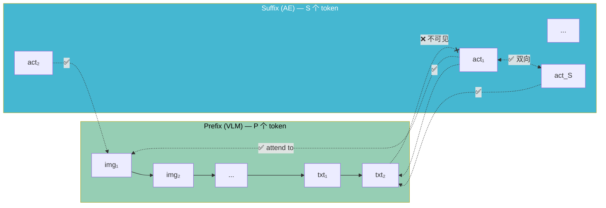
```mermaid
graph LR
    subgraph Prefix["Prefix (VLM) — P 个 token"]
        P0["img₁"] --> P1["img₂"] --> P2["..."] --> P3["txt₁"] --> P4["txt₂"]
    end
    
    subgraph Suffix["Suffix (AE) — S 个 token"]
        S0["act₁"]
        S1["act₂"]
        S2["..."]
        S3["act_S"]
    end
    
    S0 -.->|"✅ attend to"| P0
    S0 -.->|"✅"| P4
    S1 -.->|"✅"| P0
    S3 -.->|"✅"| P4
    S0 <-.->|"✅ 双向"| S3
    
    P4 -.-x|"❌ 不可见"| S0
    
    style Prefix fill:#96ceb4,color:#000
    style Suffix fill:#45b7d1,color:#fff
```

**关键结论**：
- Suffix 能 attend to **全部** prefix → 梯度从 suffix 流向 prefix 的 K/V
- Prefix **不能** attend to suffix → prefix 的 Q 不参与 suffix output 计算
- Suffix 内部**双向**可见 → 所有 action token 共享信息

---

### 11.4 单层前向路径的依赖关系

有了共享头维度和注意力掩码的理解，我们可以精确分析单层 merged attention 中 suffix output 的依赖关系。

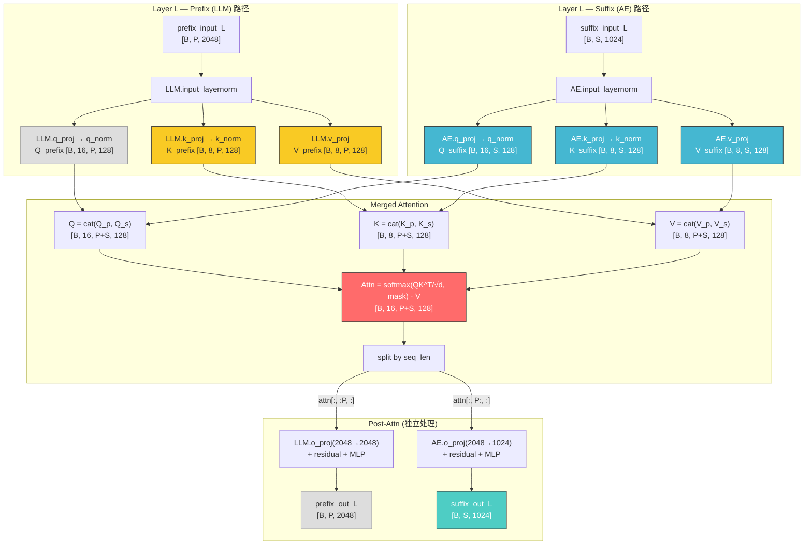
```mermaid
graph TD
    subgraph "Layer L — Prefix (LLM) 路径"
        PI["prefix_input_L<br/>[B, P, 2048]"]
        PLN["LLM.input_layernorm"]
        PQ["LLM.q_proj → q_norm<br/>Q_prefix [B, 16, P, 128]"]
        PK["LLM.k_proj → k_norm<br/>K_prefix [B, 8, P, 128]"]
        PV["LLM.v_proj<br/>V_prefix [B, 8, P, 128]"]
    end
    
    subgraph "Layer L — Suffix (AE) 路径"
        SI["suffix_input_L<br/>[B, S, 1024]"]
        SLN["AE.input_layernorm"]
        SQ["AE.q_proj → q_norm<br/>Q_suffix [B, 16, S, 128]"]
        SK["AE.k_proj → k_norm<br/>K_suffix [B, 8, S, 128]"]
        SV["AE.v_proj<br/>V_suffix [B, 8, S, 128]"]
    end
    
    subgraph "Merged Attention"
        MQ["Q = cat(Q_p, Q_s)<br/>[B, 16, P+S, 128]"]
        MK["K = cat(K_p, K_s)<br/>[B, 8, P+S, 128]"]
        MV["V = cat(V_p, V_s)<br/>[B, 8, P+S, 128]"]
        ATTN["Attn = softmax(QK^T/√d, mask) · V<br/>[B, 16, P+S, 128]"]
        SPLIT["split by seq_len"]
    end
    
    subgraph "Post-Attn (独立处理)"
        PO["LLM.o_proj(2048→2048)<br/>+ residual + MLP"]
        SO["AE.o_proj(2048→1024)<br/>+ residual + MLP"]
        POUT["prefix_out_L<br/>[B, P, 2048]"]
        SOUT["suffix_out_L<br/>[B, S, 1024]"]
    end
    
    PI --> PLN --> PQ & PK & PV
    SI --> SLN --> SQ & SK & SV
    
    PQ --> MQ
    SQ --> MQ
    PK --> MK
    SK --> MK
    PV --> MV
    SV --> MV
    
    MQ --> ATTN
    MK --> ATTN
    MV --> ATTN
    ATTN --> SPLIT
    
    SPLIT -->|"attn[:, :P, :]"| PO --> POUT
    SPLIT -->|"attn[:, P:, :]"| SO --> SOUT
    
    style PQ fill:#ddd,stroke:#999,color:#333
    style PK fill:#f9ca24,stroke:#333,color:#333
    style PV fill:#f9ca24,stroke:#333,color:#333
    style SQ fill:#45b7d1,stroke:#333,color:#fff
    style SK fill:#45b7d1,stroke:#333,color:#fff
    style SV fill:#45b7d1,stroke:#333,color:#fff
    style ATTN fill:#ff6b6b,stroke:#333,color:#fff
    style POUT fill:#ddd,stroke:#999,color:#333
    style SOUT fill:#4ecdc4,stroke:#333,color:#fff
```

**图例**：🟡 黄色 = 参与 suffix output 计算的 prefix 参数（K/V）| ⚪ 灰色 = 不参与 suffix output 计算（Q_prefix, prefix_out）| 🔵 蓝色 = Action Expert 参数 | 🟢 绿色 = suffix output（连接 loss）

#### Suffix Output 的数学依赖

在 merged attention 中，suffix 部分的注意力输出为：

$$O_s = \text{softmax}\left(\frac{Q_s \cdot [K_p; K_s]^T}{\sqrt{d}}\right) \cdot [V_p; V_s]$$

展开为 prefix 和 suffix 两部分的贡献：

$$O_s = \underbrace{A_{s \to p} \cdot V_p}_{\text{suffix 对 prefix 的注意力}} + \underbrace{A_{s \to s} \cdot V_s}_{\text{suffix 的自注意力}}$$

其中 attention weights：

$$A_{s \to p}^{(i,j)} = \frac{\exp(Q_s^{(i)} \cdot K_p^{(j)} / \sqrt{d})}{\sum_{k \in \text{all}} \exp(Q_s^{(i)} \cdot K_k / \sqrt{d})}$$

**关键观察**：$O_s$ 依赖于 $K_p$ 和 $V_p$（LLM 的 K/V 投影输出），但**不依赖**于 $Q_p$（LLM 的 Q 投影输出）。这是因为注意力掩码阻止 prefix attend to suffix，所以 $Q_p$ 只影响 $O_p$（prefix 的注意力输出），而 $O_p$ 不连接 loss。

---

### 11.5 逐层梯度流分析 — Layer 27（最后一层）

这是理解"部分隔离"的核心。从 loss 出发，梯度最先到达 layer 27。

#### 11.5.1 Forward 路径回顾

```
Layer 27 forward:
① prenorm_p_27 = LLM.layers[27].input_layernorm(prefix_in_27)
② Q_p_27, K_p_27, V_p_27 = q/k/v_proj(prenorm_p_27)
③ Merged Attention → O_p_27, O_s_27
④ attn_p = LLM.layers[27].o_proj(O_p_27)                     ← 不连接 loss
⑤ prefix_res1_27 = prefix_in_27 + attn_p                     ← 不连接 loss
⑥ prefix_out_27 = prefix_res1_27 + MLP(post_LN(prefix_res1_27)) ← 不连接 loss
⑦ suffix_out 同理... → 连接到 action_out_proj → v_t → loss   ← ✅ 连接 loss
```

**`prefix_out_27` 是计算图的死端**：
```python
# dm0_arch.py:489-505
(prefix_out, suffix_out), _ = self._merged_attention_forward(...)

# 只使用 suffix_out:
suffix_out_final = suffix_out[:, -self.model.config.chunk_size :]
v_t = self.model.action_out_proj(suffix_out_final)
action_loss = F.mse_loss(v_t, u_t, reduction="mean")
# prefix_out 从未被使用！
```

#### 11.5.2 Layer 27 的梯度流

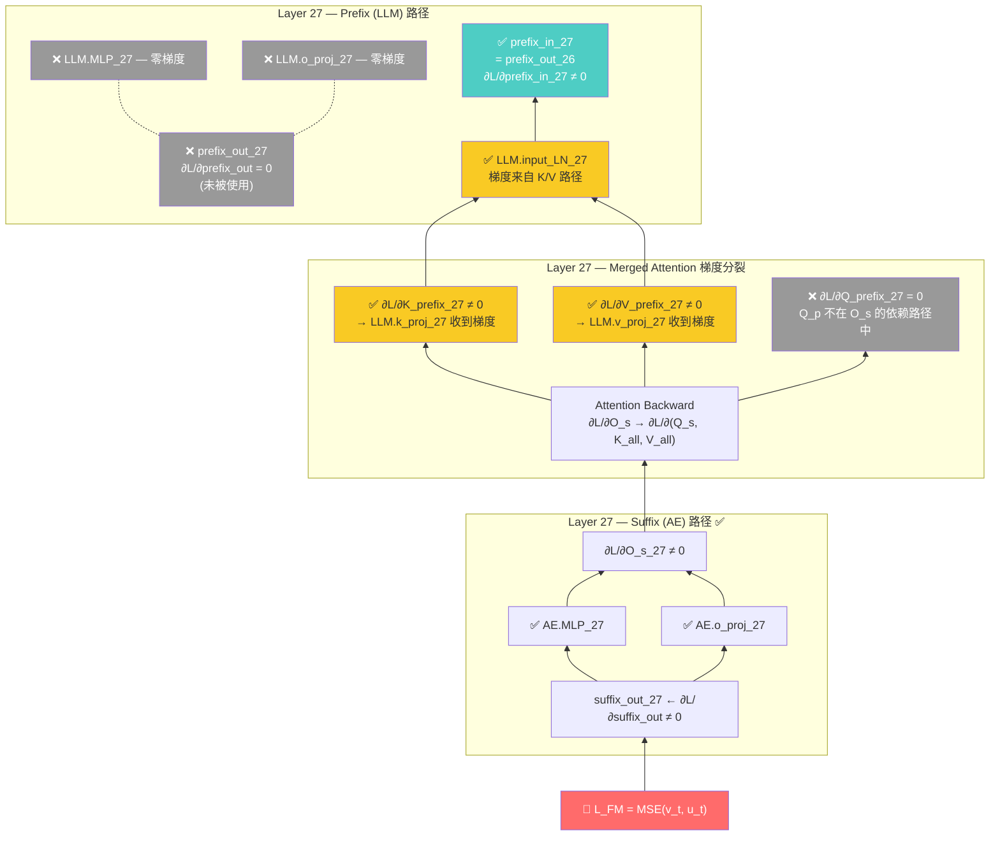
```mermaid
graph BT
    LOSS["🔴 L_FM = MSE(v_t, u_t)"]
    
    subgraph "Layer 27 — Suffix (AE) 路径 ✅"
        SO27["suffix_out_27 ← ∂L/∂suffix_out ≠ 0"]
        S_MLP27["✅ AE.MLP_27"]
        S_O27["✅ AE.o_proj_27"]
        S_ATTN27["∂L/∂O_s_27 ≠ 0"]
    end
    
    subgraph "Layer 27 — Merged Attention 梯度分裂"
        ATTN_BACK["Attention Backward<br/>∂L/∂O_s → ∂L/∂(Q_s, K_all, V_all)"]
        
        DL_KP27["✅ ∂L/∂K_prefix_27 ≠ 0<br/>→ LLM.k_proj_27 收到梯度"]
        DL_VP27["✅ ∂L/∂V_prefix_27 ≠ 0<br/>→ LLM.v_proj_27 收到梯度"]
        DL_QP27["❌ ∂L/∂Q_prefix_27 = 0<br/>Q_p 不在 O_s 的依赖路径中"]
    end
    
    subgraph "Layer 27 — Prefix (LLM) 路径"
        PO27["❌ prefix_out_27<br/>∂L/∂prefix_out = 0<br/>(未被使用)"]
        P_MLP27["❌ LLM.MLP_27 — 零梯度"]
        P_O27["❌ LLM.o_proj_27 — 零梯度"]
        PLN27["✅ LLM.input_LN_27<br/>梯度来自 K/V 路径"]
        PIN27["✅ prefix_in_27<br/>= prefix_out_26<br/>∂L/∂prefix_in_27 ≠ 0"]
    end
    
    LOSS --> SO27 --> S_MLP27 & S_O27 --> S_ATTN27
    S_ATTN27 --> ATTN_BACK
    ATTN_BACK --> DL_KP27 & DL_VP27 & DL_QP27
    
    PO27 -.- P_MLP27 & P_O27
    
    DL_KP27 --> PLN27
    DL_VP27 --> PLN27
    PLN27 --> PIN27
    
    style LOSS fill:#ff6b6b,color:#fff
    style PO27 fill:#999,color:#fff
    style P_MLP27 fill:#999,color:#fff
    style P_O27 fill:#999,color:#fff
    style DL_QP27 fill:#999,color:#fff
    style DL_KP27 fill:#f9ca24,color:#333
    style DL_VP27 fill:#f9ca24,color:#333
    style PLN27 fill:#f9ca24,color:#333
    style PIN27 fill:#4ecdc4,color:#fff
```

#### 11.5.3 Layer 27 LLM 各参数的梯度状态

| LLM 参数 (Layer 27) | 梯度来源 | 梯度值 | 推导 |
|---|---|---|---|
| `k_proj.weight` | $A_{s \to p}$ 中 $K_p$ 对 softmax 的影响 | **≠ 0** | $\frac{\partial L}{\partial K_p} = \frac{\partial L}{\partial A} \cdot \frac{\partial A}{\partial K_p} \neq 0$ |
| `k_norm` | K 路径 | **≠ 0** | 同上 |
| `v_proj.weight` | $O_s = A_{s \to p} \cdot V_p$ | **≠ 0** | $\frac{\partial L}{\partial V_p} = A_{s \to p}^T \cdot \frac{\partial L}{\partial O_s} \neq 0$ |
| `input_layernorm` | K, V 路径的共同前驱 | **≠ 0** | $\frac{\partial L}{\partial \text{LN}} = \frac{\partial L}{\partial K_p} \cdot \frac{\partial K}{\partial \text{LN}} + \frac{\partial L}{\partial V_p} \cdot \frac{\partial V}{\partial \text{LN}}$ |
| **`q_proj.weight`** | $Q_p$ 只影响 $O_p$，$O_p$ 不连接 loss | **= 0** | $\frac{\partial L}{\partial Q_p} = \frac{\partial L}{\partial O_p} \cdot \frac{\partial O_p}{\partial Q_p} = 0 \cdot (\cdot) = 0$ |
| **`q_norm`** | Q 路径 | **= 0** | 同上 |
| **`o_proj.weight`** | prefix 的 o_proj 只影响 prefix_out | **= 0** | $\frac{\partial L}{\partial \text{o\_proj}_p} = \frac{\partial L}{\partial \text{prefix\_out}} \cdot (\cdot) = 0$ |
| **`post_attention_layernorm`** | prefix_out 路径 | **= 0** | 同上 |
| **`mlp (gate/up/down)`** | prefix_out 路径 | **= 0** | 同上 |

**Layer 27 小结**：LLM 的 layer 27 中，只有 **2/5** 的主要参数组（k_proj+k_norm, v_proj）收到梯度。q_proj, o_proj, MLP 三个参数组的梯度为零。这就是 **K/V 瓶颈效应**。

---

### 11.6 逐层梯度流分析 — Layers 0-26

Layer 27 的 K/V 梯度通过 `input_layernorm` 反向传播到达 `prefix_in_27`，而 `prefix_in_27 = prefix_out_26`。这意味着 **layer 26 的输出有非零梯度**。

#### 11.6.1 关键转变：从 K/V 瓶颈到全参数梯度

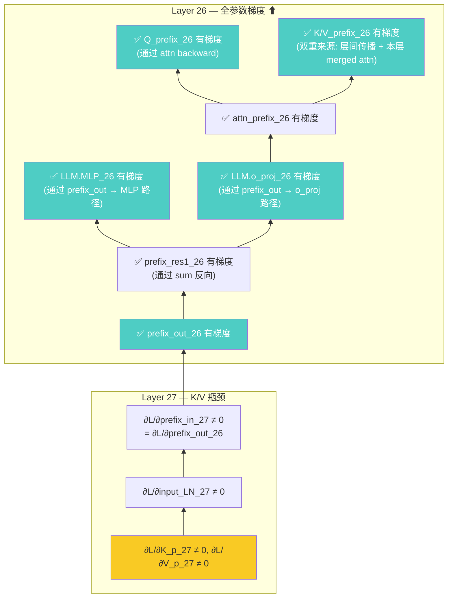
```mermaid
graph BT
    subgraph "Layer 27 — K/V 瓶颈"
        L27_KV["∂L/∂K_p_27 ≠ 0, ∂L/∂V_p_27 ≠ 0"]
        L27_LN["∂L/∂input_LN_27 ≠ 0"]
        L27_PIN["∂L/∂prefix_in_27 ≠ 0<br/>= ∂L/∂prefix_out_26"]
    end
    
    subgraph "Layer 26 — 全参数梯度 ⬆"
        L26_OUT["✅ prefix_out_26 有梯度"]
        L26_RES["✅ prefix_res1_26 有梯度<br/>(通过 sum 反向)"]
        L26_MLP["✅ LLM.MLP_26 有梯度<br/>(通过 prefix_out → MLP 路径)"]
        L26_O["✅ LLM.o_proj_26 有梯度<br/>(通过 prefix_out → o_proj 路径)"]
        L26_ATTN["✅ attn_prefix_26 有梯度"]
        L26_Q["✅ Q_prefix_26 有梯度<br/>(通过 attn backward)"]
        L26_KV["✅ K/V_prefix_26 有梯度<br/>(双重来源: 层间传播 + 本层 merged attn)"]
    end
    
    L27_KV --> L27_LN --> L27_PIN
    L27_PIN --> L26_OUT
    L26_OUT --> L26_RES
    L26_RES --> L26_MLP
    L26_RES --> L26_O --> L26_ATTN
    L26_ATTN --> L26_Q
    L26_ATTN --> L26_KV
    
    style L27_KV fill:#f9ca24,color:#333
    style L26_OUT fill:#4ecdc4,color:#fff
    style L26_MLP fill:#4ecdc4,color:#fff
    style L26_O fill:#4ecdc4,color:#fff
    style L26_Q fill:#4ecdc4,color:#fff
    style L26_KV fill:#4ecdc4,color:#fff
```

#### 11.6.2 Layer 26 梯度的数学推导

**Step 1**：梯度从 layer 27 进入 layer 26

$$\frac{\partial \mathcal{L}}{\partial \text{prefix\_out}_{26}} = \frac{\partial \mathcal{L}}{\partial \text{prefix\_in}_{27}} = \frac{\partial \mathcal{L}}{\partial \text{prenorm}_{27}} \cdot \frac{\partial \text{LN}_{27}}{\partial \text{prefix\_in}_{27}} \neq 0$$

**Step 2**：Layer 26 的前向计算为

$$\text{prefix\_out}_{26} = \underbrace{\text{prefix\_in}_{26} + \text{o\_proj}_p(\text{attn}_p)}_{\text{prefix\_res1}_{26}} + \text{MLP}(\text{post\_LN}(\text{prefix\_res1}_{26}))$$

因为 $\frac{\partial \mathcal{L}}{\partial \text{prefix\_out}_{26}} \neq 0$，通过链式法则：

$$\frac{\partial \mathcal{L}}{\partial \text{MLP}_{26}} = \frac{\partial \mathcal{L}}{\partial \text{prefix\_out}_{26}} \cdot \frac{\partial \text{prefix\_out}_{26}}{\partial \text{MLP}_{26}} \neq 0$$

$$\frac{\partial \mathcal{L}}{\partial \text{o\_proj}_{p,26}} = \frac{\partial \mathcal{L}}{\partial \text{prefix\_res1}_{26}} \cdot \frac{\partial \text{prefix\_res1}_{26}}{\partial \text{o\_proj}} \neq 0$$

$$\frac{\partial \mathcal{L}}{\partial \text{attn}_{p,26}} \neq 0 \implies \frac{\partial \mathcal{L}}{\partial Q_{p,26}} \neq 0$$

**Step 3**：Layer 26 的 K/V 路径有**双重梯度来源**

1. **层间传播路径**：`prefix_out_26` 的梯度 → `prefix_res1_26` → `o_proj` → `attn_p_26` → 通过 attention backward → `K_p_26`, `V_p_26`
2. **本层 merged attention 路径**：suffix 在 layer 26 也 attend to prefix，产生额外的 `∂L/∂K_p_26`, `∂L/∂V_p_26`

两条路径的梯度**叠加**，layer 26 的 K/V 梯度比 layer 27 的**更强**。

**Step 4**：梯度继续向 layer 25, 24, ..., 0 传播，模式与 layer 26 相同。

#### 11.6.3 全层梯度状态总结

| 层范围 | q_proj | k_proj | v_proj | o_proj | MLP | input_LN | post_attn_LN | 梯度来源 |
|---|:---:|:---:|:---:|:---:|:---:|:---:|:---:|---|
| Layer 27 | ❌ | ✅ | ✅ | ❌ | ❌ | ✅ | ❌ | 仅 merged attn K/V |
| Layers 0-26 | ✅ | ✅ | ✅ | ✅ | ✅ | ✅ | ✅ | 层间传播 + merged attn K/V |
| llm.norm | ❌ | — | — | — | — | — | — | prefix_out 未使用 |
| llm.embed_tokens | ✅ | — | — | — | — | — | — | layer 0 的梯度 |
| mm_projector | ✅ | — | — | — | — | — | — | layer 0 的梯度 |
| mm_vision_tower | ✅ | — | — | — | — | — | — | layer 0 → projector 的梯度 |

---

### 11.7 梯度信号强度的逐层衰减分析

虽然 layers 0-26 的所有参数都有梯度，但梯度的**强度（magnitude）**在从 action expert 穿过 merged attention 到达 VLM 时会经历显著衰减。

#### 11.7.1 K/V 瓶颈的衰减效应

在 layer 27，梯度从 suffix output 到 prefix K/V 的传递经过两个衰减因素：

**因素 1 — Attention Weight 稀释**

$$\frac{\partial \mathcal{L}}{\partial V_{p}} = A_{s \to p}^T \cdot \frac{\partial \mathcal{L}}{\partial O_s}$$

$A_{s \to p}$ 是 suffix 对 prefix 的 attention weight。由于 softmax 归一化，如果 suffix 的注意力主要集中在自身（$A_{s \to s}$ 大），则 $A_{s \to p}$ 较小，导致传递到 $V_p$ 的梯度**按 attention weight 比例衰减**。

$$\sum_{j \in \text{prefix}} A_{s \to p}^{(i,j)} + \sum_{j \in \text{suffix}} A_{s \to s}^{(i,j)} = 1$$

在典型的 DM0 训练中：
- Prefix 有 ~200 tokens（图像 + 语言）
- Suffix 有 50 tokens（action chunk）
- 总共 ~250 个 key-value 对

如果注意力均匀分布，prefix 约获得 200/250 = 80% 的注意力权重。但实际上，经过训练后注意力分布会集中于信息量最大的 tokens，分布不均匀。

**因素 2 — 维度压缩**

传递到 VLM 的梯度信号要通过 K/V 投影（每个是 `hidden_size × num_kv_heads × head_dim` 的线性变换），梯度路径窄于直接的 hidden_states 路径。

#### 11.7.2 逐层梯度强度图

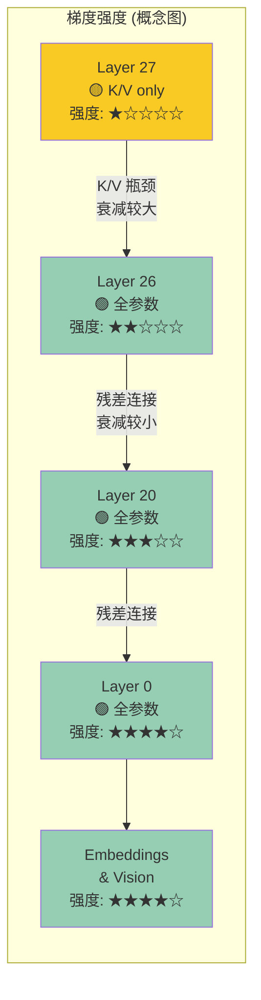
```mermaid
graph LR
    subgraph "梯度强度 (概念图)"
        L27["Layer 27<br/>🟡 K/V only<br/>强度: ★☆☆☆☆"]
        L26["Layer 26<br/>🟢 全参数<br/>强度: ★★☆☆☆"]
        L20["Layer 20<br/>🟢 全参数<br/>强度: ★★★☆☆"]
        L0["Layer 0<br/>🟢 全参数<br/>强度: ★★★★☆"]
        EMB["Embeddings<br/>& Vision<br/>强度: ★★★★☆"]
    end
    
    L27 -->|"K/V 瓶颈<br/>衰减较大"| L26
    L26 -->|"残差连接<br/>衰减较小"| L20
    L20 -->|"残差连接"| L0
    L0 --> EMB
    
    style L27 fill:#f9ca24,color:#333
    style L26 fill:#96ceb4,color:#333
    style L20 fill:#96ceb4,color:#333
    style L0 fill:#96ceb4,color:#333
    style EMB fill:#96ceb4,color:#333
```

**注意**：上图中 layers 0-26 的梯度强度看似"恢复"了，这是因为 Transformer 的**残差连接**（residual connection）提供了直接的梯度通路（$\frac{\partial \text{out}}{\partial \text{in}} = 1 + \cdots$），避免了深层网络的梯度消失。一旦梯度通过 layer 27 的 K/V 瓶颈进入 layer 26 的 `prefix_out`，之后的传播效率与标准 Transformer backward 相同。

**但梯度的"初始能量"已经被 layer 27 的 K/V 瓶颈衰减了**。也就是说，**action_loss 对 VLM 的梯度信号本身就弱于如果有直接 L_AR loss 的情况**。

---

### 11.8 代码级验证 — 无梯度阻断

为确保上述分析的正确性，我们在代码中验证确实没有任何梯度阻断操作。

**搜索结果**：

| 关键词 | `dm0_arch.py` 出现次数 | 位置 |
|---|---|---|
| `.detach()` | **0 次** | — |
| `torch.no_grad()` | 2 次 | 仅在 `inference_action` (L516) 和 `generate` (L646)，都是推理方法 |
| `stop_gradient` | 0 次 | — |
| `requires_grad_(False)` | 0 次 | — |

**optimizer 配置确认** ([dm0_exp.py:215-225](dexbotic/exp/dm0_exp.py#L215-L225)):
```python
def _get_optimizer_grouped_parameters(self, model):
    return [{
        "params": [p for n, p in model.named_parameters() if p.requires_grad],
        "weight_decay": self.weight_decay,   # 1e-10
    }]
```

单一参数组，统一学习率 `2.5e-5`，所有 `requires_grad=True` 的参数都在 optimizer 中。**没有对 VLM 参数设置不同的学习率或排除出 optimizer。**

**model 构建确认** ([dm0_exp.py:203-205](dexbotic/exp/dm0_exp.py#L203-L205)):
```python
def build_model(self) -> DM0ForCausalLM:
    model = DM0ForCausalLM.from_pretrained(self.model_name_or_path)
    return model  # ← 不调用 _freeze_model()
```

不调用 `_freeze_model()`，所有参数保持 `requires_grad=True`。

---

### 11.9 为什么称之为"间接的/部分的梯度隔离效果"

回到 [dm0_lAr.md](./dm0_lAr.md) §4.3 的问题，"间接的/部分的"这个描述实际上有三层含义：

#### 第一层："间接" — 没有显式阻断代码

与论文描述的 Knowledge Insulation 不同，代码中没有任何 `.detach()`、`torch.no_grad()`、独立 optimizer 或不同学习率。所谓的"隔离"完全是**架构层面的自然结果**，不是开发者刻意编码的。

#### 第二层："部分" — Last Layer K/V 瓶颈

最后一层的梯度通路被限制为仅 K/V 两条路径（占 transformer 层参数的约 2/5），q_proj、o_proj、MLP 的梯度为零。这不是完全阻断，但确实减弱了梯度信号。

#### 第三层："部分" — 单向注意力掩码

prefix 不能 attend to suffix，这限制了耦合的方向：
- **suffix → prefix**: 通过 K/V 路径有梯度 ✅
- **prefix → suffix**: 无梯度路径 ❌（掩码阻止）

这意味着 VLM 的 Q 投影和 output 路径在最后一层不被 action_loss 影响，但 K/V 投影仍然被影响。

#### 总结对比

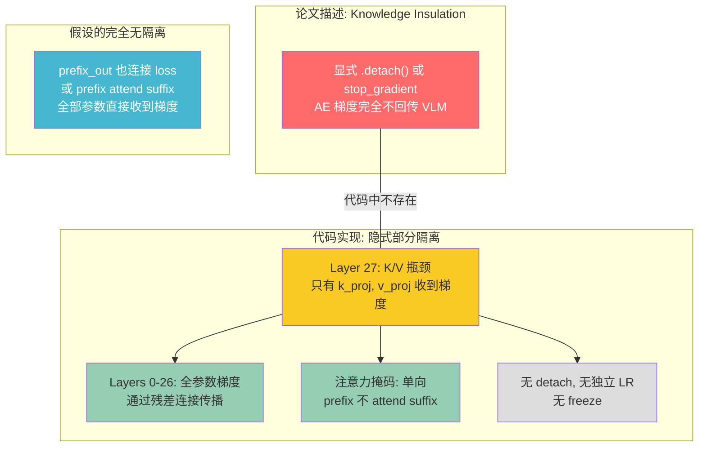
```mermaid
graph TD
    subgraph "论文描述: Knowledge Insulation"
        KI["显式 .detach() 或 stop_gradient<br/>AE 梯度完全不回传 VLM"]
    end
    
    subgraph "代码实现: 隐式部分隔离"
        IMP1["Layer 27: K/V 瓶颈<br/>只有 k_proj, v_proj 收到梯度"]
        IMP2["Layers 0-26: 全参数梯度<br/>通过残差连接传播"]
        IMP3["注意力掩码: 单向<br/>prefix 不 attend suffix"]
        IMP4["无 detach, 无独立 LR<br/>无 freeze"]
    end
    
    subgraph "假设的完全无隔离"
        NO_ISO["prefix_out 也连接 loss<br/>或 prefix attend suffix<br/>全部参数直接收到梯度"]
    end
    
    KI ---|"代码中不存在"| IMP1
    IMP1 --> IMP2
    IMP1 --> IMP3
    IMP1 --> IMP4
    
    style KI fill:#ff6b6b,color:#fff
    style IMP1 fill:#f9ca24,color:#333
    style IMP2 fill:#96ceb4,color:#333
    style IMP3 fill:#96ceb4,color:#333
    style IMP4 fill:#ddd,color:#333
    style NO_ISO fill:#45b7d1,color:#fff
```

---

### 11.10 VLM 各模块的梯度状态最终汇总

| VLM 模块 | requires_grad | 收到梯度 | 被 update | 梯度来源 |
|---|:---:|:---:|:---:|---|
| `llm.layers[27].k_proj` | ✅ | ✅ | ✅ | merged attn K 路径 |
| `llm.layers[27].k_norm` | ✅ | ✅ | ✅ | merged attn K 路径 |
| `llm.layers[27].v_proj` | ✅ | ✅ | ✅ | merged attn V 路径 |
| `llm.layers[27].input_layernorm` | ✅ | ✅ | ✅ | K/V 的共同前驱 |
| `llm.layers[27].q_proj` | ✅ | ❌ | ❌* | Q_p 不在 O_s 路径中 |
| `llm.layers[27].q_norm` | ✅ | ❌ | ❌* | 同上 |
| `llm.layers[27].o_proj` | ✅ | ❌ | ❌* | prefix_out 未使用 |
| `llm.layers[27].post_attn_LN` | ✅ | ❌ | ❌* | prefix_out 未使用 |
| `llm.layers[27].mlp.*` | ✅ | ❌ | ❌* | prefix_out 未使用 |
| `llm.layers[0-26].*` (全部) | ✅ | ✅ | ✅ | 层间传播 + merged attn |
| `llm.norm` | ✅ | ❌ | ❌* | prefix_out 未使用 |
| `llm.embed_tokens` | ✅ | ✅ | ✅ | layer 0 的梯度 |
| `mm_projector` | ✅ | ✅ | ✅ | layer 0 → 图像路径 |
| `mm_vision_tower` (全部) | ✅ | ✅ | ✅ | layer 0 → projector → VT |
| `lm_head` | ✅ | ❌ | ❌* | forward 不调用 |

> \* 标记 ❌ 的参数：梯度为零，唯一的权重变化来自 `weight_decay=1e-10`（可忽略）。`ddp_find_unused_parameters=True` ([trainer.py:165](dexbotic/exp/trainer.py#L165)) 确保 DDP 不因这些未使用参数报错。

---

### 11.11 优势与劣势分析

#### 11.11.1 这种隐式部分隔离的优势

**1. 代码简洁性**

无需 `.detach()`、独立 optimizer、多参数组等复杂的梯度管理代码。整个训练流程只需一个 optimizer、一个 loss、一次 backward。

**2. VLM 可以被 action_loss "调教" 为更好的特征提取器**

VLM 的 K/V 投影被 action_loss 优化，意味着 VLM 会逐渐学会提取**对动作预测有用的视觉和语言特征**。这种端到端训练可能比冻结 VLM 更有效，因为 VLM 的特征不一定为机器人控制而优化。

**3. K/V 瓶颈提供自然的梯度衰减**

action_loss 的梯度不是直接、全量地灌入 VLM，而是通过 attention weight 的加权和 K/V 投影的维度压缩自然衰减。这比 "全梯度" 更温和，比 "完全隔离" 更有信号。

**4. 最后一层的 Q/O/MLP 保护**

最后一层的 q_proj、o_proj、MLP 不受 action_loss 影响，这保护了 VLM 最后一层的高层语义表示能力（对推理时的文本生成尤为重要）。

#### 11.11.2 这种隐式部分隔离的劣势

**1. 非真正的 Knowledge Insulation**

论文声称的 "Action Expert 梯度不回传到 VLM" 在代码中**并未实现**。VLM 的 layers 0-26 的全部参数（包括 q_proj、o_proj、MLP）都会被 action_loss 更新。长期训练可能导致 VLM 的语言理解和生成能力退化（catastrophic forgetting）。

**2. 无 L_AR 加剧退化风险**

DM0 没有 L_AR（自回归交叉熵 loss），意味着没有任何信号来保持 VLM 的文本生成能力。VLM 的 `lm_head` 在训练中不被使用，推理时的文本生成质量可能显著下降。

**有趣的线索**：DM0-base 的 [config.json](../../m/dm0/base/config.json) 中存在 `"ar_loss": true` 和 `"ar_loss_weight": 1.0` 字段，暗示 L_AR 是计划实现的，但当前代码中 `forward()` 并未读取或使用这些配置项。

**3. 无法精细控制梯度流**

隐式隔离不提供超参数来调节 "action_loss 对 VLM 的影响程度"。不像显式 `.detach()` 可以做到 0/1 的二值控制，也不像分组学习率可以做到连续控制。当前的隔离强度完全由 attention weight 分布和 K/V 维度比例决定。

**4. PEVisionTower 完全暴露**

与 CLIPVisionTower（显式 `requires_grad_(False)` 冻结）不同，DM0 的 PEVisionTower **全参数可训练**。300M+ 参数的 ViT 完全暴露在 action_loss 的梯度下，可能导致 vision encoder 过拟合到特定的动作预测任务。

| 对比 | CLIPVisionTower | PEVisionTower (DM0) |
|---|---|---|
| 冻结 | ✅ `requires_grad_(False)` | ❌ 全参数可训练 |
| 代码 | [clip_encoder.py:27](dexbotic/model/modules/mm_vision/clip/clip_encoder.py#L27) | [pe_encoder.py:36-41](dexbotic/model/modules/mm_vision/pe/pe_encoder.py#L36-L41) |
| Action_loss 梯度 | 无 | 有（通过 projector → LLM layer 0 → K/V 路径） |

**5. 梯度冲突风险**

VLM 参数同时被两种信号影响：
- Layer 27 的 K/V 路径：来自 action_loss，优化方向是"让 suffix 能更好地从 prefix 特征中提取动作相关信息"
- 无 L_AR 信号：没有保持文本能力的信号

在多任务或长期训练中，这种单一信号源可能导致 VLM 特征空间发生不可逆的漂移。

---

### 11.12 与显式 Knowledge Insulation 的对比

| 维度 | 显式 KI (论文描述) | 隐式部分隔离 (代码实现) |
|---|---|---|
| 实现方式 | `.detach()` / `stop_gradient` / 独立 optimizer | 架构自然产生 |
| VLM 梯度 | 完全为零（对具身数据） | 非零但经过 K/V 瓶颈衰减 |
| 控制粒度 | 精确：全有或全无 | 粗糙：由 attention weight 自然决定 |
| VLM 适应性 | 无（冻结时）| 有（K/V 可以适应 action 任务） |
| 灾难性遗忘风险 | 低 | 中-高（无 L_AR 保护） |
| 实现复杂度 | 中等 | 零（无额外代码） |
| 超参数 | 需要决定何时 detach | 无 |
| 适用场景 | 预训练好的大型 VLM，需要保持通用能力 | 小型 VLM 做端到端微调，不需保持文本生成 |

---

### 11.13 附录：Config 中的 ar_loss 字段与未来展望

DM0-base 的 [config.json](../../m/dm0/base/config.json) 包含以下字段：

```json
{
  "ar_loss": true,
  "ar_loss_weight": 1.0,
  "fm_loss": true,
  ...
}
```

但在 `dm0_arch.py` 的 `forward()` 中，这些字段**从未被读取或使用**。`labels` 参数虽然在函数签名中存在，但函数体内从未引用。

这强烈暗示：
1. DM0 架构**设计**上是支持双 Loss 的（$\mathcal{L}_{total} = \lambda \cdot \mathcal{L}_{AR} + \mathcal{L}_{FM}$）
2. config 已经准备好了相关字段
3. 但 `forward()` 的代码**尚未实现** L_AR 部分

如果实现 L_AR，需要在 `forward()` 中：
1. 计算 `text_logits = self.lm_head(prefix_out)`
2. 计算 `text_loss = F.cross_entropy(text_logits, labels, ignore_index=-100)`
3. 组合 `loss = self.config.ar_loss_weight * text_loss + action_loss`

这样做将把 `prefix_out` 重新连接到 loss 计算图中，消除 layer 27 的 K/V 瓶颈效应，使 VLM 的所有层、所有参数都直接收到两种 loss 的梯度。同时 L_AR 还能提供文本生成的监督信号，缓解 VLM 能力退化问题。

---

## 12. VLM 的 Text Embedding Layer 梯度分析

> 问题：`llm.embed_tokens`（文本 embedding 层）在 DM0 训练中有 gradient 计算和 weight update 吗？

### 12.1 结论

**有 gradient 计算，也会被 update，但更新是极度稀疏的。**

| 维度 | 状态 |
|---|---|
| `requires_grad` | `True` |
| 收到梯度 | ✅ |
| 被 optimizer update | ✅ 在单一参数组中，LR = 2.5e-5 |
| 梯度稀疏性 | **极稀疏** — 152,701 行中每步仅约几十行被更新 |

---

### 12.2 梯度路径追踪

#### 12.2.1 前向路径

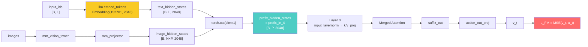
```mermaid
graph LR
    IDS["input_ids<br/>[B, L]"] --> EMB["llm.embed_tokens<br/>Embedding(152701, 2048)"]
    EMB --> TH["text_hidden_states<br/>[B, L, 2048]"]
    
    IMG["images"] --> VT["mm_vision_tower"] --> PROJ["mm_projector"]
    PROJ --> IH["image_hidden_states<br/>[B, N×P, 2048]"]
    
    TH --> CAT["torch.cat(dim=1)"]
    IH --> CAT
    CAT --> PHS["prefix_hidden_states<br/>= prefix_in_0<br/>[B, P, 2048]"]
    
    PHS --> L0["Layer 0<br/>input_layernorm → k/v_proj"]
    L0 --> MA["Merged Attention"]
    MA --> SO["suffix_out"]
    SO --> AOUT["action_out_proj"]
    AOUT --> VT2["v_t"]
    VT2 --> LOSS["L_FM = MSE(v_t, u_t)"]
    
    style EMB fill:#f9ca24,color:#333
    style LOSS fill:#ff6b6b,color:#fff
    style PHS fill:#4ecdc4,color:#fff
```

**代码路径**：

```python
# dm0_arch.py:104-106 — embed_language_tokens
def embed_language_tokens(self, tokens: torch.Tensor) -> torch.Tensor:
    return self.llm.embed_tokens(tokens)

# dm0_arch.py:339-341 — get_prefix_hidden_states 中调用
text_hidden_states = self.model.embed_language_tokens(input_ids)
hidden_states_list.append(text_hidden_states)

# dm0_arch.py:347 — 与图像嵌入拼接
hidden_states = torch.cat(hidden_states_list, dim=1)  # → prefix_hidden_states
```

`prefix_hidden_states` 随后作为 `prefix_in_0` 进入 `_merged_attention_forward` 的 layer 0。

#### 12.2.2 反向梯度路径

从 §11.6 的分析可知，layers 0-26 **全部参数**都有非零梯度。对 layer 0 而言：

$$\frac{\partial \mathcal{L}}{\partial \text{prefix\_in}_0} \neq 0$$

因为 `prefix_in_0` 同时接收来自两条路径的梯度：

1. **Layer 0 本层 K/V 路径**：suffix 在 layer 0 的 merged attention 中 attend to prefix K/V，梯度通过 `k_proj_0`, `v_proj_0` → `input_layernorm_0` → `prefix_in_0`
2. **层间残差传播路径**：layer 1 backward → `prefix_out_0` → 残差连接 → `prefix_in_0`

而 `prefix_in_0 = prefix_hidden_states = cat([image_hidden_states, text_hidden_states], dim=1)`

`torch.cat` 的反向传播会将梯度按序列维度**拆分**回各个组成部分：

$$\frac{\partial \mathcal{L}}{\partial \text{prefix\_in}_0} \xrightarrow{\text{cat backward}} \begin{cases} \frac{\partial \mathcal{L}}{\partial \text{image\_hidden\_states}} & \to \text{mm\_projector} \to \text{mm\_vision\_tower} \\[6pt] \frac{\partial \mathcal{L}}{\partial \text{text\_hidden\_states}} & \to \textbf{llm.embed\_tokens} \end{cases}$$

因此 `llm.embed_tokens` 确实收到非零梯度。

---

### 12.3 Embedding 梯度的稀疏性

Embedding 层的反向传播有一个关键特性：**梯度是按行稀疏的**。

#### 12.3.1 数学表示

设 $W \in \mathbb{R}^{V \times d}$ 为 embedding weight（$V$ = vocab_size, $d$ = hidden_size），`input_ids` 为当前 batch 中的 token id 集合。

Embedding 前向：$h_i = W[\text{input\_ids}[i]]$（查表操作）

Embedding 反向：

$$\frac{\partial \mathcal{L}}{\partial W[t]} = \sum_{i:\, \text{input\_ids}[i] = t} \frac{\partial \mathcal{L}}{\partial h_i}$$

$$\frac{\partial \mathcal{L}}{\partial W[t]} = \mathbf{0} \quad \text{当 } t \notin \{\text{input\_ids}[i]\}_{i=1}^{B \times L}$$

即：**只有在当前 batch 中出现过的 token id，其对应的 embedding 行才有非零梯度**。

#### 12.3.2 DM0 训练中的实际影响

DM0 的文本输入是固定模板 + 任务 prompt：

```
"<image>\nWhat action should the robot take to {prompt}?"
```

其中 `{prompt}` 是具体任务描述，如 `"pick up the red cup"`, `"open the drawer"` 等。

**典型 batch 的 token 构成**：

| 来源 | 示例 token | 数量（估计） |
|---|---|---|
| 固定模板 | `<image>`, `\n`, `What`, `action`, `should`, `the`, `robot`, `take`, `to` | ~10 |
| 任务 prompt | `pick`, `up`, `red`, `cup` 等 | ~5-20 |
| 特殊 token | BOS, EOS | ~2 |
| **合计** | — | **~20-30 个不同 token** |

**稀疏性**：

$$\text{更新比例} = \frac{|\text{batch 中不同 token 数}|}{V} \approx \frac{30}{152701} \approx 0.02\%$$

这意味着**每步训练仅更新约 0.02% 的 embedding 行**。经过整个训练过程，只有与机器人指令相关的高频词汇（如 `pick`, `place`, `grasp`, `open`, `close`, `cup`, `drawer` 等任务词）会被 action_loss 显著调整，绝大部分词汇的 embedding 保持不变。

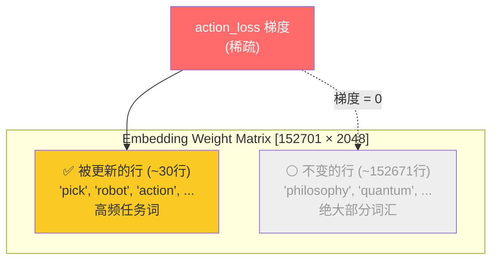
```mermaid
graph TD
    subgraph "Embedding Weight Matrix [152701 × 2048]"
        ROW_ACT["✅ 被更新的行 (~30行)<br/>'pick', 'robot', 'action', ...<br/>高频任务词"]
        ROW_IDLE["⚪ 不变的行 (~152671行)<br/>'philosophy', 'quantum', ...<br/>绝大部分词汇"]
    end
    
    GRAD["action_loss 梯度<br/>(稀疏)"] --> ROW_ACT
    GRAD -.->|"梯度 = 0"| ROW_IDLE
    
    style ROW_ACT fill:#f9ca24,color:#333
    style ROW_IDLE fill:#eee,color:#999
    style GRAD fill:#ff6b6b,color:#fff
```

---

### 12.4 与 lm_head 的关系

一个自然的问题：`llm.embed_tokens` 和 `lm_head` 是否 weight-tied？

**答案：不是。**

DM0 定义了 `tie_lm_head()` 方法（[dm0_arch.py:144-146](dexbotic/model/dm0/dm0_arch.py#L144-L146)）：
```python
def tie_lm_head(self):
    """Tie lm_head to embed_tokens (call after from_pretrained to survive weight loading)."""
    self.lm_head.weight = self.model.llm.embed_tokens.weight
```

但在 `DM0ModelConfig.build_model()`（[dm0_exp.py:203-205](dexbotic/exp/dm0_exp.py#L203-L205)）中，该方法**从未被调用**：

```python
def build_model(self) -> DM0ForCausalLM:
    model = DM0ForCausalLM.from_pretrained(self.model_name_or_path)
    return model  # ← 没有调用 model.tie_lm_head()
```

因此 `embed_tokens` 和 `lm_head` 是**独立的权重矩阵**，各自的梯度状态不同：

| 模块 | 权重形状 | 收到梯度 | 被 update | 原因 |
|---|---|---|---|---|
| `llm.embed_tokens` | [152701, 2048] | ✅（稀疏） | ✅（稀疏） | 在 forward 路径中，通过 prefix → merged attn 连接 loss |
| `lm_head` | [152701, 2048] | ❌ | ❌ | forward 中不被调用，仅推理时使用 |

如果两者 weight-tied，则 `embed_tokens` 收到的稀疏梯度也会更新 `lm_head` 的对应行。但当前实现中它们是分离的，所以 `lm_head` 的权重在训练过程中**几乎不变**（仅受 `weight_decay=1e-10` 的微小影响）。

---

### 12.5 这种稀疏更新的影响

#### 12.5.1 正面影响

- **天然的部分隔离**：绝大部分词汇的 embedding 不受 action_loss 影响，保持了预训练的语义表示
- **任务适应**：与机器人指令相关的词汇（`pick`, `place`, `grasp` 等）会被微调，使其 embedding 更适合 action prediction 的上下文
- **低风险**：即使被更新的行产生漂移，也仅影响少量任务相关词汇，不会系统性地破坏整个 embedding 空间

#### 12.5.2 潜在问题

- **embed_tokens vs lm_head 不一致**：embed_tokens 被 action_loss 更新但 lm_head 没有，两者权重逐渐不同步。如果推理时使用 lm_head 做文本生成，embedding 空间的漂移可能导致生成质量下降
- **OOV（out-of-vocabulary）效应**：训练中从未出现的 token（如 `"quantum"`, `"philosophy"`）的 embedding 完全不变，而出现过的 token 被拉向 action-relevant 的方向，可能导致 embedding 空间出现不均匀的局部畸变

---

## 13. 让 Action Loss 梯度覆盖 VLM 全部参数的方案

> **核心问题**：DM0 当前实现中，`action_loss` 的梯度无法到达 Layer 27 的 `q_proj`、`o_proj`、`MLP`，因为 `prefix_out_27` 不连接任何 loss（计算图死端）。如何让 VLM 最后一层的全部参数也得到 update？

### 13.1 问题根源回顾

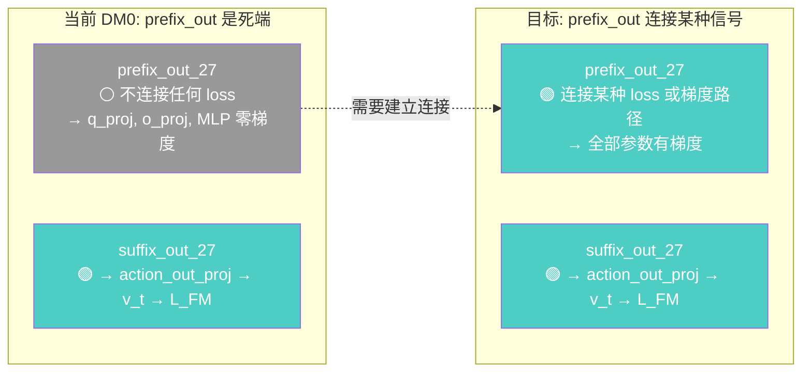
```mermaid
graph LR
    subgraph "当前 DM0: prefix_out 是死端"
        PO["prefix_out_27<br/>⚪ 不连接任何 loss<br/>→ q_proj, o_proj, MLP 零梯度"]
        SO["suffix_out_27<br/>🟢 → action_out_proj → v_t → L_FM"]
    end
    
    subgraph "目标: prefix_out 连接某种信号"
        PO2["prefix_out_27<br/>🟢 连接某种 loss 或梯度路径<br/>→ 全部参数有梯度"]
        SO2["suffix_out_27<br/>🟢 → action_out_proj → v_t → L_FM"]
    end
    
    PO -.->|"需要建立连接"| PO2
    
    style PO fill:#999,color:#fff
    style PO2 fill:#4ecdc4,color:#fff
    style SO fill:#4ecdc4,color:#fff
    style SO2 fill:#4ecdc4,color:#fff
```

本质上有两大类策略：
- **策略 A**：让 `prefix_out` 连接到某个 loss（添加信号）
- **策略 B**：让 `prefix_out` 参与 `suffix_out` 的计算（修改架构）

以下按可行性和改动量从小到大排列 7 种方案。

---

### 13.2 方案一：启用 L_AR — 自回归文本交叉熵（最直接）

> **参考**：[π0.5 Knowledge Insulation](https://arxiv.org/html/2505.23705v1)（NeurIPS 2025 Spotlight）；本代码库 [HybridPi05ForCausalLM](dexbotic/model/pi05/hybrid_pi05_arch.py#L455-L512)

#### 核心思想

在 `prefix_out` 上添加自回归交叉熵 loss，直接将 `prefix_out_27` 连入计算图。这是 DM0 论文本身描述的设计（$\mathcal{L}_{total} = \lambda \mathcal{L}_{AR} + \mathcal{L}_{FM}$），config.json 中 `"ar_loss": true` 已预留支持。

#### 梯度流变化

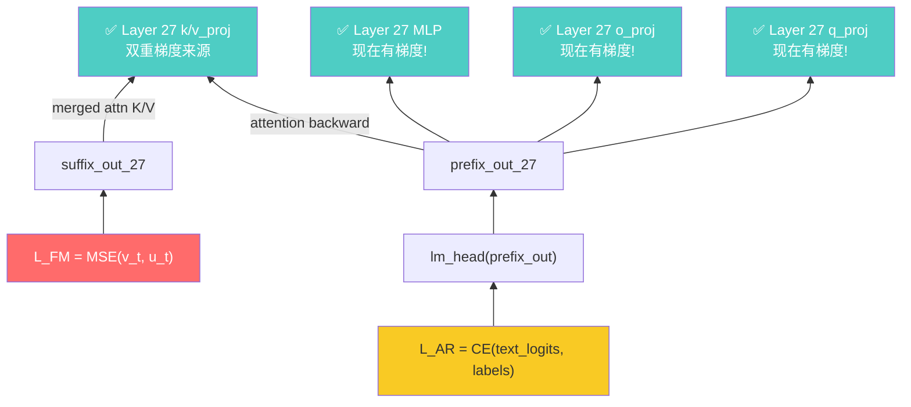
```mermaid
graph BT
    LOSS_FM["L_FM = MSE(v_t, u_t)"]
    LOSS_AR["L_AR = CE(text_logits, labels)"]
    
    SO["suffix_out_27"]
    PO["prefix_out_27"]
    LMH["lm_head(prefix_out)"]
    
    L27_Q["✅ Layer 27 q_proj<br/>现在有梯度!"]
    L27_O["✅ Layer 27 o_proj<br/>现在有梯度!"]
    L27_MLP["✅ Layer 27 MLP<br/>现在有梯度!"]
    L27_KV["✅ Layer 27 k/v_proj<br/>双重梯度来源"]
    
    LOSS_FM --> SO
    LOSS_AR --> LMH --> PO
    PO --> L27_Q & L27_O & L27_MLP
    SO -->|"merged attn K/V"| L27_KV
    PO -->|"attention backward"| L27_KV
    
    style LOSS_FM fill:#ff6b6b,color:#fff
    style LOSS_AR fill:#f9ca24,color:#333
    style L27_Q fill:#4ecdc4,color:#fff
    style L27_O fill:#4ecdc4,color:#fff
    style L27_MLP fill:#4ecdc4,color:#fff
    style L27_KV fill:#4ecdc4,color:#fff
```

#### 代码实现（参考 HybridPi05）

```python
# dm0_arch.py forward() 中添加:

# ① 计算 text logits
text_logits = self.lm_head(prefix_out)

# ② 计算 L_AR
text_loss = None
if labels is not None:
    target_tokens = labels[:, 1:]           # shifted labels
    pred_tokens = text_logits[:, :-1]
    text_loss = F.cross_entropy(
        pred_tokens.transpose(1, 2), target_tokens,
        ignore_index=IGNORE_INDEX            # -100
    )

# ③ 组合 loss
loss = action_loss
if text_loss is not None:
    loss = self.config.ar_loss_weight * text_loss + action_loss
```

#### 配套修改

| 改动点 | 内容 | 工作量 |
|---|---|---|
| 数据侧 | 需要同时输出连续动作值（给 L_FM）和离散 action token 字符串（给 L_AR），可用 `ActionNormAnd2String` + `ActionNorm` 双管线 | 中 |
| Tokenizer | 注册 255 个 action token 到 tokenizer（参考 [base_exp.py:355-367](dexbotic/exp/base_exp.py#L355-L367)） | 小 |
| 模型 | `forward()` 添加 ~15 行代码 | 小 |
| 配置 | 读取 `config.ar_loss_weight` | 小 |

#### 优势

- **论文设计的完整实现**：config.json 已预留字段，与论文 $\mathcal{L}_{total}$ 完全对应
- **代码库中已有参考实现**：[HybridPi05](dexbotic/model/pi05/hybrid_pi05_arch.py#L455-L512) 的 `text_loss` 实现可直接复用
- **双重监督**：L_AR 不仅为 VLM 全参数提供梯度，还保持文本生成能力
- **与 Knowledge Insulation 兼容**：可选择性地对 L_FM 的梯度做 `stop_gradient`（见方案五）

#### 劣势

- 需要数据管线同时输出离散 token 和连续值，增加数据预处理复杂度
- L_AR 和 L_FM 的 loss 量级可能不同，需要调节 $\lambda$ 权重
- 离散化引入量化误差（255-bin 精度约 $\pm 0.004$）

#### 可行性评估：⭐⭐⭐⭐⭐（最推荐，改动最小，效果最确定）

---

### 13.3 方案二：Prefix-Output 特征注入 — 让 prefix_out 参与 action 输出

> **参考**：[Transfusion](https://arxiv.org/abs/2408.11039)（ICLR 2025）的混合模态设计

#### 核心思想

不添加新 loss，而是让 `prefix_out` 的特征**直接参与** action 输出的计算。通过一个轻量投影将 prefix_out 注入 suffix 的 action 预测路径，使 `prefix_out_27` 不再是计算图死端。

#### 三种注入方式

**方式 A — 池化后加性融合**：

```python
# 对 prefix_out 做全局平均池化, 投影到 action_hidden, 加到 suffix_out 上
prefix_pooled = prefix_out.mean(dim=1)                      # [B, 2048]
prefix_cond = self.prefix_to_suffix_proj(prefix_pooled)     # [B, 1024]  (新模块)
suffix_out = suffix_out + prefix_cond.unsqueeze(1)          # broadcast 加到每个 suffix token
v_t = self.model.action_out_proj(suffix_out_final)          # 后续不变
```

**方式 B — Cross-Attention 融合**：

```python
# suffix_out 对 prefix_out 做 cross-attention (在 merged attention 之后)
suffix_out_refined = self.cross_attn(
    query=suffix_out,                                        # [B, S, 1024]
    key=self.prefix_kv_proj(prefix_out),                    # [B, P, 1024] (新模块)
    value=self.prefix_kv_proj(prefix_out),
)
suffix_out = suffix_out + suffix_out_refined
```

**方式 C — FiLM 条件调制**（Feature-wise Linear Modulation）：

```python
# prefix_out 生成 scale 和 shift, 对 suffix_out 做仿射变换
prefix_pooled = prefix_out.mean(dim=1)                       # [B, 2048]
gamma = self.film_gamma(prefix_pooled).unsqueeze(1)          # [B, 1, 1024]
beta = self.film_beta(prefix_pooled).unsqueeze(1)            # [B, 1, 1024]
suffix_out = gamma * suffix_out + beta
```

#### 梯度流变化

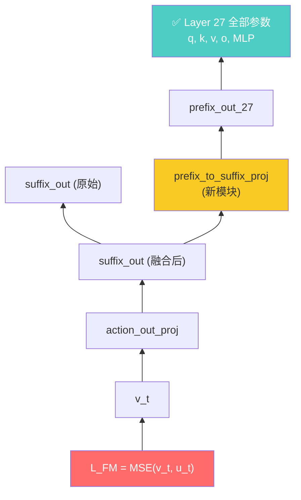
```mermaid
graph BT
    LOSS["L_FM = MSE(v_t, u_t)"]
    VT["v_t"]
    AOUT["action_out_proj"]
    SO["suffix_out (融合后)"]
    
    SO_RAW["suffix_out (原始)"]
    PO["prefix_out_27"]
    INJECT["prefix_to_suffix_proj<br/>(新模块)"]
    
    L27_ALL["✅ Layer 27 全部参数<br/>q, k, v, o, MLP"]
    
    LOSS --> VT --> AOUT --> SO
    SO --> SO_RAW
    SO --> INJECT --> PO --> L27_ALL
    
    style LOSS fill:#ff6b6b,color:#fff
    style INJECT fill:#f9ca24,color:#333
    style L27_ALL fill:#4ecdc4,color:#fff
```

#### 优势

- **无需数据侧改动**：不需要离散化动作，不需要修改 tokenizer
- **不引入额外 loss**：不需要调节 loss 权重 $\lambda$
- **prefix_out 的梯度方向一致**：梯度完全来自 action_loss，方向与任务目标一致

#### 劣势

- 引入新模块和新参数（`prefix_to_suffix_proj` 等），需要初始化策略
- 可能改变 suffix_out 的特征分布，影响已训练的 action_out_proj
- Cross-Attention 方式增加计算量（$O(S \times P)$）
- 与预训练 checkpoint 不兼容（新参数随机初始化）

#### 可行性评估：⭐⭐⭐⭐（实用，但需注意新参数的初始化和对现有权重的影响）

---

### 13.4 方案三：Co-Training — VLM 数据混合训练

> **参考**：[π0.5 Knowledge Insulation](https://www.physicalintelligence.company/download/pi05_KI.pdf)；[VLM4VLA](https://arxiv.org/abs/2601.03309)（ICLR 2026）

#### 核心思想

不仅在 robot 数据上训练，还混合 VLM 数据（image captioning、VQA、embodied QA 等）。在 VLM 数据上使用标准 L_AR，在 robot 数据上使用 L_FM。通过 `has_text` / `has_action` 掩码控制每个样本的 loss 类型。

#### 混合 Batch 设计

```
Batch 内样本混合:
┌─────────────────────────────────────────────────┐
│ Sample 0: Robot 数据   → has_action=1, has_text=0 │
│   → 只计算 L_FM (action_loss)                     │
│   → prefix_out 不连接 loss (Layer 27 K/V 瓶颈)    │
│                                                    │
│ Sample 1: VLM 数据     → has_action=0, has_text=1 │
│   → 只计算 L_AR (text_loss)                       │
│   → prefix_out 连接 loss (Layer 27 全参数有梯度) ✅│
│                                                    │
│ Sample 2: 混合数据     → has_action=1, has_text=1 │
│   → 同时计算 L_AR + L_FM                         │
│   → prefix_out 连接 loss (全参数有梯度) ✅         │
└─────────────────────────────────────────────────┘
```

#### 代码实现

```python
# forward() 中:
text_loss = None
if labels is not None:
    text_logits = self.lm_head(prefix_out)
    token_loss = F.cross_entropy(
        text_logits[:, :-1].transpose(1, 2), labels[:, 1:],
        reduction="none"
    )
    token_mask = (labels[:, 1:] != IGNORE_INDEX).float()
    sample_loss = (token_loss * token_mask).sum(-1) / token_mask.sum(-1).clamp(min=1)
    text_loss = (sample_loss * has_text.float()).sum() / (has_text.sum() + 1e-6)

action_loss = None
if actions is not None:
    # ... 现有 flow matching 代码 ...
    action_loss = (per_sample_loss * has_action.float()).sum() / (has_action.sum() + 1e-6)

loss = 0
if text_loss is not None: loss = loss + text_loss
if action_loss is not None: loss = loss + action_loss
```

#### 关键：VLM 数据覆盖 Layer 27 全参数

即使 robot 样本中 Layer 27 的 q_proj/o_proj/MLP 仍然是零梯度，但 VLM 样本中这些参数**全部收到 L_AR 梯度**。通过 batch 内梯度累积（gradient accumulation），Layer 27 的全部参数在每步中都得到来自 VLM 数据的 update。

这正是 π0.5 Knowledge Insulation 论文的核心策略：

> *"Co-training with VLM data provides an additional mechanism for knowledge preservation — the backbone simultaneously trains on image captioning, VQA, bounding box prediction, and robot planning data alongside robot action data."*

#### 优势

- **知识保持**：VLM 数据提供语义保持信号，防止 catastrophic forgetting
- **表示对齐**：VLM 任务促使 prefix_out 保持有意义的高层语义表示
- **灵活混合比例**：可通过数据混合比例（如 70% robot + 30% VLM）控制两种信号的相对强度
- **VLM4VLA 的发现**：[VLM4VLA](https://arxiv.org/abs/2601.03309) 表明 VLM 能力对 VLA 性能有正向影响，co-training 有理论支撑

#### 劣势

- 需要准备和管理 VLM 训练数据
- 混合数据的 batch 构建较复杂（需要 `has_text` / `has_action` 掩码逻辑）
- 计算开销增加（VLM 样本需要计算 text_logits）
- 两类数据的学习率、batch 比例等超参数需要调优

#### 可行性评估：⭐⭐⭐⭐（效果好，但工程量较大；代码库已有 `has_text`/`has_action` 基础设施（HybridPi05））

---

### 13.5 方案四：Embodied Spatial Scaffolding — 多层级辅助任务

> **参考**：[DM0 论文](https://arxiv.org/abs/2602.14974)的 Embodied Spatial Scaffolding 设计

#### 核心思想

DM0 论文提出的 4 层级辅助任务全部通过 L_AR 以文本形式监督，自然地将 `prefix_out` 连接到多个 loss：

```
Layer 1: 子任务预测      → "pick up the red cup"
Layer 2: 目标 bbox 预测  → "[0.3, 0.5, 0.7, 0.9]"
Layer 3: EEF 轨迹预测    → "[(0.1,0.2), (0.3,0.4), ...]"
Layer 4: 离散 action     → " 250 0 250 110 250 250 0"
```

#### 架构图

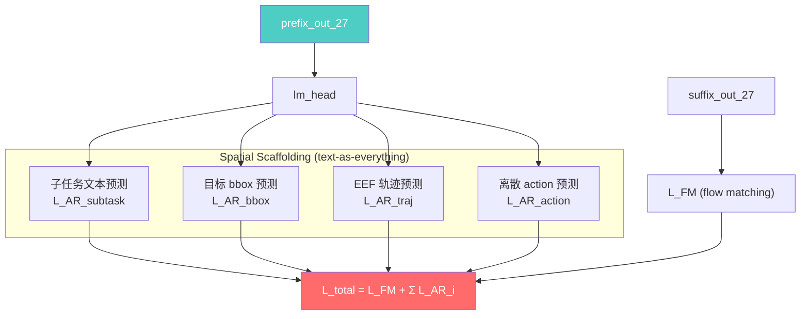
```mermaid
graph TD
    PO["prefix_out_27"]
    LMH["lm_head"]
    
    subgraph "Spatial Scaffolding (text-as-everything)"
        T1["子任务文本预测<br/>L_AR_subtask"]
        T2["目标 bbox 预测<br/>L_AR_bbox"]
        T3["EEF 轨迹预测<br/>L_AR_traj"]
        T4["离散 action 预测<br/>L_AR_action"]
    end
    
    SO["suffix_out_27"]
    FM["L_FM (flow matching)"]
    
    PO --> LMH --> T1 & T2 & T3 & T4
    SO --> FM
    
    TOTAL["L_total = L_FM + Σ L_AR_i"]
    T1 & T2 & T3 & T4 --> TOTAL
    FM --> TOTAL
    
    style PO fill:#4ecdc4,color:#fff
    style TOTAL fill:#ff6b6b,color:#fff
```

#### 优势

- **论文原始设计**：完整实现论文描述的架构
- **多尺度监督**：从高层语义（子任务）到低层控制（action token），提供层次化梯度信号
- **"text-as-everything"**：所有辅助任务统一为文本预测，无需额外的预测头

#### 劣势

- **数据标注要求高**：需要子任务描述、bbox、EEF 轨迹等多层级标注
- **实现复杂度高**：对话模板需要支持多层级结构，tokenizer 需要特殊处理
- **当前代码无基础设施**：数据管线中没有 `subtask`, `goal_bbox`, `trajectory` 等键

#### 可行性评估：⭐⭐⭐（效果可能最好，但需大量工程工作和数据标注）

---

### 13.6 方案五：Knowledge Insulation + L_AR — 带 Stop-Gradient 的双 Loss

> **参考**：[π0.5 Knowledge Insulation](https://arxiv.org/html/2505.23705v1)（NeurIPS 2025 Spotlight）

#### 核心思想

这是方案一（启用 L_AR）的**增强版**。在 merged attention 中，对 action expert 读取 VLM backbone 的 K/V 应用 `stop_gradient`（`sg`），**阻止 L_FM 的梯度回传到 VLM**，同时用 L_AR 为 VLM 提供独立的梯度信号。

这是 Physical Intelligence 在 π0.5 中实验验证的方案，被证明能实现 **7.5× 加速收敛** 且保持 VLM 语言能力。

#### 数学公式

修改 merged attention 中 suffix 对 prefix 的交叉注意力部分：

$$O_s = A_{s \to p} \cdot \text{sg}(V_p) + A_{s \to s} \cdot V_s$$

其中 attention weight 的计算也使用 stop-gradient：

$$A_{s \to p}^{(i,j)} = \frac{\exp(Q_s^{(i)} \cdot \text{sg}(K_p^{(j)}) / \sqrt{d})}{\sum_k \exp(Q_s^{(i)} \cdot K_k / \sqrt{d})}$$

$\text{sg}(\cdot)$ 是 stop-gradient 算子：前向传播正常传值，反向传播截断梯度。

#### 梯度流对比

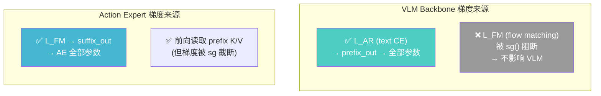
```mermaid
graph BT
    subgraph "VLM Backbone 梯度来源"
        AR["✅ L_AR (text CE)<br/>→ prefix_out → 全部参数"]
        FM_BLOCKED["❌ L_FM (flow matching)<br/>被 sg() 阻断<br/>→ 不影响 VLM"]
    end
    
    subgraph "Action Expert 梯度来源"
        FM_AE["✅ L_FM → suffix_out<br/>→ AE 全部参数"]
        FM_READ["✅ 前向读取 prefix K/V<br/>(但梯度被 sg 截断)"]
    end
    
    style AR fill:#4ecdc4,color:#fff
    style FM_BLOCKED fill:#999,color:#fff
    style FM_AE fill:#45b7d1,color:#fff
```

#### 代码实现

核心修改在 `_compute_merged_layer` 中：

```python
# dm0_arch.py:200-202 修改:
# 原代码 (无 stop-gradient):
# key_states = torch.cat(key_list, dim=2)
# value_states = torch.cat(value_list, dim=2)

# 新代码 (对 prefix K/V 应用 stop-gradient):
key_prefix = key_list[0]           # LLM 的 K
key_suffix = key_list[1]           # AE 的 K
value_prefix = value_list[0]       # LLM 的 V
value_suffix = value_list[1]       # AE 的 V

# 在拼接时对 prefix 的 K/V 应用 detach
key_states = torch.cat([key_prefix.detach(), key_suffix], dim=2)
value_states = torch.cat([value_prefix.detach(), value_suffix], dim=2)

# Q 保持原样 (prefix Q 的梯度来自 L_AR)
query_states = torch.cat(query_list, dim=2)
```

**注意**：上面的简化实现有一个问题 — `key_prefix.detach()` 会同时阻断 L_AR 对 K_prefix 的梯度。更精确的实现需要**只在 suffix 使用 prefix K/V 时 detach**，而 prefix 自身的 attention 保持正常梯度。这需要拆分 attention 计算为两部分：

```python
# 更精确的实现: 分别计算 prefix-self 和 suffix-cross attention
# Prefix self-attention (正常梯度):
attn_prefix = scaled_dot_product(Q_prefix, K_prefix, V_prefix, mask_pp)

# Suffix attention (对 prefix K/V 应用 sg):
K_for_suffix = torch.cat([K_prefix.detach(), K_suffix], dim=2)
V_for_suffix = torch.cat([V_prefix.detach(), V_suffix], dim=2)
attn_suffix = scaled_dot_product(Q_suffix, K_for_suffix, V_for_suffix, mask_sa)
```

#### 优势

- **理论最优**：VLM 只受 L_AR 监督（方向明确），AE 只受 L_FM 监督（无干扰）
- **经过大规模验证**：π0.5 在 7 种机器人构型、68+ 任务上验证有效
- **收敛快**：π0.5 报告比纯 flow matching 收敛快 7.5×
- **知识保持最好**：VLM backbone 只接收文本和离散 action 的 AR 梯度，不受 AE 随机初始化的影响

#### 劣势

- **实现复杂度最高**：需要拆分 attention 计算，或使用自定义 autograd function
- **计算开销增加**：拆分 attention 可能无法使用 Flash Attention 的优化
- **需要 L_AR 的全部配套**（数据管线、tokenizer、action tokenization）
- **与预训练 checkpoint 兼容性**：需要确保 `lm_head` 权重与预训练一致

#### 可行性评估：⭐⭐⭐⭐（效果最有保障，但实现难度较大）

---

### 13.7 方案六：表示蒸馏 — 冻结教师 VLM 的特征对齐

> **参考**：[VLMs-Guided Representation Distillation](https://openaccess.thecvf.com/content/CVPR2025/papers/Xu_VLMs-Guided_Representation_Distillation_for_Efficient_Vision-Based_Reinforcement_Learning_CVPR_2025_paper.pdf)（CVPR 2025）

#### 核心思想

保留一份**冻结的教师 VLM** 副本，对 `prefix_out` 添加特征蒸馏 loss，鼓励训练中的 VLM 保持与教师相近的特征表示。

$$\mathcal{L}_{distill} = \text{MSE}(\text{prefix\_out}_{student}, \text{sg}(\text{prefix\_out}_{teacher}))$$

$$\mathcal{L}_{total} = \mathcal{L}_{FM} + \beta \cdot \mathcal{L}_{distill}$$

#### 代码实现

```python
# 初始化时创建冻结的教师副本
self.teacher_llm = copy.deepcopy(self.model.llm)
self.teacher_llm.requires_grad_(False)

# forward() 中:
with torch.no_grad():
    teacher_prefix_out = self._run_teacher_forward(prefix_hidden_states)

distill_loss = F.mse_loss(prefix_out, teacher_prefix_out.detach())
loss = action_loss + beta * distill_loss
```

#### 优势

- **无需额外数据**：不需要 VLM 数据或离散 action token
- **知识保持强**：直接约束 VLM 表示不偏离预训练状态
- **prefix_out 全路径有梯度**：蒸馏 loss 直接作用于 prefix_out_27

#### 劣势

- **显存翻倍**：需要维护教师 VLM 的完整副本（约 1.5B 参数）
- **约束可能过强**：如果 VLM 需要适应 action 任务，强蒸馏约束可能限制适应能力
- **教师质量依赖**：教师 VLM 的特征不一定是最优的 action prediction 特征
- **$\beta$ 敏感**：过大限制适应性，过小等于没有

#### 可行性评估：⭐⭐⭐（简单但粗暴，适合快速实验验证概念）

---

### 13.8 方案七：修改注意力掩码 — 让 Prefix 也 Attend to Suffix

#### 核心思想

修改 attention mask，允许 prefix 的最后若干 token attend to suffix tokens。这样 prefix output 就会依赖于 suffix 的 K/V，使 `prefix_out_27` 通过 suffix 间接连接到 loss。

```python
# 修改 suffix attn_mask, 使 prefix 最后 K 个 token 能看到 suffix:
# 原始: prefix 全部 [1,1,...,1], suffix [1,0,...,0]
# 修改: prefix 最后 K 个 token 的 cumsum 设为与 suffix 相同
```

#### 梯度流变化

若 prefix position $p$ 能 attend to suffix position $s$：

$$O_p = A_{p \to p'} \cdot V_{p'} + A_{p \to s} \cdot V_s$$

则 $O_p$ 依赖于 $V_s$，通过 suffix 的 K/V → suffix input → loss，$O_p$ 间接连接到 loss，使得 $Q_p$（通过 attention score 计算）也获得梯度。

#### 优势

- **零新参数**：仅修改掩码张量
- **零新 loss**：不引入额外损失函数
- **最小代码改动**：仅需修改 `get_prefix_hidden_states` 中的 `attn_mask_list`

#### 劣势

- **破坏 VLM 的因果结构**：prefix tokens 看到 suffix (action) tokens，可能导致 VLM 的自回归性质被破坏
- **信息泄露**：prefix 能看到 noisy action，可能导致 VLM 学到"作弊"特征
- **训练-推理不一致**：训练时 prefix 能看到 suffix，但推理时 action 尚未生成（需要先有 prefix output 才能开始 flow matching denoising）
- **梯度方向不明确**：通过修改后的 attention backward，梯度方向可能不如直接 loss 信号清晰

#### 可行性评估：⭐⭐（技术上可行但风险较高，可能导致训练不稳定）

---

### 13.9 方案对比总结

```mermaid
graph TD
    subgraph "策略 A: 添加信号到 prefix_out"
        A1["方案一: 启用 L_AR<br/>⭐⭐⭐⭐⭐"]
        A2["方案三: Co-Training<br/>⭐⭐⭐⭐"]
        A3["方案四: Spatial Scaffolding<br/>⭐⭐⭐"]
        A4["方案六: 表示蒸馏<br/>⭐⭐⭐"]
    end
    
    subgraph "策略 B: 修改架构让 prefix_out 参与 action 计算"
        B1["方案二: 特征注入<br/>⭐⭐⭐⭐"]
        B2["方案七: 修改掩码<br/>⭐⭐"]
    end
    
    subgraph "策略 A+B 组合"
        AB["方案五: KI + L_AR<br/>⭐⭐⭐⭐"]
    end
    
    style A1 fill:#4ecdc4,color:#fff
    style AB fill:#45b7d1,color:#fff
    style A2 fill:#96ceb4,color:#333
```

| 方案 | 改动量 | 新增 Loss | 新增参数 | 新增数据 | Layer 27 全参数梯度 | VLM 知识保持 | 参考实现 |
|---|---|---|---|---|---|---|---|
| ① 启用 L_AR | 小 | CE | 无 | 离散 token | ✅ | ⭐⭐⭐ | HybridPi05 |
| ② 特征注入 | 中 | 无 | 投影层 | 无 | ✅ | ⭐⭐ | — |
| ③ Co-Training | 大 | CE | 无 | VLM 数据 | ✅ (VLM 样本) | ⭐⭐⭐⭐ | π0.5 |
| ④ Scaffolding | 大 | CE | 无 | 多级标注 | ✅ | ⭐⭐⭐⭐ | DM0 论文 |
| ⑤ KI + L_AR | 大 | CE + sg | 无 | 离散 + VLM | ✅ | ⭐⭐⭐⭐⭐ | π0.5 KI 论文 |
| ⑥ 表示蒸馏 | 中 | MSE | 教师副本 | 无 | ✅ | ⭐⭐⭐⭐ | CVPR 2025 |
| ⑦ 修改掩码 | 极小 | 无 | 无 | 无 | 部分 | ⭐ | — |

---

### 13.10 推荐实施路径

根据改动量和风险，推荐以下渐进式实施路径：

```
Phase 1 (快速验证):  方案 ① 启用 L_AR
  ↓ 验证 Layer 27 全参数有梯度, 基础性能不退化
  ↓
Phase 2 (增强保持):  方案 ① + ③ 添加 Co-Training 数据
  ↓ 验证 VLM 知识保持效果
  ↓
Phase 3 (最优方案):  方案 ⑤ 添加 Knowledge Insulation (stop-gradient)
  ↓ 解耦 L_AR 和 L_FM 的梯度, 达到 π0.5 级别的效果
```

**Phase 1 的最小可行改动**（约 20 行代码）：

```python
# dm0_arch.py forward() 末尾, loss = action_loss 之前添加:

text_loss = None
if self.config.ar_loss and labels is not None:
    text_logits = self.lm_head(prefix_out)
    shift_logits = text_logits[:, :-1, :].contiguous()
    shift_labels = labels[:, 1:].contiguous()
    text_loss = F.cross_entropy(
        shift_logits.view(-1, shift_logits.size(-1)),
        shift_labels.view(-1),
        ignore_index=IGNORE_INDEX,
    )

loss = action_loss
if text_loss is not None:
    loss = self.config.ar_loss_weight * text_loss + action_loss

outputs = CausalLMOutputDexbotic(
    loss=loss,
    text_loss=text_loss,           # 新增: 供 Trainer 日志
    action_loss=action_loss,       # 新增: 供 Trainer 日志
    logits=v_t,
    ...
)
```

---

### 13.11 参考文献

| 论文 / 资源 | 关键贡献 | 链接 |
|---|---|---|
| π0.5 Knowledge Insulation | stop-gradient on merged attention K/V, co-training recipe | [arXiv](https://arxiv.org/html/2505.23705v1), [PDF](https://www.physicalintelligence.company/download/pi05_KI.pdf) |
| π0 | VLM + Action Expert merged attention 架构, flow matching | [arXiv](https://arxiv.org/abs/2410.24164) |
| FAST | 频域 action tokenization, 解决离散化精度问题 | [arXiv](https://arxiv.org/abs/2501.09747) |
| DM0 | Embodied Spatial Scaffolding, 混合梯度策略 | [arXiv](https://arxiv.org/abs/2602.14974) |
| VLM4VLA | VLM 选择与 VLA 性能关系, vision encoder 是瓶颈 | [arXiv](https://arxiv.org/abs/2601.03309) |
| Transfusion | 单一 Transformer 混合离散 + 连续训练 | [arXiv](https://arxiv.org/abs/2408.11039) |
| VLMs-Guided Representation Distillation | 冻结 VLM 教师蒸馏 for RL | [CVPR 2025](https://openaccess.thecvf.com/content/CVPR2025/papers/Xu_VLMs-Guided_Representation_Distillation_for_Efficient_Vision-Based_Reinforcement_Learning_CVPR_2025_paper.pdf) |
| Enhancing VLA Generalization | 保持预训练表示的 VLA 训练策略 | [arXiv](https://arxiv.org/html/2509.11417v1) |
| HybridPi05 (本代码库) | 双 Loss 实现参考 | [hybrid_pi05_arch.py:455-512](dexbotic/model/pi05/hybrid_pi05_arch.py#L455-L512) |
