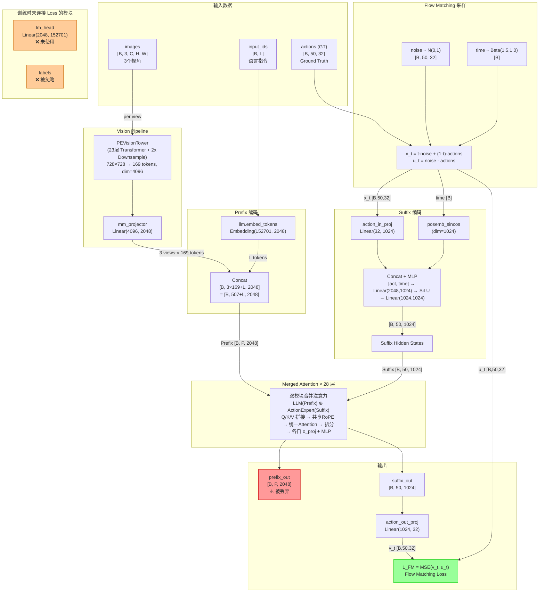
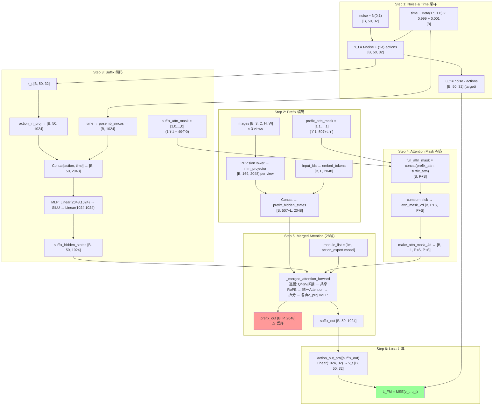
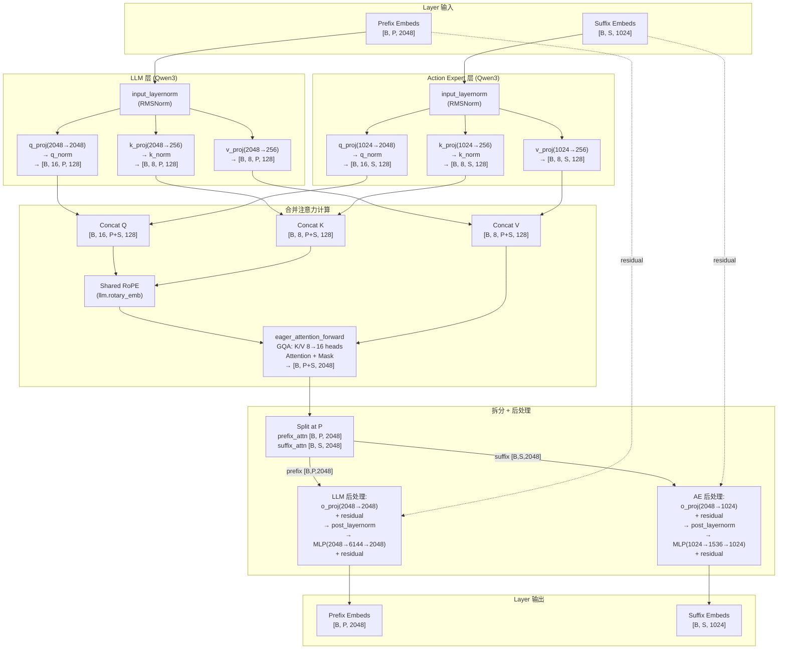
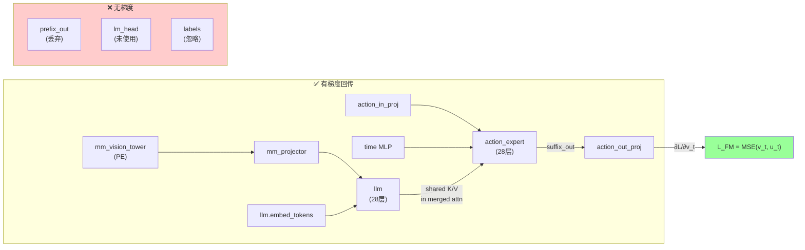
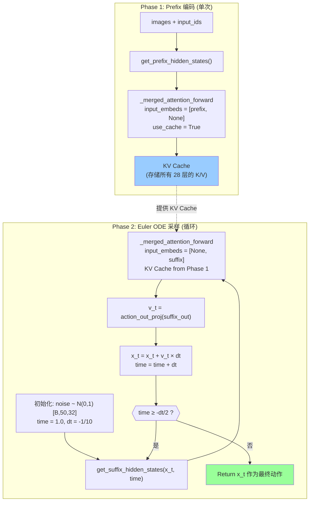

# DM0 Forward Pass 与网络架构完整分析

## 0. TL;DR

DM0 是一个基于 **Merged Attention** 的 Vision-Language-Action (VLA) 模型。它将一个 Qwen3 VLM（处理图像+语言的 Prefix）和一个 Qwen3 Action Expert（处理带噪动作的 Suffix）在每一层 Transformer 中进行 **Q/K/V 拼接 → 共享注意力计算 → 拆分回各自模块** 的合并注意力操作。训练时唯一的损失函数是 **Flow Matching MSE Loss**（L_FM），作用在 Action Expert 的输出上；VLM 侧的输出（prefix_out）被丢弃，lm_head 未参与训练 loss。

| 项目 | 值 |
|------|-----|
| LLM Backbone | Qwen3, hidden=2048, 28层, 16 Q-heads / 8 KV-heads |
| Action Expert | Qwen3, hidden=1024, 28层, 16 Q-heads / 8 KV-heads |
| Vision Tower | PE (PerceptionEncoder), 23层, 728x728, patch=14 |
| Vision Projector | linear4x: Linear(4096, 2048) |
| Action Dim | 32 |
| Chunk Size | 50 (预测 50 步动作轨迹) |
| 训练 Loss | L_FM = MSE(v_t, u_t)，仅 Flow Matching |
| 推理采样 | Euler ODE Solver, 默认 10 步 |

---

## 1. 类层次与模块组成

### 1.1 类继承关系

```
PretrainedConfig
  └─ DexboticConfig                         # dexbotic_arch.py:17
       └─ DM0Config                         # dm0_arch.py:35
            ├─ action_config: Qwen3Config   # Action Expert 的配置
            ├─ llm_config: Qwen3Config      # LLM 的配置
            ├─ action_dim: 32
            └─ chunk_size: 50

PreTrainedModel
  └─ DexboticPretrainedModel                # dexbotic_arch.py:37
       └─ DexboticVLMModel                  # dexbotic_arch.py:51
            └─ DM0Model                     # dm0_arch.py:63
                 ├─ llm (Qwen3Model)        # 继承自父类
                 ├─ mm_vision_tower (PE)     # 继承自父类
                 ├─ mm_projector (Linear4x)  # 继承自父类
                 ├─ action_expert (Qwen3ForCausalLM, embed_tokens=None)
                 ├─ action_in_proj           # Linear(32, 1024)
                 ├─ action_out_proj          # Linear(1024, 32)
                 ├─ action_time_mlp_in       # Linear(2048, 1024)
                 └─ action_time_mlp_out      # Linear(1024, 1024)

DexboticPretrainedModel + GenerationMixin
  └─ DexboticForCausalLM                    # dexbotic_arch.py:415
       └─ DM0ForCausalLM (+ ActionOutputForCausalLM)  # dm0_arch.py:128
            ├─ model: DM0Model
            └─ lm_head: Linear(2048, 152701)  # 训练时未连接 loss
```

### 1.2 模块清单

| 模块 | 类型 | 输入维度 | 输出维度 | 来源文件 |
|------|------|----------|----------|----------|
| `mm_vision_tower` | PEVisionTower | [B, 3, 728, 728] | [B, 169, 4096] | pe_model.py:367 |
| `mm_projector` | Linear(4096, 2048) | [B, 169, 4096] | [B, 169, 2048] | builder.py:51 |
| `llm` | Qwen3Model (28层) | [B, L, 2048] | [B, L, 2048] | dm0_arch.py:75 |
| `llm.embed_tokens` | Embedding(152701, 2048) | [B, L] | [B, L, 2048] | dm0_arch.py:106 |
| `action_expert` | Qwen3ForCausalLM (28层) | [B, S, 1024] | [B, S, 1024] | dm0_arch.py:79 |
| `action_in_proj` | Linear(32, 1024) | [B, 50, 32] | [B, 50, 1024] | dm0_arch.py:85 |
| `action_out_proj` | Linear(1024, 32) | [B, 50, 1024] | [B, 50, 32] | dm0_arch.py:86 |
| `action_time_mlp_in` | Linear(2048, 1024) | [B, 50, 2048] | [B, 50, 1024] | dm0_arch.py:89 |
| `action_time_mlp_out` | Linear(1024, 1024) | [B, 50, 1024] | [B, 50, 1024] | dm0_arch.py:90 |
| `lm_head` | Linear(2048, 152701) | [B, ?, 2048] | [B, ?, 152701] | dm0_arch.py:139 |

---

## 2. 网络架构全景图



---

## 3. Vision Tower (PE) 详解

### 3.1 PE_LANG_L14_728 配置

| 参数 | 值 | 说明 |
|------|-----|------|
| image_size | 728 | 输入图像尺寸 |
| patch_size | 14 | Patch 大小 |
| width | 1024 | Transformer 隐层维度 |
| layers | 23 | Transformer 层数 |
| heads | 16 | 注意力头数 |
| mlp_ratio | 4.0 | MLP 扩展比 |
| use_cls_token | True | 使用 CLS token |
| use_rope2d | True | 2D 旋转位置编码 |
| pool_type | "none" | 不做池化 |
| use_ln_post | False | 不使用后层归一化 |

> 配置来源: `pe_configuration.py:57-70`

### 3.2 数据流

```
image [B, 3, 728, 728]
  │
  ▼ Conv2d(3, 1024, kernel=14, stride=14)          ← pe_model.py:411-417
  [B, 1024, 52, 52] → reshape → [B, 2704, 1024]
  │
  ▼ 添加 CLS token + 绝对位置编码                   ← pe_model.py:527-534
  [B, 2705, 1024]
  │
  ▼ ln_pre → Transformer (23 层, RoPE2D)           ← pe_model.py:539-540
  [B, 2705, 1024]
  │
  ▼ ln_post → Strip CLS token                      ← pe_model.py:543-547
  [B, 2704, 1024]
  │
  ▼ pool("none") → 无操作                           ← pe_model.py:509
  [B, 2704, 1024]
  │
  ▼ reshape → [B, 1024, 52, 52]                    ← pe_model.py:554-559
  │
  ▼ vit_downsampler1: Conv2d(1024, 2048, k=3, s=2, p=1)  ← pe_model.py:445-451
  [B, 2048, 26, 26]
  │
  ▼ vit_downsampler2: Conv2d(2048, 4096, k=3, s=2, p=1)  ← pe_model.py:452-458
  [B, 4096, 13, 13]
  │
  ▼ reshape → [B, 169, 4096]                       ← pe_model.py:564-565
```

每个视角的图像经过 PE 后得到 **169 个 token，每个 4096 维**。

---

## 4. Vision Projector

```
mm_projector = Linear(mm_hidden_size × 4, hidden_size)
             = Linear(1024 × 4, 2048)
             = Linear(4096, 2048)
```

> 来源: `builder.py:51-60`, projector_type = `"linear4x"`, multiplier = 4

`mm_hidden_size` 在运行时由 `dexbotic_arch.py:104` 设置为 `vision_tower.hidden_size`（即 PE 的 width=1024），而非 config.json 中的 1152（该值已被覆盖）。

4x 乘数恰好对应 PE 两次 stride-2 下采样带来的通道扩展：1024 → 2048 → 4096 = 1024 × 4。

---

## 5. Training Forward Pass 完整数据流

> 核心代码: `dm0_arch.py:409-514` (`DM0ForCausalLM.forward()`)



---

## 6. Flow Matching 数学公式

### 6.1 前向插值

给定 ground truth 动作序列 $\mathbf{a} \in \mathbb{R}^{T \times D}$ 和高斯噪声 $\boldsymbol{\epsilon} \sim \mathcal{N}(0, I)$：

$$t \sim \text{Beta}(1.5, 1.0) \times 0.999 + 0.001 \quad \in [0.001, 1.0]$$

$$\mathbf{x}_t = t \cdot \boldsymbol{\epsilon} + (1-t) \cdot \mathbf{a}$$

> `dm0_arch.py:437-445`

### 6.2 目标速度场

$$\mathbf{u}_t = \boldsymbol{\epsilon} - \mathbf{a}$$

> `dm0_arch.py:446`

### 6.3 预测速度与损失

模型预测的速度场：

$$\mathbf{v}_t = \text{action\_out\_proj}(\text{MergedAttn}(\text{prefix}, \text{suffix}(\mathbf{x}_t, t)))$$

损失函数：

$$\mathcal{L}_{FM} = \text{MSE}(\mathbf{v}_t, \mathbf{u}_t) = \frac{1}{T \cdot D} \sum_{i,j} (v_{t,i,j} - u_{t,i,j})^2$$

> `dm0_arch.py:498-505`

---

## 7. 前缀编码 (Prefix Encoding) 详解

> 核心代码: `dm0_arch.py:310-356` (`get_prefix_hidden_states()`)

### 7.1 处理流程

```
输入:
  images [B, T=3, num_views, C, H, W]   # T 个时间步的多视角图像
  image_masks [T, num_views]             # 哪些视角有效
  input_ids [B, L]                       # 语言 token
  attention_mask [B, L]                  # 语言 padding mask

处理:
  images.transpose(0, 1) → 按时间步遍历                    # line 326-327

  For each (image, image_mask) in zip(images, image_masks):
    image_hidden = encode_images(image)                     # line 330
      → mm_vision_tower(image) → mm_projector(features)    # line 94-102
      → [B, 169, 2048]                                     # 每个视角 169 tokens
    padding_mask = image_mask.expand(B, 169)                # line 334-336
    attn_mask += [1] × 169                                  # line 337

  text_hidden = llm.embed_tokens(input_ids) → [B, L, 2048] # line 340
  padding_mask_text = attention_mask                         # line 342
  attn_mask += [1] × L                                      # line 345

  hidden_states = cat([img1, img2, img3, text], dim=1)      # line 347
  → [B, 3×169 + L, 2048] = [B, 507+L, 2048]

输出:
  hidden_states [B, P, 2048]    # P = 507 + L
  padding_mask  [B, P]          # True = 有效, False = padding
  attn_mask     [B, P]          # 全1 (所有 prefix token 同属一个 attention group)
```

### 7.2 注意力语义

`attn_mask` 全 1 意味着：每个 prefix token 的 cumsum 值递增（1, 2, 3, ..., P），因此 **prefix 内部是因果注意力**（每个 token 只能看到自己和之前的 token）。在标准的 VLA 设定下，这等价于图像 token 之间和语言 token 之间按序列顺序因果关注。

---

## 8. 后缀编码 (Suffix Encoding) 详解

> 核心代码: `dm0_arch.py:358-407` (`get_suffix_hidden_states()`)

### 8.1 处理流程

```
输入:
  noisy_actions x_t [B, 50, 32]   # 带噪动作
  time [B]                         # 扩散时间步

处理:
  1. 时间编码                                                # line 369-375
     time_embeddings = posemb_sincos(time, dim=1024,
                                     min_period=4e-3, max_period=4.0)
     → [B, 1024]

  2. 动作投影                                                # line 378
     action_hidden = action_in_proj(x_t)
     → [B, 50, 1024]

  3. 时间-动作融合                                           # line 381-391
     time_expanded = time_embeddings[:, None, :].expand(B, 50, 1024)
     fused = cat([action_hidden, time_expanded], dim=2) → [B, 50, 2048]
     x = action_time_mlp_in(fused)    → [B, 50, 1024]
     x = SiLU(x)
     hidden = action_time_mlp_out(x)  → [B, 50, 1024]

  4. 构造注意力掩码                                          # line 401-405
     attn_mask = [1, 0, 0, ..., 0]    # 1个1 + 49个0

输出:
  hidden_states [B, 50, 1024]    # 50个 action token
  padding_mask  [B, 50]          # 全 True
  attn_mask     [B, 50]          # [1, 0, 0, ..., 0]
```

### 8.2 posemb_sincos 时间编码

> 代码: `dm0_utils.py:95-127`

将标量 time ∈ [0.001, 1.0] 编码为 1024 维向量：

```
fraction = linspace(0, 1, dim/2)     # 512 个等距点
period = min_period × (max_period / min_period)^fraction
scaling = 2π / period
sin_input = scaling × time
embedding = [sin(sin_input), cos(sin_input)]  → dim=1024
```

### 8.3 注意力语义

`attn_mask = [1, 0, 0, ..., 0]`：第一个 action token 标记为新的 attention 段起点（cumsum 增 1），后续 token 共享同一 cumsum 值。这意味着：
- 所有 suffix token 可以看到 suffix 第一个 token
- suffix 内部是因果的（后面的 token 可看前面的）
- 但与 prefix 的关系取决于 cumsum 的拼接（见下节）

---

## 9. 注意力掩码机制

> 核心代码: `dm0_utils.py:12-40` (`make_attn_mask_2d()`)

### 9.1 Cumsum Trick

给定拼接后的完整 `attn_mask`：

```
prefix_attn_mask: [1, 1, 1, ..., 1]     # P 个 1
suffix_attn_mask: [1, 0, 0, ..., 0]     # 1 + 49×0
full_attn_mask:   [1, 1, ..., 1, 1, 0, 0, ..., 0]
                   |--- P ---|  |------ 50 ------|
```

执行 `cumsum`：

```
cumsum: [1, 2, 3, ..., P, P+1, P+1, P+1, ..., P+1]
         |--- P个递增 ---|  |--- 50个相同值 ---|
```

注意力规则：**token i 可以 attend to token j 当且仅当 `cumsum[j] <= cumsum[i]`**。

### 9.2 注意力矩阵模式

> `dm0_arch.py:464-473`, `dm0_utils.py:37-40`

```
                 ┌─── Prefix (P) ───┐┌─── Suffix (50) ──────┐
                 P0 P1 P2 ... Pp   S0  S1  S2 ... S49
           ┌─ P0 [✓  ×  ×  ... ×    ×   ×   ×  ... × ]
Prefix     │  P1 [✓  ✓  ×  ... ×    ×   ×   ×  ... × ]
(P)        │  P2 [✓  ✓  ✓  ... ×    ×   ×   ×  ... × ]
           │  ...
           └─ Pp [✓  ✓  ✓  ... ✓    ×   ×   ×  ... × ]
           ┌─ S0 [✓  ✓  ✓  ... ✓    ✓   ×   ×  ... × ]
Suffix     │  S1 [✓  ✓  ✓  ... ✓    ✓   ✓   ×  ... × ]
(50)       │  S2 [✓  ✓  ✓  ... ✓    ✓   ✓   ✓  ... × ]
           │  ...
           └─ S49[✓  ✓  ✓  ... ✓    ✓   ✓   ✓  ... ✓ ]

✓ = 可以 attend (cumsum[col] <= cumsum[row])
× = 被 mask 掉
```

**关键特性**:
1. **Prefix 内部因果**: prefix token 只能看到自己和之前的 prefix token
2. **Prefix 不能看 Suffix**: prefix 的 cumsum 值 ≤ P，而 suffix 的 cumsum = P+1 > P
3. **Suffix 可以看所有 Prefix**: suffix 的 cumsum = P+1 ≥ 所有 prefix 的 cumsum
4. **Suffix 内部因果**: suffix token 之间 cumsum 都 = P+1，因此互相可看（但 `<=` 配合拼接顺序实现因果性）

> 注意：由于 suffix 所有 token 的 cumsum 都是 P+1（相等），所以 suffix 内部实际上是 **双向注意力**（所有 suffix token 互相可见）。这与标准因果 Transformer 不同。

### 9.3 4D Mask 转换

> `dm0_utils.py:78-92`

```python
attn_mask_4d = where(attn_mask_2d, 0.0, -2.3819763e38)[:, None, :, :]
# shape: [B, 1, P+S, P+S]
```

`-2.3819763e38` 是 bfloat16 可表示的最小负数（约 -inf），softmax 后变为 0。

---

## 10. Merged Attention 深度剖析

> 核心代码: `dm0_arch.py:148-301` (`_compute_merged_layer()`, `_merged_attention_forward()`)

### 10.1 整体流程

```python
# dm0_arch.py:273-301
def _merged_attention_forward(module_list, attention_mask, position_ids, ...):
    for layer_idx in range(28):                    # 遍历 28 层
        input_embeds_list = _compute_merged_layer(  # 合并注意力
            layer_idx, module_list, input_embeds_list, ...)

    # 最终层归一化
    for module, embeds in zip(module_list, input_embeds_list):
        embeds = module.norm(embeds)               # RMSNorm

    return [prefix_out, suffix_out], past_key_values
```

### 10.2 单层合并注意力



### 10.3 关键设计洞察

**1. Q-Head 维度对齐**

尽管 LLM hidden_size=2048、Action Expert hidden_size=1024，但两者都有 **16 个 Q-heads × head_dim=128 = 2048 维 Q 空间**。这意味着 Action Expert 的 `q_proj` 实际上是从 1024 **投影到** 2048（上投影），而 `o_proj` 从 2048 **投影回** 1024。

```
LLM:    hidden(2048) → q_proj → Q(16×128=2048)    保持维度
AE:     hidden(1024) → q_proj → Q(16×128=2048)    上投影 ×2
```

> `dm0_arch.py:176-190`

**2. KV-Head 一致性**

两个模块都使用 **8 个 KV-heads**，每个 head_dim=128。`eager_attention_forward` 内部通过 `repeat_kv` 将 8 个 KV-head 扩展到 16 个 Q-head（GQA, Group Query Attention, 分组比 = 2）。

**3. 共享 RoPE**

位置编码使用 **LLM 的 `rotary_emb`**（`dm0_arch.py:205`），Position IDs 在 prefix 和 suffix 之间连续递增，确保跨模块的位置信息一致。

```python
# dm0_arch.py:475-481
prefix_positions = cumsum(prefix_padding_mask, dim=1) - 1      # [0, 1, ..., P-1]
suffix_positions = P + cumsum(suffix_padding_mask, dim=1) - 1   # [P, P+1, ..., P+S-1]
positions = cat([prefix_positions, suffix_positions], dim=1)     # [0, 1, ..., P+S-1]
```

**4. 独立的后处理**

虽然 Q/K/V 在注意力计算时是合并的，但拆分后各自的 `o_proj`、`post_attention_layernorm`、`MLP` 都是**独立参数**。LLM 和 Action Expert 的这些权重不共享。

---

## 11. 损失函数与梯度连接分析

### 11.1 Loss Function

唯一的损失函数: **Flow Matching MSE Loss**

```python
# dm0_arch.py:498-505
suffix_out_final = suffix_out[:, -chunk_size:]     # [B, 50, 1024]
v_t = self.model.action_out_proj(suffix_out_final) # [B, 50, 32]
action_loss = F.mse_loss(v_t, u_t, reduction="mean")
loss = action_loss
```

### 11.2 模块梯度连接状态

| 模块 | 是否连接 Loss | 梯度路径 |
|------|:---:|------|
| `action_out_proj` | ✅ | 直接输出 v_t → MSE |
| `action_expert` (28层) | ✅ | suffix_out → action_out_proj → loss |
| `action_in_proj` | ✅ | suffix 编码 → action_expert → loss |
| `action_time_mlp_in/out` | ✅ | suffix 编码 → action_expert → loss |
| `llm` (28层) | ✅ | merged attention 中 LLM 的 K/V 参与 suffix 的注意力计算 → 梯度通过 attention → K/V → LLM |
| `mm_projector` | ✅ | 图像特征 → prefix hidden → merged attention K/V → suffix gradient |
| `mm_vision_tower` | ✅ | 图像 → vision tower → projector → prefix → merged attention |
| `llm.embed_tokens` | ✅ | 语言 token → prefix → merged attention |
| **`lm_head`** | ❌ | 存在但 `forward()` 中未调用 |
| **`prefix_out`** | ❌ | 计算后被丢弃 (`dm0_arch.py:489`) |
| **`labels`** | ❌ | 作为参数传入但从未使用 |

### 11.3 Config 中的未实现标志

`config.json` 包含以下标志，但当前代码中**未实现**：

```json
"ar_loss": true,
"ar_loss_weight": 1.0,
"fm_loss": true
```

这些标志暗示论文中设计了 AR (Auto-Regressive) 损失与 FM 损失的联合训练，但开源实现中仅保留了 FM 损失。

### 11.4 梯度流图示



---

## 12. 推理流程

> 核心代码: `dm0_arch.py:516-644` (`inference_action()`, `_denoise_step()`)

### 12.1 两阶段推理



### 12.2 Euler 采样细节

默认 `diffusion_steps = 10`：

```
dt = -1/10 = -0.1

Step 0: time=1.0  → x_0.9 = x_1.0 + v(x_1.0, t=1.0) × (-0.1)
Step 1: time=0.9  → x_0.8 = x_0.9 + v(x_0.9, t=0.9) × (-0.1)
...
Step 9: time=0.1  → x_0.0 = x_0.1 + v(x_0.1, t=0.1) × (-0.1)

终止条件: time < -dt/2 = 0.05 → 结束
```

从 time=1.0（纯噪声）迭代去噪到 time≈0.0（干净动作）。

### 12.3 推理时的 KV Cache 管理

Phase 1 中，`_merged_attention_forward` 对 **每一层** 缓存了 prefix 的 K/V：

```python
# dm0_arch.py:224-227
if use_cache:
    key_states, value_states = past_key_values.update(
        key_states, value_states, layer_idx
    )
```

Phase 2 中，每步去噪时不更新 cache（`use_cache=False`），而是将 cache 中的 K/V 与当前 suffix 的 K/V 拼接：

```python
# dm0_arch.py:228-234
elif cache_length > layer_idx:
    key_states = cat([past_key_values.key_cache[layer_idx], key_states], dim=-2)
    value_states = cat([past_key_values.value_cache[layer_idx], value_states], dim=-2)
```

这确保了 suffix 每步都能 attend to 完整的 prefix 上下文。

---

## 13. 数据处理流水线

> 核心代码: `dm0_exp.py:244-264` (`DM0ActionConfig.build_action_process_func()`)

### 13.1 训练数据 Pipeline

```mermaid
graph LR
    RAW["原始 Episode<br/>(JSONL)"]
    TD["ToDict()"]
    TN["ToNumpy()"]
    AA["AddAction<br/>(predict_length=1)"]
    PS["PadState<br/>(ndim=32)"]
    PA["PadAction<br/>(ndim=32)"]
    AT["AddTrajectory<br/>(length=50, padding=last)"]
    DA["DeltaAction<br/>(enable=True)"]
    AN["ActionNorm<br/>(quantile min/max)"]
    LM["LoadMultiModal<br/>(return_masks=True)"]
    TL["ToList()"]
    TK["DM0Tokenization<br/>(chat_template=step)"]
    COL["DataCollator<br/>(pad + stack)"]

    RAW --> TD --> TN --> AA --> PS --> PA --> AT --> DA --> AN --> LM --> TL --> TK --> COL
```



### 13.2 各步骤说明

| Transform | 作用 | 输入 → 输出 |
|-----------|------|------------|
| `ToDict` | 转为字典格式 | EasyDict |
| `ToNumpy` | 转 numpy | dict(np.array) |
| `AddAction` | 从下一帧提取目标动作 | 添加 `action` 字段 |
| `PadState(32)` | 状态向量填充到 32 维 | state: [...] → [32] |
| `PadAction(32)` | 动作向量填充到 32 维 | action: [...] → [32] |
| `AddTrajectory(50)` | 构造 50 步轨迹 | action: [32] → [50, 32] |
| `DeltaAction` | 计算相对动作 (action - state) | 绝对 → 相对 |
| `ActionNorm` | 归一化到 [-1, 1] | 使用 quantile min/max |
| `LoadMultiModal` | 加载图像、生成 mask | 添加 image, image_masks |
| `ToList` | 转回列表 | list |
| `DM0Tokenization` | 文本 token 化 | 添加 input_ids, labels |
| `DataCollator` | Padding + Batch | 最终 batch dict |

### 13.3 DataCollator 输出字段

> `dexbotic/data/collator.py:11-67`

```python
batch = {
    "input_ids":      [B, L],          # 语言 token (padded)
    "labels":         [B, L],          # 语言 label (IGNORE_INDEX except assistant turn)
    "attention_mask":  [B, L],          # True/False padding mask
    "images":         [B, T, C, H, W], # 图像 tensor
    "image_masks":    [B, T],          # 哪些图像有效
    "actions":        [B, 50, 32],     # 动作轨迹 (GT)
    "states":         [B, 32],         # 当前状态
}
```

> 注意：`labels` 虽然被准备好了，但在 `DM0ForCausalLM.forward()` 中被完全忽略。

---

## 14. generate() 文本生成能力

> 核心代码: `dm0_arch.py:646-744`

DM0 还实现了自回归文本生成方法 `generate()`，但 **不参与训练**。

### 14.1 原理

- 只使用 LLM 侧，Action Expert 接收 `None`
- Prefix 编码 + KV Cache → 自回归 decode loop
- 每步: `lm_head(decode_out[:, -1:])` → argmax/sample → next token → `embed_language_tokens` → merged attention (LLM only)

### 14.2 与 forward 的区别

| 方面 | forward() (训练) | generate() (文本生成) | inference_action() (动作推理) |
|------|-----------------|---------------------|---------------------------|
| 目的 | Flow Matching 训练 | 自回归文本生成 | Euler 采样生成动作 |
| LLM | ✅ Prefix 编码 | ✅ Prefix + AR decode | ✅ Prefix 编码 |
| Action Expert | ✅ Suffix 处理 | ❌ 接收 None | ✅ Suffix 处理 |
| lm_head | ❌ 未使用 | ✅ 生成 logits | ❌ 未使用 |
| Loss | MSE(v_t, u_t) | 无 (推理) | 无 (推理) |
| 输出 | loss + v_t | token 序列 | 动作序列 [B,50,32] |

---

## 15. 配置参数速查表

> 来源: `b/m/dm0/base/config.json`

### 15.1 顶层配置

| 参数 | 值 | 说明 |
|------|-----|------|
| `model_type` | `"dexbotic_dm0"` | 模型类型标识 |
| `action_dim` | 32 | 动作向量维度 |
| `chunk_size` | 50 | 轨迹预测长度 |
| `mm_vision_tower` | `"pe_lang_l14_728"` | Vision Tower 类型 |
| `mm_projector_type` | `"linear4x"` | Projector 类型 |
| `mm_hidden_size` | 1152 | 运行时被覆盖为 1024 |
| `image_aspect_ratio` | `"pad"` | 图像预处理方式 |
| `ar_loss` | true | ⚠️ 配置存在但代码未实现 |
| `ar_loss_weight` | 1.0 | ⚠️ 配置存在但代码未实现 |
| `fm_loss` | true | Flow Matching 损失 |

### 15.2 LLM 配置

| 参数 | 值 | 说明 |
|------|-----|------|
| `model_type` | `"qwen3"` | Qwen3 架构 |
| `hidden_size` | 2048 | 隐层维度 |
| `intermediate_size` | 6144 | MLP 中间层维度 (3x) |
| `num_hidden_layers` | 28 | Transformer 层数 |
| `num_attention_heads` | 16 | Q-Head 数 |
| `num_key_value_heads` | 8 | KV-Head 数 (GQA) |
| `head_dim` | 128 | 每个 Head 维度 |
| `vocab_size` | 152701 | 词表大小 |
| `rope_theta` | 1000000 | RoPE 基频 |

### 15.3 Action Expert 配置

| 参数 | 值 | 说明 |
|------|-----|------|
| `model_type` | `"qwen3"` | 与 LLM 同架构 |
| `hidden_size` | 1024 | 隐层维度 (LLM的一半) |
| `intermediate_size` | 1536 | MLP 中间层 (1.5x) |
| `num_hidden_layers` | 28 | 层数 (与LLM相同) |
| `num_attention_heads` | 16 | Q-Head 数 (与LLM相同) |
| `num_key_value_heads` | 8 | KV-Head 数 (与LLM相同) |
| `head_dim` | 128 | Head 维度 (与LLM相同) |

**设计要点**: Action Expert 与 LLM 的 **head 数量和维度完全一致** (16 Q-heads × 128 = 2048)，尽管 hidden_size 不同 (1024 vs 2048)。这是 Merged Attention 能工作的前提——两者在注意力空间中维度对齐。

### 15.4 训练配置

> 来源: `dm0_exp.py:208-240`

| 参数 | 值 | 说明 |
|------|-----|------|
| `base_lr` | 2.5e-5 | 基础学习率 |
| `adam_beta2` | 0.95 | Adam β₂ |
| `warmup_steps` | 1000 | Warmup 步数 |
| `weight_decay` | 1e-10 | 权重衰减 |
| `num_train_steps` | 30000 | 总训练步数 |
| `per_device_train_batch_size` | 4 | 每卡 batch size |
| `gradient_accumulation_steps` | 1 | 梯度累积 |
| `gradient_checkpointing` | True | 梯度检查点 |
| `lr_scheduler_type` | `"cosine_with_min_lr"` | 学习率调度 |
| `min_lr_rate` | 0.1 | 最小学习率比例 |
| `model_max_length` | 200 | 最大 token 长度 |
| `bf16` | True | 使用 bfloat16 训练 |

---

## 附录 A: 核心代码文件索引

| 文件 | 内容 | 关键行号 |
|------|------|----------|
| `dexbotic/model/dm0/dm0_arch.py` | DM0 主模型 | forward():409, inference_action():516, _compute_merged_layer():148, _merged_attention_forward():273, get_prefix_hidden_states():310, get_suffix_hidden_states():358, generate():646 |
| `dexbotic/model/dm0/dm0_utils.py` | 工具函数 | make_attn_mask_2d():12, make_attn_mask_4d():78, make_suffix_attn_mask_2d():43, posemb_sincos():95 |
| `dexbotic/model/dexbotic_arch.py` | 基类 | DexboticConfig:17, DexboticVLMModel:51, DexboticForCausalLM:415, mm_hidden_size覆盖:104 |
| `dexbotic/model/modules/mm_vision/pe/pe_model.py` | PE Vision Tower | PerceptionEncoderWithDownsample:367, forward():550, downsampler:445-458 |
| `dexbotic/model/modules/mm_vision/pe/pe_configuration.py` | PE 配置 | PE_LANG_L14_728:57 |
| `dexbotic/model/modules/mm_projector/builder.py` | Projector 工厂 | linear4x:51, build_vision_projector():37 |
| `dexbotic/exp/dm0_exp.py` | 实验配置 | DM0Exp:544, DM0ActionConfig:244, DM0DataConfig:268, DM0InferenceConfig:316 |
| `dexbotic/tokenization/process.py` | Tokenization | DM0Tokenization:368 |
| `dexbotic/data/collator.py` | 数据整理 | DataCollatorForSupervisedDataset:11 |
| `b/m/dm0/base/config.json` | 模型配置 | 完整超参数 |
