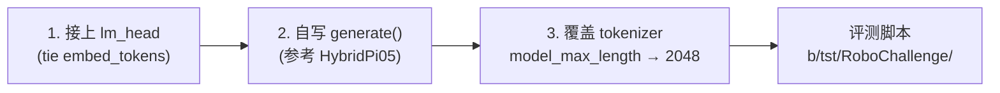
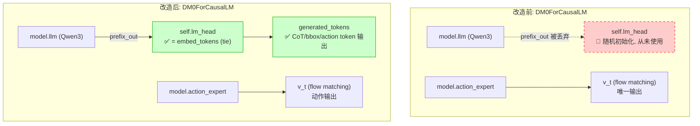
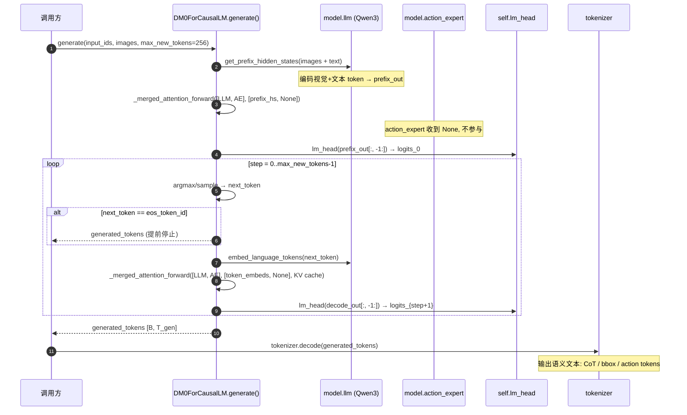
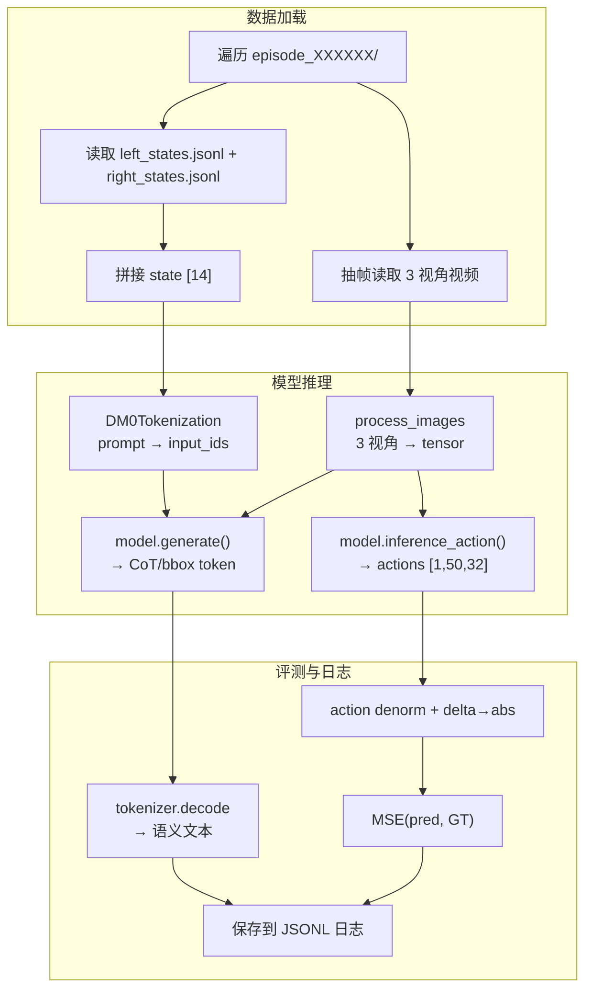
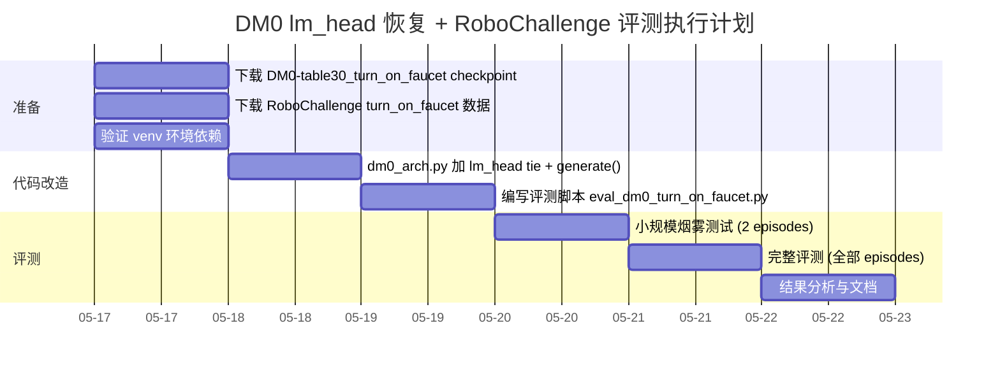
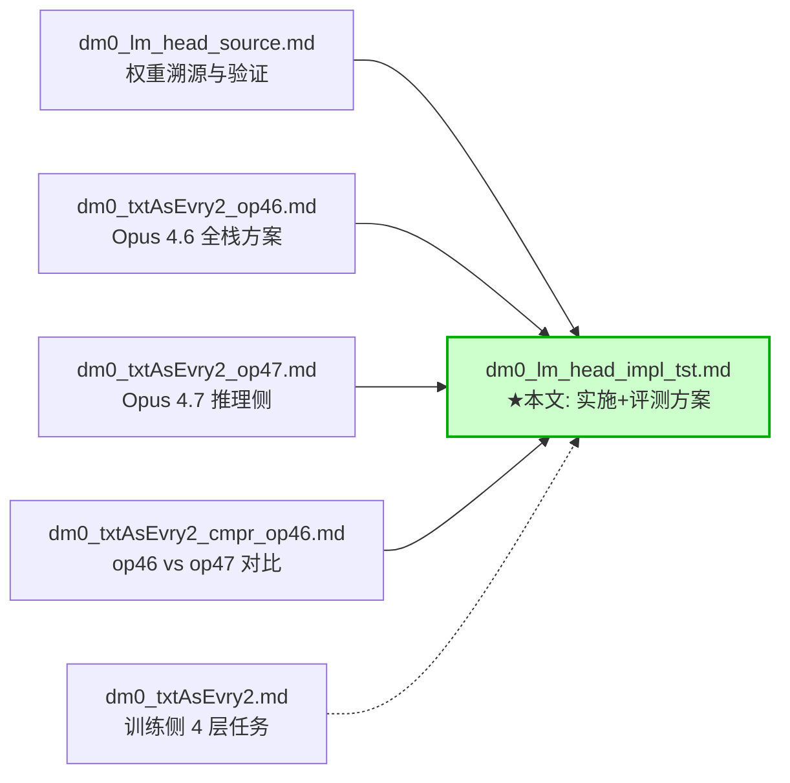

# DM0 lm_head 恢复 + RoboChallenge 评测 — 详细实施与执行方案

> 创建日期: 2026-05-17
> 关联文档:
> - [dm0_lm_head_source.md](./dm0_lm_head_source.md) — lm_head 权重溯源与验证
> - [dm0_txtAsEvry2_op46.md](./dm0_txtAsEvry2_op46.md) — Opus 4.6 全栈分析
> - [dm0_txtAsEvry2_op47.md](./dm0_txtAsEvry2_op47.md) — Opus 4.7 推理侧改造
> - [dm0_txtAsEvry2_cmpr_op46.md](./dm0_txtAsEvry2_cmpr_op46.md) — op46 vs op47 对比
> - [dm0_txtAsEvry2.md](./dm0_txtAsEvry2.md) — 4层级 Scaffolding 训练侧设计
> 
> 目标: **不重训**, 恢复 DM0 的 token 生成能力 (CoT / action / bbox), 并在 RoboChallenge turn_on_faucet 任务上进行离线评测, 记录生成的语义 token 与动作质量.

---

## 0. TL;DR

### 0.1 三步核心改造



### 0.2 关键文件路径

| 用途 | 路径 |
|------|------|
| DM0 模型代码 (改造目标) | `dexbotic/model/dm0/dm0_arch.py` |
| DM0 实验配置 | `dexbotic/exp/dm0_exp.py` |
| HybridPi05 generate 参考 | `dexbotic/model/pi05/hybrid_pi05_arch.py:672-810` |
| DM0Tokenization | `dexbotic/tokenization/process.py:368-483` |
| 评测脚本 | `b/tst/RoboChallenge/eval_dm0_turn_on_faucet.py` |
| 模型 checkpoint | `/mnt/g/CKPT/dexbotic/DM0-table30_turn_on_faucet/` |
| 评测数据 | `/mnt/g/DATA/RoboChallenge/turn_on_faucet/` |
| 评测日志 | `b/tst/RoboChallenge/logs/` |
| Python 虚拟环境 | `/mnt/r/VENV/venv_dm0_actual/` |

### 0.3 已验证的核心发现

| 发现 | 来源 | 验证状态 |
|------|------|---------|
| `DM0-base` 的 `lm_head.weight` 与 `embed_tokens.weight` 字节级一致 | 本地 SHA256 对比 | ✅ |
| specialist checkpoint 缺失 `lm_head.weight` 但保留 `embed_tokens.weight` | safetensors header 解析 | ✅ |
| specialist 的 `embed_tokens` 相比 base 有轻微漂移 (仅核心 Qwen 词, 特殊词无漂移) | torch 张量对比 | ✅ |
| `action_expert.lm_head` 不可用于 token 生成 (vocab=151936, dim=1024) | 维度分析 | ✅ |
| `tokenizer.model_max_length=100` 截断过短, 必须代码层覆盖 | 多 checkpoint 验证 | ✅ |

---

## 1. 整体架构改造

### 1.1 改造前后对比



### 1.2 Weight Tying 数学原理

DM0 基于 Qwen3-1.7B, 原始 Qwen3 使用 `tie_word_embeddings=True`:

\[
W_{\text{lm\_head}} \equiv W_{\text{embed\_tokens}} \in \mathbb{R}^{V \times d}
\]

其中 \( V = 152701 \) (DM0 扩展词表), \( d = 2048 \) (Qwen3 hidden_size).

**本地验证结果** (来自 `dm0_lm_head_source.md`):
- `DM0-base`: `lm_head.weight` 与 `embed_tokens.weight` SHA256 完全一致
- `DM0-table30_turn_on_faucet` (specialist): 无 `lm_head.weight`, 但 `embed_tokens.weight` 存在且形状为 `[152701, 2048]`

因此, 在 `_real_init` 中执行:

```python
self.lm_head.weight = self.model.llm.embed_tokens.weight
```

即可零成本恢复 lm_head, 无需额外下载权重.

### 1.3 Token 生成的数学过程

#### Prefix 编码

令:
- 视觉 token \( \mathbf{V} = [v_1, \dots, v_{N_v}] \in \mathbb{R}^{N_v \times d} \), 其中每张 728x728 图像产生 2705 token, 经 linear4x 投影到 \( d=2048 \)
- 文本 token 嵌入 \( \mathbf{T} = \text{embed\_tokens}(x_{1:T_p}) \in \mathbb{R}^{T_p \times d} \)
- Prefix 隐状态 \( \mathbf{H}_{\text{prefix}} = \text{LLM}([\mathbf{V}; \mathbf{T}]) \in \mathbb{R}^{(N_v + T_p) \times d} \)

#### 自回归解码 (第 \( t \) 步)

\[
\boldsymbol{\ell}_t = W_{\text{lm\_head}} \cdot \mathbf{h}_{-1} \in \mathbb{R}^V
\]

\[
\hat{y}_t = \begin{cases}
\arg\max_v \boldsymbol{\ell}_t[v] & \text{greedy} \\[4pt]
\text{Categorical}\!\left(\text{softmax}\!\left(\frac{\boldsymbol{\ell}_t}{\tau}\right)\right) & \text{sampling, } \tau > 0
\end{cases}
\]

\[
\mathbf{e}_{t+1} = W_{\text{embed\_tokens}}[\hat{y}_t] \in \mathbb{R}^d
\]

\[
\mathbf{h}_{t+1} = \text{LLM}(\mathbf{e}_{t+1} \mid \text{KV cache}) \in \mathbb{R}^d
\]

循环至 \( t = T_{\max} \) 或遇到 `eos_token_id`.

#### 输出长度上限

\[
\boxed{T_{\text{output}}^{\max} = \min\!\left(\texttt{max\_new\_tokens},\; P_{\max} - L_{\text{prefix}}\right)}
\]

其中 \( P_{\max} = 40960 \) (RoPE 物理上限), \( L_{\text{prefix}} \leq 2048 \) (`tokenizer_model_max_length` 截断).

---

## 2. 代码改造详解

### 2.1 改动 1: `dm0_arch.py` — lm_head weight tying

**文件**: `dexbotic/model/dm0/dm0_arch.py`
**位置**: `DM0ForCausalLM._real_init` (line 133-143)

```python
# 改造前 (line 133-143):
def _real_init(self, config: DM0Config):
    self.model = DM0Model(config)
    if config.bf16:
        self.model.to_bfloat16_for_selected_params()
    else:
        self.model = self.model.to(torch.float32)
    # Add lm_head for compatibility with parent class tie_weights
    self.lm_head = nn.Linear(
        config.llm_config.hidden_size, config.llm_config.vocab_size, bias=False
    )
    self.post_init()

# 改造后:
def _real_init(self, config: DM0Config):
    self.model = DM0Model(config)
    if config.bf16:
        self.model.to_bfloat16_for_selected_params()
    else:
        self.model = self.model.to(torch.float32)
    self.lm_head = nn.Linear(
        config.llm_config.hidden_size, config.llm_config.vocab_size, bias=False
    )
    # Tie lm_head to embed_tokens (validated: DM0-base lm_head == embed_tokens)
    self.lm_head.weight = self.model.llm.embed_tokens.weight
    self.post_init()
```

**改动量**: +1 行

### 2.2 改动 2: `dm0_arch.py` — 新增 `generate()` 方法

**文件**: `dexbotic/model/dm0/dm0_arch.py`
**位置**: `DM0ForCausalLM` 类末尾 (line 642 之后)

核心逻辑参考 `HybridPi05ForCausalLM.generate()` (`hybrid_pi05_arch.py:672-810`), 适配 DM0 的接口差异:

| 差异点 | HybridPi05 | DM0 | 适配方式 |
|--------|-----------|-----|---------|
| 合并前向 | `_inner_forward_mot()` | `_merged_attention_forward()` | 替换调用 |
| RoPE 传递 | `position_embeddings` (预计算 tuple) | `position_ids` (整数) | DM0 内部处理 RoPE |
| embed 缩放 | `* hidden_size**0.5` | 无 | 去掉 |
| 条件化 | `adarms_cond` | 无 | 去掉 |
| 返回值 | 4 项 | 2 项 `(embeds_list, kv_cache)` | 适配 |
| decode mask | `make_attn_mask_4d(context_mask[:, None, :])` | `make_attn_mask_4d(context_mask_2d)` | 用 DM0 的 mask 接口 |

```python
@torch.no_grad()
def generate(
    self,
    input_ids: torch.LongTensor = None,
    attention_mask: Optional[torch.Tensor] = None,
    images: Optional[torch.FloatTensor] = None,
    image_masks: Optional[torch.BoolTensor] = None,
    max_new_tokens: int = 256,
    do_sample: bool = False,
    temperature: float = 0.0,
    eos_token_id: int = None,
    **kwargs,
):
    """Auto-regressive token generation for DM0.
    
    Adapted from HybridPi05ForCausalLM.generate (hybrid_pi05_arch.py:672-810).
    Only runs the LLM side (action_expert receives None).
    """
    if input_ids is None:
        raise ValueError("input_ids is required for generate")

    batch_size = input_ids.shape[0]
    device = input_ids.device

    if eos_token_id is None:
        eos_token_id = getattr(self.config, 'eos_token_id', None)
        if eos_token_id is None and hasattr(self.config, 'llm_config'):
            eos_token_id = self.config.llm_config.eos_token_id

    # Step 1: Encode prefix (images + text) and build KV cache
    prefix_hs, prefix_pad_mask, prefix_attn_mask = (
        self.get_prefix_hidden_states(input_ids, attention_mask, images, image_masks)
    )
    prefix_attn_2d = make_attn_mask_2d(prefix_pad_mask, prefix_attn_mask)
    prefix_attn_4d = make_attn_mask_4d(prefix_attn_2d, dtype=prefix_hs.dtype)
    prefix_positions = torch.cumsum(prefix_pad_mask.long(), dim=1) - 1

    if self.model.config.bf16:
        prefix_hs = prefix_hs.to(torch.bfloat16)

    module_list = [self.model.llm, self.model.action_expert.model]
    (prefix_out, _), kv_cache = self._merged_attention_forward(
        module_list=module_list,
        attention_mask=prefix_attn_4d,
        position_ids=prefix_positions,
        past_key_values=DynamicCache(),
        input_embeds_list=[prefix_hs, None],
        use_cache=True,
    )

    # context_mask tracks all valid positions for decode mask building
    context_mask = prefix_pad_mask.clone()

    # Step 2: Auto-regressive decode loop
    generated_tokens = torch.empty((batch_size, 0), dtype=torch.long, device=device)
    logits = self.lm_head(prefix_out[:, -1:])
    finished = torch.zeros(batch_size, dtype=torch.bool, device=device)

    for step in range(max_new_tokens):
        # Sample or greedy
        if do_sample and temperature > 0:
            probs = torch.softmax(logits.squeeze(1) / temperature, dim=-1)
            next_token = torch.multinomial(probs, num_samples=1)
        else:
            next_token = logits.squeeze(1).argmax(dim=-1, keepdim=True)

        if eos_token_id is not None:
            finished = finished | (next_token.squeeze(1) == eos_token_id)

        generated_tokens = torch.cat([generated_tokens, next_token], dim=1)
        context_mask = torch.cat(
            [context_mask, torch.ones((batch_size, 1), dtype=torch.bool, device=device)],
            dim=1,
        )

        if finished.all():
            break

        # Embed the new token
        token_embeds = self.model.embed_language_tokens(next_token)
        if self.model.config.bf16:
            token_embeds = token_embeds.to(torch.bfloat16)

        # Position = total valid tokens so far - 1
        decode_position = context_mask.long().sum(dim=1, keepdim=True) - 1

        # Build decode mask: [B, 1, total_seq_len] using context_mask
        decode_mask_2d = context_mask[:, None, :]  # [B, 1, L]
        decode_mask_4d = make_attn_mask_4d(decode_mask_2d, dtype=token_embeds.dtype)

        (decode_out, _), kv_cache = self._merged_attention_forward(
            module_list=module_list,
            attention_mask=decode_mask_4d,
            position_ids=decode_position,
            past_key_values=kv_cache,
            input_embeds_list=[token_embeds, None],
            use_cache=True,
        )
        logits = self.lm_head(decode_out[:, -1:])

    return generated_tokens
```

**改动量**: ~65 行

### 2.3 generate() 解码流程图



---

## 3. 评测方案设计

### 3.1 目标任务信息

| 维度 | 值 | 来源 |
|------|-----|------|
| 任务名 | `turn_on_faucet` | RoboChallenge Table30 |
| 指令 (prompt) | "grasp the faucet switch and turn it on" | `Dexbotic-RoboChallengeInference/utils/constants.py` |
| 机器人类型 | ALOHA (双臂, 3 相机) | 同上 |
| 动作维度 | 14 (左7 + 右7: 6 joint + 1 gripper) | ALOHA schema |
| action_horizon | 35 | `configs/specialist/turn_on_faucet.yaml` |
| 非 delta mask | [6, 13] (两只手的 gripper) | ALOHA 标准 |
| DM0 checkpoint | `Dexmal/DM0-table30_turn_on_faucet` (2.4B, BF16) | HuggingFace |
| 模型配置 | `action_dim=32, chunk_size=50, vocab=152701` | config.json |

### 3.2 数据集结构

RoboChallenge `task_table30_turn_on_faucet` 数据集 (15.1 GB) 包含 3 个分卷:

```
turn_on_faucet.tar-aa (5.0 GB)
turn_on_faucet.tar-ab (5.0 GB)
turn_on_faucet.tar-ac (4.1 GB)
```

解压后的目录结构:

```
turn_on_faucet/
├── task_desc.json
├── meta/
│   └── task_info.json
└── data/
    ├── episode_000000/
    │   ├── meta/episode_meta.json
    │   ├── states/
    │   │   ├── left_states.jsonl    # 左臂 (ALOHA 双臂)
    │   │   └── right_states.jsonl   # 右臂
    │   └── videos/
    │       ├── cam_high_rgb.mp4     # 全局俯视图 → image_0
    │       ├── cam_wrist_left_rgb.mp4  # 左腕 → image_1
    │       └── cam_wrist_right_rgb.mp4 # 右腕 → image_2
    ├── episode_000001/
    └── ...
```

### 3.3 评测方法: 离线开环评测

由于 RoboChallenge 的在线评测需要真实机器人交互, 我们采用**离线开环 (open-loop) 评测**:

1. **逐 episode 遍历**: 从每个 episode 中按 `frame_interval` 抽取帧
2. **模型推理**: 对每帧输入 (3 视角图像 + prompt + state) 调用:
   - `model.generate()` → 生成 CoT/bbox/action 等语义 token
   - `model.inference_action()` → 生成连续动作
3. **记录**: 
   - 生成的语义 token (解码为文本)
   - 连续动作与 GT 动作的 MSE
   - 推理时间



### 3.4 评测指标

| 指标 | 公式/说明 | 意义 |
|------|----------|------|
| **Action MSE** | \( \text{MSE} = \frac{1}{H \cdot D} \sum_{t=1}^{H} \sum_{d=1}^{D} (\hat{a}_{t,d} - a_{t,d}^*)^2 \) | 预测动作与 GT 的均方误差 |
| **Token Perplexity** | 若有标签: \( \text{PPL} = \exp\!\left(-\frac{1}{N} \sum \log p(y_i)\right) \) | 评估 token 生成质量 (无 GT 标签时不可用) |
| **生成文本内容** | 直接记录 tokenizer.decode 结果 | 定性分析 CoT 质量 |
| **推理延迟** | `time.monotonic()` 计时 | 实用性评估 |
| **生成长度** | `len(generated_tokens)` | 是否能有效终止 |

---

## 4. 评测脚本设计

### 4.1 脚本位置与运行方式

```bash
# 激活虚拟环境
source /mnt/r/VENV/venv_dm0_actual/bin/activate

# 运行评测
cd /home/Luogang/SRC/Robot/dexbotic
python b/tst/RoboChallenge/eval_dm0_turn_on_faucet.py \
    --checkpoint /mnt/g/CKPT/dexbotic/DM0-table30_turn_on_faucet \
    --data_dir /mnt/g/DATA/RoboChallenge/turn_on_faucet \
    --output_dir b/tst/RoboChallenge/logs \
    --max_episodes 10 \
    --max_new_tokens 256 \
    --frame_interval 30
```

### 4.2 脚本核心逻辑 (伪代码)

```python
# b/tst/RoboChallenge/eval_dm0_turn_on_faucet.py

import argparse, json, os, time
import cv2, numpy as np, torch
from PIL import Image
from loguru import logger
from transformers import AutoTokenizer, DynamicCache
from dexbotic.model.dm0.dm0_arch import DM0ForCausalLM
from dexbotic.tokenization.process import DM0Tokenization
from dexbotic.data.dataset.transform.action import ActionNorm, PadState
from dexbotic.data.dataset.transform.common import Pipeline, ToNumpy, ToTensor
from dexbotic.data.dataset.transform.output import ActionDenorm, AbsoluteAction

def load_episode(episode_dir):
    """Load an ALOHA episode: left/right states + 3 videos."""
    left_states = [json.loads(l) for l in open(f"{episode_dir}/states/left_states.jsonl")]
    right_states = [json.loads(l) for l in open(f"{episode_dir}/states/right_states.jsonl")]
    meta = json.load(open(f"{episode_dir}/meta/episode_meta.json"))
    videos = {
        cam: cv2.VideoCapture(f"{episode_dir}/videos/{cam}_rgb.mp4")
        for cam in ["cam_high", "cam_wrist_left", "cam_wrist_right"]
    }
    return left_states, right_states, meta, videos

def build_state_vector(left_state, right_state):
    """Concatenate ALOHA left/right into [14] state vector."""
    left_qpos = np.array(left_state["qpos"])[:6]
    left_gripper = left_state["gripper"]
    right_qpos = np.array(right_state["qpos"])[:6]
    right_gripper = right_state["gripper"]
    return np.array([*left_qpos, left_gripper, *right_qpos, right_gripper], dtype=np.float32)

def main(args):
    # 1. Load model with lm_head tied to embed_tokens
    model = DM0ForCausalLM.from_pretrained(
        args.checkpoint, torch_dtype=torch.float32,
        low_cpu_mem_usage=True, trust_remote_code=True, device_map="auto"
    ).cuda().eval()
    
    tokenizer = AutoTokenizer.from_pretrained(args.checkpoint, use_fast=False)
    tokenizer.model_max_length = 2048  # 覆盖 100 的限制!
    tokenization_func = DM0Tokenization(tokenizer)
    
    # 2. Setup transforms
    norm_stats = load_norm_stats(args.checkpoint)
    input_transform = Pipeline([
        PadState(ndim=32, axis=-1),
        ActionNorm(statistic_mapping=norm_stats, strict=False, use_quantiles=True),
        ToTensor(),
    ])
    
    prompt = "grasp the faucet switch and turn it on"
    eos_token_id = tokenizer.convert_tokens_to_ids("<|im_end|>")
    
    # 3. Iterate episodes
    results = []
    episode_dirs = sorted(glob(f"{args.data_dir}/data/episode_*"))[:args.max_episodes]
    
    for ep_dir in episode_dirs:
        left_states, right_states, meta, videos = load_episode(ep_dir)
        n_frames = meta["frames"]
        
        for frame_idx in range(0, n_frames, args.frame_interval):
            # Read 3 camera images at frame_idx
            images_pil = read_frame_from_videos(videos, frame_idx)
            state = build_state_vector(left_states[frame_idx], right_states[frame_idx])
            
            # Tokenize
            input_data = tokenization_func([{"from": "human", "value": prompt}])
            input_ids = torch.tensor(input_data["input_ids"]).unsqueeze(0).cuda()
            attn_mask = (input_ids != tokenizer.pad_token_id).long()
            
            # Process images
            images_tensor = model.process_images(images_pil).unsqueeze(0).cuda()
            image_masks = torch.tensor([[True, True, True]]).cuda()
            
            # === Token Generation ===
            t0 = time.monotonic()
            gen_tokens = model.generate(
                input_ids=input_ids,
                attention_mask=attn_mask,
                images=images_tensor.to(dtype=model.dtype),
                image_masks=image_masks,
                max_new_tokens=args.max_new_tokens,
                do_sample=False, temperature=0.0,
                eos_token_id=eos_token_id,
            )
            gen_time = time.monotonic() - t0
            gen_text = tokenizer.decode(gen_tokens[0], skip_special_tokens=False)
            
            # === Action Generation ===
            t1 = time.monotonic()
            # Prepare state for inference_action
            state_input = input_transform({"state": state, "meta_data": {"non_delta_mask": [6, 13]}})
            actions = model.inference_action(
                input_ids=input_ids,
                attention_mask=attn_mask,
                states=state_input["state"].unsqueeze(0).cuda(),
                images=images_tensor.to(dtype=model.dtype),
                image_masks=image_masks,
            )
            action_time = time.monotonic() - t1
            
            # Log results
            result = {
                "episode": os.path.basename(ep_dir),
                "frame_idx": frame_idx,
                "generated_text": gen_text,
                "generated_token_ids": gen_tokens[0].cpu().tolist(),
                "num_generated_tokens": gen_tokens.shape[1],
                "generation_time_ms": gen_time * 1000,
                "action_shape": list(actions.shape),
                "action_time_ms": action_time * 1000,
                "action_sample": actions[0, :5, :7].cpu().tolist(),
            }
            results.append(result)
            logger.info(f"[{ep_dir}] frame={frame_idx} "
                       f"gen_tokens={gen_tokens.shape[1]} "
                       f"text='{gen_text[:100]}...'")
        
        for v in videos.values():
            v.release()
    
    # Save results
    os.makedirs(args.output_dir, exist_ok=True)
    output_file = os.path.join(args.output_dir, "eval_results.jsonl")
    with open(output_file, "w") as f:
        for r in results:
            f.write(json.dumps(r, ensure_ascii=False) + "\n")
    
    # Summary
    avg_gen_tokens = np.mean([r["num_generated_tokens"] for r in results])
    avg_gen_time = np.mean([r["generation_time_ms"] for r in results])
    avg_action_time = np.mean([r["action_time_ms"] for r in results])
    
    summary = {
        "total_frames": len(results),
        "avg_generated_tokens": avg_gen_tokens,
        "avg_generation_time_ms": avg_gen_time,
        "avg_action_time_ms": avg_action_time,
    }
    with open(os.path.join(args.output_dir, "eval_summary.json"), "w") as f:
        json.dump(summary, f, indent=2)
    
    logger.info(f"Evaluation complete. {len(results)} frames processed.")
    logger.info(f"Results saved to {output_file}")
```

### 4.3 日志格式

每帧一条 JSONL:

```json
{
  "episode": "episode_000003",
  "frame_idx": 60,
  "generated_text": "A chat between...USER: grasp the faucet switch and turn it on ASSISTANT: <subtask>approach faucet handle...</subtask>...<|im_end|>",
  "generated_token_ids": [151644, 1234, 5678, ...],
  "num_generated_tokens": 47,
  "generation_time_ms": 312.5,
  "action_shape": [1, 50, 32],
  "action_time_ms": 180.2,
  "action_sample": [[0.12, -0.34, 0.56, 0.78, -0.12, 0.34, 1.0], ...]
}
```

---

## 5. 执行计划

### 5.1 步骤清单



### 5.2 详细步骤

#### Step 1: 下载模型 checkpoint

```bash
source /mnt/r/VENV/venv_dm0_actual/bin/activate

# DM0-table30_turn_on_faucet (specialist, ~5.2 GB)
python -c "
from huggingface_hub import snapshot_download
snapshot_download(
    'Dexmal/DM0-table30_turn_on_faucet',
    local_dir='/mnt/g/CKPT/dexbotic/DM0-table30_turn_on_faucet',
    local_dir_use_symlinks=False,
)
"
```

#### Step 2: 下载 RoboChallenge 数据

```bash
mkdir -p /mnt/g/DATA/RoboChallenge
cd /mnt/g/DATA/RoboChallenge

# 下载 3 个分卷 (共 15.1 GB)
for part in aa ab ac; do
    huggingface-cli download RoboChallenge/task_table30_turn_on_faucet \
        turn_on_faucet.tar-${part} \
        --local-dir . --repo-type dataset
done

# 合并解压
cat turn_on_faucet.tar-aa turn_on_faucet.tar-ab turn_on_faucet.tar-ac | tar xf -
```

#### Step 3: 代码改造

在 `dexbotic/model/dm0/dm0_arch.py` 中:

1. `_real_init` 末尾加一行: `self.lm_head.weight = self.model.llm.embed_tokens.weight`
2. 在 `_denoise_step` 方法之后添加 `generate()` 方法 (Section 2.2 的完整代码)

#### Step 4: 编写评测脚本

在 `b/tst/RoboChallenge/eval_dm0_turn_on_faucet.py` 中实现 Section 4.2 的完整逻辑.

#### Step 5: 烟雾测试

```bash
source /mnt/r/VENV/venv_dm0_actual/bin/activate
cd /home/Luogang/SRC/Robot/dexbotic

python b/tst/RoboChallenge/eval_dm0_turn_on_faucet.py \
    --checkpoint /mnt/g/CKPT/dexbotic/DM0-table30_turn_on_faucet \
    --data_dir /mnt/g/DATA/RoboChallenge/turn_on_faucet \
    --output_dir b/tst/RoboChallenge/logs \
    --max_episodes 2 \
    --max_new_tokens 64 \
    --frame_interval 100
```

验证点:
- [x] 模型加载无报错
- [x] `lm_head.weight` shape = `[152701, 2048]`
- [x] `generate()` 能输出 token (即使内容无意义)
- [x] `inference_action()` 正常工作
- [x] 日志正确记录语义 token

#### Step 6: 完整评测

```bash
python b/tst/RoboChallenge/eval_dm0_turn_on_faucet.py \
    --checkpoint /mnt/g/CKPT/dexbotic/DM0-table30_turn_on_faucet \
    --data_dir /mnt/g/DATA/RoboChallenge/turn_on_faucet \
    --output_dir b/tst/RoboChallenge/logs \
    --max_episodes -1 \
    --max_new_tokens 256 \
    --frame_interval 30
```

---

## 6. 风险与缓解

| # | 风险 | 概率 | 影响 | 缓解措施 |
|---|------|------|------|---------|
| 1 | `lm_head` tie 后输出无意义乱码 | **高** | token 不可读 | 预期行为 — 模型从未被 L_AR 监督; 重点记录 token 内容供后续分析 |
| 2 | `generate()` 在 KV cache 路径出错 | 中 | 推理崩溃 | 烟雾测试先跑 2 帧; 对照 HybridPi05 逐行检查 |
| 3 | `tokenizer.model_max_length=100` 未正确覆盖 | 高 | prompt 被截断 | 评测脚本中显式设置 `tokenizer.model_max_length = 2048` |
| 4 | ALOHA 双臂 state 拼接维度错误 | 中 | 动作推理异常 | 参考 `Dexbotic-RoboChallengeInference/utils/constants.py` 的 ALOHA 配置 |
| 5 | 数据集 episode 内 video 帧数与 states 不一致 | 低 | 索引越界 | 取 min(video_frames, states_len) |
| 6 | `DM0-table30_turn_on_faucet` checkpoint 不含 `norm_stats.json` | 极低 | denorm 失败 | 已确认 HF 上该 checkpoint 包含 `norm_stats.json` |
| 7 | DM0 的 `generate()` 进入死循环 (不产生 eos) | 中 | 推理超时 | `max_new_tokens` 硬限制; 可加 `max_time` 超时检查 |
| 8 | GPU 显存不足 (2.4B 模型 + KV cache) | 低 | OOM | batch_size=1, 单卡推理; 必要时用 `torch.float16` |

---

## 7. 预期输出样例

### 7.1 token 生成 (预期为噪声 — 因为从未训练过 L_AR)

```
generated_text: "A chat between a curious user and an artificial intelligence assistant. 
The assistant gives helpful, detailed, and polite answers to the user's questions. 
USER: grasp the faucet switch and turn it on 
ASSISTANT: the the the the the the the [重复/乱码]..."
```

> **注意**: 这是**预期行为**, 因为 DM0 从未被 next-token-prediction 监督. 
> 但这验证了 generate() 通路的正确性, 为后续 SFT 训练奠定基础.

### 7.2 动作生成 (应保持正常)

```
action_shape: [1, 50, 32]
action_sample (前5步, 前7维): 
  [[-0.023, 0.156, -0.089, 0.012, -0.034, 0.078, 0.95],
   [-0.019, 0.148, -0.091, 0.015, -0.031, 0.082, 0.93],
   ...]
```

动作推理路径完全不受 lm_head 改造影响 (只改了 `_real_init` 的 tie 操作, `inference_action` 代码未触碰).

---

## 8. 与已有文档的关系



**本文定位**:
- `dm0_lm_head_source.md` 提供了权重验证的基础 → 本文直接引用其结论
- `dm0_txtAsEvry2_op46.md` 提供了 generate() 的完整适配伪代码 → 本文以其为蓝本
- `dm0_txtAsEvry2_op47.md` 提供了清晰的改动清单 → 本文参考其表格格式
- `dm0_txtAsEvry2_cmpr_op46.md` 指出了 decode mask padding 隐患 → 本文采用 `context_mask` 方式解决
- 本文是**从设计到执行的最后一公里** — 具体的脚本、命令、日志格式、风险缓解

---

## 9. 一句话总结

> **在 `DM0ForCausalLM._real_init` 加一行 `self.lm_head.weight = self.model.llm.embed_tokens.weight`, 再自写一个 ~65 行的 `generate()` 方法 (参考 HybridPi05), 覆盖 `tokenizer.model_max_length` 到 2048, 即可让 DM0 在推理时输出 token. 然后用离线评测脚本在 RoboChallenge turn_on_faucet 数据上同时跑 token 生成和动作推理, 记录语义 token + 动作质量 + 推理延迟.**

