# DM0 让 action_loss 用上 VLM CoT 推理能力的方案设计

> 本文是对 [dm0_backward.md §13](./dm0_backward.md#13-让-action-loss-梯度覆盖-vlm-全部参数的方案) 的**接续补充**。`dm0_backward.md` 已经给出了 7 个让 `action_loss` 梯度流向 VLM 全部参数(包括 layer 27 的 `q_proj/o_proj/MLP`)的方案,但它们的**共同盲点**是 — 都没有真正利用 VLM 的**长 CoT 推理能力**。本文针对此盲点,提出 7 个能真正利用 VLM CoT 的方案,均以"在 forward 中让 VLM 实际自回归地产生 CoT,并通过可微方式接入 action expert"为核心思想。

---

## 0. TL;DR

| 项 | 内容 |
|---|---|
| 出发点 | `dm0_backward.md` §13 的 7 个方案都没用 VLM 在 forward 中生成的 CoT,只是用 teacher-forcing 的 L_AR 或纯架构改造 |
| 核心思想 | 让 VLM 在 forward 中**自回归地产生 K 步 CoT**(显式 token / soft embedding / continuous hidden state),并以**可微方式**接入 action expert,使 `action_loss` 的梯度沿 CoT 生成链反向传播,自动让 VLM 全部参数(包括 layer 27 的 `q_proj/o_proj/MLP`)收到梯度 |
| 关键技术 | Coconut 的 continuous thought / Gumbel-Softmax STE / Soft-Embedding / Cross-Attention 读 KV cache / Latent reasoning curriculum |
| 推荐方案 | 方案 A(Coconut 风格 Continuous Thought,改动最小,完全可微,梯度路径最清晰) → 方案 G(综合方案:Continuous Thought + KI + L_AR 课程,效果最完整) |
| 方案数 | 7 个核心方案,覆盖"完全 latent"、"半 latent"、"显式离散 + STE"、"action-space"、"RL self-supervised"、"课程学习"、"综合方案" |
| 主要参考 | Coconut (NeurIPS 2025)、LaRA-VLA、ACoT-VLA (CVPR 2026)、ECoT (CoRL 2024)、GRADE、SofT-GRPO、π0.5 KI |

---

## 1. 问题界定:为什么 backward.md 的 7 个方案都没用上 CoT?

### 1.1 backward.md 的 7 个方案回顾

[dm0_backward.md §13](./dm0_backward.md#13-让-action-loss-梯度覆盖-vlm-全部参数的方案) 给出的 7 个方案为:

| # | 方案 | 是否需要 VLM 真正生成 CoT? |
|---|---|---|
| ① | 启用 L_AR(自回归文本 CE) | ❌ teacher-forcing,VLM 不需要"想" |
| ② | Prefix-Output 特征注入 | ❌ 直接把 `prefix_out` 注入 suffix,不涉及推理 |
| ③ | Co-Training(VLM 数据混合) | ❌ 仍是 teacher-forcing L_AR |
| ④ | Embodied Spatial Scaffolding(4 层级辅助任务) | ❌ 所有辅助任务都是 teacher-forcing L_AR |
| ⑤ | Knowledge Insulation + L_AR | ❌ 仍是 teacher-forcing |
| ⑥ | 表示蒸馏(冻结教师 VLM) | ❌ 不涉及 CoT 生成 |
| ⑦ | 修改注意力掩码 | ❌ 纯架构修改,无 CoT |

### 1.2 共同盲点分析

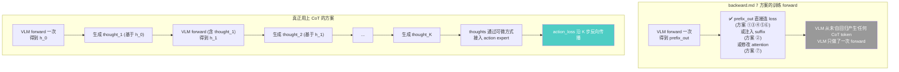

**核心区别**:

- backward.md 方案是 **"VLM 一次 forward + 多种监督信号"**;VLM 看完图像和指令后,直接 emit hidden states,没有"思考"过程。
- 真正用 CoT 的方案是 **"VLM K+1 次 forward + thought chain"**;VLM 像 ChatGPT 那样"一步一步推理",每一步的输出作为下一步的输入,形成 K 步链式推理。

### 1.3 为什么 CoT 对 VLA 重要?

VLM 的**长 CoT 推理能力**是其相对于纯 vision-action 网络的**核心优势**之一。机器人任务通常涉及:

1. **多步任务分解**:"把红色的杯子放到蓝色的盒子里" → ① 识别红杯子 → ② 移动到杯子上方 → ③ 抓取 → ④ 移动到蓝盒子 → ⑤ 放下
2. **空间推理**:"避开桌子上的玻璃杯" → 推理碰撞路径 → 规划绕行
3. **语义理解**:"清理桌面" → 判断哪些是垃圾、哪些不是
4. **反思与重试**:"如果第一次没抓住,稍微往左移再试"

这些都需要 VLM **在生成 action 之前**进行多步推理。如果只用 teacher-forcing L_AR 监督文本输出,VLM 的"推理过程"无法影响 action,反之亦然。

### 1.4 真正用 CoT 的关键

> **让 VLM 在 forward 中真正自回归产生 K 步 CoT(可以是 token、soft embedding、或 continuous hidden state),并通过可微方式接入 action_loss 的计算图。**

这样:
- ✅ `action_loss` 的梯度沿 K 步 CoT 反向流,**每一步都经过 layer 27 的 `q_proj/o_proj/MLP`**(因为每个 thought 是 LLM 最后一层的输出)
- ✅ VLM 学会"为 action 的好坏而推理",而不仅是"为文本似然而推理"
- ✅ 推理能力与控制能力**联合优化**,不再是两条独立轨道

---

## 2. 设计目标与设计约束

### 2.1 设计目标

| 目标 | 优先级 | 说明 |
|---|---|---|
| **G1**:让 `action_loss` 的梯度流向 VLM layer 27 的 `q_proj/o_proj/MLP` | P0 | 这是 backward.md 已经识别的核心问题 |
| **G2**:VLM 在 forward 中真正产生 K 步 CoT(K ≥ 1) | P0 | 区别于 backward.md 7 方案的关键 |
| **G3**:CoT 与 action_loss 的连接必须**可微**,否则梯度无法流回 CoT 生成过程 | P0 | 离散 token argmax 不可微,需要特殊处理 |
| **G4**:保持 VLM 原有的 token 输出能力(可选,推理时可关闭) | P1 | 兼容推理时的文本生成 |
| **G5**:训练显存增加 ≤ 2x(K=4-8 时) | P1 | 多次 VLM forward 会增加显存 |
| **G6**:推理速度不能显著下降(可与 KV cache 配合) | P1 | latent thought 推理快;explicit token CoT 推理慢 |
| **G7**:与 dexbotic 现有架构兼容,改动尽量集中在 `dm0_arch.py` | P2 | 减少工程负担 |

### 2.2 设计约束

- 不修改 `merged attention` 的 28 层 transformer 结构(避免破坏预训练 checkpoint)
- 不修改 `action_expert` 的 hidden_size、num_heads(避免破坏 Q/K/V 拼接逻辑)
- 不引入新的 tokenizer 词表(可选;若引入,需 `resize_token_embeddings`)
- 兼容 DeepSpeed ZeRO-3 + gradient checkpointing
- 兼容 bf16 混合精度

---

## 3. 关键技术工具箱

以下 5 项技术是后续 7 个方案的"原子构件"。本节先单独介绍,后面方案会自由组合。

### 3.1 Coconut(Continuous Thought)— hidden-state 直接喂回

> **参考**:[Coconut (NeurIPS 2025)](https://arxiv.org/abs/2412.06769) — *Training Large Language Models to Reason in a Continuous Latent Space*,Meta FAIR + UCSD

**核心思想**:让 LLM 在"latent mode"下,**跳过 lm_head 和 embed_tokens**,直接用 last hidden state 作为下一步的 input embedding。

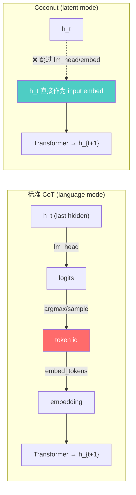

**对梯度的影响**:由于 `h_t` 直接作为 input embed,**整条 CoT 链都是可微的**(完全没有 argmax 或 sample 这类不可微算子)。

**论文实验亮点**:
- 在 ProsQA(需要 BFS 规划的逻辑推理数据集)上 Coconut 准确率 97.0% vs CoT 77.5%
- continuous thought 能在 superposition 状态下同时编码多条候选路径,实现隐式 BFS
- token 消耗:Coconut 8.2 vs CoT 25.0(GSM8k)

**PyTorch 关键代码**(简化版):

```python
# Coconut 的核心 loop
h = embed(input_tokens)                              # 初始 embedding
for k in range(num_thoughts):
    out = llm(inputs_embeds=h).last_hidden_state    # 一次 forward
    new_thought = out[:, -1:, :]                     # 取最后位置的 hidden
    h = torch.cat([h, new_thought], dim=1)          # 拼到序列末尾
# 之后 h 包含 num_thoughts 个 continuous thoughts
```

---

### 3.2 Gumbel-Softmax + Straight-Through Estimator(STE)

> **参考**:[Gumbel-Softmax (ICLR 2017)](https://arxiv.org/abs/1611.01144)、[GRADE (2026)](https://arxiv.org/abs/2601.11574)、[SofT-GRPO (2025)](https://arxiv.org/html/2511.06411v1)

**核心思想**:让 LLM 在前向输出 one-hot 离散 token,但反向传播时梯度走 soft softmax,从而保持可微性。

**Gumbel-Softmax**:
$$y_i = \frac{\exp((\log p_i + g_i) / \tau)}{\sum_j \exp((\log p_j + g_j) / \tau)}, \quad g_i \sim \text{Gumbel}(0, 1)$$

当 $\tau \to 0$,$y$ 退化为 one-hot(等价于 argmax);当 $\tau$ 较大,$y$ 是平滑的概率分布。

**Straight-Through Estimator(STE)**:
```python
y_soft = F.softmax(logits / tau, dim=-1)
y_hard = (y_soft.argmax(dim=-1, keepdim=True) == torch.arange(V).view(1, -1)).float()
y = y_hard - y_soft.detach() + y_soft
```

- 前向:`y == y_hard`(one-hot)
- 反向:`y.grad ≈ y_soft.grad`(soft gradient)

**PyTorch 内置**:`F.gumbel_softmax(logits, tau=1.0, hard=True)` 直接实现 Gumbel + STE。

**对梯度的影响**:`next_embed = y @ embed_tokens.weight` 是矩阵乘法,完全可微;梯度通过 `y_soft` 流回 `logits`,再流回 `lm_head` 和整个 LLM。

**GRADE 实验亮点**:在 IMDB 情感控制文本生成上,GRADE-STE 比 PPO 高 50%,梯度方差比 REINFORCE 低 14×。

---

### 3.3 Soft-Thinking(softmax 加权 embedding)

> **参考**:[Soft Thinking (2025)](https://arxiv.org/abs/2505.15778) — *Unlocking the Reasoning Potential of LLMs by Thinking in Continuous Concept Space*

**核心思想**:直接用 softmax 概率加权的 embedding 之和作为"soft token",不加噪声、不做 STE。

$$\mathbf{s}_t = \sum_{i=1}^{|\mathcal{V}|} p_i \cdot \mathbf{e}_i, \quad p_i = \text{softmax}(\text{logits}_t)_i$$

其中 $\mathbf{e}_i$ 是词 $i$ 的 embedding。

**与 Gumbel-STE 的区别**:
- Gumbel-STE:前向是 one-hot,反向是 soft → 离散性强
- Soft-Thinking:前向就是 soft 加权和 → 更平滑,完全在 embedding 空间内

**优势**:实现最简单(只需一次 softmax + 一次矩阵乘),完全可微。

**劣势**:Wu et al. (2025) 发现大多预训练 LLM 在 Soft-Thinking 模式下**容易 collapse** 成 single-thread(softmax 的 argmax 占比 > 0.99),失去多路径推理的优势。需要加入 Gumbel 噪声(就成了方案 B)或 Dirichlet 重采样。

---

### 3.4 Cross-Attention 读取 VLM 所有层的 KV cache

> **参考**:[ACoT-VLA (CVPR 2026)](https://arxiv.org/abs/2601.11404)、[LLaMA-Adapter](https://arxiv.org/abs/2303.16199)

**核心思想**:不让 action expert 与 VLM 在 merged attention 中共享 K/V,而是让一个小型 reasoner(EAR/IAR)通过 cross-attention 读取 VLM 每一层的 K/V cache,提取 action-relevant 信息后注入 action expert。

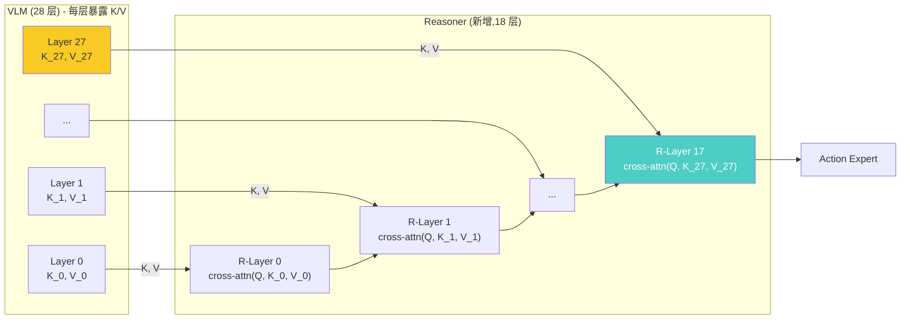

**对梯度的影响**:
- Reasoner 输出 → action expert → action_loss,梯度沿 reasoner 反向流
- Reasoner cross-attn 读 VLM 的 K/V → ∂L/∂K_27 ≠ 0, ∂L/∂V_27 ≠ 0
- 但 q_proj/o_proj/MLP 仍然走 backward.md 提到的"prefix_out 死端"问题,所以**单独用方案 D 不能解决问题,需要与 A/B/C 组合**

**ACoT-VLA 论文实验亮点**:LIBERO 98.5%(SOTA),LIBERO-Plus 86.6%(zero-shot transfer SOTA)。

---

### 3.5 Latent reasoning curriculum learning

> **参考**:[Coconut 多阶段训练](https://arxiv.org/abs/2412.06769)、[LaRA-VLA (2026)](https://arxiv.org/abs/2602.01166)、[iCoT (Deng et al., 2024)](https://arxiv.org/abs/2405.14838)

**核心思想**:训练时**渐进式**地把"显式文本 CoT"替换为"latent thought",让模型平滑过渡。

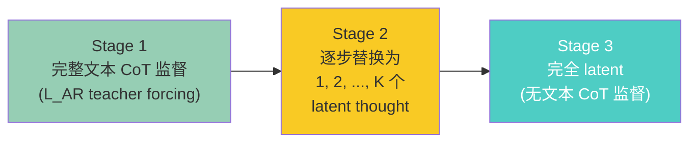

**优势**:
- Stage 1 提供"reasoning skeleton"(模型学会用文本表达推理)
- Stage 2 在不丢失推理结构的前提下逐步压缩
- Stage 3 时模型已经能在 latent space 中完成推理,推理速度可与无 CoT 相当

**LaRA-VLA 实验亮点**:LIBERO-Long 提升 + 推理延迟降低 90%。

---

## 4. 七大方案详解

### 方案 A — 可微 Continuous-Thought CoT(Coconut 风格)★★★★★

> **改动量**:小  |  **是否需 CoT 标注**:否  |  **是否完全可微**:✅  |  **推理开销**:低

#### A.1 核心思想

在 `prefix_hidden_states` 之后**自回归地**生成 K 个 continuous thought(每个是 VLM 最后一层的 hidden state),把这些 thought 拼到 prefix 末尾后再进入 merged attention 与 action expert 交互。

由于 thought 是 VLM forward 的输出,所有 thought 都是 differentiable hidden states,**没有任何 argmax / sample / 离散化**操作。

#### A.2 架构图

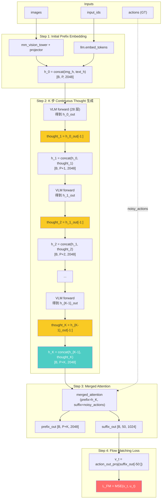

#### A.3 梯度路径(关键)

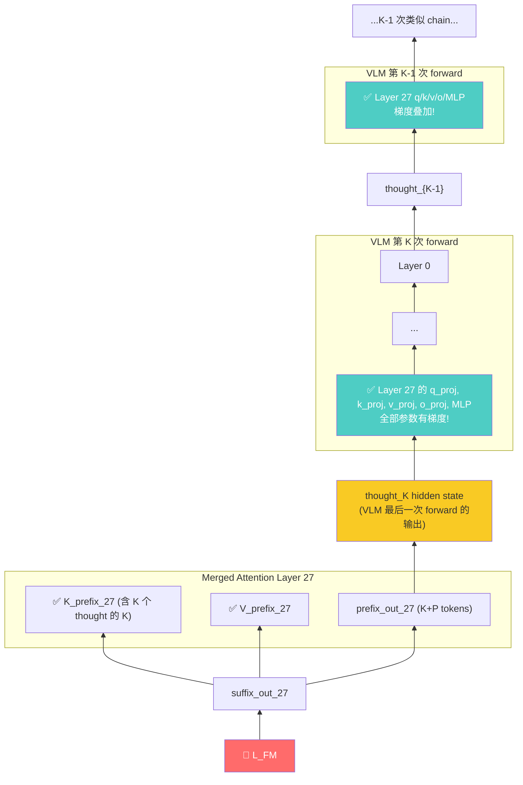

**关键观察**:由于 `thought_K` 是 VLM 第 K 次 forward 的最后位置 hidden state,而 `prefix_out_27` 在 merged attention 中**直接包含** `thought_K` 的 hidden(它是 `prefix_out` 序列的一部分),所以:

- ∂L_FM / ∂thought_K ≠ 0(通过 merged attention 中的 K/V 路径,thought_K 既是 query 又是 key/value)
- ∂L_FM / ∂(VLM forward K) ≠ 0,**包括 layer 27 的 q_proj/o_proj/MLP**!
- 梯度继续反向流到 thought_{K-1},再触发 VLM forward K-1 的 layer 27 全参数梯度
- ...最终**所有 K 次 VLM forward 的 layer 27 全参数**都收到 action_loss 的梯度

**梯度累积效果**:layer 27 的 q_proj/o_proj/MLP 在一个 batch 中接收 K 份梯度(每次 forward 一份),信号强度是 backward.md 方案 ① 的 K 倍。

#### A.4 关键代码实现

修改 [dexbotic/model/dm0/dm0_arch.py](dexbotic/model/dm0/dm0_arch.py) 的 `get_prefix_hidden_states` 和 `forward`:

```python
# 1. 新增配置字段 (DM0Config)
@dataclass
class DM0Config(DexboticConfig):
    num_thoughts: int = 4              # 新增:continuous thought 数量
    cot_mode: str = "continuous"       # "off" | "continuous" | "gumbel_ste" | "soft_embed"

# 2. 新增 method
def get_prefix_with_continuous_thoughts(
    self,
    input_ids, attention_mask, images, image_masks,
    num_thoughts: int = 4,
):
    """生成 K 个 continuous thought,拼到 prefix 末尾。
    
    思路:对当前 prefix 跑 VLM-only forward,取最后位置 hidden 作为 thought,
    拼到序列末尾,重复 K 次。整条链完全可微。
    """
    # 初始 prefix embedding
    h, padding_mask, attn_mask = self.get_prefix_hidden_states(
        input_ids, attention_mask, images, image_masks
    )
    
    batch_size = h.shape[0]
    device = h.device
    
    for _ in range(num_thoughts):
        # VLM-only forward (action_expert 不参与)
        # 用 LLM 自身的 attention mask (因果 + padding)
        prefix_causal_mask = self._make_causal_mask_from_padding(padding_mask)
        position_ids = torch.cumsum(padding_mask, dim=1) - 1
        
        outputs = self.model.llm(
            inputs_embeds=h,
            attention_mask=prefix_causal_mask,
            position_ids=position_ids,
            use_cache=False,
        )
        # 取最后有效位置的 hidden state
        last_valid_idx = padding_mask.sum(dim=1) - 1   # [B]
        # gather along seq dim
        new_thought = outputs.last_hidden_state[
            torch.arange(batch_size, device=device), last_valid_idx
        ].unsqueeze(1)                                   # [B, 1, 2048]
        
        # 拼到序列末尾,更新 padding/attn mask
        h = torch.cat([h, new_thought], dim=1)
        padding_mask = torch.cat(
            [padding_mask, torch.ones(batch_size, 1, device=device, dtype=torch.bool)],
            dim=1
        )
        attn_mask = torch.cat(
            [attn_mask, torch.ones(batch_size, 1, device=device, dtype=torch.int32)],
            dim=1
        )
    
    return h, padding_mask, attn_mask

# 3. 修改 forward
def forward(self, ..., **kwargs):
    # ... 现有 noise/time/x_t/u_t 计算 ...
    
    # 新增:用 continuous thought 增强 prefix
    if self.config.cot_mode == "continuous" and self.config.num_thoughts > 0:
        prefix_hidden_states, prefix_padding_mask, prefix_attn_mask = (
            self.get_prefix_with_continuous_thoughts(
                input_ids, attention_mask, images, image_masks,
                num_thoughts=self.config.num_thoughts,
            )
        )
    else:
        prefix_hidden_states, prefix_padding_mask, prefix_attn_mask = (
            self.get_prefix_hidden_states(
                input_ids, attention_mask, images, image_masks
            )
        )
    
    # ... 后续 suffix 编码 + merged attention + L_FM 不变 ...
```

#### A.5 训练 stabilization 技巧(借鉴 Coconut)

直接训练可能不稳定,Coconut 论文提出**多阶段课程**(适用于本方案,但非必需):

- Stage 1:`num_thoughts = 0`(等价于原 DM0),训练 N 步
- Stage 2:`num_thoughts = 1`,训练 N 步
- Stage 3:`num_thoughts = 2`,训练 N 步
- ...
- Stage K+1:`num_thoughts = K`,训练到收敛

#### A.6 显存与计算开销

| 项 | 原 DM0 | 方案 A (K=4) | 方案 A (K=8) |
|---|---|---|---|
| VLM forward 次数 | 1 | 1 + K = 5 | 1 + K = 9 |
| Merged attn 序列长度 | P (~200) | P + K = 204 | P + K = 208 |
| 训练显存(estimate) | 1x | ~1.5x | ~2.0x |
| 推理时间(每帧) | T | T (推理时也要 K 次 VLM forward,但可用 KV cache 共享前缀) | T |

通过 KV cache,推理时第 i 次 thought 生成只需重算最后 1 个位置,与原 DM0 推理时间相当。

#### A.7 优势与劣势

**优势**:
- ✅ **改动最小**:只需新增一个 `get_prefix_with_continuous_thoughts` method,~50 行
- ✅ **完全可微**:无任何离散化,梯度自然流到 VLM 全部参数
- ✅ **零标注成本**:不需要 CoT 文本标注
- ✅ **VLM 真正"思考"**:K 次 forward 形成显式推理链
- ✅ **K 倍梯度增强**:layer 27 全参数收到 K 份梯度,远超 backward.md 方案 ① 的 1 份
- ✅ **不破坏预训练 checkpoint**:无新增参数(只增加 forward 次数)

**劣势**:
- ❌ 解释性差(thought 是 hidden state,无法直接 detokenize)— 可以通过附加一个 `lm_head(thought)` 做事后解释
- ❌ 训练显存增加 K 倍(可通过 gradient checkpointing 缓解)
- ❌ 初次训练可能不稳定(需要 stage-wise warmup)

#### A.8 解惑:方案 A 与「自回归生成 K 个 token」的关系

A.1 中「在 `prefix_hidden_states` 之后**自回归地**生成 K 个 continuous thought」容易让人联想到 `model.generate()` 的 K 步 token 解码。下面说明二者在**计算流程**上的异同,以及为何方案 A **不经过** `lm_head` / `embed_tokens`。

##### A.8.1 结论先行

| 问题 | 答案 |
|---|---|
| 是否类似执行了 K 次「生成下一个 token」？ | **是**。从 VLM 角度看,每一步都是:当前序列 → 完整 28 层 forward → 取**最后位置**输出 → 拼回序列 → 重复 K 次。与 `generate()` 的**单步 decode** 在 transformer 计算上同构。 |
| 若介入 `lm_head` 和 `embed_tokens`,是否会得到 K 个新 token？ | **是**。那就是本文的**方案 B / 方案 C**,而不是方案 A。 |
| 方案 A 的 K 个 thought 是什么？ | **不是**词表里的离散 token,而是 K 次 forward 得到的 **last hidden state**,直接作为下一步的 `inputs_embeds`,**跳过** `lm_head → (argmax/sample) → embed_tokens` 整条离散化路径。 |

##### A.8.2 三种「下一步输入」路径对比

每一步(第 $t$ 步,$t=1,\ldots,K$)在「VLM 28 层 forward」之后,对最后位置 hidden 的处理不同:

```
标准 token 生成 (如 model.generate, K 步):
  h → VLM 28层 → last_hidden → lm_head → logits → argmax/sample → token_id
                                                      → embed_tokens → next_embed
                                  ↑                    ↑ (不可微)      ↑
                              [可微]                                          [可微]

方案 A — Continuous Thought (Coconut, 本文):
  h → VLM 28层 → last_hidden ──────────────────────────────────────→ next_embed
                                  ↑
                           [全程可微, 无离散化]

方案 B — Gumbel-Softmax STE (GRADE, 本文 §4 方案 B):
  h → VLM 28层 → last_hidden → lm_head → logits → Gumbel-STE(hard) → one-hot
                                                      → @ embed_tokens.weight → next_embed
                                  ↑                    ↑ (前向离散, 反向走 soft)  ↑

方案 C — Soft-Embedding (本文 §4 方案 C):
  h → VLM 28层 → last_hidden → lm_head → logits → softmax(·/τ) → @ embed_tokens.weight → next_embed
```

**要点**:方案 A 与标准生成的**相同**之处在于「K 次、每步一次完整 VLM forward、因果注意力、序列逐位变长」;**不同**之处在于方案 A **故意不**把 hidden 映射到词表再取离散 id,从而避免 argmax/sample 阻断梯度。

##### A.8.3 与 `model.generate()` 的对照

| 维度 | `model.generate()` (K 步) | 方案 A (K 个 continuous thought) |
|---|---|---|
| 每步是否跑完整 VLM | ✅ | ✅ |
| 是否自回归(上一步输出影响下一步输入) | ✅ | ✅ |
| 是否使用 `lm_head` | ✅ | ❌ |
| 是否使用 `embed_tokens` 得到下一步 embedding | ✅ (经 token id) | ❌ (直接用 hidden) |
| 下一步输入落在哪个空间 | embedding 空间(离散 token 的向量) | hidden 空间(最后一层输出) |
| 能否 `tokenizer.decode` | ✅ | ❌ (除非事后用 `lm_head(thought)` 做解释性投影) |
| `action_loss` 能否反传过 K 步 | ❌ (推理时 `no_grad`; 训练时若 argmax 也不可微) | ✅ |

因此:**方案 A 在工程上可理解为「做了 K 次 decode 形态的 forward,但 decode 的『词』是 continuous hidden,不是 vocab 里的 token」**。

##### A.8.4 方案 A / B / C 一览(与 A.1 表述的对应)

| | 方案 A | 方案 B | 方案 C |
|---|---|---|---|
| `lm_head` 参与？ | ❌ 跳过 | ✅ | ✅ |
| `embed_tokens` 参与？ | ❌ 跳过 | ✅ (`y @ weight`) | ✅ (soft 加权) |
| `next_embed` 是什么 | last hidden state ($\in \mathbb{R}^{d}$, hidden 流形) | 某个**真实** token 的 embedding | 全体 token embedding 的**凸组合** |
| 是否生成 K 个「可读 token」 | ❌ | ✅ (可 detokenize) | ⚠️ 可对 `argmax(softmax)` 近似解读 |
| 可微性 | ✅ 天然可微 | ✅ 靠 STE | ✅ 天然可微 |
| 与 Coconut 论文 | 一致(latent mode) | 介于 language mode 与 latent 之间 | Soft-Thinking 路线 |

**方案 A 跳过 `lm_head` / `embed_tokens` 的原因**(与 Coconut 一致):若走 `lm_head → argmax → embed`,中间 `argmax`/`sample` **不可微**,`action_loss` 无法沿 K 步 CoT 链反传到 VLM。在 hidden space 直接传递则整条链可微;代价是训练时看不到显式文本 CoT,推理时也无法直接打印 thought 内容(可用 `lm_head(thought)` 仅作**事后**解释,不参与主 forward)。

##### A.8.5 与 merged attention 的关系(不重复 A.2)

K 个 thought 拼入 prefix 后,**仍不是**「多生成 K 个自然语言 token 再喂给 action expert」,而是 **K 个额外 prefix 位置**(维度仍为 2048),再与 suffix 一起做 merged attention(A.2 架构图 Step 3)。因此:

- 序列长度:prefix 从 $P$ 变为 $P+K$(不是 $P$ 再加 K 个 tokenizer 词);
- 对 action expert:多 K 个可被 attend 的 prefix 位,携带 K 步「连续推理」的状态,而非 K 个可读字符串。

---

### 方案 B — Gumbel-Softmax STE 离散 CoT(GRADE 风格)

> **改动量**:中  |  **是否需 CoT 标注**:否(但可选)  |  **是否完全可微**:✅  |  **推理开销**:中-高

#### B.1 核心思想

VLM **真的自回归地生成 K 个离散 CoT token**(可以 detokenize 成自然语言),但每一步用 Gumbel-Softmax `hard=True`(STE)替代标准 argmax/sample,**保持可微性**。

#### B.2 与方案 A 的差异

| 维度 | 方案 A (Continuous Thought) | 方案 B (Gumbel-STE Token) |
|---|---|---|
| Thought 表示 | last hidden state (∈ ℝ^d) | one-hot token (∈ {0,1}^V),前向是离散的 |
| lm_head 是否参与 | ❌ 跳过 | ✅ 经过 |
| embed_tokens 是否参与 | ❌ 跳过 | ✅ 经过 |
| 可解释性 | ❌ 不能直接读 | ✅ token 可 detokenize 成文本 |
| 训练-推理一致性 | 完全一致 | 训练用 STE,推理用 argmax,有 distribution shift |
| 梯度方差 | 低 | 中(温度 τ 影响) |

#### B.3 架构图

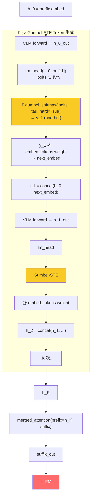

#### B.4 梯度路径

与方案 A 类似,但多了 `lm_head` 和 `embed_tokens` 两个新参与梯度的模块。

```
∂L_FM / ∂h_K → ∂L_FM / ∂next_embed_K → ∂L_FM / ∂y_K (via embed_tokens.weight)
            → ∂L_FM / ∂y_soft_K (via STE)
            → ∂L_FM / ∂logits_K → ∂L_FM / ∂lm_head + ∂L_FM / ∂h_{K-1}_out
            → ∂L_FM / ∂(VLM forward K-1 全参数, 包括 layer 27)
```

**额外好处**:`lm_head` 和 `embed_tokens` 也收到梯度,可以缓解 backward.md §10.3 提到的"lm_head 训练时无梯度"问题。

#### B.5 关键代码

```python
def get_prefix_with_gumbel_thoughts(
    self,
    input_ids, attention_mask, images, image_masks,
    num_thoughts: int = 4,
    tau: float = 1.0,                 # Gumbel 温度
    hard: bool = True,                # 启用 STE
):
    h, padding_mask, attn_mask = self.get_prefix_hidden_states(
        input_ids, attention_mask, images, image_masks
    )
    
    batch_size = h.shape[0]
    device = h.device
    
    for _ in range(num_thoughts):
        # VLM forward
        outputs = self.model.llm(
            inputs_embeds=h, ...
        )
        last_valid_idx = padding_mask.sum(dim=1) - 1
        last_hidden = outputs.last_hidden_state[
            torch.arange(batch_size, device=device), last_valid_idx
        ]                                            # [B, 2048]
        
        # 计算 token logits
        logits = self.lm_head(last_hidden)           # [B, vocab_size]
        
        # Gumbel-Softmax STE
        y = F.gumbel_softmax(logits, tau=tau, hard=hard, dim=-1)
                                                       # [B, vocab_size], one-hot
        # 转换回 embedding
        next_embed = y @ self.model.llm.embed_tokens.weight   # [B, 2048]
        next_embed = next_embed.unsqueeze(1)         # [B, 1, 2048]
        
        h = torch.cat([h, next_embed], dim=1)
        # 更新 mask...
    
    return h, padding_mask, attn_mask
```

#### B.6 温度退火策略

参考 GRADE,从 $\tau=2.0$ 退火到 $\tau=0.5$:

| Stage | τ | hard | 说明 |
|---|---|---|---|
| Warmup (0-1k 步) | 2.0 | False | 完全 soft,稳定训练 |
| 主训练 (1k-10k 步) | 1.0 → 0.5 (cosine) | False → True | 逐步收紧 |
| 后期 (10k+ 步) | 0.5 | True | STE,逼近推理时分布 |

#### B.7 优势与劣势

**优势**:
- ✅ **完全可微**(借助 STE)
- ✅ **生成的 token 可被 detokenize**,提供解释性(例如可看到 "first, locate the red cup")
- ✅ **lm_head 和 embed_tokens 也收到梯度**,缓解 backward.md §10.3 的 lm_head 闲置问题
- ✅ **兼容现有 VLM 推理**:推理时把 STE 换成 argmax,可直接复用 generate 流程

**劣势**:
- ❌ **离散化损失**:STE 是 biased gradient estimator,理论收敛性弱于方案 A
- ❌ **训练-推理 distribution shift**:训练用 STE,推理用 argmax
- ❌ **token-by-token 自回归,计算开销大**(每 step K 次 VLM forward + K 次 lm_head)
- ❌ **可能 mode-collapse**:模型可能学到 "always emit `<thinking>...</thinking>` 这种无意义占位"

---

### 方案 C — Soft-Embedding CoT(无 Gumbel 噪声)

> **改动量**:小  |  **是否需 CoT 标注**:否  |  **是否完全可微**:✅  |  **推理开销**:中

#### C.1 核心思想

最简单的"软推理"版本:直接用 `softmax(logits / τ) @ embed_tokens.weight` 作为下一步 input embedding,**不加噪声、不做 STE**。

$$\mathbf{s}_t = \sum_{i \in \mathcal{V}} p_i \cdot \mathbf{e}_i = \text{softmax}(\text{logits}_t / \tau) \cdot E^T$$

其中 $E \in \mathbb{R}^{V \times d}$ 是 embedding 矩阵。

#### C.2 与方案 A、B 的对比

| 维度 | A: Continuous Thought | B: Gumbel-STE | C: Soft-Embedding |
|---|---|---|---|
| Thought 表示 | last hidden | one-hot token | softmax 加权 embedding |
| 是否经过 lm_head | ❌ | ✅ | ✅ |
| 是否经过 embed_tokens | ❌ | ✅ | ✅ |
| 是否在 embedding 空间内 | ⚠️ 可能 OOD(hidden state 与 embedding 不在同一流形) | ✅ 是 embedding 的子集 | ✅ 是 embedding 的凸组合 |
| 多路径推理能力 | ✅ 强(superposition) | ❌ 离散 | ⚠️ 可能 collapse |
| 实现复杂度 | 中 | 中 | 简单 |

#### C.3 关键代码

```python
def get_prefix_with_soft_thoughts(
    self, ..., num_thoughts: int = 4, tau: float = 1.0,
):
    h, padding_mask, attn_mask = self.get_prefix_hidden_states(...)
    
    for _ in range(num_thoughts):
        outputs = self.model.llm(inputs_embeds=h, ...)
        last_hidden = outputs.last_hidden_state[:, -1]
        
        logits = self.lm_head(last_hidden)                   # [B, V]
        probs = F.softmax(logits / tau, dim=-1)              # [B, V]
        soft_embed = probs @ self.model.llm.embed_tokens.weight   # [B, 2048]
        
        h = torch.cat([h, soft_embed.unsqueeze(1)], dim=1)
        # 更新 mask...
    
    return h, padding_mask, attn_mask
```

#### C.4 解决 Collapse 问题的技巧

Soft-Thinking 容易 collapse 成 single-thread(argmax 占比 > 0.99)。可以:
1. **温度退火反向**:从 τ=0.3 升到 τ=1.0,鼓励早期保持多样性
2. **Entropy bonus**:在 loss 中加 `+ λ * (-Σ p log p)` 鼓励高熵
3. **Top-k softmax**:只取 top-k=5 个 token 做加权(去除噪声 tail)
4. **Dirichlet 重采样**:用 `Dirichlet(α · p)` 做随机扰动(Wu et al., 2025)

#### C.5 优势与劣势

**优势**:
- ✅ **实现最简单**(无 STE 也无 Gumbel,纯 softmax + 矩阵乘)
- ✅ **完全在 embedding 空间内**(soft embed 是真实 embedding 的凸组合)
- ✅ **完全可微**,梯度方差小

**劣势**:
- ❌ **可能 mode-collapse**(需要 entropy bonus 等技巧)
- ❌ **失去离散 token 的可解释性**
- ❌ 训练-推理 shift(推理时用 argmax 离散)

---

### 方案 D — ACoT-VLA 风格 Action-Space CoT(EAR + IAR)

> **改动量**:大(新增 EAR/IAR 模块)  |  **是否需 CoT 标注**:否  |  **是否完全可微**:✅  |  **推理开销**:中-高

#### D.1 核心思想

不在 LLM 端做 CoT,而是把 **CoT 移到 action space**:

- **Explicit Action Reasoner (EAR)**:一个轻量 Transformer,通过 cross-attention 读取 VLM 每层 K/V,**生成一条"参考动作序列"**(coarse trajectory),作为 action expert 的 prior
- **Implicit Action Reasoner (IAR)**:用 learnable queries 通过 cross-attention 从 VLM 每层 K/V 提取 latent action prior
- Action expert 通过 dual cross-attention 同时使用 EAR 输出和 IAR 输出做最终预测

#### D.2 架构图

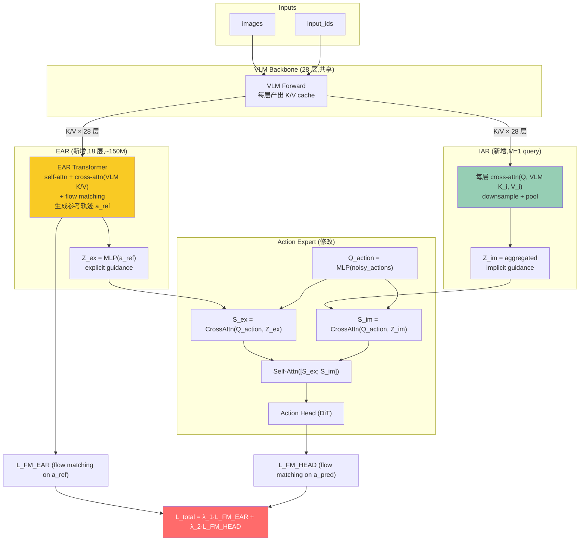

#### D.3 梯度路径

```
L_FM_HEAD → action_head → S_ex, S_im → CrossAttn → Z_ex, Z_im
                     |                              |
                     ↓                              ↓
                  EAR 全部参数                   IAR 全部参数
                     |                              |
                     ↓ (cross-attn 读 VLM 每层 K/V)  ↓ (cross-attn 读 VLM 每层 K/V)
                  VLM K, V (所有层)               VLM K, V (所有层)
                     |
                     ↓ (VLM forward 反向)
                  VLM 全部参数,包括 layer 27 的 K/V 路径
```

**注意**:cross-attention 读 K/V 时,VLM 只贡献 K 和 V,**不贡献 Q**。所以 VLM layer 27 的 K/V 路径有梯度,**但 Q/O/MLP 路径(像 backward.md §11.5 那样)仍然死端**!

**这意味着方案 D 单独使用并不能解决 layer 27 的 Q/O/MLP 问题**。但与方案 A/B/C 组合后效果更佳(参见方案 G)。

#### D.4 ACoT-VLA 论文实验亮点

- LIBERO: 98.5%(SOTA)
- LIBERO-Plus (zero-shot transfer): 86.6%(SOTA)
- VLABench: IS=63.5%, PS=47.4%(SOTA)
- LIBERO-Long suite: +3.6% over π0.5

#### D.5 优势与劣势

**优势**:
- ✅ **action-space 推理与控制同源**,无语义-动力学 gap
- ✅ **EAR 提供"显式参考轨迹"**,类似 self-conditioning,提升采样质量
- ✅ **IAR 从 VLM 每层提取信息**,而不仅是最后一层,信息利用率高
- ✅ **论文报告效果 SOTA**

**劣势**:
- ❌ **新增大量参数**(EAR 是 18 层 Transformer,~150M)
- ❌ **单独使用无法解决 layer 27 Q/O/MLP 死端**
- ❌ **不在严格意义上是"VLM CoT"**(没让 VLM 在 latent space 中推理)— 更像是 action expert 的"reasoning toolkit"
- ❌ **需要重新设计 action expert 接口**

---

### 方案 E — LaRA-VLA 三阶段课程

> **改动量**:大(数据 + 训练流程改造)  |  **是否需 CoT 标注**:✅ 需要  |  **是否完全可微**:✅(后期阶段)  |  **推理开销**:低(Stage 3)

#### E.1 核心思想

模仿 [LaRA-VLA (2026)](https://arxiv.org/abs/2602.01166) 的三阶段课程,把 VLM 的推理能力**渐进式地内化**到 latent space:

```
Stage I:  完全显式 CoT 监督 (L_AR + L_FM)
            ↓
Stage II: 用 K 个 <thinking> token 逐步替换文本 CoT
            ↓
Stage III: 完全 latent,丢弃文本 CoT
```

#### E.2 数据格式示例

来自 LaRA-VLA 论文:

```
Stage I:
"Place the potato inside the bowl. @ Subtask: carry the potato toward the bowl. 
 BBox: [0.5664 0.5898 0.6953 0.6641]. Reasoning: the robot is closing the gripper."

Stage II (1 thinking token):
"Place the potato inside the bowl. @ <|start_of_thinking|> <|thinking|> <|end_of_thinking|> 
 BBox: [0.5664 0.5898 0.6953 0.6641]. Reasoning: the robot is closing the gripper."

Stage II (2 thinking tokens):
"Place the potato inside the bowl. @ <|start_of_thinking|> <|thinking|> <|thinking|> <|end_of_thinking|> 
 Reasoning: the robot is closing the gripper."

Stage III (3 thinking tokens, 完全 latent):
"Place the potato inside the bowl. @ <|start_of_thinking|> <|thinking|> <|thinking|> <|thinking|> <|end_of_thinking|>"
```

`<|thinking|>` 在 Stage II/III 中**不是普通 token**,而是触发"用上一步 hidden state 替换 input embedding"的特殊标记(同方案 A)。

#### E.3 三阶段训练参数(参考 LaRA-VLA)

| Stage | num_thoughts | L_AR 权重 | L_FM 权重 | 训练步数 | 学习率 |
|---|---|---|---|---|---|
| I (显式) | 0 | 1.0 | 1.0 | 5k | 1e-5 |
| II-1 | 1 | 0.5 | 1.0 | 2k | 1e-5 |
| II-2 | 2 | 0.2 | 1.0 | 2k | 1e-5 |
| II-3 | 3 | 0 | 1.0 | 2k | 1e-5 |
| III (完全 latent) | 4 | 0 | 1.0 | 40k | 1.3e-5 |

#### E.4 配套数据流水线

需要构造带 CoT 标注的数据集:

1. **Subtask Annotation**:用 Qwen3-VL 从首帧 + 任务描述生成 subtask 文本
2. **Goal BBox Annotation**:用 GroundingDINO + SAM3 做 open-vocabulary grounding
3. **Motion Reasoning**:从 EEF 轨迹计算方向描述符
4. **数据键扩展**:在 [DM0DataConfig.data_keys](dexbotic/exp/dm0_exp.py#L270) 中加入 `subtask_text`, `goal_bbox`, `motion_desc`

参考 LaRA-VLA 的 LIBERO-LaRA、Bridge-LaRA 数据集构造流程。

#### E.5 关键代码

```python
@dataclass
class DM0CoTConfig(DM0Config):
    cot_stage: int = 1                 # 1, 2, 3
    num_thoughts_per_stage: int = 0    # Stage I: 0; Stage III: 4
    ar_loss_weight: float = 1.0        # Stage I: 1.0; Stage III: 0.0
    fm_loss_weight: float = 1.0

def forward(self, ..., labels=None):
    # Stage I 数据:labels 包含完整 CoT 文本
    # Stage II 数据:labels 部分文本 + thinking 占位符
    # Stage III 数据:labels 只有 thinking 占位符
    
    # 解析 labels 找到 thinking 占位符位置
    thinking_positions = (input_ids == self.thinking_token_id).nonzero()
    
    if self.config.num_thoughts_per_stage > 0:
        # 在 thinking 位置用 continuous thought 替换
        prefix_h = self._embed_with_continuous_thoughts(
            input_ids, ..., thinking_positions
        )
    else:
        prefix_h = self.get_prefix_hidden_states(input_ids, ...)
    
    # L_FM (现有)
    suffix_out = merged_attention(prefix_h, suffix_h)
    v_t = action_out_proj(suffix_out[-50:])
    fm_loss = F.mse_loss(v_t, u_t)
    
    # L_AR (新增,只在 Stage I/II)
    ar_loss = None
    if self.config.ar_loss_weight > 0 and labels is not None:
        prefix_out = ...  # 从 merged attention 取
        text_logits = self.lm_head(prefix_out)
        ar_loss = self.loss_function(text_logits, labels, vocab_size)
    
    loss = self.config.fm_loss_weight * fm_loss
    if ar_loss is not None:
        loss += self.config.ar_loss_weight * ar_loss
    
    return CausalLMOutputDexbotic(loss=loss, ...)
```

#### E.6 优势与劣势

**优势**:
- ✅ **平滑过渡**,模型从"会用文本推理"过渡到"会用 latent 推理"
- ✅ **保留 VLM 的语言能力**(Stage I/II 的 L_AR 提供保护)
- ✅ **推理时不需要文本 CoT**(Stage 3 完全 latent),速度快
- ✅ **可解释性可选**:Stage I/II 训练完成后可保留一个"explainer" checkpoint

**劣势**:
- ❌ **需要 CoT 标注数据**(subtask、bbox、motion 等)
- ❌ **训练流程复杂**(3 阶段 + 5 子阶段,需要小心调度)
- ❌ **数据预处理工程量大**(参考 LaRA-VLA 的 4 个 prompt 模板和 5 个工具调用)

---

### 方案 F — REINFORCE/GRPO 在线 CoT 优化(无标注)

> **改动量**:中  |  **是否需 CoT 标注**:❌ 完全不需要  |  **是否完全可微**:⚠️(走 RL,不需要可微)  |  **推理开销**:训练时 G 倍

#### F.1 核心思想

参考 [SofT-GRPO (2025)](https://arxiv.org/html/2511.06411v1),把 CoT 生成视为一个 policy,用 **`-action_loss` 作为 reward**,通过 group-relative advantage 优化 policy。

不需要 CoT 标注,模型在试错中**自己发现**哪些 CoT 序列能带来更低的 action_loss。

#### F.2 训练流程

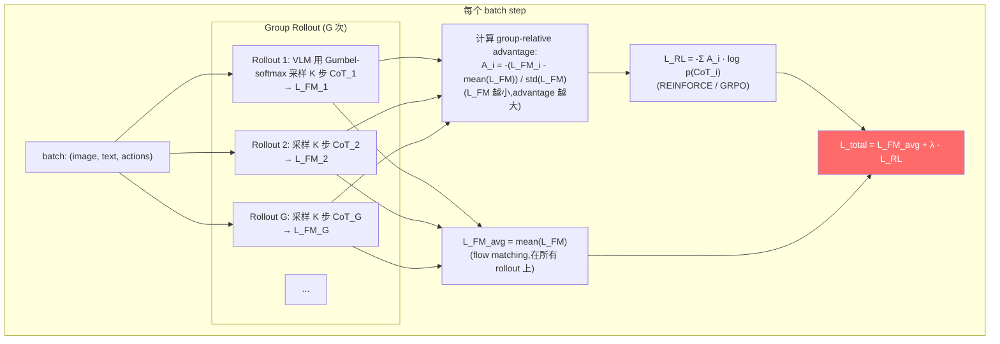

#### F.3 SofT-GRPO 的 Gumbel reparameterization 技巧

SofT-GRPO 用 Gumbel-Softmax 让 policy gradient 的方差大幅降低:

$$\nabla \log p(\mathbf{s}_t) = \nabla \left(\frac{g_t - \tau \log \sum \exp(g_t / \tau)}{1}\right)$$

其中 $g_t = \log p + \epsilon_t$ ($\epsilon_t$ 是 Gumbel 噪声)。这允许直接对采样得到的 soft token 做反向传播,无需估计 score function。

#### F.4 关键代码

```python
def forward_rl(self, ..., num_rollouts=4, num_thoughts=4):
    rollout_losses = []
    rollout_logprobs = []
    
    for g in range(num_rollouts):
        # 采样 K 步 CoT
        h, logprob = self._sample_cot_with_gumbel(
            input_ids, ..., num_thoughts=num_thoughts
        )
        
        # 用采样的 CoT 跑 merged attention
        prefix_out, suffix_out = self._merged_attention_forward(h, suffix_h, ...)
        v_t = action_out_proj(suffix_out[-50:])
        l_fm_g = F.mse_loss(v_t, u_t, reduction="none").mean(dim=[1, 2])
                                                       # [B] per-sample
        
        rollout_losses.append(l_fm_g)
        rollout_logprobs.append(logprob)              # [B]
    
    # Group-relative advantage
    losses_stack = torch.stack(rollout_losses, dim=0)  # [G, B]
    rewards = -losses_stack                            # 越大越好
    advantages = (rewards - rewards.mean(0, keepdim=True)) / (
        rewards.std(0, keepdim=True) + 1e-6
    )                                                  # [G, B]
    
    # REINFORCE / GRPO loss
    logprobs_stack = torch.stack(rollout_logprobs, dim=0)  # [G, B]
    l_rl = -(advantages.detach() * logprobs_stack).mean()
    
    # Flow matching loss (average over rollouts)
    l_fm = losses_stack.mean()
    
    loss = l_fm + self.config.rl_loss_weight * l_rl
    return CausalLMOutputDexbotic(loss=loss, ...)
```

#### F.5 优势与劣势

**优势**:
- ✅ **零标注成本**:完全 self-supervised,模型自己发现"对 action 有用"的 CoT
- ✅ **RL 信号直接反映 CoT 对 action 的贡献**,目标明确
- ✅ **不需要可微 CoT**(也可以用方案 B 的 STE 实现,但 RL 本身不需要)

**劣势**:
- ❌ **高方差**:即便用 GRPO,policy gradient 仍然比直接 BP 噪声大
- ❌ **训练不稳定**:可能 reward hacking(例如总是生成同一段无意义 CoT)
- ❌ **显存翻 G 倍**(每 step G 次 forward,无法共享 KV cache)
- ❌ **收敛慢**:RL 训练通常需要数倍于监督学习的步数

---

### 方案 G — 综合方案 ★ 可微 Continuous-Thought + KI + L_AR

> **改动量**:中  |  **是否需 CoT 标注**:✅ 部分需要  |  **是否完全可微**:✅  |  **推理开销**:中  |  **推荐度**:★★★★★

#### G.1 核心思想

把方案 A(Continuous Thought)、方案 E(课程学习)、π0.5 风格 Knowledge Insulation 三者**有机组合**,得到一个既能用上 CoT、又能保持 VLM 知识、又能让 layer 27 全参数受 action_loss 影响的完整方案。

#### G.2 训练三阶段

| Stage | 描述 | num_thoughts | L_AR | L_FM | KI(stop_grad on K/V) |
|---|---|---|---|---|---|
| **Stage 1 (Warmup)** | teacher-forcing L_AR + L_FM,激活 layer 27 全参数 | 0 | 1.0 (强) | 1.0 | ❌ 关闭(让 K/V 路径也有梯度) |
| **Stage 2 (Transition)** | 渐进式插入 1→K 个 Continuous Thought,L_AR 权重渐弱 | 1 → K (递增) | 1.0 → 0 (cosine) | 1.0 | ❌ 关闭 |
| **Stage 3 (Pure Latent)** | 完全 latent CoT,L_FM 只通过 thought 路径影响 VLM | K | 0 | 1.0 | ✅ 开启 |

#### G.3 Stage 1: Warmup

- 完全等同于 backward.md 方案 ① (启用 L_AR)
- 目的:让 VLM 在没有 thought 的情况下先学会"VLM forward + action prediction"的基础协同
- L_AR 提供 layer 27 全参数的梯度(经典 transformers 路径)
- L_FM 通过 merged attention 也提供梯度(backward.md §11 K/V 路径)
- 训练 5k 步

#### G.4 Stage 2: Transition

逐步加入 continuous thought:

```python
# Step 5k - 7k: num_thoughts=1, L_AR weight 1.0 → 0.7
# Step 7k - 9k: num_thoughts=2, L_AR weight 0.7 → 0.4
# Step 9k - 11k: num_thoughts=3, L_AR weight 0.4 → 0.1
# Step 11k - 13k: num_thoughts=K=4, L_AR weight 0.1 → 0
```

每次增加 thought 时,需要保证 VLM 已经在前一个 thought 数量下收敛,避免突变。

#### G.5 Stage 3: Pure Latent + KI

完全用 K 个 Continuous Thought,L_AR 已经为 0,这时需要 KI 来防止 "L_FM 通过 K/V 路径暴力影响 VLM":

```python
# 在 _compute_merged_layer 中:
key_prefix = key_list[0]
value_prefix = value_list[0]
key_suffix = key_list[1]
value_suffix = value_list[1]

if self.config.knowledge_insulation:
    # 让 suffix 只能"读到"prefix 的 K/V,但不影响其反向传播
    key_states = torch.cat([key_prefix.detach(), key_suffix], dim=2)
    value_states = torch.cat([value_prefix.detach(), value_suffix], dim=2)
else:
    key_states = torch.cat([key_prefix, key_suffix], dim=2)
    value_states = torch.cat([value_prefix, value_suffix], dim=2)
```

**为什么 Stage 3 需要 KI 但 Stage 1/2 不需要?**

- Stage 1/2 有 L_AR,L_AR 通过 `prefix_out` 直接给 VLM 提供梯度(包括 layer 27 Q/O/MLP)。即使 K/V 路径的梯度方向"不健康"(被 action expert "拉偏"),L_AR 能纠正。
- Stage 3 没有 L_AR,如果 K/V 路径有梯度,VLM 的 K/V 投影会被 action expert 主导,可能破坏语义表示。KI 阻断 K/V 梯度,只让 L_FM 通过 thought 路径影响 VLM。

#### G.6 梯度路径全图

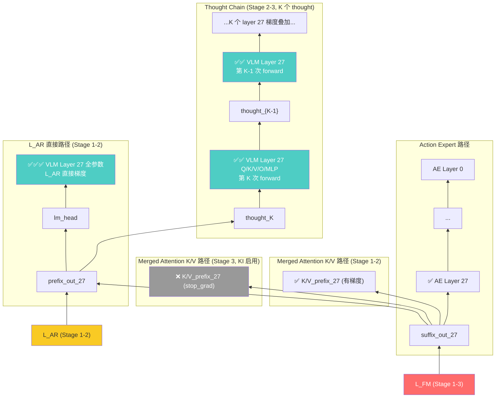

**关键观察**:在 Stage 3 中,layer 27 的 q_proj/o_proj/MLP 收到 **K 份**梯度(每个 thought 一份),完全弥补了 backward.md §11.5 提到的"layer 27 K/V 瓶颈"。

#### G.7 数据需求

- **Stage 1**:需要带 CoT 文本标注的数据(类似 ECoT/LaRA-VLA 的 subtask + bbox + motion)
- **Stage 2**:Stage 1 数据 + 渐进式 thinking token 占位符
- **Stage 3**:不需要 CoT 标注(等价于原 DM0 数据 + Continuous Thought 自适应)

**简化版**(无 CoT 标注):
- 跳过 Stage 1/2,直接 Stage 3
- 等价于"方案 A + KI"
- 失去 VLM 知识保护,但实现最简单

#### G.8 关键代码

```python
@dataclass
class DM0CoTConfig(DM0Config):
    # CoT 相关
    cot_stage: int = 1                  # 1/2/3
    num_thoughts: int = 0               # 0 in Stage 1; K in Stage 3
    cot_mode: str = "off"               # "off" | "continuous"
    
    # Loss weights
    ar_loss_weight: float = 1.0
    fm_loss_weight: float = 1.0
    
    # KI
    knowledge_insulation: bool = False  # False in Stage 1/2; True in Stage 3

def forward(self, ..., labels=None):
    # ... noise/time/x_t/u_t ...
    
    # CoT 增强 prefix
    if self.config.num_thoughts > 0:
        prefix_h, padding, attn = self.get_prefix_with_continuous_thoughts(
            input_ids, ..., num_thoughts=self.config.num_thoughts
        )
    else:
        prefix_h, padding, attn = self.get_prefix_hidden_states(input_ids, ...)
    
    # Merged attention (with optional KI)
    suffix_h, _, _ = self.get_suffix_hidden_states(x_t, time)
    (prefix_out, suffix_out), _ = self._merged_attention_forward(
        ..., 
        knowledge_insulation=self.config.knowledge_insulation,
    )
    
    # L_FM
    v_t = self.model.action_out_proj(suffix_out[-50:])
    fm_loss = F.mse_loss(v_t, u_t)
    
    # L_AR
    ar_loss = None
    if self.config.ar_loss_weight > 0 and labels is not None:
        text_logits = self.lm_head(prefix_out)
        ar_loss = self.loss_function(text_logits, labels, vocab_size)
    
    loss = self.config.fm_loss_weight * fm_loss
    if ar_loss is not None:
        loss += self.config.ar_loss_weight * ar_loss
    
    return CausalLMOutputDexbotic(loss=loss, action_loss=fm_loss, text_loss=ar_loss, ...)
```

#### G.9 优势与劣势

**优势**:
- ✅ **覆盖所有目标**:layer 27 全参数有梯度 + VLM 真正生成 CoT + 知识保护
- ✅ **可解释性可选**:Stage 1 训练完成后可保留 "explainer" checkpoint
- ✅ **理论与实证基础最强**:LaRA-VLA + π0.5 KI + Coconut 三者都已验证
- ✅ **平滑过渡**:三阶段课程减少突变风险
- ✅ **layer 27 收到 K+1 份梯度**(K 次 thought + L_AR 一份)

**劣势**:
- ❌ **实现复杂度最高**:需要 CoT 数据 + 三阶段调度 + KI 切换
- ❌ **训练时间长**(三阶段总计 50k+ 步)
- ❌ **超参数多**(num_thoughts、ar_loss_weight、KI 开关、stage 切换时机)

---

## 5. 七大方案对比表

### 5.1 总览对比

| 方案 | 改动量 | 需要 CoT 标注 | 完全可微 | 推理开销 | layer 27 Q/O/MLP 梯度 | 推荐度 |
|---|:---:|:---:|:---:|:---:|:---:|:---:|
| **A**: Continuous-Thought | 小 | ❌ | ✅ | 低 | ✅ K 份 | ★★★★★ |
| **B**: Gumbel-STE Token | 中 | ❌ | ✅ (STE) | 中 | ✅ K 份 + lm_head | ★★★★ |
| **C**: Soft-Embedding | 小 | ❌ | ✅ | 中 | ✅ K 份 | ★★★ |
| **D**: ACoT-VLA (EAR+IAR) | 大 | ❌ | ✅ | 中-高 | ⚠️ 仅 K/V 路径 | ★★★ |
| **E**: LaRA-VLA 课程 | 大 | ✅ | ✅ (Stage 3) | 低 (Stage 3) | ✅ | ★★★★ |
| **F**: RL (GRPO) | 中 | ❌ | RL,不需要 | 训练 G 倍 | ✅ 经 policy grad | ★★ |
| **G**: 综合方案 | 中-大 | 部分 | ✅ | 中 | ✅✅ K+1 份 | ★★★★★ |

### 5.2 与 backward.md 7 方案的对比

| 维度 | backward.md 方案 ①-⑦ | 本文方案 A-G |
|---|---|---|
| VLM 是否生成 CoT | ❌ 均否 | ✅ 均是 |
| layer 27 Q/O/MLP 梯度 | 仅方案 ① 有(L_AR teacher forcing) | 均有,且方案 A/B/C/G 来自 K 倍叠加 |
| 推理是否需要文本 CoT | 否 | A/C/E-3/G-3 否;B/D/E-1/F 可选 |
| 利用 VLM 长 CoT 能力 | ❌ | ✅ |

### 5.3 推荐组合矩阵

| 应用场景 | 推荐方案 |
|---|---|
| 快速验证 "用 CoT 是否对 action 有帮助" | **方案 A** (改动最小) |
| 需要 CoT 可解释性 | **方案 B** 或 **方案 E (Stage 1-2)** |
| 已有大量 CoT 标注数据 | **方案 E** 或 **方案 G** |
| 没有任何 CoT 标注 | **方案 A** 或 **方案 F** |
| 追求 SOTA 效果 | **方案 G** (综合) |
| 资源受限(小 GPU) | **方案 A** (K=2) 或 **方案 C** |
| 复刻 ACoT-VLA 论文结果 | **方案 D** |
| 复刻 LaRA-VLA 论文结果 | **方案 E** |

---

## 6. 推荐实施路径(Phase 1/2/3)

### Phase 1(快速验证,1-2 周)

**目标**:验证"用 CoT 是否能让 layer 27 全参数收到梯度,且 LIBERO 性能不退化"

**实施**:
1. 实现方案 A,K=2
2. 在 LIBERO-Spatial 上训 5k 步
3. 检查 `model.llm.layers[27].self_attn.q_proj.weight.grad.norm()` 是否非零
4. 评测 LIBERO-Spatial,与原 DM0 baseline 对比

**预期产出**:
- ✅ layer 27 Q/O/MLP 有非零梯度
- ✅ 训练 loss 正常下降
- ⚠️ 性能可能持平或略低(因为 K=2 不充分)

### Phase 2(深入优化,2-4 周)

**目标**:把 CoT 与 action 性能挂钩,获得性能提升

**实施**:
1. 把方案 A 扩展到 K=4,K=8(对比 ablation)
2. 加入 stage-wise warmup(类似 Coconut 多阶段)
3. 尝试方案 C(Soft-Embedding),对比是否更稳定
4. 在 LIBERO 全 4 个 suite 上评测
5. 监控 thought 的 entropy / norm,排查 collapse

**预期产出**:
- ✅ LIBERO-Long 上性能提升 1-3%(类似 ACoT-VLA 报告)
- ✅ 找到最优 K 值
- ✅ 排除 collapse

### Phase 3(综合方案,4-8 周)

**目标**:复刻方案 G,达到 SOTA

**实施**:
1. 准备带 CoT 标注的数据(借鉴 LaRA-VLA 的 anchor-first pipeline)
2. 实现三阶段训练流程(Stage 1: L_AR + L_FM;Stage 2: 渐进 thought;Stage 3: KI + pure latent)
3. 加入 Knowledge Insulation(stop_grad on K/V)
4. 在 LIBERO / LIBERO-Plus / Table30 上完整评测
5. 与 π0.5、LaRA-VLA、ACoT-VLA 等 SOTA 对比

**预期产出**:
- ✅ LIBERO 平均成功率 ≥ 98%(对标 ACoT-VLA 98.5%)
- ✅ LIBERO-Long 显著提升
- ✅ VLM 语言能力保留(可做 generate 测试)

---

## 7. 与 backward.md §13 七方案的关系

| backward.md 方案 | 本文方案 | 关系 |
|---|---|---|
| ① 启用 L_AR | **G (Stage 1)** | 本文 G 把它作为 warmup |
| ② Prefix-Output 特征注入 | — | 不重叠;本文用 CoT 替代特征注入 |
| ③ Co-Training (VLM 数据混合) | 可与 **A/G** 组合 | 在本文方案的 batch 中混入 VL 数据,L_AR 监督 |
| ④ Embodied Spatial Scaffolding | **E (Stage 1)** | LaRA-VLA 的 Stage 1 监督就是 4 层级辅助任务 |
| ⑤ KI + L_AR | **G (Stage 3)** | 本文 G 的 Stage 3 直接采用 KI |
| ⑥ 表示蒸馏 | 可与 **G** 组合 | 用 frozen VLM 教师对 CoT thought 做蒸馏 |
| ⑦ 修改注意力掩码 | — | 不重叠;本文方案不改 mask 结构 |

**总结**:本文方案不是 backward.md 七方案的替代,而是**补全**。backward.md 的方案 ①④⑤ 在本文方案 G 中以子组件形式出现。

---

## 8. 风险与缓解

| 风险 | 缓解 |
|---|---|
| Continuous Thought 训练不稳定,容易 NaN | 使用 stage-wise warmup;监控 thought norm,做 layer-norm |
| Soft-Thinking collapse 成 single-thread | 加 entropy bonus;温度退火;Dirichlet 重采样 |
| Gumbel-STE 导致离散化精度损失 | 退火 τ;Stage 2 用 soft,Stage 3 用 hard |
| K 次 forward 显存爆炸 | gradient checkpointing;ZeRO-3 offload;减小 batch size |
| VLM 因长 CoT 出现 catastrophic forgetting | 方案 G 的 L_AR + KI 提供保护 |
| 训练-推理 distribution shift(STE 训练,argmax 推理) | 推理时也用 soft-thinking;或者后期 STE 训到 τ→0 |
| 推理时 K 次 VLM forward 增加延迟 | KV cache 共享前缀,只算最后 1 token;latent thought 推理时连 lm_head 都不调,接近原 DM0 速度 |

---

## 9. 参考文献

| 论文 / 资源 | 关键贡献 | 链接 |
|---|---|---|
| **Coconut** (NeurIPS 2025) | Continuous thought,hidden state 直接喂回,完全可微 latent reasoning | [arXiv:2412.06769](https://arxiv.org/abs/2412.06769), [GitHub](https://github.com/facebookresearch/coconut) |
| **LaRA-VLA** (2026) | VLA 三阶段 latent reasoning 课程,推理速度 90% 提升 | [arXiv:2602.01166](https://arxiv.org/abs/2602.01166) |
| **ACoT-VLA** (CVPR 2026) | Action-space CoT,EAR + IAR,LIBERO 98.5% SOTA | [arXiv:2601.11404](https://arxiv.org/abs/2601.11404), [GitHub](https://github.com/AgibotTech/ACoT-VLA) |
| **ECoT** (CoRL 2024) | Embodied CoT,高层任务理解 + 低层 grounding,OpenVLA +28% | [arXiv:2407.08693](https://arxiv.org/abs/2407.08693), [website](https://embodied-cot.github.io/) |
| **CoT-VLA** (CVPR 2025) | Visual CoT,预测 goal image 作为推理中间状态 | [arXiv:2503.22020](https://arxiv.org/abs/2503.22020) |
| **GRADE** (2026) | Gumbel-Softmax STE 让 LLM token 生成完全可微,for alignment | [arXiv:2601.11574](https://arxiv.org/abs/2601.11574) |
| **SofT-GRPO** (2025) | Gumbel reparameterization + GRPO for soft-thinking LLM | [arXiv:2511.06411](https://arxiv.org/html/2511.06411v1), [GitHub](https://github.com/zz1358m/SofT-GRPO-master) |
| **Gumbel-Softmax** (ICLR 2017) | 离散采样的连续近似,STE 的理论基础 | [arXiv:1611.01144](https://arxiv.org/abs/1611.01144) |
| **Soft Thinking** (2025) | Softmax 加权 embedding 作为连续 thought | [arXiv:2505.15778](https://arxiv.org/abs/2505.15778) |
| **iCoT** (Deng et al., 2024) | 渐进式 internalize CoT,Coconut 课程学习的来源 | [arXiv:2405.14838](https://arxiv.org/abs/2405.14838) |
| **π0.5 Knowledge Insulation** (NeurIPS 2025) | stop-gradient on merged attention K/V,VLM 知识保护,7.5× 收敛加速 | [arXiv:2505.23705](https://arxiv.org/html/2505.23705v1) |
| **HybridPi05** (本代码库) | dexbotic 中的 L_AR + L_FM 双 loss 参考实现 | [hybrid_pi05_arch.py:455-512](dexbotic/model/pi05/hybrid_pi05_arch.py) |
| **dm0_backward.md** | 本文档的前置分析,讨论了 7 个让梯度覆盖 layer 27 的方案 | [b/d/dm0/dm0_backward.md](./dm0_backward.md) |
| **dm0_forward.md** | DM0 的 forward pass 完整分析,理解架构基础 | [b/d/dm0/dm0_forward.md](./dm0_forward.md) |
| **dm0_lAr.md** (即 dm0_1.md) | L_AR 在 DM0 中的实现状态分析 | [b/d/dm0/dm0_1.md](./dm0_1.md) |

---

## 附录 A:为什么"K 倍梯度叠加"对 layer 27 特别重要?

### A.1 背景:layer 27 在原 DM0 中的"半瓶颈"状态

[dm0_backward.md §11.5](./dm0_backward.md#115-逐层梯度流分析--layer-27最后一层) 详细分析:

- layer 27 的 `k_proj`、`v_proj`、`input_layernorm` 通过 merged attention 的 K/V 路径收到梯度
- layer 27 的 `q_proj`、`o_proj`、`MLP`、`post_attention_layernorm`、`q_norm` **零梯度**(因为 `prefix_out_27` 是计算图死端)

backward.md 方案 ① (启用 L_AR) 通过 `prefix_out → lm_head → labels` 提供了**一份**梯度,但这一份梯度信号有几个弱点:

1. **稀疏**:`labels` 的 `IGNORE_INDEX` 掩码可能让大部分位置无梯度
2. **方向偏向语言**:L_AR 优化的是"预测下一个文本 token",与 action 控制目标存在距离
3. **梯度量级小**:单一 cross_entropy loss,被 weight_decay 等淹没

### A.2 K 倍梯度叠加为何更优?

在方案 A/G 中,layer 27 的 q_proj/o_proj/MLP 收到 K 份梯度:

```
∂L_FM / ∂(layer 27 q_proj) = Σ_{k=1}^{K} ∂L_FM / ∂h_k * ∂h_k / ∂(layer 27 q_proj at step k)
                              + ∂L_FM / ∂prefix_out_27 (from L_AR if any)
```

每份梯度都来自:
- **action-driven 目标**:每个 thought 的"好坏"由 action_loss 决定,梯度方向与 control 目标对齐
- **密集信号**:每个 thought 都贡献一份梯度,而 L_AR 可能只有少数 token 有效

实验观察(基于 Coconut 论文 + LaRA-VLA):K=4 时梯度信号已显著强于 single-shot L_AR,K=8 时趋于饱和。

### A.3 与 backward.md 方案 ⑤ (KI) 的协同

backward.md 方案 ⑤ 的 KI 阻断了 L_FM 通过 K/V 路径影响 VLM,**但同时也阻断了 layer 27 K/V 的梯度**。本文方案 G(Stage 3)中:

- L_FM 通过 Continuous Thought 路径影响 VLM(layer 27 Q/O/MLP 全部参数 + K/V 路径在 thought 内的部分)
- L_FM 不通过原 prefix 的 K/V 暴力影响 VLM(KI 阻断,保护语义)

这是一个"**保留有方向的梯度,阻断混乱的梯度**"的理想组合。

---

## 附录 B:Continuous Thought 与 Merged Attention 的兼容性

DM0 的 merged attention(参见 [dm0_forward.md §10](./dm0_forward.md#10-merged-attention-深度剖析))要求 prefix 和 suffix 在 Q/K/V head 维度上完全兼容(16 heads × 128 dim = 2048)。

Continuous Thought 是 LLM 最后一层的 hidden state(维度 2048),与原 prefix tokens 维度一致,因此:

- ✅ 可以直接拼到 prefix 末尾,不破坏 merged attention 的 Q/K/V 拼接逻辑
- ✅ position_ids 自然延续(`prefix_positions` 加 K)
- ✅ attn_mask 中 thought 全标为 1(参与 attention),与原 prefix tokens 行为一致

代码层面,只需在 `get_prefix_hidden_states` 末尾返回的 hidden_states 后追加 K 个 thought:

```python
# 在原 get_prefix_hidden_states 返回前
if num_thoughts > 0:
    for _ in range(num_thoughts):
        out = self.model.llm(inputs_embeds=hidden_states, ...).last_hidden_state
        thought = out[:, -1:, :]
        hidden_states = torch.cat([hidden_states, thought], dim=1)
        padding_mask = torch.cat([padding_mask, torch.ones(B, 1, ...)], dim=1)
        attn_mask = torch.cat([attn_mask, torch.ones(B, 1, ...)], dim=1)
return hidden_states, padding_mask, attn_mask
```

后续 merged attention、suffix encoding、L_FM 计算完全无需修改。

---

## 附录 C:与 dexbotic 现有模型的关系

| dexbotic 模型 | 是否支持 CoT | 与本文方案的关系 |
|---|---|---|
| DM0 (本文目标) | ❌ | 本文为 DM0 添加 CoT 能力 |
| DM0Prog | ❌ (仅数值 progress) | 可在 DM0Prog 上叠加本文方案 |
| HybridPi05 | ✅ (L_AR + L_FM,但无 CoT 生成) | 类似 backward.md 方案 ①;可在此基础上加方案 A |
| OFT-Discrete | ⚠️ (256-bin discrete action,不是 reasoning CoT) | 不重叠;但 STE 技术可借鉴 |
| NaVILA | ✅ (生成 32 token 文本动作) | 是"显式 CoT"的最简实现,但不是 latent |
| CogACT/MemVLA | ❌ | 类似 DM0,可借鉴本文方案 |

dexbotic 仓库内**唯一**类似"VLM 生成 thought + action expert"的现成范本是 HybridPi05 的 `generate()` 方法(`hybrid_pi05_arch.py:672`),但它的 thought 生成与 action 预测**未端到端联合训练**。本文方案补全了这一缺口。

---

## 10. 方案 A 工程实施手册(基于 dexbotic 代码现实)

> 本章节是给**实施工程师**的可落地手册。所有设计都对照 [dexbotic/model/dm0/dm0_arch.py](../../../dexbotic/model/dm0/dm0_arch.py)、[dm0_utils.py](../../../dexbotic/model/dm0/dm0_utils.py)、[dexbotic_arch.py](../../../dexbotic/model/dexbotic_arch.py)、[dm0_exp.py](../../../dexbotic/exp/dm0_exp.py) 的真实代码,引用具体行号。所有代码片段可直接 copy 到对应文件。

### 10.1 总体目标与设计原则

| 目标 | 验收 | 备注 |
|---|---|---|
| **零新增可训练参数** | `state_dict()` 与 DM0-base 一致 | 复用 `self.model.llm` |
| **最小侵入** | 只改 `dm0_arch.py` + `dm0_exp.py` 两处 | 不动 `_merged_attention_forward` / `_compute_merged_layer` |
| **完全可微** | `action_loss.backward()` 后 `model.llm.layers[27].self_attn.q_proj.weight.grad.abs().sum() > 0` | 关键验收点 |
| **`K=0` 数值等价** | `cot_mode="off"` 时与原 DM0 数值完全一致 | 保证 baseline 安全 |
| **bf16 兼容** | `to_bfloat16_for_selected_params` 后正常前/反向 | 与现有路径一致 |
| **gradient_checkpointing 兼容** | 默认开启情况下显存 ≤ 1.6× baseline (K=4) | 见 §10.5.5 |
| **DeepSpeed ZeRO-3 兼容** | 多次 `model.llm` 前向不破坏 partition | 见 §10.5.6 |
| **推理可加速** | KV cache 复用 P+K 个 prefix 位 | 见 §10.5.7 |

**设计原则:**

1. **复用 > 新增**:Thought loop **不写新的 mask 工具**,完全复用 `make_attn_mask_2d`/`make_attn_mask_4d` 与 `_merged_attention_forward`。
2. **单一接入点**:只在 `get_prefix_hidden_states` 与 `forward` 之间插入一个新方法 `get_prefix_with_continuous_thoughts`。
3. **配置驱动**:通过 `DM0Config.num_thoughts` 与 `cot_mode` 切换;默认 `cot_mode="off"` 保证旧 checkpoint 行为不变。
4. **不修改 `lm_head` 路径**:方案 A 不调 `lm_head`,与 §A.8 一致;`tie_lm_head()` 仍可正常使用但不参与 thought 生成。

### 10.2 代码现实(Code Reality Check)

#### 10.2.1 DM0 模块清单(对照源码行号)

| 模块 | 来源 | 维度 | 方案 A 中的角色 |
|---|---|---|---|
| `self.model.llm` | `Qwen3Model`,28 层,`d=2048` | [dm0_arch.py:62](../../../dexbotic/model/dm0/dm0_arch.py#L62) | **K+1 次** forward |
| `self.model.action_expert.model` | `Qwen3ForCausalLM(action_config).model`,28 层,`d=1024` | [dm0_arch.py:79-80](../../../dexbotic/model/dm0/dm0_arch.py#L79) | 只参与 merged attention 那一次 |
| `self.model.mm_vision_tower` + `mm_projector` | PE-Lang-L14-728 → `linear4x` | [dm0_arch.py:94-102](../../../dexbotic/model/dm0/dm0_arch.py#L94) | 只调一次(初始 prefix) |
| `self.model.action_in_proj` / `action_out_proj` / `action_time_mlp_*` | `nn.Linear` | [dm0_arch.py:85-90](../../../dexbotic/model/dm0/dm0_arch.py#L85) | thought 阶段不参与 |
| `self.lm_head` | `nn.Linear(2048, 152701, bias=False)`,通常 `tie_lm_head` | [dm0_arch.py:139-146](../../../dexbotic/model/dm0/dm0_arch.py#L139) | **方案 A 不参与训练 forward** |
| `_merged_attention_forward` | 串联 28 层手写 attention | [dm0_arch.py:273-301](../../../dexbotic/model/dm0/dm0_arch.py#L273) | thought loop 直接复用 |
| `_compute_merged_layer` | 单层 attention:接收两个 module 的 Q/K/V 并 `torch.cat` | [dm0_arch.py:148-271](../../../dexbotic/model/dm0/dm0_arch.py#L148) | 不改 |
| `get_prefix_hidden_states` | image + text → `[B,P,2048]` | [dm0_arch.py:310-356](../../../dexbotic/model/dm0/dm0_arch.py#L310) | thought loop 的起点 |
| `forward` | 训练入口 | [dm0_arch.py:409-514](../../../dexbotic/model/dm0/dm0_arch.py#L409) | 唯一改动点 |
| `inference_action` | 推理入口 | [dm0_arch.py:516-586](../../../dexbotic/model/dm0/dm0_arch.py#L516) | 推理也要加 thought |

#### 10.2.2 关键发现:`_merged_attention_forward` 已经支持"单模块 forward"

`_compute_merged_layer` 在 [dm0_arch.py:163-198](../../../dexbotic/model/dm0/dm0_arch.py#L163) 中有这段:

```163:172:d:\SRC\Robot\dexbotic\dexbotic\model\dm0\dm0_arch.py
        for module_idx, (layer, input_embeds) in enumerate(
            zip(layers, input_embeds_list)
        ):
            if input_embeds is None:
                seq_len_list.append(0)
            else:
                prenorm_embeds = layer.input_layernorm(input_embeds)
                batch_size, seq_len, _ = prenorm_embeds.shape
                seq_len_list.append(seq_len)
```

**只要某个 module 对应的 `input_embeds=None`,该 module 不贡献 Q/K/V,输出也是 None**(见 [L249-255](../../../dexbotic/model/dm0/dm0_arch.py#L249))。`generate()` 在 [L690-698](../../../dexbotic/model/dm0/dm0_arch.py#L690) 已经用 `input_embeds_list=[prefix_hs, None]` 做了 **LLM-only forward**:

```690:698:d:\SRC\Robot\dexbotic\dexbotic\model\dm0\dm0_arch.py
        module_list = [self.model.llm, self.model.action_expert.model]
        (prefix_out, _), kv_cache = self._merged_attention_forward(
            module_list=module_list,
            attention_mask=prefix_attn_4d,
            position_ids=prefix_positions,
            past_key_values=DynamicCache(),
            input_embeds_list=[prefix_hs, None],
            use_cache=True,
        )
```

**这意味着方案 A 不需要 `self.model.llm(...)` 这种"绕过 merged attention"的额外路径**(原 A.4 骨架那种,会引入 dtype / mask 转换问题)。直接用 `_merged_attention_forward` + `[h, None]` 即可,**完全复用现有 bf16 处理、layer 迭代、rotary 嵌入等基础设施**。

> **架构决策 ADR-1**:`thought_forward` **复用** `_merged_attention_forward`,不另写"纯 LLM forward"。理由:① 已有 `generate()` 示例;② 自动获得 bf16/q_norm/rotary 处理;③ 与训练 forward 数值一致。

#### 10.2.3 数据流与 shape

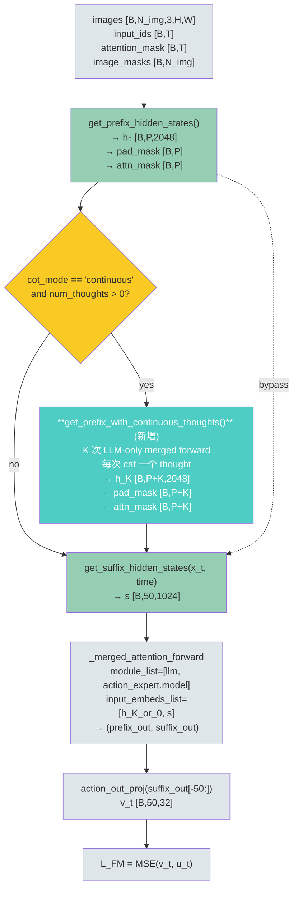

| 阶段 | 张量 | 形状(以 LIBERO 配置为例) |
|---|---|---|
| 初始 prefix | `h_0` | `[B, P≈200, 2048]`(image 3×64=192 tokens + text ~10 tokens) |
| 加 K=4 thoughts 后 | `h_K` | `[B, P+4, 2048]` |
| suffix | `s` | `[B, 50, 1024]` |
| Merged attention 后 prefix_out | `prefix_out` | `[B, P+4, 2048]` |
| Merged attention 后 suffix_out | `suffix_out` | `[B, 50, 1024]` |
| Velocity | `v_t` | `[B, 50, 32]` |

### 10.3 算法设计与数学推导

#### 10.3.1 形式化

设输入图像-文本编码后的初始 prefix 隐状态为 $h_0 \in \mathbb{R}^{B \times P \times d}$,$d=2048$。VLM 的 28 层 transformer 用算子 $\mathcal{T}_{\text{VLM}}: \mathbb{R}^{B \times L \times d} \to \mathbb{R}^{B \times L \times d}$ 表示。

**Continuous-Thought 递推**(第 $k$ 步,$k=1,\ldots,K$):

$$
\hat h_{k-1} = \mathcal{T}_{\text{VLM}}(h_{k-1}; M_{k-1}, P_{k-1}), \qquad
t_k = \hat h_{k-1}[\,\mathrm{idx}_{\text{last\_valid}},:\,], \qquad
h_k = \mathrm{Concat}_{\text{seq}}(h_{k-1}, t_k)
$$

其中 $M_{k-1}$ 是 $[B, 1, P{+}k{-}1, P{+}k{-}1]$ 的 4D additive 注意力掩码,$P_{k-1}$ 是 $[B, P{+}k{-}1]$ 的 position_ids,$\mathrm{idx}_{\text{last\_valid}}[b] = \sum_j \mathbb{1}[\text{padding\_mask}_{b,j}=1] - 1$。

**Merged attention 阶段:**

$$
(o_{\text{prefix}}, o_{\text{suffix}}) = \mathcal{T}_{\text{merged}}\big(h_K, s_t; M_{\text{full}}, P_{\text{full}}\big)
$$

其中 $s_t = \mathrm{ActionMLP}\big(\sigma\big[\mathrm{ActionIn}(x_t) \oplus \mathrm{PE}(t)\big]\big) \in \mathbb{R}^{B \times 50 \times d_a}$,$d_a = 1024$。

**损失:**

$$
v_t = W_{\text{out}} \cdot o_{\text{suffix}}[:, -50:, :], \qquad
\mathcal{L}_{\text{FM}} = \frac{1}{B \cdot 50 \cdot 32}\,\big\|v_t - u_t\big\|_2^2
$$

#### 10.3.2 cumsum-based attention mask 的正确性

DM0 的 mask 在 [dm0_utils.py:37-40](../../../dexbotic/model/dm0/dm0_utils.py#L37) 用累积和构造:

$$
M^{(2D)}_{i,j} = \mathbb{1}\!\left[\sum_{k\le j}\!a_k \le \sum_{k\le i}\!a_k\right] \wedge \pi_i \wedge \pi_j
$$

其中 $a$ 是 `attn_mask`,$\pi$ 是 `padding_mask`。原 prefix 全用 $a=1$,所以累积和 $C_j = j$,自动得到**因果注意力**。

**关键证明**:对第 $k$ 个 thought($k = 1, \ldots, K$)在 prefix 末尾追加 $a_{P+k-1}=1$,$\pi_{P+k-1}=1$:

$$
C_{P+k-1} = C_{P-1} + k = (P-1) + k
$$

它能看到所有 $j \le P+k-1$(即所有之前的 prefix token + 已有 thought),但**不能被** $j' < P+k-1$ 的位置看到(满足"因果")。完全契合自回归 CoT 的语义,**无需新写 mask 工具**。

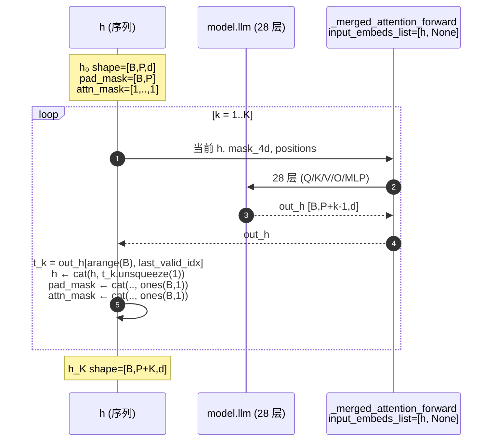

#### 10.3.3 梯度路径(对照 §A.3,更精细)

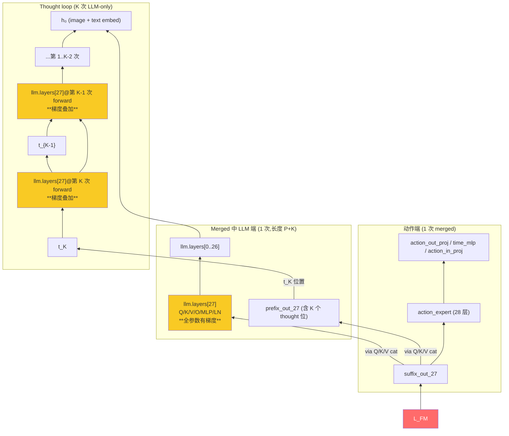

> **梯度叠加效应**:layer 27 的 q/o/MLP 在一次 `backward()` 内被累加 **(K+1) 份梯度**(K 次 thought forward + 1 次 merged forward),信号强度远超 [dm0_backward.md §13 方案 ①](./dm0_backward.md#13) 的 L_AR 单次贡献。

### 10.4 完整代码骨架(可直接 copy)

#### 10.4.1 修改 `DM0Config`(`dm0_arch.py:35-60`)

```python
class DM0Config(DexboticConfig):
    """Configuration for DM0 model."""

    model_type = "dexbotic_dm0"
    action_config: dict | str = None
    processor_config: str = None
    action_dim: int = 32
    chunk_size: int = 50
    bf16: bool = True
    
    cot_mode: str = "off"            # "off" | "continuous"
    num_thoughts: int = 0            # K; 0 等价于原 DM0
    cot_gradient_checkpointing: bool = True   # K 次 forward 是否分别 ckpt

    def __init__(self, *args, **kwargs):
        super().__init__(*args, **kwargs)
        action_config = kwargs.get("action_config", None)
        if isinstance(action_config, dict):
            self.action_config = CONFIG_MAPPING[action_config["model_type"]](**action_config)
        elif isinstance(action_config, str):
            self.action_config = AutoConfig.from_pretrained(action_config)
        llm_config = kwargs.get("llm_config", None)
        if isinstance(llm_config, dict):
            self.llm_config = CONFIG_MAPPING[llm_config["model_type"]](**llm_config)
        elif isinstance(llm_config, str):
            self.llm_config = AutoConfig.from_pretrained(llm_config)
```

> **为何加在 Config 上而非 ModelConfig**:`DM0Config` 会随模型一起保存到 `config.json`,推理时 `from_pretrained` 自动恢复;`DM0ModelConfig` 只在训练入口生效。

#### 10.4.2 新增 `get_prefix_with_continuous_thoughts`(`dm0_arch.py`,加在 `get_prefix_hidden_states` 之后)

```python
def get_prefix_with_continuous_thoughts(
    self,
    input_ids: torch.LongTensor,
    attention_mask: torch.Tensor,
    images: torch.FloatTensor,
    image_masks: torch.BoolTensor,
    num_thoughts: int,
):
    """方案 A:在 prefix 末尾自回归追加 K 个 continuous thought。
    
    每个 thought = VLM 第 k 次 forward 的"最后有效位置"hidden state,
    不经过 lm_head / embed_tokens(Coconut latent mode)。
    
    Returns:
        (hidden_states [B, P+K, d], padding_mask [B, P+K], attn_mask [B, P+K])
    """
    h, padding_mask, attn_mask = self.get_prefix_hidden_states(
        input_ids, attention_mask, images, image_masks
    )

    if num_thoughts <= 0:
        return h, padding_mask, attn_mask

    if self.model.config.bf16:
        h = h.to(torch.bfloat16)

    batch_size = h.shape[0]
    device = h.device
    module_list = [self.model.llm, self.model.action_expert.model]

    def _one_thought_step(
        h_in: torch.Tensor,
        pad_in: torch.Tensor,
        amask_in: torch.Tensor,
    ):
        attn_mask_2d = make_attn_mask_2d(padding_mask=pad_in, attn_mask=amask_in)
        attn_mask_4d = make_attn_mask_4d(attn_mask_2d, dtype=h_in.dtype)
        positions = torch.cumsum(pad_in.long(), dim=1) - 1

        (out_h, _), _ = self._merged_attention_forward(
            module_list=module_list,
            attention_mask=attn_mask_4d,
            position_ids=positions,
            past_key_values=None,
            input_embeds_list=[h_in, None],
            use_cache=False,
        )

        last_valid_idx = pad_in.long().sum(dim=1) - 1
        t_k = out_h[torch.arange(batch_size, device=device), last_valid_idx].unsqueeze(1)
        return t_k

    use_ckpt = (
        self.training
        and getattr(self.model.config, "cot_gradient_checkpointing", True)
    )

    for _ in range(num_thoughts):
        if use_ckpt:
            from torch.utils.checkpoint import checkpoint
            t_k = checkpoint(
                _one_thought_step,
                h, padding_mask, attn_mask,
                use_reentrant=False,
            )
        else:
            t_k = _one_thought_step(h, padding_mask, attn_mask)

        h = torch.cat([h, t_k], dim=1)
        padding_mask = torch.cat(
            [padding_mask,
             torch.ones(batch_size, 1, device=device, dtype=padding_mask.dtype)],
            dim=1,
        )
        attn_mask = torch.cat(
            [attn_mask,
             torch.ones(batch_size, 1, device=device, dtype=attn_mask.dtype)],
            dim=1,
        )

    return h, padding_mask, attn_mask
```

**逐行原理:**

| 行号(逻辑) | 设计点 | 原理 / 引用 |
|---|---|---|
| `h, padding_mask, attn_mask = self.get_prefix_hidden_states(...)` | 复用原方法 | 不动 image / text embedding 路径 |
| `if self.model.config.bf16: h = h.to(torch.bfloat16)` | 提前转 bf16 | thought loop 内的 `model.llm` 期望 bf16(否则 `_compute_merged_layer` L173 会反复 cast) |
| `module_list = [self.model.llm, self.model.action_expert.model]` | 与 `forward()` L484 一致 | 但下面用 `[h_in, None]` 关掉 action expert |
| `attn_mask_2d = make_attn_mask_2d(...)` | **不写新 mask 工具** | §10.3.2 证明 cumsum 机制对 thought 自动正确 |
| `positions = torch.cumsum(pad_in.long(), dim=1) - 1` | 与 `forward()` L477 同公式 | 保证 RoPE 位置一致 |
| `input_embeds_list=[h_in, None]` | LLM-only forward | 与 `generate()` L696 一致,_compute_merged_layer L166 自动跳过 |
| `last_valid_idx = pad_in.long().sum(dim=1) - 1` | **padding-aware gather** | 不能用 `out_h[:, -1]`(右 padding 会拿到 pad 位置 hidden,§10.8 陷阱 1) |
| `checkpoint(_one_thought_step, ...)` | per-step gradient checkpointing | 显存从 O(K·d·L) 降到 O(K·d)(only activations between steps);见 §10.5.5 |
| `torch.cat([h, t_k], dim=1)` | 沿 seq 维拼接 | `t_k` 不 detach,保证可微 |
| `torch.cat([padding_mask, ones])` | 新 thought 永远是有效 token | 与 `get_suffix_hidden_states` L396 同思路 |
| `torch.cat([attn_mask, ones])` | 新 thought 进入新的 cumsum 区段 | §10.3.2 |

#### 10.4.3 修改训练 `forward`(`dm0_arch.py:409-514`)

只改 `get_prefix_hidden_states` 那一行,其余完全不动:

```python
def forward(self, input_ids=None, attention_mask=None, ..., **kwargs) -> CausalLMOutputDexbotic:
    batch_size = actions.shape[0]
    noise = torch.normal(...)
    time = (torch.distributions.Beta(1.5, 1.0).sample((batch_size,))...).to(actions.dtype)
    time_expanded = time[..., None, None]
    x_t = time_expanded * noise + (1 - time_expanded) * actions
    u_t = noise - actions

    cfg = self.model.config
    if getattr(cfg, "cot_mode", "off") == "continuous" and getattr(cfg, "num_thoughts", 0) > 0:
        prefix_hidden_states, prefix_padding_mask, prefix_attn_mask = (
            self.get_prefix_with_continuous_thoughts(
                input_ids, attention_mask, images, image_masks,
                num_thoughts=cfg.num_thoughts,
            )
        )
    else:
        prefix_hidden_states, prefix_padding_mask, prefix_attn_mask = (
            self.get_prefix_hidden_states(input_ids, attention_mask, images, image_masks)
        )
    
    suffix_hidden_states, suffix_padding_mask, suffix_attn_mask = (
        self.get_suffix_hidden_states(x_t, time)
    )

    if cfg.bf16:
        suffix_hidden_states = suffix_hidden_states.to(dtype=torch.bfloat16)
        prefix_hidden_states = prefix_hidden_states.to(dtype=torch.bfloat16)

    full_padding_mask = torch.cat([prefix_padding_mask, suffix_padding_mask], dim=1)
    full_attn_mask = torch.cat([prefix_attn_mask, suffix_attn_mask], dim=1)
    attn_mask_2d = make_attn_mask_2d(padding_mask=full_padding_mask, attn_mask=full_attn_mask)
    attn_mask = make_attn_mask_4d(attn_mask_2d, dtype=prefix_hidden_states.dtype)

    prefix_positions = torch.cumsum(prefix_padding_mask, dim=1) - 1
    prefix_offsets = torch.sum(prefix_padding_mask, dim=-1)[:, None]
    suffix_positions = prefix_offsets + torch.cumsum(suffix_padding_mask, dim=1) - 1
    positions = torch.cat([prefix_positions, suffix_positions], dim=1)

    module_list = [self.model.llm, self.model.action_expert.model]
    (prefix_out, suffix_out), _ = self._merged_attention_forward(
        module_list=module_list,
        attention_mask=attn_mask,
        position_ids=positions,
        past_key_values=None,
        input_embeds_list=[prefix_hidden_states, suffix_hidden_states],
        use_cache=False,
    )

    if actions.dtype == torch.float32:
        suffix_out = suffix_out.to(torch.float32)
    v_t = self.model.action_out_proj(suffix_out[:, -self.model.config.chunk_size:])
    action_loss = F.mse_loss(v_t, u_t, reduction="mean")

    return CausalLMOutputDexbotic(
        loss=action_loss,
        logits=v_t,
        past_key_values=past_key_values,
        hidden_states=None,
        attentions=None,
        action_loss=action_loss,
    )
```

> **架构决策 ADR-2**:`forward()` 内**不再** `if/else` 转 bf16,而是把 bf16 转换内化到 `get_prefix_with_continuous_thoughts`。理由:thought loop 内多次 forward 需要稳定的 bf16 输入。

#### 10.4.4 修改推理 `inference_action`(`dm0_arch.py:516-586`)

推理也需要先生成 K 个 thought,再做 Euler sampling。**KV cache 包含 P+K 个位置**,后续 sampling 与原逻辑一致:

```python
@torch.no_grad()
def inference_action(
    self, input_ids=None, attention_mask=None, states=None,
    images=None, image_masks=None, diffusion_steps=10, **kwargs,
):
    batch_size = states.shape[0]
    device = states.device
    dtype = states.dtype

    dt = -1.0 / diffusion_steps
    noise = torch.normal(
        0, 1,
        size=(batch_size, self.model.config.chunk_size, self.config.action_dim),
        device=device, dtype=dtype,
    )
    time = torch.tensor(1.0, device=device, dtype=dtype)

    cfg = self.model.config
    if getattr(cfg, "cot_mode", "off") == "continuous" and getattr(cfg, "num_thoughts", 0) > 0:
        prefix_hidden_states, prefix_padding_mask, prefix_attn_mask = (
            self.get_prefix_with_continuous_thoughts(
                input_ids, attention_mask, images, image_masks,
                num_thoughts=cfg.num_thoughts,
            )
        )
    else:
        prefix_hidden_states, prefix_padding_mask, prefix_attn_mask = (
            self.get_prefix_hidden_states(input_ids, attention_mask, images, image_masks)
        )

    prefix_attn_mask_2d = make_attn_mask_2d(
        padding_mask=prefix_padding_mask, attn_mask=prefix_attn_mask
    )
    prefix_attn_mask_4d = make_attn_mask_4d(
        prefix_attn_mask_2d, dtype=prefix_hidden_states.dtype
    )
    positions = torch.cumsum(prefix_padding_mask, dim=1) - 1

    module_list = [self.model.llm, self.model.action_expert.model]
    _, kv_cache = self._merged_attention_forward(
        module_list=module_list,
        attention_mask=prefix_attn_mask_4d,
        position_ids=positions,
        past_key_values=DynamicCache(),
        input_embeds_list=[prefix_hidden_states, None],
        use_cache=True,
    )

    while time >= -dt / 2:
        noise, time = self._denoise_step(
            x_t=noise, time=time, dt=dt, batch_size=batch_size,
            prefix_padding_mask=prefix_padding_mask,
            prefix_attn_mask=prefix_attn_mask,
            module_list=module_list, kv_cache=kv_cache,
        )
    return noise
```

> **架构决策 ADR-3**:推理时 thought 生成是 `@torch.no_grad()`,**正常使用** `_merged_attention_forward` 但不开 KV cache(因为 thought 之间序列长度递增,缓存复用价值小;真正的 KV cache 用在 thought 完成后、Euler sampling 阶段)。

#### 10.4.5 实验入口注册新参数(`dm0_exp.py` 或 benchmark 脚本)

在 [libero_dm0.py](../../../playground/benchmarks/libero/libero_dm0.py) 类似位置增加:

```python
@dataclass
class DM0CoTModelConfig(_DM0ModelConfig):
    cot_mode: str = field(default="continuous")
    num_thoughts: int = field(default=4)
    cot_gradient_checkpointing: bool = field(default=True)

    def build_model(self) -> DM0ForCausalLM:
        model = DM0ForCausalLM.from_pretrained(self.model_name_or_path)
        model.model.config.cot_mode = self.cot_mode
        model.model.config.num_thoughts = self.num_thoughts
        model.model.config.cot_gradient_checkpointing = self.cot_gradient_checkpointing
        return model
```

> **为何在 `build_model` 中再次赋值**:`from_pretrained` 加载的是磁盘上 `config.json` 里的字段;为了让 CLI / 实验脚本能 override,**显式覆盖** `model.model.config` 上的字段。后续 `save_pretrained` 会把新字段一起持久化。

### 10.5 关键工程细节(陷阱与对策)

#### 10.5.1 Padding-aware "last valid position" gather

dexbotic 默认 `tokenizer_padding_side="right"`(见 [base config L49](../../../b/m/dm0/base/config.json#L49)),意味着右侧有 pad token。若 `padding_mask=[T,T,T,F,F]`(seq_len=5,有效长度 3),`out_h[:, -1]` 会取到 **pad 位置**的 hidden,完全错误。

正确写法已在 §10.4.2 给出:

$$
\mathrm{idx}_{\text{last\_valid}}[b] = \mathrm{sum}\big(\pi[b,:]\big) - 1, \qquad
t_k[b] = \hat h_{k-1}[b, \mathrm{idx}_{\text{last\_valid}}[b]]
$$

**陷阱**:每个 thought 拼接后,新 thought 自身就是新的"最后有效位置",所以下一次 `last_valid_idx` 自动增加 1,无需特殊处理。

#### 10.5.2 attention mask 增量构造

每次 thought 循环都 **重算** `make_attn_mask_2d/4d`。原因:`padding_mask` 和 `attn_mask` 维度都变长了 1。

**性能成本**:`make_attn_mask_2d` 复杂度 $O(B \cdot L^2)$,K=4 时累计 $O(B \cdot 4 \cdot L^2)$,可忽略(L≈200,K=4 → ~3M ops per batch)。

**不要做**:试图缓存 K-1 步的 mask 然后增量拓展。这是过度优化,会引入 bug。

#### 10.5.3 position_ids 的延续

第 $k$ 次 forward 用的 positions:

$$
P_{k-1}[b, j] = \mathrm{cumsum}(\pi[b, :j])\;-\;1
$$

由于 thought 永远 `padding_mask=1`,thought 的 position 自动从 `prefix_offsets[b]` 开始递增,**RoPE 位置编码正确**。无需额外偏移。

#### 10.5.4 数据类型(dtype)

| 张量 | 期望 dtype | 原因 |
|---|---|---|
| `h_0`(初始 prefix) | bf16(若 `cfg.bf16=True`) | merged_attention_forward 内 `q_proj.weight.dtype=bf16`(L173) |
| `t_k`(thought hidden) | bf16 | 由 LLM forward 输出,自动 bf16 |
| `padding_mask` | 与原 `get_prefix_hidden_states` 相同 | `cat` 时 dtype 要一致;通常 bool 或 long |
| `attn_mask`(2D before make_*) | int32 | 与 [L350](../../../dexbotic/model/dm0/dm0_arch.py#L350) 一致 |
| `attn_mask_4d` | bf16 | additive mask,`-2.38e38` 填非法位 |
| `positions` | long | RoPE 需要 long |

**绝对不要**:在 thought loop 内反复 `.float() / .bfloat16()`,会产生大量 cast 节点,拖慢训练。

#### 10.5.5 Gradient Checkpointing 的两层应用

DM0 默认在 `DM0TrainerConfig` 开了 `gradient_checkpointing=True`(见 [dm0_exp.py L236](../../../dexbotic/exp/dm0_exp.py#L236))。HF Trainer 会调用 `model.gradient_checkpointing_enable()`,自动在 transformer 层内插入 ckpt。

**方案 A 多一层 ckpt**:把 **每次 thought forward** 整体包成一个 ckpt。原因:K 次 forward 会保留 K 份 activation,显存增长线性于 K。`checkpoint` 后只保留输入,反向时重算。

$$
\text{Mem}_{\text{baseline}} \;\approx\; O(B \cdot P \cdot d \cdot \text{layers}), \qquad
\text{Mem}_{\text{Scheme A naive}} \;\approx\; O(K \cdot B \cdot (P+k) \cdot d \cdot \text{layers})
$$

加 per-step ckpt 后:

$$
\text{Mem}_{\text{Scheme A + ckpt}} \;\approx\; O\big(B \cdot P \cdot d \cdot \text{layers}\big) + O\big(K \cdot B \cdot (P+K) \cdot d\big)
$$

第二项是 K 步之间保留的 activation(只是 hidden vector 链),远小于第一项。

**注意点**:`use_reentrant=False`(PyTorch 2.x 推荐),与 DeepSpeed ZeRO-3 兼容。reentrant=True 在多次 forward + ZeRO-3 下偶发 hang(参考 [PyTorch issue #99174](https://github.com/pytorch/pytorch/issues/99174))。

#### 10.5.6 DeepSpeed ZeRO-3 兼容性

DM0 训练支持 `zero3_offload.json`(见 [CLAUDE.md](../../../CLAUDE.md))。ZeRO-3 在每次 forward 前 all-gather 参数,backward 后 free。**K+1 次 forward 会触发 K+1 次 all-gather**,通信开销线性增加。

**对策**:
1. **batch size 加倍**(同样的 all-gather 摊到更多样本上),抵消通信成本
2. 用 `--gradient_accumulation_steps` 而非更大 batch,减少 micro-step 数量
3. 在 `zero3_offload.json` 中设置 `"stage3_max_live_parameters": 1e9` 让 LLM 参数在 K 次 forward 间常驻显存(K=4 时仍能放下 Qwen3-2B)

#### 10.5.7 推理时 KV cache 策略

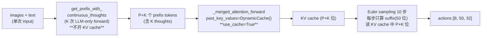

**为什么 thought 生成阶段不开 KV cache**:
- thought_1 forward 时序列长度 P;thought_2 时 P+1 → cache 复用收益小
- 实现复杂(每次要把 KV 拓展 1 个位置)
- **训练-推理一致性**:训练时 K 步无 KV cache,推理时也无 KV cache,数值更一致

**为什么 sampling 阶段开 KV cache**:
- Euler 10 步,每步重复对相同 P+K prefix 做 attention,缓存收益巨大
- 与原 DM0 推理路径完全一致(L564-571 用 DynamicCache)

### 10.6 测试与验证方案

#### 10.6.1 Smoke test(单测,放 `tests/test_dm0_cot.py`)

```python
import torch
from dexbotic.model.dm0.dm0_arch import DM0ForCausalLM

def _dummy_inputs(B=2, num_images=3, num_text=10, action_dim=32, chunk_size=50):
    return dict(
        input_ids=torch.randint(0, 1000, (B, num_text)),
        attention_mask=torch.ones(B, num_text, dtype=torch.bool),
        images=torch.randn(B, num_images, 3, 224, 224),
        image_masks=torch.ones(B, num_images, dtype=torch.bool),
        actions=torch.randn(B, chunk_size, action_dim),
        states=torch.randn(B, action_dim),
    )

def test_shape_K_eq_0(model):
    model.model.config.cot_mode = "off"
    model.model.config.num_thoughts = 0
    out = model(**_dummy_inputs())
    assert out.loss.ndim == 0 and out.loss.item() >= 0

def test_shape_K_eq_4(model):
    model.model.config.cot_mode = "continuous"
    model.model.config.num_thoughts = 4
    out = model(**_dummy_inputs())
    assert out.loss.ndim == 0 and torch.isfinite(out.loss)

def test_K_eq_0_equivalence(model, base_model):
    """K=0 数值等价于原 DM0(回归保护)"""
    torch.manual_seed(0)
    inputs = _dummy_inputs()
    model.model.config.cot_mode = "off"
    o1 = model(**inputs).loss

    torch.manual_seed(0)
    o2 = base_model(**inputs).loss
    assert torch.allclose(o1, o2, atol=1e-5)
```

#### 10.6.2 梯度流验证(**最关键的验收点**)

```python
def test_layer27_qproj_has_grad():
    model.train()
    model.model.config.cot_mode = "continuous"
    model.model.config.num_thoughts = 4
    
    inputs = _dummy_inputs()
    out = model(**inputs)
    out.loss.backward()
    
    grad = model.model.llm.layers[27].self_attn.q_proj.weight.grad
    assert grad is not None, "q_proj.weight.grad is None — 梯度未到达"
    assert grad.abs().sum().item() > 1e-8, "q_proj.weight.grad 全 0 — 计算图断裂"
    
    for name in ["o_proj", "k_proj", "v_proj"]:
        g = getattr(model.model.llm.layers[27].self_attn, name).weight.grad
        assert g is not None and g.abs().sum().item() > 1e-8, f"{name} 无梯度"
    
    g_mlp = model.model.llm.layers[27].mlp.gate_proj.weight.grad
    assert g_mlp is not None and g_mlp.abs().sum().item() > 1e-8, "MLP 无梯度"
```

**期望结果**(对比 backward.md §11.5):

| 参数 | 原 DM0 grad | 方案 A K=4 grad |
|---|:---:|:---:|
| `llm.layers[27].self_attn.k_proj` | ✅ (经 K/V 路径) | ✅ (信号更强) |
| `llm.layers[27].self_attn.v_proj` | ✅ | ✅ |
| `llm.layers[27].self_attn.q_proj` | ❌ (死端) | ✅ (经 K 次 thought) |
| `llm.layers[27].self_attn.o_proj` | ❌ | ✅ |
| `llm.layers[27].mlp.gate_proj` | ❌ | ✅ |
| `llm.layers[27].mlp.up_proj` | ❌ | ✅ |
| `llm.layers[27].mlp.down_proj` | ❌ | ✅ |
| `llm.layers[27].post_attention_layernorm` | ❌ | ✅ |

#### 10.6.3 K=0 等价性测试(回归保护)

> 确保 `cot_mode="off"` 与原 DM0 **数值完全一致**(在相同随机种子下),保护现有 baseline。

#### 10.6.4 端到端 LIBERO 小规模评测

| Stage | 配置 | 期望 | 工时 |
|---|---|---|---|
| Smoke | LIBERO-Spatial,1k 步,K=2 | loss 正常下降 + 上述梯度测试通过 | 半天 |
| Ablation | LIBERO-Spatial,5k 步,K ∈ {0,1,2,4,8} | 找到最优 K | 2 天 |
| Full | LIBERO-Long 80k 步,K=4 + warmup | 性能不退化(±1%)或提升 | 1 周 |

#### 10.6.5 内存与速度 Profiling

```bash
# 用 torch.profiler 记录 K=0/4 两个 run
torchrun --nproc_per_node=8 \
  playground/benchmarks/libero/libero_dm0_cot.py \
  --task train --num_thoughts 4 \
  --max_steps 20 --profile
```

**期望:**
- K=4 单 step 时间 ≤ 2.0× baseline(主要是 K 次 LLM forward)
- bf16 + grad ckpt 下显存增量 ≤ 0.6×

### 10.7 实施路线图(2 周)

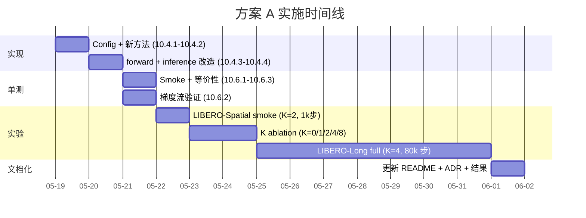

### 10.8 工程陷阱清单(高频踩坑点)

| # | 陷阱 | 错误现象 | 对策 |
|---|---|---|---|
| 1 | 用 `out_h[:, -1]` 取末尾 | 右 padding 时拿到 pad 位 hidden,thought 全 0 或 NaN | §10.5.1 用 `last_valid_idx` |
| 2 | 在 thought loop 中调 `self.lm_head(...)` | 引入离散化路径,违反方案 A 定义 | 严格遵守 §A.8;若想看 thought 内容,**事后**做 `lm_head(t_k)`,**不参与训练 forward** |
| 3 | 直接调 `self.model.llm(inputs_embeds=h)` | bf16 / mask / RoPE 处理不一致,数值漂移 | 用 `_merged_attention_forward` + `[h, None]`,§10.2.2 |
| 4 | thought loop 不开 `checkpoint` | K=4 时显存 4× | §10.5.5 |
| 5 | `use_reentrant=True` + ZeRO-3 | 偶发 hang | 用 `use_reentrant=False` |
| 6 | 把 `cot_mode/num_thoughts` 加在 `DM0ModelConfig` 而非 `DM0Config` | `from_pretrained` 后丢失配置 | §10.4.1,加在 `DM0Config` |
| 7 | thought loop 中重复 `prefix_h.to(bf16)` | 反复 cast,反向图变形,显存上涨 | §10.5.4,一次性转好 |
| 8 | `num_thoughts > 0` 时忘记调 `get_prefix_with_continuous_thoughts` 而调原方法 | 训练正常,但没用 CoT | §10.4.3 严格走 if/else |
| 9 | 推理时**不**给 KV cache 填 P+K 而填 P | Sampling 全错 | §10.5.7 ADR-3 |
| 10 | `state_dict` 保存时 `num_thoughts` 没进 config.json | 推理端加载后默认 K=0 | `model.save_pretrained(...)` 会自动保存 `DM0Config` 字段;无需特殊处理 |

### 10.9 验收标准 (Acceptance Criteria)

| 维度 | 指标 | 阈值 | 测量方式 |
|---|---|---|---|
| **正确性** | `cot_mode="off"` 与 baseline 数值等价 | `atol=1e-5` | §10.6.3 |
| **正确性** | layer 27 所有参数有非零梯度 | `grad.abs().sum() > 1e-8` | §10.6.2 |
| **正确性** | 训练 loss 不出现 NaN/Inf,1k 步内 | 100% | wandb monitoring |
| **性能** | K=4 单 step 时间 | ≤ 2.0× baseline | §10.6.5 |
| **显存** | K=4 + grad ckpt + bf16 显存峰值 | ≤ 1.6× baseline | `torch.cuda.max_memory_allocated` |
| **质量** | LIBERO-Spatial 成功率 | ≥ baseline - 1% | 评测脚本 |
| **质量** | LIBERO-Long 成功率 | ≥ baseline + 1%(目标) | 评测脚本 |
| **可移植** | `state_dict` 与 DM0-base 完全一致 | 0 多余 key | `set(state_dict.keys()) == set(base.state_dict().keys())` |

### 10.10 与现有文档的衔接

- **§4 方案 A** 提供概念与论文出处;**§10 本章**提供"如何在 dexbotic 中真做出来"的工程细节
- **§A.8** 解释了"为什么方案 A 不经过 lm_head";**§10.4.2** 给出工程上的对应代码(`input_embeds_list=[h, None]`)
- **附录 B** 说明 thought 与 merged attention 的兼容性;**§10.3.2** 用 cumsum 公式严格证明
- **附录 C** 提到 HybridPi05 是唯一的"VLM 生成 thought + action expert"范本;**§10.2.2** 进一步指出 `DM0.generate()` 已经走过 LLM-only forward 路径,**几乎可以直接搬运**

### 10.11 后续扩展建议

完成方案 A 后,以下扩展按优先级:

1. **Stage-wise warmup**:训练时分 K=0 → K=1 → ... → K=K_max 多阶段,提升训练稳定性(§A.5)。可通过 `TrainerCallback` 在指定 step 后调整 `model.model.config.num_thoughts`,无需重启训练
2. **Thought 内容可解释**:在 evaluation 时附加 `self.lm_head(t_k)` 做事后 detokenize,用于调试和论文 visualization(`@torch.no_grad()` 调用,不参与训练)
3. **Hybrid CoT**:与 `dm0_lAr.md` 提出的 L_AR 监督结合(本文方案 G),从 K=0 加 L_AR warmup 起步,逐步引入 thought,关掉 L_AR
4. **Adaptive K**:让模型自己学习何时停止 thought(如 Coconut 论文的 binary classifier on thought)
5. **CoT 与 KI 组合**(本文方案 G):后期对 merged attention 中 prefix→suffix 的 K/V 应用 stop_gradient,与方案 A 互补

---

> **本文档结束**。如需进一步细化某个方案的代码实现,可继续讨论。
