# DM0 恢复 token 输出能力 — 全栈分析与实现方案 (Opus 4.6)

> 创建日期: 2026-05-16
> 模型: Claude Opus 4.6
> 基准 checkpoint: `b/m/dm0/table30_generalist_aloha`
> 关联文档:
> - [dm0.md](./dm0.md) — DM0 论文解读
> - [dm0_txtAsEvry.md](./dm0_txtAsEvry.md) — 跨架构 $L_{\text{AR}}$ 模式分类
> - [dm0_txtAsEvry2.md](./dm0_txtAsEvry2.md) — 4 层级 Scaffolding 训练侧设计
> - [dm0_txtAsEvry2_op47.md](./dm0_txtAsEvry2_op47.md) — Opus 4.7 版推理侧改造方案
> - [dm0_actTkn.md](./dm0_actTkn.md) — 离散 action token 路径分析
> - [dm0_analyz_xp0515.md](./dm0_analyz_xp0515.md) — 各模型 token 生成能力盘点

---

## 0. TL;DR

### 0.1 目标

使 DM0（以 `table30_generalist_aloha` 已发布 checkpoint 为基准）**能够真正输出自然语言 token / CoT 文本**，而非仅产生 flow matching 连续动作。

### 0.2 问题诊断

DM0 当前存在 **三道断路**，任何一道都足以使 token 输出不可用：

```mermaid
graph TD
    subgraph 断路1["断路 ①: 没有可用的 generate()"]
        A1["DM0ForCausalLM 继承了<br/>GenerationMixin.generate()"] --> A2["但 forward() 强制<br/>要求 actions≠None"]
        A2 --> A3["推理时无 GT action<br/>→ forward 直接崩"]
        A3 --> A4["即使绕过 forward,<br/>outputs.logits = v_t ∈ ℝ^{B×50×32}<br/>而非 ℝ^{B×T×V}"]
    end

    subgraph 断路2["断路 ②: lm_head 是空壳"]
        B1["_real_init 创建了 lm_head<br/>Linear(2048, 152701)"] --> B2["注释: 仅为<br/>tie_weights 兼容性"]
        B2 --> B3["checkpoint 无<br/>lm_head.weight"]
        B3 --> B4["加载后 = 随机初始化<br/>→ 输出无意义"]
    end

    subgraph 断路3["断路 ③: tokenizer 截断过短"]
        C1["table30_generalist_aloha<br/>tokenizer.model_max_length = 100"] --> C2["DM0Tokenization<br/>._max_len = 100"]
        C2 --> C3["连系统 prompt +<br/>USER 指令都装不下<br/>100 token"]
    end

    style A4 fill:#ffcccc
    style B4 fill:#ffcccc
    style C3 fill:#ffcccc
```

### 0.3 三档方案总览

| 档位 | 方案 | 需要重训? | 文本输出质量 | 改动量 | 适用场景 |
|------|------|----------|-------------|-------|---------|
| **A** | 零训练嫁接 | 否 | 几乎不可读 | ~80 行 | 通路验证 / LoRA base |
| **B** | SFT 微调 + 推理改造 | 是(小规模) | 中→高 | ~160 行 | 复现论文 §2.9 scaffolding |
| **C** | 全量混合训练 | 是(大规模) | 高 | ~480 行 | 完整 text-as-everything |

**核心结论**: 必须自写 `generate()` 方法（merged attention 使 HF 标准 `GenerationMixin` 不可用），首要参考 `HybridPi05ForCausalLM.generate()`（`hybrid_pi05_arch.py:672-810`）。

---

## 1. 现状深度盘点

### 1.1 代码层: forward 只有 flow matching 出口

#### 1.1.1 DM0ForCausalLM 当前结构

```python
# dm0_arch.py:128-143
class DM0ForCausalLM(DexboticForCausalLM, ActionOutputForCausalLM):
    def _real_init(self, config: DM0Config):
        self.model = DM0Model(config)
        # "Add lm_head for compatibility with parent class tie_weights"
        self.lm_head = nn.Linear(
            config.llm_config.hidden_size,    # 2048
            config.llm_config.vocab_size,     # 152701
            bias=False
        )
        self.post_init()
```

`lm_head` 的注释明确说明它只为 `tie_weights` 兼容而存在，从未被 `forward()` 或 `inference_action()` 调用。

#### 1.1.2 forward 的唯一输出是 flow matching 速度场

```python
# dm0_arch.py:495-511 — forward 末段
suffix_out_final = suffix_out[:, -self.model.config.chunk_size :]
v_t = self.model.action_out_proj(suffix_out_final)        # [B, 50, 32]
action_loss = F.mse_loss(v_t, u_t, reduction="mean")
loss = action_loss                                         # 只有 L_FM

outputs = CausalLMOutputDexbotic(
    loss=loss,
    logits=v_t,                 # ← 不是 token logits！是速度场
    past_key_values=past_key_values,
    hidden_states=None,
    attentions=None,
)
```

**三个关键遗漏**:

| 遗漏 | 代码位置 | 说明 |
|------|---------|------|
| `prefix_out` 被丢弃 | `dm0_arch.py:486` | `(prefix_out, suffix_out), _ = ...` 后 `prefix_out` 再未引用 |
| `labels` 被忽略 | `dm0_arch.py:413` | 函数签名接收但未使用 |
| `CausalLMOutputDexbotic` 字段空缺 | `dm0_arch.py:504-510` | 未填写 `text_loss` / `action_loss` |

#### 1.1.3 inference_action 纯 flow matching

```python
# dm0_arch.py:513-583
@torch.no_grad()
def inference_action(self, input_ids, attention_mask, states, images, image_masks,
                     diffusion_steps=10, **kwargs):
    # ...Euler 采样循环...
    while time >= -dt / 2:
        noise, time = self._denoise_step(...)
    return noise    # [B, chunk_size, action_dim] = [B, 50, 32]
```

返回连续动作张量，不经过 `lm_head`，不产生 token。

#### 1.1.4 架构总览

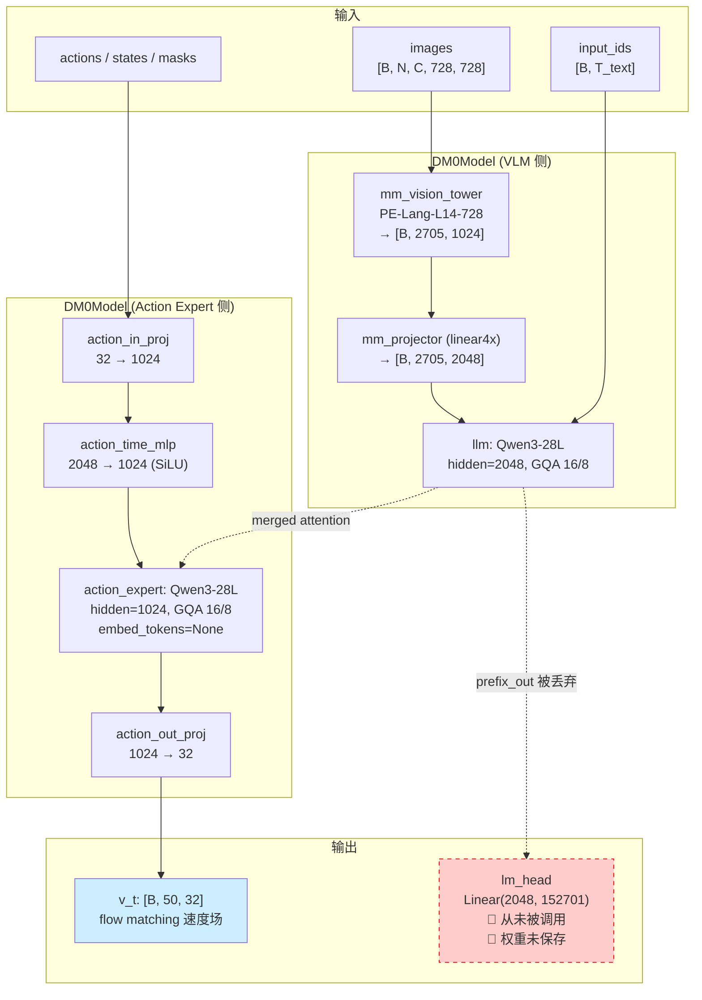

### 1.2 Checkpoint 层: 权重缺失清单

对 `b/m/dm0/table30_generalist_aloha/model.safetensors.index.json` 分析:

| 权重 key | 是否存在 | 形状 | 对 token 输出的意义 |
|---------|---------|------|-------------------|
| `model.llm.embed_tokens.weight` | ✅ | [152701, 2048] | 可作为 `lm_head` 的转置(weight tie) |
| `model.llm.layers.0~27.*` | ✅ | — | LLM 28 层完整 |
| `model.action_expert.lm_head.weight` | ✅ | [151936, 1024] | ❌ vocab=151936 ≠ 152701, 维度不兼容 |
| `model.action_expert.model.layers.0~27.*` | ✅ | — | Action Expert 28 层 |
| `model.action_in_proj.*` | ✅ | [1024, 32] / [1024] | flow matching 通道 |
| `model.action_out_proj.*` | ✅ | [32, 1024] / [32] | flow matching 通道 |
| `model.action_time_mlp_in/out.*` | ✅ | [1024, 2048] / [1024, 1024] | 时间嵌入 |
| `model.progress_in_proj.*` | ✅ | [1024, 1] | 进度预测(说明是 DM0Prog) |
| `model.progress_out_proj.*` | ✅ | [1, 1024] | 进度预测 |
| `model.mm_projector.weight` | ✅ | [2048, 4096] | 视觉投影 |
| `model.mm_vision_tower.*` | ✅ | — | PE 视觉塔完整 |
| **`lm_head.weight`** | **❌** | — | **顶层 lm_head 不在 checkpoint 中** |

**重要发现**: `table30_generalist_aloha` 实际由 `DM0ProgForCausalLM` 训练（含 `progress_in/out_proj`），但 `config.json` 的 `architectures` 标注为 `["DM0ForCausalLM"]`。加载时如果用 `DM0ForCausalLM` 会**忽略** progress 权重。

### 1.3 Tokenizer 层: model_max_length = 100 是致命瓶颈

```python
# table30_generalist_aloha/tokenizer_config.json (第 ~8510 行)
"model_max_length": 100,
"tokenizer_class": "Qwen2Tokenizer",
```

```python
# process.py:378-383 — DM0Tokenization 直接使用此值
class DM0Tokenization(Tokenization):
    def __init__(self, tokenizer, ...):
        self.tokenizer = tokenizer
        self._max_len = tokenizer.model_max_length    # = 100!
```

100 token 的实际容量：

$$
\underbrace{T_{\text{system}}}_{\approx 20\text{ tok}} + \underbrace{T_{\text{user\_template}}}_{\approx 15\text{ tok}} + \underbrace{T_{\text{image\_placeholder}}}_{\approx 1\text{ tok}} + \underbrace{T_{\text{instruction}}}_{\text{剩余 }\sim 64\text{ tok}}
$$

**64 token 容纳一段中文/英文指令已经很勉强，更不可能给 CoT 输出留余量。**

对比各 checkpoint 的 `model_max_length`:

| Checkpoint | `tokenizer.model_max_length` | `config.tokenizer_model_max_length` | 含 progress |
|-----------|-------|------|---|
| `base` | 4096 | 2048 | ❌ |
| `table30_generalist_aloha` | **100** | 2048 | ✅ |
| `table30_generalist_franka` | 100 | 2048 | ✅ |
| `table30_open_the_drawer` | 100 | 2048 | ✅ |
| `table30_put_opener_in_drawer` | 100 | 2048 | ✅ |

所有 specialist checkpoint 的 `model_max_length` 都被设为 100（因为纯 action 推理不需要长文本），只有 `base` 保留了 4096。

### 1.4 Config 层: `ar_loss = true` 是假声明

```json
// table30_generalist_aloha/config.json
"ar_loss": true,
"ar_loss_weight": 1.0,
```

全库搜索 `ar_loss`:

- `b/m/dm0/*/config.json` — 5 份 checkpoint 都有此字段
- `dexbotic/**/*.py` — **零引用**

结论: 这是论文公式 $\mathcal{L} = \lambda \cdot \mathcal{L}_{\text{AR}} + \mathcal{L}_{\text{FM}}$ 的元数据残留，开源代码从未实现 $\mathcal{L}_{\text{AR}}$。

### 1.5 数据流断点示意

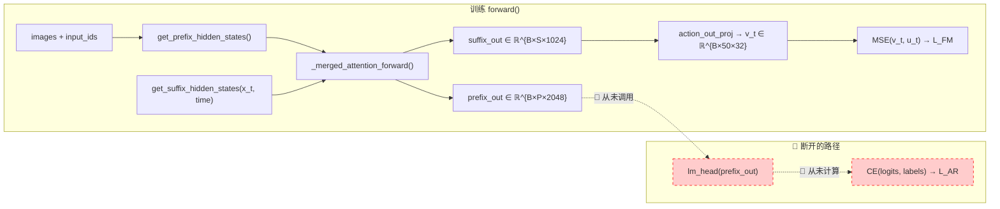

---

## 2. 代码库内参考实现分析

### 2.1 token 生成能力对比矩阵

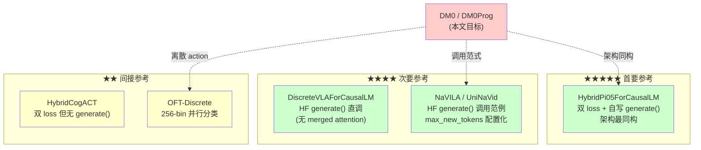

### 2.2 首要参考: HybridPi05ForCausalLM

HybridPi05 与 DM0 **架构高度同构**: 都是 VLM + Action Expert 双 Transformer + merged attention + flow matching 动作预测。唯一实质差异是 HybridPi05 基于 Gemma（有 `_gated_residual` 和 `adarms_cond`），DM0 基于 Qwen3。

#### 2.2.1 HybridPi05 的 forward 双 loss

```python
# hybrid_pi05_arch.py:455-512 — 关键路径
text_logits = self.lm_head(prefix_out)                            # ①

if labels is not None and input_ids is not None:
    target_tokens = labels[:, 1:]                                  # ②
    text_len = input_ids.shape[1]
    pred_tokens = text_logits[:, -text_len:-1]                     # ③
    token_loss = F.cross_entropy(
        pred_tokens.transpose(1, 2), target_tokens, reduction="none"  # ④
    )
    token_mask = torch.where(target_tokens != IGNORE_INDEX, 1.0, 0.0)
    sample_loss = (token_loss * token_mask).sum(dim=-1) / torch.clamp(
        token_mask.sum(dim=-1), min=1.0
    )
    has_text_mask = has_text.reshape(-1).float() if has_text is not None else ...
    text_loss = (sample_loss * has_text_mask).sum() / (has_text_mask.sum() + 1e-6) # ⑤

action_loss = ...  # MSE on flow matching velocity                 # ⑥

loss = text_loss + action_loss  # (or either alone if one is None) # ⑦
```

**DM0 需要抄的核心逻辑就是 ①→⑦ 这 7 步。**

#### 2.2.2 HybridPi05 的 generate() — 自回归解码循环

```python
# hybrid_pi05_arch.py:672-810 — 简化伪代码
@torch.no_grad()
def generate(self, input_ids, images, image_masks,
             max_new_tokens=128, do_sample=None, temperature=0.7,
             eos_token_id=None, return_text=True, return_action=True, ...):

    # Step 1: 编码 prefix, 构建 KV cache
    prefix_tokens, prefix_mask, ... = self.embed_prefix(input_ids, images, ...)
    (prefix_out, _), kv_cache, ... = self._inner_forward_mot(
        [llm, action_expert], [prefix_tokens, None],
        past_key_values=DynamicCache(), use_cache=True
    )
    context_mask = prefix_mask.clone()

    if return_text:
        # Step 2: 用 prefix_out 最后一个 token 的 logits 开始生成
        logits = self.lm_head(prefix_out[:, -1:])
        generated_tokens = empty([B, 0])
        finished = zeros([B], bool)

        # Step 3: 自回归循环
        for _ in range(max_new_tokens):
            next_token = sample_or_argmax(logits, temperature)
            if eos → finished
            generated_tokens = cat([generated_tokens, next_token])
            context_mask = cat([context_mask, ones([B,1])])
            if finished.all() → break

            # Step 4: 单 token 解码(只走 LLM 侧, action_expert=None)
            token_embeds = llm.embed_tokens(next_token) * scale
            decode_out, kv_cache, ... = self._inner_forward_mot(
                [llm, action_expert], [token_embeds, None],
                past_key_values=kv_cache, use_cache=True
            )
            logits = self.lm_head(decode_out[:, -1:])

        result["tokens"] = generated_tokens

    if return_action:
        # Step 5: 在累积的 KV cache 上跑 Euler 采样
        while time >= -dt/2:
            noise, time = self._denoise_step_with_cache(
                noise, time, batch_size, context_mask, kv_cache, dt
            )
        result["actions"] = noise

    return result
```

**DM0 改造要点:**

1. `_inner_forward_mot` → 替换为 DM0 的 `_merged_attention_forward`
2. 去掉 `adarms_cond`（DM0 没有 AdaRMS 条件化）
3. 去掉 `* hidden_size**0.5` 缩放（Qwen3 不需要，Gemma 需要）
4. RoPE 用 DM0 自己的 `self.model.llm.rotary_emb` + `modeling_qwen3.apply_rotary_pos_emb`
5. 注意力掩码用 DM0 的 `make_attn_mask_2d` / `make_attn_mask_4d`（与 HybridPi05 的 `make_attn_mask` 接口不同）

#### 2.2.3 数据流对照

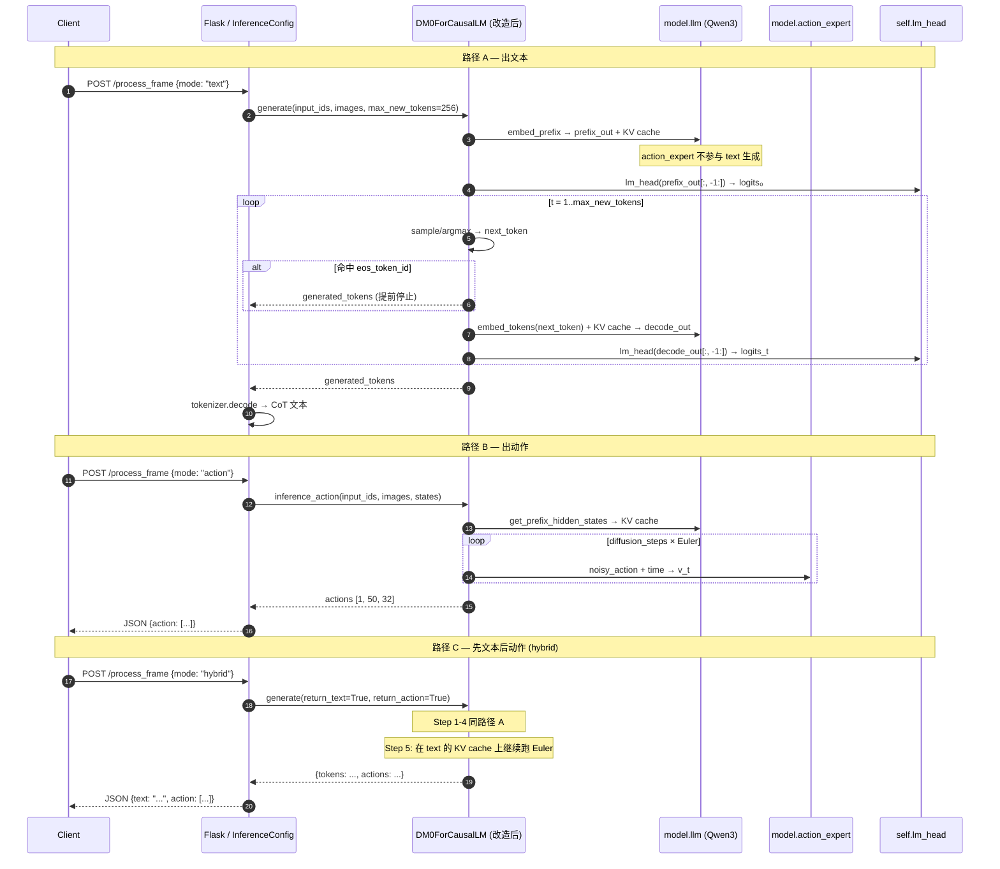

### 2.3 次要参考: DiscreteVLA (HF 标准 generate)

```python
# discrete_vla_arch.py:24-37
def _real_inference_action(self, input_ids, image_tensor, ...):
    outputs = self.generate(input_ids, images=image_tensor,
                            max_new_tokens=1024, do_sample=True, temperature=0.7,
                            stopping_criteria=[stopping_criteria])
```

DiscreteVLA 没有 merged attention，可以直接用 HF `GenerationMixin.generate()`。**DM0 因为有 merged attention 而不能这样做。**

### 2.4 调用范式参考: UniNaVid

UniNaVid 是仓库中**唯一**将 `max_new_tokens` 放入 `InferenceConfig` dataclass 字段的模型:

```python
# uninavid_exp.py:343-344
@dataclass
class UniNaVidInferenceConfig(InferenceConfig):
    max_new_tokens: int = field(default=1024)
```

DM0 应效仿此风格，让 `max_new_tokens` 可在 experiment 层配置。

---

## 3. 方案 A — 零训练嫁接

> 目标: **不重新训练**，让 DM0 能跑通 `generate()` 流程。输出 token 大概率不可读（因为 `lm_head` 未经 NTP 监督），但可作为通路验证或 LoRA 微调的 base。

### 3.1 核心思路: embed_tokens 反向当 lm_head

由于 checkpoint 不含 `lm_head.weight`，但含 `model.llm.embed_tokens.weight` $\in \mathbb{R}^{V \times d}$（$V=152701, d=2048$），可以做 weight tying:

$$
W_{\text{lm\_head}} \triangleq W_{\text{embed\_tokens}} \in \mathbb{R}^{V \times d}
$$

前向计算:

$$
\boldsymbol{\ell}_t = W_{\text{lm\_head}} \cdot \mathbf{h}_t \in \mathbb{R}^V
$$

其中 $\mathbf{h}_t \in \mathbb{R}^d$ 是 prefix 最后一个 token 的隐状态。

**注意**: `table30_generalist_aloha` 的 `llm_config` 中 `tie_word_embeddings: false`，说明该模型训练时 LLM 端就没有做 weight tying。因此 `embed_tokens` 作为 `lm_head` 的近似只是一个**零阶估计**，效果不保证。

### 3.2 token 生成的数学过程

#### 第 0 步: Prefix 编码

令:
- 视觉 token $\mathbf{V} = [v_1, \dots, v_{N_v}] \in \mathbb{R}^{N_v \times d}$，其中 $N_v = N_{\text{images}} \times 2705$（每张 728×728 图像产生 2704 patches + 1 CLS = 2705 token，经 linear4x 投影到 $d=2048$）
- 文本 token 嵌入 $\mathbf{T} = \text{embed\_tokens}(x_{1:T_p}) \in \mathbb{R}^{T_p \times d}$
- Prefix 输入 $\mathbf{X}_{\text{prefix}} = [\mathbf{V}; \mathbf{T}] \in \mathbb{R}^{(N_v + T_p) \times d}$

通过 merged attention 的 LLM 侧（action_expert 通道传 `None`）:

$$
\mathbf{H}_{\text{prefix}} = \text{LLM}(\mathbf{X}_{\text{prefix}}) \in \mathbb{R}^{(N_v + T_p) \times d}
$$

#### 第 $t$ 步: 自回归解码

$$
\boldsymbol{\ell}_t = W_{\text{lm\_head}} \cdot \mathbf{h}_{-1} \in \mathbb{R}^V
$$

$$
\hat{y}_t = \begin{cases}
\arg\max_v \boldsymbol{\ell}_t[v] & \text{greedy} \\[4pt]
\text{Categorical}\!\left(\text{softmax}\!\left(\frac{\boldsymbol{\ell}_t}{\tau}\right)\right) & \text{sampling, } \tau > 0
\end{cases}
$$

$$
\mathbf{e}_{t+1} = W_{\text{embed\_tokens}}[\hat{y}_t] \in \mathbb{R}^d
$$

$$
\mathbf{h}_{t+1} = \text{LLM}(\mathbf{e}_{t+1} \mid \text{KV cache}) \in \mathbb{R}^d
$$

循环 $t = 0, 1, \dots, T_{\max}-1$ 或遇到 `eos_token_id` 停止。

#### 输出 token 数上限

$$
\boxed{T_{\text{output}}^{\max} = \min\!\left(\texttt{max\_new\_tokens},\; P_{\max} - L_{\text{prefix}}\right)}
$$

其中:

$$
P_{\max} = \texttt{max\_position\_embeddings} = 40960 \quad\text{(RoPE 物理上限)}
$$

$$
L_{\text{prefix}} = \min\!\left(N_v + T_p,\; \texttt{tokenizer\_model\_max\_length}\right) = \min(N_v + T_p,\; 2048)
$$

对典型 3 图推理: $N_v = 3 \times 2705 = 8115$，但被 `tokenizer_model_max_length=2048` 截断 → $L_{\text{prefix}} = 2048$。

因此理论上:

$$
T_{\text{output}}^{\max} = \min(\texttt{max\_new\_tokens},\; 40960 - 2048) = \min(\texttt{max\_new\_tokens},\; 38912)
$$

实际取决于显存。推荐 $\texttt{max\_new\_tokens} \in [256, 1024]$。

### 3.3 改动清单 (方案 A)

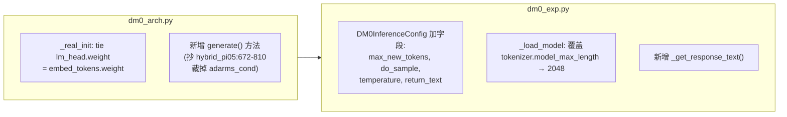

**预计 ~80 行新增代码**（不删改既有逻辑）。

### 3.4 局限性

1. 输出大概率**不可读** — 模型从未被 NTP 监督过
2. `tie_word_embeddings: false` 意味着 `embed_tokens` 和理想的 `lm_head` 之间可能有较大偏差
3. 仅适合: ① 验证 generate 通路是否畅通；② 作为后续 LoRA / SFT 的起点

---

## 4. 方案 B — SFT 微调 + 推理改造 (推荐)

> 目标: 在已发布 DM0 checkpoint 上做小规模 SFT，让 DM0 真正输出有意义的 CoT / 子任务 / 离散 action token，同时不破坏 flow matching 动作能力。

### 4.1 整体改造架构

```mermaid
flowchart TB
    classDef new fill:#ccffcc,stroke:#00aa00,stroke-width:2px
    classDef keep fill:#ffffcc
    classDef changed fill:#ffeebb,stroke:#ff8800

    subgraph In["输入"]
        I1["input_ids + attention_mask"]:::keep
        I2["images + image_masks"]:::keep
        I3["actions (可选)"]:::keep
        I4["labels (SFT 新增)"]:::new
        I5["has_text / has_action"]:::new
    end

    subgraph Model["DM0ForCausalLM (改造后)"]
        PF["get_prefix_hidden_states"]:::keep
        SF["get_suffix_hidden_states"]:::keep
        MA["_merged_attention_forward"]:::keep
        PO["prefix_out ∈ ℝ^{B×P×2048}"]:::changed
        SO["suffix_out ∈ ℝ^{B×S×1024}"]:::keep

        LH["lm_head(prefix_out) → logits"]:::new
        AOE["action_out_proj(suffix_out) → v_t"]:::keep

        TL["text_loss = CE(logits, labels)"]:::new
        AL["action_loss = MSE(v_t, u_t)"]:::keep
        SUM["loss = λ_AR · 1_text · L_AR<br/>+ λ_FM · 1_action · L_FM"]:::new
    end

    subgraph Gen["generate() 新增方法"]:::new
        G1["embed_prefix → KV cache"]
        G2["lm_head(prefix_out[:,-1:])"]
        G3["for loop: sample → embed → forward → lm_head"]
        G4["optional: Euler sampling on same KV cache"]
        G5["return {tokens, actions}"]
    end

    In --> PF & SF
    PF --> MA
    SF --> MA
    MA --> PO & SO
    PO --> LH --> TL --> SUM
    SO --> AOE --> AL --> SUM

    style Gen fill:#e6ffe6
```

### 4.2 训练损失定义

设一个样本包含:
- 文本标签 $\mathbf{y} = (y_1, \dots, y_{T_a})$，其中 $T_a$ 是 assistant turn 长度
- 连续动作 $\mathbf{A} \in \mathbb{R}^{C \times D}$（$C = \texttt{chunk\_size} = 50$，$D = \texttt{action\_dim} = 32$）
- 标志 $\mathbf{1}_{\text{text}}, \mathbf{1}_{\text{action}} \in \{0, 1\}$

**自回归文本损失** $\mathcal{L}_{\text{AR}}$:

$$
\mathcal{L}_{\text{AR}} = -\frac{1}{|\mathcal{S}|} \sum_{i \in \mathcal{S}} \log \frac{\exp\!\left(\boldsymbol{\ell}_i[y_i]\right)}{\sum_{v=1}^{V} \exp\!\left(\boldsymbol{\ell}_i[v]\right)}
$$

其中 $\mathcal{S} = \{i : y_i \neq \texttt{IGNORE\_INDEX}\}$，$\boldsymbol{\ell}_i = W_{\text{lm\_head}} \cdot \mathbf{h}_i^{\text{prefix}}$。

**Flow Matching 损失** $\mathcal{L}_{\text{FM}}$（DM0 原版不变）:

$$
\mathcal{L}_{\text{FM}} = \mathbb{E}_{\boldsymbol{\epsilon} \sim \mathcal{N}(\mathbf{0}, \mathbf{I}),\; \tau \sim \text{Beta}(1.5, 1)} \left[\left\| v_\theta\!\left(\mathbf{x}_\tau, \tau, \mathbf{c}\right) - \underbrace{(\boldsymbol{\epsilon} - \mathbf{A})}_{u_\tau} \right\|_2^2 \right]
$$

其中 $\mathbf{x}_\tau = \tau \boldsymbol{\epsilon} + (1-\tau)\mathbf{A}$。

**总损失** (对齐论文 §2.9):

$$
\boxed{\mathcal{L}_{\text{total}} = \lambda_{\text{AR}} \cdot \mathbf{1}_{\text{text}} \cdot \mathcal{L}_{\text{AR}} + \lambda_{\text{FM}} \cdot \mathbf{1}_{\text{action}} \cdot \mathcal{L}_{\text{FM}}}
$$

默认 $\lambda_{\text{AR}} = \lambda_{\text{FM}} = 1$，与 `config.json` 中 `ar_loss_weight: 1.0` 声明一致。`has_text` / `has_action` mask 允许 batch 内混合训练（纯文本 / 纯动作 / 双模样本）。

### 4.3 forward 改动详解

以下是对 `dm0_arch.py:495-511` 的精确插入方案。**所有既有代码不改**，仅在 `action_loss = F.mse_loss(...)` 之后、`outputs = CausalLMOutputDexbotic(...)` 之前插入:

```python
# === 新增: text loss 计算 (对齐 hybrid_pi05_arch.py:455-479) ===
text_loss = None
if labels is not None and input_ids is not None:
    with torch.amp.autocast("cuda", dtype=torch.float32):
        text_logits = self.lm_head(prefix_out)
        text_len = input_ids.shape[1]
        pred_tokens = text_logits[:, -text_len:-1, :]
        target_tokens = labels[:, 1:]
        token_loss = F.cross_entropy(
            pred_tokens.transpose(1, 2),
            target_tokens,
            reduction="none",
        )
        token_mask = torch.where(
            target_tokens != IGNORE_INDEX, 1.0, 0.0
        )
        sample_loss = (token_loss * token_mask).sum(dim=-1) / torch.clamp(
            token_mask.sum(dim=-1), min=1.0
        )
        if has_text is not None:
            has_text_mask = has_text.reshape(-1).to(sample_loss.device).float()
        else:
            has_text_mask = torch.ones(
                sample_loss.shape[0], device=sample_loss.device
            )
        text_loss = (sample_loss * has_text_mask).sum() / (
            has_text_mask.sum() + 1e-6
        )

# === 修改: 损失合并 ===
loss = action_loss
if text_loss is not None:
    loss = loss + text_loss
```

注意: `prefix_out` 的形状是 `[B, N_v + T_p, 2048]`，其中前 $N_v$ 个 token 是视觉 token（不在 `input_ids` 中），后 $T_p$ 个 token 对应 `input_ids`。因此取 `text_logits[:, -text_len:-1]` 正好对齐 `labels[:, 1:]`（shifted by 1 for next-token prediction）。

### 4.4 generate() 方法实现

DM0 的 `generate()` 需要适配以下与 HybridPi05 的差异:

| 差异点 | HybridPi05 | DM0 | 改造方式 |
|--------|-----------|-----|---------|
| 合并前向 | `_inner_forward_mot()` | `_merged_attention_forward()` | 替换调用 |
| 条件化 | `adarms_cond` (AdaRMS) | 无 | 去掉 |
| embed 缩放 | `* hidden_size**0.5` | 无 | 去掉 |
| RoPE | `self.model.llm.rotary_emb(tokens, positions)` 返回 tuple | 同 | 但 DM0 在 `_compute_merged_layer` 内部调 `rotary_emb` + `apply_rotary_pos_emb` |
| 注意力掩码 | `make_attn_mask()` + `make_attn_mask_4d()` | `make_attn_mask_2d()` + `make_attn_mask_4d()` | 适配 DM0 的 mask 接口 |
| 层级遍历 | `zip(*[module.layers])` | 同 | 一致 |
| 残差连接 | `_gated_residual()` | 直接加 | 一致(Qwen3 无 gate) |
| final norm | `module.norm(embeds, adarms_cond)` | `module.norm(embeds)` | 去掉 adarms_cond |

**关键实现点**: DM0 的 `_merged_attention_forward` 在内部处理 RoPE，需要传入 `position_ids` 而非 `position_embeddings`。而 HybridPi05 的 `_inner_forward_mot` 接收预计算的 `position_embeddings`。这决定了 generate 循环中位置编码的传递方式需要适配。

具体 generate 伪代码:

```python
@torch.no_grad()
def generate(self, input_ids, attention_mask, images, image_masks,
             max_new_tokens=256, do_sample=False, temperature=0.0,
             eos_token_id=None, return_text=True, return_action=True,
             states=None, diffusion_steps=10, **kwargs):

    batch_size = input_ids.shape[0]
    device = input_ids.device
    if eos_token_id is None:
        eos_token_id = self.config.llm_config.eos_token_id

    # 1. Prefix 编码 + KV cache
    prefix_hs, prefix_pad_mask, prefix_attn_mask = (
        self.get_prefix_hidden_states(input_ids, attention_mask, images, image_masks)
    )
    prefix_attn_2d = make_attn_mask_2d(prefix_pad_mask, prefix_attn_mask)
    prefix_attn_4d = make_attn_mask_4d(prefix_attn_2d, dtype=prefix_hs.dtype)
    prefix_positions = torch.cumsum(prefix_pad_mask, dim=1) - 1

    module_list = [self.model.llm, self.model.action_expert.model]
    (prefix_out, _), kv_cache = self._merged_attention_forward(
        module_list=module_list,
        attention_mask=prefix_attn_4d,
        position_ids=prefix_positions,
        past_key_values=DynamicCache(),
        input_embeds_list=[prefix_hs, None],
        use_cache=True,
    )
    context_len = prefix_pad_mask.sum(dim=1)  # [B]

    result = {}

    # 2. 文本生成循环
    if return_text:
        generated = torch.empty((batch_size, 0), dtype=torch.long, device=device)
        logits = self.lm_head(prefix_out[:, -1:])
        finished = torch.zeros(batch_size, dtype=torch.bool, device=device)

        for step in range(max_new_tokens):
            # 采样
            if do_sample and temperature > 0:
                probs = torch.softmax(logits.squeeze(1) / temperature, dim=-1)
                next_token = torch.multinomial(probs, num_samples=1)
            else:
                next_token = logits.squeeze(1).argmax(dim=-1, keepdim=True)

            if eos_token_id is not None:
                finished = finished | (next_token.squeeze(1) == eos_token_id)
            generated = torch.cat([generated, next_token], dim=1)
            if finished.all():
                break

            # 单 token 解码
            token_embeds = self.model.embed_language_tokens(next_token)  # [B,1,2048]
            decode_position = (context_len + step + 1 - 1).unsqueeze(1)  # [B,1]

            # 构建 decode 掩码: [B, 1, prefix_len + step + 1]
            # 新 token 可以 attend 到所有之前的 token
            full_len = kv_cache.get_seq_length() + 1
            decode_mask_2d = torch.ones(
                batch_size, 1, full_len, device=device, dtype=torch.bool
            )
            decode_mask_4d = make_attn_mask_4d(decode_mask_2d, dtype=token_embeds.dtype)

            if self.model.config.bf16:
                token_embeds = token_embeds.to(torch.bfloat16)

            (decode_out, _), kv_cache = self._merged_attention_forward(
                module_list=module_list,
                attention_mask=decode_mask_4d,
                position_ids=decode_position,
                past_key_values=kv_cache,
                input_embeds_list=[token_embeds, None],
                use_cache=True,
            )
            logits = self.lm_head(decode_out[:, -1:])

        result["tokens"] = generated

    # 3. Action 生成 (可选)
    if return_action:
        if states is None:
            raise ValueError("states required for action generation")
        # ... Euler 采样, 同 inference_action 但复用 kv_cache ...
        result["actions"] = noise

    return result
```

### 4.5 tokenizer / tokenization 改动

#### 4.5.1 model_max_length 覆盖

```python
# dm0_exp.py — DM0InferenceConfig._load_model 或 _initialize_inference
# 加载 tokenizer 后立即覆盖:
self.tokenizer.model_max_length = max(2048, self.tokenizer.model_max_length)
```

#### 4.5.2 DM0Tokenization 空 assistant turn 处理

当前逻辑:

```python
# process.py:407-414
if (conversations and conversations[-1].get("from") == "gpt"
    and not conversations[-1].get("value")):
    conversations.pop()  # 弹掉空 assistant turn
```

SFT 训练时 assistant turn 有内容（CoT / 离散 action token），不应被弹掉。改动:

```python
# 只在推理（构建 prompt）时弹空 assistant，训练时保留
if (conversations and conversations[-1].get("from") == "gpt"
    and not conversations[-1].get("value")
    and not kwargs.get("keep_assistant", False)):
    conversations.pop()
```

### 4.6 DM0InferenceConfig 新增字段

```python
@dataclass
class DM0InferenceConfig(InferenceConfig):
    # ... 既有字段 ...

    # === 新增(对齐 UniNaVidInferenceConfig 风格) ===
    max_new_tokens: int = field(default=256)
    do_sample: bool = field(default=False)
    temperature: float = field(default=0.0)
    return_text: bool = field(default=False)   # 默认 False 保持向后兼容
    text_model_max_length: int = field(default=2048)
    eos_token_id: int | None = field(default=None)
```

`return_text` 默认 `False`，确保已有脚本/客户端无感升级。

### 4.7 DM0DataConfig 扩展

```python
# dm0_exp.py
data_keys: list[str] = field(
    default_factory=lambda: [
        "input_ids", "labels", "action",
        "image", "state", "image_masks",
        "has_text", "has_action",          # ← 新增
    ]
)
```

Collator (`collator.py:49-57`) 的 `mapping_keys` 已包含 `has_text` 和 `has_action`（为 Pi05 添加的），无需改动。

### 4.8 冻结策略

为防止 SFT 破坏 flow matching 能力，按阶段冻结:

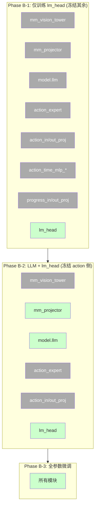

**Phase B-1** 最安全: 如果 `lm_head` tie 到 `embed_tokens`，实际就是只更新 embedding 层的 lightweight SFT。~1K episode 即可让模型学会输出格式化文本，而完全不触动 action 通道。

### 4.9 SFT 数据格式

复用 `dm0_txtAsEvry2.md §6.1` 的层次化 CoT 格式:

```json
{
  "images_1": {"type": "video", "url": "episode_001.mp4", "frame_idx": 42},
  "conversations": [
    {"from": "human", "value": "<image> Open the drawer and put the opener inside."},
    {"from": "gpt", "value": "<subtask>approach drawer handle, grasp, pull open</subtask> <act> 128 64 200 110 250 250 0</act>"}
  ],
  "action": [[...50×32...]],
  "state": [...],
  "has_text": true,
  "has_action": true
}
```

最小 SFT 集合 (用 VLM 自动打标):

| 阶段 | 数据量 | 文本内容 | 冻结策略 | 训练时长 (8×H20) |
|------|-------|---------|---------|-----------------|
| B-1 Smoke | 1K episode | 仅 subtask | 冻结 action 侧 | <2h |
| B-2 Light | 10K episode | subtask + discrete act | LLM + lm_head | ~1 天 |
| B-3 Full | 100K+ | 全 4 层 scaffolding | 全参数 | ~1 周 |

---

## 5. 方案 C — 全量混合训练

方案 C 的完整训练侧设计已在 [dm0_txtAsEvry2.md](./dm0_txtAsEvry2.md) 充分展开，包括:

- §2-5: 4 层级辅助任务（subtask / bbox / EEF trajectory / discrete action）的逐任务分析
- §6: 联合实现方案（统一 CE loss、渐进式数据格式、collator 扩展）
- §7: 外部论文方法对比

本文方案 B 的推理侧 `generate()` 改造与方案 C 完全兼容 — 训练侧加了 $\mathcal{L}_{\text{AR}}$ 后，推理侧用同一个 `generate()` 输出文本。

---

## 6. 逐文件改动清单

### 6.1 `dexbotic/model/dm0/dm0_arch.py`

| # | 位置 | 改动 | 行数 |
|---|------|------|------|
| 1 | `DM0Config` 类 | 加字段: `text_loss_weight: float = 1.0`, `tie_lm_head: bool = True` | +2 |
| 2 | `DM0ForCausalLM._real_init` 末尾 | `if config.tie_lm_head: self.lm_head.weight = self.model.llm.embed_tokens.weight` | +3 |
| 3 | `forward` 签名 | 补充 `has_text`, `has_action` 参数 | +2 |
| 4 | `forward` line 502 后 | 插入 text_loss 计算块（§4.3 代码） | +25 |
| 5 | `forward` 输出 | 修改 `CausalLMOutputDexbotic` 补填 `text_loss=text_loss`, `action_loss=action_loss` | +3 |
| 6 | **新增** `generate()` 方法 | 自写 AR 解码循环 + 可选 action 解码（§4.4 代码） | +65 |
| | **小计** | | **~100 行** |

### 6.2 `dexbotic/model/dm0/dm0_prog_arch.py`

对称改动（同 dm0_arch.py），额外注意 progress 通道:

| # | 改动 | 行数 |
|---|------|------|
| 1-6 | 同 dm0_arch.py | ~100 |
| 7 | generate() 中考虑 progress_out_proj | +5 |
| | **小计** | **~105 行** |

### 6.3 `dexbotic/exp/dm0_exp.py`

| # | 位置 | 改动 | 行数 |
|---|------|------|------|
| 8 | `DM0InferenceConfig` | 加 6 个字段（§4.6） | +6 |
| 9 | `_load_model` / `_initialize_inference` | 覆盖 `tokenizer.model_max_length` | +2 |
| 10 | `process_frame` | 增加 `mode` 路由 (`text` / `action` / `hybrid`) | +4 |
| 11 | **新增** `_get_response_text()` | 调 `self.model.generate(...)` + `tokenizer.decode` | +30 |
| 12 | `DM0DataConfig.data_keys` | 加 `has_text`, `has_action` | +2 |
| 13 | `DM0TrainerConfig.model_max_length` | 从 200 调到 ≥512（给 CoT 留空间） | +1 |
| | **小计** | **~45 行** |

### 6.4 `dexbotic/tokenization/process.py`

| # | 位置 | 改动 | 行数 |
|---|------|------|------|
| 14 | `DM0Tokenization.__call__` | 空 assistant turn pop 加条件 `keep_assistant` | +3 |
| 15 | `DM0Tokenization.__init__` | 加 `max_len_override` 参数 | +4 |
| | **小计** | **~7 行** |

### 6.5 改动量汇总

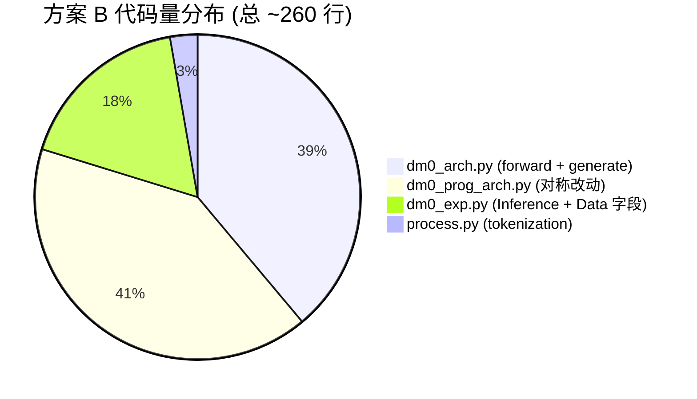

---

## 7. max_length 配置全链路矩阵

这是恢复 token 输出时最容易踩的坑 — DM0 的长度限制分散在 5 个不同的配置项中:

| 配置项 | 位置 | 当前值 (table30) | 推荐值 (方案 B) | 谁读它 | 作用 |
|--------|------|-----------------|---------------|-------|------|
| `tokenizer_config.json: model_max_length` | checkpoint 文件 | **100** | 不改文件, 代码中覆盖 | `DM0Tokenization._max_len` | 截断 prompt 编码 |
| `tokenizer.model_max_length` (运行时) | Python 对象属性 | 100 | **2048** | tokenizer 编码, DM0Tokenization | 运行时截断阈值 |
| `config.json: tokenizer_model_max_length` | checkpoint 文件 | 2048 | 不变 | `dexbotic_arch.py:238-243` | 截断多模态拼接后的 embed |
| `DM0TrainerConfig.model_max_length` | Python dataclass | 200 | **≥512** | 训练时 override tokenizer | 训练阶段截断 |
| `DM0InferenceConfig.max_new_tokens` | Python dataclass | (无此字段) | **256** (新增) | 自写 generate 的循环上限 | 生成长度 |
| `llm_config.max_position_embeddings` | config.json | 40960 | 不变 | RoPE 物理上限 | 绝对位置上限 |

### 长度约束关系

$$
\underbrace{T_{\text{input}}}_{\leq \texttt{model\_max\_length}} + \underbrace{T_{\text{output}}}_{\leq \texttt{max\_new\_tokens}} \leq \underbrace{P_{\max}}_{\texttt{max\_position\_embeddings}} = 40960
$$

$$
T_{\text{input}} \leq \min\!\left(\texttt{model\_max\_length},\; \texttt{tokenizer\_model\_max\_length}\right)
$$

**具体数值链**:

$$
\begin{aligned}
L_{\text{prompt}} &\leq \underbrace{\texttt{tokenizer.model\_max\_length}}_{=2048\text{ (覆盖后)}} \\[4pt]
L_{\text{prefix}} &= N_v + L_{\text{prompt}} \leq \underbrace{\texttt{tokenizer\_model\_max\_length}}_{=2048} \\[4pt]
T_{\text{output}} &\leq \underbrace{\texttt{max\_new\_tokens}}_{=256} \\[4pt]
L_{\text{prefix}} + T_{\text{output}} &\leq 2048 + 256 = 2304 \ll 40960
\end{aligned}
$$

---

## 8. 推理服务接口设计

### 8.1 Flask 路由扩展

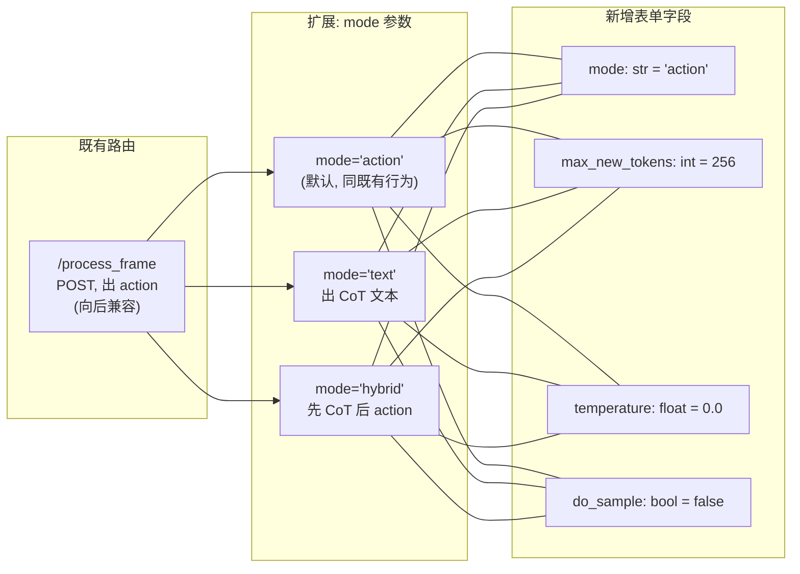

### 8.2 响应格式

```json
{
  "response": {
    "text": "<subtask>Reach towards the drawer handle, grasp...</subtask>",
    "action": [[0.12, -0.34, 0.56, 0.78, -0.12, 0.34, 1.0]],
    "metadata": {
      "prefix_len": 1847,
      "generated_text_len": 42,
      "stopped_by": "eos_token",
      "diffusion_steps": 10,
      "mode": "hybrid"
    }
  }
}
```

### 8.3 向后兼容

- `mode` 缺省为 `"action"` → 已有 `DexClient` 无感升级
- 响应中 `text` 字段仅在 `mode != "action"` 时非空
- `_get_response()` 方法签名和返回值不变

---

## 9. 风险与缓解

| # | 风险 | 概率 | 影响 | 缓解措施 |
|---|------|-----|------|---------|
| 1 | `lm_head ← embed_tokens` weight tie 在 Qwen3 上效果差 | 中 | 方案 A 输出乱码 | Phase B-2 起允许 lm_head 独立训练 |
| 2 | merged attention 的 KV cache 与自写 generate 不兼容 | 低 | text 解码段段错位 | 精确对齐 HybridPi05 的 `context_mask` + `position_ids` 管理 |
| 3 | `tokenizer.model_max_length=100` 截断 SFT 的 assistant turn | **高** | text_loss 全 IGNORE_INDEX | 训练管线在 `DM0Tokenization.__init__` 强制 override 到 ≥1024 |
| 4 | `DM0Tokenization` 的 `pop empty assistant turn` 误删 SFT 标签 | **高** | text_loss 全 IGNORE_INDEX | 加 `keep_assistant` 条件(§4.5.2) |
| 5 | HF `GenerationMixin.generate()` 被误调用 | 中 | forward 崩(actions=None) | DM0 的 `generate()` 是自写方法，名称遮蔽 Mixin 的同名方法 |
| 6 | SFT 破坏 flow matching 能力 | 中 | action 精度下降 | 用 `has_action`/`has_text` mask 隔离 loss + Phase B-1 冻结 action 侧 |
| 7 | action_expert KV cache 在 text decode 时占显存 | 低 | ~10% 显存浪费 | text 路径 `input_embeds_list=[token_embeds, None]`，action_expert 通道为空 |
| 8 | 大 `max_new_tokens` 推爆 RoPE 上限 | 极低 | OOM 或位置错位 | 推理时检查 `prefix_len + max_new_tokens ≤ 40960` |
| 9 | config.json `architectures: ["DM0ForCausalLM"]` 与实际 DM0Prog 不一致 | 中 | progress 权重丢失 | 加载时用 `DM0ProgForCausalLM` 或修正 `architectures` |

---

## 10. 工作量与里程碑

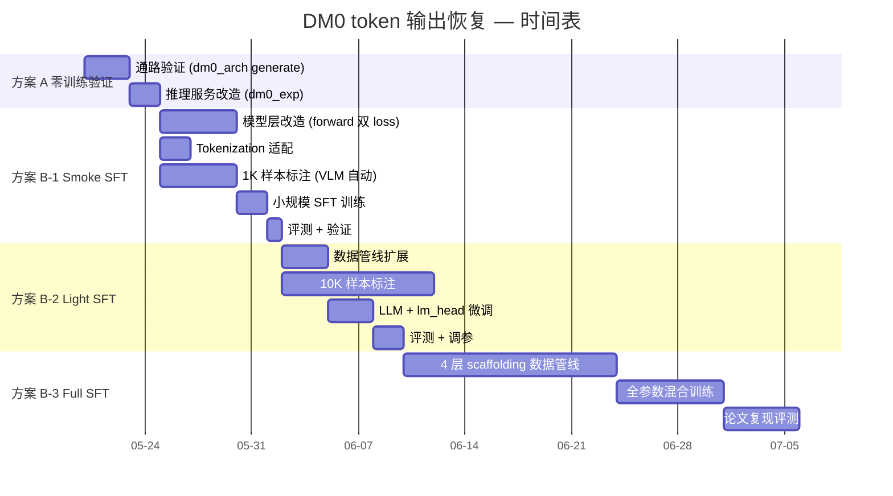

### 汇总表

| 方案 | 模型代码 | 数据代码 | 数据标注 | 训练时长 | 预期效果 |
|------|---------|---------|---------|---------|---------|
| A | ~80 行 | 0 | 0 | 0 | 通路 OK, 输出无意义 |
| B-1 | ~160 行 | ~10 行 | 1K episode | <2h | CoT 基本可读 |
| B-2 | ~180 行 | ~30 行 | 10K episode | ~1 天 | CoT + 离散 action |
| B-3 | ~260 行 | ~350 行 | 100K+ | ~1 周 | 接近论文 Table 5 |

---

## 11. 与既有文档的关系

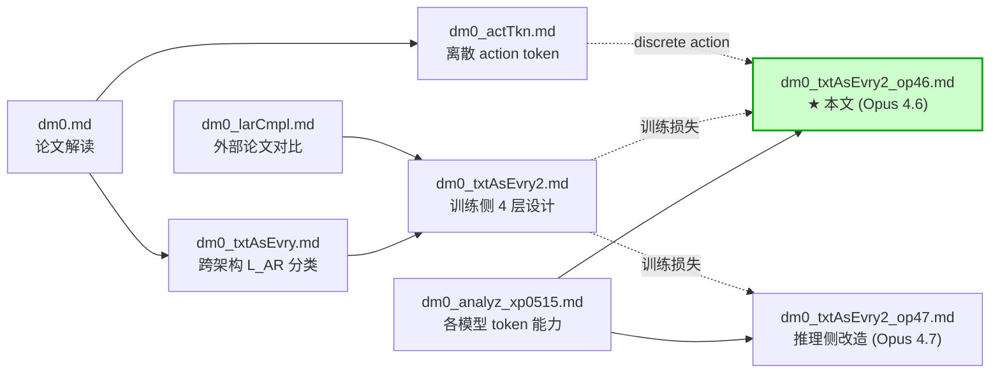

**本文定位**:

与 `dm0_txtAsEvry2_op47.md` (Opus 4.7) 为**同一命题的独立分析**。两者的核心结论一致（必须自写 generate，参考 HybridPi05，三档方案 A/B/C），但在以下方面有差异化:

| 维度 | op47 | 本文 (op46) |
|------|------|------------|
| 侧重 | 推理侧改造 | 训练 + 推理全栈 |
| generate 伪代码 | 抄 HybridPi05 原始结构 | 适配 DM0 `_merged_attention_forward` 接口差异 |
| 数学推导 | 简要 | 完整($\mathcal{L}_{\text{AR}}$, $\mathcal{L}_{\text{FM}}$, $T_{\text{output}}^{\max}$ 公式) |
| 风险分析 | 8 项 | 9 项(含 DM0Prog 架构不一致) |
| 冻结策略 | 3 阶段图 | 同, 但补充了 Phase B-1 "只训 lm_head" 的数学解释 |

---

## 12. 一句话总结

> **要让 DM0 输出 token，必须做 3 件事**: ① 自写 `generate()` 解码循环（因为 merged attention 让 HF `GenerationMixin` 无法直接用，照搬 `HybridPi05ForCausalLM.generate` 的架构但适配 DM0 的 `_merged_attention_forward` 和 Qwen3 RoPE）；② 给 `forward()` 接上 `self.lm_head(prefix_out)` → CE loss（$\mathcal{L}_{\text{AR}}$），与既有的 $\mathcal{L}_{\text{FM}}$ 组成论文的 $\mathcal{L}_{\text{total}} = \lambda \cdot \mathcal{L}_{\text{AR}} + \mathcal{L}_{\text{FM}}$；③ 把 `DM0InferenceConfig` 加上 `max_new_tokens` / `temperature` / `return_text` 等字段，并在加载时将 `tokenizer.model_max_length` 从 100 覆盖到 2048。
