# DM0 恢复 token 输出能力 — 全栈实现方案(op47)

> 创建日期: 2026-05-16
> 关联文档:
> - [dm0.md](./dm0.md) — DM0 论文解读
> - [dm0_txtAsEvry.md](./dm0_txtAsEvry.md) — 跨架构 L_AR 模式分类
> - [dm0_txtAsEvry2.md](./dm0_txtAsEvry2.md) — 4 层级 Scaffolding 训练侧设计
> - [dm0_actTkn.md](./dm0_actTkn.md) — 离散 action token 路径分析
> - [dm0_analyz_xp0515.md](./dm0_analyz_xp0515.md) — 实现 gap 实验性分析

> 范围: **聚焦"如何让 DM0 在推理时真正能 `generate()` 出 token"**, 与 `dm0_txtAsEvry2.md` (聚焦训练侧 L_AR loss 设计) 互补。

---

## 0. TL;DR

### 0.1 目标

让现有的 DM0 模型(以 `b/m/dm0/table30_generalist_aloha` 这种已发布 checkpoint 为标定基准)**真正能输出 token / CoT**, 而不是只能跑 flow-matching 出连续动作。

### 0.2 当前问题三连

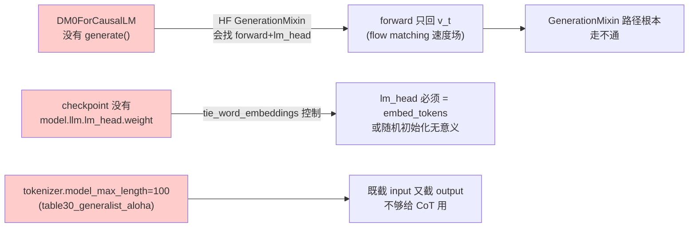

### 0.3 三档方案概览

| 方案 | 是否需重训 | 文本输出质量 | 实现代价 | 适用场景 |
|------|----------|-------------|---------|---------|
| **A. 零训练嫁接** | 否 | 几乎不可用(只能 echo 输入侧已学过的少量 token) | ~30 行 | 仅做"通路验证"/快速 demo |
| **B. 微调 L_AR + 推理改造** | 是, 但只需小规模 SFT | 中等(子任务/CoT 文本) | ~150 行模型 + 数据标注 | 复现论文 §2.9 的 scaffolding |
| **C. 全量混合训练** | 是, 大规模训练 | 高(接近论文 Table 5 VQA 水平) | dm0_txtAsEvry2.md 已展开 | 走完整 "text-as-everything" 路线 |

本文集中讲 **方案 A 和方案 B**(C 在 `dm0_txtAsEvry2.md` 已充分覆盖)。

### 0.4 关键发现 (来自 table30_generalist_aloha checkpoint 索引盘点)

通过审 `model.safetensors.index.json`, 该 checkpoint **不含** `model.llm.lm_head.weight`、**也不含**顶层 `lm_head.weight`, 但包含:

| Key 模式 | 含义 | 对 token 输出的可用性 |
|---------|------|----------------------|
| `model.llm.embed_tokens.weight` | LLM 输入嵌入(2048 × 152701) | ✅ 可作为 `lm_head` 的转置(tie) |
| `model.action_expert.lm_head.weight` | action_expert 自带的 lm_head(1024 × 151936) | ❌ 维度和 vocab 都对不上, **无用** |
| `model.action_in_proj`/`action_out_proj` | flow matching 通道 | 与文本无关 |
| `model.progress_in_proj`/`progress_out_proj` | progress 预测通道(说明该 checkpoint 实际由 `DM0ProgForCausalLM` 训练) | 与文本无关 |
| `model.mm_projector` / `model.mm_vision_tower` | 视觉编码 | ✅ 推理通用 |

而 `config.json` 又给出关键信息:

| 字段 | 值 | 含义 |
|------|-----|------|
| `llm_config.hidden_size` | 2048 | LLM 隐藏维度 |
| `llm_config.vocab_size` | 152701 | LLM 词表 |
| `llm_config.max_position_embeddings` | 40960 | RoPE 物理上限 |
| `tokenizer_model_max_length` | 2048 | 多模态 embed 拼好后的截断阈值 |
| `tokenizer_config.json: model_max_length` | **100** | tokenizer 编码上限(table30_generalist_aloha 特有) |
| `ar_loss` / `ar_loss_weight` | true / 1.0 | **声明了但代码完全没引用** |

---

## 1. 现状深度盘点

### 1.1 代码层: DM0 完全没有 token 生成路径

#### 1.1.1 `DM0ForCausalLM` 当前定义

```128:143:dexbotic/model/dm0/dm0_arch.py
class DM0ForCausalLM(DexboticForCausalLM, ActionOutputForCausalLM):
    """DM0 model for causal language modeling with action prediction."""

    config_class = DM0Config

    def _real_init(self, config: DM0Config):
        self.model = DM0Model(config)
        if config.bf16:
            self.model.to_bfloat16_for_selected_params()
        else:
            self.model = self.model.to(torch.float32)
        # Add lm_head for compatibility with parent class tie_weights
        self.lm_head = nn.Linear(
            config.llm_config.hidden_size, config.llm_config.vocab_size, bias=False
        )
        self.post_init()
```

关键点:

- 注释明说 `lm_head` 只为 "compatibility with parent class tie_weights" 而存在, **此 Linear 层从未被前向使用**, 也**未在 checkpoint 中保存** → 加载时是 `_init_weights` 给的随机初始化(再被 `post_init` 走默认重置)。
- 继承链 `DexboticForCausalLM(DexboticPretrainedModel, GenerationMixin)` 自带 `generate()` 入口, 但 `generate()` 在内部会调到 `self.forward()`。

#### 1.1.2 `forward()` 没有 logits 出口

```495:511:dexbotic/model/dm0/dm0_arch.py
        # Compute flow matching loss
        if actions.dtype == torch.float32:
            suffix_out = suffix_out.to(torch.float32)
        suffix_out_final = suffix_out[:, -self.model.config.chunk_size :]
        v_t = self.model.action_out_proj(suffix_out_final)
        action_loss = F.mse_loss(v_t, u_t, reduction="mean")

        loss = action_loss

        outputs = CausalLMOutputDexbotic(
            loss=loss,
            logits=v_t,           # ← 这里塞的是 flow 速度场 [B, chunk_size, action_dim]
            past_key_values=past_key_values,
            hidden_states=None,
            attentions=None,
        )
        return outputs
```

`outputs.logits` 是 flow speed `v_t`, 形状 `[B, 50, 32]`, **不是** token logits `[B, T, V=152701]`。如果硬调 `generate()`, HF 会按 `(B, T, V)` 假设去 argmax/softmax → 维度不匹配, 直接挂。

并且 `forward` 强制要求 `actions != None`(`batch_size = actions.shape[0]`), 在推理(无 ground-truth action)时根本进不去这条路径。

#### 1.1.3 `inference_action()` 只跑 flow matching

```513:583:dexbotic/model/dm0/dm0_arch.py
    @torch.no_grad()
    def inference_action(
        self,
        input_ids: torch.LongTensor = None,
        attention_mask: Optional[torch.Tensor] = None,
        states: Optional[torch.FloatTensor] = None,
        images: Optional[torch.FloatTensor] = None,
        image_masks: Optional[torch.BoolTensor] = None,
        diffusion_steps: int = 10,
        **kwargs,
    ):
        """Inference action using Euler sampling."""
        ...
        while time >= -dt / 2:
            noise, time = self._denoise_step(...)
        return noise
```

返回的是 `[B, chunk_size, action_dim]` 的连续动作张量, 完全跳过 `lm_head`。

#### 1.1.4 整体结构图

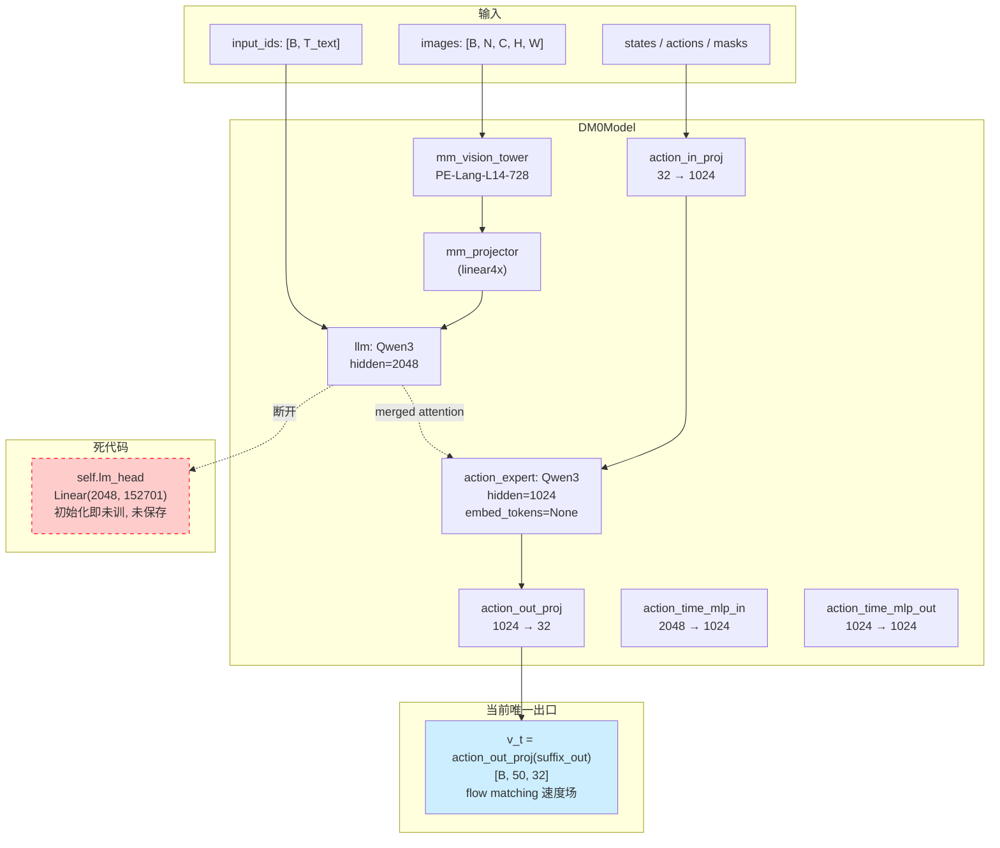

### 1.2 Checkpoint 层: `model.llm.lm_head.weight` 不在权重里

对 `b/m/dm0/table30_generalist_aloha/model.safetensors.index.json` 全文搜索 `lm_head`:

```
b/m/dm0/table30_generalist_aloha/model.safetensors.index.json
  6:    "model.action_expert.lm_head.weight": "model-00002-of-00002.safetensors",
```

只有 **action_expert 的 lm_head 被保存**, 这是因为 `dm0_arch.py:79` 直接用 `Qwen3ForCausalLM(action_model_config)` 构造 action_expert, 它默认带 `lm_head`(虽然由于 `embed_tokens=None` 而无意义)。

`model.llm` 是用 `AutoModel.from_config(llm_config)`(`dexbotic_arch.py:62`)构造的, 这是 **`AutoModel` 而不是 `AutoModelForCausalLM`**, 所以 LLM 端**根本没有 `lm_head`**。`DM0ForCausalLM` 顶层那个 `self.lm_head` 才是 LLM 端唯一的"形式 lm_head", 而它从未被保存。

结论: 即使我们改 `forward` 让它走 `self.lm_head(prefix_out)`, 加载已发布 checkpoint 时这个权重也是 **随机初始化** 的, 没有任何文本意义。

### 1.3 Tokenizer 层: `model_max_length=100` 是 CoT 的杀手

```8500:8513:b/m/dm0/table30_generalist_aloha/tokenizer_config.json
  ],
  "bos_token": null,
  "clean_up_tokenization_spaces": false,
  "eos_token": "<|im_end|>",
  "errors": "replace",
  "extra_special_tokens": {},
  "model_max_length": 100,
  "pad_token": "<|endoftext|>",
  "padding_side": "right",
  "split_special_tokens": false,
  "tokenizer_class": "Qwen2Tokenizer",
  "unk_token": null
}
```

而推理路径里:

```338:344:dexbotic/exp/dm0_exp.py
        tokenizer = AutoTokenizer.from_pretrained(
            self.model_name_or_path, use_fast=False, trust_remote_code=True
        )
        ...
        self.tokenization_func = DM0Tokenization(self.tokenizer)
```

```378:383:dexbotic/tokenization/process.py
    def __init__(
        self,
        tokenizer: transformers.PreTrainedTokenizer,
        chat_template: str = "step",
        *args,
        **kwargs,
    ):
        self.tokenizer = tokenizer
        self._max_len = tokenizer.model_max_length
```

`DM0Tokenization` 把 `tokenizer.model_max_length`(=100) 直接当 prompt 截断+padding 长度。**100 个 token 连一段完整的"USER: <长指令>"模板都装不下**(USER 角色名 + 系统 prompt 就要占 30~50 token), 自然容不下 CoT 输出。

### 1.4 已发布 checkpoint 一览(关键差异)

| Checkpoint | `tokenizer.model_max_length` | `tokenizer_model_max_length` | 有 progress 通道 | 有 chat_template | 含 `<action>N</action>` 词条 |
|-----------|-----------------------------|------------------------------|------------------|-------------------|-----------------------------|
| `base` | 4096 | 2048 | ❌ | ✅ | ✅ |
| `table30_generalist_aloha` | **100** | 2048 | ✅ | ❌ | ✅(151973-152700) |
| `table30_generalist_franka` | 100 | 2048 | ✅ | ❌ | ✅ |
| `table30_open_the_drawer` | 100 | 2048 | ✅ | ❌ | ✅ |
| `table30_put_opener_in_drawer` | 100 | 2048 | ✅ | ❌ | ✅ |

数据来自 `b/m/dm0/table30_generalist_aloha/readme.md` 与各 config 实测。

### 1.5 配置中的"假声明" `ar_loss=true`

全库搜 `ar_loss`:

```
b/m/dm0/*/config.json:  "ar_loss": true,
b/m/dm0/*/config.json:  "ar_loss_weight": 1.0,
```

→ 仅在 5 份 checkpoint 的 `config.json` 出现, `dexbotic/` 全树**没有任何代码引用这两个字段**。它们是论文 `L = L_AR + L_FM` 公式的残留 metadata, 与开源代码无关。

---

## 2. dexbotic 内可参考的同类实现

### 2.1 各模型 token-生成能力矩阵

下表是 [上一回合](dm0_analyz_xp0515.md)整理的同类项,聚焦"能否吐 token + 改造代价":

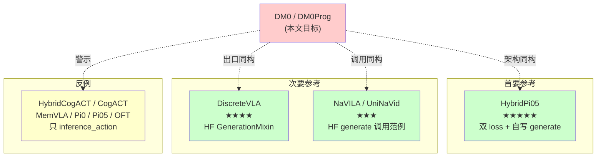

### 2.2 主参考: `HybridPi05ForCausalLM`(架构最接近)

HybridPi05 与 DM0 一样, 都是 **VLM + Action Expert 双 Transformer + merged attention + 顶层 lm_head**, 但它**完整实现了 token 输出**, 是改造 DM0 的最直接蓝本:

#### 2.2.1 `_real_init` 显式保留 lm_head

```112:121:dexbotic/model/pi05/hybrid_pi05_arch.py
class HybridPi05ForCausalLM(DexboticForCausalLM, ActionOutputForCausalLM):
    config_class = Pi05Config

    def _real_init(self, config: Pi05Config):
        self.model = Pi05Model(config)
        # Keep an LM head for language loss and optional text generation.
        self.lm_head = nn.Linear(
            config.llm_config.hidden_size, config.vocab_size, bias=False
        )
        self.post_init()
```

注释里明确"for language loss and optional text generation", 与 DM0 的"compatibility only"形成鲜明对比。

#### 2.2.2 `forward` 同时算 text_loss + action_loss

```455:512:dexbotic/model/pi05/hybrid_pi05_arch.py
        text_logits = self.lm_head(prefix_out)

        text_loss = None
        if labels is not None and input_ids is not None:
            target_tokens = labels[:, 1:]
            text_len = input_ids.shape[1]
            pred_tokens = text_logits[:, -text_len:-1]
            token_loss = F.cross_entropy(
                pred_tokens.transpose(1, 2), target_tokens, reduction="none"
            )
            ...
            text_loss = (sample_loss * has_text_mask).sum() / (has_text_mask.sum() + 1e-6)

        action_loss = None
        action_logits = None
        if suffix_out is not None and u_t is not None:
            action_logits = self.model.action_out_proj(...)
            ...
            action_loss = (per_sample_action_loss * has_action_mask).sum() / (has_action_mask.sum() + 1e-6)

        loss = None
        if text_loss is not None and action_loss is not None:
            loss = text_loss + action_loss
        elif text_loss is not None:
            loss = text_loss
        elif action_loss is not None:
            loss = action_loss
```

#### 2.2.3 自写 `generate()` 解码循环(因为 merged attention 与 HF 标准 `prepare_inputs_for_generation` 不兼容)

```672:780:dexbotic/model/pi05/hybrid_pi05_arch.py
    @torch.no_grad()
    def generate(
        self,
        input_ids: torch.LongTensor = None,
        attention_mask: Optional[torch.Tensor] = None,
        states: Optional[torch.FloatTensor] = None,
        images: Optional[torch.FloatTensor] = None,
        image_masks: Optional[torch.BoolTensor] = None,
        diffusion_steps: int = 10,
        return_text: bool = True,
        return_action: bool = True,
        do_sample: bool | None = None,
        temperature: float | None = 0.7,
        eos_token_id: int | None = None,
        max_new_tokens: int | None = 128,
        **kwargs,
    ):
        ...
        if return_text:
            generated_tokens = torch.empty((batch_size, 0), dtype=torch.long, device=device)
            logits = self.lm_head(prefix_out[:, -1:])
            finished = torch.zeros((batch_size,), dtype=torch.bool, device=device)

            for _ in range(max_new_tokens):
                if do_sample and temperature is not None and temperature > 0.0:
                    probs = torch.softmax(logits / temperature, dim=-1)
                    next_token = torch.multinomial(probs.squeeze(1), num_samples=1)
                else:
                    next_token = torch.argmax(logits, dim=-1)

                if eos_token_id is not None:
                    finished = finished | (next_token.squeeze(1) == eos_token_id)

                generated_tokens = torch.cat([generated_tokens, next_token], dim=1)
                ...
                if finished.all():
                    break

                token_embeds = (
                    self.model.llm.embed_tokens(next_token)
                    * self.model.config.llm_config.hidden_size**0.5
                )
                decode_position = context_mask.sum(dim=1, keepdim=True) - 1
                decode_position_embeddings = self.model.llm.rotary_emb(
                    token_embeds, decode_position
                )
                decode_mask = make_attn_mask_4d(context_mask[:, None, :])

                (decode_out, _), past_key_values, _, _ = self._inner_forward_mot(
                    [self.model.llm, self.model.action_expert],
                    [token_embeds, None],
                    mask=decode_mask,
                    position_embeddings=decode_position_embeddings,
                    past_key_values=past_key_values,
                    cache_position=decode_position,
                    update_cache=True,
                    adarms_cond=None,
                )
                logits = self.lm_head(decode_out)
```

**核心要点**(给 DM0 抄作业用):

1. 先一次性把 prefix(image tokens + text tokens)前向, 产生 `past_key_values` 和 `prefix_out`(注意只跑 LLM 侧, action_expert 不参与)
2. 用 `prefix_out[:, -1:]` 经 `lm_head` 算第 1 个 token 的 logits
3. **每一步**: 采样 → embed → 通过同样的 merged attention 但只输入 LLM 侧, action_expert 通道传 `None` → 拿到下一步 logits
4. 通过 `context_mask` 累计 + RoPE position 累加, 保证位置编码连续
5. `finished` 数组 + `eos_token_id` 判停

#### 2.2.4 数据流对照

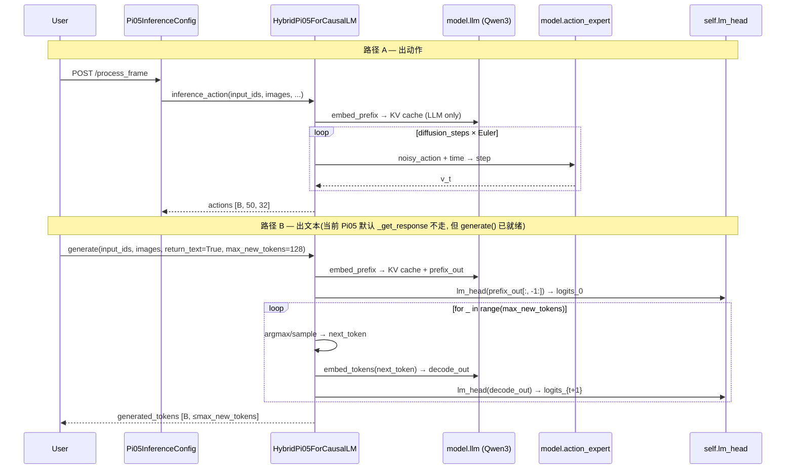

### 2.3 次要参考: `DiscreteVLAForCausalLM`(HF 标准 generate)

```12:45:dexbotic/model/discrete_vla/discrete_vla_arch.py
class DiscreteVLAForCausalLM(DexboticForCausalLM, ActionOutputForCausalLM):
    config_class = DexboticConfig

    def inference_action(self, input_ids, image_tensor, inference_args={}, **kwargs):
        ...
        with torch.inference_mode():
            outputs = self.generate(input_ids,
                                    images=image_tensor,
                                    max_new_tokens=1024,
                                    do_sample=True,
                                    temperature=0.7,
                                    return_dict_in_generate=True,
                                    stopping_criteria=[stopping_criteria])
```

DiscreteVLA 直接用 HF `GenerationMixin.generate()`, 完全没有自写循环 — 这是因为 DiscreteVLA **没有 action_expert** 这种 merged-attention 结构, 它只用一个标准 LLM forward。

→ DM0 因为有 merged attention, **不能** 直接用 HF generate, 必须像 HybridPi05 那样自写。

### 2.4 调用范式参考: `NaVILA` / `UniNaVid`

```358:369:dexbotic/exp/navila_exp.py
        with torch.inference_mode():
            generate_output = self.model.generate(
                input_ids,
                images=image_tensor,
                do_sample=False,
                temperature=0.0,
                max_new_tokens=max_new_tokens,
                use_cache=True,
                stopping_criteria=[stopping_criteria],
                return_dict_in_generate=True,
                pad_token_id=self.tokenizer.eos_token_id,
            )
            generated_ids = generate_output.sequences[0, input_ids.shape[1] :]
```

`UniNaVid` 把 `max_new_tokens` 放到了 `InferenceConfig` 的 dataclass 字段里(本仓**唯一**这么做的模型):

```343:344:dexbotic/exp/uninavid_exp.py
    temperature: float = field(default=0.2)
    max_new_tokens: int = field(default=1024)
```

这是 DM0 应当效仿的"experiment-centric configuration"风格。

---

## 3. 方案 A — 零训练嫁接(仅做通路验证)

> 目标: **不重新训练**, 在 30 行左右的改动下让 `DM0ForCausalLM` 能跑通 `generate()` 流程, 哪怕输出的 token 是无意义的(因为没有 L_AR 监督)。

### 3.1 适用场景

- 验证 generate 路径是否畅通(给 token 流式输出 client 联调用)
- 把 DM0 当 base, 后续做 LoRA / 小规模 SFT(几百条数据)调出 CoT, 此时可以接受 base 输出是无意义的

### 3.2 设计原理: 用 `embed_tokens` 反向当 lm_head

由于 Qwen3 通常 `tie_word_embeddings=True`(`base/config.json` 没显式声明就是默认行为, 而 Qwen3 默认 False, 需实测), 我们有两种兼容做法:

**做法 1: 强制权重绑定(weight tying)**

$$
W_{\text{lm\_head}} = W_{\text{embed\_tokens}}^{\top} \in \mathbb{R}^{V \times d_{\text{llm}}}
$$

即在 `_real_init` 之后立刻把 `self.lm_head.weight = self.model.llm.embed_tokens.weight`。这不会消耗额外存储, 也不需要训练。

**做法 2: 完全保留原 `self.lm_head` 的随机初始化**

适用于后续要做 LoRA / SFT 的场景, 因为 LoRA 会专门覆盖 lm_head 的低秩残差。

### 3.3 数学表达

令:

- 视觉 token 序列 $\mathbf{V} = [v_1, \dots, v_{N_v}] \in \mathbb{R}^{N_v \times d_{\text{llm}}}$
- 文本 token 嵌入 $\mathbf{T} = \mathrm{embed\_tokens}(x_{1:T_t}) \in \mathbb{R}^{T_t \times d_{\text{llm}}}$
- Prefix 隐状态 $\mathbf{H}_{\text{prefix}} = \mathrm{LLM}([\mathbf{V}; \mathbf{T}]) \in \mathbb{R}^{(N_v + T_t) \times d_{\text{llm}}}$

第 $t$ 步生成的 token logits:

$$
\boldsymbol{\ell}_t = W_{\text{lm\_head}} \cdot \mathbf{H}_{\text{prefix}}[-1] \in \mathbb{R}^V
$$

token 采样:

$$
\hat{y}_t = \begin{cases}
\arg\max_v \boldsymbol{\ell}_t[v] & \text{if greedy} \\
\mathrm{Multinomial}\!\left(\mathrm{softmax}(\boldsymbol{\ell}_t / \tau)\right) & \text{if sample}
\end{cases}
$$

后续步骤令 $\mathbf{H}_{\text{prefix}}^{(t+1)} = \mathrm{LLM}(\mathrm{embed\_tokens}(\hat{y}_t) \mid \text{KV cache})$, 循环 $t = 1, \dots, T_{\max}$ 或遇到 `eos_token_id`。

### 3.4 改动清单(方案 A)

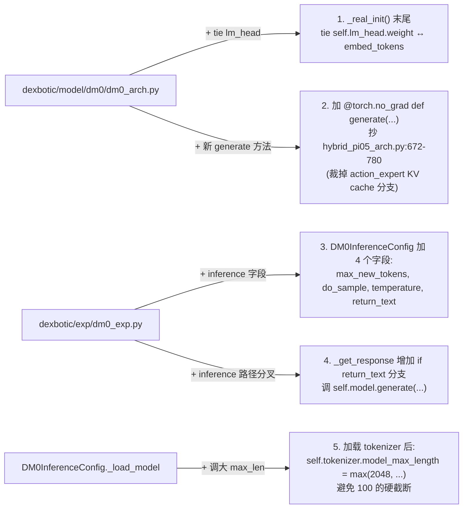

**预计代码量**: ~80 行(纯加, 不删既有逻辑)。

### 3.5 局限性(必须诚实告知用户)

- 输出**几乎不可读** — `lm_head ← embed_tokens` 是一个粗糙的近似(Qwen3 在 base/table30 上是否 tie 需以实际 config 为准)
- 即使 weight tying 在数学上合理, **模型从未被监督过 next-token-prediction**, 不存在"输出风格"
- 对 `table30_generalist_aloha`, `tokenizer.model_max_length=100` 的限制必须先在代码里抬到 2048(否则连 prompt 都装不下), 但这只是 Python 对象属性, **不写回 checkpoint**

---

## 4. 方案 B — 小规模 SFT 微调 + 推理改造(推荐)

> 目标: **在已发布 DM0 checkpoint 基础上做小规模 SFT**(几千~几万条带 CoT 标注的数据), 让 DM0 真正输出有意义的 token, 同时不破坏既有 flow-matching 动作能力。

### 4.1 整体架构改造

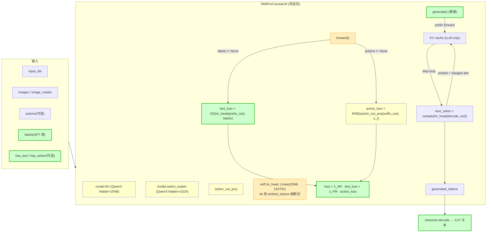

### 4.2 损失函数定义

设训练时一个样本包含:

- 视觉前缀 token 数 $N_v$, 文本前缀 token 数 $T_p$
- 文本目标(CoT/子任务/bbox/轨迹/discrete action token)长度 $T_a$
- 连续 action 序列 $\mathbf{A} \in \mathbb{R}^{C \times D}$($C=$ chunk_size=50, $D=$ action_dim=32)
- $\mathbf{1}_{\text{text}}, \mathbf{1}_{\text{action}} \in \{0, 1\}$ 标志该样本是否有文本/动作监督

**文本自回归损失** $\mathcal{L}_{\text{AR}}$:

$$
\mathcal{L}_{\text{AR}} = - \frac{1}{|\{i: y_i \neq \text{IGNORE}\}|} \sum_{i: y_i \neq \text{IGNORE}} \log p\!\left(y_i \mid \mathbf{H}_{\text{prefix}}^{(i)}\right)
$$

其中 $p(y_i \mid \cdot) = \mathrm{softmax}(W_{\text{lm\_head}} \cdot h_i^{\text{prefix}})[y_i]$。

**Flow Matching 损失** $\mathcal{L}_{\text{FM}}$ (DM0 原版):

$$
\mathcal{L}_{\text{FM}} = \mathbb{E}_{\boldsymbol{\epsilon} \sim \mathcal{N}(0, I),\ \tau \sim \mathrm{Beta}(1.5, 1)}\!\left[ \left\| v_\theta(\mathbf{x}_\tau, \tau, \mathbf{c}) - (\boldsymbol{\epsilon} - \mathbf{A}) \right\|_2^2 \right]
$$

其中 $\mathbf{x}_\tau = \tau \boldsymbol{\epsilon} + (1-\tau)\mathbf{A}$, $\mathbf{c}$ 是 prefix 条件。

**总损失**(论文 §2.9 形式):

$$
\boxed{\mathcal{L}_{\text{total}} = \lambda_{\text{AR}} \cdot \mathbf{1}_{\text{text}} \cdot \mathcal{L}_{\text{AR}} + \lambda_{\text{FM}} \cdot \mathbf{1}_{\text{action}} \cdot \mathcal{L}_{\text{FM}}}
$$

默认 $\lambda_{\text{AR}} = \lambda_{\text{FM}} = 1$, 与 `config.json` 中 `ar_loss_weight: 1.0` 的声明一致。`has_text` / `has_action` 的 mask 设计与 `HybridPi05` 完全对齐, 允许 batch 内文本-only / 动作-only / 双模样本混合训练。

### 4.3 推理路径设计

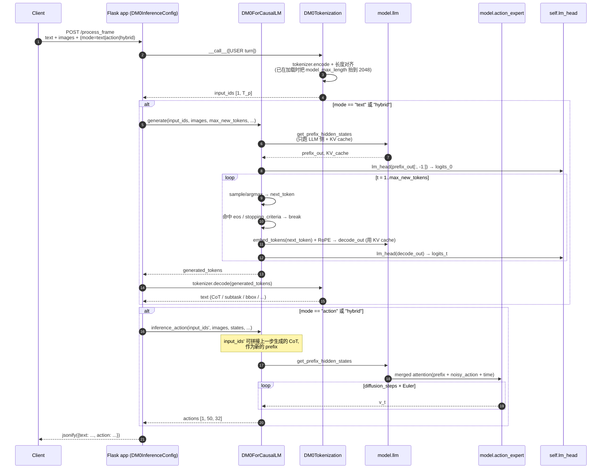

### 4.4 改动清单(方案 B)

按文件分类、按改动量排序:

#### 4.4.1 模型层 `dexbotic/model/dm0/dm0_arch.py`

| # | 位置 | 改动 | 行数估计 |
|---|------|------|---------|
| 1 | `DM0Config` | 加字段: `text_loss_weight: float = 1.0`, `tie_lm_head: bool = True` | 2 |
| 2 | `_real_init` | 末尾加: `if config.tie_lm_head: self.lm_head.weight = self.model.llm.embed_tokens.weight` | 3 |
| 3 | `forward` 签名 | 加 `labels`, `has_text`, `has_action` 参数(已有 `labels` 形参, 但未消费) | 1 |
| 4 | `forward` 主体 | 在 `(prefix_out, suffix_out), _ = ...` 后插入 text_loss 计算块(抄 hybrid_pi05_arch.py:455-479) | ~25 |
| 5 | `forward` 损失合并 | 改 `loss = action_loss` → `loss = λ_AR·text_loss·1_text + λ_FM·action_loss·1_action` | 5 |
| 6 | `forward` 输出 | 把 `CausalLMOutputDexbotic` 多填 `text_loss=text_loss`, `action_loss=action_loss`, `logits=text_logits if text_logits is not None else v_t` | 3 |
| 7 | **新增** `generate()` 方法 | 抄 `hybrid_pi05_arch.py:672-780`, 把 `_inner_forward_mot` 换成 DM0 的 `_merged_attention_forward`, 并裁掉 `adarms_cond`(DM0 没有) | ~60 |
| **小计** | | | **~100 行** |

> 说明: 方案 A 已经做了改动 1+2+7 的简化版, 方案 B 只是把它们做完整 + 把 forward 端的 L_AR loss 补上。

`DM0ProgForCausalLM` 需要做对称改动(同样 ~100 行)。

#### 4.4.2 数据/Tokenizer 层 `dexbotic/tokenization/process.py`

| # | 位置 | 改动 | 行数 |
|---|------|------|------|
| 8 | `DM0Tokenization.__init__` | 增加 `max_len_override: int = None`, 优先用它而不是 tokenizer.model_max_length | 4 |
| 9 | `DM0Tokenization.__call__` | 当前 `(conversations and conversations[-1].get("from") == "gpt" and not conversations[-1].get("value")): conversations.pop()` 这段会**误删** SFT 时的目标 assistant turn — 需加条件: 只在 `training=False`(推理 prompt 准备时)pop | 5 |
| 10 | `DM0Tokenization` 输出 | 已经返回 `loss_mask` → `labels = np.where(loss_mask, input_ids, IGNORE_INDEX)`, 训练侧已对齐 | 0 |
| **小计** | | | **~10 行** |

#### 4.4.3 数据 Config 层 `dexbotic/exp/dm0_exp.py`

| # | 位置 | 改动 | 行数 |
|---|------|------|------|
| 11 | `DM0DataConfig.data_keys` | 加 `has_text`, `has_action`(参考 `Pi05DataConfig.data_keys`) | 2 |
| 12 | `DM0DataConfig._build_dataset` | tokenization_func 改成传 `max_len_override=self.trainer_config.model_max_length` 或新加 `text_max_length` 字段 | 3 |
| 13 | `DM0TrainerConfig.model_max_length` | 从默认 200 调高到 **≥ 512**(给 CoT 留位置, 同时不爆 GPU 内存) | 1 |
| 14 | `DM0InferenceConfig` 加字段 | `max_new_tokens: int = 256`, `do_sample: bool = False`, `temperature: float = 0.0`, `return_text: bool = True`, `text_model_max_length: int = 2048`, `eos_token_id: int | None = None` | 6 |
| 15 | `DM0InferenceConfig._load_model` | 加载 tokenizer 后立即: `self.tokenizer.model_max_length = self.text_model_max_length` | 2 |
| 16 | `DM0InferenceConfig.process_frame` | 增加 `mode = request.form.get("mode", "action")` 路由 | 4 |
| 17 | `DM0InferenceConfig._get_response_text` (新增) | 调 `self.model.generate(input_ids, images=..., max_new_tokens=self.max_new_tokens, ...)` + `tokenizer.decode` | ~30 |
| **小计** | | | **~50 行** |

#### 4.4.4 训练 collator(可选)

| # | 位置 | 改动 | 行数 |
|---|------|------|------|
| 18 | `dexbotic/data/collator.py` | 现有 `mapping_keys` 已含 `has_text`, `has_action`(为 Pi05 加的), DM0 无需改 collator | 0 |

#### 4.4.5 改动汇总

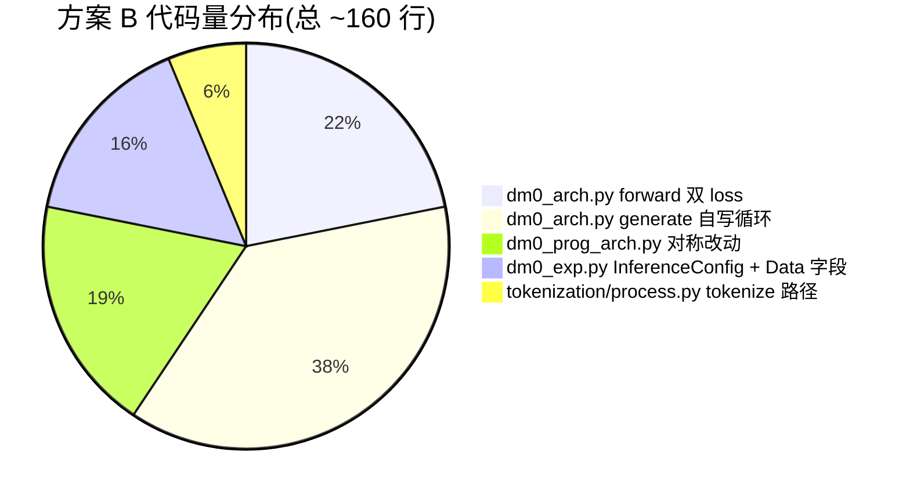

### 4.5 SFT 数据格式建议

复用 `dm0_txtAsEvry2.md §6.1` 的方案, 把 4 层 scaffolding 文本放在 assistant turn:

```jsonl
{
  "images_1": {...},
  "conversations": [
    {"from": "human", "value": "<image>Open the drawer and put the opener inside."},
    {"from": "gpt", "value":
      "<subtask>1. approach drawer handle; 2. grasp; 3. pull open; 4. release; 5. pick up opener; 6. place inside</subtask>"
      "<bbox>drawer_handle: [432, 281, 521, 367]; opener: [218, 410, 295, 487]</bbox>"
      "<traj>(456,310) → (480,295) → (510,280)</traj>"
      "<act>128 64 200 110 250 250 0 ... </act>"
    }
  ],
  "action": [[...50×7...]],
  "state": [...],
  "has_text": true,
  "has_action": true
}
```

最小 SFT 集合(用 GPT-4V 给现有 RoboChallenge 数据自动打 subtask/bbox 即可):

| 阶段 | 数据规模 | 文本字段 | 是否需要重训 action | 训练时长(8×H20) |
|------|---------|---------|---------------------|-----------------|
| **B-1** Smoke | 1K episode | 仅 subtask | 否(冻 action_expert + action_in/out_proj) | <2 小时 |
| **B-2** Light | 10K episode | subtask + bbox | 否 | ~1 天 |
| **B-3** Full | 100K+ episode | subtask + bbox + traj + discrete action | 是(全模型微调) | ~1 周 |

### 4.6 冻结策略(防止破坏 flow matching 能力)

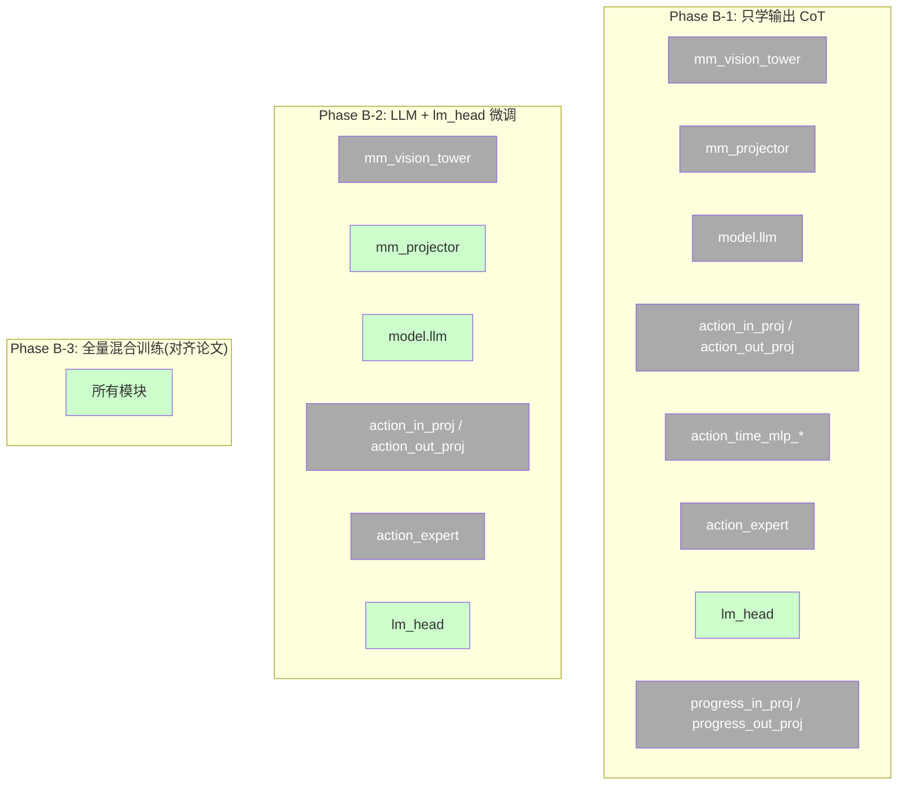

**Phase B-1** 是最保守的选择: 假设 `lm_head` tie 到 `embed_tokens`, 那这个阶段实际就是在做**只更新 embed_tokens** 的 lightweight SFT — 1K~10K episode 就能让模型学会输出格式化的 subtask 文本, 而完全不触动 action 通道权重。这与论文 §3.3 的 Specialist 训练里"先 mid-train, 后 specialist post-train"的思路一致。

### 4.7 max length 配置矩阵(关键!)

| 配置项 | 默认 | 推荐(方案 B) | 物理上界 | 谁会读它 |
|--------|------|--------------|---------|----------|
| `tokenizer_config.json: model_max_length` | 100 (table30) | 改不动 checkpoint, 在代码里覆盖到 2048 | — | DM0Tokenization 截断 prompt |
| `tokenizer.model_max_length`(运行时) | 100 | **2048** | 152701(vocab) | `tokenizer(text, max_length=...)`、`DM0Tokenization._max_len` |
| `config.json: tokenizer_model_max_length` | 2048 | 2048 不变 | 40960(RoPE) | `dexbotic_arch.py:240` 截多模态拼好的 embed |
| `DM0TrainerConfig.model_max_length` | 200 | **512~1024** | tokenizer.model_max_length | 训练时显式 override tokenizer.model_max_length |
| `DM0InferenceConfig.max_new_tokens` | (无此字段) | **256~1024**(新增) | min(40960 - prefix_len, vocab_size) | 自写 generate 的 for-loop 上限 |
| `llm_config.max_position_embeddings` | 40960 | 不动 | — | RoPE 物理硬限 |

总公式:

$$
T_{\text{output}}^{\max} = \min\!\left(\ \texttt{max\_new\_tokens},\ \underbrace{P_{\max} - L_{\text{prefix}}}_{\substack{\text{RoPE 硬限} \\ \text{减去 prefix 长度}}}\right)
$$

其中:

$$
L_{\text{prefix}} = \min\!\left(N_v + T_p,\ \underbrace{\texttt{tokenizer\_model\_max\_length}}_{=2048}\right)
$$

且:

$$
T_p \leq \texttt{tokenizer.model\_max\_length} \qquad \text{(运行时覆盖后 = 2048)}
$$

---

## 5. 推理服务接口设计

### 5.1 新增/扩展的 Flask 路由

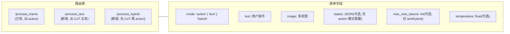

### 5.2 响应格式

```json
{
  "response": {
    "text": "<subtask>grasp drawer handle ...</subtask>...",
    "action": [[...50 × 7 ...]],
    "metadata": {
      "prefix_len": 1234,
      "generated_text_len": 87,
      "stopped_by": "eos_token | max_new_tokens | stopping_criteria",
      "diffusion_steps": 10,
      "inference_time_ms": {"prefix": 230, "text_decode": 410, "action_diffusion": 180}
    }
  }
}
```

### 5.3 与 `dexbotic/client.py` 的兼容性

现有 `DexClient` 只发 `images + text + states`, 不解析 `response.text`。方案 B 的接口保持向后兼容: `mode` 缺省走 `'action'`, 已有客户端无感升级。

---

## 6. 风险与缓解

| 风险 | 概率 | 影响 | 缓解措施 |
|------|-----|------|---------|
| `lm_head ← embed_tokens` 在 DM0-Qwen3 上效果差 | 中 | 文本输出乱码 | 方案 B-2 起允许 `lm_head` 独立训练; 或对 `lm_head.weight` 用 `xavier_normal_` 而非默认 init |
| 自写 `generate` 与 HF 的 `stopping_criteria` 接口偏差 | 低 | 个别 stop 词识别失败 | 抄 NaVILA 的 `KeywordsStoppingCriteria` 用法, 在循环里手动调用 |
| 大 `max_new_tokens` 推爆 RoPE 上限 | 极低 | OOM 或位置编码错位 | 推理时强检 `prefix_len + max_new_tokens ≤ max_position_embeddings = 40960` |
| `tokenizer.model_max_length=100` 截断了 SFT 时的 assistant turn | 高 | 训练时 CoT 永远学不到完整尾部 | 训练管线在 `DM0Tokenization.__init__` 强制 override 到 `>= 1024` |
| `DM0Tokenization` 的 `pop empty assistant turn` 逻辑误删 SFT 标签 | 高 | text_loss 全 IGNORE | 加 `training: bool` 开关, 训练态不 pop |
| Merged attention 在 KV cache 路径上和 HF GenerationMixin 不兼容 | 高 | 直接调 HF `.generate()` 报错或语义错 | **不使用** HF generate, 必须自写(同 HybridPi05) |
| Action expert 的 KV cache 在 text-decode 时无用却占显存 | 低 | 显存浪费 ~10% | text 路径只传 `[token_embeds, None]`, action_expert 通道为空(参考 HybridPi05) |
| 改动后向下兼容老 checkpoint(只跑 action) | — | 已有用户脚本断 | 默认 `mode='action'`, `return_text` 缺省 False, 严格不破坏 inference_action 路径 |
| 训练时混入纯文本样本破坏 flow matching | 中 | action 任务精度下降 | 用 `has_action` / `has_text` mask 在 loss 上隔离(完全照搬 hybrid_pi05_arch.py:466-479) |

---

## 7. 总工作量与里程碑

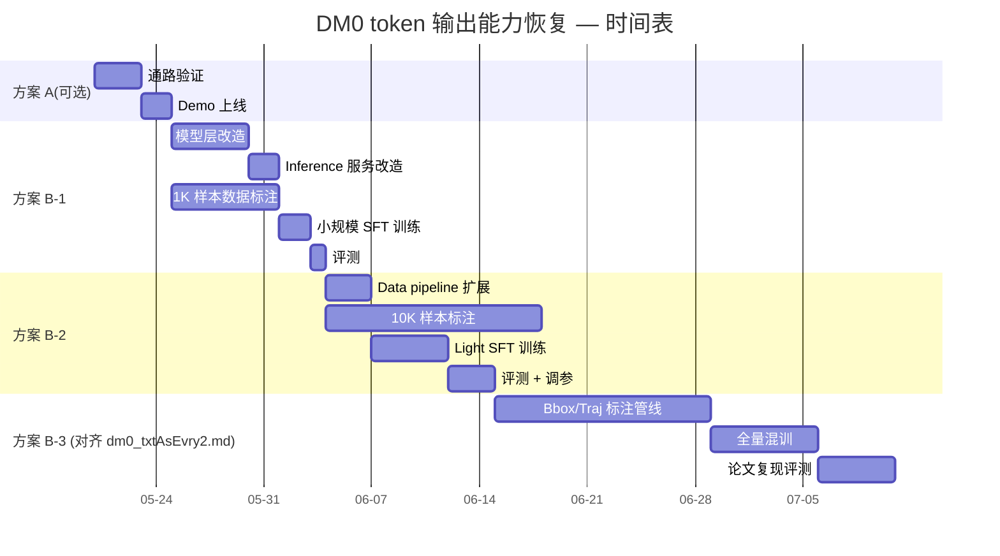

| 方案 | 模型代码 | 数据代码 | 数据标注 | 训练时长 | 预期效果 |
|------|---------|---------|---------|---------|---------|
| A | ~80 行 | 0 | 0 | 0 | 通路 OK, 输出无意义 |
| B-1 | ~100 行 | ~10 行 | 1K episode | <2h | CoT 基本可读 |
| B-2 | ~120 行 | ~30 行 | 10K episode | ~1 day | CoT + bbox 可用 |
| B-3 | ~160 行 | ~350 行(同 dm0_txtAsEvry2.md) | 100K+ | ~1 week | 接近论文 Table 5 水平 |

---

## 8. 与既有文档的关系

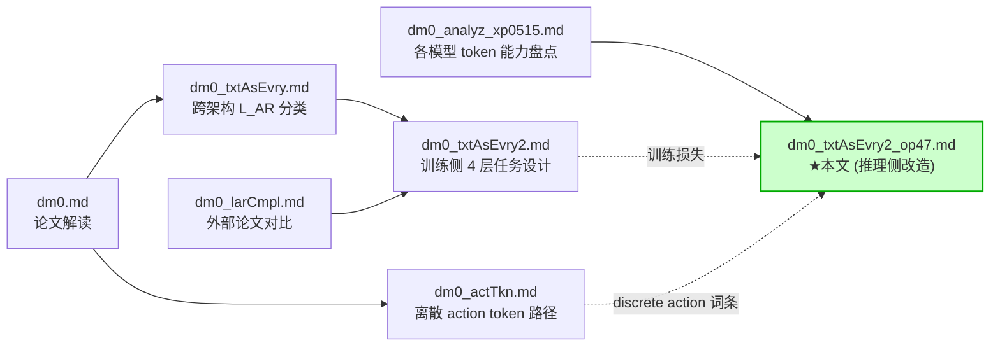

**本文的定位**:

- `dm0_txtAsEvry2.md` 已经把**训练侧** L_AR loss 怎么加、4 层 scaffolding 任务怎么标注讲透
- 本文专门解决**推理侧** "如何把 lm_head 真正接出 token + 自写 generate 循环 + 配置入口暴露", 与训练侧设计形成闭环
- 同时给出了一条**不重训也能跑通的 fallback 路径**(方案 A)和**最小 SFT 路径**(方案 B-1), 方便用户从小到大渐进验证

---

## 9. 一句话总结

> **要让 DM0 在推理时真正能输出 CoT/token, 必须做 3 件事**:
>
> 1. 给 `DM0ForCausalLM` 自写一个 `generate()` 方法(merged attention 让 HF 标准 `GenerationMixin` 不能直接用), 直接抄 `HybridPi05ForCausalLM.generate` 的循环结构;
> 2. 把 `self.lm_head` 从"占位"升级为真正使用的输出层 — 最小做法是与 `model.llm.embed_tokens` weight-tie(方案 A 零训练); 想要可读输出则必须做 SFT 训练 L_AR(方案 B);
> 3. 把 `DM0InferenceConfig` 加上 `max_new_tokens` / `temperature` / `do_sample` / `return_text` / `text_model_max_length` 等字段, 并在 `_load_model` 时把 `tokenizer.model_max_length` 从 100 抬到 2048(`table30_generalist_aloha` 等 specialist checkpoint 特别需要), 否则连 prompt 都装不下。
>
> 三条做完, 输出 token 数的上限由公式 $T_{\text{output}}^{\max} = \min(\texttt{max\_new\_tokens}, \texttt{max\_position\_embeddings} - L_{\text{prefix}})$ 控制 — 远大于此前 4096/2048 的争论范畴。
