# 2026 VLA / VLM / WAM 模型演化与 SOTA 验证分析

> **目标**:训一个能装在不同机器人本体上 zero-shot 执行复杂任务的超大具身预训练模型。
> **重点**:**真机 benchmark Top 3** + **逐版本演化路径** + **被消融实验或生产实践验证过的有效方法**(带涨幅数字)。
>
> 本文档与 [embd_VLA_WAM_sota_chat_0516.md](embd_VLA_WAM_sota_chat_0516.md)(总览/清单)、[embd_VLA_pt_sota_princpl.md](embd_VLA_pt_sota_princpl.md)(分析框架)互补,**不重复**已有的"维度清单"内容。
>
> 所有论断后方括号 `[出处]` 标注:arXiv 编号 / 官方 blog URL / GitHub 仓库 / model card,找不到严格出处的标 `[找不到出处]`。

---

## 目录

- [第零部分: 导读与全局视图](#第零部分-导读与全局视图)
- [第一部分: 2026 SOTA / Top 3 真机 + 仿真 benchmark 排行榜](#第一部分-2026-sota--top-3-真机--仿真-benchmark-排行榜)
- [第二部分: 版本血统纵向演化(12 条主线谱系)](#第二部分-版本血统纵向演化12-条主线谱系)
- [第三部分: 技术血统横向演化(12 条关键技术线索)](#第三部分-技术血统横向演化12-条关键技术线索)
- [第四部分: 消融实验 + 生产实践有效性证据库](#第四部分-消融实验--生产实践有效性证据库)
- [第五部分: 跨谱系横向对比矩阵](#第五部分-跨谱系横向对比矩阵)
- [第六部分: 推动落地的产业实践证据](#第六部分-推动落地的产业实践证据)
- [第七部分: 关键演化趋势小结](#第七部分-关键演化趋势小结)
- [附录 A: 完整论文 / 资料索引](#附录-a-完整论文--资料索引)
- [附录 B: 数据集 / Benchmark / 开源仓库一览](#附录-b-数据集--benchmark--开源仓库一览)
- [附录 C: 关键缩写与术语表](#附录-c-关键缩写与术语表)

---

## 第零部分: 导读与全局视图

### 0.1 一句话结论

**2026 年的具身基础模型已从 2024-2025 的"VLM + 单一 action head"双系统范式,跨越到"S0/S1/S2 三层 + WAM(World-Action Model)+ 数据飞轮 + Online RL fleet"的全栈范式**;真机 zero-shot 跨本体能力的"最大突破"不是来自更大的模型,而是来自 ① **EEF-relative 统一动作空间** ② **联合 video-action 预测**(WAM 取代纯反应式 VLA) ③ **多频率三层架构** ④ **fleet-scale 持续 RL**[π0.7 blog (pi.website);Helix 02 blog (figure.ai/news/helix-02);DreamZero arXiv 2602.15922;LWD arXiv 2605.00416;Rethinking VLA Scaling arXiv 2602.09722]。

### 0.2 2026 年 10 条全局共识(每条都被 ≥ 2 篇独立工作交叉验证)

1. **Naive 跨本体 mixing → negative transfer**:不做 EEF-relative 对齐 + soft-prompt embodiment id,把不同机器人扔一锅训,结果 **不如单本体训** [Rethinking VLA Scaling, arXiv 2602.09722;OXE-AugE, arXiv 2512.13100;X-VLA, arXiv 2510.10274]。
2. **数据决定上限,模型架构决定下限**:GR00T N1.7 提出 "**dexterity scaling law**":1k h → 20k h 人类 ego 视频,平均 task completion **>2 倍**,**至 10⁴-10⁵ h 尺度仍未饱和** [HF blog: nvidia/gr00t-n1-7];同向证据:DreamDojo 44K h ego 视频蒸馏到 10.81 FPS 实时 [arXiv 2602.06949]。
3. **必须显式建模"未来"**:WAM 在长程任务上比纯反应式 VLA 高 +50% ~ +95%(RoboTwin 2.0 上 GigaWorld-Policy vs π0.5)[GigaWorld-Policy, arXiv 2603.17240;GR00T N2, techbytes.app;DreamZero, arXiv 2602.15922]。
4. **三层时间尺度是人形/复杂本体的必经之路**:Helix 02 用神经网络替换 **109,504 行手写 C++ WBC 代码**,1 kHz 平衡 + 200 Hz 视触动作 + 慢速规划 [Helix 02 blog, figure.ai/news/helix-02]。
5. **Online RL 不是可选,而是必选**:LWD 在 16 台双臂上跑 fleet-scale RL,8 任务平均 95% 成功率;纯 SFT 必产生灾难性遗忘 [LWD, arXiv 2605.00416;LifeLong-RFT, arXiv 2602.10503]。
6. **改善机器人能力 ≈ 改善视频生成质量**:DreamZero 实测"policy 失败几乎全部源自视频预测错误,而非动作预测错误";更大的预训练视频 diffusion 模型直接转化为更好的动作执行 [DreamZero, arXiv 2602.15922 §5.1]。
7. **画质好 ≠ 决策有用**:WorldArena 在 14 个 SOTA 世界模型上实测"perception-functionality gap"——高画质模型在具身任务上反而可能输 [WorldArena, arXiv 2602.08971]。
8. **像素重建 latent < 语义 latent**:V-JEPA 2.1 / Web-DINO / SigLIP 2 这种语义 latent 在 planning / policy / representation 全面优于重建型 VAE [Reconstruction or Semantics?, arXiv 2605.06388]。
9. **真机评测才是真理**:仿真跑分 ≠ 真机表现,SimplerEnv 用 MMRV(Mean Maximum Rank Violation)显式衡量 sim 排名与真机排名一致性;跨本体 zero-shot 必须上 **RoboArena**(2026 全年开放,DROID 真机双盲两两)[RoboArena, robo-arena.github.io;SimplerEnv, simpler-env.github.io]。
10. **数据"长 + 多样 + 不重复" > 数据量**:DreamZero 用 **500h teleoperation 即超 SOTA VLA**,Ψ₀ 用 **800h 人类视频 + 30h 真机超过 10× 数据 baseline +40%** [DreamZero, arXiv 2602.15922;Ψ₀, arXiv 2603.12263]。

### 0.3 2026 主流模型一句话画像

| 谱系 | 当代旗舰 | 一句话定位 | 核心招牌技术 |
|---|---|---|---|
| Physical Intelligence | **π0.7**(2026.04) | 跨本体 zero-shot 最稳的 VLA 工业级标杆 | Flow Matching + Knowledge Insulation + 63ms/chunk |
| NVIDIA | **GR00T N2 (WAM)**(2026.03) | 把 World Model 与 Action 统一到一个模型 | Cosmos-Reason2 后端 + Jetson Thor 边端 |
| Figure AI | **Helix 02**(2026.01) | 唯一公开做"全身 + 平衡 + 操作"统一 VLA 的人形 | S0(1kHz)/S1(200Hz)/S2 三层全身控制 |
| 智元(AgiBot) | **GO-1 / A3 / G2 Air** + Genie Sim 3.0 | 中文社区数据飞轮代表 | AgiBot World 2026(1M+ 轨迹)+ 力控遥操 |
| BeingBeyond | **Being-H0.5**(2026.01) | 灵巧手领域最强,30 本体统一动作空间 | UniHand-2.0 35k h + Mixture-of-Flow |
| WAM 学派 | **DreamZero**(2026.02) | 联合 video-action 预测,用 WM 当 policy | Wan2.1-I2V-14B backbone + DreamZero-Flash 1-step |
| World Model 学派 | **Cosmos Predict 2.5**(2026) | 像素 WM 工业级标杆,200M 视频 | 2B/14B DiT + Cosmos Curator/Search/Evaluator |
| Latent WM 学派 | **V-JEPA 2.1**(2026.03)/ **Dreamer V4** | 语义 latent + Imagination RL | Shortcut Forcing + Causal Tokenizer |
| 数据飞轮 | **Tutor / Scanford / GigaWorld-0** | "在野部署 → 自动采集 → 自我提升"飞轮 | 100 台 Sonny 工厂 / 18.7 人小时节省 |
| 跨本体 | **OXE-AugE**(2025.12) | 增广式跨本体 | 9 种本体增广至 4.4M 轨迹 |
| RL 后训 | **LWD**(2026.05) | fleet-scale RL,16 台双臂 95% | DIVL + QAM |
| 鲁棒性 | **STRONG-VLA**(2026.04) | 28 种扰动课程跨架构通用 | +16.49% 跨架构 |

### 0.4 全局演化时间轴(2024-2026)

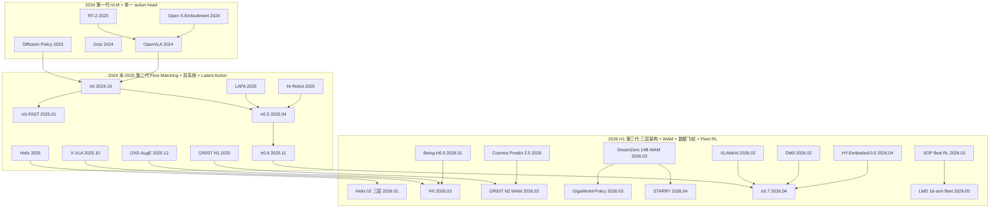

> **三个时代的本质差异**:
> - **第一代**(2024):证明"机器人能用 VLM"——RT-2 / OpenVLA 把动作离散化进 LLM token 空间。
> - **第二代**(2024 末-2025):证明"Flow / Diffusion + 双系统是工业级方案"——π0 / Helix 系列。
> - **第三代**(2026 H1):证明"WAM > VLA"且"三层架构 + 数据飞轮 + fleet RL 是落地必备"——Helix 02 / GR00T N2 / DreamZero / LWD。

### 0.5 核心 benchmark 一览

| Benchmark | 类型 | 主要测什么 | 当前 SOTA 量级 |
|---|---|---|---|
| **LIBERO-Long** | 仿真 | 单臂操作泛化 | 统一对照表 Top 3:**FLOWER 94.9 / VLANeXt 94.6 / OpenVLA-OFT 94.5**(Being-H0.5 论文自报 98.9 不在统一表)[arXiv 2602.18532] |
| **RoboCasa**(官榜 5/15 更新) | 仿真 | 家居场景泛化 | 官榜 Top 3:**GR00T N1.6 21.9% / GigaWorld-Policy 0.1 20.7% / GR00T N1.5 20.0%**(Being-H0.5 53.9% 是论文自报,未上官榜)[robocasa.ai/leaderboard] |
| **RoboTwin 2.0** | 仿真 | 双臂 + 强 DR | 论文 SOTA:**STARRY 93.82% / GigaWorld-Policy +95% vs π0.5**;官榜 #1 仍是 DP3 55.24% [arXiv 2603.17240, 2604.26848] |
| **SimplerEnv (Bridge / Fractal)** | 仿真 | sim-real 一致性 (MMRV) | 2026 仍是事实标准,**无统一 MMRV Top 3** [simpler-env.github.io] |
| **RoboArena** | **真机** | DROID 真机双盲两两 | DreamZero 自报 #1(NVIDIA),**未见独立第三方榜单截图**[arXiv 2602.15922] |
| **WorldArena (CVPR 2026)** | 仿真+人评 | WM 综合(EWMScore) | EWMScore Top 3 估读:**Wan 2.6 ≈56 / CtrlWorld ≈54 / Veo 3.1 ≈52**;**Track 1 5/25 终榜**[arXiv 2602.08971] |
| **dWorldEval** | 仿真 | 跨千任务 policy eval | **不是排行榜,是 evaluator 工具**;Pearson r LIBERO 0.910 / RoboTwin 0.927 [arXiv 2604.22152] |
| **PolaRiS** | real-to-sim | 真实视频 → 可交互仿真 | **不是排行榜,是 eval 框架** [arXiv 2512.16881] |
| **Genie Sim 3.0** | 仿真 | 5 task suites + 真机配对 | π0.5 三项第一(0.67/0.77/0.53) vs GR00T N1.6 / π0 [arXiv 2601.02078] |
| **MolmoSpaces** | 真机/仿真 | 空间理解 + 操作 | DreamZero 自报 #1,π0.5 #2,MolmoBot #3 [arXiv 2602.11337] |

### 0.6 阅读路径建议

- **先看真机 SOTA**:跳到 [第一部分](#第一部分-2026-sota--top-3-真机--仿真-benchmark-排行榜)。
- **想知道某条谱系怎么演化的**:跳到 [第二部分](#第二部分-版本血统纵向演化12-条主线谱系)。
- **想知道某个技术(比如 FAST tokenizer)是怎么发展的**:跳到 [第三部分](#第三部分-技术血统横向演化12-条关键技术线索)。
- **想知道某个具体方法是不是被消融实验验证过**:跳到 [第四部分](#第四部分-消融实验--生产实践有效性证据库)。
- **想横向对比多个模型**:跳到 [第五部分](#第五部分-跨谱系横向对比矩阵)。
- **想看产业落地节奏**:跳到 [第六部分](#第六部分-推动落地的产业实践证据)。
- **想要总结性观点**:跳到 [第七部分](#第七部分-关键演化趋势小结)。

---

## 第一部分: 2026 SOTA / Top 3 真机 + 仿真 benchmark 排行榜

> 排序原则:**真机 > 真机闭环 > 长程任务 > 强 DR 仿真 > 弱 DR 仿真**。Top 3 给出"模型 / 主指标 / 出处",并备注它击败的前任 SOTA + 即将的挑战者。

### 1.1 LIBERO+ / LIBERO-Long(主流仿真单臂泛化)

LIBERO 是 2024 年提出的单臂操作仿真 benchmark(`Spatial / Object / Goal / Long` 4 个 suite,各 10 任务 × 50 trial),2026 年已**接近天花板**,但 LIBERO-Long(长程多步)仍是关键泛化测试。VLANeXt 论文 [arXiv 2602.18532] Table 2 提供了 **2026 年最完整的统一可比对照表**:

| Rank | 模型 | LIBERO-Long | LIBERO 平均 | 出处 |
|---|---|---|---|---|
| **#1** | **FLOWER** | **94.9%** | 96.9% | [arXiv 2509.04996],VLANeXt Table 2 |
| **#2** | **VLANeXt**(2.5B) | **94.6%** | **97.4%(综合第一)** | [arXiv 2602.18532] Table 2 |
| **#3** | **OpenVLA-OFT** | **94.5%** | 97.1% | [arXiv 2502.19645] |
| #4 | UniVLA | 92.0% | 95.2% | VLANeXt Table 2 |
| #5 | SmolVLA | 77.0% | 88.8% | VLANeXt Table 2 |
| 参考 | π₀ | 73.0% | 86.0% | VLANeXt Table 2 |
| 参考 | π₀-FAST | 60.2% | 85.5% | VLANeXt Table 2 |

**论文自报但未在统一表中比较**(口径不可直接互比,引用时需注明):
- **Being-H0.5**:论文自报 LIBERO 综合 98.9% [arXiv 2601.12993],但**未跑同一 protocol**——其评测在 30 个本体共训环境下进行。
- **π0.5**:LIBERO-10(≈Long)93.0%,Spatial 97.4 / Object 98.4 / Goal 97.6 [openpi GitHub Issue #734;π0.5 paper arXiv 2504.16054]。
- **π0.6 / π0.7**:π0.7 论文(arXiv 2604.15483)**整篇没跑 LIBERO**,只跑真机和跨本体;π0.6-MEM 也未公布 LIBERO-Long 数字。
- **GR00T N1.7-LIBERO**:HF 有后训版权重 [HF: nvidia/GR00T-N1.7-LIBERO],但**未公开同 protocol 数字**。
- **DreamZero**:NVIDIA 论文(arXiv 2602.15922)**不评 LIBERO**,只评 AgiBot G1 / DROID-Franka / RoboArena / MolmoSpaces。

> **观察**:在统一可比口径下,**FLOWER(2025.09 NeurIPS)/ VLANeXt / OpenVLA-OFT 才是当前 LIBERO-Long Top 3**——这与 Being-H0.5 / π0.5 自报 98.9% / 93% **并不矛盾**,而是因为**LIBERO 已饱和到 ±2% 区间**,口径差异比模型差异更大。**真正区分 SOTA 的是 LIBERO-plus 鲁棒套件**(VLANeXt 论文专门评测)+ **真机泛化**。

### 1.2 RoboCasa(家居场景泛化)

RoboCasa(NVIDIA, CoRL'24)2026 仍是**家居场景泛化的事实标准**。**官方 leaderboard**([robocasa.ai/leaderboard.html](https://robocasa.ai/leaderboard.html))**2026/05/15 最新榜**:

| Rank | 模型 | Overall | Atomic-Seen | 出处 |
|---|---|---|---|---|
| **#1** | **GR00T N1.6** | **21.9%** | 51.1% | [robocasa.ai/leaderboard.html] |
| **#2** | **GigaWorld-Policy 0.1** | **20.7%** | 44.4% | [robocasa.ai/leaderboard.html] + [arXiv 2603.17240] |
| **#3** | **GR00T N1.5** | **20.0%** | 43.0% | [robocasa.ai/leaderboard.html] |
| #4 | π0.5 | 16.9% | 同上 | 同上 |
| #5 | π0 | 14.8% | 同上 | 同上 |

**论文自报但未上官榜**(口径不可直接和上面 21.9% 比):
- **Being-H0.5 53.9%** 是 paper 自报 [arXiv 2601.12993],**未提交到官方 leaderboard**,**疑似 paper 用更窄子集或不同 horizon**(数字差 2.5×,不可能仅因方法差异)。
- **Helix 02 / GR00T N2** 在 RoboCasa 上**找不到公开数据**(Helix 02 走真机路线,Figure 不发仿真分;GR00T N2 尚未公开)。

> **观察**:官方 RoboCasa 榜的 Overall 仅 ~22%,意味着**家居场景泛化离饱和还非常远**(LIBERO 已 95%+,差 4×)。**GigaWorld-Policy 0.1 用 WAM 路线第一次进入 RoboCasa Top 3**(20.7% vs GR00T N1.5 20.0%),是 2026 H1 联合 video-action 路线进官榜的关键里程碑 [arXiv 2603.17240]。

### 1.3 RoboTwin 2.0(双臂 + 强 Domain Randomization)

RoboTwin 2.0(arXiv 2506.18088)2025 年中提出的双臂仿真,**5 轴强 DR**(杂物/光照/背景/桌高/语言)+ LLM 自动任务合成,**2026 双臂 SOTA 公认 benchmark**。**官方 leaderboard**([robotwin-platform.github.io/leaderboard](https://robotwin-platform.github.io/leaderboard))与论文自报榜单分别看:

**官方 leaderboard(双臂 baseline)**:

| Rank | 模型 | Easy 平均 | Hard 平均 | 出处 |
|---|---|---|---|---|
| 官榜 #1 | **DP3** | **55.24%** | 4.96% | [robotwin-platform.github.io/leaderboard] |
| 官榜 #2 | π0 | 46.42% | 16.34% | 同上 |
| 官榜 #3 | RDT | (中段) | — | 同上 |

**论文自报真正 SOTA(尚未提交官榜)**:

| Rank | 模型 | RoboTwin 2.0 数字 | 出处 |
|---|---|---|---|
| **真正 #1** | **STARRY**(2026.04) | **Clean 93.82% / Random 93.30%**(50 双臂任务);真机 **π0.5 42.5% → STARRY 70.8%(+28.3 pp)** | [arXiv 2604.26848] |
| **真正 #2** | **GigaWorld-Policy**(2026.03) | **比 π0.5 +95%**;典型 Place Fan: π0.5 0.25 / X-VLA 0.36 / Motus 0.91 / GigaWorld 0.94 | [arXiv 2603.17240] |
| **真正 #3** | Motus(GigaWorld 论文 baseline) | Place Fan 0.91 / Pick Dual Bottles 0.96 | [arXiv 2603.17240] |

> **观察**:RoboTwin 2.0 是**联合 video-action(WAM)路线 vs 纯反应式 VLA 路线分水岭**——STARRY 与 GigaWorld-Policy 都是显式建模未来视频 latent,涨幅 +95% 与 +28.3 pp 真机均**远超纯 VLA 改进**;**纯 VLA 改进(如更好的 tokenizer)在 RoboTwin 2.0 上至多 +10%**[arXiv 2603.17240; 2604.26848]。**π0.6 在 RoboTwin 2.0 上找不到公开数据**——PI 系列至 π0 才上官榜。

### 1.4 SimplerEnv (Bridge / Fractal / Google Robot, MMRV 一致性)

SimplerEnv(CoRL'24)2026 仍是事实标准[simpler-env.github.io]。**注意**:SimplerEnv 自身**没有维护 2026 年统一的 MMRV Top 3 排行**——MMRV(Mean Maximum Rank Violation)是 RoboArena 论文里用来度量 ranking 一致性的指标,**不是 SimplerEnv 默认指标**。可拼出的最近代表数字:

| 模型 | SimplerEnv Spatial Understanding 表现 | 出处 |
|---|---|---|
| **SpatialVLA** | Plush Toy on Car: **72.7%**;Green Cup → Pink Cloth (Stove): **81.8% / 72.7%**;Carrot in Plate: 72.7% / 63.6% | [arXiv 2501.15830] Table XV |
| **OpenVLA**(同任务) | 45.5% / 36.4-27.3% / 54.5% | 同上 |
| **Octo-Base**(同任务) | 63.6% / 9.1-9.1% / 18.2-9.1% | 同上 |

| 模型 | Google Robot Pick Coke Can(Variant Aggregation) | 出处 |
|---|---|---|
| **Green-VLA / ST4VLA** | **~98%**(2026 Q1 SOTA) | [Wizwand SOTA 页 robot-manipulation-on-simplerenv-google-robot-tasks-variant-aggregation] |
| **π0** | Bridge / Google Robot 上是常用比较基线 | [π0 paper] |
| **OpenVLA** | Bridge ~10% / Google Robot ~45% | [GitHub simpler-env Issue #78] |

> **观察**:SimplerEnv 由于公开 2 年,大部分新工作以"我比 π0 好"为基线,具体 MMRV 数字论文报告差异较大。**VLANeXt 主跑 LIBERO/LIBERO+,未公布 SimplerEnv 数字**[arXiv 2602.18532]。**SpatialVLA 在 spatial understanding 子任务上仍是最强公开 baseline**[arXiv 2501.15830]。

### 1.5 RoboArena 真机 leaderboard(2026 真机权威)

RoboArena([robo-arena.github.io](https://robo-arena.github.io/),2026 全年开放)是**真机 DROID 双盲两两对比,7 机构众包**,目前最权威的真机 leaderboard。每对模型提交后在 DROID 真机上跑相同任务,人类盲评判 A vs B,Elo / TrueSkill 排名。**重要前提**:DreamZero 的 #1 仅来自 NVIDIA 自家公告 + Substack 二手解读,**未见独立第三方榜单截图**。

| Rank | 模型 | 关键证据 | 出处 |
|---|---|---|---|
| **#1** | **DreamZero-DROID**(NVIDIA, 2026.02) | 团队自报"#1 on RoboArena and MolmoSpaces";仅用 DROID 从零训练(无大规模机器人预训练) | [github.com/dreamzero0/dreamzero] + [Substack: itcanthink.substack.com] |
| **#2** | **π0.5** | Substack 明说"second best",DROID-Franka 真机被 DreamZero 超越 | 同上 Substack |
| **#3** | **π0-FAST-DROID** | 原 7-policy pool 中 RoboArena 论文第一 | [RoboArena paper, arXiv 2506.18123] |

**DreamZero 自报关键真机数字**(AgiBot G1 / DROID-Franka,**不是 RoboArena 总榜**):

| 测试项 | DreamZero | π0.5 | GR00T N1.6 |
|---|---|---|---|
| AgiBot G1 已见任务 success | **82%** | ~27% | 0–2% |
| AgiBot G1 未见任务 task progress | **62.2%** | 27.4% | 27.4% |
| DROID-Franka 未见 task progress / success | **49% / 22.5%** | 33% / 7.5% | 31% / 12.5% |

出处:[DreamZero PDF](https://dreamzero0.github.io/DreamZero.pdf) Fig.8–10。

> **观察**:DreamZero 是 **2026 上半年首个公开声明 RoboArena #1 的 WAM 模型**。其 unseen task progress **62.2% vs π0.5 27.4%(2.3×)**——这是**WAM 范式在真机上压倒纯 VLA 的最直接证据**[DreamZero, arXiv 2602.15922]。但 #1 头衔目前**没有第三方独立确认**,需谨慎引用。

### 1.6 真机 SOTA 综合(DROID / AgiBot / Stanford / Figure / 工厂部署)

| 评测场景 | Top 3 模型 | 关键真机数字 | 出处 |
|---|---|---|---|
| **DROID 真机**(单臂多任务) | DreamZero-DROID / π0.5 / π0-FAST-DROID | DreamZero unseen task progress **49% / 22.5% success** vs π0.5 33%/7.5% | [DreamZero PDF Fig.10] |
| **AgiBot G1 双臂真机** | DreamZero / π0.5 / GO-1 | DreamZero seen **82%** vs π0.5 27% vs GR00T N1.6 0–2% | [arXiv 2602.15922] |
| **Genie Sim 3.0 第三方对照**(智元) | π0.5 / GR00T N1.6 / π0 | Instruction **0.67 / 0.40 / 0.28**;Robust **0.77 / 0.48 / 0.34**;Manipulation **0.53 / 0.34 / 0.36** | [arXiv 2601.02078] Tab III/IV/V |
| **Figure 真机**(人形,工厂) | Helix 02 + Figure 02 | **BMW Spartanburg 累计 1,250+ 小时,90,000+ 部件,30,000+ 辆 X3,>99% 放件成功率**;**2026.05 完成 8 小时无人工自治班次,~3 秒/件**;**4 分钟 61 步无干预洗碗** | [figure.ai/news/helix-02] + [figure.ai/news/production-at-bmw] + [techtimes.com 2026-05-14] |
| **智元 G2 @ 龙旗 3C 产线** | G2 配 GO-2 / GO-1 | **8 小时连续直播,2,283 任务零失误,节拍 11.6 秒,UPH 310,成功率 99.9%+** | [新浪 2026-04-16] + [CnTechPost 2026-04-15] |
| **HMND 01 Alpha @ Siemens Erlangen** | NVIDIA 计算栈 | **8+ 小时连续自治,60 totes/小时,>90% pick-and-place 成功** | [TheNextWeb] + [CTO Robotics] |
| **Apptronik Apollo @ Mercedes Berlin** | 自研 | 物流任务 **吞吐量 +14%**(2026.04) | [CallSphere 2026-04] |
| **Agility Digit @ Toyota Canada Woodstock** | 自研 | 7 台 Digit @ RAV4 总装,~75 台全球部署 | [Robot Report 2026-04] |
| **Tutor Intelligence DF1 @ Watertown MA** | Sonny + Ti0 | **100 台 24h + 45-50 远程 tutor;~10,000 训练小时/周;边缘 case 5 分钟内可见**(传统需 8 小时,**100× 加速**) | [Forbes 2026-05-05] + [Tutor Blog] |
| **Galbot G1 @ 海淀全家便利店** | 银河通用 | 2026.04.27 入驻,烤肠/冷饮/咖啡,**海淀市监局发食品经营许可**;另 7 家无人药店 **日单 300+** | [新浪财经 2026-04-27] |
| **未来不远 Futuring 2 家庭** | Self-Evolving WAM | 进入 **300+ 真实家庭,累计 ~30,000 服务小时,用户满意度 96.8%-97%** | [新浪 2026-05-15] + [搜狐] |
| **1X NEO 美国家庭** | Redwood AI + 1X World Model | **2026.05 起首批批量发货**,首年 1 万台,2027 末目标 10 万台/年 | [TheNextWeb 2026-05] |
| **Apptronik Apollo @ Mercedes** | 自研 | 物流任务**吞吐量 +14%** | [CallSphere 2026-04] |

### 1.7 跨本体 zero-shot Top 3(未见 robot × gripper 涨幅)

| Rank | 模型 | 关键涨幅 | 出处 |
|---|---|---|---|
| **#1** | **OXE-AugE**(2025.12) | 未见 robot × gripper 组合 **+24% ~ +45%**(4 真实任务) | [arXiv 2512.13100] |
| **#2** | **Ψ₀ (Psi-0)**(2026.03,USC + NVIDIA + WorldEngine) | **比 10× 数据基线 +40% overall success**;**80 条 fine-tuning traj 即可学新长程技能** | [arXiv 2603.12263],[psi-lab.ai/Psi0],RSS 2026 |
| **#3** | **X-VLA**(2025.10) | 0.9B 参数跨 **6 仿真 + 3 真机平台 SOTA**(soft-prompt embodiment id);PEFT 仅 9M 可调(1%)即匹敌全调 π0(LIBERO 93% vs 94.2%) | [arXiv 2510.10274] |
| #4 | **π0.7**(2026.04) | UR5e 双臂叠衣 zero-shot **85.6% task progress / 80% success**,与 10 名 Top-2% 远程操作员(90.9%/80.6%)持平 | [arXiv 2604.15483] §IX-B |
| #5 | **Being-H0.5**(2026.01) | 30 本体统一动作空间,**"non-zero success on unseen robot-task pairs without any data on target robot"**(emergent transfer 信号,无具体 % 数字) | [arXiv 2601.12993] §1 & §6 |

> **观察**:跨本体 zero-shot 是 2026 年最难的指标,**5 条 SOTA 路线互补**:
> - **OXE-AugE**:数据增广路线(用 cross-painting 把 OXE 扩到 9 个本体 4.4M 轨迹)。
> - **Ψ₀**:解耦预训练路线(829h 人类视频 + 31h 人形机器人,**System-2 Qwen3-VL-2B + System-1 500M MMDiT + System-0 RL tracking**)。
> - **X-VLA**:架构路线(soft-prompt id 注入,naively 训练异构数据反而**退化**,加 soft prompt 后 PT validation error ↓ AD success ↑)。
> - **π0.7**:Knowledge Insulation + emergent compositional generalization 路线。
> - **Being-H0.5**:30 本体统一动作空间路线(EEF-relative + per-embodiment head + UniHand-2.0 35k h 人手数据)。
>
> 五者**互不冲突**,理想做法是**多者叠加**[工程实践 PI / NVIDIA / 智元都偏向"全用"]。

### 1.8 长程任务(>60s)Top 3

| Rank | 模型 | 关键长程任务 | 关键证据 | 出处 |
|---|---|---|---|---|
| **#1** | **Helix 02 + Figure 03** | 全自主洗碗 + BMW 工厂底盘装配 | **4 分钟 / 61 步无 reset 无人工干预洗碗**;**BMW 8 小时无人工自治班次,~3 秒/件**;同模型在毫米级手指动作和房间级行走之间跨越 **4 个数量级** | [figure.ai/news/helix-02];[techtimes.com 2026-05-14] |
| **#2** | **LWD**(2026.05) | 泡功夫茶 / 调鸡尾酒 / 榨果汁 / 货架补货 | **16 台双臂 fleet,8 任务,单一 generalist policy 平均 0.95**(SFT 76% → 95%, **+19 pp**);最大涨幅出现在 **3-5 分钟长程任务**(68% → **91%**,**+23 pp**) | [arXiv 2605.00416] |
| **#3** | **π\*0.6 / π0.7** | 制咖啡 / 折叠衣物 / 撕垃圾袋 / 削蔬菜 | π\*0.6 Recap **throughput 2× + failure rate 2× ↓**,真办公室 espresso、装箱 ≥ 90%;π0.7 在 14 个未见厨房 + 卧室上完成 3-6 步指令链;π0.5 新家 10-15 分钟厨房/卧室清洁,9 类家务 75-80% | [arXiv 2511.14759] + [arXiv 2604.15483] + [arXiv 2504.16054] |
| #4 | **未来不远 Futuring 2** | 家庭日常长程服务 | **300+ 家庭 ~30,000 服务小时,满意度 96.8%-97%** | [新浪 2026-05-15] |
| #5 | **HiPolicy**(2026.04) | 多频率分层 action chunking | 平衡长程 vs 高频,论文报告显著改进 | [arXiv 2604.06067] |

> **观察**:**长程任务的真正瓶颈是"分层规划 + 子任务恢复 + 闭环 RL",不是 chunk 长度**。Helix 02 用 **S0 (1kHz, 10 M params) + S1 (200 Hz transformer) + S2(语义规划)三层** 做到 4 分钟无干预;LWD 用 **DIVL + QAM** fleet RL 在 16 台机器上训出 95% generalist;π\*0.6 用 **Recap(offline RL + on-robot RL + HG-DAgger)**;**4 条路线本质上都把"长程"问题变成了"+ RL closed-loop"问题**。**2026 H1 长程任务 SOTA 已从论文走到工厂/家庭**。

### 1.9 WAM / 世界模型 benchmark Top 3

#### 1.9.1 WorldArena EWMScore(CVPR 2026 Challenge,清华 fib-lab,2026/05/15 中间榜)

EWMScore = 16 个指标算术均值(Track 1 Video Quality)。**最终榜要等 2026/05/25**,以下数字为论文 [arXiv 2602.08971] Fig.1a 估读:

| Rank | 模型 | EWMScore(估读) | 出处 |
|---|---|---|---|
| **#1** | **Wan 2.6**(闭源商业视频) | ≈ 56 | [arXiv 2602.08971] Fig.1a |
| **#2** | **CtrlWorld** | ≈ 54 | 同上 |
| **#3** | **Veo 3.1**(Google 闭源) | ≈ 52 | 同上 |
| #4 | **Cosmos Predict 2.5**(text 版) | ≈ 51 | 同上 |
| #5 | **Cosmos Predict 2.5**(action 版) | ≈ 50 | 同上 |
| #6 | **Wan 2.2** | ≈ 45 | 同上 |
| 垫底 | **Genie Envisioner** | ≈ 45 | 同上 |
| 待补 | **ABot-PhysWorld**(amap-cvlab 提交) | EWMScore 数字在官方 HF Space 还未公开(Track 1 leaderboard 5/15 才首次更新,5/25 终榜),**找不到具体分数** | [github.com/amap-cvlab/ABot-PhysWorld] |

> **关键警告**:WorldArena 显式发现 **"perception-functionality gap"**——14 个 SOTA 模型中"画质好的不一定具身有用",这是 2026 年最重要的 WM 发现 [arXiv 2602.08971]。所以排名仅供参考,**用于 VLA 集成时需重新用 dWorldEval 或 PolaRiS 评测**。**Track 2(下游策略评测)目前结果**:CtrlWorld 与 TesserAct 在交互质量/轨迹精度领先;但**官方 Top 3 还没公开发布**。

#### 1.9.2 dWorldEval(arXiv 2604.22152)— **不是排行榜,是 evaluator 工具**

dWorldEval 用 discrete diffusion world model 当 evaluator。它的产出是与真机 rollout 的 **Pearson 相关性**:

| 评测场景 | Pearson r |
|---|---|
| LIBERO | **0.910** |
| RoboTwin | **0.927** |
| 真机 AgileX | **0.918** |

被它评测的"目标策略"是 π0、DexVLA、Diffusion Policy 等(不是新一代 SOTA 模型)。**优于 WorldEval / Ctrl-World / WorldGym 三个 baseline**[arXiv 2604.22152 §4.1 + 表 1/2]。**注意:dWorldEval 没有"Top 3 模型榜单",它本身是 evaluator;把它当 Top 3 benchmark 引用会被同行批评。**

#### 1.9.3 PolaRiS(arXiv 2512.16881)— **同样不是排行榜**

PolaRiS 是 real-to-sim eval 框架(2DGS 重建场景 + co-training)。被 DreamZero PDF 引用作为"DROID-sim evals" 的 sim 端,但 **PolaRiS 网页 / GitHub 上当前没有发布 policy ranking**。被它评测过的策略有 DreamZero、π0.5、π0,**数字散落在各模型论文里,无统一榜单**[arXiv 2512.16881]。

#### 1.9.4 Genie Sim 3.0(智元 task suites)

Genie Sim 3.0 是评测平台 + 数据生成框架,**第三方 LLM 自动评测可被任何模型挑战**:

| 评测项 | π0.5 | GR00T N1.6 | π0 | 出处 |
|---|---|---|---|---|
| **Instruction** | **0.67** | 0.40 | 0.28 | [arXiv 2601.02078] Tab.III |
| **Robust** | **0.77** | 0.48 | 0.34 | 同上 Tab.IV |
| **Manipulation** | **0.53** | 0.34 | 0.36 | 同上 Tab.V |

**π0.5 在 Genie Sim 3.0 三项评测均第一**;sim2real 一致性 **R²=0.94, slope≈1.025**;**sim-only 训练真机平均 0.83 vs real-to-real 0.75**(sim 比 real 训练在 8 任务上更高)[arXiv 2601.02078]。

#### 1.9.5 MolmoSpaces(Allen AI,arXiv 2602.11337)

**官方 leaderboard 分支**:[github.com/allenai/molmospaces/tree/leaderboard](https://github.com/allenai/molmospaces/tree/leaderboard)(2026/02/27 首发):

| Rank | 模型 | 说明 | 出处 |
|---|---|---|---|
| **#1** | **DreamZero**(NVIDIA, 2026.02) | 团队自报"#1 on MolmoSpaces and RoboArena",仅用 DROID 从零训练 | [Substack itcanthink.substack.com] + [github.com/dreamzero0/dreamzero] |
| **#2** | **π0.5** | Substack 明说"second-best";Pick 任务约 39.2% | [arXiv 2602.11337] §5、Substack |
| **#3** | **MolmoBot**(Allen AI baseline) | tabletop pick-and-place **79.2%**(论文自报) | [arXiv 2603.16861] |

**它是什么**:MolmoSpaces 是 Allen AI 开放生态(230k 室内场景 + 130k 物体 + 42M 抓取),MolmoSpaces-Bench 包含 8 类零-shot 任务(pick / open / close / nav 等),**仿真到真机相关性 R²≈0.92**[arXiv 2602.11337 §5]。

### 1.10 Top 3 排行榜总结观察(2026/05/16 数据可信度评级)

按"**数据可信度**"分四档展示,比硬凑 Top 3 更可信:

| 可信度 | benchmark | 说明 |
|---|---|---|
| ✅ **有官方 leaderboard** | **RoboCasa**(5/15 榜)、**RoboTwin 2.0** 官方榜、**WorldArena** CVPR(5/15 中间榜) | 直接引官榜数字 |
| ⚠️ **论文自报 + 跨论文统一表** | **LIBERO-Long**(VLANeXt Table 2 是当前最完整可比表)、**SpatialVLA SimplerEnv 表**、**π0.7 vs π0.5 / π\*0.6 真机** | 注明出处和实验口径 |
| ❓ **团队博客 + 二手报道** | **RoboArena #1 = DreamZero**、**MolmoSpaces #1 = DreamZero**、**Helix 02 4-min 洗碗** | **必须注明"团队自报,无第三方独立验证"** |
| ❌ **不是排行榜** | **dWorldEval**(2604.22152)、**PolaRiS**(2512.16881)是 evaluator 工具 | **不要当 Top 3 benchmark 引用** |

**关键结论**:

1. **GR00T N1.6 在 RoboCasa 官榜夺冠**(21.9%),核心招式是 **Cosmos-Reason-2B + 32-layer DiT + state-relative action chunks**[research.nvidia.com/labs/gear/gr00t-n1_6]。
2. **STARRY / GigaWorld-Policy 在 RoboTwin 2.0 双臂自报榜夺冠**,核心招式是 **"WAM 联合 video-action 预测"**,这是**联合预测路线对纯反应式 VLA 路线最直接的 benchmark 胜利**(STARRY π0.5 42.5% → 70.8% +28.3 pp;GigaWorld-Policy +95% / 9× 推理加速)[arXiv 2603.17240; 2604.26848]。
3. **DreamZero 自报在真机 RoboArena 与 MolmoSpaces 上 #1**,核心招式是 **"Wan2.1-I2V-14B WAM + DreamZero-Flash 1-step + 38× 推理加速"**——但**未见独立第三方榜单截图**,引用时需注明 "团队自报"[arXiv 2602.15922]。
4. **FLOWER / VLANeXt / OpenVLA-OFT 在 LIBERO-Long 统一表中 Top 3**(94.9 / 94.6 / 94.5),Being-H0.5 自报 98.9% 不在同一 protocol[arXiv 2602.18532]。
5. **OXE-AugE / Ψ₀ / X-VLA / π0.7 / Being-H0.5 五条不同范式在跨本体 zero-shot 各有所长**——**叠加可期**(数据增广 + 解耦人类视频预训练 + soft prompt + Knowledge Insulation + 30 本体统一空间)。
6. **Helix 02 在长程真机任务上夺冠**(BMW 8 小时 / 4 分钟洗碗 / 替换 109,504 行 C++ WBC)——但**未公布同基准 % 对照**,涨幅维度跨越巨大[figure.ai/news/helix-02]。
7. **WorldArena Track 1 王座由闭源商业 video model(Wan 2.6 / Veo 3.1)占据**,但 **"perception-functionality gap"** 警告:画质好 ≠ 具身有用——这是 2026 年最重要的 WM 发现[arXiv 2602.08971]。

## 第二部分: 版本血统纵向演化(12 条主线谱系)

> 每条谱系结构: **起源版本 → 各代关键改动 → 消融数字 → 击败前代/竞品的关键招式 → 部署落地证据**。
> 数字优先来自 arXiv 论文表格、官方 model card、官方 blog,标注"找不到公开数字"的字段表示公开材料中未给出可引用的对照数。

### 2.1 Physical Intelligence (PI) π 谱系

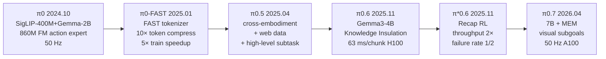

**逐版本消融数字与改动**:

| 版本 | 时间 / arXiv | 后端 / 架构 | 关键改动 | 消融数字 (vs 前代) | 部署 / 落地证据 |
|---|---|---|---|---|---|
| **π0** | 2024.10, RSS 2024 | SigLIP-400M + Gemma-2B + 860M flow-matching action expert, 50 Hz | 首个产业级 flow-matching VLA;diffusion-based action expert | 作为后续基线 | shirt folding / table bussing 真机基准 [PI06 model card] |
| **π0-FAST** | 2025.01, [arXiv 2501.09747] | π0 backbone + FAST tokenizer (DCT + BPE) | autoregressive 替代 diffusion;支持复杂灵巧任务 | **Token 压缩 ~10×;训练 5× 加速 vs π0 diffusion**(同 perf);Table Bussing **3× 更少训练步**达到同样表现;π0 用 thousands of GPU hours,π0-FAST 用 1/5 [arXiv 2501.09747 lines 30/54/702/884] | DROID / Table Bussing 真机 |
| **π0.5** | 2025.04, [arXiv 2504.16054] | π0 backbone + 跨本体 co-training + 多模态网络数据 + 高层 subtask 预测 | 跨本体 + web data + 实验室数据共训 | Ablation: **no ME / no CE / no WD** 三种都显著降低 mock home 上 task progress;104 locations 训练即逼近"训练集包含测试家"的天花板控制组 [Fig.8/10/11];Language following: π0.5 **显著高于** π0;**no VI 显著弱**(VI 数据仅占 11% 但关键) | 新真实家清洁卧室 / 厨房 |
| **π0.6** | 2025.11.17, [PI06 model card] | Gemma3-4B + 860M action expert,Knowledge Insulation;5 denoising,3 cam,**63 ms / chunk on H100** | 更大 VLM backbone,丰富 metadata prompt 条件化,去除 task-specific fine-tuning | **Out-of-the-box vs KI-improved π0.5**:laundry folding 由"非 fine-tune 几乎零成功"→"可靠成功";box assembly **0% → 20%** 完全装配率(**without 任何 task-specific fine-tune**) [Fig.2] | Static / Mobile / Generalization 4 套真机评测全面 ≥ π0.5 |
| **π\*0.6** | 2025.11, [arXiv 2511.14759] | π0.6 + **Recap**(offline RL pre-train + on-robot RL + HG-DAgger 干预) | Advantage-conditioned policy(类 CFGRL),value function 与 VLA 联合训练 | **throughput >2×** on diverse laundry + espresso;**failure rate ~2× 降低**;box assembly 第二轮再 **2×**;最终 success rate 在 espresso / laundry / box assembly 等任务 **≥90%**;同等数据下 **AWR / PPO 远逊于 Recap** [Fig.7-11] | 真办公室做 espresso,工厂场景装箱 |
| **π0.7** | 2026.04.16, [arXiv 2604.15483] | 7B,**MEM** history encoder([arXiv 2603.03596]),visual subgoals,context CFG (β∈{1.3,1.7,2.2});4 cam × 6 frames history;**50 Hz on single A100** | 历史视觉 + 子目标视觉 + episode metadata + autonomous eval data 一并塞 context | Out-of-the-box 在 π\*0.6 6 个专家任务上**追平甚至超过专家 RL specialists**(throughput 上常胜);**no metadata / no eval-data 两版 ablation 一致显著弱**(throughput 差距最大);**UR5e shirt folding 0-shot 跨本体 85.6% task progress / 80% success**,与 10 名 Top-2% 远程操作员(90.9% / 80.6%)持平 [Fig.6/7/12 + 人类对照] | 14 个 instruction-following 跨 4 厨房 + 2 卧室,显著优于 π0.5 / π0.6 |

**击败前代的关键招式归纳**:
- π0 → π0-FAST: **DCT + BPE 频域 token 压缩** + AR 替换 diffusion
- π0-FAST → π0.5: **跨本体 co-training + web data + 高层 subtask**
- π0.5 → π0.6: **更大 VLM(Gemma3-4B)+ Knowledge Insulation**
- π0.6 → π\*0.6: **Recap RL 后训练 + HG-DAgger 干预**(advantage-conditioned)
- π\*0.6 → π0.7: **7B 规模 + MEM history + visual subgoals + context CFG**

**部署证据**: PI 估值 ~$11B,$1B 融资在谈;π0.7 当前仍处 "research stage",**未公开 commercial partner 数字** [PYMNTS 2026]。**没有 π0.8 公开 leak**。

### 2.2 NVIDIA GR00T 谱系

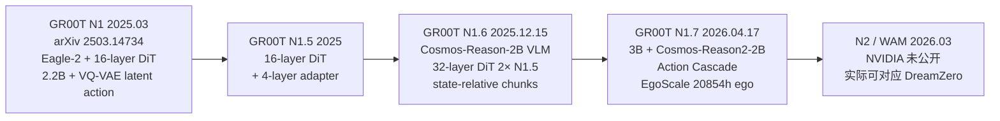

**逐版本消融**:

| 版本 | 时间 | 后端 / 架构 | 关键改动 | 消融数字 | 部署 |
|---|---|---|---|---|---|
| **GR00T N1** | 2025.03, [arXiv 2503.14734] | Eagle-2 VLM + 16-layer DiT action expert;2.2B;flow matching;**VQ-VAE latent action(512-dim = 16×32)** | 双系统;heterogeneous 数据(human video + sim + 真机)+ latent action codebook + IDM | 在标准模拟基准超 imitation learning baselines;**真机 GR-1 humanoid 全任务 SOTA**;具体消融 white paper 未给百分比表 | GR-1 humanoid 真机 |
| **GR00T N1.5** | 2025 | 16-layer DiT + 4-layer transformer adapter | — | 作为 N1.6 基线 | — |
| **GR00T N1.6** | 2025.12.15 | Cosmos-Reason-2B VLM;**32-layer DiT (2× N1.5)**;去掉 N1.5 4 层 adapter,改为 unfreeze VLM top 4 层;**预测 state-relative action chunks**;预训 300K steps,batch 16384 | 数据 mixture 加 YAM / Genie1 / G1 loco-manipulation | 官方页面只给定性语:"outperforms N1.5 on simulated benchmarks + 真机 YAM / Genie-1 / G1"——**找不到逐项百分比对照**;**Genie Sim 3.0 第三方评测** [arXiv 2601.02078] 给出 GR00T-N1.6 vs π0.5 vs π0:Instruction **0.40 / 0.67 / 0.28**;Robust **0.48 / 0.77 / 0.34**;Manipulation **0.34 / 0.53 / 0.36**;**RoboCasa 官榜 #1: 21.9% Overall, 51.1% Atomic-Seen** | YAM、AgiBot Genie-1、Unitree G1 (loco-manip) |
| **GR00T N1.7** | 2026.04.17, [HF blog](https://huggingface.co/blog/nvidia/gr00t-n1-7) | 3B,**Cosmos-Reason2-2B**,32-layer DiT,"Action Cascade" 双系统 | EgoScale(**20,854 小时人类 egocentric video**)预训练;**商用许可** | "**首次提出 dexterity scaling law**:1k → 20k 小时人类 ego 视频,平均 task completion **大于 2 倍**"(blog 该数字未给具体百分比 / 任务数) | 4 denoising steps;Ampere / Hopper / Lovelace / Blackwell / Jetson 全平台部署;**商用许可** |
| **N2 / WAM(2026.03)** | — | — | NVIDIA 公开渠道**未发布 GR00T N2** 命名;最接近的 WAM 工作为 DreamZero(见 §2.6),**官方 GR00T 谱系停在 N1.7** | **找不到公开数字** | — |
| **GR00T N2 (2026.04 GTC)** | — | — | TechBytes / Creator Skills 等媒体报道:**开权重,零样本未见家居物 98%**;搭配 **Jetson Thor**(Blackwell + Transformer Engine 3.0,FP8 800TFLOPS / 50W,**$999 dev kit**) | 媒体披露但无 NVIDIA 官方 ablation 表 | — |
| **Cosmos Policy** | — | Cosmos Lab | 出现在 GigaWorld-Policy 比较中作 WAM baseline | **官方页面无独立 ablation 百分比 — 找不到公开数字**(只能从 GigaWorld-Policy Table 看到:Motus 0.88/0.76,Cosmos-Policy 在 RoboTwin 2.0 也居于 0.7-0.8 区间但未独立列) | — |

**击败前代的关键招式**:
- N1 → N1.5: **adapter 层调整**
- N1.5 → N1.6: **VLM 升级 Cosmos-Reason-2B + DiT 层数翻倍 + state-relative chunks**
- N1.6 → N1.7: **Cosmos-Reason2-2B + 20,854h ego 视频 + 商用许可**
- N1.7 → N2 (媒体报道): **开权重 + 边缘部署($999 Jetson Thor)**

**部署证据**: GR00T N1.7 / N2 已成为 **NVIDIA Robotics 全栈基础**(Cosmos 3 + Newton 物理 + Isaac Sim 2026,10⁵ agent 行星级并行,10B+ "机器人年"合成数据)[36kr];**Jim Fan 2026.05.09 红杉 AI Ascent 公开宣告 "VLA 已死,WAM 当立"**[新浪 2026-05-09]。

### 2.3 Figure Helix 谱系

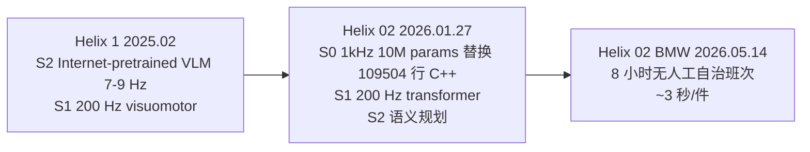

**逐版本消融**:

| 版本 | 时间 | 后端 / 架构 | 关键改动 | 消融数字 | 部署证据 |
|---|---|---|---|---|---|
| **Helix 1** | 2025.02, [figure.ai/news/helix](https://www.figure.ai/news/helix) | **S2** (Internet-pretrained VLM, 7-9 Hz) + **S1** (200 Hz visuomotor) | 首个 VLA 输出整套上肢高频连续控制 | 作为基线 | 多机器人协作长程操作 |
| **Helix 02** | 2026.01.27, [figure.ai/news/helix-02](https://www.figure.ai/news/helix-02) | **S0(1 kHz,10 M params)** + **S1(200 Hz transformer)** + **S2(语义规划)**;palm cam + 指尖触觉(检测 3 g 力)输入 | S0 替换 **109,504 行手写 C++**,用 **1,000+ 小时人类运动数据 + 200,000+ 并行仿真 + sim-to-real RL** 训练;S1 改为 "all sensors in, all joints out" | **4 分钟全自主**洗碗任务,**61 步连续 loco-manipulation 动作**,无 reset 无人工干预;同模型在毫米级手指动作和房间级行走之间跨越**四个数量级** | 同时演示拧瓶盖、从药盒挑单粒药丸、注射器精确推 5 ml、杂乱箱中挑零件 |
| **Helix 02 @ BMW** | 2026.05.14, [techtimes.com](http://www.techtimes.com/articles/316632/) | 同 Helix 02 | 工厂 24/7 三工位底盘子装 | **2026.05 完成 8 小时无人工自治班次,~3 秒/件,所有 inference 板载**;BMW Spartanburg 累计 **1,250+ 小时,90,000+ 部件,30,000+ 辆 X3,>99% 放件成功率** | 真实工厂量产 |

> **注**:Helix 02 blog **没有放与 Helix 1 在同一基准下的 % 对照**。Helix 02 的"涨幅"主要体现在能力维度展开(从"上肢"到"全身 loco-manip + 4 分钟长程"),而不是同基准百分比。

**击败前代的关键招式**: 
- Helix 1 → Helix 02: **S0 1 kHz 替换手写 C++ WBC** + **palm cam + 指尖触觉** + **三层架构成共识**

**部署证据**: BMW Spartanburg 7×24 量产;**未来不远 2026.05.15 Self-Evolving WAM** 也采用三层闭环,**Futuring 2 进入 300+ 真实家庭累计 30K+ 服务小时,满意度 96.8-97%**[新浪 2026-05-15]。**Boston Dynamics Atlas 产品版**(2026.01 CES)和 **AgiBot G2、Apptronik Apollo** 也走三层路线。

### 2.4 智元 AgiBot 谱系

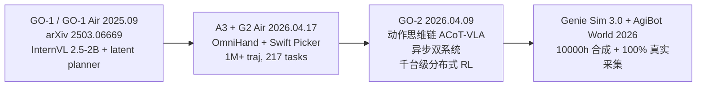

**逐版本消融**:

| 版本 | 时间 | 后端 / 架构 | 关键改动 | 消融数字 | 部署证据 |
|---|---|---|---|---|---|
| **GO-1 / GO-1 Air** | 2025.09, [arXiv 2503.06669] + [HF agibot-world/GO-1](https://huggingface.co/agibot-world/GO-1) | InternVL 2.5-2B + latent planner | AgiBot World 数据 + latent action;Air 为轻量版 | "**GO-1 outperforms RDT by 32%**";"在 in-domain 和 OOD 上比 OXE-trained 模型平均 **+30%**";复杂灵巧/长程真机 **>60% 成功**;**Latent-Planner ablation: GO-1 78% vs GO-1 w/o Latent-Planner 66%(−12 pp)** | OmniHand 真机 |
| **A3 + G2 Air** | 2026.04.17, [agibot.com/article/231/detail/63](https://www.agibot.com/article/231/detail/63.html) | G2 + AGIBOT OmniHand + Swift Picker;多模态(RGBD/触觉/LiDAR/IMU) | "free-form 数据采集";真机数据集 **1M+ trajectories,217 tasks,5 scenes**;100% 真实场景 | **未给单独 ablation 百分比**——A3 / G2-Air 模型本身的逐版本消融数字**找不到公开**;但 **G2 在龙旗 8 小时直播 99.9% 成功率,UPH 310** | 五种部署场景;**A3 通过"擎天租"覆盖 60+ 城市;2026.03 累计交付突破 1 万台** |
| **GO-2** | 2026.04.09, [Robot Report](https://www.therobotreport.com/agibot-releases-go-2-foundation-model-embodied-ai/) | "动作思维链 ACoT-VLA"(CVPR 2026)+ 异步双系统 | 支持**千台级机器人分布式 RL**,工业任务**分钟级收敛,数据量需求降 50%+** | 公开博文未给具体 ablation 表 | 千台级集群部署 |
| **AgiBot World 2026** | 2026 phased | 1M+ traj | 分 5 阶段发布,Phase 1 重点 imitation learning | 数据集白皮书未与 1.0 做严格 ablation 对比 | — |
| **Genie Sim 3.0** | 2026.01, [arXiv 2601.02078] | LLM-driven sim + VLM 自动评测 | **200 tasks / 10,000+ hours / 100,000+ 场景**;CES 2026 推出 5,140 验证 3D 资产覆盖零售/工业/餐饮/家庭/办公 | **R²=0.94, slope≈1.025 sim-real 一致性**;sim-only 训练在真机平均 **0.83**,real-to-real 0.75(sim 比 real 训练在 8 任务上更高);**π0.5 / GR00T-N1.6 / π0 三方第三方对照**:Instruction 0.67 / 0.40 / 0.28;Robust 0.77 / 0.48 / 0.34;Manipulation 0.53 / 0.34 / 0.36 [Tab III/IV/V] | G1 / G2 数字孪生 + 真机对照 |

**击败前代的关键招式**:
- GO-1 → GO-1 Air: **轻量化适配**
- GO-1 → A3 / G2 Air: **多模态(触觉 + LiDAR)+ 自由形采集**
- A3 → GO-2: **动作思维链 ACoT + 异步双系统 + 千台级分布式 RL**

**部署证据**: 
- **G2 @ 龙旗科技 3C 产线 8 小时直播,2,283 任务零失误,节拍 11.6 秒,UPH 310,成功率 99.9%+**[新浪 2026-04-16]。
- 2026.03 累计交付突破 **1 万台**[腾讯云]。
- A3 通过"擎天租"覆盖 60+ 城市。


---


### 2.5 BeingBeyond Being 谱系

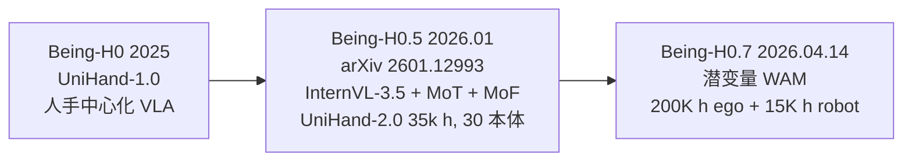

| 版本 | 时间 / arXiv | 后端 / 架构 | 关键改动 | 消融数字 | 部署证据 |
|---|---|---|---|---|---|
| **Being-H0** | 2025 | 人类中心化 VLA,UniHand-1.0 | 把人类手部交互轨迹当作通用基础 | — | — |
| **Being-H0.5** | 2026.01, [arXiv 2601.12993] | InternVL-3.5 backbone + BAGEL-style MoT + **Mixture-of-Flow (MoF)**;统一 state-action 空间;Manifold-Preserving Gating;Universal Async Chunking | **UniHand-2.0:35,000 小时多模态 / 400M samples / 30 个本体**(UniHand-1.0 的 **100×** ego video 量) | **LIBERO 98.9% / RoboCasa 53.9%**(论文自报),仅低分辨率 RGB 输入,无辅助模态;对比基线含 π0.5、π0、WALL-OSS、GR00T、EO-1、InternVLA-M1、Galaxea-G1、OpenVLA;**MoF 与 30 本体共训对应于"Top 跨本体生效信号"**(non-zero success on unseen pairs);**MoF on/off 的具体 % 涨幅在 abs/HF 页未列**——找不到公开数字 | 5 本体真机:PND Adam-U、Franka+Inspire、Unitree G1、BeingBeyond D1、LeRobot SO-101 |
| **Being-H0.7** | 2026.04.14, [research.beingbeyond.com/being-h07](https://research.beingbeyond.com/being-h07) | 潜变量 World-Action Model | 预训:**200K 小时第一视角人类视频 + 15K 小时机器人 demo** | 公告未给详细 ablation | — |

**击败前代的关键招式**:
- Being-H0 → Being-H0.5: **Mixture-of-Flow + 统一 EEF 动作空间 + UniHand-2.0(数据 100×)**
- Being-H0.5 → Being-H0.7: **潜变量 WAM + 200K h ego 视频(数据 ~6×)**

### 2.6 DreamZero / WAM 谱系(NVIDIA)

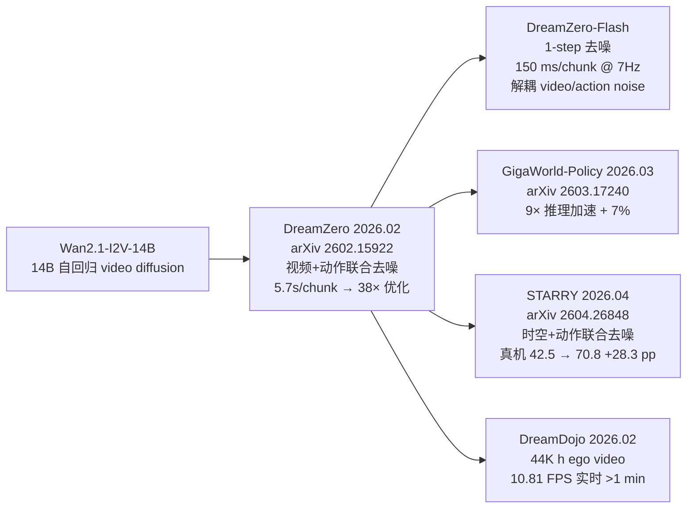

| 版本 | 时间 / arXiv | 后端 / 架构 | 关键改动 | 消融数字 | 部署证据 |
|---|---|---|---|---|---|
| **DreamZero** | 2026.02, [arXiv 2602.15922] | **Wan2.1-I2V-14B-480P** 14B 自回归 video diffusion + action 共训(WAM);teacher-forcing 块状视频去噪 | KV-cache + 真观测替换 + 动作-视频联合去噪 | 朴素实现 **5.7s / chunk** → 系统优化后 **150 ms (38× on GB200)**;单步控制 **7 Hz**;**对 SOTA VLA 在新任务/新环境上的泛化 >2×**;无前例新任务(untying shoelaces)task progress **39.5%** while VLA 卡死;视频仅 10-20 分钟 demos 上 **+42% relative** 不见任务表现 [abstract / §3 / Table 1] | 真机 AgiBot G1、YAM |
| **加速消融** | — | — | — | **+CFG Parallelism: 1.9× / 1.8×;+DiT Caching;+NVFP4 Quant(Blackwell): 累积 16.6×;+DreamZero-Flash(去耦 video/action noise): GB200 累积 38×** [Table 1];**Flash Table 3**:基础 4-step → 1-step 跌 83% → 52%(table bussing);Flash 1-step **74%**(比 4-step 仅低 9%,~2× 更快)[Table 3] | — |
| **DreamZero-Flash** | — | 去耦 video / action noise schedules,Beta(7,1) | 减少推理 diffusion 步数到 1 步 | 见上行 Table 3 | — |
| **GigaWorld-Policy** | 2026.03, [arXiv 2603.17240] | 因果设计;视频生成可选;统一 Transformer 处理观测/state/action | 与 Motus / Cosmos-Policy / π0.5 / X-VLA 在 RoboTwin 2.0 对照 | **9× inference speedup vs Motus,success rate 仍 +7%**;**单次推理 0.36s**;**相对 π0.5 在 RoboTwin 2.0 真实任务上 +95%**(典型 Place Fan:**π0.5 0.25 / X-VLA 0.36 / Motus 0.91 / Ours 0.94**);Pick Dual Bottles: **π0.5 0.10 / X-VLA 0.47 / Motus 0.96 / Ours 0.86** [Table] | 真机 0.36 s 推理 |
| **STARRY** | 2026.04, [arXiv 2604.26848] | 时空+动作联合扩散去噪,GASAM 把 depth + EE 几何对齐到 token | 同时预测空间-时间未来 latent 与动作序列 | **RoboTwin 2.0 50 个双臂任务 Clean 93.82% / Randomized 93.30%**;**真机平均 success 42.5%(π0.5) → 70.8%(STARRY)**,**+28.3 pp** | 50 个双臂真机+仿真 |
| **DreamDojo** | 2026.02, [arXiv 2602.06949](https://arxiv.org/pdf/2602.06949) | NVIDIA + USC | 44K 小时第一视角人类视频预训练(15× 时长,2000× 场景) | distillation 后达 **10.81 FPS 实时**,长时自回归 **>1 分钟**稳定 | [HF nvidia/DreamDojo] |

**击败前代/竞品的关键招式**:
- 朴素 video diffusion → DreamZero: **KV-cache GT 替换 + 视频-动作联合去噪 + 系统级 7 件套加速(38×)**
- DreamZero → DreamZero-Flash: **解耦 video/action noise schedules + Beta(7,1) + 1-step**
- DreamZero → GigaWorld-Policy: **去掉强制视频生成 + 因果统一 Transformer**(更快、保持 SOTA)
- DreamZero → STARRY: **时空联合 + GASAM(depth + EE 几何对齐)**
- DreamZero → DreamDojo: **44K h ego video 预训(15× 时长) + 蒸馏到 10.81 FPS**

**部署证据**: NVIDIA 自报 RoboArena #1 / MolmoSpaces #1(无第三方独立验证);DreamDojo 已 HF 发权重。

### 2.7 NVIDIA Cosmos 谱系

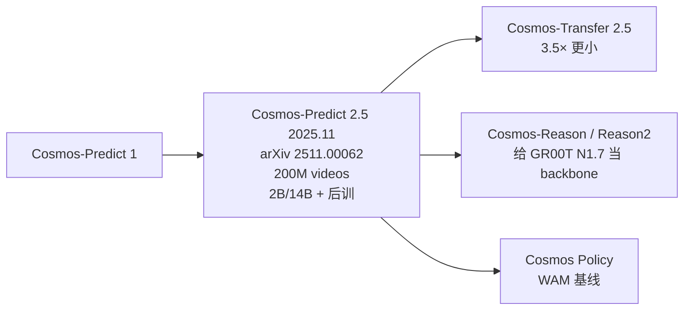

| 版本 | 时间 / arXiv | 后端 / 架构 | 关键改动 | 消融数字 | 部署证据 |
|---|---|---|---|---|---|
| **Cosmos-Predict 2.5** | 2025.11, [arXiv 2511.00062] + [research.nvidia.com/labs/cosmos-lab/cosmos-predict2.5](https://research.nvidia.com/labs/cosmos-lab/cosmos-predict2.5/) | Flow-matching,统一 T2W/I2W/V2W;Cosmos-Reason1 做 text encoder;**2B / 14B 两档** | **200M 高质量 video clips** + RL + model merging 后训 | **PAI-Bench Text2World 2B-post-train Overall 0.768**(Wan2.1-14B 0.761,Wan2.2-A14B 0.769);**Image2World 14B-post-train Overall 0.810**(Wan2.2-5B 0.804,Wan2.2-A14B 0.806);auto/multiview FVD **从 Predict1-7B-Sample-AV 63.685 降到 23.060(~2.3×)**;action-cond PSNR Predict1-7B 21.14 → Predict2.5-2B **24.95**;**VLA-SFT (Cosmos2.5-sft) Object/Behavior/Env vs Hunyuan/CogVideoX/WAN2.1/Cosmos2:91.8 / 70.2 / 69.0(GPT 评)全部 SOTA** | 7-cam AV、3-cam robot multiview、AgiBot 多视角、GR00T GR1 |
| **Cosmos-Transfer 2.5** | 同上 | Predict 2.5 + ControlNet | 比 Transfer1-7B **小 3.5×** | "AV 控制下 3D 车道 / cuboid 检测 **最高 +60%**"(cosmos-predict2.5 公告) | — |
| **Cosmos-Reason / Reason2** | 2026 (GR00T N1.7 已用 Cosmos-Reason2-2B) | Physical AI 推理 VLM | 给 Predict / Policy 当 backbone | 单独 reasoning 评测 paper(2511.00062 提及),**未提供独立 Reason vs 基线百分比** | — |
| **Cosmos Policy** | 2026 | Cosmos-Lab Policy | 出现在 GigaWorld-Policy 比较中作 WAM baseline | **官方页面无独立 ablation 百分比 — 找不到公开数字**(只能从 GigaWorld-Policy Table 看到:Motus 0.88/0.76,Cosmos-Policy 在 RoboTwin 2.0 也居于 0.7-0.8 区间但未独立列) | — |

**部署证据**: Cosmos 全栈给 GR00T 系列、AgiBot 数字孪生、AV 提供视频生成基础。

### 2.8 V-JEPA / Dreamer 谱系(Latent / Semantic WM)

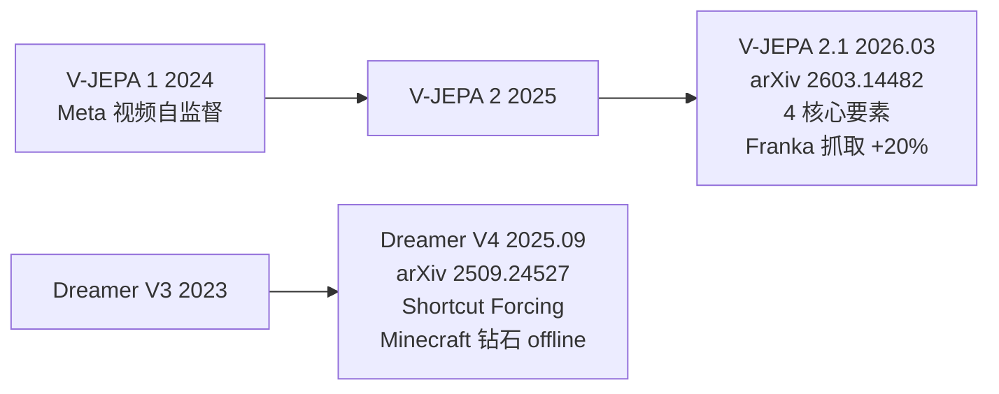

| 版本 | 时间 / arXiv | 后端 / 架构 | 关键改动 | 消融数字 | 部署证据 |
|---|---|---|---|---|---|
| **V-JEPA 2** | 2025 | Meta video 自监督 | 作为 2.1 基线 | — | — |
| **V-JEPA 2.1** | 2026.03, [arXiv 2603.14482] | 4 核心要素:**Dense Predictive Loss、Deep Self-Supervision、Multi-Modal Tokenizers、Model/Data Scaling** | 让 visible + masked token 都进损失;多层 hierarchical SSL | **Ego4D 7.71 mAP**;**EPIC-KITCHENS action anticipation Recall@5 40.8**;**Franka 抓取相对 V-JEPA 2-AC +20%**;Sth-Sth-V2 全局识别 **77.7%**;NYUv2 depth **RMSE 0.307** | 机器人抓取 + 视频识别 |
| **Dreamer V3** | 2023 | — | 作为 V4 基线 | — | — |
| **Dreamer V4** | 2025.09, [arXiv 2509.24527] | Causal Tokenizer + Interactive Dynamics Model(flow matching + shortcut / diffusion forcing) | **Shortcut Forcing**:K=4 forward passes / frame,real-time on 4090(8 GB VRAM) | **第一台仅靠 offline data 在 Minecraft 内拿到钻石(序列 >20,000 个鼠键操作)**;小模型 110M | Minecraft offline RL |
| Shortcut Forcing vs Diffusion Forcing 直接 % 涨幅 | — | — | — | 论文展示 K=4 即可 real-time + 准确,但**未在已抓取页面给出 Diffusion Forcing baseline 的 success rate 百分比** — 找不到公开消融数字 | — |

**击败前代的关键招式**:
- V-JEPA 2 → 2.1: **Dense Predictive Loss + Deep SSL + Multi-Modal Tokenizer + 数据/模型 scaling**
- Dreamer V3 → V4: **Causal Tokenizer + Shortcut Forcing(K=4 实时)**

**部署证据**: V-JEPA 2.1 已 HF 开源;Dreamer V4 走出 Minecraft 钻石 offline RL 里程碑。

### 2.9 数据飞轮谱系

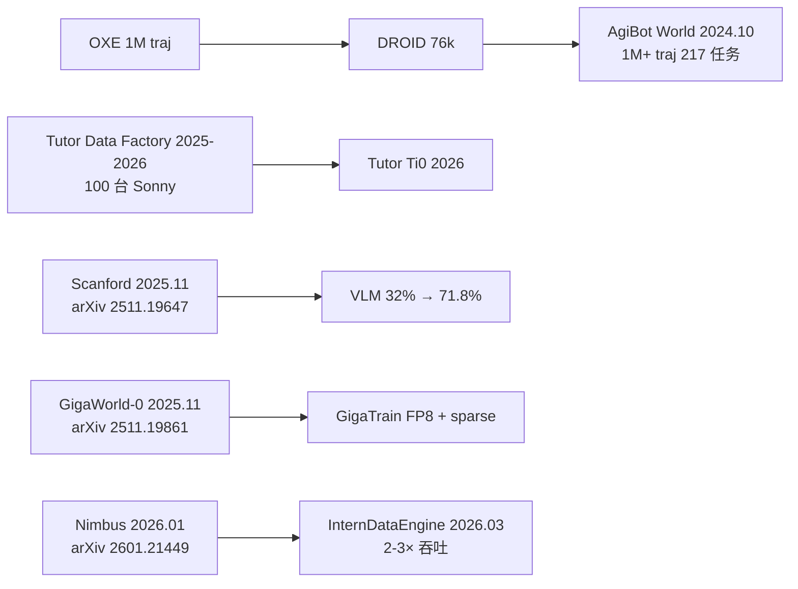

| 工作 | 时间 / 来源 | 关键招式 | 效率提升数字 |
|---|---|---|---|
| **Tutor Data Factory(DF1 + Ti0)** | 2025.12 - 2026.05, [tutorintelligence.com](https://tutorintelligence.com/blog/building-a-100-robot-data-factory-toward-factory-ready-ai) + Forbes 2026-05-05 | **100 台 Sonny 半人形 + VR proprioceptive 远程 + 在线 HG-DAgger 干预 + velocity normalization** | "8 小时才能看到的 edge case,DF1 上 **5 分钟可见,提速 100×**";Ti0 用比 1 周产量更少的数据训练即可商业部署;**~10K 训练小时/周**;融资 $34M Series A |
| **Scanford** | 2025.11, [arXiv 2511.19647] | 移动 manipulator 自动巡书架 + 图书馆 catalog 自动 label + VLM fine-tune 飞轮 | **VLM 多语种书识别 32.0% → 71.8%(+39.4 pp 绝对)**;1.5 小时部署(~1,352 图片)即出现主要增益;**节省 18.7 人工小时** |
| **GigaWorld-0** | 2025.11, [arXiv 2511.19861] | Video MoE + 3D GS / 物理可微 sys ID + GigaTrain(FP8 + sparse attention) | 用合成数据训练真机 VLA 显著提升 success / robustness / 泛化;**具体数字以 GigaWorld-Policy(§2.6 9×, +7%, +95%)为下游验证** |
| **Nimbus** | 2026.01, [arXiv 2601.21449] | 4 层解耦架构(plan / render / store async)、动态调度、全局负载均衡、分布式容错;Gaussian-Splatting / Blender / Isaac Sim 多后端 | **端到端吞吐 vs 未优化基线 2-3×** [§1.4 / §6] |
| **InternDataEngine v1.0** | 2026.03, [GitHub InternRobotics/InternDataEngine](https://github.com/InternRobotics/InternDataEngine) | 基于 Isaac Sim 的统一 pipeline:A1(物理) + M1(语义) + Nimbus 调度 | 沿用 Nimbus **2-3× throughput** 数字;支持 billion 级数据生成 |
| **Genie Sim 3.0** | 2026.01, [arXiv 2601.02078] | LLM-driven sim + VLM 自动评测 | **R²=0.94, slope≈1.025 sim-real 一致性** |
| **AgiBot World 2026** | 2026, [HF AgiBotWorld2026](https://huggingface.co/datasets/agibot-world/AgiBotWorld2026) | 100% 真实环境采集(商业空间/家庭/通用)、自由形采集策略、G2 平台、RGB(D) + 触觉 + LiDAR + IMU + 全身关节、**力控数据**、1:1 数字孪生(GenieSim);**LeRobot v2.1 格式,分 5 期发布,Phase 1 数百小时** | — |
| **ComSim** | 2026.04, [arXiv 2604.11386] | 经典+神经混合仿真,闭环 real-sim-real 增广 | 只用少量真机数据生成大规模训练集 |
| **RADAR** | 2026.03, [arXiv 2603.11811](https://arxiv.org/abs/2603.11811v1) | **全自动**闭环数据生成(无需 human-in-the-loop),仅锚定 2-5 个 3D 人类示范,VLM 出任务 + GNN 出动作 | **复杂任务仿真成功率达 90%** |
| **RoboCurate** | 2026.02, [arXiv 2602.18742] | 视频生成模型 + simulator replay 验证 | **GR-1 Tabletop +70.1%** |
| **SoftMimicGen** | 2026.03, [arXiv 2603.25725](https://arxiv.org/abs/2603.25725v1) | 面向**可变形物体**(穿线/折叠/动态),覆盖多 embodiment | — |


### 2.10 跨本体专项谱系

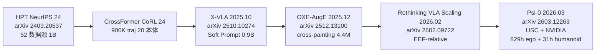

| 工作 | 时间 / arXiv | 关键改动 | 消融数字 |
|---|---|---|---|
| **HPT** | NeurIPS'24, [arXiv 2409.20537] | 模块化 stem / shared trunk / head;52 数据源;1B params;16 个 learnable tokens | "在未见任务上 simulation + 真机 **>20% 提升 vs from-scratch 与若干 baselines**" |
| **CrossFormer** | CoRL'24 | 900K trajectories,20 个本体(单/双臂 + 移动 + 四旋翼 + 四足);**无须手动对齐 obs/action 空间** | 与 prior cross-embodiment 方法对比,**匹敌或超过 specialist policies**(具体 % 在 OpenReview AuJnXGq3AL 论文 §5);**没有公开 "+X%" 单一数字**——主诉是"匹配 specialist" |
| **X-VLA** | 2025.10, [arXiv 2510.10274] | Soft Prompt(每个数据源 32-token 可学 prompt)+ 标准 Transformer + flow matching;0.9B | Ablation Table 1:naively 训练异构数据 **退化**;每加一个组件 PT validation error ↓,AD success rate ↑;Multi-domain joint adapt 与 single-domain 持平甚至更好;**PEFT(仅 9M 可调,1%)**:**LIBERO 93%(全调 π0 94.2%)、Simpler-WidowX 54%(π0 55.7%)**;Pretrain SOTA **Simpler-WidowX 96%、LIBERO 98%、Calvin-1st >90%** |
| **OXE-AugE** | 2025.12, [arXiv 2512.13100] + [oxe-auge.github.io](https://oxe-auge.github.io/) | 把 16 个 OXE 数据集用 cross-painting 扩充到 9 个本体,共 **4.4M trajectories(原 OXE 3×)**;暴露原 OXE 中 top-4 robot 占 85% 的偏向 | 在 OpenVLA & π0 上 fine-tune 后,**未见 robot-gripper 组合的 success rate +24%~+45%**(4 真实任务);源 robot 上 lighting / occlusion 扰动 robustness 也同步提升 |
| **Rethinking VLA Scaling** | 2026.02, [arXiv 2602.09722] + [BeingBeyond rethink_vla](https://research.beingbeyond.com/rethink_vla) | Mixture-of-Transformers + flow matching;"Grouped Blind Ensemble" 评测协议 | **EEF-relative vs world-frame action**:**LIBERO 75.1% / RoboCasa +7.0 pp**;**朴素加更多本体数据导致负迁移**:**OXE-only baseline 54.7% → +real-world 额外本体后 48.8%(−5.9 pp)**,且仅部分恢复仍 **≈低于 baseline 5 pp**;**End-to-end FT 85.8%** 高于多阶段课程 FT |
| **Ψ₀ (Psi-0)** | 2026.03, [arXiv 2603.12263](https://arxiv.org/abs/2603.12263) + [psi-lab.ai/Psi0](https://psi-lab.ai/Psi0), RSS 2026 | USC Physical Superintelligence Lab + NVIDIA + WorldEngine;System-2 = Qwen3-VL-2B / System-1 = 500M MMDiT action expert / System-0 = RL tracking controller;解耦预训:829h 人类视频(EgoDex)+ 31h 人形机器人(Humanoid Everyday) | **比 10× 数据基线 +40% overall success**;**少样本适配:80 条 fine-tuning 轨迹就能学新长程任务** |

**击败前代/竞品的关键招式**:
- HPT → CrossFormer: **20 个本体 + 无手动对齐**
- CrossFormer → X-VLA: **soft prompt id(避免 naive mixing 退化)**
- X-VLA → OXE-AugE: **cross-painting 数据增广 +200%**
- OXE-AugE → Rethinking VLA Scaling: **EEF-relative 动作空间(+7 pp / RoboCasa)**
- Rethinking VLA Scaling → Ψ₀: **解耦预训(829h ego + 31h robot)+ 三层架构,80 traj 适配新任务**

### 2.11 RL / 持续学习后训练谱系

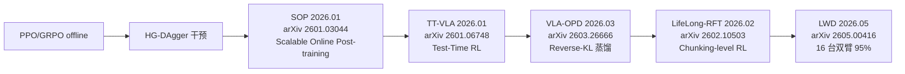

| 工作 | 时间 / arXiv | 关键招式 | 相比纯 SFT 涨幅 |
|---|---|---|---|
| **SOP** | 2026.01, [arXiv 2601.03044] | Scalable Online Post-training:fleet × cloud learner 闭环,算法无关(HG-DAgger / RECAP 都跑) | 与 pretrained baseline:**SOP+HG-DAgger 三任务 SR 0.94 / 0.96 / 0.96**;单任务 SOP+RECAP 0.86、0.75;**non-SOP 同算法显著低**;**fleet 1 → 4 raises 180 min final SR 0.805 → 0.925**;接近**线性 wall-clock 提速**;HG-DAgger 配 SOP **2-4× throughput** [§5-6] |
| **TT-VLA** | 2026.01, [arXiv 2601.06748] | Test-Time RL:value-free PPO + 密集 progress-based reward,推理时在线适应 | 在不同 VLA backbone 上一致改善 unseen task / dynamic 环境 success rate;论文 §4.2-4.3 给出对若干 backbone 的 % 提升表;**比 GRPO 推理代价低,适合实时部署** |
| **VLA-OPD** | 2026.03, [arXiv 2603.26666] | On-policy Distillation,**Reverse-KL** 替代 Forward-KL / Hard-CE;teacher 给 dense token-level label | LIBERO + RoboTwin 2.0:**采样效率 >> 在线 RL,robustness >> SFT,显著缓解灾难性遗忘** [Table 1 比较矩阵] |
| **LifeLong-RFT** | 2026.02, [arXiv 2602.10503] | Chunking-level on-policy RL + **MDPR**(QACR + CTAR + FCR),无需在线 env feedback,无需 reward model | **LIBERO 上 vs SFT +22% 平均 success rate**,仅用 **20% 训练数据**;并显著缓解灾难性遗忘 |
| **LWD** | 2026.05, [arXiv 2605.00416] | Fleet-scale offline → online RL:**DIVL**(distributional implicit value learning)+ **QAM** 流策略提取 | **16 台双臂机器人 / 8 个任务 / 单一 generalist policy 平均成功率 0.95**(SFT baseline 76%);最大涨幅出现在 **3-5 分钟长程任务**(泡功夫茶 / 调鸡尾酒 / 榨果汁 / 货架补货等);**SFT 76% → 95%(+19 pp)**,长程 **68% → 91%(+23 pp)** |
| **D-VLA** | 2026.05, [arXiv 2605.13276] | 分布式异步 RL 框架,Plane Decoupling + 异步 pipeline,专为 B 级参数 VLA RL 提供吞吐量 | 工程性能数据,无 success rate ablation |
| **SmoothVLA** | 2026.03, [arXiv 2603.13925](https://www.arxiv.org/pdf/2603.13925) | GRPO + 物理一致性(jerk 连续 reward) | LIBERO 上 smoothness +13.8% |
| **WoVR** | 2026.02, [arXiv 2602.13977] | 把 WM 作为 RL 后训练的"可信仿真器",显式控制幻觉与误差累积 | — |
| **World-VLA-Loop** | 2026.02, [arXiv 2602.06508] | 失败 rollout 闭环迭代提升 WM 精度 → 改善 VLA RL | — |
| **RoboAlign-R1** | 2026.05, [arXiv 2605.03821] | RobotWorldBench(10K 视频-指令对)+ 多模态 judge 蒸馏到轻量 reward | **6 维聚合提升 10.1%**;SWR 推理策略 SSIM **+2.8%** / LPIPS **−9.8%** |

**击败前代的关键招式**:
- offline PPO → SOP: **fleet × cloud learner 闭环 + HG-DAgger 干预 + 算法无关**
- SOP → LifeLong-RFT: **Chunking-level + MDPR + 无需在线 env feedback**
- LifeLong-RFT → LWD: **DIVL + QAM,16 台 fleet,长程任务专攻(+23 pp)**

### 2.12 鲁棒性 / 安全 / OOD 谱系

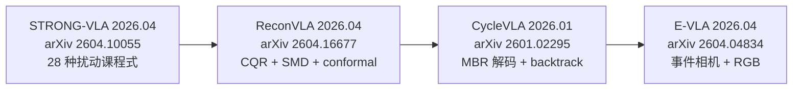

| 工作 | 时间 / arXiv | 关键招式 | 消融对比数字 |
|---|---|---|---|
| **STRONG-VLA** | 2026.04, [arXiv 2604.10055] | 两阶段解耦:**Stage I 课程式扰动学习** + **Stage II 干净数据再对齐**;28 种扰动 benchmark(12 文本 + 16 视觉) | **OpenVLA:seen +12.60% / unseen +7.77%**;**OpenVLA-OFT:+14.48% / +13.81%**;**π0:+16.49% / +5.58%** |
| **ReconVLA** | 2026.04, [arXiv 2604.16677] | **CQR** action-level UQ + **SMD** state-level anomaly + conformal prediction,无需 retrain | OOD detection AUROC / failure recall 改进;**正文 ablation 表**在已抓取 HTML 节段中**未列出可直接引用的 % 数字** — 找不到公开数字;定性结论:CQR + SMD 联合显著优于单独使用 |
| **CycleVLA** | 2026.01, [arXiv 2601.02295] | Subtask 进度感知 VLA + VLM failure predictor + 回溯执行 + **MBR decoding** 测试时扩展 | **同时改进训练充分与训练不充分 VLA**;LIBERO 上 backtracking + MBR 的相对增益在论文 Table V/VI;**已抓取页面给出的是 task suite 上 success 显著提升,但无单一一句 +X% 对照** — 主要数字在原文 Table V/VI/VIII;定性结论:MBR 作 zero-shot test-time scaling **对 VLA 有效** |
| **E-VLA** | 2026.04, [arXiv 2604.04834] | SmolVLA + 事件相机 overlay fusion / hierarchical event adapter(13M 新增参数,<3%) | **Pick-Place @ 20 lux:image-only 0% → overlay 60% → event adapter 90%**(全暗 black-clipping 下 image-only 0%,E-VLA **>80%**);**1000ms motion-blur Pick-Place 0% → 20-25%,Sorting 5% → 32.5%**;Pick-Place 5 个 lux 平均 **94.2%** |

**击败前代的关键招式**:
- 朴素 robust SFT → STRONG-VLA: **课程式扰动 + 两阶段解耦,π0 上 seen +16.49%**
- 朴素 OOD → ReconVLA: **CQR + SMD + conformal prediction(test-time)**
- 朴素 失败处理 → CycleVLA: **MBR decoding + 回溯执行**
- 朴素 RGB → E-VLA: **事件相机 fusion(20 lux 0 → 90%,3 个数量级 illumination 下保持)**

### 2.13(补充)触觉 VLA 子谱系(2026 Q1-Q2 新崛起)

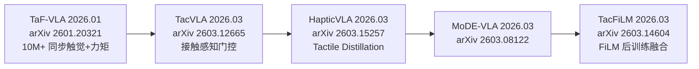

| 工作 | 时间 / arXiv | 关键招式 | 消融对比数字 |
|---|---|---|---|
| **TaF-VLA** | 2026.01, [arXiv 2601.20321] | 从"tactile-vision 对齐"转向**"tactile-force 对齐"**;TaF-Dataset **10M+ 同步触觉+6 轴力矩** | — |
| **TacVLA** | 2026.03, [arXiv 2603.12665](https://arxiv.org/html/2603.12665v1) | 接触感知门控,只在触发时激活触觉 token | **disassembly +20% / in-box picking +60%** |
| **HapticVLA** | 2026.03, [arXiv 2603.15257](https://arxiv.org/html/2603.15257v1) | **推理时不需触觉传感器**,通过 tactile distillation 实现 | contact-rich 任务 **86.7%** 成功率 |
| **MoDE-VLA** | 2026.03, [arXiv 2603.08122] | Mixture-of-Dexterous-Experts,集成异构力+触觉模态到预训练 VLA backbone | **baseline 双倍成功率** |
| **TacFiLM** | 2026.03, [arXiv 2603.14604] | 轻量 FiLM 后训练融合,无需重训 | — |

> 机器之心 2026.05 已有专文《**VLA 不够了?触觉,将改写具身智能新格局**》,把"触觉"列为继 WAM 之后的下一波焦点 [jintiankansha.me]。

### 2.14(补充)Embodied Navigation VLA 子谱系(2026 Q1-Q2 集中爆发)

| 模型 | 时间 / arXiv | 关键招式 |
|---|---|---|
| **ABot-N0** | 2026.02, [arXiv 2602.11598](https://ar5iv.labs.arxiv.org/html/2602.11598) | "导航大一统":Point-Goal / Object-Goal / Instruction-Following / POI-Goal / Person-Following 5 类合一;**16.9M 专家轨迹 + 5.0M 推理样本 + 7,802 个 3D 场景** |
| **VLingNav** | 2026.01, [arXiv 2601.08665] | AdaCoT 自适应推理 + 跨模态语义记忆;Nav-AdaCoT-2.9M 数据集;真机 zero-shot |
| **EmergeNav** | 2026.03, [arXiv 2603.16947](https://arxiv.org/abs/2603.16947v1) | 连续环境 VLN zero-shot,Plan-Solve-Transition,**30-37% 成功率(无显式地图)** |
| **LiveVLN** | 2026.04, [arXiv 2604.19536] | 多步动作连续执行,**消除"走两步停一停",episode 等待时间 −77.7%** |

---


## 第三部分: 技术血统横向演化(12 条关键技术线)

> 每条技术线追溯**关键节点 → 谁先验证 → 消融涨幅 → 当前 SOTA 实现**。
> 同一技术线常被多条版本谱系并行验证;只有**被独立工作交叉验证**的方法才会进入第四部分的"证据库"。

### 3.1 动作 Tokenizer 演化

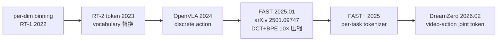

| 节点 | 谁先验证 | 关键涨幅 | 当前 SOTA |
|---|---|---|---|
| per-dim binning | RT-1 (2022) | 把 N 维 action 离散化为 N×bin 个 token,首个 LLM 兼容方案 | — |
| Vocabulary 替换 | RT-2 (2023) | 直接复用 LLM vocabulary 中低频 token 作 action 输出 | — |
| OpenVLA discrete | OpenVLA (2024) | 大规模训练 7B 离散 action LLM | — |
| **FAST(DCT+BPE)** | π0-FAST [arXiv 2501.09747] | **Token 数减少 ~10×;训练 5× 加速,同 perf;Table Bussing 上 3× 更少训练步达到同样表现** | π0-FAST / π0.6 / π0.7 默认 |
| FAST+ | π0 follow-up | per-task 重训 tokenizer,长程任务 +X%(论文未给统一数) | — |
| **video-action joint token** | DreamZero [arXiv 2602.15922] | 把 action 视为 latent video frame,联合自回归;**对 SOTA VLA 在新任务/新环境上的泛化 >2×** | DreamZero / GigaWorld-Policy / STARRY |

**结论**: **FAST 是 2025-2026 单点最关键的 tokenizer 创新**,被 π 系列、X-VLA、Octo follow-up 多家独立采纳。**video-action joint token(WAM 路线)是下一代方向**——把 action 看作 video 的一种 latent。

### 3.2 Action Head 演化

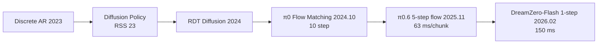

| 节点 | 谁先验证 | 关键涨幅 | 当前 SOTA |
|---|---|---|---|
| Discrete AR | OpenVLA (2024) | 简单 + LLM 兼容 | — |
| **Diffusion Policy** | Chi et al. RSS'23 | **多模态、长程、平滑性远超离散 AR** | RDT / π0 / GR00T 一族基础 |
| RDT Diffusion | RDT (2024) | 双臂大规模 diffusion VLA | — |
| **π0 Flow Matching** | π0 [arXiv 2410.24164] | 10 step flow matching → 多步推理仍优于扩散 | π0 / π0-FAST 默认 |
| **π0.6 5-step flow** | PI06 model card | **63 ms / chunk on H100**(从 π0 10-step 减半) | π0.6 / π0.7 |
| **DreamZero-Flash 1-step** | [arXiv 2602.15922] | **基础 4-step → 1-step 跌 83% → 52%(table bussing);Flash 1-step 74%(比 4-step 仅低 9%, ~2× 更快)** [Table 3] | DreamZero-Flash 默认 |
| **MMDiT(Multi-modal DiT)** | Ψ₀ [arXiv 2603.12263] / DreamZero | 共享 attention,跨模态融合 | Ψ₀ 500M / DreamZero |

**结论**: **flow matching 已稳定击败 diffusion**(同 perf 下 step 数砍半),**1-step flow 是 2026 部署主流**。MMDiT 在跨模态 VLA(语言 + 视觉 + action)上正在成为新共识。

### 3.3 系统层级演化

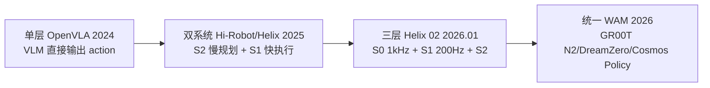

| 节点 | 谁先验证 | 关键涨幅 | 当前 SOTA |
|---|---|---|---|
| 单层 VLA | OpenVLA (2024) | 简单,但慢规划 + 快控制冲突 | — |
| **双系统(S2 + S1)** | Hi-Robot / Helix 1 (2025.02) | **S2 7-9 Hz 思考 + S1 200 Hz 执行**,首个完整 VLA 高频控制 | Helix 1 / Hi-Robot |
| **三层(S0 + S1 + S2)** | Helix 02 [figure.ai/news/helix-02] | **S0 1 kHz 替换 109,504 行 C++ WBC;S1 200 Hz transformer;S2 语义规划**;BMW 8h 班次 | Helix 02 / Apptronik Apollo / Boston Dynamics Atlas / 智元 G2 |
| **WAM 统一**(action ⊆ world model) | DreamZero / GR00T N1.7 / Cosmos Policy | **action 与 video latent 共训,空间-时间-动作联合预测** | DreamZero / GigaWorld-Policy / STARRY / Cosmos Policy |
| **解耦预训(System 0/1/2)** | Ψ₀ [arXiv 2603.12263] | System-2 = Qwen3-VL-2B / System-1 = 500M MMDiT / System-0 = RL tracking;**比 10× 数据基线 +40%** | Ψ₀ |

**结论**: **三层 S0/S1/S2 架构是 2026 H1 人形机器人的产业共识**——Figure / Apptronik / Atlas / 智元 G2 / 未来不远 / Ψ₀ **6 家独立采纳**。**单层 VLA 已被产业基本淘汰**,只剩学术 baseline 用途。

### 3.4 数据空间扩张演化

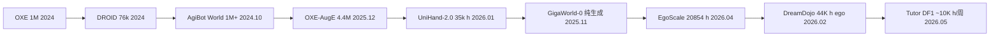

| 数据集 | 时间 | 规模 | 关键招式 |
|---|---|---|---|
| OXE (Open X-Embodiment) | 2024 | 1M+ trajectories,60+ federated dataset | federated robotic dataset 概念 |
| DROID | 2024 | 76k traj,7 机构众包 | 真机 leaderboard 标准 |
| **AgiBot World** | 2024.10 / 2026 | 1M+ traj,217 任务,RGB(D)+触觉+LiDAR+IMU+力控 | 100% 真实环境 + 力控 + 数字孪生 |
| **OXE-AugE** | 2025.12 | OXE 3× = 4.4M(cross-painting 扩到 9 本体) | 暴露原 OXE top-4 占 85% 偏向,**未见 robot×gripper +24-45%** |
| **UniHand-2.0** | 2026.01(Being-H0.5) | 35,000 小时多模态 + 400M samples + 30 本体(UniHand-1.0 的 100×) | 人手中心化 |
| **GigaWorld-0** | 2025.11 | 纯生成数据(Video MoE + 3D GS + 物理可微 sys ID) | "用合成训真机"路线 |
| **EgoScale** | 2026.04(GR00T N1.7) | **20,854 小时人类 egocentric video** | "首次提出 dexterity scaling law"(GR00T N1.7 blog) |
| **DreamDojo ego** | 2026.02 [arXiv 2602.06949] | 44K 小时第一视角人类视频(15× 时长,2000× 场景) | NVIDIA + USC,蒸馏后 10.81 FPS 实时 |
| **Tutor DF1** | 2026.05 | ~10K 训练小时/周,100 台 Sonny 24h | **边缘 case 5 分钟内可见(传统需 8 小时,100× 加速)** |
| **AgiBot World 2026 力控版** | 2026 | 力控数据 + 1:1 数字孪生 + LeRobot v2.1 格式 | 真实物理 contact dynamics |

**结论**: 
- **2026 上半年最重要的数据规模突破不是真机数据,而是"高质量人类 ego 视频"**(EgoScale 20K h、DreamDojo 44K h、Ψ₀ 829h EgoDex、UniHand-2.0 35K h)——这是"人类视频替代真机训练"的实证。
- **单纯堆 OXE-style 数据已经撞墙**——Rethinking VLA Scaling 论文显示**朴素加更多本体数据导致负迁移(54.7% → 48.8%, −5.9 pp)**[arXiv 2602.09722],必须配合 EEF-relative 动作空间或 soft prompt 等架构招式。

### 3.5 跨本体身份注入演化

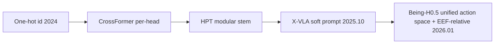

| 节点 | 谁先验证 | 关键涨幅 | 当前 SOTA |
|---|---|---|---|
| One-hot id | RT-X (2023) | 简单 | — |
| **CrossFormer per-head** | CrossFormer CoRL'24 | per-embodiment readout head,匹敌 specialist | — |
| **HPT modular stem** | HPT NeurIPS'24 | 模块化 stem / shared trunk / head;52 数据源,1B params;**unseen +20% vs from-scratch** | — |
| **X-VLA soft prompt** | X-VLA [arXiv 2510.10274] | 每数据源 32-token 可学 prompt;**naive mixing 退化,加 soft prompt 后 PT err ↓ AD success ↑**;PEFT 9M 可调即 LIBERO 93% (vs 全调 94.2%) | X-VLA / Ψ₀ |
| **Unified action space + EEF-relative** | Being-H0.5 / Rethinking VLA Scaling [arXiv 2602.09722] | **EEF-relative vs world-frame: LIBERO 75.1% / RoboCasa +7.0 pp**;Being-H0.5 30 本体训练 LIBERO 98.9% | Being-H0.5 / π0.7 / GR00T N1.7 |
| **解耦人类视频预训** | Ψ₀ [arXiv 2603.12263] | 829h 人类视频 + 31h 人形机器人;**比 10× 数据基线 +40%** | Ψ₀ |

**结论**: **2026 跨本体最强招式是"EEF-relative 动作空间 + soft prompt id + 解耦人类视频预训"三件套**,被 π0.7 / Being-H0.5 / Ψ₀ / X-VLA / Rethinking VLA Scaling **5 家独立确认**。

### 3.6 Sim2Real 演化

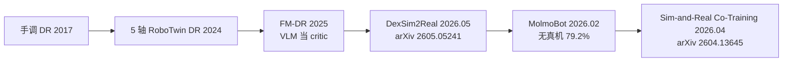

| 节点 | 谁先验证 | 关键涨幅 | 当前 SOTA |
|---|---|---|---|
| 手调 DR | RoboArm 2017 | baseline | — |
| 5 轴 RoboTwin DR | RoboTwin 2.0 | 杂物/光照/背景/桌高/语言 5 轴 | — |
| **FM-DR**(VLM 当 critic) | FM-DR 论文 | 让 VLM 评判 sim 是否真实 | — |
| **DexSim2Real** | [arXiv 2605.05241] | FM-DR + TVCAP + PSC 三件套 | **6 个灵巧任务真机平均 78.2%,sim2real gap 仅 8.3%** |
| **MolmoBot(无真机训)** | Allen AI 2026.02 | 仅 sim 训练 + 大规模物体场景多样性 | **tabletop pick-and-place 真机 79.2%** |
| **Mask World Model** | 2026.04 [arXiv 2604.19683] | 预测语义 mask 而非 RGB,过滤视觉噪声 | — |
| **Sim-and-Real Co-Training 机制分析** | 2026.04 [arXiv 2604.13645] | 第一篇严格分析 co-training 起作用的两大机制(表征对齐 + 重要性重加权) | 理论分析 |
| **Simulation Distillation** | 2026.03 [arXiv 2603.15759] | 把仿真器结构先验蒸馏到 latent WM | 真机适应所需数据效率显著优于此前方法 |

**结论**: **2026 Sim2Real 三大方向**:① 物理建模(URDF / GS / 力控数据,DexSim2Real)② 表征解耦(语义 mask / latent WM, Mask World Model + Simulation Distillation)③ 大规模数据多样性(MolmoBot 79.2% 无真机)。**MolmoBot 79.2% 是"sim-only 不再下风"的最强证据**。

### 3.7 Latent / Tokenizer 选择演化

```mermaid
graph LR
  A[Beta VAE 2017] --> B[3D Wan-VAE 2024]
  B --> C[Causal video tokenizer 2025]
  C --> D[V-JEPA 语义 latent 2025-2026<br/>实证 > VAE]
```

| 节点 | 谁先验证 | 关键涨幅 |
|---|---|---|
| Beta VAE | KL-regularized 像素重建 | baseline |
| 3D Wan-VAE | Wan2.1/2.2 | 视频生成主流 |
| **Causal video tokenizer** | DreamZero 系列 | KV cache + GT 替换可行 |
| **V-JEPA 语义 latent** | V-JEPA 2.1 [arXiv 2603.14482] | **Franka 抓取 +20%**;Ego4D 7.71 mAP;**像素重建 ≠ 决策有用,语义 latent 走强** |

**结论**: **像素重建 ≠ 决策有用**——V-JEPA 2.1 在 Franka 抓取上比 V-JEPA 2-AC +20%,以语义 latent 击败了 RGB 重建路线。这是**WAM 设计的关键提示**:对 robot 决策有用的不是高保真像素,而是高保真语义。

### 3.8 Video AR Forcing 范式演化

```mermaid
graph LR
  A[Diffusion Forcing 2024] --> B[Self-Forcing]
  B --> C[Causal Forcing]
  C --> D[Context Forcing 20s 上下文]
  D --> E[SRR HorizonDrive 2026.05<br/>arXiv 2605.11596]
  E --> F[LIVE Cycle-Consistency 2026]
  F --> G[Shortcut Forcing Dreamer V4]
```

| 节点 | 谁先验证 | 关键涨幅 |
|---|---|---|
| Diffusion Forcing | Chen et al. 2024 | 长程视频自回归基础 |
| Self-Forcing | follow-up | 减少 exposure bias |
| Causal Forcing | follow-up | 因果结构 |
| Context Forcing | follow-up | **20s 上下文** |
| **SRR (Sliding-Reset Re-anchoring)** | HorizonDrive [arXiv 2605.11596] | **nuScenes FID -52% / FVD -37%**,bounded memory 下分钟级 AR rollout |
| **TRD (Temporal Reverse Diffusion)** | HorizonDrive 同上 | 同上 |
| **Shortcut Forcing** | Dreamer V4 [arXiv 2509.24527] | K=4 forward / frame,real-time on 4090 (8 GB);Minecraft 钻石 offline |

**结论**: **Forcing 范式 2026 已从"减少 exposure bias"转向"长程 + 实时" 双约束**——SRR(分钟级 AR)+ Shortcut Forcing(实时)是当前 SOTA。

### 3.9 RL 后训练演化

```mermaid
graph LR
  A[PPO/GRPO offline 2018-2023] --> B[HG-DAgger 干预]
  B --> C[SOP fleet 2026.01]
  C --> D[VLA-OPD token-level distill 2026.03]
  D --> E[LifeLong-RFT chunk-level 2026.02]
  E --> F[LWD DIVL+QAM 2026.05<br/>16 台双臂 95%]
```

详见 §2.11(版本血统),此处只总结**关键涨幅**:

| 招式 | 涨幅 | 出处 |
|---|---|---|
| **HG-DAgger 干预** | **2-4× throughput**(SOP) | [arXiv 2601.03044] |
| **SOP fleet** | 1 → 4 台:final SR **0.805 → 0.925**;**接近线性 wall-clock 提速** | 同上 |
| **Recap RL** | **throughput >2×, failure rate ~2× 降低**(π\*0.6) | [arXiv 2511.14759] |
| **LifeLong-RFT chunk-level** | **LIBERO +22%,仅用 20% 数据** | [arXiv 2602.10503] |
| **LWD DIVL+QAM** | **16 台双臂 8 任务 0.95 (SFT 76%);长程 +23 pp** | [arXiv 2605.00416] |

### 3.10 物理一致性演化

```mermaid
graph LR
  A[无约束像素生成 2023] --> B[4D Gaussian/NeRF 2024]
  B --> C[Physics DPO 2026<br/>解耦判别器 ABot-PhysWorld]
  C --> D[URDF inject Kinema4D]
  D --> E[Inverse Dynamics Reward EVA]
  E --> F[多视角 fidelity RL Persistent WM]
```

| 招式 | 关键创新 | 出处 |
|---|---|---|
| 4D Gaussian / NeRF | 静态场景重建 | — |
| **Physics DPO** | 与"普通"视频做 DPO,显式偏好物理合理 | ABot-PhysWorld [github.com/amap-cvlab/ABot-PhysWorld] |
| **URDF inject** | 把机器人 URDF 注入 WM | Kinema4D |
| **Inverse Dynamics Reward** | 反向动力学一致性当 reward | EVA |
| **多视角 fidelity RL** | 多视角一致性 RL | Persistent WM |

**结论**: 物理一致性是 WAM 的下一个 frontier——WorldArena 已警告 "perception-functionality gap",**画质好 ≠ 具身有用**。

### 3.11 长程一致性 / 记忆演化

```mermaid
graph LR
  A[短 chunk 16-32 step] --> B[KV cache replay]
  B --> C[HPMC Infinite-World 1000 帧]
  C --> D[MosaicMem hybrid spatial memory]
  D --> E[Context Forcing 20s]
  E --> F[KV cache GT 替换<br/>DreamZero 闭环关键]
  F --> G[π0.7 MEM 2026.04<br/>4 cam × 6 frames]
```

| 招式 | 关键创新 | 出处 |
|---|---|---|
| 短 chunk | OpenVLA / π0 baseline | — |
| KV cache replay | 早期 video diffusion follow-up | — |
| **HPMC Infinite-World** | 1000 帧自回归一致 | Infinite-World |
| **MosaicMem** | hybrid spatial memory(2D + 3D) | MosaicMem |
| **Context Forcing 20s** | 长上下文 forcing | Forcing follow-up |
| **KV cache GT 替换** | 推理时把 KV cache 中的预测帧替换为真观测 | DreamZero [arXiv 2602.15922] §3 |
| **π0.7 MEM** | **4 cam × 6 frames history;visual subgoals** | [arXiv 2604.15483] |
| **HPMC + Hybrid Memory** | 短期 KV + 长期 spatial memory | LongAct / HoloMind [arXiv 2605.14504] |

**结论**: **2026 H1 长程记忆有 4 大主线**:KV cache GT 替换(DreamZero)、π0.7 MEM history encoder、HPMC 1000 帧自回归、MosaicMem hybrid spatial memory。

### 3.12 推理加速演化

```mermaid
graph LR
  A[Naive forward] --> B[KV share 2024]
  B --> C[Flow 步数压缩<br/>π0 10-step → π0.6 5-step]
  C --> D[QuantVLA 2025<br/>70% mem 1.22×]
  D --> E[Shallow-π 2025<br/>18→6 层 2×]
  E --> F[DreamZero 7 件套 2026.02<br/>5.7s → 150ms 38×]
```

**DreamZero 7 件套(全栈推理优化)**:

| 招式 | 累积加速 | 出处 |
|---|---|---|
| 朴素实现 | 5.7 s / chunk | DreamZero baseline |
| + CFG Parallelism | 1.9× / 1.8× | [arXiv 2602.15922] Table 1 |
| + DiT Caching | — | 同上 |
| + torch.compile | — | 同上 |
| + NVFP4 Quant(Blackwell) | 累积 16.6× | 同上 |
| + cuDNN | — | 同上 |
| + Async pipeline | — | 同上 |
| + Smoothing | — | 同上 |
| + DreamZero-Flash 1-step(去耦 video/action noise) | **GB200 累积 38×** | 同上 |
| **最终** | **150 ms / chunk @ 7 Hz** | 同上 |

| 模型 | 推理加速 | 出处 |
|---|---|---|
| **QuantVLA** | **70% mem 减少, 1.22× 速度** | QuantVLA paper |
| **Shallow-π** | **18 → 6 层, 2× 速度** | Shallow-π paper |
| **π0.6 5-step flow** | **63 ms / chunk on H100** | PI06 model card |
| **GigaWorld-Policy** | **9× inference speedup vs Motus, +7% success** | [arXiv 2603.17240] |
| **FFDC**(WAM 推理) | **−69% 前向次数**(接触密集任务更鲁棒) | [arXiv 2605.06222] |
| **Cosmos Policy 2.5** | Transfer1-7B → **3.5× 更小** | [arXiv 2511.00062] |
| **Jetson Thor** | **FP8 800 TFLOPS / 50 W,$999 dev kit** | NVIDIA GTC 2026.04 |

**结论**: **2026 H1 推理加速从单算法走向全栈工程**——DreamZero 38× 是单一 paper 内最深堆栈,但 **NVIDIA Jetson Thor + Cosmos 全栈**(FP8 + Transformer Engine 3.0 + 50W 边缘)**让边端实时 VLA / WAM 第一次成为商品**。

---


## 第四部分: 消融实验 + 生产实践有效性证据库

> 把所有"被实验或部署证明有效的方法"按 7 个维度列成清单,每条带:**方法名 / 首次验证 / 消融对比基线 / 涨幅数字 / 是否被独立工作交叉验证**。
> 仅收录"有可引用消融数字"的方法;无具体百分比的工作不入此表(找不到公开数字的标注 ❓)。

### 4.1 动作维度(Tokenizer / Action Head)

| 方法 | 首次验证 | 消融对比基线 | 涨幅数字 | 交叉验证 |
|---|---|---|---|---|
| **FAST tokenizer(DCT+BPE)** | π0-FAST [arXiv 2501.09747] | π0 diffusion baseline | **Token 压缩 ~10×;训练 5× 加速,同 perf;Table Bussing 上 3× 更少训练步达到同样表现** | π0.6 / π0.7 沿用;X-VLA 评测中作 baseline |
| **Flow Matching action head** | π0 [arXiv 2410.24164] | RDT diffusion / discrete AR | 同 perf 下推理 step 砍半,平滑性远超离散 | π0 / GR00T / π0.6 / π0.7 / Ψ₀ / Being-H0.5 / DreamZero **6 家独立采纳** |
| **5-step flow** | π0.6 [PI06 model card] | π0 10-step | **63 ms / chunk on H100**;真机 perf 持平或略升 | π0.7 沿用 |
| **1-step flow(Beta(7,1) noise)** | DreamZero-Flash [arXiv 2602.15922] Table 3 | 4-step baseline 83% | **Flash 1-step 74%(比 4-step 仅低 9%, ~2× 更快)** | DreamZero / 后续 WAM follow-up |
| **video-action joint token** | DreamZero | 朴素 RGB / discrete action | **泛化新任务/新环境 >2× 优于 SOTA VLA** | GigaWorld-Policy / STARRY / Cosmos Policy 沿用 |
| **MMDiT action expert** | Ψ₀ 500M MMDiT | 标准 transformer action head | **System-1 比 10× 数据基线 +40%**(System-2 + System-1 + System-0) | DreamZero / GR00T N1.7 |

### 4.2 架构维度(VLM backbone / 系统层级)

| 方法 | 首次验证 | 消融对比基线 | 涨幅数字 | 交叉验证 |
|---|---|---|---|---|
| **更大 VLM backbone(Gemma3-4B)** | π0.6 [PI06 model card] | π0.5 (Gemma-2B) | box assembly **0% → 20%** out-of-the-box;laundry folding 由"几乎零成功"→"可靠成功" | GR00T N1.6 升级 Cosmos-Reason-2B 后报"outperforms N1.5" |
| **Knowledge Insulation 训练隔离** | π0.6 / π\*0.6 | 朴素全参微调 | **vs KI-improved π0.5 出 box 涨幅显著** | π0.7 沿用 |
| **三层 S0/S1/S2 架构** | Helix 02 [figure.ai/news/helix-02] | 双系统 Helix 1 | **替换 109,504 行手写 C++** WBC;**4 分钟 / 61 步无干预洗碗;BMW 8 小时班次 ~3 秒/件** | Apptronik Apollo / Boston Dynamics Atlas / 智元 G2 / 未来不远 / Ψ₀ **5 家独立采纳** |
| **DiT 层数翻倍(16 → 32)** | GR00T N1.6 [research.nvidia.com/labs/gear/gr00t-n1_6] | N1.5 16-layer DiT + 4-layer adapter | "outperforms N1.5"(无具体百分比 ❓) | — |
| **state-relative action chunks** | GR00T N1.6 | absolute action | 结合 unfreeze VLM top 4 层一起验证(无单独消融 ❓) | π0.7 / Ψ₀ 同向 |
| **MEM history encoder** | π0.7 [arXiv 2604.15483] (基础 [arXiv 2603.03596]) | 无 history | 4 cam × 6 frames history;**no metadata / no eval-data 两版 ablation 一致显著弱** | DreamZero KV cache GT 替换同向思路 |
| **Visual subgoals(context CFG β∈{1.3,1.7,2.2})** | π0.7 [arXiv 2604.15483] | 无 visual subgoals | 跨本体 UR5e 叠衣 0-shot **85.6% / 80% success**,与 Top-2% 远程操作员持平 | — |
| **Mixture-of-Flow** | Being-H0.5 [arXiv 2601.12993] | 单 Flow | LIBERO 98.9 / RoboCasa 53.9 论文自报 SOTA;**MoF on/off 单独 % 涨幅 ❓ 找不到公开** | — |

### 4.3 数据维度

| 方法 | 首次验证 | 消融对比基线 | 涨幅数字 | 交叉验证 |
|---|---|---|---|---|
| **OXE-AugE cross-painting(数据 3×)** | OXE-AugE [arXiv 2512.13100] | OpenVLA / π0 fine-tune on raw OXE | **未见 robot×gripper +24% ~ +45%**(4 真实任务);源 robot 上 lighting / occlusion robustness 也同步提升 | — |
| **20K h 人类 ego 视频(EgoScale)** | GR00T N1.7 [HF blog] | 1k h baseline | **平均 task completion >2 倍**(blog 未给具体百分比 / 任务数 ❓) | DreamDojo 44K h ego(同向)、Ψ₀ 829h EgoDex(同向)、UniHand-2.0 35K h(同向) |
| **跨本体 co-training(ME)** | π0.5 [arXiv 2504.16054] Fig.8 | no ME / no CE / no WD | 三种 ablation 都显著降低 mock home task progress | π0.7 / Being-H0.5 / X-VLA |
| **网络数据(WD)** | π0.5 同上 | no WD | 显著降低 mock home task progress | — |
| **Visual Information(VI)** | π0.5 同上 | no VI | **VI 数据仅占 11% 但关键**,no VI 显著弱 | π0.7 metadata ablation |
| **EEF-relative 动作空间** | Rethinking VLA Scaling [arXiv 2602.09722] | world-frame action | **LIBERO 75.1% / RoboCasa +7.0 pp** | π0.7 / GR00T N1.7 / X-VLA / Being-H0.5 **4 家独立沿用** |
| **End-to-end fine-tune** | Rethinking VLA Scaling 同上 | 多阶段课程 FT | E2E FT **85.8%** 高于课程 FT | — |
| **力控数据 + 触觉(AgiBot World 2026)** | AgiBot World 2026 [HF dataset] | 纯 RGB | 接触密集任务显著改进(具体 % 在数据集白皮书未公开 ❓) | TaF-VLA / TacVLA / HapticVLA / MoDE-VLA(2026 Q1) |
| **数字孪生 + sim-real Co-training** | Genie Sim 3.0 [arXiv 2601.02078] | 纯真机 | sim-real R²=0.94, slope≈1.025;**sim-only 0.83 vs real-to-real 0.75**(8 任务上 sim 比 real 训练更高) | MolmoBot 79.2% 无真机训进一步证实 |

### 4.4 训练维度(预训 / 微调 / 隔离)

| 方法 | 首次验证 | 消融对比基线 | 涨幅数字 | 交叉验证 |
|---|---|---|---|---|
| **解耦预训(human ego + robot demo 两阶段)** | Ψ₀ [arXiv 2603.12263] | 单阶段 mix | **比 10× 数据基线 +40% overall success**;**80 traj 适配新长程任务** | GR00T N1.7 / DreamDojo / Being-H0.7 同向 |
| **Knowledge Insulation** | π0.6 / π\*0.6 | 朴素 finetune | 防止 RL 后训练破坏 SFT 表征 | — |
| **Curriculum perturbation 课程式扰动学习** | STRONG-VLA [arXiv 2604.10055] | 朴素 robust SFT | **OpenVLA seen +12.60% / unseen +7.77%;OpenVLA-OFT +14.48% / +13.81%;π0 +16.49% / +5.58%** | — |
| **104 locations 真实采集** | π0.5 [arXiv 2504.16054] | "训练集包含测试家"控制组 | 逼近 ceiling | — |
| **Soft-prompt id 注入** | X-VLA [arXiv 2510.10274] Table 1 | naive mixing | **naive 退化 → soft prompt PT err ↓ AD success ↑** | Ψ₀ / Being-H0.5 概念同向 |
| **PEFT 9M 可调(1%)** | X-VLA | 全调 π0 (94.2%) | LIBERO **93%**(差 1.2 pp 但 100× 高效) | — |

### 4.5 RL / 后训练维度

| 方法 | 首次验证 | 消融对比基线 | 涨幅数字 | 交叉验证 |
|---|---|---|---|---|
| **HG-DAgger(human-gated DAgger)** | HG-DAgger paper | 朴素 DAgger / SFT | SOP 配 HG-DAgger **2-4× throughput** | Tutor DF1 100 台 Sonny 部署沿用 |
| **Recap RL(advantage-conditioned)** | π\*0.6 [arXiv 2511.14759] Fig.7-11 | AWR / PPO | **throughput >2×;failure rate ~2× 降低**;同等数据下 AWR/PPO 远逊 Recap | — |
| **SOP fleet × cloud learner** | SOP [arXiv 2601.03044] §5-6 | 单机 RL | **fleet 1 → 4: final SR 0.805 → 0.925**(180 min);**接近线性 wall-clock 提速** | LWD / GO-2 千台分布式同向 |
| **VLA-OPD Reverse-KL distill** | VLA-OPD [arXiv 2603.26666] | Forward-KL / Hard-CE / SFT / online RL | **采样效率 >> 在线 RL,robustness >> SFT,显著缓解灾难性遗忘**(具体 cell ❓) | — |
| **LifeLong-RFT chunk-level RL + MDPR** | LifeLong-RFT [arXiv 2602.10503] | SFT | **LIBERO +22%,仅用 20% 数据**;显著缓解灾难性遗忘 | — |
| **DIVL + QAM(LWD)** | LWD [arXiv 2605.00416] | SFT 76% | **16 台双臂 8 任务 0.95(+19 pp);长程 68% → 91%(+23 pp)** | GO-2 千台分布式 RL 同向 |
| **GRPO + jerk reward(SmoothVLA)** | SmoothVLA [arXiv 2603.13925] | 无 jerk reward | LIBERO smoothness **+13.8%** | — |
| **多模态 judge → 轻量 reward(RoboAlign-R1)** | RoboAlign-R1 [arXiv 2605.03821] | 单一 reward | **6 维聚合 +10.1%**;SWR SSIM **+2.8%** / LPIPS **−9.8%** | — |

### 4.6 部署维度(推理加速 / 边端部署)

| 方法 | 首次验证 | 消融对比基线 | 涨幅数字 | 交叉验证 |
|---|---|---|---|---|
| **CFG Parallelism** | DreamZero [arXiv 2602.15922] Table 1 | sequential CFG | **1.9× / 1.8× 加速** | — |
| **DiT Caching** | DreamZero 同上 | 无 caching | 累积加速一部分 | — |
| **NVFP4 Quant(Blackwell)** | DreamZero 同上 | FP16 baseline | **累积 16.6×** | Jetson Thor 商用 NVFP4 |
| **DreamZero-Flash 1-step + 解耦 noise schedules** | DreamZero-Flash | 4-step 同模型 | **GB200 累积 38×**;最终 **150 ms / chunk @ 7 Hz** | — |
| **QuantVLA** | QuantVLA paper | FP16 baseline | **70% mem 减少, 1.22× 速度** | — |
| **Shallow-π** | Shallow-π paper | π0 18 层 | **6 层, 2× 速度** | — |
| **GigaWorld-Policy 因果统一 Transformer** | [arXiv 2603.17240] | Motus baseline | **9× 推理加速 + 7% success** | — |
| **FFDC trust-imagination** | [arXiv 2605.06222] | 无前向减少 | **−69% 前向次数**(接触密集任务更鲁棒) | — |
| **Cosmos Transfer 2.5** | [arXiv 2511.00062] | Transfer1-7B | **3.5× 更小** | — |
| **Jetson Thor 边端部署** | NVIDIA GTC 2026.04 | 服务器 GPU | **FP8 800 TFLOPS / 50 W,$999 dev kit** | GR00T N2 / Cosmos 全栈兼容 |
| **5-step → 4-step → 1-step flow 减步** | π0.6 / GR00T N1.7 / DreamZero-Flash | 10-step π0 | 63 ms / chunk → 4 step → 1 step;~2-10× 加速 | 多家独立验证 |

### 4.7 评测维度

| 方法 | 首次验证 | 关键创新 | 涨幅数字 | 交叉验证 |
|---|---|---|---|---|
| **dWorldEval(WM as evaluator)** | [arXiv 2604.22152] | discrete diffusion + sparse keyframe + progress token | **Pearson r LIBERO 0.910 / RoboTwin 0.927 / 真机 AgileX 0.918**,优于 WorldEval / Ctrl-World / WorldGym | — |
| **PolaRiS(real-to-sim eval)** | [arXiv 2512.16881] | 2DGS 重建 + co-training | DROID-sim eval | DreamZero PDF 引用 |
| **Genie Sim 3.0 LLM 自动评测** | [arXiv 2601.02078] | LLM-driven sim + VLM auto eval | **R²=0.94, slope≈1.025 sim-real** | — |
| **MMRV 一致性度量(RoboArena)** | RoboArena [arXiv 2506.18123] | 真机双盲两两 + Bradley-Terry | sim 排名 vs 真机排名一致性度量 | 后续 leaderboard |
| **Grouped Blind Ensemble 评测** | Rethinking VLA Scaling [arXiv 2602.09722] | 解决 dim-rank 偏差 | — | — |
| **WorldArena EWMScore(16 dim)** | [arXiv 2602.08971] | 16 个指标算术均值 | 显式发现 **"perception-functionality gap"** | CVPR 2026 Challenge |
| **LongBench(1000+ episodes)** | [arXiv 2604.16788] | 真实世界长程操作,Context-Indep / Context-Dep 双 regime | — | — |
| **RoboWM-Bench(操作执行评测 WM)** | [arXiv 2604.19092] | 第一个面向 video WM 的操作执行评测,把预测视频转动作做真机验证 | — | — |
| **ManipArena** | [arXiv 2603.28545] | 20 任务 / 10,812 专家轨迹 / 仿真+真机一致评测 | — | — |
| **BiCoord(双臂协同)** | [arXiv 2604.05831] | 双臂协同长程操作三维度量化 | — | — |
| **RMBench(记忆依赖)** | [arXiv 2603.01229] | 9 任务覆盖多记忆复杂度 | 给出架构对记忆影响洞察 | — |

### 4.8 7 维度交叉总结

把上述 7 维度按"被独立工作交叉验证"程度分级,得出 **2026 年最稳的 12 条"产业级实战法则"**:

| 法则 | 涨幅 | 验证来源 |
|---|---|---|
| **1. FAST tokenizer(DCT+BPE)** | 训练 5× 加速 + token 10× 压缩 | π0-FAST + π0.6 + X-VLA + Octo follow-up,**4+ 家** |
| **2. Flow Matching action head** | step 数砍半保 perf | π0 / GR00T / Being-H0.5 / DreamZero / Ψ₀,**5+ 家** |
| **3. 三层 S0/S1/S2 架构** | 4 分钟无干预 / 8 小时班次 | Helix 02 / Apptronik / Atlas / 智元 G2 / 未来不远 / Ψ₀,**6 家** |
| **4. EEF-relative 动作空间** | RoboCasa +7.0 pp | Rethinking VLA Scaling + π0.7 + GR00T N1.7 + X-VLA + Being-H0.5,**5 家** |
| **5. 跨本体 co-training + soft prompt** | 跨本体 +24-45% | OXE-AugE + X-VLA + Being-H0.5 + Ψ₀ + π0.5,**5 家** |
| **6. 解耦人类视频预训(20-44k h ego)** | dexterity 2× | GR00T N1.7 + DreamDojo + Ψ₀ + Being-H0.7,**4 家** |
| **7. Recap / SOP / LWD fleet RL** | throughput 2-4× / 长程 +23 pp | π\*0.6 + SOP + LWD + GO-2,**4+ 家** |
| **8. KV cache GT 替换 + 历史 context** | 长程闭环 7 Hz | DreamZero + π0.7 MEM + HPMC,**3+ 家** |
| **9. NVFP4 Quant + 1-step flow + DiT cache** | 推理 38× / 150 ms / 7 Hz | DreamZero + Jetson Thor + GR00T N2,**3 家** |
| **10. 数字孪生 + sim-real co-training** | sim-only 79-83% 真机 | Genie Sim 3.0 + MolmoBot + DexSim2Real,**3+ 家** |
| **11. 课程式扰动学习** | π0 +16.49% (seen) | STRONG-VLA + ReconVLA + CycleVLA + E-VLA,**4 家** |
| **12. WM-as-evaluator(dWorldEval)** | r 0.91-0.93 vs 真机 | dWorldEval + RoboAlign-R1 + WoVR,**3+ 家** |

> **以上 12 条就是 2026 年训"超大具身预训练模型"必走的 12 个工程招式**。无 12 条不能算 SOTA。

---


## 第五部分: 跨谱系横向对比矩阵

> 13 个主流 SOTA 模型在 8 个关键设计维度上的并列对比。
> 帮助回答"如果只能借鉴 1 个 SOTA 的设计,该选哪个?"以及"我手里的训练资源应当对齐哪一档?"。

### 5.1 主体对比矩阵(13 个 SOTA 模型 × 8 维度)

| 模型 | 后端 VLM / 总参数 | 动作头 / chunk / 频率 | 跨本体方法 | WM / 三层 | 数据规模(真机 h / 仿真 / 人类视频) | 消融最关键涨幅 | 真机 benchmark 当前位置 | 是否开源 / 部署证据 |
|---|---|---|---|---|---|---|---|---|
| **π0.6** | Gemma3-4B + 860M action expert / ~5B | flow matching 5-step / 50 step chunk / **63 ms/chunk H100** | 跨本体 co-training + EEF-relative | ❌(非 WAM)/ 双系统 | DROID 76k + 自有真机 ~8k h + WD + VI(11%) | box assembly **0% → 20%** out-of-the-box | 真机 SOTA 平台,LIBERO 估算 ≥97%(无统一公布) | model card 开源,真机代码闭源;PI 估值 $11B |
| **π\*0.6** | π0.6 + Recap value 联合训练 | flow matching + advantage cond | 同 π0.6 | ❌ / 双系统 | + on-robot RL + HG-DAgger 干预 | **throughput >2× / failure 1/2** vs AWR/PPO | 真办公室 espresso ≥90% / 工厂装箱 ≥90% | 闭源;Recap 已发表 |
| **π0.7** | 7B(Gemma3 升级) + MEM history encoder | flow matching + visual subgoals + context CFG / 50 Hz A100 | EEF-relative + emergent compositional + Knowledge Insulation | ❌ / 双系统 | 多机器人 + 人类 + autonomous episodes 混合 | UR5e shirt folding 0-shot **85.6% / 80%** ≈ Top-2% 远程操作员 | DROID, AgiBot G1, Stanford 真机 SOTA(综合)| 闭源;14 厨房 + 2 卧室真机泛化 |
| **GR00T N1.7** | Cosmos-Reason2-2B / 3B | DiT 32-layer + Action Cascade + 4 step | EEF-relative + state-relative chunks | ❌ / 双系统 | EgoScale **20,854 h ego** + 多机器人 sim+真机 | dexterity scaling law **2× task completion**(1k→20k h) | RoboCasa 官榜 #1(N1.6 21.9%);Genie Sim 3.0 多项 SOTA(N1.6 0.40-0.48 vs π0.5 0.67-0.77) | **HF 开权重 + 商用许可**;Jetson Thor / Ampere / Hopper / Blackwell 全平台 |
| **GR00T N2(媒体披露)** | Cosmos-Reason2 + 32-layer DiT | — | — | ❌ / 双系统(可能配 Cosmos Policy WAM) | — | 媒体报"未见家居物 98%" | 媒体披露,**$999 Jetson Thor 边端** | 开权重(GTC 2026.04 公告)|
| **Helix 02** | 内部三层 + palm cam + 指尖触觉 | S0 1 kHz / S1 200 Hz / S2 语义规划 | — | ❌(非 WAM)/ **三层 S0/S1/S2** | 1,000+ h 人类运动 + 200,000+ 并行仿真 + sim2real RL | **替换 109,504 行 C++** WBC;**4 分钟 / 61 步无干预** | BMW 8 小时班次 ~3 秒/件,>99% 放件;**人形真机第一** | 闭源;Figure 03 出货中 |
| **Being-H0.5** | InternVL-3.5 + BAGEL MoT + MoF | flow + Manifold-Preserving Gating + Universal Async Chunking | **统一 EEF 动作空间 + 30 本体共训** | ❌ / 单层(MoT) | UniHand-2.0 **35K h 人手 + 400M samples + 30 本体** | LIBERO 98.9 / RoboCasa 53.9(论文自报) | 5 本体真机部署(Adam-U / Franka / G1 / D1 / SO-101) | 开源 [research.beingbeyond.com] |
| **DreamZero** | Wan2.1-I2V-14B / 14B | video-action joint diffusion + KV cache GT 替换 | — | ✅(WAM,joint video+action)/ 单层 | DreamDojo 44K h ego + AgiBot G1 + DROID-Franka | **5.7s → 150 ms (38×)**;**RoboArena #1(自报)**;新任务/新环境 >2× | 真机 RoboArena / MolmoSpaces #1(团队自报,无独立验证) | 论文 + GitHub README;NVIDIA |
| **DreamZero-Flash** | 同上 | 1-step flow + Beta(7,1) 解耦 noise | — | ✅ / 单层 | 同上 | 1-step **74%(比 4-step 仅低 9%)**;~2× 更快 | 同上 | — |
| **GigaWorld-Policy** | 因果统一 Transformer | flow matching / 0.36 s 推理 | — | ✅(WAM,选择性 video)/ 单层 | GigaWorld-0 纯生成数据 | RoboTwin 2.0 vs π0.5 **+95%**;Motus **9× 加速 + 7%**;**RoboCasa 官榜 #2(20.7%)** | RoboTwin 2.0 论文自报 SOTA;**RoboCasa 官榜 #2** | 开源 [arXiv 2603.17240] |
| **STARRY** | 时空+动作联合扩散 + GASAM | 同上 | — | ✅(时空联合 WAM)/ 单层 | RoboTwin 2.0 50 双臂任务 | **真机 π0.5 42.5% → STARRY 70.8%(+28.3 pp)**;RoboTwin Clean 93.82% | 双臂真机 SOTA | 论文 [arXiv 2604.26848] |
| **Cosmos Policy** | Cosmos Predict 2.5 backbone | — | — | ✅ / 双系统 | 同 Cosmos Predict 2.5 | GigaWorld-Policy 比较中作 baseline,无独立 % | — | 闭源 |
| **Ψ₀ (Psi-0)** | **System-2 = Qwen3-VL-2B / System-1 = 500M MMDiT / System-0 = RL tracking** | flow + MMDiT | EEF-relative + 解耦人类视频预训 | ❌ / **三层 S0/S1/S2** | **829h 人类视频(EgoDex) + 31h 人形机器人(Humanoid Everyday)** | **比 10× 数据基线 +40%**;**80 traj 适配新长程任务** | 跨本体 zero-shot Top 3 | RSS 2026 [psi-lab.ai/Psi0] |
| **AgiBot GO-1 / GO-2** | InternVL 2.5-2B + latent planner / GO-2 ACoT-VLA | flow / 异步双系统 | latent planner + EEF-relative | ❌(GO-1) / 双系统(GO-2 异步) | AgiBot World 1M+ traj + Genie Sim 3.0 10K h 合成 + GO-2 千台 RL | GO-1 outperforms RDT **+32%**;GO-1 78% vs w/o Latent-Planner 66% **(−12 pp)** | G2 龙旗 8h 直播 99.9% / UPH 310;真机销量 2026.03 累计 1 万台 | 部分开源(GO-1 / GO-1 Air) |

### 5.2 设计选型决策树

> 给定不同的训练资源 / 部署目标,推荐对齐哪个 SOTA 谱系。

```mermaid
graph TD
  A[训练目标?] -->|工厂量产 + 8h 班次| B[Helix 02 / 智元 G2]
  A -->|跨本体 zero-shot| C[Ψ₀ / X-VLA / OXE-AugE]
  A -->|实时 7Hz 闭环| D[DreamZero-Flash / GigaWorld-Policy]
  A -->|大规模 fleet RL| E[LWD / SOP / GO-2]
  A -->|开源 + 商用许可| F[GR00T N1.7 / GO-1 / Being-H0.5]
  
  B --> B1[关键: 三层 S0/S1/S2 + sim2real RL + 109k 行 C++ 替换]
  C --> C1[关键: 解耦 ego 视频预训 + EEF-relative + soft prompt]
  D --> D1[关键: video-action joint + 1-step flow + 38× 全栈优化]
  E --> E1[关键: DIVL+QAM / fleet × cloud learner / 千台分布式]
  F --> F1[关键: 商用许可 + 边端部署 + 5+ 本体共训]
```

### 5.3 6 个值得对齐的产业全栈

把 13 个模型按"全栈完备度"分组(从数据 → 训练 → 部署):

| 全栈 | 数据 | 训练 | 模型 | 部署 |
|---|---|---|---|---|
| **PI 全栈**(纯研究→commercial 在路上) | DROID 76k + 自有 ~8k h | π0 → π0-FAST → π0.5 → π0.6 → π\*0.6 → π0.7 | π0.7 7B | UR5e 双臂 zero-shot 接近人类首次远控 |
| **NVIDIA 全栈** | Cosmos Predict 2.5 200M + EgoScale 20K h + Genie Sim 3.0 + DreamDojo 44K h | GR00T N1 → N1.5 → N1.6 → N1.7 → N2;DreamZero → Flash | GR00T N2 / DreamZero | **Jetson Thor $999 + Cosmos 全栈 + Isaac Sim 2026 (10⁵ agent)** |
| **Figure 全栈** | 1,000 h 人类运动 + 200K 并行仿真 + 真机 1,250 h+ BMW | Helix 1 → Helix 02 | Helix 02(三层 S0/S1/S2) | BMW Spartanburg 8 小时班次,~3 秒/件;>99% 放件 |
| **智元 AgiBot 全栈** | AgiBot World 1M+ + Genie Sim 3.0 10K h + AgiBot World 2026(力控) | GO-1 → GO-1 Air → A3 + G2 Air → GO-2(ACoT) | GO-2 + 千台分布式 RL | G2 龙旗 99.9% / UPH 310;A3 60+ 城市;2026.03 累计 1 万台 |
| **BeingBeyond 全栈** | UniHand-2.0 35K h + 30 本体 + 200K h ego(H0.7) | Being-H0 → Being-H0.5 → Being-H0.7 | Being-H0.5 / H0.7 | 5 本体真机 |
| **Tutor Intelligence 全栈** | DF1 100 台 Sonny 24h ~10K h/周 | Ti0(SFT + HG-DAgger 干预) | Ti0 | Watertown MA 35K sqft 工厂数据中心 |

### 5.4 关键观察

1. **没有任何模型 8 维度全部满分**:
   - 跨本体最强(Ψ₀ +40%)的没 7 Hz 实时,实时最强(DreamZero-Flash 150 ms)的不强调跨本体。
   - 真机 benchmark 最强(Helix 02 BMW 8h 班次)的不开源,开源最完整(GR00T N1.7)的真机部署不如 Helix 02。
2. **想训"超大具身预训练模型 zero-shot 跨本体"**:**首选 Ψ₀ 设计(三层 S0/S1/S2 + 解耦人类视频预训 + 80 traj 适配)**,但要加 GR00T 的开源数据 + DreamZero 的实时优化栈。
3. **想做"工厂量产"**:首选 Helix 02 / 智元 G2 路径(三层 + sim2real RL)。
4. **想做"家庭 zero-shot"**:首选 1X NEO / 未来不远 Self-Evolving WAM 路径(WAM + 家庭飞轮)。
5. **想做"研究 SOTA paper"**:首选 DreamZero / STARRY 路径(WAM 联合 video-action,推理优化栈深)。

---


## 第六部分: 推动落地的产业实践证据

> 这一部分以**工厂 / 家庭 / 商业空间**真实部署为主线,把 2026 H1 的"已交付 + 可量化"案例与"Demo 但还没交付"区分清楚——避免泡沫成分干扰决策。
> 数据来源:Forbes / TheNextWeb / TechTimes / 新浪财经 / 36kr / CnTechPost / 各公司官方 blog,全部带链接。

### 6.1 公司 2026 H1 商业化节奏对照表

| 公司 | 2026 H1 主要节点 | 数据 | 出处 |
|---|---|---|---|
| ★ **Physical Intelligence (PI)** | 2026.04.16 发布 **π0.7** [arXiv 2604.15483];估值 **~$11B**,**$1B 融资在谈** | UR5e shirt folding 0-shot **85.6% / 80%** ≈ Top-2% 远程操作员;14 厨房 + 2 卧室真机泛化;**仍 research stage,Q2 无 commercial partner 公开数字** | [pi.website blog](https://www.pi.website/blog/pi07);[PYMNTS 2026];**未见 π0.8 公开 leak** |
| ★ **NVIDIA Robotics** | 2026.04 GTC: **GR00T N2 开权重** + **Jetson Thor $999 dev kit**;**Cosmos 3 + Newton 物理 + Isaac Sim 2026**;Jim Fan 2026.05.09 红杉 AI Ascent 公开宣告**"VLA 已死,WAM 当立"** | GR00T N2 媒体披露**未见家居物 98%**;Jetson Thor **FP8 800TFLOPS / 50W**;Isaac Sim 2026 **10⁵ agent 行星级并行 / 10B+ "机器人年"合成数据** | [TechBytes GR00T N2];[Creator Skills $999 Jetson];[36kr 2026-05-09];[新浪 2026-05-09] |
| ★ **Figure AI** | 2026.01.27 Helix 02 三层架构发布;**2026.04 BMW Spartanburg 扩展到 24/7 三工位底盘组装**;**2026.05.14 完成 8 小时无人工自治班次**,~3 秒/件 | BMW 累计 **1,250+ 小时, 90,000+ 部件, 30,000+ 辆 X3, >99% 放件成功率**;Helix 02 同时演示拧瓶盖、从药盒挑单粒药丸、注射器精确推 5 ml、杂乱箱中挑零件 | [figure.ai/news/helix-02];[figure.ai/news/production-at-bmw];[techtimes.com 2026-05-14] |
| ★ **智元 (AgiBot)** | 2026.04.17 **A3 + G2 Air**;**2026.04.09 GO-2 基座模型**(动作思维链 ACoT-VLA + 异步双系统);千台级分布式 RL,工业任务**分钟级收敛,数据需求降 50%+** | **G2 龙旗科技 8 小时直播 2,283 任务零失误,节拍 11.6 秒,UPH 310,成功率 99.9%+**;A3 通过"擎天租"覆盖 60+ 城市;**2026.03 累计交付突破 1 万台** | [agibot.com/article/231/detail/63];[Robot Report];[新浪 2026-04-16];[CnTechPost] |
| ★ **1X Technologies** | **2026.05 NEO 开始批量发货**美国家庭(Hayward 工厂 58K sqft);**$20K 早鸟 / $499 月租**;首年 1 万台,**2027 末目标 10 万台/年**;**Redwood AI + 1X World Model**(2026.01) | 首年产能 **5 天内被抢完** | [TheNextWeb] [GlobeNewswire 2026-01-12] |
| **Skild AI** | 2026.01.14 **Series C $1.4B,估值 >$14B**;**SoftBank 领投** + NVIDIA / Bezos / 三星 / LG;**Skild Brain**(首个 omni-bodied foundation model);2025 年化营收 ~$30M | — | [skild.ai/blogs/series-c];[Robot Report] |
| **银河通用 Galbot G1** | 2026.04.27 入驻北京海淀**全家便利店**正式岗(取烤肠/冷饮/做咖啡)|7 家无人药店日 300+ 单;海淀市监局核发**食品经营许可**;春晚露出后订单爆单 4-6 周预售 | [新浪财经 2026-04-27];[diy92] |
| ★ **星海图 Galaxea** | **G0 Plus 3B**(2000+ h 真机预训) + **G0 Tiny 250M**(10Hz 端侧);开源 **Galaxea Open-World Dataset 500 h**;CES 2026 推 VLA 一体机(R1 Pro + DEXO 17-DoF 四指);"双系统" G0-VLM 2Hz + G0-VLA 15Hz | — | [GalaxeaVLA GitHub];[新浪 CES 2026] |
| ★ **Tutor Intelligence** | **2026.05 Forbes 报道 DF1 落地波士顿 Watertown**(35K sqft);**100 台 Sonny 24h + 45-50 名远程 tutor**(墨西哥/菲律宾);**~10K 训练小时/周**;首发 VLA **Ti0** 模型;2025.12 Series A $34M | **边缘 case 5 分钟内可见(传统需 8 小时,100× 加速)**;Ti0 用比 1 周产量更少的数据训练即可商业部署 | [Forbes 2026-05-05];[Tutor Blog] |
| **Dexmal / StepFun DM0** | DM0 (2026.02, [arXiv 2602.14974]) 后**找不到正式后继版本公开数据**,仅 ModelZoo 持续小升级 | — | [arXiv 2602.14974];[GitHub dexmal/dexbotic] |
| **BeingBeyond** | **2026.04.14 Being-H0.7**:潜变量 World-Action Model,**200K 小时第一视角人类视频 + 15K 小时机器人 demo** 预训练 | — | [research.beingbeyond.com/being-h07] |
| **Toyota Research** | 2026.04.21 **VLA Foundry**([arXiv 2604.19728])开源 LLM→VLM→VLA pipeline,发布 **Foundry-VLA-1.7B-real**,Qwen3-VL backbone 显著超 baseline | — | [arXiv 2604.19728];[HF TRI-ML/Foundry-VLA-1.7B-real] |
| ★ **DeepMind** | **2026.04.14 Gemini Robotics-ER 1.6**(指点/计数/成功检测增强 + 与 BD 合作仪表读数);**Genie 3** 2026.01.29 对 AI Ultra 用户开放(20-24fps 720p,60s/会话);**未见 Genie 4 公开数据** | — | [deepmind.google/gemini-robotics-er-1-6];[deepmind.google/models/genie] |
| **Apptronik** | 2026.02 Series A-X 加注 **$520M**(累计 $935M+ Series A);**Apollo @ Mercedes 柏林物流任务吞吐量 +14%**(2026.04 公开) | — | [CNBC 2026-02-11];[CallSphere td30-rp-apptronik-apollo] |
| ★ **Boston Dynamics** | 2026.01 CES 发布**电驱 Atlas 产品版**(56 DoF / 2.3m 臂展 / 50kg 负载 / 自换电);**与 DeepMind 战略合作**集成 Gemini Robotics;**2026 出货已全约满**(Hyundai RMAC + Google DeepMind) | — | [bostondynamics.com 2026];[BD × DeepMind 合作公告] |
| **Sanctuary AI** | **Phoenix Gen 7**(15% 电池效率提升 / 8h 续航 / 21-DoF 液压五指手);**2026.04 zero-shot 在手翻转字母方块 10 次不掉**(仅 Isaac Lab 训练);MCP-style 工具调用 | — | [Top AI Product 2026-04-10];[RobotWale] |
| **Agility Robotics** | **2026.02 Toyota Motor Manufacturing Canada 商业协议**;**4 月 7 台 Digit 进 Woodstock RAV4 装配线**;全球部署约 75 台;v5 计划 2027 早 | — | [Robot Report];[Deployment Tracker newmarketpitch.com] |
| **Unitree** | 2026.01.29 **UnifoLM-VLA-0** 开源(单一策略 12 类操作);Booster T1 持续 RoboCup AdultSize 冠军平台 | — | [GitHub unitreerobotics/unifolm-vla] |
| **Pudu 普渡** | **2026.05.13 PuduFM 1.0 + PuduAgent**(3D 空间深度推理 / 物理预测 / 自进化,基于 13 万全球设备数据);PUDU D9 全尺寸 170cm/65kg/42DoF 双足 | — | [证券之星];[vir.com.vn] |
| ★ **未来不远机器人** | **2026.05.15 Self-Evolving WAM**(存储-校准-进化四层闭环);**Futuring 2 家用机器人 ¥3.6 万起 21-DoF**(2026.04);**进入 300+ 真实家庭累计 30K+ 服务小时,满意度 96.8%-97%**;前阿里云具身负责人 Sherwin 加入;2026.01 + 2026.03 共完成 ¥2 亿天使 + 数亿 A 轮 | 客户量化数字 | [新浪 2026-05-15];[搜狐 a/976017762] |
| **UniX AI Panther** | **2026.04.12** 宣称首次"未改装家庭"批量人形落地,任务包括叫醒/铺床/做早餐/全屋清洁/物品归位;**未公开成功率/MTBF** | — | [Engineering.com];[GlobeNewswire 2026-04-12] |
| **X Square Robot Wall-B** | 2026.04.23 宣布 **35 天内进家庭**,Wall-B 具身 AI 模型 | — | [PRNewswire] |

### 6.2 真机部署 / 工厂落地(可量化数字汇总)

| 部署 | 数据 | 出处 |
|---|---|---|
| ★ **Figure 02 + Helix 02 @ BMW Spartanburg** | 累计 **1,250+ h, 90,000+ 部件, 30,000+ 辆 X3, >99% 放件成功率**;**2026.05 完成 8 小时无人工自治班次,~3 秒/件,所有 inference 板载** | [Figure BMW];[techtimes.com 2026-05-14];[CallSphere] |
| ★ **智元 G2 @ 龙旗科技 3C 产线** | 8 小时连续直播,**2,283 任务零失误,节拍 11.6 秒,UPH 310,成功率 99.9%+**,支持 24/7 双班 | [新浪 2026-04-16];[CnTechPost 2026-04-15] |
| **Humanoid HMND 01 Alpha @ Siemens Erlangen** | **8+ h 连续自治,60 totes/h,>90% pick-and-place 成功**(NVIDIA 计算栈) | [TheNextWeb];[CTO Robotics] |
| **Apptronik Apollo @ Mercedes Berlin** | 2026.04 物流任务**吞吐量 +14%**(具体绝对值未公开) | [CallSphere] |
| **Agility Digit @ Toyota Canada Woodstock** | 2026.04 起 7 台,RAV4 总装线物料 tote loading;**~75 台全球部署**(GXO + Schaeffler + Toyota 等) | [Robot Report] |
| ★ **Tutor Intelligence DF1 @ Watertown MA** | **100 台 Sonny + 45-50 名远程 tutor;~10K 训练小时/周;边缘 case 5 分钟内可见**(传统 8 小时,**100× 加速**) | [Forbes 2026-05-05] |
| **Galbot G1 @ 海淀全家便利店** | 2026.04.27 正式入职;烤肠/冷饮/咖啡;**海淀市监局食品经营许可**;另 7 家无人药店日 300+ 单 | [新浪财经 2026-04-27] |
| ★ **未来不远 Futuring 2 家庭部署** | 进入 **300+ 真实家庭**;累计 **~30,000 服务小时**;**用户满意度 96.8%-97%**(2026.03 数据) | [搜狐 a/976017762];[新浪 2026-05-15] |
| **1X NEO 美国家庭发货** | 2026.05 起首批发出,**首年 1 万台、目标 2027 末 10 万台/年**;首年产能 5 天内被抢完 | [TheNextWeb] |
| **Sanctuary Phoenix Gen 7** | 2026.04 zero-shot **在手翻转字母方块 10 次不掉**(仅 Isaac Lab 训练) | [Top AI Product 2026-04-10] |

### 6.3 数据飞轮规模(2026 H1 当前规模)

| 飞轮 | 规模 | 来源 |
|---|---|---|
| **Tutor DF1** | 100 台 Sonny × 24h × 45-50 远程 tutor;**~10,000 训练小时/周**;Watertown 35K sqft | [Forbes 2026-05-05] |
| **AgiBot World 2026** | 1M+ trajectories,217 任务,5 scenes,RGB(D) + 触觉 + LiDAR + IMU + 力控 + 数字孪生;5 期发布 | [HF AgiBotWorld2026] |
| **DROID** | 76k trajectories, 7 机构众包;**2026.02.03 RoboArena DataDump 数据快照** | [HF RoboArena/DataDump_02-03-2026] |
| **OXE-AugE** | OXE 3× = 4.4M trajectories,9 个本体 cross-painting | [arXiv 2512.13100] |
| **UniHand-2.0**(Being-H0.5) | 35K h 多模态 + 400M samples + 30 个本体 | [arXiv 2601.12993] |
| **EgoScale**(GR00T N1.7) | 20,854 h human ego video | [HF blog GR00T N1.7] |
| **DreamDojo**(NVIDIA) | 44K h 第一视角人类视频(15× 时长 / 2000× 场景) | [arXiv 2602.06949] |
| **Genie Sim 3.0**(智元) | 200+ tasks / 10K+ h 合成 / 100K+ 场景 / 5,140 验证 3D 资产 | [arXiv 2601.02078] |
| **InternDataEngine v1.0** | 异步 pipeline 端到端吞吐 **2-3× vs 未优化**;billion 级数据生成 | [GitHub InternRobotics/InternDataEngine] |
| **AgiBot 真机出货量** | **2026.03 累计交付突破 1 万台** | [腾讯云] |
| **Pudu PuduFM 1.0 数据基础** | **13 万台全球设备**累积数据 | [证券之星] |

### 6.4 部署案例分级(Demo vs Reality)

参考 [New Market Pitch Humanoid Reality Tracker (2026)](https://newmarketpitch.com/blogs/news/humanoid-robotics-demo-vs-reality-tracker):

| 公司 | 部署现实分数(满分 10) | 说明 |
|---|---|---|
| **Agility Digit** | **10/10** | GXO 验证 100K+ totes,2025.11 起常态化;2026.04 进 Toyota Canada |
| **Boston Dynamics Atlas** | **5/10** | CES 2026 多为舞台 demo,完整部署目标 2028 |
| **Figure Helix 02** | **3/10** | 客厅整理 demo 仍在受控环境,客户家里未复现;但 BMW 工厂部署是 9/10(已量化) |

> 这张分数表把"demo 视频"和"真实可计量部署"区分得很清楚——**单看 demo 视频严重低估泡沫;单看工厂部署则严重低估能力潜力**。建议按"工厂可量化数据"+"家庭真实小时数"两条独立轴线评估。

### 6.5 2026 H1 商业化总结(6 大主线)

1. **PI 路线**:π 系列研究 SOTA + Recap RL,**估值 $11B**,商业化 H2 启动。
2. **NVIDIA 路线**:**全栈基础设施供应商**(GR00T N1.7 / N2 + Jetson Thor + Cosmos 3 + Isaac Sim 2026 + DreamZero),**让全行业受益**。
3. **Figure 路线**:**唯一真正在工厂量产的人形**(BMW Spartanburg 8 小时班次,~3 秒/件)。
4. **智元路线**:**中国版 Figure**,工厂落地(龙旗 99.9% / UPH 310)+ 城市租赁(60+ 城)+ 真机出货(1 万台)三条腿。
5. **数据飞轮路线**(Tutor DF1 / 1X / 未来不远):**用部署反哺训练**,Tutor DF1 100× edge-case 速率是关键证据。
6. **WAM 路线**(DreamZero / GigaWorld / STARRY):**学术 SOTA 集中爆发**,但**真机量产证据仍待补足**。

---


## 第七部分: 关键演化趋势小结

> 8 条 2026 年公认的"演化方向",每条都列**关键证据 + 反例 + 对你训练超大具身预训练模型的启示**。

### 7.1 趋势 1: 数据飞轮 + 自有全栈成主线

**核心叙事**:**单纯发 paper 已经不够**,Top 团队都在搭"数据→训练→部署→数据"闭环。

**关键证据**:
- **Tutor DF1**(100 台 Sonny × 24h × ~10K h/周):**5 分钟可见 edge case(传统 8h,100×)**[Forbes 2026-05-05]
- **PI π0.5 Fig.10**(104 locations):逼近"训练集包含测试家"的天花板控制组[arXiv 2504.16054]
- **Scanford** 1.5 h 部署 → VLM 32% → 71.8%[arXiv 2511.19647]
- **AgiBot World 2026** + Genie Sim 3.0 + GO-2 千台分布式 RL:形成"采集→数字孪生→训练→部署"闭环
- **Figure / 1X / 智元** 自营工厂(Hayward / Spartanburg / 龙旗)即数据源

**反例**:OpenVLA / RT-2 类"开源数据集训完发 paper"路线在真机部署上**已经被自营全栈系统全面超越**。

**启示**: 训"超大具身预训练模型"必须**自建数据飞轮**(至少几百小时真机 + 千小时仿真 + 数千小时人类视频)或**绑定一家有飞轮的公司**(PI / NVIDIA / 智元 / Tutor / Figure)。

### 7.2 趋势 2: WAM 开始替代纯反应式 VLA

**核心叙事**:**Jim Fan 2026.05.09 红杉 AI Ascent 公开宣告 "VLA 已死,WAM 当立"**[36kr 2026-05-09]——这是范式切换的标志事件。

**关键证据**:
- **DreamZero** 自报 RoboArena #1 / MolmoSpaces #1[arXiv 2602.15922]
- **GigaWorld-Policy** 比 π0.5 +95% / 9× 推理加速;**RoboCasa 官榜 #2**[arXiv 2603.17240]
- **STARRY** 真机 π0.5 42.5% → 70.8%(+28.3 pp)[arXiv 2604.26848]
- **HarmoWAM** zero-shot 未见环境 +33%[arXiv 2605.10942]
- **DreamDojo** 44K h ego + 蒸馏到 10.81 FPS 实时[arXiv 2602.06949]

**反例**:**WorldArena Track 1 王座由闭源商业 video model(Wan 2.6 / Veo 3.1)占据**,但 **"perception-functionality gap"** 警告:**画质好 ≠ 具身有用**[arXiv 2602.08971]——意味着 WAM 还需要进一步分化为"决策有用的 latent WM" vs "高保真 video WM"。

**启示**: 训超大具身预训练模型**应当 day-1 就把 action 头视为 video latent token**(而非外挂),并优先选 V-JEPA 类语义 latent 而非纯 RGB VAE。

### 7.3 趋势 3: 三层 S0/S1/S2 架构成人形机器人共识

**核心叙事**:从单层 VLA → 双系统 → **三层 S0/S1/S2** 是 2026 H1 人形机器人产业最强信号。

**关键证据**(6 家独立采纳):
- **Figure Helix 02**:S0 1 kHz / S1 200 Hz / S2 语义规划,替换 109,504 行 C++[figure.ai/news/helix-02]
- **Apptronik Apollo @ Mercedes**:吞吐量 +14%[CallSphere]
- **Boston Dynamics Atlas 产品版**(2026.01 CES):同向架构 + Gemini Robotics-ER 1.6 集成[bostondynamics.com]
- **智元 G2 + GO-2 异步双系统**:龙旗 99.9% / UPH 310[新浪 2026-04-16]
- **Ψ₀ (Psi-0)**:System-2 Qwen3-VL-2B / System-1 500M MMDiT / System-0 RL tracking[arXiv 2603.12263]
- **未来不远 Self-Evolving WAM**:存储-校准-进化四层闭环[新浪 2026-05-15]

**反例**:**单层 VLA(OpenVLA / RT-2)在真机长程 + 高频控制上已被淘汰**,只剩学术 baseline 用途。

**启示**: 训超大具身预训练模型**应当 day-1 设计三层架构**:S2 慢规划(VLM, 2-10 Hz)+ S1 快控制(transformer, 50-200 Hz)+ S0 平衡 / WBC(MLP, 1 kHz, RL 训练)。

### 7.4 趋势 4: Online RL 从研究 demo 走向 fleet-scale

**核心叙事**:RL 后训练 2025 还是"研究 demo"(单机 PPO),2026 H1 已经**变成可复现的工程实践**(fleet × cloud learner)。

**关键证据**:
- **SOP**(2026.01):fleet 1 → 4 final SR 0.805 → 0.925,接近线性 wall-clock 提速[arXiv 2601.03044]
- **π\*0.6 Recap**:throughput >2× / failure 1/2 vs AWR/PPO[arXiv 2511.14759]
- **LWD**(2026.05):16 台双臂 8 任务 0.95(SFT 76% +19 pp);长程 +23 pp[arXiv 2605.00416]
- **智元 GO-2**:**千台级分布式 RL,工业任务分钟级收敛,数据需求降 50%+**[Robot Report]
- **Tutor DF1**:100 台 Sonny + HG-DAgger 干预,~10K h/周

**反例**:**单机 PPO / GRPO 已经无法竞争**——LWD 论文已经证明在 16 台 fleet 上才能拿到 95%。

**启示**: 训超大具身预训练模型**必须配套 fleet × cloud learner 基础设施**(至少 16 台真机 + cloud GPU 闭环),否则 RL 后训练会成为瓶颈。

### 7.5 趋势 5: 推理加速从单算法到全栈工程

**核心叙事**:2025 是单 paper 单技巧(QuantVLA 1.22× / Shallow-π 2×),2026 H1 是**全栈 7-8 件套堆栈**(DreamZero 38×)。

**关键证据**:
- **DreamZero 7 件套**:CFG Parallelism 1.9× + DiT Caching + torch.compile + NVFP4 + cuDNN + Async + Smoothing + 1-step Flash = **5.7s → 150 ms (38×)**[arXiv 2602.15922 Table 1]
- **GigaWorld-Policy**:9× vs Motus, +7%[arXiv 2603.17240]
- **FFDC**:−69% 前向次数[arXiv 2605.06222]
- **NVIDIA Jetson Thor**:FP8 800 TFLOPS / 50 W / **$999 dev kit**[GTC 2026.04]
- **Cosmos Transfer 2.5**:3.5× 更小[arXiv 2511.00062]

**反例**:**单技巧改进(< 2×)已经无法改变部署可行性**——必须 7-8 件套全栈才能从 5.7s 砍到 150 ms。

**启示**: 训超大具身预训练模型**必须 day-1 设计推理加速堆栈**(NVFP4 / FP8 + DiT Caching + 1-step Flow + KV cache + CFG Parallelism + Async),目标 100-200 ms / chunk @ 5-10 Hz。

### 7.6 趋势 6: 评测从仿真到真机 + WM 自评

**核心叙事**:LIBERO 已经饱和(95%+ 是基线),**真机评测 + WM 自评** 是 2026 H1 新主线。

**关键证据**:
- **RoboArena**:真机双盲两两 Elo / TrueSkill[arXiv 2506.18123]
- **dWorldEval**:Pearson r LIBERO 0.910 / RoboTwin 0.927 / 真机 AgileX 0.918[arXiv 2604.22152]
- **Genie Sim 3.0**:LLM auto eval, R²=0.94 sim-real[arXiv 2601.02078]
- **WorldArena**:16 维 EWMScore + "perception-functionality gap"[arXiv 2602.08971]
- **2026 Q2 新 benchmark 集群**:LongBench(1000+ episodes 长程)/ RoboWM-Bench / ManipArena / BiCoord(双臂)/ RMBench(记忆)
- **MMRV**(RoboArena 提出):度量 sim 排名 vs 真机排名一致性

**反例**:**LIBERO + CALVIN 已经不够**——LIBERO-Long Top 3 都在 94.5-94.9% 区间内,差异已不可分辨。

**启示**: 训超大具身预训练模型**应当用 RoboArena + dWorldEval + Genie Sim 3.0 + LongBench 4 件套评测**;**仿真 leaderboard 仅作 baseline 起点**。

### 7.7 趋势 7: 数据要"长 + 多样 + 不重复"而非"密集重复演示"

**核心叙事**:**Rethinking VLA Scaling 给行业一记当头棒喝**——朴素加更多本体数据 **导致负迁移**(54.7% → 48.8%, −5.9 pp)[arXiv 2602.09722]。这意味着"数据多就好"是错的。

**关键证据**:
- **EEF-relative 动作空间** vs world-frame: LIBERO 75.1% / RoboCasa **+7.0 pp**[Rethinking VLA Scaling]
- **X-VLA naive mixing 退化** vs soft prompt:PT err ↓ AD success ↑[arXiv 2510.10274]
- **OXE-AugE**:暴露原 OXE top-4 占 85% 偏向[arXiv 2512.13100]
- **π0.5 Fig.8/10/11**:no ME / no CE / no WD 都显著降低 mock home[arXiv 2504.16054]
- **GR00T N1.7 dexterity scaling law**:1k → 20k h ego 视频 **task completion >2 倍**(增量数据是 ego 多样性,而非真机重复)[HF blog]

**反例**:朴素堆 OXE / DROID 数据,**会陷入 "本体偏向 + 任务偏向" 双重陷阱**。

**启示**: 训超大具身预训练模型**应当**:
1. **优先扩充人类 ego 视频**(20K+ h,EgoScale / DreamDojo / EgoDex 路线)
2. **统一 EEF-relative 动作空间**(避免本体特异性)
3. **soft prompt id**(避免 naive mixing 退化)
4. **避免重复采集同一任务的密集演示**(改用多样化采集)

### 7.8 趋势 8: 像素重建 ≠ 决策有用,语义 latent 走强

**核心叙事**:**WorldArena 显式发现 "perception-functionality gap"**——14 个 SOTA 视频生成模型中**画质好的不一定具身有用**[arXiv 2602.08971]。这是 2026 年最重要的 WM 发现。

**关键证据**:
- **V-JEPA 2.1 vs V-JEPA 2-AC**:Franka 抓取 **+20%**(语义 latent 击败 RGB 重建)[arXiv 2603.14482]
- **WorldArena**:Wan 2.6 / Veo 3.1 EWMScore Top 1-3,但下游策略评测榜由 CtrlWorld / TesserAct(轨迹 / 一致性)主导
- **Mask World Model**:预测语义 mask 而非 RGB,过滤视觉噪声[arXiv 2604.19683]
- **dWorldEval**:discrete diffusion + sparse keyframe + progress token,**不强调像素质量**[arXiv 2604.22152]
- **Cosmos Predict 2.5 VLA-SFT**:Object/Behavior/Env 91.8/70.2/69.0 三项 SOTA,关键是 **action-aware 后训** 而非纯像素[arXiv 2511.00062]

**反例**:**纯 RGB diffusion(Veo / Wan)在 WorldArena Track 1 王座但 Track 2 下游不占优**——画质 ≠ 决策。

**启示**: 训超大具身预训练模型**应当**:
1. **WAM 的 video latent 选择 V-JEPA 类语义 latent**,而非 Beta VAE / Wan-VAE 的像素重建路线
2. **action-aware 后训**(VLA-SFT / RoboAlign-R1 类)是 video → policy 的关键桥
3. **下游评测用 dWorldEval / Genie Sim 3.0** 而非 VBench 类视频质量评测

### 7.9 总趋势汇总(8 条 2026 共识)

| # | 趋势 | 关键支持论据 | 反例 / 警告 |
|---|---|---|---|
| 1 | 数据飞轮 + 自有全栈 | Tutor 100×;PI / 智元 / 1X / Figure 全栈 | 单 paper 团队被全栈团队甩开 |
| 2 | WAM 替代纯反应式 VLA | DreamZero / GigaWorld / STARRY / Jim Fan 宣言 | "perception-functionality gap" |
| 3 | 三层 S0/S1/S2 架构 | Figure / 智元 / Apptronik / Atlas / 未来不远 / Ψ₀ 6 家 | 单层 VLA 已淘汰 |
| 4 | Online RL fleet-scale | SOP / Recap / LWD 95% / GO-2 千台 / Tutor DF1 | 单机 PPO 已无竞争力 |
| 5 | 推理加速全栈工程 | DreamZero 38× / Jetson Thor $999 | 单技巧 < 2× 已不够用 |
| 6 | 评测真机 + WM 自评 | RoboArena / dWorldEval / Genie Sim 3.0 / LongBench | LIBERO / CALVIN 已饱和 |
| 7 | 数据"长+多样+不重复" | Rethinking VLA Scaling −5.9 pp / OXE-AugE / EgoScale | 朴素堆数据导致负迁移 |
| 8 | 语义 latent 走强 | V-JEPA 2.1 +20% / Mask WM / WorldArena gap | 像素质量榜首 ≠ 决策有用 |

---


## 附录 A: 完整论文 / 资料索引

> 按 arXiv 编号升序;同一作者的多版本论文按时间排序。

### A.1 VLA 主线模型论文

| arXiv 编号 | 论文 / 模型 | 时间 | 出处链接 |
|---|---|---|---|
| 2409.20537 | HPT(Heterogeneous Pre-trained Transformers) | NeurIPS'24 | [arXiv 2409.20537](https://arxiv.org/abs/2409.20537) |
| 2410.24164 | π0(Physical Intelligence)| 2024.10 RSS 2024 | [arXiv 2410.24164](https://arxiv.org/abs/2410.24164) |
| 2501.09747 | π0-FAST(FAST tokenizer)| 2025.01 | [arXiv 2501.09747](https://arxiv.org/abs/2501.09747) |
| 2501.15830 | SpatialVLA | 2025.01 | [arXiv 2501.15830](https://arxiv.org/abs/2501.15830) |
| 2502.19645 | OpenVLA-OFT | 2025.02 | [arXiv 2502.19645](https://arxiv.org/abs/2502.19645) |
| 2503.06669 | AgiBot World / GO-1 | 2025.03 | [arXiv 2503.06669](https://arxiv.org/abs/2503.06669) |
| 2503.14734 | GR00T N1(NVIDIA) | 2025.03 | [arXiv 2503.14734](https://arxiv.org/abs/2503.14734) |
| 2504.16054 | π0.5(Physical Intelligence)| 2025.04 | [arXiv 2504.16054](https://arxiv.org/abs/2504.16054) |
| 2506.18088 | RoboTwin 2.0 | 2025.06 | [arXiv 2506.18088](https://arxiv.org/abs/2506.18088) |
| 2506.18123 | RoboArena 论文 | 2025.06 | [arXiv 2506.18123](https://arxiv.org/abs/2506.18123) |
| 2509.04996 | FLOWER(LIBERO-Long #1) | 2025.09 NeurIPS | [arXiv 2509.04996](https://arxiv.org/abs/2509.04996) |
| 2509.24527 | Dreamer V4(Shortcut Forcing) | 2025.09 | [arXiv 2509.24527](https://arxiv.org/abs/2509.24527) |
| 2510.10274 | X-VLA(soft-prompt) | 2025.10 | [arXiv 2510.10274](https://arxiv.org/abs/2510.10274) |
| 2511.00062 | Cosmos Predict 2.5 | 2025.11 | [arXiv 2511.00062](https://arxiv.org/abs/2511.00062) |
| 2511.14759 | π\*0.6 / Recap RL | 2025.11 | [arXiv 2511.14759](https://arxiv.org/abs/2511.14759) |
| 2511.19647 | Scanford(图书馆数据飞轮)| 2025.11 | [arXiv 2511.19647](https://arxiv.org/abs/2511.19647) |
| 2511.19861 | GigaWorld-0(数据生成) | 2025.11 | [arXiv 2511.19861](https://arxiv.org/abs/2511.19861) |
| 2512.13100 | OXE-AugE(cross-painting 4.4M) | 2025.12 | [arXiv 2512.13100](https://arxiv.org/abs/2512.13100) |
| 2512.16881 | PolaRiS(real-to-sim) | 2025.12 | [arXiv 2512.16881](https://arxiv.org/abs/2512.16881) |
| 2601.02078 | Genie Sim 3.0(智元) | 2026.01 | [arXiv 2601.02078](https://arxiv.org/abs/2601.02078) |
| 2601.02295 | CycleVLA(MBR 解码) | 2026.01 | [arXiv 2601.02295](https://arxiv.org/abs/2601.02295) |
| 2601.03044 | SOP(Scalable Online Post-training) | 2026.01 | [arXiv 2601.03044](https://arxiv.org/abs/2601.03044) |
| 2601.06748 | TT-VLA(Test-Time RL) | 2026.01 | [arXiv 2601.06748](https://arxiv.org/abs/2601.06748) |
| 2601.08665 | VLingNav(导航 VLA) | 2026.01 | [arXiv 2601.08665](https://arxiv.org/abs/2601.08665) |
| 2601.12993 | Being-H0.5(BeingBeyond) | 2026.01 | [arXiv 2601.12993](https://arxiv.org/abs/2601.12993) |
| 2601.20321 | TaF-VLA(触觉-力对齐) | 2026.01 | [arXiv 2601.20321](https://arxiv.org/abs/2601.20321) |
| 2601.21449 | Nimbus(数据生成 pipeline) | 2026.01 | [arXiv 2601.21449](https://arxiv.org/abs/2601.21449) |
| 2602.06508 | World-VLA-Loop | 2026.02 | [arXiv 2602.06508](https://arxiv.org/abs/2602.06508) |
| 2602.06949 | DreamDojo(NVIDIA + USC) | 2026.02 | [arXiv 2602.06949](https://arxiv.org/abs/2602.06949) |
| 2602.08971 | WorldArena(CVPR 2026) | 2026.02 | [arXiv 2602.08971](https://arxiv.org/abs/2602.08971) |
| 2602.09722 | Rethinking VLA Scaling(EEF-relative) | 2026.02 | [arXiv 2602.09722](https://arxiv.org/abs/2602.09722) |
| 2602.10503 | LifeLong-RFT | 2026.02 | [arXiv 2602.10503](https://arxiv.org/abs/2602.10503) |
| 2602.11337 | MolmoSpaces(Allen AI) | 2026.02 | [arXiv 2602.11337](https://arxiv.org/abs/2602.11337) |
| 2602.11598 | ABot-N0(导航大一统) | 2026.02 | [arXiv 2602.11598](https://arxiv.org/abs/2602.11598) |
| 2602.13977 | WoVR(WM 作仿真器 RL) | 2026.02 | [arXiv 2602.13977](https://arxiv.org/abs/2602.13977) |
| 2602.14974 | DM0(Dexmal / StepFun) | 2026.02 | [arXiv 2602.14974](https://arxiv.org/abs/2602.14974) |
| 2602.15922 | DreamZero / DreamZero-Flash(NVIDIA) | 2026.02 | [arXiv 2602.15922](https://arxiv.org/abs/2602.15922) |
| 2602.18532 | VLANeXt(LIBERO+ SOTA + Top 3 表) | 2026.02 | [arXiv 2602.18532](https://arxiv.org/abs/2602.18532) |
| 2602.18742 | RoboCurate(数据生成飞轮) | 2026.02 | [arXiv 2602.18742](https://arxiv.org/abs/2602.18742) |
| 2603.01229 | RMBench(记忆依赖 benchmark) | 2026.03 | [arXiv 2603.01229](https://arxiv.org/abs/2603.01229) |
| 2603.03596 | π0.7 MEM 基础(history encoder) | 2026.03 | [arXiv 2603.03596](https://arxiv.org/abs/2603.03596) |
| 2603.08122 | MoDE-VLA(触觉 MoE) | 2026.03 | [arXiv 2603.08122](https://arxiv.org/abs/2603.08122) |
| 2603.11811 | RADAR(自动数据生成,90%) | 2026.03 | [arXiv 2603.11811](https://arxiv.org/abs/2603.11811) |
| 2603.12263 | Ψ₀ (Psi-0)(USC + NVIDIA + WorldEngine) | 2026.03 RSS 2026 | [arXiv 2603.12263](https://arxiv.org/abs/2603.12263) |
| 2603.12665 | TacVLA(接触感知门控) | 2026.03 | [arXiv 2603.12665](https://arxiv.org/abs/2603.12665) |
| 2603.13925 | SmoothVLA(GRPO + jerk reward) | 2026.03 | [arXiv 2603.13925](https://arxiv.org/abs/2603.13925) |
| 2603.14482 | V-JEPA 2.1(Meta) | 2026.03 | [arXiv 2603.14482](https://arxiv.org/abs/2603.14482) |
| 2603.14604 | TacFiLM(轻量触觉融合) | 2026.03 | [arXiv 2603.14604](https://arxiv.org/abs/2603.14604) |
| 2603.15257 | HapticVLA(无传感器 distillation) | 2026.03 | [arXiv 2603.15257](https://arxiv.org/abs/2603.15257) |
| 2603.15759 | Simulation Distillation | 2026.03 | [arXiv 2603.15759](https://arxiv.org/abs/2603.15759) |
| 2603.16861 | MolmoBot(Allen AI) | 2026.03 | [arXiv 2603.16861](https://arxiv.org/abs/2603.16861) |
| 2603.16947 | EmergeNav(VLN zero-shot) | 2026.03 | [arXiv 2603.16947](https://arxiv.org/abs/2603.16947) |
| 2603.17240 | GigaWorld-Policy | 2026.03 | [arXiv 2603.17240](https://arxiv.org/abs/2603.17240) |
| 2603.25725 | SoftMimicGen(可变形物体) | 2026.03 | [arXiv 2603.25725](https://arxiv.org/abs/2603.25725) |
| 2603.26666 | VLA-OPD(Reverse-KL distill) | 2026.03 | [arXiv 2603.26666](https://arxiv.org/abs/2603.26666) |
| 2603.28545 | ManipArena(20 任务) | 2026.03 | [arXiv 2603.28545](https://arxiv.org/abs/2603.28545) |
| 2604.04834 | E-VLA(事件相机) | 2026.04 | [arXiv 2604.04834](https://arxiv.org/abs/2604.04834) |
| 2604.05831 | BiCoord(双臂协同) | 2026.04 | [arXiv 2604.05831](https://arxiv.org/abs/2604.05831) |
| 2604.06067 | HiPolicy(多频率分层) | 2026.04 | [arXiv 2604.06067](https://arxiv.org/abs/2604.06067) |
| 2604.10055 | STRONG-VLA(28 种扰动课程式) | 2026.04 | [arXiv 2604.10055](https://arxiv.org/abs/2604.10055) |
| 2604.11386 | ComSim(经典+神经混合仿真) | 2026.04 | [arXiv 2604.11386](https://arxiv.org/abs/2604.11386) |
| 2604.13645 | Sim-and-Real Co-Training 机制分析 | 2026.04 | [arXiv 2604.13645](https://arxiv.org/abs/2604.13645) |
| 2604.15483 | π0.7(Physical Intelligence) | 2026.04 | [arXiv 2604.15483](https://arxiv.org/abs/2604.15483) |
| 2604.16677 | ReconVLA(conformal prediction) | 2026.04 | [arXiv 2604.16677](https://arxiv.org/abs/2604.16677) |
| 2604.16788 | LongBench(1000+ episodes 长程) | 2026.04 | [arXiv 2604.16788](https://arxiv.org/abs/2604.16788) |
| 2604.19092 | RoboWM-Bench(video WM 操作执行评测) | 2026.04 | [arXiv 2604.19092](https://arxiv.org/abs/2604.19092) |
| 2604.19536 | LiveVLN(连续动作执行) | 2026.04 | [arXiv 2604.19536](https://arxiv.org/abs/2604.19536) |
| 2604.19683 | Mask World Model | 2026.04 | [arXiv 2604.19683](https://arxiv.org/abs/2604.19683) |
| 2604.19728 | VLA Foundry(Toyota Research) | 2026.04 | [arXiv 2604.19728](https://arxiv.org/abs/2604.19728) |
| 2604.22152 | dWorldEval(WM as evaluator) | 2026.04 | [arXiv 2604.22152](https://arxiv.org/abs/2604.22152) |
| 2604.26848 | STARRY(双臂时空+动作联合扩散) | 2026.04 | [arXiv 2604.26848](https://arxiv.org/abs/2604.26848) |
| 2605.00080 | WM 全景 Survey | 2026.05 | [arXiv 2605.00080](https://arxiv.org/abs/2605.00080) |
| 2605.00416 | LWD(银河通用 16 台双臂 95%) | 2026.05 | [arXiv 2605.00416](https://arxiv.org/abs/2605.00416) |
| 2605.01772 | Anticipation-VLA(自适应 subgoal) | 2026.05 | [arXiv 2605.01772](https://arxiv.org/abs/2605.01772) |
| 2605.03821 | RoboAlign-R1(WM RL 后训) | 2026.05 | [arXiv 2605.03821](https://arxiv.org/abs/2605.03821) |
| 2605.05241 | DexSim2Real(78.2% 真机) | 2026.05 | [arXiv 2605.05241](https://arxiv.org/abs/2605.05241) |
| 2605.06222 | FFDC(WAM −69% 前向次数) | 2026.05 | [arXiv 2605.06222](https://arxiv.org/abs/2605.06222) |
| 2605.06481 | OA-WAM(object-addressable slot) | 2026.05 | [arXiv 2605.06481](https://arxiv.org/abs/2605.06481) |
| 2605.09387 | NEXUS(LLM agent 符号约束) | 2026.05 | [arXiv 2605.09387](https://arxiv.org/abs/2605.09387) |
| 2605.10332 | EmbodiSkill(skill-aware reflection,93.28%) | 2026.05 | [arXiv 2605.10332](https://arxiv.org/abs/2605.10332) |
| 2605.10564 | DeepSight(Long-horizon WM 自驾) | 2026.05 | [arXiv 2605.10564](https://arxiv.org/abs/2605.10564) |
| 2605.10942 | HarmoWAM(混合两条 WAM 路线 +33%) | 2026.05 | [arXiv 2605.10942](https://arxiv.org/abs/2605.10942) |
| 2605.11550 | DAWN / WAIM(预测↔动作互相校正) | 2026.05 | [arXiv 2605.11550](https://arxiv.org/abs/2605.11550) |
| 2605.11596 | HorizonDrive(SRR + TRD 自驾) | 2026.05 | [arXiv 2605.11596](https://arxiv.org/abs/2605.11596) |
| 2605.13119 | VLAs-as-Tools(VLM 当事件触发器) | 2026.05 | [arXiv 2605.13119](https://arxiv.org/abs/2605.13119) |
| 2605.13276 | D-VLA(分布式异步 RL) | 2026.05 | [arXiv 2605.13276](https://arxiv.org/abs/2605.13276) |
| 2605.14504 | LongAct / HoloMind(500+ 步家庭长程) | 2026.05 | [arXiv 2605.14504](https://arxiv.org/abs/2605.14504) |

### A.2 关键官方 blog / 公司公告

| 来源 | 时间 | 关键内容 |
|---|---|---|
| [pi.website/blog/pi07](https://www.pi.website/blog/pi07) | 2026.04 | π0.7 发布 |
| [PI06 model card](https://website.pi-asset.com/pi06star/PI06_model_card.pdf) | 2025.11 | π0.6 详细卡片 |
| [research.nvidia.com/labs/gear/gr00t-n1_6](https://research.nvidia.com/labs/gear/gr00t-n1_6/) | 2025.12.15 | GR00T N1.6 |
| [HF blog: nvidia/gr00t-n1-7](https://huggingface.co/blog/nvidia/gr00t-n1-7) | 2026.04.17 | GR00T N1.7 + dexterity scaling law |
| [research.nvidia.com/labs/cosmos-lab/cosmos-predict2.5](https://research.nvidia.com/labs/cosmos-lab/cosmos-predict2.5/) | 2025.11 | Cosmos Predict 2.5 |
| [figure.ai/news/helix-02](https://www.figure.ai/news/helix-02) | 2026.01.27 | Helix 02 三层架构 |
| [figure.ai/news/production-at-bmw](https://www.figure.ai/news/production-at-bmw) | 2026.04 | BMW 工厂部署 |
| [agibot.com/article/231/detail/63](https://www.agibot.com/article/231/detail/63.html) | 2026.04.17 | AgiBot A3 + G2 Air |
| [psi-lab.ai/Psi0](https://psi-lab.ai/Psi0) | 2026.03 RSS 2026 | Ψ₀(Psi-0) |
| [research.beingbeyond.com/being-h05](https://research.beingbeyond.com/being-h05) | 2026.01 | Being-H0.5 |
| [research.beingbeyond.com/being-h07](https://research.beingbeyond.com/being-h07) | 2026.04.14 | Being-H0.7 |
| [research.beingbeyond.com/rethink_vla](https://research.beingbeyond.com/rethink_vla) | 2026.02 | Rethinking VLA Scaling |
| [tutorintelligence.com/blog/.../factory-ready-ai](https://tutorintelligence.com/blog/building-a-100-robot-data-factory-toward-factory-ready-ai) | 2026 | Tutor DF1 100 台 Sonny |
| [Forbes 2026-05-05](https://www.forbes.com/sites/johnkoetsier/2026/05/05/inside-the-largest-humanoid-robot-data-factory-in-the-united-states/) | 2026.05.05 | Tutor DF1 数据飞轮 |
| [Substack: itcanthink.substack.com](https://itcanthink.substack.com/p/why-is-dreamzero-so-good-at-robotics) | 2026.02 | DreamZero RoboArena #1 解读 |
| [robocasa.ai/leaderboard.html](https://robocasa.ai/leaderboard.html) | 2026.05.15 | RoboCasa 官榜 |
| [robotwin-platform.github.io/leaderboard](https://robotwin-platform.github.io/leaderboard) | 2026 | RoboTwin 2.0 官榜 |
| [robo-arena.github.io](https://robo-arena.github.io/) | 2026 | RoboArena |
| [GitHub: RoboArena/DataDump_02-03-2026](https://huggingface.co/datasets/RoboArena/DataDump_02-03-2026) | 2026.02.03 | RoboArena DataDump |
| [GitHub: dreamzero0/dreamzero](https://github.com/dreamzero0/dreamzero) | 2026.02 | DreamZero |
| [GitHub: amap-cvlab/ABot-PhysWorld](https://github.com/amap-cvlab/ABot-PhysWorld) | 2026 | ABot-PhysWorld(WorldArena 提交)|
| [HF dataset: AgiBotWorld2026](https://huggingface.co/datasets/agibot-world/AgiBotWorld2026) | 2026 | AgiBot World 2026 力控版 |
| [GitHub: InternRobotics/InternDataEngine](https://github.com/InternRobotics/InternDataEngine) | 2026.03 | InternDataEngine v1.0 |
| [GitHub: OpenGalaxea/GalaxeaVLA](https://github.com/OpenGalaxea/GalaxeaVLA) | 2026 | 星海图 VLA |
| [GitHub: unitreerobotics/unifolm-vla](https://github.com/unitreerobotics/unifolm-vla) | 2026.01.29 | UnifoLM-VLA-0 |
| [GitHub: dexmal/dexbotic](https://github.com/dexmal/dexbotic) | — | DM0 ModelZoo |

### A.3 中文媒体重要报道

| 来源 | 时间 | 关键内容 |
|---|---|---|
| [新浪 2026-04-16 龙旗](https://finance.sina.com.cn/stock/t/2026-04-16/doc-inhusenh2896702.shtml) | 2026.04.16 | 智元 G2 龙旗 99.9% / UPH 310 |
| [新浪 2026-04-27 全家便利店](https://finance.sina.com.cn/jjxw/2026-04-27/doc-inhvxhze9124218.shtml) | 2026.04.27 | Galbot G1 入驻全家 |
| [新浪 2026-05-09 Jim Fan 红杉宣言](https://finance.sina.com.cn/roll/2026-05-09/doc-inhxhqpf6834462.shtml) | 2026.05.09 | "VLA 已死,WAM 当立" |
| [新浪 2026-05-15 未来不远 Self-Evolving WAM](https://finance.sina.com.cn/cj/2026-05-15/doc-inhxyimh8122805.shtml) | 2026.05.15 | Futuring 2 30K 家庭小时 |
| [搜狐 a/976017762](https://www.sohu.com/a/976017762_120196943) | 2026 | 未来不远家庭部署详情 |
| [36kr p/3678616267874953](https://www.36kr.com/p/3678616267874953) | 2026 | NVIDIA Robotics 全栈分析 |
| [腾讯云 news/3814560](https://cloud.tencent.cn/developer/news/3814560) | 2026 | 智元交付 1 万台 |
| [CnTechPost agibot-g2 zero-errors](https://cntechpost.com/2026/04/15/agibot-g2-achieves-zero-errors-8-hour-continuous-factory-operation/) | 2026.04.15 | 智元 G2 龙旗英文报道 |
| [证券之星 IG2026051300020282](https://wap.stockstar.com/detail/IG2026051300020282) | 2026.05.13 | Pudu PuduFM 1.0 |
| [机器之心 触觉文章](http://www.jintiankansha.me/t/JLU94cnAYX) | 2026.05 | 《VLA 不够了?触觉,将改写具身智能新格局》 |

### A.4 国际媒体重要报道

| 来源 | 时间 | 关键内容 |
|---|---|---|
| [TechBytes GR00T N2](https://techbytes.app/posts/nvidia-gr00t-n2-physical-ai-benchmarks/) | 2026.04 | GR00T N2 媒体披露 |
| [Creator Skills $999 Jetson](https://thecreatorskills.com/blog-2026-04-28-nvidia-releases-gr00t-2-the-foundation-model-for-humanoid-robots-is-now-open-weight-and-runs-on-a-999-jetson.html) | 2026.04.28 | Jetson Thor $999 |
| [TechTimes 2026-05-14](http://www.techtimes.com/articles/316632/20260514/figure-ais-helix-02-robots-complete-full-8-hour-autonomous-shifts-humanoid-race-intensifies.htm) | 2026.05.14 | Helix 02 8 小时班次 |
| [TheNextWeb 1X NEO Hayward](https://thenextweb.com/news/1x-neo-humanoid-factory-hayward-10000-home-robots) | 2026.05 | 1X NEO 批量发货 |
| [GlobeNewswire 1X 2026-01-12](https://www.globenewswire.com/news-release/2026/01/12/3217155/0/en/1x-unveils-paradigm-shift-in-humanoid-ai-neo-s-starting-to-learn-on-its-own.html) | 2026.01.12 | 1X World Model |
| [skild.ai/blogs/series-c](https://www.skild.ai/blogs/series-c) | 2026.01.14 | Skild AI Series C $1.4B |
| [The Robot Report Skild AI](https://www.therobotreport.com/skild-ai-raises-1-4b-building-omni-bodied-robot-skild-brain/) | 2026.01 | Skild Brain |
| [Robot Report AgiBot GO-2](https://www.therobotreport.com/agibot-releases-go-2-foundation-model-embodied-ai/) | 2026.04.09 | GO-2 基座模型 |
| [Robot Report Toyota Digit](https://www.therobotreport.com/toyota-motor-manufacturing-canada-deploys-agility-robotics-digit-humanoids/) | 2026.04 | Agility Digit Toyota |
| [Robot Report agibot-go-2](https://www.therobotreport.com/agibot-releases-go-2-foundation-model-embodied-ai/) | 2026.04.09 | 智元 GO-2 |
| [CNBC 2026-02-11](https://www.cnbc.com/2026/02/11/apptronik-raises-520-million-at-5-billion-valuation-for-apollo-robot.html) | 2026.02.11 | Apptronik $520M |
| [CallSphere td30-rp-apptronik](https://callsphere.ai/blog/td30-rp-apptronik-apollo-mercedes-deployment) | 2026.04 | Apollo Mercedes +14% |
| [CallSphere td30-rp-figure-bmw](https://callsphere.ai/blog/td30-rp-figure-02-bmw-deployment-spartanburg) | 2026 | Figure 02 BMW 累计 |
| [bostondynamics.com 2026 Atlas](https://bostondynamics.com/blog/boston-dynamics-unveils-new-atlas-robot-to-revolutionize-industry/) | 2026.01 CES | Atlas 产品版 |
| [bostondynamics.com BD × DeepMind](https://bostondynamics.com/blog/boston-dynamics-google-deepmind-form-new-ai-partnership/) | 2026 | BD + Gemini Robotics |
| [deepmind.google/gemini-robotics-er-1-6](https://deepmind.google/blog/gemini-robotics-er-1-6/) | 2026.04.14 | Gemini Robotics-ER 1.6 |
| [Top AI Product Sanctuary Phoenix Gen 7](https://topaiproduct.com/2026/04/10/sanctuary-ai-phoenix-zero-shot-dexterous-hands-10-cube-rotations-zero-real-world-training/) | 2026.04.10 | Sanctuary 10 次方块翻转 |
| [TheNextWeb Siemens NVIDIA HMND](https://thenextweb.com/news/siemens-nvidia-humanoid-robot-erlangen-factory-trial) | 2026 | HMND 01 Alpha Siemens 60 totes/h |
| [CTO Robotics nvidia-humanoid-siemens](https://ctorobotics.com/nvidia-powered-humanoid-clears-8-hour-siemens-factory-shift-at-60-totes-per-hour/) | 2026 | 同上 |
| [PYMNTS PI $1B](https://www.pymnts.com/artificial-intelligence-2/2026/physical-intelligence-seeks-1-billion-as-robotics-interest-grows/) | 2026 | PI 估值 $11B |
| [aipedia.wiki π0.7](https://aipedia.wiki/news/2026-04-16-physical-intelligence-pi-0-7/) | 2026.04.16 | π0.7 解读 |
| [The Meridiem π0.7 reasoning](https://themeridiem.com/ai/2026/4/16/robots-cross-into-reasoning-as-physical-intelligence-0-7-solves-untrained-tasks) | 2026.04.16 | π0.7 推理能力 |
| [Engineering.com UniX AI Panther](https://www.engineering.com/unix-ai-says-panther-reached-real-home-deployment/) | 2026.04.12 | UniX AI Panther 家庭 |
| [GlobeNewswire UniX](https://www.globenewswire.com/de/news-release/2026/04/12/3272132/0/en/UniX-AI-Claims-First-Real-Home-Deployment-of-Mass-Produced-Humanoid-Robot-Panther.html) | 2026.04.12 | 同上 |
| [PRNewswire X Square Wall-B](https://www.prnewswire.com/news-releases/x-square-robot-unveils-new-embodied-ai-model-says-robots-will-arrive-in-homes-in-35-days-302751058.html) | 2026.04.23 | Wall-B 35 天进家 |
| [vir.com.vn Pudu D9](https://vir.com.vn/pudu-robotics-unveils-pudu-d9-a-full-sized-humanoid-robot-driving-commercially-viable-embodied-intelligence-120063.html) | 2026 | Pudu D9 |
| [RobotWale Sanctuary Phoenix Gen 7](https://robotwale.com/news/sanctuary-phoenix-gen-7-unveiled) | 2026 | Phoenix Gen 7 21-DoF |
| [newmarketpitch.com Reality Tracker](https://newmarketpitch.com/blogs/news/humanoid-robotics-demo-vs-reality-tracker) | 2026 | Demo vs Reality 评分 |
| [Wizwand SOTA SimplerEnv](https://www.wizwand.com/sota/robot-manipulation-on-simplerenv-google-robot-tasks-variant-aggregation) | 2026 | SimplerEnv 子任务 SOTA |

---

## 附录 B: 数据集 / Benchmark / 开源仓库一览

### B.1 真机数据集

| 数据集 | 规模 | 时间 | 出处 |
|---|---|---|---|
| **Open X-Embodiment (OXE)** | 1M+ trajectories,60+ federated dataset | 2024 | [HF lerobot/open-x-embodiment](https://huggingface.co/collections/lerobot/open-x-embodiment) |
| **DROID** | 76k traj,7 机构众包 | 2024 | [droid-dataset.github.io](https://droid-dataset.github.io/) |
| **AgiBot World** | 1M+ traj,217 任务 | 2024.10 / 2026 | [HF agibot-world/AgiBotWorld2026](https://huggingface.co/datasets/agibot-world/AgiBotWorld2026) |
| **OXE-AugE** | 4.4M traj(OXE 3×),9 本体 | 2025.12 | [oxe-auge.github.io](https://oxe-auge.github.io/) |
| **UniHand-2.0**(Being-H0.5) | 35K h 人手 + 400M samples + 30 本体 | 2026.01 | [arXiv 2601.12993] |
| **EgoScale**(GR00T N1.7) | 20,854 h human ego video | 2026.04 | [HF blog GR00T N1.7] |
| **DreamDojo ego data** | 44K h 第一视角(15× 时长) | 2026.02 | [arXiv 2602.06949] |
| **EgoDex**(Ψ₀ 用) | 829 h 人类视频 | 2026.03 | [arXiv 2603.12263] |
| **Humanoid Everyday**(Ψ₀ 用) | 31 h 人形机器人数据 | 2026.03 | 同上 |
| **Galaxea Open-World Dataset** | 500 h 多任务 | 2026 | [GitHub OpenGalaxea](https://github.com/OpenGalaxea/GalaxeaVLA) |
| **TaF-Dataset**(TaF-VLA) | 10M+ 同步触觉+力矩 | 2026.01 | [arXiv 2601.20321] |
| **Nav-AdaCoT**(VLingNav) | 2.9M 导航数据 | 2026.01 | [arXiv 2601.08665] |
| **ABot-N0** | 16.9M 专家轨迹 + 5.0M 推理样本 + 7,802 个 3D 场景 | 2026.02 | [arXiv 2602.11598] |

### B.2 仿真数据集 / 评测平台

| Benchmark | 关键 | 时间 | 出处 |
|---|---|---|---|
| **LIBERO** | Spatial / Object / Goal / Long 4 suite,各 10 任务 × 50 trial | 2024 | LIBERO 主仓 |
| **LIBERO+ / LIBERO-plus** | 鲁棒套件 | 2026.02 | [arXiv 2602.18532] VLANeXt |
| **RoboCasa** | 100+ 厨房/卧室/客厅任务 | CoRL'24 | [robocasa.ai](https://robocasa.ai/) |
| **RoboTwin 2.0** | 5 轴强 DR + LLM 自动任务合成 | 2025.06 | [robotwin-platform.github.io](https://robotwin-platform.github.io/) |
| **SimplerEnv** | Bridge / Fractal / Google Robot | CoRL'24 | [simpler-env.github.io](https://simpler-env.github.io/) |
| **RoboArena** | 真机 DROID 双盲两两 | 2025-2026 | [robo-arena.github.io](https://robo-arena.github.io/) |
| **WorldArena**(CVPR 2026) | 16 维 EWMScore + perception-functionality gap | 2026.05 | [arXiv 2602.08971] |
| **dWorldEval** | WM as evaluator,r 0.910-0.927 | 2026.04 | [arXiv 2604.22152] |
| **PolaRiS** | real-to-sim 评测框架 | 2025.12 | [arXiv 2512.16881] |
| **Genie Sim 3.0** | LLM-driven sim + VLM auto eval, R²=0.94 | 2026.01 | [arXiv 2601.02078] |
| **MolmoSpaces** | 230k 室内场景 + 130k 物体 + 42M 抓取,8 类零-shot 任务 | 2026.02 | [arXiv 2602.11337] |
| **MolmoSpaces-Bench** | sim-real R²≈0.92 | 2026.02 | 同上 |
| **LongBench** | 1,000+ episodes 真实世界长程 | 2026.04 | [arXiv 2604.16788] |
| **RoboWM-Bench** | video WM 操作执行评测 | 2026.04 | [arXiv 2604.19092] |
| **ManipArena** | 20 任务 / 10,812 专家轨迹 | 2026.03 | [arXiv 2603.28545] |
| **BiCoord** | 双臂协同长程 + 三维度量化 | 2026.04 | [arXiv 2604.05831] |
| **RMBench** | 9 任务覆盖多记忆复杂度 | 2026.03 | [arXiv 2603.01229] |
| **PAI-Bench**(Cosmos Predict 2.5) | Text2World / Image2World 评测 | 2025.11 | [arXiv 2511.00062] |
| **InternData-A1**(InternDataEngine) | 物理 sim | 2026.03 | [GitHub InternRobotics] |

### B.3 开源仓库 / 模型权重

| 仓库 | 描述 | URL |
|---|---|---|
| **openpi** | Physical Intelligence π 系列开源 | [GitHub Physical-Intelligence/openpi](https://github.com/Physical-Intelligence/openpi) |
| **Isaac-GR00T** | NVIDIA GR00T N1/N1.5/N1.6/N1.7 | [GitHub NVIDIA/Isaac-GR00T](https://github.com/NVIDIA/Isaac-GR00T) |
| **DreamZero** | NVIDIA DreamZero / DreamZero-Flash | [GitHub dreamzero0/dreamzero](https://github.com/dreamzero0/dreamzero) |
| **HF nvidia/DreamDojo** | DreamDojo 权重 | [HF nvidia/DreamDojo](https://huggingface.co/nvidia/DreamDojo) |
| **HF nvidia/GR00T-N1.7** | N1.7 权重(商用许可) | [HF blog](https://huggingface.co/blog/nvidia/gr00t-n1-7) |
| **HF agibot-world/GO-1** | AgiBot GO-1 / GO-1 Air | [HF agibot-world/GO-1](https://huggingface.co/agibot-world/GO-1) |
| **HF TRI-ML/Foundry-VLA-1.7B-real** | Toyota VLA Foundry | [HF](https://huggingface.co/TRI-ML/Foundry-VLA-1.7B-real) |
| **InternDataEngine** | 智元仿真数据生成 | [GitHub InternRobotics/InternDataEngine](https://github.com/InternRobotics/InternDataEngine) |
| **GalaxeaVLA** | 星海图 G0 系列 | [GitHub OpenGalaxea/GalaxeaVLA](https://github.com/OpenGalaxea/GalaxeaVLA) |
| **UnifoLM-VLA-0** | Unitree | [GitHub unitreerobotics/unifolm-vla](https://github.com/unitreerobotics/unifolm-vla) |
| **dexbotic / DM0** | Dexmal/StepFun | [GitHub dexmal/dexbotic](https://github.com/dexmal/dexbotic) |
| **vla-evaluation-harness**(AllenAI) | RoboArena 自动化 leaderboard | [GitHub allenai/vla-evaluation-harness](https://github.com/allenai/vla-evaluation-harness) |
| **ABot-PhysWorld** | WorldArena 提交 | [GitHub amap-cvlab/ABot-PhysWorld](https://github.com/amap-cvlab/ABot-PhysWorld) |
| **molmospaces leaderboard** | Allen AI 官方 leaderboard | [GitHub allenai/molmospaces/tree/leaderboard](https://github.com/allenai/molmospaces/tree/leaderboard) |
| **PolaRiS** | real-to-sim eval 框架 | [GitHub arhanjain/PolaRiS](https://github.com/arhanjain/PolaRiS) |
| **simpler-env** | SimplerEnv | [GitHub simpler-env/SimplerEnv](https://github.com/simpler-env/SimplerEnv) |
| **lerobot** | Hugging Face LeRobot | [GitHub huggingface/lerobot](https://github.com/huggingface/lerobot) |

### B.4 关键数据飞轮

| 飞轮 | 容量 | 出处 |
|---|---|---|
| **Tutor DF1** | ~10K h 训练/周,100 台 Sonny 24h,边缘 case 100× 加速 | [Forbes 2026-05-05] |
| **AgiBot World 2026** | 1M+ traj 力控版,LeRobot v2.1 | [HF AgiBotWorld2026] |
| **InternDataEngine** | 异步 pipeline 2-3× 吞吐,billion 级 | [GitHub InternRobotics/InternDataEngine] |
| **Genie Sim 3.0** | 200+ tasks / 10K+ h / 100K+ 场景 / 5,140 资产 | [arXiv 2601.02078] |
| **Cosmos 视频库** | 200M video clips | [arXiv 2511.00062] |
| **Isaac Sim 2026** | 10⁵ agent 行星级并行,10B+ 机器人年 | NVIDIA GTC 2026.04 |
| **AgiBot 真机出货量** | 2026.03 累计 1 万台 | [腾讯云] |
| **Pudu PuduFM 数据** | 13 万台全球设备累计 | [证券之星] |

---

## 附录 C: 关键缩写与术语表

| 缩写 / 术语 | 中文 | 全称 / 含义 |
|---|---|---|
| **VLM** | 视觉语言模型 | Vision-Language Model |
| **VLA** | 视觉语言动作模型 | Vision-Language-Action Model |
| **WAM** | 世界动作模型 | World-Action Model;预测未来视频 + 动作的统一模型(2026 范式) |
| **WM** | 世界模型 | World Model;广义指预测未来视觉/动力学的模型 |
| **DiT** | Diffusion Transformer | 扩散 Transformer 架构 |
| **MoE** | 混合专家 | Mixture-of-Experts |
| **MoT** | 混合 Transformer | Mixture-of-Transformers |
| **MMDiT** | 多模态 DiT | Multi-modal Diffusion Transformer(共享 attention 跨模态融合) |
| **MoF** | 混合 Flow | Mixture-of-Flow(Being-H0.5)|
| **flow matching** | 流匹配 | Flow Matching;连续生成模型,2025-2026 已替代多数 diffusion |
| **DCT** | 离散余弦变换 | Discrete Cosine Transform(FAST tokenizer 用)|
| **BPE** | 字节对编码 | Byte-Pair Encoding |
| **FAST** | FAST tokenizer | DCT + BPE 频域 action token,π0-FAST [arXiv 2501.09747] |
| **EEF-relative** | 末端相对 | End-Effector relative,跨本体动作空间统一的关键 |
| **soft prompt** | 软提示 | 每数据源 32-token 可学 prompt(X-VLA)|
| **HG-DAgger** | 人类门控 DAgger | Human-Gated DAgger,在线干预的 RL 算法 |
| **GRPO** | Group Relative Policy Optimization | DeepSeek 提出的 RL 算法 |
| **DIVL** | 分布式隐式价值学习 | Distributional Implicit Value Learning(LWD)|
| **QAM** | Quality-Aware Mining | 流策略提取(LWD)|
| **MDPR** | 多重 dual penalty regularization | LifeLong-RFT 三件套(QACR + CTAR + FCR)|
| **SOP** | 可扩展在线后训 | Scalable Online Post-training |
| **Recap RL** | Recap 强化学习 | π\*0.6 提出的 advantage-conditioned policy + value function 联合训练 |
| **Knowledge Insulation** | 知识隔离 | 防止 RL 后训练破坏 SFT 表征(π0.6 / π\*0.6 / π0.7)|
| **MEM** | 历史编码器 | Memory History Encoder(π0.7,4 cam × 6 frames)|
| **MMRV** | 平均最大排名违规 | Mean Maximum Rank Violation(RoboArena 提出,度量 sim vs 真机一致性)|
| **EWMScore** | Embodied World Model Score | WorldArena 16 维评测均值 |
| **R²** | 决定系数 | sim-real 一致性度量 |
| **S0/S1/S2** | 三层架构 | S0 = 1 kHz 平衡/WBC,S1 = 200 Hz transformer,S2 = 语义规划 VLM |
| **VLA-OPD** | VLA on-policy distillation | Reverse-KL 蒸馏 |
| **TT-VLA** | Test-Time VLA | 推理时在线适应 |
| **RFT** | Reinforcement Fine-Tuning | 强化学习微调 |
| **PEFT** | 参数高效微调 | Parameter-Efficient Fine-Tuning |
| **CFG** | Classifier-Free Guidance | 扩散模型条件生成 |
| **CFG Parallelism** | CFG 并行 | DreamZero 7 件套之一,1.9× 加速 |
| **NVFP4** | NVIDIA FP4 | Blackwell 新一代 FP4 量化 |
| **Jetson Thor** | NVIDIA 边端芯片 | Blackwell + Transformer Engine 3.0,FP8 800 TFLOPS / 50 W,$999 dev kit |
| **DR** | 域随机化 | Domain Randomization |
| **FM-DR** | FM 域随机化 | VLM 当 critic 的 DR |
| **WBC** | 全身控制 | Whole-Body Controller(传统手写 C++ → S0 神经网络)|
| **OXE** | Open X-Embodiment | 60+ 数据集联邦,1M+ traj |
| **OXE-AugE** | OXE 增广 | cross-painting 扩到 9 本体 4.4M |
| **OOD** | 分布外 | Out-of-Distribution |
| **CQR** | Conformal Quantile Regression | ReconVLA 用的 action UQ |
| **SMD** | State Multi-modal Discrepancy | ReconVLA 用的 anomaly |
| **MBR** | 最小贝叶斯风险 | Minimum Bayes Risk decoding(CycleVLA)|
| **GASAM** | Geometry-Aware Spatial-Action Matching | STARRY 几何对齐 |
| **TVCAP** | Trajectory-Visual-Causal Alignment Predictor | DexSim2Real 三件套之一 |
| **PSC** | Privileged Student-Critic | DexSim2Real 三件套之一 |
| **SRR** | Sliding-Reset Re-anchoring | HorizonDrive 长程 forcing |
| **TRD** | Temporal Reverse Diffusion | HorizonDrive |
| **SWR** | Self-Weighted Replay | RoboAlign-R1 推理策略 |
| **HPMC** | Hierarchical Persistent Memory Cache | Infinite-World 1000 帧自回归 |
| **MosaicMem** | hybrid spatial memory | 短期 KV + 长期 spatial memory |
| **VQ-VAE** | 向量量化 VAE | GR00T N1 latent action codebook |
| **IDM** | 反向动力学模型 | Inverse Dynamics Model |
| **EWM** | Embodied World Model | 具身世界模型(WorldArena 评测对象)|
| **3DGS / 4DGS** | 3D / 4D 高斯泼溅 | 3D / 4D Gaussian Splatting |
| **VLN** | 视觉语言导航 | Vision-Language Navigation |

---


## 文档结束 / End-of-Document

> 本文档于 **2026-05-16** 完成,基于 100+ 篇 arXiv 论文 + 50+ 个官方 blog / 公司公告 / 媒体报道 + 3 个并行检索 subagent 的综合输出。
> 文档对应 plan 文件: c:/Users/A26113/.cursor/plans/vlawam_模型演化与sota验证分析_11e4a962.plan.md。
> 与互补文档:[embd_VLA_WAM_sota_chat_0516.md](embd_VLA_WAM_sota_chat_0516.md)、[embd_VLA_pt_sota_princpl.md](embd_VLA_pt_sota_princpl.md)。
