# 具身智能预训练基础模型：设计与实施方案

> **数据规模**：10 万小时多模态具身智能数据（机器人操作第一人称视频）  
> **目标**：训练一个通用具身智能预训练基础模型 (Embodied Foundation Model)  
> **基准时间**：2026 年 5 月

---

## 目录

1. [总体架构设计](#1-总体架构设计)
2. [模型网络结构详细设计](#2-模型网络结构详细设计)
3. [数据方案](#3-数据方案)
4. [训练方案](#4-训练方案)
5. [训练任务与 Loss Function](#5-训练任务与-loss-function)
6. [基础设施需求](#6-基础设施需求)
7. [评估方案](#7-评估方案)
8. [风险与缓解](#8-风险与缓解)
9. [参考文献](#9-参考文献)

---

## 1. 总体架构设计

### 1.1 设计哲学

本方案采用 **双系统 (Dual-System) VLA 架构**，灵感来源于人类认知的快慢系统理论（Kahneman, 2011）以及 NVIDIA GR00T N1 和 Physical Intelligence pi0 的工程实践：

- **System 2（慢系统 — 感知推理）**：大型 VLM 负责视觉理解、语言指令解析和高层任务规划，运行频率 ~10 Hz
- **System 1（快系统 — 运动控制）**：轻量 Diffusion Transformer (DiT) Action Expert 负责生成精细连续动作，运行频率 ~50-120 Hz

这一解耦设计的核心优势在于：不同认知层级天然具有不同的时间尺度需求——理解"把红色杯子放到架子上"需要约 100ms 的语义推理，而控制末端执行器的平滑运动需要 <20ms 的响应延迟。

### 1.2 总体架构图

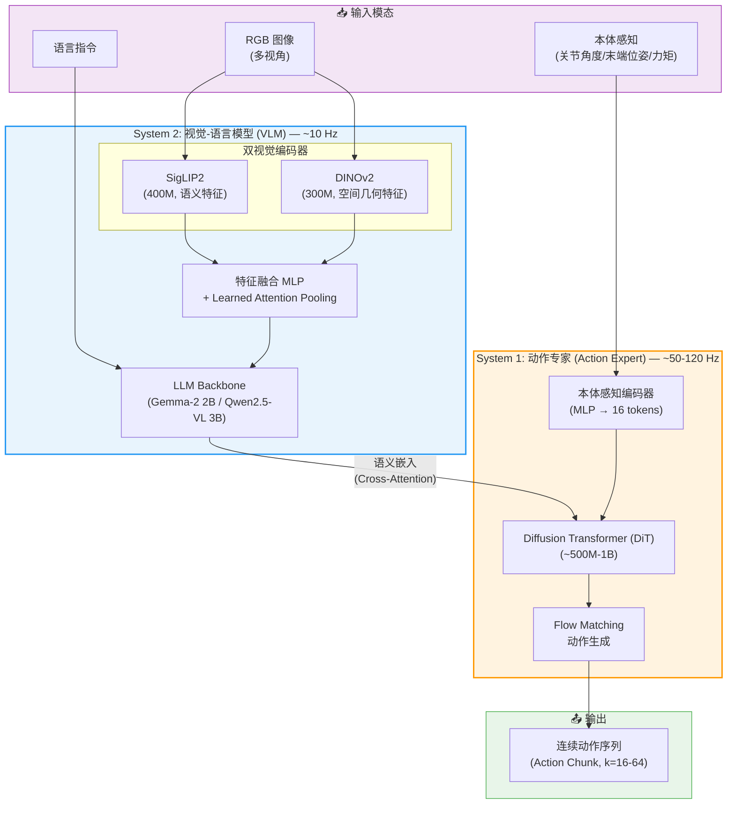

### 1.3 模型规模总览

| 组件 | 参数量 | 说明 |
|------|--------|------|
| SigLIP2 视觉编码器 | ~400M | ViT-SO400M，语义对齐特征 |
| DINOv2 视觉编码器 | ~300M | ViT-L/14，空间几何特征 |
| 特征融合投影层 | ~50M | MLP + Attention Pooling |
| LLM Backbone | ~2-3B | Gemma-2 2B 或 Qwen2.5-VL 3B |
| 本体感知编码器 | ~10M | 2-layer MLP + Learned Query Tokens |
| DiT Action Expert | ~500M-1B | 24 层 DiT blocks，hidden_dim=1024 |
| **总计** | **~3.5-5B** | |

> **关键考量**：GEN-0/GEN-1 (Generalist AI, 2025-2026) 的实证研究表明，模型需要达到 **6-7B 参数** 才能有效利用大规模预训练数据。但考虑到实时推理需求（机器人端部署），我们在 VLM 侧选择 2-3B 并通过 Action Expert 解耦来平衡能力与延迟。若推理完全在云端进行，建议将 VLM 扩大至 7B。

---

## 2. 模型网络结构详细设计

### 2.1 视觉编码器：双编码器融合

#### 设计依据

OpenVLA (Stanford, 2024) 率先验证了 **SigLIP + DINOv2 双编码器** 的有效性：

- **SigLIP2** 擅长语义理解（"这是一个红色杯子"），基于对比学习的图文对齐
- **DINOv2** 擅长空间几何特征（物体边界、深度估计、抓取点），基于自监督学习

CVPR 2025 的数据中心研究进一步证实，DINOv2 在 PASCAL VOC 分割上达到 83.1 mIoU（vs SigLIP2 的 72.7），而 SigLIP2 在语义检索任务上显著领先。

#### 网络细节

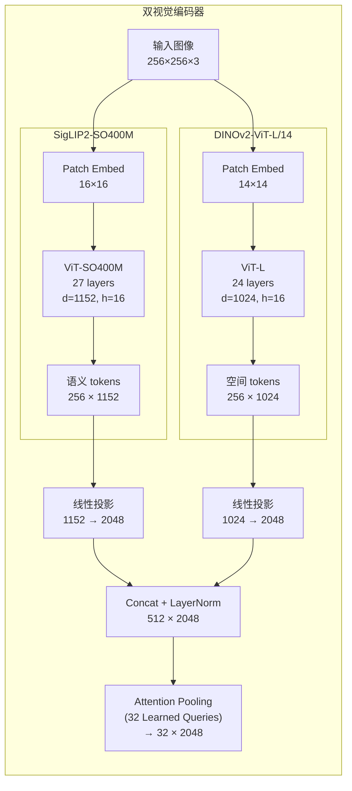

**配置要点**：

- 输入分辨率：256×256（单视角）或多视角拼接
- 多视角处理：对每个视角独立编码，然后在 token 维度拼接
- 微调策略：LoRA (rank=16) 应用于两个编码器的 QKV 投影层，仅更新 1.4% 参数
- Attention Pooling：32 个 learned query tokens 通过 cross-attention 从 512 个视觉 tokens 中提取紧凑表示

### 2.2 语言编码器

语言编码器 **内置于 VLM backbone 中**，无需独立模块。以 Gemma-2 2B 为例：

- Tokenizer：SentencePiece (256K vocab)
- 语言 tokens 与视觉 tokens 在 LLM 的输入序列中 **交错排列 (interleaved)**
- 语言指令格式：`"<image> Pick up the red cup and place it on the shelf"`

对于缺少语言标注的纯视频数据（预训练阶段常见），使用 **VLM 自动标注**（参考 SmolVLA 的做法）或预训练的逆动力学模型生成伪指令。

### 2.3 本体感知编码器

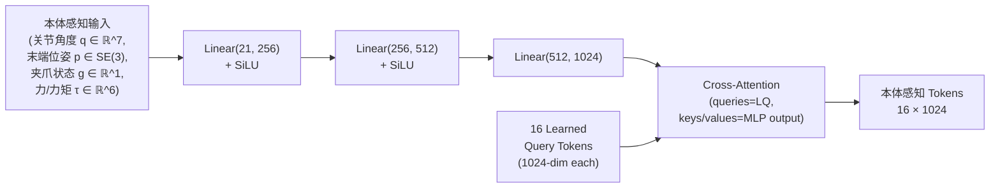

**关键设计**（参考 HPT, MIT/Meta, 2024）：

- 无论机器人有多少自由度，本体感知始终编码为 **固定 16 个 tokens**
- 通过 Learned Query + Cross-Attention 机制实现维度归一化
- 不同机器人的 MLP 权重可以共享（统一动作空间下）或独立（per-embodiment stem）
- 输入向量零填充至最大维度（max_dim=64），并附加 embodiment_id embedding

### 2.4 LLM Backbone（System 2 核心）

推荐选择 **Gemma-2 2B** 或 **Qwen2.5-VL 3B**：

| 特性 | Gemma-2 2B | Qwen2.5-VL 3B |
|------|-----------|----------------|
| 参数量 | 2.6B | 3.1B |
| 上下文长度 | 8192 | 32768 |
| 视觉理解 | 通过 PaliGemma 适配 | 原生多模态 |
| 开源许可 | Apache 2.0 | Apache 2.0 |
| 机器人领域验证 | pi0 使用 PaliGemma | 多个中文机器人项目 |
| 推理延迟 (A100) | ~40ms/token | ~50ms/token |

**LLM 内部结构**：
- 输入序列：`[视觉tokens (32)] [语言tokens (variable)] [readout tokens (8)]`
- Readout tokens（参考 Octo）：从 LLM 最后一层提取的 8 个 learned tokens，作为传递给 Action Expert 的条件向量
- 注意力掩码：Blockwise causal（当前帧可看到历史帧，不可看到未来帧）

### 2.5 DiT Action Expert（System 1 核心）

这是整个模型的动作生成核心，采用 **Diffusion Transformer + Flow Matching** 架构：

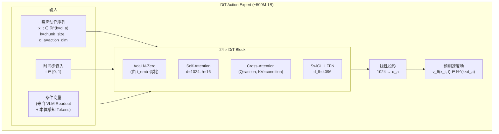

**DiT Block 详细结构**：

每个 DiT Block 的前向传播：

$$
\begin{aligned}
\gamma_1, \beta_1, \alpha_1, \gamma_2, \beta_2, \alpha_2 &= \text{AdaLN-MLP}(t_{\text{emb}}) \\
\mathbf{h} &= \mathbf{x} + \alpha_1 \cdot \text{SelfAttn}\!\left(\text{LayerNorm}(\mathbf{x}) \cdot (1 + \gamma_1) + \beta_1\right) \\
\mathbf{h} &= \mathbf{h} + \text{CrossAttn}(\mathbf{h}, \mathbf{c}_{\text{VLM}}) \\
\mathbf{x} &= \mathbf{h} + \alpha_2 \cdot \text{FFN}\!\left(\text{LayerNorm}(\mathbf{h}) \cdot (1 + \gamma_2) + \beta_2\right)
\end{aligned}
$$

其中 $t_{\text{emb}}$ 是 flow matching 的时间步嵌入（正弦位置编码 + MLP），$\mathbf{c}_{\text{VLM}}$ 是 VLM readout tokens 与本体感知 tokens 的拼接。

**Action Chunking 配置**：

| 任务类型 | Chunk Size $k$ | 控制频率 | 说明 |
|---------|--------|---------|------|
| 粗操作（pick-and-place） | 64 | 10 Hz | 长预测窗口，减少推理次数 |
| 精细操作（螺丝拧紧） | 16 | 50 Hz | 短窗口，快速反应 |
| 灵巧操作（布料折叠） | 32 | 30 Hz | 平衡精度与效率 |

推理时使用 **时序集成 (Temporal Ensembling)**：相邻 chunk 的重叠部分通过指数加权平均进行平滑：

$$
\hat{a}_t = \frac{\sum_{i} w_i \cdot a_t^{(i)}}{\sum_{i} w_i}, \quad w_i = \exp(-\lambda \cdot \delta_i)
$$

其中 $\delta_i$ 是动作 $a_t^{(i)}$ 在其所属 chunk 中的相对位置偏移，$\lambda$ 为衰减系数（通常取 0.01）。

### 2.6 统一动作空间 (Unified Action Space)

为支持跨具身体预训练，采用 **物理可解释统一动作空间** (参考 RDT-1B, Tsinghua ICLR 2025)：

$$
\mathbf{a}_{\text{unified}} = \begin{bmatrix} \Delta p_x & \Delta p_y & \Delta p_z & \Delta r_x & \Delta r_y & \Delta r_z & g_1 & \cdots & g_n & 0 & \cdots & 0 \end{bmatrix}^\top \in \mathbb{R}^{D_{\max}}
$$

- 前 6 维：末端执行器 SE(3) 增量（相对位姿变化），统一归一化到 $[-1, 1]$
- 接下来 $n$ 维：夹爪/手指关节状态
- 剩余维度：零填充至 $D_{\max} = 128$
- 附加 **embodiment_id** 作为条件输入（one-hot 或 learned embedding）

**归一化方案**：

$$
\tilde{a}_d = \frac{a_d - q_{1\%}^{(d)}}{q_{99\%}^{(d)} - q_{1\%}^{(d)}} \times 2 - 1
$$

其中 $q_{1\%}^{(d)}$ 和 $q_{99\%}^{(d)}$ 分别是训练数据中第 $d$ 维动作的第 1 和第 99 百分位数。

---

## 3. 数据方案

### 3.1 数据来源与规模

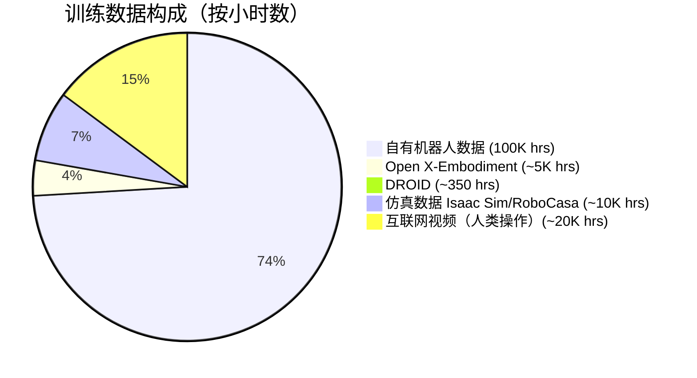

#### 3.1.1 自有数据（100,000 小时）

这是核心资产。假设数据包含：

| 数据项 | 规格 | 说明 |
|--------|------|------|
| 视频帧 | 640×480, 30 fps | 第一人称（Eye-in-hand 或头部相机） |
| 动作标签 | 末端位姿 + 关节角度, 10-50 Hz | 通过遥操作系统记录 |
| 本体感知 | 关节角/角速度/力矩, 100-1000 Hz | 降采样至与动作标签同频 |
| 语言标注 | 自然语言任务描述 | **可能缺失** — 需要自动标注 |
| 估算轨迹数 | ~10M-50M episodes | 按平均 1-3 分钟/episode 估算 |
| 估算存储量 | ~200-500 TB (原始) | 压缩后 ~50-100 TB |

#### 3.1.2 开源补充数据

| 数据集 | 规模 | 机器人类型 | 特点 |
|--------|------|-----------|------|
| **Open X-Embodiment** | 1M+ 轨迹, 22 种机器人 | 多样 | 最大跨具身体数据集 |
| **DROID** | 76K 轨迹, 350 hrs | Franka Panda | 564 场景, 86 任务 |
| **BridgeData V2** | 60K 轨迹 | WidowX 250 | 24 环境, 13 技能 |
| **RH20T** | 110K episodes, 40TB | 多种 | 50M+ 帧, 力触觉数据 |

#### 3.1.3 仿真数据（10,000 小时）

使用 **NVIDIA Isaac Sim** 或 **MuJoCo + RoboCasa** 生成：

- 利用 **MimicGen** 从少量人类示教 (~200 条) 自动扩增至 50K+ 条轨迹
- 利用 **GR00T-Dreams** 式的合成数据管线自动生成多样化场景
- 仿真数据用于：
  - 覆盖安全关键场景（碰撞恢复、异常处理）
  - 补充长尾任务的样本不足
  - 域随机化 (Domain Randomization) 增强泛化

#### 3.1.4 互联网人类操作视频（20,000 小时）

- 来源：YouTube 人类操作视频（洗碗、折叠衣物、烹饪等）
- 用途：视频预训练阶段的世界模型学习（不含动作标签）
- 处理：训练逆动力学模型 (IDM) 推断伪动作标签，或仅用于视频预测训练

### 3.2 数据格式与预处理流水线

统一到 **RLDS (Reinforcement Learning Datasets) 格式**：

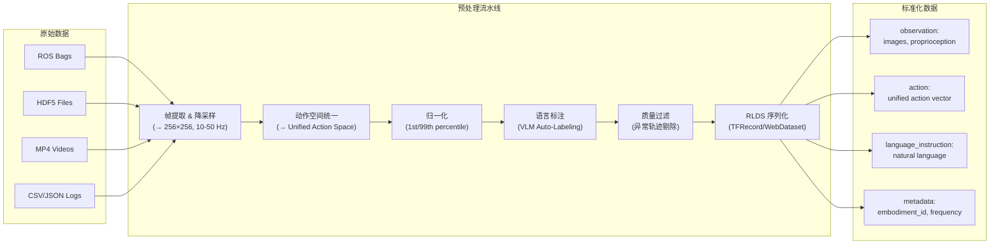

**自动语言标注策略**（针对无标注视频数据）：

1. 使用预训练 VLM（如 GPT-4V / Qwen-VL）对每条轨迹的关键帧进行 captioning
2. 生成格式：`"The robot [verb] the [color] [object] [preposition] the [location]"`
3. 质量保证：随机抽样 5% 人工审核，标注准确率需 > 90%

### 3.3 数据增强

| 增强方法 | 适用阶段 | 效果 |
|---------|---------|------|
| **颜色抖动 (Color Jittering)** | 全阶段 | 亮度/对比度/饱和度随机扰动 |
| **随机裁剪 + 缩放** | 全阶段 | 空间泛化 |
| **相机视角随机化** | 仿真阶段 | 视角鲁棒性 |
| **MimicGen SE(3) 变换** | 仿真+真实 | 从 200 条扩增至 50K+ 条 |
| **文本改写 (Paraphrasing)** | 全阶段 | 使用 LLM 改写语言指令 |
| **背景替换** | 仿真阶段 | 使用扩散模型替换背景纹理 |
| **RoVi-Aug 跨具身体增强** | 全阶段 | 扩散模型生成不同机器人/视角的图像 |

---

## 4. 训练方案

### 4.1 三阶段训练流程

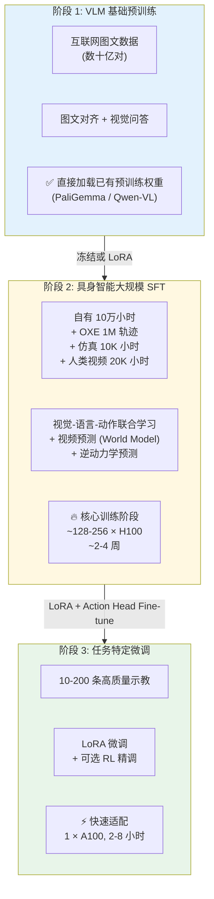

### 4.2 阶段 2 详细训练配置

这是最关键的训练阶段。

#### 4.2.1 数据混合策略

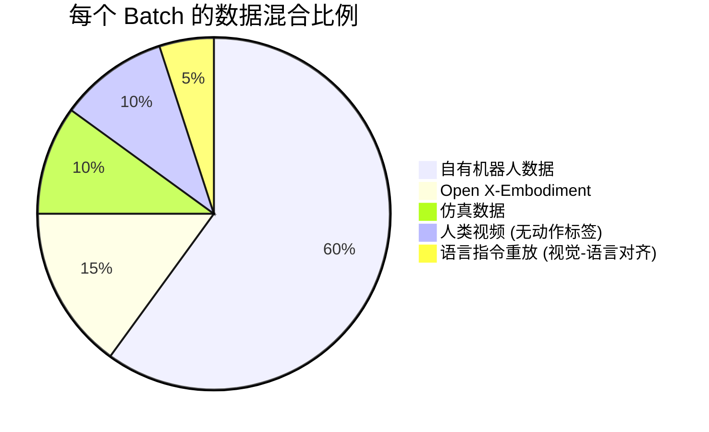

**混合策略要点**：

- 自有数据占主导 (60%)，确保模型适配目标机器人
- OXE 提供跨具身体泛化能力 (15%)
- 仿真数据补充安全关键场景与长尾任务 (10%)
- 人类视频用于世界模型预训练，不参与动作损失计算 (10%)
- 少量视觉-语言对齐数据防止 VLM 灾难性遗忘 (5%)

#### 4.2.2 课程学习策略

```mermaid
gantt
    title 训练课程安排
    dateFormat  X
    axisFormat %s
    
    section 数据复杂度
    简单操作 (pick/place)     :a1, 0, 30
    中等操作 (tool use)       :a2, 20, 70
    复杂操作 (long-horizon)   :a3, 50, 100
    
    section 训练目标
    动作预测为主              :b1, 0, 40
    动作 + 视频预测           :b2, 30, 80
    全目标联合训练            :b3, 60, 100
    
    section Action Chunk Size
    k=16 (短窗口)             :c1, 0, 30
    k=32 (中窗口)             :c2, 20, 60
    k=64 (长窗口)             :c3, 50, 100
```

#### 4.2.3 超参数设置

| 超参数 | 值 | 说明 |
|--------|-----|------|
| 总训练步数 | 500K-1M steps | 参考 pi0 的 700K steps |
| Global Batch Size | 2048 | 分布在 128-256 GPUs |
| Per-GPU Batch Size | 8-16 | 取决于 GPU 显存 |
| 学习率 (LLM) | 1e-4 → 1e-6 (cosine) | Warmup 5K steps |
| 学习率 (DiT) | 3e-4 → 1e-6 (cosine) | Warmup 5K steps |
| 学习率 (Vision Encoder LoRA) | 5e-5 | 较低的 LR 防止遗忘 |
| LoRA Rank (VLM) | 16 | 平衡效率与表达力 |
| LoRA Rank (Vision) | 8 | 视觉特征更稳定 |
| Weight Decay | 0.01 | AdamW |
| Gradient Clipping | 1.0 | Max norm |
| 精度 | bf16 | 全链路混合精度 |
| Flow Matching 步数 (推理) | 10 | τ: 0 → 1, 均匀间隔 |
| Action Chunk Size | 16 → 64 (课程递增) | |
| 图像分辨率 | 256 × 256 | |
| 序列长度 (VLM) | 512 tokens | 32 vision + N language + 8 readout |
| Dropout | 0.0 | 大规模预训练通常不用 dropout |
| EMA Decay | 0.9999 | 用于推理模型的权重平滑 |

#### 4.2.4 分布式训练配置

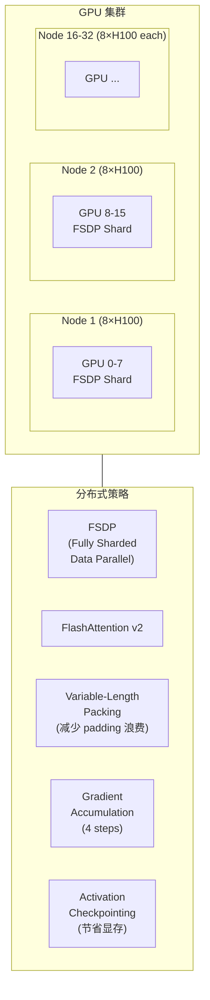

---

## 5. 训练任务与 Loss Function

### 5.1 训练任务总览

本方案采用 **多任务联合训练**，包含 1 个主任务和 3 个辅助任务：

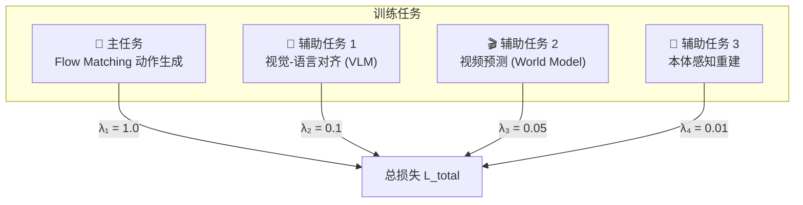

### 5.2 主任务：Flow Matching 动作生成

#### 5.2.1 原理

Flow Matching 学习一个速度场 $v_\theta$，它定义了从高斯噪声 $\mathbf{x}_0 \sim \mathcal{N}(\mathbf{0}, \mathbf{I})$ 到目标动作分布 $\mathbf{x}_1 \sim p_{\text{data}}$ 的确定性传输映射。相比 DDPM 的随机去噪过程，Flow Matching 使用 ODE（常微分方程）积分，具有更快的推理速度和更稳定的训练。

#### 5.2.2 训练过程

给定一条真实动作序列 $\mathbf{x}_1 \in \mathbb{R}^{k \times d_a}$（一个 action chunk）：

**Step 1：采样时间步和噪声**

$$
t \sim \mathcal{U}[0, 1], \quad \mathbf{x}_0 \sim \mathcal{N}(\mathbf{0}, \mathbf{I})
$$

**Step 2：构造插值样本**（线性插值 / Optimal Transport 路径）

$$
\mathbf{x}_t = (1 - t) \cdot \mathbf{x}_0 + t \cdot \mathbf{x}_1
$$

**Step 3：计算目标速度场**

$$
\mathbf{u}_t = \mathbf{x}_1 - \mathbf{x}_0
$$

这是条件最优传输 (Conditional OT) 路径下的恒定速度。

**Step 4：计算 Flow Matching 损失**

$$
\boxed{\mathcal{L}_{\text{FM}} = \mathbb{E}_{t \sim \mathcal{U}[0,1],\, \mathbf{x}_0 \sim \mathcal{N}(\mathbf{0}, \mathbf{I}),\, \mathbf{x}_1 \sim p_{\text{data}}} \left[ \left\| \mathbf{u}_t - v_\theta(\mathbf{x}_t, t, \mathbf{c}) \right\|^2 \right]}
$$

其中 $\mathbf{c}$ 是条件向量（VLM readout + 本体感知 tokens），$v_\theta$ 是 DiT Action Expert 预测的速度场。

#### 5.2.3 推理过程

从纯噪声出发，通过 ODE 积分生成动作：

$$
\mathbf{x}_1 = \mathbf{x}_0 + \int_0^1 v_\theta(\mathbf{x}_t, t, \mathbf{c}) \, dt
$$

实践中使用 **欧拉法 (Euler Method)** 离散化，10 步积分：

$$
\mathbf{x}_{t+\Delta t} = \mathbf{x}_t + \Delta t \cdot v_\theta(\mathbf{x}_t, t, \mathbf{c}), \quad \Delta t = 0.1
$$

> **对比 DDPM**：DDPM 需要 16-1000 步去噪，每步包含一个神经网络前向传播。Flow Matching 仅需 10 步，推理延迟降低 2-100 倍。GR00T N1 实测：16-action chunk 的 DiT 推理仅需 63.9ms (H100)。

#### 5.2.4 进阶优化：Action-to-Action (A2A) Flow Matching

2026 年 2 月提出的 A2A 方法进一步优化了 Flow Matching：不再从随机噪声 $\mathbf{x}_0 \sim \mathcal{N}(\mathbf{0}, \mathbf{I})$ 出发，而是 **从当前本体感知状态** 出发：

$$
\mathbf{x}_0 = f_{\text{prop}}(\mathbf{s}_t), \quad \mathbf{x}_t = (1-t) \cdot f_{\text{prop}}(\mathbf{s}_t) + t \cdot \mathbf{x}_1
$$

直觉：机器人控制不需要从完全随机的位置出发——它始终从当前姿态开始。这消除了从噪声到有意义初始状态的"冷启动"浪费，轨迹平滑度提升 93.7%。

### 5.3 辅助任务 1：视觉-语言对齐

VLM backbone 的标准 Next-Token Prediction 损失，用于保持视觉-语言理解能力不退化：

$$
\mathcal{L}_{\text{VLA}} = -\sum_{i=1}^{N} \log p_\theta(w_i \mid w_{<i}, \mathbf{v})
$$

其中 $w_i$ 是语言 token，$\mathbf{v}$ 是视觉 token 序列。

**应用场景**：
- 对有语言标注的数据：正常计算语言建模损失
- 对无语言标注的数据：使用 VLM 自动生成的 caption 作为伪标签

### 5.4 辅助任务 2：视频预测 (World Model)

受 GR-2 (ByteDance) 启发，视频预测作为辅助任务可以让模型学习环境动力学：

$$
\mathcal{L}_{\text{video}} = \mathbb{E} \left[ \left\| \hat{\mathbf{I}}_{t+1} - \mathbf{I}_{t+1} \right\|_1 + \lambda_{\text{perc}} \cdot \mathcal{L}_{\text{perceptual}}(\hat{\mathbf{I}}_{t+1}, \mathbf{I}_{t+1}) \right]
$$

其中 $\hat{\mathbf{I}}_{t+1}$ 是模型预测的下一帧图像特征，$\mathcal{L}_{\text{perceptual}}$ 是基于预训练 VGG/LPIPS 的感知损失。

**实现方式**：在 VLM 的输出端添加一个轻量视频解码头（3 层 ConvTranspose），预测下一帧的视觉特征（而非原始像素，以降低计算成本）。

### 5.5 辅助任务 3：本体感知重建

自监督任务，增强模型对机器人状态的理解：

$$
\mathcal{L}_{\text{prop}} = \left\| \hat{\mathbf{s}}_{t+1} - \mathbf{s}_{t+1} \right\|^2
$$

从当前 VLM 表示和当前动作预测下一步的本体感知状态（关节角度、末端位姿）。

### 5.6 总损失函数

$$
\boxed{\mathcal{L}_{\text{total}} = \underbrace{\lambda_1 \cdot \mathcal{L}_{\text{FM}}}_{\text{动作生成 (主)}} + \underbrace{\lambda_2 \cdot \mathcal{L}_{\text{VLA}}}_{\text{视觉-语言对齐}} + \underbrace{\lambda_3 \cdot \mathcal{L}_{\text{video}}}_{\text{视频预测}} + \underbrace{\lambda_4 \cdot \mathcal{L}_{\text{prop}}}_{\text{本体感知重建}}}
$$

| 损失项 | 权重 $\lambda$ | 梯度回传路径 |
|--------|--------|------------|
| $\mathcal{L}_{\text{FM}}$ | 1.0 | DiT Expert + VLM Readout (LoRA) |
| $\mathcal{L}_{\text{VLA}}$ | 0.1 | VLM 全链路 (LoRA) |
| $\mathcal{L}_{\text{video}}$ | 0.05 | VLM + Video Decoder |
| $\mathcal{L}_{\text{prop}}$ | 0.01 | 本体感知编码器 + VLM Readout |

**权重调度**：训练初期 $\lambda_2$ 较大（0.3）以稳定 VLM 表示，随训练进行线性衰减至 0.1。

### 5.7 可选：FAST Tokenizer 辅助分支

作为消融实验或补充训练信号，可以添加 **FAST 离散动作预测分支**：

1. 对动作 chunk 应用 DCT 变换：$\mathbf{A}_{\text{freq}} = \text{DCT}(\mathbf{a}_{1:k})$
2. 量化 + BPE 压缩为 8-16 个离散 token
3. 通过 VLM 的自回归头预测这些 token（Cross-Entropy 损失）

$$
\mathcal{L}_{\text{FAST}} = -\sum_{j=1}^{M} \log p_\theta(z_j \mid z_{<j}, \mathbf{v}, \mathbf{l})
$$

其中 $z_j$ 是 FAST token，$M \approx 8\text{-}16$。这个分支是 **可选的**，pi0-FAST 的实验表明它能提供 5x 训练加速，但不一定优于纯 Flow Matching。

---

## 6. 基础设施需求

### 6.1 计算资源估算

#### 6.1.1 训练 FLOPs 估算

基于 Chinchilla 缩放法则和类似规模模型的经验数据：

$$
C \approx 6 \times N \times D
$$

其中 $N$ 为参数量，$D$ 为训练 tokens 数量。

| 参数 | 值 | 说明 |
|------|-----|------|
| 模型参数量 $N$ | 4B | 训练中活跃的参数 |
| 训练 tokens $D$ | ~100B | 10万小时 × 10Hz × 512 tokens/step |
| 估算 FLOPs $C$ | ~2.4 × 10²¹ | $6 \times 4 \times 10^9 \times 10^{11}$ |
| H100 峰值性能 | ~990 TFLOPS (bf16) | |
| MFU (Model FLOPs Utilization) | ~40-50% | 实际利用率 |
| 有效单卡吞吐 | ~400 TFLOPS | |

$$
\text{GPU-hours} = \frac{C}{\text{有效吞吐}} = \frac{2.4 \times 10^{21}}{400 \times 10^{12} \times 3600} \approx 1{,}667 \text{ GPU-hours}
$$

考虑到多模态数据加载、通信开销和课程学习的额外成本，实际需要 **~3x-5x 的理论值**：

| 配置方案 | GPU 数量 | 预计训练时间 | 总 GPU-hours |
|---------|---------|------------|-------------|
| **方案 A (推荐)** | 128 × H100 | ~2-3 周 | ~5,000-8,000 |
| 方案 B (加速) | 256 × H100 | ~1-2 周 | ~5,000-8,000 |
| 方案 C (经济) | 64 × H100 | ~4-6 周 | ~5,000-8,000 |

> **参考基准**：OpenVLA (7B) 在 64×A100 上训练 14 天 = 21,500 A100-hours。我们的模型更小 (4B)，但数据量更大 (100K hrs vs ~5K hrs)，且采用更高效的 Flow Matching，总计算量在同一数量级。

#### 6.1.2 存储需求

| 存储类别 | 容量 | 说明 |
|---------|------|------|
| 原始数据 | ~200-500 TB | 视频 + 传感器数据 |
| 预处理后数据 | ~50-100 TB | 降采样 + 压缩后的 RLDS 格式 |
| 模型 Checkpoints | ~50 GB × 20 = 1 TB | 每 25K steps 保存一次 |
| 训练日志 / 指标 | ~100 GB | TensorBoard / W&B |
| **总计** | **~100-600 TB** | 取决于数据压缩策略 |

推荐使用高带宽并行文件系统（如 Lustre、GPFS 或对象存储 + 本地 NVMe 缓存）。

#### 6.1.3 网络需求

- 节点间：**InfiniBand HDR (200 Gbps)** 或 **NVIDIA NVLink/NVSwitch**
- 多节点 FSDP 通信量大，低延迟高带宽网络是瓶颈
- 参考 GR00T N1.5：使用 3.2T RDMA 后端网络

### 6.2 软件栈

| 组件 | 推荐选择 | 备选 |
|------|---------|------|
| 深度学习框架 | PyTorch 2.x + FSDP | JAX + Flax (TPU) |
| 注意力优化 | FlashAttention v2 | xFormers |
| 混合精度 | torch.cuda.amp (bf16) | |
| 数据加载 | WebDataset + DataLoader | TFDS / RLDS Loader |
| 分布式 | torchrun + FSDP | DeepSpeed ZeRO-3 |
| 实验追踪 | Weights & Biases | TensorBoard |
| 模型格式 | SafeTensors | ONNX (部署) |
| 推理优化 | TensorRT / vLLM | ONNX Runtime |

---

## 7. 评估方案

### 7.1 评估体系

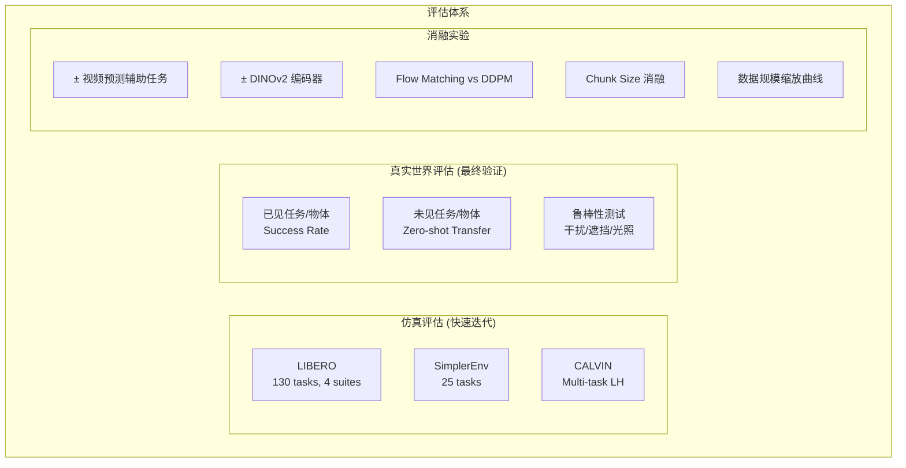

### 7.2 核心指标

| 指标 | 定义 | 目标 |
|------|------|------|
| **Task Success Rate** | 任务完成次数 / 总尝试次数 | > 85% (seen), > 60% (unseen) |
| **LIBERO-Long Score** | LIBERO 长时序任务套件的平均成功率 | > 90% |
| **Zero-shot Transfer Rate** | 未见物体/场景的成功率 | > 50% |
| **Action Prediction Error** | 预测动作与真实动作的 MSE | 持续下降 (缩放曲线) |
| **Inference Latency** | 单次 action chunk 生成延迟 | < 50ms (H100) |
| **Fine-tuning Efficiency** | 达到 90% 性能所需的示教数量 | < 50 demonstrations |

### 7.3 消融实验设计

| 实验 | 变量 | 预期结论 |
|------|------|---------|
| 双编码器 vs 单编码器 | 移除 DINOv2 | 空间任务性能下降 5-15% |
| Flow Matching vs DDPM | 替换为 DDPM (100 steps) | 推理延迟增加 10-20x，性能相当 |
| 有/无视频预测 | 移除 $\mathcal{L}_{\text{video}}$ | 长时序任务泛化下降 |
| Chunk Size | k ∈ {8, 16, 32, 64} | k=32 是精度-效率最优点 |
| 数据缩放 | 1K, 10K, 100K hours | 绘制 power-law 缩放曲线 |
| 模型缩放 | 1B, 2B, 4B, 7B | 验证 6-7B 阈值效应 |
| LoRA vs Full FT | 阶段 3 微调方式 | LoRA 在少样本下更稳定 |
| A2A vs 标准 FM | 噪声起点选择 | A2A 平滑度提升，精度相当 |

---

## 8. 风险与缓解

| 风险 | 影响 | 缓解措施 |
|------|------|---------|
| **数据质量不均** | 低质量轨迹污染训练 | 异常检测过滤 + 数据质量评分加权采样 |
| **灾难性遗忘** | VLM 微调后丧失语言理解能力 | LoRA 微调 + 视觉-语言对齐辅助损失 + 数据混合 |
| **跨具身体动作冲突** | 不同机器人的同一任务对应不同动作模式 | 统一动作空间 + embodiment_id 条件 |
| **仿真-真实差距** | 仿真训练数据不迁移到真实 | 域随机化 + Sim-then-Real 策略 |
| **推理延迟过高** | 无法满足实时控制需求 | 双系统解耦 + TensorRT 优化 + 模型蒸馏 |
| **训练不稳定** | Loss 发散或 NaN | Gradient Clipping + bf16 + 学习率 Warmup |
| **语言标注缺失** | 部分数据无语言描述 | VLM 自动标注 + 人工审核抽样 |

---

## 9. 参考文献

### 核心模型论文

| 模型 | 机构 | 年份 | 参数量 | 关键贡献 |
|------|------|------|--------|---------|
| RT-2 | Google DeepMind | 2023 | 12-55B | 开创 VLA 范式 |
| Octo | UC Berkeley | 2024 | 93M | 开源跨具身体预训练，DDPM 动作头 |
| OpenVLA | Stanford/Berkeley | 2024 | 7B | SigLIP+DINOv2 双编码器，开源 VLA |
| OpenVLA-OFT | Stanford | 2025 | 7B | L1 回归替代离散化，26x 推理加速 |
| pi0 | Physical Intelligence | 2024 | 3B | 首个 Flow Matching VLA |
| pi0-FAST | Physical Intelligence | 2025 | 3B | FAST (DCT+BPE) 动作 tokenizer |
| RDT-1B | 清华大学 | 2024 | 1.2B | DiT 扩散策略，统一动作空间 |
| HPT | MIT/Meta | 2024 | 1B | 异构预训练，固定 32-token 表示 |
| GR-2 | 字节跳动 | 2024 | - | 38M 视频预训练世界模型 |
| GR-3 | 字节跳动 Seed | 2025 | 4B | MoT + DiT Flow Matching |
| GR00T N1 | NVIDIA | 2025 | 2.2B | 双系统架构，数据金字塔 |
| SmolVLA | Hugging Face | 2025 | 450M | 最小竞争力 VLA，487 社区数据集 |
| Gemini Robotics | Google DeepMind | 2025 | - | 基于 Gemini 2.0 的 VLA |

### 关键技术论文

- **Flow Matching**: Lipman et al., "Flow Matching for Generative Modeling" (ICLR 2023)
- **Diffusion Policy**: Chi et al., "Diffusion Policy" (IJRR 2025)
- **FAST Tokenizer**: Physical Intelligence, arXiv:2501.09747 (2025)
- **Action Chunking (ACT)**: Zhao et al., arXiv:2304.13705 (2023)
- **MimicGen**: Mandlekar et al., arXiv:2310.17596 (2023)
- **Scaling Laws for Embodied AI**: Sartor et al., arXiv:2405.14005 (2024)
- **A2A Flow Matching**: arXiv:2602.07322 (2026)

### 数据集

- **Open X-Embodiment**: arXiv:2310.08864 — 1M+ 轨迹, 22 种机器人
- **DROID**: arXiv:2403.12945 — 76K 轨迹, 350 小时
- **BridgeData V2**: arXiv:2308.12952 — 60K 轨迹
- **RH20T**: arXiv:2307.00595 — 110K episodes, 50M+ 帧
- **RoboCasa**: arXiv:2406.02523 — 100+ 任务仿真基准
