# 具身智能预训练模型设计与实施方案

> **目标**: 基于 10 万小时多模态具身智能数据, 设计并训练一个通用具身智能预训练基础模型 (Embodied Foundation Model), 使其能够在多种机器人平台和操作任务上实现高效迁移。
>
> 本文档从数据、模型、训练、评估四个维度给出完整的设计方案, 每个设计选择都说明 **WHY (为什么)** 和 **HOW (怎么做)**。

---

## 目录

- [0. 执行摘要](#0-执行摘要)
- [1. 问题分析与设计约束](#1-问题分析与设计约束)
- [2. 数据体系设计](#2-数据体系设计)
- [3. 模型架构设计](#3-模型架构设计)
- [4. 预训练任务与损失函数](#4-预训练任务与损失函数)
- [5. 训练方案](#5-训练方案)
- [6. 评估体系](#6-评估体系)
- [7. 下游微调策略](#7-下游微调策略)
- [8. 算力估算与工程实施](#8-算力估算与工程实施)
- [9. 风险与缓解](#9-风险与缓解)
- [10. 里程碑与时间线](#10-里程碑与时间线)

---

## 0. 执行摘要

### 核心设计选择

| 维度 | 选择 | 理由 |
|------|------|------|
| **模型范式** | Vision-Language-Action (VLA) + Flow Matching | 当前 SOTA; 连续动作空间表达能力强; 支持高频控制 |
| **模型规模** | 4B 参数 (2.5B VLM backbone + 1.5B action expert) | 平衡能力与部署效率; Orin 可部署 |
| **训练范式** | 三阶段: VLM 热启动 → 大规模预训练 → 任务微调 | 复用互联网语义知识; 最大化数据利用 |
| **数据策略** | 10 万小时自有 + 公开数据集 + 合成数据 | 保证多样性; 覆盖长尾场景 |
| **动作表示** | Conditional Flow Matching + Action Chunking | 支持多模态动作分布; 高频平滑轨迹 |

### 预期产出

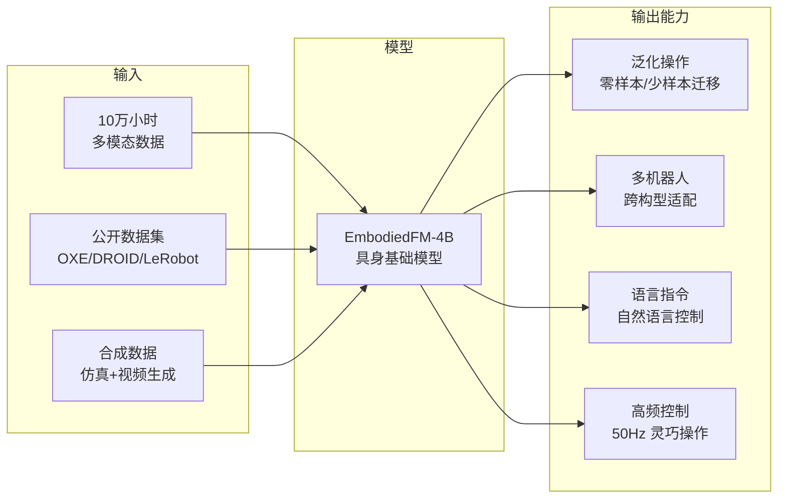

---

## 1. 问题分析与设计约束

### 1.1 为什么需要具身智能预训练

传统机器人学习方法 (单任务 RL / 行为克隆) 面临三个根本瓶颈:

1. **数据效率低**: 每个新任务需要数千条演示, 采集成本极高
2. **泛化能力弱**: 换环境/物体/光照就需要重新训练
3. **语义理解缺失**: 无法理解自然语言指令, 只能执行固定的预编程行为

预训练模型的核心价值: **将海量数据中的通用操作知识压缩到模型参数中, 使下游任务只需少量数据即可适配**。

类比: 正如 GPT 系列将互联网文本的语言知识压缩为可迁移的参数, 具身预训练模型将操作视频中的 "如何用手/臂完成任务" 的知识压缩为可迁移的视觉-动作映射。

### 1.2 10 万小时数据的规模定位

| 对标系统 | 训练数据量 | 模型大小 | 能力水平 |
|---------|-----------|---------|---------|
| Octo | ~800K 轨迹 (~2000 小时) | 93M | 单任务微调后可用 |
| OpenVLA | ~970K 轨迹 (~3000 小时) | 7B | 多任务泛化 |
| Pi0 | 10,000+ 小时 | 3.3B | 灵巧操作, 多构型 |
| GR00T N1 | 混合数据 ~5000 小时 | 2B | 人形机器人通用 |
| LingBot-VLA | 20,000 小时 | 4B | 双臂实机操作 |
| **本方案** | **100,000 小时** | **4B** | **通用具身基础模型** |

**10 万小时 ≈ Pi0 的 10 倍, LingBot-VLA 的 5 倍**。这一规模足以支撑:
- 覆盖 100+ 种操作技能的预训练
- 跨 10+ 种机器人构型的泛化
- 对长尾场景 (复杂装配、柔性物体) 的覆盖

### 1.3 设计约束

| 约束 | 具体要求 | 影响的设计决策 |
|------|---------|--------------|
| **部署目标** | Jetson Orin (64GB) / RTX 4090 (24GB) | 模型 ≤ 4B; 需支持 INT8/FP16 推理 |
| **控制频率** | 10-50 Hz | Action Chunking; Flow Matching (非自回归) |
| **多构型** | 单臂/双臂/人形/移动操作 | 异构动作空间处理; 构型标签 |
| **安全性** | 真机部署需限制动作幅度 | 动作空间裁剪; 置信度估计 |
| **训练预算** | ≤ 100K H100 GPU-hours | 高效训练策略; 分阶段训练 |

---

## 2. 数据体系设计

### 2.1 数据来源与构成

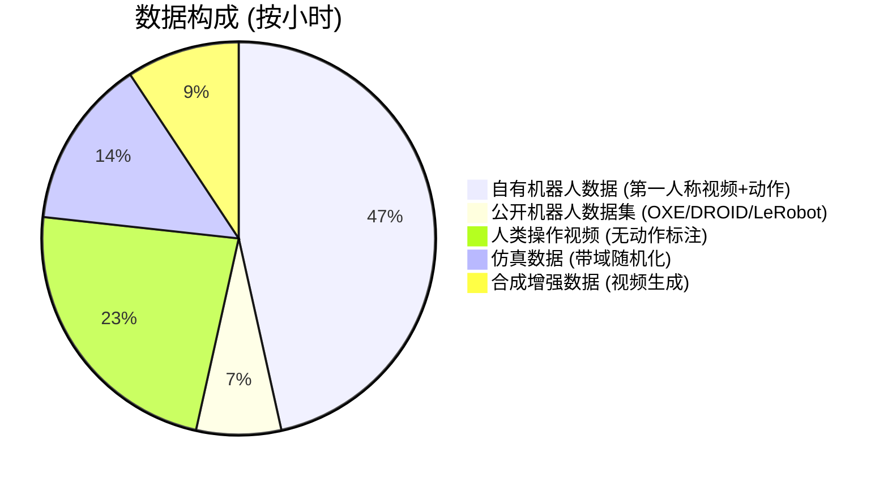

#### 2.1.1 自有数据 — 10 万小时 (核心资产)

假设数据来自自有机器人平台的遥操作/自主采集:

| 数据属性 | 规格 |
|---------|------|
| **视频** | 第一人称 RGB, 640×480 或 1280×720, 30 FPS |
| **深度** (可选) | 对齐的深度图, 640×480 |
| **关节状态** | 各关节位置/速度/力矩, 100-500 Hz |
| **末端状态** | TCP 位姿 (xyz + quaternion), 10-100 Hz |
| **动作命令** | 遥操作时的控制指令 (关节/笛卡尔), 与状态同频 |
| **语言标注** | 任务描述 (可后期标注, 每轨迹 1-3 句) |
| **元数据** | 机器人型号、场景描述、任务类别、成功/失败标记 |

**存储估算**:
- 视频: 640×480 @ 30 FPS ≈ 2 GB/小时 (H.264 压缩)
- 状态/动作: ~50 MB/小时
- 10 万小时 ≈ **200 TB** 原始数据 → 压缩后 ~**80 TB**

#### 2.1.2 公开数据集 — 补充多样性

| 数据集 | 规模 | 构型 | 用途 |
|--------|------|------|------|
| **Open X-Embodiment** | 1M+ 轨迹, 22 构型 | 单臂/双臂/四足 | 多构型泛化 |
| **DROID** | 76K 轨迹, 86 任务 | Franka 单臂 | 高质量操作数据 |
| **Bridge V2** | 60K+ 轨迹 | WidowX 桌面 | 桌面操作泛化 |
| **ALOHA** | 双臂精细操作 | 双臂 ALOHA | 双臂协调 |
| **LeRobot Hub** | 持续增长 | 多种 | 社区贡献 |

#### 2.1.3 人类操作视频 — 低成本大规模

来源: Ego4D, Something-Something V2, Epic-Kitchens, 自采集工厂视频

**为什么用人类视频**: VITRA (ICRA 2026) 证明, 将人类手部视为 "灵巧机器人末端执行器", 可从人类视频中学到可迁移的操作知识。1M episodes 的人类手部视频可显著提升零样本泛化。

**处理方式**: 无动作标注 → 使用 **Latent Action Pre-training (LAPA)** 方法:
1. 训练 VQ-VAE 从相邻帧中提取离散潜在动作
2. 在潜在动作空间上预训练 VLA
3. 微调时学习潜在动作到真实机器人动作的映射

#### 2.1.4 仿真数据 — 补充稀缺场景

| 仿真器 | 场景 | 用途 |
|--------|------|------|
| **ManiSkill 3** | 桌面操作, GPU 并行 | 大规模轨迹生成 |
| **IsaacLab** | 灵巧手, 全身操作 | 复杂动力学场景 |
| **RoboVerse** | 多仿真器统一接口 | 跨域泛化 |
| **RoboCasa** | 家庭环境 | 长程任务 |

**域随机化策略**: 光照、纹理、物体形状/颜色/质量、相机内外参、背景杂波。

#### 2.1.5 合成增强数据 — 视频生成扩充

GR00T N1 证明合成数据可带来 40% 的性能提升。方案:

1. **反事实增强 (Counterfactual Augmentation)**: 改变轨迹中的物体初始位置/姿态, 重新渲染
2. **视频生成模型**: 用 OpenSora/Wan 等扩散模型, 以真实轨迹为条件生成变体
3. **视角增强 (RoVi-Aug)**: 改变相机角度, 在真实场景中合成不同视角

### 2.2 数据格式与存储

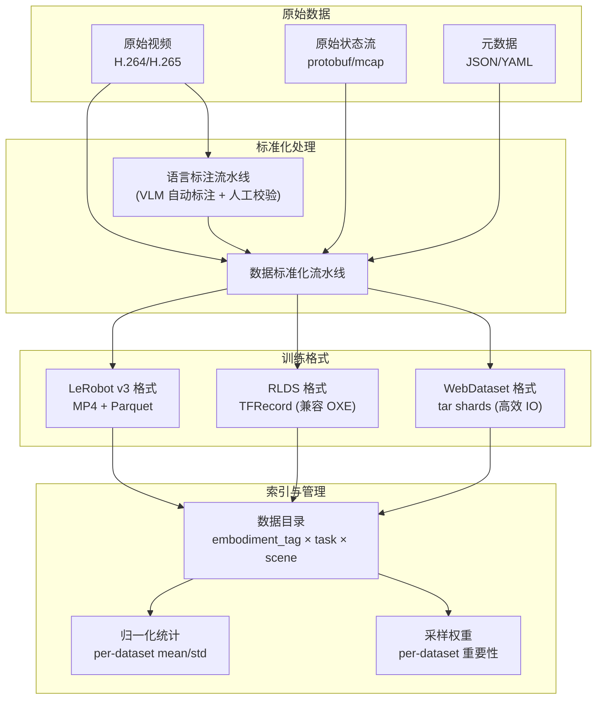

### 2.3 动作空间统一

**核心挑战**: 不同机器人的动作空间维度、语义、频率都不同。

**解决方案: 分层动作表示**

```
Level 3 (语义层):  自然语言指令 — "拿起红色杯子"
Level 2 (末端层):  7D 末端目标 — [x, y, z, roll, pitch, yaw, gripper]
Level 1 (关节层):  N-D 关节命令 — [q1, ..., qN]
Level 0 (力矩层):  N-D 关节力矩 — [τ1, ..., τN]
```

**预训练主要工作在 Level 2** (末端执行器空间):
- 统一为 7 维: $\mathbf{a} = [\Delta x, \Delta y, \Delta z, \Delta \text{roll}, \Delta \text{pitch}, \Delta \text{yaw}, g] \in \mathbb{R}^7$
- 其中 $g \in [0, 1]$ 为夹爪开合度
- 对不同构型:
  - **单臂**: 直接 7D
  - **双臂**: 拼接为 14D = $[\mathbf{a}_\text{left}, \mathbf{a}_\text{right}]$
  - **人形**: 上半身 $[\mathbf{a}_\text{left\_arm}, \mathbf{a}_\text{right\_arm}, \mathbf{a}_\text{torso}]$ + 下半身可选

**归一化**: 每个数据集独立计算 mean/std, 训练时归一化到 $\mathcal{N}(0, 1)$; 推理时反归一化。

**频率对齐**: 所有数据重采样到 **10 Hz** (预训练基准频率)。推理时可通过 Action Chunking 插值到更高频率。

### 2.4 语言标注

10 万小时数据的语言标注是关键瓶颈。方案:

1. **自动标注 (90% 数据)**: 用 GPT-4o / Qwen-VL 等大型 VLM 对视频片段自动生成任务描述
   - 每段 10-30 秒视频生成 1-3 句描述
   - 成本: ~$0.01/段 → 10M 段 ≈ $100K
2. **人工校验 (10% 数据)**: 对关键/复杂任务进行人工审核与修正
3. **层次化标注**: 同一轨迹提供多粒度描述
   - 粗粒度: "在桌子上整理物品"
   - 中粒度: "拿起红色杯子放到架子上"
   - 细粒度: "用右手从桌面 45 度角抓取杯柄, 提起后水平移动到架子第二层"

---

## 3. 模型架构设计

### 3.1 整体架构: Mixture-of-Experts VLA

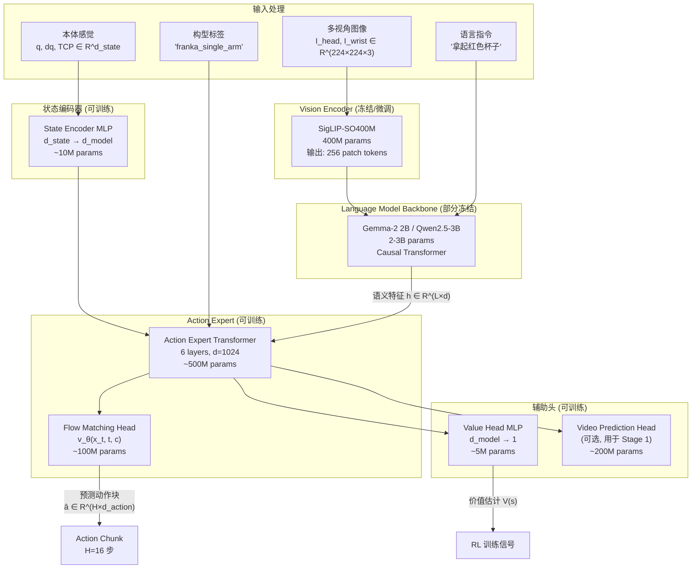

### 3.2 各模块详细设计

#### 3.2.1 Vision Encoder — SigLIP-SO400M

**选择理由**:
- SigLIP 在 VLA 领域已成为事实标准 (Pi0, OpenVLA, GR00T 均使用)
- SO400M 变体: 400M 参数, 输出 256 个 patch token (每个 d=1152)
- 在 WebLI 数据集上预训练, 具备强大的视觉语义理解能力

**输入**: $\mathbf{I} \in \mathbb{R}^{224 \times 224 \times 3}$ (多视角图像分别编码)

**输出**: $\mathbf{z}_\text{vis} = [\mathbf{z}_1, \mathbf{z}_2, \ldots, \mathbf{z}_{256}] \in \mathbb{R}^{256 \times 1152}$

**多视角处理**: 每个视角独立编码后, 沿序列维度拼接:

$$\mathbf{z}_\text{vis}^{\text{all}} = [\mathbf{z}_\text{vis}^{\text{head}}; \mathbf{z}_\text{vis}^{\text{wrist\_L}}; \mathbf{z}_\text{vis}^{\text{wrist\_R}}] \in \mathbb{R}^{768 \times 1152}$$

#### 3.2.2 Language Model Backbone — Gemma-2 2B

**选择理由**:
- 2B 参数级别在 Orin 上可部署 (INT4 量化后 ~2 GB)
- Gemma-2 在数学推理和指令遵循上优于同级模型
- PaliGemma 已有成熟的视觉-语言对齐 (Pi0 验证)

**序列构成** (Block-wise Causal Masking):

```
[BOS] [IMG_1] ... [IMG_256] [LANG_1] ... [LANG_L] [STATE_1] ... [STATE_K] [ACT_1] ... [ACT_H]
|<--- VLM 区域: 双向注意力 --->|<-- 状态: attend VLM -->|<- 动作: attend all ->|
```

**注意力掩码设计**:

$$M_{ij} = \begin{cases} 1 & \text{if } i, j \in \text{VLM} \quad (\text{双向}) \\ 1 & \text{if } i \in \text{State}, j \in \text{VLM} \cup \text{State} \\ 1 & \text{if } i \in \text{Action}, j \in \text{VLM} \cup \text{State} \cup \{k : k \leq i, k \in \text{Action}\} \\ 0 & \text{otherwise} \end{cases}$$

- VLM 区域内部双向注意力 → 充分利用图像-语言交互
- 状态 token 可以看到 VLM 但不能看到动作 → 状态是条件输入
- 动作 token 可以看到所有上游 + 已生成动作 → 自回归 + 条件生成

#### 3.2.3 State Encoder — 构型自适应 MLP

不同机器人的本体感觉维度不同, 需要构型自适应编码:

$$\mathbf{h}_\text{state} = \text{MLP}_{\phi(e)}(\mathbf{s}) \in \mathbb{R}^{d_\text{model}}$$

其中 $\phi(e)$ 是由构型标签 $e$ (embodiment tag) 索引的参数集。

**实现方式**: 参考 HPT (Heterogeneous Pre-trained Transformers) 的 stem 设计:
- 每种构型注册一个 2 层 MLP: `Linear(d_state → 512) → GELU → Linear(512 → d_model)`
- 新构型只需注册新 stem, 共享 trunk

**支持的构型维度**:

| 构型 | $d_\text{state}$ | 包含内容 |
|------|-----------------|---------|
| Franka 单臂 | 15 | 7 关节位置 + 7 关节速度 + 1 夹爪 |
| R1 Pro 双臂 | 32 | 2×(7 关节位置 + 7 关节速度 + 1 夹爪) + 4 躯干 |
| 人形全身 | 50+ | 上肢 + 下肢 + 躯干 |
| WidowX | 9 | 6 关节 + 1 夹爪 + TCP xyz |

#### 3.2.4 Action Expert — Transformer + Flow Matching

**核心创新: 独立的 Action Expert**, 与 VLM backbone 通过注意力交互, 但有独立的 FFN 参数 (Mixture-of-Transformers 设计, 参考 LingBot-VLA):

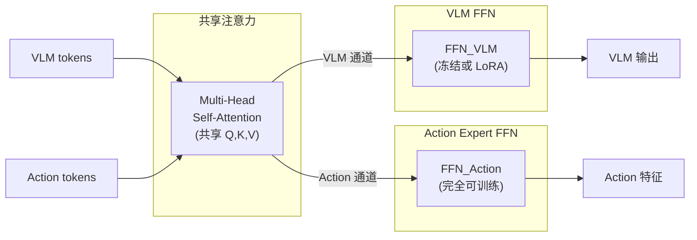

**为什么这样设计**:
- 共享注意力: 动作专家可以利用 VLM 的语义理解能力
- 独立 FFN: 避免动作学习干扰 VLM 的语义表示; 动作分布与语言分布差异太大, 共享 FFN 会导致干扰
- Pi0 和 LingBot-VLA 均验证了这种 MoE 设计优于全共享参数

**Action Expert 规格**:
- 6 层 Transformer, hidden_dim=1024, n_heads=16
- 独立的 FFN: `Linear(1024 → 4096) → GELU → Linear(4096 → 1024)`
- 参数量: ~500M

**Flow Matching Head**:

Flow Matching 将动作生成建模为从噪声到动作的连续流 (Continuous Normalizing Flow):

$$\frac{d\mathbf{x}_t}{dt} = v_\theta(\mathbf{x}_t, t, \mathbf{c}), \quad t \in [0, 1]$$

其中:
- $\mathbf{x}_0 \sim \mathcal{N}(0, I)$ 是初始噪声
- $\mathbf{x}_1 = \mathbf{a}$ 是目标动作
- $\mathbf{c}$ 是条件 (视觉+语言+状态特征)
- $v_\theta$ 是参数化的速度场网络

**为什么选 Flow Matching 而非自回归**:
1. **并行生成**: 一次前向生成整个 Action Chunk (H=16 步), 而非逐 token 生成
2. **连续动作**: 天然支持连续动作空间, 无需离散化
3. **多模态分布**: 可以表达多峰动作分布 (同一观测下有多种合理动作)
4. **高频控制**: Pi0 用 Flow Matching 实现了 50 Hz 灵巧操作

### 3.3 模型规模汇总

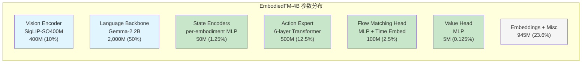

| 模块 | 参数量 | 训练状态 |
|------|--------|---------|
| Vision Encoder | 400M | Stage 1 冻结, Stage 2 LoRA |
| Language Backbone | 2,000M | Stage 1 冻结, Stage 2 LoRA |
| State Encoders | 50M | 完全可训练 |
| Action Expert | 500M | 完全可训练 |
| Flow Matching Head | 100M | 完全可训练 |
| Value Head | 5M | 完全可训练 |
| 其他 (Embeddings 等) | ~945M | 随 backbone |
| **总计** | **~4,000M** | |

### 3.4 推理时的 Action Chunking

推理时, 模型一次生成 $H=16$ 步动作 (Action Chunk), 以 **HATO (Hierarchical Action Temporal Optimization)** 策略执行:

$$\hat{\mathbf{a}}_t = \sum_{k=0}^{K-1} w_k \cdot \mathbf{a}_{t}^{(k)}$$

其中 $\mathbf{a}_{t}^{(k)}$ 是第 $k$ 次推理在时刻 $t$ 的预测, $w_k = \exp(-k / \tau_{\text{HATO}})$ 是时间衰减权重。

**效果**: 平滑执行, 减少抖动; 推理频率 6 Hz 即可支持 15 Hz 控制输出。

---

## 4. 预训练任务与损失函数

### 4.1 整体损失函数

$$\mathcal{L}_{\text{total}} = \lambda_1 \mathcal{L}_{\text{CFM}} + \lambda_2 \mathcal{L}_{\text{latent}} + \lambda_3 \mathcal{L}_{\text{video}} + \lambda_4 \mathcal{L}_{\text{aux}}$$

各项权重 (推荐初始值): $\lambda_1 = 1.0, \lambda_2 = 0.5, \lambda_3 = 0.1, \lambda_4 = 0.05$

### 4.2 任务 1: Conditional Flow Matching (主任务)

**适用数据**: 有动作标注的机器人数据 (10 万小时自有 + 1.5 万小时公开)

**数学定义**:

给定:
- 观测条件 $\mathbf{c} = (\mathbf{I}, \mathbf{s}, \ell)$ (图像、状态、语言)
- 目标动作块 $\mathbf{a}_{1:H} \in \mathbb{R}^{H \times d_a}$
- 时间步 $t \sim \mathcal{U}(0, 1)$

构造噪声样本:

$$\mathbf{x}_t = (1 - t) \cdot \boldsymbol{\epsilon} + t \cdot \mathbf{a}_{1:H}, \quad \boldsymbol{\epsilon} \sim \mathcal{N}(0, \mathbf{I})$$

目标速度场 (optimal transport 路径):

$$\mathbf{u}_t(\mathbf{x}_t | \mathbf{a}_{1:H}) = \mathbf{a}_{1:H} - \boldsymbol{\epsilon}$$

**条件流匹配损失**:

$$\boxed{\mathcal{L}_{\text{CFM}}(\theta) = \mathbb{E}_{t \sim \mathcal{U}(0,1),\, \boldsymbol{\epsilon} \sim \mathcal{N}(0,\mathbf{I}),\, (\mathbf{c}, \mathbf{a}) \sim \mathcal{D}} \left[ \left\| v_\theta(\mathbf{x}_t, t, \mathbf{c}) - (\mathbf{a}_{1:H} - \boldsymbol{\epsilon}) \right\|^2 \right]}$$

其中 $v_\theta$ 是参数化的速度场网络 (即 Action Expert + Flow Matching Head 的组合)。

**推理过程** (ODE 求解):

$$\mathbf{x}_0 \sim \mathcal{N}(0, \mathbf{I}), \quad \mathbf{x}_1 = \mathbf{x}_0 + \int_0^1 v_\theta(\mathbf{x}_t, t, \mathbf{c}) \, dt$$

实际使用 Euler 方法离散化, $N_{\text{steps}} = 10$:

$$\mathbf{x}_{t+\Delta t} = \mathbf{x}_t + \Delta t \cdot v_\theta(\mathbf{x}_t, t, \mathbf{c}), \quad \Delta t = 1/N_{\text{steps}}$$

### 4.3 任务 2: Latent Action Pre-training (人类视频)

**适用数据**: 无动作标注的人类操作视频 (5 万小时)

**动机**: 人类视频没有机器人动作标注, 但包含丰富的操作语义。通过学习帧间的 "潜在动作", 可以从人类视频中提取可迁移的操作知识。

**方法** (参考 LAPA):

**Step 1: 训练 Latent Action Encoder** (离线, 仅使用视频帧)

$$\mathbf{z}_a = \text{VQ-VAE}_\psi(\mathbf{I}_t, \mathbf{I}_{t+1}) \in \{1, \ldots, K\}^{d_z}$$

其中 VQ-VAE 将相邻帧编码为离散潜在动作码本 ($K=512$ codes, $d_z=8$ tokens)。

训练目标:

$$\mathcal{L}_{\text{VQ}} = \underbrace{\|\mathbf{I}_{t+1} - \hat{\mathbf{I}}_{t+1}\|^2}_{\text{重建损失}} + \beta \underbrace{\|\text{sg}[\mathbf{e}] - \mathbf{z}\|^2}_{\text{码本损失}} + \gamma \underbrace{\|\mathbf{e} - \text{sg}[\mathbf{z}]\|^2}_{\text{承诺损失}}$$

**Step 2: 潜在动作预测** (主模型预训练)

$$\mathcal{L}_{\text{latent}} = -\sum_{k=1}^{d_z} \log p_\theta(\hat{z}_a^{(k)} | \mathbf{c})$$

即标准的交叉熵分类损失, 预测潜在动作的离散 token。

**Step 3: 潜在→真实动作映射** (微调时)

训练一个小型 MLP 将潜在动作映射到真实机器人动作空间。

### 4.4 任务 3: Video Prediction (辅助任务)

**适用数据**: 所有视频数据

**动机**: 预测未来帧迫使模型理解物理世界的动力学 (物体运动、重力、碰撞), 这对操作决策至关重要。

**方法**: 在 VLM 输出上接一个轻量级视频预测头, 预测下一帧的 patch token:

$$\mathcal{L}_{\text{video}} = \left\| f_\phi(\mathbf{h}_\text{VLM}) - \text{sg}[\text{SigLIP}(\mathbf{I}_{t+1})] \right\|^2$$

其中:
- $f_\phi$ 是视频预测头 (2 层 Transformer decoder + Linear)
- $\text{sg}[\cdot]$ 是 stop-gradient (不反传到 SigLIP)
- 预测目标是下一帧在 SigLIP 特征空间中的表示, 而非原始像素 → 更稳定, 计算更高效

### 4.5 任务 4: 辅助任务

**4.5.1 构型预测 (Embodiment Classification)**

$$\mathcal{L}_{\text{emb}} = -\log p_\theta(e | \mathbf{c})$$

迫使模型区分不同机器人构型, 学习构型特有的运动模式。

**4.5.2 接触预测 (Contact Prediction)**

$$\mathcal{L}_{\text{contact}} = \text{BCE}(\hat{y}_\text{contact}, y_\text{contact})$$

预测末端执行器是否与物体接触, 对抓取/放置等任务的时序建模至关重要。

**4.5.3 子任务分类 (Subtask Classification)**

$$\mathcal{L}_{\text{subtask}} = -\log p_\theta(\text{subtask} | \mathbf{c})$$

预测当前执行的子任务 (reach / grasp / lift / place / ...), 提供层次化语义监督。

### 4.6 各任务的数据与损失总结

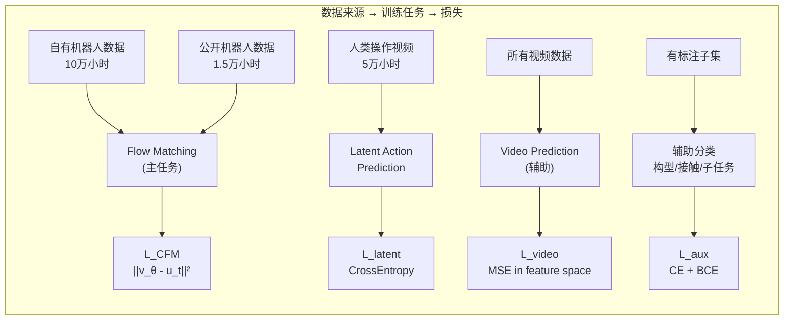

---

## 5. 训练方案

### 5.1 三阶段训练策略

```mermaid
gantt
    title 三阶段训练时间线
    dateFormat X
    axisFormat %s

    section Stage 1: VLM 热启动
    加载预训练 VLM 权重          :s1a, 0, 1
    Video Prediction 预训练       :s1b, 1, 15
    Latent Action 预训练          :s1c, 5, 20

    section Stage 2: 大规模动作预训练
    全数据 Flow Matching 预训练   :s2a, 20, 55
    多任务联合训练               :s2b, 25, 55

    section Stage 3: 任务微调
    LoRA 微调 (per-task)         :s3a, 55, 65
    RL 微调 (可选)               :s3b, 60, 70
```

#### Stage 1: VLM 热启动与世界模型预训练 (2-3 周)

**目标**: 让模型理解物理世界的视觉动力学

| 配置 | 值 |
|------|---|
| 冻结模块 | Vision Encoder (全部), Language Backbone (全部) |
| 可训练模块 | Video Prediction Head, Latent Action VQ-VAE |
| 数据 | 所有视频数据 (~17 万小时) |
| 训练任务 | $\mathcal{L}_{\text{video}} + \mathcal{L}_{\text{VQ}}$ |
| 批大小 | 1024 (视频片段) |
| 学习率 | $3 \times 10^{-4}$, cosine decay |
| 训练步数 | ~200K steps |
| 算力 | 64 × H100, ~2 周 |

#### Stage 2: 大规模动作预训练 (4-6 周)

**目标**: 学习从观测到动作的映射

| 配置 | 值 |
|------|---|
| 冻结模块 | Vision Encoder (LoRA rank=16), Language Backbone (LoRA rank=32) |
| 可训练模块 | State Encoders, Action Expert, Flow Matching Head, Value Head |
| 数据 | 机器人动作数据 (~11.5 万小时) + 人类视频潜在动作 (~5 万小时) |
| 训练任务 | $\mathcal{L}_{\text{CFM}} + 0.5 \mathcal{L}_{\text{latent}} + 0.1 \mathcal{L}_{\text{video}} + 0.05 \mathcal{L}_{\text{aux}}$ |
| 批大小 | 2048 (trajectory segments) |
| 学习率 | $1 \times 10^{-4}$, warmup 2K steps + cosine decay |
| 训练步数 | ~500K steps |
| 算力 | 128 × H100, ~5 周 |

**数据采样策略**:

不同数据集的采样权重按 **温度采样** 计算:

$$p_i = \frac{n_i^{1/T}}{\sum_j n_j^{1/T}}, \quad T = 3$$

其中 $n_i$ 是第 $i$ 个数据集的样本数, $T=3$ 防止大数据集过度主导。

**课程学习 (Curriculum Learning)**:
1. **前 20% 步**: 简单抓取/放置任务 → 建立基础视觉-动作对应
2. **中 50% 步**: 加入复杂操作 (装配、工具使用) → 扩展技能范围
3. **后 30% 步**: 全数据混合训练 → 统一表示

#### Stage 3: 任务微调 (1-2 周/任务)

**目标**: 适配到特定机器人和任务

| 配置 | 值 |
|------|---|
| 方式 | LoRA (rank=32) 全模型 或 全参数微调 Action Expert |
| 数据 | 目标任务数据 (50-500 轨迹) |
| 训练任务 | $\mathcal{L}_{\text{CFM}}$ (仅动作预测) |
| 批大小 | 64-128 |
| 学习率 | $5 \times 10^{-5}$, linear decay |
| 训练步数 | 10K-50K steps |
| 算力 | 1-8 × H100, 10-15 小时 |

### 5.2 分布式训练架构

使用 RLinf 的 FSDP 后端进行分布式训练:

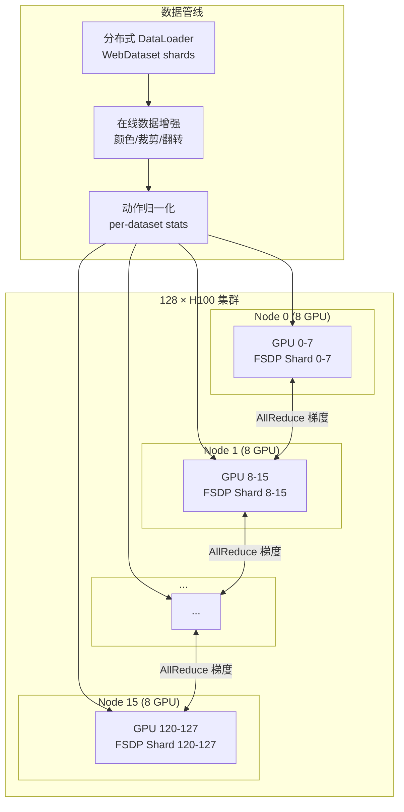

**关键训练超参数**:

| 超参数 | Stage 1 | Stage 2 | Stage 3 |
|--------|---------|---------|---------|
| Global Batch Size | 1024 | 2048 | 128 |
| Micro Batch Size (per GPU) | 8 | 16 | 16 |
| Gradient Accumulation | 1 | 1 | 1 |
| 精度 | BF16 | BF16 | BF16 |
| 优化器 | AdamW | AdamW | AdamW |
| Weight Decay | 0.01 | 0.01 | 0.05 |
| Gradient Clipping | 1.0 | 1.0 | 1.0 |
| EMA | 0.999 | 0.9999 | - |

### 5.3 数据增强策略

| 增强类型 | 方法 | 概率 |
|---------|------|------|
| **颜色抖动** | 亮度/对比度/饱和度/色调 ±20% | 0.8 |
| **随机裁剪** | 224×224 从 256×256 中裁 | 1.0 |
| **水平翻转** | 对称任务有效, 同时翻转动作 | 0.5 (对称任务) |
| **高斯噪声** | $\sigma \sim \mathcal{U}(0, 0.02)$ 加到图像 | 0.3 |
| **随机擦除** | 随机遮挡 5-20% 区域 | 0.2 |
| **动作噪声** | $\epsilon \sim \mathcal{N}(0, 0.01)$ 加到动作 | 0.5 |
| **时间采样** | 随机跳帧 (1-3 帧) | 0.3 |

---

## 6. 评估体系

### 6.1 预训练阶段评估 (Stage 1-2)

| 指标 | 含义 | 目标值 |
|------|------|--------|
| **CFM Loss** | 动作预测的流匹配损失 | < 0.1 |
| **Latent Action Accuracy** | 人类视频潜在动作预测准确率 | > 60% |
| **Video Prediction FID** | 下一帧预测的特征距离 | < 30 |
| **Action MSE** | ODE 求解后的动作误差 (归一化空间) | < 0.05 |
| **Cross-Embodiment Transfer** | 在未见构型上 zero-shot 的成功率 | > 20% |

### 6.2 下游任务评估 (Stage 3)

**标准化评估协议**:

| Benchmark | 构型 | 任务数 | 评估指标 |
|-----------|------|--------|---------|
| **LIBERO-Goal** | Franka | 10 | 成功率 (%) |
| **LIBERO-Spatial** | Franka | 10 | 成功率 (%) |
| **LIBERO-Object** | Franka | 10 | 成功率 (%) |
| **LIBERO-Long** | Franka | 10 | 成功率 (%) |
| **ManiSkill Benchmark** | WidowX / Franka | 20+ | 成功率 (%) |
| **MetaWorld ML-45** | Sawyer | 45 | 成功率 (%) |
| **RoboCasa** | Franka | 100+ | 成功率 (%) |
| **Bridge V2 Eval** | WidowX | 实机 | 成功率 (%) |
| **ALOHA Bimanual** | 双臂 | 实机 | 成功率 (%) |

**目标**: 在 LIBERO 系列上达到 SOTA (> 90% 成功率), 在 zero-shot 跨任务上超过 Octo (> 40% 成功率)。

### 6.3 消融实验

| 消融项 | 对比方案 |
|--------|---------|
| 人类视频数据 | 有 vs 无 LAPA 预训练 |
| 合成数据 | 有 vs 无仿真+视频生成数据 |
| Action Expert 设计 | MoE vs 全共享 vs 完全分离 |
| Flow Matching vs 自回归 | CFM vs token-by-token action |
| 模型规模 | 1B vs 2B vs 4B |
| Action Chunk 长度 | H=4 vs 8 vs 16 vs 32 |
| 数据量 Scaling | 1K vs 10K vs 100K 小时 |

---

## 7. 下游微调策略

### 7.1 微调方式选择

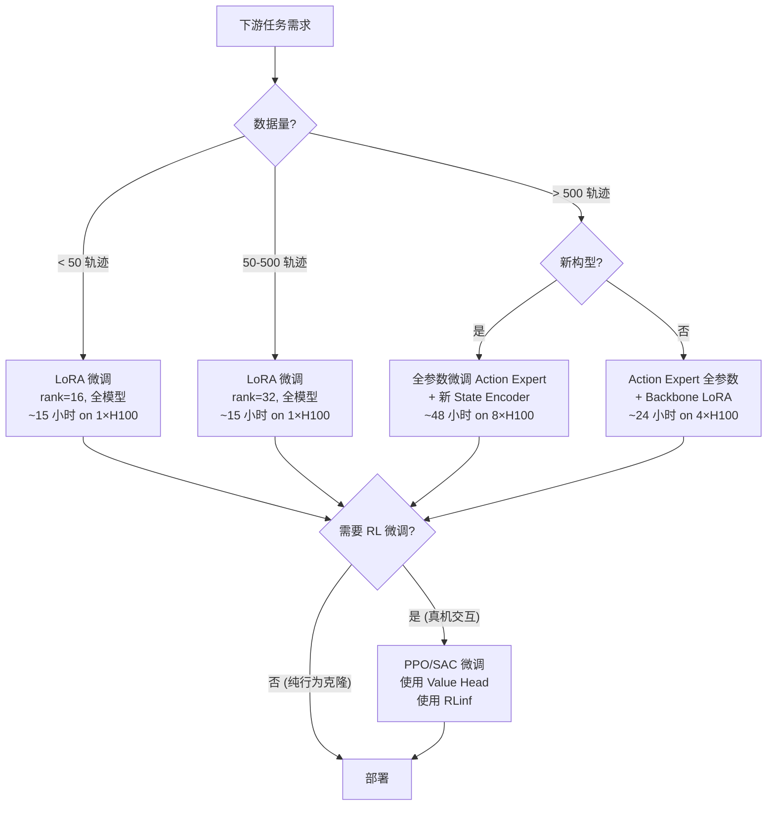

### 7.2 与 RLinf 的集成

预训练模型在 RLinf 中注册为新的 `SupportedModel`:

```python
class SupportedModel(Enum):
    EMBODIED_FM = ("embodied_fm", "embodied")
```

**微调路径**:
1. **SFT 路径**: `SFTRunner` + `FSDPVlaSftWorker` → 纯行为克隆微调
2. **RL 路径**: `EmbodiedRunner` + `EmbodiedFSDPActor` → PPO/GRPO 在线强化
3. **SAC 路径**: `AsyncEmbodiedRunner` + `EmbodiedSACFSDPPolicy` → 真机 online-RL
4. **DAgger 路径**: `AsyncEmbodiedRunner` + `EmbodiedDAGGERFSDPPolicy` → 人类纠错

---

## 8. 算力估算与工程实施

### 8.1 算力估算

**Stage 1 (VLM 热启动)**:
- 可训练参数: ~200M (Video Prediction Head + VQ-VAE)
- 数据: 17 万小时 × 30 FPS = ~180 亿帧 → 采样后 ~500M 训练样本
- 200K steps × 1024 batch = ~200M 样本
- 估算: **64 × H100 × 14 天 ≈ 21,500 GPU-hours**

**Stage 2 (大规模预训练)**:
- 可训练参数: ~660M (Action Expert + State Encoders + LoRA) + LoRA overhead
- 数据: 16.5 万小时 → ~600M 训练样本
- 500K steps × 2048 batch = ~1B 样本 (含重复)
- 估算: **128 × H100 × 35 天 ≈ 107,500 GPU-hours**

**Stage 3 (任务微调, per-task)**:
- 50K steps × 128 batch
- 估算: **8 × H100 × 15 小时 ≈ 120 GPU-hours / 任务**

**总计**:
$$\text{Total} \approx 21,500 + 107,500 + 120 \times 20_{\text{tasks}} \approx \mathbf{131,400 \text{ H100 GPU-hours}}$$

**成本估算** (按 $2/H100-hour):
$$\text{Cost} \approx 131,400 \times \$2 \approx \$\mathbf{263K}$$

### 8.2 存储与 IO

| 数据类型 | 大小 | 存储介质 |
|---------|------|---------|
| 原始视频 | ~200 TB | 对象存储 (S3/OSS) |
| 处理后训练数据 | ~80 TB | NVMe SSD (训练集群) |
| 模型 Checkpoint | ~50 GB/个, 保留 20 个 | SSD |
| 训练日志/指标 | ~1 TB | HDD |
| **总计** | **~280 TB** | |

**IO 瓶颈缓解**:
- 使用 **WebDataset** 格式: tar shards, 顺序读取, 多进程预取
- 视频解码: **NVIDIA DALI** GPU 加速解码, 避免 CPU 瓶颈
- 数据缓存: 热数据缓存到 NVMe, 冷数据在对象存储

### 8.3 工程实施架构

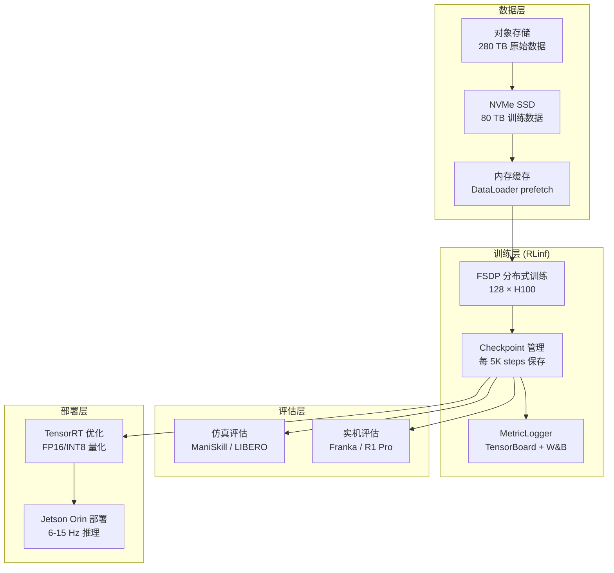

---

## 9. 风险与缓解

| 风险 | 可能性 | 影响 | 缓解措施 |
|------|--------|------|---------|
| **数据质量不均** | 高 | 模型学到错误模式 | 数据清洗流水线; 轨迹质量评分; 自动过滤失败轨迹 |
| **域差距 (Sim2Real)** | 高 | 仿真预训练不迁移 | 域随机化; 真实数据为主; 合成数据作为补充 |
| **动作空间不统一** | 中 | 跨构型泛化受限 | 末端执行器空间统一; per-embodiment stem; 潜在动作空间 |
| **训练不稳定** | 中 | Loss 发散 | 梯度裁剪; 学习率 warmup; EMA; BF16 精度 |
| **过拟合大数据集** | 中 | 小数据集被忽略 | 温度采样; 课程学习; 数据集权重动态调整 |
| **推理延迟过高** | 低 | 无法满足实时控制 | Action Chunking 减少推理次数; TRT 优化; INT8 量化 |
| **灾难性遗忘** | 中 | 微调后丧失通用能力 | LoRA 而非全参数; 正则化; 回放少量预训练数据 |

---

## 10. 里程碑与时间线

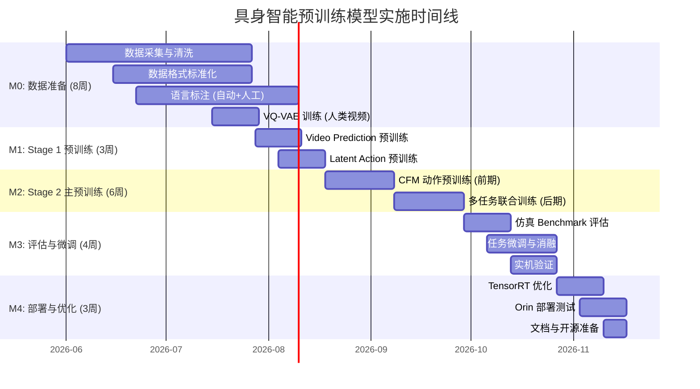

### 关键里程碑

| 里程碑 | 时间 | 交付物 | 验收标准 |
|--------|------|--------|---------|
| **M0** | W8 | 标准化数据集 + VQ-VAE | 数据覆盖 100+ 技能; VQ-VAE 重建 SSIM > 0.9 |
| **M1** | W11 | Stage 1 预训练模型 | Video Prediction FID < 30 |
| **M2** | W17 | Stage 2 预训练模型 (核心交付) | CFM Loss < 0.1; Cross-embodiment zero-shot > 20% |
| **M3** | W21 | 评估报告 + 微调模型 | LIBERO-Goal > 85%; ManiSkill > 60% |
| **M4** | W24 | 可部署模型 + 文档 | Orin 推理 > 6 Hz; TRT FP16 精度损失 < 2% |

---

## 附录 A: 参考文献与关键资源

| 类别 | 名称 | 关键贡献 |
|------|------|---------|
| 模型 | Pi0 (Physical Intelligence, 2024) | Flow Matching + MoE VLA; 3.3B; 10K+ 小时 |
| 模型 | GR00T N1 (NVIDIA, 2025) | 双系统架构; 合成数据 40% 提升 |
| 模型 | OpenVLA (Stanford, 2024) | 开源 7B VLA; OXE 预训练 |
| 模型 | LingBot-VLA (Ant Group, 2026) | MoT 架构; 20K 小时双臂实机 |
| 模型 | Octo (UC Berkeley, 2024) | 93M 小模型; 多构型泛化 |
| 模型 | HPT (MIT, 2024) | 异构构型统一 stem-trunk-head |
| 方法 | VITRA (Microsoft, ICRA 2026) | 人类视频大规模预训练 |
| 方法 | LAPA (2024) | VQ-VAE 潜在动作; 无标注视频利用 |
| 方法 | Diffusion-VLA (2024) | 自回归+扩散混合损失 |
| 方法 | UniAct (2025) | 向量量化统一动作空间 |
| 数据 | Open X-Embodiment (Google, 2023) | 1M+ 轨迹, 22 构型 |
| 数据 | DROID (Toyota, 2024) | 76K 高质量 Franka 轨迹 |
| 数据 | DreamDojo (2026) | 44K 小时人类自我中心视频 |
| 训练 | Conditional Flow Matching (Lipman et al., 2023) | OT 路径流匹配理论 |
| 训练 | HATO Ensemble (2024) | 动作块时间加权融合执行 |
| 平台 | RLinf (2025) | 分布式 RL 训练基础设施 |

## 附录 B: 与现有 VLA 模型的差异化

| 维度 | Pi0 | OpenVLA | GR00T N1 | **本方案** |
|------|-----|---------|----------|-----------|
| 数据规模 | 10K 小时 | ~3K 小时 | ~5K 小时 | **100K 小时** |
| 人类视频 | 少量 | 无 | 有, 受限 | **50K 小时 LAPA** |
| 合成数据 | 少量 | 无 | 有, 反事实 | **30K 小时 仿真+生成** |
| 构型覆盖 | 7 种 | 22 种 (OXE) | 人形为主 | **10+ 种, 可扩展** |
| 模型大小 | 3.3B | 7B | 2B | **4B (部署友好)** |
| 动作表示 | Flow Matching | 离散 token | Flow Matching | **Flow Matching** |
| 预训练任务 | CFM | 自回归 | 混合 | **CFM + LAPA + Video** |
| RL 微调 | 无 | 有限 | 无 | **RLinf 全栈** |
| 开源 | 部分 | 完全 | 部分 | **计划完全** |

## 附录 C: 关键数学符号表

| 符号 | 含义 |
|------|------|
| $\mathbf{I}$ | 图像观测 |
| $\mathbf{s}$ | 本体感觉状态 (关节角度/速度/力矩) |
| $\ell$ | 语言指令 |
| $\mathbf{c} = (\mathbf{I}, \mathbf{s}, \ell)$ | 完整观测条件 |
| $\mathbf{a}_{1:H}$ | $H$ 步动作块 (Action Chunk) |
| $v_\theta(\mathbf{x}_t, t, \mathbf{c})$ | 参数化速度场 (Flow Matching) |
| $\mathbf{x}_t$ | 时刻 $t$ 的噪声-动作插值 |
| $\boldsymbol{\epsilon}$ | 高斯噪声 |
| $e$ | 构型标签 (embodiment tag) |
| $\phi(e)$ | 构型特有的参数 |
| $H$ | Action Chunk 长度 (默认 16) |
| $d_a$ | 动作维度 (通常 7 或 14) |
| $d_\text{model}$ | 模型隐藏维度 (1024) |
| $K$ | VQ-VAE 码本大小 (512) |
