# RLinf 系统架构与设计: 从原理到实践

> **RLinf: 面向具身智能与推理智能的大规模分布式强化学习训练基础设施**
>
> 本文档以 RLinf 代码库 (`rlinf/`) 的深入分析为基础, 结合论文 (arXiv:2509.15965)、官方文档及机器人行业工程实践, 系统阐述 RLinf 的设计决策、架构实现与工程权衡。每一个设计选择, 我们不仅说明 **WHAT (是什么)**, 更着重解释 **WHY (为什么)**。

---

## 目录

### Part I: 基础
- [1. 引言与动机](#1-引言与动机)
- [2. 设计哲学与 M2Flow 理论](#2-设计哲学与-m2flow-理论)
- [3. 系统架构全景](#3-系统架构全景)

### Part II: 核心基础设施
- [4. 集群与硬件抽象层](#4-集群与硬件抽象层)
- [5. Worker 系统](#5-worker-系统)
- [6. 通信与并发](#6-通信与并发)
- [7. Runner 编排层](#7-runner-编排层)

### Part III: 领域系统
- [8. 算法系统](#8-算法系统)
- [9. 模型与环境生态](#9-模型与环境生态)
- [10. 智能体与工具系统](#10-智能体与工具系统)
- [11. 数据管线与训练引擎](#11-数据管线与训练引擎)

### Part IV: 分析与运维
- [12. 机器人行业深度集成](#12-机器人行业深度集成)
- [13. 横切关注点](#13-横切关注点)
- [14. 性能分析框架](#14-性能分析框架)
- [15. 与同类系统对比](#15-与同类系统对比)

### 附录
- [附录 A: 快速上手](#附录-a-快速上手)
- [附录 B: 扩展指南](#附录-b-扩展指南)
- [附录 C: 关键文件索引](#附录-c-关键文件索引)
- [附录 D: 设计模式总结](#附录-d-设计模式总结)

---

# Part I: 基础

---

## 1. 引言与动机

### 1.1 RL 训练的异构性困境

强化学习 (RL) 训练不同于大模型预训练 — 后者的计算模式近乎单一 (矩阵乘法的反复迭代), 而 RL 训练是一个由**多种截然不同的计算角色**组成的协作系统。这种异构性是 RL 训练系统设计的根本挑战:

| 计算角色 | GPU 显存 | 计算特征 | 并行策略 | 延迟敏感性 | 动态性 |
|---------|---------|---------|---------|-----------|-------|
| **LLM/VLA 训练** | 极高 (梯度+优化器) | 计算密集 | FSDP/TP/PP | 低 | 低 |
| **LLM 生成** (Decode) | 中等 (KV-Cache) | 内存带宽瓶颈 | 实例复制 | 中 | 高 (响应长度波动) |
| **VLA 推理** | 中等 | 计算密集 | DP | 中 | 低 |
| **GPU 物理仿真** | 低~中 (渲染) | GPU 渲染+CPU 物理 | GPU 向量化 | 高 (实时性) | 中 |
| **CPU 物理仿真** | 无 | CPU 密集 | 多进程 | 中 | 中 |
| **奖励模型** | 中等 | 计算密集 | DP/TP | 低 | 低 |
| **搜索/工具服务** | 低 | IO 密集 | 实例复制 | 极高 | 极高 |
| **真实机器人** | 低 | 实时控制 | 单实例 | 极高 | 高 |

**问题**: 没有任何一种固定的执行模式能同时高效适配以上所有角色。

现有系统面临两难选择:
- **同置模式** (Collocated, 如 veRL): 所有组件共享 GPU, 通过上下文切换分时复用 → **长尾延迟**问题, 因为最慢的组件决定了整体速度
- **分离模式** (Disaggregated, 如 OpenRLHF): 各组件独占不同 GPU → **资源碎片化**, 快组件空闲等待慢组件

### 1.2 RLinf 的定位

RLinf 的核心洞察是: **最优执行模式不应由系统预设, 而应根据具体的硬件配置、模型规模和算法特性动态确定。**

RLinf 由清华大学、无穷光年 (Infinigence AI)、北京大学、UC Berkeley 等机构联合开发, 定位为:

1. **统一的 RL 训练平台** — 同时支持推理 RL (数学推理、代码生成)、具身 RL (机器人操作) 和智能体 RL (工具使用、搜索交互)
2. **灵活的执行引擎** — 通过 M2Flow 在同置、分离、混合三种模式间自动寻优
3. **生产级基础设施** — 支持从 8 GPU 到 1024+ GPU 的扩展, 从仿真到真实机器人的部署

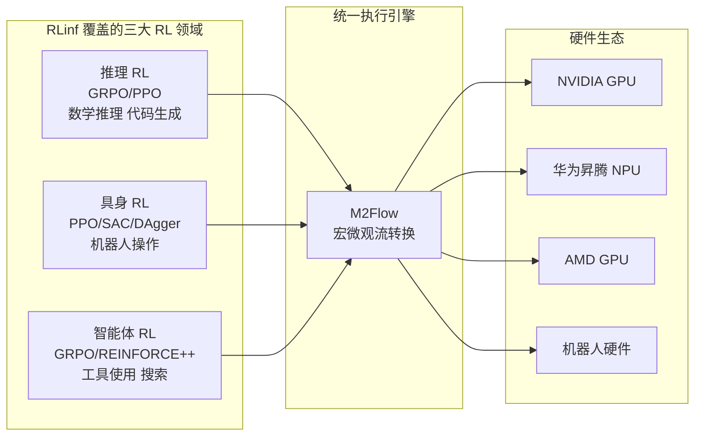

### 1.3 在机器人行业中的角色

在机器人 RL 训练中, RLinf 扮演**连接基础模型与物理世界的中间件**角色。它需要同时管理:
- **云端** GPU 集群上的 VLA 模型训练 (数百 GB 参数)
- **仿真环境** 中的高吞吐轨迹收集 (每秒数千环境步)
- **真实机器人** 上的低延迟推理与安全干预 (10Hz 控制频率)
- **人类专家** 的实时遥操作与纠错 (DAgger 示教)

这要求系统在 **吞吐量** (训练效率)、**延迟** (控制频率)、**安全性** (人类干预) 和 **灵活性** (多环境多模型) 之间取得平衡。

---

## 2. 设计哲学与 M2Flow 理论

### 2.1 核心设计原则

RLinf 的设计遵循五个原则, 每一个都源于对 RL 训练特性的深刻理解:

**原则一: 灵活性驱动效率**
> 不预设最优执行模式, 而是提供足够的灵活性让系统自动寻优。

*为什么*: RL 训练中, 最优执行策略取决于模型大小、序列长度、环境计算量、GPU 数量等因素的组合。GRPO 训练 7B 模型时, 全部 GPU 做 rollout 最优 (最大化 KV-Cache); PPO 训练同一模型时, 分离式流水线最优 (组件并行)。任何预设的执行模式都会在某些配置下表现不佳。

**原则二: 过程式 (命令式) 编程**
> 用户以常规 Python 代码编写训练循环, 保留完整的控制流、可调试性和透明性。

*为什么*: 与 TensorFlow 的声明式计算图不同, RL 训练循环天然包含复杂的控制流 (条件分支、动态循环长度、异步事件处理)。声明式 API 会迫使用户将控制逻辑塞入框架的抽象中, 降低可调试性。RLinf 选择让用户写出他们想要的逻辑, 系统在底层优化执行。

**原则三: 逻辑与执行解耦**
> 用户编写的宏观逻辑流独立于底层的微观执行策略。

*为什么*: 这是实现原则一的机制。用户代码定义 "做什么" (rollout → reward → training), 系统决定 "怎么做" (哪些 GPU 执行哪个步骤, 数据如何分片, 是否流水线化)。修改执行策略不需要改用户代码, 反之亦然。

**原则四: 注册表驱动的可扩展性**
> 算法、模型、环境通过注册表模式接入, 新增组件无需修改核心调度代码。

*为什么*: RL 领域发展极快 — 新算法 (GRPO, DAPO)、新模型 (Pi0, GR00T)、新环境 (RoboVerse) 持续涌现。注册表模式确保核心基础设施的稳定性, 同时允许快速迭代领域组件。

**原则五: 硬件抽象**
> GPU、NPU、机器人硬件统一抽象为可调度的设备资源。

*为什么*: 机器人 RL 训练涉及异构硬件 — A800 用于训练, 4090 用于推理, CPU 用于仿真, NUC 用于机器人控制。统一的硬件抽象使调度器能跨所有硬件类型进行资源分配。

### 2.2 M2Flow: 宏微观流转换

M2Flow (Macro-to-Micro Flow Transformation) 是 RLinf 的核心技术贡献。

**核心思想**: 将用户编写的高层逻辑流 (Macro Logical Flow) 自动转换为底层的高效执行流 (Micro Execution Flow), 在 **空间** (GPU 分配) 和 **时间** (上下文切换) 两个维度上探索最优执行策略。

#### 2.2.1 弹性流水线 (空间维度)

弹性流水线的关键洞察: RL 中大多数 Worker 遵循 SPMD 模式, 可以处理任意大小的数据批次。因此, 系统可以通过控制 **数据粒度** (micro-batch size) 来实现不同深度的流水线:

```
用户代码 (不变):
  rollout_group.generate(data_ch, rollout_ch)
  actor_group.train(rollout_ch)

系统执行策略 A — 无流水线 (所有 GPU 做 rollout, 然后全做 training):
  GPU 0-7: ████ rollout ████████████████████
  GPU 0-7:                                   ████ training ██████

系统执行策略 B — 2 级流水线 (4 GPU rollout, 4 GPU training, 重叠执行):
  GPU 0-3: ████ rollout ████████████████████
  GPU 4-7:        ████ training ██████████████████

系统执行策略 C — 细粒度流水线 (小 micro-batch, 更早启动下游):
  GPU 0-3: ██ r1 ██ r2 ██ r3 ██ r4 ██████
  GPU 4-7:     ██ t1 ██ t2 ██ t3 ██ t4 ██
```

**策略选择取决于**: rollout 计算量 vs training 计算量的比值, 通信开销, GPU 数量。

#### 2.2.2 上下文切换 (时间维度)

当 GPU 资源有限时, 多个 Worker 可以**分时复用**同一组 GPU:

```
GPU 0-7:
  ┌── rollout 阶段 ──┐  ┌── training 阶段 ──┐
  │ onload model     │  │ onload optimizer  │
  │ generate actions │  │ forward/backward  │
  │ offload model    │  │ offload optimizer │
  └──────────────────┘  └───────────────────┘
        ↓ 释放 device_lock    ↓ 释放 device_lock
```

上下文切换通过 Channel 的 `device_lock` 实现 — 子节点只能在父节点释放锁并入队数据后获取锁。这种**数据依赖驱动的锁机制**天然避免死锁。

#### 2.2.3 混合模式

实际部署中, 空间和时间调度往往混合使用:

```mermaid
gantt
    title 混合调度示例: 4 GPU 训练 VLA (ManiSkill)
    dateFormat X
    axisFormat %s

    section GPU 0-1 Env + Actor 共享
    Env Simulation     :env, 0, 20
    Offload Env        :off1, 20, 21
    Load Actor         :on1, 21, 22
    Actor Training     :train1, 22, 45

    section GPU 2-3 Rollout + Actor 共享
    Rollout Inference  :rollout, 0, 20
    Offload Rollout    :off2, 20, 21
    Load Actor         :on2, 21, 22
    Actor Training     :train2, 22, 45
```

#### 2.2.4 自动调度搜索

RLinf 通过 Profiling 引导的递归图分割自动选择最优调度策略:

1. **Profiling**: 对每个组件的单 GPU 执行时间进行采样
2. **图建模**: 将工作流建模为 DAG, 节点是组件, 边是数据依赖
3. **递归分割**: 枚举所有 s-t 割, 对每个割点计算时间和空间两种调度的开销
4. **最优选择**: 选择总执行时间最小的方案

**关键公式**:
- 时间调度: `T = T_s + T_t + T_offload + T_onload`
- 空间调度: `T = T_startup + (M/m - 1) * T_bottleneck + T_drain`

其中 `M` 是总 batch 大小, `m` 是 micro-batch 大小, `T_bottleneck` 是最慢子图的时间。

**搜索效率**: 在 8~1024 GPU 集群上搜索时间 < 6 秒, 因为搜索空间被递归结构有效剪枝。

### 2.3 关键抽象

RLinf 的架构建立在以下核心抽象之上:

| 抽象 | 语义 | 解决的问题 |
|------|------|-----------|
| **Worker** | 一个分布式计算进程, 封装通信和硬件 | 屏蔽 Ray Actor、进程组、设备管理的复杂性 |
| **WorkerGroup** | 同类 Worker 的 SPMD 集体 | 统一管理并行计算, 支持 `execute_on()` 子集执行 |
| **Channel** | 分布式 FIFO 队列, 支持 key 路由和权重批处理 | Worker 间解耦通信, 实现流水线和上下文切换 |
| **Placement** | GPU 到 Worker 的映射关系 | 将逻辑部署与物理硬件解耦 |
| **Runner** | 训练循环编排器 | 将算法逻辑从底层执行策略中抽离 |

---

## 3. 系统架构全景

### 3.1 三层架构

RLinf 采用清晰的三层架构, 职责分明:

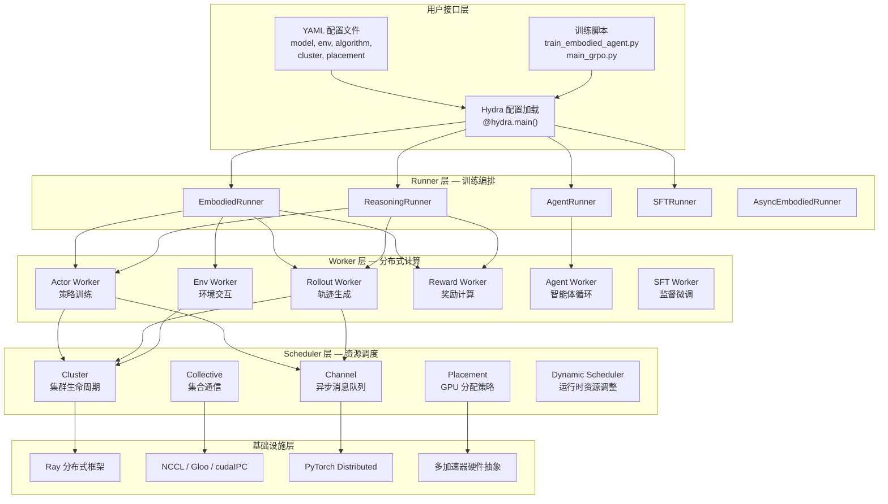

### 3.2 模块依赖关系

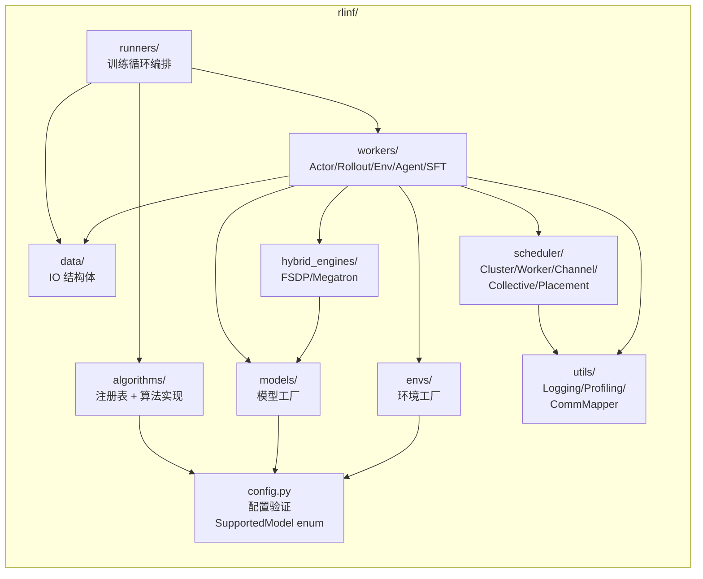

### 3.3 启动到训练的完整流程

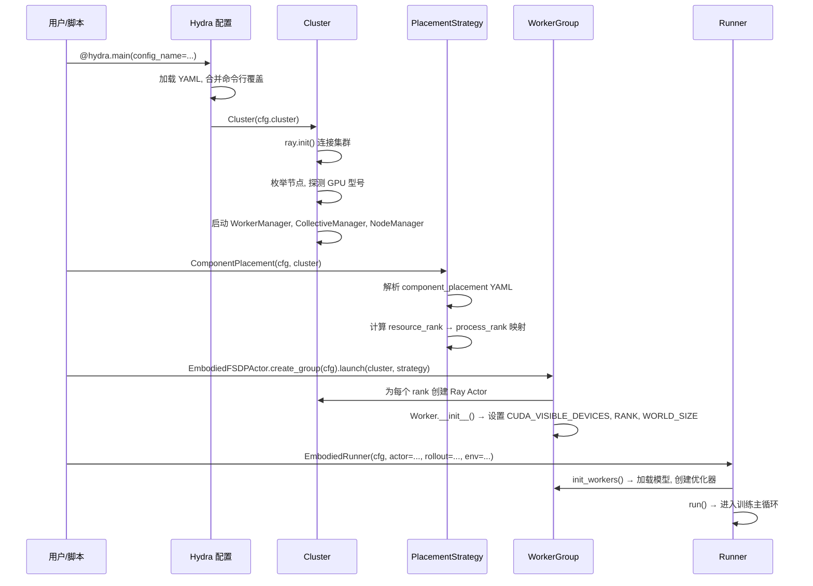

---

# Part II: 核心基础设施

---

## 4. 集群与硬件抽象层

### 4.1 硬件抽象层

RLinf 的硬件抽象层 (`rlinf/scheduler/hardware/`) 是支持异构硬件的关键。

#### 4.1.1 Hardware 基类

所有可调度硬件继承自 `Hardware` 基类, 通过装饰器注册:

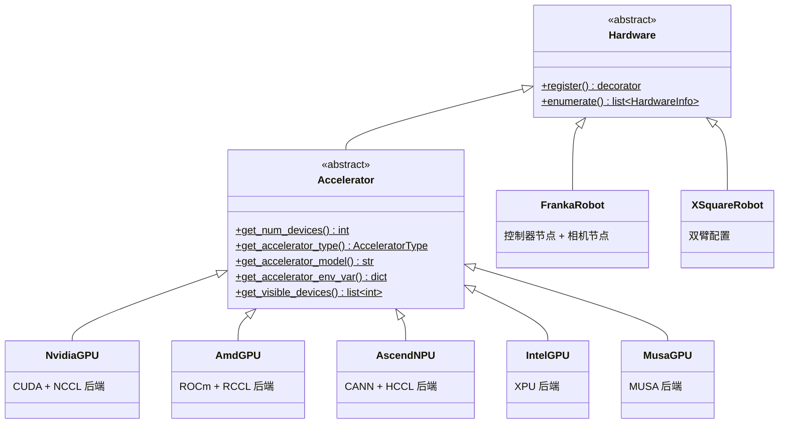

**为什么这样设计**: 将 GPU 和机器人硬件统一抽象, 使调度器能够将 "GPU 0-7 跑训练, Franka NUC 跑控制" 表达为同一种资源分配语言。`AcceleratorType` 枚举 (`NV_GPU`, `AMD_GPU`, `NPU`, `INTEL_GPU`, `MUSA_GPU`, `NO_ACCEL`) 覆盖了主流加速器类型。

#### 4.1.2 AcceleratorManager 注册表

每种加速器类型注册一个 `AcceleratorManager`, 负责该类型的设备枚举、环境变量设置和通信后端创建:

```python
# rlinf/scheduler/hardware/accelerators/accelerator.py
class AcceleratorManager:
    manager_register: dict[AcceleratorType, type["AcceleratorManager"]] = {}

    @staticmethod
    def register_manager(accelerator_type: AcceleratorType):
        def manager_decorator(manager):
            AcceleratorManager.manager_register[accelerator_type] = manager
            return manager
        return manager_decorator

# rlinf/scheduler/hardware/accelerators/nvidia_gpu.py
@AcceleratorManager.register_manager(AcceleratorType.NV_GPU)
class NvidiaGPUManager(AcceleratorManager):
    @staticmethod
    def get_accelerator_env_var(visible_accelerators):
        return {"CUDA_VISIBLE_DEVICES": ",".join(str(d) for d in visible_accelerators)}
```

**为什么用注册表**: 新增加速器类型只需实现 `AcceleratorManager` 子类并注册, 核心调度代码无需修改。这在国产化替代场景 (华为昇腾、摩尔线程) 中尤为重要。

### 4.2 集群管理

#### 4.2.1 Cluster 单例

`Cluster` (`rlinf/scheduler/cluster/cluster.py`) 管理整个 Ray 集群的生命周期:

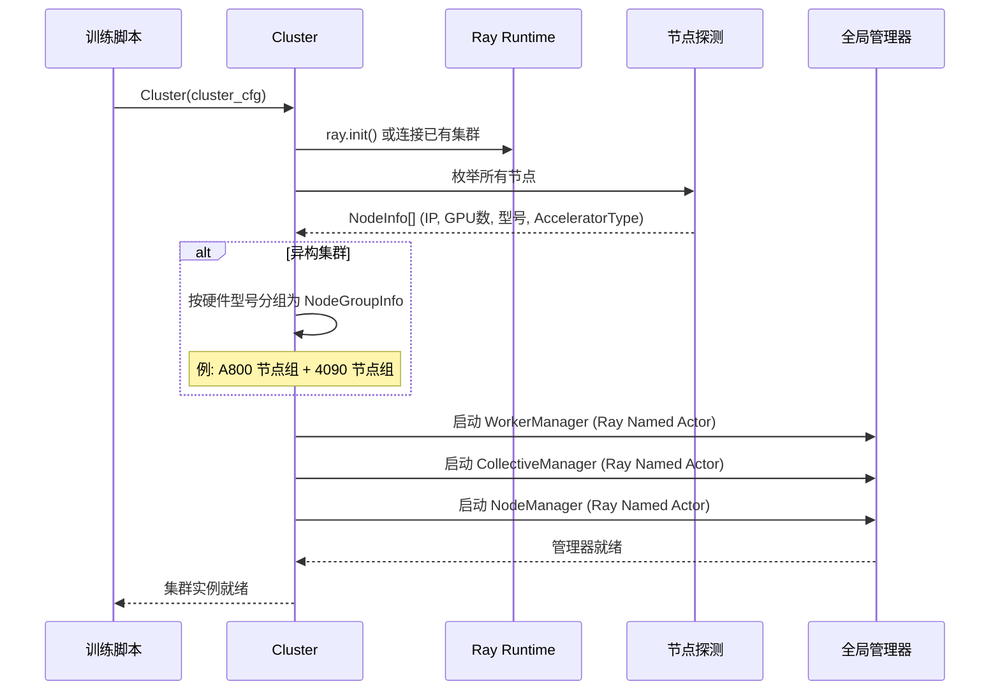

#### 4.2.2 三大全局管理器

管理器作为 Ray Named Actor 运行在 head 节点上, 为所有 Worker 提供全局协调服务:

| 管理器 | 职责 | 存储结构 | 关键 API |
|-------|------|---------|---------|
| **WorkerManager** | Worker 注册与元数据查询 | 树形 `WorkerNode` (支持父子层级) | `register_worker()`, `get_worker_info()` |
| **CollectiveManager** | 通信组信息管理 | `dict[name, CollectiveGroupInfo]` | `register_collective_group()`, `set_master_port_info()` |
| **NodeManager** | 节点拓扑与端口分配 | 节点 IP/GPU 数量/可用端口映射 | `get_node_info()`, `allocate_port()` |

**ManagerProxy 模式** (`rlinf/scheduler/manager/manager.py`): Worker 不直接持有 Ray Actor 引用, 而是通过 `ManagerProxy` 单例访问管理器。Proxy 使用 **PID 检查** (`if os.getpid() != cls.PID`) 检测进程 fork, 自动重新初始化引用 — 这解决了 Ray Actor 引用在 fork 后失效的问题。

### 4.3 放置策略

#### 4.3.1 Placement 数据类

放置策略决定每个 Worker 进程运行在哪个节点的哪个 GPU 上:

```python
@dataclass
class Placement:
    rank: int                        # 全局 Worker rank
    cluster_node_rank: int           # 物理节点编号
    local_accelerator_rank: int      # 节点内 GPU 编号
    accelerator_type: AcceleratorType
    visible_accelerators: list[int]  # CUDA_VISIBLE_DEVICES
    local_hardware_ranks: list[int]  # 分配给该进程的所有 GPU
    node_group_label: str            # 硬件组标签 (如 "a800")
```

#### 4.3.2 Resource Rank 与 Process Rank 解耦

这是 RLinf 放置系统最重要的设计决策之一。传统系统中, 一个进程对应一个 GPU。RLinf 将两者解耦:

```yaml
# 多进程共享 GPU: 4 GPU, 8 个进程 (每 GPU 2 个进程)
# 适用于: 仿真环境进程比 GPU 多的情况
rollout: 0-3:0-7   # resource_ranks:process_ranks

# 多 GPU 归一进程: 8 GPU, 4 个进程 (每进程 2 GPU)
# 适用于: TP=2 的模型并行训练
actor: 0-7:0-3     # resource_ranks:process_ranks

# 省略进程 rank 时自动推断 1:1 映射
env: 0-3            # 等价于 0-3:0-3
```

**为什么解耦**: 张量并行 (TP) 需要单进程管理多 GPU; GPU 渲染环境需要多进程共享 GPU (ManiSkill 的 GPU 向量化)。统一的 `resource_ranks:process_ranks` 语法覆盖所有场景。

#### 4.3.3 三种放置策略

| 策略 | 适用场景 | 核心逻辑 |
|------|---------|---------|
| **PackedPlacement** | 同置模式, 多 Worker 共享 GPU | 所有 Worker 映射到相同的 GPU 集合 |
| **FlexiblePlacement** | 分离/混合模式 | 直接映射: `hardware_ranks_list[rank]` → GPU 列表, 验证同节点约束 |
| **NodePlacement** | CPU-only Worker (仿真环境) | 按节点 rank 放置, 不绑定 GPU |

#### 4.3.4 多硬件组

`MultiNodeGroupResolver` 跨多个硬件组建立全局 rank 空间:

```yaml
cluster:
  hardware:
    - node_group: a800
      nodes: [0, 1, 2, 3]       # 4 节点, 各 8 GPU → 32 A800
      accelerator_per_node: 8
    - node_group: rtx4090
      nodes: [4, 5]              # 2 节点, 各 8 GPU → 16 4090
      accelerator_per_node: 8

  component_placement:
    actor:
      node_group: a800
      placement: 0-31            # 32 A800 GPU 做训练
    env:
      node_group: rtx4090
      placement: 0-15            # 16 4090 GPU 做仿真渲染
```

**为什么需要**: 训练需要大显存 (A800), 仿真渲染只需要消费级 GPU (4090)。混合集群能大幅降低成本。

---

## 5. Worker 系统

### 5.1 WorkerMeta 元类: 分布式容错的第一道防线

`WorkerMeta` (`rlinf/scheduler/worker/worker.py:47-97`) 是一个元类, 自动为所有 Worker 的公共方法注入异常捕获逻辑:

```python
class WorkerMeta(type):
    def __new__(cls, name, bases, attrs):
        for attr_name, attr_value in attrs.items():
            if callable(attr_value):
                attrs[attr_name] = cls._catch_failure_for_cls_func(name, attr_name, attr_value)
        return super().__new__(cls, name, bases, attrs)
```

核心行为:
- **捕获 `SystemExit`**: 转换为 `RuntimeError`, 附带完整 traceback
- **跳过私有方法**: `_` 开头的方法不包装 (除 `__init__`)
- **区分 async/sync**: 自动检测 `inspect.iscoroutinefunction`, 分别包装

**为什么需要元类**: 在 Ray 中, 当一个 Actor 进程调用 `sys.exit()` 或触发 `SystemExit` 时, Ray 会**静默终止**该 Actor, 不会抛出任何异常到调用方 — 调用方只会看到一个永远不会返回的 Future。WorkerMeta 通过将 `SystemExit` 转换为 `RuntimeError`, 确保异常能**传播**回调用方, 而不是静默消失。

**权衡**: 元类包装增加了微量的函数调用开销 (约 100ns/call), 但在分布式环境中, 可诊断性远比微秒级性能更重要。

### 5.2 Worker 基类

`Worker` (`rlinf/scheduler/worker/worker.py:99-1251`) 是所有分布式计算角色的基础:

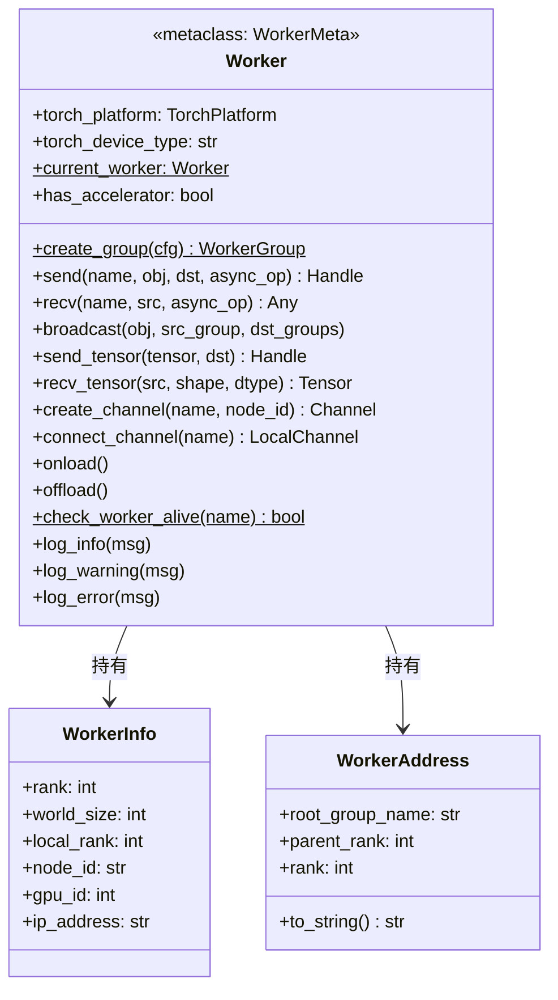

#### 5.2.1 Worker 初始化: 自动环境配置

每个 Worker 启动时自动配置以下分布式环境变量, 开发者无需手动管理:

```
MASTER_ADDR, MASTER_PORT       ← 进程组引导 (自动从 NodeManager 获取)
RANK, WORLD_SIZE               ← 全局 rank 和总进程数
LOCAL_RANK, LOCAL_WORLD_SIZE   ← 节点内 rank (用于 NCCL 通信)
CUDA_VISIBLE_DEVICES           ← GPU 可见性隔离 (由 Placement 计算)
NODE_RANK, CLUSTER_NODE_RANK   ← 节点拓扑信息
```

#### 5.2.2 信号处理

Worker 注册了系统信号处理器 (`_register_signal_handlers()`, worker.py:1148-1184):

```python
# 处理的信号: SIGINT, SIGTERM, SIGSEGV, SIGABRT, SIGQUIT, SIGUSR1, SIGUSR2
def signal_handler(signum, frame):
    logger.error(f"Worker received signal {signum}, traceback: {traceback.format_stack()}")
    os.kill(os.getpid(), signal.SIGKILL)  # 确保进程终止
```

**为什么 SIGKILL**: Worker 进程可能持有 NCCL 通信组句柄, 优雅关闭可能死锁 (等待对端进程的通信操作)。强制终止确保资源释放, 由 Ray 的 Actor 管理机制处理后续清理。

**限制**: 信号处理只在主线程有效。如果 Worker 的核心逻辑运行在工作线程中, 信号将被忽略。通过 `CATCH_SYSTEM_FAILURE` 环境变量可禁用信号处理。

#### 5.2.3 DeviceLock 与 PortLock

```python
# worker.py:467-470
self._device_lock: DeviceLock   # 控制同一 GPU 上多个 Worker 的互斥访问
self._port_lock: PortLock       # 防止同一节点上的端口冲突
```

`DeviceLock` 是上下文切换的核心原语。当 Worker A 需要 offload 模型并让 Worker B onload 时:
1. Worker A 完成计算, 调用 `offload()` 释放 GPU 内存
2. Worker A 释放 `device_lock`
3. Worker B 获取 `device_lock`, 调用 `onload()` 加载模型到 GPU
4. Worker B 执行计算

#### 5.2.4 扩展模块加载

Worker 支持通过 `EXT_MODULE` 环境变量加载用户自定义扩展:

```python
# worker.py:375
def _load_user_extensions(self):
    ext_module = os.environ.get("EXT_MODULE")
    if ext_module:
        module = importlib.import_module(ext_module)
        module.register()  # 用户在 register() 中注册自定义算法/模型
```

这是**插件模式**的实现, 允许用户在不修改 RLinf 源码的情况下注入新组件。

### 5.3 WorkerGroup: SPMD 集体管理

`WorkerGroup` (`rlinf/scheduler/worker/worker_group.py`) 以 SPMD 模式管理同类 Worker:

```python
# 创建并启动 Worker 组
actor_group = EmbodiedFSDPActor.create_group(cfg) \
    .launch(cluster, placement_strategy=actor_placement, name="Actor")

# 远程方法调用 (所有 Worker 并行执行, 返回异步句柄)
handle = actor_group.train_step(batch)

# 选择性执行 (仅在指定 rank 上执行)
actor_group.execute_on(0).save_checkpoint(path)

# 同步等待
result = handle.wait()
```

**`execute_on()` 的设计意义**: 某些操作不需要所有 rank 参与 (如 checkpoint 保存只需 rank 0), `execute_on()` 允许在子集上执行, 避免无谓的同步。

#### 5.3.1 Worker 存活检测

```python
@staticmethod
def check_worker_alive(worker_name: str) -> bool:
    actors = ray.util.state.list_actors(filters=[("name", "=", worker_name)])
    for actor in actors:
        if actor.get("state") == "DEAD":
            return False
    return True
```

**局限性 (诚实说明)**: RLinf 目前**没有自动 Worker 重启机制**。`check_worker_alive()` 只提供状态查询, 不触发恢复。如果一个 Worker 崩溃, 整个训练任务需要从最近的 checkpoint 手动重启。这是一个已知的设计限制 — 自动恢复在 NCCL 通信组场景下极为复杂, 因为需要重建所有涉及该 Worker 的进程组。

---

## 6. 通信与并发

RLinf 的通信层是系统中技术最密集的部分, 提供了从底层传输到高层抽象的完整通信栈。

### 6.1 CollectiveGroup: 自适应传输

`CollectiveGroup` (`rlinf/scheduler/collective/collective_group.py`, ~1861 行) 是最复杂的单文件, 封装了所有点对点和集合通信操作。

#### 6.1.1 传输后端选择

RLinf 不要求用户选择通信后端, 而是根据数据类型和设备位置自动决策:

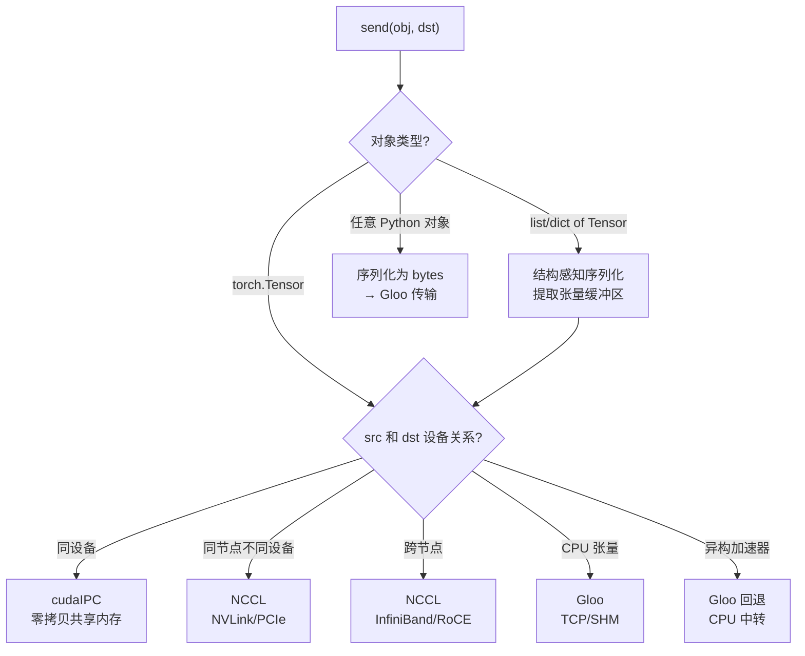

**为什么自适应**: 在真实集群中, 同一个训练任务中不同 Worker 对之间的最优传输后端可能不同 — 同节点内 Worker 用 cudaIPC (零拷贝), 跨节点用 NCCL (高带宽), CPU Worker 用 Gloo。手动配置每一对 Worker 的通信后端不现实。

**异构加速器检测**: `_no_accel_ccl` 标志在以下情况下触发 Gloo 回退:
- 通信双方的 GPU 型号不同 (如 A800 与 4090)
- 一方是 CPU-only Worker
- 加速器类型不支持原生集合通信

#### 6.1.2 类型编码协议

通信双方使用类型编码协商数据格式:

| 编码 | 类型 | 传输优化 |
|------|------|---------|
| 0 | `Tensor` | 直接 NCCL/Gloo 传输 |
| 1 | `list[Tensor]` | 批量传输, 共享 shape 元数据 |
| 2 | `dict[str, Tensor]` | key 作为元数据, value 批量传输 |
| 3 | `object` (任意 Python) | pickle 序列化后通过 Gloo |
| 4 | `Dataclass with Tensors` | 提取张量直传, 结构 pickle |

**Piggyback 机制**: 元数据 (如 Channel 的 key、weight) 附加在第一条类型编码消息上, 避免额外的通信轮次。

#### 6.1.3 多通道进程组

`MultiChannelProcessGroup` 为每个通信通道维护独立的 NCCL 进程组:

```python
_send_accel_ccl_process_groups: dict[channel_id, ProcessGroup]
_recv_accel_ccl_process_groups: dict[channel_id, ProcessGroup]
```

**为什么需要**: 多个 Channel 可能在同一对 Worker 之间并发传输数据。如果共享一个进程组, 通信会被序列化 (NCCL 不支持在同一进程组内并发操作)。独立进程组允许不同 Channel 的通信真正并行。

**权衡**: 每个进程组消耗额外的 GPU 内存 (NCCL 的内部缓冲区)。在通道数量极多时可能成为瓶颈。

#### 6.1.4 Comm ID 排序保证

```python
_send_comm_id_iter: itertools.count  # 发送方全局递增计数器
_recv_comm_id_iter: itertools.count  # 接收方全局递增计数器

# 路由到工作队列: comm_id % POOL_SIZE
work_queue = self._queues[comm_id % POOL_SIZE]
```

**为什么需要**: 同一对 Worker 之间可能有多个并发的 send/recv 操作。Comm ID 确保这些操作的**匹配顺序** — 第 N 个 send 一定与第 N 个 recv 配对。取模分配到多个工作队列实现负载均衡。

### 6.2 AsyncWork 层次结构

RLinf 实现了一套精心设计的异步工作抽象 (`rlinf/scheduler/collective/async_work.py`), 使通信操作可以异步执行并灵活链式组合:

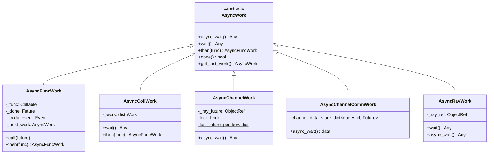

**为什么五种类型**:
- `AsyncFuncWork`: 通用回调链, 支持 `then()` 链式调用。当回调结果本身是 `AsyncWork` 时, 自动递归等待 (deep chaining)
- `AsyncCollWork`: 包装 `torch.distributed.Work`, 桥接 PyTorch 原生异步通信
- `AsyncChannelWork`: 包装 Ray ObjectRef, 支持**按 key 排序** — 同一 key 的操作通过 `last_future_per_key` 字典强制串行, 不同 key 可并行
- `AsyncChannelCommWork`: 处理 Channel `get()` 的乱序完成 — 由于 ChannelWorker 端的异步任务执行顺序不确定, 实际接收到的数据可能不是本次 `get()` 请求的。通过 `query_id → Future` 映射解决
- `AsyncRayWork`: 最轻量的包装, 直接代理 Ray ObjectRef

**CUDA Event 集成**: `AsyncFuncWork.__call__()` 执行回调后, 如果当前有加速器, 会记录一个 CUDA Event (`self._cuda_event = Event(); self._cuda_event.record()`), 确保后续操作等待 GPU 计算完成。

### 6.3 CollectiveWorkQueue: CUDA 流隔离

```python
# collective_group.py 中的工作队列
class CollectiveWorkQueue:
    def __init__(self):
        self._queue = asyncio.Queue()
        self._stream = torch.cuda.Stream()  # 每个队列独立的 CUDA 流

    def _run_queue(self):
        while True:
            work = self._queue.get()
            with torch.cuda.stream(self._stream):
                work.execute()
```

**为什么每队列一个 CUDA 流**: NCCL 操作在提交到 CUDA 流后异步执行。如果所有通信共享默认流, 通信和计算会互相阻塞。独立流使通信操作可以与计算重叠 — 这是实现**通信隐藏**的基础。

每种操作类型 (SEND, RECV, BROADCAST) 有独立的工作队列和线程, 形成**线程-per-操作**模型。队列内的操作按入队顺序执行, 队列间完全并行。

### 6.4 Channel 系统

Channel (`rlinf/scheduler/channel/channel.py`) 是 RLinf 中 Worker 间通信的高层抽象, 提供分布式 FIFO 队列语义。

#### 6.4.1 Channel 核心组件

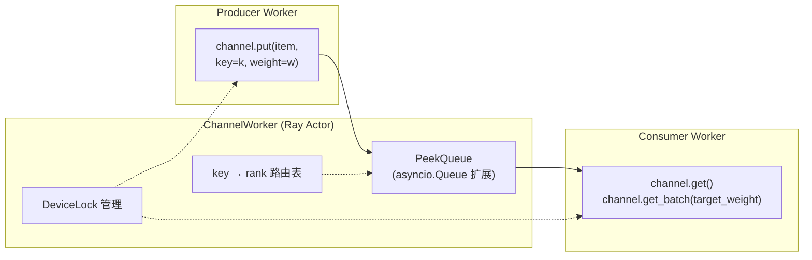

**PeekQueue**: 扩展 `asyncio.Queue`, 添加 `peek()` (查看队首但不出队) 和 `peek_all()` (查看全部) 方法。用于负载均衡决策。

**WeightedItem**: 每个入队数据携带权重 (如环境实例数), `get_batch(target_weight=N)` 按权重累积数据, 直到总权重达标。这解决了变长轨迹场景下的负载均衡问题 — 每个环境产出的数据量可能不同。

#### 6.4.2 Key 路由

Channel 支持按 key 路由数据到特定的 ChannelWorker 副本:

```python
def _get_channel_rank_by_key(self, key: str) -> int:
    if key in self._key_to_channel_rank_cache:
        return self._key_to_channel_rank_cache[key]
    rank = self.channel_worker.ensure_key_replica(key)
    self._key_to_channel_rank_cache[key] = rank
    return rank
```

**适用场景**: 多轮对话中, 每个会话 (key=session_id) 的数据必须路由到同一个处理进程, 保证状态一致性。

#### 6.4.3 自适应内存清理

`ChannelWorker` 后台运行 `_mem_cleaner()` 任务:

```python
# channel_worker.py:250-285
async def _mem_cleaner(self):
    while True:
        await asyncio.sleep(MEM_CLEAN_PERIOD_SECONDS)  # 每 5 秒
        allocated = torch.cuda.memory_allocated()
        reserved = torch.cuda.memory_reserved()
        utilization = allocated / reserved if reserved > 0 else 1.0
        if utilization < MEM_CLEAN_THRESHOLD:  # < 40%
            gc.collect()
            torch_platform.synchronize()
            torch_platform.empty_cache()
```

**为什么需要**: Channel 缓冲区中的数据被消费后, GPU 内存不会立即释放 (PyTorch 的内存池策略)。当利用率低于 40% 时, 主动清理可回收大量碎片化内存。

---

## 7. Runner 编排层

Runner 层 (`rlinf/runners/`) 是训练循环的编排者, 将各 WorkerGroup 的操作按训练算法要求的顺序协调执行。

### 7.1 Runner 类型

| Runner | 场景 | 核心组件 | 数据来源 |
|--------|------|---------|---------|
| `EmbodiedRunner` | 具身 RL (PPO/SAC) | Actor + Rollout + Env + Reward | 仿真/真实环境 |
| `AsyncEmbodiedRunner` | 异步具身 RL | 同上, Actor 异步更新 | 仿真/真实环境 |
| `ReasoningRunner` | 推理 RL (GRPO/PPO) | Actor + Rollout + Reward + Critic + Inference | 数据集 |
| `AgentRunner` | 智能体 RL | Agent + Tool Workers | 交互式任务 |
| `SFTRunner` | 监督微调 | SFT Worker | 数据集 |
| `CodingOnlineRLRunner` | 代码生成 RL | Actor + Rollout + 代码执行 | 编程问题集 |

### 7.2 具身 RL 训练迭代 (EmbodiedRunner)

```mermaid
sequenceDiagram
    participant Runner as EmbodiedRunner
    participant Actor as ActorGroup
    participant Rollout as RolloutGroup
    participant Env as EnvGroup
    participant Reward as RewardGroup

    Note over Runner: === 第 k 次迭代 ===

    rect rgb(230, 245, 255)
        Note over Runner: 1. 权重同步
        Runner->>Actor: sync_model_to_rollout()
        Actor->>Actor: get_model_state_dict()
        Actor->>Actor: divide_model_to_bucket(128MB)
        loop 每个 bucket
            Actor->>Rollout: send(bucket, dst_rank)
        end
        Runner->>Rollout: sync_model_from_actor().wait()
    end

    rect rgb(230, 255, 230)
        Note over Runner: 2. 环境交互 + 策略推理 (并行)
        par 并行启动
            Runner->>Env: interact(env_ch, rollout_ch)
            Runner->>Rollout: generate(rollout_ch, env_ch)
        end

        loop 每个环境步 (max_episode_steps)
            Env->>Env: env.step(action)
            Env->>Rollout: env_channel.put(obs)
            Rollout->>Rollout: model.predict(obs)
            Rollout->>Env: rollout_channel.put(action)
        end
    end

    rect rgb(255, 245, 230)
        Note over Runner: 3. 轨迹收集与奖励计算
        Runner->>Actor: recv_rollout_trajectories()
        opt 如果使用奖励模型
            Runner->>Reward: compute_rewards(trajectory)
        end
    end

    rect rgb(255, 230, 230)
        Note over Runner: 4. 优势计算与策略更新
        Runner->>Actor: compute_advantages_and_returns()
        Runner->>Actor: run_training()
        Actor->>Actor: 前向 → 反向 → 梯度更新
    end

    rect rgb(245, 230, 255)
        Note over Runner: 5. 评估与检查点
        opt 到达评估间隔
            Runner->>Runner: evaluate()
        end
        opt 到达保存间隔
            Runner->>Actor: save_checkpoint()
        end
    end
```

### 7.3 推理 RL 训练迭代 (ReasoningRunner)

推理 RL 的数据流更复杂, 因为涉及独立的推理 Worker 和可选的 Critic:

```mermaid
sequenceDiagram
    participant Runner as ReasoningRunner
    participant DL as DataLoader
    participant Rollout as RolloutGroup
    participant Reward as RewardGroup
    participant Infer as InferenceGroup
    participant Critic as CriticGroup
    participant Actor as ActorGroup

    Runner->>DL: 获取一批 prompts
    Runner->>Rollout: rollout(dataloader_ch, rollout_ch)
    Note over Rollout: LLM 生成多个响应<br/>(SGLang/vLLM 后端)

    Runner->>Reward: compute_rewards(rollout_ch, reward_ch)
    Note over Reward: 验证答案正确性<br/>(数学/代码/搜索)

    opt 重计算 logprobs
        Runner->>Infer: run_inference(reward_ch, infer_ch)
        Note over Infer: 计算当前策略 logprobs<br/>+ 参考策略 logprobs (KL)
    end

    opt 有 Critic 模型
        Runner->>Critic: run_inference(infer_ch, value_ch)
        Note over Critic: 计算价值估计 V(s)
        Runner->>Critic: run_training(critic_input_ch, critic_output_ch)
        Note over Critic: 更新 Critic 网络
    end

    Runner->>Actor: run_training(actor_input_ch)
    Note over Actor: PPO/GRPO 策略更新
```

### 7.4 权重同步: 桶式传输

权重同步是训练迭代中的关键操作。RLinf 使用**桶式传输** (bucket-based sync) 来减少峰值内存:

```
传统方式: 获取完整 state_dict → 一次性发送
  峰值内存 = 模型参数 × 2 (原始 + 拷贝)

RLinf 桶式传输: 将模型分为 128MB 的桶, 逐桶发送
  峰值内存 = 模型参数 + 128MB
  每个桶: DTensor → full_tensor() → 跨 rank reduce → send → 释放
```

**为什么 128MB**: 太小的桶增加通信轮次 (每次有固定开销); 太大的桶占用过多临时内存。128MB 是经验最优值。

### 7.5 检查点生命周期

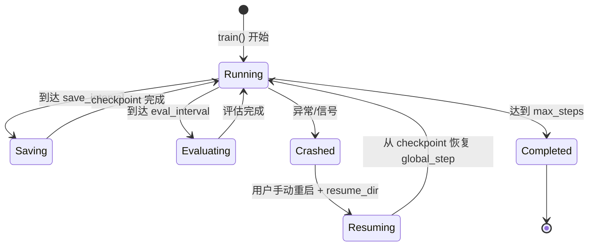

**恢复语义**: `resume_dir` 指定 checkpoint 目录, Runner 从目录名解析 `global_step`, Actor 加载模型和优化器状态。数据加载器跳过已处理的批次 (`skip_first_n_batches`)。

---

# Part III: 领域系统

---

## 8. 算法系统

### 8.1 注册表模式

RLinf 的算法系统 (`rlinf/algorithms/`) 通过装饰器将函数注册到全局字典:

```python
# rlinf/algorithms/registry.py
ADV_REGISTRY: dict[str, Callable] = {}
LOSS_REGISTRY: dict[str, Callable] = {}

def register_advantage(name: str):
    def decorator(fn):
        ADV_REGISTRY[name] = fn
        return fn
    return decorator

def register_policy_loss(name: str):
    def decorator(fn):
        LOSS_REGISTRY[name] = fn
        return fn
    return decorator
```

YAML 配置选择算法:
```yaml
algorithm:
  adv_type: gae              # → ADV_REGISTRY["gae"]
  loss_type: actor_critic     # → LOSS_REGISTRY["actor_critic"]
```

**调度入口** `policy_loss()` 和 `calculate_adv_and_returns()` 根据 `task_type` (embodied/reasoning) 自动应用预处理和后处理, 使算法函数本身无需感知任务类型差异。

### 8.2 优势函数

#### 8.2.1 GAE — 广义优势估计

注册名: `@register_advantage("gae")`

**数学公式**:
```
δ_t = r_t + γ · V(s_{t+1}) · (1 - done_t) - V(s_t)
A_t = δ_t + (γ · λ) · (1 - done_t) · A_{t+1}    (反向递推)
R_t = A_t + V(s_t)                                (Return = Advantage + Value)
```

**适用场景**: 具身 RL (PPO with Critic), 需要价值函数 V(s)。GAE 通过 λ 参数在偏差 (λ=0, 单步 TD) 和方差 (λ=1, Monte Carlo) 之间权衡。

#### 8.2.2 GRPO — 组相对策略优化

注册名: `@register_advantage("grpo")`

**核心思想**: 对每个 prompt 生成一组响应, 组内相对排名作为优势函数, 无需 Critic 模型。

```
对每个 prompt g, 生成 K 个响应, 奖励为 {r_1, ..., r_K}
μ_g = mean({r_i})
σ_g = std({r_i})
A_i = (r_i - μ_g) / (σ_g + ε)
```

**适用场景**: 推理 RL (数学推理, 代码生成), 奖励信号稀疏 (只有最终答案正确/错误)。

#### 8.2.3 GRPO Dynamic — 多轮 GRPO

注册名: `@register_advantage("grpo_dynamic")`

多轮对话场景中, 每个 "turn" 可能属于不同的 "trajectory", 需要灵活的分组策略:

```
idx_to_traj: turn_idx → global_traj_idx  (turn 到 trajectory 的映射)

模式一 "trajectory": 聚合 turn 奖励为 trajectory 奖励, GRPO 在 trajectory 级计算
模式二 "turn": 每个 question 内跨所有 turn 计算 GRPO
```

**适用场景**: 智能体 RL (多轮工具使用), 每个 turn 有独立奖励信号。

#### 8.2.4 REINFORCE++ — 带基线的策略梯度

注册名: `@register_advantage("reinpp")`

```
基线减法: R_g -= mean(R_g)          (组内减均值)
Return-to-go: R_t = Σ_{k=t}^T r_k  (从 EOS 反向累加)
KL 惩罚: R_t -= β · KL(π || π_ref)  (防止偏离参考策略)
全局归一化: A = (R - μ) / (σ + ε)   (跨所有 token 归一化)
```

**适用场景**: off-policy 学习, 需要 KL 正则化控制探索范围。

### 8.3 损失函数

#### 8.3.1 Decoupled PPO — 版本感知近端策略优化

这是 RLinf 最具技术深度的算法创新 (`rlinf/algorithms/losses.py:24-164`)。

**问题**: 在异步训练中, 收集 rollout 数据时使用的策略版本 (v_behav) 可能与当前训练版本 (v_theta) 不同。标准 PPO 的裁剪锚点是行为策略的 logprobs, 但在版本差距大时, 裁剪效果减弱。

**解决方案**: 引入**近端策略锚点** (Proximal Policy Anchor), 通过版本插值计算:

```python
# rlinf/algorithms/losses.py:65-86
v_behav = versions.float()           # 数据收集时的策略版本
v_theta = float(current_version)     # 当前训练版本
v_prox = v_theta - 1.0               # 近端版本 (上一个版本)

version_diff = v_theta - v_behav
version_gap = v_prox - v_behav

# 插值系数: 行为策略越旧, alpha 越接近 1 (近端锚点越接近当前策略)
alpha = clamp(version_gap / version_diff, 0.0, 1.0)

# 近端 logprobs = 行为 logprobs + alpha * (当前 logprobs - 行为 logprobs)
proximal_logprobs = old_logprobs + alpha * (logprobs - old_logprobs)
```

然后使用 `proximal_logprobs` (而非 `old_logprobs`) 作为裁剪锚点:

```
ratio = exp(logprobs - proximal_logprobs)
clipped_ratio = clamp(ratio, 1 - ε_low, 1 + ε_high)
loss = -min(ratio * A, clipped_ratio * A)
```

**直觉**: 当行为策略版本与当前版本差距较大时 (off-policy 程度高), `alpha → 1`, 近端锚点接近当前策略, 裁剪范围更紧 — 防止在 off-policy 数据上做过大的更新。当版本一致时 (on-policy), `alpha = 0`, 退化为标准 PPO。

**双裁剪** (可选): `clip_ratio_c > 1` 时启用, 额外限制负优势情况下的策略更新。

**行为策略权重过滤** (可选): `behave_weight_threshold` 过滤 OOD 动作, 其 ratio 超过阈值的 token 被降权。

#### 8.3.2 标准 PPO 与 Critic 损失

```
# PPO Actor Loss
ratio = exp(log_π(a|s) - log_π_old(a|s))
loss = -min(ratio * A, clamp(ratio, 1-ε, 1+ε) * A)

# PPO Critic Loss (with value clipping)
V_clipped = V_old + clamp(V - V_old, -ε, +ε)
loss = max(huber(R - V), huber(R - V_clipped))
```

### 8.4 损失缩放管线

`loss_scales.py` 实现了三级损失缩放管线:

```
group_level → agent_level → turn_level
```

**turn_level 的精妙之处**: 将均匀的 per-turn 权重转换为按 token 数量加权 — 长 turn 中的每个 token 分到的权重更小, 避免长响应主导训练梯度。

---

## 9. 模型与环境生态

### 9.1 模型工厂

RLinf 通过 `SupportedModel` 枚举和 `get_model()` 工厂函数管理模型:

```python
class SupportedModel(Enum):
    OPENVLA = ("openvla", "embodied")
    OPENVLA_OFT = ("openvla_oft", "embodied")
    PI0 = ("pi0", "embodied")
    GR00T = ("gr00t", "embodied")
    STARVLA = ("starvla", "embodied")
    QWEN2_5 = ("qwen2.5", "reasoning")
    QWEN3 = ("qwen3", "reasoning")
    # ... 共 20+ 种
```

#### 9.1.1 BasePolicy 抽象

所有具身模型继承自 `BasePolicy`, 通过 `ForwardType` 枚举支持多种前向模式:

```python
class BasePolicy(ABC):
    class ForwardType(Enum):
        DEFAULT = "default"    # 标准 RL 训练
        SFT = "sft"            # 监督微调
        SAC = "sac"            # SAC 策略
        SAC_Q = "sac_q"        # SAC Q 函数
        CROSSQ = "crossq"      # CrossQ
        NFT = "nft"            # NFT 训练

    def forward(self, forward_type=ForwardType.DEFAULT, **kwargs):
        """根据 forward_type 分发到对应方法"""
        dispatch = {
            ForwardType.DEFAULT: self.default_forward,
            ForwardType.SFT: self.sft_forward,
            ForwardType.SAC: self.sac_forward,
            ...
        }
        return dispatch[forward_type](**kwargs)
```

**为什么用 ForwardType**: 同一个模型可能在不同训练阶段使用不同的前向逻辑 (如 SFT 预训练 → RL 微调 → SAC 策略优化)。枚举分发使调用方代码统一。

#### 9.1.2 VLA 模型的动作参数化

不同 VLA 模型使用截然不同的动作表示:

| 模型 | 动作参数化 | 输出格式 | 推理方式 |
|------|-----------|---------|---------|
| OpenVLA | 离散动作 token | 7 个 action tokens (256 bins) | 自回归采样 |
| Pi0 (OpenPI) | 连续动作向量 | Flow Matching 去噪输出 | 迭代去噪 |
| GR00T | 混合 (Token + 连续) | Action Transformer 输出 | 自回归 + MLP head |
| StarVLA | 多种 action head | fast/flowmatching/oft/adapter | 可选策略 |
| MLP/CNN Policy | 高斯分布参数 | mean + std → 采样 | 单步前向 |

### 9.2 环境工厂

环境通过 `SupportedEnvType` 枚举和 `get_env_cls()` 工厂函数管理:

```python
def get_env_cls(env_type: str, env_cfg=None) -> type:
    """延迟导入 — 避免未安装的环境依赖阻塞启动"""
    env_type = SupportedEnvType(env_type)
    if env_type == SupportedEnvType.MANISKILL:
        from rlinf.envs.maniskill.maniskill_env import ManiskillEnv
        return ManiskillEnv
    elif env_type == SupportedEnvType.LIBERO:
        from rlinf.envs.libero.libero_env import LiberoEnv
        return LiberoEnv
    # ...
```

**为什么延迟导入**: 不同环境依赖的包各不相同 (ManiSkill 需要 `mani_skill`, IsaacLab 需要 `isaaclab`, LIBERO 需要 `robosuite`)。延迟导入确保只有实际使用的环境才需要其依赖。

#### 9.2.1 支持的环境

| 类别 | 环境 | 计算特征 | 并行方式 |
|------|------|---------|---------|
| **GPU 仿真** | ManiSkill3 | GPU 渲染 + CPU 物理 | GPU 原生向量化 |
| | IsaacLab | GPU 原生 (PhysX) | GPU 向量化 |
| **CPU 仿真** | LIBERO | CPU 密集 (MuJoCo) | 多进程 |
| | CALVIN | CPU (PyBullet) | 多进程 |
| | MetaWorld | CPU (MuJoCo) | 多进程 |
| | BEHAVIOR-1K | CPU (iGibson) | 多进程 |
| | RoboCasa | CPU (MuJoCo) | 多进程 |
| | RobotWin | CPU (MuJoCo) | 多进程 |
| **统一接口** | RoboVerse | 混合 | 适配多仿真器 |
| **真实机器人** | Franka | 实时控制 (10Hz) | 单实例 |
| | XSquare Turtle2 | 实时控制 | 单实例 |
| **世界模型** | OpenSora | GPU 视频生成 | DP |
| | Wan | GPU 扩散模型 | DP |

#### 9.2.2 世界模型环境

`BaseWorldEnv` (`rlinf/envs/world_model/`) 提供了一种独特的环境类型 — 使用**学习到的动力学模型**作为环境模拟器:

```
真实轨迹 → 训练视频生成模型 (OpenSora/Wan) → 用视频模型作为 "环境"
                                               ↓
                                    VLA 策略在 "想象的" 轨迹上训练
                                               ↓
                                    KIR trick (Knowledge-In-Reality)
                                    将学到的知识迁移到真实环境
```

**KIR (Knowledge-In-Reality) 技巧**: 在世界模型生成的轨迹和真实轨迹之间计算相对奖励, 减少域差异 (domain gap) 对奖励信号的影响。

---

## 10. 智能体与工具系统

### 10.1 智能体循环架构

智能体 RL (`rlinf/workers/agent/`) 是 RLinf 中最复杂的编排模式, 涉及 LLM 生成、工具调用和多轮交互:

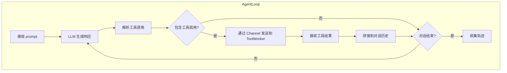

### 10.2 AgentLoopWorker vs MultiAgentLoopWorker

| 特性 | AgentLoopWorker | MultiAgentLoopWorker |
|------|----------------|---------------------|
| **轨迹结构** | 线性累积 response_ids/logprobs | 每 turn 独立的 `single_turn_outputs` |
| **输出类型** | `AgentLoopOutput` | `MultiAgentLoopOutput` → `DynamicRolloutResult` |
| **优势计算** | 标准 GRPO | GRPO Dynamic (多轮) |
| **适用场景** | 单轮工具使用 | 多轮搜索/推理 (SearchR1, WideSeek-R1) |

**关键数据流**: `MultiAgentLoopWorker` → `DynamicRolloutResult` (含 `idx_to_traj` 映射) → `grpo_dynamic` 优势计算 → `loss_scales` (turn_level 细粒度加权)。这是系统中最复杂的端到端数据流。

### 10.3 工具路由

```python
# agent_loop.py 中的工具调用路由
def tool_call(self, tool_name: str, tool_input: dict) -> str:
    channel_info = self.tool_channel_info_map[tool_name]
    session_key = uuid4().hex  # 唯一会话标识
    channel_info.input_channel.put(
        ToolChannelRequest(tool_name, tool_input, session_key),
        key=session_key
    )
    response = channel_info.output_channel.get(key=session_key)
    return response.result
```

**ToolWorker** 抽象 (`rlinf/workers/agent/tool_worker.py`) 定义了最小接口:

```python
class ToolWorker(ABC):
    def init_worker(self): ...
    def start_server(self): ...
    def stop_server(self): ...
```

具体实现包括:
- `SearchToolWorker` — 网页搜索 (SearchR1)
- `HttpToolWorker` — HTTP 工具调用 (rStar2)
- `HttpCodeJudgeToolWorker` — 代码执行判断

---

## 11. 数据管线与训练引擎

### 11.1 核心数据结构

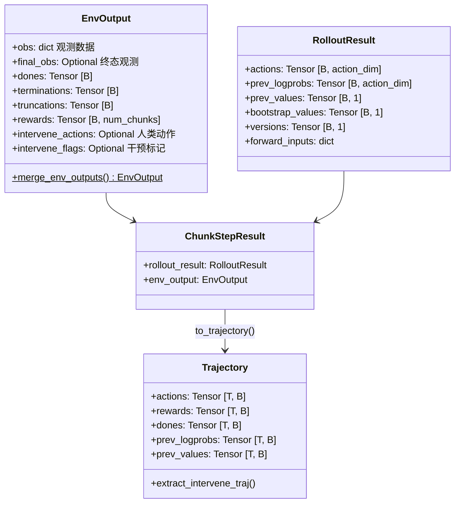

**关键设计决策**:

1. **CPU 张量策略**: 所有跨进程数据使用 CPU 张量, 避免 GPU 间直接传输的瓶颈。GPU 张量在 Worker 内部按需创建。
2. **版本追踪**: `versions` 字段 (模型权重 UUID) 记录每条数据的策略版本, 供 Decoupled PPO 的 alpha 插值使用。
3. **人类干预标记**: `intervene_actions`/`intervene_flags` 支持 DAgger — 标记哪些动作来自人类专家, `extract_intervene_traj()` 提取人类子轨迹用于监督学习。

### 11.2 CommMapper: 异构并行度下的批次分片

当 Env Worker 数量与 Rollout Worker 数量不同时, 需要将数据在不同并行度间正确分配:

```python
# rlinf/utils/comm_mapping.py
class CommMapper:
    @staticmethod
    def get_dst_ranks(batch_size, src_world_size, dst_world_size, src_rank):
        """计算 src_rank 应该发送数据到哪些 dst_ranks"""
        # 每个 src_rank 对应 ceil(dst_world_size/src_world_size) 个 dst
        # 批次均匀分配

    @staticmethod
    def build_channel_key(src_rank, dst_rank, extra=""):
        """生成确定性的 Channel key, 用于精确路由"""
```

**适用场景**: 4 个 EnvWorker, 8 个 RolloutWorker — 每个 Env 将数据发送给 2 个 Rollout Worker。CommMapper 自动计算这种 N:M 映射。

### 11.3 Replay Buffer

`TrajectoryCache` (`rlinf/data/replay_buffer.py`) 提供经验回放:

- **FIFO 槽位管理**: `_slot_to_id` 映射, 固定容量, 最旧数据被覆盖
- **CPU 克隆**: `clone_dict_of_tensors()` 将 GPU 轨迹克隆到 CPU, 实现内存隔离
- **线程安全**: 读写锁保护并发访问
- **适用场景**: off-policy 算法 (SAC, RLPD)

### 11.4 训练引擎

#### 11.4.1 FSDP 后端

`FSDPModelManager` (`rlinf/hybrid_engines/fsdp/fsdp_model_manager.py`) 管理 FSDP 分布式训练:

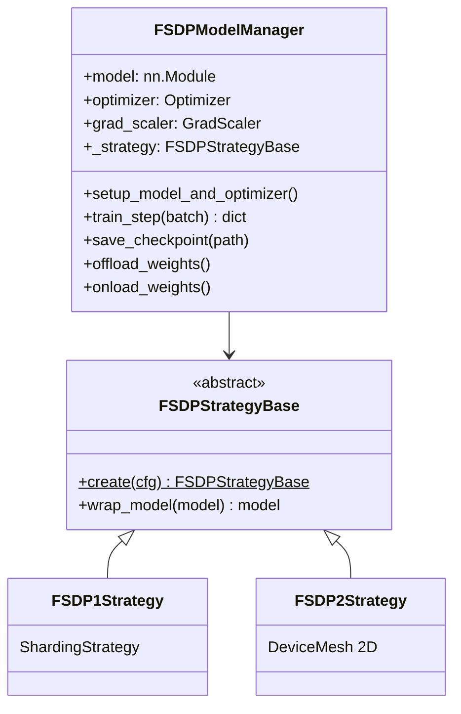

**FSDP 策略选择**:
- FSDP1: 成熟稳定, 适用于大多数场景
- FSDP2: PyTorch 最新版, 原生 DTensor 支持, 更好的 2D 并行 (FSDP + TP)

**混合精度**: 三层独立配置 — param dtype (bf16), reduce dtype (fp32), buffer dtype (fp32)。确保梯度聚合精度的同时, 最小化显存占用。

**CPU Offload**: 优化器状态、模型权重、梯度可分别卸载到 CPU, 用 CPU 内存换取 GPU 显存。

#### 11.4.2 Megatron 后端

支持 5D 并行, 适用于超大模型 (>100B):

| 并行维度 | 缩写 | 切分对象 | 通信模式 |
|---------|------|---------|---------|
| 数据并行 (DP) | DP | 数据批次 | AllReduce 梯度 |
| 张量并行 (TP) | TP | 单层权重矩阵 | AllReduce 激活值 |
| 流水线并行 (PP) | PP | 模型层 | P2P 激活值 |
| 序列并行 (SP) | SP | 序列维度 | AllGather/ReduceScatter |
| 专家并行 (EP) | EP | MoE 专家 | All-to-All tokens |

**Token Dispatcher** (`rlinf/hybrid_engines/megatron/token_dispatcher.py`): MoE 模型中, 将 token 动态路由到不同专家的跨设备分发器。

#### 11.4.3 推理引擎

| 引擎 | 核心特性 | 适用场景 |
|------|---------|---------|
| SGLang | PagedAttention, RadixTree Cache, 结构化生成 | 推理 RL 长序列生成 |
| vLLM | PagedAttention, 连续批处理 | 通用 LLM 推理 |
| HuggingFace | 原生 Transformers, 支持自定义 VLA 模型 | 具身 RL VLA 推理 |

**权重加载**: 推理引擎的权重通过 Actor Worker 的桶式传输同步, 而非从磁盘重新加载。

#### 11.4.4 检查点格式转换

RLinf 提供 `rlinf/utils/ckpt_convertor/` 在三种格式间转换:

```
FSDP Checkpoint ←→ HuggingFace Checkpoint ←→ Megatron Checkpoint
                         ↕
                   Middle Format (中间格式)
```

**为什么需要中间格式**: FSDP 和 Megatron 的分片策略不兼容, 直接转换需要 O(N^2) 的映射逻辑。中间格式作为规范化表示, 将转换复杂度降为 O(N)。

---

# Part IV: 分析与运维

---

## 12. 机器人行业深度集成

### 12.1 从传感器到动作: Franka 机器人完整代码路径

以下是 RLinf 中一个 Franka 机器人抓取任务的完整数据流:

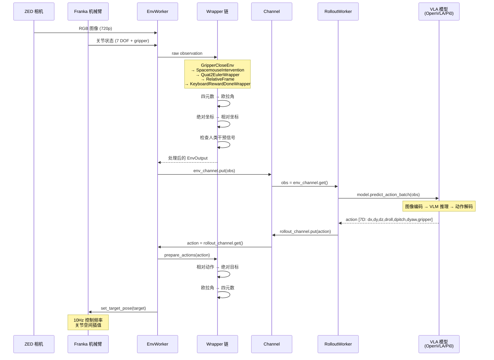

### 12.2 环境 Wrapper 链

Wrapper 的顺序至关重要 — 它们形成一个**从内到外**的处理管线:

```
最外层 (最先处理观测, 最后处理动作):
  KeyboardRewardDoneWrapper    ← 人工标记成功/失败
    RelativeFrame              ← 绝对坐标 ↔ 相对坐标
      Quat2EulerWrapper        ← 四元数 ↔ 欧拉角
        SpacemouseIntervention ← 人类遥操作覆盖
          GripperCloseEnv      ← 夹爪归一化
            FrankaEnv (底层)    ← 硬件通信
```

**为什么这个顺序**:
- `GripperCloseEnv` 最靠近硬件, 处理原始夹爪状态
- `SpacemouseIntervention` 需要在坐标转换之前拦截, 因为人类操作在原始坐标系中
- `RelativeFrame` 必须在 `Quat2EulerWrapper` 之后, 因为相对坐标计算需要欧拉角
- `KeyboardRewardDoneWrapper` 最外层, 负责人工标记任务成功

### 12.3 真实环境硬件配置

Franka 机器人的配置 (`rlinf/envs/realworld/franka/`) 展示了 RLinf 对真实硬件的支持深度:

```python
# FrankaRobotConfig 关键参数
controller_type: str = "euler"        # 欧拉角目标控制
step_frequency: int = 10              # 10Hz 控制频率
gripper_type: str = "robotiq"         # Robotiq 2F-85 夹爪
cameras: list[CameraConfig] = [...]   # 多路 ZED/RealSense 相机
reset_joint_cycles: int = 20000       # 每 20000 步重置关节 (防止漂移)
compliance_params: dict = {...}       # 柔顺控制参数 (安全性)
```

**遥操作支持**:
- **Spacemouse**: 6 DOF 空间鼠标, 人类通过推拉旋转控制末端执行器
- **GELLO**: 关节级遥操作设备, 更直觉的人类-机器人映射
- **ROS 集成**: `rlinf/envs/realworld/franka/ros/` 提供 ROS 话题桥接

### 12.4 Cloud-Edge 架构

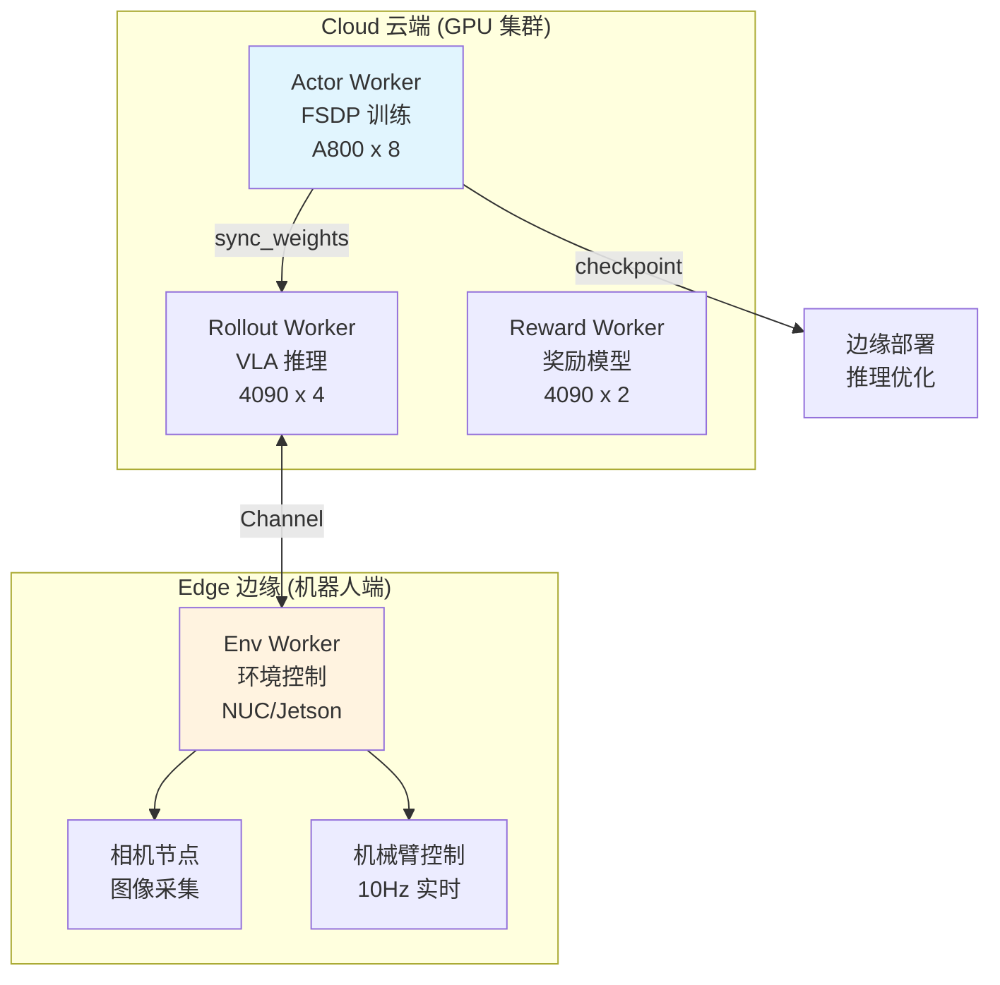

**为什么 Cloud-Edge**: 训练需要大规模 GPU 集群, 但机器人端只需低延迟推理。RLinf 的 Worker 抽象使 Env Worker 可以运行在边缘设备上, 通过 Ray 远程调用与云端 Worker 通信。

### 12.5 Sim-to-Real 训练流程

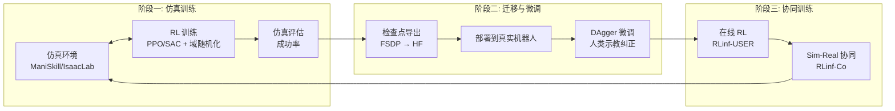

**DAgger 在 RLinf 中的实现**:
1. 机器人执行 VLA 策略的动作
2. 人类专家通过 Spacemouse/GELLO 观察执行过程
3. 当策略犯错时, 人类介入纠正 (`intervene_flags=1`)
4. 人类纠正的动作存入 `intervene_actions`
5. `Trajectory.extract_intervene_traj()` 提取人类子轨迹
6. 混合 RL 损失和 SFT 损失训练: `loss = λ_rl * L_rl + λ_sft * L_sft`

### 12.6 四种训练范式: 仿真/真机 × Online/Offline

RLinf 在具身 RL 领域的核心价值之一, 是**统一支持**仿真与真实机器人环境下的 Online RL 和 Offline RL 四种训练范式。这四种范式并非简单的排列组合 — 每种都有独特的系统设计需求, RLinf 为每种提供了专门的 Worker、算法和数据管线。

```mermaid
quadrantChart
    title RLinf 四种训练范式
    x-axis "Offline (静态数据)" --> "Online (实时交互)"
    y-axis "仿真环境" --> "真实机器人"
    quadrant-1 "真机 Online-RL"
    quadrant-2 "真机 Offline-RL"
    quadrant-3 "仿真 Offline-RL"
    quadrant-4 "仿真 Online-RL"
    "SAC+RLPD (真机)": [0.8, 0.85]
    "Async PPO (真机)": [0.75, 0.75]
    "DAgger HG (真机)": [0.6, 0.7]
    "数据采集+SFT": [0.15, 0.8]
    "DAgger (仿真)": [0.55, 0.25]
    "SFT VLA 预训练": [0.1, 0.3]
    "NFT 微调": [0.25, 0.35]
    "PPO (仿真)": [0.85, 0.2]
    "GRPO (仿真)": [0.8, 0.15]
    "SAC (仿真)": [0.7, 0.25]
```

#### 12.6.1 仿真 Online-RL — 实时环境交互策略优化

**典型场景**: 在 ManiSkill、IsaacLab 等仿真器中训练 VLA 或简单策略, 不断与环境交互并更新模型。

**系统架构**:

```mermaid
flowchart LR
    subgraph "训练循环 (EmbodiedRunner)"
        direction TB
        SYNC["① sync_weights<br/>同步最新权重到 Rollout"]
        INTERACT["② 并行交互<br/>Env.interact() ‖ Rollout.generate()"]
        RECV["③ recv_trajectories<br/>Actor 接收轨迹"]
        ADV["④ compute_advantages<br/>GAE / GRPO 计算"]
        TRAIN["⑤ run_training<br/>PPO / GRPO 梯度更新"]
        SYNC --> INTERACT --> RECV --> ADV --> TRAIN --> SYNC
    end
```

**核心组件**:

| 组件 | 实现类 | 职责 |
|------|--------|------|
| Runner | `EmbodiedRunner` / `AsyncEmbodiedRunner` | 编排训练循环 |
| 环境 | `EnvWorker` + ManiSkill/IsaacLab/LIBERO | 仿真环境步进 |
| 推理 | `MultiStepRolloutWorker` (HuggingFace 后端) | 策略推理生成动作 |
| 训练 | `EmbodiedFSDPActor` | FSDP 分布式策略更新 |

**算法支持**:
- **PPO + GAE**: 经典 on-policy 算法, 适合稳定训练 (`adv_type: gae`, `loss_type: actor_critic`)
- **GRPO**: 无需 Critic, 组内相对优势 (`adv_type: grpo`, `loss_type: actor`)
- **Decoupled PPO**: 版本感知的近端锚定, 支持异步训练 (`loss_type: decoupled_actor_critic`)

**关键设计决策**:

1. **GPU 向量化仿真 vs CPU 仿真**: ManiSkill/IsaacLab 使用 GPU 并行渲染, 一个 GPU 可运行数百个环境实例; LIBERO/CALVIN 使用 CPU MuJoCo, 需要多进程并行。RLinf 的 `EnvWorker` 通过 `total_num_envs` 和 `group_size` 配置统一处理两种模式。

2. **同步 vs 异步交互**: 同步模式 (`EmbodiedRunner`) 等待所有环境完成一轮交互后训练; 异步模式 (`AsyncEmbodiedRunner`) 使用异步 Channel 让训练与数据收集重叠, 适合 CPU 仿真 (仿真步进耗时不确定)。

3. **数据不落盘**: Online-RL 中轨迹数据通过 Channel 实时传输, 用完即弃, 不存入 replay buffer — 这是 on-policy 算法 (PPO/GRPO) 的本质要求。

**配置示例** (`maniskill_ppo_openvlaoft_quickstart.yaml`):

```yaml
algorithm:
  adv_type: gae                     # GAE 优势计算
  loss_type: actor_critic           # PPO actor-critic 损失
  gamma: 0.99
  gae_lambda: 0.95
  clip_ratio_high: 0.28
  clip_ratio_low: 0.2
  normalize_advantages: True

env:
  train:
    total_num_envs: 128             # GPU 向量化环境
    max_steps_per_rollout_epoch: 80 # 每轮 rollout 步数
    auto_reset: True                # 自动重置终止的环境
```

#### 12.6.2 仿真 Offline-RL — 从离线数据或 Replay Buffer 学习

**典型场景**: 利用预收集的仿真演示数据训练策略, 或通过 replay buffer 实现样本高效的 off-policy 学习。

RLinf 在仿真 offline-RL 中提供了**三条路径**, 对应不同的数据来源和学习目标:

```mermaid
flowchart TB
    subgraph "路径 A: 纯离线 SFT"
        DATASET_A["预收集数据集<br/>(LeRobot 格式)"]
        SFT_RUNNER["SFTRunner"]
        SFT_WORKER["FSDPVlaSftWorker"]
        DATASET_A --> SFT_RUNNER --> SFT_WORKER
    end

    subgraph "路径 B: SAC + Replay Buffer"
        ENV_B["仿真环境<br/>(实时交互)"]
        REPLAY_B["TrajectoryReplayBuffer<br/>(经验回放)"]
        SAC_WORKER["EmbodiedSACFSDPPolicy"]
        ENV_B -->|"在线收集"| REPLAY_B
        REPLAY_B -->|"随机采样"| SAC_WORKER
        SAC_WORKER -->|"更新策略"| ENV_B
    end

    subgraph "路径 C: DAgger + Replay Buffer"
        ENV_C["仿真环境<br/>(含专家策略)"]
        REPLAY_C["TrajectoryReplayBuffer<br/>(专家轨迹)"]
        DAGGER_WORKER["EmbodiedDAGGERFSDPPolicy"]
        ENV_C -->|"抽取专家数据"| REPLAY_C
        REPLAY_C -->|"监督学习"| DAGGER_WORKER
    end
```

**路径 A: 纯离线 SFT — 行为克隆预训练**

- **Runner**: `SFTRunner` — 无环境交互, 纯数据驱动
- **Worker**: `FSDPVlaSftWorker` — 加载离线数据集, 执行监督学习
- **数据**: 通过 `data.train_data_paths` 加载 LeRobot 格式数据
- **损失**: 标准交叉熵/MSE 动作预测损失 (`ForwardType.SFT`)
- **用途**: VLA 模型预训练, 在大规模仿真数据上学习基础操作能力

```python
# SFTRunner 训练循环 (简化)
for step in range(max_steps):
    actor_metrics = actor.run_training().wait()  # 从数据集采样→前向→反向→更新
    if eval_model:
        eval_metrics = actor.run_eval().wait()
        if early_stop.update(eval_metrics):      # 支持 early stopping
            break
```

**路径 B: SAC — Off-Policy RL with Replay Buffer**

SAC (Soft Actor-Critic) 是 RLinf 支持的核心 off-policy 算法, 适合**样本高效**的连续控制任务。

- **Worker**: `EmbodiedSACFSDPPolicy` (继承自 `EmbodiedFSDPActor`)
- **核心组件**:
  - `TrajectoryReplayBuffer`: 存储在线收集的轨迹
  - `EntropyTemperature`: 自动熵调节 (softplus/exp/fixed)
  - Target Network: 指数移动平均软更新 (τ=0.005)
  - 可选 Demo Buffer: 混合离线专家数据

```python
# SAC 训练循环核心 (EmbodiedSACFSDPPolicy)
async def recv_rollout_trajectories(self, input_channel):
    trajectory = await input_channel.get(async_op=True).async_wait()
    self.replay_buffer.add_trajectories([trajectory])  # 存入 replay buffer
    if self.demo_buffer:
        intervene_trajs = trajectory.extract_intervene_traj()
        self.demo_buffer.add_trajectories(intervene_trajs)  # 专家数据存入 demo buffer

def update_one_epoch(self):
    batch = next(self.buffer_dataloader_iter)  # 从 replay buffer 采样
    # 1. Critic 更新: Q(s,a) → MSE(Q, r + γ·Q_target(s', π(s')))
    critic_loss = self.forward_critic(batch)
    # 2. Actor 更新: π → max_π Q(s, π(s)) - α·log π(s)
    actor_loss = self.forward_actor(batch)
    # 3. 熵温度更新: α → α·(log π + H_target)
    alpha_loss = self.update_entropy_temperature(batch)
    # 4. Target 软更新: θ_target ← (1-τ)·θ_target + τ·θ
    self.soft_update_target_model()
```

**SAC 的 `critic_actor_ratio` 设计**: 默认 `critic_actor_ratio: 4`, 即每次 Actor 更新对应 4 次 Critic 更新。这反映了一个 off-policy RL 的工程经验: Critic (Q 网络) 需要更频繁更新来提供准确的值估计, Actor 只需偶尔更新方向。

**ReplayBufferDataset 数据混合**: 当同时有 replay buffer 和 demo buffer 时, 每个 batch 按 50/50 混合:

```python
# ReplayBufferDataset.__iter__
if self.demo_buffer is not None:
    replay_batch = self.replay_buffer.sample(batch_size // 2)
    demo_batch = self.demo_buffer.sample(batch_size // 2)
    batch = concat_batch(replay_batch, demo_batch)
```

**路径 C: DAgger — 仿真中的模仿学习**

- **Worker**: `EmbodiedDAGGERFSDPPolicy`
- **核心**: 从 rollout 轨迹中提取专家干预部分, 存入 replay buffer, 用监督学习更新策略
- **关键方法**: `traj.extract_intervene_traj(mode="all")` 提取所有 `intervene_flags=1` 的步骤
- **Beta 衰减**: `β` 控制专家介入频率, 从 1.0 指数衰减到 0, 逐步让学生策略自主

**路径 D: NFT (Neural Fine-Tuning) — Flow Matching + DPO**

NFT 是 RLinf 独有的 off-policy 微调算法, 结合 flow matching 和 DPO 思想:

```python
# NFT 核心损失 (_compute_embodied_nft_loss)
# 1. 优势函数 → 偏好信号: y = clamp(advantages * 2 - 1, -clip, clip) / clip
# 2. 速度预测: v_pos = v_old + β·Δv, v_neg = v_old - β·Δv
# 3. Flow matching 转移: x_next = flow_mean(x_t, velocity)
# 4. 能量差: δE = ||x_next_pos - x_true||² - ||x_next_neg - x_true||²
# 5. DPO 损失: L = softplus((dpo_β / 2) · y · δE)
```

**配置示例** (`frankasim_sac_cnn_async.yaml`):

```yaml
algorithm:
  adv_type: embodied_sac
  loss_type: embodied_sac
  gamma: 0.96
  tau: 0.005                        # Target 网络软更新系数
  critic_actor_ratio: 4             # Critic 更新频率倍数
  update_epoch: 32                  # 每轮训练的更新次数
  entropy_tuning:
    alpha_type: softplus
    initial_alpha: 0.01
    target_entropy: -3              # 目标熵 (≈ -action_dim)
  replay_buffer:
    enable_cache: True
    cache_size: 200                 # 内存中缓存的轨迹数
    min_buffer_size: 1              # 最少缓存多少轨迹才开始训练
    sample_window_size: 200         # 采样窗口 (最近 N 条轨迹)
```

#### 12.6.3 真机 Online-RL — 真实机器人实时学习

**典型场景**: 真实机器人 (Franka、XSquare Turtle2) 在线与环境交互, 实时收集数据并更新策略。这是最具挑战性的范式, 需要解决安全性、低频交互、Cloud-Edge 通信等问题。

**系统架构**:

```mermaid
flowchart TB
    subgraph "Edge 边缘 — 机器人节点"
        ROBOT_ENV["EnvWorker<br/>真实机器人 (10Hz 控制)"]
        SPACEMOUSE["SpacemouseIntervention<br/>人类安全监护"]
        CAMERA["ZED/RealSense 相机"]
        ROBOT_ENV --- SPACEMOUSE
        ROBOT_ENV --- CAMERA
    end

    subgraph "Cloud 云端 — GPU 节点"
        ROLLOUT_W["RolloutWorker<br/>VLA/CNN 推理"]
        ACTOR_W["ActorWorker<br/>SAC/PPO 训练"]
        REPLAY["TrajectoryReplayBuffer<br/>+ Demo Buffer"]
    end

    ROBOT_ENV <-->|"Channel<br/>(obs → action)"| ROLLOUT_W
    ROLLOUT_W -->|"轨迹"| ACTOR_W
    ACTOR_W -->|"存储"| REPLAY
    REPLAY -->|"采样"| ACTOR_W
    ACTOR_W -->|"sync_weights"| ROLLOUT_W
```

**核心设计决策**:

1. **Cloud-Edge 分离**: 训练和推理在 GPU 节点 (如 RTX 4090), 机器人控制在独立节点。通过 Ray + `node_groups` 配置:

```yaml
cluster:
  num_nodes: 2
  node_groups:
    - label: "4090"           # GPU 训练/推理节点
      node_ranks: 0
    - label: franka            # 机器人控制节点
      node_ranks: 1
      hardware:
        type: Franka
        configs:
          - robot_ip: ROBOT_IP
            node_rank: 1
  component_placement:
    actor:
      node_group: "4090"
      placement: 0            # 1 GPU 训练
    rollout:
      node_group: "4090"
      placement: 0            # 同 GPU 推理 (共享)
    env:
      node_group: franka
      placement: 0            # 机器人节点
```

2. **SAC + RLPD (Reinforcement Learning with Prior Data)**: 真机 online-RL 的主要算法, 结合在线采集和预收集的演示数据:

```yaml
# realworld_cap_tighten_rlpd_cnn_async.yaml
algorithm:
  adv_type: embodied_sac
  loss_type: embodied_sac
  gamma: 0.96
  tau: 0.005
  critic_actor_ratio: 4
  update_epoch: 32            # 每轮 rollout 后训练 32 个 epoch
  replay_buffer:
    min_buffer_size: 1        # 1 条轨迹即可开始训练 (真机数据珍贵)
    cache_size: 200
  demo_buffer:                # 预收集的人类演示
    load_path: "/path/to/demo_data"
    min_buffer_size: 1
```

3. **人类安全监护 (Human-in-the-loop Safety)**:

```python
# SpacemouseIntervention Wrapper 核心逻辑
def step(self, action):
    expert_action, replaced = self._get_expert_action()
    if replaced:  # 人类通过 Spacemouse 介入
        executed_action = expert_action
        info["intervene_action"] = expert_action
        info["intervene_flag"] = True
    else:
        executed_action = action      # 使用策略动作
        info["intervene_flag"] = False
    obs, reward, done, truncated, info = self.env.step(executed_action)
    return obs, reward, done, truncated, info
```

4. **异步训练 (`AsyncEmbodiedRunner`)**: 真实机器人交互慢 (10Hz), 必须异步训练 — 在等待新轨迹时, 对 replay buffer 中的旧数据执行多轮更新:

```python
# 真机 online-RL 的典型训练节奏
# 1 条轨迹 ≈ 18 秒 (180 步 × 10Hz)
# 32 轮 update_epoch × micro_batch 训练 ≈ 数秒
# → 训练完等待下一条轨迹, 无 GPU 空闲浪费
```

5. **Async PPO 在真机上**: RLinf 也支持 on-policy PPO 在真机上运行 (如 `realworld_peginsertion_async_ppo_cnn.yaml`), 但由于 PPO 不使用 replay buffer, 样本效率较低, 适合已有较好预训练模型的微调场景。

**真机 online-RL 支持的算法**:

| 算法 | Worker | 特点 | 配置示例 |
|------|--------|------|---------|
| **SAC + RLPD** | `EmbodiedSACFSDPPolicy` | Off-policy, 样本高效, 支持 demo buffer | `realworld_cap_tighten_rlpd_cnn_async.yaml` |
| **SAC + CrossQ** | `EmbodiedSACFSDPPolicy` | 改进的 Q 学习, 减少过估计 | `q_head_type: crossq` |
| **SAC + DSRL** | `EmbodiedSACFSDPPolicy` | 独立 actor/critic 编码器, 精度保护 | `use_dsrl: True` |
| **Async PPO** | `AsyncFSDPActor` | On-policy, 需要更多交互 | `realworld_peginsertion_async_ppo_cnn.yaml` |
| **DAgger (HG)** | `EmbodiedDAGGERFSDPPolicy` | 人类示教, 纯模仿 | `realworld_pnp_dagger_openpi.yaml` |

#### 12.6.4 真机 Offline-RL — 从预收集的真实数据学习

**典型场景**: 通过人类遥操作 (Spacemouse/GELLO) 预收集一批真实机器人数据, 然后离线训练策略。

**数据采集流程**:

```mermaid
sequenceDiagram
    participant Human as 人类操作员
    participant SM as SpaceMouse/GELLO
    participant Env as RealWorldEnv
    participant Collector as DataCollector
    participant LeRobot as LeRobotDatasetWriter

    Human->>SM: 遥操作指令
    SM->>Env: expert_action + intervene_flag=1
    Env->>Env: env.step(expert_action)
    Env->>Collector: EnvOutput + intervene_action

    Collector->>Collector: 累积 EmbodiedRolloutResult
    Note over Collector: 判断 episode 成功?
    Collector-->>Collector: 失败 → 丢弃, 成功 → 保存
    Collector->>LeRobot: 写入 LeRobot 数据集

    Note over LeRobot: 数据格式:<br/>images + states + actions<br/>+ intervene_flags<br/>fps=10, robot_type=panda
```

**Step 1: 数据采集** (`examples/embodiment/collect_real_data.py`):

RLinf 提供独立的数据采集脚本, 核心是 `DataCollector` Worker:

```python
class DataCollector(Worker):
    def run(self):
        obs, _ = self.env.reset()
        current_rollout = EmbodiedRolloutResult()
        while success_cnt < num_data_episodes:
            action = np.zeros((1, action_dim))      # 无 AI 策略, 纯人类操作
            next_obs, reward, done, _, info = self.env.step(action)
            if "intervene_action" in info:
                action = info["intervene_action"]   # 使用人类动作
            # 构建轨迹...
            if done and reward >= threshold:        # 仅保存成功的 episode
                trajectory = current_rollout.to_trajectory()
                buffer.add_trajectories([trajectory])
```

配置 (`realworld_collect_data.yaml`):

```yaml
runner:
  num_data_episodes: 20           # 收集 20 条成功轨迹
env:
  eval:
    use_spacemouse: True          # 使用 Spacemouse 遥操作
    max_episode_steps: 10000      # 不限制步数 (人类自行判断)
    data_collection:
      enabled: True
      save_dir: ${runner.logger.log_path}/collected_data
      export_format: "pickle"     # 或 LeRobot 格式
      only_success: True          # 仅保存成功的 episode
      robot_type: "panda"
      fps: 10
```

**Step 2: 数据格式与存储**

RLinf 支持两种存储格式:
- **Pickle (TrajectoryReplayBuffer)**: 内部格式, 直接存储 `Trajectory` 对象, 方便恢复训练
- **LeRobot 格式**: 社区标准格式, 通过 `LeRobotDatasetWriter` 导出, 支持 HuggingFace 生态

```python
# LeRobot 写入 (rlinf/data/lerobot_writer.py)
writer = LeRobotDatasetWriter()
writer.create(
    repo_id="franka-peg-insertion",
    robot_type="panda",
    fps=10,
    features={
        "state": {"dtype": "float32", "shape": (8,)},    # TCP + gripper
        "actions": {"dtype": "float32", "shape": (7,)},   # 7D 动作
        "image": {"dtype": "image", "shape": (256, 256, 3)},
        "wrist_image": {"dtype": "image", "shape": (128, 128, 3)},
        "intervene_flag": {"dtype": "bool", "shape": (1,)},
    }
)
```

**Step 3: 离线训练**

从预收集数据训练有三种方式:

| 方式 | Runner | Worker | 适用场景 |
|------|--------|--------|---------|
| **VLA SFT** | `SFTRunner` | `FSDPVlaSftWorker` | 大规模 VLA 预训练 (Pi0, LingBotVLA) |
| **DAgger 离线** | `EmbodiedRunner` | `EmbodiedDAGGERFSDPPolicy` | 加载 demo buffer, 纯监督学习 |
| **SAC 离线启动** | `EmbodiedRunner` | `EmbodiedSACFSDPPolicy` | 加载 demo buffer → 切换到 online |

**VLA SFT 离线训练**:

```python
# FSDPVlaSftWorker 核心
class FSDPVlaSftWorker(FSDPSftWorker):
    def build_dataloader(self, data_paths):
        # 为 Pi0 模型加载 OpenPI 数据格式
        config = get_openpi_config(config_name, data_kwargs=data_kwargs)
        return openpi_data_loader.create_data_loader(config, framework="pytorch")

    def get_train_model_output(self, batch):
        observation, actions = batch
        losses = self.model(forward_type=ForwardType.SFT,
                           data={"observation": observation, "actions": actions})
        return losses
```

**DAgger 预加载 Demo Buffer**:

```yaml
# 配置 demo buffer 的 load_path 实现纯离线训练
algorithm:
  loss_type: embodied_dagger
  replay_buffer:
    enable_cache: True
    min_buffer_size: 4
    # 加载预收集的演示数据
    auto_save_path: "/path/to/collected_data"
```

#### 12.6.5 四种范式对比总结

```mermaid
graph TB
    subgraph "数据来源"
        LIVE["实时交互<br/>(环境步进)"]
        DEMO["预收集数据<br/>(人类遥操作)"]
        REPLAY["Replay Buffer<br/>(混合)"]
    end

    subgraph "仿真 Online"
        SO_PPO["PPO/GRPO<br/>数据即用即弃"]
    end

    subgraph "仿真 Offline"
        SF_SFT["SFT 预训练"]
        SF_SAC["SAC + Replay"]
        SF_DGR["DAgger 仿真"]
        SF_NFT["NFT 微调"]
    end

    subgraph "真机 Online"
        RO_SAC["SAC + RLPD<br/>+ Demo Buffer"]
        RO_PPO["Async PPO"]
        RO_DGR["HG-DAgger"]
    end

    subgraph "真机 Offline"
        RF_COL["数据采集"]
        RF_SFT["VLA SFT"]
        RF_LOAD["Demo Buffer 加载"]
    end

    LIVE --> SO_PPO
    LIVE --> SF_SAC
    LIVE --> RO_SAC
    LIVE --> RO_PPO
    LIVE --> RO_DGR
    DEMO --> SF_SFT
    DEMO --> RF_COL --> RF_SFT
    DEMO --> RF_LOAD
    REPLAY --> SF_SAC
    REPLAY --> SF_DGR
    REPLAY --> SF_NFT
    REPLAY --> RO_SAC
```

| 维度 | 仿真 Online | 仿真 Offline | 真机 Online | 真机 Offline |
|------|------------|-------------|------------|-------------|
| **Runner** | `EmbodiedRunner` | `SFTRunner` / `EmbodiedRunner` | `AsyncEmbodiedRunner` | `SFTRunner` |
| **核心 Worker** | `EmbodiedFSDPActor` | `FSDPVlaSftWorker` / `EmbodiedSACFSDPPolicy` | `EmbodiedSACFSDPPolicy` / `AsyncFSDPActor` | `FSDPVlaSftWorker` / `EmbodiedDAGGERFSDPPolicy` |
| **主要算法** | PPO, GRPO | SFT, SAC, DAgger, NFT | SAC+RLPD, Async PPO, HG-DAgger | SFT, DAgger |
| **数据来源** | 实时仿真交互 | 预收集数据集 / Replay Buffer | 实时机器人交互 + Demo Buffer | 预收集真实数据 |
| **Replay Buffer** | 不需要 (on-policy) | 需要 (SAC/DAgger) / 不需要 (SFT) | 需要 (SAC) / 不需要 (PPO) | 需要 (DAgger) / 不需要 (SFT) |
| **人类参与** | 无 | 可选 (仿真中的专家策略) | 必要 (安全监护) | 必要 (数据采集) |
| **交互频率** | 高 (GPU 仿真数百实例) | 无实时交互 | 低 (10Hz, 1 机器人) | 无实时交互 |
| **样本效率需求** | 低 (仿真成本低) | N/A | 极高 (真实交互昂贵) | N/A |
| **典型 GPU 配置** | 8-32 GPU | 1-8 GPU | 1-2 GPU + 机器人节点 | 1-8 GPU |
| **配置示例** | `maniskill_ppo_*` | `libero_goal_nft_*` | `realworld_*_sac_*_async` | `realworld_collect_data.yaml` + SFT |

#### 12.6.6 统一设计: TrajectoryReplayBuffer

`TrajectoryReplayBuffer` (`rlinf/data/replay_buffer.py`) 是连接 online 和 offline 训练的关键基础设施, 被 SAC、DAgger、NFT 三种算法共用:

```mermaid
classDiagram
    class TrajectoryReplayBuffer {
        -trajectories: list[Trajectory]
        -cache: TrajectoryCache
        -rng: np.random.Generator
        +add_trajectories(trajs)
        +sample(num_chunks) dict
        +is_ready(min_size) bool
        +save_checkpoint(path)
        +load_checkpoint(path)
        +get_stats() dict
    }

    class TrajectoryCache {
        -buffer: dict
        -max_size: int
        +add(trajectory)
        +sample(num_chunks) dict
        -_alloc_buffer_like()
        -_insert_into_buffer()
        -_slice_from_buffer()
    }

    class ReplayBufferDataset {
        +replay_buffer: TrajectoryReplayBuffer
        +demo_buffer: Optional~TrajectoryReplayBuffer~
        +__iter__() Iterator
    }

    class PreloadReplayBufferDataset {
        -prefetch_queue: Queue
        -prefetch_thread: Thread
        +__iter__() Iterator
    }

    TrajectoryReplayBuffer --> TrajectoryCache
    ReplayBufferDataset --> TrajectoryReplayBuffer
    PreloadReplayBufferDataset --|> ReplayBufferDataset
```

**设计决策**:

- **TrajectoryCache**: FIFO 缓存, 将轨迹展平为连续张量 buffer, 避免碎片化内存分配。采样时直接 slice buffer, O(1) 随机访问。
- **sample_window_size**: 限制采样窗口为最近 N 条轨迹, 实现类似"滑动窗口"的课程学习效果 — 较新的轨迹来自更优的策略, 更值得学习。
- **auto_save + per-rank 路径**: 每个 Worker rank 独立保存自己的 replay buffer, 恢复训练时自动加载, 支持分布式断点续训。
- **50/50 混合策略**: `ReplayBufferDataset` 将 replay buffer 和 demo buffer 各采样一半组成 batch — 这是 RLPD (RL with Prior Data) 论文的推荐比例, 平衡探索与利用。

### 12.7 异步强化学习 (Async-RL) 深度设计

同步 RL 训练的基本范式是**锁步执行** (lockstep): 收集一批轨迹 → 计算优势 → 训练一步 → 同步权重 → 再收集。这种模式在仿真环境中表现良好, 但在两类场景下成为瓶颈:

1. **真实机器人**: 环境步进受物理约束 (如 Franka 控制频率 20Hz), GPU 在等待机器人执行动作时完全空闲
2. **大规模仿真**: 环境数量多时, rollout 时间远大于训练时间, GPU 利用率低

RLinf 实现了完整的 Async-RL 系统, 将环境交互、策略推理和梯度更新**解耦为独立的异步流**, 并通过版本感知算法保证训练稳定性。

#### 12.7.1 同步 vs 异步: 核心架构差异

**同步训练** (EmbodiedRunner) — 所有操作按固定顺序串行:

```
┌─────────────────────────────────────────────────────────────────────┐
│                       一次训练迭代                                    │
│                                                                     │
│  sync_weights ──→ rollout ──→ recv_traj ──→ compute_adv ──→ train  │
│  [阻塞等待]     [阻塞等待]   [阻塞等待]    [阻塞等待]     [阻塞等待] │
│                                                                     │
│  GPU 利用率: ████░░░░░░░░░░░░████░░░░░░████████ (~30-50%)          │
└─────────────────────────────────────────────────────────────────────┘
```

**异步训练** (AsyncEmbodiedRunner) — 三个组件独立运行, 通过 Channel 连接:

```
┌────────────────────────────────────────────────────────────────────────────┐
│  EnvWorker:     ████████████████████████████████████████████ (持续步进)     │
│  RolloutWorker: ██████████████████████████████████████████   (持续推理)     │
│  ActorWorker:        ████  ████  ████  ████  ████  ████     (持续训练)     │
│  Weight Sync:         ↑     ↑     ↑     ↑     ↑     ↑      (非阻塞)     │
│                                                                            │
│  GPU 利用率: ████████████████████████████████████████████████ (~80-95%)    │
└────────────────────────────────────────────────────────────────────────────┘
```

**关键设计决策**: Async-RL 在 RLinf 中不是简单的"加个线程" — 它涉及 Runner、Worker、Channel、算法四个层面的协同设计, 形成一个**从数据流到梯度更新的完整异步管线**。

#### 12.7.2 两种异步 Runner: SAC 模式与 PPO 模式

RLinf 提供两种异步 Runner, 分别针对 off-policy 和 on-policy 算法的不同需求:

```mermaid
classDiagram
    class EmbodiedRunner {
        <<同步基类>>
        +run() void
        +update_rollout_weights()
        -env_channel: Channel
        -rollout_channel: Channel
        -actor_channel: Channel
    }

    class AsyncEmbodiedRunner {
        <<SAC/DAgger 异步>>
        -sync_weight_no_wait: bool
        -_pending_rollout_weight_sync: tuple
        -_weight_sync_coalesced_total: int
        -env_metric_channel: Channel
        -rollout_metric_channel: Channel
        +run() void
        +update_rollout_weights(no_wait)
    }

    class AsyncPPOEmbodiedRunner {
        <<PPO 异步>>
        -recompute_logprobs: bool
        -env_metric_channel: Channel
        -rollout_metric_channel: Channel
        +run() void
        +update_rollout_weights()
    }

    EmbodiedRunner <|-- AsyncEmbodiedRunner
    EmbodiedRunner <|-- AsyncPPOEmbodiedRunner
```

**AsyncEmbodiedRunner (SAC 模式)** — 完全解耦, 适用于 off-policy 算法:

```mermaid
sequenceDiagram
    participant Runner as AsyncEmbodiedRunner
    participant Env as AsyncEnvWorker
    participant Rollout as AsyncRolloutWorker
    participant Actor as AsyncSACPolicy

    Note over Runner: === 启动阶段 ===
    Runner->>Rollout: update_rollout_weights()
    Runner->>Env: interact(channels...) 【长期运行】
    Runner->>Rollout: generate(channels...) 【长期运行】
    Runner->>Actor: recv_rollout_trajectories(ch) 【后台线程】

    Note over Env,Rollout: Env 和 Rollout 持续异步运行, 互相通过 Channel 交换数据

    rect rgb(255, 235, 235)
        Note over Runner: === 主训练循环 ===
        loop 每个 global_step
            Runner->>Actor: run_training()
            Note over Actor: 从 replay buffer 采样<br/>执行 SAC 更新
            Actor-->>Runner: training_metrics

            opt 到达 weight_sync_interval
                Runner->>Runner: update_rollout_weights(no_wait=True)
                Note over Runner: 非阻塞, 可能合并
            end
        end
    end

    Note over Runner: === 停止 ===
    Runner->>Env: stop()
    Runner->>Rollout: stop()
    Runner->>Actor: stop()
```

**核心特点**: 主循环只做两件事 — 调用 `actor.run_training()` 和定期触发权重同步。环境交互和轨迹收集在后台完全独立运行, Actor 通过后台线程将轨迹存入 replay buffer。

**AsyncPPOEmbodiedRunner (PPO 模式)** — 半解耦, 保持 on-policy 语义:

```mermaid
sequenceDiagram
    participant Runner as AsyncPPORunner
    participant Env as AsyncEnvWorker
    participant Rollout as AsyncRolloutWorker
    participant Actor as AsyncPPOPolicy

    Note over Runner: === 启动阶段 ===
    Runner->>Actor: set_global_step(0)
    Runner->>Rollout: set_global_step(0)
    Runner->>Rollout: update_rollout_weights() 【阻塞】
    Runner->>Env: interact(channels...) 【长期运行】
    Runner->>Rollout: generate(channels...) 【长期运行】

    rect rgb(235, 245, 255)
        Note over Runner: === 主训练循环 ===
        loop 每个 global_step
            Runner->>Actor: recv_rollout_trajectories() 【阻塞等待】
            opt recompute_logprobs = True
                Runner->>Actor: compute_proximal_logprobs() 【阻塞】
            end
            Runner->>Actor: compute_advantages_and_returns() 【阻塞】
            Runner->>Actor: run_training() 【阻塞】
            Runner->>Actor: set_global_step(step+1)
            Runner->>Rollout: set_global_step(step+1)
            Runner->>Rollout: update_rollout_weights() 【阻塞】
        end
    end
```

**PPO 模式的异步在哪里?** 虽然主循环内部仍然是顺序的, 但 Env 和 Rollout 是**长期运行的异步任务**。它们不再按"每次迭代启动-等待-结束"的模式工作, 而是持续运行, 通过 Channel 与训练循环解耦。这带来两个好处:

1. **环境步进不阻塞 GPU**: Env Worker 在 Actor 训练时继续步进, 下一批数据提前就绪
2. **版本感知**: Rollout 生成的数据携带版本号, 训练时通过 Decoupled PPO 算法处理版本差异

**两种模式的取舍**:

| 维度 | AsyncEmbodiedRunner (SAC) | AsyncPPOEmbodiedRunner (PPO) |
|------|--------------------------|------------------------------|
| **解耦程度** | 完全解耦: 训练独立于 rollout | 半解耦: 训练需等待轨迹 |
| **数据新鲜度** | 依赖 replay buffer, 可容忍陈旧数据 | 尽量使用近期数据, 版本补偿 |
| **权重同步** | 非阻塞 + 合并 (no_wait=True) | 阻塞式同步 |
| **适用算法** | SAC, CrossQ, DAgger | PPO, Decoupled PPO |
| **典型场景** | 真机 RL (低频交互) | 仿真 RL (高频交互) |
| **GPU 利用率** | 极高 (训练不等待) | 中等 (需等待轨迹就绪) |

#### 12.7.3 异步 Worker 组件

RLinf 为每种同步 Worker 提供了对应的异步版本, 它们共享相同的计算逻辑, 仅在生命周期和数据流模式上不同:

| 同步 Worker | 异步 Worker | 核心差异 |
|------------|------------|---------|
| `EnvWorker` | `AsyncEnvWorker` | `while True` 无限循环 + `cooperative_yield` |
| `MultiStepRolloutWorker` | `AsyncMultiStepRolloutWorker` | 陈旧度节流 + 后台权重同步 |
| `EmbodiedSACFSDPPolicy` | `AsyncEmbodiedSACFSDPPolicy` | 后台线程接收轨迹 + 异步 buffer 填充 |
| `EmbodiedDAGGERFSDPPolicy` | `AsyncEmbodiedDAGGERFSDPPolicy` | 同上 |
| `EmbodiedFSDPActor` (PPO) | `AsyncPPOEmbodiedFSDPActor` | 版本感知 + proximal logprob 重计算 |

##### AsyncEnvWorker: 持续环境交互

```python
# rlinf/workers/env/async_env_worker.py
class AsyncEnvWorker(EnvWorker):
    async def _interact(self, input_channel, rollout_channel, ...):
        while True:  # ← 无限循环, 不再按迭代启停
            env_metrics = await self._run_interact_once(
                input_channel, rollout_channel, ...,
                cooperative_yield=True,  # ← 允许 asyncio 事件循环调度其他任务
            )
            metric_channel.put(metrics, async_op=True)  # ← 非阻塞指标上报
```

**`cooperative_yield=True`** 的含义: 在每个环境步之间插入 `await asyncio.sleep(0)`, 将控制权交还事件循环。这允许同一进程内的其他异步任务 (如 Channel 通信) 得到执行机会, 避免环境步进独占 CPU。

##### AsyncMultiStepRolloutWorker: 陈旧度控制 + 后台权重同步

这是 Async-RL 设计中最复杂的组件, 同时解决两个问题:

**问题 1: Rollout 跑得太快怎么办?**

在完全解耦模式下, Rollout 可能生成大量轨迹但 Actor 来不及训练, 导致数据严重过时 (stale)。RLinf 通过**陈旧度节流** (staleness throttling) 解决:

```python
# rlinf/workers/rollout/hf/async_huggingface_worker.py:88-105
async def wait_if_stale(self) -> None:
    if self.staleness_threshold is None:
        return
    while True:
        # 允许的最大 episode 容量
        capacity = (
            (self.staleness_threshold + self.version + 1)
            * self.total_num_train_envs
            * self.rollout_epoch
        )
        # 如果还没超过容量, 继续 rollout
        if (self.finished_episodes + self.total_num_train_envs * self.rollout_epoch
            <= capacity):
            break
        await asyncio.sleep(0.01)  # 否则等待训练追上来
```

**公式解读**: 设 `staleness_threshold = S`, 当前训练版本 `version = v`, 每个 epoch 处理 `B = total_num_train_envs × rollout_epoch` 个 episode。允许的最大已完成 episode 数为 `(S + v + 1) × B`。这意味着 Rollout 最多比训练领先 `S` 个版本。

**示例**: `staleness_threshold=1, version=10, total_num_envs=64, rollout_epoch=1`:
- 容量 = (1 + 10 + 1) × 64 = 768 episodes
- 如果 `finished_episodes + 64 > 768`, Rollout 暂停, 每 10ms 检查一次

**问题 2: 权重同步时能否不停止 rollout?**

传统方式: Rollout 停止推理 → 接收权重 → 加载到模型 → 恢复推理。RLinf 实现了**后台权重同步**:

```python
# rlinf/workers/rollout/hf/async_huggingface_worker.py:146-184
async def _generate(self, input_channel, output_channel, metric_channel):
    while True:
        if self._background_weight_sync_active:
            await self._poll_background_weight_sync()  # ← 非阻塞检查
        await self.wait_if_stale()
        for _ in range(self.rollout_epoch):
            await self.generate_one_epoch(...)  # ← 继续推理

async def _poll_background_weight_sync(self):
    self._start_background_weight_sync_if_needed()
    if self._weight_sync_work is None:
        return
    if not self._weight_sync_work.done():
        return  # ← 还没收完, 不等, 继续用旧权重推理
    # 收完了, 应用新权重
    param_state_dict = await self._weight_sync_work
    self._weight_sync_work = None
    self._apply_synced_model_weights(param_state_dict)
    self._weight_sync_apply_total += 1
```

权重接收通过 `asyncio.create_task(self.recv_actor_buckets())` 在后台执行。在接收过程中, Rollout 继续使用旧权重推理 — 这些推理的结果会携带旧版本号, 训练时通过 Decoupled PPO 补偿。

##### 异步 Actor: 后台轨迹接收

异步 Actor (SAC/DAgger) 使用**后台线程**持续从 Channel 接收轨迹, 与训练完全解耦:

```python
# rlinf/workers/actor/async_fsdp_sac_policy_worker.py:32-53
async def recv_rollout_trajectories(self, input_channel):
    # 启动后台守护线程, 持续从 channel 读取轨迹
    self._recv_rollout_thread = threading.Thread(
        target=self._recv_rollout_thread_main,
        args=(input_channel,),
        daemon=True,
    )
    self._recv_rollout_thread.start()

def _recv_rollout_thread_main(self, input_channel):
    while not self.should_stop:
        trajectory = input_channel.get()  # 阻塞式接收
        self._recv_queue.put(trajectory)   # 放入线程安全队列
```

训练时调用 `_drain_received_trajectories()` 批量将队列中的轨迹转移到 replay buffer:

```python
def _drain_received_trajectories(self, max_trajectories=None):
    while True:
        try:
            recv_list.append(self._recv_queue.get_nowait())  # 非阻塞
        except queue.Empty:
            break
    self.replay_buffer.add_trajectories(recv_list)
```

**为什么用线程而非 asyncio?** Channel 的 `get()` 内部涉及 Ray 远程调用和 NCCL 通信, 这些操作不是原生 asyncio 兼容的。使用独立线程可以在不阻塞 asyncio 事件循环的情况下进行阻塞式接收。

#### 12.7.4 版本追踪与陈旧数据处理

这是 Async-RL 最核心的设计挑战: **当训练使用的数据来自旧版本策略时, 如何保证训练稳定性?**

##### 版本传播链路

```mermaid
flowchart LR
    subgraph "Rollout Worker"
        GS["self.version = global_step"]
        TAG["versions = torch.full_like(<br/>logprobs, self.version)"]
    end

    subgraph "Trajectory"
        VER["trajectory.versions: [T, B]<br/>每个 token 的策略版本"]
        MID["model_weights_id =<br/>UUID5(versions.bytes())"]
    end

    subgraph "Actor Worker"
        CV["current_version =<br/>int(self.version) + 1"]
        ALPHA["alpha = (v_prox - v_behav)<br/>/ (v_theta - v_behav)"]
    end

    GS --> TAG
    TAG --> VER
    VER --> MID
    VER --> ALPHA
    CV --> ALPHA
```

每条轨迹在生成时被"盖上时间戳" — `versions` 张量记录了每个动作/token 对应的策略版本号。这个版本号从 Rollout Worker 的 `self.version` (即 `global_step`) 获取, 贯穿整个数据管线直到训练时使用。

##### Decoupled PPO: 版本感知近端策略锚定

在异步训练中, 标准 PPO 的裁剪机制失效 — 行为策略 π_old 与当前策略 π_theta 之间可能差异过大, 使得裁剪区间 [1-ε, 1+ε] 无法有效约束更新。RLinf 的 Decoupled PPO 引入**版本插值锚点**:

```
输入:
  v_behav: 数据收集时的策略版本 (行为策略版本)
  v_theta: 当前训练版本
  v_prox = v_theta - 1: 近端目标版本

计算插值系数:
  alpha = clamp((v_prox - v_behav) / (v_theta - v_behav), 0, 1)

构造近端 logprobs:
  proximal_logprobs = old_logprobs + alpha × (current_logprobs - old_logprobs)

使用近端锚点计算 PPO 损失:
  ratio = exp(logprobs - proximal_logprobs)  ← 注意: 不再是 logprobs - old_logprobs
  loss = -min(ratio × A, clamp(ratio, 1-ε, 1+ε) × A)
```

**直觉理解**:

| 数据新鲜度 | v_behav vs v_theta | alpha | 近端锚点 | 效果 |
|-----------|-------------------|-------|---------|------|
| 完全新鲜 | v_behav = v_theta - 1 | 0 | = old_logprobs | 退化为标准 PPO |
| 落后 1 版 | v_behav = v_theta - 2 | 0.5 | 中间插值 | 适度收紧裁剪 |
| 严重过时 | v_behav ≪ v_theta | →1 | ≈ current_logprobs | ratio ≈ 1, 几乎不更新 |

这确保了: 越旧的数据, 策略更新越保守。当数据新鲜时, 等价于标准 PPO; 当数据严重过时, 自动抑制更新幅度。

##### 行为策略权重过滤

除了版本插值, RLinf 还提供**硬过滤**机制:

```python
# rlinf/algorithms/losses.py:112-120
behav_weight = torch.exp(proximal_logprobs - old_logprobs)
behav_mask = (behav_weight <= behave_weight_threshold).logical_and(loss_mask)
pg_loss = loss_agg_func(pg_loss * behav_weight, behav_mask, ...)
```

- `behav_weight`: 衡量近端锚点与行为策略的偏离程度
- `behave_weight_threshold`: 超过此阈值的 token 被降权 — 这些 token 对应的动作在当前策略下概率已大幅偏离行为策略, 继续训练它们风险过高

##### Proximal Logprob 重计算

对于 PPO 模式, RLinf 支持可选的 proximal logprob 重计算 (`recompute_logprobs: True`), 在训练前用当前策略重新计算 logprobs, 提供比版本插值更精确的锚点:

```python
# rlinf/workers/actor/async_ppo_fsdp_worker.py:93-150
def compute_proximal_logprobs(self) -> None:
    self.model.eval()
    for micro_batch in iterator:
        out = self.model(
            forward_inputs=micro_batch["forward_inputs"],
            compute_logprobs=True,
            compute_values=False,
        )
        proximal_logprobs_list.append(out["logprobs"].cpu())
    self.rollout_batch["proximal_logprobs"] = torch.cat(proximal_logprobs_list)
```

**代价**: 额外的前向传播 (约 20-30% 开销)。**收益**: 更精确的锚点, 尤其在数据严重过时时效果显著。

#### 12.7.5 权重同步: 非阻塞与合并

权重同步是 Async-RL 中最频繁的跨 Worker 通信操作。RLinf 实现了两个关键优化:

##### 非阻塞权重同步 (No-Wait)

```python
# rlinf/runners/async_embodied_runner.py:118-133
def update_rollout_weights(self, no_wait=False):
    if not no_wait:
        return super().update_rollout_weights()  # 阻塞式

    self._weight_sync_request_total += 1
    # 检查上一次同步是否完成
    if not self._cleanup_pending_rollout_weight_sync(no_wait):
        self._weight_sync_coalesced_total += 1  # 未完成, 合并请求
        return

    # 启动新的异步同步
    rollout_handle = self.rollout.request_actor_sync_model()
    actor_handle = self.actor.sync_model_to_rollout()
    self._pending_rollout_weight_sync = (rollout_handle, actor_handle)
```

##### 请求合并 (Coalescing)

当训练速度快于权重传输速度时, 多次权重同步请求会堆积。RLinf 自动**合并**这些请求:

```
时间轴:
  训练步 1 → 请求同步 → 开始传输...
  训练步 2 → 请求同步 → 发现上次未完成 → 合并 (跳过)
  训练步 3 → 请求同步 → 发现上次未完成 → 合并 (跳过)
  训练步 4 → 请求同步 → 上次已完成 → 开始新传输...

  效果: 4 次请求, 实际传输 2 次
  指标: _weight_sync_coalesced_total = 2, _weight_sync_request_total = 4
```

**为什么合并而非排队**: 排队会导致 Rollout 收到的权重越来越旧 (因为在传输队列中等待), 反而不如跳过中间版本直接传输最新权重。

##### Rollout 侧的配合

```python
# rlinf/workers/rollout/hf/async_huggingface_worker.py:179-184
async def request_actor_sync_model(self):
    self._weight_sync_request_total += 1
    if self._weight_sync_requested or self._weight_sync_work is not None:
        self._weight_sync_coalesced_total += 1  # 已有进行中的同步, 合并
    self._weight_sync_requested = True
    self._start_background_weight_sync_if_needed()
```

Rollout 侧也进行合并 — 如果正在接收权重时又收到新请求, 标记 `_weight_sync_requested=True` 但不立即启动新的接收任务, 等当前接收完成后再检查。

#### 12.7.6 异步数据流全景

将所有组件组合起来, Async-RL 的完整数据流如下:

```mermaid
graph TB
    subgraph "AsyncEnvWorker (持续运行)"
        ENV_LOOP["while True:<br/>  env.step(action)<br/>  env_channel.put(obs)"]
    end

    subgraph "AsyncRolloutWorker (持续运行)"
        STALE["wait_if_stale()"]
        SYNC_CHECK["poll_background_weight_sync()"]
        GEN["generate_one_epoch()<br/>model.predict(obs)"]
        VERSION["标记 versions = self.version"]
        STALE --> SYNC_CHECK --> GEN --> VERSION
        VERSION --> STALE
    end

    subgraph "Channel 层"
        ENV_CH["env_channel<br/>obs + reward + done"]
        ROLL_CH["rollout_channel<br/>action"]
        ACTOR_CH["actor_channel<br/>Trajectory"]
        METRIC_CH["metric_channels<br/>非阻塞指标"]
    end

    subgraph "AsyncActorWorker"
        RECV_THREAD["后台线程:<br/>channel.get() → queue"]
        DRAIN["drain_received_trajectories()<br/>queue → replay_buffer"]
        TRAIN["run_training()<br/>采样 → 前向 → 反向"]
        WEIGHT_SEND["sync_model_to_rollout()<br/>桶式发送"]
        RECV_THREAD --> DRAIN --> TRAIN --> WEIGHT_SEND
    end

    ENV_LOOP -->|"obs"| ENV_CH
    ENV_CH -->|"obs"| GEN
    GEN -->|"action"| ROLL_CH
    ROLL_CH -->|"action"| ENV_LOOP
    VERSION -->|"Trajectory"| ACTOR_CH
    ACTOR_CH --> RECV_THREAD
    WEIGHT_SEND -.->|"后台接收"| SYNC_CHECK
    TRAIN -->|"metrics"| METRIC_CH
    ENV_LOOP -->|"metrics"| METRIC_CH
    GEN -->|"metrics"| METRIC_CH
```

#### 12.7.7 异步训练的可观测性

RLinf 为 Async-RL 提供了丰富的监控指标:

| 指标 | 含义 | 健康范围 |
|------|------|---------|
| `actor/average_version` | 当前批次数据的平均策略版本 | 接近 `current_version` |
| `actor/current_version` | 当前训练版本 | 单调递增 |
| `actor/proximal_approx_kl` | 当前策略与近端锚点的 KL 散度 | < 0.1 |
| `actor/behav_approx_kl` | 近端锚点与行为策略的 KL 散度 (陈旧度) | < 0.5 |
| `actor/behav_clip_fraction` | 被行为权重阈值过滤的 token 比例 | < 0.3 |
| `train/replay_channel_qsize` | Actor Channel 队列深度 | 不应持续增长 |
| `_weight_sync_coalesced_total` | 权重同步合并次数 | 合并率 < 50% |

**诊断模式**:
- `average_version` 远低于 `current_version` → Rollout 速度不足, 数据严重过时 → 增大 `staleness_threshold` 或增加 Rollout Worker
- `behav_approx_kl` 持续增大 → 策略漂移过快 → 降低学习率或增加权重同步频率
- `replay_channel_qsize` 持续增长 → Actor 训练速度慢于 Rollout → 减少 `update_epoch` 或增加 Actor 资源
- 合并率 > 50% → 权重传输带宽不足 → 减少同步频率或使用 `sync_precision: fp16` 压缩

#### 12.7.8 配置示例与最佳实践

**真机 SAC 异步训练** (完全解耦):

```yaml
# examples/embodiment/config/realworld_charger_sac_cnn_async.yaml
algorithm:
  replay_buffer:
    min_buffer_size: 5        # 最少 5 条轨迹才开始训练
    cache_size: 20000
  update_epoch: 32            # 每次训练 32 个 epoch (充分利用 replay buffer)
  gamma: 0.96
  tau: 0.005

actor:
  sync_weight_no_wait: true   # 非阻塞权重同步
  micro_batch_size: 128
```

**仿真 Async PPO** (版本感知):

```yaml
# examples/embodiment/config/maniskill_async_ppo_openpi_pi05.yaml
algorithm:
  loss_type: decoupled_actor_critic    # 启用版本感知 PPO
  staleness_threshold: 1              # 最多领先 1 个版本
  behave_weight_threshold: 2          # 行为权重过滤阈值
  clip_ratio_high: 0.2
  clip_ratio_low: 0.2

rollout:
  recompute_logprobs: false           # 不重计算 (使用版本插值)
```

**Async-RL 使用建议**:

| 场景 | 推荐模式 | 关键配置 |
|------|---------|---------|
| 真机 SAC, 单臂低频 | AsyncEmbodiedRunner | `sync_weight_no_wait: true`, `update_epoch: 32` |
| 真机 DAgger, 人类示教 | AsyncEmbodiedRunner | `only_save_expert: true` |
| 仿真 PPO, GPU 密集 | AsyncPPOEmbodiedRunner | `staleness_threshold: 1`, `loss_type: decoupled_actor_critic` |
| 仿真 PPO, 大规模并行 | AsyncPPOEmbodiedRunner | `staleness_threshold: 2`, `recompute_logprobs: true` |
| 仿真 SAC, 样本高效 | AsyncEmbodiedRunner | `min_buffer_size: 100`, `critic_actor_ratio: 4` |

---

## 13. 横切关注点

### 13.1 容错性

**已实现的保护机制**:
- WorkerMeta 元类: 捕获 SystemExit → RuntimeError, 防止静默 Worker 死亡
- 信号处理: SIGSEGV/SIGABRT/SIGTERM 被捕获并记录, 确保 crash 可诊断
- Worker 存活检测: `check_worker_alive()` 通过 Ray API 查询 Actor 状态
- Checkpoint: 定期保存训练状态, 支持从任意 checkpoint 恢复

**已知局限性** (诚实说明):
- **无自动 Worker 重启**: Worker 崩溃后, 整个训练任务需要手动从 checkpoint 重启。原因: NCCL 进程组无法动态重建 — 需要所有参与的 Worker 同时调用 `new_group()`, 一个 Worker 崩溃意味着需要重建所有涉及该 Worker 的进程组
- **无跨节点容错**: 节点故障等同于 Worker 崩溃
- **Checkpoint 恢复非瞬时**: 大模型 (7B+) 的 checkpoint 加载需要数十秒到数分钟

**缓解策略**:
- 频繁 checkpoint (每 N 步保存)
- 使用 Ray 的 Actor restart 机制 (需要外部配置)
- 训练脚本中添加重试逻辑 (用户层面)

### 13.2 内存管理

RLinf 在多个层面管理 GPU 内存:

| 层面 | 机制 | 触发条件 |
|------|------|---------|
| **Channel** | `_mem_cleaner()` 后台任务 | 每 5 秒, allocated/reserved < 40% |
| **Worker** | `onload()`/`offload()` | 上下文切换时 |
| **FSDP** | CPU Offload (优化器/权重/梯度) | 配置启用时 |
| **权重同步** | 桶式传输 (128MB/桶) | 每次 sync |
| **参考模型** | CPU 权重交换 (`cpu_weight_swap()`) | 计算 KL 散度时 |

**CPU 权重交换**: 当需要计算 KL(π_current || π_ref) 时, 不持久化两份模型, 而是:
1. 将当前模型权重暂存到 CPU
2. 从 CPU 加载参考模型权重到 GPU
3. 前向传播计算参考 logprobs
4. 恢复当前模型权重

这种方式将双模型内存需求从 `2 × model_size (GPU)` 降为 `model_size (GPU) + model_size (CPU)`。

### 13.3 可观测性

#### 13.3.1 日志系统

```python
# Worker 内部: 使用内置方法 (自动附带 rank, GPU 信息)
self.log_info("Training step completed, loss=0.42")
self.log_warning("KV-cache utilization low: 23%")
self.log_error("NCCL timeout", exc_info=True)

# Worker 外部: 使用统一 logger
from rlinf.utils.logging import get_logger
logger = get_logger()
```

**规则**: 永远不使用 `print()`, 所有输出通过日志系统 — 确保分布式环境下的可追溯性。

#### 13.3.2 Metrics 后端

`MetricLogger` (`rlinf/utils/metric_logger.py`) 支持多后端:

| 后端 | 用途 | 特点 |
|------|------|------|
| TensorBoard | 本地可视化 | 默认, 零配置 |
| Weights & Biases | 团队协作 | 实验管理, 超参搜索 |
| SwanLab | 国产替代 | 兼容 W&B API |

#### 13.3.3 性能 Profiling

`PyTorchProfiler` (`rlinf/utils/profiler.py`) 支持:
- 内存/FLOPS 分析
- Chrome trace + TensorBoard trace 导出
- CUDA graph capture 模式
- Schedule-based warmup/active/repeat 采样

### 13.4 配置系统

Hydra + OmegaConf 实现层次化配置:

```yaml
# 配置组合: 基础 + 模型 + 环境 + 算法
defaults:
  - _self_
  - model: openvla_oft
  - env: maniskill
  - algorithm: ppo

# 命令行覆盖
python train.py actor.global_batch_size=64 cluster.num_nodes=2
```

`validate_cfg()` (`rlinf/config.py:~1364 行`) 执行严格的配置验证:
- 模型类型与训练后端兼容性
- Rollout 后端与模型类型兼容性
- 并行度合法性 (TP × PP × DP = 总 GPU 数)
- 批大小约束 (global_batch_size % (micro_batch_size × DP) == 0)
- 精度类型字符串转换

---

## 14. 性能分析框架

### 14.1 执行模式选择指导

不同 RL 设置适合不同执行模式 — 这是 RLinf 性能分析的核心洞察:

| 条件 | 推荐模式 | 原因 |
|------|---------|------|
| 长序列生成 + GRPO | **Temporal** (同置) | 全部 GPU 做 rollout, 最大化 KV-Cache 容量 |
| 短序列 + PPO + Critic | **Spatial** (分离流水线) | 多组件并行, 减少组件间等待 |
| GPU 仿真 (ManiSkill) | **Hybrid** (混合) | 仿真独占 GPU 渲染, 训练共享 GPU |
| CPU 仿真 (LIBERO) | **Temporal** (同置) | CPU 环境不需要 GPU, 同置最大化 GPU 利用 |
| MoE 模型 | **Spatial** (分离) | 避免同置模式下的 GPU 内存争抢 |

### 14.2 性能基准

#### 推理 RL

| 模型 | 算法 | GPU 数 | RLinf 模式 | vs veRL | vs Slime |
|------|------|--------|-----------|---------|----------|
| Qwen2.5-1.5B | GRPO | 64-256 | Temporal | 1.10×-1.58× | — |
| Qwen2.5-7B | GRPO | 64-256 | Temporal | 1.10×-1.58× | — |
| Qwen2.5-1.5B | PPO | 16-64 | Spatial | 1.36×-1.70× | — |
| Qwen2.5-7B | PPO | 32-128 | Spatial | 1.39×-1.61× | — |
| Qwen3-30B-A3B (MoE) | GRPO | 32-128 | Spatial | — | 1.07×-1.31× |

#### 具身 RL

| 环境 | 模型 | GPU 数 | RLinf 模式 | vs 最佳基线 | 加速比 |
|------|------|--------|-----------|-----------|-------|
| ManiSkill | OpenVLA | 8-32 | Hybrid | Spatial | 1.61×-1.87× |
| LIBERO | OpenVLA-OFT | 8-32 | Temporal | SimpleVLA-RL | 1.38×-2.43× |

### 14.3 性能分析公式

**Temporal (同置) 模式**:
```
T_total = T_rollout + T_inference + T_training + T_offload + T_onload
```
所有组件**串行**执行, 瓶颈是最慢的组件。

**Spatial (分离) 模式**:
```
T_total = T_startup + (M/m - 1) × T_bottleneck + T_drain
```
流水线执行, 瓶颈是最慢的**流水线阶段**。`M/m` 是 micro-batch 数量。

**Hybrid 模式**:
```
T_total = max(T_spatial_phase, T_temporal_phase)
```
部分组件空间调度 (流水线), 部分组件时间调度 (上下文切换)。

---

## 15. 与同类系统对比

| 维度 | RLinf | veRL | OpenRLHF | Slime | NeMo-Aligner |
|------|-------|------|----------|-------|-------------|
| **执行模式** | Temporal + Spatial + Hybrid | Temporal | Spatial | Temporal + Spatial | Spatial |
| **M2Flow 自动调度** | 有 | 无 | 无 | 无 | 无 |
| **训练后端** | FSDP + Megatron | Megatron | DeepSpeed | Megatron | Megatron |
| **推理引擎** | SGLang + vLLM + HF | SGLang/vLLM | vLLM | SGLang | TensorRT-LLM |
| **具身 RL** | 全面 (14+ 环境) | 有限 | 无 | 无 | 无 |
| **真实机器人** | Franka, XSquare | 无 | 无 | 无 | 无 |
| **VLA 模型** | 11+ 种 | 有限 | 无 | 无 | 无 |
| **异构硬件** | GPU + NPU + Robot | GPU | GPU | GPU | GPU |
| **动态调度** | 有 (在线缩放) | 无 | 无 | 无 | 无 |
| **智能体 RL** | SearchR1, rStar2, WideSeek | 有限 | 无 | 有限 | 无 |
| **算法覆盖** | PPO/GRPO/SAC/DAgger/DAPO/CrossQ/REINFORCE++ | PPO/GRPO | PPO/DPO | GRPO | PPO/DPO |
| **容错** | Checkpoint + 状态检测 (无自动恢复) | Checkpoint | Checkpoint | Checkpoint | Checkpoint |

**RLinf 的独特优势**:
1. **唯一同时支持具身 + 推理 + 智能体三种 RL 范式的系统**
2. **唯一提供 M2Flow 自动调度优化的系统**
3. **唯一支持真实机器人闭环训练的系统**
4. **最广泛的硬件支持** (包括国产加速器和机器人硬件)

**RLinf 的已知局限**:
1. 不支持自动 Worker 故障恢复 (同其他系统)
2. M2Flow 搜索依赖准确的 profiling 数据
3. 配置复杂度较高 (YAML 字段众多)

---

# 附录

---

## 附录 A: 快速上手

### A.1 安装

```bash
# 具身 RL (OpenVLA + ManiSkill)
bash requirements/install.sh embodied --model openvla --env maniskill_libero

# 推理 RL (SGLang)
bash requirements/install.sh reason && pip install -e ".[agentic-sglang]"

# 作为库安装
pip install rlinf
```

### A.2 单节点训练

```bash
ray start --head
python examples/embodiment/train_embodied_agent.py \
    --config-name maniskill_ppo_openvlaoft_quickstart
```

### A.3 多节点训练

```bash
# Head 节点
export RLINF_NODE_RANK=0
ray start --head --port=6379 --node-ip-address=<head_ip>

# Worker 节点
export RLINF_NODE_RANK=1
ray start --address=<head_ip>:6379

# 仅在 Head 节点运行训练
python examples/embodiment/train_embodied_agent.py --config-name <config>
```

---

## 附录 B: 扩展指南

### B.1 新增算法

```python
# 在 rlinf/algorithms/advantages.py 或独立文件中
from rlinf.algorithms.registry import register_advantage

@register_advantage("my_advantage")
def compute_my_advantages(rewards, values, **kwargs):
    advantages = ...
    returns = ...
    return advantages, returns
```

### B.2 新增模型

1. 在 `rlinf/config.py` 的 `SupportedModel` 枚举中注册
2. 在 `rlinf/models/embodiment/<name>/` 下实现, 继承 `BasePolicy`
3. 实现 `default_forward()` 和 `predict_action_batch()`
4. 在 `rlinf/models/__init__.py` 的 `get_model()` 中添加分发逻辑

### B.3 新增环境

1. 在 `rlinf/envs/__init__.py` 的 `SupportedEnvType` 枚举中注册
2. 在 `rlinf/envs/<name>/` 下实现 Gymnasium 兼容环境
3. 在 `get_env_cls()` 中添加延迟导入分支
4. 支持 `num_envs` (向量化) 和 `group_size` 参数

---

## 附录 C: 关键文件索引

| 组件 | 文件路径 | 行数 | 说明 |
|------|---------|------|------|
| **Worker 基类** | `rlinf/scheduler/worker/worker.py` | ~1251 | WorkerMeta, Worker, 信号处理 |
| **WorkerGroup** | `rlinf/scheduler/worker/worker_group.py` | ~400 | SPMD 集体管理 |
| **集群管理** | `rlinf/scheduler/cluster/cluster.py` | ~400 | Ray 集群生命周期 |
| **Channel** | `rlinf/scheduler/channel/channel.py` | ~649 | 分布式 FIFO 队列 |
| **ChannelWorker** | `rlinf/scheduler/channel/channel_worker.py` | ~511 | PeekQueue, 内存清理 |
| **CollectiveGroup** | `rlinf/scheduler/collective/collective_group.py` | ~1861 | 传输选择, 类型协议 |
| **AsyncWork** | `rlinf/scheduler/collective/async_work.py` | ~387 | 5 种异步工作类型 |
| **放置策略** | `rlinf/scheduler/placement/placement.py` | ~674 | 组件放置算法 |
| **硬件抽象** | `rlinf/scheduler/hardware/accelerators/accelerator.py` | — | AcceleratorType, AcceleratorManager |
| **配置验证** | `rlinf/config.py` | ~1364 | Hydra 配置 + 校验 |
| **算法注册表** | `rlinf/algorithms/registry.py` | — | 装饰器 + 分发器 |
| **优势函数** | `rlinf/algorithms/advantages.py` | — | GAE, GRPO, GRPO Dynamic, REINFORCE++ |
| **损失函数** | `rlinf/algorithms/losses.py` | — | Decoupled PPO, PPO, GRPO |
| **FSDP Actor** | `rlinf/workers/actor/fsdp_actor_worker.py` | ~1525 | 策略训练 Worker |
| **Rollout Worker** | `rlinf/workers/rollout/hf/huggingface_worker.py` | ~250 | HuggingFace 后端推理 |
| **Env Worker** | `rlinf/workers/env/env_worker.py` | ~1147 | 环境交互循环 |
| **Agent Loop** | `rlinf/workers/agent/agent_loop.py` | ~741 | 智能体循环 + 工具路由 |
| **EmbodiedRunner** | `rlinf/runners/embodied_runner.py` | ~478 | 具身 RL 训练循环 |
| **AsyncEmbodiedRunner** | `rlinf/runners/async_embodied_runner.py` | ~281 | SAC/DAgger 异步训练 |
| **AsyncPPORunner** | `rlinf/runners/async_ppo_embodied_runner.py` | ~261 | PPO 异步训练 |
| **Async Rollout** | `rlinf/workers/rollout/hf/async_huggingface_worker.py` | ~185 | 陈旧度节流 + 后台权重同步 |
| **Async Env** | `rlinf/workers/env/async_env_worker.py` | ~86 | 持续环境交互 |
| **Async PPO Actor** | `rlinf/workers/actor/async_ppo_fsdp_worker.py` | ~367 | 版本感知 PPO 训练 |
| **Async SAC Actor** | `rlinf/workers/actor/async_fsdp_sac_policy_worker.py` | ~139 | 异步 SAC 训练 |
| **Async DAgger** | `rlinf/workers/actor/async_fsdp_dagger_policy_worker.py` | ~127 | 异步 DAgger 训练 |
| **ReasoningRunner** | `rlinf/runners/reasoning_runner.py` | ~646 | 推理 RL 训练循环 |
| **FSDP Manager** | `rlinf/hybrid_engines/fsdp/fsdp_model_manager.py` | ~286 | FSDP 模型管理 |
| **动态调度** | `rlinf/scheduler/dynamic_scheduler/manager.py` | ~1070 | 运行时 GPU 缩放 |
| **IO 结构体** | `rlinf/data/embodied_io_struct.py` | — | EnvOutput, Trajectory |
| **Franka 环境** | `rlinf/envs/realworld/franka/` | — | 真实机器人集成 |
| **检查点转换** | `rlinf/utils/ckpt_convertor/` | — | HF ↔ FSDP ↔ Megatron |

---

## 附录 D: 设计模式总结

| 模式 | 位置 | 选择原因 |
|------|------|---------|
| **元类 (Metaclass)** | `WorkerMeta` | 自动为所有 Worker 方法注入容错逻辑, 无需逐方法修饰 |
| **Mixin 组合** | `FSDPModelManager` + `Worker` | 模型管理与分布式通信正交, 多重继承组合两个关注点 |
| **注册表 (Registry)** | 算法/模型/环境/加速器 | 核心框架与领域组件解耦, 支持快速迭代 |
| **工厂 (Factory)** | `get_model()`, `get_env_cls()` | 延迟导入, 避免未安装依赖阻塞启动 |
| **策略 (Strategy)** | `FSDPStrategyBase` → FSDP1/FSDP2 | FSDP 版本差异封装, 对外接口统一 |
| **代理 (Proxy)** | `ManagerProxy` | 屏蔽 Ray Named Actor 查找, PID 检查处理 fork |
| **模板方法** | `ComponentManager` | 动态调度中各组件共享生命周期, 差异在子类实现 |
| **观察者** | `MetricLogger` | 多后端 metric 分发, 松耦合 |
| **生产者-消费者** | `Channel` | Worker 间解耦通信, 实现流水线 |
| **SPMD** | `WorkerGroup` | 同类 Worker 统一管理, 批量远程调用 |
| **插件** | `EXT_MODULE` 环境变量 | 用户扩展不修改源码 |

---

> **版权声明**: 本文档基于 RLinf 开源项目 (Apache-2.0 License) 分析编写。
>
> **项目**: GitHub — https://github.com/RLinf/RLinf | 论文 — arXiv:2509.15965
>
> **最后更新**: 2026-04-15
