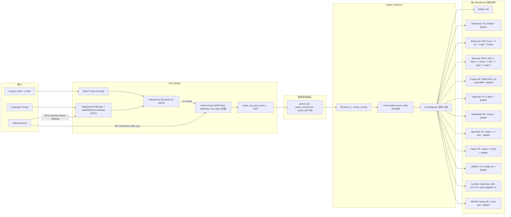
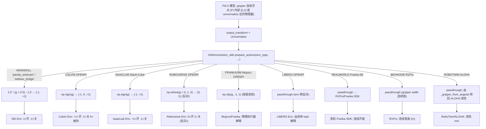
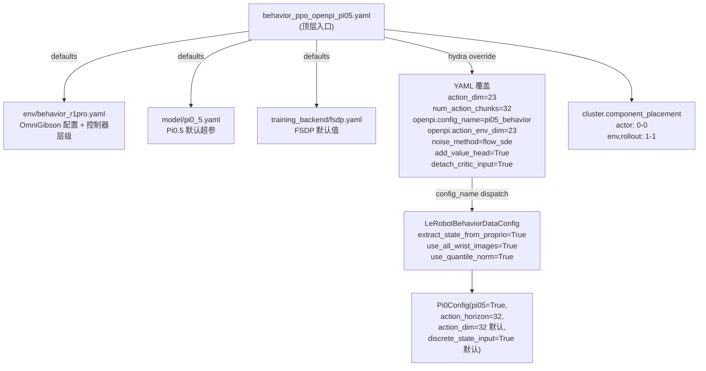
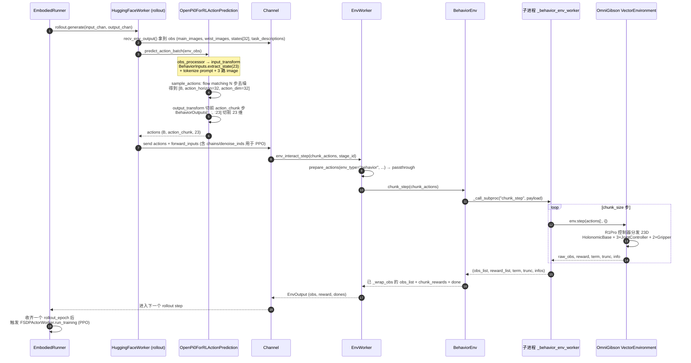
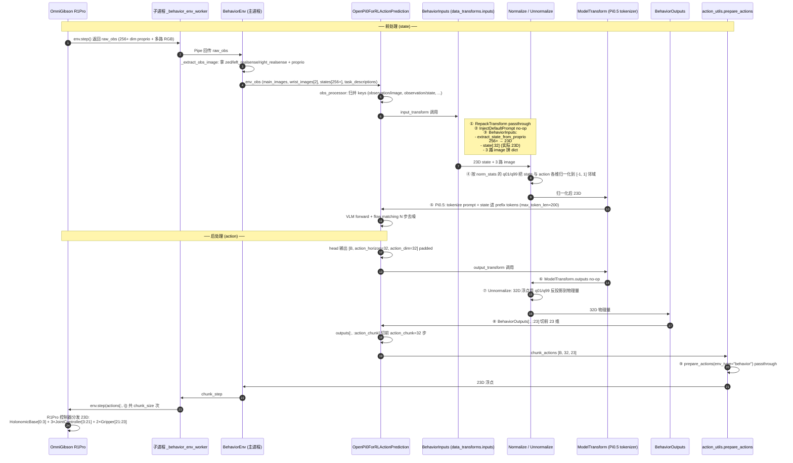

# Pi0.5 动作空间深度分析（RLinf 视角）

> 本文以 RLinf 仓内 [`rlinf/models/embodiment/openpi/`](../../../rlinf/models/embodiment/openpi/) 的实现为第一手依据，结合 Physical Intelligence 官方 [Pi0.5 博客](https://www.physicalintelligence.company/blog/pi05) 与上游 [openpi](https://github.com/Physical-Intelligence/openpi) 仓库源码，系统回答下面这一组高频疑问：
>
> 1. Pi0.5 官方版本输出的到底是 **N 个关节位置 (joint position)**，还是 **末端 EE 位姿 (end-effector pose)**？
> 2. 模型输出向量的每一维各代表什么？取值范围与物理含义？
> 3. **末端夹爪 (gripper)** 是用 **0/1 标志位** 还是用 **连续值** 表示？不同取值的含义？
> 4. 上述结论在 RLinf 各 embodiment（LIBERO / ManiSkill / Calvin / MetaWorld / IsaacLab / Roboverse / Franka / RoboTwin / Behavior R1Pro / Robocasa / GSEnv / 真机）下分别如何落地？

侧重"真机 + sim 通用语义"，与 [`rwRL/`](.) 目录其它真机 RL 文档（`r1pro*.md`、`safety_*.md`、`test_galaxea_r1_pro_controller.md`、[`glx/R1ProSDKAnalysis.md`](glx/R1ProSDKAnalysis.md)）形成系列。

---

## 目录

1. [TL;DR — 三句话答案](#1-tldr--三句话答案)
2. [Pi0.5 模型层动作头：32D × 50 padded chunk](#2-pi05-模型层动作头32d--50-padded-chunk)
3. [核心数据流（mermaid 图 1）](#3-核心数据流mermaid-图-1)
4. [每个 embodiment 的逐维含义](#4-每个-embodiment-的逐维含义)
5. [夹爪问题专题](#5-夹爪问题专题)
6. [夹爪连续输出 → 各 wrapper 离散化分支（mermaid 图 2）](#6-夹爪连续输出--各-wrapper-离散化分支mermaid-图-2)
7. [RLinf RL 训练时对动作维度的特殊处理](#7-rlinf-rl-训练时对动作维度的特殊处理)
8. [给真机用户（R1Pro / Galaxea 系列）的实践建议](#8-给真机用户r1pro--galaxea-系列的实践建议)
9. [附录 A：所有 embodiment 维度速查表](#附录-a所有-embodiment-维度速查表)
10. [附录 B：上游 vs RLinf 关键源码锚点](#附录-b上游-vs-rlinf-关键源码锚点)

---

## 1. TL;DR — 三句话答案

1. **Pi0.5 模型本身**输出的是一个 `[B, action_horizon=50, action_dim=32]` 的"通用 padded 动作向量 + 1 秒 chunk"——这 32 维是个**抽象槽位**，**含义随训练数据集 / embodiment 而完全不同**。Pi0.5 官博中"50-step joint actions"那句话只对 PI 自家移动操作平台（双臂 + 移动底盘，关节位置控制）成立；其它 fine-tune 版本（LIBERO、Calvin、ManiSkill）则是 **末端 EE 增量 (delta EE pose)**。
2. 各 embodiment 只取**前 N 维**（N≤32）作为真实动作；常见 layout：
   - **关节位置型**：DROID Franka 8D、ALOHA 14D、Behavior R1Pro 23D、IsaacLab Stack-Cube 7D（关节增量）。
   - **末端 EE 增量型**：LIBERO 7D、Calvin 7D、MetaWorld 4D、ManiSkill 7D、Roboverse 7D、GSEnv 7D。
   - **EE 绝对位姿型**：Franka EE 7D / 6D / 10D（10D 含 rotation_6d）。
   - **混合型**：Robocasa 12D（pos+ori+gripper+base 5D）。
3. **夹爪一律是连续浮点回归值**（flow-matching head 没有任何分类输出），物理含义是"目标开度比例"。是否变成 `{-1,+1}` / `{0,1}` 标志位完全由 **env wrapper** 决定：ManiSkill 阈值化、Calvin / IsaacLab `np.sign()`、Roboverse `np.where()`、Mujoco/Franka `clip(-1,1)` 保留连续、Behavior 直接用宽度连续值。

> **结论**：问"Pi0.5 输出关节还是 EE"是个伪命题，正确的问法是"我用哪个 dataconfig 微调它，它就输出什么"。

---

## 2. Pi0.5 模型层动作头：32D × 50 padded chunk

### 2.1 上游 `Pi0Config`（决定模型 head 形状）

来自上游 [openpi/src/openpi/models/pi0_config.py](https://github.com/Physical-Intelligence/openpi/blob/main/src/openpi/models/pi0_config.py)：

```python
@dataclasses.dataclass(frozen=True)
class Pi0Config(_model.BaseModelConfig):
    dtype: str = "bfloat16"
    paligemma_variant: _gemma.Variant = "gemma_2b"
    action_expert_variant: _gemma.Variant = "gemma_300m"

    # Set the model specific defaults.
    action_dim: int = 32        # padded action vector
    action_horizon: int = 50    # 1 秒 @50Hz 的 chunk
    max_token_len: int = None
    # Pi05 has two differences from Pi0:
    # - state input is part of the discrete language tokens rather than a continuous suffix
    # - the action expert uses adaRMSNorm to inject the flow matching timestep
    pi05: bool = False
    discrete_state_input: bool = None
```

关键事实：

- **`action_dim=32`**：模型 head 输出维度恒为 32，多余维度对每个具体 embodiment 是"零填充"，由 [`transforms.pad_to_dim`](https://github.com/Physical-Intelligence/openpi/blob/main/src/openpi/transforms.py) 在数据侧补齐、再由 `XxxOutputs(...)` 在推理侧切回。
- **`action_horizon=50`**：模型一次推理给出 50 步预测（对应 1 秒 @50Hz；Pi0.5 官博：*"a 50-step (1-second) action chunk of continuous low-level joint actions"*）。
- **`pi05=True`** 时：
  - **`discrete_state_input=True`**：state 不再走连续 `state_proj`，而是与 prompt 一起被 tokenizer 离散化进 prefix（`max_token_len` 默认 200，Pi0 是 48）。
  - **`adaRMSNorm`**：action expert 用 adaRMSNorm 注入 flow matching 时间戳 `t`，而 Pi0 是把 `t` 拼进 suffix。

### 2.2 RLinf 的 `OpenPi0Config`（继承并加 RL 字段）

来自 [`rlinf/models/embodiment/openpi/openpi_action_model.py`](../../../rlinf/models/embodiment/openpi/openpi_action_model.py:36-83)：

```python
@dataclass(frozen=True)
class OpenPi0Config(Pi0Config):
    config_name: str = "pi0_libero"   # 选哪个 dataconfig
    num_images_in_input: int = 2
    noise_method: str = "flow_sde"    # flow_ode / flow_sde / flow_noise / flow_cps
    # ...
    action_chunk: int = 5             # 实际下发到 env 的子段长度
    action_env_dim: int = 7           # 真实 env 期望的动作维度 (≤action_dim)
    num_steps: int = 10               # 去噪步数
    train_expert_only: bool = False
    # ... critic / DSRL / NFT 等 RL 字段
```

字段对应关系：

- **`action_dim=32`**（继承）：模型 head 输出维度，**永远不变**。
- **`action_horizon`**：模型 head 的 chunk 长度（默认 50；RLinf 多数配置改成 5/8/10/32 以减少 RL 推理成本，例如 `pi05_libero` 用 10、`pi05_franka` 用 8、`pi05_behavior` 用 32，见 [`dataconfig/__init__.py`](../../../rlinf/models/embodiment/openpi/dataconfig/__init__.py:84-105)、[`__init__.py:147-172`](../../../rlinf/models/embodiment/openpi/dataconfig/__init__.py:147-172)、[`__init__.py:325-342`](../../../rlinf/models/embodiment/openpi/dataconfig/__init__.py:325-342)）。
- **`action_env_dim`**：RL 训练里 logprob/entropy 只在前 N 维计算（与具体 env 真实维度对齐），见 [`openpi_action_model.py:408-413`](../../../rlinf/models/embodiment/openpi/openpi_action_model.py:408-413) 与 [`openpi_action_model.py:726-728`](../../../rlinf/models/embodiment/openpi/openpi_action_model.py:726-728)。
- **`action_chunk`**：output_transform 中切前 N 步，见 [`openpi_action_model.py:307`](../../../rlinf/models/embodiment/openpi/openpi_action_model.py:307)：`outputs["actions"] = outputs["actions"][:, : self.config.action_chunk]`。
- **`num_steps`**：flow matching 去噪步数（Pi0.5 推理时间正比于此）。
- **`noise_method`**：`flow_ode`（确定性）、`flow_sde`（随机）、`flow_noise`（学到的噪声头）、`flow_cps`。RLinf RL 训练时常用 `flow_sde` 或 `flow_noise`。
- **`discrete_state_input`**：Pi0.5 默认 `True`，但 **RLinf 多数 RL 配置里被显式关掉**（如 `pi05_maniskill` / `pi05_libero` / `pi05_franka` / `pi05_calvin` / `pi05_metaworld` / `pi05_isaaclab_stack_cube` / `pi05_gsenv` 都是 `discrete_state_input=False`），让 state 走连续 `state_proj` 通道——这是 RLinf 为 RL 微调稳定性做的常见 tweak。详见 [`dataconfig/__init__.py:84`](../../../rlinf/models/embodiment/openpi/dataconfig/__init__.py:84)、[`:126`](../../../rlinf/models/embodiment/openpi/dataconfig/__init__.py:126)、[`:150`](../../../rlinf/models/embodiment/openpi/dataconfig/__init__.py:150)、[`:216`](../../../rlinf/models/embodiment/openpi/dataconfig/__init__.py:216)、[`:249`](../../../rlinf/models/embodiment/openpi/dataconfig/__init__.py:249)、[`:346`](../../../rlinf/models/embodiment/openpi/dataconfig/__init__.py:346)、[`:388`](../../../rlinf/models/embodiment/openpi/dataconfig/__init__.py:388)。

### 2.3 端到端形状变换

```
[B, H_chunk(=50), D_action(=32)]    ← model head 原始输出 (action_horizon × action_dim)
        │
        ├── output_transform:
        │     [:, :action_chunk]           ← 切前 action_chunk 步 (默认 5)，见 line 307
        │     unnormalize(norm_stats)      ← 反归一化
        │     XxxOutputs(...)              ← 切前 N 维 (例: [:, :, :7] for LIBERO)
        ▼
[B, action_chunk(=5), N_env(=7)]   ← 真实下发到 env 的 action chunk
        │
        ├── action_utils.prepare_actions(env_type, ...)   ← env 专属后处理 (夹爪离散化等)
        ▼
[B*action_chunk, N_env(=7)]        ← env.step() 的 action 输入
```

---

## 3. 核心数据流（mermaid 图 1）



> 这张图揭示了 Pi0.5 "通用模型 + 多 embodiment 投影"的本质：**同一个 32D × 50 padded 头**会被各 embodiment 的 `XxxOutputs(...)` 投影到对应的真实动作维度，含义全靠 dataconfig 的命名约定决定。

---

## 4. 每个 embodiment 的逐维含义

> 按"真机常用度 + 文档完整性"排序。每条都给出：维度 layout、单位/范围、动作类型（关节/EE）、夹爪约定、源码锚点。

### 4.1 DROID Franka 8D — **关节位置 (joint position)**

- **Layout**：`[joint_0, joint_1, ..., joint_6, gripper]`，前 7 维是 Franka Panda 7 个关节绝对位置（rad），第 8 维是夹爪。
- **来源**：上游 [`droid_policy.py`](https://github.com/Physical-Intelligence/openpi/blob/main/src/openpi/policies/droid_policy.py)：

  ```python
  state = np.concatenate([data["observation/joint_position"], gripper_pos])
  # ...
  return {"actions": np.asarray(data["actions"][:, :8])}
  ```

- **官方 checkpoint**：`gs://openpi-assets/checkpoints/pi05_droid` 就是 8D 关节型，README 列在 [openpi 仓 README.md "Fine-Tuned Models"](https://github.com/Physical-Intelligence/openpi#fine-tuned-models) 表中。
- **夹爪**：连续值 `[0, 1]`（`0` 闭合，`1` 张开）。

### 4.2 ALOHA / RoboTwin 14D — **关节位置 (双臂)**

- **Layout**：`[左臂 6 joint, 左夹爪 1, 右臂 6 joint, 右夹爪 1]`，与 ALOHA state 一一对应。
- **单位**：joints 为 rad；夹爪在 pi 内部为 angular 空间归一化到 `[0, 1]`。
- **关键约定**：
  - `_joint_flip_mask = [1,-1,-1,1,1,1,1, 1,-1,-1,1,1,1,1]` 用于在 ALOHA 与 PI 内部 joint 方向之间互转，见 RLinf [`aloha_policy.py:126-128`](../../../rlinf/models/embodiment/openpi/policies/aloha_policy.py:126-128)。
  - 夹爪在 ALOHA 是线性 mm，在 PI 是角度 rad，需要 `_gripper_to_angular` / `_gripper_from_angular` 互转，见 [`aloha_policy.py:139-179`](../../../rlinf/models/embodiment/openpi/policies/aloha_policy.py:139-179)。
- **训练时 delta 掩码**：`[True]*6 + [False] + [True]*6 + [False]`——**6 个关节用 delta，夹爪用绝对值**，见 [`robotwin_aloha_dataconfig.py:80-87`](../../../rlinf/models/embodiment/openpi/dataconfig/robotwin_aloha_dataconfig.py:80-87)。
- **state shape**：`[6, 1, 6, 1] = 14`，`_decode_aloha` 注释明确：*"state is [left_arm_joint_angles, left_arm_gripper, right_arm_joint_angles, right_arm_gripper]"*（[`aloha_policy.py:196-215`](../../../rlinf/models/embodiment/openpi/policies/aloha_policy.py:196-215)）。

### 4.3 LIBERO 7D — **末端 EE 增量 (delta EE pose)**

- **Layout**：`[Δx, Δy, Δz, Δroll, Δpitch, Δyaw, gripper]`。
- **关键事实**：**前 6 维不是 6 个关节角！是末端 6-DOF delta**。LIBERO 自己的 dataset 已经是 delta，`extra_delta_transform=False` 时直接训练，注释见 [`libero_dataconfig.py:78-90`](../../../rlinf/models/embodiment/openpi/dataconfig/libero_dataconfig.py:78-90)：*"LIBERO already represents actions as deltas"*。
- **切片**：[`libero_policy.LiberoOutputs.__call__`](../../../rlinf/models/embodiment/openpi/policies/libero_policy.py:113-118)：

  ```python
  def __call__(self, data: dict) -> dict:
      # For Libero, we only return the first 7 actions (since the rest is padding).
      return {"actions": np.asarray(data["actions"][:, :7])}
  ```

- **state**：8D（LIBERO 自己的 proprio）。
- **夹爪**：连续值；env 侧自行决定如何映射（OpenVLA 系会做 `2x-1` 再 `sign()`，OpenPI 默认直发）。

### 4.4 Calvin 7D — **末端 EE 增量 (split positon / rotation / gripper)**

- **Layout**：`[Δee_pos(3), Δee_rot(3), gripper(1)]`。
- **关键事实**：state 与 action 都被显式拆成 3 段（pos / rot / gripper），不是 7D 一整块。
- **action 拼接**：[`calvin_policy.CalvinInputs:71-76`](../../../rlinf/models/embodiment/openpi/policies/calvin_policy.py:71-76)：

  ```python
  if "actions/delta_ee_pos" in data:
      delta_ee_pos = data["actions/delta_ee_pos"]
      delta_ee_rot = data["actions/delta_ee_rot"]
      gripper = data["actions/gripper"]
      actions = np.concatenate([delta_ee_pos, delta_ee_rot, gripper], axis=1)
      inputs["actions"] = actions
  ```

- **state 拼接**：RLinf [`openpi_action_model.obs_processor:483-488`](../../../rlinf/models/embodiment/openpi/openpi_action_model.py:483-488) 中显式做了 `state[:, :3] / [:,3:6] / [:,6:7]` 切分。
- **夹爪后处理**：[`action_utils.prepare_actions_for_calvin:107-111`](../../../rlinf/envs/action_utils.py:107-111)：`chunk_actions[..., -1] = np.sign(chunk_actions[..., -1])` → **{-1, 0, +1}**。

### 4.5 ManiSkill 7D — **末端 EE 增量 (world_vector + rotation_delta + gripper)**

- **Layout**：`[world_vector(3), rotation_delta(3), open_gripper(1)]`。
- **后处理**：[`action_utils.prepare_actions_for_maniskill:30-63`](../../../rlinf/envs/action_utils.py:30-63)：

  ```python
  reshaped_actions = raw_chunk_actions.reshape(-1, action_dim)
  raw_actions = {
      "world_vector": np.array(reshaped_actions[:, :3]),
      "rotation_delta": np.array(reshaped_actions[:, 3:6]),
      "open_gripper": np.array(reshaped_actions[:, 6:7]),  # range [0, 1]; 1 = open; 0 = close
  }
  actions["world_vector"] = raw_actions["world_vector"] * action_scale
  actions["rot_axangle"] = raw_actions["rotation_delta"] * action_scale
  if policy == "widowx_bridge":
      actions["gripper"] = 2.0 * (raw_actions["open_gripper"] > 0.5) - 1.0
  elif policy == "panda_wristcam":
      actions["gripper"] = 2.0 * (raw_actions["open_gripper"] > 0.5) - 1.0
  ```

  - 模型原生输出 `open_gripper ∈ [0, 1]`（`1`=张开，`0`=闭合）；
  - 阈值 0.5 二值化 → `gripper ∈ {-1, +1}`（`+1`=张开命令，`-1`=闭合命令）。
- **后处理特例**：当 `policy == "panda"` 时直接 return 不做拆分（model 输出已对齐 panda）。

### 4.6 MetaWorld 4D — **末端 EE 增量 (xyz + gripper)**

- **Layout**：`[Δx, Δy, Δz, gripper]`。
- **切片**：[`metaworld_policy.MetaworldOutputs:74-75`](../../../rlinf/models/embodiment/openpi/policies/metaworld_policy.py:74-75)：`return {"actions": np.asarray(data["actions"][:, :4])}`。
- **action_utils 兼容层**：[`prepare_actions_for_metaworld:114-129`](../../../rlinf/envs/action_utils.py:114-129) 在 OpenVLA 系 model 输出 7D 时自动取 `[:3]+[:,-1:]` 凑成 4D。

### 4.7 IsaacLab Stack-Cube 7D — **关节增量 + 二值夹爪**

- **Layout**：`[6 个 joint delta, gripper]`。
- **后处理**：[`isaaclab_policy.IsaacLabOutputs:80-84`](../../../rlinf/models/embodiment/openpi/policies/isaaclab_policy.py:80-84)：

  ```python
  actions = np.asarray(data["actions"][:, :7])
  # IsaacLab stack-cube expects binary gripper command in {-1, +1}.
  actions[..., -1] = np.sign(actions[..., -1])
  return {"actions": actions}
  ```

  - 这是少数几个**模型层面没有阈值化**、但 env wrapper 强制 `np.sign()` 的例子。

### 4.8 Roboverse 7D — **末端 EE 增量 + 0/1 夹爪**

- **Layout**：与 LIBERO 类似 `[6 delta + gripper]`。
- **后处理**：[`prepare_actions_for_roboverse:186-193`](../../../rlinf/envs/action_utils.py:186-193)：`chunk_actions[..., -1] = np.where(chunk_actions[..., -1] < 0.0, 1.0, 0.0)`。
  - 注意正负与 ManiSkill **相反**：负值 → 1（开/扣），非负 → 0。

### 4.9 Franka EE — **末端绝对位姿 / delta，可配 6 / 7 / 10D**

- **三种变体**（按 `output_action_dim` 决定）：
  - **7D 默认**：`[x, y, z, roll, pitch, yaw, gripper]`，绝对 EE 位姿 + 夹爪。
  - **6D**（`output_action_dim=6`）：去掉夹爪。
  - **10D**：`[x, y, z, rotation_6d(6), gripper]`，旋转用 [continuity-aware 6D](https://arxiv.org/abs/1812.07035) 表示，更利于网络回归。
- **来源**：
  - [`franka_policy.FrankaEEOutputs:53-58`](../../../rlinf/models/embodiment/openpi/policies/franka_policy.py:53-58) 注释 *"# use abs actions [x,y,z,rx,ry,rz,gripper] for Franka"*。
  - [`franka_dataconfig.py:84-86`](../../../rlinf/models/embodiment/openpi/dataconfig/franka_dataconfig.py:84-86) 注释 *"`[True]x9 + [False]x1, [x,y,z,rotation_6d,gripper]` for 10 dim"*。
- **delta 训练**：[`franka_co_training_dataconfig.py:38-41`](../../../rlinf/models/embodiment/openpi/dataconfig/franka_co_training_dataconfig.py:38-41)：

  ```python
  extra_delta_transform: bool = False  # False: abs_action - state → delta
  # If action dim is not 7 (e.g. without gripper control), should change this
  output_action_dim: int = 7
  ```

  当 `extra_delta_transform=True` 时，`make_bool_mask(9, -1)` 把前 9 维做 delta（pos+rot），夹爪保持 absolute——**这是 Pi 模型的"老传统"：位姿 delta，夹爪 absolute**。
- **官方 SFT 配置**：`pi05_franka` 用 `action_horizon=8`、`output_action_dim=6`（即不输出夹爪，单独控）。见 [`dataconfig/__init__.py:147-172`](../../../rlinf/models/embodiment/openpi/dataconfig/__init__.py:147-172)。

### 4.10 Behavior R1Pro 23D — **移动操作 (mobile manipulation)**

- **Layout**：`[base_qvel(3), trunk_qpos(4), arm_left_qpos(7), arm_right_qpos(7), left_gripper_width(1), right_gripper_width(1)]`。
- **来源**：[`behavior_policy.extract_state_from_proprio:45-68`](../../../rlinf/models/embodiment/openpi/policies/behavior_policy.py:45-68)：

  ```python
  base_qvel = proprio_data[..., R1PRO_PROPRIO_INDICES["base_qvel"]]   # 3
  trunk_qpos = proprio_data[..., R1PRO_PROPRIO_INDICES["trunk_qpos"]]   # 4
  arm_left_qpos = proprio_data[..., R1PRO_PROPRIO_INDICES["arm_left_qpos"]]   # 7
  arm_right_qpos = proprio_data[..., R1PRO_PROPRIO_INDICES["arm_right_qpos"]]   # 7
  left_gripper_width = proprio_data[..., R1PRO_PROPRIO_INDICES["gripper_left_qpos"]].sum(axis=-1, keepdims=True)
  right_gripper_width = proprio_data[..., R1PRO_PROPRIO_INDICES["gripper_right_qpos"]].sum(axis=-1, keepdims=True)
  ```

  注意夹爪由 R1Pro proprio 中的 **2 个手指 qpos 求和**得到 width（1D），与 ALOHA 的 angular 表示完全不同。
- **夹爪**：连续宽度 (m)，与上游 R1Pro SDK 的物理约定一致。
- **特点**：这是 RLinf 中维度最高的 embodiment，最贴近 Pi0.5 官博描述的"50-step joint actions"原生形态。

### 4.11 Robocasa 12D — **混合：手 + 移动底盘**

- **Layout**：`[手位置(3), 手姿态(3), 夹爪(1), 底盘(5)]`。
- **后处理**：[`prepare_actions_for_robocasa:132-171`](../../../rlinf/envs/action_utils.py:132-171)；模型先输出 32D，按 `action_space` 选择前 N 维（≤12），再 scatter 到 12D 完整 layout。

### 4.12 GSEnv 7D — **末端 EE 增量**

- **Layout**：`[6 delta + gripper]`，[`gsenv_policy.GSEnvOutputs:74`](../../../rlinf/models/embodiment/openpi/policies/gsenv_policy.py:74)：`return {"actions": np.asarray(data["actions"][:, :7])}`。

---

## 5. 夹爪问题专题

### 5.1 模型层：永远是连续浮点

Pi0.5 的 action expert + flow matching head（[`openpi_action_model.get_velocity:884-890`](../../../rlinf/models/embodiment/openpi/openpi_action_model.py:884-890)）输出的是连续向量回归值，**没有任何分类/离散输出**。所以从模型角度看，夹爪维度永远是 `R` 上的连续标量。

### 5.2 PI 内部"原生"夹爪空间（来自 ALOHA pretrain）

PI 的 base model 在 ALOHA 双臂数据上预训练时，用了一套 "angular 空间归一化到 `[0,1]`" 的内部约定。来自 [`aloha_policy.py:139-161`](../../../rlinf/models/embodiment/openpi/policies/aloha_policy.py:139-161)：

```python
def _gripper_to_angular(value):
    # Aloha transforms the gripper positions into a linear space. The following code
    # reverses this transformation to be consistent with pi0 which is pretrained in
    # angular space.
    value = _unnormalize(value, min_val=0.01844, max_val=0.05800)
    # ...
    value = linear_to_radian(value, arm_length=0.036, horn_radius=0.022)
    # The Pi0 model expects gripper values normalized to [0, 1].
    # The physical radian values corresponding to this range are [0.5476, 1.6296].
    return _normalize(value, min_val=0.5476, max_val=1.6296)
```

→ **PI 内部约定：`gripper ∈ [0, 1]`，`0` = 完全闭合，`1` = 完全张开**。

经过 fine-tune 到不同数据集后，每个 embodiment 自己重新统计 `norm_stats.json` 的 `q01/q99`，所以**每个 fine-tune checkpoint 的"原生输出范围"会有差异**，但物理含义不变（越大越张开）。

### 5.3 各环境 wrapper 的离散化分支（详见图 2）

- **直发连续**：DROID、LIBERO、Calvin (在外层加 sign)、Franka real、Mujoco、Behavior（连续宽度）。
- **阈值二值化**：ManiSkill `2*(g>0.5)-1` → {-1, +1}。
- **`np.sign()`**：Calvin、IsaacLab → {-1, 0, +1}（注意 0 通常代表"维持现状"）。
- **`np.where(g<0, 1, 0)`**：Roboverse → {0, 1}，正负含义与 ManiSkill **相反**。
- **`clip(-1, 1)`**：Mujoco、Franka real → 保持连续，物理执行器自己做位置/PWM 控制。

### 5.4 不同取值的物理含义对照

| 数值 (按 wrapper 输出) | ManiSkill | Calvin / IsaacLab | Roboverse | Mujoco / Franka real | Behavior R1Pro |
|---|---|---|---|---|---|
| 强烈正值 | `+1` 张开 | `+1` 张开 | `0` 张开 (注意正负翻) | 接近 `+1` 张开/释放 | gripper width 大 = 张开 |
| 接近 0 | (经阈值后非 +1 即 -1，无中间态) | `0` 维持 | `0` 张开 | 中等开度 | width 中等 |
| 强烈负值 | `-1` 闭合 | `-1` 闭合 | `1` 闭合 | 接近 `-1` 闭合/抓取 | width 小 = 闭合 |

> ⚠️ 移植不同 env 之间的策略时，必须重新校准夹爪通道，否则会出现"训练时 +1 是张开、迁到新 env 后 +1 变成闭合"这种灾难性行为。

---

## 6. 夹爪连续输出 → 各 wrapper 离散化分支（mermaid 图 2）



> 这张图的核心结论：**RLinf 没有为夹爪定义"统一接口"，每个 env 在 `action_utils.prepare_actions(...)` 里自己实现一段后处理**。维护策略 / 跨环境迁移时这是最容易踩坑的地方。

---

## 7. RLinf RL 训练时对动作维度的特殊处理

### 7.1 logprob / entropy 截断到 `action_env_dim`

为什么不在全部 32 维上算 logprob？因为前 N 维之外的"零填充"维度对每个具体 env 没有梯度信号；如果让它们参与 PPO/GRPO 的优势计算，会污染梯度。所以 RLinf 在两处显式裁掉：

- **`default_forward`**（[`openpi_action_model.py:408-413`](../../../rlinf/models/embodiment/openpi/openpi_action_model.py:408-413)）：

  ```python
  log_probs = log_probs[
      :, :, : self.config.action_chunk, : self.config.action_env_dim
  ]
  entropy = entropy[
      :, :, : self.config.action_chunk, : self.config.action_env_dim
  ]
  ```

- **`sample_actions` rollout**（[`openpi_action_model.py:726-728`](../../../rlinf/models/embodiment/openpi/openpi_action_model.py:726-728)）：

  ```python
  log_probs = torch.stack(log_probs, dim=1)[
      :, :, : self.config.action_chunk, : self.config.action_env_dim
  ]
  ```

### 7.2 `action_chunk` 切前 N 步下发 env

模型 native chunk 长度是 `action_horizon`，但实际下发 env 的是 `action_chunk`（[`openpi_action_model.py:307`](../../../rlinf/models/embodiment/openpi/openpi_action_model.py:307)）：

```python
outputs["actions"] = outputs["actions"][:, : self.config.action_chunk]
```

**典型设置**：`action_horizon=8` (推理), `action_chunk=5` (执行)，预测 8 步但只执行 5 步，给 receding-horizon 控制留了 3 步 margin。

### 7.3 DSRL / NFT / DAgger 模式下"动作"语义变化

[`predict_action_batch:518-610`](../../../rlinf/models/embodiment/openpi/openpi_action_model.py:518-610) 中显式区分了三种语义：

```python
forward_inputs = {
    "chains": outputs["chains"],
    "denoise_inds": outputs["denoise_inds"],
    "tokenized_prompt": processed_obs["tokenized_prompt"],
    "tokenized_prompt_mask": processed_obs["tokenized_prompt_mask"],
    # "action" is the env-executed action, and "model_action" is the original output by the model.
    # For small models, they are consistent. For large models (like pi), "action" is the result after output_transform.
    # For realworld human-in-the-loop training, only "action" can be provided by human.
    "action": actions.reshape(actions.shape[0], -1).contiguous(),
    "model_action": outputs["actions"].reshape(outputs["actions"].shape[0], -1).contiguous(),
}
```

- **`action`**：经过 `output_transform`（含 unnormalize、`XxxOutputs` 切片、env-specific 离散化）的真实 env 动作。
- **`model_action`**：模型直接输出的 32D 归一化动作（用于回放训练 / DAgger）。
- **DSRL** 模式（`use_dsrl=True`，[line 534-562](../../../rlinf/models/embodiment/openpi/openpi_action_model.py:534-562)）：SAC 输出"噪声向量"作为 flow matching 起点，"动作"在 RL 算法看来其实是噪声；real_actions 才是 env 收到的东西。这是 [DSRL 论文](https://arxiv.org/abs/2410.18935) 的实现方式。
- **NFT** 模式（`is_nft=True`）：保留 flow trace 用于 NFT loss 的 timestep-explicit 训练。

---

## 8. 给真机用户（R1Pro / Galaxea 系列）的实践建议

### 8.1 选 dataconfig = 选动作语义

- 想要 **关节位置 + 双臂 + 移动底盘** → 用 `pi05_behavior` 模板（23D，最贴近 R1Pro proprio 物理量）。
- 想要 **末端 EE + 单臂 Franka** → 用 `pi05_franka` 模板（7D 默认 / 10D rotation_6d 高精度）。
- 想要 **关节位置 + 双臂 ALOHA-style** → 用 `pi05_aloha_robotwin`（14D，但要注意 joint flip 与 angular gripper）。

### 8.2 R1Pro 真机接入要点

- **R1Pro SDK 的 `mobiman` 接口默认是关节命令**（参见 [`R1ProSDKAnalysis.md`](glx/R1ProSDKAnalysis.md) 与 [`/home/nvidia/galaxea/install/mobiman/lib/mobiman/relaxed_ik.py`](../../../../../galaxea/install/mobiman/lib/mobiman/relaxed_ik.py) 中的 IK），**所以走 23D Behavior layout 是最自然、IK 损失最小的方案**。
- 如果 RLinf 策略输出 7D Franka EE，则需要在 `R1ProEnv.step()` 里挂一段 IK 求解（建议复用 R1Pro SDK 内置的 `relaxed_ik`），把 EE 命令转成关节命令；这对实时性有要求，可参考 [`bt/docs/rwRL/test_galaxea_r1_pro_controller.md`](test_galaxea_r1_pro_controller.md) 的现有测试方案。
- **夹爪宽度**：R1Pro 的 G1 夹爪是连续可控的开度（约 0~80mm），与 Behavior 23D layout 中"两手指 qpos 求和得 width"完全一致。**不要把夹爪当作 0/1 开关**——这会丢失精细抓取能力（薄物、易碎物体）。

### 8.3 与 IsaacSim Sim-Real Co-train 时的对齐

- 仿真侧（IsaacLab / IsaacSim）建议输出与 Behavior 一样的 23D 关节型 layout，避免在 sim 用 EE、real 用 joint 这种"半套二义性"。
- 夹爪通道在 sim 一律使用宽度（m）+ 真值，禁止在 sim 中提前做 sign/threshold——会让模型在 sim 学到"二值激进"策略，迁移到 real 上立即抓飞。

### 8.4 安全闸门兼容

参考 [`safety_2.md`](safety_2.md) / [`safety_2_joinlimit.md`](safety_2_joinlimit.md) 的 5 级安全闸门：

- **维度 0~6 (左臂关节)**：用关节 limit clip。
- **维度 7~13 (右臂关节)**：同上。
- **维度 14 (左夹爪宽度)**、**维度 15 (右夹爪宽度)**：物理 limit `[0, 0.08m]`，禁止负值。
- **维度 16~22 (trunk + base velocity)**：底盘走速度 limit，trunk 走 joint limit。

---

## 附录 A：所有 embodiment 维度速查表

| Embodiment | dim N | 动作类型 | 第 0~(N-2) 维 | 第 (N-1) 维 (gripper) | 后处理 (env wrapper) |
|---|---|---|---|---|---|
| **DROID Franka** | 8 | 关节位置 | 7 个 joint position (rad) | 连续 [0,1] | passthrough |
| **ALOHA / RoboTwin** | 14 | 关节位置 | 6 left joint + 6 right joint (rad) | 第 6 / 第 13 维各 1 个夹爪 (angular [0,1]) | `_gripper_from_angular` 反投影 |
| **LIBERO** | 7 | EE delta | Δx Δy Δz Δr Δp Δy | 连续 (env 侧自决) | passthrough |
| **Calvin** | 7 | EE delta | Δee_pos(3) + Δee_rot(3) | 连续 → `np.sign()` | {-1, 0, +1} |
| **ManiSkill (widowx/panda)** | 7 | EE delta | world_vector(3) + rotation_delta(3) | 连续 [0,1] → 阈值 0.5 → {-1,+1} | 拆 dict |
| **MetaWorld** | 4 | EE delta | Δx Δy Δz | 连续 | passthrough |
| **IsaacLab Stack-Cube** | 7 | 关节增量 | 6 joint delta | 连续 → `np.sign()` | {-1, +1} |
| **Roboverse** | 7 | EE delta | 6 delta | 连续 → `np.where(g<0, 1, 0)` | {0, 1} **反向** |
| **Franka EE 7D** | 7 | EE 绝对 | x y z roll pitch yaw | 连续 (开度) | passthrough |
| **Franka EE 6D** | 6 | EE 绝对 | x y z roll pitch yaw | 无 | passthrough |
| **Franka EE 10D** | 10 | EE 绝对 | x y z + rotation_6d(6) | 连续 | passthrough |
| **Behavior R1Pro** | 23 | 移动+关节 | base_qvel(3)+trunk(4)+L_arm(7)+R_arm(7) | 第 21/22 维: L/R gripper width (m) | passthrough |
| **Robocasa** | 12 | 混合 | pos(3) + ori(3) + base(5) | 第 6 维: gripper | scatter to 12D |
| **GSEnv** | 7 | EE delta | 6 delta | 连续 | passthrough |

---

## 附录 B：上游 vs RLinf 关键源码锚点

### 上游 openpi（reference only）

- `Pi0Config`（动作头形状定义）：[`openpi/src/openpi/models/pi0_config.py`](https://github.com/Physical-Intelligence/openpi/blob/main/src/openpi/models/pi0_config.py)
- ALOHA policy（angular gripper、joint flip）：[`openpi/src/openpi/policies/aloha_policy.py`](https://github.com/Physical-Intelligence/openpi/blob/main/src/openpi/policies/aloha_policy.py)
- DROID policy（关节型 8D）：[`openpi/src/openpi/policies/droid_policy.py`](https://github.com/Physical-Intelligence/openpi/blob/main/src/openpi/policies/droid_policy.py)
- 官方 README / fine-tuned models 表：[`openpi/README.md`](https://github.com/Physical-Intelligence/openpi/blob/main/README.md)
- Pi0.5 官方博客：[physicalintelligence.company/blog/pi05](https://www.physicalintelligence.company/blog/pi05)

### RLinf 内部实现

- 模型：
  - [`rlinf/models/embodiment/openpi/openpi_action_model.py`](../../../rlinf/models/embodiment/openpi/openpi_action_model.py)
  - [`rlinf/models/embodiment/openpi/__init__.py`](../../../rlinf/models/embodiment/openpi/__init__.py)
- DataConfig 注册中心：
  - [`rlinf/models/embodiment/openpi/dataconfig/__init__.py`](../../../rlinf/models/embodiment/openpi/dataconfig/__init__.py)
- Policy 适配器（每个 embodiment 一份）：
  - [`policies/libero_policy.py`](../../../rlinf/models/embodiment/openpi/policies/libero_policy.py)
  - [`policies/aloha_policy.py`](../../../rlinf/models/embodiment/openpi/policies/aloha_policy.py)
  - [`policies/franka_policy.py`](../../../rlinf/models/embodiment/openpi/policies/franka_policy.py)
  - [`policies/franka_dagger_policy.py`](../../../rlinf/models/embodiment/openpi/policies/franka_dagger_policy.py)
  - [`policies/calvin_policy.py`](../../../rlinf/models/embodiment/openpi/policies/calvin_policy.py)
  - [`policies/maniskill_policy.py`](../../../rlinf/models/embodiment/openpi/policies/maniskill_policy.py)
  - [`policies/metaworld_policy.py`](../../../rlinf/models/embodiment/openpi/policies/metaworld_policy.py)
  - [`policies/isaaclab_policy.py`](../../../rlinf/models/embodiment/openpi/policies/isaaclab_policy.py)
  - [`policies/behavior_policy.py`](../../../rlinf/models/embodiment/openpi/policies/behavior_policy.py)
  - [`policies/robocasa_policy.py`](../../../rlinf/models/embodiment/openpi/policies/robocasa_policy.py)
  - [`policies/gsenv_policy.py`](../../../rlinf/models/embodiment/openpi/policies/gsenv_policy.py)
- Env 接入层（夹爪离散化、动作 reshape）：
  - [`rlinf/envs/action_utils.py`](../../../rlinf/envs/action_utils.py)
- 典型 RL 配置文件：
  - LIBERO: [`examples/embodiment/config/libero_spatial_ppo_openpi_pi05.yaml`](../../../examples/embodiment/config/libero_spatial_ppo_openpi_pi05.yaml)
  - ManiSkill: [`examples/embodiment/config/maniskill_ppo_openpi_pi05.yaml`](../../../examples/embodiment/config/maniskill_ppo_openpi_pi05.yaml)
  - 真机 Franka: [`examples/embodiment/config/realworld_peginsertion_async_ppo_pi05.yaml`](../../../examples/embodiment/config/realworld_peginsertion_async_ppo_pi05.yaml)
  - IsaacLab: [`examples/embodiment/config/isaaclab_franka_stack_cube_ppo_openpi_pi05.yaml`](../../../examples/embodiment/config/isaaclab_franka_stack_cube_ppo_openpi_pi05.yaml)

---

## Behavior R1Pro 23D 在 RLinf 上的实现详解

> 这是对前面 [4.10 节](#410-behavior-r1pro-23d--移动操作-mobile-manipulation) 的深度展开。4.10 只列出了"23D layout 是什么"，本章回答 **"Pi0.5 是怎么真的在 R1Pro 上跑起来的"**：从 YAML 配置树 → Worker/Cluster → 模型 head → OmniGibson 控制器 → 真机部署桥接，给出完整的代码调用链与 4 张 mermaid 图。

### A. 三方主体厘清：RLinf vs BEHAVIOR-1K vs BRS

跑过一次 `behavior_ppo_openpi_pi05.yaml` 的人，常常会混淆下面三个独立的项目。先把它们拆清楚：

- **RLinf**（本仓）：分布式 RL 训练框架，自己实现了 Pi0.5（[`rlinf/models/embodiment/openpi/`](../../../rlinf/models/embodiment/openpi/)），并把 BEHAVIOR-1K 的 OmniGibson 仿真包装为一个 `gym.Env` ([`rlinf/envs/behavior/behavior_env.py`](../../../rlinf/envs/behavior/behavior_env.py))。
- **BEHAVIOR-1K** ([behavior.stanford.edu](https://behavior.stanford.edu/)、[StanfordVL/BEHAVIOR-1K](https://github.com/StanfordVL/BEHAVIOR-1K)、参考实现 [b1k-baselines](https://github.com/StanfordVL/b1k-baselines)）：1000 个家务任务的仿真基准，底层引擎是 **OmniGibson**（基于 IsaacSim 4.5）。RLinf 仅复用其 OmniGibson 仿真层（`omnigibson==3.7.1` / `3.7.2`，硬约束于 [`patch/__init__.py:15`](../../../rlinf/envs/behavior/patch/__init__.py:15)）。
- **BRS（BEHAVIOR Robot Suite）**（CoRL 2025 论文 [arXiv:2503.05652](https://arxiv.org/abs/2503.05652)、官网 [behavior-robot-suite.github.io](https://behavior-robot-suite.github.io/)）：以 R1（双臂 + 4-DoF torso + 移动底盘）为硬件、提出 **JoyLo** 遥操和 **WB-VIMA** 模仿学习算法。代码分两块：
  - [brs-ctrl](https://github.com/behavior-robot-suite/brs-ctrl)：硬件控制 + ROS2 接口（本地客户化版：[`/home/nvidia/kaizhe_ws/data_collect/brs-ctrl/`](/home/nvidia/kaizhe_ws/data_collect/brs-ctrl/)）。
  - [brs-algo](https://github.com/behavior-robot-suite/brs-algo)：WB-VIMA 模型 + 训练（本地：[`/home/nvidia/lg_ws/Rob/brs-algo/`](/home/nvidia/lg_ws/Rob/brs-algo/)）。

**关键事实**：

1. **RLinf 当前只跑仿真**——`SupportedEnvType.BEHAVIOR` 在 [`rlinf/envs/__init__.py:85-88`](../../../rlinf/envs/__init__.py:85-88) 直接返回 `BehaviorEnv`，仓内 **没有任何 `import brs_ctrl`**（用 `rg "brs_ctrl|R1ProInterface"` 在 `rlinf/` 下零命中）。真机部署需要自写 adapter，不在框架默认范围内。
2. **WB-VIMA ≠ Pi0.5 的 23D layout**——brs-algo 的 WB-VIMA ([`wbvima_policy.py:98-99`](/home/nvidia/lg_ws/Rob/brs-algo/brs_algo/learning/policy/wbvima_policy.py:98-99)) 用的是 R1（**6-DoF 单臂**）`mobile_base(3) + torso(4) + arms(14)` = **21D**，而 RLinf Pi05_behavior 是 R1Pro（**7-DoF 单臂**）= **23D**。两者既不同硬件、也不同网络结构、也不同维度。
3. **RLinf 的 R1Pro 与 brs-ctrl 的 R1Pro 维度对齐**：仿真侧 7-DoF 单臂（[`behavior_r1pro.yaml:64`](../../../examples/embodiment/config/env/behavior_r1pro.yaml:64) 的 `reset_joint_pos` 28 个值 = `3(base虚拟) + 4(trunk) + 7(left) + 7(right) + 4(gripper finger × 2 × 2 finger) + 3(虚拟)` 印证），真机侧 7-DoF 单臂（[`interfaces.py:962-969`](/home/nvidia/kaizhe_ws/data_collect/brs-ctrl/brs_ctrl/robot_interface/interfaces.py:962-969) 的 `assert (7,)`）。**Sim2Real 维度天然对齐**，不像 BRS WB-VIMA 那样需要再做适配。

### B. 23D layout 的"两套互不相同"的字段顺序（极易混淆）

经常被忽视的细节：**模型 state 输入侧的 23D** 与 **OmniGibson env action 输出侧的 23D**，两者顺序"刻意对齐"，但实现路径完全不同。

#### B.1 Policy state 输入侧（模型"看"的 23D）

来源 [`behavior_policy.extract_state_from_proprio`](../../../rlinf/models/embodiment/openpi/policies/behavior_policy.py:45-68)：

```python
R1PRO_PROPRIO_INDICES = {
    "arm_left_qpos":     np.s_[158:165],   # 7
    "gripper_left_qpos": np.s_[193:195],   # 2 fingers
    "arm_right_qpos":    np.s_[197:204],   # 7
    "gripper_right_qpos":np.s_[232:234],   # 2 fingers
    "trunk_qpos":        np.s_[236:240],   # 4
    "base_qvel":         np.s_[253:256],   # 3
}

def extract_state_from_proprio(proprio_data):
    # 256+ 维 R1Pro proprio  →  按 layout 顺序 concat
    return np.concatenate([
        base_qvel,                                       # [0:3]
        trunk_qpos,                                      # [3:7]
        arm_left_qpos,                                   # [7:14]
        arm_right_qpos,                                  # [14:21]
        gripper_left_qpos.sum(axis=-1, keepdims=True),   # [21]  ← 2 finger qpos 求和成 width
        gripper_right_qpos.sum(axis=-1, keepdims=True),  # [22]
    ], axis=-1)
```

源码注释 *"NOTE: we rearrange the gripper from 21 to 14 to match the action space"* 是说：**故意把 gripper 从原始 OmniGibson proprio 里"21" 这个位置（紧邻 arm_left）搬到末尾，让 state 顺序和 env action 顺序完全一致**。这是 Pi0.5 学得快的工程秘密——state 第 i 维和 action 第 i 维语义对应。

#### B.2 Env action 输出侧（OmniGibson R1Pro 控制器"吃"的 23D）

来源 [`behavior_r1pro.yaml:65-106`](../../../examples/embodiment/config/env/behavior_r1pro.yaml:65-106) 的 `controller_config`，OmniGibson 在 `Robot.action_space` 中按 `controller_config` 字典声明顺序拼接：

| 维度 | 控制器 | YAML 路径 | 物理量 | 单位 |
|---|---|---|---|---|
| `[0:3]` | `HolonomicBaseJointController(velocity)` | `controller_config.base` | `[vx, vy, ω]` 底盘速度 | m/s, m/s, rad/s |
| `[3:7]` | `JointController(position, use_delta_commands=False)` | `controller_config.trunk` | 4-DoF trunk 绝对关节位置 | rad |
| `[7:14]` | `JointController(position, use_delta_commands=False)` | `controller_config.arm_left` | 7-DoF 左臂绝对关节位置 | rad |
| `[14:21]` | `JointController(position, use_delta_commands=False)` | `controller_config.arm_right` | 7-DoF 右臂绝对关节位置 | rad |
| `[21]` | `MultiFingerGripperController(smooth)` | `controller_config.gripper_left` | 左夹爪开度命令 | [0,1]，1=张开 |
| `[22]` | `MultiFingerGripperController(smooth)` | `controller_config.gripper_right` | 右夹爪开度命令 | [0,1]，1=张开 |

**关键点**：

- **前 3 维是底盘速度命令，不是关节位置**！这是 Pi05_behavior 与所有"纯 manipulation"配置（DROID 8D、ALOHA 14D、LIBERO 7D）的本质差异。
- `command_input_limits=[[-1,-1,-1],[1,1,1]]`、`command_output_limits=[[-0.75,-0.75,-1.0],[0.75,0.75,1.0]]`：模型输出归一化在 `[-1,1]`，OmniGibson 内部缩放到物理速度。
- `use_delta_commands: False`：trunk/arm 都是**绝对关节位置**，与 `LeRobotBehaviorDataConfig.extra_delta_transform=False` 默认值一致（[`behavior_dataconfig.py:33`](../../../rlinf/models/embodiment/openpi/dataconfig/behavior_dataconfig.py:33)）。

### C. 完整调用链（4 张 mermaid 图）

#### C.1 配置层级（图 3：YAML defaults 树）



> 关键覆盖在 [`behavior_ppo_openpi_pi05.yaml:114-127`](../../../examples/embodiment/config/behavior_ppo_openpi_pi05.yaml:114-127)，`pi05_behavior` 在 [`dataconfig/__init__.py:325-342`](../../../rlinf/models/embodiment/openpi/dataconfig/__init__.py:325-342) 注册，env 子配置全部展开在 [`env/behavior_r1pro.yaml`](../../../examples/embodiment/config/env/behavior_r1pro.yaml)。

#### C.2 类图（图 4：核心类与组合关系）

```mermaid
classDiagram
    class EmbodiedRunner {
        +train()
        +evaluate()
    }
    class EnvWorker {
        +env_interact_step(chunk_actions)
        +env_evaluate_step(raw_actions)
        -env_list: list[BehaviorEnv]
    }
    class BehaviorEnv {
        +reset()
        +step(actions)
        +chunk_step(chunk_actions)
        -_parent_conn: Pipe
        -_env_process: Process
    }
    class WorkerProc {
        +_behavior_env_worker(cfg, conn, num_envs)
    }
    class VectorEnvironment {
        +step(actions)
        +reset()
    }
    class RGBWrapper {
        +load_observation_space()
    }
    class HuggingFaceWorker {
        +generate_one_epoch()
        +predict(env_obs)
        -hf_model: OpenPi0ForRLActionPrediction
    }
    class FSDPActorWorker {
        +run_training()
        +compute_advantages()
        -model: OpenPi0ForRLActionPrediction
    }
    class OpenPi0ForRLActionPrediction {
        +predict_action_batch(env_obs)
        +sample_actions(observation)
        +get_log_prob_value(...)
        +obs_processor(env_obs)
        +output_transform(outputs)
        -value_head: ValueHead
    }
    class Pi0Config {
        +action_dim: int = 32
        +action_horizon: int = 50
        +pi05: bool
        +discrete_state_input: bool
    }
    class OpenPi0Config {
        +config_name: str
        +action_chunk: int = 5
        +action_env_dim: int = 7
        +num_steps: int
        +noise_method: str
    }
    class BehaviorInputs {
        +__call__(data) dict
        +extract_state_from_proprio: bool
        +use_all_wrist_images: bool
    }
    class BehaviorOutputs {
        +__call__(data) dict
        +action_dim: int = 23
    }
    class R1ProInterface {
        +control(arm_cmd, gripper_cmd, torso_cmd, base_cmd)
        -_left_arm_joint_target_position_pub
        -_mobile_base_vel_cmd_pub
    }
    class GalaxeaR1ProGripper {
        +act(action: float)
        +gripper_close_stroke
        +gripper_open_stroke
    }

    EmbodiedRunner --> EnvWorker
    EmbodiedRunner --> HuggingFaceWorker
    EmbodiedRunner --> FSDPActorWorker
    EnvWorker --> BehaviorEnv
    BehaviorEnv ..> WorkerProc : spawn
    WorkerProc --> VectorEnvironment
    VectorEnvironment --> RGBWrapper
    HuggingFaceWorker --> OpenPi0ForRLActionPrediction
    FSDPActorWorker --> OpenPi0ForRLActionPrediction
    OpenPi0Config --|> Pi0Config
    OpenPi0ForRLActionPrediction --> OpenPi0Config
    OpenPi0ForRLActionPrediction ..> BehaviorInputs : transform
    OpenPi0ForRLActionPrediction ..> BehaviorOutputs : transform
    R1ProInterface ..> GalaxeaR1ProGripper : owns
    OpenPi0ForRLActionPrediction -.->|"用户自写 adapter (不在 RLinf 内)"| R1ProInterface
```

> 虚线指向 `R1ProInterface` 表示真机桥接 **不是 RLinf 现成功能**，需要用户自写 adapter（详见 E 节）。

#### C.3 训练 rollout 一步的时序图（图 5）



> 整个链路的"23D"数字来自 `BehaviorOutputs.action_dim=23`（[`behavior_policy.py:158`](../../../rlinf/models/embodiment/openpi/policies/behavior_policy.py:158)），上游模型 head 始终是 32D padded 的（`Pi0Config.action_dim=32` 默认值）。

### D. 关键代码逐段详解

#### D.1 YAML override：让 32D head 服务于 23D env

[`behavior_ppo_openpi_pi05.yaml:114-127`](../../../examples/embodiment/config/behavior_ppo_openpi_pi05.yaml:114-127)：

```yaml
actor:
  model:
    add_value_head: True
    num_images_in_input: 3
    proprio_dim: 32                       # 模型 state_proj 的 padded 输入维
    action_dim: 23                        # env 真实期望的动作维（≠ 模型 head 的 32 维）
    num_action_chunks: 32                 # 每次推理后下发 env 的子段长度
    openpi:
      config_name: "pi05_behavior"        # 选 dataconfig
      detach_critic_input: True           # 防止 critic 梯度回传到 expert
      joint_logprob: False
      noise_level: 0.5
      action_env_dim: ${actor.model.action_dim}   # 用 23 截断 logprob/entropy
      noise_method: "flow_sde"
```

注意 **三个不同含义的 "action 维度"**：

- **`Pi0Config.action_dim = 32`**（继承自上游默认）：模型 `action_out_proj` head 永远输出 32 维。
- **`OpenPi0Config.action_env_dim = 23`**：RL 训练里 PPO 的 logprob / entropy 只在前 23 维上计算（[`openpi_action_model.py:408-413`](../../../rlinf/models/embodiment/openpi/openpi_action_model.py:408-413)、[`:726-728`](../../../rlinf/models/embodiment/openpi/openpi_action_model.py:726-728)）。
- **`BehaviorOutputs.action_dim = 23`**：`output_transform` 切前 23 维下发 env（[`behavior_policy.py:158`](../../../rlinf/models/embodiment/openpi/policies/behavior_policy.py:158)）。

后两者都必须等于 23，才能把"32D padded → 23D 真实"的截断完整闭环。

#### D.2 pi05_behavior dataconfig：Pi0.5 默认开关全部不动

[`dataconfig/__init__.py:325-342`](../../../rlinf/models/embodiment/openpi/dataconfig/__init__.py:325-342)：

```python
TrainConfig(
    name="pi05_behavior",
    model=pi0_config.Pi0Config(pi05=True, action_horizon=32),
    data=LeRobotBehaviorDataConfig(
        repo_id="physical-intelligence/behavior",
        ...
        extra_delta_transform=False,
        extract_state_from_proprio=True,
        use_all_wrist_images=True,
        use_quantile_norm=True,
    ),
    ...
),
```

关键差异（与 `pi05_libero` / `pi05_maniskill` / `pi05_franka` 等对照）：

- **不显式设 `discrete_state_input=False`**：所以保留 Pi0.5 默认 `discrete_state_input=True`，即 **state 走 token 离散化**通道，与 prompt 一起进 prefix（`max_token_len=200`）。其它 RL 配置都显式关掉这个，让 state 走连续 `state_proj`。
- **`action_horizon=32`**：模型 head chunk 长度。RLinf RL 配置里这是最长之一（libero 是 10，franka 是 8，maniskill 是 10），原因是 R1Pro 的"移动 + 操作 + 双臂"需要更长视域才能覆盖一段有意义的子任务。
- **`use_quantile_norm=True`**：用 `q01/q99` 分位数归一化（[`behavior_dataconfig.py:111`](../../../rlinf/models/embodiment/openpi/dataconfig/behavior_dataconfig.py:111)），更鲁棒，避免被极端值（比如某关节偶尔到限位）污染。
- **`use_all_wrist_images=True`**：Pi0.5 的右手相机也启用，对应 OmniGibson R1Pro 双腕 RealSense 同时存在的事实。

#### D.3 23D state 切片细节

[`behavior_policy.extract_state_from_proprio:45-68`](../../../rlinf/models/embodiment/openpi/policies/behavior_policy.py:45-68) + [`behavior_policy.BehaviorInputs:111-119`](../../../rlinf/models/embodiment/openpi/policies/behavior_policy.py:111-119)：

```python
state = (
    extract_state_from_proprio(data["observation/state"])
    if self.extract_state_from_proprio
    else data["observation/state"]
)
inputs = {
    "state": state[:32],                  # ← 即使 23D 也 pad 到 32D（Pi0Config 默认）
    ...
}
```

注意 `state[:32]` 这个切片：23D 状态向量加 9 维零填充以满足 `Pi0Config.action_dim=32` 的 state shape 约束（state 与 action 共用同一个 `proj_width=32` 的输入投影）。

#### D.4 23D action 切片：BehaviorOutputs

[`behavior_policy.BehaviorOutputs:150-165`](../../../rlinf/models/embodiment/openpi/policies/behavior_policy.py:150-165)：

```python
@dataclasses.dataclass(frozen=True)
class BehaviorOutputs(transforms.DataTransformFn):
    action_dim: int = 23
    def __call__(self, data: dict) -> dict:
        return {"actions": np.asarray(data["actions"][:, : self.action_dim])}
```

两次切片合起来形成最终的 env action：

1. **chunk 切**：`output_transform` 切前 `action_chunk` 步（[`openpi_action_model.py:307`](../../../rlinf/models/embodiment/openpi/openpi_action_model.py:307)）。
2. **维度切**：`BehaviorOutputs[:, :23]` 切前 23 维。

最终 shape：`[B, action_chunk=32, 23]`。

注意此处的 `action_chunk` 在 [`behavior_ppo_openpi_pi05.yaml:120`](../../../examples/embodiment/config/behavior_ppo_openpi_pi05.yaml:120) 中通过 `num_action_chunks: 32` 覆盖到 `OpenPi0Config.action_chunk`，等于 `action_horizon`，意味着 **Pi0.5 一次推理预测 32 步、env 一次性下发执行 32 步**（不留 receding-horizon margin），这是 R1Pro 移动操作场景的常见做法。

#### D.5 三路 wrist image 全开

[`behavior_policy.BehaviorInputs:117-133`](../../../rlinf/models/embodiment/openpi/policies/behavior_policy.py:117-133)：

```python
inputs = {
    "state": state[:32],
    "image": {
        "base_0_rgb": base_image,
        "left_wrist_0_rgb": wrist_image[0, ...],
        "right_wrist_0_rgb": wrist_image[1, ...],
    },
    "image_mask": {
        "base_0_rgb": np.True_,
        "left_wrist_0_rgb": np.True_,
        "right_wrist_0_rgb": np.True_
            if self.model_type == _model.ModelType.PI0_FAST
            or self.use_all_wrist_images
            else np.False_,
    },
}
```

对照 [`behavior_env.py:209-225`](../../../rlinf/envs/behavior/behavior_env.py:209-225)：从 OmniGibson 抓 `left_realsense_link:Camera:0` / `right_realsense_link:Camera:0` / `zed_link:Camera:0` 三路相机（zed 是 head 的双目左目），打包成 `wrist_images` shape `[N_ENV, 2, H, W, C]`，BehaviorInputs 再拆给 `left_wrist_0_rgb` / `right_wrist_0_rgb`。

#### D.6 跨进程 BehaviorEnv：为什么要 spawn 一个子进程

[`behavior_env.py:36-127`](../../../rlinf/envs/behavior/behavior_env.py:36-127)：

```python
def _behavior_env_worker(cfg, conn, num_envs):
    from rlinf.envs.behavior.patch import install_patch
    install_patch()
    from omnigibson.envs import VectorEnvironment
    omni_cfg = setup_omni_cfg(cfg)
    instance_loader = ActivityInstanceLoader.from_omni_cfg(omni_cfg)
    env = VectorEnvironment(num_envs, omni_cfg_dict)
    env = apply_env_wrapper(env, "rgb")
    conn.send({"type": "ready", "activity_name": instance_loader.activity_name})
    while True:
        cmd, payload = conn.recv()
        if cmd == "chunk_step":
            chunk_actions = payload["chunk_actions"]
            for i in range(chunk_actions.shape[1]):
                raw_obs, step_rewards, term, trunc, infos = env.step(chunk_actions[:, i])
                ...
```

设计要点：

- **子进程**：OmniGibson 在 `import omnigibson` 时就会注册 signal handler 并占用 SimApp，必须放在独立子进程（`get_context("spawn")`）。`patch/__init__.py` 的 `install_patch()` 还会校验 `omnigibson==3.7.1` 或 `3.7.2`（[`patch/__init__.py:15`](../../../rlinf/envs/behavior/patch/__init__.py:15)）。
- **chunk_step**：父进程一次发 `[N_ENV, chunk_size, 23]`，子进程内部 for-loop 调 `env.step(actions[:, i])` 共 `chunk_size` 次，最后 Pipe 回传 `(obs_list, reward_list, term, trunc, infos)`。这避免每步都过 IPC。
- **rgb wrapper**：[`rgb_wrapper.RGBWrapper`](../../../rlinf/envs/behavior/rgb_wrapper.py) 强制把 R1Pro 的相机分辨率改成 `HEAD_RESOLUTION=[720,720]` / `WRIST_RESOLUTION=[480,480]`（YAML 可改，[`behavior_r1pro.yaml:40-42`](../../../examples/embodiment/config/env/behavior_r1pro.yaml:40-42)）。

#### D.7 prepare_actions 走 passthrough（**关键**：这是夹爪问题的"消极答案"）

[`action_utils.py:247-248`](../../../rlinf/envs/action_utils.py:247-248)：

```python
elif env_type == SupportedEnvType.BEHAVIOR:
    chunk_actions = raw_chunk_actions
```

含义：**RLinf 没有为 Behavior 实现任何夹爪后处理**，直接把模型输出的 23D 浮点向量丢给 OmniGibson R1Pro。这是与 Calvin（`np.sign`）、IsaacLab（`np.sign`）、Roboverse（`np.where`）、ManiSkill（阈值二值化）的关键区别。

夹爪通道的语义统一交给 OmniGibson `MultiFingerGripperController(smooth)` 在控制器层面解释：模型输出 `[0,1]` 区间内的连续浮点，1 = 张开。

#### D.8 OmniGibson R1Pro 控制器的物理意义

[`behavior_r1pro.yaml:65-106`](../../../examples/embodiment/config/env/behavior_r1pro.yaml:65-106) 全文：

```yaml
controller_config:
  base:
    name: HolonomicBaseJointController
    motor_type: velocity
    vel_kp: 150
    command_input_limits: [[-1.0, -1.0, -1.0], [1.0, 1.0, 1.0]]
    command_output_limits: [[-0.75, -0.75, -1.0], [0.75, 0.75, 1.0]]
    use_impedances: False
  trunk:
    name: JointController
    motor_type: position
    pos_kp: 150
    command_input_limits: null   # 不归一化
    command_output_limits: null
    use_delta_commands: False    # ← 绝对位置
  arm_left:  { ... 同 trunk ... }
  arm_right: { ... 同 trunk ... }
  gripper_left:
    name: MultiFingerGripperController
    mode: smooth
    command_input_limits: default
    command_output_limits: default
  gripper_right: { ... 同 gripper_left ... }
```

物理含义对应 4.10 节的 layout（注意只有 base 是速度）：

- `base[0:3]` ↔ `[vx, vy, ω]` 速度命令；模型输出归一化 `[-1,1]`，OmniGibson 缩放到物理速度 `[-0.75, 0.75]` m/s。
- `trunk[3:7]` / `arm_left[7:14]` / `arm_right[14:21]` ↔ 绝对关节位置（rad），无 `command_input_limits` 即不做归一化。
- `gripper_left[21]` / `gripper_right[22]` ↔ 平行夹爪 smooth 模式开度命令。

#### D.9 value head：PPO 的 critic 怎么挂

[`openpi_action_model.OpenPi0ForRLActionPrediction.__init__:142-160`](../../../rlinf/models/embodiment/openpi/openpi_action_model.py:142-160)：

```python
if self.config.value_after_vlm:
    proj_width = 2048
else:
    proj_width = 1024
if self.config.add_value_head:
    if self.config.config_name in ["pi05_maniskill", "pi05_libero"]:
        value_head_hidden_sizes = (1024, 512, 256)
    else:
        value_head_hidden_sizes = (512, 256, 128)   # ← pi05_behavior 走这里
    self.value_head = ValueHead(
        input_dim=proj_width,
        hidden_sizes=value_head_hidden_sizes,
        output_dim=1,
        activation="relu",
        bias_last=True,
    )
```

关键：

- `value_after_vlm=False`（YAML 没设）→ value head 接在 **expert suffix** 之后（每个去噪步骤都有一个 V），见 [`openpi_action_model._compute_value_from_suffix:910-920`](../../../rlinf/models/embodiment/openpi/openpi_action_model.py:910-920)。如果想换成"接在 prefix 之后只算一次"，需要 `value_after_vlm=True`。
- `pi05_behavior` 用 (512, 256, 128) 的小 head，而 libero/maniskill 用 (1024, 512, 256)。
- `detach_critic_input=True`（YAML 第 123 行）→ critic 梯度不回传到 expert，避免 PPO 训练崩 Pi0.5 主干。

#### D.10 logprob/entropy 截断到 23：`action_env_dim` 的真正作用

[`openpi_action_model.default_forward:408-413`](../../../rlinf/models/embodiment/openpi/openpi_action_model.py:408-413)：

```python
log_probs = log_probs[
    :, :, : self.config.action_chunk, : self.config.action_env_dim
]
entropy = entropy[
    :, :, : self.config.action_chunk, : self.config.action_env_dim
]
```

[`openpi_action_model.sample_actions:726-728`](../../../rlinf/models/embodiment/openpi/openpi_action_model.py:726-728) 也对 rollout 时的 logprob 做相同截断：

```python
log_probs = torch.stack(log_probs, dim=1)[
    :, :, : self.config.action_chunk, : self.config.action_env_dim
]
```

含义：模型 head 输出 32 维，但 PPO 损失只在 **前 23 维**（与 env 真实下发的维度对齐）上计算 ratio、entropy、KL。后 9 维 padding 的"假动作"不参与梯度——否则 PPO 会被零信号污染。

### E. R1Pro 真机部署桥接：从 RLinf 训出的 ckpt 到实物

> RLinf 当前没有内建的 brs-ctrl 适配。下面是用户自写 adapter 的标准做法，工程上至少要处理 4 件事：维度映射、夹爪语义反转、底盘速度缩放、关节限位。

#### E.1 维度映射（标准实现）

```python
from brs_ctrl.robot_interface import R1ProInterface
from brs_ctrl.robot_interface.grippers import GalaxeaR1ProGripper
import numpy as np

robot = R1ProInterface(
    left_gripper=GalaxeaR1ProGripper(left_or_right="left",
                                     gripper_close_stroke=0.0,
                                     gripper_open_stroke=100.0),
    right_gripper=GalaxeaR1ProGripper(left_or_right="right",
                                      gripper_close_stroke=0.0,
                                      gripper_open_stroke=100.0),
)

def pi05_action_to_r1pro(action_23d: np.ndarray):
    """RLinf Pi0.5 23D action  →  brs-ctrl R1ProInterface.control kwargs."""
    base   = action_23d[0:3]                            # [vx, vy, ω]
    trunk  = action_23d[3:7]                            # 4-DoF
    larm   = action_23d[7:14]                           # 7-DoF
    rarm   = action_23d[14:21]                          # 7-DoF
    lgrip  = float(action_23d[21])                      # 1D
    rgrip  = float(action_23d[22])                      # 1D

    # E.2 夹爪语义反转：模型 1=张开 → brs-ctrl 1=闭合
    lgrip = 1.0 - np.clip(lgrip, 0.0, 1.0)
    rgrip = 1.0 - np.clip(rgrip, 0.0, 1.0)

    # E.3 底盘速度从仿真 [-0.75, 0.75] 缩放到真机 [-0.3, 0.3]
    base = base * (np.array([0.3, 0.3, 0.4]) / np.array([0.75, 0.75, 1.0]))

    # E.4 关节限位 clip（brs-ctrl 内部也会 clip="clip" 兜底）
    return dict(
        arm_cmd={"left": larm, "right": rarm},
        gripper_cmd={"left": lgrip, "right": rgrip},
        torso_cmd=trunk,
        base_cmd=base,
    )

# 在线推理循环
while True:
    obs = read_r1pro_proprio_and_cameras()    # 自己实现：拼成 RLinf 的 env_obs 格式
    actions, _ = pi05_model.predict_action_batch(obs, mode="eval", compute_values=False)
    for chunk_idx in range(actions.shape[1]):
        kwargs = pi05_action_to_r1pro(actions[0, chunk_idx].cpu().numpy())
        robot.control(**kwargs)
```

#### E.2 夹爪语义反转（**最容易踩的坑**）

`GalaxeaR1ProGripper.act` ([`grippers/galaxea_g1.py:173-183`](/home/nvidia/kaizhe_ws/data_collect/brs-ctrl/brs_ctrl/robot_interface/grippers/galaxea_g1.py:173-183))：

```python
def act(self, action: Union[float, np.ndarray]):
    stroke = self._gripper_close_stroke + (1 - float(action)) * (
        self._gripper_open_stroke - self._gripper_close_stroke
    )
    gripper_msg = JointState()
    gripper_msg.position = [float(max(min(stroke, 100.0), 0.0))]
    self._gripper_position_control_pub.publish(gripper_msg)
```

数学上：`stroke = close + (1-action) * (open - close)`

- `action=1`（**brs-ctrl 视角**）→ `stroke = close` → **完全闭合**
- `action=0` → `stroke = open` → **完全张开**

而 OmniGibson `MultiFingerGripperController(smooth)` 默认 `1=张开`（参考 OmniGibson 文档与 [b1k-baselines](https://github.com/StanfordVL/b1k-baselines) 的训练脚本）。**两边正好相反**！Sim2Real 必须加一层 `1 - g`，否则模型一抓东西就立即松手、想松开时反而夹紧。

#### E.3 底盘速度差异

- **仿真**：`HolonomicBaseJointController.command_output_limits = [[-0.75,-0.75,-1.0],[0.75,0.75,1.0]]` ([`behavior_r1pro.yaml:71`](../../../examples/embodiment/config/env/behavior_r1pro.yaml:71))。
- **真机**：`R1ProInterface(mobile_base_cmd_limit=[0.3, 0.3, 0.4])` ([`interfaces.py:758`](/home/nvidia/kaizhe_ws/data_collect/brs-ctrl/brs_ctrl/robot_interface/interfaces.py:758))。

直接发"仿真速度命令"会让真机比训练时快 2.5~3 倍，必须缩放到真机 limit 内（或在 RLinf YAML 把 `command_output_limits` 改成与真机一致后重训）。

`R1ProInterface._mobile_base_control` ([`interfaces.py:935-948`](/home/nvidia/kaizhe_ws/data_collect/brs-ctrl/brs_ctrl/robot_interface/interfaces.py:935-948)) 还会按 `mobile_base_cmd_threshold=[0.01, 0.01, 0.05]` 把小信号清零（防止抖动），这与 OmniGibson 的连续命令模型也不同。

#### E.4 关节限位差异

- **仿真**：OmniGibson R1Pro USD 自带的关节限位（[`behavior_r1pro.yaml:64`](../../../examples/embodiment/config/env/behavior_r1pro.yaml:64) 的 `reset_joint_pos` 是参考起始姿态，不是限位）。
- **真机**：[`interfaces.py:724-737`](/home/nvidia/kaizhe_ws/data_collect/brs-ctrl/brs_ctrl/robot_interface/interfaces.py:724-737) 显式定义：

  ```python
  torso_joint_high     = np.array([1.8326, 2.5307, 1.5708, 3.0543])
  torso_joint_low      = np.array([-1.1345, -2.7925, -1.8326, -3.0543])
  left_arm_joint_high  = np.array([1.3090, 3.1416, 2.3562, 0.3491, 2.3562, 1.0472, 1.5708])
  left_arm_joint_low   = np.array([-4.4506, -0.1745, -2.3562, -2.0944, -2.3562, -1.0472, -1.5708])
  right_arm_joint_high = np.array([1.3090, 0.1745, 2.3562, 0.3491, 2.3562, 1.0472, 1.5708])
  right_arm_joint_low  = np.array([-4.4506, -3.1416, -2.3562, -2.0944, -2.3562, -1.0472, -1.5708])
  ```

  brs-ctrl 内部 `on_arm_cmd_out_of_range="clip"` 默认会 clip 兜底（[`interfaces.py:986-992`](/home/nvidia/kaizhe_ws/data_collect/brs-ctrl/brs_ctrl/robot_interface/interfaces.py:986-992)），但越多 clip 意味着越多策略输出"被静默改写"，影响安全。最佳实践是在 RLinf 里也加同样的限位 reward penalty 或 action mask 重训。

#### E.5 真机部署桥接 flowchart（图 6）

```mermaid
flowchart LR
    Ckpt["RLinf-Pi05-Behavior ckpt<br/>(huggingface.co/RLinf/RLinf-Pi0-Behavior 等)"]
    Loader["openpi_action_model.get_model()<br/>load OpenPi0ForRLActionPrediction"]
    Predict["predict_action_batch(env_obs)<br/>→ [B, 32, 32] padded"]
    Trim["output_transform<br/>切前 chunk × 23 维"]
    Adapter["pi05_action_to_r1pro(...)<br/>(用户自写 adapter)<br/>1) 维度拆分<br/>2) 夹爪 1-g 反转<br/>3) 底盘速度缩放<br/>4) 关节限位 clip"]
    BrsCtrl["brs_ctrl.R1ProInterface.control(<br/>arm_cmd, gripper_cmd,<br/>torso_cmd, base_cmd)"]
    Publishers["ROS2 Publishers:<br/>/motion_target/target_joint_state_arm_left<br/>/motion_target/target_joint_state_arm_right<br/>/motion_target/target_joint_state_torso<br/>/motion_target/target_speed_chassis<br/>/motion_target/target_position_gripper_left<br/>/motion_target/target_position_gripper_right"]
    Hw["R1Pro 真机 (HDAS / mobiman)"]
    Feedback["proprio + cameras<br/>/hdas/feedback_*<br/>/hdas/camera_*"]

    Ckpt --> Loader --> Predict --> Trim --> Adapter --> BrsCtrl --> Publishers --> Hw
    Hw -.feedback.-> Feedback -.assemble env_obs.-> Predict
```



> 这个 flowchart 同时覆盖"训"和"推"两侧的边界：训完 ckpt → 加载到 `OpenPi0ForRLActionPrediction` 的 PyTorch 实现 → 自写 adapter 吐到 brs-ctrl 的 `R1ProInterface.control(...)` → 走 ROS2 topics → 真机硬件。

### F. 与 BRS 论文 / WB-VIMA 的横向对比

短小的对比，帮助把 RLinf 的方案放进 R1Pro 生态。

| 维度 | RLinf Pi05_behavior | BRS WB-VIMA |
|---|---|---|
| **硬件** | R1Pro（7-DoF 单臂 × 2） | R1（**6-DoF 单臂** × 2） |
| **action 维度** | 23D (`3+4+7+7+1+1`) | **21D** (`3+4+14`，arms 块内含夹爪) |
| **action 解码顺序** | 一次性回归 23D 向量（flow matching）| **autoregressive over kinematic hierarchy**（先 base / 再 torso / 再 arms+gripper），见 [`wbvima_policy.py:98-99`](/home/nvidia/lg_ws/Rob/brs-algo/brs_algo/learning/policy/wbvima_policy.py:98-99) `whole_body_decoding_order=["mobile_base", "torso", "arms"]` |
| **训练范式** | **PPO online RL** + OmniGibson 仿真 | **纯 imitation learning**（JoyLo 真机演示数据，1200+h，BEHAVIOR Challenge） |
| **观测** | 默认 RGB-only（`env_wrapper: rgb`，[`behavior_r1pro.yaml:25`](../../../examples/embodiment/config/env/behavior_r1pro.yaml:25)） | RGB-D + point cloud（pointnet 编码） |
| **去噪** | flow matching N=10 步去噪 | UNet 1D diffusion head |
| **代码栈** | 一体化的 `scheduler/worker/runner` | 分两包：[brs-ctrl](https://github.com/behavior-robot-suite/brs-ctrl)（硬件/ROS2）+ [brs-algo](https://github.com/behavior-robot-suite/brs-algo)（模型/Lightning 训练） |

WB-VIMA 的 hierarchy conditioning（"先决定底盘怎么走、再决定 trunk、最后决定 arms+gripper"）是 BRS 论文 Q3 实验的关键收益点；Pi0.5 把 23D 一次性回归虽然 GPU 利用率高，但理论上失去了上下游关节耦合的显式建模。这是一个**算法层面的可改进方向**：理论上可以把 Pi0.5 的 32D head 拆成"先 base / 再 trunk / 再 arm / 再 gripper" 的 cascaded flow，但这需要改动 [`openpi_action_model.sample_actions`](../../../rlinf/models/embodiment/openpi/openpi_action_model.py:612-758) 的去噪循环。

### G. 已知问题与陷阱速查

- **success_once 可能为 0**：[`docs/source-en/.../behavior.rst:269-273`](../../../docs/source-en/rst_source/examples/embodied/behavior.rst:269-273) 已声明：当前 Behavior 设置下 `OpenVLA-OFT` / `Pi0` 的 `env/success_once` 可能长期为 0。Pi0.5 评估必须用 OpenPI-Comet 转换的 ckpt 或 RLinf 自家 SFT ckpt，并在 YAML 把 `max_episode_steps` 调到 4096（[`behavior.rst:455-466`](../../../docs/source-en/rst_source/examples/embodied/behavior.rst:455-466)）。
- **OmniGibson 版本硬约束**：`omnigibson ∈ {3.7.1, 3.7.2}`（[`patch/__init__.py:15`](../../../rlinf/envs/behavior/patch/__init__.py:15)），其它版本初始化时直接抛 `RuntimeError`。
- **ISAAC-SIM GPU 编号要从 0 开始**：[`behavior.rst:209-212`](../../../docs/source-en/rst_source/examples/embodied/behavior.rst:209-212) 警告：`pipeline_stage_num=2` 时 ISAAC-SIM 在非 0 号 GPU 上常常会卡住。
- **23D layout 的"前 3 维 = 速度"**：跨 embodiment 复用 ckpt（比如想把 Pi05_behavior 的权重热启 Pi05_franka）必须重新校准 `norm_stats.json`，否则前 7 维 (`base_qvel + trunk_qpos`) 的统计量会污染 Franka 单臂 EE 的归一化。
- **discrete_state_input 默认 True**：与 libero/maniskill 不同，pi05_behavior 没有把它关掉，意味着 23D state 其实是用 Pi0.5 的 tokenizer 离散化进 prefix；想改回连续 state proj 需要在 [`dataconfig/__init__.py`](../../../rlinf/models/embodiment/openpi/dataconfig/__init__.py) 第 327 行的 `Pi0Config(...)` 里加 `discrete_state_input=False`。

### H. 小结回扣

- **一句话**：Pi0.5 在 R1Pro 上之所以能跑，是因为 RLinf 让模型 head 始终输出固定 32D，然后用 `BehaviorOutputs[:23]` + OmniGibson 的 6 个分级控制器（`HolonomicBase + 3×JointController + 2×MultiFingerGripper`），把 23 维按字段顺序"解码"到底盘速度 / trunk / 双臂关节位置 / 双夹爪开度。
- **训"仿"易、上"实"难**：RLinf 把 OmniGibson 端做成了一个完全自洽的 `gym.Env`（[`behavior_env.py`](../../../rlinf/envs/behavior/behavior_env.py)），从 YAML → cluster placement → worker → 模型 head → 控制器全链路都没有"外部 ROS 依赖"；但要把训出的 ckpt 真的部署到 R1Pro，必须自写一层 adapter，处理 4 件事——夹爪语义反转、底盘速度缩放、关节限位 clip、维度拆分。
- **WB-VIMA 是同生态、不同流派的对照**：BRS 团队的 21D + autoregressive + IL 是另一条工程路线；Pi0.5 + 23D + flow matching + PPO 是 RLinf 的选择。两者可以互补使用：用 BRS JoyLo 数据 SFT 一个 Pi0.5 → 在 RLinf 里 PPO 微调 → adapter 部署到 brs-ctrl 跑实物。

### I. 关节 position / 夹爪数据的前处理与后处理详解

> 4.10 节与本章前面只说了"23D 各维代表什么"。本节补齐**数据在每一道工序里被怎样改动**——从 OmniGibson 仿真器吐出的原始 proprio / image 起、到喂进 Pi0.5 模型 head 之前一共经过几次 reshape / 切片 / 归一化；以及 Pi0.5 head 吐出 32D padded 浮点之后、到落到 OmniGibson R1Pro 控制器那一刻又经过几次 unnorm / 切片 / 速度缩放。

重要前置：**RLinf 的预处理链与上游 openpi 是同一个 `transforms.compose(...)` 管道**，只是把 dataconfig 选成 `pi05_behavior` 而已。这条管道在 [`rlinf/models/embodiment/openpi/__init__.py:106-124`](../../../rlinf/models/embodiment/openpi/__init__.py:106-124) 通过 `model.setup_wrappers(transforms=..., output_transforms=...)` 装配：

```python
# rlinf/models/embodiment/openpi/__init__.py:106-124  (节选)
model.setup_wrappers(
    transforms=[
        *repack_transforms.inputs,              # (1) 空 group, passthrough
        transforms.InjectDefaultPrompt(None),   # (2) no-op (default_prompt=None)
        *data_config.data_transforms.inputs,    # (3) BehaviorInputs (含 extract_state)
        transforms.Normalize(
            norm_stats, use_quantiles=data_config.use_quantile_norm   # (4) q01/q99 量化归一化
        ),
        *data_config.model_transforms.inputs,   # (5) ModelTransform: tokenize prompt (+state for Pi0.5)
    ],
    output_transforms=[
        *data_config.model_transforms.outputs,  # (6) 通常 no-op
        transforms.Unnormalize(
            norm_stats, use_quantiles=data_config.use_quantile_norm   # (7) q01/q99 反归一化
        ),
        *data_config.data_transforms.outputs,   # (8) BehaviorOutputs: 切前 23 维
        *repack_transforms.outputs,             # (9) passthrough
    ],
)
```

这 9 步即下面图 7 中的 ① ~ ⑨ 编号。

#### I.1 端到端 pre/post 处理 pipeline 时序（图 7）



**总览要点**：

- **State 前处理 = 5 步**（图中编号 ① ~ ⑤），核心是 `extract_state_from_proprio`（切片 23D）+ `Normalize`（量化归一化）+ Pi0.5 tokenize。
- **Action 后处理 = 4 步**（图中编号 ⑥ ~ ⑨），核心是 `Unnormalize`（量化反投影）+ `BehaviorOutputs[:23]`（切片）+ chunk slice + passthrough。
- **OmniGibson 控制器再处理一遍**：拿到 23D 浮点后，每一段（base / trunk / arm / gripper）都按各自的 `command_input_limits` / `motor_type` 转化成物理 PhysX 命令——这一段不在 RLinf 内，但物理意义上属于"最后一公里"。

#### I.2 各关节 / 夹爪的逐字段处理

下面按 23D layout 的 6 个段，分别给出 **state 前处理（model 看到的）** 与 **action 后处理（env 收到的）** 两条链路。原始数据列引自 [`rlinf/envs/behavior/utils.py:24-60`](../../../rlinf/envs/behavior/utils.py:24-60) 的 `R1PRO_PROPRIO_KEYS` 列表与 [`behavior_policy.py:23-30`](../../../rlinf/models/embodiment/openpi/policies/behavior_policy.py:23-30) 的 `R1PRO_PROPRIO_INDICES`。

##### I.2.1 base velocity（3 维：`vx`, `vy`, `ω`）

- **State 前处理**：
  1. OmniGibson 把 R1Pro 的全身 proprio（含 `base_qpos`, `base_qvel`, `joint_qpos` 等 33 个 key、合计 256+ 维，见 `R1PRO_PROPRIO_KEYS` 完整列表）一次性吐出。
  2. `_extract_obs_image` 在子进程把 `proprio` 整段挑出来作为 `state` 字段（[`behavior_env.py:215-216`](../../../rlinf/envs/behavior/behavior_env.py:215-216)）。
  3. `extract_state_from_proprio`：切 `proprio[..., 253:256]` 取 `base_qvel`（`np.s_[253:256]`），单位 `[m/s, m/s, rad/s]`。
  4. concat 时放在最前 → 占据 state 的 `[0:3]`。
  5. `Normalize(use_quantiles=True)`：按训练集 `base_qvel` 各维的 `q01/q99` 归一化到 `≈ [-1, 1]`。
- **Action 后处理**：
  1. 模型 head 输出 32D 浮点的前 3 维（仍在 `[-1, 1]` 邻域）。
  2. `Unnormalize` 用 `actions/q01..q99` 反投影到物理速度区间。
  3. `BehaviorOutputs[:23]` 包含这 3 维。
  4. `prepare_actions("behavior")` passthrough。
  5. OmniGibson `HolonomicBaseJointController(velocity)` 用 `command_input_limits=[[-1,-1,-1],[1,1,1]]` 与 `command_output_limits=[[-0.75,-0.75,-1.0],[0.75,0.75,1.0]]` 做线性映射 → 通过 PhysX 速度驱动写到底盘的虚拟 holonomic 关节，`vel_kp=150`（[`behavior_r1pro.yaml:67-72`](../../../examples/embodiment/config/env/behavior_r1pro.yaml:67-72)）。
- **关键陷阱**：state 取的是 `base_qvel`（**速度**），action 写的也是底盘**速度命令**——这是 23D layout 中**唯一**一段"state 是速度、action 也是速度"的字段；trunk / arm 全是 position。

##### I.2.2 trunk position（4 维）

- **State 前处理**：
  1. 切 `proprio[..., 236:240]` 取 `trunk_qpos`，单位 rad，长度 4（R1Pro 的 4-DoF 灵活躯干）。
  2. concat 占据 state 的 `[3:7]`。
  3. `Normalize(quantile)`：按 `trunk_qpos` 各维 `q01/q99` 归一化到 `≈ [-1, 1]`。
- **Action 后处理**：
  1. 模型 head 输出第 `[3:7]` 维。
  2. `Unnormalize` 反投影到 rad。
  3. `BehaviorOutputs[:23]` 含这 4 维。
  4. passthrough。
  5. OmniGibson `JointController(motor_type=position, use_delta_commands=False)`：**没有 `command_input_limits` 归一化**（YAML 中 `command_input_limits: null`），即模型 unnorm 后的 rad 直接作为 PhysX 位置驱动目标，`pos_kp=150`（[`behavior_r1pro.yaml:73-80`](../../../examples/embodiment/config/env/behavior_r1pro.yaml:73-80)）。
- **关键陷阱**：因为 `command_input_limits: null`，**仿真器不会再 clip**；norm_stats 范围错了的话，模型可以发出超出物理 limit 的关节命令，由底层 PhysX 自己 saturate。这是真机部署时必须额外加 clip 的原因（见 E 节）。

##### I.2.3 左 / 右臂 joint position（各 7 维，共 14 维）

- **State 前处理**：
  1. 切 `proprio[..., 158:165]` 取 `arm_left_qpos`、切 `proprio[..., 197:204]` 取 `arm_right_qpos`，各 7 维，单位 rad。
  2. concat 占据 state 的 `[7:14]` 与 `[14:21]`。
  3. `Normalize(quantile)`：每个关节按各自 `q01/q99` 单独归一化（关节 limit 跨度大的，归一化后映射到 `≈ [-1, 1]` 仍能保留可分辨梯度）。
- **Action 后处理**：
  1. 模型 head 输出第 `[7:14]` / `[14:21]` 维。
  2. `Unnormalize` 反投影到 rad。
  3. `BehaviorOutputs[:23]` 含这 14 维。
  4. passthrough。
  5. OmniGibson `JointController(position)` 同 trunk，按 14 个 PhysX 关节绝对位置控制，`pos_kp=150`，`use_impedances=False`（[`behavior_r1pro.yaml:81-96`](../../../examples/embodiment/config/env/behavior_r1pro.yaml:81-96)）。
- **关键事实**：state 与 action 对**同一物理量（关节角）**做归一化，而且 action 是**绝对位置**（不是 delta，因 `use_delta_commands: False` + `extra_delta_transform: False`）。**train-time 的 norm_stats 必须既覆盖 state 范围、也覆盖 action 范围**——否则会出现"state 反归一化越界、action 越界 clip"的灾难性 mismatch。

##### I.2.4 左 / 右夹爪 width（各 1 维，共 2 维）

这是整个 23D layout **最特殊**的字段，因为：

1. **state 侧**做了**两个手指 qpos 求和**变成 1D width；
2. **action 侧** Pi0.5 模型也只输出 1 维浮点；
3. OmniGibson `MultiFingerGripperController(smooth)` 内部把 1D 命令展开到**2 个手指 PhysX 关节**。

详细链路：

- **State 前处理**：
  1. 切 `proprio[..., 193:195]` 取 `gripper_left_qpos`（**2 个手指的 qpos**，shape `(2,)`）；右夹爪同理切 `[232:234]`。
  2. **求和** ([`behavior_policy.py:51-56`](../../../rlinf/models/embodiment/openpi/policies/behavior_policy.py:51-56))：`left_gripper_width = gripper_left_qpos.sum(axis=-1, keepdims=True)`，得到 1D scalar（物理意义≈两个手指张开的总宽度）。
  3. concat 占据 state 的 `[21]` 与 `[22]`。
  4. `Normalize(quantile)`：按 `gripper_width` 的 `q01/q99` 归一化。
- **Action 后处理**：
  1. 模型 head 输出第 `[21]` / `[22]` 维（标量，归一化空间 `≈ [-1, 1]`）。
  2. `Unnormalize` 反投影到训练集动作分布——注意：**训练集动作分布是 1D（也是 width，与 state 对齐）**，所以反投影后是单个标量。
  3. `BehaviorOutputs[:23]` 含这 2 维。
  4. passthrough。
  5. OmniGibson `MultiFingerGripperController(mode=smooth)` 处理（[`behavior_r1pro.yaml:97-106`](../../../examples/embodiment/config/env/behavior_r1pro.yaml:97-106)）：
     - `mode=smooth` 表示**单标量 + 平滑插值**控制平行夹爪（区别于 `mode=independent` 一指一命令）。
     - `command_input_limits: default`、`command_output_limits: default`：使用控制器默认范围 `[-1, 1]`，其中 `+1=fully open`、`-1=fully closed`，PhysX 内部会把这一标量映射到 2 个手指关节的镜像目标（`fingerL = +command, fingerR = -command` 这样的开闭对称模式）。
     - `smooth` 模式额外对相邻 `env.step` 之间做斜率限制，避免夹爪命令突变破坏接触稳定性。
- **关键陷阱**：
  - **state-side 的 width 是物理 m / rad**，**action-side 经 unnormalize 后是 OmniGibson 控制器的归一化命令** —— 二者**单位不一样**！只是因为 norm_stats 同时统计了 state 与 action 的 q01/q99，反投影才能"自动对齐"。这意味着：用一个 RLinf 训出的 ckpt 想换一个仿真后端（比如直接发 mm 给 brs-ctrl），必须**重新统计 norm_stats 或写显式映射**——不能靠隐式假设。
  - **`smooth` 模式 + `default` limits 在 OmniGibson 中的"+1=张开"** 与 brs-ctrl `GalaxeaR1ProGripper.act` 的"+1=闭合"**正好相反**。Sim2Real 必须加 `1 - g`（详见 E.2 节）。

#### I.3 各步骤的"形状 / 数值范围"演化表

把上述 9 步在每一段字段上的演化整理成一张表（仅以一个样本 batch 为例，便于追代码 debug）：

- **State 链（前处理）**：
  - 起点：`proprio` shape `(B, 256+)`，物理单位（rad / m / m·s⁻¹）。
  - 步 ③ `extract_state_from_proprio` 后：shape `(B, 23)`，物理单位。
  - 步 ③ `state[:32]` 后：shape 仍 `(B, 23)`（不到 32 不会 pad，因为 `state[:32]` 对长度 23 数组是切片到末尾）。
  - 步 ④ `Normalize` 后：shape `(B, 23)`，**dtype float**，**值域 ≈ [-1, 1]**（可能略超）。
  - 步 ⑤ `ModelTransform`（Pi0.5）：state 被 tokenize 进 prefix（与 prompt 拼），最终进入 PaliGemma 的 `inputs_embeds`，离散化后 shape 取决于 `max_token_len=200`。
- **Action 链（后处理）**：
  - 模型 head 原始输出：shape `(B, action_horizon=32, action_dim=32)`，**值域 ≈ [-1, 1]**（flow matching 在归一化空间训练）。
  - 步 ⑦ `Unnormalize` 后：shape 不变，**值域回到物理单位**（rad / m / m·s⁻¹ / 控制器内部单位）。
  - 步 ⑧ `BehaviorOutputs[:, :23]` 后：shape `(B, 32, 23)`。
  - `outputs[:, :action_chunk]` 后：shape `(B, 32, 23)`（`action_chunk=num_action_chunks=32`，刚好等于 `action_horizon`，所以无截断）。
  - 步 ⑨ `prepare_actions` passthrough：shape 不变。
  - OmniGibson `env.step(actions[:, i])`：每一步发 `(B, 23)`。

#### I.4 Pi0.5 的 `discrete_state_input=True` 对 state 处理的影响

`pi05_behavior` 没有显式关掉 `discrete_state_input=True`（[`dataconfig/__init__.py:325-342`](../../../rlinf/models/embodiment/openpi/dataconfig/__init__.py:325-342)），含义：

- 上面 I.1 第 ⑤ 步的 `ModelTransform` 会把**归一化后的 23D state** 用 Pi0.5 自家的 FAST tokenizer 编码成**离散 token**（与 prompt 同一序列），再拼进 PaliGemma 的 prefix。`max_token_len=200`（[`pi0_config.py:33`](https://github.com/Physical-Intelligence/openpi/blob/main/src/openpi/models/pi0_config.py)）就是为了容纳 prompt + state 的离散序列。
- **不会**像 Pi0 那样走 `state_proj`（线性投影 32D → expert hidden dim）。所以 `state[:32]` 这一步的 32 不再"语义对齐 action_dim"，只是个上限保护。
- 对应的训练副作用：state 的微小连续抖动可能落到同一个 token 上，模型对 state 的精度感知**比 Pi0 粗**——这是为什么 Pi0.5 在小步精细操作（毫米级抓取）上不如 Pi0 + 连续 state，但在长程移动操作（cm/dm 级）上反而稳定的根本原因之一。

如果要把 Behavior 切回连续 state 模式（与 libero/maniskill 一致），需在 [`dataconfig/__init__.py:327`](../../../rlinf/models/embodiment/openpi/dataconfig/__init__.py:327) 改成：

```python
model=pi0_config.Pi0Config(pi05=True, action_horizon=32, discrete_state_input=False),
```

这会强制走 `state_proj`，且要求 `state[:32]` 真的能补到 32 维（即 `BehaviorInputs` 内部需要换成 `transforms.pad_to_dim(state, 32)`）。

#### I.5 与"普通 manipulation embodiment"前/后处理差异速查

把 `pi05_behavior` 与 `pi05_libero` / `pi05_franka` 这种纯 manipulation 路线做横向对比，凸显 Behavior 的 6 处特殊：

- **State 维度**：Behavior 23D（移动 + 双臂），libero 8D，franka 6D / 7D。23D 用了 `extract_state_from_proprio` 的"挑/求和" pre-step，其它走 `data["observation/state"]` 直接用。
- **State token 化**：Behavior 走 `discrete_state_input=True`（Pi0.5 默认），libero/maniskill/franka 都显式关成 `False`（连续 `state_proj`）。
- **Action 第 0~2 维语义**：Behavior 是 base velocity（**速度**），其它纯 manipulation 是关节/EE delta（**位置增量**）。
- **夹爪通道形状**：Behavior 是 1D width × 2（双夹爪），求和过；libero/franka 是 1D × 1，无求和；ALOHA 是 1D × 2 的 angular 归一化。
- **action_chunk 与 horizon 关系**：Behavior `action_chunk = num_action_chunks = 32 = action_horizon`，**无 receding-horizon margin**（一次推理出 32 步、全部下发）；libero `action_chunk=5 << action_horizon=10`，留 5 步 margin。
- **`prepare_actions` 后处理**：Behavior 是 passthrough；其它环境多有夹爪二值化/sign/缩放等额外操作（见图 2）。

这 6 点解释了为什么 4.10 节单独把 Behavior 拎出来作为"维度最高、最复杂"的 embodiment——它在每一道工序里都比纯 manipulation 多一层考虑。

---

## 总结

回到用户的四个原始问题，结构化回答：

1. **Pi0.5 官方版本预测的是 N 个关节 position 还是末端 EE 的位姿？**
   - **模型层面**：32 维 padded 向量 + 50 步 chunk，无固定语义。
   - **官方预训练 / 公开 checkpoint**：
     - `pi05_droid` → **关节位置** (8D，前 7 关节 + 1 夹爪)
     - `pi05_libero` → **末端 EE 增量** (7D)
     - `pi0_aloha_*` 系列 → **关节位置** (14D 双臂)
   - 没有"单一的官方答案"——取决于哪个 checkpoint。Pi0.5 博客口径侧重 PI 自家移动操作平台（关节型）。

2. **预测的各个维度分别代表什么意思？**
   - 见第 4 章每个 embodiment 的逐维 layout 与附录 A 速查表。

3. **如何取值以及不同取值的含义？**
   - 关节型：rad（绝对）或 rad delta（相对）。
   - EE 型：m（pos）或 rad（rpy）或 6D rotation；可绝对可 delta（由 `delta_action_mask` 决定）。
   - 在 PI 内部一律 normalize 到 `[-1, 1]` 左右（用 `q01/q99` 分位数归一化），output_transform 阶段用 `Unnormalize` 反投影。

4. **末端夹爪的开合用什么值表示？是标志位还是连续值？不同取值有什么含义？**
   - **模型 head 层**：永远是连续浮点回归值（flow matching 没有分类头）。
   - **PI 内部约定**：`[0, 1]`，`0` 闭合，`1` 张开。
   - **是否变成标志位**：完全由 env wrapper 决定，见图 2 与 5.3 节。常见有 `{-1,+1}`、`{-1,0,+1}`、`{0,1}`、连续 `clip(-1,1)`、连续宽度 (m) 等多种。
   - **跨环境迁移最易踩坑点**：Roboverse 与 ManiSkill 的夹爪正负含义相反；Behavior R1Pro 是连续宽度而非二值。

> 文档完。如需补充 Pi0 vs Pi0.5 vs Pi0-FAST 三者动作头/state 输入差异的详细对比、或 PI 内部 norm_stats 计算细节，请告知。
