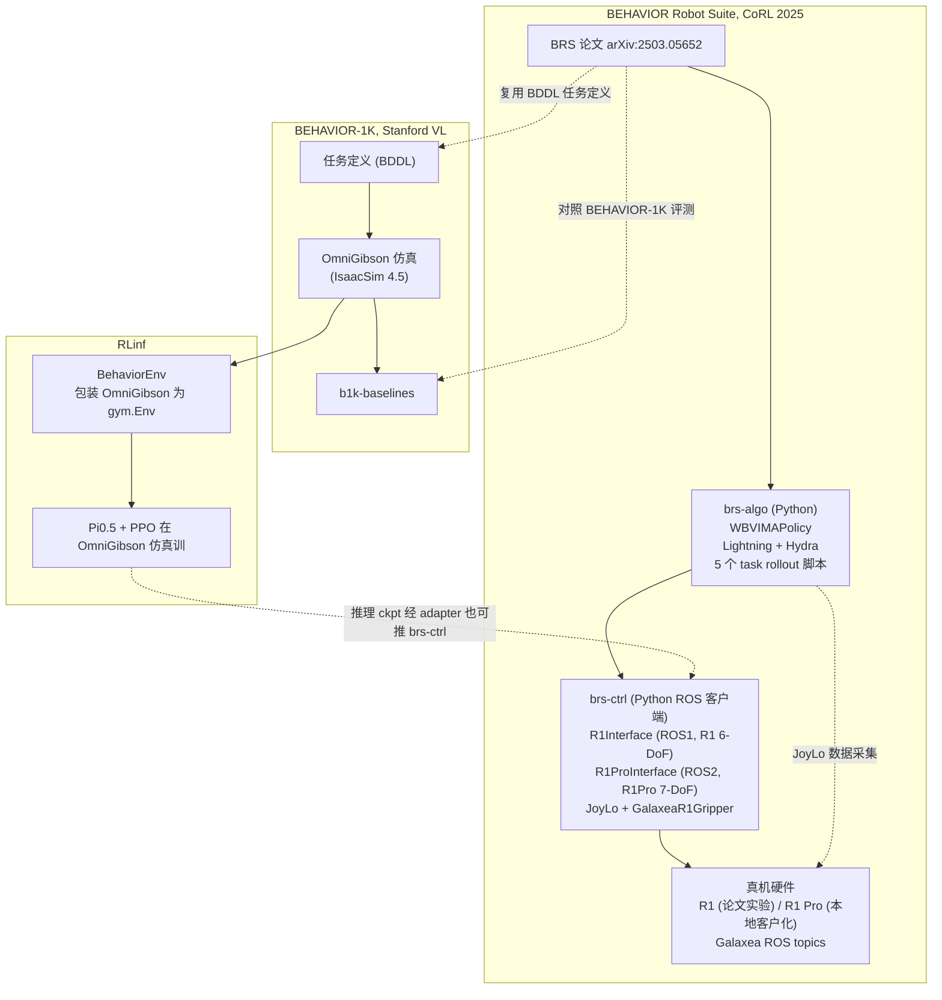
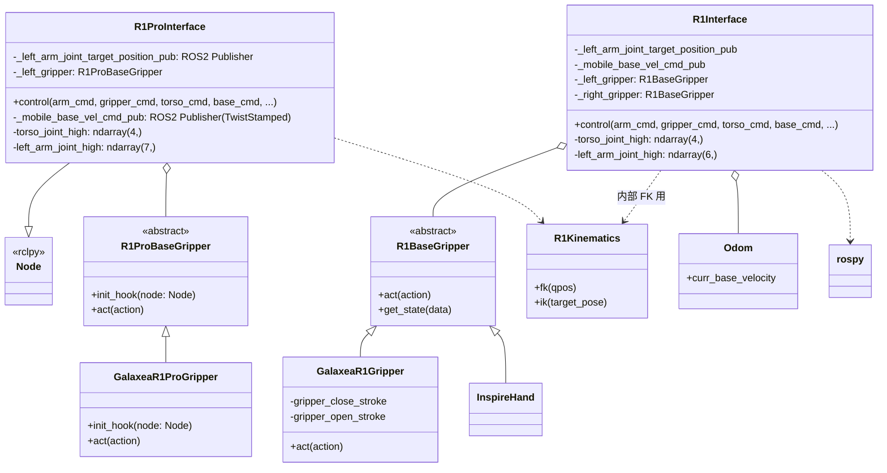
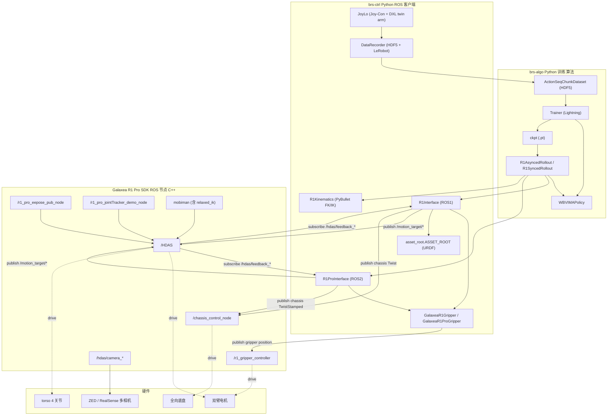
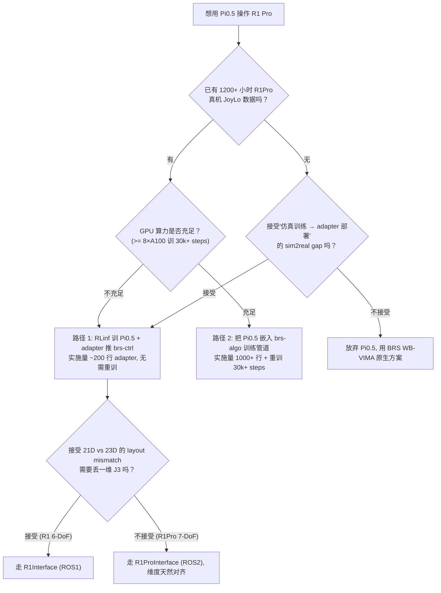
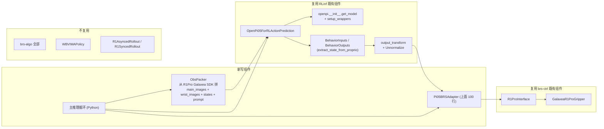

# BEHAVIOR Robot Suite (BRS) 系统全景与 Pi0.5 替换可行性分析

> 本文与既有的 [Pi05_ActionSpace_Analysis.md](Pi05_ActionSpace_Analysis.md)、[glx/R1ProSDKAnalysis.md](glx/R1ProSDKAnalysis.md)、[glx/mismatch_realworld_1.md](glx/mismatch_realworld_1.md) 形成"真机 RL"系列。研读资料：
>
> - Paper: [BEHAVIOR Robot Suite (CoRL 2025)](https://arxiv.org/abs/2503.05652)
> - 官网：[behavior-robot-suite.github.io](https://behavior-robot-suite.github.io/)
> - 官方代码：[brs-algo](https://github.com/behavior-robot-suite/brs-algo) + [brs-ctrl](https://github.com/behavior-robot-suite/brs-ctrl)
> - 本地代码：[`/home/nvidia/lg_ws/Rob/brs-algo/`](/home/nvidia/lg_ws/Rob/brs-algo/)、本地客户化 [`/home/nvidia/kaizhe_ws/data_collect/brs-ctrl/`](/home/nvidia/kaizhe_ws/data_collect/brs-ctrl/)
> - Galaxea R1 Pro SDK：[`/home/nvidia/galaxea/install/`](/home/nvidia/galaxea/install/)
> - RLinf：[`/home/nvidia/lg_ws/RL/RLinf/`](/home/nvidia/lg_ws/RL/RLinf/)

---

## 关键事实声明（必读）

**BRS 官方代码 ≠ Pi0.5**：

```text
$ rg "pi0|openpi|pi05" /home/nvidia/lg_ws/Rob/brs-algo/   # 零命中
$ rg "pi0|openpi|pi05" /home/nvidia/kaizhe_ws/data_collect/brs-ctrl/  # 零命中
```

BRS 论文提出的算法是 **WB-VIMA**（Whole-Body VisuoMotor Attention Policy，GPT backbone + DDIM diffusion head + 跨身体部位的 chain conditioning），其官方实验全部基于 **R1（6-DoF 单臂 × 2）**。本地 brs-ctrl 客户化版额外提供了 **R1 Pro（7-DoF）** 的 `R1ProInterface` 接口，但 BRS 论文未在 R1 Pro 上实验。Pi0.5 是 RLinf 框架中的 VLA 模型（RLinf 仿真侧），与 BRS 没有直接代码关系。

本文按"先讲透 BRS 原生（WB-VIMA + R1），再展开 Pi0.5 替换可行方案"的两段式组织；R1（6-DoF）与 R1 Pro（7-DoF）双线并提。

---

## 目录

- **Part 1：BRS 系统全景 + WB-VIMA 操作 R1 / R1 Pro**
  - [A. BRS 三方主体厘清与误区澄清](#a-brs-三方主体厘清与误区澄清)
  - [B. 硬件全貌：R1 vs R1 Pro 双线对比](#b-硬件全貌r1-vs-r1-pro-双线对比)
  - [C. brs-ctrl 控制接口深度](#c-brs-ctrl-控制接口深度)
  - [D. JoyLo 数据采集 + LeRobot/HDF5 数据格式](#d-joylo-数据采集--lerobothdf5-数据格式)
  - [E. WB-VIMA 网络架构详解](#e-wb-vima-网络架构详解)
  - [F. 训练 pipeline](#f-训练-pipeline)
  - [G. 真机 rollout 调用栈](#g-真机-rollout-调用栈)
  - [H. 21D action / state 的逐字段前后处理](#h-21d-action--state-的逐字段前后处理)
  - [I. brs-algo ↔ brs-ctrl ↔ Galaxea SDK 依赖边界](#i-brs-algo--brs-ctrl--galaxea-sdk-依赖边界)
- **Part 2：把 WB-VIMA 替换成 Pi0.5 的可行方案**
  - [J. 路径选择](#j-路径选择)
  - [K. R1 vs R1 Pro 的双线适配](#k-r1-vs-r1-pro-的双线适配)
  - [L. 22 处差异与 adapter 代码骨架](#l-22-处差异与-adapter-代码骨架)
  - [M. 预期问题与陷阱清单](#m-预期问题与陷阱清单)
  - [N. 小结：BRS vs RLinf 的两种工程哲学](#n-小结brs-vs-rlinf-的两种工程哲学)

---

# Part 1：BRS 系统全景 + WB-VIMA 操作 R1 / R1 Pro

## A. BRS 三方主体厘清与误区澄清

新读者最容易混淆的三个独立项目：

- **BRS（BEHAVIOR Robot Suite）** = 论文 + brs-algo（WB-VIMA 模型/训练）+ brs-ctrl（硬件/ROS 控制）+ R1 真机（也支持 R1 Pro）。BRS 自己不是仿真，也不是 BEHAVIOR-1K。
- **BEHAVIOR-1K** = Stanford VL 的 1000 个家务任务的 **OmniGibson 仿真基准**（[behavior.stanford.edu](https://behavior.stanford.edu/)、[StanfordVL/BEHAVIOR-1K](https://github.com/StanfordVL/BEHAVIOR-1K)、参考实现 [b1k-baselines](https://github.com/StanfordVL/b1k-baselines)）。BRS 与之共享部分任务定义和评测口径，但 BRS 本身在真机上跑，不需要 OmniGibson。
- **RLinf 框架的 Behavior 集成** = 第三方独立工作，把 BEHAVIOR-1K 的 OmniGibson 仿真包装为 `gym.Env`（[`rlinf/envs/behavior/behavior_env.py`](../../../rlinf/envs/behavior/behavior_env.py)），用 Pi0.5 + PPO 在仿真里训。**RLinf 不依赖 BRS**；既不 import brs-algo，也不 import brs-ctrl（详见 [Pi05_ActionSpace_Analysis.md 的 A 节](Pi05_ActionSpace_Analysis.md#a-三方主体厘清rlinf-vs-behavior-1k-vs-brs)）。

### 图 1：BRS 三方主体关系（mermaid）



要点：

- BRS 与 BEHAVIOR-1K 在任务定义层共享，在执行层完全独立（一个真机、一个仿真）。
- RLinf 走的是"仿真 BEHAVIOR-1K + 自家 Pi0.5"，**不与 BRS 共享代码**。
- 唯一的"BRS × Pi0.5"接触点是用户层面：理论上可以把 RLinf 训出的 Pi0.5 ckpt 通过 adapter 推到 brs-ctrl 真机，这正是 Part 2 要展开的方案。

---

## B. 硬件全貌：R1 vs R1 Pro 双线对比

BRS 论文用的是 **R1**（Galaxea R1 一代，6-DoF 单臂）；本地 brs-ctrl 客户化版补了 **R1 Pro**（二代，7-DoF 单臂）。两者主要差异：

- **机械臂自由度**：R1 = 6-DoF × 2；R1 Pro = 7-DoF × 2（多了一个肘部冗余关节，可达性显著提升）。
- **关节限位**（来自 brs-ctrl 类常量）：
  - R1 左臂：`high=[2.8798, 3.2289, 0, 2.8798, 1.6581, 2.8798]`、`low=[-2.8798, 0, -3.3161, -2.8798, -1.6581, -2.8798]`（[interfaces.py:43-44](/home/nvidia/kaizhe_ws/data_collect/brs-ctrl/brs_ctrl/robot_interface/interfaces.py:43-44)；与 [asynced_rollout.py:21-22](/home/nvidia/lg_ws/Rob/brs-algo/brs_algo/rollout/asynced_rollout.py:21-22) 中 `R1AsyncedRollout` 类常量完全一致）。
  - R1 Pro 左臂：`high=[1.3090, 3.1416, 2.3562, 0.3491, 2.3562, 1.0472, 1.5708]`、`low=[-4.4506, -0.1745, -2.3562, -2.0944, -2.3562, -1.0472, -1.5708]`（[interfaces.py:726-731](/home/nvidia/kaizhe_ws/data_collect/brs-ctrl/brs_ctrl/robot_interface/interfaces.py:726-731)）。两者关节角范围与方向都不一样，迁移 ckpt 必须重新校准 norm_stats。
- **Trunk（躯干）**：两代都是 4-DoF，但 R1 Pro `high=[1.8326, 2.5307, 1.5708, 3.0543]`（[interfaces.py:724-725](/home/nvidia/kaizhe_ws/data_collect/brs-ctrl/brs_ctrl/robot_interface/interfaces.py:724-725)）和 R1 [interfaces.py:41-42](/home/nvidia/kaizhe_ws/data_collect/brs-ctrl/brs_ctrl/robot_interface/interfaces.py:41-42) 的 `high=[1.8326, 2.5307, 1.8326, 3.0543]` **第三关节不同**（1.5708 vs 1.8326）。
- **夹爪**：两代都是 G1 平行夹爪；R1 用 `GalaxeaR1Gripper`（[grippers/galaxea_g1.py:31](/home/nvidia/kaizhe_ws/data_collect/brs-ctrl/brs_ctrl/robot_interface/grippers/galaxea_g1.py:31)），R1 Pro 用 `GalaxeaR1ProGripper`（[grippers/galaxea_g1.py:118](/home/nvidia/kaizhe_ws/data_collect/brs-ctrl/brs_ctrl/robot_interface/grippers/galaxea_g1.py:118)）；公式 `stroke = close + (1 - action) * (open - close)` 完全相同（即 1=闭合，0=张开），物理 stroke 范围 `[0, 100]` mm。
- **底盘**：两代都是全向轮（`HolonomicBaseJointController`），`mobile_base_cmd_threshold=[0.01, 0.01, 0.05]`、`mobile_base_cmd_limit=[0.3, 0.3, 0.4]` 默认值一致（R1：[interfaces.py:66-69](/home/nvidia/kaizhe_ws/data_collect/brs-ctrl/brs_ctrl/robot_interface/interfaces.py:66-69)；R1 Pro：[interfaces.py:755-758](/home/nvidia/kaizhe_ws/data_collect/brs-ctrl/brs_ctrl/robot_interface/interfaces.py:755-758)）。
- **ROS 中间件**：R1 走 **ROS 1**（`rospy`），R1 Pro 走 **ROS 2 Humble**（`rclpy.node.Node`）。这是最大的代码层差异——R1ProInterface 直接继承 `Node`，自己 spawn `executor`；R1Interface 全局 `rospy.init_node`。
- **摄像头**：BRS 论文 R1 用 ZED 双目（rgb 三视图：`zed2_head` + `zed2_left_wrist` + `zed2_right_wrist`，[interfaces.py:142-145](/home/nvidia/kaizhe_ws/data_collect/brs-ctrl/brs_ctrl/robot_interface/interfaces.py:142-145)）+ Jetson 上做点云融合（`/r1_jetson/fused_pcd`，[interfaces.py:71-72](/home/nvidia/kaizhe_ws/data_collect/brs-ctrl/brs_ctrl/robot_interface/interfaces.py:71-72)）。R1 Pro 用 RealSense 双腕（`/hdas/camera_wrist_left/color/...`、`/hdas/camera_wrist_right/...`、`/hdas/camera_head/left_raw/...`，[interfaces.py:832-836](/home/nvidia/kaizhe_ws/data_collect/brs-ctrl/brs_ctrl/robot_interface/interfaces.py:832-836)）。**R1 Pro 默认未集成点云**（brs-ctrl 没有 `enable_pointcloud=True` 通路，仅 `enable_rgb=True`）；这意味着 WB-VIMA 现成的 R1 ckpt **不能直接迁到 R1 Pro**——它的输入 `pointcloud/{xyz, rgb}` 在 R1 Pro 上没有数据源。
- **brs-ctrl 接口类**：`R1Interface`（[interfaces.py:40-720](/home/nvidia/kaizhe_ws/data_collect/brs-ctrl/brs_ctrl/robot_interface/interfaces.py:40-720)，约 680 行）vs `R1ProInterface`（[interfaces.py:723-1374](/home/nvidia/kaizhe_ws/data_collect/brs-ctrl/brs_ctrl/robot_interface/interfaces.py:723-1374)，约 650 行）。两个独立类，不共享父类，API 形态相同但实现路径分叉。

### Galaxea SDK 真机 ROS 拓扑速查

引 [glx/mismatch_realworld_1.md](glx/mismatch_realworld_1.md) 在 R1 Pro 真机 Orin 上的实测：

- 已在线节点：`/HDAS`、`/chassis_control_node`、`/r1_gripper_controller`、`/r1_pro_eepose_pub_node`、`/r1_pro_jointTracker_demo_node`、`/robot_state_publisher`、`/hdas/camera_wrist_*`。
- 已在线话题（与 brs-ctrl 直接对接的）：
  - 反馈：`/hdas/feedback_arm_left|right`、`/hdas/feedback_torso`、`/hdas/feedback_chassis`、`/hdas/feedback_gripper_left|right`、`/hdas/feedback_status_*`、`/hdas/imu_*`、`/hdas/bms`、`/controller`。
  - 命令：`/motion_target/target_joint_state_arm_left|right`、`/motion_target/target_position_gripper_left|right`、`/motion_target/target_speed_chassis`、`/motion_target/brake_mode`。
- **未在线但 RLinf 真机栈期望的**：`/motion_target/target_pose_arm_right`（需要 `relaxed_ik_*` 节点）。这意味着 BRS 走"关节命令直发"路径不需要 IK 节点，比 RLinf 真机栈对运行环境的要求更轻。
- 真机环境必须设置：`ROS_DOMAIN_ID=41`、`RMW_IMPLEMENTATION=rmw_cyclonedds_cpp`、`CYCLONEDDS_URI=file:///home/nvidia/cyclone_dds.xml`（与 RLinf 默认 `ROS_DOMAIN_ID=72` 不同，是常见踩坑点）。

---

## C. brs-ctrl 控制接口深度

### C.1 类层次与公共 API

`R1Interface` 与 `R1ProInterface` 两个独立类（不共享父类），但都暴露形如下面的 `control(...)` 入口：

- R1：[interfaces.py:206-248](/home/nvidia/kaizhe_ws/data_collect/brs-ctrl/brs_ctrl/robot_interface/interfaces.py:206-248)
- R1 Pro：[interfaces.py:884-927](/home/nvidia/kaizhe_ws/data_collect/brs-ctrl/brs_ctrl/robot_interface/interfaces.py:884-927)

```python
robot.control(
    arm_controller="joint_position",  # 唯一支持
    arm_cmd={"left": np.ndarray (6,) 或 (7,), "right": ...},
    gripper_cmd={"left": float in [0,1], "right": float in [0,1]},
    torso_controller="joint_position",
    torso_cmd=np.ndarray (4,),
    base_cmd=np.ndarray (3,) [vx, vy, ω],
)
```

内部分发：依次调 `_mobile_base_control(base_cmd)`、`_upper_body_joint_position_control(arm_cmd, torso_cmd)`、`_gripper_control(gripper_cmd)`，每一步都被 try/except 包住（R1Pro 用 `Exception`，R1 用 `rospy.ROSInterruptException`）。

### C.2 关节维度断言（R1 vs R1 Pro 最直接的代码层差异）

R1 强制 6-DoF：

```python
# /home/nvidia/kaizhe_ws/data_collect/brs-ctrl/brs_ctrl/robot_interface/interfaces.py:263-281
def _upper_body_joint_position_control(
    self, left_arm_target_q=None, right_arm_target_q=None, torso_target_q=None,
):
    if left_arm_target_q is not None:
        assert left_arm_target_q.shape == (6,), \
            f"Expected left_arm_target_q to have shape (6,), got {left_arm_target_q.shape}"
    if right_arm_target_q is not None:
        assert right_arm_target_q.shape == (6,), ...
    if torso_target_q is not None:
        assert torso_target_q.shape == (4,), ...
```

R1 Pro 强制 7-DoF：

```python
# /home/nvidia/kaizhe_ws/data_collect/brs-ctrl/brs_ctrl/robot_interface/interfaces.py:955-973
def _upper_body_joint_position_control(
    self, left_arm_target_q=None, right_arm_target_q=None, torso_target_q=None,
):
    if left_arm_target_q is not None:
        assert left_arm_target_q.shape == (7,), f"Expected (7,), got {left_arm_target_q.shape}"
    if right_arm_target_q is not None:
        assert right_arm_target_q.shape == (7,), ...
    if torso_target_q is not None:
        assert torso_target_q.shape == (4,), ...
```

含义：**WB-VIMA 现成的 R1 ckpt（6-DoF arm，21D action）不能直接喂给 R1ProInterface**，必须维度 padding 或重训。

### C.3 底盘速度限位 + 死区

R1 Pro 实现（R1 几乎一致）：

```python
# /home/nvidia/kaizhe_ws/data_collect/brs-ctrl/brs_ctrl/robot_interface/interfaces.py:935-948
def _mobile_base_control(self, cmd: np.ndarray):
    cmd = cmd.copy()
    set_zero = np.abs(cmd) < self._mobile_base_cmd_threshold  # [0.01, 0.01, 0.05]
    cmd[set_zero] = 0.0
    cmd = np.clip(cmd, -self._mobile_base_cmd_limit, self._mobile_base_cmd_limit)  # [0.3, 0.3, 0.4]
    msg = TwistStamped()
    msg.header.stamp = self._now_msg()
    twist_msg = Twist()
    twist_msg.linear.x = float(cmd[0])
    twist_msg.linear.y = float(cmd[1])
    twist_msg.angular.z = float(cmd[2])
    msg.twist = twist_msg
    self._mobile_base_vel_cmd_pub.publish(msg)
```

要点：

- `threshold` 死区清零，避免 controller 在零附近抖动。
- `limit` 硬 clip，等于"最后一道安全闸门"。
- R1 用 `Twist`（无 stamp，ROS 1），R1 Pro 用 `TwistStamped`（带时间戳，便于真机控制器做时延校验）。

### C.4 关节限位 clip 兜底

R1 Pro `_upper_body_joint_position_control` 在维度断言之后还会按类常量 `left_arm_joint_high/low` 做 clip（`on_arm_cmd_out_of_range="clip"` 默认）：

```python
# /home/nvidia/kaizhe_ws/data_collect/brs-ctrl/brs_ctrl/robot_interface/interfaces.py:976-995
if left_arm_target_q is not None:
    left_in_range = np.logical_and(
        left_arm_target_q >= self.left_arm_joint_low,
        left_arm_target_q <= self.left_arm_joint_high,
    )
    for idx in np.where(~left_in_range)[0]:
        msg = (...)
        if self._on_arm_cmd_out_of_range == "clip":
            left_arm_target_q[idx] = np.clip(...)
            msg += " Clipped."
            self.get_logger().warning(msg)
        else:
            raise ValueError(msg)
```

这是 brs-ctrl 内置的"最后一道软限位"。注意 brs-algo 在 [`asynced_rollout.py:19-24`](/home/nvidia/lg_ws/Rob/brs-algo/brs_algo/rollout/asynced_rollout.py:19-24) **重复了一份相同的 R1 关节限位**（用作 unnormalize 时的物理范围），两边数据必须一致；如果有人改了 brs-ctrl 的限位但忘记同步 brs-algo，会出现"训练时归一化空间和推理时反归一化空间不对齐"的灾难。

### C.5 夹爪：连续 [0, 1] 的"反转"语义

R1 Pro 夹爪：

```python
# /home/nvidia/kaizhe_ws/data_collect/brs-ctrl/brs_ctrl/robot_interface/grippers/galaxea_g1.py:173-183
def act(self, action: Union[float, np.ndarray]):
    assert isinstance(action, (float, int)), "ParallelGripper expects a single scalar action"
    stroke = self._gripper_close_stroke + (1 - float(action)) * (
        self._gripper_open_stroke - self._gripper_close_stroke
    )
    gripper_msg = JointState()
    gripper_msg.position = [float(max(min(stroke, 100.0), 0.0))]
    self._gripper_position_control_pub.publish(gripper_msg)
```

R1 公式相同（[grippers/galaxea_g1.py:71-80](/home/nvidia/kaizhe_ws/data_collect/brs-ctrl/brs_ctrl/robot_interface/grippers/galaxea_g1.py:71-80)）。

物理含义：

- `gripper_open_stroke`（默认 90 / R1Pro `100`）= 完全张开时 stroke 值。
- `gripper_close_stroke`（默认 10 / 用户设 0.5）= 完全闭合时 stroke 值。
- `action=1` → `stroke = close` = **闭合**。
- `action=0` → `stroke = open` = **张开**。
- BRS 训练数据里夹爪被二值化（`stroke <= 50 → 1，> 50 → 0`，[dataset.py:253-263](/home/nvidia/lg_ws/Rob/brs-algo/brs_algo/learning/data/dataset.py:253-263)），所以模型实际学的是"开闭分类"。

### C.6 与 Galaxea SDK 的边界

**brs-ctrl 是一个薄 Python ROS 客户端**，不 wrap Galaxea 的 C++ SDK：

- 它直接 `rospy.Publisher` / `Node.create_publisher` 发 Galaxea 暴露的 `/motion_target/...` topics。
- 它直接 `rospy.Subscriber` / `Node.create_subscription` 订阅 `/hdas/...` topics。
- 真机端需要先启动 Galaxea SDK 自己的 ROS 节点栈（`/HDAS`、`/chassis_control_node`、`/r1_gripper_controller`、`/r1_pro_eepose_pub_node` 等），brs-ctrl 才能"连上"。
- Orin 端的 ROS 环境变量必须正确（`ROS_DOMAIN_ID=41`、Cyclone DDS、wlan0 而非 eth0）——这一段是 brs-ctrl 不会自己处理的，必须在 shell 里 export，详见 [glx/mismatch_realworld_1.md §A](glx/mismatch_realworld_1.md)。

### 图 2：brs-ctrl 控制接口类层次（mermaid）



---

## D. JoyLo 数据采集 + LeRobot/HDF5 数据格式

### D.1 JoyLo 硬件

JoyLo = "**Joy**-Con + **Lo**w-cost kinematic-twin arms"：

- **Joy-Con**（Nintendo Switch 任天堂手柄）：每只手柄 2 个摇杆 + 4 个按钮 + 1 个扳机；通过蓝牙连 Orin。代码：[`brs_ctrl/joylo/joycon/`](/home/nvidia/kaizhe_ws/data_collect/brs-ctrl/brs_ctrl/joylo/joycon/joycon_interface.py)。
- **Kinematic-twin arms**：Dynamixel 舵机驱动的 3D 打印缩小版双臂，关节布局与 R1 一致；操作员手抓 Joy-Con + 转动 twin arms 来"骨骼遥操"（puppeteering）。代码：[`brs_ctrl/joylo/joylo_arms/dxl/`](/home/nvidia/kaizhe_ws/data_collect/brs-ctrl/brs_ctrl/joylo/joylo_arms/dxl/) 含 `joint_impedance.py`、`position_control.py`、`current_control.py` 三种 Dynamixel 控制模式。
- 启动：`python3 scripts/joylo/real_joylo.py`。

工作流：操作员转 twin arms 的关节 → Dynamixel 舵机读关节角 → 直接发给 R1 真机（关节角 1:1 映射）+ Joy-Con 摇杆控制底盘 + 扳机控制夹爪开合 + 按钮触发 torso 预设位姿。

### D.2 数据采集脚本

`scripts/data_collection/start_data_collection.py` 启动一个 `TeleopSessionController`（[brs_ctrl/data_recorder/teleop_session_controller.py](/home/nvidia/kaizhe_ws/data_collect/brs-ctrl/brs_ctrl/data_recorder/teleop_session_controller.py)），它：

1. 创建 `R1Interface` 真机连接。
2. 创建 `JoyLo` 遥操器。
3. 创建 `DataRecorder`，订阅 `/hdas/...` 反馈 + `/motion_target/...` 命令 topics，按时间戳对齐。
4. 用户按"开始"按钮 → 录制；按"停止" → 写入 HDF5 文件。

### D.3 HDF5 trajectory 格式

每条 demo（HDF5 顶层 group）包含：

```text
demo_<i>/
  action/
    mobile_base       # (T, 3)  vx, vy, ω, m/s & rad/s
    torso             # (T, 4)  rad
    left_arm          # (T, 6)  rad   (R1; 注意不是 7)
    right_arm         # (T, 6)  rad
    left_gripper      # (T,)    stroke in cm,  >50 = open
    right_gripper     # (T,)
  obs/
    joint_state/left_arm/joint_position    # (T, 6+) 物理 rad
    joint_state/right_arm/joint_position   # (T, 6+)
    joint_state/torso/joint_position       # (T, 4)
    joint_state/left_gripper/joint_position
    joint_state/right_gripper/joint_position
    odom/base_velocity                     # (T, 3)
  pointcloud/
    xyz                                    # (T, N, 3) 融合点云 (Jetson 端融合)
    rgb                                    # (T, N, 3)
  multi_view_cameras/                      # 可选, RGB 三视图
  link_poses/                              # 各关键 link 的 pose (用于 post-process)
```

典型读取见 [dataset.py:218-263](/home/nvidia/lg_ws/Rob/brs-algo/brs_algo/learning/data/dataset.py:218-263)。

### D.4 LeRobot 桥接（本地客户化）

本地 brs-ctrl 在 [`brs_ctrl/data_recorder/lerobot_*.py`](/home/nvidia/kaizhe_ws/data_collect/brs-ctrl/brs_ctrl/data_recorder/) 放了 `lerobot_recorder.py`、`lerobot_bridge_publisher.py`、`lerobot_zmq.py`、`lerobot_schema.py` 共 4 个文件。这是上游 BRS GitHub 上**没有的客户化补丁**——用于把 BRS 自家 HDF5 数据转成 LeRobot HuggingFace 通用格式（[lerobot.huggingface.co](https://huggingface.co/lerobot)），便于与社区数据集（如 OpenX-Embodiment）混训。RLinf 也用 LeRobot 格式喂 Pi0.5 SFT，所以这个客户化层让 BRS 数据"理论上"可以被 RLinf 直接 SFT 用。

### D.5 BRS Challenge 数据规模

BRS 论文明确：BRS Challenge @ NeurIPS 2025 用了 **1200+ 小时** JoyLo 数据，作为 WB-VIMA 的强基线。这是当前公开的 R1 真机数据集中最大的之一。

---

## E. WB-VIMA 网络架构详解

WB-VIMA 全称 **Whole-Body VisuoMotor Attention Policy**。官方定位是"autoregressive over kinematic hierarchy + diffusion action head"。本节根据本地 [`/home/nvidia/lg_ws/Rob/brs-algo/`](/home/nvidia/lg_ws/Rob/brs-algo/) 源码逐层解构。

### E.1 三段式架构

模型由三个解耦的子网络组成：

1. **观测编码层**（`ObsTokenizer`）：把每一帧的多模态观测（21D proprio + 4096 点 6-channel pointcloud）转成 token 序列。
2. **GPT backbone**（`GPT`）：自定义 attention mask + position_ids 的 2 层 / 8 head Transformer，输出每一帧的 readout token。
3. **WholeBodyUNetDiffusionHead**：3 个 `ConditionalUnet1D` 按 `["mobile_base", "torso", "arms"]` 顺序解码，**后续部位的全局条件向量拼接前面已去噪部位的整段动作 horizon**——这就是论文里讲的 "autoregressive over kinematic hierarchy"。

### 图 3：WBVIMAPolicy 类图（mermaid）

```mermaid
classDiagram
    class WBVIMAPolicy {
        +forward(obs) tokens
        +inference(obs, return_last_timestep_only) action_dict
        +act(obs) action_dict
        +compute_loss(transformer_output, gt_action)
        -obs_tokenizer: ObsTokenizer
        -transformer: GPT
        -action_decoder: WholeBodyUNetDiffusionHead
        -action_readout_token: nn.Parameter or zeros
        -action_dim: int = 21
        -num_latest_obs: int = 2
    }
    class ObsTokenizer {
        +__call__(obs_dict) tokens
        -encoders: dict[str, Module]
        -token_concat_order = ["proprioception", "pointcloud"]
    }
    class MLP {
        +forward(x)
    }
    class PointNet {
        +forward({xyz, rgb})
        -_mlp: per-point MLP (6 → 256)
        -max-pool over points
    }
    class GPT {
        +forward(x, custom_mask, position_ids, batch_first)
        -lm: HuggingFace OpenAI-GPT
        -n_embd=256, n_layer=2, n_head=8
    }
    class WholeBodyUNetDiffusionHead {
        +inference(obs)
        +compute_loss(obs, gt_action)
        -models: ModuleDict (mobile_base / torso / arms)
        -whole_body_decoding_order = ["mobile_base", "torso", "arms"]
        -action_dim_per_part = {3, 4, 14}
        -noise_scheduler: DDIMScheduler
        -inference_denoise_steps: int = 16
    }
    class ConditionalUnet1D {
        +forward(sample, timestep, global_cond)
    }

    WBVIMAPolicy *-- ObsTokenizer
    WBVIMAPolicy *-- GPT
    WBVIMAPolicy *-- WholeBodyUNetDiffusionHead
    ObsTokenizer o-- MLP : proprioception
    ObsTokenizer o-- PointNet : pointcloud
    WholeBodyUNetDiffusionHead o-- ConditionalUnet1D : "× 3 (一个 part 一个)"
```

### E.2 观测编码层：proprio + pointcloud

`ObsTokenizer` 配置（来自 [wbvima.yaml:25-34](/home/nvidia/lg_ws/Rob/brs-algo/main/train/cfg/arch/wbvima.yaml:25-34) 与 [wbvima_policy.py:59-80](/home/nvidia/lg_ws/Rob/brs-algo/brs_algo/learning/policy/wbvima_policy.py:59-80)）：

```python
self.obs_tokenizer = ObsTokenizer(
    {
        "proprioception": MLP(prop_dim=21, hidden_dim=256, output_dim=xf_n_embd=256, hidden_depth=2,
                              add_output_activation=True),
        "pointcloud":     PointNet(n_coordinates=3, n_color=3, output_dim=256, hidden_dim=256,
                                   hidden_depth=2),
    },
    use_modality_type_tokens=False,
    token_dim=256,
    token_concat_order=["proprioception", "pointcloud"],
    strict=True,
)
```

- **Proprio MLP**：21D → 256，2 层 hidden + 输出激活。21D 来自 `prop_keys = ["odom/base_velocity", "qpos/torso", "qpos/left_arm", "qpos/left_gripper", "qpos/right_arm", "qpos/right_gripper"]`（`3 + 4 + 6 + 1 + 6 + 1 = 21`）。
- **PointNet**（[nn/features/pointnet.py:39-80](/home/nvidia/lg_ws/Rob/brs-algo/brs_algo/learning/nn/features/pointnet.py:39-80)）：

  ```python
  def forward(self, x):
      xyz = x["xyz"]            # (..., N, 3)
      rgb = x["rgb"]            # (..., N, 3)
      x = torch.cat([xyz, rgb], dim=-1)   # (..., N, 6)
      return self.pointnet(x)             # MLP per-point + max-pool over N
  ```

  默认 `subtract_mean=False`。每个点 6 通道 → MLP → max-pool 得到 256D global feature。
- **Token 排序**：`token_concat_order=["proprioception", "pointcloud"]`，每个时间步 2 个 token（proprio token + pointcloud token），`num_tokens_per_step = 2`；插入 1 个 `action_readout_token` 后变 3：

  ```python
  # /home/nvidia/lg_ws/Rob/brs-algo/brs_algo/learning/nn/features/fusion.py:51-56
  x = rearrange(
      [x[k] for k in self._token_concat_order],
      "F B T E -> B (T F) E",
  )
  ```

### E.3 GPT backbone：custom mask + position_ids

```python
# /home/nvidia/lg_ws/Rob/brs-algo/brs_algo/learning/nn/gpt/gpt.py:48-82
def forward(self, x, *, custom_mask=None, position_ids=None, batch_first=False):
    if batch_first:
        B, L, E = x.shape
    else:
        L, B, E = x.shape
        x = x.transpose(0, 1)
    out = self.lm(
        inputs_embeds=x.contiguous(),
        attention_mask=attention_mask,
        position_ids=position_ids,
    ).last_hidden_state
    assert out.shape == (B, L, E)
    if not batch_first:
        out = out.transpose(0, 1)
    return out
```

- **HuggingFace OpenAI-GPT**：2 层 + 8 head + 256 hidden（[wbvima.yaml:38-42](/home/nvidia/lg_ws/Rob/brs-algo/main/train/cfg/arch/wbvima.yaml:38-42)）。
- **Custom mask**：在 `WBVIMAPolicy.forward` 里，对每个 readout 位置 `mask[:, action_readout_pos] = False`，让 readout token **不参与作为 query**，只作为被注意的 key/value——这样下游的 readout 提取严格基于 obs token。
- **Custom position_ids**：同一时间步内的 `proprio + pointcloud + readout` 共享 position id，跨时间步递增；让 attention 能区分时序但不区分模态顺序。

输入 shape `(B, num_latest_obs * 3, 256)`，输出同 shape。`num_latest_obs=2` → 6 个 token。

### E.4 WholeBodyUNetDiffusionHead：链式条件

这是 BRS 论文的核心创新点：**先 mobile_base，再 torso，最后 arms；后面部位的 UNet 全局条件向量包含前面部位整段去噪好的动作 horizon 展平**。

构造（[diffusion_head.py:271-289](/home/nvidia/lg_ws/Rob/brs-algo/brs_algo/learning/nn/diffusion/diffusion_head.py:271-289)）：

```python
self.models = nn.ModuleDict()
for i, part in enumerate(whole_body_decoding_order):  # ["mobile_base", "torso", "arms"]
    additional_input_dim = 0
    for j in range(i):
        dependent_part = whole_body_decoding_order[j]
        additional_input_dim += (
            action_dim_per_part[dependent_part] * action_horizon  # 把前面 part 整段 horizon 展平
        )
    model = ConditionalUnet1D(
        input_dim=action_dim_per_part[part],  # 3 / 4 / 14
        local_cond_dim=None,
        global_cond_dim=obs_dim + additional_input_dim,  # readout + 前面 parts 的 horizon
        ...
    )
    self.models[part] = model
```

`global_cond` 维度对照：

- **mobile_base**：`global_cond_dim = obs_dim = 256`（无前置依赖）。
- **torso**：`global_cond_dim = 256 + 3*8 = 280`（`action_horizon=8`）。
- **arms**：`global_cond_dim = 256 + 3*8 + 4*8 = 312`。

推理（[diffusion_head.py:488-536](/home/nvidia/lg_ws/Rob/brs-algo/brs_algo/learning/nn/diffusion/diffusion_head.py:488-536)）：

```python
pred_action_all_parts = {}
for part_idx, part in enumerate(self.whole_body_decoding_order):
    noisy_traj = torch.randn(...)                            # 初始化噪声
    for t in self.noise_scheduler.timesteps:                 # DDIM 16 步
        if part_idx > 0:
            all_dependent_action = []
            for j in range(part_idx):
                dependent_action = pred_action_all_parts[
                    self.whole_body_decoding_order[j]
                ]
                dependent_action = rearrange(
                    dependent_action, "B T_obs T_act A -> B T_obs (T_act A)"
                )
                all_dependent_action.append(dependent_action)
            all_dependent_action = torch.cat(all_dependent_action, dim=-1)
        ...
        pred = self.models[part](
            sample=denoise_in,
            timestep=rearrange(timesteps, "B T_obs 1 -> (B T_obs)"),
            global_cond=global_cond,            # readout + 前面 part 的整段 horizon
        )
        noisy_traj = self.noise_scheduler.step(pred, t, noisy_traj, ...).prev_sample
    pred_action_all_parts[part] = noisy_traj
```

要点：

- **嵌套循环**：外层 3 次 `part`（mobile_base → torso → arms），内层 16 次 DDIM 去噪。共 48 次 UNet forward。
- **`global_cond` 在外层每一轮重算**：等前一个 part 完整去噪结束后，把它的整段 horizon `(B, T_obs, T_act, A)` reshape 成 `(B, T_obs, T_act*A)` 拼到下一 part 的 global_cond。这是"chain conditioning"的精确实现。
- **不是 attention chain**：不要把它和 GPT 自回归 token decoding 混淆——chain 在 diffusion head 里，attention 只在 GPT 里。

### 图 4：autoregressive whole-body decoding 时序（mermaid）

```mermaid
sequenceDiagram
    autonumber
    participant Policy as WBVIMAPolicy.act
    participant GPT as GPT backbone
    participant Decoder as WholeBodyUNetDiffusionHead
    participant U_base as ConditionalUnet1D (mobile_base)
    participant U_torso as ConditionalUnet1D (torso)
    participant U_arms as ConditionalUnet1D (arms)
    participant DDIM as DDIM scheduler

    Policy->>GPT: tokens_in (B, num_latest_obs*3, 256)
    GPT->>Policy: tokens_out (B, num_latest_obs*3, 256)
    Policy->>Decoder: action_readout_tokens (B, num_latest_obs, 256)

    Note over Decoder,DDIM: 外层 part 循环 (3 次)
    Decoder->>U_base: noisy_traj (B, T_obs, 8, 3)
    loop DDIM 16 步
        U_base->>U_base: forward(sample, t, global_cond=readout)
        U_base->>DDIM: pred ε
        DDIM-->>U_base: prev_sample
    end
    U_base-->>Decoder: pred["mobile_base"] (B, T_obs, 8, 3)

    Decoder->>U_torso: noisy_traj (B, T_obs, 8, 4); global_cond = readout + base.flatten(8*3=24)
    loop DDIM 16 步
        U_torso->>DDIM: ε
    end
    U_torso-->>Decoder: pred["torso"] (B, T_obs, 8, 4)

    Decoder->>U_arms: noisy_traj (B, T_obs, 8, 14); global_cond = readout + base(24) + torso(32)
    loop DDIM 16 步
        U_arms->>DDIM: ε
    end
    U_arms-->>Decoder: pred["arms"] (B, T_obs, 8, 14)

    Decoder-->>Policy: 拆 arms[..., :6/6:7/7:13/13:14] → left_arm/left_gripper/right_arm/right_gripper
    Policy-->>Policy: 返回 dict (mobile_base 3, torso 4, left_arm 6, left_gripper 1, right_arm 6, right_gripper 1)
```

### E.5 21D 拆解 + 推理输出

`WBVIMAPolicy.inference` 返回 6 个 key（[wbvima_policy.py:254-261](/home/nvidia/lg_ws/Rob/brs-algo/brs_algo/learning/policy/wbvima_policy.py:254-261)）：

```python
return {
    "mobile_base": pred["mobile_base"],         # (..., 3)
    "torso":       pred["torso"],               # (..., 4)
    "left_arm":    pred["arms"][..., :6],       # (..., 6)
    "left_gripper":pred["arms"][..., 6:7],      # (..., 1)
    "right_arm":   pred["arms"][..., 7:13],     # (..., 6)
    "right_gripper":pred["arms"][..., 13:14],   # (..., 1)
}
```

注意 **arms 块（14D）内部的顺序**：`[left_arm 6, left_gripper 1, right_arm 6, right_gripper 1]`。这与 `prop_keys` 的状态顺序一致，便于策略学习时的"对位"理解。

### E.6 DDIM 噪声调度

[wbvima.yaml:53-66](/home/nvidia/lg_ws/Rob/brs-algo/main/train/cfg/arch/wbvima.yaml:53-66)：

```yaml
noise_scheduler:
  _target_: diffusers.schedulers.scheduling_ddim.DDIMScheduler
  num_train_timesteps: 100
  beta_start: 0.0001
  beta_end: 0.02
  beta_schedule: squaredcos_cap_v2   # 关键：余弦时间表
  clip_sample: True
  set_alpha_to_one: True
  steps_offset: 0
  prediction_type: epsilon            # 预测噪声 ε，而非 sample x0
num_denoise_steps_per_inference: 16
```

要点：

- **训练**：100 步噪声，每个 part 独立采样 timestep（[diffusion_head.py compute_loss](/home/nvidia/lg_ws/Rob/brs-algo/brs_algo/learning/nn/diffusion/diffusion_head.py)）。
- **推理**：DDIM 加速到 16 步（每 part 16 步，共 48 次 UNet forward）。
- **predict ε**：网络输出预测噪声，这是 BRS 选用 epsilon-prediction 的常见做法。

### E.7 网络规模

代码里没有写死的"总参数量"常量。可以用 `brs_algo.utils.torch_utils.count_parameters` ([torch_utils.py:404-410](/home/nvidia/lg_ws/Rob/brs-algo/brs_algo/utils/torch_utils.py:404-410)) 在实例化 `WBVIMAPolicy` 后统计。粗略估算：

- ObsTokenizer ~0.4M（MLP 21→256→256 + PointNet 6→256→256）
- GPT 2 层 256 dim ~1.5M
- 3 个 ConditionalUnet1D（unet_down_dims=[64,128]）每个约 1.5-2M，共 ~5M
- **总计 ~7-8M 参数**（与 Pi0.5 ~3B 参数差 400+ 倍）

这是 WB-VIMA 能在 Orin 上 10Hz 实时推理的关键——参数量极小。

---

## F. 训练 pipeline

BRS 的训练栈是 **PyTorch Lightning + Hydra**，与 RLinf 的 **Ray + Hydra + 自家 Worker** 路线完全不同。

### F.1 入口

[`main/train/train.py:1-12`](/home/nvidia/lg_ws/Rob/brs-algo/main/train/train.py:1-12)：

```python
@hydra.main(config_name="cfg", config_path="cfg", version_base="1.1")
def main(cfg):
    cfg.seed = U.set_seed(cfg.seed)
    trainer_ = Trainer(cfg)
    trainer_.fit()
```

调用：`python3 main/train/train.py data_dir=<HDF5_PATH> bs=<BS> arch=wbvima task=<TASK_NAME> exp_root_dir=<EXP_ROOT_DIR> gpus=<NUM_GPUS>`。

### F.2 DiffusionModule（Lightning Module）

核心训练步：

```python
# /home/nvidia/lg_ws/Rob/brs-algo/brs_algo/learning/module/diffusion_module.py:74-93
gt_actions = torch.cat(
    [action_chunks[k] for k in self._action_keys], dim=-1
)
...
loss = self.policy.compute_loss(
    transformer_output=transformer_output,
    gt_action=gt_actions,
)  # (B, T_obs, T_act)
...
loss = loss * pad_mask
...
action_loss = torch.sum(torch.stack(all_loss)) / all_mask_sum
...
action_loss = action_loss * self.action_prediction_horizon
```

要点：

- **`action_keys` 的顺序决定 21D 向量拼接顺序**——必须与 `compute_loss` 内部的 `[:3], [3:7], [7:]` 切片对齐。默认顺序是 `[mobile_base, torso, left_arm, left_gripper, right_arm, right_gripper]`，对应 `3 + 4 + 6 + 1 + 6 + 1 = 21`。
- **每个 part 独立采样 timestep**：`compute_loss` 内对 mobile_base / torso / arms 各采样独立 t，然后 epsilon-MSE 求和。这意味着不同 part 在同一个 batch 里"被噪声污染的程度"不同。
- **pad_mask**：HDF5 里有些 trajectory 短于 `T_obs * T_act`，需要用 mask 屏蔽 padding 位置，避免污染 loss。
- **action_loss × action_prediction_horizon**：这是个常量缩放，让 loss 数值与 horizon 长度无关，便于跨配置比较。

### F.3 数据加载与 collate

```python
# /home/nvidia/lg_ws/Rob/brs-algo/brs_algo/learning/data/collate.py:5-13
def seq_chunk_collate_fn(sample_list):
    sample_list = U.any_stack(sample_list, dim=0)  # (B, T, ...)
    sample_list = nested_np_expand_dims(sample_list, axis=0)  # (1, B, T, ...)
```

`(1, B, T, ...)` 的"额外 1 维"对应 chunk 维度，与 `DiffusionModule` 内 `unstack_sequence_fields` 配合，在 Lightning 里实现 `(num_chunks, batch_size, time)` 的三层结构。

### F.4 Task 配置

5 个 task 各自的训练配置在 [`main/train/cfg/task/`](/home/nvidia/lg_ws/Rob/brs-algo/main/train/cfg/task/)：

- `take_trash_outside.yaml`
- `clean_the_toilet.yaml`
- `clean_house_after_a_wild_party.yaml`
- `lay_clothes_out.yaml`
- `put_items_onto_shelves.yaml`

每个 task 给 `pcd_*_range`、`mobile_base_vel_action_min/max`、`gripper_close_stroke` 等 task-specific 范围，通过 Hydra `defaults` 覆盖 `data_module` 字段。

### F.5 优化器

`DiffusionModule.configure_optimizers` 返回 **AdamW**（`weight_decay=0.1`，[wbvima.yaml:18](/home/nvidia/lg_ws/Rob/brs-algo/main/train/cfg/arch/wbvima.yaml:18)）+ 可选 `LambdaLR` cosine schedule。`WBVIMAPolicy.get_optimizer_groups` 把参数按 `obs_tokenizer / transformer / action_decoder / other` 分组，每组可独立设置 weight decay 和 lr scale（[wbvima_policy.py:282-315](/home/nvidia/lg_ws/Rob/brs-algo/brs_algo/learning/policy/wbvima_policy.py:282-315)）。

---

## G. 真机 rollout 调用栈

5 个 task 各有 `rollout_async.py` + `rollout_sync.py` + `common.py`，结构高度对称。本节以 `take_trash_outside` 为标杆解析。

### G.1 5 个 task 的 common.py 差异速查

| task | GRIPPER_CLOSE_STROKE | PCD_X_RANGE | MOBILE_BASE_VEL_MAX | HORIZON_STEPS | ACTION_REPEAT |
|---|---|---|---|---|---|
| take_trash_outside | 0.5 | (0.0, 4.0) | (0.35, 0.35, 0.3) | 1300×4 | 12 |
| clean_the_toilet | 0.5 | (0.0, 1.5) | (0.2, 0.2, 0.2) | 1500×4 | 12 |
| clean_house_after_a_wild_party | 0.5 | (-1.5, 1.5) | (0.35, 0.35, 0.3) | 1500×4 | 12 |
| lay_clothes_out | 0.5 | (0.0, 1.5) | (0.2, 0.2, 0.2) | 1500×4 | 12 |
| put_items_onto_shelves | 0.5 | (0.0, 1.5) | (0.2, 0.2, 0.2) | 1500×4 | 12 |

要点：

- `MOBILE_BASE_VEL_MAX`：限制反归一化时底盘的最大速度，等于"task-specific 软安全限位"。take_trash_outside 走得快（0.35 m/s），其它室内任务慢（0.2 m/s）。
- `PCD_X_RANGE`：限制点云保留范围，避免远处家具污染 PointNet 的 max-pool 特征。
- `ACTION_REPEAT=12`：rollout 主循环中，每个 chunk action 重复发 12 次给 brs-ctrl，等于"换帧速率 = `policy_freq / action_repeat`"。结合 `policy_freq=10Hz` → 控制器实际收到 120Hz 命令（每 12 帧一个新动作）。
- `INITIAL_QPOS`：reset 用的初始关节角；rollout 启动时先用 `R1Interface.control(arm_cmd=INITIAL_QPOS, ...)` 把机器人摆到这个姿态再开始。

### G.2 sync vs async

| | Sync | Async |
|---|---|---|
| 类 | `R1SyncedRollout` ([synced_rollout.py](/home/nvidia/lg_ws/Rob/brs-algo/brs_algo/rollout/synced_rollout.py)) | `R1AsyncedRollout` ([asynced_rollout.py](/home/nvidia/lg_ws/Rob/brs-algo/brs_algo/rollout/asynced_rollout.py)) |
| 线程数 | 1 | 2（obs 刷新 + policy 推理） |
| `action_execute_start_idx` | 不暴露 | 暴露为 CLI arg，默认 1 |
| 适合场景 | debug、低延迟控制 | 长跑实验、推理时间 ≈ 控制周期 |

### G.3 Sync rollout 主循环

```python
# /home/nvidia/lg_ws/Rob/brs-algo/brs_algo/rollout/synced_rollout.py:170-239 (节选)
while not rospy.is_shutdown() and t < self.horizon:
    obs_history.append(self._get_normalized_obs())
    obs = any_concat(obs_history, dim=1)

    need_inference = action_idx % self.num_deployed_actions == 0
    if need_inference:
        action_traj_pred = self.policy.act(obs)
        action_idx = 0

    action = any_slice(action_traj_pred, np.s_[action_idx])
    action = self._unnormalize_action(action)
    for _ in range(self.action_repeat):
        self.robot_interface.control(
            arm_cmd={"left": action["left_arm"], "right": action["right_arm"]},
            gripper_cmd={"left": action["left_gripper"], "right": action["right_gripper"]},
            torso_cmd=action["torso"],
            base_cmd=action["mobile_base"],
        )
    action_idx += 1
    t += 1
```

要点：

- **`num_deployed_actions = T_action_prediction = 8`**：模型预测 8 步 horizon，每 8 步推理一次新 chunk。
- **`action_repeat = 12`**：每一步动作重复发 12 次给 brs-ctrl（≈ 120Hz）。
- **`obs_rate = rospy.Rate(policy_freq=10Hz)`**：obs 刷新频率 10Hz。

实际控制频率：`(8 chunk steps × 12 repeats) / inference_period`；推理本身 ~50ms（GPT 2 层 + 48 次 UNet forward），加上 obs 刷新等总周期约 100ms，匹配 10Hz policy freq。

### G.4 Async rollout 双线程

```python
# /home/nvidia/lg_ws/Rob/brs-algo/brs_algo/rollout/asynced_rollout.py:79-120 (节选)
def rollout(self):
    self._obs_history_thread = threading.Thread(target=self._update_obs_history)
    self._obs_history_thread.start()
    time.sleep(1)
    self._policy_inference_thread = threading.Thread(target=self._policy_inference)
    self._policy_inference_thread.start()

    t = 0
    action_idx = 0
    pbar = tqdm(total=self.horizon)

    # handle first step
    time.sleep(1)
    action_traj_to_execute = {k: v[:] for k, v in self._pred_action_traj.items()}
    is_first_step = True

    while not rospy.is_shutdown() and t < self.horizon:
        need_update = (action_idx % self.num_deployed_actions == 0) and not is_first_step
        if need_update:
            action_traj_to_execute = {
                k: v[:] for k, v in self._pred_action_traj.items()
            }
            action_idx = self.action_execute_start_idx   # ← 跳过 chunk 开头若干帧
        action = any_slice(action_traj_to_execute, np.s_[action_idx])
        action = self._unnormalize_action(action)
        for _ in range(self.action_repeat):
            self.robot_interface.control(
                arm_cmd={"left": action["left_arm"], "right": action["right_arm"]},
                gripper_cmd={"left": action["left_gripper"], "right": action["right_gripper"]},
                torso_cmd=action["torso"],
                base_cmd=action["mobile_base"],
            )
        ...
```

要点：

- **两个独立线程**：`_obs_history_thread`（按 `policy_freq=10Hz` 刷新 obs deque）+ `_policy_inference_thread`（独立推理 loop）。
- **`action_execute_start_idx`（默认 1）**：每次 chunk 切换时不从第 0 帧开始执行，而是跳到第 1 帧（或更靠后）。这是为了**补偿推理延迟**：在异步模式下，policy 推理需要时间，等 inference 完成时机器人已经"动了若干帧"，所以新 chunk 应该从 inference 开始之后的一帧开始用。

### 图 5：sync rollout 完整时序（mermaid）

```mermaid
sequenceDiagram
    autonumber
    participant Main as rollout_sync.py main
    participant Robot as R1Interface
    participant Sync as R1SyncedRollout
    participant Policy as WBVIMAPolicy
    participant ROS as Galaxea SDK ROS topics
    participant Hw as R1 真机

    Main->>Robot: R1Interface(left_gripper, right_gripper, enable_pointcloud=True, ...)
    Main->>Policy: WBVIMAPolicy(...) + load_state_dict(ckpt)
    Main->>Sync: R1SyncedRollout(robot, policy, ...)
    Main->>Robot: control(arm_cmd=INITIAL_QPOS, gripper_cmd={l:0.1, r:0.1}, torso_cmd=...)
    Note over Hw: 机器人复位到初始姿态
    Main->>Sync: rollout()

    loop 主循环 (t < horizon)
        Sync->>Robot: last_pointcloud / last_joint_position / last_gripper_state / curr_base_velocity
        Sync->>Sync: _get_normalized_obs() → 21D state, 4096 pcd
        Sync->>Sync: obs_history.append(obs); obs = concat(history)

        alt action_idx % 8 == 0 (need_inference)
            Sync->>Policy: act(obs)
            Policy->>Policy: GPT forward + 3×UNet × 16 DDIM steps
            Policy-->>Sync: action_traj_pred (8 步, 21D 拆 6 个 key)
            Sync->>Sync: action_idx = 0
        end

        Sync->>Sync: action = action_traj_pred[action_idx]
        Sync->>Sync: _unnormalize_action(action) → 物理量

        loop action_repeat=12 次
            Sync->>Robot: control(arm_cmd, gripper_cmd, torso_cmd, base_cmd)
            Robot->>ROS: publish /motion_target/target_joint_state_arm_left|right
            Robot->>ROS: publish /motion_target/target_position_gripper_left|right
            Robot->>ROS: publish /motion_target/target_speed_chassis (Twist)
            Robot->>ROS: gripper.act() → /motion_control/position_control_gripper_*
            ROS->>Hw: PhysX 关节驱动 + 底盘速度命令
        end

        Hw-->>ROS: feedback /hdas/feedback_arm_left|right (JointState)
        Hw-->>ROS: feedback /hdas/feedback_chassis (JointState 含 base velocity)
        Hw-->>ROS: feedback /hdas/feedback_gripper_left|right
        ROS-->>Robot: 订阅回调更新内部 state buffer
        Sync->>Sync: action_idx += 1; t += 1
    end
```

---

## H. 21D action / state 的逐字段前后处理

仿照 [Pi05_ActionSpace_Analysis.md 的 I 节](Pi05_ActionSpace_Analysis.md#i-关节-position--夹爪数据的前处理与后处理详解) 的风格，把 BRS 的 21D 字段做完整的前后处理拆解。

### H.1 21D 总览

state 与 action 共享 **6 段字段顺序**（这与 RLinf Pi0.5 的 23D 也是"刻意对齐"思想一致）：

| 段 | dim | state 名 | action 名 | 物理量 |
|---|---|---|---|---|
| `[0:3]` | 3 | `odom/base_velocity` | `mobile_base` | 底盘速度 [vx, vy, ω] m/s & rad/s |
| `[3:7]` | 4 | `qpos/torso` | `torso` | trunk 关节位置 rad |
| `[7:13]` | 6 | `qpos/left_arm` | `left_arm` | 左臂 6 个关节位置 rad |
| `[13:14]` | 1 | `qpos/left_gripper` | `left_gripper` | 左夹爪 (state: 物理 stroke; action: 0/1 二值) |
| `[14:20]` | 6 | `qpos/right_arm` | `right_arm` | 右臂 6 个关节位置 rad |
| `[20:21]` | 1 | `qpos/right_gripper` | `right_gripper` | 右夹爪 |

注意：state 与 action 段顺序完全对应，**但物理含义不同**——state 的 base 是反馈速度（`base_velocity`），action 的 base 是命令速度；state 的 gripper 是物理 stroke，action 的 gripper 是 0/1。

### H.2 State 前处理（observation 侧）

3 步链路：

1. **从真机 brs-ctrl 读原始物理量**：
   - `R1Interface.last_joint_position["left_arm"]`：(6+,) rad（取前 6 维）
   - `R1Interface.last_gripper_state["left"]`：物理 stroke (cm)
   - `R1Interface.curr_base_velocity`：(3,) m/s & rad/s
2. **按训练时同样的范围线性归一化到 [-1, 1]**（[asynced_rollout.py:19-24](/home/nvidia/lg_ws/Rob/brs-algo/brs_algo/rollout/asynced_rollout.py:19-24) 的类常量与 [dataset.py:233-263](/home/nvidia/lg_ws/Rob/brs-algo/brs_algo/learning/data/dataset.py:233-263) 完全一致）：

   ```python
   left_arm_normalized = 2 * (left_arm_raw - left_arm_joint_low) / (high - low) - 1
   ```

   - **不是 quantile norm**，是 **min-max linear**——这与 RLinf Pi0.5 的 quantile norm 是关键差异。
   - 关节限位用类常量硬编码（不是 norm_stats.json）。
3. **夹爪二值化**：`gripper_state <= 50 → 1（闭合），> 50 → 0（张开）`，再 `2 * x - 1` 变 ±1（[dataset.py:253-263](/home/nvidia/lg_ws/Rob/brs-algo/brs_algo/learning/data/dataset.py:253-263)）。**这一步把连续 stroke 离散化成开闭分类**——所以 BRS 的 gripper 实际上是个 binary 控制信号，与 RLinf Pi0.5 的连续 width 路线相反。

最终 21D state tensor 喂给 `WBVIMAPolicy.act(obs)`。

### H.3 Action 后处理（执行侧）

3 步链路：

1. **模型输出归一化空间动作 dict**（[-1, 1] 范围）：

   ```python
   {
     "mobile_base":   (..., 3),
     "torso":         (..., 4),
     "left_arm":      (..., 6),
     "left_gripper":  (..., 1),
     "right_arm":     (..., 6),
     "right_gripper": (..., 1),
   }
   ```

2. **`_unnormalize_action`**（[asynced_rollout.py:273-302](/home/nvidia/lg_ws/Rob/brs-algo/brs_algo/rollout/asynced_rollout.py:273-302)）：

   ```python
   def _unnormalize_action(self, action):
       mobile_base_vel_cmd = np.clip(action["mobile_base"], -1, 1)
       mobile_base_vel_cmd = (mobile_base_vel_cmd + 1) / 2 * (
           self._mobile_base_vel_action_max - self._mobile_base_vel_action_min
       ) + self._mobile_base_vel_action_min   # 反归一化到 task-specific 速度
       
       left_arm = (action["left_arm"] + 1) / 2 * (
           self.left_arm_joint_high - self.left_arm_joint_low
       ) + self.left_arm_joint_low            # 反归一化到 rad
       # right_arm / torso 同
       
       left_gripper = 1.0 if action["left_gripper"] > 0 else 0.0
       right_gripper = 1.0 if action["right_gripper"] > 0 else 0.0
       
       return {
         "mobile_base": ..., "left_arm": ..., "left_gripper": 0/1,
         "right_arm": ..., "right_gripper": 0/1, "torso": ...,
       }
   ```

3. **拆给 brs-ctrl `control(...)`**（见 [G.3 主循环](#g3-sync-rollout-主循环)）：

   ```python
   self.robot_interface.control(
       arm_cmd={"left": action["left_arm"], "right": action["right_arm"]},
       gripper_cmd={"left": action["left_gripper"], "right": action["right_gripper"]},
       torso_cmd=action["torso"],
       base_cmd=action["mobile_base"],
   )
   ```

### H.4 R1 vs R1 Pro 适配差异

如果想把 BRS WB-VIMA ckpt 从 R1 迁到 R1 Pro：

- **维度**：arm 6 → 7，**必须重训**（不是简单 padding 能解决，因为额外的 J7 关节角分布完全没在训练数据里出现）。
- **关节限位**：R1 的 `[asynced_rollout.py:21-24]` 类常量与 R1 Pro `[interfaces.py:726-737]` 不同，迁移时 `_unnormalize_action` 内的 `left_arm_joint_high/low` 要换成 R1 Pro 版本。
- **Trunk 第 3 关节**：R1 `1.8326` vs R1 Pro `1.5708`，差异约 16%。
- **底盘速度限位**：两边默认相同（`[0.3, 0.3, 0.4]`），但任务 common.py 里的 `MOBILE_BASE_VEL_ACTION_MAX` 训练时设成 `[0.35, 0.35, 0.3]`（task 软上限），需要保证 task-specific 范围在两个真机的硬限位以内。
- **夹爪语义**：两边公式相同，无需改动。
- **点云**：R1 用 Jetson 端融合的 `/r1_jetson/fused_pcd`，R1 Pro 默认无点云源。如果想在 R1 Pro 上跑 WB-VIMA，必须自己拼点云融合管道（双 RealSense 各自 point_cloud_xyz_node + tf 同步）。

### H.5 BRS 原生 vs RLinf Pi0.5 在 state/action 处理上的 6 处不同

| 维度 | BRS WB-VIMA | RLinf Pi0.5 (pi05_behavior) |
|---|---|---|
| **归一化方式** | min-max linear（关节限位硬编码） | **quantile (q01/q99) 量化归一化**（norm_stats.json） |
| **夹爪表征** | **二值化**（`stroke <= 50 → 1/0`）→ `>0 → 1/0`（执行） | 连续 width，不离散化 |
| **action repeat 机制** | 显式 `action_repeat=12` 重复发命令 | 无显式 repeat，靠仿真 step 频率 |
| **obs 含点云** | 是（4096 点 6 通道） | 否（默认 RGB-only） |
| **多步 rollout 缓存** | 显式 `num_deployed_actions=8` chunk 缓存 + `action_execute_start_idx` 偏移 | OmniGibson 子进程内逐步 step，无 chunk 缓存 |
| **架构** | PyTorch Lightning + Hydra（单进程） | Ray + 自家 scheduler/worker（多进程，跨节点） |

---

## I. brs-algo ↔ brs-ctrl ↔ Galaxea SDK 依赖边界

### 图 6：三层依赖（mermaid）



### I.1 brs-algo → brs-ctrl 的 3 处直接依赖

1. **`R1Interface`**：5 个 task 的 `rollout_async.py` / `rollout_sync.py` 都直接 `from brs_ctrl.robot_interface import R1Interface` ([rollout_async.py:19](/home/nvidia/lg_ws/Rob/brs-algo/main/rollout/take_trash_outside/rollout_async.py:19))。
2. **`brs_ctrl.asset_root.ASSET_ROOT`**：[`synced_rollout.py`](/home/nvidia/lg_ws/Rob/brs-algo/brs_algo/rollout/synced_rollout.py) 用它定位 PyBullet URDF（用于 obs 阶段的 link_pose 计算）。
3. **`brs_ctrl.kinematics.R1Kinematics`**：`scripts/post_process.py` 用它做 FK，把 obs 里的 link_pose 转换到机器人 base frame。

注意：**brs-algo 内部不直接 import 任何 ROS 包**，所有 ROS 通信都封装在 brs-ctrl 里。这是清晰的"算法 vs 硬件"分层。

### I.2 brs-ctrl → Galaxea SDK 的边界

brs-ctrl 是**薄 Python ROS 客户端**：

- **Publishers**：`R1Interface` 与 `R1ProInterface` 直接 `rospy.Publisher` / `Node.create_publisher` 发以下 topic 给 Galaxea 节点：
  - `/motion_target/target_joint_state_arm_left|right` (sensor_msgs/JointState)
  - `/motion_target/target_joint_state_torso` (JointState)
  - `/motion_target/target_speed_chassis` (Twist 或 TwistStamped)
  - `/motion_target/target_position_gripper_left|right` (JointState 或 Float32)
  - `/motion_target/brake_mode` (Bool)
- **Subscribers**：从 `/hdas/...` 订阅反馈：
  - `/hdas/feedback_arm_left|right` (JointState)
  - `/hdas/feedback_torso` (JointState)
  - `/hdas/feedback_gripper_left|right`
  - `/hdas/feedback_status_*` (custom hdas_msg)
  - `/hdas/imu_*`、`/hdas/bms`、`/controller`
- **不 wrap C++ SDK**：brs-ctrl 完全用 Python ROS 客户端 API（`rospy` for ROS1, `rclpy` for ROS2），没有任何 C++ binding。

### I.3 Orin 端运行环境要求

要让 brs-ctrl 在 R1 Pro Orin 上跑通：

- `ROS_DOMAIN_ID=41`（Galaxea 默认），不是 RLinf 的 72。
- `RMW_IMPLEMENTATION=rmw_cyclonedds_cpp`，**不是默认的 FastRTPS**——Galaxea 用 Cyclone DDS。
- `CYCLONEDDS_URI=file:///home/nvidia/cyclone_dds.xml`，xml 内 Peers 必须列出 Orin 与算力服务器的 wlan IP（不是 eth0）。
- 必须先启动 Galaxea SDK 的 `/HDAS`、`/chassis_control_node`、`/r1_gripper_controller`、`/robot_state_publisher` 等节点，brs-ctrl 才能"找到"这些 topics。

详细对比与诊断脚本见 [glx/mismatch_realworld_1.md](glx/mismatch_realworld_1.md)。

---

# Part 2：把 WB-VIMA 替换成 Pi0.5 的可行方案

## J. 路径选择

### 图 7：Pi0.5 替换路径决策树（mermaid）



### J.1 路径 1：RLinf-Pi05_behavior ckpt → brs-ctrl 直推

- **优势**：
  - 复用 RLinf 完整的 PPO + OmniGibson 仿真训练管道。
  - 不需要真机数据。
  - 适配代码量小（~200 行 Python adapter）。
- **劣势**：
  - 观测空间不匹配：RLinf Pi05_behavior 默认只用 RGB（`env_wrapper: rgb`），BRS WB-VIMA 用 RGB + pointcloud。Pi0.5 不消化点云，所以会失去"全身 + 点云对位"的训练信号。
  - 动作维度 23 vs 21：差异 = base 速度对齐 / trunk 对齐 / **arm 7 vs 6**（R1 是 6-DoF）。R1 Pro 天然对齐 7-DoF，所以 R1Pro 是这条路径的"最佳目标硬件"。
  - 夹爪语义需反转：模型输出归一化连续值，brs-ctrl `act` 期望 `1=闭合`。
  - 底盘速度尺度需缩放：仿真 `[-0.75, 0.75]` vs 真机 `[-0.3, 0.3]`，需要乘 0.4 的缩放因子。
- **实施量**：~200 行 Python adapter；无需重训；R1Pro 上启动后立即可用（带 sim2real gap）。
- **时间**：1-2 天。

### J.2 路径 2：把 Pi0.5 嵌入 brs-algo 训练管道

- **优势**：
  - 直接在 BRS 1200+ 小时真机数据上训练，观测空间完全匹配。
  - 训出的 ckpt 可以直接用 brs-algo 现成的 sync/async rollout 框架部署。
- **劣势**：
  - 需要把 openpi（PaliGemma + flow matching）接入 PyTorch Lightning + Hydra。
  - 要重写 `DiffusionModule` 适配 flow matching loss（不是 epsilon-MSE，是 velocity matching）。
  - 要把 21D 动作映射成 32D padded（`BehaviorOutputs.action_dim=21` 而不是 23）。
  - PaliGemma 不消化点云——要么先做 PointCloud → Image 投影（用相机外参），要么忍受信息损失。
- **实施量**：~1000+ 行 + 重训 30k+ steps + 1200h 数据。
- **时间**：4-6 周（含 80GB+ ckpt 转换、PaliGemma 微调收敛、调优）。

### J.3 推荐

**路径 1**，理由：

- BRS WB-VIMA 已经在 R1 上做到 SOTA，直接换 Pi0.5 没有明确收益。
- 如果只是"想看看 Pi0.5 在 R1 Pro 上的表现"，仿真训 + adapter 部署是最快验证手段。
- 路径 2 的工程量大，但 BRS 数据 + WB-VIMA 已经是经过论文验证的强基线，重训 Pi0.5 反而可能失分。

---

## K. R1 vs R1 Pro 的双线适配

### K.1 R1（6-DoF）适配 Pi05_behavior（7-DoF）

Pi0.5 的 `pi05_behavior` 默认输出 7-DoF 单臂（基于 OmniGibson R1Pro 模型）。要喂给 R1（6-DoF）有两种做法：

- **训练时改维度**：在 [`dataconfig/__init__.py:325-342`](../../../rlinf/models/embodiment/openpi/dataconfig/__init__.py:325-342) 注册一个新的 `pi05_behavior_r1` 配置，把 `arm_left_qpos` 从 `np.s_[158:165]`（7 维）改成 `np.s_[158:164]`（6 维），`extract_state_from_proprio` 改成产生 21D 而非 23D；OmniGibson 仿真侧也要换成 R1 模型（不是 R1Pro）。**这条路径需要重训**。
- **部署时丢一维**：对 7-DoF arm 输出动态丢掉一维。**推荐丢 J3（肘部冗余关节）**，因为：
  - J3 是 R1Pro 比 R1 多出来的"redundancy joint"，物理含义最弱；
  - 丢 J3 后 J1/J2/J4-J7 的物理意义在 R1 上对应 J1/J2/J3-J6（位置等价）。
- 维度断言一致性：R1Interface 强制 6-DoF（[interfaces.py:271-273](/home/nvidia/kaizhe_ws/data_collect/brs-ctrl/brs_ctrl/robot_interface/interfaces.py:271-273)），不丢就直接 AssertionError。

### K.2 R1 Pro（7-DoF）适配

**最佳硬件**：

- **维度天然对齐**：Pi05_behavior 输出 7-DoF arm × 2 + 4-DoF trunk + 3-DoF base + 1-DoF gripper × 2 = 23D，与 R1Pro 期望完全一致。
- **关节限位需重新校准**：OmniGibson R1Pro USD 自带的关节限位与 brs-ctrl `R1ProInterface` 的 `[interfaces.py:724-737]` 类常量可能不一致；需要在 adapter 里用 R1Pro 真机版本的 `joint_high/low` 替换仿真版本。
- **底盘速度需缩放**：仿真 `[0.75, 0.75, 1.0]` → 真机 `[0.3, 0.3, 0.4]`，缩放因子约 0.4 / 0.4 / 0.4。
- **缺真机 ckpt**：BRS 论文未在 R1 Pro 上做实验，没有现成 R1Pro WB-VIMA ckpt；想用 Pi0.5 必须自己训（路径 1 仿真训）。

### K.3 双线适配策略表

| 差异维度 | R1（6-DoF）适配 | R1 Pro（7-DoF）适配 |
|---|---|---|
| **arm 维度** | 训练时改 21D 重训，或部署时丢 J3 | 天然对齐，无需改动 |
| **trunk** | 4-DoF 一致，但 J3 限位不同（1.8326 vs 1.5708） | 同左，需 clip 到 R1Pro 限位 |
| **base** | 3-DoF 一致，软限位 task-specific | 同左 |
| **gripper** | 公式相同，需反转 `1-action`，二值化 vs 连续 | 同左 |
| **camera** | ZED 三视 + Jetson 融合 pcd | RealSense 双腕，无 pcd（Pi05 不依赖 pcd 是优势） |
| **ROS 中间件** | ROS 1（rospy） | ROS 2 Humble（rclpy + Cyclone DDS） |
| **brs-ctrl 接口类** | `R1Interface` | `R1ProInterface` |

---

## L. 22 处差异与 adapter 代码骨架

### L.1 22 处差异分类

**架构层差异（4）**：

1. **训练框架**：BRS = PyTorch Lightning（单进程多 GPU），RLinf = Ray + 自家 scheduler/worker（多节点）。
2. **控制中间件**：BRS = ROS 1/2 直发（rospy/rclpy），RLinf 真机栈用 ROS 2 + relaxed_ik（IK 节点）。
3. **数据格式**：BRS = HDF5 + 自家 schema（含 link_poses、action/* 拆段），RLinf = LeRobot v2.1 Parquet。
4. **推理范式**：BRS = DDIM 16-step（autoregressive over kinematic hierarchy），RLinf Pi0.5 = flow matching N-step（一次性回归整 32D）。

**维度层差异（5）**：

5. **arm 7 vs 6**：Pi05_behavior 7-DoF vs WB-VIMA 6-DoF，是 R1 vs R1Pro 的硬件差。
6. **gripper 1 vs 1**：维度对齐，但 BRS 二值化 vs Pi05 连续。
7. **base 3 vs 3**：维度对齐，软限位 task-specific。
8. **trunk 4 vs 4**：维度对齐，关节限位轻微差。
9. **点云**：BRS 必需，Pi05 默认无（OmniGibson Behavior 配置 `env_wrapper: rgb`）。

**语义层差异（6）**：

10. **夹爪开闭语义**：Pi05 模型输出归一化连续值，brs-ctrl 期望 `1=闭合, 0=张开`，需要 `act_brs = 1 - clip(act_pi05, 0, 1)`。
11. **底盘速度尺度**：仿真 `[-0.75, 0.75]` vs 真机 `[-0.3, 0.3]`，缩放 ≈ 0.4。
12. **归一化方式**：BRS = min-max linear（关节限位硬编码），Pi05 = quantile q01/q99（norm_stats.json）。
13. **action 单位**：BRS unnorm 后是物理 rad / m/s，Pi05 unnorm 后也是物理量但经过仿真器内部归一化映射（不一定 1:1 对应物理 rad）。
14. **绝对位置 vs delta**：两者默认都是绝对位置（`use_delta_commands: False`，`extra_delta_transform: False`），无需转换。
15. **obs 时间窗**：BRS = `num_latest_obs=2`，Pi05 = 单帧（PaliGemma 不做时序）。

**接口层差异（4）**：

16. **ROS Domain ID**：Galaxea 默认 41，RLinf 真机栈默认 72。
17. **RMW**：Galaxea 用 Cyclone DDS（`rmw_cyclonedds_cpp`），FastRTPS 默认会找不到对方。
18. **相机 topic 命名**：BRS R1 用 `/zed_*/...`，R1Pro 用 `/hdas/camera_*/...`；Pi05 仿真侧用 OmniGibson 内部命名。
19. **夹爪 topic message 类型**：R1 用 `Float32`（[grippers/galaxea_g1.py:78-80](/home/nvidia/kaizhe_ws/data_collect/brs-ctrl/brs_ctrl/robot_interface/grippers/galaxea_g1.py:78-80)），R1Pro 用 `JointState`（[grippers/galaxea_g1.py:180-183](/home/nvidia/kaizhe_ws/data_collect/brs-ctrl/brs_ctrl/robot_interface/grippers/galaxea_g1.py:180-183)）——adapter 不直接关心，brs-ctrl 内部已封装。

**工程层差异（3）**：

20. **是否需要 IK**：Pi05 输出关节，BRS 输出关节，**都不需要 IK 节点**（不像 RLinf 真机栈某些 EE-pose 配置）。
21. **安全闸门集成**：BRS 在 brs-ctrl 内置 limit clip + threshold + 软限位 warning；Pi05 + adapter 路径需要自己加（参考 RLinf 的 [`r1_pro_safety.py`](../../../rlinf/envs/realworld/galaxear/r1_pro_safety.py)）。
22. **推理频率**：Pi0.5 flow matching ~10Hz（受 PaliGemma 大小限制），WB-VIMA DDIM 16-step ~10Hz（受 3 个 part × 16 step UNet 限制）；两者推理时间相当，所以频率方面可以兼容。

### L.2 Adapter 代码骨架

下面给出完整可工作的 adapter（约 100 行 Python，可 copy-paste 到用户部署脚本）。**仅适合 R1 Pro，因为它假设 7-DoF arm**；R1 版本需要在 `__call__` 里加丢 J3 的逻辑。

```python
"""
RLinf Pi05_behavior 23D action 输出  →  BRS R1ProInterface 真机命令
"""
import numpy as np
import torch
from typing import Dict, Tuple


class Pi05BRSAdapter:
    """
    把 RLinf Pi0.5 的 23D 输出转换成 brs-ctrl R1ProInterface.control(...) 的 kwargs。

    23D layout (与 RLinf rlinf/models/embodiment/openpi/policies/behavior_policy.py 一致):
      [0:3]   base velocity   [vx, vy, ω]    m/s & rad/s
      [3:7]   trunk position  4 个 trunk 关节 rad
      [7:14]  left arm        7 个左臂关节   rad
      [14:21] right arm       7 个右臂关节   rad
      [21]    left gripper    归一化连续值 [0, 1]
      [22]    right gripper   归一化连续值 [0, 1]

    R1ProInterface.control 期望:
      arm_cmd     = {"left": (7,), "right": (7,)}  rad
      gripper_cmd = {"left": float, "right": float}  in [0, 1], 1=闭合
      torso_cmd   = (4,) rad
      base_cmd    = (3,) m/s & rad/s
    """

    # 真机 R1Pro 关节限位 (来自 brs-ctrl interfaces.py:724-737)
    TORSO_LOW    = np.array([-1.1345, -2.7925, -1.8326, -3.0543])
    TORSO_HIGH   = np.array([1.8326, 2.5307, 1.5708, 3.0543])
    L_ARM_LOW    = np.array([-4.4506, -0.1745, -2.3562, -2.0944, -2.3562, -1.0472, -1.5708])
    L_ARM_HIGH   = np.array([1.3090, 3.1416, 2.3562, 0.3491, 2.3562, 1.0472, 1.5708])
    R_ARM_LOW    = np.array([-4.4506, -3.1416, -2.3562, -2.0944, -2.3562, -1.0472, -1.5708])
    R_ARM_HIGH   = np.array([1.3090, 0.1745, 2.3562, 0.3491, 2.3562, 1.0472, 1.5708])

    # 仿真侧 OmniGibson R1Pro 底盘速度上限 (来自 examples/embodiment/config/env/behavior_r1pro.yaml)
    SIM_BASE_LIMIT  = np.array([0.75, 0.75, 1.0])
    # 真机 R1Pro 底盘速度上限 (来自 brs-ctrl interfaces.py:758)
    REAL_BASE_LIMIT = np.array([0.3, 0.3, 0.4])

    def __init__(self, gripper_open_threshold: float = 0.5):
        """gripper_open_threshold: Pi05 输出大于此阈值算"想张开"."""
        self._g_thr = gripper_open_threshold

    def __call__(self, action_23d: np.ndarray) -> Dict:
        """action_23d: (23,) numpy array, model 输出已 unnorm 到物理量"""
        assert action_23d.shape == (23,)

        # 1. 维度拆分
        base   = action_23d[0:3]
        trunk  = action_23d[3:7]
        larm   = action_23d[7:14]
        rarm   = action_23d[14:21]
        lgrip  = float(action_23d[21])
        rgrip  = float(action_23d[22])

        # 2. 底盘速度尺度: sim 输出 ≈ [-0.75, 0.75] → 真机 [-0.3, 0.3]
        base = base * (self.REAL_BASE_LIMIT / self.SIM_BASE_LIMIT)
        base = np.clip(base, -self.REAL_BASE_LIMIT, self.REAL_BASE_LIMIT)

        # 3. 关节限位 clip (兜底, brs-ctrl 内部还有一层 clip)
        trunk = np.clip(trunk, self.TORSO_LOW,  self.TORSO_HIGH)
        larm  = np.clip(larm,  self.L_ARM_LOW,  self.L_ARM_HIGH)
        rarm  = np.clip(rarm,  self.R_ARM_LOW,  self.R_ARM_HIGH)

        # 4. 夹爪语义反转 (Pi05 大值=张开 vs brs-ctrl 大值=闭合)
        # Pi05 默认 OmniGibson MultiFingerGripperController(smooth) 1=张开
        # brs-ctrl GalaxeaR1ProGripper.act 1=闭合
        # 加上阈值化避免连续抖动
        lgrip_brs = 0.0 if lgrip > self._g_thr else 1.0
        rgrip_brs = 0.0 if rgrip > self._g_thr else 1.0

        return dict(
            arm_cmd     = {"left": larm, "right": rarm},
            gripper_cmd = {"left": lgrip_brs, "right": rgrip_brs},
            torso_cmd   = trunk,
            base_cmd    = base,
        )


# ============== 示例用法 ==============
if __name__ == "__main__":
    from brs_ctrl.robot_interface import R1ProInterface
    from brs_ctrl.robot_interface.grippers import GalaxeaR1ProGripper
    import rclpy

    rclpy.init()
    robot = R1ProInterface(
        left_gripper=GalaxeaR1ProGripper(left_or_right="left",
                                          gripper_close_stroke=0.0,
                                          gripper_open_stroke=100.0),
        right_gripper=GalaxeaR1ProGripper(left_or_right="right",
                                           gripper_close_stroke=0.0,
                                           gripper_open_stroke=100.0),
    )

    # 假设已加载 RLinf Pi05_behavior ckpt 到 model
    # from rlinf.models.embodiment.openpi import get_model
    # model = get_model(cfg, torch_dtype=torch.bfloat16)

    adapter = Pi05BRSAdapter(gripper_open_threshold=0.5)

    while True:
        # 1. 自己实现: 从 R1Pro Galaxea SDK 拼出 RLinf env_obs 格式
        # env_obs = {"main_images": ..., "wrist_images": ..., "states": proprio_256d, "task_descriptions": [...]}
        env_obs = read_r1pro_obs()

        # 2. 推理
        with torch.no_grad():
            actions, _ = model.predict_action_batch(env_obs, mode="eval", compute_values=False)
        # actions: (1, action_chunk=32, 23)

        # 3. 逐 chunk step 下发
        for chunk_idx in range(actions.shape[1]):
            kwargs = adapter(actions[0, chunk_idx].cpu().numpy())
            robot.control(**kwargs)
```

### 图 8：Pi05 + brs-ctrl 组件复用视图（mermaid）



要点：

- **复用 RLinf 一半（推理 + transforms 链）+ 复用 brs-ctrl 一半（真机控制接口）**。
- **新写一个 ObsPacker**（从 R1Pro SDK 读图像 + proprio 拼成 RLinf env_obs 格式）+ **一个 Adapter**（23D → brs-ctrl kwargs）+ **一个推理循环**。
- 完全不用 brs-algo（rollout 框架、policy、训练 module 都不要）。

---

## M. 预期问题与陷阱清单

按"上手前（部署阶段）"vs"上手后（运行阶段）"两类组织。

### M.1 上手前（部署阶段）

- **观测空间不匹配**：RLinf Pi05_behavior 训练时用 OmniGibson 仿真 RGB，相机参数（焦距 / 视角 / 内参）与 R1Pro 真机 RealSense 完全不同。直接喂真机相机会显著掉点。**对策**：要么训练时用 OmniGibson 模拟 RealSense 相机参数，要么在 ObsPacker 里做 image → image 的视场对齐（裁剪 + 缩放）。
- **夹爪语义反转**：模型 1=张开，brs-ctrl 1=闭合。**对策**：adapter 里 `1 - g`，且建议加阈值二值化避免连续抖动（参考 BRS 自己也是二值化训练）。
- **底盘速度尺度**：仿真 0.75 m/s vs 真机 0.3 m/s。**对策**：adapter 里乘 0.4 缩放，并 clip 到真机 limit。
- **ROS Domain ID 与 RMW 配置**：R1Pro 真机用 41 + Cyclone DDS。**对策**：在启动 adapter 推理脚本之前 export 正确的环境变量；可以参考 [glx/mismatch_realworld_1.md](glx/mismatch_realworld_1.md)。
- **关节限位 clip 不一致**：仿真 OmniGibson R1Pro USD 的 limit 与真机 brs-ctrl `R1ProInterface` 的类常量可能略有差异。**对策**：adapter 里以 brs-ctrl 限位为准 clip。
- **Pi0.5 ckpt 大小**：>10GB（PaliGemma 2B + action expert 300M）。Orin AGX 64GB 内存可以 fit，但 Orin NX 16GB 会 OOM。**对策**：在算力服务器上跑推理 + 通过 ROS 2 over WiFi 把命令推到 Orin（参考 RLinf 多节点部署）。
- **Orin 推理性能**：Orin AGX 用 bfloat16 跑 PaliGemma 推理大约 ~2-5 Hz；BRS 真机 control loop 期望 ~10Hz。**对策**：要么跑在算力服务器，要么用 TensorRT 优化 PaliGemma（工程量大）。

### M.2 上手后（运行阶段）

- **Sim2Real action 抖动**：仿真训练时没有真机的 motor friction / latency / mass calibration error。**对策**：在 adapter 里加低通滤波（exponential moving average）平滑动作；或参考 BRS 的 `action_repeat=12`，让一个动作重复发多次。
- **推理延迟**：从 obs 读到 action 下发可能 200ms+，期间机器人已经移动。**对策**：参考 BRS `action_execute_start_idx`，跳过 chunk 开头若干帧；或减小 `action_chunk` 到 8 步以下。
- **夹爪闭合时机错位**：仿真训练时夹爪是连续控制，真机执行有几百毫秒延迟。**对策**：在 adapter 里"提前预测"——当模型输出夹爪命令时，立即发命令（不等动作 chunk 走完）。
- **底盘急停 watchdog**：Galaxea 底盘 controller 有 timeout 保护（>500ms 不收到命令就急停）。**对策**：保证 adapter 主循环至少 5Hz 持续发底盘命令（即使是零速度）。
- **relaxed_ik 未启动**：BRS 走"关节命令直发"路径，不需要 IK 节点；如果误用了 RLinf 真机栈的某些 EE-pose 路径会找不到 `/motion_target/target_pose_*` topic。**对策**：本方案完全不依赖 IK，确认 adapter 不调用任何 EE-pose 接口。
- **失败回收**：模型可能输出违规动作（撞物体、过限位）；brs-ctrl 内置的 clip 是兜底，但不能恢复机器人位姿。**对策**：在 adapter 主循环里加"任务失败"检测（碰撞反馈 / 关节超限 warning），自动 reset 到 INITIAL_QPOS。

---

## N. 小结：BRS vs RLinf 的两种工程哲学

### N.1 哲学对照

| 维度 | BRS | RLinf |
|---|---|---|
| **数据来源** | 真机 JoyLo 遥操采集 1200+h | OmniGibson 仿真 |
| **训练范式** | 纯模仿学习（IL） | online RL（PPO） |
| **算法** | WB-VIMA: GPT + DDIM diffusion + chain conditioning | Pi0.5: PaliGemma + flow matching + 一次性 32D 回归 |
| **硬件平台** | 单一（R1，可选 R1Pro） | 多 embodiment（13+ env） |
| **控制中间件** | ROS 1/2 直发 | Ray + 自家 worker，真机走 ROS 2 + relaxed_ik |
| **配置框架** | Hydra | Hydra |
| **训练框架** | PyTorch Lightning | 自家 scheduler/worker |
| **跨节点** | 不支持 | 支持（多 GPU 多节点） |
| **真机部署** | 一等公民（5 个 task rollout 脚本） | 二等公民（real-world 需要 adapter，目前还在迭代） |

### N.2 互补使用

两者最自然的互补：

- **数据层**：用 BRS JoyLo 采集真机数据 → LeRobot 桥接转 RLinf 格式 → 在 RLinf 里 SFT Pi0.5。
- **训练层**：在 BRS HDF5 数据上 SFT Pi0.5 → 在 RLinf OmniGibson 仿真里 PPO 微调 Pi0.5。
- **部署层**：把 RLinf 训出的 Pi0.5 ckpt 通过 adapter（本文 L.2 节）推到 brs-ctrl R1ProInterface → 真机执行。

### N.3 现实约束

当前 RLinf 的 OmniGibson Behavior + Pi0.5 还没成熟到能稳定迁移到真机：

```text
docs/source-en/rst_source/examples/embodied/behavior.rst:269-273
> Known issue: under the current Behavior setup, training success rate
> (env/success_once) may stay at 0 for OpenVLA-OFT / OpenPI (Pi0).
> This issue will be fixed in a later release.
```

参见 [behavior.rst:269-273](../../../docs/source-en/rst_source/examples/embodied/behavior.rst:269-273)。Pi05_behavior 评估必须用 OpenPI-Comet 转换的 ckpt 或自己 SFT 的 ckpt，并把 `max_episode_steps` 调到 4096。

所以本文 Part 2 描述的"路径 1: RLinf Pi0.5 → adapter 推 brs-ctrl 真机"虽然工程上可行，但当前**预期成功率不高**——更适合作为研究探索而非生产部署。**生产场景仍推荐用 BRS WB-VIMA 原生方案**。

---

## 文档完。

如需继续：

- 把上面的 `Pi05BRSAdapter` 真的实现成一个可跑的 Python 包（含 ObsPacker、安全闸门集成、推理循环），写到 `bt/poc/pi05_brs_bridge/` 下。
- 或继续展开"路径 2: 把 Pi0.5 嵌入 brs-algo Lightning 训练管道"的详细工程方案。
- 或为 R1（6-DoF）专门写一份 R1Adapter（含丢 J3 的逻辑）。

请告知。
