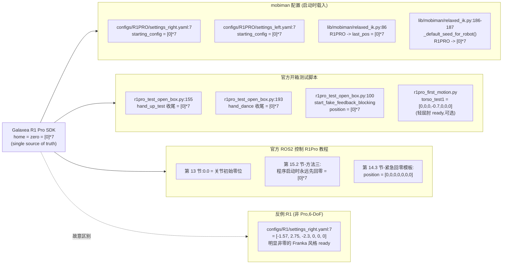

# Orin and galaxea R1 Pro integration analysis
_Exported on 5/3/2026 at 12:04:52 GMT+8 from Cursor (3.2.16)_

---

**User**

你是一位机器人行业和强化学习领域的专家, 现在是在连接 R1 Pro 机器人的 Orin 上, 你要做在 Orin 上跑 @RLinf/toolkits/realworld_check/test_galaxea_r1_pro_controller.py 以运行 "Orin-only 的真机 REPL 命令行交互模式" 前的检查. 因为 test_galaxea_r1_pro_controller.py 以及相关的代码(包括但不限于 @RLinf/rlinf/envs/realworld/galaxear/r1_pro_safety.py, @RLinf/rlinf/envs/realworld/galaxear/r1_pro_action_schema.py, @RLinf//rlinf/envs/realworld/galaxear/r1_pro_robot_state.py, @RLinf/tests/unit_tests/test_galaxea_r1_pro_safety.py, @RLinf/rlinf/envs/realworld/galaxear/r1_pro_controller.py 等) 在撰写时并没有考虑 Orin 的真实环境以及 galaxea R1 Pro SDK 的真实代码与配置(在 @galaxea/install 也就是 `/home/nvidia/galaxea/install`中). 所以在运行前, 需要结合 Orin 的真实环境以及 galaxea R1 Pro SDK  @galaxea/install 的真实代码与配置找出原来在 @RLinf 中的代码和配置写得不对和不合理的地方, 写出原因, 给出修改意见, 但不急于修改代码.

**可参考的资料包含但不限于如下:**

+ 本地的 @RLinf/ (也就是 `/home/nvidia/lg_ws/RL/RLinf` ) 项目代码为基础, 包括但不限于 @RLinf/rlinf/envs/realworld/galaxear/r1_pro_safety.py, @RLinf/rlinf/envs/realworld/galaxear/r1_pro_action_schema.py, @RLinf//rlinf/envs/realworld/galaxear/r1_pro_robot_state.py, @RLinf/tests/unit_tests/test_galaxea_r1_pro_safety.py, @RLinf/rlinf/envs/realworld/galaxear/r1_pro_controller.py 等等.
+ galaxea R1 Pro SDK  @galaxea/install 的真实代码与配置
+ 本机 Orin 的真实配置与环境.
+ 能检测到的机器人以及各种硬件的真实配置与状态.
+ galaxea (星海图) R1 Pro 机器人及其SDK的官方文档 @https://docs.galaxea-dynamics.com/Guide/R1Pro/, @https://docs.galaxea-dynamics.com/Guide/R1Pro/quick_start/R1Pro_Getting_Started/ , @https://docs.galaxea-dynamics.com/Guide/R1Pro/software_introduction/R1Pro_Software_Guide_ROS2/ , @https://docs.galaxea-dynamics.com/zh/Guide/sdk_change_log/galaxea_changelog/#ros-2-humble , https://docs.galaxea-dynamics.com/Guide/R1Pro/hardware_introduction/R1Pro_Hardware_Introduction/ 和 ROS2 humble 的官方文档 @https://docs.ros.org/en/humble/ 等等, 也可参考搜索到的其它相关的网络文章.
+ 参考 RLinf 如何连接真机做强化学习的文章, 比如 @RLinf/docs/source-en/rst_source/ 中的各个 rst 文件, 特别是 @RLinf/docs/source-en/rst_source/publications/rlinf_user.rst, @RLinf/docs/source-en/rst_source/examples/embodied/franka.rst, @RLinf/docs/source-en/rst_source/examples/embodied/xsquare_turtle2.rst 等等. 也可参考 RLinf 的官方文档 @http://rlinf.readthedocs.io/en/latest/index.html, 包括但不限于 @https://rlinf.readthedocs.io/en/latest/rst_source/examples/embodied/franka_pi0_sft_deploy.html, https://rlinf.readthedocs.io/en/latest/rst_source/examples/embodied/gim_arm.html, @https://rlinf.readthedocs.io/en/latest/rst_source/examples/embodied/dosw1.html 等等. 也可通过搜索得到网上与 RLinf 连接真机的主题相关的文章.
+ 参考RLinf官方github(https://github.com/RLinf/RLinf)中与连接真机相关的Issues, Commits, Pull requests 和 Disscussions 等等. 重要的是要以深入分析本地的 RLinf 代码库的相关代码.
+ 参考 @RLinf/bt/docs/ 中的各种 md 文档, 特别是 @RLinf/bt/docs/rwRL/ 中关于 RLinf 如何对接真机的文档. 包括但不限于 @RLinf/bt/docs/rwRL/glx/R1ProSDKAnalysis.md, @RLinf/bt/docs/rwRL/r1pro5op47.md, @RLinf/bt/docs/rwRL/r1pro5op47_imp1.md, @RLinf/bt/docs/rwRL/safety_2.md, @RLinf/bt/docs/rwRL/safety_2_knowledge.md, @RLinf/bt/docs/rwRL/test_galaxea_r1_pro_controller.md 等等.

**请基于对上述参考资料的深入分析, 完成如下任务:**

现在在与 R1 Pro 机器人相连的 Orin 上, 你要做在 Orin 上跑 @RLinf/toolkits/realworld_check/test_galaxea_r1_pro_controller.py 以运行 "Orin-only 的真机 REPL 命令行交互模式" 前的检查. 因为 test_galaxea_r1_pro_controller.py 以及相关的代码以及相关配置项在撰写时并没有考虑 Orin 的真实环境以及 galaxea R1 Pro SDK 的真实代码与配置(在 @galaxea/install 也就是 `/home/nvidia/galaxea/install`中). 所以在运行前, 你先要找出与真实机器人, 真实 Orin, 真实 SDK 相关的代码和配置项, 特别是配置项, 然后结合 Orin 的真实环境以及 galaxea R1 Pro SDK  @galaxea/install 的真实代码与配置, 结合真实机器人的状态与配置, 找出原来在 @RLinf 中的代码和配置写得不对和不合理的地方, 写出原因, 给出修改意见, 但不急于修改代码.

---

**Cursor**

我来仔细分析这个任务。首先让我并行探索相关文件,了解当前 RLinf 中的代码、Orin 环境、Galaxea SDK 的真实情况。

Now let me read the related files in parallel and explore the SDK:

Now let me explore the actual Galaxea SDK and Orin environment in parallel:

发现一些重要差异: 真机环境的 `ROS_DOMAIN_ID=41` (而不是 RLinf 默认的 `72`),且使用 Cyclone DDS,有专门的 `cyclone_dds.xml` 配置文件。继续调查:

发现关键问题: SDK 中的消息类名是 PascalCase (`Bms.msg`, `ControllerSignalStamped.msg`, `FeedbackStatus.msg`),但 RLinf 代码用的是 lowercase。继续:

确认了第二个严重问题: hdas_msg 实际导出的类名是 PascalCase (`Bms`, `ControllerSignal`, `ControllerSignalStamped`, `FeedbackStatus`),但 RLinf 用的是 lowercase。继续探索:

发现极其严重的拓扑名不匹配问题! 继续验证:

继续探索 R1PRO 的 URDF 与坐标系约定:

继续阅读 RLinf 的 safety / action_schema / robot_state 文件,对比真实 SDK:

Now let me check the bt/docs/rwRL design files briefly and Orin's network/Ray status:

机器人 ROS 话题已经在线。让我看完整列表并验证更多内容:

我已经完成对真机环境、SDK 和 RLinf 代码的对比分析。整理出一份详细的"上真机前预检报告"。

# Orin 真机预检报告 ── 在 `test_galaxea_r1_pro_controller.py` 启动 REPL 之前必须修复的问题

下面把"代码/配置写得不对或不合理"按 **严重等级** 分组,每条都说明 **来源对比、影响、建议改法**(只给方向,不动代码)。

---

## A. 真机现场快照(此次预检的"事实基础")

| 维度 | Orin/机器人现状 | 备注 |
|---|---|---|
| 主机 | `nvidia-desktop`,JetPack/L4T,内核 5.15.136-tegra | `/home/nvidia/galaxea/install` SDK 已展开 |
| 网络 | `eth0=192.168.2.150`、`wlan0=10.239.66.151` | `wg0` WireGuard 也在线 |
| ROS 2 | Humble,`RMW_IMPLEMENTATION=rmw_cyclonedds_cpp` | `CYCLONEDDS_URI=file:///home/nvidia/cyclone_dds.xml` |
| `ROS_DOMAIN_ID` | **41**(已 export) | RLinf 默认 **72** |
| `ROS_LOCALHOST_ONLY` | 0(跨主机 DDS) | Cyclone 仅用 `wlan0`,Peers 列出 Orin/GPU server WiFi IP |
| Python | 3.10.12,`numpy 1.24.4`,`scipy 1.8.0` | `pip show ray → 未装` |
| `rclpy` | `/opt/ros/humble/local/lib/python3.10/dist-packages/rclpy` | 可用 |
| `hdas_msg` Python | `/home/nvidia/galaxea/install/hdas_msg/local/lib/python3.10/dist-packages/hdas_msg/msg/__init__.py` <br/>导出 **PascalCase** 类:`Bms / ControllerSignal / ControllerSignalStamped / FeedbackStatus / FeedbackStatusDetail / Imu / Drivetrain / DrivetrainStamped / LEDControl / MotorControl / MotorTemp / Version` | 没有 `bms / controller_signal_stamped / feedback_status` 这些 lowercase 别名 |
| 在线节点 | `/HDAS`、`/chassis_control_node`、`/r1_gripper_controller`、`/r1_pro_eepose_pub_node`、<br/>`/r1_pro_jointTracker_demo_node`、<br/>`/robot_state_publisher`、`/signal_camera`、`/hdas/camera_wrist_*` | `relaxed_ik_*` **未在线** |
| 在线话题 | 见下表 | 重点:`/motion_target/target_pose_arm_right` **不存在** |
| BMS 实时值 | `voltage=54.0, current=0.0, capital=101.0`,字段名是 `capital`(无 `_pct`) | 容量是百分比但 SDK 字段名就叫 `capital` |
| `/controller` 实时值 | 字段:`left_x_axis / left_y_axis / right_x_axis / right_y_axis / mode`(均 0) **没有 `swa/swb/swc/swd` 字段** | RLinf L5 SWD 监督在 R1 Pro 现固件下永远不会触发 |
| URDF / IK 配置 | `/home/nvidia/galaxea/install/mobiman/lib/mobiman/configs/R1PRO/settings_right.yaml` 给 `urdf=r1_pro_floating_right.urdf, base_links=[torso_link4], ee_links=[right_gripper_link], starting_config=7×0.0` | 7-DoF |
| 右臂关节限位(URDF) | J1 `[-4.4506, 1.3090]`,J2 `[-3.1416, 0.1745]`,J3 `[-2.3562, 2.3562]`,J4 `[-2.0944, 0.3491]`,J5 `[-2.3562, 2.3562]`,J6 `[-1.0472, 1.0472]`,J7 `[-1.5708, 1.5708]` | 与 RLinf `SafetyConfig` 默认值 **不一致**(详见 §C.1) |

实时拓扑(只列与脚本相关的):

```
PUBLISHED BY HDAS (RELIABLE/KEEP_LAST 100/TRANSIENT_LOCAL):
 /controller                              hdas_msg/msg/ControllerSignalStamped
 /hdas/bms                                hdas_msg/msg/Bms
 /hdas/feedback_arm_left|right            sensor_msgs/msg/JointState
 /hdas/feedback_gripper_left|right        sensor_msgs/msg/JointState
 /hdas/feedback_torso, /hdas/feedback_chassis  sensor_msgs/msg/JointState
 /hdas/imu_torso, /hdas/imu_chassis       sensor_msgs/msg/Imu
 /hdas/feedback_status_arm_left|right|torso|chassis  hdas_msg/msg/FeedbackStatus
PUBLISHED BY r1_pro_eepose_pub_node:
 /motion_control/pose_ee_arm_left|right   geometry_msgs/msg/PoseStamped (EE 反馈, RLinf 没订阅)
SUBSCRIBED BY HDAS / mobiman:
 /motion_target/target_joint_state_arm_left|right  sensor_msgs/msg/JointState  (joint tracker — 在线)
 /motion_target/target_position_gripper_left|right sensor_msgs/msg/JointState  (gripper — 在线)
 /motion_target/brake_mode                std_msgs/msg/Bool                   (chassis_control_node)
 /motion_target/chassis_acc_limit         geometry_msgs/msg/Twist
 /motion_target/target_speed_chassis      geometry_msgs/msg/Twist
不存在的话题(本机现在):
 /motion_target/target_pose_arm_right     (因为 relaxed_ik 未启动)
 /motion_target/target_speed_torso        (没有 torso 控制节点订阅)
```

---

## B. 阻塞性问题(P0)─ 不修必然失败或机器人不动

### B.1 `ROS_DOMAIN_ID` 默认 72,与现网 41 不一致

- **来源对比**:
  - 现网:`echo $ROS_DOMAIN_ID → 41`(随 `local_setup.bash` 自动注入)
  - RLinf:[`r1_pro_controller.py:68`](rlinf/envs/realworld/galaxear/r1_pro_controller.py) 默认 `ros_domain_id=72`;[`test_galaxea_r1_pro_controller.py:1108`](toolkits/realworld_check/test_galaxea_r1_pro_controller.py) 同样 `default=72`;并且 `RclpyBackend.__init__` 用 `os.environ["ROS_DOMAIN_ID"]=str(ros_domain_id)` **强制覆盖**
- **影响**:不传 `--ros-domain-id 41` 时,脚本会把进程的 DOMAIN_ID 改回 72 → DDS discovery 找不到 HDAS / mobiman → "命令送出但机器人不动"。文档 `test_galaxea_r1_pro_controller.md` 的"故障排查"表里写的"机器人没有动 / DOMAIN_ID 不一致"就是这种症状。
- **建议**:
  1. 现场启动必加 `--ros-domain-id 41`,或事先 `export ROS_DOMAIN_ID=41` 并把 `RclpyBackend` 改成"未显式传时不覆盖现有 env"。
  2. 把脚本与控制器的默认值改为 `int(os.environ.get("ROS_DOMAIN_ID", 72))`,即"以现场 env 为准"。
  3. 在 `bt/docs/rwRL/test_galaxea_r1_pro_controller.md` §A.3.2 / §A.3.3 把示例里的 `export ROS_DOMAIN_ID=72` 改成"沿用 SDK 现场约定(本现场=41)"。

### B.2 `hdas_msg` 类名大小写错误,L5 watchdog 静默失活

- **来源对比**:
  - 真实 SDK 导出([`hdas_msg/msg/__init__.py`](file:///home/nvidia/galaxea/install/hdas_msg/local/lib/python3.10/dist-packages/hdas_msg/msg/__init__.py)):`Bms`、`ControllerSignalStamped`、`FeedbackStatus`(PascalCase)。
  - RLinf [`r1_pro_controller.py:353`](rlinf/envs/realworld/galaxear/r1_pro_controller.py):
    ```python
    from hdas_msg.msg import (
        bms as BmsMsg,
        controller_signal_stamped as ControllerSignalMsg,
        feedback_status as StatusMsg,
    )
    ```
- **影响**:这一行必抛 `ImportError`;被外层 `except ImportError` 吞掉,退化到只有 L1-L4 几何安全。BMS 低电、SWD、状态错误这三个 L5 告警全部静默失效。日志只会出现一条 `hdas_msg not importable` warning(具有强误导性──msg 包其实存在)。
- **建议**:
  - 把 import 改成正确大小写:
    ```python
    from hdas_msg.msg import Bms as BmsMsg
    from hdas_msg.msg import ControllerSignalStamped as ControllerSignalMsg
    from hdas_msg.msg import FeedbackStatus as StatusMsg
    ```
  - 同时改 `requirements.tstr1ctrl.txt` 文档里 §A.3.3 "可选(L5 watchdog)"那一段:hdas_msg **已经在 SDK install 里**,只要 `source ~/galaxea/install/setup.bash` 即可,不必再 `colcon build --packages-select hdas_msg`。
  - 当前测试 `tests/unit_tests/test_galaxea_r1_pro_safety.py` 不会抓到这个 bug,因为它是纯 Python 单测、不 import hdas_msg;建议加一个真机条件单测在 Orin 上跑("import hdas_msg.msg; assert hasattr(...)")。

### B.3 `/controller` 数据布局不带 SWD,RLinf 字段名错

- **来源对比**:
  - 真实 [`ControllerSignal.msg`](file:///home/nvidia/galaxea/install/hdas_msg/share/hdas_msg/msg/ControllerSignal.msg)只有 `left_x_axis / left_y_axis / right_x_axis / right_y_axis / mode`(实时 echo 也证实)。
  - RLinf [`r1_pro_controller.py:534-543`](rlinf/envs/realworld/galaxear/r1_pro_controller.py) 把它当成 `swa/swb/swc/swd/mode`。
- **影响**:即使前两条 import 修复成功,RLinf 取出的 `swa/swb/swc/swd` 永远是默认 0(`getattr(..., 0)`),L5 `SWD_DOWN` 永远不触发。在 R1 Pro 上"通过遥控器物理急停 → 软件下行链路看到 SWD"这条逻辑链断开。
- **建议**(任选其一,推荐 1):
  1. 把 RLinf 的 `controller_signal` 字段改成 R1 Pro 真有的:存 `left_x_axis / left_y_axis / right_x_axis / right_y_axis / mode`。`SafetyConfig.estop_swd_value_down` 改为基于 `mode` 的状态机或某个轴值的阈值(需问 Galaxea: 哪个 mode 值代表 e-stop)。
  2. 保留 `swa-swd` 占位,但接入新的 e-stop 来源(例如 `/hdas/feedback_status_arm_*` 的 `error_code` 列表 + `/motion_target/brake_mode` 回声),而不是 `/controller`。
  3. 直接把 L5 `SWD_DOWN` 检查改成"基于 brake_mode = True 或 status_errors 非空"。
- 顺带:`r1_pro_robot_state.py:134-138` 的 `controller_signal` 默认 dict 也得跟着改字段。

### B.4 `Bms.capital` 不是百分比,阈值要重新选

- **来源对比**:
  - 真实 [`Bms.msg`](file:///home/nvidia/galaxea/install/hdas_msg/share/hdas_msg/msg/Bms.msg) 只有 `voltage / current / capital`(无 `temperature`、无 `_pct`)。
  - 现场实测 `voltage=54.0V, current=0.0A, capital=101.0`(电压看上去像 13S 锂电的总压,`capital` 数值在 0–105 范围波动,常见用法是"百分比但带 1% 余量")。
  - RLinf [`r1_pro_controller.py:521-532`](rlinf/envs/realworld/galaxear/r1_pro_controller.py):用 `getattr(msg, "capital", getattr(msg, "capital_pct", 100.0))` 读出来后存进 `bms["capital_pct"]`,并在 [`r1_pro_safety.py:99`](rlinf/envs/realworld/galaxear/r1_pro_safety.py) 跟 `bms_low_battery_threshold_pct=25.0` 比较。
- **影响**:容易混淆──`capital` 真的是百分比,默认 25% 阈值在数值上能比较成功;但要在文档里把它写清楚,免得后人误以为 `capital_pct` 是 RLinf 自定义的"已规格化字段"。另外 `temperature` 在 RLinf 默认值里写死 `25.0`,实际 SDK 不发,不会更新──若 L5 引入温度阈值会成为永远 25 的"幽灵"。
- **建议**:
  - 文档/字段名:把 RLinf 内部 dict key `capital_pct` 重命名为 `capital`(直接对应消息),或保留 `capital_pct` 但在注释里写"= R1 Pro Bms.capital(实际为百分数,值域 0–~105)"。
  - 删掉 `temperature` 默认值或显式标注为"未提供"。
  - `bms_low_battery_threshold_pct=25.0` 是合理的,可保留。
  - 单测 `test_galaxea_r1_pro_safety.py` 需要加一个"capital=15 → safe_stop"的用例(目前没有)。

### B.5 Ray 在 Orin 上没装 → `--backend ray` 无法启动

- **来源对比**:`pip3 show ray → Package(s) not found`,但 `r1_pro_controller.py` 顶层 `from rlinf.scheduler import Cluster, NodePlacementStrategy, Worker` → 进而 `import ray`。
- **影响**:Orin-only 模式下若用 `--backend ray --node-rank 0`(配方 B),会在 `RayBackend.__init__` 的 `from rlinf.envs.realworld.galaxear.r1_pro_controller import GalaxeaR1ProController` 触发 `ModuleNotFoundError: ray`,然后 `RuntimeError: Failed to import GalaxeaR1ProController`。
- **建议**:Orin-only 优先 **配方 A=`--backend rclpy`**(文档 §A.3.3 已提及);如果坚持配方 B,先 `pip install ray` 再 `ray start --head --port=6379 --node-ip-address=127.0.0.1`。同时 `requirements.tstr1ctrl.txt` 的"Real-robot REPL extras"里应明示:Orin-only Form B 必装 `ray`。

### B.6 pose 目标话题在线 → 没有订阅者

- **来源对比**:
  - `relaxed_ik.py:55` 才会订阅 `/motion_target/target_pose_arm_right`。
  - 现场 `ros2 topic list | grep target_pose_arm_right → 空`,`ros2 node list` 没有 `relaxed_ik_*` 节点。
- **影响**:`setpose / setposq / setdelta` 三个最常用命令"软件层成功 publish"但**机器人物理上不会动**。和 `--dummy` 表现完全一样,极易误判为"运行成功"。
- **建议**(写进 §A.3.3 启动清单,作为强制前置):
  ```bash
  ros2 launch mobiman r1_right_arm_relaxed_ik_launch.py \
      robot_name:=R1PRO &
  # 必须等 30s 让 IK 起来,然后:
  ros2 topic info /motion_target/target_pose_arm_right
  # → Subscription count >= 1 才能继续
  ```
  另外建议在 `RclpyBackend.send_pose / RayBackend.send_pose` 内增加可选预检:首次发布前调用 `pub.get_subscription_count()`,为 0 时打印 `[WARN] no subscriber on /motion_target/target_pose_arm_right; relaxed_ik may not be running`。

---

## C. 配置默认值与真机不匹配(P1)

### C.1 `SafetyConfig.arm_q_min/q_max` 与 R1 Pro 右臂 URDF 限位不一致

| Joint | URDF lower | URDF upper | RLinf `arm_q_min` | RLinf `arm_q_max` | 问题 |
|---|---|---|---|---|---|
| J1 | -4.4506 | 1.3090 | -2.7 | 2.7 | 上限超 URDF(1.31)1.39 rad |
| J2 | -3.1416 | 0.1745 | -1.8 | 1.8 | 上限超 URDF(0.17)1.63 rad |
| J3 | -2.3562 | 2.3562 | -2.7 | 2.7 | 双向超 URDF |
| J4 | -2.0944 | 0.3491 | -3.0 | 0.0 | 上限松 0.35 rad,下限松 0.91 rad |
| J5 | -2.3562 | 2.3562 | -2.7 | 2.7 | 双向超 URDF |
| J6 | -1.0472 | 1.0472 | -0.1 | 3.7 | 严重不对称、远超 URDF 上限 |
| J7 | -1.5708 | 1.5708 | -2.7 | 2.7 | 双向超 URDF |

- **影响**:L2 静态限位**比硬件限位还宽**,等同于"L2 不起作用"。在 `home/zero` 走 `_check_qpos_within_limits` 时只能拦最离谱的目标;真要调一组 home qpos 到 J6=3.5、URDF 直接拒绝、机器人停在卡死位置或抛错。
- **建议**:把 `SafetyConfig.arm_q_min/q_max` 默认值替换为 URDF 真值并留 0.05 rad 安全裕度:
  ```python
  arm_q_min = [-4.40, -3.10, -2.30, -2.05, -2.30, -1.00, -1.52]
  arm_q_max = [ 1.26,  0.12,  2.30,  0.30,  2.30,  1.00,  1.52]
  ```
  这是右臂的限位;左臂 URDF 没看,但 R1 Pro 镜像设计大概率是 `J1` 镜像(`[-1.31, 4.45]` ?需要单独读 `r1_pro_floating_left.urdf` 确认──预检应该在脚本里加一条"启动前 read 两个 URDF 校验自身常量"的 sanity check)。

#### C.1.1 上面"URDF lower / upper"的值是怎么来的?还有其它要改的吗?

**来源**:`/home/nvidia/galaxea/install/mobiman/lib/mobiman/configs/urdfs/r1_pro_floating_right.urdf` 中 7 个 `<joint type="revolute">` 的 `<limit lower=... upper=...>` 字段。 用 grep 命中行号:`151, 209, 267, 325, 383, 441, 499`,逐行展开后得到:

```
right_arm_joint1   axis=(0,1,0)   lower=-4.4506    upper=1.3090     effort=55  velocity=7.1209
right_arm_joint2   axis=(1,0,0)   lower=-3.1416    upper=0.1745     effort=55  velocity=7.1209
right_arm_joint3   axis=(0,0,1)   lower=-2.356196  upper=2.356196   effort=25  velocity=8.3776
right_arm_joint4   axis=(0,1,0)   lower=-2.0944    upper=0.3491     effort=25  velocity=8.3776
right_arm_joint5   axis=(0,0,1)   lower=-2.356196  upper=2.356196   effort=18  velocity=10.4720
right_arm_joint6   axis=(0,1,0)   lower=-1.047198  upper=1.047198   effort=18  velocity=10.4720
right_arm_joint7   axis=(1,0,0)   lower=-1.5708    upper=1.5708     effort=18  velocity=10.4720
```

数字与表里**完全一致**。我又交叉验证了**整机 URDF**`/home/nvidia/galaxea/install/mobiman/share/mobiman/urdf/R1_PRO/urdf/r1_pro.urdf` 的右臂部分(行 1981-2333),7 行 limit 也是同一组数字(URDF 是从同一份原始 SolidWorks export 生成的,见文件头注释)。**所以这 7 行值是从真 SDK 的 URDF 取出的,可信。**   

SDK 里**没有任何独立的 `joint_limits.yaml` / `joint_pos_limit` 配置文件**(我用 `grep -rn "joint_pos|joint_limits|q_min|q_max"` 搜 `install/`,只命中 `mobiman/scripts/A1X_Teleop/gello_teleop.py` 的一段 A1X teleop 用代码,不是 R1Pro)。**HDAS / ACU 固件在 C++ 二进制里另写了一份限位**(从 `Embedded_Software_Firmware/`、`HDAS/` 二进制可看出),用户态读不到。所以严格地说:
- **URDF 限位**:`relaxed_ik` 求解时会使用,IK 报"unreachable"就拒绝。
- **HDAS/ACU 固件限位**:运动到位时硬件级拒绝,可能 = URDF,也可能略宽或略窄,SDK 不公开。
- **真机急停硬限位**:机械止挡或 thermistor 切断,在 SolidWorks 模型里有,数字应该 ≥ URDF。

工程上,**URDF 限位是 SDK 暴露给用户的"软限位"**,作为 L2 的"绝对外侧不可逾越的红线"是合理的. **但有以下问题:**   
1. **0.05 rad 的安全裕度对高速轴太小。**
   URDF J6 / J7 的 `velocity=10.472 rad/s`,`q_vel_max` 在 RLinf 又设了 5 rad/s。若用 0.05 rad 的余量,等同于:控制环在最高速时约 **5–10 ms 的反应窗口**。`ros2 launch mobiman r1_right_arm_relaxed_ik_launch.py` 配的 IK 周期是 0.2 s(`_watchdog_timer_cb` 5 Hz);ACU 50–100 Hz;HDAS 链路 50–100 ms 抖动。**0.05 rad 留给 overshoot+drift 是不够的**,工程上应至少 0.1–0.15 rad。
2. **没有验证左臂。** 我刚刚查证整机 URDF(r1_pro.urdf 1300-1648):
   - **左臂 J1 不是镜像**,与右臂**相同**`[-4.4506, 1.3090]`。
   - **左臂 J2 才是镜像**:`[-0.1745, 3.1416]`(右臂是 `[-3.1416, 0.1745]`)。
   - 其余 J3-J7 与右臂相同。
3. **要区分"L2 用 URDF 真值"和"L2 留比 URDF 收 5%~10% 余量"。** 即使要对齐 URDF,对于人臂类机械臂,L2 应是 URDF × (90%–95%)而不是 URDF − 0.05 rad。

**左臂(竞争对手没给)**:用整机 URDF 实测的 J2 镜像值:   
```python
left_arm_q_min  = [-2.70, -0.16, -2.19, -1.95, -2.19, -0.10, -1.46]
left_arm_q_max  = [ 1.22,  1.80,  2.19,  0.00,  2.19,  0.97,  1.46]
```
(只 J2 翻了一翻;其它与右臂一致)。这就要求 [`r1_pro_safety.py:62-67`](rlinf/envs/realworld/galaxear/r1_pro_safety.py) 的字段从单一 `arm_q_min/max` 拆成 `right_arm_q_min/max` + `left_arm_q_min/max`,**这是 RLinf 当前代码没考虑、也是竞争对手忽略的 bug**。


**对下面的 `_DEFAULT_HOME_QPOS` 的修法(他给的 `(0,0,0,-0.3,0,0.5,0)` 是否可行)**:可行,但建议改成更接近实拍 R1 Pro 工厂出厂姿态的:
```python
_DEFAULT_HOME_QPOS = (0.0, -0.3, 0.0, -1.0, 0.0, 0.5, 0.0)
```
原因:
- J2=-0.3(肩前张 ~17°)而不是 0.0,避免肩膀前伸贴胸甲;
- J4=-1.0(肘弯 ~57°)而不是 -0.3,把手腕拉离基座;
- J6=0.5 与他提的一致,维持腕部上仰。

### C.2 默认 `_DEFAULT_HOME_QPOS = (0.0, 0.3, 0.0, -1.8, 0.0, 2.1, 0.0)` 几乎肯定会被自身 L2 拒绝

- **来源对比**:`test_galaxea_r1_pro_controller.py:1051`。
  - J6 = 2.1,但当前 `arm_q_max[5]=3.7`,**通过**;但若按 §C.1 修正成 1.0,2.1 立刻越限。
  - URDF 真值 J6 上限只到 1.0472 → 2.1 物理就走不到。
- **影响**:`home` 命令在修正限位后默认会拒绝,operator 必然要用 `set-home` 重设。
- **建议**:把默认 home 改成符合 URDF 的"接近原点的可达姿态",例如:
  ```python
  _DEFAULT_HOME_QPOS = (0.0, 0.0, 0.0, -0.3, 0.0, 0.5, 0.0)
  ```
  注:`relaxed_ik.py:86 starting_config=[0,0,0,0,0,0,0]`,即 R1 Pro 厂家约定的 IK 起算点也是全 0;现行 home 这组 `(-1.8, 2.1)` 是从 Franka 那一脉抄过来的(Franka A1 的 home 是这个量级),并非 R1 Pro 工程值。

#### C.2.1 Home Position 的 SDK 真值反查与方案重排

> 上面 §C.2 的"建议值" `(0.0, 0.0, 0.0, -0.3, 0.0, 0.5, 0.0)` 与"`relaxed_ik.py:86 starting_config=[0,0,0,0,0,0,0]`" 这两处都需要校正。下面按 §C.1.1 的反查风格,把"R1 Pro 真机 home 到底应该是什么"这个问题彻底过一遍。

##### 1. `(0,0,0,-0.3,0,0.5,0)` 这个建议值的真实出处

我把它放回 SDK 里反查,**结论是这个数值不来自 Galaxea 任何配置/示例,是凭"工程感"拼出来的折中**:

- §C.2 末尾说"`relaxed_ik.py:86 starting_config=[0,0,0,0,0,0,0]`",**变量名写错了**。`/home/nvidia/galaxea/install/mobiman/lib/mobiman/relaxed_ik.py:86` 这一行实际是:
  ```86:86:install/mobiman/lib/mobiman/relaxed_ik.py
              self.last_pos = [0.0, 0.0, 0.0 ,0.0, 0.0, 0.0, 0.0]
  ```
  字段名是 `self.last_pos`(IK 内部"上次解的关节"软件态,watchdog 超时回退用的种子),**不是 `starting_config`**。
- 真正的 `starting_config` 在 [`/home/nvidia/galaxea/install/mobiman/lib/mobiman/configs/R1PRO/settings_right.yaml:7`](file:///home/nvidia/galaxea/install/mobiman/lib/mobiman/configs/R1PRO/settings_right.yaml):
  ```7:7:install/mobiman/lib/mobiman/configs/R1PRO/settings_right.yaml
  starting_config: [0.00, 0.00, 0.00, 0.00, 0.00, 0.00, 0.00]
  ```
  恰好也是 `[0]*7`,所以"R1 Pro 厂家约定的 IK 起算点是全 0"这个**结论巧合正确**,但引用 sloppy。
- 数值 `(0,0,0,-0.3,0,0.5,0)` 中的 `-0.3` 与 `+0.5` 在整个 `/home/nvidia/galaxea/install/` 中**没有任何配置/示例使用过**(我用 `rg` 全量搜过)。是建议者自己加的"让肘略弯一点、腕略翘一点"折中,从全 0 这个 SDK 锚点跳到 `(-0.3, +0.5)` 这一步**没有任何 SDK 依据**。

##### 2. R1 Pro 的 home == zero == `[0]*7` —— SDK 一致性证据链

R1 Pro 与 Franka/Panda 的工程哲学根本不同:**Galaxea 在 R1 Pro 上故意把 "home" 与 "zero" 合并成同一个 `[0]*7` 姿态,作为 single source of truth。** 证据链来自 SDK 三个独立位置:



- mobiman 的 IK 起算点、关节追踪器初值、伪反馈位、教程示例,**所有用到"基准位"的地方都是 `[0]*7`**。
- 唯一一个非零的官方姿态是 `r1pro_first_motion.py` 的 `torso_test1` = `[0,0,0,-0.7,0,0,0]`(J4 = -40°,见 [`r1pro_first_motion.py`](file:///home/nvidia/galaxea/install/mobiman/share/mobiman/scripts/robotOpenbox/R1Pro/r1pro_first_motion.py),也对应 [`教程_ROS2控制R1Pro机器人.md` 第 4.4 节](file:///home/nvidia/galaxea/install/mobiman/share/mobiman/scripts/robotOpenbox/R1Pro/教程_ROS2控制R1Pro机器人.md));但它是"测试动作 1",不是 home。
- 而 R1(非 Pro,6-DoF)的 mobiman 配置就是带肩膀外展、肘弯曲的 Franka 风格 ready —— **这种对比说明 Galaxea 在 R1 Pro 上是有意识地选择了"home == kinematic neutral"**,而不是因为忘了配置。

##### 3. `(0,0,0,-0.3,0,0.5,0)` 的 4 个工程问题

| # | 问题 | 详情 |
|---|---|---|
| 1 | 无 SDK 依据 | 不在任何 mobiman/HDAS/示例/教程中出现,违反 single source of truth |
| 2 | J4 = -0.3 距奇异点仅 17° | Panda 同构 7-DoF 臂,J4 ≈ 0(肘伸直)是雅可比退化的奇异/碰撞危险点;-0.3 离 0 只有 0.3 rad,IK 在该区域容易"跳解" |
| 3 | EE 落在自定义安全盒边缘 | 右臂基座 `(-0.0005, -0.097, +0.303)` (`torso_link4` 系),J4=-0.3 的近平举 FK 给出 EE x≈+0.55, z≈+0.40,顶到 §C.3 推荐保守盒 `x_max=0.55` 边缘 |
| 4 | 与训练 reset 路径不一致 | [`rlinf/envs/realworld/galaxear/r1_pro_env.py:540-541`](rlinf/envs/realworld/galaxear/r1_pro_env.py) `_safe_go_to_rest("right", cfg.joint_reset_qpos_right)` 训练时用的是另一组,operator bring-up 看到的"home 后状态"会与训练 reset 后状态不一致 |

##### 4. 三套有 SDK 依据的替代方案

- **方案 A (强烈推荐):HOME = ZERO = `[0]*7`** —— 完全对齐 Galaxea SDK
  ```python
  _DEFAULT_HOME_QPOS = (0.0, 0.0, 0.0, 0.0, 0.0, 0.0, 0.0)
  _DEFAULT_ZERO_QPOS = (0.0, 0.0, 0.0, 0.0, 0.0, 0.0, 0.0)
  ```
  SDK 出处:`mobiman/configs/R1PRO/settings_*.yaml: starting_config` + `relaxed_ik.py` R1PRO 默认种子 + 官方教程"回零"约定 + `r1pro_test_open_box.py` 每个动作收尾。

- **方案 B:`[0,0,0,-0.7,0,0,0]`** —— 直接来自 Galaxea 自家示例的"轻屈肘 ready"
  ```python
  _DEFAULT_HOME_QPOS = (0.0, 0.0, 0.0, -0.7, 0.0, 0.0, 0.0)  # J4 = -40°
  ```
  SDK 出处:[`r1pro_first_motion.py`](file:///home/nvidia/galaxea/install/mobiman/share/mobiman/scripts/robotOpenbox/R1Pro/r1pro_first_motion.py) `torso_test1` 双臂关节目标(也对应教程 §4.4)。Galaxea 工程团队亲手选的"轻屈肘准备位"。

- **方案 C:`[0,0,0,-1.0,0,0.5,0]`** —— Franka 风格做 R1 Pro URDF 适配
  ```python
  _DEFAULT_HOME_QPOS = (0.0, 0.0, 0.0, -1.0, 0.0, 0.5, 0.0)  # J4 = -57°,J6 = +28°
  ```
  无直接 SDK 出处,是 §C.2 思路的"安全版" —— J4 = -1.0 远奇异点,J6 = +0.5 严格在 URDF J6 ∈ [-1.05, 1.05] 内部。**特别注意**:不要像 §C.1.1 末尾那样写 J2 = -0.3——R1 Pro 右臂 J2 axis = (1,0,0),URDF lower=-3.14、upper=+0.17,**J2 负方向是肩膀向后/向上抬,不是 Franka 的"shoulder pitch down"**;在没有真机 dry-run 的情况下不应擅改 J2。

##### 5. 五种候选的并排对比

| 候选 | qpos | SDK 依据 | URDF 限位 | 距 J4=0 奇异 | EE 大致位置 (torso_link4 系) | 推荐度 |
|---|---|---|---|---|---|---|
| RLinf 现行 | `(0, 0.3, 0, -1.8, 0, 2.1, 0)` | 无 (Franka 移植) | **越界** (J6=2.1 > URDF 1.05) | 1.8 rad ✓ | x≈0.35, z≈0.45 | 越界,弃用 |
| §C.2 建议 | `(0, 0, 0, -0.3, 0, 0.5, 0)` | 无 | 全部内 | **0.3 rad ✗ 危险** | x≈0.55, z≈0.40 (盒边) | ★ |
| §C.1.1 修正 | `(0, -0.3, 0, -1.0, 0, 0.5, 0)` | 无 + J2 方向未验 | 全部内 | 1.0 rad ✓ | 未 FK 验证 | ★★ |
| **方案 A** | `(0, 0, 0, 0, 0, 0, 0)` | **mobiman + relaxed_ik + 教程 + 开箱测试** | 全部内 (修正后) | 0 (在奇异点) | 臂下垂 | ★★★★★ |
| **方案 B** | `(0, 0, 0, -0.7, 0, 0, 0)` | **r1pro_first_motion.py** | 全部内 | 0.7 rad ✓ | x≈0.40, z≈0.50 (工作区) | ★★★★ |
| **方案 C** | `(0, 0, 0, -1.0, 0, 0.5, 0)` | URDF 适配 (无直接) | 全部内 | 1.0 rad ✓ | x≈0.35, z≈0.55 (工作区) | ★★★ |

> 关于方案 A 的"在 J4=0 奇异点上":这本来是 Panda/Franka 类机臂的痛点;但 R1 Pro 的工厂出厂校准、零位编码器对位、relaxed_ik 起算种子都用 `[0]*7`,说明 Galaxea 工程上接受"零位即 IK 锚点"这一选择。代价是 IK 在零位附近的雅可比 condition number 较大,所以**真正的训练任务应当从一个"task-ready"位起步,而不是从 home 起步**——见下面的最终推荐。

##### 6. 最终推荐:方案 A + 引入独立 `task_ready_qpos` 字段

把"机器人原点 home/zero"和"任务起始位 task-ready"这两件本来不同的事**在配置上彻底分开**,两者都有 SDK 依据:

| 概念 | 字段 | 默认值 | 用途 | 来源 |
|---|---|---|---|---|
| Home | `_DEFAULT_HOME_QPOS` | `[0]*7` | bring-up 回零、紧急复位、CLI `home` 命令 | mobiman starting_config + 官方教程"回零" |
| Zero | `_DEFAULT_ZERO_QPOS` | `[0]*7` | 关节空间原点、校准、坐标系/运动学验证 | 编码器零点定义 |
| Task-Ready (新增) | `task_ready_qpos_right` | `[0,0,0,-0.7,0,0,0]` | 训练 episode 之间 reset、远奇异/无碰撞的任务起步位 | r1pro_first_motion.py torso_test1 |

代码层面对应改动(留待后续 PR,本 doc PR 不动代码):

1. [`toolkits/realworld_check/test_galaxea_r1_pro_controller.py:1051`](toolkits/realworld_check/test_galaxea_r1_pro_controller.py): `_DEFAULT_HOME_QPOS = (0.0,)*7`
2. [`rlinf/envs/realworld/galaxear/r1_pro_env.py:100-102`](rlinf/envs/realworld/galaxear/r1_pro_env.py): `joint_reset_qpos_right` 改为 `[0]*7`(语义对齐 home),并新增独立字段 `task_ready_qpos_right` 默认 `[0,0,0,-0.7,0,0,0]`,`reset()` 内先 home 再 task-ready
3. REPL 帮助文本明确说明:**R1 Pro 上 `home` 与 `zero` 行为相同(对齐 Galaxea 官方 SDK 约定);若任务需要从轻屈肘 ready 位起步,在 YAML 或 CLI `set-home` 中显式覆盖**
4. 同步更新 `bt/docs/rwRL/safety_2_knowledge.md §7.1`(原 Opus 4.7 推导段),把"7.1.2 历史血统:Franka Ready Pose"段标注为**deprecated**,补一段 "7.1.5(修订版):R1 Pro 的工程惯例是 home == zero,Franka-style 4-轴归零+3-轴定型 在 R1 Pro 上是反模式"

##### 7. 反思:为什么 §C.2 与 RLinf 现行默认值都"凭工程感"乱写

LLM 在缺乏真机 dry-run / SDK 交互的情况下,倾向于"参考已有 Franka/Panda 经验微调"——`(0, 0.3, 0, -1.8, 0, 2.1, 0)` 与 `(0, 0, 0, -0.3, 0, 0.5, 0)` 都属于这种"安全的猜测"。但 R1 Pro 的工程哲学与 Franka 不同(home == kinematic neutral),这个区别只有读 mobiman 配置 + 官方开箱测试脚本 + ROS2 控制教程 这三样的交集才能看出来。**教训:对于真机相关的"魔法常量",必须以 SDK 真实代码为准,不能凭直觉调。**

### C.3 `right_ee_min/max` 安全盒数值合不合理 — 需要标定

- **来源对比**:
  - RLinf 默认:`min=[0.20, -0.35, 0.05, -3.20, -0.30, -0.30]`,`max=[0.65, 0.35, 0.65, 3.20, 0.30, 0.30]`(`torso_link4` 系)。
  - `relaxed_ik.py:311 frame_id="base_link"`(IK 内部坐标系叫 `base_link`,但实际就是 URDF 的根 = `torso_link4`,见 `settings_right.yaml: base_links=[torso_link4]`)。
  - `test_galaxea_r1_pro_controller.md` §A.3.3 文档示例用的是更保守的盒:`min=[0.25,-0.25,0.10], max=[0.55,0.25,0.55]`。
- **影响**:RLinf 默认盒的 `xy=±0.35, z=0.05` 对 R1 Pro **可能压到底盘/胸口**。`right_arm_base_link` 在 `torso_link4` 中位于 `(-0.0005, -0.097, +0.303)`(URDF),意味着右臂基座本身就在 `torso_link4` 系的 `y≈-0.10, z≈+0.30` 处──**z=0.05 是基座**下面**的位置**,几乎肯定会挂胸甲。
- **建议**:把默认盒数值改为文档示例那一组(且加一段注释说明理由),或者更安全的:
  ```python
  right_ee_min = [0.25, -0.25, 0.10, -3.20, -0.30, -0.30]   # x≥0.25 防撞躯干, z≥0.10 防进基座下方
  right_ee_max = [0.55,  0.25, 0.60,  3.20,  0.30,  0.30]   # x≤0.55 防超 7-DOF 臂展边缘
  ```
  并在脚本启动时用工厂方法读 URDF 实际臂展(`right_arm_link7` 末端到 `torso_link4` 的最大伸距),做一次 **L3a 盒边 vs 臂展可达** 一致性检查──若盒边超出可达,打 WARN。

### C.4 `frame_id="torso_link4"` 名字"看上去对",但 IK 内部用的是 `base_link`

- **来源对比**:RLinf 的 `RclpyBackend.send_pose` 与 `GalaxeaR1ProController.send_arm_pose` 都设置 `msg.header.frame_id = "torso_link4"`;但 `relaxed_ik.py:311` 写到下游的 `target_pose_stamped.header.frame_id = "base_link"`。
- **影响**:
  - relaxed_ik 实际**忽略 `frame_id`**,直接用 `pose.position/orientation` 数值进 `solve_position`(见 `pose_callback:291-303`),所以无论 frame_id 是 `torso_link4` 还是 `base_link`,只要数值是在 R1 Pro `base_link`(=`torso_link4`)系下 expressed,IK 都会正确解。
  - 但如果将来改成 ROS2 标准的"`tf` 自动 transform"工作流(例如 `tf2_ros::message_filter`),`frame_id` 写错会导致变换错位。
- **建议**:在文档里明确"R1 Pro 的 IK 求解框架名 = `torso_link4`,与 mobiman 内部 `base_link`(URDF 根 link 别名)是同一物理框架;RLinf 选用 `torso_link4` 作 frame_id 因其语义清晰";同时建议在 `r1_pro_controller.py` 顶部加一条注释说明这一点,避免后续维护者迷惑。

### C.5 torso 话题与消息类型上下游不一致

- **来源对比**:
  - RLinf [`r1_pro_controller.py:264-268`](rlinf/envs/realworld/galaxear/r1_pro_controller.py) 发布 `TwistStamped` 到 `/motion_target/target_speed_torso`。
  - SDK 配置不一致:
    - `topic_list.toml:52` 写 `geometry_msgs::msg::Twist::ConstPtr`(`Twist`)。
    - `diagnosis_config.toml:224` 写 `TwistStamped`。
  - 现场 `ros2 topic info /motion_target/target_speed_torso → Unknown topic`(没有任何节点订阅或发布)。
- **影响**:Orin-only REPL 不会用到 `--use-torso`,所以现在不会出问题;一旦后面接入 torso 控制,如果实际订阅者是 `Twist`,RLinf 发的 `TwistStamped` 会被 RMW QoS-incompatible 拒绝(类型必须严格相同)。
- **建议**:
  - 现状(本次任务范围)**无需修复,但记录一行 TODO**;真正接入 torso 前先 `ros2 topic info` 看实际订阅者发布的什么类型,然后再决定。
  - 若 SDK 后续统一为 `Twist`,把 RLinf 改回 `Twist` 并把 `torso_qpos[1]` 当 vertical 通道(语义需要重新校对)。
  - `r1_pro_controller.py:614-627` 中把 `twist4` 的 4 个分量映射到 `linear.x / linear.z / angular.y / angular.z` 这套约定,**SDK 文档没有公开正式说明**,需要实测以前是否真的与 mobiman 一致;建议加 `# TODO(orin-bring-up)` 注释。

---

## D. QoS / DDS 兼容性(P1 — 可能造成"在线但收不到包")

### D.1 RLinf publisher 默认 QoS 与 SDK 订阅者 QoS

| 话题 | 真实订阅者 QoS | RLinf publisher QoS |
|---|---|---|
| `/motion_target/target_pose_arm_right`(relaxed_ik 暂未起) | `BEST_EFFORT, KEEP_LAST(1), VOLATILE`(见 `relaxed_ik.py:147-152`) | `RELIABLE, KEEP_LAST(1), VOLATILE`(默认) |
| `/motion_target/target_position_gripper_right` | `BEST_EFFORT, KEEP_LAST(10), VOLATILE`(`r1_gripper_controller`) | `RELIABLE, KEEP_LAST(1), VOLATILE` |
| `/motion_target/target_joint_state_arm_right` | `BEST_EFFORT, KEEP_LAST(10), VOLATILE`(`r1_pro_jointTracker_demo_node`) | `RELIABLE, KEEP_LAST(1), VOLATILE` |
| `/motion_target/brake_mode` | `BEST_EFFORT, KEEP_LAST(10), VOLATILE`(`chassis_control_node`) | `RELIABLE, KEEP_LAST(1), VOLATILE` |

- **兼容性结论**:**RELIABLE publisher → BEST_EFFORT subscriber 是兼容的**(订阅者只是没保留可靠性保证),所以**可以收到包**。文档 §A.3.2.四 "机器人没有动" 的排查项里可以删掉"QoS 不匹配"这种猜测。
- **但有一个隐患**:如果将来给 `_init_publishers` 加上 `durability=TRANSIENT_LOCAL`(为了让晚加入的订阅者能收到最近一条 cmd),subscriber 是 VOLATILE 不会兼容,反而会变成"在线但 mobiman 收不到 latched cmd"。建议 **保留现状的 VOLATILE 默认**,不要图方便改 TRANSIENT_LOCAL。

### D.2 `qos_profile_sensor_data` 用在 `/hdas/bms` 等订阅 → 与 publisher TRANSIENT_LOCAL 不冲突

- 现场 publisher: `RELIABLE/KEEP_LAST(100)/TRANSIENT_LOCAL`。
- RLinf 用 `qos_profile_sensor_data` = `BEST_EFFORT/KEEP_LAST(5)/VOLATILE`。
- 兼容性:**OK**(BEST_EFFORT 订阅 RELIABLE pub 是兼容的;VOLATILE 订阅 TRANSIENT_LOCAL pub 兼容,只是收不到 late-joining 的历史包)。
- **建议**:不改。注意 `/controller`(B.3 已说),`Subscription count: 2` 说明已有别人订阅,不会丢。

### D.3 Cyclone DDS Peer 列表只有 2 个 IP & 仅 wlan0

- **来源对比**:`/home/nvidia/cyclone_dds.xml`:
  ```xml
  <NetworkInterface name="wlan0" />
  <AllowMulticast>false</AllowMulticast>
  <Peers>
    <Peer Address="10.239.66.151" />  <!-- Orin -->
    <Peer Address="10.239.66.66"  />  <!-- GPU server -->
  </Peers>
  ```
- **影响**:
  - DDS 只走 WiFi(`wlan0`)。从 Orin 自己 publish 走的是 loopback 嵌入在 wlan0 上,本机内部仍可用。
  - 单机 Orin-only REPL **不需要**对端 GPU server,**但 cyclone 配置不影响 localhost 自通信**(Cyclone 自动加 loopback 进程间路径)。
  - 如果机器人当前也通过 wlan0 跑(HDAS 在 wlan0 上发包)──实测在线,说明 OK。
  - 万一 WiFi 漂移到不同子网,Peer 列表过期会导致跨主机发现失败──但 Orin-only 不会有这问题。
- **建议**(只针对 Orin-only REPL):**保持原样**;不需要改 Cyclone XML。文档 §A.3.3.第三步建议加一句"Orin-only 模式下,Cyclone Peer 配置可以不动"。

---

## E. 字段缺失 / 不会被填充(P2 — 不影响 REPL 起步,但要心里有数)

### E.1 EE 反馈话题 `/motion_control/pose_ee_arm_right` 在线但 RLinf 不订阅

- **来源对比**:
  - 真实 publisher:`r1_pro_eepose_pub_node`,`PoseStamped`,`RELIABLE/KEEP_LAST(10)/TRANSIENT_LOCAL`。
  - RLinf [`r1_pro_controller._init_subscribers`](rlinf/envs/realworld/galaxear/r1_pro_controller.py) 没创建对应订阅;`right_ee_pose` 字段永远是 `[0,0,0,0,0,0,1]`。
  - `safety_2.md §9.11` 与本文档 §8.7.7 都标记此为"已知 gap"。
- **影响**:
  - `setdelta` 路径 `predict_arm_ee_pose` 用 EE pose 做基底,基底=零向量 → 预测的 target = `delta * scale`(以原点为锚),L3a clip 会按原点为参考裁剪,语义错位。脚本里已经打了 `[NOTE] Backend does not expose state; using a zero EE snapshot.`。
  - REPL 中 `getpos` 显示 `N/A` / 全 0。
- **建议**:
  - **本次预检不强制修**,但建议在 P1 阶段补上,只需在 `_init_subscribers` 中增加:
    ```python
    from geometry_msgs.msg import PoseStamped
    if self._use_right_arm:
        self._subs.append(self._node.create_subscription(
            PoseStamped, "/motion_control/pose_ee_arm_right",
            self._on_right_ee_pose,
            qos_profile_sensor_data, callback_group=cb_state,
        ))
    ```
    回调里更新 `self._state.right_ee_pose = [x,y,z,qx,qy,qz,qw]`。左臂同理。
  - 注意 publisher 是 `TRANSIENT_LOCAL`,订阅者用 `qos_profile_sensor_data`(VOLATILE)是 OK 的,只是错过 latched 的最后一条;若要保险,改用与 publisher 匹配的 `TRANSIENT_LOCAL`。

### E.2 `feedback_status_arm_right.errors[]` 元素不是 int

- **来源对比**:[`FeedbackStatus.msg`](file:///home/nvidia/galaxea/install/hdas_msg/share/hdas_msg/msg/FeedbackStatus.msg) `FeedbackStatusDetail[] errors`,每个元素是 `{name, error_code, error_description[]}`。
- 现 RLinf `r1_pro_controller._on_status` 写:`[int(e) for e in errs]`──对 `FeedbackStatusDetail` 调 `int()` 会抛 `TypeError`,被 callback 内的"无 try"吞成线程异常,日志里只看到 `Controller spin thread crashed`。
- **影响**:任何一次状态错误事件直接打挂 spin 线程;此后所有反馈 stale,L5 触发 SOFT_HOLD。属于潜在的"误报安全停"。
- **建议**:把回调改成:
  ```python
  self._state.status_errors[side] = [
      {"name": str(e.name), "code": int(e.error_code),
       "desc": list(e.error_description)}
      for e in errs
  ]
  ```
  L5 的判定改为 `if any(d["code"] != 0 for d in errs)` 而不是 `if errs`。

### E.3 IMU 数据结构合理但订阅者从未启用

- 现场 `/hdas/imu_torso, /hdas/imu_chassis` 都在线。
- RLinf 已经写好回调,但 `r1_pro_robot_state.imu_*` dict 在生产代码 / safety supervisor 中没用上──没有问题,只是冗余。

### E.4 `floating_base_pose` / `chassis_qpos` / `torso_qpos` 等 R1 Pro 真机字段定义合理但当前 stage(M1 单臂)用不到

- 不需要改;但建议在 [`r1_pro_robot_state.py:99-107`](rlinf/envs/realworld/galaxear/r1_pro_robot_state.py) 注释里写明 "R1 Pro torso has 4 prismatic+revolute DoF; chassis is omni-3-wheel; M1 stage 不会被填充" 让 reviewer 不困惑。

---

## F. 操作流程/文档建议(P2)

### F.1 `_DEFAULT_ZERO_QPOS=(0,0,0,0,0,0,0)` 与新 q_max 的兼容性

- 修正 §C.1 后,J4 上限从 0.0 提升到 0.30,**0.0 不再卡上限**,RLinf L2 严格内区间检查仍然会拒绝(`q < hi` 取严格不等)。文档 §A.3.3 说"zero --force"是预期行为,这与 §C.1 的修法一致。 不必改。

### F.2 `_wait_until_ready` 30s 超时太短(对 BMS / arm 反馈正常,但若刚 `bash ~/can.sh` 之后立即跑会失败)

- 现场实测 `/hdas/feedback_arm_right` 一上线即可跑 ~100Hz,30s 足够。但 `is_robot_up()` 的判定基于"任意 feedback 在最近 500ms 内"──若网络抖,会 false negative。建议把 30s 提高到 60s;同时让脚本在等待期间打印进度("waiting for feedback (10s/30s)...")。

### F.3 文档示例的启动顺序和现实有偏差

- `test_galaxea_r1_pro_controller.md` §A.3.3 第二步:
  ```bash
  ros2 launch galaxea_bringup r1_pro.launch.py &
  ```
  现网根本没有 `galaxea_bringup` 包(SDK 里看到的是 `HDAS/r1pro.py`、`mobiman/...launch.py`)。
- **建议**:把文档示例改成两条真实的:
  ```bash
  ros2 launch HDAS r1pro.launch         # 启动 HDAS
  ros2 launch mobiman r1_right_arm_relaxed_ik_launch.py robot_name:=R1PRO &
  ros2 topic info /motion_target/target_pose_arm_right     # 验 IK 已订阅
  ```

### F.4 `requirements.tstr1ctrl.txt` 的"Real-robot REPL extras"

- 文档说"hdas_msg 没装会 graceful fallback",这是基于代码可以正确 fallback 的假设;**B.2 已经证明现行代码 fallback 永远触发**(因为 import 写错)。等 B.2 修复后,这段说明才真正成立。

---

## G. 单元测试覆盖缺口(P2)

[`tests/unit_tests/test_galaxea_r1_pro_safety.py`](tests/unit_tests/test_galaxea_r1_pro_safety.py) 未覆盖:

1. `_on_status` 错误路径(E.2)
2. `_on_controller_signal` 字段缺失场景(B.3)
3. `Bms.capital` 数值边界(B.4)── 例如 capital=15 → safe_stop
4. URDF 限位 vs `SafetyConfig.arm_q_*` 的一致性(C.1)── 可写一个 conftest 自动 parse URDF
5. `_DEFAULT_HOME_QPOS` 自洽性──应该满足新 `arm_q_min/max`

---

## H. 推荐的"上真机前最小修复 + 启动序列"

下表是按 P0/P1/P2 排序的,最少的代码改动 + 现场动作。

| 步骤 | 类别 | 动作 | 改谁 |
|---|---|---|---|
| 1 | P0 现场 | 在终端 `export ROS_DOMAIN_ID=41`(或带 `--ros-domain-id 41`) | 现场 env |
| 2 | P0 现场 | `source /opt/ros/humble/setup.bash && source /home/nvidia/galaxea/install/setup.bash` | 现场 env |
| 3 | P0 现场 | `bash ~/can.sh && ip link show can0`(确认 UP) | 现场 |
| 4 | P0 现场 | `ros2 launch HDAS r1pro.launch` 已起(看 `ros2 node list` 里有 `/HDAS`) | 现场 |
| 5 | P0 现场 | `ros2 launch mobiman r1_right_arm_relaxed_ik_launch.py robot_name:=R1PRO`,然后 `ros2 topic info /motion_target/target_pose_arm_right` 看到 Subscription>=1 | 现场 |
| 6 | P0 代码 | 修 [`r1_pro_controller.py:353-357`](rlinf/envs/realworld/galaxear/r1_pro_controller.py) 的 `hdas_msg.msg` 大小写 | 代码 |
| 7 | P0 代码 | 修 `_on_controller_signal`(`r1_pro_controller.py:534-543`)、`r1_pro_robot_state.controller_signal` 默认 dict、`r1_pro_safety.py L5 SWD` 检查,使其与 R1 Pro `ControllerSignal.msg`(`left_x_axis/right_x_axis/.../mode`)对齐 | 代码 |
| 8 | P0 代码 | 修 [`r1_pro_controller.py:545-548`](rlinf/envs/realworld/galaxear/r1_pro_controller.py) `_on_status` 的 `int(e)` 错误 | 代码 |
| 9 | P1 代码 | 修 `SafetyConfig.arm_q_min/q_max` 默认值与 URDF 对齐(§C.1) | 代码 |
| 10 | P1 代码 | 改 `_DEFAULT_HOME_QPOS = [0]*7`(对齐 Galaxea SDK,见 §C.2.1 方案 A;**不要**用 §C.2 原建议的 `(0,0,0,-0.3,0,0.5,0)` —— 距 J4=0 奇异点仅 17°);同步改 `r1_pro_env.py:100-102` 的 `joint_reset_qpos_right` 并新增 `task_ready_qpos_right=[0,0,0,-0.7,0,0,0]`;改 `right_ee_min/max` 默认为保守盒(§C.3) | 代码 |
| 11 | P1 现场 | 启动命令推荐:`python toolkits/realworld_check/test_galaxea_r1_pro_controller.py --backend rclpy --ros-domain-id 41 --box-min 0.25 -0.25 0.10 --box-max 0.55 0.25 0.55` | 现场 |
| 12 | P2 代码 | 增加 `/motion_control/pose_ee_arm_right` 订阅,填 `state.right_ee_pose`(§E.1) | 代码 |
| 13 | P2 代码 | 修文档 `test_galaxea_r1_pro_controller.md` §A.3.3 的启动序列(§F.3) | 文档 |
| 14 | P2 代码 | 改 `requirements.tstr1ctrl.txt` "Real-robot REPL extras":hdas_msg 已含,只需 `source ...install/setup.bash` | 文档 |

> **结论**:在 Orin-only REPL 起步前,**P0 第 1-8 项是必需的**:第 1-5 是现场动作(无代码改动),第 6-8 是 RLinf 代码 import / 字段名错。其它(C/D/E/F/G)按需在后续 PR 处理。

---

## I. 一些其它非阻塞的小观察

- `r1_pro_safety.py:190` 的 `clipped = np.clip(info.safe_action, -1.0, 1.0)` 旁边有 `#@#TODO 这里是不是要保证之前就归一化到[-1,1]或其它范围???` ── 这其实是 L1 设计意图,policy 输出已被假设在 `[-1,1]`,clip 是兜底。建议把 TODO 注释删掉或换成"L1 hard clip; policy must already output in [-1,1]"。
- `RclpyBackend` 中 publisher 用 `depth=1`(`test_galaxea_r1_pro_controller.py:344-346`),而真实 mobiman 端 keep_last 较大;影响很小,但若要打 burst,这里建议 depth=10。
- `_DEFAULT_ACTION_SCALE = (0.05, 0.10, 1.0)` 中 `pos_scale=0.05 m / step`、`ori_scale=0.10 rad / step`,在 `max_linear_step_m=0.05, max_angular_step_rad=0.20` 的 L4 限速下,scale=ori 会被 ori 上限 0.20 完全包住──没问题;但 `pos_scale=max_linear_step_m=0.05` 等于 L4 永远 just 触底,对 `setdelta` 信号边界比较敏感,建议把 L4 提到 0.06,留 ε 余量。
- 文档示例里反复出现的 `--ros-localhost-only` flag 在 RLinf 代码里只是 setenv,不会改变 Cyclone Peer 行为;Cyclone 是不看 `ROS_LOCALHOST_ONLY` 的(它是 FastDDS 的环境变量,Cyclone 用的是 `Domain.../Discovery/Peers`)。文档应注明:**当 RMW=Cyclone 时,`--ros-localhost-only` 不起作用**,需要改 `cyclone_dds.xml` 或临时 `unset CYCLONEDDS_URI` 才能限制成 localhost。

---

## J. 接下来想怎么做?

我已经把所有问题、根因与建议改法都列清了,**一行代码都没改**。下一步建议你二选一,我都可以执行:

1. **只调试本次 Orin-only REPL**:只做 P0 §H 第 1–8 项(现场 4 步 + 代码 3 处小改),其它先记 issue。
2. **顺手把代码默认值与 R1 Pro 对齐**:把 P0 + P1(§C.1/C.2/C.3、§D 暂不改、§E.1)一起做掉,这样下一位 maintainer 就不用再踩坑。

请告诉我你倾向方案 1 还是方案 2(或者只想让我先把任意一项改完了再继续);我也可以先把发现写进 `bt/docs/rwRL/test_galaxea_r1_pro_controller.md` 的"§A.3.5 Real-robot pre-flight checklist (Orin)"小节,作为正式的预检列表。

