# RLinf × Galaxea R1 Pro 真机强化学习设计与实现方案

> 本文档提出在 **RLinf** 分布式强化学习框架之上，接入 **Galaxea R1 Pro** 双臂轮式人形机器人进行真机（real-world）在线 RL/IL 训练的完整工程方案。范围覆盖硬件接入、动作/观测空间、控制器、安全体系、集群拓扑、分阶段路线（单臂 → 双臂 → 全身）、两种 ROS 中间层并行方案及推荐、配置/代码骨架、工程治理、FMEA 与附录话题映射。所有设计严格以本地 RLinf 代码仓（`/home/Luogang/SRC/RL/RLinf`）为实现基准，并对齐 Galaxea 官方文档所述的 HDAS / mobiman 话题与启动流程。

---

## 目录

1. [TL;DR 与设计原则](#1-tldr-与设计原则)
2. [术语与记号](#2-术语与记号)
3. [资料锚点与引用基准](#3-资料锚点与引用基准)
4. [需求分析与关键 KPI](#4-需求分析与关键-kpi)
5. [现状对照：RLinf 真机栈 vs R1 Pro 接口](#5-现状对照rlinf-真机栈-vs-r1-pro-接口)
6. [总体架构（图文并茂）](#6-总体架构图文并茂)
7. [核心模块设计](#7-核心模块设计)
8. [ROS 中间层两种方案对比与推荐](#8-ros-中间层两种方案对比与推荐)
9. [网络 / 部署拓扑、时延预算与时钟同步](#9-网络--部署拓扑时延预算与时钟同步)
10. [分阶段路线图（MVP 单臂 → 双臂 → 全身）](#10-分阶段路线图mvp-单臂--双臂--全身)
11. [配置与代码骨架](#11-配置与代码骨架)
12. [工程治理：代码风格、CI、FMEA、可观测性、数据治理](#12-工程治理代码风格cifmea可观测性数据治理)
13. [UML / 架构图合集](#13-uml--架构图合集)
14. [附录 A：HDAS / mobiman ↔ RLinf 字段映射总表](#附录-ahdas--mobiman--rlinf-字段映射总表)
15. [附录 B：安全参数样例 YAML](#附录-b安全参数样例-yaml)
16. [附录 C：诊断 / 运行命令速查](#附录-c诊断--运行命令速查)
17. [附录 D：与 Franka 例子的 Diff 清单](#附录-d与-franka-例子的-diff-清单)

---

## 1. TL;DR 与设计原则

**目标**：以最小侵入（minimal intrusion）改动 RLinf 内核，新增一条 `galaxea_r1pro` 真机分支，使其在 Galaxea R1 Pro 上完成：

- **阶段 1（MVP，单臂 Manipulation）**：右臂 7-DoF + G1 夹爪 + 1 路腕部深度相机 + 1 路头部相机；对齐 Franka Peg/Pick-and-Place 范式；算法 `SAC + RLPD`（CNN）或 `Async PPO`（CNN / π₀.₅），参考 YAML [`examples/embodiment/config/realworld_peginsertion_rlpd_cnn_async.yaml`](../../../examples/embodiment/config/realworld_peginsertion_rlpd_cnn_async.yaml)。
- **阶段 2（双臂协作）**：双臂 14-DoF + 双夹爪 + 双腕深度相机；算法 `Async PPO + π₀.₅` 或 `HG-DAgger + OpenPI`。
- **阶段 3（全身 Mobile Manipulation）**：叠加 4-DoF torso + 3-steering 底盘（线速 / 角速控制）；可选融合 LiDAR / IMU 观测；`HG-DAgger + Sim-Real Co-Train`，仿真侧复用 `galaxea_isaac_tutorial`（IsaacSim 4.5）。

**设计原则**：

1. **最小内核改动**：`SupportedEnvType.REALWORLD` 复用，不新增一级枚举；所有新增走 `rlinf/envs/realworld/galaxea_r1pro/*` 子目录 + `rlinf/scheduler/hardware/robots/galaxea.py` 新硬件注册，对齐 `franka.py` / `xsquare.py` 的形状。
2. **清晰分层**：硬件层（`GalaxeaR1ProRobot`） / 控制器层（`R1ProController` + 可插拔 ROS2/ROS1 后端） / 环境层（`R1ProEnv` 继承 `gym.Env`） / 集群层（`EnvWorker`/`ActorWorker`/`RolloutWorker`/`RewardWorker`） / 编排层（`EmbodiedRunner` / `AsyncEmbodiedRunner`）。
3. **Sim-Real 对称**：观测 / 动作 dict 字段命名与 IsaacSim 侧一致（`state.{left_arm_q, right_arm_q, torso_q, chassis_v}`、`frames.{head_left, head_right, wrist_left, wrist_right, chassis_*}`），便于 co-training 与策略迁移。
4. **安全左移（shift-left safety）**：在策略输出落到 ROS topic 之前，强制经过五级安全闸门（软件 clip → 关节限位 → 末端盒 → 速度 / 加速度 → 操作员 watchdog）；任何违反立即降级为零速 + `brake_mode=True`。
5. **分阶段交付、可验证退出**：每个阶段有独立 YAML、dummy 配置、CI e2e（不连真机）、验收 KPI、文档（EN / ZH RST）与 docker stage。

---

## 2. 术语与记号

| 术语 | 含义 |
|---|---|
| RLinf | 本仓库提供的分布式 RL 训练框架（Ray + Hydra，三层：Scheduler → Workers → Runner） |
| Worker | Ray 远程 actor，对应 `rlinf/workers/**` |
| Runner | 主训练循环编排，对应 `rlinf/runners/**` |
| HDAS | R1 Pro 的底层硬件抽象层（Arms / Torso / Chassis / Camera / LiDAR / IMU / BMS / Controller driver 合集） |
| mobiman | R1 Pro 上层"mobile manipulation"控制包（joint tracker、relaxed IK、torso speed、chassis 速度、eepose_pub） |
| TCP | Tool Center Point，末端执行器参考点 |
| EE | End-Effector，末端执行器 |
| chunk_step | RLinf `RealWorldEnv.chunk_step`：一次策略推理产出 K 步 action chunk，逐步 step 并返回堆叠观测 |
| intervene_action | Teleop 介入动作，DAgger 管线用以做专家标注的关键字段 |
| standalone_realworld | 真机 reward model 模式：由 `EnvWorker._inject_realworld_reward_cfg` 在 env 侧就地拉起 reward worker，避免跨节点图像传输 |
| dummy | `is_dummy=True` 配置：不连真机，仅用 RLinf 软栈跑通放置 / IO 流程 |

---

## 3. 资料锚点与引用基准

### 3.1 RLinf 侧（以本地代码为准）

- 环境：
  - [`rlinf/envs/realworld/realworld_env.py`](../../../rlinf/envs/realworld/realworld_env.py) — `RealWorldEnv`（`num_envs=1`，`NoAutoResetSyncVectorEnv`，观测 `states / main_images / extra_view_images / task_descriptions`）
  - [`rlinf/envs/realworld/franka/franka_env.py`](../../../rlinf/envs/realworld/franka/franka_env.py) — `FrankaRobotConfig`、`FrankaEnv.{_setup_hardware, _clip_position_to_safety_box, _calc_step_reward, _setup_reward_worker, _compute_reward_model}`
  - [`rlinf/envs/realworld/franka/franka_controller.py`](../../../rlinf/envs/realworld/franka/franka_controller.py) — `FrankaController.launch_controller / move_arm / clear_errors / start_impedance`
  - [`rlinf/envs/realworld/common/ros/ros_controller.py`](../../../rlinf/envs/realworld/common/ros/ros_controller.py) — `ROSController`（ROS 1 + rospy + 文件锁 + 可选 roscore）
  - [`rlinf/envs/realworld/common/camera/`](../../../rlinf/envs/realworld/common/camera/) — `BaseCamera / ZEDCamera / RealSenseCamera / create_camera`（线程 + 最新帧队列）
  - [`rlinf/envs/realworld/common/gripper/`](../../../rlinf/envs/realworld/common/gripper/) — `create_gripper`（Franka / Robotiq）
  - [`rlinf/envs/realworld/common/gello/`](../../../rlinf/envs/realworld/common/gello/) + `common/spacemouse/` — 遥操作
- 硬件注册：
  - [`rlinf/scheduler/hardware/robots/franka.py`](../../../rlinf/scheduler/hardware/robots/franka.py) — `FrankaHWInfo / FrankaRobot.enumerate / FrankaConfig`（`HW_TYPE="Franka"`，ping 校验，相机 SDK 校验）
  - [`rlinf/scheduler/hardware/robots/xsquare.py`](../../../rlinf/scheduler/hardware/robots/xsquare.py) — `Turtle2Robot`（第二个参考样本）
- Worker / Runner：
  - [`rlinf/workers/env/env_worker.py`](../../../rlinf/workers/env/env_worker.py) + [`async_env_worker.py`](../../../rlinf/workers/env/async_env_worker.py) — `EnvWorker._inject_realworld_reward_cfg` / 全 rank barrier
  - [`rlinf/runners/embodied_runner.py`](../../../rlinf/runners/embodied_runner.py) / [`async_embodied_runner.py`](../../../rlinf/runners/async_embodied_runner.py) / [`async_ppo_embodied_runner.py`](../../../rlinf/runners/async_ppo_embodied_runner.py)
  - HG-DAgger 落点：`rlinf/workers/rollout/hf/huggingface_worker.py` + `EmbodiedDAGGERFSDPPolicy`
- 参考 YAML（顶层）：
  - `realworld_peginsertion_rlpd_cnn_async.yaml`（2 节点，SAC+RLPD+CNN+ResNet10）
  - `realworld_peginsertion_async_ppo_pi05.yaml`（Async PPO + OpenPI π₀.₅）
  - `realworld_pnp_dagger_openpi.yaml`（HG-DAgger + OpenPI）
  - `realworld_peginsertion_rlpd_cnn_async_standalone_reward.yaml`（`standalone_realworld=True`）
  - `realworld_peginsertion_rlpd_cnn_async_2arms.yaml`（3 节点双臂）
  - `realworld_dummy_franka_sac_cnn.yaml` / `realworld_button_turtle2_sac_cnn.yaml`（dummy / turtle2 样例）
  - `realworld_collect_data*.yaml`（数据采集）
- Ray 前置：
  - [`ray_utils/realworld/setup_before_ray.sh`](../../../ray_utils/realworld/setup_before_ray.sh) — 设置 `PYTHONPATH / RLINF_NODE_RANK / RLINF_COMM_NET_DEVICES`；提示 source venv 与 catkin。
- 入口：
  - [`examples/embodiment/run_realworld.sh`](../../../examples/embodiment/run_realworld.sh) → `train_embodied_agent.py`（同步）
  - [`examples/embodiment/run_realworld_async.sh`](../../../examples/embodiment/run_realworld_async.sh) → `train_async.py`（异步）
  - [`examples/embodiment/collect_real_data.py`](../../../examples/embodiment/collect_real_data.py)（Hydra 配置 `realworld_collect_data`）

### 3.2 R1 Pro 侧（官方文档）

- 硬件手册、软件手册（ROS 1 Noetic 与 ROS 2 Humble 两版）、快速入门、开箱启动、Demo 指南、IsaacSim 使用指南。
- 关键机电参数：
  - 26 DoF = 双 A2 臂各 7DoF + 双 G1 夹爪各 1DoF + 4 DoF 躯干 T1–T4 + 6 DoF 底盘（3 个转向轮，每轮有角度 + 驱动速度 + 一个 rear）；
  - 相机：头部 2× 单目 `1920×1080@30fps FoV 118°×62°`；双腕 2× 深度 `1280×720@30fps FoV 87°×58°×95°D`；底盘 5× 单目；
  - LiDAR：1× 360° × 59° 905nm；2× IMU（chassis / torso）；1× BMS；
  - Orin：200 TOPS，32G LPDDR5，1T SSD，4× GbE M12，GMSL × 8；
  - 操作系统：Ubuntu 22.04 LTS。ROS 2 Humble 推荐。
- HDAS 话题分组（见附录 A）。
- 关键启动流程：上电 → 软开关 → CAN 驱动（`bash ~/can.sh`） → `./robot_startup.sh boot ...R1PROBody.d/` → `ros2 launch HDAS r1pro.py` → `ros2 launch mobiman <module>.py`。
- 急停：SWD 下拨触发软停，硬急停按钮需重新启动 CAN。

### 3.3 RLinf-USER 论文 / 文档

- RST `docs/source-en/rst_source/publications/rlinf_user.rst`（以及中文镜像）讨论统一真机在线策略学习：SAC / RLPD / SAC Flow / HG-DAgger，支持 CNN / MLP / flow / VLA；强调异步全流水线与多机 / 异构（Franka + ARX + Turtle2）部署。

---

## 4. 需求分析与关键 KPI

### 4.1 真机 RL 典型诉求

1. **短 episode、高开销、强安全**：每个 episode 5–30s，每次真机 trial 昂贵（wear-out + 人力），要求 sample-efficient 算法（SAC+RLPD、Async PPO、HG-DAgger）。
2. **观测复杂、动作连续**：RGB / RGBD 图像 + proprioception + 任务语言；动作连续（TCP 位姿 delta / 关节增量 / twist）。
3. **硬件异构、通信延迟关键**：Orin 算力有限，actor/rollout 放 offboard GPU 机；图像与控制需走有线千兆以约束 20–30Hz 控制回路。
4. **开发闭环**：仿真 dummy → 仿真真任务 → dummy 真机 → 真机任务，每一级都可独立回归。

### 4.2 关键 KPI（建议在 `MetricLogger` 里加 `safety/*` 命名空间）

| 类别 | 指标 | 目标 |
|---|---|---|
| 训练效率 | `train/episode_success_rate`（MVP） | 阶段 1 ≥ 70%，阶段 2 ≥ 60%，阶段 3 ≥ 50% |
| | `train/env_step_hz` | ≥ 15 Hz（chunk 外 outer-step 率） |
| | `time/actor_update_ms` | ≤ 200ms（async 模式下不阻塞 env） |
| | `time/weight_sync_ms` | ≤ 80ms（`sync_weight_nccl_max_ctas=32`） |
| 真机利用率 | `env/robot_busy_ratio` | ≥ 60%（去除 reset / 人工干预时间） |
| 人机交互 | `env/intervene_rate`（DAgger / HG-DAgger） | 阶段 1 ≤ 30%，阶段 3 ≤ 20% |
| 安全 | `safety/limit_violation_count` | ≤ 0.1 / 小时 |
| | `safety/estop_triggered` | 记录触发次数与上下文 |
| | `safety/control_loop_p95_latency_ms` | ≤ 50ms |

---

## 5. 现状对照：RLinf 真机栈 vs R1 Pro 接口

### 5.1 RLinf 真机栈 as-is（以 Franka 实现为样本）

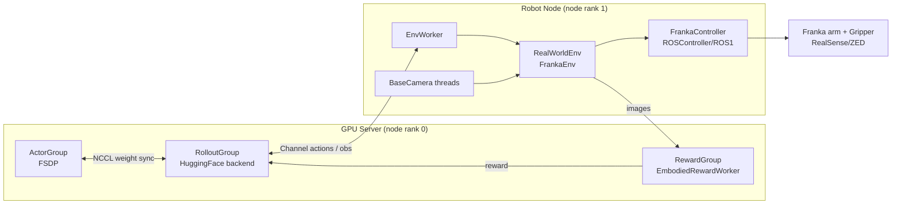

关键特征：

- `RealWorldEnv` 固定 `num_envs=1` + `NoAutoResetSyncVectorEnv`；`chunk_step` 供 embodied rollout 拉取。
- `FrankaController.launch_controller(..., node_rank=controller_node_rank)` 支持相机与手臂跨节点（`controller_node_rank` 字段）。
- 安全主要靠 `_clip_position_to_safety_box`（位置 + 欧拉角窗口），`clear_errors()` 用 `ErrorRecoveryActionGoal`。
- reward：几何 `_calc_step_reward` + 可选 `EmbodiedRewardWorker`（ResNet）+ 可选键盘 / 多阶段键盘 wrapper。

### 5.2 R1 Pro 接口 as-is

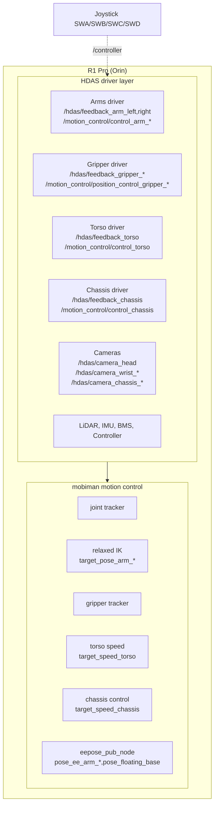

### 5.3 差异矩阵

| 维度 | Franka（RLinf 已有） | R1 Pro（目标） | 影响 |
|---|---|---|---|
| 机械构型 | 单臂 7-DoF + 单夹爪 | 双 A2 臂（各 7-DoF）+ 双 G1 夹爪 + 4-DoF 躯干 + 3 转向轮底盘 | 动作空间从 6–7D 扩到阶段 3 的 26D；安全 / 协调复杂度量级提升 |
| 中间层 | ROS 1 Noetic + libfranka + serl_franka_controllers + rospy | ROS 2 Humble（主）/ ROS 1 Noetic（副） | RLinf 需新增 `ROS2Controller` 适配；保留 `ROSController` 做 fallback |
| 相机 | RealSense / ZED SDK 直连（USB / GMSL） | 全部以 ROS topic 输出（`/hdas/camera_*/compressed`、`aligned_depth_to_color`） | 需新增 `R1ProROSCamera`（订阅 + JPEG 解码 + 深度帧） |
| 控制节点 | NUC or GPU server；ROS1 `franka_state_controller` / `cartesian_impedance_controller` | 车载 Orin（Ubuntu 22.04 + ROS2 Humble） | `setup_before_ray_r1pro.sh` 需 source mobiman workspace；CAN 必启 |
| 硬件急停 | 无内建硬急停，靠工作空间盒 + `clear_errors` | SWD 急停 + 硬急停按钮（需 CAN 重启） | 新增 `R1ProSafetySupervisor`，订阅 `/controller` + watchdog |
| 末端控制语义 | Cartesian 阻抗（`/cartesian_impedance_controller/equilibrium_pose`） | `mobiman relaxed_ik`（`/motion_target/target_pose_arm_*`）+ 可选 joint tracker | 控制器需在 pose / joint 间切换；安全盒同步变更 |
| 自动复位 | `clear_errors` + `reset_joint`（关节复位） | 通过 mobiman joint tracker 发 `target_joint_state_arm_*` 复位；`brake_mode=True` 停底盘 | 复位流程重写 |
| 奖励 | `_calc_step_reward`（target_ee_pose）+ resnet reward model | 可完全复用 `_calc_step_reward`（双臂 TCP）+ `EmbodiedRewardWorker` | 改 `target_ee_pose` 为双键（`target_ee_pose_left/right`） |
| 固件依赖 | Franka FW < 5.9.0、实时内核、serl controllers | 出厂预装 SDK（`~/galaxea/install`）+ CAN + tmux | 安装脚本不再需要实时内核 |
| 功耗 / 移动性 | 固定工作站 | 自驱（锂电 48V/35Ah） | 需加 BMS 监测触发器（低电量暂停） |

---

## 6. 总体架构（图文并茂）

### 6.1 系统上下文（Context Diagram）

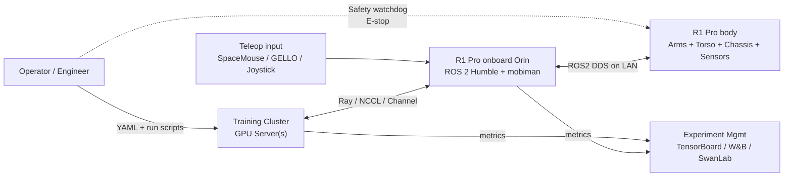

### 6.2 组件部署图（推荐：Disaggregated 2-Node）
??? 相机不是应该由ROS2统一交互吗
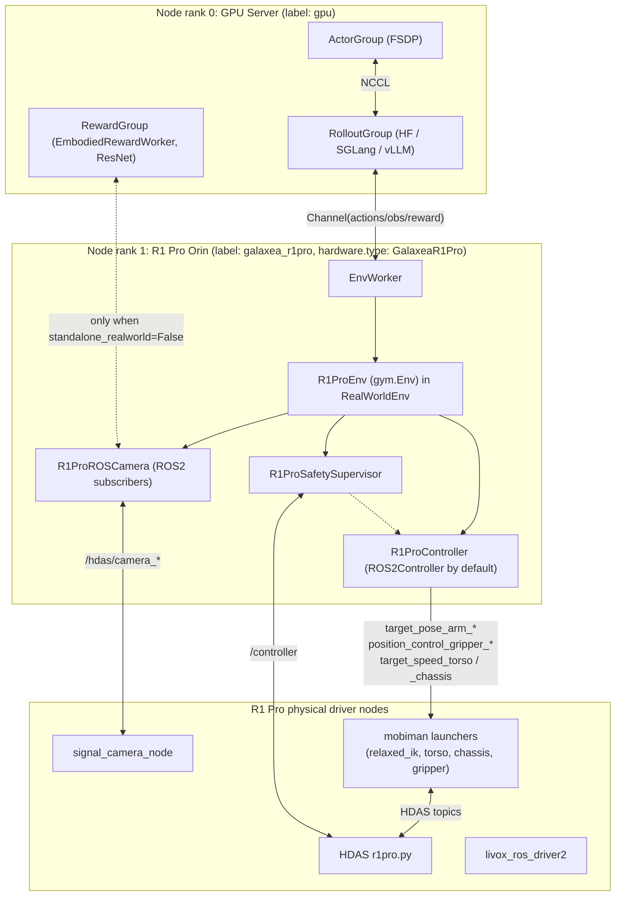

### 6.3 RLinf 三层映射

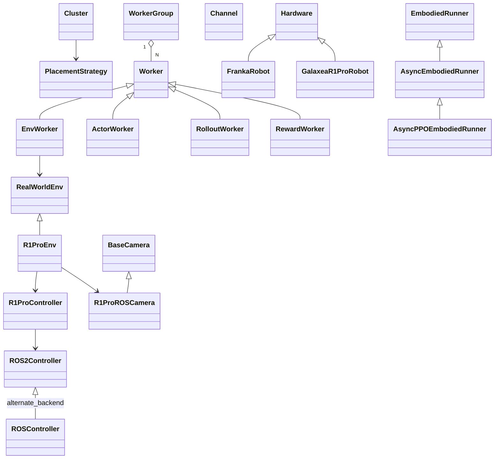

### 6.4 时序图：同步训练 step（单臂 MVP）

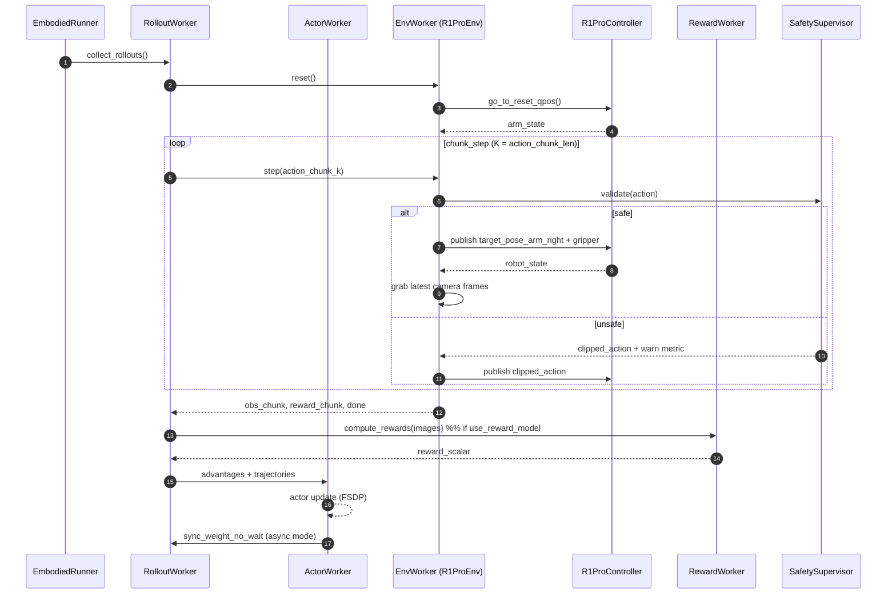

### 6.5 时序图：Async PPO 训练 step

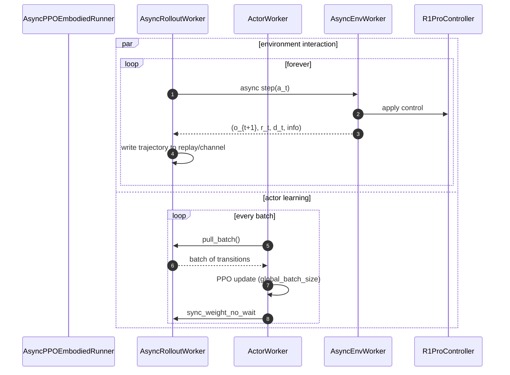

### 6.6 状态机：R1ProEnv

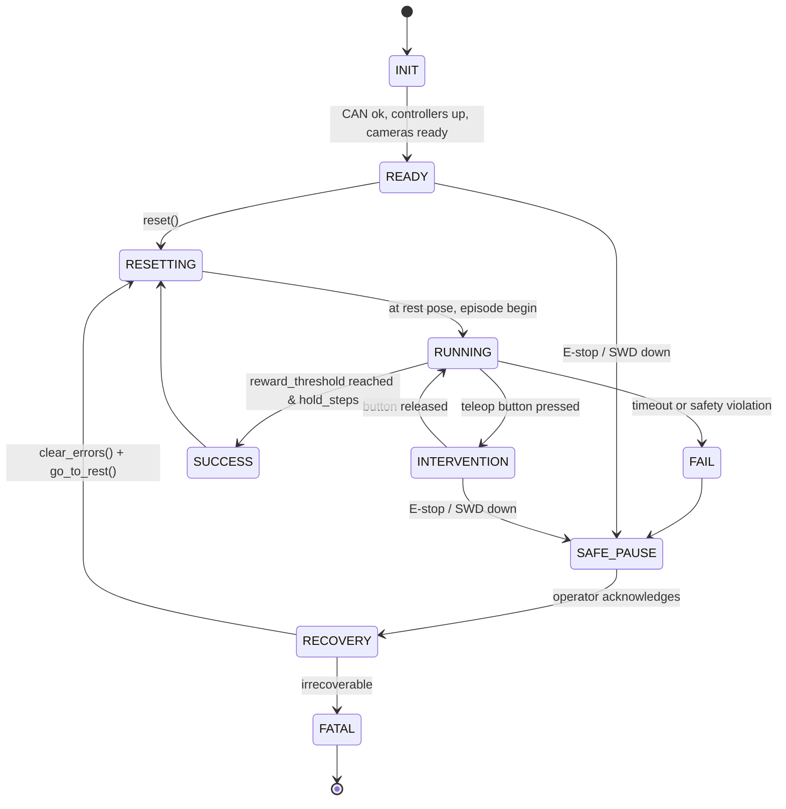

### 6.7 状态机：R1ProController

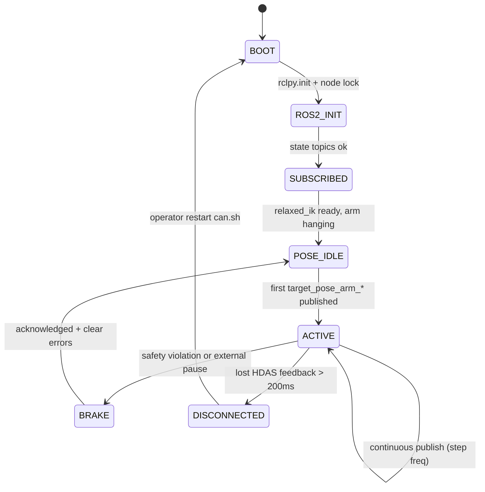

### 6.8 数据流图

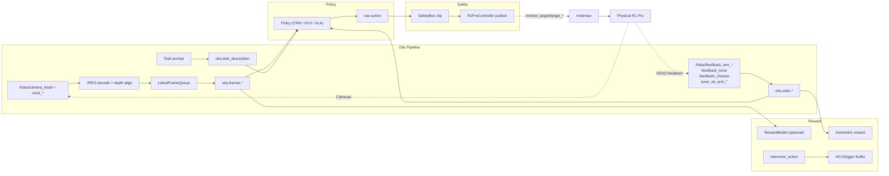

---

## 7. 核心模块设计

### 7.1 硬件注册：`GalaxeaR1ProRobot`（mirror `FrankaRobot`）

**新文件**：`rlinf/scheduler/hardware/robots/galaxea.py`

关键要点（与 [`rlinf/scheduler/hardware/robots/franka.py`](../../../rlinf/scheduler/hardware/robots/franka.py) 对比）：

- `HW_TYPE = "GalaxeaR1Pro"`。
- `enumerate()` 返回 `GalaxeaR1ProHWInfo`；不再依赖 RealSense/ZED SDK，而是依赖 `rclpy` + `mobiman` 工作空间可达：
  - 校验 `source ~/galaxea/install/setup.bash`（读取环境变量 `GALAXEA_INSTALL_PATH`，默认 `~/galaxea/install`）；
  - 校验 `rclpy` 已安装；
  - 可选 ICMP ping（如果设置了 `connect_via_ip=True`，即 Orin 与 GPU 机不同机）；
  - 校验 CAN：`ip link show can0` 存在（跨域 ssh 太复杂，改为在 env worker 启动时做）。
- `GalaxeaR1ProConfig`（`@dataclass`）：

```python
# skeleton
@NodeHardwareConfig.register_hardware_config(GalaxeaR1ProRobot.HW_TYPE)
@dataclass
class GalaxeaR1ProConfig(HardwareConfig):
    hostname: Optional[str] = None       # 远程 Orin 主机名，本地部署时留空
    ros_domain_id: int = 72              # 与 R1 Pro 说明对齐（ROS_DOMAIN_ID）
    ros_localhost_only: bool = True
    use_left_arm: bool = False           # 阶段开关
    use_right_arm: bool = True
    use_torso: bool = False
    use_chassis: bool = False
    cameras: list[str] = field(default_factory=lambda: ["head_left", "wrist_right"])
    lidar: bool = False
    controller_node_rank: Optional[int] = None
    galaxea_install_path: str = "~/galaxea/install"
    mobiman_launch_mode: str = "pose"    # "pose" | "joint" | "hybrid"
    bms_low_battery_threshold: float = 20.0  # %, < 阈值暂停训练
    disable_validate: bool = False
```

- 注册方式与 Franka 完全对称，用户在 YAML 中填：

```yaml
node_groups:
  - label: galaxea_r1pro
    node_ranks: 1
    hardware:
      type: GalaxeaR1Pro
      configs:
        - hostname: r1pro-lab-01.local
          ros_domain_id: 72
          use_right_arm: true
          cameras: [head_left, wrist_right]
          node_rank: 1
```

### 7.2 环境：`R1ProEnv`（继承 `gym.Env`）

**新目录**：`rlinf/envs/realworld/galaxea_r1pro/`，文件结构：

```
galaxea_r1pro/
├── __init__.py               # gym.register 所有任务
├── r1pro_env.py              # R1ProEnv 基类 + RobotConfig
├── r1pro_controller.py       # R1ProController（多后端）
├── r1pro_robot_state.py      # RobotState dataclass
├── utils.py                  # 几何 / 坐标变换
└── tasks/
    ├── __init__.py
    ├── right_arm_pickplace.py        # 阶段 1 任务
    ├── dual_arm_handover.py          # 阶段 2
    ├── dual_arm_cap_tighten.py
    ├── whole_body_cleanup.py         # 阶段 3（+ torso + chassis）
    └── dummy.py                      # is_dummy 时用
```

核心 `R1ProRobotConfig`（mirror `FrankaRobotConfig`）：

```python
@dataclass
class R1ProRobotConfig:
    # Stage flags
    use_left_arm: bool = False
    use_right_arm: bool = True
    use_torso: bool = False
    use_chassis: bool = False

    # Hardware
    hostname: Optional[str] = None
    ros_backend: str = "ros2"            # "ros2" | "ros1"
    ros_domain_id: int = 72
    cameras: list[str] = field(default_factory=lambda: ["head_left", "wrist_right"])
    image_size: tuple[int, int] = (128, 128)

    # Safety / control
    is_dummy: bool = False
    step_frequency: float = 10.0
    action_scale: np.ndarray = field(default_factory=lambda: np.array([0.05, 0.1, 1.0]))  # xyz, rot, gripper
    ee_pose_limit_min_right: np.ndarray = field(default_factory=lambda: np.array([0.2, -0.35, 0.05, -3.2, -0.3, -0.3]))
    ee_pose_limit_max_right: np.ndarray = field(default_factory=lambda: np.array([0.6,  0.35, 0.6,   3.2,  0.3,  0.3]))
    ee_pose_limit_min_left: np.ndarray = ...
    ee_pose_limit_max_left: np.ndarray = ...
    chassis_v_limit: tuple[float, float, float] = (0.5, 0.5, 0.5)  # m/s, m/s, rad/s
    torso_v_limit: tuple[float, float, float, float] = (0.1, 0.1, 0.3, 0.3)

    # Reset
    target_ee_pose_right: np.ndarray = field(default_factory=lambda: np.array([0.45, -0.10, 0.30, -3.14, 0.0, 0.0]))
    target_ee_pose_left: Optional[np.ndarray] = None
    reset_ee_pose_right: np.ndarray = field(default_factory=lambda: np.zeros(6))
    reset_ee_pose_left: Optional[np.ndarray] = None
    joint_reset_qpos_right: list[float] = field(default_factory=lambda: [0.0, 0.3, 0.0, -1.8, 0.0, 2.1, 0.0])
    joint_reset_qpos_left: Optional[list[float]] = None
    max_num_steps: int = 120
    reward_threshold: np.ndarray = field(default_factory=lambda: np.array([0.02, 0.02, 0.02, 0.2, 0.2, 0.2]))

    # Reward
    use_dense_reward: bool = False
    use_reward_model: bool = False
    reward_worker_cfg: Optional[dict] = None
    reward_worker_hardware_rank: Optional[int] = None
    reward_worker_node_rank: Optional[int] = None
    reward_worker_node_group: Optional[str] = None
    reward_image_key: Optional[str] = None
    reward_scale: float = 1.0
    success_hold_steps: int = 5

    # BMS
    bms_low_battery_threshold: float = 20.0
```

`R1ProEnv.__init__` 伪代码：

```python
class R1ProEnv(gym.Env):
    def __init__(self, config: R1ProRobotConfig, worker_info: WorkerInfo):
        self.config = config
        self._action_dim = self._compute_action_dim()  # 见 7.4
        self._build_observation_space()
        self._build_action_space()
        if not config.is_dummy:
            self._setup_hardware(worker_info)
        if config.use_reward_model:
            self._setup_reward_worker(worker_info)
        self._install_safety_supervisor()
        self._install_intervention_wrapper_if_any()

    def _setup_hardware(self, worker_info):
        self.controller = R1ProController.launch_controller(
            backend=self.config.ros_backend,
            node_rank=self._resolve_controller_rank(worker_info),
            domain_id=self.config.ros_domain_id,
            use_left_arm=self.config.use_left_arm,
            use_right_arm=self.config.use_right_arm,
            use_torso=self.config.use_torso,
            use_chassis=self.config.use_chassis,
            mobiman_launch_mode=self.config.mobiman_launch_mode,
        )
        self.cameras = [
            create_r1pro_camera(CameraInfo(name=name, backend="ros2"))
            for name in self.config.cameras
        ]
```

`step` / `reset` 与 Franka 实现同构：

- `reset`：发 joint tracker 到 `joint_reset_qpos_*`，等待误差收敛；若 `use_chassis`，`brake_mode=True` + 零速。
- `step`：
  1. `intervene_wrapper` 优先用专家 action（若按下 teleop）；
  2. safety clip（单臂盒、双臂盒、chassis / torso 速度盒）；
  3. 发布 ROS topic；
  4. 按 `step_frequency` sleep；
  5. 聚合观测 + 奖励 + done。

### 7.3 控制器：`R1ProController` + 可插拔 ROS 后端

**新文件**：`rlinf/envs/realworld/galaxea_r1pro/r1pro_controller.py`、`rlinf/envs/realworld/common/ros2/ros2_controller.py`。

分层：

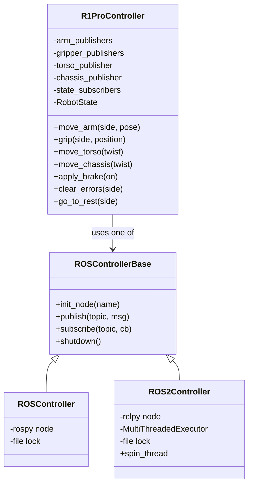

**关键行为**（ROS 2 后端）：

- `rclpy.init(args=[], domain_id=...)`（通过 `RCLPY_DOMAIN_ID` 或 `rclpy.Context` 启动时传）；`ROS_LOCALHOST_ONLY=1` 由启动脚本设置。
- QoS 策略：
  - `/hdas/feedback_arm_*`、`/hdas/feedback_torso`、`/hdas/feedback_chassis`：`SensorDataQoS()`（best-effort、depth=1）；
  - `/motion_target/target_pose_arm_*`：`ReliableQoS(depth=1)`，避免丢帧；
  - `/hdas/camera_*/compressed`：`SensorDataQoS(depth=1)` + 独立回调组（`MutuallyExclusiveCallbackGroup`）避免阻塞 arm 回调。
- 使用 `MultiThreadedExecutor` + 独立 spin 线程，与 RLinf env worker 主线程解耦（与 `BaseCamera._capture_frames` 的线程模型保持一致）。
- 文件锁 `/tmp/r1pro_controller.lock`（fnctl.LOCK_EX）防止同机多 env worker 冲突启动 rclpy。
- `move_arm(side, pose_xyz_rpy, gripper_pos)`：
  - 阶段 1–2 发 `PoseStamped` 到 `/motion_target/target_pose_arm_{side}`（mobiman relaxed IK）；
  - 阶段 3 备选 joint mode：发 `JointState` 到 `/motion_target/target_joint_state_arm_{side}`。
- `move_torso(v_x, v_z, w_pitch, w_yaw)`：`TwistStamped` → `/motion_target/target_speed_torso`。
- `move_chassis(vx, vy, wz, acc_limit=None)`：`Twist` → `/motion_target/target_speed_chassis`，并按需发 `/motion_target/chassis_acc_limit` 与 `/motion_target/brake_mode`。
- `clear_errors(side)`：读取 `/hdas/feedback_status_arm_*` 的 `errors` 字段，按错误码白名单映射到复位动作（joint tracker 回到 `joint_reset_qpos`），不可恢复错误抛出并转 `SAFE_PAUSE`。
- `go_to_rest(side)`：阻塞式 joint tracker → rest pose，收敛阈值 0.03 rad。

### 7.4 动作 / 观测空间矩阵

| 阶段 | 动作维度 | 解释 | 观测 dict | 主要模型 |
|---|---|---|---|---|
| 1 单臂 | 7 | `[dx, dy, dz, droll, dpitch, dyaw, grip_open01]` 右臂 TCP delta + 夹爪 | `state`: right_arm_q(7) + right_ee_pose(7) + right_gripper(1) = 15；`frames`: head_left, wrist_right | CNN (ResNet10), π₀.₅（可选） |
| 2 双臂 | 14 | 左右臂各 `[dx dy dz droll dpitch dyaw grip]` | `state`: left+right 同构 = 30；`frames`: head_left, head_right, wrist_left, wrist_right | π₀.₅, OpenPI DAgger |
| 3 全身 | 18（默认）或 26（joint mode） | 上述 14 + `[torso_vx, torso_vz, torso_w_pitch, torso_w_yaw]`（4）+ 可选 chassis `[vx, vy, wz]`（3）+ brake(1) | 追加 torso_q(4) + chassis_q(3) + chassis_v(3) + imu_torso(10) + imu_chassis(10) + optional LiDAR scan（可选降采样 128D） | GR00T / VLA 或 π₀.₅ 扩展 |

**实现约束**：

- 延续 `RealWorldEnv` 的 `num_envs=1`；
- action 序列化采用平铺 `np.float32` 向量，与现有 `rollout` 签名兼容；
- 若阶段 3 启用 joint mode，需要在 [`rlinf/envs/action_utils.py`](../../../rlinf/envs/action_utils.py) 的 `prepare_actions(env_type, ...)` 里添加 `REALWORLD_R1PRO` 分支，做分段解包。

### 7.5 相机：`R1ProROSCamera`

**新文件**：`rlinf/envs/realworld/common/camera/r1pro_ros_camera.py`（同目录下复用 `BaseCamera` 的线程 / 最新帧队列模型）。

职责：

- 在 `rclpy` executor 上订阅：
  - RGB JPEG：`/hdas/camera_head/left_raw/image_raw_color/compressed`、`/hdas/camera_wrist_{left,right}/color/image_raw/compressed`、`/hdas/camera_chassis_{front_left,front_right,left,right,rear}/rgb/compressed`；
  - 对齐深度：`/hdas/camera_wrist_{left,right}/aligned_depth_to_color/image_raw`、`/hdas/camera_head/depth/depth_registered`。
- JPEG 解码：优先 `turbojpeg`（PyTurboJPEG），回退 `cv2.imdecode`；
- 深度解码：`encoding=16UC1` → `uint16` → 按需转 float32（单位 m，除以 1000）；
- 与 `BaseCamera` 一致：独立回调线程 + 最新帧队列（`queue.Queue(maxsize=1)` 丢弃旧帧）；
- 时间戳：保留 ROS `header.stamp` 以便 wrapper 做跨相机 "近似同步"（软同步窗 ≤ 33ms）；
- 通过 `create_camera(CameraInfo(name="wrist_right", backend="ros2", topic_prefix="/hdas/camera_wrist_right"))` 工厂分发；
- 图像后处理与 Franka 保持一致：中心裁剪 + `cv2.resize` 到 `config.image_size`（默认 128×128）。

`CameraInfo` 扩展（`rlinf/envs/realworld/common/camera/__init__.py`）：

```python
@dataclass
class CameraInfo:
    name: str
    backend: str = "sdk"              # "sdk" | "ros2"
    # SDK path
    serial: Optional[str] = None
    camera_type: Optional[str] = None # realsense / zed
    # ROS2 path
    rgb_topic: Optional[str] = None
    depth_topic: Optional[str] = None
    fps: float = 30.0
    depth_units: float = 1e-3
```

`create_camera()` 按 `backend` 分发到 `RealSenseCamera / ZEDCamera / R1ProROSCamera`。

### 7.6 安全体系：多级闸门 + `R1ProSafetySupervisor`

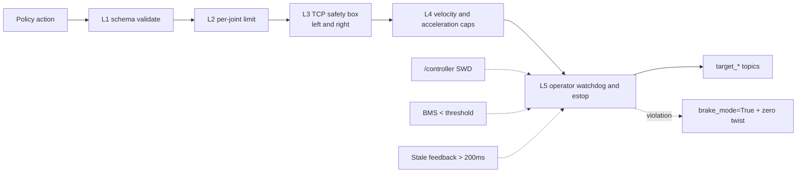

- **L1**：schema（shape/dtype/范围）；
- **L2**：关节限位（参考 R1 Pro 最大速度：joint tracker 默认 `{3,3,3,3,5,5,5}` rad/s；`v_des` 做 min 截断）；
- **L3**：双臂各自的 EE 盒（xyz + rpy，带目标点为中心的窗口），复用 `franka_env.py._clip_position_to_safety_box` 的思路但支持左右双集合；
- **L4**：末端速度差分上界（`||pose_t - pose_{t-1}||/dt`）、躯干速度绝对值（0.1m/s 线速 / 0.3rad/s 角速）、底盘速度绝对值（参数上限）；
- **L5**：`R1ProSafetySupervisor` 订阅 `/controller`（SWD=DOWN 或 mode=5 视为急停）+ `/hdas/bms`（电量阈值）+ 内部 watchdog（任意 feedback topic 超时 > 200ms），触发时立即：
  - 发 `brake_mode=True`；
  - 所有 twist 置零、arm 目标=当前 feedback（冻结姿态）；
  - 触发 `SAFE_PAUSE`，runner 收到 `info["safe_pause"]=True` 时将 episode 标记为 fail 且暂停下一次 reset，等待人工 `RLINF_SAFETY_ACK=1`。

### 7.7 奖励：三路 + 可融合

1. **几何（Geometric）**：复用 `_calc_step_reward` 扩展为双臂版本。
   - 任务目标：每臂 `target_ee_pose_{side}`、`reward_threshold`、`success_hold_steps`、可选 dense `exp(-k * ||delta||^2)`；
   - 双臂任务通过 AND 语义（两臂同时 within threshold 至 `success_hold_steps`）；
   - 底盘 / 躯干可选 target pose（world frame from `/motion_control/pose_floating_base`）。
2. **学习式（Reward Model）**：完全复用 `EmbodiedRewardWorker`（ResNet），阶段 1–2 推荐 `standalone_realworld=True`：
   - 由 `R1ProEnv._setup_reward_worker` 调用 `EmbodiedRewardWorker.launch_for_realworld`；
   - 将 `reward_image_key` 指向 `head_left` 或 `wrist_right`；
   - 阈值判断决定 success / fail；进入 `SUCCESS → RESETTING`。
3. **人机交互**：复用 `KeyboardRewardDoneWrapper` / `KeyboardRewardDoneMultiStageWrapper`（`a/b/c/q/Space` 映射），外加新 `JoystickRewardDoneWrapper`：订阅 `/controller` 的某个按键（比如 SWA）。

融合：复用 `reward_weight` / `env_reward_weight`；阶段 3 可引入可学习裁判 VLM（离线训练）。

### 7.8 遥操作与数据采集

- **GELLO**：若有 R1 Pro 双臂 leader，复用 `GelloExpert` + `GelloIntervention`；无 leader 时 fallback 到 SpaceMouse 双路（需要两台设备，分别控左右臂）。
- **R1 Pro 摇杆**：新增 `R1ProJoystickIntervention`，订阅 `/controller`：
  - 左摇杆 → 右臂 `[dx, dy]`；右摇杆 → 右臂 `[dyaw, dz]`；
  - SWA/SWB 切换左右臂；
  - 落点与 GELLO 一致：把 `intervene_action` 塞进 `info`，供 HG-DAgger 使用。
- **数据采集**：新增 `examples/embodiment/config/realworld_collect_data_r1pro_*.yaml` + `run_collect_r1pro.sh`，复用 `collect_real_data.py` + `CollectEpisode` wrapper（`export_format: lerobot`）。
- **LeRobot 目录规约**：`dataset/galaxea_r1pro_{task}_{date}/`，每 episode 存储 obs 字段与所有 intervene_flag，便于 SFT / HG-DAgger 管线消费。

### 7.9 HG-DAgger / Sim-Real Co-Train

- **HG-DAgger**（对标 `realworld_pnp_dagger_openpi.yaml`）：
  - `algorithm.loss_type: embodied_dagger`、`algorithm.dagger.only_save_expert: True`；
  - 专家策略来自 OpenPI pi0 SFT，入口 `run_realworld_async.sh realworld_r1pro_dagger_openpi`；
  - 需先跑：数据采集 → `calculate_norm_stats` → `run_vla_sft.sh r1pro_dagger_sft_openpi` → 在线 DAgger。
- **Sim-Real Co-Train**（对标 `maniskill_ppo_co_training_openpi_pi05.yaml`）：
  - 仿真侧：IsaacSim 4.5 + `galaxea_isaac_tutorial`；需要在 RLinf 里写 `rlinf/envs/isaaclab/galaxea_r1pro/` 数字孪生 env（若你已选 IsaacLab 路线，则走 isaaclab env_type）；
  - 训练：PPO on sim，SFT on real trajectories；共享 π₀.₅ policy head；
  - 配置示例 `r1pro_ppo_co_training_openpi_pi05.yaml`。

### 7.10 Runner 复用

- 同步：`EmbodiedRunner`（`train_embodied_agent.py`）——适合 MVP 小规模测试；
- 异步 SAC/RLPD：`AsyncEmbodiedRunner`（`train_async.py`）——真机首选；
- 异步 PPO：`AsyncPPOEmbodiedRunner`——OpenPI 路线；
- HG-DAgger：`AsyncEmbodiedRunner` + `loss_type=embodied_dagger`（由 `EmbodiedDAGGERFSDPPolicy` 自动分派）。
- 新增 Runner：无需新增，R1 Pro 走同一套；所有差异通过 env_type=realworld + R1ProEnv + YAML 控制。

---

## 8. ROS 中间层两种方案对比与推荐

### 8.1 方案 A（推荐）：ROS 2 Humble 原生

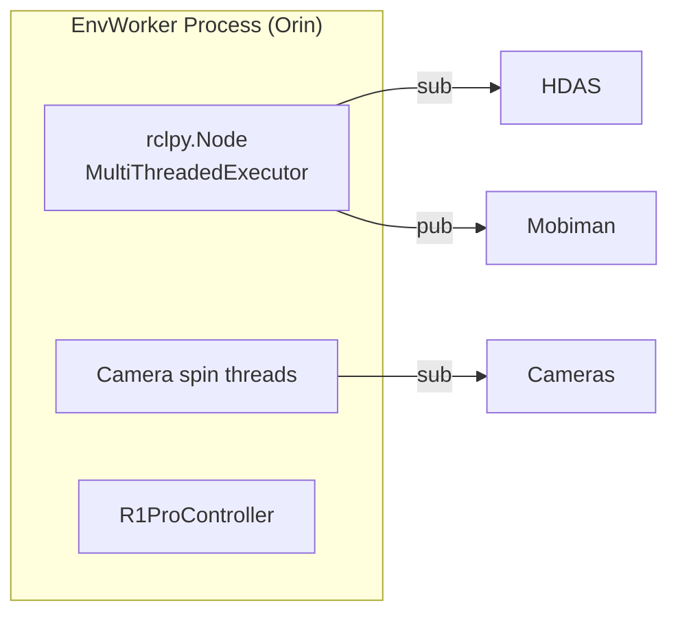

- **优点**：零阻抗接入 R1 Pro，生态主线；`rclpy` 与 `rospy` 风格一致但更轻；可直接复用 R1 Pro 官方 `ros2 launch` 启动的 HDAS / mobiman；QoS 可做精细化。
- **代价**：新增约 400–600 行的 `ROS2Controller` + `R1ProROSCamera`；和既有 `ROSController`（ROS1）并存，维护两套接口（抽出 `ROSControllerBase`）。
- **依赖冲突**：`rclpy` 与 `rospy` 不能共存于同一 Python 解释器（rospy 主要在 Noetic / Python 3.8；rclpy Humble / 3.10）。建议 Orin 端 venv 使用 **Python 3.10 + rclpy**，GPU 机 venv 独立（仅需 `rlinf` 核心，无 ROS）。
- **实施要点**：
  - `setup_before_ray_r1pro.sh` 中 `source /opt/ros/humble/setup.bash && source $GALAXEA_INSTALL_PATH/setup.bash`；
  - 设置 `ROS_DOMAIN_ID=72` + `ROS_LOCALHOST_ONLY=1`（与官方文档建议一致）；
  - `ray start` 传递 `runtime_env={"env_vars": {...}}`；
  - 通过 `ray_utils/realworld/setup_before_ray.sh` 的变体注入 `AMENT_PREFIX_PATH` 等 ROS2 变量。

### 8.2 方案 B：ROS 1 Noetic（通过 `ros1_bridge` 或厂商 ROS1 SDK）

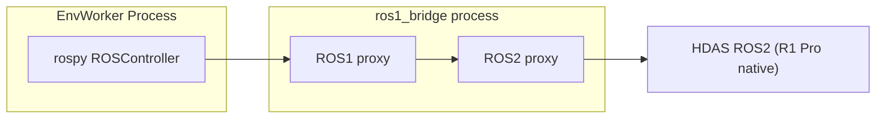

- **优点**：最大限度复用 RLinf 现有 `ROSController` 与 Franka 侧代码（dataclasses / topic 模式对接复用度高）。
- **缺点**：
  - 多一跳 IPC，p50 延迟 +3–8ms，p99 尖刺大；
  - `ros1_bridge` 对自定义 `hdas_msg::motor_control / feedback_status` 需要对称编译双版本 msg 包（ROS1 + ROS2），工程量不小；
  - 厂商 ROS1 SDK 可能滞后；
  - Noetic EoL（End-of-Life）2025 年 5 月已过，长期维护风险。
- **适合场景**：
  - 团队现有大量 ROS1 代码资产无法迁移；
  - 与 Franka 同集群机器混用，方便统一。

### 8.3 决策矩阵与推荐

| 评估维度 | 方案 A (ROS2 原生) | 方案 B (ROS1 + bridge) | 权重 |
|---|---|---|---|
| 与 R1 Pro 官方栈契合度 | 优 | 中 | 5 |
| 控制回路延迟 | 低 | 中（额外跳） | 4 |
| 开发工程量 | 新写 ROS2 适配（~600 行） | 写 bridge msg + 复用（~300 行） | 3 |
| 长期维护 | 优（Humble LTS 到 2027） | 差（Noetic EoL） | 5 |
| 既有代码复用 | 需抽象 `ROSControllerBase` | 高 | 2 |
| 诊断工具 | `ros2 topic / node / bag` | 需跨域 | 3 |
| 风险 | rclpy venv 冲突可控 | bridge 漏帧 / 卡死 | 4 |

**推荐：方案 A（ROS 2 Humble 原生）**。把方案 B 作为兼容层保留：`R1ProController(backend="ros1")` 时回退到 `ROSController`，仅在用户明确设置 `ros_backend: ros1` 时启用，并打印退化告警。

### 8.4 实施建议（方案 A）

1. 先抽象 `rlinf/envs/realworld/common/ros/base.py`：`ROSControllerBase`（`init/subscribe/publish/shutdown/spin`）。
2. 将现有 `ros/ros_controller.py` 改为继承该基类（无功能变化，只是变量命名和契约）。
3. 新增 `rlinf/envs/realworld/common/ros2/ros2_controller.py`：
   - `rclpy.init(domain_id=...)` + `Node("rlinf_r1pro")` + `MultiThreadedExecutor` + spin thread；
   - 内部维持 `self.subs / self.pubs` 字典；
   - 用 `ReentrantCallbackGroup` 给相机，`MutuallyExclusiveCallbackGroup` 给控制回调。
4. `R1ProController` 根据 `backend` 在工厂里选一个实例。

---

## 9. 网络 / 部署拓扑、时延预算与时钟同步

### 9.1 推荐部署：2 节点 disaggregated + 千兆直连

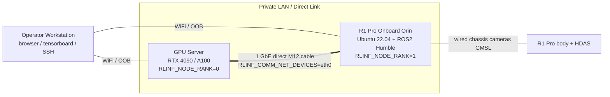

### 9.2 替代部署

- **Hybrid (1 节点)**：整台 R1 Pro 外挂 GPU 扩展盒（少见，不推荐）；
- **3 节点双臂实验室**：2 台 R1 Pro + 1 台 GPU Server，对应 `realworld_peginsertion_rlpd_cnn_async_2arms.yaml` 思路扩展；
- **Offboard-only**：若 Orin 算力不够跑 env worker，可放到控制 PC（外接 Orin 做 bridge）。

### 9.3 时延预算表（控制回路目标 20Hz = 50ms 窗口）

| 阶段 | 操作 | 预算 p50 | 预算 p95 | 备注 |
|---|---|---|---|---|
| a | Policy forward（GPU，一次 chunk） | 10 ms | 25 ms | 取决于模型（CNN < 5ms；π₀.₅ ~ 30ms） |
| b | Rollout → Env worker via Channel (Ray + NCCL) | 2 ms | 8 ms | 千兆直连下 |
| c | Safety clip + serialize | < 1 ms | 2 ms | |
| d | ROS2 publish + DDS transport | 1 ms | 4 ms | `ROS_LOCALHOST_ONLY=1` 更稳 |
| e | mobiman relaxed_ik 计算 | 3 ms | 10 ms | |
| f | 硬件伺服 + 反馈 | 5 ms | 15 ms | CAN 1Mbps |
| g | HDAS feedback 回程 | 1 ms | 4 ms | |
| h | 图像解码 + 预处理 | 3 ms | 10 ms | TurboJPEG |
| | **回路合计** | **26 ms** | **78 ms** | |

**结论**：控制回路默认 10–20Hz 稳健；若策略是 π₀.₅（推理 ~30ms），目标降至 10Hz，`R1ProRobotConfig.step_frequency=10.0`，与 `FrankaRobotConfig` 一致。

### 9.4 时钟同步建议

- Orin 运行 `chrony` 与 GPU Server 同步（或反向）；差异 < 5ms；
- ROS2 使用 `rclcpp::Time` / `rclpy.Clock(ROS_TIME)`；建议不开 `use_sim_time`；
- 相机 `header.stamp` 作为 soft sync 基线，接受 ±1 帧（33ms）内的跨相机窗；
- 训练日志 `time/*` 用 wall clock，env 内部用 ROS time；分别记录便于诊断。

### 9.5 吞吐与带宽

- 头部相机 1080p JPEG @30fps ~= 6–10 Mbps/路 × 2 = ~20 Mbps；
- 腕部深度 `16UC1 1280×720 @30fps` ~= 55 MB/s/路（原始），建议 sensor_qos depth=1 + 下采样到 256×192 或仅在 stride=3 抽样；
- GbE 直连下不是瓶颈；WiFi 绝对不够。

---

## 10. 分阶段路线图（MVP 单臂 → 双臂 → 全身）

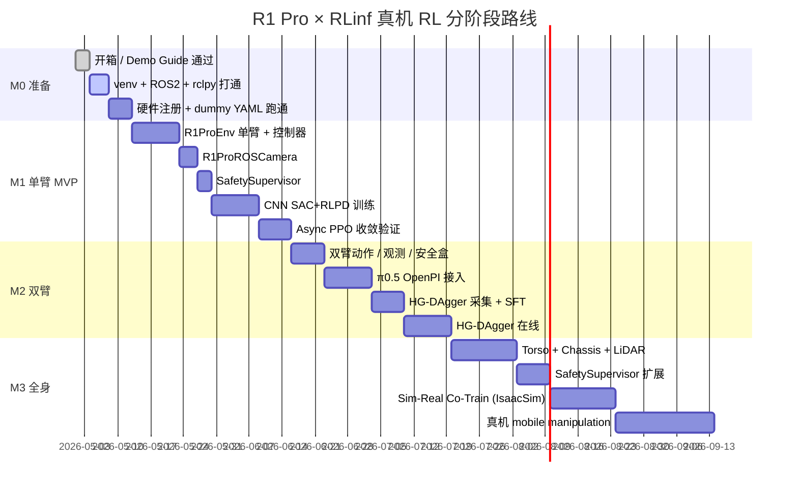

### M0 准备（约 2 周）

**目标**：所有下游开发依赖齐备，dummy 能跑，CI 不连真机。

交付物：

- `requirements/install.sh` 新增 `--env galaxea_r1_pro`（安装 rclpy + turbojpeg + R1 Pro `mobiman` python 客户端 + icmplib）。
- Dockerfile 新 stage `galaxea_r1_pro`（继承 embodied base + ROS2 Humble）。
- `ray_utils/realworld/setup_before_ray_r1pro.sh`（source ROS2 + galaxea install + 设置 `RLINF_NODE_RANK/RLINF_COMM_NET_DEVICES`）。
- `rlinf/scheduler/hardware/robots/galaxea.py` 骨架 + 单元测试（`tests/unit_tests/test_galaxea_hardware.py`，hardware config 序列化/反序列化）。
- YAML：`examples/embodiment/config/env/realworld_r1pro_dummy.yaml` + `realworld_dummy_r1pro_sac_cnn.yaml`。
- 入口：`examples/embodiment/run_realworld_r1pro.sh`。

**退出标准**：
- `bash examples/embodiment/run_realworld_async.sh realworld_dummy_r1pro_sac_cnn` 能启动 ActorGroup/RolloutGroup/EnvWorker，env 返回固定零观测 / 零奖励跑 100 step；
- 相机 dummy 返回全黑图像无崩溃；
- CI job `ci/r1pro-dummy-e2e` 通过。

### M1 单臂 MVP（约 5–6 周）

**目标**：在右臂 + 右夹爪上，实现一个真机任务（推荐：Peg-insertion 或 桌面 Pick-and-Place）。

子任务：

1. 实装 `R1ProController (ros_backend=ros2)` + `R1ProROSCamera`；
2. 实装 `R1ProEnv` + `right_arm_pickplace.py` task；
3. SafetySupervisor 实装（L1–L5）；
4. 奖励：先几何 reward + 键盘 wrapper；再接 `EmbodiedRewardWorker`（ResNet）；
5. 训练：先 `realworld_r1pro_right_arm_rlpd_cnn_async.yaml`（SAC+RLPD+CNN），再 `realworld_r1pro_right_arm_async_ppo_pi05.yaml`（OpenPI）；
6. 采集：`realworld_collect_data_r1pro_right_arm.yaml`（可选 GELLO/SpaceMouse）；
7. 评估：`realworld_eval_r1pro_right_arm.yaml`。

**退出 KPI**：

- 任务成功率 ≥ 70%（100 trials on 3 object positions）；
- `safety/limit_violation_count/hour` = 0；
- `env/intervene_rate` ≤ 30%（若用 DAgger）；
- CI：dummy e2e + 单元测试（控制器、安全盒、相机解码）。

### M2 双臂协作（约 4–5 周）

**目标**：双臂手递（handover）或 Cap-tighten。

子任务：

1. 扩展 `R1ProEnv` 双臂 flag；
2. 扩展 SafetySupervisor 支持双臂盒 + 两臂最小碰撞距离检查（简易球模型）；
3. 接 `π₀.₅`（`realworld_r1pro_dualarm_handover_async_ppo_pi05.yaml`）；
4. 配置 `realworld_r1pro_dualarm_dagger_openpi.yaml`（HG-DAgger）；
5. 在 `realworld_collect_data_r1pro_dualarm_gello.yaml` 做数据采集（若双臂 GELLO 可用）；

**退出 KPI**：

- 双臂任务成功率 ≥ 60%；
- 两臂碰撞预警（simulated）0 次；
- DAgger 收敛 `intervene_rate` 单调下降。

### M3 全身 Mobile Manipulation（约 7–10 周）

**目标**：例如 "走到指定桌前 → 站立调整 → 双臂操作" 或 "移动式桌面清理"。

子任务：

1. 控制器扩展：`move_torso` + `move_chassis`；支持 `brake_mode` / `chassis_acc_limit`；
2. 观测扩展：`feedback_chassis` + `feedback_torso` + `pose_floating_base` + 可选 LiDAR PointCloud（降采样）；
3. SafetySupervisor 扩展：底盘 "near obstacle" 阈值（LiDAR 最近距离 < 0.5m 自动 brake）+ 电量阈值（BMS < 20% 停下一次 reset）；
4. IsaacSim 数字孪生：基于 `galaxea_isaac_tutorial`，实装 `rlinf/envs/isaaclab/galaxea_r1pro/`；
5. Sim-Real Co-Train：`r1pro_ppo_co_training_openpi_pi05.yaml`；
6. 真机在线 HG-DAgger + 自主决策（底盘 + 臂 + 躯干）。

**退出 KPI**：

- 阶段 3 任务成功率 ≥ 50%；
- 底盘/躯干 safety 触发 ≤ 0.05/hour；
- 仿真 → 真机零样本成功率 ≥ 20%（RL-Co 加持后 ≥ 40%）。

---

## 11. 配置与代码骨架

### 11.1 新增文件清单（建议目录）

```
rlinf/
├── scheduler/hardware/robots/galaxea.py             # 新增：GalaxeaR1ProRobot / Config / HWInfo
├── envs/realworld/
│   ├── common/
│   │   ├── ros/base.py                               # 新增：抽象基类 ROSControllerBase
│   │   ├── ros2/                                     # 新增
│   │   │   ├── __init__.py
│   │   │   ├── ros2_controller.py                    # rclpy 封装
│   │   │   └── qos_profiles.py
│   │   └── camera/r1pro_ros_camera.py                # 新增
│   └── galaxea_r1pro/                                # 新增
│       ├── __init__.py
│       ├── r1pro_env.py
│       ├── r1pro_controller.py
│       ├── r1pro_robot_state.py
│       ├── r1pro_safety_supervisor.py
│       ├── utils.py
│       └── tasks/
│           ├── __init__.py
│           ├── dummy.py
│           ├── right_arm_pickplace.py
│           ├── dual_arm_handover.py
│           ├── dual_arm_cap_tighten.py
│           └── whole_body_cleanup.py
├── envs/action_utils.py                              # 修改：REALWORLD_R1PRO 分支（可选）
examples/embodiment/
├── config/
│   ├── env/
│   │   ├── realworld_r1pro_dummy.yaml                # 新增
│   │   ├── realworld_r1pro_right_arm_pickplace.yaml  # 新增
│   │   ├── realworld_r1pro_dualarm_handover.yaml
│   │   └── realworld_r1pro_whole_body_cleanup.yaml
│   ├── realworld_dummy_r1pro_sac_cnn.yaml
│   ├── realworld_r1pro_right_arm_rlpd_cnn_async.yaml
│   ├── realworld_r1pro_right_arm_async_ppo_pi05.yaml
│   ├── realworld_r1pro_dualarm_async_ppo_pi05.yaml
│   ├── realworld_r1pro_dualarm_dagger_openpi.yaml
│   ├── realworld_r1pro_wholebody_rlpd_cnn_async.yaml
│   ├── realworld_collect_data_r1pro_right_arm.yaml
│   └── realworld_eval_r1pro.yaml
├── run_realworld_r1pro.sh
└── collect_data_r1pro.sh
ray_utils/realworld/
└── setup_before_ray_r1pro.sh                         # 新增
toolkits/realworld_check/
├── test_r1pro_camera.py                              # 新增
├── test_r1pro_controller.py
└── test_r1pro_safety.py
requirements/install.sh                                # 修改：--env galaxea_r1_pro
docker/                                                # 修改：galaxea_r1pro stage
tests/
├── unit_tests/
│   ├── test_galaxea_hardware.py                      # 新增
│   ├── test_r1pro_safety.py
│   └── test_r1pro_camera_decode.py
└── e2e_tests/embodied/
    └── realworld_dummy_r1pro_sac_cnn.yaml            # dummy e2e
docs/
├── source-en/rst_source/examples/embodied/galaxea_r1pro.rst
└── source-zh/rst_source/examples/embodied/galaxea_r1pro.rst
```

### 11.2 `ray_utils/realworld/setup_before_ray_r1pro.sh` 骨架

```bash
#!/bin/bash
set -euo pipefail

export CURRENT_PATH="$( cd "$(dirname "${BASH_SOURCE[0]}" )" && pwd )"
export REPO_PATH=$(dirname $(dirname "$CURRENT_PATH"))
export PYTHONPATH=$REPO_PATH:${PYTHONPATH:-}

export RLINF_NODE_RANK=${RLINF_NODE_RANK:--1}
export RLINF_COMM_NET_DEVICES=${RLINF_COMM_NET_DEVICES:-eth0}

# Activate project venv first
source "${R1PRO_VENV:-$HOME/rlinf-r1pro/bin/activate}"

# Source ROS 2 Humble + mobiman install
source /opt/ros/humble/setup.bash
export GALAXEA_INSTALL_PATH="${GALAXEA_INSTALL_PATH:-$HOME/galaxea/install}"
source "$GALAXEA_INSTALL_PATH/setup.bash"

# R1 Pro official ROS2 best practice
export ROS_LOCALHOST_ONLY=1
export ROS_DOMAIN_ID="${ROS_DOMAIN_ID:-72}"

# Ensure CAN is up (idempotent)
if ! ip link show can0 | grep -q "UP"; then
    echo "[r1pro] can0 not up, starting via can.sh ..."
    bash "$HOME/can.sh" || true
fi
```

### 11.3 `examples/embodiment/config/realworld_r1pro_right_arm_rlpd_cnn_async.yaml`（关键片段）

```yaml
defaults:
  - env/realworld_r1pro_right_arm_pickplace@env.train
  - env/realworld_r1pro_right_arm_pickplace@env.eval
  - model/cnn_policy@actor.model
  - training_backend/fsdp@actor.fsdp_config
  - override hydra/job_logging: stdout

cluster:
  num_nodes: 2
  component_placement:
    actor:   { node_group: "gpu",            placement: 0 }
    rollout: { node_group: "gpu",            placement: 0 }
    reward:  { node_group: "gpu",            placement: 0 }
    env:     { node_group: "galaxea_r1pro",  placement: 0 }
  node_groups:
    - label: "gpu"
      node_ranks: 0
    - label: galaxea_r1pro
      node_ranks: 1
      hardware:
        type: GalaxeaR1Pro
        configs:
          - hostname: r1pro-lab-01.local
            ros_domain_id: 72
            use_right_arm: true
            cameras: [head_left, wrist_right]
            node_rank: 1

runner:
  task_type: embodied
  logger:
    log_path: "../results"
    project_name: rlinf
    experiment_name: r1pro_right_arm_rlpd_cnn_async
    logger_backends: ["tensorboard"]
  max_epochs: 8000

algorithm:
  adv_type: embodied_sac
  loss_type: embodied_sac
  gamma: 0.96
  tau: 0.005
  replay_buffer: { enable_cache: true, cache_size: 200, min_buffer_size: 2, sample_window_size: 200 }
  demo_buffer:  { enable_cache: true, cache_size: 200, min_buffer_size: 1, sample_window_size: 200, load_path: "/data/r1pro_demo" }
  sampling_params: { do_sample: true, temperature_train: 1.0, temperature_eval: 0.6, top_k: 50, top_p: 1.0 }
  length_params:   { max_new_token: 7, max_length: 1024, min_length: 1 }

env:
  train:
    total_num_envs: 1
    override_cfg:
      is_dummy: false
      use_dense_reward: false
      target_ee_pose_right: [0.45, -0.10, 0.30, -3.14, 0.0, 0.0]
  eval:
    total_num_envs: 1
    override_cfg: { is_dummy: false }

rollout:
  backend: "huggingface"
  collect_transitions: true
  model: { model_path: "/models/RLinf-ResNet10-pretrained", precision: ${actor.model.precision}, num_q_heads: 10 }
  enable_torch_compile: true

actor:
  training_backend: "fsdp"
  micro_batch_size: 256
  global_batch_size: 256
  model:
    model_path: "/models/RLinf-ResNet10-pretrained"
    state_dim: 15        # 7 q + 7 pose + 1 gripper
    action_dim: 7        # dx dy dz droll dpitch dyaw grip
    num_q_heads: 10
  optim: { clip_grad: 10.0, lr: 3e-4, lr_scheduler: torch_constant }
  critic_optim: { clip_grad: 10.0, lr: 3e-4, lr_scheduler: torch_constant }
  fsdp_config:
    strategy: "fsdp"
    sharding_strategy: "no_shard"

reward:
  use_reward_model: true
  standalone_realworld: true
  reward_mode: "terminal"
  reward_threshold: 0.85
  reward_weight: 1.0
  env_reward_weight: 0.0
  model:
    model_type: "resnet"
    arch: "resnet18"
    hidden_dim: 256
    image_size: [3, 128, 128]
    normalize: true
    precision: "fp32"

critic:
  use_critic_model: false
```

### 11.4 `examples/embodiment/config/env/realworld_r1pro_right_arm_pickplace.yaml`

```yaml
env_type: realworld
group_name: "EnvGroup"
total_num_envs: 1
init_params:
  id: "R1ProRightArmPickPlace-v1"
main_image_key: "wrist_right"
extra_view_image_keys: ["head_left"]
use_spacemouse: false
use_gello: false
override_cfg:
  use_right_arm: true
  use_left_arm: false
  use_torso: false
  use_chassis: false
  cameras: [head_left, wrist_right]
  image_size: [128, 128]
  step_frequency: 10.0
  action_scale: [0.05, 0.1, 1.0]
  max_num_steps: 120
  success_hold_steps: 5
  reward_threshold: [0.02, 0.02, 0.02, 0.2, 0.2, 0.2]
  target_ee_pose_right: [0.45, -0.10, 0.30, -3.14, 0.0, 0.0]
  reset_ee_pose_right:  [0.35, -0.10, 0.45, -3.14, 0.0, 0.0]
  ee_pose_limit_min_right: [0.20, -0.35, 0.05, -3.20, -0.30, -0.30]
  ee_pose_limit_max_right: [0.65,  0.35, 0.65,  3.20,  0.30,  0.30]
  bms_low_battery_threshold: 20.0
  ros_backend: ros2
  ros_domain_id: 72
```

### 11.5 `examples/embodiment/run_realworld_r1pro.sh`（骨架）

```bash
#!/bin/bash
set -euo pipefail

SCRIPT_DIR="$( cd "$(dirname "${BASH_SOURCE[0]}")" && pwd )"
cd "$SCRIPT_DIR"
CONFIG_NAME="${1:?usage: $0 <config_name>}"

export EMBODIED_PATH="$SCRIPT_DIR"
export MUJOCO_GL=egl
export ROBOT_PLATFORM=galaxea_r1pro

# Head node only launches Python entry; ray must already be up on both nodes
python train_async.py --config-name "$CONFIG_NAME"
```

### 11.6 `requirements/install.sh` 改动点（伪 diff）

```bash
# Add new env target
SUPPORTED_ENVS="maniskill libero isaaclab calvin metaworld behavior robocasa ... xsquare_turtle2 galaxea_r1_pro"

install_galaxea_r1pro() {
    # rclpy via apt is ROS-native; for venv use 'ros2 environment' + sourced install
    pip install icmplib PyTurboJPEG pyyaml
    # Optional: galaxea python client if provided (from ~/galaxea/install)
    # Note: rclpy binding is distributed via /opt/ros/humble; do NOT pip install rclpy
    echo "[install] galaxea_r1_pro env prepared (rclpy must come from sourced ROS 2 Humble install)."
}
```

### 11.7 Dockerfile 新 stage（骨架）

```dockerfile
FROM rlinf/embodied-base:latest AS galaxea_r1pro
SHELL ["/bin/bash", "-lc"]

# ROS 2 Humble
RUN apt-get update && apt-get install -y curl gnupg lsb-release && \
    curl -sSL https://raw.githubusercontent.com/ros/rosdistro/master/ros.key -o /usr/share/keyrings/ros-archive-keyring.gpg && \
    echo "deb [arch=$(dpkg --print-architecture) signed-by=/usr/share/keyrings/ros-archive-keyring.gpg] http://packages.ros.org/ros2/ubuntu $(lsb_release -cs) main" | tee /etc/apt/sources.list.d/ros2.list && \
    apt-get update && apt-get install -y ros-humble-ros-base python3-rosdep

RUN pip install icmplib PyTurboJPEG

ENV ROS_DISTRO=humble
ENV ROS_LOCALHOST_ONLY=1

# Galaxea install is expected to be mounted/copied into /opt/galaxea at runtime
ENV GALAXEA_INSTALL_PATH=/opt/galaxea/install

WORKDIR /workspace/RLinf
```

### 11.8 CI job（伪）

```yaml
# .github/workflows/ci.yml (snippet)
jobs:
  r1pro-dummy-e2e:
    if: github.event.pull_request.draft == false
    runs-on: [self-hosted, gpu]
    steps:
      - uses: actions/checkout@v4
      - name: Install env
        run: bash requirements/install.sh embodied --env galaxea_r1_pro
      - name: Dummy e2e
        run: |
          export RLINF_NODE_RANK=0
          ray start --head --port=6379
          pytest tests/e2e_tests/embodied/realworld_dummy_r1pro_sac_cnn.yaml -v
```

---

## 12. 工程治理：代码风格、CI、FMEA、可观测性、数据治理

### 12.1 代码风格与评审

- Google Python Style + Ruff lint/format（与仓库一致）。
- 所有 commit `Signed-off-by:`（`git commit -s`），Conventional Commits。
- 新增 `feat(realworld): add galaxea r1pro hardware registration` / `feat(envs): add r1pro env (stage 1 single arm)` 等 scope。
- 安全相关改动要求独立 reviewer（建议：一位机器人方向 + 一位 RL 方向），带机测试前必须跑 dummy + 单元测试。

### 12.2 CI 矩阵

| 测试 | 触发 | 运行 |
|---|---|---|
| `unit/scheduler_placement` | 所有 PR | 无 GPU |
| `unit/galaxea_hardware` | PR 涉及 `scheduler/hardware/robots/galaxea*` | 无 GPU / ROS |
| `unit/r1pro_safety` | 任何 `galaxea_r1pro/**` | 无 GPU |
| `unit/r1pro_camera_decode` | 新增相机 / jpeg 解码代码 | CPU-only，跑合成图 |
| `e2e/r1pro-dummy` | `run-ci` label | GPU（dummy） |
| `e2e/r1pro-real-arm` | 手动触发（lab runner） | 真机（M1 退出后） |

### 12.3 FMEA（故障模式 / 影响 / 应对）

| # | 故障模式 | 潜在影响 | 原因 | 现检测 | 应对 | 等级 |
|---|---|---|---|---|---|---|
| F1 | 相机话题 > 200ms 未更新 | 控制回路停滞 | DDS 掉包 / 驱动崩溃 | `R1ProROSCamera` last_stamp watchdog | SafetySupervisor 触发 `SAFE_PAUSE`；runner 标记 `info["camera_timeout"]` | 高 |
| F2 | HDAS feedback_status_arm errors 非零 | 手臂停摆 | 遇碰撞 / 过流 | 控制器 subscribe `feedback_status_arm_*` | `clear_errors` + `go_to_rest`；重复 3 次失败则进入 `FATAL` | 高 |
| F3 | `ROS_DOMAIN_ID` 冲突 | 与邻居机器交叉控制 | 未设/误设 | 环境变量检查 + 启动时 topic echo 健康检查 | 拒绝启动，打印清晰告警 | 中 |
| F4 | rclpy 与 rospy 混装 | ImportError 或 topic 错乱 | 安装污染 | install 脚本检查 | 隔离 venv；不允许 rospy 出现在 galaxea_r1_pro env | 中 |
| F5 | BMS 电量 < 阈值 | 训练中途掉电 | 长时间训练 / 未充电 | `/hdas/bms` capital 字段 | 阶段性 `SAFE_PAUSE` + 告警 | 中 |
| F6 | 权重同步卡住 | actor / rollout 不同步 | NCCL 通信丢包 | `time/weight_sync_ms` 异常 | 降级到全同步；超时重试；最终 `ray kill` | 中 |
| F7 | CAN 未起 | 控制器启动即失败 | 上电后未 `can.sh` | `setup_before_ray_r1pro.sh` 检查 | 自动尝试一次；再失败明确报错 | 低 |
| F8 | SWD 急停误触发 | Episode 中断 | 操作员手抖 | 订阅 `/controller` mode | 记入 metric，不中止整体训练 | 低 |
| F9 | 安全盒过紧导致卡死 | 无法推进 episode | YAML 设错 | `safety/clip_ratio` 指标 | dashboard 告警；提供一键宽容模式 | 中 |
| F10 | 两臂动作冲突碰撞 | 机械损伤 | 策略过激 | 双臂碰撞球模型 | 违反时冻结，触发 `SAFE_PAUSE` | 高 |
| F11 | Chassis 高速靠近障碍 | 撞墙 / 撞人 | LiDAR 观测缺失 | `/hdas/lidar_chassis_left` 最近点阈值 | 零速 + `brake_mode=True` | 高 |
| F12 | Actor OOM | 训练中断 | 模型过大 / batch 过大 | Ray 内存监控 | YAML hint（`enable_offload=True` / 降 batch） | 中 |

### 12.4 可观测性

- 扩展 `MetricLogger` 命名空间：`train/*, eval/*, env/*, rollout/*, time/*, safety/*, hw/*`；
- `safety/*`：`limit_violation_count, clip_ratio, estop_triggered, watchdog_trips`；
- `hw/*`：`bms_capital, orin_cpu_util, orin_ram, can_link_state, camera_fps_{head,wrist_right,...}, latency_feedback_arm_right_ms`；
- TensorBoard 建议 dashboard 预置 JSON 模板（`toolkits/dashboards/r1pro.json`）。

### 12.5 数据治理（真机数据）

- LeRobot 目录 + 原始 mcap/ROS2 bag（建议只保留失败案例 bag，成功案例只保 LeRobot）；
- PII：头部相机可能拍到操作员面部，提供可选 `blur_faces=True` wrapper（基于 OpenCV Haar / 轻量 onnx 检测）；
- 存储：Hub（`RLinf/datasets/galaxea_r1pro_*`）或局域网 NAS；
- 数据清单自动生成 `dataset_card.md`。

### 12.6 运维与复位手册（Runbook 片段）

- **上电流程**：见 §3.2；
- **每次训练前 Checklist**：CAN up / mobiman launched / rclpy health / `ros2 topic hz /hdas/feedback_arm_right` > 100Hz / SWD up / BMS > 40%；
- **训练异常退出**：查 `safety/*` metric → 查 `hw/*` → 查 ROS log → 查 Ray log；
- **急停后复位**：SWD up → `clear_errors` → `go_to_rest` → `RLINF_SAFETY_ACK=1` 续训；
- **CAN 掉链**：`sudo ip link set can0 down; bash ~/can.sh`；检查保险。

---

## 13. UML / 架构图合集

（已散布在 §6；此处作为索引）

- §6.1 系统上下文图
- §6.2 组件部署图（disaggregated 2-node，推荐拓扑）
- §6.3 类图（RLinf 三层 + R1 Pro 接入）
- §6.4 同步训练 step 时序图
- §6.5 异步 PPO 训练 step 时序图
- §6.6 `R1ProEnv` 状态机
- §6.7 `R1ProController` 状态机
- §6.8 数据流图
- §7.3 控制器分层类图
- §7.6 安全闸门流水线图
- §10 Gantt 路线图

额外补两张：

**集群 placement 网格（阶段 3 双臂 + 全身 + 数字孪生 co-train）**：

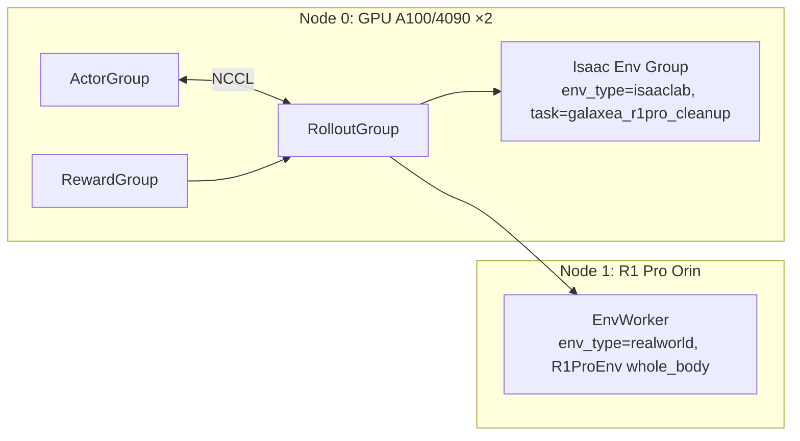

**双臂冲突检查流程**：

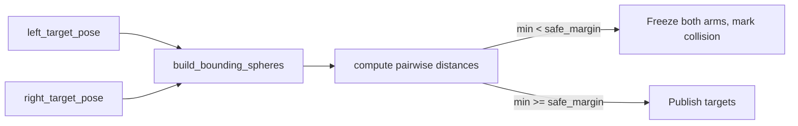

---

## 附录 A：HDAS / mobiman ↔ RLinf 字段映射总表

### A.1 动作（Env → ROS publish）

| RLinf 字段 | 适用阶段 | ROS 2 Topic | 消息类型 | 说明 |
|---|---|---|---|---|
| `action.right_arm.pose_delta[6]` | 1/2/3 | `/motion_target/target_pose_arm_right` | `geometry_msgs/PoseStamped` | 基于 relaxed IK，相对 `torso_link4` |
| `action.right_gripper[0]` | 1/2/3 | `/motion_target/target_position_gripper_right` | `sensor_msgs/JointState`(position[0]=0..100) | 或用 `std_msgs/Float32` 直发 `/motion_control/position_control_gripper_right` |
| `action.left_arm.pose_delta[6]` | 2/3 | `/motion_target/target_pose_arm_left` | `PoseStamped` | 同上 |
| `action.left_gripper[0]` | 2/3 | `/motion_target/target_position_gripper_left` | 同上 | |
| `action.torso.twist[4]` | 3 | `/motion_target/target_speed_torso` | `geometry_msgs/TwistStamped` | `linear.x=v_x, linear.z=v_z, angular.y=w_pitch, angular.z=w_yaw` |
| `action.chassis.twist[3]` | 3 | `/motion_target/target_speed_chassis` | `geometry_msgs/Twist` | `linear.{x,y}, angular.z`，范围 [-1.5,1.5] / [-3,3] |
| `action.chassis.acc_limit[3]` | 3 可选 | `/motion_target/chassis_acc_limit` | `Twist` | 限制加速度 |
| `action.chassis.brake` | 1/2/3 | `/motion_target/brake_mode` | `std_msgs/Bool` | 安全兜底 |

### A.2 观测（ROS subscribe → Env）

| RLinf 字段 | ROS 2 Topic | 说明 |
|---|---|---|
| `state.right_arm_q[7]` | `/hdas/feedback_arm_right` | position |
| `state.right_arm_v[7]` | `/hdas/feedback_arm_right` | velocity |
| `state.right_arm_tau[7]` | `/hdas/feedback_arm_right` | effort |
| `state.right_arm_errors[]` | `/hdas/feedback_status_arm_right` | errors |
| `state.right_gripper_stroke[1]` | `/hdas/feedback_gripper_right` | position |
| `state.right_ee_pose[7]` | `/motion_control/pose_ee_arm_right` | xyz + quat |
| `state.left_*` | 对称 | |
| `state.torso_q[4]` | `/hdas/feedback_torso` | |
| `state.chassis_q[3]` | `/hdas/feedback_chassis` | angle |
| `state.chassis_v[3]` | `/hdas/feedback_chassis` | velocity |
| `state.floating_base_pose[7]` | `/motion_control/pose_floating_base` | |
| `state.imu_chassis[10]` | `/hdas/imu_chassis` | orient(4)+ang_vel(3)+lin_acc(3) |
| `state.imu_torso[10]` | `/hdas/imu_torso` | |
| `state.bms.{voltage,current,capital}` | `/hdas/bms` | capital=% |
| `frames.head_left` | `/hdas/camera_head/left_raw/image_raw_color/compressed` | JPEG |
| `frames.wrist_right.rgb` | `/hdas/camera_wrist_right/color/image_raw/compressed` | |
| `frames.wrist_right.depth` | `/hdas/camera_wrist_right/aligned_depth_to_color/image_raw` | 16UC1 |
| `frames.head.depth` | `/hdas/camera_head/depth/depth_registered` | 32FC1 |
| `frames.chassis_{front_left,front_right,left,right,rear}` | `/hdas/camera_chassis_*/rgb/compressed` | |
| `lidar.scan` (降采样) | `/hdas/lidar_chassis_left` | PointCloud2 |
| `teleop.joystick` | `/controller` | data + mode |

### A.3 控制命令（底层，可选直发而非 mobiman）

| 用途 | Topic | 注意 |
|---|---|---|
| 关节控制右臂（低层） | `/motion_control/control_arm_right` | `hdas_msg/motor_control`，需要自行填 kp/kd/t_ff |
| 关节控制左臂 | `/motion_control/control_arm_left` | 同上 |
| 夹爪底层 | `/motion_control/control_gripper_right` | 建议用 mobiman 上层 |
| 躯干 | `/motion_control/control_torso` | **CANNOT PUBLISH**（文档明示） |
| 底盘 | `/motion_control/control_chassis` | 建议仅用 `target_speed_chassis` |

推荐始终走 mobiman 上层接口，底层控制仅在高级研究需要时启用。

---

## 附录 B：安全参数样例 YAML

```yaml
# examples/embodiment/config/env/realworld_r1pro_safety_default.yaml
safety:
  ros_watchdog_timeout_ms: 200
  bms_low_battery_threshold: 20.0

  right_arm:
    ee_pose_limit_min: [0.20, -0.35, 0.05, -3.20, -0.30, -0.30]
    ee_pose_limit_max: [0.65,  0.35, 0.65,  3.20,  0.30,  0.30]
    max_linear_step_m: 0.05
    max_angular_step_rad: 0.2
    joint_limits_min: [-2.7, -1.8, -2.7, -3.0, -2.7, -0.1, -2.7]
    joint_limits_max: [ 2.7,  1.8,  2.7,  0.0,  2.7,  3.7,  2.7]

  left_arm:
    ee_pose_limit_min: [0.20, -0.35, 0.05, -3.20, -0.30, -0.30]
    ee_pose_limit_max: [0.65,  0.35, 0.65,  3.20,  0.30,  0.30]

  dual_arm_collision:
    enable: true
    sphere_radius_m: 0.08
    min_distance_m: 0.05

  torso:
    v_x_limit: 0.10
    v_z_limit: 0.10
    w_pitch_limit: 0.30
    w_yaw_limit: 0.30

  chassis:
    v_x_limit: 0.60
    v_y_limit: 0.60
    w_z_limit: 1.50
    acc_limit: [1.0, 0.5, 0.8]
    lidar_near_obstacle_m: 0.50
    auto_brake_on_stale_state_ms: 150

  joystick:
    estop_switch: SWD
    estop_on_value: DOWN
    operator_heartbeat_topic: /rlinf/operator_heartbeat
    operator_heartbeat_timeout_ms: 1500
```

---

## 附录 C：诊断 / 运行命令速查

```bash
# 上电后（每次重启必做）
tmux
bash ~/can.sh
source ~/galaxea/install/setup.bash
cd ~/galaxea/install/startup_config/share/startup_config/script
./robot_startup.sh boot ../sessions.d/ATCStandard/R1PROBody.d/

# 分离启动核心驱动
ros2 launch HDAS r1pro.py
ros2 launch signal_camera_node signal_camera.py
ros2 launch signal_camera_node signal_camera_head.py
ros2 launch livox_ros_driver2 msg_MID360_launch.py
ros2 launch mobiman r1_pro_right_arm_relaxed_ik.py
ros2 launch mobiman r1_gripperController.py robot_type:=R1PRO
ros2 launch mobiman r1_pro_chassis_control_launch.py
ros2 launch mobiman torso_control_example_launch.py

# 频率 / 健康检查
ros2 topic hz /hdas/feedback_arm_right         # 期望 >= 100 Hz
ros2 topic hz /hdas/camera_wrist_right/color/image_raw/compressed  # 期望 ~= 30 Hz
ros2 topic echo -n 1 /hdas/bms
ros2 topic echo -n 1 /controller
ros2 node list
ros2 topic list | grep /hdas

# RLinf 侧：启动 Ray（两节点）
# Node 0 (GPU)
export RLINF_NODE_RANK=0
source ray_utils/realworld/setup_before_ray.sh
ray start --head --port=6379 --node-ip-address=<gpu_ip>

# Node 1 (Orin)
export RLINF_NODE_RANK=1
source ray_utils/realworld/setup_before_ray_r1pro.sh
ray start --address=<gpu_ip>:6379

# 训练（只在 head 节点）
bash examples/embodiment/run_realworld_r1pro.sh realworld_r1pro_right_arm_rlpd_cnn_async

# 采集
bash examples/embodiment/collect_data_r1pro.sh realworld_collect_data_r1pro_right_arm

# 在线诊断
python -m toolkits.realworld_check.test_r1pro_camera
python -m toolkits.realworld_check.test_r1pro_controller
python -m toolkits.realworld_check.test_r1pro_safety
```

---

## 附录 D：与 Franka 例子的 Diff 清单

| 范畴 | Franka 现状 | R1 Pro 新增 / 改动 |
|---|---|---|
| 硬件注册 | `FrankaRobot` + `FrankaConfig`（ping + camera SDK 校验） | 新增 `GalaxeaR1ProRobot` + `GalaxeaR1ProConfig`（ROS2 source + rclpy 校验 + CAN up 检测 + BMS 阈值字段） |
| 控制器 | `FrankaController`（ROS1 rospy 阻抗） | `R1ProController`（ROS2 rclpy + mobiman pose 控制 + 可选 joint / chassis / torso 支路） |
| 相机 | `RealSenseCamera` / `ZEDCamera`（SDK 直连） | 新增 `R1ProROSCamera`（订阅压缩图 + 对齐深度） |
| 夹爪 | Franka 内置 ROS / Robotiq Modbus | G1 夹爪：直接用 mobiman 的 `target_position_gripper_*`（0–100） |
| 遥操作 | SpaceMouse / GELLO | 继承两者 + 新增 `R1ProJoystickIntervention`（订阅 `/controller`） |
| 安全盒 | 单臂位置 + rpy 窗 | 双臂 + 躯干速度 + 底盘速度 + LiDAR 近障 + BMS 电量 |
| Reward | 几何 + ResNet + 键盘 | 同 + 双臂 target + VLM/VLA 可选 |
| Ray 前置 | `setup_before_ray.sh`（source venv / catkin） | `setup_before_ray_r1pro.sh`（source ROS2 Humble + galaxea install + CAN 检查） |
| 配置 node_group | `franka` | `galaxea_r1pro`（`hardware.type: GalaxeaR1Pro`） |
| 启动依赖 | libfranka + franka_ros + serl_franka_controllers | R1 Pro 预装（`~/galaxea/install`）+ ROS2 Humble |
| 算法配置 | 已提供 SAC/RLPD/Async PPO/DAgger | 同套配置直接复用（env 换） |
| 数据采集 | `realworld_collect_data*.yaml` | `realworld_collect_data_r1pro*.yaml` |
| 文档 | `examples/embodied/franka.rst` | 新增 `galaxea_r1pro.rst`（EN + ZH） |

---

## 结语

本方案以 **最小侵入**、**可分阶段交付**、**安全优先** 为核心设计理念，把 RLinf 已在 Franka 上打磨成熟的真机 RL 栈平滑迁移至 Galaxea R1 Pro。与官方文档相比，本方案显式给出：

- 控制回路的 p50/p95 时延预算；
- 多级（L1–L5）安全闸门与 FMEA 风险表；
- ROS 2 Humble 与 ROS 1 两种中间层方案的决策矩阵；
- 完整的文件 / YAML / 脚本骨架；
- 分阶段的退出 KPI 与 CI 流水线。

任何实装变更应严格走本仓库既有 PR 流程（CONTRIBUTING.md / AGENTS.md），并补齐 RST 文档（EN + ZH）、docker stage 与 e2e test（至少 dummy 级别）。真机验证需在受控实验室环境、独立 reviewer 在场条件下进行。
