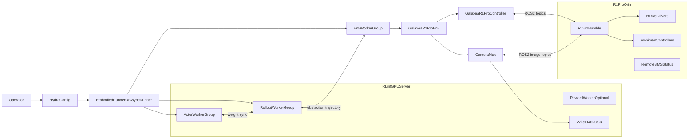
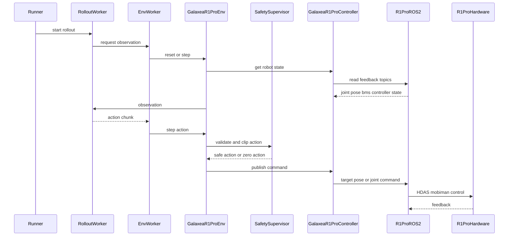
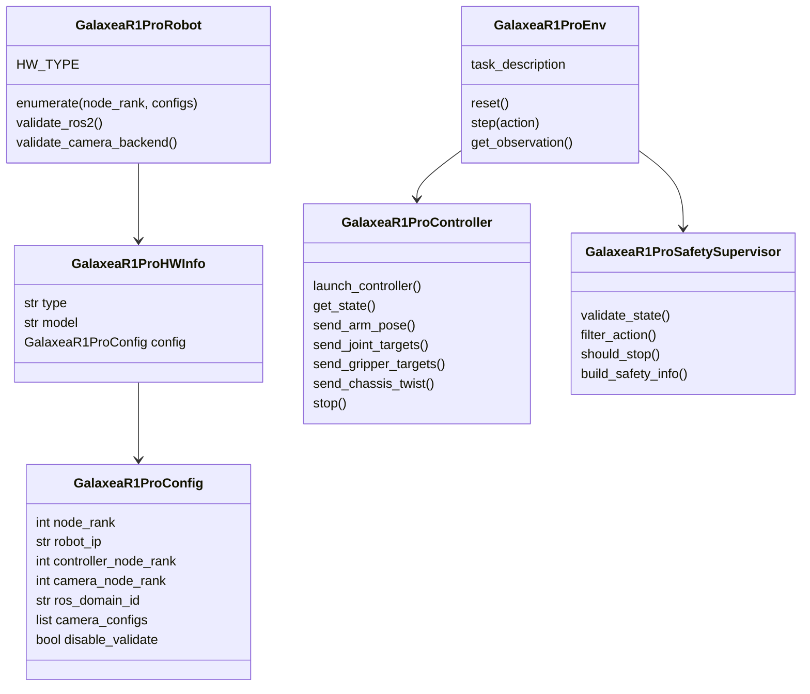
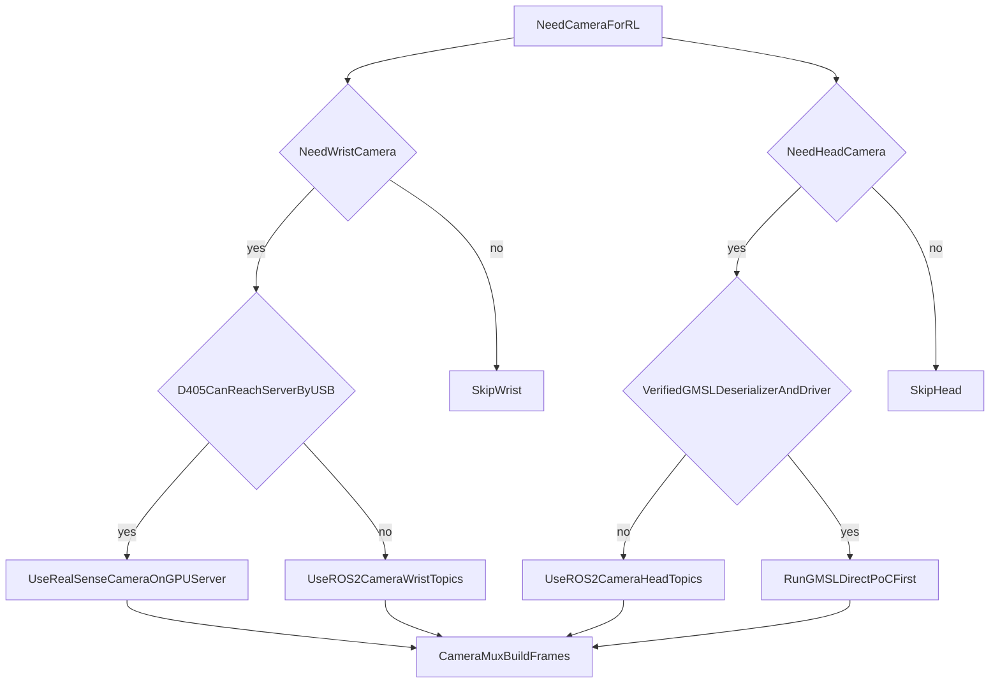
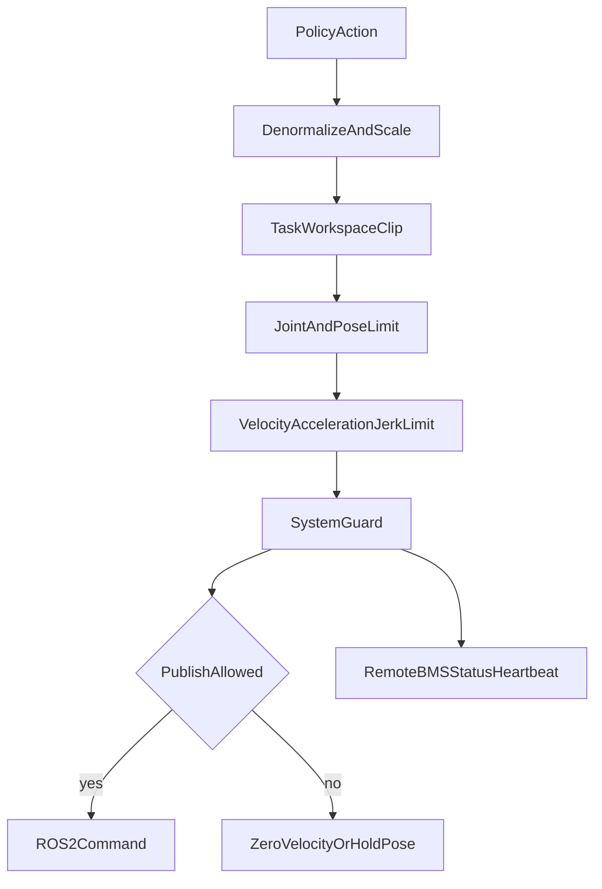
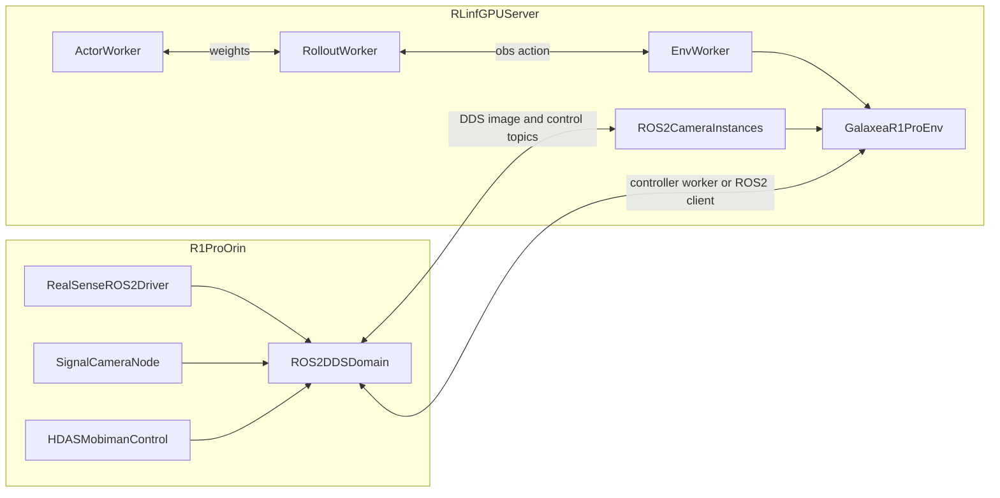

# RLinf × Galaxea R1 Pro 真机强化学习设计与实现方案

> 目标：把 RLinf 接入 Galaxea R1 Pro，形成可落地的真机在线 RL / HG-DAgger / Sim-Real Co-Training 工程方案。腕部相机优先支持通过 USB 直连 RLinf GPU 服务器；其它执行器、底盘、躯干、BMS、遥控器、头部与底盘相机默认通过 R1 Pro Orin 上的 ROS2 Humble / HDAS / mobiman 与 RLinf 通信。
>
> 本文以本地 RLinf 代码库为实现基准，不把方案稿写成已实现代码。所有新增类、目录与文件名遵循本次指定命名规范：`GalaxeaR1Pro*`、`galaxear/`、`r1_pro_*`。

---

## 目录

1. [执行摘要](#1-执行摘要)
2. [事实基线](#2-事实基线)
3. [竞争方案评审与本方案改进](#3-竞争方案评审与本方案改进)
4. [目标、边界与验收指标](#4-目标边界与验收指标)
5. [总体架构](#5-总体架构)
6. [RLinf 代码级落点](#6-rlinf-代码级落点)
7. [Galaxea R1 Pro ROS2 接口映射](#7-galaxea-r1-pro-ros2-接口映射)
8. [相机系统设计：USB 直连与 ROS2 双路径](#8-相机系统设计usb-直连与-ros2-双路径)
9. [控制、状态与动作空间设计](#9-控制状态与动作空间设计)
10. [安全体系设计](#10-安全体系设计)
11. [任务与训练路线](#11-任务与训练路线)
12. [部署、联调与 Runbook](#12-部署联调与-runbook)
13. [测试矩阵与可观测性](#13-测试矩阵与可观测性)
14. [实施里程碑](#14-实施里程碑)
15. [风险、FMEA 与回退策略](#15-风险fmea-与回退策略)
16. [附录：文件、配置与 Topic 清单](#16-附录文件配置与-topic-清单)

---

## 1. 执行摘要

R1 Pro 不是一条“更长的 Franka 手臂”，而是一个移动双臂人形平台：双 A2 机械臂、双 G1 夹爪、4 DoF 躯干、3 转向轮底盘、头部/腕部/底盘多相机、LiDAR、IMU、BMS 与遥控器共同组成 26 DoF 真机系统。把它接入 RLinf 的核心挑战不是写一个 `gym.Env`，而是在真机安全、ROS2 中间层、相机链路、Ray 多节点放置、异步训练、人工接管和数据治理之间建立稳定边界。

本方案采用“最小侵入 RLinf 内核、清晰扩展真机分支”的路线：

- 复用 RLinf 已有 `env_type: realworld`、`RealWorldEnv`、`EnvWorker`、`AsyncEmbodiedRunner`、`EmbodiedRewardWorker.launch_for_realworld`、`Hardware.register()` 与 `NodeHardwareConfig` 机制。
- 新增 R1 Pro 专属硬件、环境、控制器、状态、安全与任务模块，避免把 Galaxea ROS2 细节泄漏到 Franka / XSquare 现有路径。
- 相机采用双路径：腕部 Intel RealSense D405 支持 USB 直连 GPU 服务器；头部 GMSL 定制相机、底盘相机与保守部署路径通过 ROS2 `sensor_msgs` 订阅。
- 控制仍以 R1 Pro Orin 为边缘控制节点，RLinf GPU 服务器只做训练、策略推理、可选相机直连采集与奖励模型推理。
- 安全前置到 action 下发前，并把急停、遥控器模式、BMS、电机状态、心跳、动作裁剪和人工接管都纳入统一 `GalaxeaR1ProSafetySupervisor`。

推荐首个 MVP 不做全身移动操作，而是“右臂桌面单臂操作 + 右腕 D405 直连 + 头部 ROS2 图像 + CNN SAC/RLPD 或 HG-DAgger”。该范围最接近 RLinf Franka 真机范式，能够先验证从 `EnvWorker` 到 ROS2 控制再到策略训练的闭环。

---

## 2. 事实基线

### 2.1 RLinf 已有真机能力

本地 RLinf 真机路径的稳定基线如下：

| 层 | 已有能力 | 关键路径 |
|---|---|---|
| 环境入口 | `SupportedEnvType.REALWORLD` 返回 `RealWorldEnv` | `rlinf/envs/__init__.py` |
| 真机外层 Env | `RealWorldEnv` 通过 `gym.make(init_params.id)` 创建具体机器人 Env，并统一包装观测 | `rlinf/envs/realworld/realworld_env.py` |
| Franka 内层 Env | `FrankaEnv` 处理硬件注入、相机、动作、安全盒、reward model | `rlinf/envs/realworld/franka/franka_env.py` |
| 硬件抽象 | `Hardware.register()`、`HardwareInfo`、`NodeHardwareConfig.register_hardware_config()` | `rlinf/scheduler/hardware/hardware.py` |
| Franka 硬件 | IP ping、RealSense/ZED SDK 校验、相机序列号校验、`controller_node_rank` | `rlinf/scheduler/hardware/robots/franka.py` |
| 相机 | `BaseCamera` 后台线程与最新帧队列，`create_camera` 支持 RealSense / ZED | `rlinf/envs/realworld/common/camera/` |
| ROS | 现有 `ROSController` 仅支持 ROS1 / rospy | `rlinf/envs/realworld/common/ros/ros_controller.py` |
| 奖励模型 | 真机可通过 `standalone_realworld` 在 Env 侧启动 reward worker | `rlinf/workers/reward/reward_worker.py` |

这意味着 R1 Pro 不应该新增一个独立顶层训练框架，也不应该绕开 `RealWorldEnv`。正确做法是复用真机主链路，并在机器人专属模块中处理 ROS2、相机与安全差异。

### 2.2 Galaxea R1 Pro 官方事实

| 类别 | 事实 |
|---|---|
| 操作系统 / 中间件 | Ubuntu 22.04 LTS，ROS2 Humble 为推荐路径 |
| 计算 | Jetson AGX Orin，8 核 CPU，200 TOPS，32GB LPDDR5，1TB SSD |
| 运动机构 | 26 DoF：双臂各 7 DoF，双夹爪，4 DoF 躯干，6 DoF 底盘 |
| 手臂 | Galaxea A2，单臂额定负载约 3.5kg，当前 A2 电机无抱闸，断电有下落风险 |
| 夹爪 | Galaxea G1，行程控制范围通常按 0 到 100 表达 |
| 相机 | 头部双目/GMSL 定制相机，腕部可选 2 路深度相机，底盘 5 路单目相机 |
| 腕部相机 | 竞争资料与官方变更信息指向 Intel RealSense D405，适合 USB 直连 |
| 头部相机 | 不是已证实的 ZED 2；官方描述为 GMSL / `signal_camera_node` 驱动的定制模组 |
| 启动 | 需要 CAN、`robot_startup.sh`、HDAS、mobiman 等节点按顺序启动 |
| 安全 | 软件急停、硬急停、遥控器 SWA/SWB/SWC/SWD 模式、空旷 1.5m 操作区 |

### 2.3 R1 Pro 相机事实表

| 位置 | 推荐事实表述 | 默认接入策略 | 可选接入策略 |
|---|---|---|---|
| 左/右腕 | Intel RealSense D405，USB 深度相机 | USB 直连 GPU 服务器，用 `RealSenseCamera` | 仍通过 Orin ROS2 `/hdas/camera_wrist_*` |
| 头部 | Galaxea 定制 GMSL 立体/双目系统，`signal_camera_node` 驱动，型号未公开 | Orin ROS2 topic，用 `ROS2Camera` | 只有拿到可验证 GMSL 解串硬件和 Linux 驱动后再直连 |
| 底盘 | 5 路 GMSL 单目相机 | 不进入 MVP；移动操作阶段可用 ROS2 topic | 仅导航或全身任务中选用 |

关键修正：不能把头部相机默认写成 ZED 2，也不能把 `pyzed` 作为头部直连默认方案。ZED 相关实现仍可作为 RLinf 相机抽象参考，但不是 R1 Pro 头部相机事实基线。

---

## 3. 竞争方案评审与本方案改进

### 3.1 现有方案的优点

| 方案 | 值得继承的点 |
|---|---|
| `r1pro1op47.md` | 资料锚点细、HDAS/mobiman 映射详、KPI 与诊断命令有工程价值 |
| `r1pro2op46.md` | 全栈覆盖广，架构图、数据流、代码骨架与任务路线完整 |
| `r1pro3prem.md` | 强调代码基线、已存在/待新增边界、Runbook、FMEA、Go/No-Go |
| `r1proCamDirect1Op46.md` | 控制与图像分离的物理思路清晰，腕部 USB 直连收益明确 |
| `r1proCamDirect2Op46.md` | 更正头部非 ZED，确认腕部 D405，给出头部 GMSL 的保守策略 |

### 3.2 共性不足

1. 命名规范不统一：`r1pro`、`galaxea_r1pro`、`galaxea.py` 等路径互相冲突。
2. 有些章节把“待实现设计”写成“仓库已有实现”，容易误导后续开发。
3. 相机所在节点、EnvWorker 所在节点、控制器所在节点没有完全对齐 Ray placement。
4. 头部相机直连缺少可验证硬件链路时，部分方案仍默认 ZED / USB SDK 路线。
5. 安全常被写成附录，而不是 action 发布前的主链路。
6. 延迟口径混杂：曝光/读出、USB SDK、ROS2 DDS、策略闭环经常被合并成一个数字。

### 3.3 本方案的改进点

本方案做四个裁决：

- 命名裁决：全部按用户指定路径和类名，即 `galaxea_r1_pro.py`、`galaxear/`、`r1_pro_*`、`GalaxeaR1Pro*`。
- 相机裁决：腕部 D405 可直连；头部 GMSL 默认 ROS2；GMSL 直连只作为 PoC 后的增强。
- 调度裁决：谁连接 USB 相机，谁运行对应相机采集线程；谁能访问 Orin ROS2，谁运行控制器 Worker。不要让 EnvWorker 逻辑与物理设备所在节点脱节。
- 安全裁决：安全不是 wrapper 装饰，而是控制器下发前的必经闸门。

---

## 4. 目标、边界与验收指标

### 4.1 项目目标

| 阶段 | 目标 | 推荐算法 | 推荐感知 |
|---|---|---|---|
| MVP | 单臂桌面操作闭环，右臂 + 右夹爪 | SAC/RLPD CNN 或 HG-DAgger | 右腕 D405 + 头部 ROS2 RGB |
| 阶段 2 | 双臂协作操作 | Async PPO / HG-DAgger / OpenPI | 双腕 D405 + 头部图像 |
| 阶段 3 | 躯干参与的移动操作 | HG-DAgger + RL-Co | 腕部 + 头部 + 低维 proprioception |
| 阶段 4 | 全身移动操作与导航融合 | 分层策略 / VLA + 低层安全控制 | 可加入 LiDAR / 底盘相机 |

### 4.2 非目标

- 不在第一阶段直接训练底盘高速移动策略。
- 不默认改造头部 GMSL 硬件线束。
- 不把 ROS2 控制节点搬离 Orin，除非 Galaxea SDK 明确支持外部主机直接控制。
- 不修改 RLinf 核心 Runner / Channel 语义来适配 R1 Pro。
- 不在本方案文档中宣称新增代码已经存在。

### 4.3 关键验收指标

| 类别 | 指标 | MVP 目标 |
|---|---|---|
| 控制 | `env/control_loop_hz` | 稳定 10Hz，目标 15Hz |
| 延迟 | `safety/control_p95_latency_ms` | 小于 80ms，优化目标小于 50ms |
| 图像 | 腕部 D405 有效帧率 | 30fps 采集，训练链路可按 10-15Hz 消费 |
| 安全 | action limit violation | 训练前期允许计数但必须被裁剪，真机越界下发为 0 |
| 人工接管 | `env/intervene_rate` | HG-DAgger 阶段可记录并下降 |
| 训练 | 单臂任务成功率 | 数据采集后逐步达到可复现实验目标 |
| 稳定性 | 无急停训练时长 | 单次连续 30 分钟无非预期停机 |

---

## 5. 总体架构

### 5.1 系统上下文



### 5.2 推荐部署拓扑

MVP 推荐两节点或三逻辑角色：

| 角色 | 物理位置 | 运行内容 |
|---|---|---|
| Ray head / GPU 训练节点 | GPU 服务器 | Actor、Rollout、Reward、日志、可选 EnvWorker |
| 相机采集节点 | GPU 服务器 | 直连 D405 的 `RealSenseCamera` 线程 |
| 控制节点 | R1 Pro Orin | ROS2、HDAS、mobiman、`GalaxeaR1ProController` |

如果 EnvWorker 放在 GPU 服务器，它可以直接读 USB D405，但控制器 Worker 必须通过 Ray `NodePlacementStrategy` 放到 Orin 或通过 ROS2 网络访问 Orin topic。如果 EnvWorker 放在 Orin，则 USB 直连服务器的收益会变弱，因为图像还要跨网络回传给 EnvWorker。因此本方案推荐：

- `GalaxeaR1ProEnv` 逻辑在 GPU 服务器 EnvWorker 中运行。
- `GalaxeaR1ProController` 作为独立 Worker 放到 Orin，封装 ROS2 控制。
- `ROS2Camera` 可在 GPU 服务器订阅 Orin DDS topic；腕部 D405 直连服务器时用 `RealSenseCamera`。
- 如果 DDS 跨主机不稳定，则让 Orin 运行 ROS2 bridge / image relay，GPU 服务器只订阅必要 topic。

### 5.3 运行时序



### 5.4 组件边界



---

## 6. RLinf 代码级落点

### 6.1 已有代码清单

| 用途 | 已有路径 | 复用方式 |
|---|---|---|
| 真机外层 Env | `rlinf/envs/realworld/realworld_env.py` | 保持 `env_type: realworld`，用新 Gym id 创建 R1 Pro Env |
| Franka Env 参考 | `rlinf/envs/realworld/franka/franka_env.py` | 参考配置 dataclass、硬件注入、相机打开、reward worker |
| 相机抽象 | `rlinf/envs/realworld/common/camera/base_camera.py` | `ROS2Camera` 继承 `BaseCamera` |
| RealSense | `rlinf/envs/realworld/common/camera/realsense_camera.py` | 腕部 D405 直连直接复用 |
| 相机工厂 | `rlinf/envs/realworld/common/camera/__init__.py` | 增加 `ros2` / `ros2_compressed` backend 分支 |
| 硬件注册 | `rlinf/scheduler/hardware/hardware.py` | 注册 `GalaxeaR1ProRobot` 与 `GalaxeaR1ProConfig` |
| Franka 硬件参考 | `rlinf/scheduler/hardware/robots/franka.py` | 参考 `controller_node_rank` 和相机校验 |
| ROS1 参考 | `rlinf/envs/realworld/common/ros/ros_controller.py` | 只参考接口思想，不复用实现 |

### 6.2 建议新增文件

| 文件 | 类 / 内容 | 说明 |
|---|---|---|
| `rlinf/scheduler/hardware/robots/galaxea_r1_pro.py` | `GalaxeaR1ProRobot`、`GalaxeaR1ProConfig`、`GalaxeaR1ProHWInfo` | 硬件注册与校验 |
| `rlinf/envs/realworld/galaxear/__init__.py` | Gym 注册和导出 | 与 Franka tasks 注册模式一致 |
| `rlinf/envs/realworld/galaxear/r1_pro_env.py` | `GalaxeaR1ProEnv`、`GalaxeaR1ProRobotConfig` | 真机 Gym Env 主体 |
| `rlinf/envs/realworld/galaxear/r1_pro_controller.py` | `GalaxeaR1ProController` | ROS2 Worker 控制器 |
| `rlinf/envs/realworld/galaxear/r1_pro_robot_state.py` | `GalaxeaR1ProRobotState` | 统一状态容器 |
| `rlinf/envs/realworld/galaxear/r1_pro_safety.py` | `GalaxeaR1ProSafetySupervisor` | action 安全闸门 |
| `rlinf/envs/realworld/galaxear/r1_pro_ros2.py` | `GalaxeaR1ProROS2Client` | 可选封装 `rclpy` pub/sub |
| `rlinf/envs/realworld/galaxear/tasks/r1_pro_single_arm_reach.py` | `GalaxeaR1ProSingleArmReachEnv` | MVP 几何任务 |
| `rlinf/envs/realworld/galaxear/tasks/r1_pro_pick_place.py` | `GalaxeaR1ProPickPlaceEnv` | 桌面抓放任务 |
| `rlinf/envs/realworld/common/camera/ros2_camera.py` | `ROS2Camera` | ROS2 图像订阅相机 |

### 6.3 需要导出的模块

后续实现时需要更新：

- `rlinf/scheduler/hardware/robots/__init__.py`
- `rlinf/scheduler/hardware/__init__.py`
- `rlinf/scheduler/__init__.py`
- `rlinf/envs/realworld/__init__.py`
- `rlinf/envs/realworld/common/camera/__init__.py`

这些导出只应暴露稳定接口。Galaxea 专用 ROS2 消息导入应延迟到运行时，避免 GPU 服务器缺少 ROS2 workspace 时仅 import RLinf 就失败。

### 6.4 Gym 注册建议

建议注册以下 id：

| Gym id | 用途 |
|---|---|
| `GalaxeaR1ProEnv-v1` | 通用 R1 Pro Env |
| `GalaxeaR1ProSingleArmReach-v1` | 单臂 reach / safety bring-up |
| `GalaxeaR1ProPickPlace-v1` | MVP 桌面抓放 |
| `GalaxeaR1ProDualArmHandover-v1` | 阶段 2 双臂递交 |
| `GalaxeaR1ProMobileManipulation-v1` | 阶段 3 移动操作 |

---

## 7. Galaxea R1 Pro ROS2 接口映射

### 7.1 HDAS 驱动层

| 功能 | Topic | 消息类型 | RLinf 用途 |
|---|---|---|---|
| 左臂反馈 | `/hdas/feedback_arm_left` | `sensor_msgs/JointState` | 左臂 proprioception |
| 右臂反馈 | `/hdas/feedback_arm_right` | `sensor_msgs/JointState` | 右臂 proprioception |
| 左夹爪反馈 | `/hdas/feedback_gripper_left` | `sensor_msgs/JointState` | 夹爪状态 |
| 右夹爪反馈 | `/hdas/feedback_gripper_right` | `sensor_msgs/JointState` | 夹爪状态 |
| 手臂状态 | `/hdas/feedback_status_arm_left/right` | `hdas_msg/feedback_status` | 错误码、安全停机 |
| 躯干反馈 | `/hdas/feedback_torso` | `sensor_msgs/JointState` | torso state |
| 底盘反馈 | `/hdas/feedback_chassis` | `sensor_msgs/JointState` | chassis state |
| BMS | `/hdas/bms` | `hdas_msg/bms` | 电量、电压、电流安全 |
| 遥控器 | `/controller` | `hdas_msg/controller_signal_stamped` | 人工接管和模式判定 |

### 7.2 mobiman 运动控制层

| 控制方式 | Topic | 消息类型 | 推荐阶段 |
|---|---|---|---|
| 左臂末端 pose | `/motion_target/target_pose_arm_left` | `geometry_msgs/PoseStamped` | 单臂/双臂操作 |
| 右臂末端 pose | `/motion_target/target_pose_arm_right` | `geometry_msgs/PoseStamped` | MVP |
| 左臂关节目标 | `/motion_target/target_joint_state_arm_left` | `sensor_msgs/JointState` | reset / 低层调试 |
| 右臂关节目标 | `/motion_target/target_joint_state_arm_right` | `sensor_msgs/JointState` | reset / 低层调试 |
| 躯干关节目标 | `/motion_target/target_joint_state_torso` | `sensor_msgs/JointState` | reset |
| 左夹爪位置 | `/motion_target/target_position_gripper_left` | `sensor_msgs/JointState` 或官方当前版本指定类型 | 抓取 |
| 右夹爪位置 | `/motion_target/target_position_gripper_right` | `sensor_msgs/JointState` 或官方当前版本指定类型 | MVP |
| 躯干速度 | `/motion_target/target_speed_torso` | `geometry_msgs/TwistStamped` | 阶段 3 |
| 底盘速度 | `/motion_target/target_speed_chassis` | `geometry_msgs/Twist` | 阶段 4 |

注意：Galaxea 文档里同一功能在 HDAS driver 与 mobiman controller 层可能出现不同 topic 或消息类型描述。实现前必须以机器人当前 SDK 的 `ros2 topic info`、`ros2 interface show`、`ros2 topic echo` 为最终依据。

### 7.3 相机 topic

| 相机 | Topic | 消息类型 | 推荐 key |
|---|---|---|---|
| 左腕 RGB | `/hdas/camera_wrist_left/color/image_raw/compressed` | `sensor_msgs/CompressedImage` | `wrist_left_rgb` |
| 右腕 RGB | `/hdas/camera_wrist_right/color/image_raw/compressed` | `sensor_msgs/CompressedImage` | `wrist_right_rgb` |
| 左腕深度 | `/hdas/camera_wrist_left/aligned_depth_to_color/image_raw` | `sensor_msgs/Image` `16UC1` | `wrist_left_depth` |
| 右腕深度 | `/hdas/camera_wrist_right/aligned_depth_to_color/image_raw` | `sensor_msgs/Image` `16UC1` | `wrist_right_depth` |
| 头部 RGB | `/hdas/camera_head/left_raw/image_raw_color/compressed` | `sensor_msgs/CompressedImage` | `head_rgb` |
| 头部深度 | `/hdas/camera_head/depth/depth_registered` | `sensor_msgs/Image` `32FC1` | `head_depth` |

---

## 8. 相机系统设计：USB 直连与 ROS2 双路径

### 8.1 决策树



### 8.2 腕部 D405 直连

腕部 D405 是第一优先级优化对象，因为它具有标准 USB 路径，可复用 RLinf `RealSenseCamera`。

建议配置能力：

| 配置项 | 含义 |
|---|---|
| `camera_type: realsense` | 走 `RealSenseCamera` |
| `serial_number` | 从直连服务器 `pyrealsense2` 枚举，或从 Orin `/opt/galaxea/sensor/realsense/RS_LEFT` / `RS_RIGHT` 迁移 |
| `resolution` | MVP 可先 640×480 或 848×480，后续按任务提高 |
| `fps` | 30fps 采集，Env 按控制频率消费最新帧 |
| `enable_depth` | 先 RGB，若任务需要近距离几何再打开深度 |
| `align_depth_to_color` | 需要在 `RealSenseCamera` 或上层预处理里明确 |

物理建议：

- 使用高质量 USB 3 主动线或光纤延长线，避免移动底盘拖拽。
- 机器人移动场景必须使用线缆拖链或只在固定工作区训练。
- 每次训练前运行 `rs-enumerate-devices` 或 Python 枚举确认序列号。
- 直连后 Orin 上对应 `realsense2_camera` 应停用，避免同一相机被两侧争抢。

### 8.3 头部 GMSL 相机策略

头部相机默认不直连。原因：

1. 官方描述是 GMSL + `signal_camera_node`，不是 ZED SDK 路径。
2. GMSL 直连需要匹配解串器、驱动、设备树或采集卡，且要确认线缆和相机供电。
3. 真机 RL MVP 更需要稳定闭环，不应把硬件逆向改造放在首要路径。

可选 PoC 条件：

| 条件 | 验收 |
|---|---|
| 明确相机型号与 SerDes 芯片 | 有供应商文档或 Galaxea 确认 |
| Linux 服务器可识别采集设备 | 有 `/dev/video*` 或厂商 SDK 枚举 |
| 时间戳稳定 | 连续 30 分钟无断流 |
| 与 ROS2 头部图像画面对齐 | 视场、畸变、曝光可标定 |
| 不影响急停与保修 | 现场安全负责人确认 |

### 8.4 ROS2Camera 设计

`ROS2Camera` 应继承 `BaseCamera`，保持与 `RealSenseCamera` / `ZEDCamera` 相同的 `open()`、`close()`、`get_frame()` 语义。

建议职责：

- 延迟导入 `rclpy`、`sensor_msgs`、`cv_bridge` 或 OpenCV 解码逻辑。
- 支持 `sensor_msgs/CompressedImage` JPEG 解码为 BGR `uint8`。
- 支持 `sensor_msgs/Image` 的 `16UC1`、`32FC1` 深度帧转 numpy。
- 用最新帧覆盖队列，避免训练消费旧帧。
- 记录 ROS timestamp、到达时间、解码耗时和丢帧计数。
- 支持 QoS preset：`best_effort_sensor_data`、`reliable_low_rate`。

### 8.5 延迟口径

| 口径 | 包含内容 | 典型关注 |
|---|---|---|
| 传感器曝光/读出 | 相机硬件采样、曝光、sensor readout | 无法靠 RLinf 消除 |
| SDK/USB 处理 | USB 传输、SDK 帧组装、颜色/深度对齐 | D405 直连优化重点 |
| ROS2/DDS 处理 | Orin 驱动、JPEG 编码、DDS、网络、解码 | ROS2 路径优化重点 |
| Env step 闭环 | 观测、策略推理、action 安全过滤、ROS2 发布、反馈 | RL 训练实际感知 |

文档和日志中必须分开记录这些指标，避免把“USB 额外处理 1-3ms”误写成“端到端视觉闭环 1-3ms”。

---

## 9. 控制、状态与动作空间设计

### 9.1 状态容器

`GalaxeaR1ProRobotState` 建议包含：

| 字段 | 形状 | 来源 |
|---|---|---|
| `left_arm_qpos` | `(7,)` | `/hdas/feedback_arm_left.position` |
| `left_arm_qvel` | `(7,)` | `/hdas/feedback_arm_left.velocity` |
| `right_arm_qpos` | `(7,)` | `/hdas/feedback_arm_right.position` |
| `right_arm_qvel` | `(7,)` | `/hdas/feedback_arm_right.velocity` |
| `left_gripper` | `(1,)` | `/hdas/feedback_gripper_left` |
| `right_gripper` | `(1,)` | `/hdas/feedback_gripper_right` |
| `torso_qpos` | `(4,)` | `/hdas/feedback_torso` |
| `chassis_state` | `(6,)` 或结构体 | `/hdas/feedback_chassis` |
| `bms` | 结构体 | `/hdas/bms` |
| `controller_mode` | 标量/枚举 | `/controller` |
| `status_errors` | dict | `/hdas/feedback_status_*` |

### 9.2 MVP 动作空间

推荐 MVP 使用右臂末端 delta pose + 右夹爪：

| 动作分量 | 维度 | 语义 |
|---|---:|---|
| `delta_xyz` | 3 | `torso_link4` 或任务工作坐标系下的小位移 |
| `delta_rpy` | 3 | 小角度增量 |
| `gripper` | 1 | 开合命令，映射到 0 到 100 |

总维度 7，与 Franka 现有真机任务接近。这样可以最大程度复用 RLinf 的 CNN SAC / RLPD / PPO / DAgger 管线。

### 9.3 双臂阶段动作空间

双臂阶段建议不要一开始让策略直接输出 16 到 18 维裸关节控制，而采用结构化动作：

| 分量 | 维度 |
|---|---:|
| 左臂 `delta_xyzrpy` | 6 |
| 左夹爪 | 1 |
| 右臂 `delta_xyzrpy` | 6 |
| 右夹爪 | 1 |
| 可选 torso delta / velocity | 0 到 4 |

底盘不进入同一连续动作向量，除非任务已经有成熟安全边界和低速导航约束。

### 9.4 控制模式选择

| 控制模式 | 优点 | 风险 | 推荐用途 |
|---|---|---|---|
| mobiman 末端 pose | 与任务空间一致，策略维度低 | IK 成功率、初始化姿态要求 | MVP 操作 |
| joint tracker | 可控性强，适合 reset | 策略探索风险高 | reset / 轨迹回放 / 低层调试 |
| gripper position | 简单稳定 | 类型随 SDK 版本需核对 | 抓取 |
| torso speed | 可连续调整工作空间 | 容易带来全身碰撞 | 阶段 3 |
| chassis speed | 移动能力强 | 96kg 移动平台风险高 | 阶段 4，只能低速 |

---

## 10. 安全体系设计

### 10.1 五级安全闸门



### 10.2 SafetySupervisor 职责

`GalaxeaR1ProSafetySupervisor` 应作为 `GalaxeaR1ProEnv.step()` 内的必经逻辑：

1. 检查遥控器模式是否允许 ECU / 主机接管。
2. 检查急停、错误码、电池电量、电压电流、ROS2 topic 心跳。
3. 检查目标 pose 是否在任务工作空间盒内。
4. 检查目标关节、速度、加速度和 jerk 是否低于限制。
5. 检查相机帧是否过期，避免视觉闭环用 stale observation。
6. 输出 `safe_action` 与 `safety_info`，并把裁剪和拒绝原因写入 `info`。

### 10.3 真机 Go / No-Go 清单

训练前必须逐项确认：

| 项 | Go 条件 |
|---|---|
| 场地 | 机器人周围至少 1.5m 清空，线缆不进入轮子和关节空间 |
| 机械 | 手臂和夹爪安装正确，A2 无抱闸风险已用支撑/姿态规避 |
| 电源 | BMS 电量足够，充电线未连接移动平台 |
| ROS2 | `ROS_DOMAIN_ID` 明确，topic 列表完整，控制节点无重复 |
| CAN | `can0` 正常，HDAS 无关键错误 |
| 相机 | D405 序列号匹配，ROS2 图像帧率正常 |
| 急停 | 硬急停、软件急停、Ctrl+C、策略停机命令均演练过 |
| 策略 | 使用低增益、低 action scale、短 episode、人工在旁 |

### 10.4 停机等级

| 等级 | 触发 | 行为 |
|---|---|---|
| Soft Hold | 单次 action 越界、图像短暂过期 | 保持当前 pose 或发送零速 |
| Safe Stop | 心跳超时、遥控器模式切换、BMS 低电量 | 停止所有策略 action，等待人工确认 |
| Emergency Stop | 急停、连续错误码、失控运动 | 立即停止，必要时硬急停，后续重启 CAN/ROS2 |

---

## 11. 任务与训练路线

### 11.1 MVP：右臂桌面 Pick-and-Place

推荐理由：

- 动作空间与 Franka 7D 接近。
- 可用右腕 D405 观察抓取区域，头部图像提供全局视角。
- 奖励可从几何阈值、键盘 wrapper、reward model 逐步演进。
- 不需要底盘和 torso 大范围运动。

建议观测：

| key | 内容 |
|---|---|
| `states` | 右臂 qpos/qvel、右夹爪、可选 torso |
| `main_images` | `wrist_right_rgb` |
| `extra_view_images` | `head_rgb`、可选 `wrist_right_depth` |
| `task_descriptions` | 任务语言，如 `pick the cube and place it into the bowl` |

### 11.2 数据采集与 HG-DAgger

推荐路径：

1. 使用 SpaceMouse / 键盘 / Galaxea 官方遥控器采集安全示范。
2. 导出 LeRobot 或 RLinf 已支持 replay buffer 格式。
3. 训练 OpenPI / CNN 初始策略。
4. 进入 HG-DAgger：策略执行，人类只在危险或失败趋势时接管。
5. `algorithm.dagger.only_save_expert: True` 场景下只保存专家干预步，降低劣质策略样本污染。

### 11.3 SAC / RLPD 路线

适合低维 CNN 策略：

- 先用示范 buffer 做 RLPD warm start。
- 只在小 workspace 内探索。
- `action_scale` 从极小值开始，如位置单步毫米级到厘米级。
- reward 初期可以用人工键盘成功/失败，再逐步引入 reward model。

### 11.4 Async PPO / VLA 路线

适合 VLA / OpenPI 类策略：

- 需要 GPU 服务器承担 rollout / actor。
- 真机 Env step 与训练解耦，避免训练 update 阻塞机器人。
- 控制频率应由 Env 的 action chunk 和安全监督器固定，不受模型 update 抖动影响。

### 11.5 Sim-Real Co-Training

R1 Pro 官方 IsaacSim 资源可作为数字孪生起点，但不能直接等价于 RLinf 已有 ManiSkill Franka 示例。建议：

1. 先把任务定义、相机 key、动作空间与真机对齐。
2. 在 IsaacSim 中实现同名 observation/action schema。
3. 用仿真 PPO 提升探索，用真机 SFT/DAgger 数据保持真实域先验。
4. 记录 ROS2 图像和 USB D405 原图的域差，必要时训练时随机混合压缩、延迟、曝光扰动。

---

## 12. 部署、联调与 Runbook

### 12.1 网络与环境变量

| 项 | 建议 |
|---|---|
| Ray | 所有节点启动前设置 `RLINF_NODE_RANK` |
| ROS2 | 明确 `ROS_DOMAIN_ID`，避免实验室其它 ROS2 设备串扰 |
| DDS | 先在同交换机有线网络验证，再考虑跨网段 |
| 防火墙 | 放通 ROS2 DDS 与 Ray 所需端口，或限制到实验 VLAN |
| 时钟 | GPU 服务器与 Orin 使用 NTP / chrony 对时 |

### 12.2 Orin 启动顺序

```bash
# 1. SSH 到机器人
ssh nvidia@<r1pro_ip>

# 2. 启动 CAN
bash ~/can.sh

# 3. source Galaxea SDK
source ~/galaxea/install/setup.bash

# 4. 启动 R1 Pro driver / HDAS / mobiman
cd ~/galaxea/install/startup_config/share/startup_config/script
./robot_startup.sh boot ../sessions.d/ATCStandard/R1PROBody.d/

# 5. 验证关键 topic
ros2 topic list
ros2 topic hz /hdas/feedback_arm_right
ros2 topic hz /hdas/camera_head/left_raw/image_raw_color/compressed
```

### 12.3 GPU 服务器相机验证

```bash
# RealSense SDK 检查
python - <<'PY'
import pyrealsense2 as rs
ctx = rs.context()
for dev in ctx.devices:
    print(dev.get_info(rs.camera_info.name), dev.get_info(rs.camera_info.serial_number))
PY
```

### 12.4 Ray 启动顺序

```bash
# GPU server
export RLINF_NODE_RANK=0
ray start --head --port=6379 --node-ip-address=<gpu_server_ip>

# R1 Pro Orin
export RLINF_NODE_RANK=1
ray start --address=<gpu_server_ip>:6379
```

注意：Galaxea SDK、ROS2 环境、`PYTHONPATH`、`LD_LIBRARY_PATH` 必须在 Orin 上 `ray start` 前配置好，因为 Ray worker 会继承启动时环境。

### 12.5 最小联调顺序

1. 只启动 ROS2，验证 R1 Pro 官方 demo 和急停。
2. 只启动相机，验证 D405 直连与头部 ROS2 图像。
3. 启动 Ray，两节点 `Cluster` 能发现硬件。
4. `is_dummy=True` 跑通 `GalaxeaR1ProEnv` import、reset、observation schema。
5. 真机只读模式：Env 订阅状态和图像，但不发布 action。
6. 低速 joint reset：只允许固定目标姿态。
7. 单步 action：人工确认每次 action 后再继续。
8. 短 episode 闭环：10 到 20 step，禁用训练，只测试 rollout。
9. 启用 SAC/RLPD 或 HG-DAgger。

---

## 13. 测试矩阵与可观测性

### 13.1 单元测试

| 测试 | 目标 |
|---|---|
| `GalaxeaR1ProConfig` dataclass | YAML 字段解析、默认值、IP/节点 rank 校验 |
| `NodeHardwareConfig` | `hardware.type` 能注册并创建 config |
| `ROS2Camera` mock | compressed image 解码、深度帧解析、超时处理 |
| Safety supervisor | 越界裁剪、心跳过期、BMS 低电量拒绝 action |
| Env dummy | `reset/step` 返回符合 RLinf `RealWorldEnv._wrap_obs` 的 dict |

### 13.2 硬件在环测试

| 测试 | 验收 |
|---|---|
| topic health | 关键反馈 topic 连续 10 分钟不断流 |
| camera health | D405 与 ROS2 图像帧率和 timestamp 正常 |
| action dry-run | action 经过 safety 但不发布，记录裁剪结果 |
| low-speed publish | 单步 pose command 可控且可停止 |
| emergency stop drill | 急停后系统进入 Safe Stop，不继续发 action |

### 13.3 指标命名建议

| 命名空间 | 指标 |
|---|---|
| `env/` | `step_hz`、`episode_len`、`intervene_rate` |
| `camera/` | `wrist_right_fps`、`head_rgb_fps`、`frame_age_ms`、`decode_ms` |
| `safety/` | `limit_violation_count`、`stop_reason`、`heartbeat_timeout` |
| `ros2/` | `topic_drop_count`、`publish_latency_ms`、`feedback_age_ms` |
| `train/` | `success_rate`、`return`、`q_loss`、`actor_loss` |

---

## 14. 实施里程碑

### M0：只读与 dummy 闭环

- 新增硬件 config 与 Gym env，但 `is_dummy=True` 不连接真机。
- `RealWorldEnv` 能创建 `GalaxeaR1ProEnv`。
- dummy observation/action schema 与训练配置能跑通。

### M1：真机只读

- `GalaxeaR1ProController` 可订阅关节、夹爪、BMS、遥控器。
- `ROS2Camera` 可订阅头部图像。
- GPU 服务器可读取直连 D405。
- 不发布任何运动命令。

### M2：安全低速控制

- 实现 reset pose、单步末端 pose、夹爪开合。
- Safety supervisor 完整拦截。
- 人工急停演练通过。

### M3：MVP 单臂 RL

- 右臂桌面任务。
- 数据采集、SAC/RLPD 或 HG-DAgger。
- reward 可先人工，再引入 reward model。

### M4：双臂与 torso

- 双臂 observation/action schema。
- 双臂安全盒与互碰风险约束。
- torso 只在低速、短行程内参与。

### M5：移动操作

- 引入底盘速度控制。
- 只在标定场地和低速下运行。
- 与导航系统或外部 planner 分层协作。

---

## 15. 风险、FMEA 与回退策略

| 风险 | 严重度 | 原因 | 检测 | 缓解 / 回退 |
|---|---|---|---|---|
| A2 无抱闸导致断电下落 | 高 | 官方提示当前 A2 电机无 brake | 断电/急停演练 | 训练姿态避开危险，必要时机械支撑 |
| ROS2 节点串扰 | 高 | 默认 LAN discovery | `ros2 node list` 出现外部节点 | 固定 `ROS_DOMAIN_ID`，实验 VLAN |
| 头部相机被误认为 ZED | 中 | 旧方案假设错误 | SDK 无法枚举 ZED | 默认走 `ROS2Camera`，GMSL 直连先 PoC |
| USB 线缆拖拽 | 高 | 腕部 D405 直连服务器 | 线缆进入轮子/关节 | 固定工作区、拖链、拉力释放 |
| EnvWorker 与相机物理节点不一致 | 中 | Ray placement 配错 | 图像跨节点延迟异常 | 相机在哪，采集线程就在哪 |
| DDS 图像丢帧 | 中 | 压缩图带宽和 QoS | `frame_age_ms` 上升 | 降分辨率、best effort、只取关键相机 |
| action 越界 | 高 | 策略探索 | safety violation | 裁剪、零速、缩小 action scale |
| BMS 低电量训练 | 中 | 长时间真机运行 | `/hdas/bms` | 低电量 Safe Stop |
| reward model 误判 | 中 | 视觉域差 | 成功率与人工标签冲突 | 先人工 reward，reward model 只辅助 |
| Sim-to-real 域差 | 中 | IsaacSim 与真机不同 | 真机成功率低 | SFT 真机数据、视觉扰动、短 horizon |

---

## 16. 附录：文件、配置与 Topic 清单

### 16.1 建议配置骨架

```yaml
env:
  train:
    env_type: realworld
    init_params:
      id: GalaxeaR1ProPickPlace-v1
    main_image_key: wrist_right_rgb
    group_size: 1
    auto_reset: false
    override_cfg:
      is_dummy: false
      active_arms: [right]
      control_mode: ee_pose
      step_frequency: 10.0
      action_scale: [0.01, 0.05, 1.0]
      enable_camera_player: true
      cameras:
        wrist_right_rgb:
          camera_type: realsense
          serial_number: "<D405_SERIAL>"
          resolution: [640, 480]
          fps: 30
        head_rgb:
          camera_type: ros2
          topic: /hdas/camera_head/left_raw/image_raw_color/compressed
          encoding: compressed_bgr

cluster:
  num_nodes: 2
  node_groups:
    - label: gpu
      node_ranks: [0]
    - label: r1pro
      node_ranks: [1]
      hardware:
        type: GalaxeaR1Pro
        configs:
          - node_rank: 1
            robot_ip: "<R1PRO_IP>"
            controller_node_rank: 1
            camera_node_rank: 0
            ros_domain_id: 72
            disable_validate: false
```

### 16.2 新增文件清单

| 状态 | 路径 |
|---|---|
| 拟新增 | `rlinf/scheduler/hardware/robots/galaxea_r1_pro.py` |
| 拟新增 | `rlinf/envs/realworld/galaxear/r1_pro_env.py` |
| 拟新增 | `rlinf/envs/realworld/galaxear/r1_pro_controller.py` |
| 拟新增 | `rlinf/envs/realworld/galaxear/r1_pro_robot_state.py` |
| 拟新增 | `rlinf/envs/realworld/galaxear/r1_pro_safety.py` |
| 拟新增 | `rlinf/envs/realworld/galaxear/tasks/r1_pro_pick_place.py` |
| 拟新增 | `rlinf/envs/realworld/common/camera/ros2_camera.py` |
| 需更新 | `rlinf/envs/realworld/common/camera/__init__.py` |
| 需更新 | `rlinf/envs/realworld/__init__.py` |
| 需更新 | `rlinf/scheduler/hardware/robots/__init__.py` |

### 16.3 核心 Topic 速查

| 类别 | Topic |
|---|---|
| 手臂反馈 | `/hdas/feedback_arm_left`、`/hdas/feedback_arm_right` |
| 夹爪反馈 | `/hdas/feedback_gripper_left`、`/hdas/feedback_gripper_right` |
| 手臂目标 pose | `/motion_target/target_pose_arm_left`、`/motion_target/target_pose_arm_right` |
| 手臂目标 joint | `/motion_target/target_joint_state_arm_left`、`/motion_target/target_joint_state_arm_right` |
| 夹爪目标 | `/motion_target/target_position_gripper_left`、`/motion_target/target_position_gripper_right` |
| 躯干 | `/hdas/feedback_torso`、`/motion_target/target_speed_torso` |
| 底盘 | `/hdas/feedback_chassis`、`/motion_target/target_speed_chassis` |
| 安全 | `/controller`、`/hdas/bms`、`/hdas/feedback_status_*` |
| 腕部相机 | `/hdas/camera_wrist_left/color/image_raw/compressed`、`/hdas/camera_wrist_right/color/image_raw/compressed` |
| 头部相机 | `/hdas/camera_head/left_raw/image_raw_color/compressed`、`/hdas/camera_head/depth/depth_registered` |

### 16.4 最终建议

R1 Pro 接入 RLinf 的第一性原则是：把真实世界的不确定性关在清晰边界里。RLinf 负责分布式训练、调度、异步流水线和数据闭环；R1 Pro Orin 负责硬件驱动、ROS2、HDAS 和 mobiman；新建的 Galaxea R1 Pro 适配层负责把二者用安全、可观测、可回退的方式连接起来。

第一版不追求全身能力，而追求“单臂闭环足够稳、相机路径足够清楚、安全停机足够可靠”。只有这个基座稳定，双臂、躯干、底盘和 VLA 在线学习才有工程意义。

---

## 17. 附录：腕部与头部相机全 ROS2 接入方案

前文推荐腕部 D405 在条件允许时直连 GPU 服务器，以降低额外图像链路延迟。但工程落地时也经常需要一个“完全不改机器人线束”的保守方案：腕部和头部相机都保留在 R1 Pro Orin 上，由 Galaxea 官方驱动发布 ROS2 topic，RLinf 通过 `ROS2Camera` 订阅图像。这一路线牺牲一部分延迟和图像质量控制权，换来更低的硬件改造风险、更适合移动训练的线缆安全，以及更高的官方 SDK 兼容性。

### 17.1 适用场景

全 ROS2 相机方案适合以下情况：

| 场景 | 原因 |
|---|---|
| 移动操作或底盘参与训练 | USB 长线会带来拖拽、缠绕和轮组卷线风险 |
| 不希望改动腕部 D405 线束 | 保持 Galaxea 出厂接线和维护边界 |
| 多台 R1 Pro 并行采集 | 每台机器人自带 Orin 相机管线，GPU 服务器只订阅必要流 |
| 现场尚未完成 USB 直连验收 | 先跑通训练闭环，再逐步优化相机链路 |
| 需要头部和腕部统一时间源 | 所有图像先在 Orin ROS2 域内发布，便于统一 timestamp 诊断 |

不适合的情况也要写清楚：如果任务强依赖腕部近距离深度、需要 20Hz 以上低延迟视觉伺服，或 reward model 对 JPEG 压缩伪影非常敏感，仍应优先评估腕部 D405 直连。

### 17.2 架构设计



这个拓扑有两个可选部署方式：

| 拓扑 | EnvWorker 位置 | 相机订阅位置 | 优点 | 风险 |
|---|---|---|---|---|
| GPU 侧 EnvWorker | GPU 服务器 | GPU 服务器订阅 ROS2 图像 | 训练、reward、图像预处理都在 GPU 侧，模型路径简单 | DDS 图像跨网，带宽和 QoS 要认真调 |
| Orin 侧 EnvWorker | R1 Pro Orin | Orin 本机订阅 ROS2 图像 | 图像和控制都在机器人本机，ROS2 最稳定 | Orin 算力有限，图像仍需传给 GPU rollout/reward |

MVP 推荐 GPU 侧 EnvWorker，因为 RLinf 的训练、rollout、reward worker 通常已经在 GPU 服务器，图像进入模型前不需要再从 Orin 经 Ray 二次转发。若现场 DDS 跨机不稳定，再退回 Orin 侧 EnvWorker 或增加专用 image relay。

### 17.3 ROS2Camera 实现设计

`ROS2Camera` 仍放在 `rlinf/envs/realworld/common/camera/ros2_camera.py`，作为通用相机 backend，而不是 Galaxea 专属类。Galaxea 只提供 topic 配置。

建议配置模型：

| 字段 | 含义 |
|---|---|
| `camera_type: ros2` | 让 `create_camera()` 创建 `ROS2Camera` |
| `topic` | ROS2 图像 topic |
| `message_type` | `compressed_image` 或 `image` |
| `encoding` | `compressed_bgr`、`16UC1`、`32FC1` 等 |
| `qos_profile` | `sensor_data_best_effort`、`reliable` 或自定义 |
| `frame_timeout_s` | `get_frame()` 最大等待时间 |
| `max_frame_age_ms` | 训练可接受的最大帧龄 |
| `resize` | 进入 RLinf 前的图像尺寸 |
| `decode_on_callback` | 是否在 ROS callback 内解码 |
| `drop_stale_frames` | 是否丢弃过期帧 |

关键实现原则：

1. `rclpy`、`sensor_msgs`、`cv_bridge` 等依赖必须延迟导入，避免非 ROS 节点 import RLinf 失败。
2. 每路相机维护一个最新帧缓存，而不是无界队列，防止训练消费旧帧。
3. callback 记录 `msg.header.stamp`、本机接收时间、解码完成时间。
4. `CompressedImage` 用 OpenCV `imdecode` 转 BGR `uint8`；深度 `Image` 按 encoding 转 numpy。
5. `get_frame()` 返回图像，同时内部保留元信息供 Env 写入 `info["camera"]`。
6. 如果 `max_frame_age_ms` 超限，默认抛出可识别异常或返回 stale 标记，由 `GalaxeaR1ProSafetySupervisor` 决定 hold / stop。

### 17.4 Topic 与观测 key 映射

| 观测 key | Topic | 消息类型 | 建议用途 |
|---|---|---|---|
| `wrist_left_rgb` | `/hdas/camera_wrist_left/color/image_raw/compressed` | `sensor_msgs/CompressedImage` | 左手近距离 RGB |
| `wrist_right_rgb` | `/hdas/camera_wrist_right/color/image_raw/compressed` | `sensor_msgs/CompressedImage` | MVP 右手主视角 |
| `wrist_left_depth` | `/hdas/camera_wrist_left/aligned_depth_to_color/image_raw` | `sensor_msgs/Image` `16UC1` | 左手深度，可选 |
| `wrist_right_depth` | `/hdas/camera_wrist_right/aligned_depth_to_color/image_raw` | `sensor_msgs/Image` `16UC1` | 右手抓取深度 |
| `head_rgb` | `/hdas/camera_head/left_raw/image_raw_color/compressed` | `sensor_msgs/CompressedImage` | 全局 RGB |
| `head_depth` | `/hdas/camera_head/depth/depth_registered` | `sensor_msgs/Image` `32FC1` | 全局深度，可选 |

MVP 建议只启用 `wrist_right_rgb` 与 `head_rgb`，先保证闭环稳定。深度帧带宽和处理成本更高，应在抓取成功率确实受几何信息限制时再启用。

### 17.5 同步与时间戳策略

全 ROS2 相机方案不要假设多路图像天然同步。R1 Pro 的腕部和头部由不同驱动发布，即使都在 Orin 上，也可能存在不同采样时刻、编码耗时和 DDS 调度延迟。

建议分三层处理：

| 层 | 策略 |
|---|---|
| 采集层 | 保留每帧 `header.stamp` 与接收时间，不覆盖为当前时间 |
| Env 层 | 每次 step 取各路相机最新帧，并计算 `frame_age_ms` 与跨相机 `stamp_delta_ms` |
| 策略层 | 若 `stamp_delta_ms` 超阈值，选择 hold action、降级到单主视角或记录低置信度 |

推荐阈值：

| 指标 | MVP 建议 |
|---|---|
| 单帧最大年龄 | `max_frame_age_ms <= 150` |
| 腕部与头部 RGB 时间差 | `stamp_delta_ms <= 100` |
| 连续 stale 帧容忍 | 不超过 3 个 Env step |
| 深度帧使用条件 | 深度帧年龄不大于对应 RGB 2 倍 step 周期 |

### 17.6 QoS、带宽与降载

图像 topic 通常更适合 sensor data 风格 QoS：允许丢旧帧，优先保持最新帧。训练闭环不需要“可靠地收到每一帧旧图像”，而需要“及时拿到当前图像”。

| 项 | 推荐 |
|---|---|
| RGB QoS | `best_effort` + 小队列，优先低延迟 |
| 深度 QoS | 可先 `best_effort`，若丢帧严重再按低频 reliable 测试 |
| 队列深度 | 1 到 3 |
| 分辨率 | MVP 可在 `ROS2Camera` 中 resize 到 224 或 256 方形输入 |
| 帧率 | 驱动 15 到 30fps，Env 10Hz 消费最新帧 |
| 压缩 | 保留官方 JPEG 压缩；训练时可加入 JPEG 增强以降低域差 |

带宽估算要按启用相机数逐步打开：

1. 只启用 `wrist_right_rgb`。
2. 加 `head_rgb`。
3. 再加 `wrist_right_depth`。
4. 最后再考虑左腕或底盘相机。

如果出现 DDS 丢帧、Ray 延迟上升或 GPU 服务器 CPU 解码过高，应优先降分辨率、减少相机路数、把深度改为低频采样，而不是盲目提高 QoS reliable。

### 17.7 配置片段

```yaml
env:
  train:
    env_type: realworld
    init_params:
      id: GalaxeaR1ProPickPlace-v1
    main_image_key: wrist_right_rgb
    override_cfg:
      is_dummy: false
      camera_transport: ros2
      cameras:
        wrist_right_rgb:
          camera_type: ros2
          topic: /hdas/camera_wrist_right/color/image_raw/compressed
          message_type: compressed_image
          encoding: compressed_bgr
          qos_profile: sensor_data_best_effort
          fps: 30
          resize: [224, 224]
          max_frame_age_ms: 150
        wrist_right_depth:
          camera_type: ros2
          topic: /hdas/camera_wrist_right/aligned_depth_to_color/image_raw
          message_type: image
          encoding: 16UC1
          qos_profile: sensor_data_best_effort
          fps: 15
          enabled: false
        head_rgb:
          camera_type: ros2
          topic: /hdas/camera_head/left_raw/image_raw_color/compressed
          message_type: compressed_image
          encoding: compressed_bgr
          qos_profile: sensor_data_best_effort
          fps: 30
          resize: [224, 224]
          max_frame_age_ms: 150
      camera_sync:
        max_stamp_delta_ms: 100
        stale_policy: hold_action

cluster:
  num_nodes: 2
  node_groups:
    - label: gpu
      node_ranks: [0]
    - label: r1pro
      node_ranks: [1]
      hardware:
        type: GalaxeaR1Pro
        configs:
          - node_rank: 1
            robot_ip: "<R1PRO_IP>"
            controller_node_rank: 1
            camera_node_rank: 0
            camera_transport: ros2
            ros_domain_id: 72
```

这里 `camera_node_rank: 0` 表示 GPU 服务器侧创建 `ROS2Camera` 并通过 DDS 订阅 Orin 图像。若部署为 Orin 侧 EnvWorker，可把 `camera_node_rank` 改为 1，并同步调整 `component_placement`。

### 17.8 部署步骤

#### 17.8.1 Orin 侧

```bash
ssh nvidia@<r1pro_ip>
export ROS_DOMAIN_ID=72
export ROS_LOCALHOST_ONLY=0
source ~/galaxea/install/setup.bash

# 启动 CAN 与机器人驱动
bash ~/can.sh
cd ~/galaxea/install/startup_config/share/startup_config/script
./robot_startup.sh boot ../sessions.d/ATCStandard/R1PROBody.d/

# 验证相机 topic
ros2 topic hz /hdas/camera_wrist_right/color/image_raw/compressed
ros2 topic hz /hdas/camera_head/left_raw/image_raw_color/compressed
ros2 topic hz /hdas/camera_wrist_right/aligned_depth_to_color/image_raw
```

#### 17.8.2 GPU 服务器侧

```bash
export ROS_DOMAIN_ID=72
export ROS_LOCALHOST_ONLY=0
source /opt/ros/humble/setup.bash

# 验证能看到 Orin 发布的 topic
ros2 topic list | grep /hdas/camera
ros2 topic hz /hdas/camera_wrist_right/color/image_raw/compressed

# 再启动 Ray head 与 RLinf
export RLINF_NODE_RANK=0
ray start --head --port=6379 --node-ip-address=<gpu_server_ip>
```

#### 17.8.3 Ray worker 侧

```bash
ssh nvidia@<r1pro_ip>
export ROS_DOMAIN_ID=72
export RLINF_NODE_RANK=1
source ~/galaxea/install/setup.bash
ray start --address=<gpu_server_ip>:6379
```

关键点：`ROS_DOMAIN_ID`、ROS2 workspace、Galaxea SDK 环境必须在 `ray start` 前配置好，否则 Ray worker 内部可能找不到 ROS2 消息类型或看不到 topic。

### 17.9 测试计划

| 测试层 | 测试项 | 验收标准 |
|---|---|---|
| ROS2 topic | `ros2 topic hz` | 腕部 RGB、头部 RGB 连续 10 分钟稳定 |
| 解码 | `ROS2Camera` mock compressed frame | JPEG 解码后 shape、dtype 正确 |
| 深度 | `16UC1` / `32FC1` frame | 深度 numpy dtype 和尺度记录清楚 |
| 延迟 | `frame_age_ms` | p95 小于 150ms，超过阈值可触发 hold |
| 同步 | `stamp_delta_ms` | 腕部和头部 RGB p95 小于 100ms |
| 带宽 | 开启 1/2/3 路相机 | Ray rollout 延迟无明显长尾 |
| 长稳 | 30 到 60 分钟空跑 | 无断流、无内存增长、无 callback 堵塞 |
| 安全 | stale frame 注入 | 连续 stale 后不继续发布策略 action |
| 训练 dry-run | 固定 policy 或 replay action | Env step、obs、info、metrics 完整 |

### 17.10 指标与日志

建议 `GalaxeaR1ProEnv` 每个 step 写入：

| 指标 | 含义 |
|---|---|
| `camera/<key>/fps` | 最近窗口实际接收帧率 |
| `camera/<key>/frame_age_ms` | 当前 Env step 使用帧的年龄 |
| `camera/<key>/decode_ms` | 解码耗时 |
| `camera/<key>/drop_count` | callback 或队列丢帧计数 |
| `camera/sync/stamp_delta_ms` | 主视角和辅助视角 timestamp 差 |
| `camera/stale_count` | stale frame 连续计数 |
| `safety/hold_due_to_camera` | 因相机异常触发 hold 的次数 |

这些指标比单纯 `ros2 topic hz` 更接近 RL 训练真实质量，因为它们描述的是“被策略实际消费的帧”。

### 17.11 故障与回退

| 故障 | 现象 | 处理 |
|---|---|---|
| GPU 服务器看不到 topic | `ros2 topic list` 无 `/hdas/camera` | 检查 `ROS_DOMAIN_ID`、`ROS_LOCALHOST_ONLY`、网络组播、防火墙 |
| RGB 延迟大 | `frame_age_ms` 长尾 | 降分辨率、减少相机路数、使用 best effort、小队列 |
| 深度丢帧严重 | depth fps 低或阻塞 | 关闭深度，先只用 RGB；或深度低频异步采样 |
| CPU 解码过高 | GPU 服务器 CPU 占用高 | 降帧率、降低分辨率、只保留主视角 |
| 多机 DDS 不稳定 | topic 间歇消失 | 使用固定 DDS 配置、同交换机 VLAN，必要时增加 image relay |
| 训练用旧帧 | stale_count 增长 | Safety 触发 hold_action，重启相机节点或降载 |

全 ROS2 相机方案的最终定位是“低改造、易部署、可移动”的稳妥路径。它不是最低延迟路径，但它最适合作为 R1 Pro 真机 RL 的第一条可复现基线：先证明 RLinf 与 Galaxea 官方 ROS2 管线可以稳定闭环，再按任务需求决定是否把腕部 D405 切换到 USB 直连。
