# R1 Pro 右臂 Pick-and-Place 真机强化学习训练方案

> **任务**: 在 Galaxea R1 Pro 的 Orin 上,用真实机器人进行强化学习训练,使右臂从桌面拾取指定颜色大小的方块并放入篮子。
>
> 本文档基于 RLinf 现有代码库深入分析,参考 SERL/HIL-SERL 最佳实践和已有设计文档 (v1–v6) 演进,给出一个**可落地**的完整工程方案。

---

## 目录

- [1. 任务定义与场景分析](#1-任务定义与场景分析)
- [2. 系统架构总览](#2-系统架构总览)
- [3. 算法选型与论证](#3-算法选型与论证)
- [4. 环境设计 (GalaxeaR1ProPickPlaceEnv)](#4-环境设计)
- [5. 观测空间设计](#5-观测空间设计)
- [6. 动作空间设计](#6-动作空间设计)
- [7. 视觉感知集成](#7-视觉感知集成)
- [8. 奖励函数设计](#8-奖励函数设计)
- [9. 安全系统配置](#9-安全系统配置)
- [10. 数据采集管线](#10-数据采集管线)
- [11. 重置编排](#11-重置编排)
- [12. 训练循环](#12-训练循环)
- [13. 部署与验证](#13-部署与验证)
- [14. 渐进式开发路线图](#14-渐进式开发路线图)
- [15. 风险与缓解](#15-风险与缓解)

---

# 1. 任务定义与场景分析

## 1.1 任务描述

| 维度 | 规格 |
|------|------|
| **机器人** | Galaxea R1 Pro — 仅使用右臂 7-DoF + 1-DoF 夹爪 |
| **物体** | 5 cm 彩色方块 (红/蓝/绿),重量 ≈ 50 g |
| **目标容器** | 桌面固定篮子,口径 ≈ 15 cm,深度 ≈ 10 cm |
| **桌面** | 浅色均匀背景,高度 ≈ 0.75 m |
| **成功条件** | 方块从 `pick_position` 被夹起、移动到 `place_position` 上方并释放入篮 |
| **控制频率** | 10 Hz (Env step_frequency) |
| **单集最大步数** | 200 步 = 20 s |
| **成功持续帧数** | 连续 5 步满足放置条件 (防止瞬时误判) |

## 1.2 物理环境布局

```
               ┌────────────────────────────────────────────────┐
               │                    桌面 (0.75 m)               │
               │                                                │
               │    ┌─────┐                    ┌──────────┐     │
               │    │方块  │                    │  篮子     │     │
               │    │pick  │                    │  place    │     │
               │    │(0.45,│                    │(0.45,     │     │
               │    │-0.10,│                    │ 0.10,     │     │
               │    │ 0.18)│                    │  0.30)    │     │
               │    └─────┘                    └──────────┘     │
               │                                                │
               └────────────────────────────────────────────────┘
                          ↑
                    R1 Pro 右臂
                    (base_link 处)
                    
               相机: 右手腕 RealSense D405 (USB 直连)
                     头部 ZED 2 (可选,ROS2 回退)
```

坐标系基于 R1 Pro 的 `torso_link4` 参考框架:
- **X 轴**: 机器人正前方 (远离躯干)
- **Y 轴**: 机器人左侧为正 (pick 在右 y=-0.10,place 在左 y=+0.10)
- **Z 轴**: 竖直向上 (桌面高度约 z=0.18,篮子顶部约 z=0.30)

## 1.3 四阶段任务分解

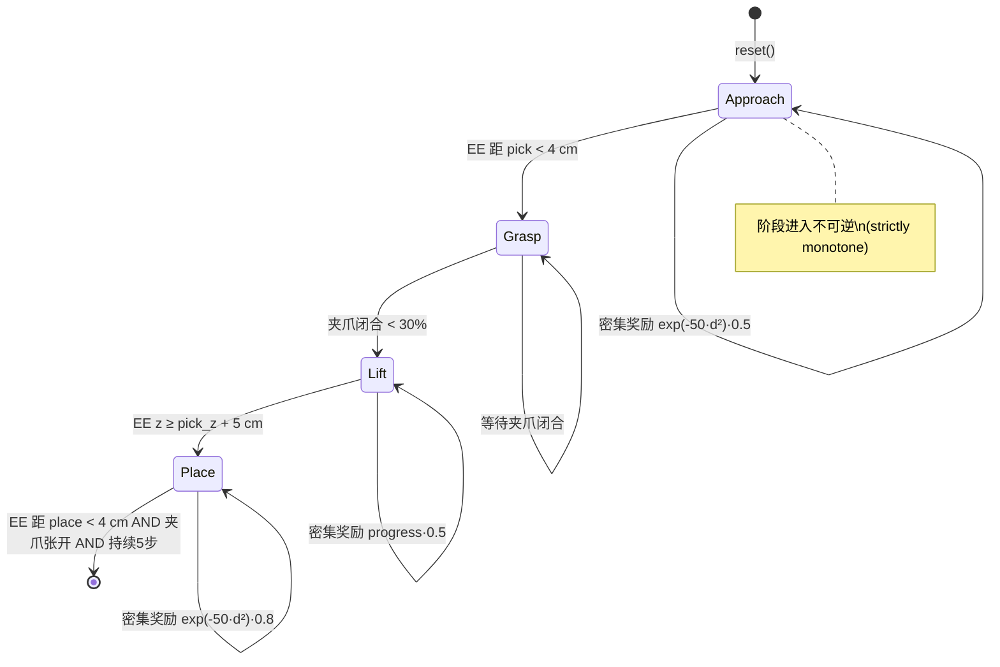

阶段推进严格单调: 一旦从 `approach` 进入 `grasp`,不会回退。这来自现有实现 `r1_pro_pick_place.py:94-98` 的 `_advance_to()` 方法,确保奖励信号不会因误判而振荡。

---

# 2. 系统架构总览

## 2.1 两种部署形态

R1 Pro 的部署有两种可选架构,本方案**推荐从 Orin 单机模式开始** (降低调试复杂度),待策略收敛后再迁移到 Cloud-Edge 模式做大规模训练。

### 形态 A: Orin 单机模式 (推荐起步)

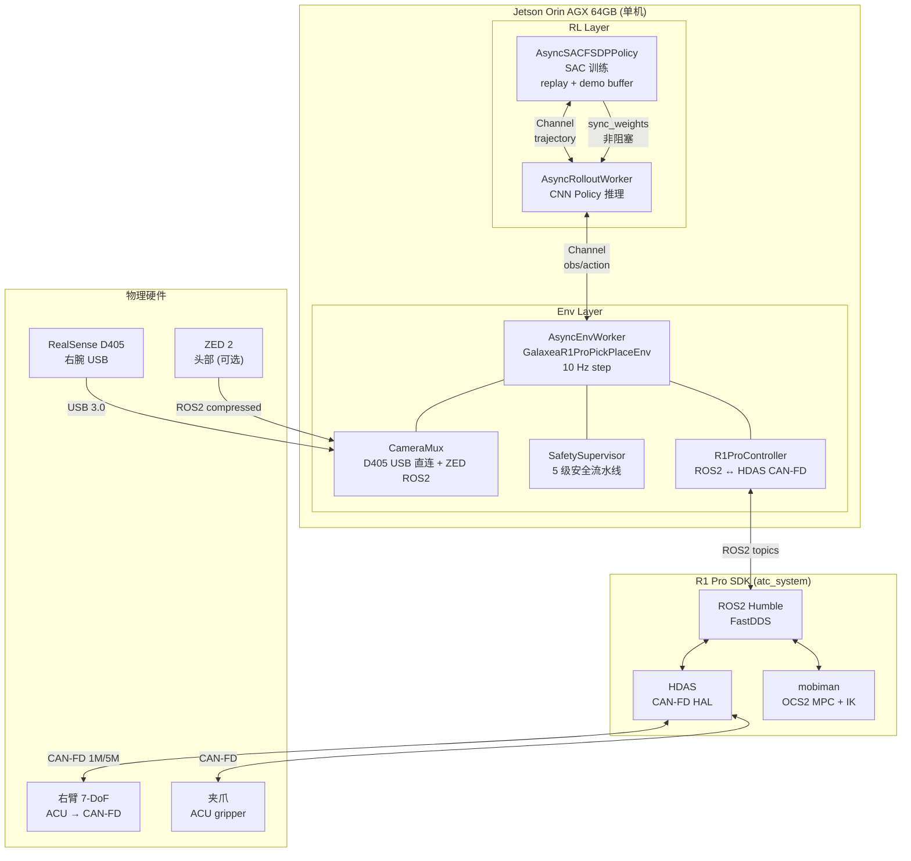

**Orin 资源预算** (64 GB 统一内存):

| 组件 | GPU 内存 | CPU 内存 | 备注 |
|------|---------|---------|------|
| CNN Policy (推理+训练) | ~1 GB | ~0.5 GB | 小型 CNN (ResNet-10 backbone) |
| SAC Q-networks ×2 + target ×2 | ~1.5 GB | ~0.5 GB | 与 policy 共享 encoder |
| Replay Buffer (200 轨迹) | — | ~8 GB | CPU 张量,预分配 |
| Demo Buffer (20 轨迹) | — | ~0.8 GB | 人类遥操作数据 |
| ROS2 / HDAS / SDK | — | ~2 GB | 常驻 |
| 系统 / 余量 | — | ~50 GB | 安全余量充裕 |
| **合计** | ~2.5 GB | ~12 GB | 64 GB 统一内存绰绰有余 |

### 形态 B: Cloud-Edge 双节点模式 (后期扩展)

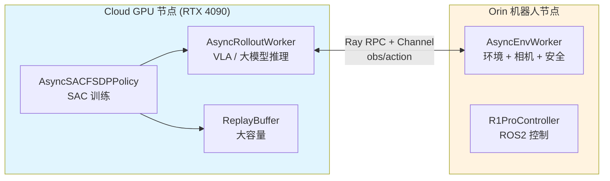

Cloud-Edge 模式适用于:
- 使用大型 VLA 模型 (Pi0, OpenVLA) 做策略
- 需要更大 replay buffer 或更快训练速度
- 多台机器人并行采集数据

## 2.2 软件栈分层

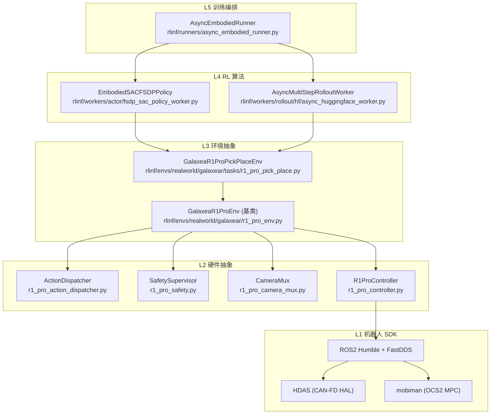

---

# 3. 算法选型与论证

## 3.1 为什么选 RLPD + SAC

| 算法 | 样本效率 | 真机安全性 | 利用离线数据 | 连续动作 | 实现复杂度 |
|------|---------|-----------|------------|---------|-----------|
| **SAC + RLPD** | ★★★★★ | ★★★★ | ★★★★★ | 原生 | 中 |
| PPO | ★★ | ★★★ | ★ (on-policy) | 需离散化或高斯 | 低 |
| DAgger | ★★★ (需持续示教) | ★★★★★ | ★★★★ | 原生 | 低 |
| TD3 | ★★★★ | ★★★ | ★★★ | 原生 | 中 |
| DrQ-v2 | ★★★★★ | ★★★ | ★★★ | 原生 | 高 |

**关键论据**:

1. **样本效率**: 真实机器人每条轨迹需要 ~20 秒 (200 步 × 10 Hz)。SAC 的 off-policy 特性允许从 replay buffer 反复学习,`critic_actor_ratio=4` 意味着每条新轨迹可做 4× critic 更新。PPO 作为 on-policy 算法,用完即弃,样本效率低 5-10×。

2. **RLPD (RL with Prior Data)**: 预先通过 SpaceMouse 遥操作收集 ~20 条成功轨迹作为 demo buffer。训练时 replay buffer 和 demo buffer 按 50/50 混合采样。这来自 Berkeley SERL 团队的实践:

   > "We find that using 50% demo data in each batch provides a strong learning signal in the early stages while being gradually outweighed by on-policy data as the replay buffer grows."
   > — Ball et al., RLPD (2023)

3. **自动熵调节**: SAC 的 `alpha` 自动平衡探索与利用,避免真机上手动调 exploration noise 的风险。

4. **RLinf 原生支持**: `EmbodiedSACFSDPPolicy` + `AsyncEmbodiedRunner` 已经完整实现 SAC + replay buffer + demo buffer + 异步训练,无需从零开发。

## 3.2 SAC 超参数设计

基于现有 `realworld_*_sac_cnn_async.yaml` 配置模式和 SERL 最佳实践:

```yaml
algorithm:
  adv_type: embodied_sac
  loss_type: embodied_sac
  gamma: 0.96                    # 折扣因子 (真机 episode 短,γ 不宜太高)
  tau: 0.005                     # target 网络软更新系数
  critic_actor_ratio: 4          # 每次 actor 更新做 4 次 critic 更新
  update_epoch: 32               # 每收到 1 条轨迹训练 32 个 epoch
  entropy_tuning:
    alpha_type: softplus          # 熵温度参数化: softplus 保证正值
    initial_alpha: 0.01           # 初始熵系数
    target_entropy: -8            # ≈ -action_dim (8D)
  replay_buffer:
    enable_cache: true
    cache_size: 200               # 内存缓存 200 条轨迹
    min_buffer_size: 5            # 最少 5 条轨迹才开始训练
    sample_window_size: 200       # 采样窗口
  demo_buffer:
    load_path: "/path/to/demo_data"
    min_buffer_size: 1
```

**γ = 0.96 而非 0.99 的原因**: episode 最长 200 步 = 20 秒。γ^200 = 0.96^200 ≈ 0.0003,最远步的回报衰减到几乎为零,说明 γ=0.96 刚好覆盖一个完整 episode。γ=0.99 时 0.99^200 ≈ 0.13,对 200 步 episode 来说过于"远视",可能使 Q 值估计不稳定。

## 3.3 与 SERL/HIL-SERL 的对比

| 维度 | SERL (Berkeley) | 本方案 (RLinf) |
|------|----------------|---------------|
| **框架** | JAX + custom env | RLinf + Ray + PyTorch |
| **算法** | RLPD + SAC | RLPD + SAC (相同) |
| **策略网络** | DrQ-style CNN | ResNet-10 + MLP |
| **分布式** | 单机 | Ray 分布式 (可扩展多机) |
| **安全** | 外部 compliance | 5 级内置安全流水线 |
| **异步训练** | Actor-Learner 分离 | AsyncEmbodiedRunner + 非阻塞权重同步 |
| **人类干预** | HIL-SERL 按键 | SpaceMouse + 键盘标记 |
| **机器人** | Franka Panda | Galaxea R1 Pro |

---

# 4. 环境设计

## 4.1 类继承结构

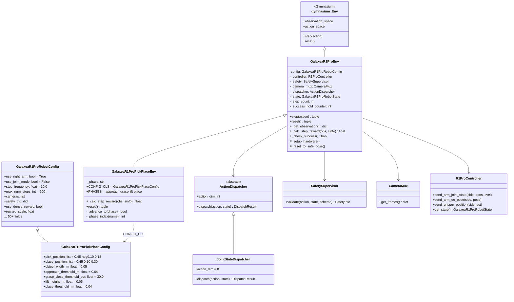

## 4.2 `step()` 数据流

以下序列图展示单个 `env.step(action)` 的完整调用链,从策略输出到电机执行:

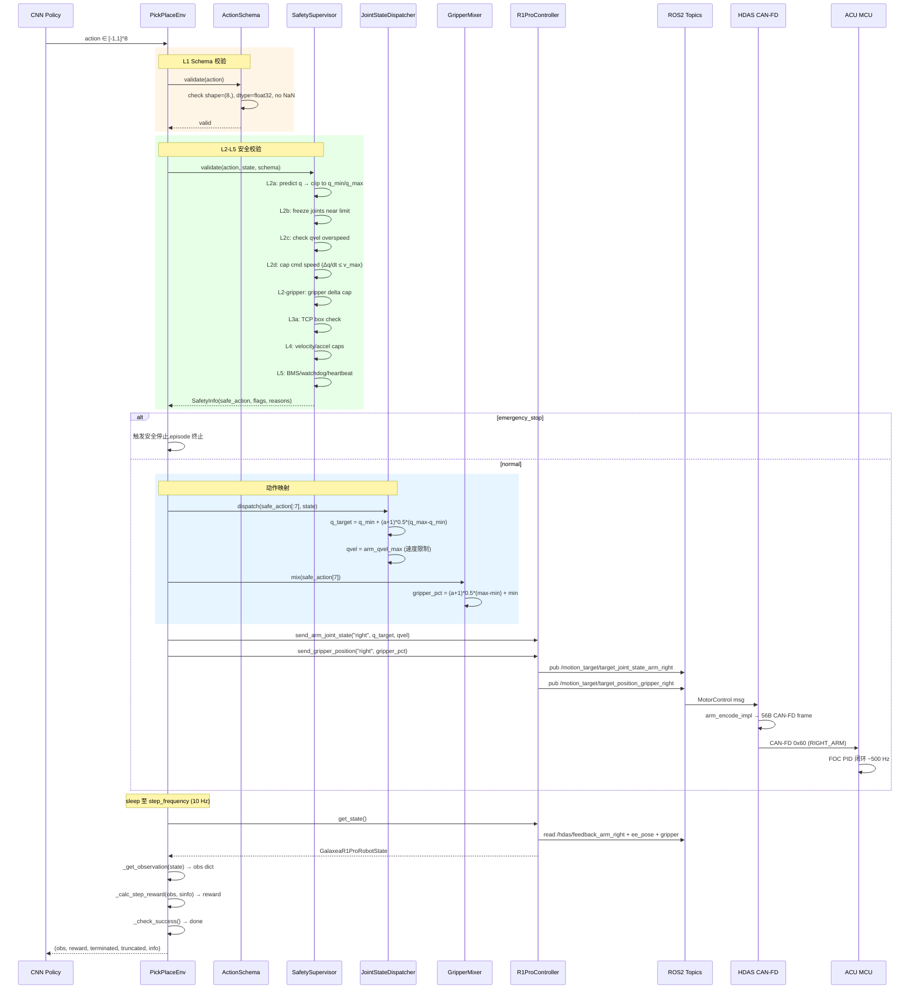

## 4.3 关键代码解析: 四阶段奖励

现有实现 (`r1_pro_pick_place.py:100-149`) 的四阶段奖励是本方案的基础:

```python
# rlinf/envs/realworld/galaxear/tasks/r1_pro_pick_place.py:100-149
def _calc_step_reward(self, obs, sinfo) -> float:
    cfg: GalaxeaR1ProPickPlaceConfig = self.config
    if self.config.use_reward_model:
        return self._compute_reward_model(obs)

    st = self._state
    ee_xyz = st.right_ee_pose[:3]          # 末端执行器 xyz 坐标
    gripper_pct = float(st.right_gripper_pos)  # 夹爪开合百分比
    pick = np.asarray(cfg.pick_position, dtype=np.float32)
    place = np.asarray(cfg.place_position, dtype=np.float32)

    reward = 0.0
    if self._phase == "approach":
        d = float(np.linalg.norm(ee_xyz - pick))
        if d < cfg.approach_threshold_m:       # 进入 grasp 阶段
            self._advance_to("grasp")
            reward = 1.0                        # 阶段奖励
        elif cfg.use_dense_reward:
            reward = float(np.exp(-50.0 * d * d) * 0.5)  # 高斯密集奖励

    elif self._phase == "grasp":
        if gripper_pct < cfg.grasp_close_threshold_pct:  # 夹爪闭合
            self._advance_to("lift")
            reward = 2.0

    elif self._phase == "lift":
        if ee_xyz[2] >= (pick[2] + cfg.lift_height_m):   # 抬到目标高度
            self._advance_to("place")
            reward = 3.0
        elif cfg.use_dense_reward:
            lift_progress = float(
                (ee_xyz[2] - pick[2]) / max(cfg.lift_height_m, 1e-6))
            reward = float(np.clip(lift_progress, 0.0, 1.0)) * 0.5

    elif self._phase == "place":
        d = float(np.linalg.norm(ee_xyz - place))
        close_enough = d < cfg.place_threshold_m
        opened = gripper_pct > cfg.grasp_close_threshold_pct
        if close_enough and opened:
            self._success_hold_counter += 1
            return 1.0                          # 成功奖励
        self._success_hold_counter = 0
        if cfg.use_dense_reward:
            reward = float(np.exp(-50.0 * d * d) * 0.8)

    return reward * float(cfg.reward_scale)
```

**设计要点**:
- `exp(-50·d²)` 是高斯距离奖励,半径 ~14 cm 处衰减到 e^{-1}。50 这个系数使梯度在 4 cm 范围内最强,与 `approach_threshold_m=0.04` 匹配。
- 阶段奖励递增 (1→2→3) 提供清晰的课程信号: 策略先学会 approach,再学 grasp,以此类推。
- `_success_hold_counter` 要求连续 5 步满足条件才算成功 (`success_hold_steps=5`),防止 EE 经过 place 上方时被误判。

---

# 5. 观测空间设计

## 5.1 观测组成

```python
observation_space = {
    "state": Box(low=-inf, high=inf, shape=(15,)),   # 本体状态
    "frames": {
        "wrist_right": Box(0, 255, shape=(128,128,3)),  # 右腕相机
        # "head_zed": Box(0, 255, shape=(128,128,3)),   # 可选: 头部相机
    }
}
```

### 5.1.1 本体状态向量 (15D)

| 索引 | 名称 | 维度 | 范围 | 来源 |
|------|------|------|------|------|
| 0-6 | `arm_qpos` | 7 | 各关节 [q_min, q_max] | `/hdas/feedback_arm_right` |
| 7-12 | `ee_pose` | 6 | xyz + rpy (torso_link4 框架) | `/motion_control/pose_ee_arm_right` |
| 13 | `gripper_pos` | 1 | [0, 100] pct | `/hdas/feedback_gripper_right` |
| 14 | `phase_idx` | 1 | {0, 1, 2, 3} | 当前奖励阶段编号 |

**`phase_idx` 的设计理由**: 将当前阶段作为观测的一部分,让策略网络直接感知任务进展。这是一种 privileged information —— 策略可以据此切换行为模式 (如: phase=0 时向 pick 移动,phase=2 时向上抬)。在 M3 阶段 (视觉版本) 中,`phase_idx` 可以被视觉检测结果替代。

### 5.1.2 视觉观测

| 相机 | 分辨率 | 帧率 | 连接方式 | 用途 |
|------|--------|------|---------|------|
| **右腕 D405** | 128×128 RGB | 30 Hz | USB 直连 (CameraMux) | 近距离抓取引导 |
| **头部 ZED** | 128×128 RGB | 30 Hz | ROS2 compressed | 全局场景感知 (可选) |

CameraMux (`r1_pro_camera_mux.py`) 对每帧做中心裁剪 + 缩放到 `image_size=(128,128)`,并通过 `soft_sync_window_ms=33` 确保多路相机帧在 33ms 内同步。

**CNN 架构设计**: 对于 Orin 单机模式,使用轻量 CNN 编码器:

```
Image (128×128×3)
  → Conv2d(3→32, 3×3, stride=2)    → ReLU → 64×64×32
  → Conv2d(32→64, 3×3, stride=2)   → ReLU → 32×32×64
  → Conv2d(64→128, 3×3, stride=2)  → ReLU → 16×16×128
  → Conv2d(128→256, 3×3, stride=2) → ReLU → 8×8×256
  → AdaptiveAvgPool2d(1)           → 256D
  → 拼接 state (15D) → MLP(271→256→256) → action (8D)
```

**权衡**: 4 层 CNN + 2 层 MLP 在 Orin GPU 上推理 < 5ms,满足 10 Hz 控制要求。更大的模型 (如 ResNet-18) 提升有限但推理延迟翻倍。

---

# 6. 动作空间设计

## 6.1 JointStateDispatcher 8D (推荐)

本方案推荐使用 **JointStateDispatcher** (绝对关节空间目标),而非 EePoseDispatcher:

```python
# 动作空间: action ∈ [-1, 1]^8
# action[0:7] → 7 个关节绝对目标 (通过线性映射)
# action[7]   → 夹爪开合 (通过 GripperMixer)

# 关节映射 (r1_pro_action_dispatcher.py JointStateDispatcher):
q_target[i] = q_min[i] + (action[i] + 1) * 0.5 * (q_max[i] - q_min[i])

# 夹爪映射 (r1_pro_gripper_mixer.py GripperMixer):
gripper_pct = gripper_min + (action[7] + 1) * 0.5 * (gripper_max - gripper_min)
```

### 6.1.1 为什么选关节空间而非末端空间

| 维度 | JointStateDispatcher | EePoseDispatcher |
|------|---------------------|-----------------|
| **IK 问题** | 无 (直接关节目标) | 需要 OCS2 MPC/IK 求解 |
| **奇异性** | 无 | 有 (肘锁定等) |
| **可达性** | 全关节空间可达 | 受 IK 解限制 |
| **控制精度** | 精确到关节级 | 受 IK 误差影响 |
| **学习难度** | 较高 (7D 冗余) | 较低 (6D EE + 1D gripper) |
| **安全性** | L2 关节限位直接生效 | 需额外 L3a TCP box |
| **ROS 话题** | `/motion_target/target_joint_state_arm_right` | `/motion_target/target_pose_arm_right` |

**选择 Joint 的核心原因**: 在真机 RL 训练中,IK 求解失败或奇异性会导致不可预测的行为。Joint 模式将 IK 问题完全消除,让 RL 策略直接学习关节空间的映射。虽然 7D 冗余关节空间的探索更困难,但配合 SAC 的自动熵调节和 RLPD 的 demo buffer,这个问题可以有效缓解。

### 6.1.2 关节限位配置

用于 JointStateDispatcher 的关节限位比 Safety 的限位**更窄**,形成"策略活动区 ⊂ 安全允许区"的嵌套关系:

```yaml
# 策略活动区 (JointStateDispatcher 使用的 q_min/q_max)
# 比安全限位收窄约 0.5 rad,集中在桌面操作可达区域
arm_q_min_right: [-1.5, -1.0, -1.5, -1.8, -1.5, -0.8, -1.0]
arm_q_max_right: [ 1.0,  0.0,  1.5,  0.2,  1.5,  0.8,  1.0]

# 安全限位 (SafetyConfig 的 right_arm_q_min/max,来自 URDF - 0.1 rad)
# right_arm_q_min: [-4.35, -3.04, -2.26, -1.99, -2.26, -0.95, -1.47]
# right_arm_q_max: [ 1.21,  0.07,  2.26,  0.25,  2.26,  0.95,  1.47]
```

### 6.1.3 关节速度限制

`JointState.velocity` 字段被 R1 Pro SDK 解释为**每关节最大允许速度** (不是目标速度),由 mobiman 的 `jointTracker` 做插值:

```python
# r1_pro_controller.py 发送关节指令时:
joint_msg.velocity = [3.0, 3.0, 3.0, 3.0, 5.0, 5.0, 5.0]  # rad/s
# 前 4 个关节 (肩+肘) 限 3.0 rad/s
# 后 3 个关节 (腕) 限 5.0 rad/s (腕关节更轻,可以更快)
```

## 6.2 备选: JointDeltaDispatcher (增量模式)

如果策略训练困难,可以切换到增量模式:

```python
# action[i] ∈ [-1, 1] → Δq = action[i] * joint_delta_scale[i]
# q_target = clip(q_current + Δq, q_min, q_max)
# joint_delta_scale_right: [0.10, 0.10, 0.10, 0.10, 0.20, 0.20, 0.20]
```

增量模式的优点是动作语义更直觉 ("向这个方向移动一点"),缺点是需要精确的当前位置反馈,且策略无法做大幅跳跃。

---

# 7. 视觉感知集成

## 7.1 分阶段视觉方案

视觉系统的引入遵循**渐进式**策略:

| 阶段 | 视觉能力 | 方法 | 用途 |
|------|---------|------|------|
| **M1 (reach)** | 无相机 | 纯本体状态 | 验证关节控制闭环 |
| **M2 (pick-place)** | 固定位置 | 无需检测,硬编码 pick/place 坐标 | 验证抓取流程 |
| **M3 (vision)** | HSV 颜色检测 | OpenCV `inRange` + contour | 定位方块,判定成功 |
| **M4 (generalize)** | 学习视觉编码器 | CNN end-to-end | 泛化到不同方块 |

## 7.2 M3 阶段: HSV 颜色检测

```python
import cv2
import numpy as np

def detect_colored_block(frame_bgr: np.ndarray, color: str = "red") -> dict:
    """从 128×128 RGB 图像中检测指定颜色方块。
    
    Returns:
        {"detected": bool, "center_uv": (u,v), "area_pct": float,
         "bbox": (x,y,w,h)}
    """
    hsv = cv2.cvtColor(frame_bgr, cv2.COLOR_BGR2HSV)
    
    # 红色方块的 HSV 范围 (需要两段,因为红色跨 H=0/180)
    COLOR_RANGES = {
        "red":   [((0, 100, 80), (10, 255, 255)),
                  ((170, 100, 80), (180, 255, 255))],
        "blue":  [((100, 100, 80), (130, 255, 255))],
        "green": [((35, 100, 80), (85, 255, 255))],
    }
    
    mask = np.zeros(hsv.shape[:2], dtype=np.uint8)
    for (lo, hi) in COLOR_RANGES[color]:
        mask |= cv2.inRange(hsv, np.array(lo), np.array(hi))
    
    # 形态学清理
    kernel = cv2.getStructuringElement(cv2.MORPH_RECT, (5, 5))
    mask = cv2.morphologyEx(mask, cv2.MORPH_OPEN, kernel)
    mask = cv2.morphologyEx(mask, cv2.MORPH_CLOSE, kernel)
    
    contours, _ = cv2.findContours(mask, cv2.RETR_EXTERNAL, cv2.CHAIN_APPROX_SIMPLE)
    if not contours:
        return {"detected": False}
    
    # 取最大轮廓
    c = max(contours, key=cv2.contourArea)
    area = cv2.contourArea(c)
    total_area = frame_bgr.shape[0] * frame_bgr.shape[1]
    
    if area / total_area < 0.005:  # 面积阈值: 至少占 0.5% 像素
        return {"detected": False}
    
    M = cv2.moments(c)
    cx = int(M["m10"] / (M["m00"] + 1e-6))
    cy = int(M["m01"] / (M["m00"] + 1e-6))
    x, y, w, h = cv2.boundingRect(c)
    
    return {
        "detected": True,
        "center_uv": (cx, cy),
        "area_pct": area / total_area,
        "bbox": (x, y, w, h),
    }
```

## 7.3 视觉成功分类器

在 M3 阶段,`place` 阶段的成功判定可以从纯位置条件升级为**视觉+位置双重确认**:

```python
def _calc_step_reward_with_vision(self, obs, sinfo) -> float:
    """扩展版奖励: 在 place 阶段加入视觉确认。"""
    base_reward = super()._calc_step_reward(obs, sinfo)
    
    if self._phase == "place" and self.config.use_visual_success:
        wrist_frame = obs["frames"].get("wrist_right")
        if wrist_frame is not None:
            det = detect_colored_block(wrist_frame, self.config.block_color)
            if not det["detected"]:
                # 方块不在手腕相机视野 → 可能已放入篮子
                # 结合位置条件做最终判定
                if base_reward == 1.0:  # 位置条件已满足
                    return 1.0  # 双重确认成功
    
    return base_reward
```

---

# 8. 奖励函数设计

## 8.1 奖励架构总览

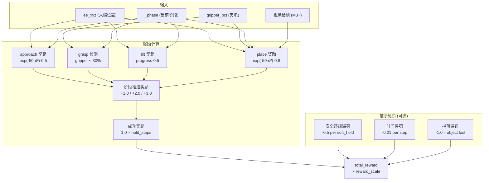

## 8.2 完整奖励公式

$$
R(s, a) = R_{\text{phase}}(s) + R_{\text{dense}}(s) + R_{\text{aux}}(s)
$$

**阶段推进奖励** $R_{\text{phase}}$:

| 转换 | 条件 | 奖励 |
|------|------|------|
| approach → grasp | ‖ee - pick‖ < 0.04 m | +1.0 |
| grasp → lift | gripper_pct < 30% | +2.0 |
| lift → place | ee_z ≥ pick_z + 0.05 m | +3.0 |
| place → done | ‖ee - place‖ < 0.04 m AND gripper > 30% AND 持续 5 步 | +1.0/step |

**密集奖励** $R_{\text{dense}}$ (当 `use_dense_reward=True`):

| 阶段 | 密集奖励 |
|------|---------|
| approach | $0.5 \cdot \exp(-50 \cdot d_{\text{pick}}^2)$ |
| grasp | 0 (等待夹爪动作) |
| lift | $0.5 \cdot \text{clip}(\frac{z - z_{\text{pick}}}{h_{\text{lift}}}, 0, 1)$ |
| place | $0.8 \cdot \exp(-50 \cdot d_{\text{place}}^2)$ |

## 8.3 奖励工程实践建议

1. **密集奖励 vs 稀疏奖励**: M2 阶段建议 `use_dense_reward=True`,加速初期学习;策略收敛后可关闭密集奖励只保留阶段奖励,测试策略的鲁棒性。

2. **奖励缩放**: `reward_scale` 应配合 SAC 的 `initial_alpha` 调整。如果 `reward_scale` 太大,Q 值膨胀导致训练不稳定;太小则梯度信号弱。经验值: `reward_scale=1.0` + `initial_alpha=0.01`。

3. **不建议加时间惩罚**: SAC 的熵正则化已经隐含了"尽快完成"的激励 (因为每一步都有 entropy cost)。额外的时间惩罚可能导致策略过于仓促,跳过精细对准。

---

# 9. 安全系统配置

## 9.1 五级安全流水线

安全系统是真机 RL 的生命线。RLinf 的 `GalaxeaR1ProSafetySupervisor` (`r1_pro_safety.py`, 1085 行) 实现了 5 级门控,**每一级都可以通过 `safety_cfg` 独立开关**:

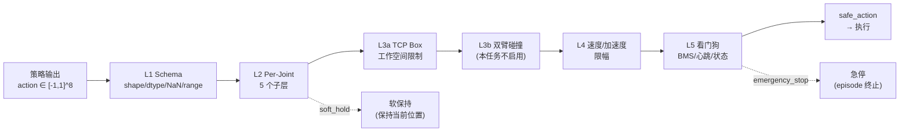

## 9.2 Pick-Place 任务的安全参数化

```yaml
safety_cfg:
  # L2: 关节限位 (URDF - 0.1 rad 安全余量)
  right_arm_q_min: [-4.35, -3.04, -2.26, -1.99, -2.26, -0.95, -1.47]
  right_arm_q_max: [1.21, 0.07, 2.26, 0.25, 2.26, 0.95, 1.47]
  arm_qvel_max: [1.6, 1.6, 1.6, 1.6, 4.0, 4.0, 4.0]
  
  # L2 子层开关
  enable_l2a_predict_q_clip: true
  enable_l2b_qpos_freeze: true
  enable_l2c_qvel_watchdog: true
  enable_l2d_cmd_speed_cap: true
  enable_l2_gripper: true
  
  # L2 参数
  l2_warning_margin_rad: 0.15     # 距关节限位 0.15 rad 时开始减速
  l2_critical_margin_rad: 0.05    # 距关节限位 0.05 rad 时冻结该关节
  l2_qvel_overspeed_factor: 1.20  # 速度超限 120% 触发 soft_hold
  dt_step: 0.10                   # 10 Hz 步长

  # L3a: TCP 安全盒 (桌面操作工作空间)
  right_ee_min: [0.20, -0.35, 0.05, -3.20, -0.30, -0.30]
  right_ee_max: [0.65,  0.35, 0.65,  3.20,  0.30,  0.30]
  # x: 0.20~0.65 m (距基座前方)
  # y: -0.35~0.35 m (左右对称)
  # z: 0.05~0.65 m (桌面以上)

  # L3b: 本任务仅用右臂,关闭双臂碰撞检测
  dual_arm_collision_enable: false

  # L4: 速度限幅
  max_linear_step_m: 0.05         # 每步最大线性位移 5 cm
  max_angular_step_rad: 0.20      # 每步最大角度变化 11.5°

  # L5: 看门狗
  bms_low_battery_threshold_pct: 25.0
  feedback_stale_threshold_ms: 200.0
  operator_heartbeat_timeout_ms: 1500.0
```

## 9.3 安全层的嵌套关系

```
┌─────────────────────────────────────────────────────┐
│ L5 看门狗 (BMS/心跳/状态)                              │
│  ┌──────────────────────────────────────────────┐    │
│  │ L4 速度/加速度限幅                               │    │
│  │  ┌───────────────────────────────────────┐    │    │
│  │  │ L3a TCP 安全盒                           │    │    │
│  │  │  ┌────────────────────────────────┐    │    │    │
│  │  │  │ L2 Per-Joint 限位 (5 子层)       │    │    │    │
│  │  │  │  ┌─────────────────────────┐   │    │    │    │
│  │  │  │  │ L1 Schema 校验             │   │    │    │    │
│  │  │  │  │  ┌──────────────────┐   │   │    │    │    │
│  │  │  │  │  │ 策略动作空间         │   │   │    │    │    │
│  │  │  │  │  │ (JointState 8D)   │   │   │    │    │    │
│  │  │  │  │  └──────────────────┘   │   │    │    │    │
│  │  │  │  └─────────────────────────┘   │    │    │    │
│  │  │  └────────────────────────────────┘    │    │    │
│  │  └───────────────────────────────────────┘    │    │
│  └──────────────────────────────────────────────┘    │
└─────────────────────────────────────────────────────┘
```

内层 (策略动作空间) 是最窄的,外层逐级放宽。即使策略输出越界,外层也能逐级拦截。

---

# 10. 数据采集管线

## 10.1 人类示教数据采集

RLPD 需要预先收集 ~20 条成功的 pick-place 示教轨迹。RLinf 支持 SpaceMouse 遥操作:

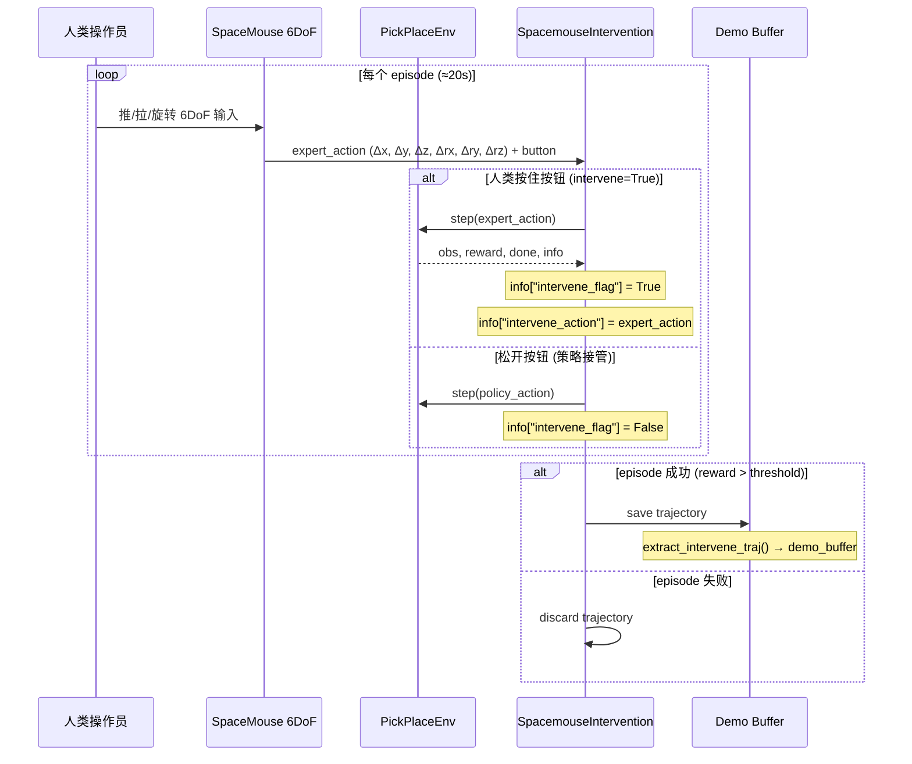

### 10.1.1 数据采集配置

```yaml
env:
  eval:
    use_spacemouse: true
    max_episode_steps: 10000    # 不限步数,人类自行判断
    data_collection:
      enabled: true
      save_dir: "${runner.logger.log_path}/demo_data"
      export_format: "pickle"
      only_success: true        # 仅保存成功 episode
      robot_type: "r1_pro"
      fps: 10
```

### 10.1.2 脚本式轨迹生成 (备选)

如果没有 SpaceMouse,可以用脚本生成示教轨迹。利用 R1 Pro 的关节空间已知 pick/place 位置,通过关节插值生成:

```python
def generate_scripted_demo(env, pick_q, grasp_q, lift_q, place_q):
    """生成一条脚本式示教轨迹。"""
    trajectory = []
    
    # Phase 1: Approach — 从 home 到 pick 位置上方
    for q in interpolate_joints(env.home_q, pick_q, steps=30):
        obs, r, done, _, info = env.step(q_to_action(q, gripper_open=True))
        trajectory.append((obs, info["intervene_action"], r))
    
    # Phase 2: Grasp — 闭合夹爪
    for _ in range(20):
        obs, r, done, _, info = env.step(q_to_action(pick_q, gripper_open=False))
        trajectory.append((obs, info["intervene_action"], r))
    
    # Phase 3: Lift — 抬起
    for q in interpolate_joints(pick_q, lift_q, steps=20):
        obs, r, done, _, info = env.step(q_to_action(q, gripper_open=False))
        trajectory.append((obs, info["intervene_action"], r))
    
    # Phase 4: Place — 移到篮子上方并释放
    for q in interpolate_joints(lift_q, place_q, steps=30):
        obs, r, done, _, info = env.step(q_to_action(q, gripper_open=False))
        trajectory.append((obs, info["intervene_action"], r))
    
    # 松开夹爪
    for _ in range(15):
        obs, r, done, _, info = env.step(q_to_action(place_q, gripper_open=True))
        trajectory.append((obs, info["intervene_action"], r))
    
    return trajectory
```

---

# 11. 重置编排

## 11.1 Episode 间重置策略

真机 RL 训练中,每个 episode 结束后需要将场景恢复到初始状态。这包含两个子问题:
1. **机器人归位**: 将右臂回到安全的 home 位置
2. **物体归位**: 将方块放回 pick 位置

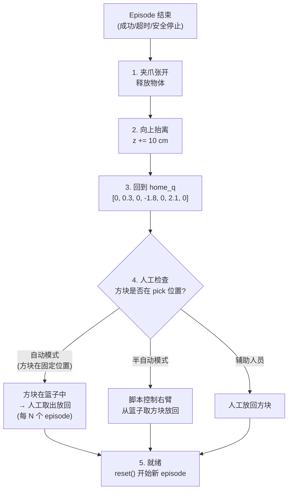

## 11.2 重置实现

```python
# GalaxeaR1ProEnv.reset() 的流程 (r1_pro_env.py):
def reset(self, *, seed=None, options=None):
    self._phase = "approach"  # 重置阶段
    self._step_count = 0
    self._success_hold_counter = 0
    
    # 1. 安全归位: 以低速回到 home 关节位
    self._reset_to_safe_pose()  # 内部调用 controller.send_arm_joint_state()
    
    # 2. 等待机器人到达 home 位
    time.sleep(2.0)  # 给 mobiman MPC 足够时间插值到位
    
    # 3. 读取初始状态
    self._state = self._controller.get_state()
    
    # 4. 构建初始观测
    obs = self._get_observation()
    
    return obs, {}
```

### 11.2.1 `home_q` 的选择

```python
# 来自 r1_pro_env.py:119-128
joint_reset_qpos_right: list = field(
    default_factory=lambda: [
        0.0,   # J1: 肩 yaw 零位
        0.3,   # J2: 肩 roll 微抬 (~17°)
        0.0,   # J3: 肩 yaw 零位
        -1.8,  # J4: 肘弯曲 (~103°)
        0.0,   # J5: 腕 roll 零位
        2.1,   # J6: 腕 pitch (~120°)
        0.0,   # J7: 末端 roll 零位
    ]
)
```

这个 home 姿态使右臂肘部弯曲 103°、腕部上翘 120°,末端执行器在身体前方约 0.35 m 处,高度约 0.45 m。从这个位置出发,可以安全地到达桌面操作区域的任何位置。

## 11.3 物体重置的工程方案

| 方案 | 自动化程度 | 可行性 | 训练效率 |
|------|-----------|--------|---------|
| **A: 固定夹具** | 高 | 中 | 高 |
| B: 双臂互助 | 高 | 低 (本任务仅右臂) | 中 |
| **C: 人工辅助** | 低 | 高 | 低 |
| D: 重力滑道 | 高 | 中 (需定制) | 高 |

**推荐方案 A+C 混合**: 
- 方块放在浅碟中,限制其位置漂移,减少人工干预频率
- 篮子底部有弹射门或翻板,成功放入后方块自动滑回取出区
- 辅助人员每 5-10 个 episode 检查一次方块位置

---

# 12. 训练循环

## 12.1 AsyncEmbodiedRunner 训练架构

```mermaid
sequenceDiagram
    participant Runner as AsyncEmbodiedRunner
    participant Actor as AsyncSACFSDPPolicy
    participant Rollout as AsyncRolloutWorker
    participant Env as AsyncEnvWorker
    participant Replay as ReplayBuffer
    participant Demo as DemoBuffer

    Note over Runner: === 初始化 ===
    Runner->>Actor: load demo_buffer from disk
    Actor->>Demo: demo trajectories (20 条)
    Runner->>Rollout: sync_weights (阻塞)
    Runner->>Env: interact(channels) 【长期运行】
    Runner->>Rollout: generate(channels) 【长期运行】
    Runner->>Actor: recv_rollout_trajectories(ch) 【后台线程】

    rect rgb(255, 235, 235)
        Note over Runner: === 主训练循环 ===
        loop 每个 global_step
            Note over Actor: 后台线程: channel.get() → queue
            Actor->>Actor: drain_received_trajectories()
            Actor->>Replay: add_trajectories(new_traj)
            
            alt replay_buffer.size >= min_buffer_size (5)
                loop update_epoch = 32 次
                    Actor->>Replay: sample(batch_size // 2)
                    Actor->>Demo: sample(batch_size // 2)
                    Actor->>Actor: concat → 50/50 混合 batch
                    
                    Note over Actor: Critic 更新 ×4 (critic_actor_ratio)
                    Actor->>Actor: Q(s,a) → MSE(Q, r + γ·Q_target)
                    
                    Note over Actor: Actor 更新 ×1
                    Actor->>Actor: π → max Q(s,π(s)) - α·log π
                    
                    Note over Actor: 熵温度更新
                    Actor->>Actor: α → α·(log π + H_target)
                    
                    Note over Actor: Target 软更新
                    Actor->>Actor: θ_target ← 0.995·θ_target + 0.005·θ
                end
            end
            
            opt weight_sync_interval 到达
                Runner->>Rollout: update_rollout_weights(no_wait=True)
                Note over Rollout: 后台接收,不中断推理
            end
        end
    end
```

## 12.2 关键代码: SAC 训练循环

`EmbodiedSACFSDPPolicy` 的核心训练逻辑:

```python
# rlinf/workers/actor/fsdp_sac_policy_worker.py (简化版)
class EmbodiedSACFSDPPolicy:
    def update_one_epoch(self):
        # 1. 从 replay + demo buffer 采样
        batch = next(self.buffer_dataloader_iter)
        #    → ReplayBufferDataset 内部: 50% replay + 50% demo
        
        # 2. Critic 更新 (critic_actor_ratio 次)
        for _ in range(self.critic_actor_ratio):
            with torch.no_grad():
                next_action, next_logprob = self.model.sample(batch["next_obs"])
                q_target = batch["reward"] + self.gamma * (1 - batch["done"]) * (
                    torch.min(self.q_target1(batch["next_obs"], next_action),
                              self.q_target2(batch["next_obs"], next_action))
                    - self.alpha * next_logprob
                )
            q1 = self.q1(batch["obs"], batch["action"])
            q2 = self.q2(batch["obs"], batch["action"])
            critic_loss = F.mse_loss(q1, q_target) + F.mse_loss(q2, q_target)
            self.critic_optimizer.step(critic_loss)
        
        # 3. Actor 更新 (1 次)
        action, logprob = self.model.sample(batch["obs"])
        q_val = torch.min(self.q1(batch["obs"], action),
                          self.q2(batch["obs"], action))
        actor_loss = (self.alpha * logprob - q_val).mean()
        self.actor_optimizer.step(actor_loss)
        
        # 4. 熵温度更新
        alpha_loss = -(self.log_alpha * (logprob + self.target_entropy).detach()).mean()
        self.alpha_optimizer.step(alpha_loss)
        self.alpha = self.log_alpha.exp()
        
        # 5. Target 网络软更新
        soft_update(self.q_target1, self.q1, self.tau)
        soft_update(self.q_target2, self.q2, self.tau)
```

## 12.3 异步训练的时间线

```
时间轴 (秒):

Env:      ████ step 1-200 ████████████████████████████████████████████████
          ↓ 第 1 条轨迹 (20s)         ↓ 第 2 条轨迹          ↓ 第 3 条
          
Rollout:  ██ predict ██ predict ██ predict ██ predict ██ predict ██ ...
          (每步 <5ms, 占 10Hz 中的一小部分)

Actor:                    ████████ 32 epochs ████████
                          (第 1 条轨迹触发)      ████████ 32 epochs ████████
                                                  (第 2 条轨迹触发)

Weight    ─────────────────↑sync─────────────────↑sync─────────────────↑
Sync:     (非阻塞, 后台传输)
```

**训练节奏**: 
- 1 条轨迹 ≈ 20 秒 (200 步 × 10 Hz)
- 32 epochs × micro_batch 训练 ≈ 数秒 (Orin 上)
- GPU 利用率 > 80% (训练填充了环境交互的等待时间)

## 12.4 配置文件模板

```yaml
# realworld_galaxea_r1_pro_right_arm_pick_place_sac_cnn_async.yaml

runner:
  type: async_embodied
  max_steps: 5000              # 约 5000 条轨迹
  save_interval: 100           # 每 100 步保存 checkpoint
  val_check_interval: 50       # 每 50 步评估一次
  logger:
    logger_backends: [tensorboard, wandb]
    log_path: "outputs/r1pro_pick_place"

algorithm:
  adv_type: embodied_sac
  loss_type: embodied_sac
  gamma: 0.96
  tau: 0.005
  critic_actor_ratio: 4
  update_epoch: 32
  entropy_tuning:
    alpha_type: softplus
    initial_alpha: 0.01
    target_entropy: -8
  replay_buffer:
    enable_cache: true
    cache_size: 200
    min_buffer_size: 5
    sample_window_size: 200
  demo_buffer:
    load_path: "demo_data/r1pro_pick_place"

actor:
  model:
    model_type: cnn_sac        # 小型 CNN + SAC
    encoder:
      backbone: resnet10
      feature_dim: 256
    mlp:
      hidden_dims: [256, 256]
  micro_batch_size: 128
  sync_weight_no_wait: true
  global_batch_size: 128

env:
  train:
    env_type: galaxea_r1_pro
    total_num_envs: 1           # 真机只有 1 个
    max_steps_per_rollout_epoch: 200
    override_cfg:
      use_right_arm: true
      use_left_arm: false
      use_joint_mode: true      # JointStateDispatcher
      step_frequency: 10.0
      max_num_steps: 200
      success_hold_steps: 5
      use_dense_reward: true
      reward_scale: 1.0
      cameras:
        - name: wrist_right
          type: usb
          serial: "RS_RIGHT_SN"
          width: 640
          height: 480
      image_size: [128, 128]
      # 任务特定
      pick_position: [0.45, -0.10, 0.18]
      place_position: [0.45, 0.10, 0.30]
      # 安全
      safety_cfg:
        dual_arm_collision_enable: false
        right_ee_min: [0.20, -0.35, 0.05, -3.20, -0.30, -0.30]
        right_ee_max: [0.65,  0.35, 0.65,  3.20,  0.30,  0.30]

cluster:
  num_nodes: 1
  component_placement:
    actor:
      placement: 0
    rollout:
      placement: 0             # 共享 GPU
    env:
      placement: 0             # Orin 单机
```

---

# 13. 部署与验证

## 13.1 训练到部署流程

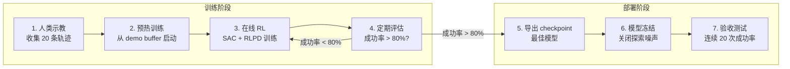

## 13.2 评估指标

| 指标 | 计算方式 | 目标值 |
|------|---------|--------|
| **成功率** | 成功 episode / 总 episode | > 80% |
| **平均完成步数** | 成功 episode 的平均 step count | < 150 (15s) |
| **安全违规率** | soft_hold 触发次数 / 总步数 | < 1% |
| **抓取成功率** | 进入 lift 阶段 / 总 episode | > 90% |
| **放置精度** | 放置时 ‖ee - place‖ 的均值 | < 3 cm |
| **Q 值收敛** | 训练 Q 值的移动平均 | 稳定无发散 |

## 13.3 Checkpoint 管理

```python
# 保存结构:
# outputs/r1pro_pick_place/checkpoints/
# ├── global_step_100/
# │   ├── actor_model.pt        # 策略网络 + Q 网络
# │   ├── optimizer.pt          # 优化器状态
# │   ├── replay_buffer.pkl     # replay buffer 快照
# │   └── metadata.json         # 训练指标
# ├── global_step_200/
# │   └── ...
# └── best_model/               # 最佳成功率对应的模型
#     └── ...
```

---

# 14. 渐进式开发路线图

## 14.1 四阶段路线图

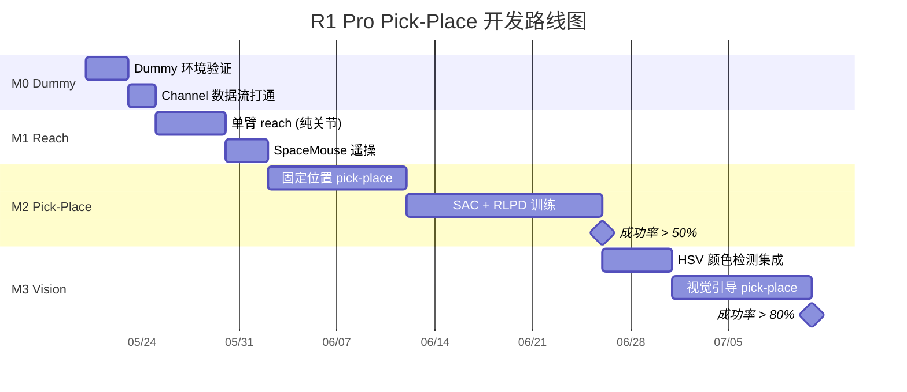

## 14.2 各阶段详细目标

### M0: Dummy 环境验证 (3-5 天)

**目标**: 确认 AsyncEmbodiedRunner + SAC + Channel 的数据流完整闭环。

```yaml
override_cfg:
  is_dummy: true          # 不连接真实硬件
  use_right_arm: true
  use_joint_mode: true
```

验证清单:
- [ ] `env.reset()` 返回正确形状的 obs
- [ ] `env.step(action)` 接受 [-1,1]^8 并返回 (obs, reward, done, truncated, info)
- [ ] AsyncEnvWorker 的 Channel 通信正常
- [ ] AsyncRolloutWorker 可推理 (dummy model)
- [ ] AsyncSACFSDPPolicy 的 replay buffer 可正常采样/训练
- [ ] TensorBoard 指标可写入

### M1: 单臂 Reach (5-8 天)

**目标**: 右臂从 home 移到固定目标点,验证关节控制闭环和安全系统。

```yaml
override_cfg:
  is_dummy: false
  use_right_arm: true
  use_joint_mode: true
  max_num_steps: 100
  # 简化版奖励: 只有 approach 阶段
  pick_position: [0.45, -0.10, 0.30]
  use_dense_reward: true
```

验证清单:
- [ ] ROS2 话题 `/hdas/feedback_arm_right` 正常接收
- [ ] 关节指令通过 `/motion_target/target_joint_state_arm_right` 正确下发
- [ ] Safety L2 关节限位生效 (测试: 故意发越界指令)
- [ ] Safety L3a TCP box 生效
- [ ] Safety L5 心跳正常 (1500ms 超时)
- [ ] SpaceMouse 遥操作可收集示教轨迹
- [ ] SAC 训练后策略可稳定 reach 到目标点

### M2: 固定位置 Pick-Place (14-24 天)

**目标**: 在方块位置固定的条件下完成完整的 pick-and-place 流程。

验证清单:
- [ ] 四阶段奖励正确触发 (approach→grasp→lift→place)
- [ ] 夹爪开合正常 (GripperMixer 映射正确)
- [ ] Demo buffer 加载并参与训练 (50/50 混合)
- [ ] 策略在 ~100 条轨迹后学会 approach
- [ ] 策略在 ~500 条轨迹后学会完整 pick-place
- [ ] 成功率 > 50%

### M3: 视觉引导 Pick-Place (10-15 天)

**目标**: 加入相机观测和 HSV 检测,使策略能处理方块位置的微小变化。

验证清单:
- [ ] 腕部相机帧正确加入观测 (128×128 RGB)
- [ ] HSV 检测器稳定检测方块 (> 95% 检出率)
- [ ] CNN 编码器正确处理图像输入
- [ ] 策略在方块位置 ±3 cm 扰动下仍能成功
- [ ] 成功率 > 80%

---

# 15. 风险与缓解

## 15.1 风险矩阵

| 风险 | 概率 | 影响 | 缓解措施 |
|------|------|------|---------|
| **CAN-FD 通信中断** | 中 | 高 | HDAS 自动重连 + L5 watchdog 200ms 超时 |
| **方块滑落** | 高 | 中 | 夹爪力控 + 浅碟限位 + 人工辅助重置 |
| **关节超限碰撞** | 低 | 高 | 5 级安全流水线 + 策略空间 ⊂ 安全空间 |
| **Q 值发散** | 中 | 高 | target_entropy 调节 + tau=0.005 慢更新 |
| **Orin GPU OOM** | 低 | 高 | 轻量 CNN + buffer 容量控制 |
| **BMS 低电量** | 低 | 中 | L5 自动停止训练 + 25% 阈值预警 |
| **ROS2 话题延迟** | 中 | 中 | FastDDS data_sharing + LARGE_DATA |
| **训练收敛慢** | 高 | 中 | RLPD demo buffer + 密集奖励 |
| **相机标定漂移** | 中 | 中 | 固定安装 + 开机自检 |
| **夹爪磨损** | 低 | 低 | 定期检查 + 备用夹爪头 |

## 15.2 关键缓解策略

### 15.2.1 训练不稳定的诊断与应对

```
symptom: Q 值持续增大
  → 降低 gamma (0.96 → 0.94)
  → 增大 target_entropy (-8 → -10)
  → 检查 reward_scale 是否过大

symptom: 策略停在 approach 阶段不进展
  → 检查 approach_threshold_m 是否太小 (放宽到 0.06 m)
  → 检查密集奖励梯度 (exp 系数 50 → 30)
  → 增加 demo buffer 中 grasp 成功的轨迹比例

symptom: 夹爪总是"拿不住"
  → 检查 GripperMixer 映射是否正确
  → 检查 grasp_close_threshold_pct (30% → 40%)
  → 检查方块尺寸是否在夹爪行程范围内

symptom: 安全系统频繁触发 soft_hold
  → 检查策略活动区是否太接近安全限位
  → 增大 l2_warning_margin_rad (0.15 → 0.25)
  → 缩小 JointStateDispatcher 的 q_min/q_max 范围
```

### 15.2.2 硬件故障的处理

```python
# 在 env.step() 中, safety.validate() 返回的 SafetyInfo 包含:
if sinfo.emergency_stop:
    # CAN 断连 / BMS 低电 / 控制器状态异常
    # → 立即终止 episode, 不执行任何动作
    return obs, -1.0, True, False, {"emergency": True}

if sinfo.soft_hold:
    # 关节接近限位 / 速度超限
    # → 保持当前关节位置, 等待恢复
    # → 不终止 episode, 但给轻微负奖励
    pass  # safe_action 已被 safety 修改为"保持当前位"
```

## 15.3 部署前检查清单

来自 `bt/docs/rwRL/safety_2.md` 的 9 项部署前验证:

- [ ] **坐标系确认**: `torso_link4` 框架下 pick/place 坐标与物理位置匹配
- [ ] **关节限位**: 手动遥操到工作空间边界,确认 L2 限位正确
- [ ] **TCP 工作空间**: L3a 安全盒覆盖整个桌面操作区域
- [ ] **BMS 语义**: `/hdas/bms` 的 `capital` 字段含义确认 (百分比 vs 安时)
- [ ] **SWD 极性**: 急停按钮按下时,`/hdas/feedback_status_arm_right` 正确报告
- [ ] **CAN 配置**: `can0` 的 bitrate/dbitrate/sample-point 与 `start_hdas_r1pro.sh` 一致
- [ ] **ROS_DOMAIN_ID**: 确认 `ros_domain_id=72` 不与其它 ROS2 系统冲突
- [ ] **相机序列号**: `/opt/galaxea/sensor/realsense/RS_RIGHT` 中的 SN 与实际 D405 匹配
- [ ] **DDS 跨主机**: 如果 Cloud-Edge 部署,确认 FastDDS Discovery Server 配置正确

---

## 参考文件索引

| 文件 | 行数 | 用途 |
|------|------|------|
| `rlinf/envs/realworld/galaxear/tasks/r1_pro_pick_place.py` | 150 | 现有 pick-place 任务 |
| `rlinf/envs/realworld/galaxear/r1_pro_env.py` | 1217 | R1 Pro 主环境类 |
| `rlinf/envs/realworld/galaxear/r1_pro_controller.py` | 857 | ROS2 控制器 |
| `rlinf/envs/realworld/galaxear/r1_pro_safety.py` | 1085 | 5 级安全系统 |
| `rlinf/envs/realworld/galaxear/r1_pro_action_dispatcher.py` | 1004 | 动作分发策略 |
| `rlinf/envs/realworld/galaxear/r1_pro_camera_mux.py` | 353 | 相机复用 |
| `rlinf/runners/async_embodied_runner.py` | 281 | 异步训练 Runner |
| `rlinf/workers/actor/fsdp_sac_policy_worker.py` | — | SAC 策略 Worker |
| `rlinf/data/replay_buffer.py` | — | 经验回放 |
| `bt/docs/rwRL/r1pro6op47.md` | — | v6 设计文档 |
| `bt/docs/rwRL/safety_2.md` | — | 安全系统设计 |
| `bt/docs/rwRL/glx/R1ProSDKAnalysis.md` | — | R1 Pro SDK 分析 |
| `bt/docs/ov/RLinf_Architecture_and_Design2.md` | — | RLinf 架构文档 |

---
