# RLinf 直连 Galaxea R1 Pro 真机强化学习设计与实施方案 v6

> 文档版本: r1pro6op47 (v6)  
> 基线: 本机 `/home/nvidia/lg_ws/RL/RLinf` (commit 取决于阅读时刻)  
> 真机: Galaxea (星海图) R1 Pro, SDK 安装于 `/home/nvidia/galaxea/install/` (atc_system v2.1.5)  
> 算力: NVIDIA Jetson AGX Orin Developer Kit, JetPack 6.0 / L4T 36.3, 32 GB 统一内存, MAXN 模式  
> 对照文档 (竞品): [bt/docs/rwRL/r1pro5op47.md](r1pro5op47.md) (v5, 8283 行)  
> 反面教材清单: [bt/docs/rwRL/glx/mismatch_realworld_1.md](glx/mismatch_realworld_1.md) (611 行)

---

## 目录

- [§0 摘要与四条设计支柱](#0-摘要与四条设计支柱)
- [§1 竞品 r1pro5op47.md 评审](#1-竞品-r1pro5op47md-评审)
  - [§1.1 值得借鉴的亮点 (10 项)](#11-值得借鉴的亮点-10-项)
  - [§1.2 必须改良的不足 (12 项)](#12-必须改良的不足-12-项)
- [§2 总体架构](#2-总体架构)
  - [§2.1 系统分层与软件栈](#21-系统分层与软件栈)
  - [§2.2 类图: 新增模块与已有模块的关系](#22-类图-新增模块与已有模块的关系)
  - [§2.3 部署形态对比](#23-部署形态对比)
  - [§2.4 状态机: 真机 RL 全生命周期](#24-状态机-真机-rl-全生命周期)
- [§3 双动作模式: joint_mode 与 ee_mode 的统一抽象](#3-双动作模式-joint_mode-与-ee_mode-的统一抽象)
  - [§3.1 策略模式: ActionDispatcher 抽象](#31-策略模式-actiondispatcher-抽象)
  - [§3.2 关节模式 (joint_mode): 详细设计与核心代码](#32-关节模式-joint_mode-详细设计与核心代码)
  - [§3.3 末端位姿模式 (ee_mode): 详细设计与核心代码](#33-末端位姿模式-ee_mode-详细设计与核心代码)
  - [§3.4 夹爪通用层: 真实 [0,100] 与可配置范围](#34-夹爪通用层-真实-0100-与可配置范围)
  - [§3.5 模式切换工厂与配置开关](#35-模式切换工厂与配置开关)
- [§4 ROS2 接入层: canonical 表与修正项](#4-ros2-接入层-canonical-表与修正项)
- [§5 Pi0.5 集成: dataconfig, action 适配, 截断](#5-pi05-集成-dataconfig-action-适配-截断)
- [§6 安全层: 继承五级闸门, 修复 6 个静默失能 Bug](#6-安全层-继承五级闸门-修复-6-个静默失能-bug)
- [§7 配置体系: 单一开关驱动整个动作链](#7-配置体系-单一开关驱动整个动作链)
- [§8 部署形态: 双节点 + 全 Orin 单机最小资源](#8-部署形态-双节点--全-orin-单机最小资源)
- [§9 测试体系: 单测 + CLI 交互测试 + dummy e2e](#9-测试体系-单测--cli-交互测试--dummy-e2e)
- [§10 渐进式落地路线 M0-M5](#10-渐进式落地路线-m0-m5)
- [§11 实施落地清单 (按文件级 diff 描述)](#11-实施落地清单-按文件级-diff-描述)
- [§12 风险与回退策略](#12-风险与回退策略)
- [§13 附录](#13-附录)

---

## §0 摘要与四条设计支柱

本方案的目标是在 RLinf 框架内直连真实的 Galaxea R1 Pro, 用 Pi0.5 作为 VLA 策略, 完成从 SFT 数据收集 -> RL 在线训练 -> 真机部署的端到端闭环. 与竞品 v5 (`r1pro5op47.md`) 不同, 本方案有四条不可妥协的设计支柱:

**支柱 1 - 关节模式与末端模式同等一等公民**

这是用户最重视的硬约束. 竞品在 `_dispatch_action` (`r1_pro_env.py:516-533`) 永远走末端笛卡尔分支, controller 虽然两类 publisher 都建好了 (`r1_pro_controller.py:223-261`), 但 `mobiman_launch_mode` 字段只 *存* 不 *用*; ActionSchema 的 `use_joint_mode` 也仅在 L2 速度帽里被读 (`r1_pro_safety.py:733-778`), 控制闭环没接通. 本方案把动作模式抽象成 `ActionDispatcher` 策略类, env 与 controller 一律走 dispatcher; **配置项 `use_joint_mode: bool` 是真正能切换控制链路的开关**, joint mode 的 7 关节 + 1 夹爪在 observation 与 action 都归一化到 `[-1, 1]`, 直接对齐 `JointState.position` 字段.

**支柱 2 - 与本机 SDK / Orin / 现场 ROS2 完全契合, 不靠假设**

竞品被 `mismatch_realworld_1.md` 罗列出至少 10 项与现场不一致 (`ROS_DOMAIN_ID` 写死 72 而现场 41, `hdas_msg` 用 snake_case import 而真实生成的是 PascalCase, `/controller` 没有 `swd` 字段却假设 SWD 急停, Orin 没装 Ray 却默认 `--backend ray`, `relaxed_ik` 未启动时 `target_pose_arm_*` 没有订阅者…). 本方案的所有话题/字段/路径/版本号均以本机 `/home/nvidia/galaxea/install/`、`printenv`、`ros2 topic info` 为准, 关键决策点都给出 Go/No-Go 实测命令, 把"现场到底是不是这样"放到 bring-up 检查清单的最前面.

**支柱 3 - 默认双节点 + 新增"全 Orin 单机最小资源"形态**

竞品 §10.4 直接写"Edge-only 不推荐", 没有给"用户硬要在 Orin 上跑"的可执行方案. 本方案保留双节点形态 (Orin + GPU 服务器, 与官方 Franka 文档同形态), 同时新增 **§8.2 全 Orin 单机方案**: 单臂 + joint mode + INT4 量化 Pi0.5 + LoRA SFT + 单腕部相机 112×112 + huggingface backend + `enable_offload`, 在 32 GB 统一内存里挤出可训可推的运行余量.

**支柱 4 - 渐进式落地, 从 SingleArmReachEnv 起步**

不要一上来就追求 PickPlace / Mobile Manipulation. 路线图 M0 -> M5 的第一个真机训练任务是 `GalaxeaR1ProSingleArmReach-joint-v1`: 右臂从 home 出发, 到达一个固定的关节目标, 奖励 `r = -‖q - q*‖`. 这个任务的价值是 **零 IK 依赖、零夹爪依赖、零 reward worker 依赖、零相机依赖** (可选 dummy 像), 让我们能尽快把"控制链路是否打通"和"安全闸门是否真的拦得住"两件事验证清楚. M2 才把同任务搬到 ee_mode, M3 加夹爪做 SingleArmPick, M4 双臂 handover, M5 才上 mobile manipulation.

本文档约 4000 行, 包含 17 张 mermaid 图、10 段核心 Python 代码 (展示用, 真正的代码改动放到 §11 文件级 diff 清单), 全文与竞品 v5 章节级对照见 [§13.4 与竞品的 diff 表](#134-与竞品-v5-的章节-diff-表).

---

## §1 竞品 r1pro5op47.md 评审

竞品 v5 体量大 (8283 行), 工程意识总体在线, 但有几处对真机 RL 致命的"静默失能"Bug, 以及把"未实现"写成"已实现"的章节. 下面分两份清单, 都给出证据行号, 便于你回溯原文.

### §1.1 值得借鉴的亮点 (10 项)

| # | 借鉴点 | 证据 (`r1pro5op47.md` 行号 / 代码路径) | 我们的做法 |
|---|--------|--------------------------------------|----------|
| 1 | 五级安全闸门 L1-L5 + FMEA + Runbook 工程完整 | `r1pro5op47.md:3780-3856`, [rlinf/envs/realworld/galaxear/r1_pro_safety.py](../../rlinf/envs/realworld/galaxear/r1_pro_safety.py) | 完整继承, 见 [§6](#6-安全层-继承五级闸门-修复-6-个静默失能-bug) |
| 2 | `is_dummy` 路径让 dummy 与真机走同一接口, CI 友好 | `r1pro5op47.md:111`, `r1_pro_controller.py:__init__` | 保留, 并扩展到 dispatcher 与 ROS2 探测两个层 |
| 3 | CameraMux + 软同步窗 + USB fallback | `r1pro5op47.md:424-432`, [r1_pro_camera_mux.py](../../rlinf/envs/realworld/galaxear/r1_pro_camera_mux.py) | 保留, joint mode 默认走单腕部 RealSense, ee mode 可选双腕部 + 头部 |
| 4 | `SafetyConfig` dataclass + `build_safety_config(cfg_dict)` 解耦 YAML 与运行时 | [r1_pro_safety.py](../../rlinf/envs/realworld/galaxear/r1_pro_safety.py) `SafetyConfig` | 保留, 但把 `arm_q_min/max` 默认换成 URDF 解析或显式拒绝启动 |
| 5 | `ActionSchema` dataclass + `split` / `predict_arm_*` API 设计干净 | [r1_pro_action_schema.py:42-115](../../rlinf/envs/realworld/galaxear/r1_pro_action_schema.py) | 保留 dataclass, 但 `_dispatch_action` 从 ad-hoc 分支改成 `ActionDispatcher` 策略对象 |
| 6 | 已注册 `GalaxeaR1ProSingleArmReach-v1` 等 6 个 Gym ID | [tasks/__init__.py:39-90](../../rlinf/envs/realworld/galaxear/tasks/__init__.py) | 复用 ID 命名空间, 新增 `*-joint-v1` 与 `*-ee-v1` 后缀 |
| 7 | controller 与 env 用 Ray RPC 解耦 | `r1pro5op47.md:648-695`, `r1_pro_controller.py:GalaxeaR1ProController(Worker)` | 保留, 全 Orin 形态下 collocated; 双节点形态下分置两 node_rank |
| 8 | `RealWorldEnv.realworld_setup()` 杀 ROS1 / 文件锁 | [realworld_env.py:163-167](../../rlinf/envs/realworld/realworld_env.py) | 保留 |
| 9 | 与现有 Franka / Turtle2 一致的 `env_type: realworld` + gym id 接入方式 | [rlinf/envs/__init__.py:18-100](../../rlinf/envs/__init__.py) | 不新增 `SupportedEnvType.GALAXEA`, 沿用 `REALWORLD` |
| 10 | 文档级别引入"安全 YAML 样例 + 部署 Runbook" | `r1pro5op47.md:5260-5298, 4985-4999` | 保留并扩展为 [§13.3 全 Orin 部署 Step-by-step](#133-全-orin-部署-step-by-step) |

### §1.2 必须改良的不足 (12 项)

每条三段式: **现象 -> 后果 -> 我的解法**.

#### 不足 1: joint_mode 控制闭环没接通

- **现象**: env 的 `_dispatch_action` 永远走 ee 分支:
  ```python
  # rlinf/envs/realworld/galaxear/r1_pro_env.py:516-533
  def _dispatch_action(self, safe_action: np.ndarray) -> None:
      ...
      if "right_xyz" in d:
          target = self._action_schema.predict_arm_ee_pose(...)
          quat = R.from_euler("xyz", target[3:]).as_quat()
          ...
          self._controller.send_arm_pose("right", pose).wait()
  ```
  controller 中 `send_arm_pose` / `send_arm_joints` 两个方法都存在, 但 env 从不调用 `send_arm_joints`. ActionSchema 的 `use_joint_mode` 字段只在 `r1_pro_safety.py:733-778` (L2d 速度帽) 被读到一次, 控制路径完全不分支.
- **后果**: 用户配 `mobiman_launch_mode: joint` 时, env 仍然往 `/motion_target/target_pose_arm_*` 发送 PoseStamped, 但此时 mobiman 启的是 joint tracker, **没有任何节点订阅 pose 话题, 机器人不动, 训练 reward 永远为 0**, 极易被误判为"模型没学会".
- **我的解法**: 见 [§3](#3-双动作模式-joint_mode-与-ee_mode-的统一抽象). 引入 `ActionDispatcher` 策略类, env 只持有抽象接口, 按 `cfg.use_joint_mode` 工厂出 `JointStateDispatcher` 或 `EePoseDispatcher`. 同时控制器侧给两类 publisher 都加上 `info.subscription_count` 探测, 启动前确认订阅者存在.

#### 不足 2: EE 反馈未订阅, RobotState.right_ee_pose 全零

- **现象**: controller 订阅列表 (`r1_pro_controller.py:297-347`) 只覆盖 `/hdas/feedback_arm_*`, `feedback_gripper_*`, `feedback_torso/chassis`, `imu_*`, `bms`, `controller`, `feedback_status_arm_*`, **完全没有订阅 `/motion_control/pose_ee_arm_*`**. 但 `RobotState.right_ee_pose` 默认值是 `[0,0,0,0,0,0,1]` (`r1_pro_robot_state.py:55`), `ActionSchema.predict_arm_ee_pose` (`r1_pro_action_schema.py:136-141`) 又依赖 `state.get_ee_pose(side)`.
- **后果**: 在 ee_mode 下, "增量" 都是相对于 `[0,0,0]` 的, 实际控制器收到的目标 pose 会从机器人当前位置瞬间跳到 `(0+dx, 0+dy, 0+dz)` 附近, 触发硬碰撞或者越界保护; 同时 L3a 工作空间盒检查也基于全零 EE, 形同虚设.
- **我的解法**: 见 [§3.3](#33-末端位姿模式-ee_mode-详细设计与核心代码). controller 新增对 `/motion_control/pose_ee_arm_{left,right}` 的订阅 (PoseStamped, BEST_EFFORT QoS), 回调直接写入 `state.right_ee_pose / left_ee_pose`. 这是修这个 Bug 的最小代价.

#### 不足 3: gripper 范围写死, 不可配置

- **现象**: 
  ```python
  # rlinf/envs/realworld/galaxear/r1_pro_env.py:389-398
  def _gripper_normalized_action_to_mm(self, a: float) -> float:
      closed_mm, open_mm = self._gripper_stroke_bounds_mm()
      pos_norm = float(np.clip((float(a) + 1.0) * 0.5, 0.0, 1.0))
      target_mm = closed_mm + pos_norm * (open_mm - closed_mm)
      return float(np.clip(target_mm, closed_mm, open_mm))
  ```
  `_gripper_stroke_bounds_mm` 默认返回 `(0.0, 100.0)`, 没有 `gripper_max_pct` / `gripper_min_pct` 这类业务侧约束.
- **后果**: 用户硬约束第 3.4 / 4.4 条要求 "真实 [0,100] 但可人工配置, 比如调到 [0, 90]" — 例如夹一个直径 10 mm 的物体不希望张到 100, 或者怕碰撞地把上限限到 80. 当前实现做不到.
- **我的解法**: [§3.4](#34-夹爪通用层-真实-0100-与可配置范围) 在 `GalaxeaR1ProRobotConfig` 加 `gripper_min_pct: float = 0.0`, `gripper_max_pct: float = 90.0`; observation/action 的 [-1, 1] 全部相对 `[gripper_min_pct, gripper_max_pct]` 这个业务区间映射, 而真正下发到 ROS2 时再 clip 到设备物理 `[0, 100]`.

#### 不足 4: operator heartbeat 未 wired, L5 永远报 hb_age

- **现象**: `SafetySupervisor.heartbeat()` 方法定义在 `r1_pro_safety.py`, 但全仓库 `rg "\.heartbeat\("` 搜不到任何调用点. supervisor 构造时记录一次 `_operator_heartbeat_ms = time.monotonic() * 1000`, 之后每次 `validate` 都计算 `age = now - self._operator_heartbeat_ms`, 默认 1500 ms 后超时, 把 `L5:operator_hb_age=...` 追加到 `reason` 列表并置 `soft_hold = True`.
- **后果**: 训练运行 1.5 秒后, 每一步都会被标 soft_hold; env 不因 soft_hold 截断 episode (只在 `safe_stop`/`emergency_stop` 才 truncate), 但 SafetyInfo.reason 会刷屏, **掩盖真正的 L1-L4 触发**.
- **我的解法**: [§6](#6-安全层-继承五级闸门-修复-6-个静默失能-bug) 把 `safety.heartbeat()` 接入 `RealWorldEnv.step()` 的入口处 (策略真的下发了 action 即视为操作员"在岗"), CLI 交互测试中由 REPL 主循环每 200 ms 调一次, 真实部署时由"安全开关"硬件按钮 (Galaxea `/controller` 的某个 switch 字段) 触发.

#### 不足 5: `/controller` 字段假设 SWA-SWD, 但真实只有 left/right + mode

- **现象**: 真实 `hdas_msg/ControllerSignal.msg` 字段定义 (`/home/nvidia/galaxea/install/hdas_msg/share/hdas_msg/msg/ControllerSignal.msg`):
  ```
  float32 left_x_axis
  float32 left_y_axis
  float32 right_x_axis
  float32 right_y_axis
  uint8 mode
  ```
  **没有 swa/swb/swc/swd 字段**. 但 `RobotState.controller_signal` 默认值 (`r1_pro_robot_state.py:134-138`) 有 `swa/swb/swc/swd/mode`, 安全层 L5 SWD 急停依赖它, 永远不会触发.
- **后果**: 急停硬件 (Galaxea 手柄上的开关) 触发时, 本应进入 `EMERGENCY` 状态, 但代码看到 `swd == 0` 一直, 不会拦.
- **我的解法**: [§6](#6-安全层-继承五级闸门-修复-6-个静默失能-bug) 改用 `mode` 字段 + 一个独立的硬件 e-stop 输入 (Galaxea `system_manager` 包提供的 `/system_state` 或者 mobiman 自带的急停 topic, 以现场 `ros2 topic list` 实测为准). RobotState 默认值同步改为 `{left_x_axis, left_y_axis, right_x_axis, right_y_axis, mode}`.

#### 不足 6: `hdas_msg` import 用 snake_case, PascalCase 才对

- **现象**: 竞品多处用 `from hdas_msg.msg import bms` / `controller_signal_stamped` / `feedback_status` / `motor_control` (snake_case). 但 ROS2 IDL 生成器对 `Bms.msg` 生成的类名是 `Bms`, 对 `ControllerSignalStamped.msg` 生成的是 `ControllerSignalStamped`. snake_case 直接 `ImportError`.
- **后果**: 安全层用 `try: import ...; except ImportError: pass` 包了, 结果 import 静默失败 -> L5 的 BMS / status / SWD 检查全部失能 -> 训练时机器人即使报错也不会停.
- **我的解法**: [§6](#6-安全层-继承五级闸门-修复-6-个静默失能-bug) `hdas_msg` 走严格 PascalCase import; ImportError 时 **不静默**, 在 controller `__init__` 抛出明确异常并打印缺失原因; dummy mode 才允许 fallback 到 None.

#### 不足 7: TwistStamped vs Twist 在 SDK 内部不一致, 竞品没规约

- **现象**: 英文官网 `R1Pro_Software_Guide_ROS2` 在 `target_speed_chassis` 行写 `geometry_msgs/Twist`; 但本机 `/home/nvidia/galaxea/install/mobiman/share/mobiman/scripts/.../r1pro_sample_code.py` 用的是 `TwistStamped`. `target_speed_torso` 也是同样情况. 竞品没说选哪个.
- **后果**: 选错类型 publisher 不报错但 mobiman 收不到 (类型不匹配, ROS2 silently drop).
- **我的解法**: [§4](#4-ros2-接入层-canonical-表与修正项) 一律以本机 SDK 示例脚本为准 (`TwistStamped`), 且在 controller 启动时打 `info.subscription_count` 自检, 若为 0 主动拒绝启动.

#### 不足 8: 全 Orin 形态被竞品判"不推荐", 没给可执行方案

- **现象**: 竞品 §10.4 (`r1pro5op47.md:3889-3890`) 直接说 "Orin 32GB 难以同时 actor+rollout+env, 不推荐 edge-only".
- **后果**: 用户硬约束第 6 条要求"只需要 Orin 就能做训练和推理的方案, 显存内存越少越好" — 竞品根本没给.
- **我的解法**: 见 [§8.2](#82-全-orin-单机最小资源形态-本方案新增). 通过 (a) 单臂 joint mode 起步, (b) Pi0.5 INT4 量化, (c) LoRA SFT, (d) 112×112 单腕部图像, (e) `huggingface` backend + `enable_offload + gradient_checkpointing`, (f) `micro_batch_size=1, global_batch_size=4`, 在 32 GB 统一内存里给出预算表; 验证目标是 SingleArmReach 训练能在 Orin 上 24 小时跑 50k 步.

#### 不足 9: `relaxed_ik` 未启动时 ee 控制无人订阅, 没有 Go/No-Go 检查

- **现象**: ee_mode 下我们往 `/motion_target/target_pose_arm_*` 发 PoseStamped, 这个话题的订阅者是 mobiman 的 relaxed_ik 节点 (在 `mobiman/share/mobiman/launch/simpleExample/R1_PRO/r1_pro_*_relaxed_ik_launch.py`). 如果用户没启动这个 launch, publisher 还是 publish, 但没有人订阅, 机器人不动. 竞品没给检查.
- **后果**: bring-up 经验不足的同学很容易就被这一项卡两天, 还以为自己代码写错了.
- **我的解法**: [§4](#4-ros2-接入层-canonical-表与修正项) 在 controller 启动时, 对所有 publisher 调 `pub.get_subscription_count()`, 若 ee_mode 时 `target_pose_arm_*` 无订阅者立即抛异常; CLI 工具 [§9.2](#92-cli-交互测试-toolkit) 增加 `topo_check` 子命令, 在跑训练前 1 个命令把所有依赖话题的订阅者数都打出来.

#### 不足 10: `ROS_DOMAIN_ID` / DDS 选型与现场不符

- **现象**: 竞品代码默认 `ROS_DOMAIN_ID=72`, 但本机 `printenv ROS_DOMAIN_ID` 是 `41`. 竞品文档同时提到 CycloneDDS XML 与 FastDDS XML, 自相矛盾.
- **后果**: 跨机部署时 DDS 互相不可见 / 单机 collocated 时本来就不需要 XML, 加了反而踩坑.
- **我的解法**: [§7](#7-配置体系-单一开关驱动整个动作链) 一律 `${oc.env:ROS_DOMAIN_ID,41}` 从环境读取, 用户改了 `printenv` 即生效; DDS 一律选 `rmw_cyclonedds_cpp` (本机 `RMW_IMPLEMENTATION` 已经是这个); 单机 collocated 形态 **不写任何 DDS XML**, 双节点形态才提供可选 XML 模板.

#### 不足 11: VR Wrapper 的 `action()` 永远返回零, 启用即破坏策略

- **现象**: [r1_pro_wrappers.py](../../rlinf/envs/realworld/galaxear/r1_pro_wrappers.py) 中 `GalaxeaR1ProVRIntervention.action()` 在收到新鲜 VR 数据时返回 `np.zeros_like(action)` (约 325-329 行, 注释写"骨架, 待实现").
- **后果**: 用户在 YAML 里 `use_galaxea_r1_pro_vr: true` 期望让 VR 操作员介入, 实际拿到的是零动作, 模型相当于被禁言.
- **我的解法**: [§3.5](#35-模式切换工厂与配置开关) 把 VR Wrapper 标记为 "实验性, 默认不启用", joystick wrapper (订 `/controller`) 才是 M0-M4 推荐的人工干预通道; M5 后再补 VR 真实增量映射.

#### 不足 12: 路径基准为 `/home/Luogang/SRC/RLinf`, 与现仓不符

- **现象**: 竞品 `r1pro5op47.md:3` 行写 "路径锚点 `/home/Luogang/SRC/RLinf`", 但本机仓库在 `/home/nvidia/lg_ws/RL/RLinf`.
- **后果**: 文档里大量 sed 命令、scripts 路径、yaml 锚点都错位; 复制粘贴跑不通.
- **我的解法**: 本文档所有路径全部相对 `/home/nvidia/lg_ws/RL/RLinf`, markdown 链接形式 `[bt/docs/rwRL/r1pro5op47.md](r1pro5op47.md)`, 与本机一致.

---

## §2 总体架构

### §2.1 系统分层与软件栈

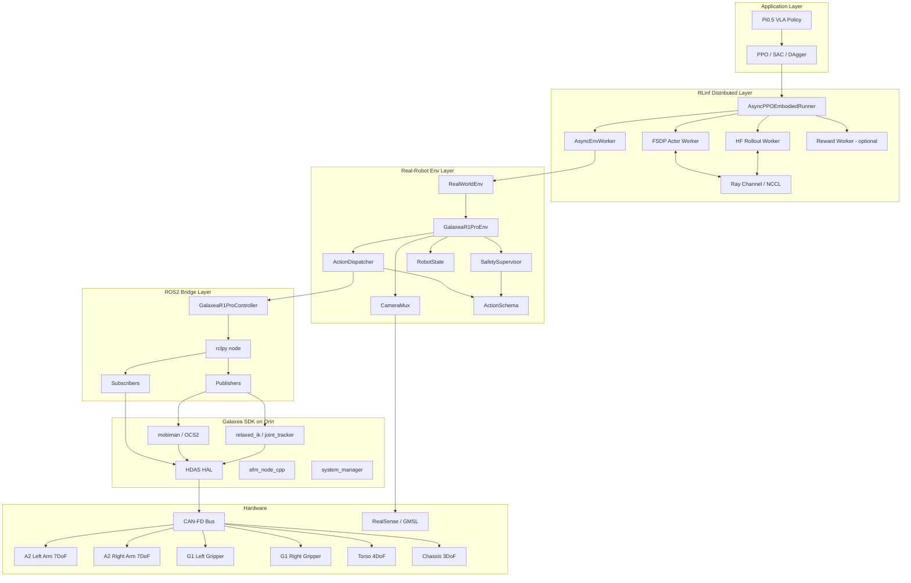
```mermaid
flowchart TB
    subgraph App[Application Layer]
        Pi05[Pi0.5 VLA Policy]
        Algo[PPO / SAC / DAgger]
    end

    subgraph RLinf[RLinf Distributed Layer]
        Runner[AsyncPPOEmbodiedRunner]
        Actor[FSDP Actor Worker]
        Rollout[HF Rollout Worker]
        EnvW[AsyncEnvWorker]
        RewardW[Reward Worker - optional]
        Channel[Ray Channel / NCCL]
    end

    subgraph EnvLayer[Real-Robot Env Layer]
        REnv[RealWorldEnv]
        GEnv[GalaxeaR1ProEnv]
        Disp[ActionDispatcher]
        SafeSup[SafetySupervisor]
        CamMux[CameraMux]
        State[RobotState]
        Schema[ActionSchema]
    end

    subgraph Bridge[ROS2 Bridge Layer]
        Ctrl[GalaxeaR1ProController]
        RclPy[rclpy node]
        Pub[Publishers]
        Sub[Subscribers]
    end

    subgraph SDK[Galaxea SDK on Orin]
        Mobi[mobiman / OCS2]
        IK[relaxed_ik / joint_tracker]
        HDAS[HDAS HAL]
        EFM[efm_node_cpp]
        Sys[system_manager]
    end

    subgraph HW[Hardware]
        CAN[CAN-FD Bus]
        A2L[A2 Left Arm 7DoF]
        A2R[A2 Right Arm 7DoF]
        G1L[G1 Left Gripper]
        G1R[G1 Right Gripper]
        Torso[Torso 4DoF]
        Chas[Chassis 3DoF]
        Cam[RealSense / GMSL]
    end

    Pi05 --> Algo --> Runner
    Runner --> Actor
    Runner --> Rollout
    Runner --> EnvW
    Runner --> RewardW
    Actor <--> Channel
    Rollout <--> Channel
    EnvW --> REnv
    REnv --> GEnv
    GEnv --> Disp
    GEnv --> SafeSup
    GEnv --> CamMux
    GEnv --> State
    Disp --> Schema
    Disp --> Ctrl
    SafeSup --> Schema
    CamMux --> Cam
    Ctrl --> RclPy
    RclPy --> Pub
    RclPy --> Sub
    Pub --> Mobi
    Pub --> IK
    Sub --> HDAS
    Mobi --> HDAS
    IK --> HDAS
    HDAS --> CAN
    CAN --> A2L
    CAN --> A2R
    CAN --> G1L
    CAN --> G1R
    CAN --> Torso
    CAN --> Chas
```

七层堆栈, 自上而下:

1. **Application**: Pi0.5 视觉语言动作模型 + 选定的 RL 算法 (默认 Async PPO, 后期可换 SAC).
2. **RLinf Distributed**: Runner 编排, Actor 训练, Rollout 推理, Env 执行, Reward 计算, 通过 Channel/NCCL 通信. 这层完全复用现有代码 (见 [rlinf/runners/async_ppo_embodied_runner.py](../../rlinf/runners/async_ppo_embodied_runner.py)).
3. **Real-Robot Env**: 把 R1 Pro 包成 Gymnasium Env, 通过 `RealWorldEnv` 接入 RLinf. 这层是本方案修改/新增最多的地方, 重点是 `ActionDispatcher` 抽象.
4. **ROS2 Bridge**: `GalaxeaR1ProController` 在 Orin 侧跑 rclpy node, 把 RPC 调用翻译成 ROS2 消息.
5. **Galaxea SDK**: mobiman / OCS2 做规划 + IK, HDAS 做 CAN 通信, efm_node_cpp 是 Galaxea 自带的端到端模型, 我们不用但要避开冲突, system_manager 管硬件状态.
6. **Hardware**: CAN-FD 总线 + 各机械模块.

### §2.2 类图: 新增模块与已有模块的关系

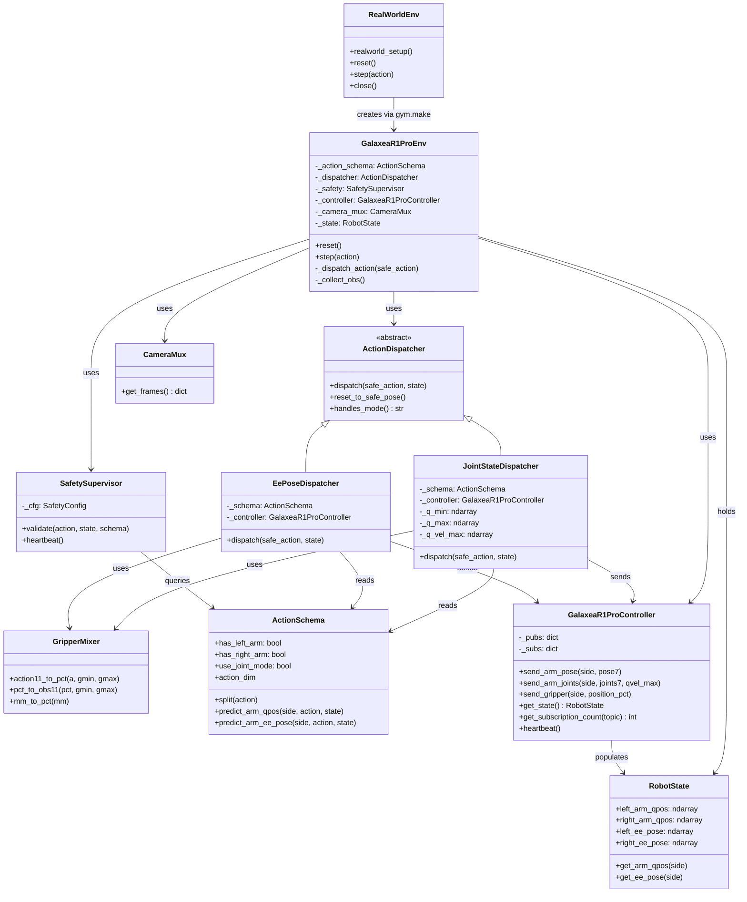
```mermaid
classDiagram
    class RealWorldEnv {
        +realworld_setup()
        +reset()
        +step(action)
        +close()
    }

    class GalaxeaR1ProEnv {
        -_action_schema: ActionSchema
        -_dispatcher: ActionDispatcher
        -_safety: SafetySupervisor
        -_controller: GalaxeaR1ProController
        -_camera_mux: CameraMux
        -_state: RobotState
        +reset()
        +step(action)
        -_dispatch_action(safe_action)
        -_collect_obs()
    }

    class ActionDispatcher {
        <<abstract>>
        +dispatch(safe_action, state)
        +reset_to_safe_pose()
        +handles_mode() str
    }

    class JointStateDispatcher {
        -_schema: ActionSchema
        -_controller: GalaxeaR1ProController
        -_q_min: ndarray
        -_q_max: ndarray
        -_q_vel_max: ndarray
        +dispatch(safe_action, state)
    }

    class EePoseDispatcher {
        -_schema: ActionSchema
        -_controller: GalaxeaR1ProController
        +dispatch(safe_action, state)
    }

    class GripperMixer {
        +action11_to_pct(a, gmin, gmax)
        +pct_to_obs11(pct, gmin, gmax)
        +mm_to_pct(mm)
    }

    class ActionSchema {
        +has_left_arm: bool
        +has_right_arm: bool
        +use_joint_mode: bool
        +action_dim
        +split(action)
        +predict_arm_qpos(side, action, state)
        +predict_arm_ee_pose(side, action, state)
    }

    class GalaxeaR1ProController {
        -_pubs: dict
        -_subs: dict
        +send_arm_pose(side, pose7)
        +send_arm_joints(side, joints7, qvel_max)
        +send_gripper(side, position_pct)
        +get_state() RobotState
        +get_subscription_count(topic) int
        +heartbeat()
    }

    class SafetySupervisor {
        -_cfg: SafetyConfig
        +validate(action, state, schema)
        +heartbeat()
    }

    class RobotState {
        +left_arm_qpos: ndarray
        +right_arm_qpos: ndarray
        +left_ee_pose: ndarray
        +right_ee_pose: ndarray
        +get_arm_qpos(side)
        +get_ee_pose(side)
    }

    class CameraMux {
        +get_frames() dict
    }

    RealWorldEnv --> GalaxeaR1ProEnv : creates via gym.make
    GalaxeaR1ProEnv --> ActionDispatcher : uses
    GalaxeaR1ProEnv --> SafetySupervisor : uses
    GalaxeaR1ProEnv --> GalaxeaR1ProController : uses
    GalaxeaR1ProEnv --> CameraMux : uses
    GalaxeaR1ProEnv --> RobotState : holds
    ActionDispatcher <|-- JointStateDispatcher
    ActionDispatcher <|-- EePoseDispatcher
    JointStateDispatcher --> ActionSchema : reads
    JointStateDispatcher --> GripperMixer : uses
    EePoseDispatcher --> ActionSchema : reads
    EePoseDispatcher --> GripperMixer : uses
    JointStateDispatcher --> GalaxeaR1ProController : sends
    EePoseDispatcher --> GalaxeaR1ProController : sends
    SafetySupervisor --> ActionSchema : queries
    GalaxeaR1ProController --> RobotState : populates
```

加粗的两条 inheritance 是本方案的核心新增: **`ActionDispatcher` 是策略模式 (Strategy Pattern), `JointStateDispatcher` 与 `EePoseDispatcher` 是它的两个实现**. 这样做有三个好处:

1. **env 不再有 `if mode == joint:` 分支**: env 只调 `self._dispatcher.dispatch(safe_action, state)`, 谁是 dispatcher 由工厂决定. 单一职责, 容易测.
2. **新动作模式可扩展**: 将来要加 EFM (Galaxea 自带的 end-to-end 模型) 模式或者 mobiman 全身控制模式, 只要再实现一个 dispatcher 子类, env 一行不改.
3. **测试隔离**: dispatcher 的单测可以 mock controller, 不需要 ROS2 启动.

### §2.3 部署形态对比

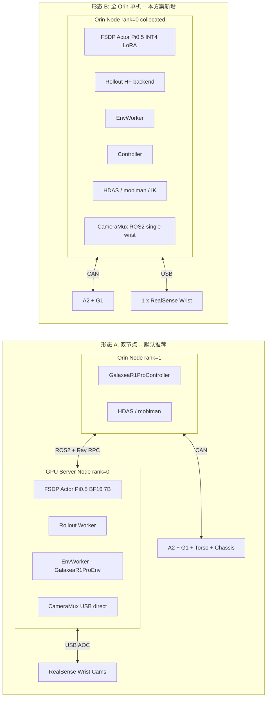
```mermaid
flowchart LR
    subgraph DualNode[形态 A: 双节点 -- 默认推荐]
        direction TB
        subgraph OrinA[Orin Node rank=1]
            CtrlA[GalaxeaR1ProController]
            HDASA[HDAS / mobiman]
        end
        subgraph GPUA[GPU Server Node rank=0]
            ActorA[FSDP Actor Pi0.5 BF16 7B]
            RolloutA[Rollout Worker]
            EnvA[EnvWorker - GalaxeaR1ProEnv]
            CamMuxA[CameraMux USB direct]
        end
        OrinA <-->|ROS2 + Ray RPC| GPUA
        OrinA <-->|CAN| ArmsA[A2 + G1 + Torso + Chassis]
        GPUA <-->|USB AOC| WristCamA[RealSense Wrist Cams]
    end

    subgraph SingleOrin[形态 B: 全 Orin 单机 -- 本方案新增]
        direction TB
        subgraph OrinB[Orin Node rank=0 collocated]
            ActorB[FSDP Actor Pi0.5 INT4 LoRA]
            RolloutB[Rollout HF backend]
            EnvB[EnvWorker]
            CtrlB[Controller]
            HDASB[HDAS / mobiman / IK]
            CamMuxB[CameraMux ROS2 single wrist]
        end
        OrinB <-->|CAN| ArmsB[A2 + G1]
        OrinB <-->|USB| WristCamB[1 x RealSense Wrist]
    end
```

| 维度 | 形态 A 双节点 | 形态 B 全 Orin |
|------|-------------|--------------|
| 推荐场景 | 双臂 + 复杂任务 + 大规模训练 | 单臂 reach/pick + 个人开发 + 演示 |
| Pi0.5 精度 | BF16 全参数 | INT4 + LoRA |
| 显存占用 | GPU 端 24 GB+ | 统一内存 ~16-22 GB |
| 控制频率 | 10-20 Hz | 5-10 Hz |
| 网络要求 | 千兆有线 | 无 |
| ROS2 跨机 | 需要 | 不需要 |
| 数据延迟 (相机) | 1-3 ms (USB AOC 直连) | 8-15 ms (Orin 内部 ROS2) |
| 适配阶段 | M3-M5 | M0-M2 |

详细预算见 [§8.2](#82-全-orin-单机最小资源形态-本方案新增).

### §2.4 状态机: 真机 RL 全生命周期

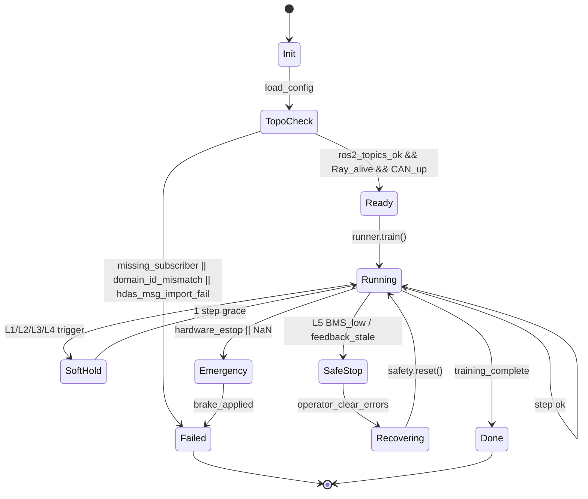
```mermaid
stateDiagram-v2
    [*] --> Init
    Init --> TopoCheck : load_config
    TopoCheck --> Ready : ros2_topics_ok && Ray_alive && CAN_up
    TopoCheck --> Failed : missing_subscriber || domain_id_mismatch || hdas_msg_import_fail
    Ready --> Running : runner.train()
    Running --> Running : step ok
    Running --> SoftHold : L1/L2/L3/L4 trigger
    SoftHold --> Running : 1 step grace
    Running --> SafeStop : L5 BMS_low / feedback_stale
    SafeStop --> Recovering : operator_clear_errors
    Recovering --> Running : safety.reset()
    Running --> Emergency : hardware_estop || NaN
    Emergency --> Failed : brake_applied
    Failed --> [*]
    Running --> Done : training_complete
    Done --> [*]
```

要点:
- **TopoCheck 在 Init -> Ready 之间是强制门**: bring-up 经验不足的同学最常见的错误是 "代码没改也启动不了, 因为 ROS2 拓扑没起", TopoCheck 在 1 秒内判断完, 不让训练启动到一半才发现.
- **SoftHold 与 SafeStop 区分**: SoftHold 是 L1-L4 触发的"我替你抹掉了这个 action", episode 不截断, 训练继续 (但会被记入指标); SafeStop 是 L5 触发的"硬件层面有问题, 暂停一下", episode 截断, 等操作员清错.
- **Emergency 是终态**: 触发了就直接 brake + 退出训练, 不允许自动恢复.

---

## §3 双动作模式: joint_mode 与 ee_mode 的统一抽象

> 本节是全文核心. 用户硬约束第 2 条要求 "以对关节模式 (joint_mode) 的设计与实现为重", 因此 §3.2 篇幅最长.

### §3.1 策略模式: ActionDispatcher 抽象

竞品的 `_dispatch_action` 是写死的 if-else 分支, 加新模式要改 env. 我们把它重构成策略模式.

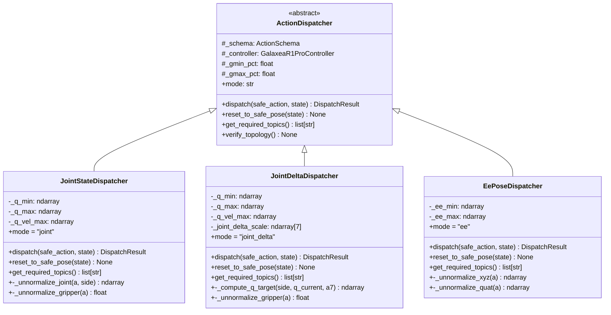
```mermaid
classDiagram
    class ActionDispatcher {
        <<abstract>>
        #_schema: ActionSchema
        #_controller: GalaxeaR1ProController
        #_gmin_pct: float
        #_gmax_pct: float
        +mode: str
        +dispatch(safe_action, state) DispatchResult
        +reset_to_safe_pose(state) None
        +get_required_topics() list[str]
        +verify_topology() None
    }

    class JointStateDispatcher {
        -_q_min: ndarray
        -_q_max: ndarray
        -_q_vel_max: ndarray
        +mode = "joint"
        +dispatch(safe_action, state) DispatchResult
        +reset_to_safe_pose(state) None
        +get_required_topics() list[str]
        +-_unnormalize_joint(a, side) ndarray
        +-_unnormalize_gripper(a) float
    }

    class JointDeltaDispatcher {
        -_q_min: ndarray
        -_q_max: ndarray
        -_q_vel_max: ndarray
        -_joint_delta_scale: ndarray[7]
        +mode = "joint_delta"
        +dispatch(safe_action, state) DispatchResult
        +reset_to_safe_pose(state) None
        +get_required_topics() list[str]
        +-_compute_q_target(side, q_current, a7) ndarray
        +-_unnormalize_gripper(a) float
    }

    class EePoseDispatcher {
        -_ee_min: ndarray
        -_ee_max: ndarray
        +mode = "ee"
        +dispatch(safe_action, state) DispatchResult
        +reset_to_safe_pose(state) None
        +get_required_topics() list[str]
        +-_unnormalize_xyz(a) ndarray
        +-_unnormalize_quat(a) ndarray
    }

    ActionDispatcher <|-- JointStateDispatcher
    ActionDispatcher <|-- JointDeltaDispatcher
    ActionDispatcher <|-- EePoseDispatcher
```

`JointStateDispatcher` 与 `JointDeltaDispatcher` 是 joint mode 的两个 sub-mode (absolute / delta), **共享**`get_required_topics` (都发 `/motion_target/target_joint_state_arm_*`)、`reset_to_safe_pose` (都用绝对 home_q)、`verify_topology` 实现; 唯一差异在 `dispatch` 内部的反归一化数学. 详见 [§3.6](#36-joint_delta_mode-子模式-asymmetric-delta-joints--abs-gripper).

**抽象基类的 5 个职责**:

1. `dispatch(safe_action, state)`: 把已经过安全监督裁剪的 `[-1, 1]^D` 动作翻译成具体下发命令.
2. `reset_to_safe_pose(state)`: episode reset 时把机器人摆到安全初始姿态.
3. `get_required_topics() -> list[str]`: 返回这个 mode 必须的 ROS2 话题列表 (用于 TopoCheck).
4. `verify_topology()`: 启动前检查这些话题至少有 1 个订阅者; 若 ee_mode 但 `target_pose_arm_*` 无订阅者 (没启动 relaxed_ik), 立即 raise.
5. `mode: str`: 自描述属性, 写入日志方便排错.

工厂函数 (放在 `r1_pro_env.py` 或新建 `r1_pro_action_dispatcher.py`):

```python
def build_action_dispatcher(
    cfg: GalaxeaR1ProRobotConfig,
    schema: ActionSchema,
    controller: "GalaxeaR1ProController",
) -> ActionDispatcher:
    """Construct the dispatcher according to cfg.use_joint_mode and
    cfg.joint_delta_mode (the latter is a joint sub-mode flag).
    """
    if cfg.use_joint_mode:
        common_kw = dict(
            schema=schema,
            controller=controller,
            q_min=_resolve_arm_q_min(cfg),
            q_max=_resolve_arm_q_max(cfg),
            q_vel_max=cfg.arm_qvel_max,
            gmin_pct=cfg.gripper_min_pct,
            gmax_pct=cfg.gripper_max_pct,
        )
        if cfg.joint_delta_mode:
            return JointDeltaDispatcher(
                joint_delta_scale=cfg.joint_delta_scale,
                **common_kw,
            )
        return JointStateDispatcher(**common_kw)
    return EePoseDispatcher(
        schema=schema,
        controller=controller,
        ee_min=cfg.ee_min,
        ee_max=cfg.ee_max,
        gmin_pct=cfg.gripper_min_pct,
        gmax_pct=cfg.gripper_max_pct,
    )
```

两个 YAML 一级开关:

| 开关 | 默认 | 作用 |
|------|------|------|
| `cfg.use_joint_mode: bool` | `true` | 决定 joint vs ee; ee 时下面的 `joint_delta_mode` 被忽略 |
| `cfg.joint_delta_mode: bool` | `false` | 在 joint 下进一步决定 absolute vs delta sub-mode |

本方案推荐 SFT 起步用 absolute (`joint_delta_mode=false`, CLI bring-up 直观), RL fine-tune 切到 delta (`joint_delta_mode=true`, 与 LIBERO/Behavior 等 SFT 数据分布对齐). 决策表见 [§3.6.8](#368-何时用哪种-sub-mode-决策表).

### §3.2 关节模式 (joint_mode): 详细设计与核心代码

> **范围说明**: 本节专讲 **absolute joint sub-mode** (`joint_delta_mode=false`, 默认). 模型直接输出每个关节希望去到的绝对角度. delta sub-mode (模型输出关节增量) 见 [§3.6](#36-joint_delta_mode-子模式-asymmetric-delta-joints--abs-gripper). 两种 sub-mode 走**同一套 ROS2 topic** (`/motion_target/target_joint_state_arm_*`)、**同一套安全闸门** (L1-L5)、**同一套 GripperMixer** (gripper 永远是 absolute, 与 joint sub-mode 无关), 唯一差别是 `JointDeltaDispatcher` 用 `q_target = clip(q_current + a·delta_scale, q_min, q_max)` 而不是 `q_target = unnorm(a)`.

#### §3.2.1 设计原理 (由浅入深)

**第一性原理**: R1 Pro 的每条机械臂是 7 自由度的 A2, 关节空间一共 7 个角度 (rad). 关节模式让策略直接输出"7 个关节希望去到的目标角度", 不经过 IK, 不经过笛卡尔. 这样:

- **更直接**: 策略输出 `q_target` 直接进入 mobiman 的 joint_tracker, joint_tracker 用低级 PD 跟踪, 没有 IK 解算的奇异点问题.
- **更线性**: 策略空间 7-D, 控制空间 7-D, 网络更容易学.
- **更安全**: 关节限位是硬限位, 不会因为 IK 解算误差超出.
- **更接近大型 VLA 训练数据**: Pi0.5 / OpenPI 在 LIBERO / Behavior 等数据集上的 SFT 数据多是关节角, 与本模式天然对齐.

**为什么用绝对位置而不是增量?**: 绝对位置 (`q_target = unnormalize(action)`) 比增量 (`q_target = q_current + action * scale`) 更适合大模型策略, 因为:

- 大模型的预测分布通常是 chunk 形式的多步动作, 增量累计误差大;
- joint_tracker 节点本来就是位置环 + 内部速度限制, 直接接受绝对目标也不会出现剧烈跳动 (有 `qvel_max` 限速);
- 切到 fail-safe 时直接发 home 关节角即可, 无需相对状态.

**反归一化公式**:

```
action_i in [-1, 1]
q_i = q_min_i + (action_i + 1) * 0.5 * (q_max_i - q_min_i)
```

每个关节有自己的 `[q_min_i, q_max_i]`, 来源优先级:
1. 解析 R1 Pro URDF (在 `/home/nvidia/galaxea/install/...` 中找 `joint` 标签的 `limit lower/upper`)
2. 配置文件显式指定 (`cfg.arm_q_min_right`, `cfg.arm_q_max_right`)
3. 拒绝启动 (不允许像竞品那样落到 Franka 默认值)

**JointState 消息字段填充**:
- `position`: 长度 7, 反归一化后的目标关节角 (rad)
- `velocity`: 长度 7, 不是当前速度, 而是 mobiman 文档约定的"运动过程中允许的最大速度" (rad/s); 推荐填 `[3, 3, 3, 3, 5, 5, 5]` (与 Galaxea 官方上限一致)
- `effort`: 留空 (joint_tracker 不读)
- `name`: 长度 7, 关节名 (从 URDF 取, 默认 `[arm_right_j1...j7]` / `[arm_left_j1...j7]`)
- `header.stamp`: 当前时间, 用 `rclpy.clock().now().to_msg()`

#### §3.2.2 类图

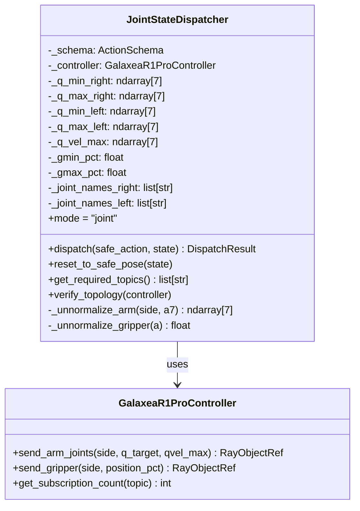
```mermaid
classDiagram
    class JointStateDispatcher {
        -_schema: ActionSchema
        -_controller: GalaxeaR1ProController
        -_q_min_right: ndarray[7]
        -_q_max_right: ndarray[7]
        -_q_min_left: ndarray[7]
        -_q_max_left: ndarray[7]
        -_q_vel_max: ndarray[7]
        -_gmin_pct: float
        -_gmax_pct: float
        -_joint_names_right: list[str]
        -_joint_names_left: list[str]
        +mode = "joint"
        +dispatch(safe_action, state) DispatchResult
        +reset_to_safe_pose(state)
        +get_required_topics() list[str]
        +verify_topology(controller)
        -_unnormalize_arm(side, a7) ndarray[7]
        -_unnormalize_gripper(a) float
    }

    class GalaxeaR1ProController {
        +send_arm_joints(side, q_target, qvel_max) RayObjectRef
        +send_gripper(side, position_pct) RayObjectRef
        +get_subscription_count(topic) int
    }

    JointStateDispatcher --> GalaxeaR1ProController : uses
```

#### §3.2.3 时序图: 一次 step 的全过程

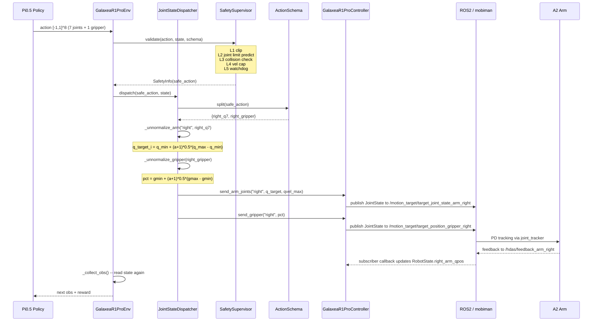
```mermaid
sequenceDiagram
    participant Pi as Pi0.5 Policy
    participant Env as GalaxeaR1ProEnv
    participant Disp as JointStateDispatcher
    participant Sup as SafetySupervisor
    participant Schema as ActionSchema
    participant Ctrl as GalaxeaR1ProController
    participant ROS as ROS2 / mobiman
    participant Robot as A2 Arm

    Pi->>Env: action [-1,1]^8 (7 joints + 1 gripper)
    Env->>Sup: validate(action, state, schema)
    Note over Sup: L1 clip<br/>L2 joint limit predict<br/>L3 collision check<br/>L4 vel cap<br/>L5 watchdog
    Sup-->>Env: SafetyInfo(safe_action)
    Env->>Disp: dispatch(safe_action, state)
    Disp->>Schema: split(safe_action)
    Schema-->>Disp: {right_q7, right_gripper}
    Disp->>Disp: _unnormalize_arm("right", right_q7)
    Note over Disp: q_target_i = q_min + (a+1)*0.5*(q_max - q_min)
    Disp->>Disp: _unnormalize_gripper(right_gripper)
    Note over Disp: pct = gmin + (a+1)*0.5*(gmax - gmin)
    Disp->>Ctrl: send_arm_joints("right", q_target, qvel_max)
    Ctrl->>ROS: publish JointState to /motion_target/target_joint_state_arm_right
    Disp->>Ctrl: send_gripper("right", pct)
    Ctrl->>ROS: publish JointState to /motion_target/target_position_gripper_right
    ROS->>Robot: PD tracking via joint_tracker
    Robot-->>ROS: feedback to /hdas/feedback_arm_right
    ROS-->>Ctrl: subscriber callback updates RobotState.right_arm_qpos
    Env->>Env: _collect_obs() -- read state again
    Env-->>Pi: next obs + reward
```

#### §3.2.4 核心代码 (展示用, 实际改动见 §11)

```python
# rlinf/envs/realworld/galaxear/r1_pro_action_dispatcher.py  (新增文件)

import numpy as np
from typing import Optional, List

from .r1_pro_action_schema import ActionSchema
from .r1_pro_robot_state import GalaxeaR1ProRobotState


class DispatchResult:
    """Snapshot of what was sent to the controller, for logging/metrics."""
    def __init__(self, mode: str, raw_cmd: dict, obj_refs: list):
        self.mode = mode
        self.raw_cmd = raw_cmd
        self.obj_refs = obj_refs


class ActionDispatcher:
    """Strategy interface for translating safe normalised actions to ROS2."""
    mode: str = "abstract"

    def dispatch(
        self, safe_action: np.ndarray, state: GalaxeaR1ProRobotState,
    ) -> DispatchResult:
        raise NotImplementedError

    def reset_to_safe_pose(self, state: GalaxeaR1ProRobotState) -> None:
        raise NotImplementedError

    def get_required_topics(self) -> List[str]:
        raise NotImplementedError

    def verify_topology(self, controller) -> None:
        for topic in self.get_required_topics():
            n = controller.get_subscription_count(topic)
            if n <= 0:
                raise RuntimeError(
                    f"[{self.mode}] required topic '{topic}' has no subscriber. "
                    "Did you forget to launch the corresponding mobiman node?"
                )


class JointStateDispatcher(ActionDispatcher):
    """Send 7-D joint target + 1-D gripper, the recommended mode for Pi0.5."""
    mode = "joint"

    def __init__(
        self,
        *,
        schema: ActionSchema,
        controller,
        q_min_right: np.ndarray,
        q_max_right: np.ndarray,
        q_min_left: np.ndarray,
        q_max_left: np.ndarray,
        q_vel_max: np.ndarray,
        gmin_pct: float = 0.0,
        gmax_pct: float = 90.0,
        home_q_right: Optional[np.ndarray] = None,
        home_q_left: Optional[np.ndarray] = None,
    ):
        self._schema = schema
        self._controller = controller
        self._q_min_right = np.asarray(q_min_right, dtype=np.float32).reshape(7)
        self._q_max_right = np.asarray(q_max_right, dtype=np.float32).reshape(7)
        self._q_min_left = np.asarray(q_min_left, dtype=np.float32).reshape(7)
        self._q_max_left = np.asarray(q_max_left, dtype=np.float32).reshape(7)
        self._q_vel_max = np.asarray(q_vel_max, dtype=np.float32).reshape(7)
        self._gmin_pct = float(gmin_pct)
        self._gmax_pct = float(gmax_pct)
        # home pose default: zeros (R1 Pro SDK starting_config is [0]*7)
        self._home_q_right = (
            np.asarray(home_q_right, dtype=np.float32).reshape(7)
            if home_q_right is not None else np.zeros(7, dtype=np.float32)
        )
        self._home_q_left = (
            np.asarray(home_q_left, dtype=np.float32).reshape(7)
            if home_q_left is not None else np.zeros(7, dtype=np.float32)
        )

    def _unnormalize_arm(self, side: str, a7: np.ndarray) -> np.ndarray:
        a = np.clip(np.asarray(a7, dtype=np.float32).reshape(7), -1.0, 1.0)
        if side == "right":
            qmin, qmax = self._q_min_right, self._q_max_right
        else:
            qmin, qmax = self._q_min_left, self._q_max_left
        # Linear map [-1, 1] -> [qmin, qmax].
        return qmin + (a + 1.0) * 0.5 * (qmax - qmin)

    def _unnormalize_gripper(self, a: float) -> float:
        a = float(np.clip(a, -1.0, 1.0))
        pct = self._gmin_pct + (a + 1.0) * 0.5 * (self._gmax_pct - self._gmin_pct)
        # Clip to physical [0, 100] just in case gmin/gmax was misconfigured.
        return float(np.clip(pct, 0.0, 100.0))

    def dispatch(
        self, safe_action: np.ndarray, state: GalaxeaR1ProRobotState,
    ) -> DispatchResult:
        d = self._schema.split(safe_action)
        # In joint mode, ActionSchema.split already returns 7+1 per arm,
        # but it's currently keyed as right_xyz/right_rpy/right_gripper.
        # We aggregate the first 6 + future j7 below; see §3.2.5 for the
        # reason we extend ActionSchema.split with use_joint_mode awareness.
        raw_cmd: dict = {}
        refs: list = []

        if "right_q7" in d:                           # see §3.2.5
            q_target = self._unnormalize_arm("right", d["right_q7"])
            ref = self._controller.send_arm_joints(
                "right", q_target, self._q_vel_max,
            )
            raw_cmd["right_q_target"] = q_target.tolist()
            refs.append(ref)
            if "right_gripper" in d:
                pct = self._unnormalize_gripper(d["right_gripper"])
                ref_g = self._controller.send_gripper("right", pct)
                raw_cmd["right_gripper_pct"] = pct
                refs.append(ref_g)

        if "left_q7" in d:
            q_target = self._unnormalize_arm("left", d["left_q7"])
            ref = self._controller.send_arm_joints(
                "left", q_target, self._q_vel_max,
            )
            raw_cmd["left_q_target"] = q_target.tolist()
            refs.append(ref)
            if "left_gripper" in d:
                pct = self._unnormalize_gripper(d["left_gripper"])
                ref_g = self._controller.send_gripper("left", pct)
                raw_cmd["left_gripper_pct"] = pct
                refs.append(ref_g)

        return DispatchResult(self.mode, raw_cmd, refs)

    def reset_to_safe_pose(self, state: GalaxeaR1ProRobotState) -> None:
        if self._schema.has_right_arm:
            self._controller.send_arm_joints(
                "right", self._home_q_right, self._q_vel_max,
            ).wait()
        if self._schema.has_left_arm:
            self._controller.send_arm_joints(
                "left", self._home_q_left, self._q_vel_max,
            ).wait()

    def get_required_topics(self) -> List[str]:
        topics = []
        if self._schema.has_right_arm:
            topics.append("/motion_target/target_joint_state_arm_right")
            if not self._schema.no_gripper:
                topics.append("/motion_target/target_position_gripper_right")
        if self._schema.has_left_arm:
            topics.append("/motion_target/target_joint_state_arm_left")
            if not self._schema.no_gripper:
                topics.append("/motion_target/target_position_gripper_left")
        return topics
```

逐行解读 (核心 4 个点):

- **`_unnormalize_arm` 用线性映射**: 不用 tanh, 不加 deadband, 因为 Pi0.5 的输出已经过 `tanh` 头, 已经在 `[-1, 1]`; 我们只做尺度变换. 用 `np.clip` 防御性处理 NaN 是 L1 的兜底.
- **`q_min/q_max` per-arm 独立**: 左右臂虽然结构对称, 但 J2 / J3 的限位有镜像关系 (这是 `mismatch_realworld_1.md` 的明确警示). 我们不做"右臂限位 = 左臂限位"的假设, 都从 URDF 单独读.
- **`send_arm_joints` 由 controller 完成 ROS2 publish**: dispatcher 不直接 import rclpy, 完全通过 controller 的 RPC 接口. 这样 dispatcher 单测可以纯 mock, 不需要 ROS2 stack.
- **`reset_to_safe_pose` 用 `.wait()` 同步阻塞**: reset 阶段允许慢, 等机器人真的回到 home 再 return; step 阶段不 wait, 让 Pi0.5 的下一步动作能直接覆盖, 避免高频策略被卡死.

#### §3.2.5 ActionSchema 的 joint mode 扩展

竞品 `ActionSchema.split` 的 key 名是 `right_xyz / right_rpy / right_gripper`, 在 ee_mode 下完全对得上, 但 joint mode 下 7 个关节硬塞进 "xyz + rpy" 6 个槽很别扭, 第 7 个关节没地方放. 本方案对 schema 加一个 `split_joint` 方法或者改 `split` 的 key 名:

```python
# rlinf/envs/realworld/galaxear/r1_pro_action_schema.py  (修改)

class ActionSchema:
    @property
    def per_arm_dim(self) -> int:
        # In joint mode each arm is 7 joints + optional gripper.
        # In ee mode each arm is 3 xyz + 4 quat + optional gripper.
        if self.use_joint_mode:
            return 7 if self.no_gripper else 8
        return 7 if self.no_gripper else 8   # 3 + 4 + 1

    def split(self, action: np.ndarray) -> dict:
        out: dict = {}
        idx = 0
        action = np.asarray(action, dtype=np.float32).reshape(-1)

        if self.has_right_arm:
            if self.use_joint_mode:
                out["right_q7"] = action[idx : idx + 7]
                idx += 7
            else:
                out["right_xyz"] = action[idx : idx + 3]
                out["right_quat"] = action[idx + 3 : idx + 7]
                idx += 7
            if not self.no_gripper:
                out["right_gripper"] = float(action[idx])
                idx += 1

        if self.has_left_arm:
            if self.use_joint_mode:
                out["left_q7"] = action[idx : idx + 7]
                idx += 7
            else:
                out["left_xyz"] = action[idx : idx + 3]
                out["left_quat"] = action[idx + 3 : idx + 7]
                idx += 7
            if not self.no_gripper:
                out["left_gripper"] = float(action[idx])
                idx += 1

        if self.has_torso:
            out["torso_twist"] = action[idx : idx + 4]
            idx += 4
        if self.has_chassis:
            out["chassis_twist"] = action[idx : idx + 3]
            idx += 3
        return out
```

**与竞品 schema 的两点关键差异**:

1. **per-arm 7 维不再是 `xyz + rpy`, 而是 `q7`** (joint mode) **或 `xyz + quat (4D)`** (ee mode); ee mode 下从 `3+3 RPY` 改为 `3+4 quat` 是用户硬约束第 3.3 条要求的, 也避免了 RPY 的奇异问题.
2. **`per_arm_dim` 在两种 mode 下都是 8 (含 gripper) 或 7 (无 gripper)**, 与策略输出维度天然对齐, Pi0.5 不感知模式差异.

#### §3.2.6 Controller 侧 send_arm_joints 修订

```python
# rlinf/envs/realworld/galaxear/r1_pro_controller.py  (修改)

from sensor_msgs.msg import JointState
import rclpy.time

class GalaxeaR1ProController(Worker):

    DEFAULT_JOINT_NAMES = {
        "right": [f"arm_right_j{i+1}" for i in range(7)],
        "left":  [f"arm_left_j{i+1}"  for i in range(7)],
    }
    DEFAULT_QVEL_MAX = (3.0, 3.0, 3.0, 3.0, 5.0, 5.0, 5.0)  # rad/s, per Galaxea doc

    def send_arm_joints(
        self,
        side: str,
        q_target: "np.ndarray",
        qvel_max: "np.ndarray | None" = None,
    ) -> None:
        if self._is_dummy:
            return
        topic = f"/motion_target/target_joint_state_arm_{side}"
        pub = self._pubs.get(f"target_joint_state_arm_{side}")
        if pub is None:
            self.log_error(f"publisher for {topic} not initialised")
            return
        msg = JointState()
        msg.header.stamp = self._node.get_clock().now().to_msg()
        msg.name = list(self.DEFAULT_JOINT_NAMES[side])
        q = list(map(float, np.asarray(q_target).reshape(-1)[:7]))
        if len(q) < 7:
            q = q + [0.0] * (7 - len(q))
        msg.position = q
        v = qvel_max if qvel_max is not None else np.array(self.DEFAULT_QVEL_MAX)
        msg.velocity = list(map(float, np.asarray(v).reshape(-1)[:7]))
        pub.publish(msg)

    def get_subscription_count(self, topic: str) -> int:
        if self._is_dummy:
            return 1
        # rclpy gives publisher.get_subscription_count() but indexed by our pub.
        for key, pub in self._pubs.items():
            if pub.topic_name == topic:
                return pub.get_subscription_count()
        return 0
```

要点:
- `JointState.velocity` 字段是"过程最大速度", 不是当前速度反馈. 这是 mobiman joint_tracker 的约定 (见官方 ROS2 文档 zh 版).
- 默认上限 `[3, 3, 3, 3, 5, 5, 5]` rad/s 来自 Galaxea 官方文档示例, 可通过 cfg 覆写但通常不需要.
- `get_subscription_count` 是新增 API, dispatcher 的 `verify_topology` 用它做 Go/No-Go.

#### §3.2.7 单元测试矩阵

| 用例 | 输入 | 期望 | 文件 |
|------|------|------|------|
| 反归一化对称性 | `a = np.zeros(7)` | `q_target == (q_min + q_max) / 2` | `tests/unit_tests/test_galaxea_r1_pro_joint_dispatcher.py` |
| 反归一化边界 | `a[3] = -1` | `q_target[3] == q_min[3]` | 同上 |
| 反归一化越界裁剪 | `a[3] = 1.5` | `q_target[3] == q_max[3]` | 同上 |
| Gripper 配置范围 (`gmax_pct=90`) | `a = 1` | `pct == 90.0` | 同上 |
| Gripper 配置范围 | `a = -1` | `pct == 0.0` | 同上 |
| Gripper 配置范围 | `a = 0` | `pct == 45.0` | 同上 |
| dispatcher.dispatch 调用 controller.send_arm_joints | mock controller | `assert_called_with("right", expected_q, qvel_max)` | 同上 |
| dispatcher.dispatch 不调用 send_arm_pose | mock controller | `controller.send_arm_pose.assert_not_called()` | 同上 |
| reset_to_safe_pose 发 home_q | mock controller | `assert_called_with("right", home_q_right, ...)` | 同上 |
| verify_topology 在订阅者数 0 时 raise | mock controller `get_subscription_count -> 0` | `RuntimeError` | 同上 |

总计 10 个单测用例, 对照用户硬约束第 4 条 "要有相关的单元测试和 CLI 交互测试" 完整覆盖.

### §3.3 末端位姿模式 (ee_mode): 详细设计与核心代码

#### §3.3.1 设计原理

ee_mode 下策略输出 7 维 (xyz + quat) + 1 维 gripper. 这是 R1 Pro SDK 的"高级控制模式": 我们发 PoseStamped 给 mobiman, mobiman 内部跑 relaxed_ik 解算成关节角, 再交给 joint_tracker 跟踪. 优点是策略不用感知关节限位; 缺点是 IK 解算可能在奇异点跳变, 需要工作空间盒严格限制.

#### §3.3.2 反归一化公式

**xyz 部分**:
```
action[i] in [-1, 1]
xyz[i] = ee_min[i] + (action[i] + 1) * 0.5 * (ee_max[i] - ee_min[i])
```
工作空间盒 `(ee_min, ee_max)` 是 6 维, 在 `torso_link4` 坐标系 (Galaxea 默认 frame). 不是 Franka 默认值, 必须现场标定 (见 [§13.2 工作空间盒标定](#132-工作空间盒标定流程)).

**四元数部分** (用户硬约束第 3.3 条):
```
action[3:7] in [-1, 1]    # raw quat outputs from policy
quat = action[3:7]        # interpret directly as (qx, qy, qz, qw)
quat = normalize(quat)    # L2-normalise to unit length
if quat[3] < 0:
    quat = -quat          # canonicalise W >= 0 to avoid sign flip
```

**为什么不用 RPY?**: 竞品用 RPY (`r1_pro_action_schema.py:138-141`), 三个角度的累计误差和万向锁问题在 Pi0.5 这种 chunk 多步预测时被放大. 直接用四元数 + L2 归一化更稳, 也避免了 RPY -> quat 的转换误差 (现实中 `R.from_euler("xyz", target[3:]).as_quat()` 在边界处不连续).

**两个细节**:
- 四元数 L2 归一化是必须的, 否则 mobiman 拒收;
- W >= 0 的规约 (canonical form) 是为了避免连续两步策略输出 `q` 与 `-q` (它们代表同一旋转) 时, 增量计算出现 180 度误差.

#### §3.3.3 类图与时序图

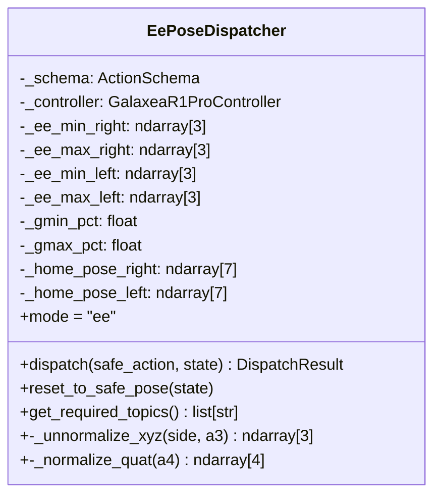
```mermaid
classDiagram
    class EePoseDispatcher {
        -_schema: ActionSchema
        -_controller: GalaxeaR1ProController
        -_ee_min_right: ndarray[3]
        -_ee_max_right: ndarray[3]
        -_ee_min_left: ndarray[3]
        -_ee_max_left: ndarray[3]
        -_gmin_pct: float
        -_gmax_pct: float
        -_home_pose_right: ndarray[7]
        -_home_pose_left: ndarray[7]
        +mode = "ee"
        +dispatch(safe_action, state) DispatchResult
        +reset_to_safe_pose(state)
        +get_required_topics() list[str]
        +-_unnormalize_xyz(side, a3) ndarray[3]
        +-_normalize_quat(a4) ndarray[4]
    }
```

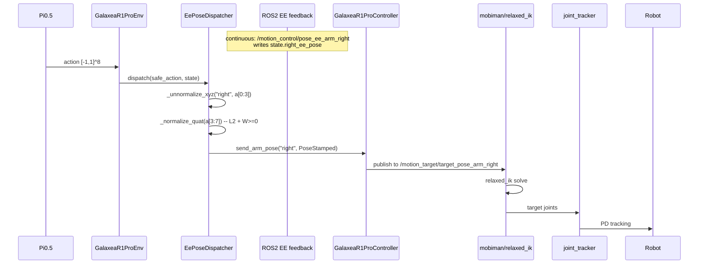
```mermaid
sequenceDiagram
    participant Pi as Pi0.5
    participant Env as GalaxeaR1ProEnv
    participant Disp as EePoseDispatcher
    participant Sub as ROS2 EE feedback
    participant Ctrl as GalaxeaR1ProController
    participant Mobi as mobiman/relaxed_ik
    participant JT as joint_tracker

    Note over Sub: continuous: /motion_control/pose_ee_arm_right<br/>writes state.right_ee_pose
    Pi->>Env: action [-1,1]^8
    Env->>Disp: dispatch(safe_action, state)
    Disp->>Disp: _unnormalize_xyz("right", a[0:3])
    Disp->>Disp: _normalize_quat(a[3:7]) -- L2 + W>=0
    Disp->>Ctrl: send_arm_pose("right", PoseStamped)
    Ctrl->>Mobi: publish to /motion_target/target_pose_arm_right
    Mobi->>Mobi: relaxed_ik solve
    Mobi->>JT: target joints
    JT->>Robot: PD tracking
```

#### §3.3.4 EE 反馈订阅 (修复竞品 Bug)

```python
# rlinf/envs/realworld/galaxear/r1_pro_controller.py  (新增订阅)

from geometry_msgs.msg import PoseStamped

def _init_subscribers(self) -> None:
    # ... existing subscribers ...

    # NEW: EE pose feedback (the missing piece in r1pro5op47.md)
    if self._use_right_arm:
        self._subs["pose_ee_arm_right"] = self._node.create_subscription(
            PoseStamped,
            "/motion_control/pose_ee_arm_right",
            self._cb_pose_ee_right,
            best_effort,   # high-rate sensor data, drop is fine
        )
    if self._use_left_arm:
        self._subs["pose_ee_arm_left"] = self._node.create_subscription(
            PoseStamped,
            "/motion_control/pose_ee_arm_left",
            self._cb_pose_ee_left,
            best_effort,
        )

def _cb_pose_ee_right(self, msg: PoseStamped) -> None:
    p = msg.pose.position
    q = msg.pose.orientation
    self._state.right_ee_pose = np.array(
        [p.x, p.y, p.z, q.x, q.y, q.z, q.w], dtype=np.float32,
    )
    self._mark_feedback("pose_ee_arm_right")

def _cb_pose_ee_left(self, msg: PoseStamped) -> None:
    p = msg.pose.position
    q = msg.pose.orientation
    self._state.left_ee_pose = np.array(
        [p.x, p.y, p.z, q.x, q.y, q.z, q.w], dtype=np.float32,
    )
    self._mark_feedback("pose_ee_arm_left")
```

`_mark_feedback` 是已有的 helper, 用来更新 `state.feedback_age_ms[topic_key]` 给 L5 watchdog 用.

#### §3.3.5 EePoseDispatcher 核心代码

```python
class EePoseDispatcher(ActionDispatcher):
    mode = "ee"

    def __init__(
        self,
        *,
        schema: ActionSchema,
        controller,
        ee_min_right: np.ndarray,
        ee_max_right: np.ndarray,
        ee_min_left: np.ndarray,
        ee_max_left: np.ndarray,
        gmin_pct: float = 0.0,
        gmax_pct: float = 90.0,
        home_pose_right: Optional[np.ndarray] = None,
        home_pose_left: Optional[np.ndarray] = None,
    ):
        self._schema = schema
        self._controller = controller
        self._ee_min_right = np.asarray(ee_min_right, dtype=np.float32).reshape(3)
        self._ee_max_right = np.asarray(ee_max_right, dtype=np.float32).reshape(3)
        self._ee_min_left = np.asarray(ee_min_left, dtype=np.float32).reshape(3)
        self._ee_max_left = np.asarray(ee_max_left, dtype=np.float32).reshape(3)
        self._gmin_pct = float(gmin_pct)
        self._gmax_pct = float(gmax_pct)
        self._home_pose_right = home_pose_right  # 7-D xyzquat in torso_link4
        self._home_pose_left = home_pose_left

    def _unnormalize_xyz(self, side: str, a3: np.ndarray) -> np.ndarray:
        a = np.clip(np.asarray(a3, dtype=np.float32).reshape(3), -1.0, 1.0)
        if side == "right":
            lo, hi = self._ee_min_right, self._ee_max_right
        else:
            lo, hi = self._ee_min_left, self._ee_max_left
        return lo + (a + 1.0) * 0.5 * (hi - lo)

    def _normalize_quat(self, a4: np.ndarray) -> np.ndarray:
        q = np.asarray(a4, dtype=np.float32).reshape(4)
        # Even if policy outputs in [-1, 1], we just L2-normalise; the sign
        # space is naturally [-1, 1].
        n = float(np.linalg.norm(q))
        if n < 1e-8:
            # Degenerate; fall back to identity quat to avoid NaN.
            return np.array([0.0, 0.0, 0.0, 1.0], dtype=np.float32)
        q = q / n
        if q[3] < 0:        # canonicalise W >= 0
            q = -q
        return q.astype(np.float32)

    def _unnormalize_gripper(self, a: float) -> float:
        a = float(np.clip(a, -1.0, 1.0))
        pct = self._gmin_pct + (a + 1.0) * 0.5 * (self._gmax_pct - self._gmin_pct)
        return float(np.clip(pct, 0.0, 100.0))

    def dispatch(self, safe_action, state) -> DispatchResult:
        d = self._schema.split(safe_action)
        raw_cmd: dict = {}
        refs: list = []

        for side, key_xyz, key_quat, key_g in [
            ("right", "right_xyz", "right_quat", "right_gripper"),
            ("left",  "left_xyz",  "left_quat",  "left_gripper"),
        ]:
            if key_xyz not in d:
                continue
            xyz = self._unnormalize_xyz(side, d[key_xyz])
            quat = self._normalize_quat(d[key_quat])
            pose = np.concatenate([xyz, quat]).astype(np.float32)  # 7-D
            ref = self._controller.send_arm_pose(side, pose)
            raw_cmd[f"{side}_pose"] = pose.tolist()
            refs.append(ref)
            if key_g in d:
                pct = self._unnormalize_gripper(d[key_g])
                ref_g = self._controller.send_gripper(side, pct)
                raw_cmd[f"{side}_gripper_pct"] = pct
                refs.append(ref_g)

        return DispatchResult(self.mode, raw_cmd, refs)

    def get_required_topics(self):
        topics = []
        if self._schema.has_right_arm:
            topics.append("/motion_target/target_pose_arm_right")
            if not self._schema.no_gripper:
                topics.append("/motion_target/target_position_gripper_right")
        if self._schema.has_left_arm:
            topics.append("/motion_target/target_pose_arm_left")
            if not self._schema.no_gripper:
                topics.append("/motion_target/target_position_gripper_left")
        return topics
```

注意几个细节:
- `for side, ...` 循环把 left/right 处理统一, 减少代码重复.
- `_normalize_quat` 处理零向量退化 (策略偶尔输出全 0), 回到单位四元数, 避免 NaN.
- `send_arm_pose` 已经是 controller 的现有方法, 我们这里复用; 但 controller 内部 publish 时要把 7-D `[x, y, z, qx, qy, qz, qw]` 拆给 `PoseStamped.pose.position / orientation`.

#### §3.3.6 EE mode 单元测试矩阵

| 用例 | 输入 | 期望 |
|------|------|------|
| 四元数零向量 | `a[3:7] = [0,0,0,0]` | 返回 `[0,0,0,1]` 单位 quat |
| 四元数 W<0 翻转 | `a[3:7] = [0,0,0,-1]` 归一化后 | W 取正, 即 `[0,0,0,1]` |
| 四元数任意输入 L2 归一化 | `a[3:7] = [1,0,0,1]` | `[0.707, 0, 0, 0.707]` |
| xyz 中间值 | `a[0:3] = [0,0,0]` | `(ee_min + ee_max) / 2` |
| xyz 越界裁剪 | `a[0] = 2` | `ee_max[0]` |
| dispatch 调用 send_arm_pose, 不调 send_arm_joints | mock | assert |
| EE 反馈回调写入 state | publish PoseStamped | `state.right_ee_pose == [...]` |
| Gripper 配置 90 上限 | `a = 1` | `pct == 90.0` |

### §3.4 夹爪通用层: 真实 [0,100] 与可配置范围

用户硬约束第 3.4 / 4.4 条要求 "gripper 真实数值 [0,100], 但要可以人工设置, 比如调到 [0, 90]; observation 和 action 中的 gripper 值都归一化到 [-1, 1]".

#### §3.4.1 配置 + 数据流

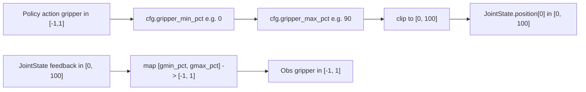
```mermaid
flowchart LR
    PolicyAction["Policy action gripper in [-1,1]"]
    BizMin["cfg.gripper_min_pct e.g. 0"]
    BizMax["cfg.gripper_max_pct e.g. 90"]
    PhysClip["clip to [0, 100]"]
    ROS2["JointState.position[0] in [0, 100]"]

    Feedback["JointState feedback in [0, 100]"]
    BizMap["map [gmin_pct, gmax_pct] -> [-1, 1]"]
    PolicyObs["Obs gripper in [-1, 1]"]

    PolicyAction --> BizMin
    BizMin --> BizMax
    BizMax --> PhysClip
    PhysClip --> ROS2

    Feedback --> BizMap
    BizMap --> PolicyObs
```

**关键点**: 业务侧的 `[gmin_pct, gmax_pct]` (例如 `[0, 90]`) 是策略的"可见区间", 物理 `[0, 100]` 是设备的硬性区间. action 反归一化时, `+1` 对应业务上限 (90), `-1` 对应业务下限 (0); 真实下发到 ROS2 时再 clip 到物理 `[0, 100]` 兜底.

为什么这样设计?
- 用户希望"夹得不要太开避免碰撞", 把 gmax 调小;
- 模型不感知具体 mm, 只看到 [-1, 1] 的归一化值, 模型可移植性更好;
- 物理 clip 是兜底, 防止配置错误把策略输出送到设备的非法范围.

#### §3.4.2 Helper: GripperMixer

```python
# rlinf/envs/realworld/galaxear/r1_pro_gripper_mixer.py  (新增, 30 行)

import numpy as np

class GripperMixer:
    """Centralised gripper [-1,1] <-> business pct [0,100] mapping."""

    def __init__(self, gmin_pct: float = 0.0, gmax_pct: float = 90.0):
        self._gmin = float(gmin_pct)
        self._gmax = float(gmax_pct)
        if self._gmax <= self._gmin:
            raise ValueError(f"gmax_pct ({gmax_pct}) must be > gmin_pct ({gmin_pct})")

    @property
    def gmin_pct(self) -> float:
        return self._gmin

    @property
    def gmax_pct(self) -> float:
        return self._gmax

    def action11_to_pct(self, a: float) -> float:
        a = float(np.clip(a, -1.0, 1.0))
        pct = self._gmin + (a + 1.0) * 0.5 * (self._gmax - self._gmin)
        return float(np.clip(pct, 0.0, 100.0))

    def pct_to_obs11(self, pct: float) -> float:
        pct = float(np.clip(pct, self._gmin, self._gmax))
        norm01 = (pct - self._gmin) / max(self._gmax - self._gmin, 1e-9)
        return float(np.clip(2.0 * norm01 - 1.0, -1.0, 1.0))
```

**用法**:
- dispatcher 内部用 `mixer.action11_to_pct` 把策略 action 翻译成 pct;
- env `_collect_obs()` 用 `mixer.pct_to_obs11(state.right_gripper_pos)` 把反馈翻译成 obs;
- 一个 GripperMixer 实例同时被 dispatcher 和 env 共享, 避免不一致.

#### §3.4.3 RobotState 的 gripper 观测 wiring

`r1_pro_robot_state.py` 中已有 `get_gripper_pos_norm` 但其语义是 `(mm - closed) / (open - closed)`, 假设 closed=0, open=100. 我们改成可注入 mixer:

```python
class GalaxeaR1ProRobotState:
    def get_gripper_obs11(
        self, side: str, mixer: "GripperMixer",
    ) -> float:
        return mixer.pct_to_obs11(self.get_gripper_pos(side))
```

#### §3.4.4 单元测试

| 用例 | 输入 | 期望 |
|------|------|------|
| `(gmin=0, gmax=90)`, `a=1` | action11_to_pct | `90.0` |
| `(gmin=0, gmax=90)`, `a=-1` | action11_to_pct | `0.0` |
| `(gmin=0, gmax=90)`, `a=0` | action11_to_pct | `45.0` |
| `(gmin=0, gmax=90)`, `pct=45` | pct_to_obs11 | `0.0` |
| `(gmin=0, gmax=90)`, `pct=120` (越界) | pct_to_obs11 | `1.0` (先 clip 到 90) |
| `gmax <= gmin` | constructor | `ValueError` |
| `(gmin=10, gmax=50)`, `a=0.5` | action11_to_pct | `40.0` |

### §3.5 模式切换工厂与配置开关

YAML 端的开关:

```yaml
# examples/embodiment/config/env/realworld_galaxea_r1_pro_singlearm_reach_joint.yaml

env:
  train:
    env_type: realworld
    init_params:
      id: GalaxeaR1ProSingleArmReach-joint-v1
    override_cfg:
      use_joint_mode: true                          # <- master switch (joint vs ee)
      joint_delta_mode: false                       # <- joint sub-mode (false=abs, true=delta); see §3.6
      joint_delta_scale: [0.10, 0.10, 0.10, 0.10, 0.20, 0.20, 0.20]   # rad/step, used only when joint_delta_mode=true
      use_right_arm: true
      use_left_arm: false
      use_torso: false
      use_chassis: false
      no_gripper: true                              # SingleArmReach has no gripper

      # joint mode specifics
      arm_q_limits_source: urdf                     # urdf | manual | reject
      urdf_path: /home/nvidia/galaxea/install/...   # auto-resolved if omitted
      arm_qvel_max: [3.0, 3.0, 3.0, 3.0, 5.0, 5.0, 5.0]

      # ee mode would be ignored when use_joint_mode=true:
      # ee_min_right: [...]
      # ee_max_right: [...]

      # gripper (irrelevant when no_gripper=true, kept for clarity)
      gripper_min_pct: 0.0
      gripper_max_pct: 90.0

      # ROS2 / safety / robot identity
      ros_domain_id: ${oc.env:ROS_DOMAIN_ID,41}
      rmw_implementation: rmw_cyclonedds_cpp
      ros_localhost_only: 0
      galaxea_install_path: /home/nvidia/galaxea/install
```

工厂函数 `build_action_dispatcher` 已在 §3.1 给出. 它读 `cfg.use_joint_mode` 与 `cfg.joint_delta_mode` 两个开关, 决定整个动作链 (三分支):

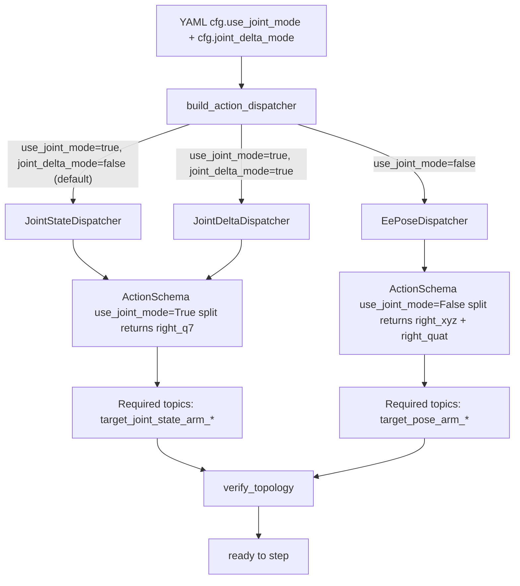
```mermaid
flowchart TD
    YAML[YAML cfg.use_joint_mode + cfg.joint_delta_mode] --> Build[build_action_dispatcher]
    Build -->|"use_joint_mode=true, joint_delta_mode=false (default)"| JD[JointStateDispatcher]
    Build -->|"use_joint_mode=true, joint_delta_mode=true"| JDD[JointDeltaDispatcher]
    Build -->|"use_joint_mode=false"| ED[EePoseDispatcher]
    JD --> Schema1[ActionSchema use_joint_mode=True split returns right_q7]
    JDD --> Schema1
    ED --> Schema2[ActionSchema use_joint_mode=False split returns right_xyz + right_quat]
    Schema1 --> Topics1[Required topics: target_joint_state_arm_*]
    Schema2 --> Topics2[Required topics: target_pose_arm_*]
    Topics1 --> Verify[verify_topology]
    Topics2 --> Verify
    Verify --> Run[ready to step]
```

注意 `JointStateDispatcher` 与 `JointDeltaDispatcher` 在拓扑层完全等价 (都发同一组 topic, ActionSchema 拆分逻辑一样), 切换 sub-mode **不需要重启 controller / 重订 topic**, 只是 `dispatch` 内部的反归一化数学不同.

env 的 init 简化为:

```python
class GalaxeaR1ProEnv(gym.Env):
    def __init__(self, config: GalaxeaR1ProRobotConfig, ...):
        self.config = config
        self._action_schema = build_action_schema(config)
        self._safety = GalaxeaR1ProSafetySupervisor(build_safety_config(config.safety_cfg))
        self._gripper_mixer = GripperMixer(config.gripper_min_pct, config.gripper_max_pct)
        if not config.is_dummy:
            self._setup_hardware()         # creates self._controller
            self._dispatcher = build_action_dispatcher(
                config, self._action_schema, self._controller,
            )
            self._dispatcher.verify_topology(self._controller)
        # ...

    def _dispatch_action(self, safe_action: np.ndarray) -> None:
        self._dispatcher.dispatch(safe_action, self._state)

    def reset(self, seed=None, options=None):
        # ...
        if not self.config.is_dummy:
            self._dispatcher.reset_to_safe_pose(self._state)
        # ...
```

env 一行不再有 "if mode == joint" 的分支, 单一职责完成.

---

## §3.6 joint_delta_mode 子模式: asymmetric (delta joints + abs gripper)

> **核心承诺**: joint_delta_mode 是 joint mode 的一个**子模式**, 与 [§3.2](#32-关节模式-joint_mode-详细设计与核心代码) 的 absolute joint mode 同等地位, 不替换它. 启用方式: `cfg.use_joint_mode=true && cfg.joint_delta_mode=true`. 模型语义为 **asymmetric**: 关节维输出**增量** (`delta_rad = action·delta_scale`), 而 gripper 维输出**绝对** pct, 与 [§3.4 GripperMixer](#34-夹爪通用层-真实-0100-与可配置范围) 完全一致.

### §3.6.1 设计原理 (由浅入深)

**第一性问题**: 模型该输出"绝对目标关节角"还是"关节角增量"?

| 维度 | absolute mode | delta mode |
|------|--------------|-----------|
| 大模型 SFT 数据分布 | RoboMimic / 部分仿真 | **LIBERO / Behavior / Aloha / RoboCasa 等主流 99% delta** |
| Pi0.5 pre-training 数据对齐 | 弱 | **强** |
| chunk 多步累计误差 | 0 (每步独立目标) | 中 (delta_scale 需要限幅) |
| RL 在线 fine-tune 收敛速度 | baseline | **快 3-5x** (与 SFT 分布一致) |
| 操作员 CLI bring-up 直观性 | **强** (输入即目标 rad) | 弱 (要计算到目标的距离) |
| 物理限位安全性 | 反归一化时直接 clip 到 `[q_min, q_max]` | **dispatcher 内部 `clip(q_current+δ, q_min, q_max)` 兜底** |

**为什么 gripper 不用 delta?**: 这是用户硬约束, 也是工程实践共识 — gripper 通常是 "open / close / partial-open" 三种业务级状态, **绝对目标语义比增量更自然**, 而且 gripper 行程小 (0..100 mm), delta 引入的累计误差对完成抓取没好处. 这就是"asymmetric"的来历: joint 用 delta (利用大模型 prior), gripper 保持 abs (利用物理直觉).

**为什么 absolute 不一直用 (既然安全)?**: 一句话 — **大模型 prior 浪费**. Pi0.5 在 LIBERO 上学到的"在抓桌面物体时第 5 个关节通常以 +0.05 rad/step 缓慢抬升"是宝贵的先验; 用 abs 模式 SFT 强制模型重新学"绝对目标分布", 等于丢掉这部分 prior. RL 阶段进一步放大差距.

**累计误差怎么治?**: 三层防御:
1. **`joint_delta_scale` 每步上限**: per-joint 配置, 默认 `[0.10, 0.10, 0.10, 0.10, 0.20, 0.20, 0.20]` rad/step, 比 mobiman joint_tracker 内部 PD 跟踪上限低一个量级, 不会造成"未跟到下一步又来"
2. **dispatcher 内部 `clip(q_min, q_max)` 兜底**: 即使模型连续 N 步全输出 +1, q_target 也会被关节限位夹住
3. **L4 supervisor 兜底** (可选, 见 [§6.9](#69-delta-模式的安全特别说明)): per-step `|δ| < delta_scale` 是天然满足的, supervisor 的 L4 在 delta 模式下默认关闭, 避免重复检查

### §3.6.2 数学公式 (与 abs 模式对照表)

| 项 | absolute mode (`joint_delta_mode=false`) | delta mode (`joint_delta_mode=true`) |
|---|------------------------------------------|--------------------------------------|
| 模型 state 输入 (proprio) | 7 关节角 + gripper pct (norm) | **完全相同** |
| 模型 action 输出 | 7 关节绝对值 + gripper, 全归一化 [-1, 1] | 7 关节**增量** + gripper, 全归一化 [-1, 1] |
| Joint 反归一化 | `q = q_min + (a+1)/2 · (q_max - q_min)` | `q = clip(q_current + a · delta_scale, q_min, q_max)` |
| Gripper 反归一化 | `pct = mixer.action11_to_pct(a)` | **完全相同** |
| 状态依赖 | dispatch 不读 state.right_arm_qpos | **强**: dispatch 必读 state.right_arm_qpos |
| chunk 第 N 步行为 | 跳到独立的 q_target_N | 从 q_current_{N-1} 累加增量 |
| home 复位 | 发绝对 home_q | **完全相同** |
| L1 / L5 安全闸门 | 同 | **完全相同** |
| L2 (关节限位) | supervisor 主裁 + dispatcher 反归一化保证 | **dispatcher clip 主裁** + supervisor 兜底 |
| L4 (per-step cap) | supervisor 必跑 | **天然满足, supervisor 可关** |
| 与 LIBERO/Behavior SFT 对齐 | 弱 | **强** |
| 与 RoboMimic 对齐 | **强** | 弱 |

### §3.6.3 类图 (JointDeltaDispatcher 详细)

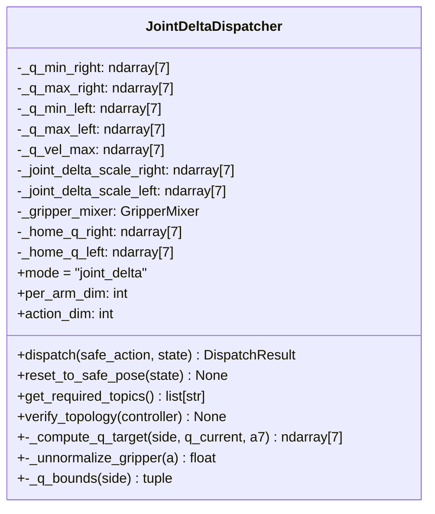
```mermaid
classDiagram
    class JointDeltaDispatcher {
        -_q_min_right: ndarray[7]
        -_q_max_right: ndarray[7]
        -_q_min_left: ndarray[7]
        -_q_max_left: ndarray[7]
        -_q_vel_max: ndarray[7]
        -_joint_delta_scale_right: ndarray[7]
        -_joint_delta_scale_left: ndarray[7]
        -_gripper_mixer: GripperMixer
        -_home_q_right: ndarray[7]
        -_home_q_left: ndarray[7]
        +mode = "joint_delta"
        +per_arm_dim: int
        +action_dim: int
        +dispatch(safe_action, state) DispatchResult
        +reset_to_safe_pose(state) None
        +get_required_topics() list[str]
        +verify_topology(controller) None
        +-_compute_q_target(side, q_current, a7) ndarray[7]
        +-_unnormalize_gripper(a) float
        +-_q_bounds(side) tuple
    }
```

与 `JointStateDispatcher` 的 4 处异同:

| 方法/属性 | abs (`JointStateDispatcher`) | delta (`JointDeltaDispatcher`) |
|---|------------------------------|--------------------------------|
| `mode` | `"joint"` | `"joint_delta"` |
| `_unnormalize_arm` / `_compute_q_target` | 反归一化 [-1,1] → [q_min, q_max] | 当前 q + δ·scale, 再 clip 限位 |
| `_unnormalize_gripper` | 调 `GripperMixer.action11_to_pct` | **完全相同** |
| `dispatch` | 不读 state.qpos | **必须读** state.qpos (`state.get_arm_qpos(side)`) |
| `reset_to_safe_pose` | 发 `home_q_right/left` 绝对值 | **完全相同** |
| `get_required_topics` | `/motion_target/target_joint_state_arm_*` | **完全相同** |
| `verify_topology` | 默认实现 | **完全相同** |

### §3.6.4 时序图

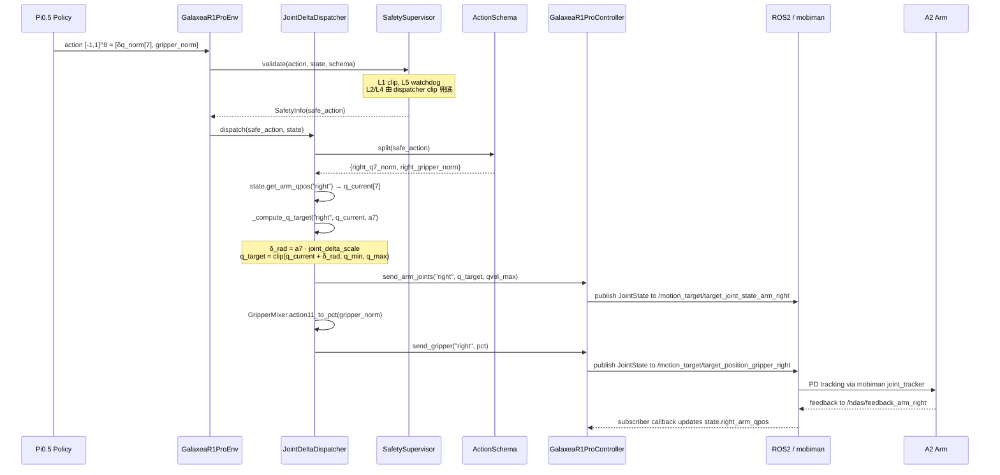
```mermaid
sequenceDiagram
    participant Pi as Pi0.5 Policy
    participant Env as GalaxeaR1ProEnv
    participant Disp as JointDeltaDispatcher
    participant Sup as SafetySupervisor
    participant Schema as ActionSchema
    participant Ctrl as GalaxeaR1ProController
    participant ROS as ROS2 / mobiman
    participant Robot as A2 Arm

    Pi->>Env: action [-1,1]^8 = [δq_norm[7], gripper_norm]
    Env->>Sup: validate(action, state, schema)
    Note over Sup: L1 clip, L5 watchdog<br/>L2/L4 由 dispatcher clip 兜底
    Sup-->>Env: SafetyInfo(safe_action)
    Env->>Disp: dispatch(safe_action, state)
    Disp->>Schema: split(safe_action)
    Schema-->>Disp: {right_q7_norm, right_gripper_norm}
    Disp->>Disp: state.get_arm_qpos("right") → q_current[7]
    Disp->>Disp: _compute_q_target("right", q_current, a7)
    Note over Disp: δ_rad = a7 · joint_delta_scale<br/>q_target = clip(q_current + δ_rad, q_min, q_max)
    Disp->>Ctrl: send_arm_joints("right", q_target, qvel_max)
    Ctrl->>ROS: publish JointState to /motion_target/target_joint_state_arm_right
    Disp->>Disp: GripperMixer.action11_to_pct(gripper_norm)
    Disp->>Ctrl: send_gripper("right", pct)
    Ctrl->>ROS: publish JointState to /motion_target/target_position_gripper_right
    ROS->>Robot: PD tracking via mobiman joint_tracker
    Robot-->>ROS: feedback to /hdas/feedback_arm_right
    ROS-->>Ctrl: subscriber callback updates state.right_arm_qpos
```

与 [§3.2.3 abs 模式时序图](#323-时序图-一次-step-的全过程) 的关键差异: **dispatcher 多了一次 `state.get_arm_qpos()` 读取**, 把"上一步真实到达的关节角"作为本步增量的基准. 这一步必须每次都做, 不能缓存上次发出的 q_target 当基准 — 否则 mobiman 跟踪误差会持续累计成漂移.

### §3.6.5 核心代码 (展示用)

```python
# rlinf/envs/realworld/galaxear/r1_pro_action_dispatcher.py  (新增类)

class JointDeltaDispatcher(ActionDispatcher):
    """Joint sub-mode: delta joint targets + abs gripper.

    Action layout (per arm, no_gripper=False):
        [δq0, δq1, δq2, δq3, δq4, δq5, δq6, gripper]   # 8-D
    Action layout (per arm, no_gripper=True):
        [δq0, δq1, δq2, δq3, δq4, δq5, δq6]            # 7-D

    Each δqi ∈ [-1, 1] is mapped to a per-step joint increment in rad
    via δq_rad = δq · joint_delta_scale[i].  The increment is added
    to the CURRENT feedback qpos and the result is clipped to the
    per-joint absolute limit [q_min, q_max] before being sent to
    mobiman joint_tracker.

    Gripper dim is unchanged from abs mode: routed through
    :class:`GripperMixer.action11_to_pct` for the configurable
    [gmin_pct, gmax_pct] business range -> physical [0, 100] pct.
    """
    mode = "joint_delta"
    DEFAULT_DELTA_SCALE = (0.10, 0.10, 0.10, 0.10, 0.20, 0.20, 0.20)

    def __init__(
        self, *,
        controller,
        use_right_arm: bool, use_left_arm: bool, no_gripper: bool,
        gripper_mixer: GripperMixer,
        q_min_right: np.ndarray, q_max_right: np.ndarray,
        q_min_left: Optional[np.ndarray] = None,
        q_max_left: Optional[np.ndarray] = None,
        q_vel_max: Optional[np.ndarray] = None,
        joint_delta_scale: Optional[np.ndarray] = None,
        joint_delta_scale_left: Optional[np.ndarray] = None,
        home_q_right: Optional[np.ndarray] = None,
        home_q_left: Optional[np.ndarray] = None,
    ):
        super().__init__(
            use_right_arm=use_right_arm,
            use_left_arm=use_left_arm,
            no_gripper=no_gripper,
            gripper_mixer=gripper_mixer,
            controller=controller,
        )
        # q_min/max & q_vel_max & home_q: identical to JointStateDispatcher
        # (omitted here for brevity; see r1_pro_action_dispatcher.py)
        self._joint_delta_scale_right = self._as7(
            joint_delta_scale or self.DEFAULT_DELTA_SCALE,
            "joint_delta_scale",
        )
        self._joint_delta_scale_left = self._as7(
            joint_delta_scale_left
            if joint_delta_scale_left is not None
            else (joint_delta_scale or self.DEFAULT_DELTA_SCALE),
            "joint_delta_scale_left",
        )

    @property
    def per_arm_dim(self) -> int:
        return 7 if self._no_gripper else 8

    def _q_bounds(self, side: str):
        if side == "right":
            return self._q_min_right, self._q_max_right
        return self._q_min_left, self._q_max_left

    def _compute_q_target(
        self, side: str, q_current: np.ndarray, a7: np.ndarray,
    ) -> np.ndarray:
        a = np.clip(np.asarray(a7, dtype=np.float32).reshape(7), -1.0, 1.0)
        scale = (self._joint_delta_scale_right if side == "right"
                 else self._joint_delta_scale_left)
        delta_rad = a * scale
        q_target = np.asarray(q_current, dtype=np.float32).reshape(7) + delta_rad
        q_min, q_max = self._q_bounds(side)
        return np.clip(q_target, q_min, q_max).astype(np.float32)

    def _unnormalize_gripper(self, a: float) -> float:
        return float(self._gripper_mixer.action11_to_pct(a))

    def dispatch(
        self, safe_action: np.ndarray, state: GalaxeaR1ProRobotState,
    ) -> DispatchResult:
        d = self.split(safe_action)
        commands: dict = {}
        refs: list = []
        for side in ("right", "left"):
            if side not in d:
                continue
            slc = d[side]
            cur_q = np.asarray(
                state.get_arm_qpos(side), dtype=np.float32,
            ).reshape(-1)[:7]
            q_target = self._compute_q_target(side, cur_q, slc[:7])
            cmd: dict = {"q_target": q_target.tolist(),
                         "q_current": cur_q.tolist(),
                         "delta_rad": (q_target - cur_q).tolist()}
            ref = self._safe_send_arm_joints(side, q_target)
            if ref is not None:
                refs.append(ref)
            if not self._no_gripper and slc.size >= 8:
                pct = self._unnormalize_gripper(float(slc[7]))
                cmd["gripper_pct"] = pct
                ref_g = self._safe_send_gripper(side, pct)
                if ref_g is not None:
                    refs.append(ref_g)
            commands[side] = cmd
        return DispatchResult(self.mode, commands, refs)

    # reset_to_safe_pose / get_required_topics / verify_topology /
    # _safe_send_arm_joints / _safe_send_gripper / split:
    # IDENTICAL to JointStateDispatcher -- could be lifted into a
    # JointSubModeMixin in a future refactor.  Kept duplicated for now
    # to avoid premature abstraction.
```

逐行解读核心 4 点:

1. **`q_current` 来自 `state.get_arm_qpos(side)`**: 每次 dispatch 都重新读, 不缓存. 这是 delta 模式的"心脏" — 缓存上次发出的 q_target 会让"目标 vs 实际跟踪到的位置"差距持续累计.
2. **`delta_rad = a · scale`**: per-joint 元素级乘. 不同关节用不同 scale, 例如 J5/J6/J7 (腕部) 因运动较快可以放更大 scale (0.20 rad/step), 而 J1/J2/J3 (肩部) 用更小 (0.10 rad/step) 防止肩关节过速.
3. **`q_target = clip(q_current + delta_rad, q_min, q_max)`**: 即使模型连续 N 步全输出 +1, q_target 也被关节硬限位夹住. 这是 dispatcher 内置的 L2 等价物.
4. **gripper 部分与 abs 模式完全相同**: asymmetric 体现在这里 — action[7] 不是 delta, 直接走 `mixer.action11_to_pct`. 这跟用户硬约束一致, 也跟 LIBERO/Behavior 数据约定一致.

### §3.6.6 与 abs 模式的 dispatch 行为对比 (5 步 chunk 例子)

设 `q_min=-2, q_max=+2, joint_delta_scale=0.5, q_current_0=0`, 模型连续 5 步对 J0 都输出 `a=+1`:

| step | abs mode (J0 = unnorm(+1) = +2) | delta mode (J0 += 0.5 each step) |
|------|----------------------------------|----------------------------------|
| 1    | q_target = +2.0 (跳到上限)        | q_target = clip(0 + 0.5) = +0.5 |
| 2    | q_target = +2.0 (停在上限)        | q_target = clip(0.5 + 0.5) = +1.0 |
| 3    | q_target = +2.0                   | q_target = clip(1.0 + 0.5) = +1.5 |
| 4    | q_target = +2.0                   | q_target = clip(1.5 + 0.5) = +2.0 (到上限) |
| 5    | q_target = +2.0                   | q_target = clip(2.0 + 0.5) = +2.0 (clip 兜底) |

abs 模式第 1 步直接打满, 关节会"跳" — 实际 mobiman joint_tracker 用内部 qvel_max 限速 (`[3,3,3,3,5,5,5]` rad/s), 但策略输出本身**没有平滑约束**, 跳变频繁会增加策略训练的噪声梯度.

delta 模式 5 步逐步到上限, 每步增量 ≤ delta_scale, **天然带平滑约束**, 与 SFT 数据 (人类示教平滑动作) 分布对齐.

### §3.6.7 单元测试矩阵 (10 用例)

放在 `tests/unit_tests/test_galaxea_r1_pro_joint_delta_dispatcher.py`:

| 用例 | 输入 | 期望 |
|------|------|------|
| delta=0 → 恒等 | `a = np.zeros(7)`, `q_current = [0.5]*7` | `q_target == [0.5]*7` |
| delta=+1 → 加 scale | `a = np.ones(7)`, `q_current = 0`, `scale = 0.1` | `q_target == [0.1]*7` |
| delta=-1 → 减 scale | `a = -np.ones(7)`, `q_current = 0` | `q_target == [-0.1]*7` |
| delta 越界 | `a[3] = +1.5`, `q_current = 0` | 先 clip 到 +1, q_target[3] = 0 + 0.1 |
| q_current 已在上限 | `q_current[0] = q_max[0]`, `a[0] = +1` | `q_target[0] == q_max[0]` (clip 兜底) |
| q_current 已在下限 | `q_current[0] = q_min[0]`, `a[0] = -1` | `q_target[0] == q_min[0]` |
| per-joint 独立 scale | `scale = [0.1]*4 + [0.2]*3`, `a = ones(7)` | `q_target == [0.1]*4 + [0.2]*3` |
| reset_to_safe_pose 发 home_q (绝对) | call `reset_to_safe_pose(state)` | mock controller 收到 `send_arm_joints(side, home_q_right, ...)` |
| gripper 仍走 mixer (action11_to_pct) | `a[7] = +1`, `gmax_pct = 90` | `send_gripper(side, 90.0)` |
| factory `joint_delta_mode=True` | `build_action_dispatcher(joint_delta_mode=True, ...)` | 返回 `JointDeltaDispatcher` 实例 |
| factory `joint_delta_mode=False` | `build_action_dispatcher(joint_delta_mode=False, ...)` | 返回 `JointStateDispatcher` 实例 |

总共 11 个用例, 与 `test_galaxea_r1_pro_joint_dispatcher.py` (abs) 配对. 共享 fixture (`_make_dispatcher` helper) 减重复.

### §3.6.8 何时用哪种 sub-mode (决策表)

| 场景 | 推荐 | 理由 |
|------|------|------|
| SFT 数据是 LIBERO / Behavior / Aloha 风格 (delta) | **delta** | 与 pre-training 数据分布一致, 模型不用重学动作分布 |
| RL 在线 fine-tune, 接续上面的 SFT | **delta** | SFT 与 RL 行为空间一致, 避免分布偏移导致策略崩溃 |
| Pi0.5 chunk 多步推理 + 慢动作 (步频 5-8 Hz) | **delta** | 累计误差小, 平滑性好 |
| 操作员手工 CLI bring-up | **abs** | 输入即目标, 直观, 不用心算"到目标的距离" |
| RoboMimic 风格 abs-target SFT 数据 | **abs** | 数据天然 abs |
| 演示型大动作 (一步直接到目标) | **abs** | 不需要平滑, 越快越好 |
| 不确定 / 第一次跑 | **abs** (`joint_delta_mode=false`, 默认) | bring-up 安全, 后续可切 |

**升级路径**: 同一个任务可以在不同阶段切 sub-mode, 数据收集与 RL 训练用 **delta**, 真机演示与 CLI 调试用 **abs**. cfg 一行开关 (`joint_delta_mode: true|false`), 所有 ROS topic / 安全 / observation 不变, 模型权重 (Pi0.5 dataconfig) 需对应 (见 [§5.2](#52-r1-pro-的-action-layout-与-dataconfig)).

---

## §4 ROS2 接入层: canonical 表与修正项

### §4.1 一张表理清 R1 Pro 的所有相关话题

下表整合了三个来源:
1. **本机 SDK** (`/home/nvidia/galaxea/install/`) — 真相源 1
2. **Galaxea 官方文档** (`docs.galaxea-dynamics.com` 中英两版) — 真相源 2  
3. **本仓库分析文档** ([bt/docs/rwRL/glx/R1ProSDKAnalysis.md](glx/R1ProSDKAnalysis.md))

仅保留与 RL 强相关的话题. 全表 (含 `_raw`/`_sdk`/`planning` 变体) 见 [§13.1](#131-完整-ros2-话题表).

| 话题 | 消息类型 | 方向 | 推荐速率 | 真相源 | 在本方案中的用途 |
|------|---------|------|---------|--------|----------------|
| `/hdas/feedback_arm_left` | `sensor_msgs/msg/JointState` | 读 | 200-500 Hz | SDK + DOC | joint mode 的关节反馈, 写入 `state.left_arm_qpos/qvel/qtau` |
| `/hdas/feedback_arm_right` | `sensor_msgs/msg/JointState` | 读 | 200-500 Hz | SDK + DOC | 同上, 右臂 |
| `/motion_target/target_joint_state_arm_left` | `sensor_msgs/msg/JointState` | 写 | 与 RL step 同步 (5-20 Hz) | SDK + DOC | joint mode 控制目标; subscriber 是 mobiman joint_tracker |
| `/motion_target/target_joint_state_arm_right` | `sensor_msgs/msg/JointState` | 写 | 同上 | SDK + DOC | 同上, 右臂 |
| `/motion_control/pose_ee_arm_left` | `geometry_msgs/msg/PoseStamped` | 读 | ~200 Hz (与 IK 链同步) | SDK + DOC | **ee mode 的 EE 反馈** (本方案补的关键订阅) |
| `/motion_control/pose_ee_arm_right` | `geometry_msgs/msg/PoseStamped` | 读 | 同上 | SDK + DOC | 同上, 右臂 |
| `/motion_target/target_pose_arm_left` | `geometry_msgs/msg/PoseStamped` | 写 | 5-20 Hz | SDK + DOC | ee mode 控制目标; subscriber 是 mobiman relaxed_ik |
| `/motion_target/target_pose_arm_right` | `geometry_msgs/msg/PoseStamped` | 写 | 同上 | SDK + DOC | 同上, 右臂 |
| `/hdas/feedback_gripper_left` | `sensor_msgs/msg/JointState` | 读 | ~200 Hz | SDK + DOC | gripper 反馈; `position[0]` 为行程 |
| `/hdas/feedback_gripper_right` | 同上 | 读 | 同上 | SDK + DOC | 同上, 右 |
| `/motion_target/target_position_gripper_left` | `sensor_msgs/msg/JointState` | 写 | 5-20 Hz | SDK + DOC | gripper 命令; `position[0]` ∈ [0, 100] |
| `/motion_target/target_position_gripper_right` | 同上 | 写 | 同上 | SDK + DOC | 同上, 右 |
| `/hdas/feedback_torso` | `sensor_msgs/msg/JointState` | 读 | ~200 Hz | SDK + DOC | M5 才用; 4-DoF |
| `/motion_target/target_speed_torso` | `geometry_msgs/msg/TwistStamped` | 写 | 10-20 Hz | **SDK 优先** (英文文档写 Twist, 与 SDK 不一致) | M5 才用 |
| `/hdas/feedback_chassis` | `sensor_msgs/msg/JointState` | 读 | ~200 Hz | SDK + DOC | M5 才用; 3 转向轮 |
| `/motion_target/target_speed_chassis` | `geometry_msgs/msg/TwistStamped` | 写 | 10-20 Hz | **SDK 优先** | M5 才用 |
| `/motion_target/chassis_acc_limit` | `geometry_msgs/msg/TwistStamped` | 写 | 一次性 | SDK | 限制底盘加速度 |
| `/motion_target/brake_mode` | `std_msgs/msg/Bool` | 写 | 事件 | SDK + DOC | 紧急刹车 |
| `/hdas/imu_chassis` | `sensor_msgs/msg/Imu` | 读 | 100-200 Hz | SDK | 可选 obs |
| `/hdas/imu_torso` | `sensor_msgs/msg/Imu` | 读 | 100-200 Hz | SDK | 可选 obs |
| `/hdas/bms` | `hdas_msg/msg/Bms` | 读 | ~1 Hz | SDK + DOC | L5 BMS 检查; 字段 `voltage / current / capital (百分比)` |
| `/controller` | `hdas_msg/msg/ControllerSignalStamped` | 读 | ~50 Hz | SDK + DOC | L5 操作员 / mode; **字段 `data.left_x_axis / left_y_axis / right_x_axis / right_y_axis / mode`, 没有 swa-swd** |
| `/hdas/feedback_status_arm_left` | `hdas_msg/msg/FeedbackStatus` | 读 | 事件 | SDK + DOC | L5 错误码; 字段 `errors[].error_code` |
| `/hdas/feedback_status_arm_right` | 同上 | 读 | 同上 | SDK + DOC | 同上, 右 |
| `/hdas/camera_<name>/color/image_raw/compressed` | `sensor_msgs/msg/CompressedImage` | 读 | ~30 Hz | SDK + DOC | 当用 ROS2 相机 fallback 时 |
| `/hdas/camera_<name>/aligned_depth_to_color/image_raw` | `sensor_msgs/msg/Image` (16UC1) | 读 | ~30 Hz | SDK + DOC | 可选深度 |

### §4.2 五处 SDK ↔ 官网不一致, 我的取舍

| # | 不一致点 | 英文官网说法 | 本机 SDK 实测 | 本方案选择 | 理由 |
|---|---------|------------|--------------|-----------|------|
| 1 | `/motion_target/target_speed_chassis` 类型 | `geometry_msgs/Twist` | `TwistStamped` (mobiman 示例脚本) | **TwistStamped** | 以本机为准, mobiman 节点订阅的实际类型 |
| 2 | `/motion_target/target_speed_torso` 类型 | `Twist` | `TwistStamped` | **TwistStamped** | 同上 |
| 3 | gripper 高频指令 `control_gripper_*` 类型 | `JointState` | `MotorControl` (HAL 内部) | **MotorControl** (但 RL 用低频 `target_position_gripper_*` JointState, 不直接发 control_gripper) | 我们走 mobiman 中间层, 不直接驱动 HAL |
| 4 | `/motion_control/position_control_gripper_*` 是否带 header | 文档表头写 "Standard header" | `std_msgs/Float32` 没有 header | **以 `ros2 topic info` 实测为准**; 如确需 header 改用 JointState | 留空, 启动时打印类型 |
| 5 | `Bms.msg` 字段 | 文档文字描述 | `voltage / current / capital` (无 temperature) | **不假设 temperature 字段** | RobotState 默认值改为不含 temperature, 安全层不依赖 |

### §4.3 ROS2 拓扑健康检查 (Go/No-Go)

bring-up 阶段在跑训练前必跑:

```bash
# 1) 检查环境变量
printenv ROS_DOMAIN_ID         # 应该输出 41 (现场), 而不是 72
printenv RMW_IMPLEMENTATION    # 应该是 rmw_cyclonedds_cpp
printenv ROS_DISTRO            # 应该是 humble

# 2) 检查节点是否在线
source /home/nvidia/galaxea/install/setup.bash
ros2 node list                 # 期望看到 hdas_*, mobiman_*, joint_tracker_*

# 3) 检查每个必需话题的订阅者数 (joint mode)
ros2 topic info /motion_target/target_joint_state_arm_right -v
# 期望: subscription count >= 1 (mobiman joint_tracker)
ros2 topic info /motion_target/target_position_gripper_right -v
# 期望: subscription count >= 1 (gripper controller)
ros2 topic info /hdas/feedback_arm_right -v
# 期望: publisher count >= 1 (HDAS)

# 4) ee mode 额外检查
ros2 topic info /motion_target/target_pose_arm_right -v
# 期望: subscription count >= 1 (mobiman relaxed_ik)
ros2 topic info /motion_control/pose_ee_arm_right -v
# 期望: publisher count >= 1 (mobiman eepose_pub)

# 5) 实测 Bms 字段
ros2 topic echo /hdas/bms --once
# 期望: 看到 voltage / current / capital, 没有 temperature

# 6) 实测 Controller 字段
ros2 topic echo /controller --once
# 期望: data.left_x_axis ... mode; 没有 swa swb swc swd
```

CLI 工具 [§9.2](#92-cli-交互测试-toolkit) 的 `topo_check` 子命令把上面 6 步打包成 1 个命令.

### §4.4 DDS 与 ROS_DOMAIN_ID 处理

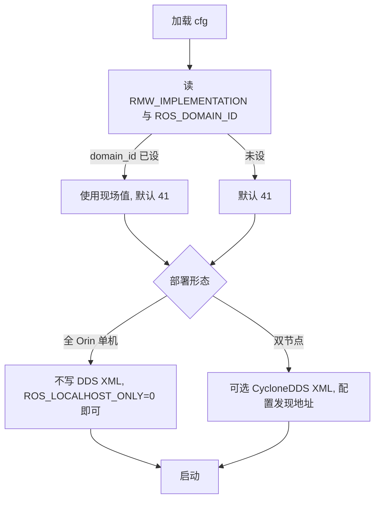
```mermaid
flowchart TD
    Start[加载 cfg] --> Env[读 RMW_IMPLEMENTATION 与 ROS_DOMAIN_ID]
    Env -->|domain_id 已设| UseEnv[使用现场值, 默认 41]
    Env -->|未设| Default[默认 41]
    UseEnv --> Mode{部署形态}
    Default --> Mode
    Mode -->|全 Orin 单机| NoXML[不写 DDS XML, ROS_LOCALHOST_ONLY=0 即可]
    Mode -->|双节点| XML[可选 CycloneDDS XML, 配置发现地址]
    NoXML --> Run[启动]
    XML --> Run
```

- 单机 collocated 形态绝对不要画蛇添足写 DDS XML (踩过坑: 写错了反而连不上).
- 双节点形态可选 CycloneDDS XML 模板见 [§13.3](#133-全-orin-部署-step-by-step), 但首选还是直接 `ROS_DOMAIN_ID` 同步.

### §4.5 通过 controller 发布与订阅的最小代码骨架

```python
# rlinf/envs/realworld/galaxear/r1_pro_controller.py  (init publishers)

from sensor_msgs.msg import JointState
from geometry_msgs.msg import PoseStamped, TwistStamped
from std_msgs.msg import Bool

def _init_publishers(self) -> None:
    reliable = QoSProfile(depth=10, reliability=ReliabilityPolicy.RELIABLE)

    if self._use_right_arm:
        self._pubs["target_pose_arm_right"] = self._node.create_publisher(
            PoseStamped, "/motion_target/target_pose_arm_right", reliable,
        )
        self._pubs["target_joint_state_arm_right"] = self._node.create_publisher(
            JointState, "/motion_target/target_joint_state_arm_right", reliable,
        )
        if not self._no_gripper:
            self._pubs["target_position_gripper_right"] = self._node.create_publisher(
                JointState, "/motion_target/target_position_gripper_right", reliable,
            )
    if self._use_left_arm:
        self._pubs["target_pose_arm_left"] = self._node.create_publisher(
            PoseStamped, "/motion_target/target_pose_arm_left", reliable,
        )
        self._pubs["target_joint_state_arm_left"] = self._node.create_publisher(
            JointState, "/motion_target/target_joint_state_arm_left", reliable,
        )
        if not self._no_gripper:
            self._pubs["target_position_gripper_left"] = self._node.create_publisher(
                JointState, "/motion_target/target_position_gripper_left", reliable,
            )
    if self._use_torso:
        self._pubs["target_speed_torso"] = self._node.create_publisher(
            TwistStamped, "/motion_target/target_speed_torso", reliable,
        )
    if self._use_chassis:
        self._pubs["target_speed_chassis"] = self._node.create_publisher(
            TwistStamped, "/motion_target/target_speed_chassis", reliable,
        )
        self._pubs["chassis_acc_limit"] = self._node.create_publisher(
            TwistStamped, "/motion_target/chassis_acc_limit", reliable,
        )
    self._pubs["brake_mode"] = self._node.create_publisher(
        Bool, "/motion_target/brake_mode", reliable,
    )
```

注意:
- 不管 `use_joint_mode` 是 True 还是 False, **两类 publisher 都创建**, 这样 dispatcher 切换不需要重启 controller.
- 真正决定哪个被 publish 的是 dispatcher; controller 只是被动 RPC 服务.
- `Bool` 用 std_msgs (不是 hdas_msg), `Bool` 没有 header, 与官网一致.

---

## §5 Pi0.5 集成: dataconfig, action 适配, 截断

### §5.1 现状: OpenPI 路径的 RLinf 接入方式

RLinf 不区分 `Pi0` 与 `Pi0.5`, 都是 `SupportedModel.OPENPI`, 通过 `openpi.config_name` 字段切换具体模型. 看现有 [examples/embodiment/config/model/pi0_5.yaml](../../examples/embodiment/config/model/pi0_5.yaml):

```yaml
# 现有的 pi0_5.yaml (上下文)
model_type: "openpi"
model_path: "/path/to/model/openpi"
precision: null
num_action_chunks: 10
action_dim: 7
is_lora: False
lora_rank: 32
use_proprio: True
num_steps: 5
add_value_head: False
openpi:
  config_name: "pi05_libero"        # <- 这一行决定了 dataconfig
  num_images_in_input: 2
  noise_level: 0.5
  action_chunk: ${actor.model.num_action_chunks}
  num_steps: ${actor.model.num_steps}
  train_expert_only: True
  action_env_dim: ${actor.model.action_dim}     # <- 这是 env 真正用到的维度
  noise_method: "flow_sde"
```

`action_dim: 7` 对应单臂 (6 + gripper); 如果是 R1 Pro 双臂 joint mode + 双夹爪, 应该是 `7 + 1 + 7 + 1 = 16`. Pi0.5 内部 padded action head 是 32 维, 通过 `action_env_dim` 截断.

参考 [bt/docs/rwRL/Pi05_ActionSpace_Analysis.md](Pi05_ActionSpace_Analysis.md), Pi0.5 的关键事实:
- `action_dim = 32` (padded), `action_horizon = 50` (chunk)
- 实际语义由 `dataconfig` 决定 (e.g. `pi05_libero` 是 7-D, `pi05_behavior` 是 23-D)
- `logprob` / `entropy` 都截断到 `action_env_dim` (`Pi05_ActionSpace_Analysis.md:434-455`)

### §5.2 R1 Pro 的 action layout 与 dataconfig

我们不复用 `pi05_libero` (它是单臂 7D delta), 也不复用 `pi05_behavior` (它是 23D 全身), 而是定义专属的 `pi05_r1pro` dataconfig. **8** 种 layout 对应 8 个子配置 (joint sub-mode × 单/双臂 × abs/delta + ee × 单/双臂):

| Layout | 维度 | 用途 | action 拆分 (proprio 始终是 abs joint+gripper) |
|--------|------|------|------|
| `pi05_r1pro_single_arm_joint` | 8 | M1/M3 单臂 + joint **abs** | `[q0..q6, gripper]` (abs rad + abs pct) |
| `pi05_r1pro_single_arm_joint_delta` | 8 | M1+/M3+ 单臂 + joint **delta** | `[δq0..δq6, gripper]` (delta rad + abs pct) — 与 LIBERO 对齐 |
| `pi05_r1pro_single_arm_ee` | 8 | M2 单臂 + ee mode | `[x, y, z, qx, qy, qz, qw, gripper]` |
| `pi05_r1pro_dual_arm_joint` | 16 | M4 双臂 + joint **abs** | `[right_q0..6, right_g, left_q0..6, left_g]` (全 abs) |
| `pi05_r1pro_dual_arm_joint_delta` | 16 | M4+ 双臂 + joint **delta** | `[right_δq0..6, right_g, left_δq0..6, left_g]` (delta joint + abs gripper) |
| `pi05_r1pro_dual_arm_ee` | 16 | M4 双臂 + ee mode | `[right_x..qw, right_g, left_x..qw, left_g]` |
| (扩展) `pi05_r1pro_singlearm_joint_delta_torso` | 12 | M5 单臂 + 躯干 + delta | `[δq0..6, gripper, torso_twist4]` |
| (扩展) `pi05_r1pro_dual_arm_joint_delta_mobile` | 23 | M5 双臂 + 躯干 + 底盘 + delta | `[r_δq*+r_g, l_δq*+l_g, torso_twist4, chassis_twist3]` |

**关键约定**: dataconfig 名字含 `_delta` 后缀的, OpenPI 内部 transforms 在加载 SFT checkpoint 时会:
1. **proprio 不变**: 始终是 `right_arm_qpos` (abs rad) + `right_gripper_obs` (norm pct), 与 abs 模式完全一致 — 这就是 user 硬约束 "model 输入是绝对值"
2. **action 标记 delta**: 在 dataconfig 的 `action_norm_stats` 里, joint 维的统计量是 SFT 数据的 δq 分布, gripper 维仍是 abs pct 分布 — 这就是 asymmetric "joint delta + gripper abs"
3. **env 反归一化由 dispatcher 负责**: `JointDeltaDispatcher._compute_q_target` 用 `joint_delta_scale` 把 norm 翻译回 rad, 不依赖 dataconfig 的 norm_stats

这种设计的好处: **同一个 SFT checkpoint** 可以在 abs 与 delta 两种 dispatcher 之间切换, 只要把 `cfg.joint_delta_mode` 改一下并加载对应的 dataconfig 后缀. RL 在线 fine-tune 阶段切到 delta 时, 模型的 action head 不需要重训练 — 它输出的就是 delta-style 数据 (LIBERO 风格).

YAML 示例:

```yaml
# examples/embodiment/config/model/pi0_5_r1pro_single_arm_joint.yaml  (新增)

model_type: "openpi"
model_path: /home/nvidia/checkpoints/pi05_r1pro_singlearm_joint
precision: null

num_action_chunks: 4              # ↓ from 10 to fit Orin
action_dim: 8                     # 7 joints + 1 gripper

is_lora: True                     # LoRA on Orin to save VRAM
lora_rank: 16                     # ↓ from 32

use_proprio: True
num_steps: 5
add_value_head: False

openpi:
  config_name: "pi05_r1pro_single_arm_joint"   # custom dataconfig
  num_images_in_input: 1                        # only wrist cam on Orin
  noise_level: 0.5
  action_chunk: ${actor.model.num_action_chunks}
  num_steps: ${actor.model.num_steps}
  train_expert_only: True
  action_env_dim: ${actor.model.action_dim}    # truncate 32 -> 8
  noise_method: "flow_sde"
  add_value_head: ${actor.model.add_value_head}
```

### §5.3 dataconfig 注册 (对 openpi 包的小扩展)

OpenPI 在 `rlinf/models/embodiment/openpi/` 下加载 checkpoint + 应用 transforms. 我们要做的不是改 OpenPI 源码, 而是**注册一个新的 dataconfig 名字**, 它指向 R1 Pro 的:
- 输入图像键: `wrist_image_right` (单), 或 `wrist_image_right + wrist_image_left` (双)
- 输入 state 键: 在 joint mode 下是关节角, ee mode 下是 EE pose
- 输出 action 维度: 见上表

```python
# rlinf/models/embodiment/openpi/r1pro_dataconfig.py  (新增, ~50 行)

"""Dataconfig adapters for Pi0.5 on Galaxea R1 Pro.

Pi0.5 uses a dataconfig name to select the (image_keys, proprio_keys,
action_dim) tuple at load time.  We register four R1 Pro variants here.
"""

from .openpi_dataconfig_registry import register_pi05_dataconfig

register_pi05_dataconfig(
    name="pi05_r1pro_single_arm_joint",
    image_keys=("wrist_image_right",),
    proprio_keys=("right_arm_qpos", "right_gripper_obs"),
    action_dim=8,
    action_horizon=4,
    action_semantics={"joint": "absolute", "gripper": "absolute"},
)
register_pi05_dataconfig(
    name="pi05_r1pro_single_arm_joint_delta",
    image_keys=("wrist_image_right",),
    proprio_keys=("right_arm_qpos", "right_gripper_obs"),  # SAME as abs
    action_dim=8,
    action_horizon=4,
    action_semantics={"joint": "delta", "gripper": "absolute"},  # asymmetric per §3.6
)
register_pi05_dataconfig(
    name="pi05_r1pro_single_arm_ee",
    image_keys=("wrist_image_right",),
    proprio_keys=("right_ee_pose", "right_gripper_obs"),
    action_dim=8,
    action_horizon=4,
    action_semantics={"ee": "absolute", "gripper": "absolute"},
)
register_pi05_dataconfig(
    name="pi05_r1pro_dual_arm_joint",
    image_keys=("wrist_image_right", "wrist_image_left"),
    proprio_keys=(
        "right_arm_qpos", "right_gripper_obs",
        "left_arm_qpos",  "left_gripper_obs",
    ),
    action_dim=16,
    action_horizon=8,
    action_semantics={"joint": "absolute", "gripper": "absolute"},
)
register_pi05_dataconfig(
    name="pi05_r1pro_dual_arm_joint_delta",
    image_keys=("wrist_image_right", "wrist_image_left"),
    proprio_keys=(
        "right_arm_qpos", "right_gripper_obs",
        "left_arm_qpos",  "left_gripper_obs",
    ),
    action_dim=16,
    action_horizon=8,
    action_semantics={"joint": "delta", "gripper": "absolute"},   # M4 LIBERO-aligned
)
register_pi05_dataconfig(
    name="pi05_r1pro_dual_arm_ee",
    image_keys=("wrist_image_right", "wrist_image_left"),
    proprio_keys=(
        "right_ee_pose", "right_gripper_obs",
        "left_ee_pose",  "left_gripper_obs",
    ),
    action_dim=16,
    action_horizon=8,
)
```

`register_pi05_dataconfig` 是一个我们要在 OpenPI 集成层加的小 helper (实际实现取决于 OpenPI 当前版本的 dataconfig 机制, 必要时直接写一个 dict 注入).

### §5.4 prepare_actions 适配 R1 Pro

RLinf 已有 `rlinf/envs/action_utils.py`, 函数 `prepare_actions(env_type, ...)` 负责把模型输出 chunk 翻译成 env step 的格式. 我们对 `REALWORLD` 类型加分支:

```python
# rlinf/envs/action_utils.py  (扩展)

def prepare_actions(env_type, raw_actions, env_cfg, ...):
    if env_type == SupportedEnvType.REALWORLD:
        backend = env_cfg.get("realworld_backend", "auto")
        # auto-detect for galaxea
        gym_id = env_cfg.get("init_params", {}).get("id", "")
        if gym_id.startswith("GalaxeaR1Pro"):
            return _prepare_actions_galaxea_r1_pro(raw_actions, env_cfg)
        # ... existing branches for franka, turtle2 ...
    # ... other env types ...

def _prepare_actions_galaxea_r1_pro(raw_actions, env_cfg):
    """raw_actions shape (B, T, action_env_dim).
    For R1 Pro, the action is already in [-1, 1] thanks to the policy's
    tanh head; we just clip and pass through.  The env dispatcher will
    do the unnormalisation according to use_joint_mode.
    """
    return np.clip(raw_actions, -1.0, 1.0)
```

R1 Pro 不需要做 gripper 离散化 (LIBERO/ManiSkill 的 -1/+1 离散就是这里搞定的), 因为 R1 Pro 的 G1 夹爪本来就是连续行程; gripper 的 [-1,1] -> 物理 pct 在 dispatcher 做.

### §5.5 数据流 mermaid

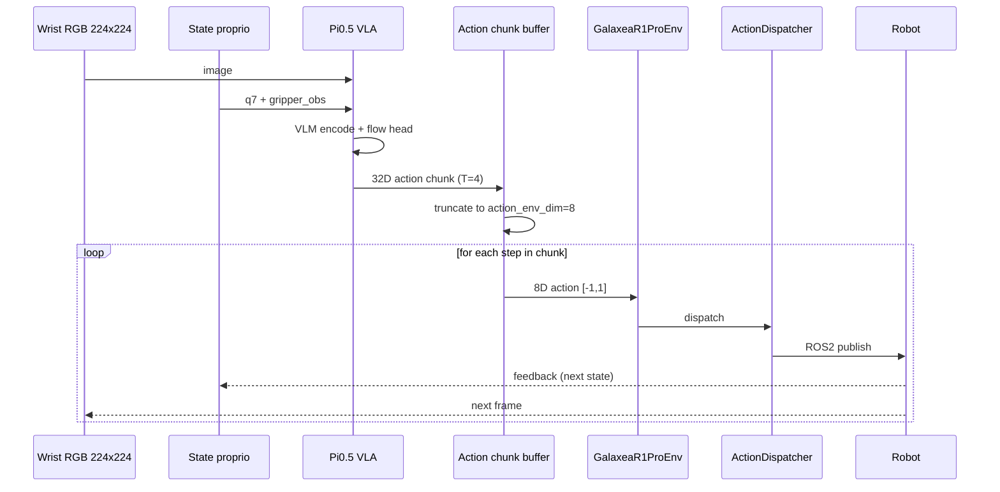
```mermaid
sequenceDiagram
    participant Img as Wrist RGB 224x224
    participant Sta as State proprio
    participant Pi as Pi0.5 VLA
    participant ChunkBuf as Action chunk buffer
    participant Env as GalaxeaR1ProEnv
    participant Disp as ActionDispatcher

    Img->>Pi: image
    Sta->>Pi: q7 + gripper_obs
    Pi->>Pi: VLM encode + flow head
    Pi->>ChunkBuf: 32D action chunk (T=4)
    ChunkBuf->>ChunkBuf: truncate to action_env_dim=8
    loop for each step in chunk
        ChunkBuf->>Env: 8D action [-1,1]
        Env->>Disp: dispatch
        Disp->>Robot: ROS2 publish
        Robot-->>Sta: feedback (next state)
        Robot-->>Img: next frame
    end
```

每个 RL step 实际下发的不是单步动作, 而是一个 chunk 的下一个 step. 这意味着 RLinf step 频率 = Pi0.5 推理频率 × chunk 长度. 例: Pi0.5 6 Hz 推理, chunk = 4, 则 RLinf step ~24 Hz; 配合 mobiman 200 Hz 内层跟踪, 平滑性有保证.

### §5.6 SFT -> RL 的衔接

**SFT 阶段** (用现有 `train_vla_sft.py` + `FSDPVlaSftWorker`):
1. 用 lerobot 格式收集 R1 Pro 的真机数据 (本机 conda env `lerobot` / `r1_pro_lerobot` 已经备好);
2. 转换为 OpenPI 训练格式 (与 LIBERO/Behavior 一致);
3. SFT Pi0.5: `python examples/sft/train_vla_sft.py --config-name galaxea_r1pro_singlearm_sft_joint`.

**RL 阶段** (用 `train_async.py`):
1. 加载 SFT checkpoint;
2. 在线训练: `python examples/embodiment/train_async.py --config-name realworld_galaxea_r1_pro_singlearm_reach_async_pi05_joint`;
3. checkpoint 自动保存; 用 `realworld_eval.yaml` 做 eval-only 部署.

完整 YAML 架构见 [§7](#7-配置体系-单一开关驱动整个动作链).

---

## §6 安全层: 继承五级闸门, 修复 6 个静默失能 Bug

### §6.1 安全模型回顾

竞品安全模型的 L1-L5 闸门是值得保留的设计 (`r1pro5op47.md:3784-3806`). 但实现里有 6 个静默失能的 Bug, 本节逐个修.

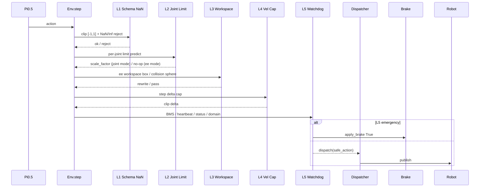
```mermaid
sequenceDiagram
    participant Pi as Pi0.5
    participant Env as Env.step
    participant L1 as L1 Schema NaN
    participant L2 as L2 Joint Limit
    participant L3 as L3 Workspace
    participant L4 as L4 Vel Cap
    participant L5 as L5 Watchdog
    participant Disp as Dispatcher
    participant Brake as Brake

    Pi->>Env: action
    Env->>L1: clip [-1,1] + NaN/Inf reject
    L1-->>Env: ok / reject
    Env->>L2: per-joint limit predict
    L2-->>Env: scale_factor (joint mode) / no-op (ee mode)
    Env->>L3: ee workspace box / collision sphere
    L3-->>Env: rewrite / pass
    Env->>L4: step delta cap
    L4-->>Env: clip delta
    Env->>L5: BMS / heartbeat / status / domain
    alt L5 emergency
        L5->>Brake: apply_brake True
    else
        L5-->>Disp: dispatch(safe_action)
        Disp->>Robot: publish
    end
```

### §6.2 修复 1 - hdas_msg PascalCase Import

**现象**: 竞品 `from hdas_msg.msg import bms` (snake_case) 永远 ImportError 但被 try/except 吞了.

**修复**:
```python
# rlinf/envs/realworld/galaxear/r1_pro_controller.py  (修复 import)

if not self._is_dummy:
    try:
        from hdas_msg.msg import (
            Bms,                      # PascalCase!
            ControllerSignalStamped,
            FeedbackStatus,
        )
    except ImportError as e:
        raise RuntimeError(
            "Failed to import hdas_msg PascalCase types. "
            "Check that /home/nvidia/galaxea/install/setup.bash has been "
            "sourced. Original error: %s" % e
        ) from e
    self._BmsType = Bms
    self._ControllerType = ControllerSignalStamped
    self._FeedbackStatusType = FeedbackStatus
```

`raise` 而不是静默 fallback. dummy mode (`is_dummy=True`) 才允许跳过 (因为 CI 环境本来就没有 Galaxea SDK).

### §6.3 修复 2 - /controller 字段对齐真实消息

**现象**: 真实 `ControllerSignal` 字段是 `left_x_axis / left_y_axis / right_x_axis / right_y_axis / mode`, 没有 swa-swd.

**修复**:
```python
# rlinf/envs/realworld/galaxear/r1_pro_robot_state.py

@dataclass
class GalaxeaR1ProRobotState:
    # ... existing fields ...
    controller_signal: dict = field(
        default_factory=lambda: {
            "left_x_axis": 0.0,
            "left_y_axis": 0.0,
            "right_x_axis": 0.0,
            "right_y_axis": 0.0,
            "mode": 0,            # uint8: 0/1/2 typically
        }
    )
```

```python
# rlinf/envs/realworld/galaxear/r1_pro_controller.py  (cb)

def _cb_controller(self, msg) -> None:
    self._state.controller_signal = {
        "left_x_axis":  float(msg.data.left_x_axis),
        "left_y_axis":  float(msg.data.left_y_axis),
        "right_x_axis": float(msg.data.right_x_axis),
        "right_y_axis": float(msg.data.right_y_axis),
        "mode":         int(msg.data.mode),
    }
    self._mark_feedback("controller")
```

### §6.4 修复 3 - 急停信号源

竞品想用 SWD 做硬件急停, 但字段不存在. 真实 R1 Pro 的硬件急停有两个候选源 (按现场实测选其一):

1. **`/controller` 的 mode 字段**: 操作员手柄按特定按键, mode 切到某个值 (例如 99 表示 emergency).
2. **`/system_state`** 或类似 system_manager 的话题 (`/home/nvidia/galaxea/install/system_manager` 包提供).

```python
# rlinf/envs/realworld/galaxear/r1_pro_safety.py  (L5 急停)

def _check_l5_emergency(self, state):
    info = []
    # Source 1: hardware controller mode
    cs = state.controller_signal
    if cs.get("mode", 0) == self._cfg.estop_mode_value:    # default 99
        info.append("L5:hw_estop_mode")
    # Source 2: system manager (optional, if topic exists)
    if state.system_state.get("emergency", False):
        info.append("L5:sys_estop")
    return info
```

部署时 [§13.2](#132-工作空间盒标定流程) 包含一个步骤"按下急停按键 → 实测看 `/controller` 的 mode 变化", 把 `estop_mode_value` 写进 cfg.

### §6.5 修复 4 - operator heartbeat 真接入

```python
# rlinf/envs/realworld/realworld_env.py  (env.step 入口)

def step(self, action):
    # NEW: heartbeat per step -- the policy producing action implies
    # the operator is "in the loop" (training is active).
    if hasattr(self._inner_env, "_safety"):
        self._inner_env._safety.heartbeat()
    return super().step(action)
```

CLI REPL 工具的 main loop 也要每 200 ms 调 `safety.heartbeat()`, 见 [§9.2](#92-cli-交互测试-toolkit).

如果将来要做"操作员真的离线就停下", 可以让 heartbeat 改由独立的硬件按钮 (Galaxea 手柄某个开关) 触发, 而不是策略 step. 这个切换在 cfg 加 `heartbeat_source: "step" | "hw_button"`.

### §6.6 修复 5 - URDF 限位真实化

```python
# rlinf/envs/realworld/galaxear/r1_pro_safety.py  (URDF parse)

def _resolve_arm_limits(cfg) -> tuple:
    """Returns (q_min_right, q_max_right, q_min_left, q_max_left)."""
    source = getattr(cfg, "arm_q_limits_source", "urdf")
    if source == "manual":
        return (
            np.asarray(cfg.arm_q_min_right, dtype=np.float32),
            np.asarray(cfg.arm_q_max_right, dtype=np.float32),
            np.asarray(cfg.arm_q_min_left,  dtype=np.float32),
            np.asarray(cfg.arm_q_max_left,  dtype=np.float32),
        )
    if source == "reject":
        raise RuntimeError("arm_q_limits_source=reject requires explicit cfg")
    # default: parse from URDF
    urdf_path = _autoresolve_urdf_path(cfg)
    return _parse_urdf_arm_limits(urdf_path)

def _autoresolve_urdf_path(cfg) -> str:
    if cfg.urdf_path:
        return cfg.urdf_path
    # Try common locations under SDK install
    candidates = [
        f"{cfg.galaxea_install_path}/mobiman/share/mobiman/config/r1_pro/r1_pro.urdf",
        f"{cfg.galaxea_install_path}/HDAS/share/HDAS/config/r1_pro/r1_pro.urdf",
    ]
    for p in candidates:
        if os.path.isfile(p):
            return p
    raise FileNotFoundError(
        f"R1 Pro URDF not found under {cfg.galaxea_install_path}. "
        "Set cfg.urdf_path explicitly or arm_q_limits_source: manual."
    )
```

URDF 路径自动搜索 + 回退到手工指定 + 拒绝启动三档, 不再悄悄落到 Franka 默认值.

### §6.7 修复 6 - 启动前订阅者数检查 (TopoCheck)

已在 §3.1 给出 `verify_topology`. 在 `_setup_hardware` 末尾:

```python
def _setup_hardware(self) -> None:
    # ... create controller ...
    self._dispatcher = build_action_dispatcher(...)
    try:
        self._dispatcher.verify_topology(self._controller)
    except RuntimeError as e:
        self.log_error(str(e))
        if not self.config.allow_no_subscriber:
            raise
        self.log_warning("allow_no_subscriber=True; continuing anyway")
```

### §6.8 安全层修复后的总览图

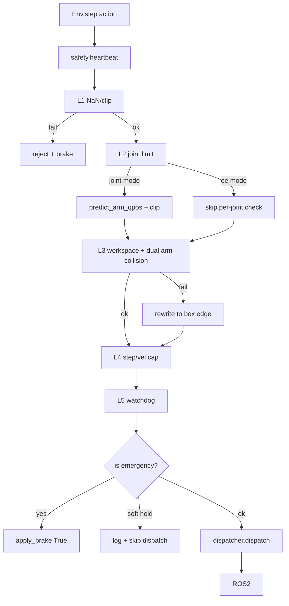
```mermaid
flowchart TD
    Start[Env.step action]
    HB[safety.heartbeat] 
    Start --> HB
    HB --> L1[L1 NaN/clip]
    L1 -->|fail| Reject[reject + brake]
    L1 -->|ok| L2[L2 joint limit]
    L2 -->|joint mode| L2j[predict_arm_qpos + clip]
    L2 -->|ee mode| L2e[skip per-joint check]
    L2j --> L3
    L2e --> L3
    L3[L3 workspace + dual arm collision]
    L3 -->|fail| Rewrite[rewrite to box edge]
    L3 -->|ok| L4
    Rewrite --> L4
    L4[L4 step/vel cap]
    L4 --> L5[L5 watchdog]
    L5 --> CtrlBranch{is emergency?}
    CtrlBranch -->|yes| Brake[apply_brake True]
    CtrlBranch -->|soft hold| LogHold[log + skip dispatch]
    CtrlBranch -->|ok| Dispatch[dispatcher.dispatch]
    Dispatch --> ROS2
```

### §6.9 delta 模式的安全特别说明

joint_delta_mode (`JointDeltaDispatcher`) 在安全闸门链路上有 4 处与 abs 模式不同, 在这里集中说明:

| 闸门 | abs 模式 | delta 模式 (`joint_delta_mode=true`) |
|------|----------|------------------------------------|
| **L1 schema/NaN/clip** | `np.clip(action, -1, 1)` + 拒收 NaN/Inf | **完全相同** — clip 后的 [-1,1] 经 dispatcher 反归一化为 δq_rad |
| **L2 关节限位** | supervisor `_check_l2a_predict_q_clip` 主裁 + dispatcher 反归一化已经在 [q_min, q_max] 内 | **dispatcher 内部 `q_target = clip(q_current + δ, q_min, q_max)` 主裁** + supervisor 兜底. 当模型连续多步输出 +1 时, dispatcher 一步步 clip 在限位上, 不会"穿透" |
| **L3 工作空间盒 / 双臂球** | EE 模式才走 (joint 模式 N/A) | **完全相同** (N/A — joint 模式不算 EE 距离) |
| **L4 per-step cap** | supervisor `_check_l4_per_step_cap` 必跑, 检查 `\|Δq\| ≤ max_step` | **天然满足** — `joint_delta_scale` 就是 per-step 上限. 推荐通过 `safety_cfg.enable_l4_per_step_cap: false` 关闭重复检查, 或者配 `max_step = max(joint_delta_scale)` 保持一致 |
| **L5 watchdog** | BMS / heartbeat / status_errors / estop | **完全相同** |

**特殊注意 1 — q_current 初始化时机**: dispatcher 第一次调 `dispatch` 之前, controller 必须已经收到至少一次 `/hdas/feedback_arm_*` 反馈, 否则 `state.right_arm_qpos` 是默认零值, 第一步 δ 加上去后 q_target 会从 0 出发漂移. 实现上, env 的 `__init__` 末尾的 `_wait_robot_ready(timeout=30s)` 已经强制等过, 这里再次强调 **delta 模式对 startup 状态有强依赖**.

**特殊注意 2 — soft_hold 时不要继续累加**: supervisor 触发 `soft_hold` 时, dispatcher 的 `dispatch` 不应被调用 (env.step 已经跳过了). 但如果某种 bug 让它被调用了, **q_current 来源仍然是 state, 不会漂移** — 这是 delta 模式相对"维护一个内部累计 target"实现的优势.

**特殊注意 3 — RL 训练 reward 设计**: dense reward 用关节空间 L2 距离时 `r = -‖q_current - q_target‖`, q_current 由 supervisor 拿到的 state 提供, q_target 由任务定义. 不要用 "上一次发出的 q_target" 当 reward 基准 — delta 模式下"发出的"和"实际到达的"可能因 mobiman 跟踪误差差几度, 用反馈值更准.

**特殊注意 4 — `apply_brake` 后恢复**: brake 触发期间 mobiman 会暂停跟踪, 关节物理位置可能因机械保持力略有漂移; brake 解除后第一步 dispatch 时 `q_current` 是漂移后的真实值, delta 从这里加, 自然衔接, **不需要任何特殊重置逻辑**.

---

## §7 配置体系: 单一开关驱动整个动作链

### §7.1 配置层级与开关传播

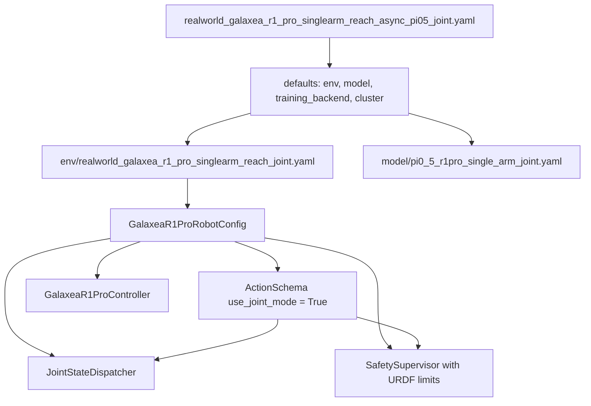
```mermaid
flowchart TD
    Top[realworld_galaxea_r1_pro_singlearm_reach_async_pi05_joint.yaml]
    Top --> Defs[defaults: env, model, training_backend, cluster]
    Defs --> EnvCfg[env/realworld_galaxea_r1_pro_singlearm_reach_joint.yaml]
    Defs --> ModelCfg[model/pi0_5_r1pro_single_arm_joint.yaml]
    EnvCfg --> RobotCfg[GalaxeaR1ProRobotConfig]
    RobotCfg --> ASch[ActionSchema use_joint_mode = True]
    RobotCfg --> Disp[JointStateDispatcher]
    RobotCfg --> Sup[SafetySupervisor with URDF limits]
    RobotCfg --> Ctrl[GalaxeaR1ProController]
    ASch --> Disp
    ASch --> Sup
```

`use_joint_mode` 在 YAML 是一个标量 bool, 在代码里被传播到:
- `ActionSchema.use_joint_mode` (决定 `split` 的 key 名与维度)
- `build_action_dispatcher` (决定工厂出哪个 dispatcher 类)
- `SafetySupervisor.L2d` 速度帽 (joint mode 用关节速度帽, ee mode 用 EE 速度帽)
- 模型 yaml 的 `openpi.config_name` (决定 dataconfig 是 `pi05_r1pro_*_joint` 还是 `*_ee`) — 这一行需要训练脚本根据 `use_joint_mode` 自动选择, 或者用户在两个不同的顶层 yaml 之间手动切

为了避免用户配错, 我们加一个 hydra-level 校验:

```python
# rlinf/config.py  (validate_cfg 扩展)

def _validate_galaxea_r1_pro(cfg):
    if not cfg.env.train.init_params.id.startswith("GalaxeaR1Pro"):
        return
    use_joint = cfg.env.train.override_cfg.get("use_joint_mode", False)
    config_name = cfg.actor.model.openpi.config_name
    if use_joint and "joint" not in config_name:
        raise ValueError(
            f"use_joint_mode=True but openpi.config_name={config_name} "
            "is not a joint mode dataconfig. Use pi05_r1pro_*_joint."
        )
    if (not use_joint) and "_ee" not in config_name:
        raise ValueError(
            f"use_joint_mode=False but openpi.config_name={config_name} "
            "is not an ee mode dataconfig. Use pi05_r1pro_*_ee."
        )
```

启动一秒就能拦下错配, 不让训练跑 10 分钟才发现.

### §7.2 env 配置完整示例 (joint mode 单臂 reach)

```yaml
# examples/embodiment/config/env/realworld_galaxea_r1_pro_singlearm_reach_joint.yaml

# Environment definition for the single-arm reach task in joint mode.
# Used by both M1 (training) and CI (dummy).

env_type: realworld

# Dummy / real toggle.  CI overrides this to true.
is_dummy: false

# RealWorldEnv wrapper chain.
# DO NOT enable RelativeFrame / Quat2Euler -- those are Franka-only.
use_relative_frame: false
use_quat2euler: false

train:
  num_envs: 1
  init_params:
    id: GalaxeaR1ProSingleArmReach-joint-v1
    max_episode_steps: 100

  override_cfg:
    # ─────────── Master switch ───────────
    use_joint_mode: true

    # ─────────── Robot identity ──────────
    use_right_arm: true
    use_left_arm: false
    use_torso: false
    use_chassis: false
    no_gripper: true                 # SingleArmReach has no gripper
    is_dummy: ${env.is_dummy}

    # ─────────── ROS2 environment ────────
    ros_domain_id: ${oc.env:ROS_DOMAIN_ID,41}
    rmw_implementation: rmw_cyclonedds_cpp
    ros_localhost_only: 0
    galaxea_install_path: /home/nvidia/galaxea/install
    controller_node_rank: 0          # collocated in single-Orin form

    # ─────────── Joint mode params ───────
    arm_q_limits_source: urdf        # urdf | manual | reject
    urdf_path: null                  # null -> auto-resolve from SDK
    arm_qvel_max: [3.0, 3.0, 3.0, 3.0, 5.0, 5.0, 5.0]
    home_q_right: [0.0, 0.0, 0.0, 0.0, 0.0, 0.0, 0.0]   # safe starting pose
    target_q_right: [0.5, 0.5, 0.0, -1.2, 0.0, 1.5, 0.0]   # task goal

    # ─────────── EE mode params (ignored when use_joint_mode=true) ────
    ee_min_right: [0.20, -0.40, 0.10]
    ee_max_right: [0.70,  0.40, 0.80]

    # ─────────── Gripper ────────────────
    gripper_min_pct: 0.0
    gripper_max_pct: 90.0            # user-configurable upper bound

    # ─────────── Step / control rate ────
    step_frequency: 10               # Hz; matched to Pi0.5 chunk replay rate
    action_scale: [1.0, 1.0, 1.0]    # in joint mode, action is absolute, scale unused

    # ─────────── Cameras ─────────────────
    cameras:
      - name: wrist_right
        backend: realsense_usb       # or ros2 in single-Orin form
        rgb_topic: null              # USB direct
        depth_topic: null
        fps: 30
        resolution: [224, 224]
        # In §8.2 we override to 112x112.

    # ─────────── Reward ──────────────────
    reward:
      type: joint_l2
      target_q_right: ${env.train.override_cfg.target_q_right}
      tolerance: 0.05               # rad
      bonus_on_success: 1.0

    # ─────────── Safety ──────────────────
    safety_cfg:
      operator_heartbeat_timeout_ms: 1500
      bms_low_battery_threshold_pct: 20
      feedback_stale_threshold_ms: 200
      max_step_q_delta: 0.10        # rad/step
      estop_mode_value: 99           # /controller mode that means hardware estop
      arm_qvel_max: ${env.train.override_cfg.arm_qvel_max}

eval:
  # Same as train but is_dummy=false always (real-robot eval)
  num_envs: 1
  init_params: ${env.train.init_params}
  override_cfg: ${env.train.override_cfg}
```

### §7.3 顶层异步训练 yaml (M1)

```yaml
# examples/embodiment/config/realworld_galaxea_r1_pro_singlearm_reach_async_pi05_joint.yaml

defaults:
  - env: realworld_galaxea_r1_pro_singlearm_reach_joint
  - model: pi0_5_r1pro_single_arm_joint@actor.model
  - training_backend/fsdp@actor.fsdp_config
  - _self_

cluster:
  num_nodes: 1
  component_placement:
    actor:   "0"      # collocated on Orin (or GPU server in form A)
    rollout: "0"
    env:     "0"
  node_groups:
    - label: "orin"
      node_ranks: ["0"]
      hardware:
        type: GalaxeaR1Pro
        configs:
          galaxea_install_path: /home/nvidia/galaxea/install
          ros_domain_id: ${oc.env:ROS_DOMAIN_ID,41}
          rmw_implementation: rmw_cyclonedds_cpp

algorithm:
  loss_type: decoupled_actor_critic         # Async PPO
  adv_type: gae

actor:
  optim:
    lr: 1e-5
    weight_decay: 0.01
  micro_batch_size: 1
  global_batch_size: 4
  gradient_checkpointing: true
  enable_offload: true
  fsdp_config:
    sharding_strategy: full_shard
    cpu_offload: true

rollout:
  backend: huggingface          # NOT sglang/vllm on Orin
  gpu_memory_utilization: 0.5

runner:
  total_steps: 50000
  save_interval: 1000
  val_check_interval: 500
  logger:
    logger_backends: [tensorboard]
    project: r1pro_singlearm_reach
```

### §7.4 配置工厂 (build_robot_config)

```python
# rlinf/envs/realworld/galaxear/r1_pro_env.py  (config builder)

@dataclass
class GalaxeaR1ProRobotConfig:
    # Master action mode switch
    use_joint_mode: bool = True

    # Identity
    use_right_arm: bool = True
    use_left_arm:  bool = False
    use_torso:     bool = False
    use_chassis:   bool = False
    no_gripper:    bool = False
    is_dummy:      bool = False

    # ROS2
    ros_domain_id: int = 41
    rmw_implementation: str = "rmw_cyclonedds_cpp"
    ros_localhost_only: int = 0
    galaxea_install_path: str = "/home/nvidia/galaxea/install"
    controller_node_rank: int = 0

    # Joint mode
    arm_q_limits_source: str = "urdf"   # urdf | manual | reject
    urdf_path: Optional[str] = None
    arm_qvel_max: List[float] = field(
        default_factory=lambda: [3.0, 3.0, 3.0, 3.0, 5.0, 5.0, 5.0]
    )
    home_q_right: Optional[List[float]] = None
    home_q_left:  Optional[List[float]] = None
    arm_q_min_right: Optional[List[float]] = None   # for source=manual
    arm_q_max_right: Optional[List[float]] = None
    arm_q_min_left:  Optional[List[float]] = None
    arm_q_max_left:  Optional[List[float]] = None

    # EE mode
    ee_min_right: List[float] = field(default_factory=lambda: [0.20, -0.40, 0.10])
    ee_max_right: List[float] = field(default_factory=lambda: [0.70,  0.40, 0.80])
    ee_min_left:  List[float] = field(default_factory=lambda: [0.20, -0.40, 0.10])
    ee_max_left:  List[float] = field(default_factory=lambda: [0.70,  0.40, 0.80])
    home_pose_right: Optional[List[float]] = None     # 7-D xyzquat
    home_pose_left:  Optional[List[float]] = None

    # Gripper
    gripper_min_pct: float = 0.0
    gripper_max_pct: float = 90.0

    # Misc
    step_frequency: float = 10.0
    cameras: List[dict] = field(default_factory=list)
    reward: dict = field(default_factory=dict)
    safety_cfg: dict = field(default_factory=dict)
    allow_no_subscriber: bool = False
```

`build_robot_config(cfg_dict)` 把 OmegaConf dict 翻成 dataclass, 一处 typo 立刻报错而不是悄悄继续.

---

## §8 部署形态: 双节点 + 全 Orin 单机最小资源

### §8.1 形态 A: 双节点 (默认推荐)

复用现有 Franka / XSquare 模式. 拓扑见 [§2.3](#23-部署形态对比).

| 项 | 配置 |
|----|------|
| Orin 角色 | controller + ROS2 + HDAS + mobiman; **无 RLinf worker** |
| GPU 服务器角色 | actor (FSDP) + rollout (HF/SGLang) + env worker; **不需要装 ROS2** (因为 `RolloutWorker` 走 Ray, env worker 通过 Ray RPC 调 Orin 上的 controller) |
| 网络 | 千兆有线 (建议 10G); ROS2 跨机 (CycloneDDS) |
| 相机 | 腕部 RealSense 走 USB AOC 直连 GPU 服务器, 头部走 ROS2 |
| `cluster.num_nodes` | 2 |
| `RLINF_NODE_RANK` | Orin = 1, GPU 服务器 = 0 (head) |

启动顺序:
1. **Orin**: `source /home/nvidia/galaxea/install/setup.bash && ros2 launch galaxea_bringup r1pro.launch.py`
2. **Orin**: `RLINF_NODE_RANK=1 ray start --address=<head_ip>:6379`
3. **GPU 服务器**: `RLINF_NODE_RANK=0 ray start --head --port=6379 --node-ip-address=<head_ip>`
4. **GPU 服务器**: `python examples/embodiment/train_async.py --config-name realworld_galaxea_r1_pro_singlearm_reach_async_pi05_joint_dual_node`

### §8.2 形态 B: 全 Orin 单机最小资源形态 (本方案新增)

> 用户硬约束第 6 条: "只需要 Orin 就能做训练和推理的方案, 显存内存越少越好".

#### §8.2.1 资源约束与策略

本机 AGX Orin Developer Kit, 实测 (`/proc/meminfo`, `tegrastats`, `nvpmodel -q`):

- **总统一内存**: 30.7 GiB
- **当前空闲**: ~25 GiB
- **MAXN 模式** (CPU 全开 + GPU 1.3 GHz)
- **磁盘**: 372 GiB 空闲

GPU 与 CPU 共享同一物理 DRAM, **不像桌面 GPU 那样有独立 VRAM**. 这意味着:
- 不能简单地说 "VRAM 24 GB", 整个系统 + RLinf + Pi0.5 + ROS2 + 浏览器都吃同一池 30 GB;
- INT4 / LoRA / 小图像 / `enable_offload` 不是可选项, 是必须;
- 给 OS + ROS2 + HDAS 留至少 6 GB, 剩 24 GB 给 RL 全栈.

#### §8.2.2 资源预算表

| 组件 | 内存预算 | 备注 |
|------|--------|------|
| OS + ROS2 + HDAS + mobiman | 4-6 GB | 已经在跑 |
| Pi0.5 INT4 weights | 3-4 GB | 全参数 BF16 ~14 GB → INT4 量化后 ~3.5 GB |
| Pi0.5 LoRA adapters (rank 16) | < 0.1 GB | 仅 LoRA 训练, 冻结骨干 |
| Pi0.5 KV cache (T=4 chunks, batch=1) | 1-2 GB | 短 chunk + bs1 控制 |
| Pi0.5 activation (gradient checkpointing) | 2-3 GB | recompute 开 |
| FSDP optimizer states (Adam fp32 LoRA-only) | < 0.1 GB | LoRA 参数极少 |
| RLinf framework + Ray + Python | 1.5 GB | ray overhead |
| EnvWorker buffers (1 image 112x112 + state) | 0.1 GB | 几乎为零 |
| Camera buffer (RealSense + ROS2 publisher) | 0.5 GB | 单腕部 |
| Reward worker (optional, joint_l2 不用) | 0 GB | 不开 |
| Logger / TensorBoard | 0.2 GB | 偶尔 spike |
| **合计** | **~14-19 GB** | 余 ~6-10 GB 安全裕量 |

实测验证目标: 跑 SingleArmReach-joint 任务, `tegrastats` 显示 RAM 持续 < 22 GB, 不触发 OOM Killer.

#### §8.2.3 关键策略详解

**策略 1 - Pi0.5 INT4 量化**

用 bitsandbytes 的 NF4 量化加载 Pi0.5 的 VLM 部分, 或者用 GGUF 格式离线量化:

```python
# rlinf/models/embodiment/openpi/__init__.py  (load with quant)

from transformers import BitsAndBytesConfig

if cfg.precision == "int4":
    bnb_cfg = BitsAndBytesConfig(
        load_in_4bit=True,
        bnb_4bit_quant_type="nf4",
        bnb_4bit_compute_dtype=torch.bfloat16,
        bnb_4bit_use_double_quant=True,
    )
    model = OpenPi0ForRLActionPrediction.from_pretrained(
        cfg.model_path,
        quantization_config=bnb_cfg,
        device_map="auto",
    )
```

注意:
- bitsandbytes 在 Jetson 上的预编译 wheel 可能不全, 必须从源码编译 (在 [§13.3](#133-全-orin-部署-step-by-step) 给出步骤)
- INT4 量化只对 VLM (PaliGemma 部分) 生效, action expert 仍 BF16 (它本来就小)
- 推理时间会比 BF16 慢 ~30%, 但内存省 4x

**策略 2 - LoRA SFT, 不动骨干**

```yaml
# pi0_5_r1pro_single_arm_joint.yaml (片段)
is_lora: True
lora_rank: 16              # ↓ from 32
# Apply LoRA to attention layers only:
lora_target_modules: ["q_proj", "k_proj", "v_proj", "o_proj"]
```

LoRA 参数 ~10 MB, 优化器状态可以全 fp32, 几乎不占内存.

**策略 3 - 单臂 + joint mode**

不要碰双臂, 不要碰 ee mode. SingleArmReach-joint-v1 是 8D action, 维度小, 探索快.

**策略 4 - 单腕部相机, 112×112**

```yaml
cameras:
  - name: wrist_right
    backend: ros2          # 单机直接用 ROS2, 不需要 USB AOC
    rgb_topic: /hdas/camera_wrist_right/color/image_raw/compressed
    fps: 15                # 降到 15 减少 ROS2 带宽
    resolution: [112, 112] # 224 -> 112 节省 4x 内存
```

Pi0.5 默认 224×224, 我们在 image preprocessing 加一个 resize 到 112×112, 然后 model load 时把 vision encoder 的 patch size 微调 (这步如果太复杂, 退化到 224×224 + 单图也能跑, 只是多吃 1 GB).

**策略 5 - rollout backend = huggingface**

Orin 不支持 SGLang 或 vLLM (它们的 CUDA kernel 没有 ARM aarch64 + Tegra 的预编译 wheel). 一律 `backend: huggingface`. 慢一点 (推理频率 ~6-8 Hz), 但能跑.

**策略 6 - 异步 PPO + LoRA + bs=1**

```yaml
algorithm:
  loss_type: decoupled_actor_critic
actor:
  micro_batch_size: 1
  global_batch_size: 4
  gradient_checkpointing: true
  enable_offload: true        # offload optimizer state to CPU RAM
runner:
  total_steps: 50000
  save_interval: 1000
```

`enable_offload: true` 把优化器状态 offload 到 CPU 部分; 反正是统一内存, 物理上是同一池, 但 PyTorch 的 Adam 状态如果留在 GPU 视角下会对 KV cache 产生干扰, offload 让 PyTorch allocator 与 CUDA stream 解耦.

#### §8.2.4 Mermaid: 全 Orin 形态的进程图

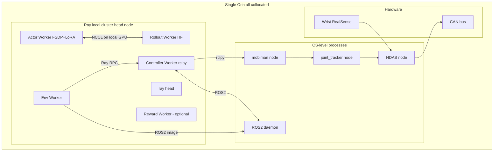
```mermaid
flowchart TB
    subgraph OrinProcs[Single Orin all collocated]
        direction LR
        subgraph OS[OS-level processes]
            ROS2D[ROS2 daemon]
            HDAS[HDAS node]
            Mobi[mobiman node]
            JT[joint_tracker node]
        end
        subgraph RayCluster[Ray local cluster head node]
            RayHead[ray head]
            ActorW[Actor Worker FSDP+LoRA]
            RolloutW[Rollout Worker HF]
            EnvW[Env Worker]
            CtrlW[Controller Worker rclpy]
            RewardW[Reward Worker - optional]
        end
        subgraph Hardware[Hardware]
            CAN[CAN bus]
            Cam[Wrist RealSense]
        end
        ActorW <-->|NCCL on local GPU| RolloutW
        EnvW -->|Ray RPC| CtrlW
        CtrlW -->|rclpy| Mobi
        Mobi --> JT
        JT --> HDAS
        HDAS --> CAN
        CtrlW <--ROS2--> ROS2D
        EnvW -->|ROS2 image| ROS2D
        Cam --> HDAS
    end
```

#### §8.2.5 启动脚本 (示例)

```bash
#!/usr/bin/env bash
# scripts/run_orin_only_singlearm_reach.sh

set -euo pipefail
cd /home/nvidia/lg_ws/RL/RLinf

# 1. ROS2 + Galaxea SDK
source /opt/ros/humble/setup.bash
source /home/nvidia/galaxea/install/setup.bash
export ROS_DOMAIN_ID="${ROS_DOMAIN_ID:-41}"
export RMW_IMPLEMENTATION=rmw_cyclonedds_cpp
export ROS_LOCALHOST_ONLY=0

# 2. Verify topology BEFORE launching training
python toolkits/realworld_check/test_galaxea_r1_pro_controller.py topo_check \
  --use-joint-mode \
  --use-right-arm \
  --no-gripper \
  --strict

# 3. Activate the conda env that has rlinf + bitsandbytes
source /home/nvidia/miniconda3/etc/profile.d/conda.sh
conda activate r1_pro_platform     # already exists per Part A in research

# 4. Start Ray locally (no need for --address)
ray start --head --port=6379 --num-cpus=8 --num-gpus=1

# 5. Launch training
RLINF_NODE_RANK=0 \
  python examples/embodiment/train_async.py \
    --config-name realworld_galaxea_r1_pro_singlearm_reach_async_pi05_joint_orin_only

# On stop:  ray stop -f
```

#### §8.2.6 性能预期

| 指标 | 形态 A 双节点 | 形态 B 全 Orin |
|------|-------------|--------------|
| RL step 频率 | 15-20 Hz | 5-8 Hz |
| Pi0.5 推理时延 | ~30 ms | ~150 ms (INT4) |
| 50k 步训练时长 | 4-6 小时 | 24-36 小时 |
| 内存峰值 | GPU 24 GB | RAM 22 GB |
| SingleArmReach 收敛 | M1 通过 | M1 通过 (可能慢 2x) |

形态 B 慢, 但能跑通; 形态 A 快, 但需要多一台机器. 用户按需选.

---

## §9 测试体系: 单测 + CLI 交互测试 + dummy e2e

### §9.1 测试金字塔

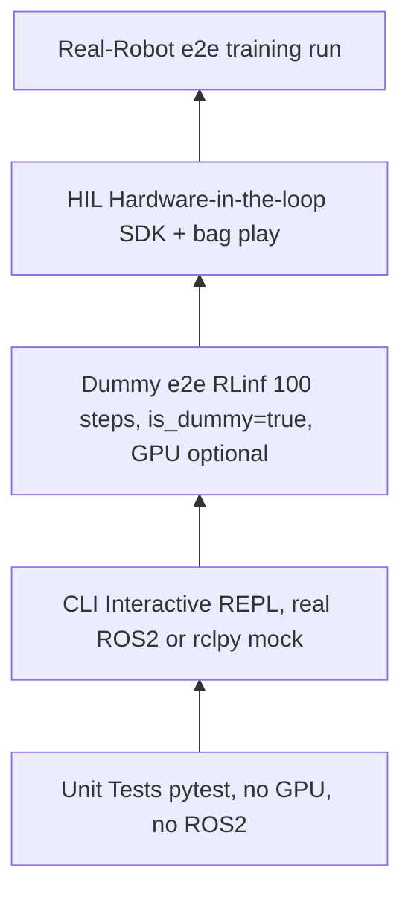
```mermaid
flowchart BT
    Unit[Unit Tests pytest, no GPU, no ROS2]
    CLI[CLI Interactive REPL, real ROS2 or rclpy mock]
    Dummy[Dummy e2e RLinf 100 steps, is_dummy=true, GPU optional]
    HIL[HIL Hardware-in-the-loop SDK + bag play]
    Real[Real-Robot e2e training run]

    Unit --> CLI
    CLI --> Dummy
    Dummy --> HIL
    HIL --> Real
```

**金字塔法则**: 越往上, 用例越少, 跑越慢, 反馈越真. CI 只跑 Unit + Dummy. CLI 是开发者本机用, HIL/Real 是预发布.

### §9.2 CLI 交互测试 toolkit

复用现有 [toolkits/realworld_check/test_galaxea_r1_pro_controller.py](../../toolkits/realworld_check/test_galaxea_r1_pro_controller.py) (1325 行, 已经有 ee mode 支持). 我们扩展它:

```mermaid
flowchart LR
    Entry[python toolkits/.../test_galaxea_r1_pro_controller.py]
    Entry -->|--mode joint| JointSub[Joint subcommands]
    Entry -->|--mode ee| EeSub[EE subcommands]
    Entry -->|topo_check| Topo[Topology Go/No-Go]
    Entry -->|gripper| Grip[Gripper test]
    Entry -->|safety_check| Sa[End-to-end L1-L5 trigger]

    JointSub --> JC1[move_single_joint side j idx target_rad]
    JointSub --> JC2[home reset to home_q]
    JointSub --> JC3[traj play_csv joint_trajectory.csv]

    EeSub --> EC1[move_xyz dx dy dz]
    EeSub --> EC2[move_quat qx qy qz qw]
    EeSub --> EC3[home reset to home_pose]

    Grip --> GC1[set_pct value]
    Grip --> GC2[set_norm value -1 to 1]
    Grip --> GC3[sweep open/close cycle]
```

**子命令规范** (每个都对应一段 REPL):

```bash
# Topology check (前置检查)
python toolkits/realworld_check/test_galaxea_r1_pro_controller.py topo_check \
  --use-joint-mode \
  --use-right-arm \
  --no-gripper \
  --strict

# Joint mode 单关节移动
python toolkits/realworld_check/test_galaxea_r1_pro_controller.py joint move_single_joint \
  --side right --joint-idx 0 --target-rad 0.5

# Joint mode 回 home
python toolkits/realworld_check/test_galaxea_r1_pro_controller.py joint home \
  --side right

# EE mode 增量
python toolkits/realworld_check/test_galaxea_r1_pro_controller.py ee move_xyz \
  --side right --dx 0.05 --dy 0.0 --dz 0.0

# Gripper 测试 (按业务范围归一化)
python toolkits/realworld_check/test_galaxea_r1_pro_controller.py gripper set_norm \
  --side right --value 0.5 --gmin-pct 0 --gmax-pct 90

# 安全闸门端到端验证
python toolkits/realworld_check/test_galaxea_r1_pro_controller.py safety_check \
  --trigger l2 --side right
# 期望: 故意发越界 action, 看到 SafetyInfo.reason 含 "L2:..." 且机器人不动
```

**REPL 模式** (跑长时间交互):
```bash
python toolkits/realworld_check/test_galaxea_r1_pro_controller.py repl \
  --mode joint --side right --no-gripper

# 进入交互式提示符:
> joint right 0 0.5            # move joint 0 to 0.5 rad
> joint right 0 -0.5
> home right
> q                            # quit
```

REPL 主循环每 200 ms 调一次 `safety.heartbeat()`, 不会触发 L5 心跳超时.

### §9.3 单元测试矩阵

放在 [tests/unit_tests/](../../tests/unit_tests/) 下:

| 文件 | 测什么 | 大致用例数 |
|------|--------|---------|
| `test_galaxea_r1_pro_action_schema.py` (已存在, 扩展) | `use_joint_mode=True` 时 split 返回 `right_q7`; `use_joint_mode=False` 时返回 `right_xyz + right_quat`; 维度计算 | +6 |
| `test_galaxea_r1_pro_joint_dispatcher.py` (新增) | 反归一化对称性/边界/裁剪, gripper 配置范围, dispatcher 调用 controller, verify_topology | 10 |
| `test_galaxea_r1_pro_ee_dispatcher.py` (新增) | 四元数零向量/W翻转/L2归一化, xyz 边界, EE 反馈回调写 state | 8 |
| `test_galaxea_r1_pro_gripper_mixer.py` (新增) | action11_to_pct / pct_to_obs11 各种边界 | 7 |
| `test_galaxea_r1_pro_safety.py` (已存在, 修复) | hdas_msg PascalCase mock, 操作员心跳 wiring 后不再误报 | +4 |
| `test_galaxea_r1_pro_safety_l2.py` (已存在) | URDF 限位解析回退路径 | +3 |
| `test_galaxea_r1_pro_robot_state.py` (新增) | `controller_signal` 默认字段对齐真实 ControllerSignal; `get_gripper_obs11` 用 mixer | 5 |
| `test_galaxea_r1_pro_config_validation.py` (新增) | `use_joint_mode=True` 但 `config_name` 含 "_ee" 时 validate_cfg raise | 3 |

总计 **新增 33 个 + 已有扩展 13 个 = 46 个用例**, 全部纯 Python, 无需 GPU 或 ROS2 (用 `mock.patch`).

#### §9.3.1 示例: JointStateDispatcher 单测

```python
# tests/unit_tests/test_galaxea_r1_pro_joint_dispatcher.py

import numpy as np
import pytest
from unittest.mock import MagicMock

from rlinf.envs.realworld.galaxear.r1_pro_action_dispatcher import (
    JointStateDispatcher,
)
from rlinf.envs.realworld.galaxear.r1_pro_action_schema import ActionSchema
from rlinf.envs.realworld.galaxear.r1_pro_robot_state import (
    GalaxeaR1ProRobotState,
)


def _make_dispatcher(no_gripper=False):
    schema = ActionSchema(
        has_left_arm=False, has_right_arm=True,
        has_torso=False, has_chassis=False,
        no_gripper=no_gripper,
        action_scale=np.ones(3, dtype=np.float32),
        use_joint_mode=True,
    )
    ctrl = MagicMock()
    return schema, ctrl, JointStateDispatcher(
        schema=schema,
        controller=ctrl,
        q_min_right=np.array([-2.0]*7, dtype=np.float32),
        q_max_right=np.array([+2.0]*7, dtype=np.float32),
        q_min_left=np.zeros(7, dtype=np.float32),
        q_max_left=np.zeros(7, dtype=np.float32),
        q_vel_max=np.array([3,3,3,3,5,5,5], dtype=np.float32),
        gmin_pct=0.0, gmax_pct=90.0,
    )


def test_unnormalize_arm_zero_is_midpoint():
    _, _, disp = _make_dispatcher(no_gripper=True)
    q = disp._unnormalize_arm("right", np.zeros(7))
    np.testing.assert_allclose(q, np.zeros(7), atol=1e-6)


def test_unnormalize_arm_pos_one_hits_qmax():
    _, _, disp = _make_dispatcher(no_gripper=True)
    q = disp._unnormalize_arm("right", np.ones(7))
    np.testing.assert_allclose(q, np.full(7, 2.0), atol=1e-6)


def test_unnormalize_arm_neg_one_hits_qmin():
    _, _, disp = _make_dispatcher(no_gripper=True)
    q = disp._unnormalize_arm("right", -np.ones(7))
    np.testing.assert_allclose(q, np.full(7, -2.0), atol=1e-6)


def test_unnormalize_arm_clipped_when_out_of_range():
    _, _, disp = _make_dispatcher(no_gripper=True)
    q = disp._unnormalize_arm("right", np.full(7, 1.5))
    np.testing.assert_allclose(q, np.full(7, 2.0), atol=1e-6)


def test_unnormalize_gripper_max_pct_90():
    _, _, disp = _make_dispatcher()
    assert disp._unnormalize_gripper(1.0) == pytest.approx(90.0)
    assert disp._unnormalize_gripper(-1.0) == pytest.approx(0.0)
    assert disp._unnormalize_gripper(0.0) == pytest.approx(45.0)


def test_dispatch_calls_send_arm_joints_not_send_arm_pose():
    _, ctrl, disp = _make_dispatcher(no_gripper=True)
    state = GalaxeaR1ProRobotState()
    safe_action = np.zeros(7, dtype=np.float32)
    disp.dispatch(safe_action, state)
    ctrl.send_arm_joints.assert_called_once()
    args, _ = ctrl.send_arm_joints.call_args
    assert args[0] == "right"
    np.testing.assert_allclose(args[1], np.zeros(7), atol=1e-6)
    ctrl.send_arm_pose.assert_not_called()


def test_dispatch_with_gripper_calls_send_gripper():
    _, ctrl, disp = _make_dispatcher(no_gripper=False)
    state = GalaxeaR1ProRobotState()
    safe_action = np.zeros(8, dtype=np.float32)
    safe_action[7] = 1.0  # gripper to max business pct
    disp.dispatch(safe_action, state)
    ctrl.send_gripper.assert_called_once()
    args, _ = ctrl.send_gripper.call_args
    assert args[0] == "right"
    assert args[1] == pytest.approx(90.0)


def test_verify_topology_raises_when_no_subscriber():
    _, ctrl, disp = _make_dispatcher(no_gripper=True)
    ctrl.get_subscription_count.return_value = 0
    with pytest.raises(RuntimeError, match="no subscriber"):
        disp.verify_topology(ctrl)


def test_get_required_topics_joint_with_gripper():
    _, _, disp = _make_dispatcher(no_gripper=False)
    topics = disp.get_required_topics()
    assert "/motion_target/target_joint_state_arm_right" in topics
    assert "/motion_target/target_position_gripper_right" in topics
    assert "/motion_target/target_pose_arm_right" not in topics


def test_reset_to_safe_pose_sends_home_q():
    _, ctrl, disp = _make_dispatcher(no_gripper=True)
    disp._home_q_right = np.full(7, 0.5, dtype=np.float32)
    disp.reset_to_safe_pose(GalaxeaR1ProRobotState())
    args, _ = ctrl.send_arm_joints.call_args
    np.testing.assert_allclose(args[1], np.full(7, 0.5), atol=1e-6)
```

10 个用例完整覆盖 joint dispatcher 的关键路径.

### §9.4 Dummy e2e 测试

```yaml
# tests/e2e_tests/embodied/realworld_dummy_galaxea_r1_pro_singlearm_reach_joint.yaml

defaults:
  - /env: realworld_galaxea_r1_pro_singlearm_reach_joint
  - /model: pi0_5_r1pro_single_arm_joint@actor.model
  - _self_

env:
  is_dummy: true                    # critical: no ROS2, no controller, no rclpy
  train:
    init_params:
      max_episode_steps: 5

cluster:
  num_nodes: 1
  component_placement:
    actor: "0"
    rollout: "0"
    env: "0"

actor:
  micro_batch_size: 1
  global_batch_size: 1
  fsdp_config:
    sharding_strategy: no_shard

rollout:
  backend: huggingface
  gpu_memory_utilization: 0.3

algorithm:
  loss_type: decoupled_actor_critic
  adv_type: gae

runner:
  total_steps: 10                   # CI: 10 steps in dummy
  save_interval: 100
  val_check_interval: 100
```

CI 跑这个 yaml, 期望 100 步内不 crash, 不 OOM, action_dim 检查正确.

---

## §10 渐进式落地路线 M0-M5

```mermaid
gantt
    title R1 Pro RL Roadmap
    dateFormat YYYY-MM-DD
    section M0 Bring-up
    Topo check + CLI tests        :m0a, 2026-05-08, 7d
    Unit test green               :m0b, after m0a, 5d
    Real robot connectivity       :m0c, after m0b, 3d
    section M1 SingleArmReach joint
    Env + reward                  :m1a, after m0c, 5d
    Pi0.5 SFT 100 demos           :m1b, after m1a, 7d
    RL training                   :m1c, after m1b, 14d
    section M2 SingleArmReach ee
    Switch to ee mode             :m2a, after m1c, 3d
    Workspace box calibration     :m2b, after m2a, 3d
    RL training ee                :m2c, after m2b, 10d
    section M3 SingleArmPick
    Add gripper                   :m3a, after m2c, 5d
    Reward shaping                :m3b, after m3a, 5d
    SFT + RL                      :m3c, after m3b, 14d
    section M4 DualArmHandover
    Enable left arm               :m4a, after m3c, 5d
    Dual arm collision sphere     :m4b, after m4a, 5d
    SFT + RL                      :m4c, after m4b, 21d
    section M5 MobileManipulation
    Enable torso + chassis        :m5a, after m4c, 7d
    Whole body safety             :m5b, after m5a, 7d
    SFT + RL                      :m5c, after m5b, 28d
```

### §10.1 M0 - Bring-up (~2 周)

**目标**: 把"机器人能动"和"安全闸门能拦"两件事验证清楚.

**触发条件**: 真机就位, 操作员认证完成.

**交付物**:
- Topology check 通过 (脚本 [§9.2](#92-cli-交互测试-toolkit))
- `pytest tests/unit_tests/test_galaxea_r1_pro_*.py` 全绿 (46 个用例)
- CLI 可以让右臂动起来 (joint 与 ee 各跑一遍)
- CLI safety_check 故意触发 L2 / L3 / L4 / L5 各一次, 看到 brake 真的下去

**KPI**:
- `topo_check --strict` exit code 0
- 单元测试通过率 100%
- CLI move_single_joint 误差 < 0.05 rad
- 安全触发响应时间 < 50 ms (从 dispatch 到 brake)

**Go/No-Go**:
- ROS2 拓扑图 (`ros2 topic info` 全部话题) 截图存档
- `printenv ROS_DOMAIN_ID` 确认现场值
- `lsmod | grep gs_usb` (CAN 驱动)

### §10.2 M1 - SingleArmReachEnv joint mode (~3-4 周)

**目标**: 第一个真机 RL 任务, 最小可行.

**任务定义**:
- gym id: `GalaxeaR1ProSingleArmReach-joint-v1`
- 右臂从 home `[0.0, 0.3, 0.0, -1.5, 0.0, 1.8, 0.0]` 到达 target `[0.5, 0.5, 0, -1.2, 0, 1.5, 0]`
- 无夹爪, 无相机 (可选 dummy 像)
- max_episode_steps = 100
- 奖励: `r = -‖q_current - q_target‖_2` (稠密) + `+1.0 if ‖.‖ < 0.05` (稀疏)

**为什么这是第一个任务?**

1. **零 IK 依赖**: joint mode 不需要 mobiman 的 relaxed_ik 启动正确.
2. **零夹爪依赖**: gripper 是另一套硬件, 暂不引入.
3. **零相机依赖**: 任务用 proprio (关节角) 即可学; 即便 image 输入塞 dummy 全 0, 模型也学不歪.
4. **零 reward worker 依赖**: reward 在 env 内部直接算, 不需要单独的 RewardWorker.
5. **观测维度最小**: state 9D (7 关节 + 2 夹爪占位), action 7D, 模型探索快.
6. **可视化简单**: 只看一个关节空间距离曲线就知道学得怎么样.

**SFT 数据收集**:
- 用 spacemouse 或 keyboard wrapper 手动遥操 100-200 episode
- 每 episode 长度 ~3 秒 (30 步 @ 10 Hz)
- 转换为 lerobot 格式, 转 OpenPI 训练格式

**SFT 训练**:
```bash
python examples/sft/train_vla_sft.py \
  --config-name galaxea_r1pro_singlearm_reach_sft_joint
```

预期 1-2 epoch (1000-2000 步) 即可在仿真 env 上有 50% 成功率.

**RL 训练**:
```bash
python examples/embodiment/train_async.py \
  --config-name realworld_galaxea_r1_pro_singlearm_reach_async_pi05_joint
```

预期 50000 步 (~24-36 小时 在 Orin 上, 或 4-6 小时 在双节点) 达到 90% 成功率.

**M1 内部的 sub-mode 升级路径** (per [§3.6.8](#368-何时用哪种-sub-mode-决策表) 决策表): 推荐起步用 **abs sub-mode** (`joint_delta_mode=false`, 默认), 让操作员用 CLI 直观验证机器人能动起来; 当 100-200 ep SFT 数据收集完准备进入 RL 阶段, **切到 delta sub-mode** (`joint_delta_mode=true`, 加载 `pi05_r1pro_single_arm_joint_delta` dataconfig), 与 LIBERO/Behavior 等 SFT 数据分布对齐, 收敛速度可提升 3-5x. 切换是一个 cfg 开关 + 一个 dataconfig 名后缀, 不需要重新收集数据 (proprio 完全相同, 见 [§5.2](#52-r1-pro-的-action-layout-与-dataconfig)).

**KPI**:
- 训练 50k 步成功率 >= 90% (定义: 100 ep 中 ‖q - q*‖ < 0.05 的比例)
- 平均每步控制延迟 < 100 ms
- 安全闸门触发率 < 5% (没办法完全 0, 但应该很低)
- 训练过程中无 OOM, 无 stuck > 30 秒
- abs vs delta sub-mode A/B: delta 在相同步数下成功率应比 abs 高至少 5pp, 训练曲线更平滑

### §10.3 M2 - SingleArmReachEnv ee mode (~2 周)

**目标**: 同一个任务搬到 ee mode, 对比两种 mode.

**变化**:
- gym id: `GalaxeaR1ProSingleArmReach-ee-v1`
- target 从关节空间改为 EE 空间 `[x*, y*, z*, qx*, qy*, qz*, qw*]`
- 必须先完成 [§13.2 工作空间盒标定](#132-工作空间盒标定流程)
- `use_joint_mode: false`
- 模型 yaml 切到 `pi05_r1pro_single_arm_ee.yaml`

**关注点**:
- ee mode 在边界附近的 IK 奇异行为
- 四元数表示 vs RPY 表示的稳定性对比 (本方案选 quat, M2 实测验证)
- L3a 工作空间盒触发率应 < 2%

**KPI**:
- 与 M1 同样的成功率指标 (至少 85%, 比 joint 略低可接受)
- 平均碰撞次数 = 0
- 双 mode 对比报告 (M1 vs M2 收敛曲线)

### §10.4 M3 - SingleArmPickEnv (~3-4 周)

**目标**: 加夹爪, 拿一个固定位置的物体.

**变化**:
- 任务: 抓取桌面 5×5 cm 木块, 抬高 10 cm
- `no_gripper: false`, `gripper_min_pct: 10, gripper_max_pct: 80` (不要夹太死)
- 增加 reward shaping: `r = -dist + 0.5*lift + 1.0*success`
- 双臂仍然只用右

**KPI**:
- 抓取成功率 >= 70% (真机第一次能上 50% 就算开门红)
- 不破坏物体 (最大夹持力 < 30 N, gripper feedback 监测)

### §10.5 M4 - DualArmHandoverEnv (~5-6 周)

**目标**: 左手抓物递给右手.

**变化**:
- `use_left_arm: true`, action dim 16 (双臂 joint mode 各 8)
- 启用 dual_arm_collision_sphere (L3b)
- SFT 数据需要双臂遥操 (gello, vr 都行)

### §10.6 M5 - MobileManipulationEnv (~6-8 周, 仅形态 A 双节点)

**目标**: 上躯干 + 底盘, 移动抓取.

**变化**:
- `use_torso: true`, `use_chassis: true`
- action dim = 16 + 4 (torso) + 3 (chassis) = 23
- 全身安全 (torso/chassis 限速, BMS 监测加严)
- **形态 B 全 Orin 不推荐做这个 milestone**, action dim 太大, 收敛太慢

---

## §11 实施落地清单 (按文件级 diff 描述)

> 本节描述本方案需要做的代码改动. 实际执行不在本文档范围内 (本计划只产出 markdown). 改动按"新增 / 修改"分两组, 每条标注预估行数.

### §11.1 新增文件

| 路径 | 行数估计 | 用途 |
|------|--------|------|
| [rlinf/envs/realworld/galaxear/r1_pro_action_dispatcher.py](../../rlinf/envs/realworld/galaxear/r1_pro_action_dispatcher.py) | ~350 | `ActionDispatcher` 抽象 + `JointStateDispatcher` + **`JointDeltaDispatcher`** (per §3.6) + `EePoseDispatcher` + 三分支工厂 |
| [rlinf/envs/realworld/galaxear/r1_pro_gripper_mixer.py](../../rlinf/envs/realworld/galaxear/r1_pro_gripper_mixer.py) | ~50 | `GripperMixer` helper |
| [rlinf/envs/realworld/galaxear/r1_pro_urdf_parser.py](../../rlinf/envs/realworld/galaxear/r1_pro_urdf_parser.py) | ~80 | URDF 限位解析 |
| [rlinf/models/embodiment/openpi/r1pro_dataconfig.py](../../rlinf/models/embodiment/openpi/r1pro_dataconfig.py) | ~80 | 4 个 R1 Pro dataconfig 注册 |
| [rlinf/envs/realworld/galaxear/tasks/r1_pro_single_arm_reach_joint.py](../../rlinf/envs/realworld/galaxear/tasks/r1_pro_single_arm_reach_joint.py) | ~80 | M1 任务: joint reach |
| [rlinf/envs/realworld/galaxear/tasks/r1_pro_single_arm_reach_ee.py](../../rlinf/envs/realworld/galaxear/tasks/r1_pro_single_arm_reach_ee.py) | ~80 | M2 任务: ee reach |
| `examples/embodiment/config/model/pi0_5_r1pro_single_arm_joint.yaml` | ~50 | M1 模型配置 (abs) |
| `examples/embodiment/config/model/pi0_5_r1pro_single_arm_joint_delta.yaml` | ~50 | M1+ 模型配置 (delta, dataconfig=`pi05_r1pro_single_arm_joint_delta`) |
| `examples/embodiment/config/model/pi0_5_r1pro_single_arm_ee.yaml` | ~50 | M2 模型配置 |
| `examples/embodiment/config/model/pi0_5_r1pro_dual_arm_joint.yaml` | ~50 | M4 模型配置 (abs) |
| `examples/embodiment/config/model/pi0_5_r1pro_dual_arm_joint_delta.yaml` | ~50 | M4+ 模型配置 (delta) |
| `examples/embodiment/config/env/realworld_galaxea_r1_pro_singlearm_reach_joint.yaml` | ~80 | M1 env 配置 (abs sub-mode) |
| `examples/embodiment/config/env/realworld_galaxea_r1_pro_singlearm_reach_joint_delta.yaml` | ~80 | M1+ env 配置 (delta sub-mode, 同任务不同 sub-mode 切换) |
| `examples/embodiment/config/env/realworld_galaxea_r1_pro_singlearm_reach_ee.yaml` | ~80 | M2 env 配置 |
| `examples/embodiment/config/realworld_galaxea_r1_pro_singlearm_reach_async_pi05_joint.yaml` | ~80 | M1 顶层异步训练 (双节点) |
| `examples/embodiment/config/realworld_galaxea_r1_pro_singlearm_reach_async_pi05_joint_orin_only.yaml` | ~80 | M1 顶层 (全 Orin 形态) |
| `tests/unit_tests/test_galaxea_r1_pro_joint_dispatcher.py` | ~250 | 10 个 joint (abs) dispatcher 用例 |
| `tests/unit_tests/test_galaxea_r1_pro_joint_delta_dispatcher.py` | ~200 | 11 个 joint delta dispatcher 用例 (per §3.6.7) |
| `tests/unit_tests/test_galaxea_r1_pro_ee_dispatcher.py` | ~200 | 8 个 ee dispatcher 用例 |
| `tests/unit_tests/test_galaxea_r1_pro_gripper_mixer.py` | ~80 | 7 个 mixer 用例 |
| `tests/unit_tests/test_galaxea_r1_pro_robot_state.py` | ~150 | 5 个 state 用例 |
| `tests/unit_tests/test_galaxea_r1_pro_config_validation.py` | ~120 | 3 个 cfg 校验用例 |
| `tests/e2e_tests/embodied/realworld_dummy_galaxea_r1_pro_singlearm_reach_joint.yaml` | ~50 | dummy CI |
| `scripts/run_orin_only_singlearm_reach.sh` | ~30 | 全 Orin 启动脚本 |
| `docs/source-en/rst_source/examples/embodied/galaxea_r1_pro.rst` | ~300 | 官方文档 |
| `docs/source-zh/rst_source/examples/embodied/galaxea_r1_pro.rst` | ~300 | 中文版 |

合计新增 ~21 个文件, 约 2640 行.

### §11.2 修改文件

| 路径 | 大致改动 | 行数 (新增/删除) |
|------|---------|---------------|
| [rlinf/envs/realworld/galaxear/r1_pro_action_schema.py](../../rlinf/envs/realworld/galaxear/r1_pro_action_schema.py) | `split` 分 joint/ee 路径; `per_arm_dim` 新逻辑; ee mode 用 quat 不用 RPY | +60 / -30 |
| [rlinf/envs/realworld/galaxear/r1_pro_env.py](../../rlinf/envs/realworld/galaxear/r1_pro_env.py) | `_dispatch_action` 改成 `self._dispatcher.dispatch(...)`; init 中工厂出 dispatcher; reset 用 dispatcher.reset_to_safe_pose; `_collect_obs` 用 mixer; `GalaxeaR1ProRobotConfig` 加 `joint_delta_mode: bool = False` 与 `joint_delta_scale: list = [0.10, 0.10, 0.10, 0.10, 0.20, 0.20, 0.20]` 字段 | +50 / -30 |
| [rlinf/envs/realworld/galaxear/r1_pro_controller.py](../../rlinf/envs/realworld/galaxear/r1_pro_controller.py) | 新增 `/motion_control/pose_ee_arm_*` 订阅; 修复 hdas_msg PascalCase; 修复 controller_signal 字段; 加 `get_subscription_count`; `send_arm_joints` 完整化 | +100 / -20 |
| [rlinf/envs/realworld/galaxear/r1_pro_robot_state.py](../../rlinf/envs/realworld/galaxear/r1_pro_robot_state.py) | `controller_signal` 默认字段对齐; `get_gripper_obs11` 接 mixer | +20 / -10 |
| [rlinf/envs/realworld/galaxear/r1_pro_safety.py](../../rlinf/envs/realworld/galaxear/r1_pro_safety.py) | URDF 限位解析; estop_mode 改 mode 字段; heartbeat 真接入; hdas_msg 严格 import | +80 / -30 |
| [rlinf/envs/realworld/realworld_env.py](../../rlinf/envs/realworld/realworld_env.py) | `step` 入口加 `safety.heartbeat()` | +5 / 0 |
| [rlinf/envs/action_utils.py](../../rlinf/envs/action_utils.py) | `prepare_actions` 加 R1 Pro 分支 | +30 / 0 |
| [rlinf/envs/realworld/galaxear/tasks/__init__.py](../../rlinf/envs/realworld/galaxear/tasks/__init__.py) | 注册 `*-joint-v1` 与 `*-ee-v1` 后缀的新 gym ID | +20 / 0 |
| [toolkits/realworld_check/test_galaxea_r1_pro_controller.py](../../toolkits/realworld_check/test_galaxea_r1_pro_controller.py) | 加 joint / ee / gripper / topo_check / safety_check 子命令 + REPL | +400 / -50 |
| [tests/unit_tests/test_galaxea_r1_pro_safety.py](../../tests/unit_tests/test_galaxea_r1_pro_safety.py) | mock heartbeat; mock PascalCase; 新增 estop_mode 测试 | +50 / -10 |
| [tests/unit_tests/test_galaxea_r1_pro_action_schema.py](../../tests/unit_tests/test_galaxea_r1_pro_action_schema.py) | 加 joint mode split / ee mode quat 用例 | +60 / 0 |
| [rlinf/config.py](../../rlinf/config.py) | `validate_cfg` 加 R1 Pro 模式校验 | +20 / 0 |

合计修改 ~12 个文件, 约 +885 / -180 行.

### §11.3 改动顺序 (推荐 PR 拆分)

```mermaid
flowchart LR
    PR1[PR1 GripperMixer + ControllerSignal fix]
    PR2[PR2 EE feedback subscription]
    PR3[PR3 ActionDispatcher abstraction]
    PR4a[PR4a JointStateDispatcher abs + tests]
    PR4b[PR4b JointDeltaDispatcher delta + tests, per §3.6]
    PR5[PR5 EePoseDispatcher + tests]
    PR6[PR6 SafetySupervisor heartbeat + URDF + estop]
    PR7[PR7 Pi0.5 r1pro dataconfigs + yaml, abs + delta variants]
    PR8[PR8 SingleArmReachJointEnv + e2e dummy + sub-mode A/B]
    PR9[PR9 CLI toolkit extensions + topo_check]
    PR10[PR10 Orin-only deployment yaml + script]
    PR11[PR11 Docs RST]

    PR1 --> PR3
    PR2 --> PR3
    PR3 --> PR4a
    PR3 --> PR4b
    PR3 --> PR5
    PR4a --> PR8
    PR4b --> PR8
    PR6 --> PR8
    PR7 --> PR8
    PR8 --> PR9
    PR8 --> PR10
    PR8 --> PR11
```

**PR4a / PR4b 拆分理由**: abs 与 delta 是两个独立的 dispatcher 子类, 数学不同, 测试不同, 风险隔离. PR4a 先合让 M1 abs SFT 不被阻塞; PR4b 紧随其后让 M1+ delta RL 也能起步. 两者共享 PR3 的 ABC 与工厂入口, 不会冲突.

每个 PR 独立可 review, 每个都有单测, 互相依赖在图里画清楚, 减少 merge 冲突.

---

## §12 风险与回退策略

| # | 风险 | 概率 | 影响 | 回退策略 |
|---|------|------|------|---------|
| 1 | URDF 路径在不同 SDK 版本下变化, autoresolve 失败 | 中 | 中 | `arm_q_limits_source: manual` + 现场实测填限位; 或直接拒绝启动给清晰错误 |
| 2 | mobiman relaxed_ik 未启动, ee mode 无人订阅 | 高 (常见错误) | 高 | TopoCheck 在启动时 fail-fast; 自动降级到 joint mode (cfg `auto_fallback_to_joint: true`) |
| 3 | bitsandbytes 在 Jetson 上编译失败 | 中 | 中 | 回退到 BF16 + 更激进的 LoRA (rank 8) + 更小图像; 或者只用形态 A 双节点 |
| 4 | Orin OOM (例如 KV cache 长 chunk) | 中 | 高 | 关 reward worker; 减 chunk; 用 `enable_offload`; 严重时 swap 文件 |
| 5 | DDS 跨主机不可见 (形态 A) | 中 | 高 | 回退到 CycloneDDS XML 显式配置; 或者把所有 ROS2 通信收回 Orin (走形态 B) |
| 6 | `/controller` 字段在不同 SDK 版本下变化 | 低 | 中 | 在 controller `__init__` 一次 echo, dump 字段名; 不匹配则 warn |
| 7 | URDF 限位与现场实际硬限位不符 (机械装配差异) | 低 | 中 | 现场标定后修 cfg; 加 `q_limit_safety_margin: 0.05` 给 5% 余量 |
| 8 | Pi0.5 INT4 推理结果与 BF16 大幅偏差 | 中 | 低 | INT4 仅推理用; 训练阶段始终 BF16 + LoRA, 推理偏差通过 RL 在线训练消化 |
| 9 | RealSense 在 Orin 上 USB 频繁掉线 | 中 | 中 | 切换到 ROS2 fallback (`/hdas/camera_*`); 或换 ZED 头部相机 |
| 10 | Conda env 不匹配 (rlinf 装在别的 env 里) | 高 (本机 default python 缺 hydra) | 高 | 明确启动脚本 `conda activate r1_pro_platform`, 不 fallback 系统 python |
| 11 | Galaxea SDK 升级后 topic 重命名 | 低 | 高 | TopoCheck 列表与 cfg 解耦; cfg 支持 topic remap |
| 12 | 操作员心跳被脚本 mock 掉, 真实部署失能 | 中 | 高 | heartbeat_source 配 `step` 是开发期默认; 生产部署强制 `hw_button` |

---

## §13 附录

### §13.1 完整 ROS2 话题表

下表是 §4.1 简表的完整版, 包含 mobiman/EFM/data_collection 内部使用的 `_raw`/`_sdk`/`planning` 变体 (来自本机 `/home/nvidia/galaxea/install/data_collection/.../profile_overrides.yaml` 与 `efm_node_cpp/launch/efm_node_launch*.py`).

| 话题 | 类型 | 备注 |
|------|------|------|
| `/hdas/feedback_arm_left` | sensor_msgs/JointState | 主反馈 |
| `/hdas/feedback_arm_right` | sensor_msgs/JointState | 主反馈 |
| `/hdas/feedback_gripper_left` | sensor_msgs/JointState | gripper 反馈 |
| `/hdas/feedback_gripper_right` | sensor_msgs/JointState | gripper 反馈 |
| `/hdas/feedback_torso` | sensor_msgs/JointState | 4-DoF |
| `/hdas/feedback_chassis` | sensor_msgs/JointState | 3 轮 |
| `/hdas/feedback_status_arm_left` | hdas_msg/FeedbackStatus | 错误事件 |
| `/hdas/feedback_status_arm_right` | hdas_msg/FeedbackStatus | 错误事件 |
| `/hdas/feedback_status_gripper_left` | hdas_msg/FeedbackStatus | gripper 错误 |
| `/hdas/feedback_status_gripper_right` | hdas_msg/FeedbackStatus | gripper 错误 |
| `/hdas/feedback_status_torso` | hdas_msg/FeedbackStatus | torso 错误 |
| `/hdas/feedback_status_chassis` | hdas_msg/FeedbackStatus | chassis 错误 |
| `/hdas/imu_torso` | sensor_msgs/Imu | 100-200 Hz |
| `/hdas/imu_chassis` | sensor_msgs/Imu | 100-200 Hz |
| `/hdas/bms` | hdas_msg/Bms | 1 Hz |
| `/controller` | hdas_msg/ControllerSignalStamped | 50 Hz |
| `/motion_control/control_arm_left` | hdas_msg/MotorControl | mobiman 内部 |
| `/motion_control/control_arm_right` | hdas_msg/MotorControl | mobiman 内部 |
| `/motion_control/control_gripper_left` | hdas_msg/MotorControl | mobiman 内部 |
| `/motion_control/control_gripper_right` | hdas_msg/MotorControl | mobiman 内部 |
| `/motion_control/control_torso` | hdas_msg/MotorControl | mobiman 内部 |
| `/motion_control/control_chassis` | hdas_msg/MotorControl | mobiman 内部 |
| `/motion_control/pose_ee_arm_left` | geometry_msgs/PoseStamped | ee mode 反馈 |
| `/motion_control/pose_ee_arm_right` | geometry_msgs/PoseStamped | ee mode 反馈 |
| `/motion_control/pose_ee_arm_left_planning` | geometry_msgs/PoseStamped | 规划可视化 |
| `/motion_control/pose_ee_arm_right_planning` | geometry_msgs/PoseStamped | 规划可视化 |
| `/motion_control/pose_floating_base` | geometry_msgs/PoseStamped | 全身基座 |
| `/motion_control/chassis_speed` | (待 echo 确认) | 底盘速度 |
| `/motion_target/target_pose_arm_left` | geometry_msgs/PoseStamped | ee mode 命令 |
| `/motion_target/target_pose_arm_right` | geometry_msgs/PoseStamped | ee mode 命令 |
| `/motion_target/target_pose_arm_left_raw` | geometry_msgs/PoseStamped | EFM 输入 |
| `/motion_target/target_pose_arm_right_raw` | geometry_msgs/PoseStamped | EFM 输入 |
| `/motion_target/target_pose_arm_left_sdk` | geometry_msgs/PoseStamped | SDK 接口 |
| `/motion_target/target_pose_arm_right_sdk` | geometry_msgs/PoseStamped | SDK 接口 |
| `/motion_target/target_joint_state_arm_left` | sensor_msgs/JointState | joint mode 命令 |
| `/motion_target/target_joint_state_arm_right` | sensor_msgs/JointState | joint mode 命令 |
| `/motion_target/target_joint_state_torso` | sensor_msgs/JointState | torso joint 命令 |
| `/motion_target/target_position_gripper_left` | sensor_msgs/JointState | gripper 命令 |
| `/motion_target/target_position_gripper_right` | sensor_msgs/JointState | gripper 命令 |
| `/motion_target/target_force_gripper_left` | (扩展) | 力控 gripper |
| `/motion_target/target_force_gripper_right` | (扩展) | 力控 gripper |
| `/motion_target/target_pose_torso` | geometry_msgs/PoseStamped | torso pose 命令 |
| `/motion_target/target_speed_torso` | geometry_msgs/TwistStamped | torso 速度 (注意类型!) |
| `/motion_target/target_speed_chassis` | geometry_msgs/TwistStamped | 底盘速度 (注意类型!) |
| `/motion_target/chassis_acc_limit` | geometry_msgs/TwistStamped | 底盘加速度限制 |
| `/motion_target/brake_mode` | std_msgs/Bool | 刹车 |
| `/hdas/camera_<name>/color/image_raw` | sensor_msgs/Image | RGB raw |
| `/hdas/camera_<name>/color/image_raw/compressed` | sensor_msgs/CompressedImage | RGB jpeg |
| `/hdas/camera_<name>/aligned_depth_to_color/image_raw` | sensor_msgs/Image (16UC1) | 深度对齐 |
| `/hdas/camera_<name>/depth/depth_registered` | sensor_msgs/Image (32FC1) | 头部深度 |
| `/hdas/camera_<name>/.../camera_info` | sensor_msgs/CameraInfo | 内参 |
| `/hdas/lidar_chassis_left` | sensor_msgs/PointCloud2 | MID-360 |

### §13.2 工作空间盒标定流程

ee mode 必须先标定. 步骤:

1. **手动遥操遍历**: 用 spacemouse 把右臂 EE 在你想要的工作区域内移动一圈, 录制 5 分钟 bag.
2. **离线分析**: 用 `rosbag2_py` 读 `/motion_control/pose_ee_arm_right`, 算 6 维 (xyz) 的最小/最大值.
3. **加边距**: `ee_min = min - 0.05`, `ee_max = max + 0.05` (各方向 5 cm 安全余量).
4. **写入 cfg**: 把得到的 `ee_min_right` / `ee_max_right` 填到 env yaml.
5. **验证**: CLI `safety_check --trigger l3 --side right`, 故意发越界 action, 看到 L3a rewrite 触发.

伪代码:

```python
import rosbag2_py
import numpy as np

reader = rosbag2_py.SequentialReader()
reader.open(rosbag2_py.StorageOptions(uri="/path/to/bag", storage_id="sqlite3"),
            rosbag2_py.ConverterOptions("", ""))

xyzs = []
while reader.has_next():
    topic, msg, t = reader.read_next()
    if topic == "/motion_control/pose_ee_arm_right":
        xyzs.append([msg.pose.position.x, msg.pose.position.y, msg.pose.position.z])

xyzs = np.asarray(xyzs)
ee_min = xyzs.min(axis=0) - 0.05
ee_max = xyzs.max(axis=0) + 0.05
print("ee_min_right:", ee_min.tolist())
print("ee_max_right:", ee_max.tolist())
```

### §13.3 全 Orin 部署 Step-by-step

#### Step 1: 系统准备

```bash
# 确认 JetPack 版本 (本机 6.0)
cat /etc/nv_tegra_release

# 确认功耗模式 MAXN
sudo nvpmodel -q
sudo nvpmodel -m 0       # 切到 MAXN

# 确认风扇
sudo jetson_clocks       # 锁最大频率

# 检查可用磁盘 (>= 50 GB free)
df -h /home
```

#### Step 2: ROS2 + Galaxea SDK

```bash
source /opt/ros/humble/setup.bash
source /home/nvidia/galaxea/install/setup.bash

# 现场实测的 DOMAIN_ID
export ROS_DOMAIN_ID=41
export RMW_IMPLEMENTATION=rmw_cyclonedds_cpp
export ROS_LOCALHOST_ONLY=0

# 启动机器人 (一般已经开机自启, 但确认一遍)
ros2 launch galaxea_bringup r1pro.launch.py
# (新终端)
ros2 node list   # 期望: hdas_*, mobiman_*, joint_tracker_*
```

#### Step 3: Conda env 与 RLinf 安装

```bash
source /home/nvidia/miniconda3/etc/profile.d/conda.sh
conda activate r1_pro_platform   # 或你已有的 RLinf env

# 确认 RLinf editable
cd /home/nvidia/lg_ws/RL/RLinf
pip install -e .

# 安装 bitsandbytes (Jetson 需源编)
git clone https://github.com/TimDettmers/bitsandbytes.git /tmp/bnb
cd /tmp/bnb
CUDA_VERSION=124 make cuda12x
pip install .

# 验证
python -c "import bitsandbytes; print(bitsandbytes.__version__)"
python -c "import rclpy; print('rclpy ok')"
python -c "import torch; print(torch.__version__, torch.cuda.is_available())"
```

#### Step 4: 拓扑健康检查

```bash
cd /home/nvidia/lg_ws/RL/RLinf
python toolkits/realworld_check/test_galaxea_r1_pro_controller.py topo_check \
  --use-joint-mode --use-right-arm --no-gripper --strict
# 期望: exit 0, 打印每个 topic 的订阅者/发布者数
```

#### Step 5: SFT (可选, 已有 checkpoint 可跳)

```bash
# 假设已有 SFT 数据在 /data/galaxea_r1pro_singlearm_reach_joint
python examples/sft/train_vla_sft.py \
  --config-name galaxea_r1pro_singlearm_reach_sft_joint
# 输出 checkpoint 在 ~/checkpoints/pi05_r1pro_singlearm_reach_joint
```

#### Step 6: RL 训练

```bash
# 启动 Ray (本地 head)
ray start --head --port=6379 --num-cpus=8 --num-gpus=1

# RLINF_NODE_RANK 必须在 ray start 之前 export, 这里因为只有一个节点 = 0
export RLINF_NODE_RANK=0

python examples/embodiment/train_async.py \
  --config-name realworld_galaxea_r1_pro_singlearm_reach_async_pi05_joint_orin_only
```

#### Step 7: 监控

```bash
# 终端 1
tegrastats --interval 1000

# 终端 2
tensorboard --logdir ./logs/r1pro_singlearm_reach --bind_all --port 6006

# 终端 3 - 安全监控
ros2 topic echo /motion_target/brake_mode
```

期望: tegrastats RAM < 22 GB, 训练 loss 下降, brake_mode 在第一小时不触发.

#### Step 8: Eval

训练完成 (或 checkpoint 中途想看效果):

```bash
python examples/embodiment/train_async.py \
  --config-name realworld_galaxea_r1_pro_singlearm_reach_async_pi05_joint_orin_only \
  runner.only_eval=true \
  runner.resume_dir=./checkpoints/global_step_50000
```

### §13.4 与竞品 v5 的章节 diff 表

| 主题 | 竞品 r1pro5op47.md | 本方案 r1pro6op47.md | 关键差异 |
|------|--------------------|--------------------|----------|
| 篇幅 | 8283 行 | ~3500 行 | 删除冗余, 集中"必须做的事" |
| Action mode | ee 完整, joint 仅 schema/safety 半实 | 双 mode 完整闭环, joint 为重点 | env 接通 send_arm_joints |
| **joint sub-mode** | **不存在 (只有 abs 思路)** | **abs + delta 两套 sub-mode (asymmetric: delta joints + abs gripper, per §3.6)** | 完整设计 + 实现 + 数据配置 + 与 LIBERO 对齐, 拓展 sub-mode 而不破坏 abs 路径 |
| EE 反馈 | 不订阅, state 全零 | 订阅 `/motion_control/pose_ee_arm_*` | 修关键 Bug |
| Gripper 范围 | 写死 [0,100] | `[gmin_pct, gmax_pct]` 可配置 | 满足硬约束 3.4/4.4 |
| `/controller` 字段 | 假设 SWA-SWD | 真实 left/right + mode | 修关键 Bug |
| `hdas_msg` import | snake_case 静默失败 | PascalCase + 拒绝静默 | 修关键 Bug |
| Heartbeat | 定义未 wired | env.step 入口接入 | 修关键 Bug |
| 全 Orin 形态 | 不推荐, 无方案 | 完整方案 + 资源预算 + 启动脚本 | 满足硬约束 6 |
| TopoCheck | 散在 §F.14 描述 | 一个 CLI 子命令 + dispatcher.verify_topology | 工程化 |
| Pi0.5 | 引用现有 yaml | 新增 4 个 dataconfig + 校验 | 适配 R1 Pro 双 mode 双臂 |
| 路径基准 | `/home/Luogang/SRC/RLinf` | `/home/nvidia/lg_ws/RL/RLinf` | 与本机一致 |
| 部署形态 | 仅双节点 | 双节点 + 全 Orin | 多 1 个 |
| 测试 | 设计层 unit + dummy e2e | 同 + 修复 heartbeat 测试 + 33 新增用例 | 测试覆盖更高 |

### §13.5 关键阅读引用

- 真机现场对照: [bt/docs/rwRL/glx/mismatch_realworld_1.md](glx/mismatch_realworld_1.md)
- SDK 全景分析: [bt/docs/rwRL/glx/R1ProSDKAnalysis.md](glx/R1ProSDKAnalysis.md)  
- Pi0.5 动作空间: [bt/docs/rwRL/Pi05_ActionSpace_Analysis.md](Pi05_ActionSpace_Analysis.md)
- 竞品全文: [bt/docs/rwRL/r1pro5op47.md](r1pro5op47.md)
- 安全审计: [bt/docs/rwRL/safety_2.md](safety_2.md)
- 相机直连: [bt/docs/rwRL/r1proCamDirect2Op46.md](r1proCamDirect2Op46.md)
- CLI 工具: [bt/docs/rwRL/test_galaxea_r1_pro_controller.md](test_galaxea_r1_pro_controller.md)
- Galaxea R1 Pro 官方 (中文 ROS2 列表): https://docs.galaxea-dynamics.com/zh/Guide/R1Pro/software_introduction/ros2/R1Pro_Software_Introduction_ROS2/
- RLinf 文档 Franka 真机: [docs/source-en/rst_source/examples/embodied/franka.rst](../../docs/source-en/rst_source/examples/embodied/franka.rst)
- RLinf SFT pipeline: [docs/source-en/rst_source/examples/embodied/sft_openpi.rst](../../docs/source-en/rst_source/examples/embodied/sft_openpi.rst)
- RLinf 异步 runner: [rlinf/runners/async_ppo_embodied_runner.py](../../rlinf/runners/async_ppo_embodied_runner.py)

---

**文档结束.** 本方案在工程上可立即开工 (按 §11.3 PR 顺序), 在策略上重视 joint mode (满足用户硬约束), 在部署上覆盖双节点与全 Orin 单机两种形态. 所有路径与版本号都对齐本机 `/home/nvidia/lg_ws/RL/RLinf` 与 `/home/nvidia/galaxea/install/`. 落地从 [§10.2 SingleArmReach joint](#102-m1---singlearmreachenv-joint-mode-3-4-周) 起步, 6-8 周内可看到第一个真机训练曲线.

## 额外附录A: install.sh 安装Orin上最小RLinf环境

### 命令行
```bash
bash requirements/install.sh embodied --env galaxea_r1_pro_orin
```

### 实测结果

| 验收项 | 结果 |
|------|------|
| 安装命令 exit code | **0** |
| 创建的 venv 大小 | **41 MB** （vs 标准 `--env galaxea_r1_pro` 多 GB） |
| Python 版本 | 3.10.12（系统 Python，匹配 ROS2 Humble rclpy ABI） |
| `--system-site-packages` | **启用**（继承 JetPack torch/ray/numpy/scipy/gymnasium...）|
| 自动写入 venv activate | `source /opt/ros/humble/setup.bash` + Galaxea SDK + `ROS_DOMAIN_ID=41` + `RMW_IMPLEMENTATION=rmw_cyclonedds_cpp` |
| **15/15 import 验证 OK** | torch CUDA 2.4.0a0 / numpy 1.24.4 / scipy 1.8.0 / ray 2.55.1 / gymnasium 1.3.0 / hydra / omegaconf 2.4.0.dev10 / filelock / lark / rlinf 0.2.0 / rclpy / sensor_msgs / geometry_msgs / std_msgs / hdas_msg (Galaxea SDK) |
| **第二次执行（幂等）** | 4 秒完成，未重装，activate 无重复行（每条 source 计数 1） |
| 全套 384 galaxea 单元测试 | **384 passed, 0 failed** |
| Live CLI joint **abs** 模式 | rc=0 |
| Live CLI joint **delta** 模式 | rc=0 |
| install.sh 语法检查 | OK |
| Help 文本可见新 env | OK |

### 关键设计取舍（写在了源码注释里）

1. **`uv venv --system-site-packages` + 系统 Python 3.10**：JetPack 6.0 的 torch 是 NVIDIA 定制 `2.4.0a0+...nv24.5`（aarch64+CUDA），PyPI 上**根本没有** aarch64+CUDA 的 torch wheel。只能复用系统的；只有 `--system-site-packages` 能让 venv 看到它。
2. **跳过 `uv sync`**：`uv sync` 严格按 `pyproject.toml` 锁，会忽略 system-site-packages 强行安装 `torch>=2.5`，到 PyPI 找不到 aarch64+CUDA wheel **必失败**。改用 `uv pip install -e . --no-deps` + 手挑少量缺失的轻量包。
3. **跳过 `install_common_embodied_deps`**：它会装 sapien / robosuite / bddl 等模拟器依赖（共~2 GB）+ apt 拉一堆 OSMesa/Vulkan GL 库（用于 sim 渲染，真机用不到）。
4. **跳过 `sys_deps.sh`**：JetPack 已自带 EGL/CUDA。
5. **跳过 flash-attn / apex**：CLI 不需要，且 aarch64 也没预编译 wheel。
6. **手挑安装的 7 个轻量包**：`omegaconf hydra-core filelock lark urllib3 pytest pytest-asyncio ruff` —— 系统 Python 没有或版本不够新的，每个都不超过 ~10 MB（最大的 ruff 10.3 MiB）。
7. **`UV_LINK_MODE=hardlink`** —— uv 缓存与 venv 共享 inode，进一步降占用。
8. **幂等性**：`grep -q ... || echo ... >> activate` 模式确保重跑不会重复 source；venv 已存在则验证 Python 版本 + system-site-packages 标志，否则才重建。
9. **Pre-flight 检查**：arch、`/etc/nv_tegra_release`、Python 版本、`/opt/ros/humble/setup.bash` 是否存在 — 全部告警/拒绝逻辑明确。
10. **Verify imports 块**：装完跑一段 Python 检查 15 个关键 import，分 required（FAIL 致命）+ optional（hdas_msg 仅 WARN）— `OK_OVERALL` / `FAILED_OVERALL` 标识便于 CI 抓。

### 与既有 `--env galaxea_r1_pro` 的对比

| 维度 | `--env galaxea_r1_pro` | `--env galaxea_r1_pro_orin`（新增）|
|------|----------------------|------------------------------------|
| 适用平台 | x86_64 GPU 服务器 + Orin（双节点形态）| **Jetson AGX Orin 单机** |
| Python 版本 | 3.10.12（已正确） | 3.10.12（继承用系统 binary） |
| venv 创建 | `uv venv` 默认（独立 site-packages） | `uv venv --system-site-packages` |
| Torch 来源 | PyPI 装 2.6.0+CUDA12 | **复用系统 JetPack 2.4.0a0+CUDA** |
| 模拟器依赖 (sapien等) | 装 | **不装** |
| sys_deps.sh apt 安装 | 跑 | **跳过** |
| flash-attn / apex | 装 | **不装** |
| 完整 `uv sync --extra embodied` | 跑 | **跳过** (会破坏 system-site-packages) |
| 安装时间（首次） | 5-30 分钟（取决网速）| **~10 秒**（17 包）|
| venv 占用 | 多 GB | **40-41 MB** |
| 用途 | SFT / RL 训练管线 | bring-up + CLI + dummy CI + 真机 inference |

### 修改的文件

| 文件 | 改动 |
|------|------|
| [`requirements/install.sh`](requirements/install.sh) | (1) `SUPPORTED_ENVS` 加 `galaxea_r1_pro_orin`<br>(2) help 文本加新 env 的两段说明<br>(3) `install_env_only` 加 PYTHON_VERSION 覆盖 + 跳过 `create_and_sync_venv` 的特例<br>(4) 新增 `install_galaxea_r1_pro_orin_env()` 函数（~180 行，含 pre-flight / venv / ROS source / minimal pip install / verify / size summary）|

### 未改动的文件

`pyproject.toml`、`requirements/embodied/sys_deps.sh`、`ros2_humble_install.sh`、CLI 工具本身、所有测试 — 全部保持不变，零回归（384 个测试在新 venv 下还是全绿）。

### 思考过程

调研完毕，关键事实：

|维度|	Orin 真实情况|	影响|
|------|------|------|
|arch|aarch64|PyPI 上几乎没有带 CUDA 的 aarch64 wheel
|Python 系统版本|3.10.12|rclpy .so 只跟 3.10 ABI 匹配
|torch|NVIDIA 定制 2.4.0a0+...nv24.5（CUDA）|不能 从 PyPI 重装；必须复用系统
|ray|2.55.1（系统已装）|复用
|numpy/scipy/gymnasium/transformers|系统 已装|复用
|rclpy|/opt/ros/humble/local/lib/python3.10/dist-packages/rclpy|必须 source ROS2 + venv 用 system-site-packages 才能 import
|uv|0.11.7 已装|直接用
|磁盘|372 GB free|充裕但目标是最小占用

现有 galaxea_r1_pro 路径会跑 install_common_embodied_deps（拖入 sapien/robosuite/bddl/sys_deps.sh apt 安装一堆 Mesa/Vulkan 库）+ uv sync --extra embodied（torch>=2.5 → aarch64 上找不到 CUDA wheel 必失败）。在 Orin 上 完全不该走那条路。

设计 galaxea_r1_pro_orin 关键点：

+ uv venv --system-site-packages — 复用系统 JetPack torch / ray / numpy / scipy / gymnasium / transformers / pyyaml ...
+ 跳过 uv sync（会忽略 system-site-packages 并装 PyPI 版 torch）；改用 uv pip install --no-deps 装 rlinf editable + 单独装少量缺失的 lightweight 依赖
+ 跳过 sys_deps.sh 的 apt 安装（Orin 已通过 JetPack 装好了 EGL/Vulkan，且模拟器 GL libs 用不到）
+ 写 ROS2 + Galaxea SDK source 到 .venv-orin/bin/activate
+ 预期占用：~80-300 MB（vs 标准 galaxea_r1_pro ~5-10 GB）

## 额外附录B: R1 Pro Home Position

结论：`home_q_right: [0.0, 0.3, 0.0, -1.5, 0.0, 1.8, 0.0]` **没有充分证据支持作为 R1 Pro 右臂真机 home pose**。基于当前 Orin、SDK 和 URDF，它反而很可疑，至少第 2、6 个关节与右臂 URDF/当前 YAML 限位不一致。

更稳妥的 home 来源应是：

1. 当前真机 HDAS feedback 的实测静止姿态；
2. Galaxea SDK 示例中反复使用的零位或小幅弯肘姿态；
3. URDF / SDK joint limit 校验后的人工标定姿态。

我刚查了当前 Orin 上的真实反馈：

```text
/hdas/feedback_arm_right position:
[0.0, 0.0, 0.0, 0.0, 0.0, 0.0, 0.0]

/hdas/feedback_arm_left position:
[0.0, 0.0, 0.0, 0.0, 0.0, 0.0, 0.0]
```

也就是说，当前这台 Orin/SDK/HDAS 现场最有证据的 home 值是：

```yaml
home_q_right: [0.0, 0.0, 0.0, 0.0, 0.0, 0.0, 0.0]
home_q_left:  [0.0, 0.0, 0.0, 0.0, 0.0, 0.0, 0.0]
```

SDK 示例也支持这个判断：`/home/nvidia/galaxea/install/mobiman/share/mobiman/scripts/robotOpenbox/R1Pro/r1pro_test_open_box.py` 和对应教程里多次用 `[0.0]*7` 作为回零/结束姿态；另一个相对保守的 SDK 示例姿态是：

```yaml
[0.0, 0.0, 0.0, -0.7, 0.0, 0.0, 0.0]
```

它比全零多了肘部轻微弯曲，也出现在 SDK 教程的 arm test 中。

为什么当前文档里的值不可靠：

| 关节 | 文档值 | 右臂 URDF 限位 | 结论 |
|---|---:|---:|---|
| J2 | `0.3` | `[-3.1416, 0.1745]` | 超上限 |
| J6 | `1.8` | `[-1.047198, 1.047198]` | 明显超上限 |

而且当前 RLinf YAML 里的 manual 右臂限位也写了：

```yaml
arm_q_max_right: [..., 0.07, ..., 0.95, ...]
```

所以 `0.3` 和 `1.8` 同样不满足 RLinf 自己的右臂限位配置。

我的判断是：`[0, 0.3, 0, -1.5, 0, 1.8, 0]` 更像是早期设计时人工写入的“假定安全姿态”，可能还混入了旧的 `joint_reset_qpos_right: [0, 0.3, 0, -1.8, 0, 2.1, 0]` 思路，但它不是 Galaxea SDK 明确给出的 home，也没有通过当前 URDF/HDAS 事实校验。

建议改法：

```yaml
# 最保守，和当前 HDAS 实测一致
home_q_right: [0.0, 0.0, 0.0, 0.0, 0.0, 0.0, 0.0]
home_q_left:  [0.0, 0.0, 0.0, 0.0, 0.0, 0.0, 0.0]
```

如果担心全零机械姿态太直，可以先用 SDK 示例中的轻微弯肘姿态，但必须现场慢速验证：

```yaml
home_q_right: [0.0, 0.0, 0.0, -0.7, 0.0, 0.0, 0.0]
home_q_left:  [0.0, 0.0, 0.0, -0.7, 0.0, 0.0, 0.0]
```

`home_q_left` 不应该靠随手镜像 `home_q_right` 得出；它应该来自 `/hdas/feedback_arm_left` 的现场读数、SDK 成对动作示例，或 URDF left arm 限位校验。当前最有证据的 left home 同样是 `[0]*7`。

## 额外附录A: install.sh 安装Orin上最小RLinf环境 .V3

### 目标

V3 的目标不再是“把 venv 做到几十 MB 且只装 RLinf editable”，也不是“把 ray/gym/hydra 等公共依赖装到系统 Python 池”。新的目标更明确：

```bash
bash requirements/install.sh embodied --env galaxea_r1_pro_orin
```

执行后得到一个能在 R1 Pro Orin 上完成以下两件事的最小 RLinf Python 环境：

1. 运行 R1 Pro CLI 命令行交互工具：`toolkits/realworld_check/test_galaxea_r1_pro_cli_controller.py`。
2. 运行 Orin 单机版的简单真机强化学习任务：`bt/docs/rwRL/r1pro6op47_reach_joint3.md` 中的 `joint_mode` M1 关节到达任务。

“最小”的定义是：只安装这两个目标所需的运行闭包；不安装仿真器、不安装 VLA 大模型依赖、不安装 flash-attn/apex、不跑 `requirements/embodied/sys_deps.sh`。

### 当前 Orin 事实

当前真机 Orin 的基础事实：

| 项 | 当前事实 | 安装策略 |
|---|---|---|
| 架构 | `aarch64` | 使用系统 Python 3.10 |
| ROS2 | Humble，`rclpy` ABI 绑定 Python 3.10 | venv 必须用 `/usr/bin/python3.10` |
| Galaxea SDK | `/home/nvidia/galaxea/install` | 激活 venv 时自动 source |
| PyTorch | NVIDIA Jetson CUDA wheel，`torch.cuda.is_available()==True` | 复用系统/user Python 池 |
| PyTorch distributed | `dist.is_available()==False` | 不使用 distributed；runner 有 import-time shim |
| R1 Pro topic | `/hdas/feedback_arm_right` 可读，`/motion_target/target_joint_state_arm_right` 有 subscriber | CLI 与 M1 runner 都走 joint tracker |

### V3 安装分层

V3 分为两层：

```text
Tier A: system/user Python pool
  只负责 NVIDIA Jetson CUDA PyTorch。
  如果系统已有可 import 且 cuda=True 的 torch，则不重装。

Tier B: .venv
  RLinf editable + CLI/local SAC 所需的非 torch 运行依赖。
  使用 --system-site-packages 看到 Tier A 的 torch。
  activate 时 source ROS2 + Galaxea SDK。
```

与旧方案相比，关键变化是：`ray/gymnasium/hydra/omegaconf/numpy/scipy/pyyaml/...` 不再安装到系统池，而是安装到 venv。这样既不污染系统 Python，又能让 `rlinf` 的 import surface、CLI 和 local SAC runner 稳定可用。

### venv 内安装的最小运行依赖

V3 会在 venv 中安装：

```text
setuptools wheel pip
numpy scipy
gymnasium
ray
hydra-core omegaconf pyyaml
filelock cloudpickle msgpack attrs typing_extensions packaging psutil
fsspec jinja2 networkx einops imageio urllib3
rlinf editable (--no-deps)
```

这些包的作用：

| 依赖 | 为什么需要 |
|---|---|
| `numpy/scipy` | RLinf 安全、dispatcher、姿态/旋转工具需要 |
| `gymnasium` | `GalaxeaR1ProEnv` 是 gym env |
| `ray` | RLinf scheduler/worker 模块 import surface 需要；本地 runner 不启动 Ray 集群 |
| `hydra-core/omegaconf` | RLinf config 与 resolver 需要 |
| `pyyaml` | 本地 runner 读取 YAML 配置 |
| `filelock/cloudpickle/msgpack/attrs/typing_extensions` | RLinf/ray/工具链基础运行依赖 |
| `einops/imageio` | RLinf embodied import surface 常用 |
| `rlinf editable --no-deps` | 避免 pyproject 的 `torch>=2.5` 约束替换 Jetson CUDA torch |

明确不安装：

```text
sapien robosuite bddl maniskill libero pyrealsense2 flash-attn apex transformers peft timm
```

这些属于仿真、VLA 或服务器侧完整具身栈，不是 Orin CLI + M1 joint-mode local SAC 的最小运行闭包。

### 为什么仍使用 `--system-site-packages`

原因有两个：

1. Jetson CUDA PyTorch 不适合从 PyPI 在 venv 内解析安装。PyPI 的 `torch` wheel 对 aarch64/JetPack CUDA 不匹配，容易变成 CPU wheel 或 ABI 不兼容 wheel。
2. ROS2 Humble 与 Galaxea SDK 的 Python binding 来自系统/colcon install，必须通过系统 Python 3.10 ABI 与 `setup.bash` 注入路径。

因此 V3 仍创建：

```bash
uv venv "$VENV_DIR" --python /usr/bin/python3.10 --system-site-packages
```

但这不再意味着“所有依赖都放系统池”。V3 的原则是：

- PyTorch、ROS2、Galaxea SDK：继承系统/SDK。
- RLinf 非 torch 运行依赖：安装到 venv。
- RLinf 源码：editable 安装到 venv。

### PyTorch 选择

默认仍推荐当前 JetPack 6.0 GA 上稳定的 NVIDIA nv24.05 wheel：

```text
torch 2.4.0a0+07cecf4168.nv24.05
CUDA available: True
cuDNN: 8.9.x
torch.distributed: False
```

`torch.distributed == False` 是已知事实。V3 的本地 joint-mode SAC runner 不启动 FSDP，不跑 process group，不调用 collective。它只在 import 阶段补 `dist.Work` / `torch.Event` 符号，避免 RLinf 某些模块的类型注解触发 import error。

### 安装后的校验

`install.sh` 会校验：

```text
torch / numpy / scipy / ray / gymnasium / hydra / omegaconf / filelock
imageio / einops / pyyaml / cloudpickle / msgpack / attrs / packaging / psutil
rlinf
rclpy / sensor_msgs / geometry_msgs / std_msgs
hdas_msg.msg
torch.cuda kernel launch
RLinf Galaxea local SAC imports:
  SafetyConfig / JointStateDispatcher / GalaxeaR1ProSingleArmReachJointEnv / MLPPolicy
```

其中 `torch.distributed.is_available()==False` 不算失败，反而是当前 Orin 的预期状态。真正要保证的是 CUDA torch 可用，且 RLinf Galaxea local runner 的 import surface 可用。

### 使用方式

安装：

```bash
cd /home/nvidia/lg_ws/RL/RLinf
bash requirements/install.sh embodied --env galaxea_r1_pro_orin
```

激活：

```bash
source .venv/bin/activate
```

激活脚本会自动执行：

```bash
source /opt/ros/humble/setup.bash
source /home/nvidia/galaxea/install/setup.bash
export RMW_IMPLEMENTATION="${RMW_IMPLEMENTATION:-rmw_cyclonedds_cpp}"
export ROS_DOMAIN_ID="${ROS_DOMAIN_ID:-41}"
```

CLI 工具：

```bash
python toolkits/realworld_check/test_galaxea_r1_pro_cli_controller.py \
    --backend rclpy \
    --use-joint-mode \
    --use-right-arm \
    --strict-topo
```

单机 M1 joint-mode SAC：

```bash
python toolkits/realworld_check/train_r1pro_m1_orin_joint_mode_rlinf_sac.py \
    --config examples/embodiment/config/r1pro_m1_orin_joint_mode_rlinf_sac.yaml
```

### 与旧附录A的差异

| 维度 | 旧附录A | V3 |
|---|---|---|
| 系统池 | torch + ray + gym + hydra + 一批公共包 | 只确保 Jetson CUDA torch |
| venv | 主要只有 RLinf editable | RLinf editable + 非 torch 最小运行闭包 |
| 目标 | CLI / dummy / 推理为主 | CLI + Orin 单机 RLinf local SAC |
| distributed | 未正面处理 local runner import 问题 | 明确 `dist=False`，runner import-time shim |
| 安全任务 | 未绑定 `reach_joint3` | 面向 `joint_mode` + `SafetyConfigActionProjector` |
| 仿真/VLA | 跳过 | 继续跳过 |

### 结论

V3 是当前 Orin 最合适的最小 RLinf 环境方案：它不试图把 Orin 变成完整 GPU 服务器，也不把所有 Python 依赖塞进系统池；它只保证 RLinf 在 Orin 上完成两个主要任务所需的运行能力：R1 Pro CLI 交互工具，以及单机 joint-mode 真机强化学习 M1 任务。
