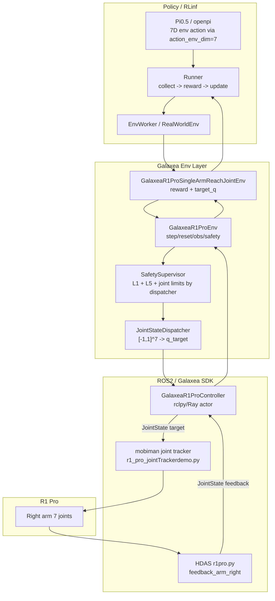
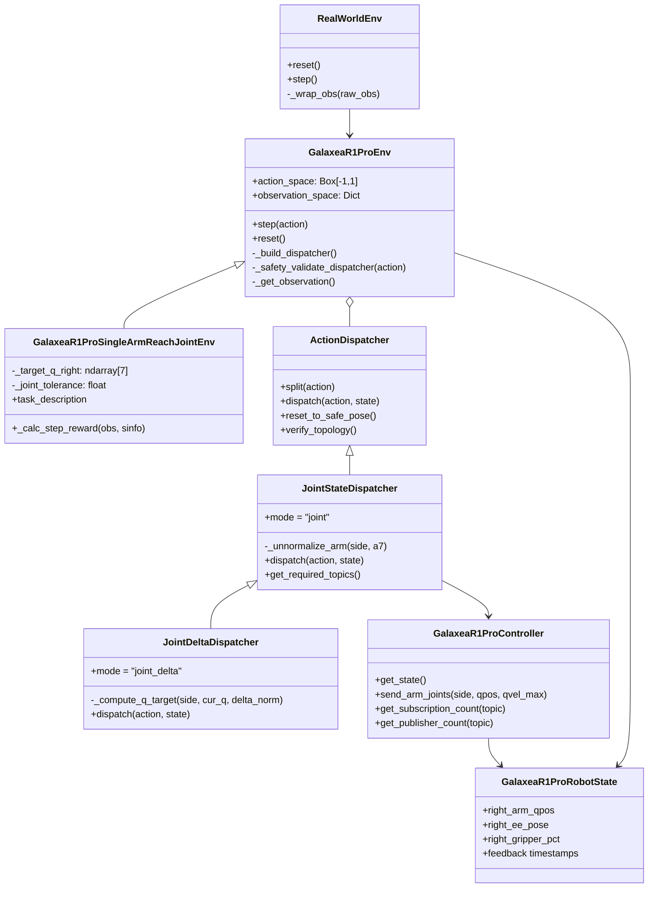
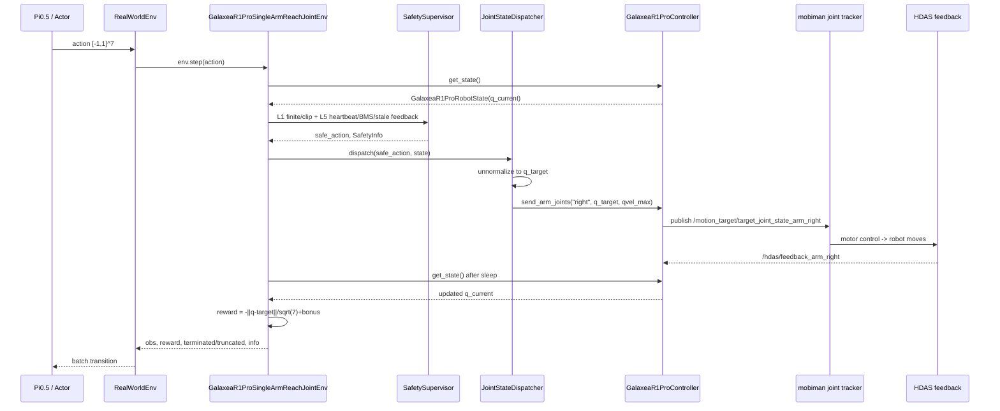
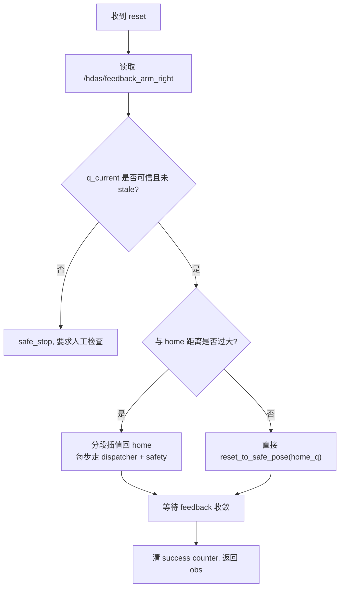
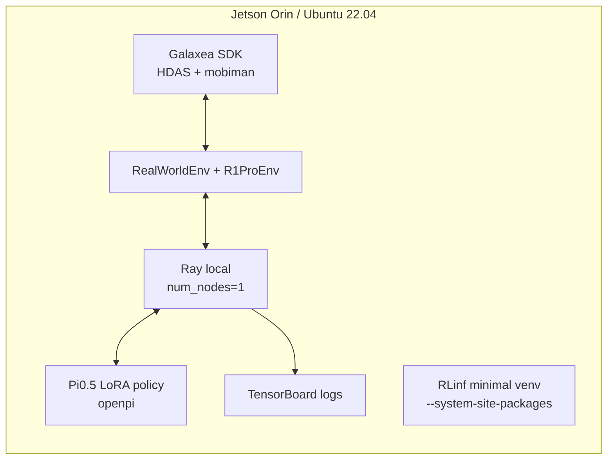
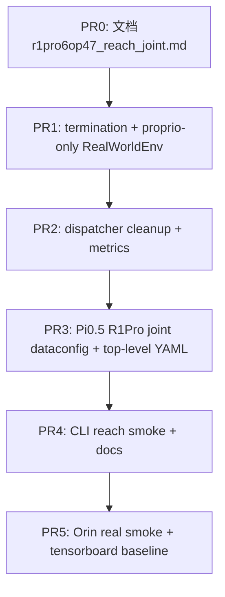
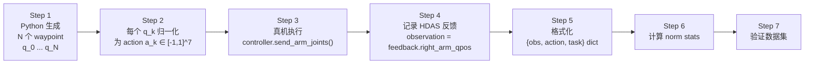

# Galaxea R1 Pro SingleArmReach Joint Mode 细化设计与实施方案

> 本文是 `r1pro6op47.md` 中 `§10.2 M1 - SingleArmReachEnv joint mode (~3-4 周)` 的展开版。目标不是再写一个宏观蓝图，而是把第一个能落地的 R1 Pro 真机强化学习任务讲清楚：为什么先做右臂关节空间到达、怎样接入 RLinf、怎样用 Pi0.5、怎样在 Orin 上安全运行、怎样逐步验收。

---

## 0. 结论先行

`SingleArmReachEnv joint mode` 是 R1 Pro 接入 RLinf 真机 RL 的第一个任务，推荐把它定义为：

- Gym ID: `GalaxeaR1ProSingleArmReach-joint-v1`
- 机器人范围: 仅右臂 7 个关节，关闭左臂、torso、chassis、gripper
- observation: 以 proprio 为主，至少包含 `right_arm_qpos`，当前基类也会包含 `right_ee_pose` 等状态项；所有进入策略的连续状态在模型 dataconfig / transform 中归一化。若使用现有 Pi0.5/OpenPI 视觉接口，则 M1 可以喂一张固定 dummy image 或一帧低频 wrist image，但 reward 与控制闭环不得依赖图像
- action: 7 维，`[-1, 1]^7`，表示右臂 7 个关节的目标位置
- ROS2 feedback topic: `/hdas/feedback_arm_right`
- ROS2 command topic: `/motion_target/target_joint_state_arm_right`
- reward: 关节空间距离 `-||q - q_target||_2 / sqrt(7)` + 容差内 sparse bonus
- policy/VLA: 必须使用 Pi0.5，也就是 RLinf 中 `model_type: "openpi"`，并用 R1 Pro joint 专用 dataconfig 将 Pi0.5 的 padded action 对齐到 7D env action

M1 任务故意不依赖相机、不依赖 gripper、不依赖 relaxed_ik。这里的“不依赖相机”指任务成功、reward 和安全闭环不需要视觉；如果 Pi0.5 入口暂时要求 image tensor，可以用 dummy image 作为模型兼容层，而不是把视觉变成任务条件。它先验证“RLinf -> safety -> dispatcher -> mobiman joint tracker -> HDAS feedback -> reward”这条最短闭环。只有这条闭环稳定，后续才值得叠加 gripper、末端位姿、视觉和更复杂任务。

---

## 1. 事实边界与资料来源

本文以本机代码为准，辅以 Galaxea 官方 ROS2 文档和本机 SDK 交叉确认。

### 1.1 本地代码事实

| 事实 | 本地来源 |
|---|---|
| Gym ID 已注册为 `GalaxeaR1ProSingleArmReach-joint-v1` | `rlinf/envs/realworld/galaxear/tasks/__init__.py` |
| 任务类为 `GalaxeaR1ProSingleArmReachJointEnv` | `rlinf/envs/realworld/galaxear/tasks/r1_pro_single_arm_reach_joint.py` |
| joint 绝对模式 env YAML 已存在 | `examples/embodiment/config/env/realworld_galaxea_r1_pro_singlearm_reach_joint.yaml` |
| joint delta 子模式 env YAML 已存在 | `examples/embodiment/config/env/realworld_galaxea_r1_pro_singlearm_reach_joint_delta.yaml` |
| dummy 顶层训练配置已存在 | `examples/embodiment/config/realworld_dummy_galaxea_r1_pro_singlearm_reach_joint.yaml` |
| Pi0.5 joint model YAML 已存在 | `examples/embodiment/config/model/pi0_5_r1pro_single_arm_joint.yaml` |
| Pi0.5 joint delta model YAML 已存在 | `examples/embodiment/config/model/pi0_5_r1pro_single_arm_joint_delta.yaml` |
| RLinf 模型名应写作 `openpi` | `rlinf/config.py` 的 `SupportedModel.OPENPI = ("openpi", "embodied")` |
| RLinf env type 应写作 `realworld` | `rlinf/envs/__init__.py` 的 `SupportedEnvType.REALWORLD = "realworld"` |

### 1.2 Galaxea ROS2 与 SDK 事实

Galaxea 官方 ROS2 文档和 `/home/nvidia/galaxea/install` 均确认：

| 功能 | Topic | Message |
|---|---|---|
| 右臂关节反馈 | `/hdas/feedback_arm_right` | `sensor_msgs/msg/JointState` |
| 左臂关节反馈 | `/hdas/feedback_arm_left` | `sensor_msgs/msg/JointState` |
| 右臂关节目标 | `/motion_target/target_joint_state_arm_right` | `sensor_msgs/msg/JointState` |
| 左臂关节目标 | `/motion_target/target_joint_state_arm_left` | `sensor_msgs/msg/JointState` |
| 右夹爪目标 | `/motion_target/target_position_gripper_right` | `sensor_msgs/msg/JointState`, `position=[0,100]` |
| 右臂 EE 目标 | `/motion_target/target_pose_arm_right` | `geometry_msgs/msg/PoseStamped` |
| 右臂 EE 反馈 | `/motion_control/pose_ee_arm_right` | `geometry_msgs/msg/PoseStamped` |

M1 只使用 joint tracker，不使用 relaxed_ik。官方启动命令对应：

```bash
source /home/nvidia/galaxea/install/setup.bash
ros2 launch HDAS r1pro.py
ros2 launch mobiman r1_pro_jointTrackerdemo.py
```

如果后续要做 EE pose 模式，才需要启动：

```bash
ros2 launch mobiman r1_pro_right_arm_relaxed_ik_launch.py
ros2 launch mobiman r1_pro_jointTrackerdemo_launch.py
```

---

## 2. 为什么 M1 必须先做 Joint Reach

R1 Pro 真机 RL 的风险不在算法，而在闭环耦合：ROS2 domain、SDK overlay、HDAS feedback、mobiman 控制节点、限位、安全停机、RLinf worker、模型 action layout 任一环节错了，表面上都可能表现为“训练没学会”。

Joint reach 把这些变量压到最低：

| 选择 | 直接收益 |
|---|---|
| 只控右臂 7 关节 | 不碰双臂碰撞、torso、chassis、全身协调 |
| 不控 gripper | 不引入 `[0,100]` 行程标定、夹爪卡滞、动作耦合 |
| 不用相机 | 不引入 RealSense/GMSL、图像延迟、frame drop、GPU 解码 |
| 不用 EE pose / IK | 避免 relaxed_ik 未启动或解算失败导致的“发布成功但机器人不动” |
| reward 直接由关节反馈计算 | 不需要 reward worker，也不依赖视觉判别 |
| action 7D 连续空间 | Pi0.5 / SAC / PPO 都容易调试，日志也直观 |

M1 的验收不是“拿最高性能”，而是证明真机 RL 的最短链路能稳定跑 100 step episode，能安全停止，能重复 reset，能从 random / SFT / RL 微调中看到关节误差下降。

---

## 3. 任务定义

### 3.1 初始姿态与目标

默认配置：

```yaml
home_q_right:   [0.0, 0.0, 0.0, 0.0, 0.0, 0.0, 0.0]
target_q_right: [0.5, 0.5, 0.0, -1.2, 0.0, 1.5, 0.0]
joint_tolerance_rad: 0.05
success_hold_steps: 5
max_episode_steps: 100
step_frequency: 10.0
```

这个 target 设计成“从 home 出发、小幅移动、避开极限、肉眼可见”。它不追求任务复杂度，而追求可诊断性：

- J1/J2/J4/J6 有变化，能肉眼看到右臂从 home 过渡到目标；
- J3/J5/J7 保持 0，减少 wrist 端姿态复杂性；
- 距离 joint limit 有余量，方便 early bring-up；
- 10 Hz 下 100 step 是 10 秒，一个 episode 足够观察轨迹，也不会长时间占用真机。

### 3.2 Observation

底层环境 `GalaxeaR1ProEnv` 生成 Gym observation：

```python
{
    "state": {
        "right_arm_qpos": np.ndarray shape=(7,),
        "right_ee_pose": np.ndarray shape=(7,),
        ...
    }
    # cameras=[] 时不包含 "frames"
}
```

M1 的 reward 只依赖 `right_arm_qpos`。但策略输入可以保留 `right_ee_pose`，因为它来自正向运动学/pose feedback，有助于后续从 joint reach 平滑过渡到 EE reach。不过训练配置要明确：

- 若用轻量 CNN/MLP dummy 策略，`actor.model.state_dim` 当前 dummy 配置为 `14`，即 `right_arm_qpos(7) + right_ee_pose(7)`；
- 若用 Pi0.5，dataconfig 必须把 proprio 字段顺序固定下来，建议第一版只用 `right_arm_qpos`，第二版再加入 `right_ee_pose`；
- 所有连续 proprio 在进入模型前应由 norm stats 归一化，不要把 raw rad 直接塞进 VLA 而 action 又是 `[-1,1]`，否则训练尺度不一致。

> 注意：`cameras: []` 时 `GalaxeaR1ProEnv` 会省略 `frames`，但 `RealWorldEnv._wrap_obs` 当前仍假定存在 `raw_obs["frames"][main_image_key]`。所以 M1 需要二选一：要么补 `RealWorldEnv` 的 proprio-only 分支，要么在训练入口临时提供 dummy image key。设计上推荐前者，因为 M1 本来就是无相机任务。

### 3.3 Action

绝对 joint mode:

```text
a in [-1,1]^7
q_target[i] = q_min[i] + (a[i] + 1) * 0.5 * (q_max[i] - q_min[i])
```

`JointStateDispatcher` 将 `q_target` 写入：

```text
/motion_target/target_joint_state_arm_right.position = q_target[0:7]
/motion_target/target_joint_state_arm_right.velocity = arm_qvel_max
```

默认限位与速度：

```yaml
arm_q_min_right: [-4.35, -3.04, -2.26, -1.99, -2.26, -0.95, -1.47]
arm_q_max_right: [ 1.21,  0.07,  2.26,  0.25,  2.26,  0.95,  1.47]
arm_qvel_max:    [ 3.0,   3.0,   3.0,   3.0,   5.0,   5.0,   5.0]
```

joint delta 子模式也可用于 M1+：

```text
delta_rad[i] = clip(a[i], -1, 1) * joint_delta_scale_right[i]
q_target[i] = clip(q_current[i] + delta_rad[i], q_min[i], q_max[i])
```

但第一轮 M1 推荐先用绝对 joint mode。原因是 CLI、单元测试、SFT 数据和安全验收都更直观：操作员输入“目标关节角”，机器人就去那个角度。等绝对模式稳定后，再切换 `joint_delta_mode: true` 做更适合 RL 微调的局部动作。

### 3.4 Reward 与 termination

当前任务代码：

```python
q = np.asarray(self._state.right_arm_qpos, dtype=np.float32).reshape(7)
diff = q - self._target_q_right
l2 = float(np.linalg.norm(diff))
dense = -l2 / np.sqrt(7.0)
bonus = 1.0 if l2 < self._joint_tolerance else 0.0
```

推荐正式设计语义：

```text
is_success = ||q - q_target||_2 < joint_tolerance_rad
reward = -||q - q_target||_2 / sqrt(7) + 1.0 * is_success
terminated = success_hold_counter >= success_hold_steps
truncated = step_count >= max_episode_steps or safe_stop or emergency_stop
```

当前基类 `GalaxeaR1ProEnv.step` 的 termination 还要求 `reward >= 1.0`。由于 `dense` 在容差内仍可能略小于 0，`reward` 很可能小于 1.0，导致“进了容差并 hold 住”但 `terminated` 不触发。M1 实施时应修正为 task success flag 驱动，或在 joint 任务中覆盖 termination 逻辑。否则训练可继续依赖 `max_episode_steps` 截断，但成功率指标会不准。

---

## 4. 系统架构

### 4.1 分层图



### 4.2 类关系



### 4.3 单步控制序列



---

## 5. 配置设计

### 5.1 Env YAML

第一版 M1 使用：

```yaml
defaults:
  - env/realworld_galaxea_r1_pro_singlearm_reach_joint@env.train
  - env/realworld_galaxea_r1_pro_singlearm_reach_joint@env.eval
```

核心字段：

```yaml
env_type: realworld
main_image_key: null
no_gripper: true

init_params:
  id: GalaxeaR1ProSingleArmReach-joint-v1
  override_cfg:
    use_joint_mode: true
    use_right_arm: true
    use_left_arm: false
    use_torso: false
    use_chassis: false
    no_gripper: true
    ros_domain_id: ${oc.env:ROS_DOMAIN_ID,41}
    galaxea_install_path: /home/nvidia/galaxea/install
    mobiman_launch_mode: joint
    home_q_right: [0.0, 0.0, 0.0, 0.0, 0.0, 0.0, 0.0]
    target_q_right: [0.5, 0.5, 0.0, -1.2, 0.0, 1.5, 0.0]
    joint_tolerance_rad: 0.05
    step_frequency: 10.0
    success_hold_steps: 5
    cameras: []
```

注意 `ROS_DOMAIN_ID` 不应硬编码为 72。本机现场常见值是 41，但最终以 `printenv ROS_DOMAIN_ID` 和 DDS 可见性为准。

### 5.2 Pi0.5 Model YAML

Pi0.5 对应 RLinf 模型名是 `openpi`：

```yaml
model_type: "openpi"
model_path: "/path/to/checkpoints/pi05_r1pro_singlearm_reach_joint"
num_action_chunks: 4
action_dim: 7
is_lora: true
lora_rank: 16
use_proprio: true

openpi:
  config_name: "pi05_r1pro_single_arm_joint"
  num_images_in_input: 1
  action_chunk: ${actor.model.num_action_chunks}
  action_env_dim: ${actor.model.action_dim}
```

这里有两个容易犯错的点：

1. Pi0.5 内部 action head 通常是 padded action 空间，不能把 checkpoint 输出直接当 R1 Pro 7 关节。必须通过 `openpi.action_env_dim: 7` 和 R1 Pro 专用 dataconfig 截取/解释前 7 维，并保证训练数据中的 action 也是同一语义。
2. 现有 `pi0_5_r1pro_single_arm_joint.yaml` 写的是 `num_images_in_input: 1`。这不代表 M1 reward 依赖相机，而是 OpenPI 视觉接口需要 image slot。M1 第一版可以在 dataconfig 中填固定 dummy image；若现场希望尽早验证 wrist camera，也可以接一帧低频右腕 RGB，但不得让图像路径阻塞 joint reach 闭环。

### 5.3 绝对模式与 delta 模式切换

M1 首轮：

```yaml
use_joint_mode: true
joint_delta_mode: false
```

M1+ 微调：

```yaml
use_joint_mode: true
joint_delta_mode: true
joint_delta_scale_right: [0.10, 0.10, 0.10, 0.10, 0.20, 0.20, 0.20]
```

两者共用同一个 task class 和 Gym ID，区别只在 dispatcher 语义：

| 模式 | policy 输出 | dispatcher 行为 | 适合阶段 |
|---|---|---|---|
| absolute joint | 绝对目标关节，归一化到 `[-1,1]` | 映射到 `[q_min, q_max]` | CLI、SFT、第一轮真机 smoke |
| joint delta | 每步关节增量，归一化到 `[-1,1]` | `q_current + delta * scale` | RL fine-tune、局部探索 |

---

## 6. Pi0.5 数据与动作空间设计

### 6.1 SFT 数据格式

最小 SFT 样本建议包含：

```python
{
    "observation": {
        "right_arm_qpos": [q1, ..., q7],
        # 可选: "right_ee_pose": [x,y,z,qx,qy,qz,qw],
        # 可选: "wrist_image_right": image
    },
    "action": [a1, ..., a7],  # normalized absolute joint target
    "task": "Move the right arm to the target joint configuration."
}
```

第一批数据不必来自人类遥操作，可以来自脚本化轨迹：

```text
home_q -> linear interpolation in joint space -> target_q
```

每个 waypoint 先通过 CLI / dispatcher 真实下发，再记录 HDAS feedback，避免“仿真轨迹”和真机实际 tracking 存在系统偏差。

### 6.2 Norm stats

M1 至少要有两套 norm：

| 名称 | 维度 | 来源 | 用途 |
|---|---:|---|---|
| `state.right_arm_qpos` | 7 | HDAS feedback 或 YAML limit | Pi0.5 proprio normalization |
| `action.right_arm_qtarget` | 7 | `arm_q_min_right/max_right` 或 demo action | Pi0.5 action normalization |

推荐 action normalization 与 dispatcher 保持一致：

```text
norm(q) = 2 * (q - q_min) / (q_max - q_min) - 1
unnorm(a) = q_min + (a + 1) * 0.5 * (q_max - q_min)
```

这样 Pi0.5 输出的 `[-1,1]` 可以直接进入 `JointStateDispatcher`，不需要额外转换层。

### 6.3 为什么不要直接复用 Franka 7D

Franka 示例里的 7D 常见语义是 EE delta + gripper，R1 Pro M1 的 7D 是右臂绝对关节。两者维度相同，但含义完全不同。把 Franka 7D checkpoint 直接接到 R1 Pro joint dispatcher，会把“末端位姿增量”误解释为“目标关节角”，这是最危险的一类 silent failure。

---

## 7. 安全设计

M1 的安全边界分四层。

### 7.1 启动前环境隔离

```bash
export ROS_DOMAIN_ID=41
export RMW_IMPLEMENTATION=rmw_cyclonedds_cpp
export CYCLONEDDS_URI=file:///home/nvidia/cyclone_dds.xml  # 如现场使用
source /opt/ros/humble/setup.bash
source /home/nvidia/galaxea/install/setup.bash
```

Galaxea 官方文档强调 ROS2 默认会在局域网发现其它主机进程。真机训练时必须确认 domain、网卡和 CycloneDDS 配置，不允许多个未隔离控制程序同时发布目标关节。

### 7.2 Topology check

joint M1 的 required topology：

| 检查对象 | 期望 |
|---|---|
| `/motion_target/target_joint_state_arm_right` | 至少 1 个 subscriber，即 mobiman joint tracker |
| `/hdas/feedback_arm_right` | 至少 1 个 publisher，即 HDAS |
| `/motion_target/target_position_gripper_right` | M1 `no_gripper=true` 时不要求 |
| `/motion_control/pose_ee_arm_right` | M1 reward 不依赖，但若 observation 包含 EE pose，建议监控 |

CLI 推荐：

```bash
python toolkits/realworld_check/test_galaxea_r1_pro_cli_controller.py \
  --backend rclpy \
  --use-joint-mode --use-right-arm --no-gripper \
  --ros-domain-id ${ROS_DOMAIN_ID:-41} \
  --strict-topo --topo-discovery-timeout-s 8
```

`--topo-discovery-timeout-s` 用来等待 ROS2 DDS discovery 收敛。若 8 秒后仍然 `pubs=0` 或 `subs=0`，应认为 SDK 节点或 domain 配置有问题，而不是训练算法问题。

### 7.3 Action safety

Dispatcher-mode 当前安全路径做：

- L1: NaN/Inf 拒绝，action clip 到 `[-1,1]`
- L5: heartbeat、BMS、feedback stale、status error、遥控器模式等系统级检查
- joint limit: 由 `JointStateDispatcher` 的 `q_min/q_max` 映射保证
- velocity envelope: `JointState.velocity = arm_qvel_max`

M1 实施建议补齐：

1. 移除 `JointStateDispatcher._unnormalize_arm` 内的调试 `print`，避免 10 Hz 以上控制时刷屏。
2. 对 absolute joint mode 增加显式 per-step delta cap，避免策略从一个极限直接跳到另一个极限。即使 mobiman velocity 会限速，RL 环境也应先做动作平滑。
3. 将 safety metrics 写入 logger：`safe_stop_count`、`feedback_stale_ms`、`action_clip_ratio`、`joint_limit_clip_count`。

### 7.4 Reset safety

`reset()` 不应直接假设机器人在 home。推荐顺序：



第一版可先用 `reset_to_safe_pose(home_q_right)`，但真机部署前建议改成“分段回 home”，尤其是训练中断、急停恢复后。

---

## 8. Orin-only 训练与推理方案

M1 是 Orin-only 最适合的任务，因为它没有相机和大 reward model。最小部署：



推荐安装：

```bash
cd /home/nvidia/lg_ws/RL/RLinf
bash requirements/install.sh embodied --env galaxea_r1_pro_orin
source .venv/bin/activate
```

资源策略：

| 项 | Orin-only 推荐 |
|---|---|
| env count | `total_num_envs: 1` |
| rollout | local huggingface/openpi，不启 vLLM/SGLang |
| Pi0.5 | LoRA，`lora_rank: 16` 或更低 |
| action chunks | `num_action_chunks: 4` 起步 |
| images | M1 任务语义关闭；若 OpenPI 入口需要 image slot，用 dummy image 或低频 1 路 wrist，不让视觉影响 reward/safety |
| replay buffer | 小窗口，先 `cache_size: 200-1000` |
| precision | 继承 JetPack torch / openpi dtype，避免 pip 重装 torch |
| logging | tensorboard 本地，视频关闭 |

M1 不建议一开始在 Orin 上做大规模 RL。更稳的路线是：

1. Orin 上跑 CLI / dummy / env smoke；
2. GPU 机上做 Pi0.5 SFT 或预训练；
3. Orin 上做短 episode eval；
4. 若 VRAM 允许，再做 LoRA 小步 RL 微调。

---

## 9. 实施路线

### Phase 0: 代码事实与预检

目标：确认不是 ROS2 / SDK / domain 问题。

```bash
printenv ROS_DOMAIN_ID
source /opt/ros/humble/setup.bash
source /home/nvidia/galaxea/install/setup.bash
ros2 topic info /hdas/feedback_arm_right -v
ros2 topic info /motion_target/target_joint_state_arm_right -v
```

通过标准：

- `/hdas/feedback_arm_right` 有 publisher；
- `/motion_target/target_joint_state_arm_right` 在 joint tracker 启动后有 subscriber；
- CLI `--strict-topo` 通过；
- `state` 命令能看到非 stale 的右臂关节反馈。

### Phase 1: CLI 右臂单点控制

目标：不用 RL，不用 Pi0.5，只验证 dispatcher 和安全。

```bash
python toolkits/realworld_check/test_galaxea_r1_pro_cli_controller.py \
  --backend rclpy \
  --use-joint-mode --use-right-arm --no-gripper \
  --gripper-min-pct 0 --gripper-max-pct 90 \
  --strict-topo --topo-discovery-timeout-s 8
```

REPL 中：

```text
state
home
j r 0.0 0.3 0.0 -1.5 0.0 1.8 0.0
j r 0.5 0.5 0.0 -1.2 0.0 1.5 0.0
brake on
brake off
```

通过标准：

- 右臂实际运动方向与关节目标一致；
- feedback 中 `right_arm_qpos` 距 target 逐步变小；
- brake 生效；
- 无 gripper 误动作。

### Phase 2: Dummy Gym / Unit Tests

目标：不接真机，验证 task 注册、action dim、reward、YAML。

```bash
PYTEST_DISABLE_PLUGIN_AUTOLOAD=1 pytest \
  tests/unit_tests/test_galaxea_r1_pro_single_arm_reach_joint.py \
  tests/unit_tests/test_galaxea_r1_pro_yaml_configs.py \
  tests/unit_tests/test_galaxea_r1_pro_joint_delta_dispatcher.py \
  tests/unit_tests/test_galaxea_r1_pro_cli_joint_delta.py \
  -v
```

通过标准：

- `GalaxeaR1ProSingleArmReach-joint-v1` 可 `gym.make`；
- action space 是 `(7,)`；
- `use_joint_mode=True`、`no_gripper=True`；
- joint delta YAML 能加载；
- CLI delta / absolute 语义不互相破坏。

### Phase 3: RealWorldEnv Proprio-only 修补

目标：让无相机 M1 能走完整 RLinf runner。

当前风险：`RealWorldEnv._wrap_obs` 假设 `raw_obs["frames"]` 存在。M1 `cameras: []` 时底层 env 已正确省略 `frames`，但外层包装仍会访问 `raw_obs["frames"]`。

推荐修补语义：

```python
def _wrap_obs(self, raw_obs):
    obs = {}
    raw_states = OrderedDict(sorted(raw_obs["state"].items()))
    obs["states"] = np.concatenate(list(raw_states.values()), axis=-1)

    frames = raw_obs.get("frames", {})
    if self.main_image_key is not None:
        if self.main_image_key not in frames:
            raise KeyError(...)
        obs["main_images"] = frames[self.main_image_key]
        ...

    obs = to_tensor(obs)
    obs["task_descriptions"] = self.task_descriptions
    return obs
```

这样 `main_image_key: null` 才真正表示 proprio-only，而不是“配置上无相机但代码仍强制要图像”。

### Phase 4: SAC/MLP 或 CNN baseline

目标：先用轻模型验证 RL loop，不急着上 Pi0.5。

已有 dummy 配置：

```bash
export EMBODIED_PATH=/home/nvidia/lg_ws/RL/RLinf/examples/embodiment
python examples/embodiment/train_embodied_agent.py \
  --config-name realworld_dummy_galaxea_r1_pro_singlearm_reach_joint
```

真机 baseline 可从该配置复制，替换：

- `is_dummy: false`
- `step_frequency: 10.0`
- `max_num_steps: 100`
- `runner.max_steps` 从很小开始，例如 200-500
- logging 开 tensorboard，视频关闭

### Phase 5: Pi0.5 SFT

目标：让 Pi0.5 先模仿安全的 joint reach 轨迹。

数据来源：

1. 脚本生成 joint interpolation；
2. CLI 下发并记录 HDAS feedback；
3. 将 `(obs_t, action_t, task_description)` 转成 OpenPI dataconfig 所需格式；
4. 计算 norm stats；
5. SFT 训练 LoRA checkpoint。

Pi0.5 配置使用：

```yaml
defaults:
  - model/pi0_5_r1pro_single_arm_joint@actor.model
```

验收：

- 离线 eval 中 action dim 为 7；
- 输出 action 数值主要落在 `[-1,1]`；
- unnormalize 后目标关节不越界；
- 真机 rollout 的 `||q-target||` 单调下降或至少明显优于 random。

### Phase 6: Pi0.5 RL fine-tune

目标：在 SFT checkpoint 上做小步 RL。

建议先使用 absolute joint mode：

- 更容易将策略输出解释为目标；
- failure 可以用 CLI 复现；
- replay 中 action 与 task target 语义一致。

稳定后再试 joint delta：

- `joint_delta_mode: true`
- `joint_delta_scale_right` 从保守值开始；
- RL 的探索会更局部，急剧大跳更少；
- 但 reward 到达目标需要多步积分，episode 长度和 action chunk 要重新调。

---

## 10. 测试矩阵

| 层级 | 测试 | 目的 | 命令/方法 |
|---|---|---|---|
| Unit | task 注册 | Gym ID 不丢 | `pytest tests/unit_tests/test_galaxea_r1_pro_single_arm_reach_joint.py -v` |
| Unit | action dim | joint/no_gripper 为 7D | 同上 |
| Unit | reward | target 处 reward > far | 同上 |
| Unit | YAML | env YAML 键名与构造正确 | `pytest tests/unit_tests/test_galaxea_r1_pro_yaml_configs.py -v` |
| Unit | dispatcher | abs/delta factory 与映射 | `pytest tests/unit_tests/test_galaxea_r1_pro_joint_delta_dispatcher.py -v` |
| CLI | dummy | 无 ROS 也能跑 REPL | `--backend dummy --strict-topo` |
| CLI | rclpy topo | DDS/HDAS/mobiman 可见 | `--backend rclpy --strict-topo` |
| CLI | home/target | 真机能从 home 到 target | `home`, `j r ...` |
| Env smoke | dummy runner | RLinf runner 不崩 | dummy config |
| Env smoke | real runner | 真机 1 episode 无安全事故 | `max_steps` 很小 |
| Model | Pi0.5 action | action_env_dim=7 | 离线 forward / rollout |
| Safety | stale feedback | HDAS 断开能 safe_stop | 停 HDAS 或隔离 domain |
| Safety | joint limit | 越界 action 被 clip | CLI / unit |

---

## 11. 指标与日志

M1 最重要的指标：

```text
joint_l2 = ||right_arm_qpos - target_q_right||_2
joint_linf = max_i |q_i - target_i|
success = joint_l2 < joint_tolerance_rad
success_hold_counter
action_clip_ratio
feedback_age_ms
safe_stop_count
episode_return
episode_length
```

建议 TensorBoard 曲线：

- `env/joint_l2`
- `env/joint_linf`
- `env/success`
- `env/success_hold_counter`
- `safety/feedback_age_ms`
- `safety/action_clip_ratio`
- `train/episode_return`
- `time/env_step_ms`

如果只能看一个指标，看 `env/joint_l2`。它应该在每个 episode 内下降；如果不下降，先查 action unnormalize 和 mobiman topology，不要先调算法。

---

## 12. 常见失败与排查

| 现象 | 首先怀疑 | 排查 |
|---|---|---|
| CLI 发布后机器人不动 | mobiman joint tracker 没订阅 | `ros2 topic info /motion_target/target_joint_state_arm_right -v` |
| topo 报 `/hdas/feedback_arm_right pubs=0` | HDAS 没启动或 domain 不同 | `ros2 topic list | grep hdas`、`printenv ROS_DOMAIN_ID` |
| topo 第一次失败但稍后正常 | DDS discovery 慢 | 加 `--topo-discovery-timeout-s 8` |
| reward 一直不变 | feedback 没更新或 `_state` stale | 看 `feedback_age_ms`、`state` 命令 |
| 训练不 done | termination 仍绑定 `reward >= 1.0` | 改成 success flag / hold counter |
| runner 在无相机时报 `frames` KeyError | `RealWorldEnv._wrap_obs` 未支持 proprio-only | 补 `raw_obs.get("frames", {})` 分支 |
| Pi0.5 输出形状不对 | `action_env_dim` / dataconfig 错 | 检查 `actor.model.action_dim=7` |
| 右臂向危险方向跳 | absolute action 大跨度 | 增加 per-step cap 或先用 delta |
| gripper 意外动 | `no_gripper` 没贯穿 | 检查 env YAML、CLI flag、dispatcher per_arm_dim |

---

## 13. 代码改动清单

### 13.1 必做

1. **修正 success termination**
   - 文件：`rlinf/envs/realworld/galaxear/r1_pro_env.py` 或 task 子类
   - 目标：不要用 `reward >= 1.0` 推断 success；改为 task 显式 success / hold counter

2. **支持 RealWorldEnv proprio-only**
   - 文件：`rlinf/envs/realworld/realworld_env.py`
   - 目标：`main_image_key: null` 且无 `frames` 时，只返回 `states` 和 `task_descriptions`

3. **去掉 dispatcher 调试 print**
   - 文件：`rlinf/envs/realworld/galaxear/r1_pro_action_dispatcher.py`
   - 目标：`_unnormalize_arm` 不再打印 action/q_min/q_max

4. **补 M1 real Pi0.5 顶层配置**
   - 建议新增：`examples/embodiment/config/realworld_galaxea_r1_pro_singlearm_reach_joint_pi05.yaml`
   - defaults: env joint + model Pi0.5 + Orin-friendly runner

5. **补 OpenPI R1 Pro dataconfig**
   - 建议位置：`rlinf/models/embodiment/openpi/`
   - config names: `pi05_r1pro_single_arm_joint`, `pi05_r1pro_single_arm_joint_delta`
   - 目标：固定 proprio/action 字段、norm stats、action_env_dim=7

### 13.2 应做

1. reset 分段回 home；
2. absolute joint mode 增加 per-step delta cap；
3. logger 增加 joint_l2 / feedback_age / action_clip；
4. 真机 smoke 脚本自动记录 ROS2 topic info；
5. CLI 增加 `reach` 快捷命令：一键 home -> target -> state -> brake。

### 13.3 暂不做

1. 双臂；
2. gripper；
3. torso/chassis；
4. 视觉 reward；
5. EE pose / relaxed_ik；
6. full Pi0.5 大规模在线训练。

这些都属于 M2/M3 以后。M1 的价值是把最短闭环跑稳。

---

## 14. 推荐 PR 拆分



每个 PR 都应可独立验证。不要把 Pi0.5 dataconfig、真机 runner、safety reset、文档一次性塞进同一个 PR，否则 review 很难判断问题来自哪一层。

---

## 15. 验收标准

### 15.1 软件验收

- `pytest tests/unit_tests/test_galaxea_r1_pro_single_arm_reach_joint.py -v` 通过；
- `pytest tests/unit_tests/test_galaxea_r1_pro_yaml_configs.py -v` 通过；
- `pytest tests/unit_tests/test_galaxea_r1_pro_joint_delta_dispatcher.py -v` 通过；
- dummy runner 能跑完 100 step；
- proprio-only `RealWorldEnv` 不再访问不存在的 `frames`；
- Pi0.5 forward 输出 action shape `[B, action_chunk, 7]` 或可安全截取到 7。

### 15.2 真机验收

- `--strict-topo` 通过；
- CLI home 和 target 各跑 5 次，无异常 brake；
- 每次 target 后 `joint_l2 < 0.10 rad`，稳定后收紧到 `< 0.05 rad`；
- feedback stale 不超过 `200 ms`；
- emergency/safe stop 能在一个 step 内阻断 dispatch；
- 训练或 eval 过程中 gripper、左臂、torso、chassis 均不动作。

### 15.3 RL 验收

- random policy 的 `joint_l2` 不稳定或较大；
- SFT policy 的 `joint_l2` 明显下降；
- RL fine-tune 后 episode return 提升；
- 至少 10 个连续 episode 无安全触发；
- 成功率指标基于 explicit success flag，而不是 reward 阈值猜测。

---

## 16. 与 `r1pro6op47.md` 的关系

`r1pro6op47.md` 仍是总设计；本文只细化 `§10.2 M1`。后续建议在总文档对应章节加一句链接：

```markdown
详细实施方案见 [r1pro6op47_reach_joint.md](r1pro6op47_reach_joint.md)。
```

本文的原则可以复用到 M2/M3，但不要直接复制动作空间。M2 EE pose 用 `/motion_target/target_pose_arm_right` 和 quaternion；M3 pick/place 才重新引入 gripper `[0,100] -> [-1,1]`。

---

## 17. 参考索引

- `bt/docs/rwRL/r1pro6op47.md`
- `bt/docs/rwRL/glx/mismatch_realworld_1.md`
- `bt/docs/rwRL/glx/R1ProSDKAnalysis.md`
- `bt/docs/rwRL/Pi05_ActionSpace_Analysis.md`
- `docs/source-en/rst_source/publications/rlinf_user.rst`
- `docs/source-en/rst_source/examples/embodied/franka.rst`
- `docs/source-en/rst_source/examples/embodied/xsquare_turtle2.rst`
- `rlinf/envs/realworld/galaxear/tasks/r1_pro_single_arm_reach_joint.py`
- `rlinf/envs/realworld/galaxear/r1_pro_env.py`
- `rlinf/envs/realworld/galaxear/r1_pro_action_dispatcher.py`
- `rlinf/envs/realworld/realworld_env.py`
- Galaxea R1 Pro ROS2 文档: `https://docs.galaxea-dynamics.com/zh/Guide/R1Pro/software_introduction/ros2/R1Pro_Software_Introduction_ROS2/`


# 其它

## V1的评价

优点
    工程思维扎实。文档的核心判断——"R1 Pro 真机 RL 的风险不在算法，而在闭环耦合"——非常正确。M1 任务故意砍掉相机、gripper、IK、双臂等所有可变因素，只验证最短控制闭环，这是工业机器人 RL 落地的正确策略。很多团队在这一步就栽了：一开始就上视觉+末端控制+复杂任务，出了问题根本无法定位是哪一层。

    安全设计四层分明（环境隔离、拓扑检查、动作安全、复位安全），对真机场景的 DDS domain 隔离、feedback stale 检测、joint limit clip 等关键风险都有明确对策。Reset 安全的流程图（先读反馈、判断可信度、分段回 home）体现了对真机工况的理解。

    可诊断性贯穿全文。从"如果只能看一个指标，看 joint_l2"到故障排查表（§12），再到 PR 拆分策略（§14），都在服务一个目标：出了问题能定位到具体层。

    Pi0.5 集成的两个坑讲得明白：padded action 截取必须通过 action_env_dim: 7 + 专用 dataconfig，以及不能复用 Franka 7D checkpoint（语义完全不同）。

可改进之处
    reward 设计偏简单。-||q - q_target||_2 / sqrt(7) + sparse bonus 对 RL 微调可能不够——dense 项在远处梯度信号弱，sparse bonus 跳变大。可以考虑 per-joint 加权（近端关节力矩大、影响大）或指数形式的 dense reward。不过作为 M1 验证闭环，简单 reward 是合理选择。

    缺少对 mobiman joint tracker 延迟特性的量化分析。OCS2 MPC 10Hz + MRT 200Hz 的实际跟踪延迟、overshoot 特性会直接影响 RL 训练中 observation-action 的因果关系。10Hz env step 与 200Hz MRT 之间的时序错位如果不处理好，策略可能学到的是"延迟补偿"而非"到达控制"。

    目标采样策略太固定。固定 target_q_right 只能验证单点到达。建议在 M1 后期或 M1+ 加入 target 随机采样（在安全子空间内 uniform），否则策略只学会一条轨迹，泛化能力无法验证。

    Orin 上 Pi0.5 LoRA 的 VRAM 可行性没有给出估算。Jetson Orin 的 GPU 内存（32/64GB 共享）要同时跑 Galaxea SDK + Pi0.5 推理 + RL buffer，应该给一个粗略的内存预算。

---

# 附录 A: 脚本化轨迹 SFT 数据采集实操指南

> 本附录对应 §6.1 中提到的"脚本化轨迹 + linear interpolation in joint space"方法，给出从**轨迹生成 → 真机执行 → 数据录制 → SFT 格式导出 → norm stats 计算 → 数据验证**的完整实操步骤。

---

## A.1 总览

**目标**：在不需要人类遥操作的情况下，用脚本在关节空间中线性插值生成 `home_q → target_q → home_q` 的轨迹，在真机上执行并记录 HDAS 反馈，最终得到可直接喂给 Pi0.5 SFT 训练的数据集。

**为什么必须在真机上执行**：纯数学插值生成的 `(observation, action)` 对中，observation 是"理想"的关节角，但 R1 Pro 的 mobiman OCS2 joint tracker（MPC 10Hz + MRT 200Hz）存在跟踪延迟和 overshoot。只有记录 HDAS 真实反馈作为 observation，策略才能学会适应实际的执行动力学。

**数据流**：



**前提条件清单**：

| 条件 | 验证方法 |
|------|---------|
| Galaxea SDK 已启动（HDAS + mobiman joint tracker） | `ros2 topic list \| grep /hdas/feedback_arm_right` |
| RLinf 已安装（`pip install -e .`） | `python -c "from rlinf.envs.realworld.galaxear.r1_pro_controller import GalaxeaR1ProController"` |
| CLI 工具可用 | `python toolkits/realworld_check/test_galaxea_r1_pro_cli_controller.py --dummy` |
| 真机已通过 CLI `state` + `home` 测试 | 见 §15.2 |
| `DDS_DOMAIN_ID` 正确 | 与 Galaxea SDK 一致（通常为 0 或未设置） |

---

## A.2 关键常量

以下常量全部来自代码库，使用时**不要自行修改**，除非你明确知道机器人的 URDF 或 SafetyConfig 已被更改。

```python
import numpy as np

# ── home 位姿（关节空间弧度）──
# 来源: toolkits/realworld_check/test_galaxea_r1_pro_cli_controller.py:254-263
home_q = np.array([0.0, 0.0, 0.0, 0.0, 0.0, 0.0, 0.0], dtype=np.float32)

# ── M1 默认目标位姿 ──
# 来源: rlinf/envs/realworld/galaxear/tasks/r1_pro_single_arm_reach_joint.py:49-57
target_q = np.array([0.5, 0.5, 0.0, -1.2, 0.0, 1.5, 0.0], dtype=np.float32)

# ── 右臂关节限位（URDF - 0.1 rad 安全余量）──
# 来源: rlinf/envs/realworld/galaxear/r1_pro_safety.py:76-78
q_min = np.array([-4.35, -3.04, -2.26, -1.99, -2.26, -0.95, -1.47], dtype=np.float32)
q_max = np.array([ 1.21,  0.07,  2.26,  0.25,  2.26,  0.95,  1.47], dtype=np.float32)

# ── 关节速度上限（dispatcher 默认值）──
# 来源: rlinf/envs/realworld/galaxear/r1_pro_action_dispatcher.py:246
q_vel_max = np.array([3.0, 3.0, 3.0, 3.0, 5.0, 5.0, 5.0], dtype=np.float32)
```

**归一化公式**（必须与 `JointStateDispatcher._unnormalize_arm` 完全一致）：

```python
# 正向：弧度 → 归一化动作 [-1, 1]
# 来源: test_galaxea_r1_pro_cli_controller.py:360-369 (_q_rad_to_norm)
def q_to_norm(q_rad: np.ndarray) -> np.ndarray:
    return 2.0 * (q_rad - q_min) / (q_max - q_min) - 1.0

# 反向：归一化动作 → 弧度
# 来源: r1_pro_action_dispatcher.py:335-349 (_unnormalize_arm)
def norm_to_q(a: np.ndarray) -> np.ndarray:
    return q_min + (np.clip(a, -1.0, 1.0) + 1.0) * 0.5 * (q_max - q_min)
```

**自检**：`assert np.allclose(norm_to_q(q_to_norm(home_q)), home_q, atol=1e-5)` 必须通过。

---

## A.3 线性插值数学

### A.3.1 单条轨迹（home → target）

给定起点 `q_start` 和终点 `q_end`，在关节空间中均匀插入 `N` 个 waypoint：

```
q_waypoint[k] = q_start + (k / N) * (q_end - q_start),    k = 0, 1, ..., N
```

每个 waypoint 转换为归一化动作：

```
a_waypoint[k] = q_to_norm(q_waypoint[k])
```

### A.3.2 选择 N 的值

| 参数 | 值 | 依据 |
|------|---|------|
| env step 频率 | 10 Hz | §4.2 M1 默认配置 |
| 期望轨迹时长 | 2 秒 | 经验值：过短则跟踪误差大，过长则 episode 冗长 |
| **N = 20** | 每 100ms 一个 waypoint | 20 step × 0.1s = 2.0s |

实际跟踪延迟约 50-150ms（OCS2 MPC 一轮），所以 N=20 能让 joint tracker 平滑跟随。

### A.3.3 完整 episode：正向 + 反向

一个完整 SFT episode 由两段拼接：

```
Episode = [home → target (N=20 步)] + [target → home (N=20 步)]
```

总长 40 步，对应 4 秒。正向学"到达"，反向学"返回"。Pi0.5 的 action chunking（16 步）可以覆盖到任意连续段。

### A.3.4 多目标扩展

为防止策略过拟合到单一轨迹，建议在 `q_min + margin` 到 `q_max - margin` 范围内随机采样多个 target。§A.6 给出具体方法。

---

## A.4 分步实操

### Step 0: 安全检查

```bash
# 在 Orin 上确认 Galaxea SDK 运行中
ros2 topic echo /hdas/feedback_arm_right --once

# 用 CLI 做 home 测试（确认整条链路畅通）
cd /path/to/RLinf
python toolkits/realworld_check/test_galaxea_r1_pro_cli_controller.py --strict-topo
# CLI 中输入:
#   state        → 确认 7 关节角度合理
#   home         → 机器人右臂回到 home_q
#   state        → 确认到达 home_q 附近（每关节误差 < 0.1 rad）
#   quit
```

**确认项**：
- `state` 输出的 `right_arm_qpos` 与预期一致
- `home` 后无安全触发（无 brake 日志）
- `/hdas/feedback_arm_right` 的 `feedback_age_ms` < 200ms

### Step 1: 生成 waypoint 序列（离线，无需机器人）

```python
#!/usr/bin/env python3
"""generate_sft_waypoints.py — 生成 M1 脚本化轨迹的 waypoint 序列。

纯计算脚本，不连接机器人。输出 JSON 文件供 Step 3 使用。
"""
import json
import numpy as np

# ── 常量（来源见 §A.2）──
home_q  = np.array([0.0, 0.0, 0.0, 0.0, 0.0, 0.0, 0.0], dtype=np.float64)
target_q = np.array([0.5, 0.5, 0.0, -1.2, 0.0, 1.5, 0.0], dtype=np.float64)
q_min = np.array([-4.35, -3.04, -2.26, -1.99, -2.26, -0.95, -1.47], dtype=np.float64)
q_max = np.array([ 1.21,  0.07,  2.26,  0.25,  2.26,  0.95,  1.47], dtype=np.float64)

N_WAYPOINTS = 20  # 每段的插值步数

def q_to_norm(q: np.ndarray) -> np.ndarray:
    return (2.0 * (q - q_min) / (q_max - q_min) - 1.0).astype(np.float64)

def make_segment(q_start: np.ndarray, q_end: np.ndarray, n: int):
    """返回 list of dict，每个 dict 包含 waypoint 的弧度值和归一化动作。"""
    segment = []
    for k in range(n + 1):
        alpha = k / n
        q_k = q_start + alpha * (q_end - q_start)
        a_k = q_to_norm(q_k)
        # 安全检查：归一化后必须在 [-1, 1] 内
        assert np.all(a_k >= -1.0 - 1e-6) and np.all(a_k <= 1.0 + 1e-6), \
            f"Waypoint {k} out of [-1,1]: {a_k}"
        segment.append({
            "step": k,
            "q_rad": q_k.tolist(),
            "action_norm": np.clip(a_k, -1.0, 1.0).tolist(),
        })
    return segment

# 正向 home → target（跳过 k=0 的 home 本身，从 k=1 开始才是真正的 action）
forward = make_segment(home_q, target_q, N_WAYPOINTS)
# 反向 target → home
backward = make_segment(target_q, home_q, N_WAYPOINTS)

episode = {
    "task": "Move the right arm to the target joint configuration.",
    "forward": forward,
    "backward": backward,
    "metadata": {
        "home_q": home_q.tolist(),
        "target_q": target_q.tolist(),
        "q_min": q_min.tolist(),
        "q_max": q_max.tolist(),
        "n_waypoints": N_WAYPOINTS,
        "env_step_hz": 10,
    },
}

output_path = "sft_waypoints.json"
with open(output_path, "w") as f:
    json.dump(episode, f, indent=2)
print(f"Saved {len(forward) + len(backward)} waypoints to {output_path}")
print(f"Forward segment: q change per joint = {(target_q - home_q).tolist()}")
print(f"Max per-step q change = {np.max(np.abs(target_q - home_q)) / N_WAYPOINTS:.4f} rad")
```

运行：`python generate_sft_waypoints.py`

**关键输出检查**：
- `Max per-step q change` 应远小于 `q_vel_max[i] * dt`（即 3.0 × 0.1 = 0.3 rad），否则 joint tracker 跟不上
- 对于默认 home/target，最大单步变化约 `0.5/20 = 0.025 rad`，远在安全范围内

### Step 2: 在真机上执行并记录 HDAS 反馈

以下脚本使用 `GalaxeaR1ProController` 直接控制机器人并记录数据。**在 Orin 上运行**。

```python
#!/usr/bin/env python3
"""execute_and_record_sft.py — 在真机上执行 waypoint 并记录 SFT 数据。

前提：Galaxea SDK (HDAS + mobiman joint_tracker) 已运行。
用法：python execute_and_record_sft.py [--episodes 5] [--output sft_data.pkl]
"""
import argparse
import json
import pickle
import time

import numpy as np

# RLinf controller（需要 ROS 2 环境已 source）
from rlinf.envs.realworld.galaxear.r1_pro_controller import (
    GalaxeaR1ProController,
)

# ── 常量 ──
HOME_Q  = [0.0, 0.0, 0.0, 0.0, 0.0, 0.0, 0.0]
QVEL_MAX = [3.0, 3.0, 3.0, 3.0, 5.0, 5.0, 5.0]
Q_MIN = np.array([-4.35, -3.04, -2.26, -1.99, -2.26, -0.95, -1.47], dtype=np.float32)
Q_MAX = np.array([ 1.21,  0.07,  2.26,  0.25,  2.26,  0.95,  1.47], dtype=np.float32)
STEP_DT = 0.1  # 10 Hz env step

def q_to_norm(q: np.ndarray) -> np.ndarray:
    return (2.0 * (q - Q_MIN) / (Q_MAX - Q_MIN) - 1.0).astype(np.float32)

def execute_segment(controller, waypoints, records):   # 下面有个同名函数是包含 right_ee_pose 的
    """执行一段 waypoint 序列，记录每步的 (obs, action)。"""
    for wp in waypoints:
        q_target = wp["q_rad"]
        a_norm = np.array(wp["action_norm"], dtype=np.float32)

        # 1) 发送关节目标到 mobiman
        controller.send_arm_joints("right", q_target, QVEL_MAX)

        # 2) 等待一个 step 周期
        time.sleep(STEP_DT)

        # 3) 读取 HDAS 真实反馈作为 observation
        state = controller.get_state()
        obs_qpos = np.array(state.right_arm_qpos, dtype=np.float32).copy()

        # 4) 记录
        records.append({
            "observation": {"right_arm_qpos": obs_qpos.tolist()},
            "action": a_norm.tolist(),
            "task": "Move the right arm to the target joint configuration.",
        })

def go_home(controller, slow_steps=30):
    """缓慢回到 home 位姿。"""
    state = controller.get_state()
    cur_q = np.array(state.right_arm_qpos, dtype=np.float32)
    home = np.array(HOME_Q, dtype=np.float32)
    for k in range(1, slow_steps + 1):
        alpha = k / slow_steps
        q_k = cur_q + alpha * (home - cur_q)
        controller.send_arm_joints("right", q_k.tolist(), QVEL_MAX)
        time.sleep(STEP_DT)

def main():
    parser = argparse.ArgumentParser()
    parser.add_argument("--waypoints", default="sft_waypoints.json")
    parser.add_argument("--episodes", type=int, default=5,
                        help="重复执行几个 episode（积累更多数据）")
    parser.add_argument("--output", default="sft_data.pkl")
    args = parser.parse_args()

    with open(args.waypoints) as f:
        wp_data = json.load(f)

    controller = GalaxeaR1ProController()
    controller.start()
    time.sleep(2.0)  # 等待 DDS 发现

    print("Checking robot state...")
    state = controller.get_state()
    print(f"  right_arm_qpos = {state.right_arm_qpos}")
    print(f"  feedback_age_ms = {state.feedback_age_ms}")

    # 先回 home
    print("Going home...")
    go_home(controller)
    time.sleep(1.0)

    all_episodes = []
    for ep_idx in range(args.episodes):
        print(f"\n=== Episode {ep_idx + 1}/{args.episodes} ===")
        records = []

        # 正向：home → target
        print("  Forward: home → target")
        execute_segment(controller, wp_data["forward"][1:], records)  # 跳过 k=0（home 自身）
        time.sleep(0.5)  # 在 target 停留

        # 反向：target → home
        print("  Backward: target → home")
        execute_segment(controller, wp_data["backward"][1:], records)  # 跳过 k=0（target 自身）
        time.sleep(0.5)  # 在 home 停留

        all_episodes.append({
            "episode_idx": ep_idx,
            "steps": records,
            "n_steps": len(records),
        })
        print(f"  Recorded {len(records)} steps")

    # 回 home 并停止
    go_home(controller)
    controller.stop()

    # 保存
    with open(args.output, "wb") as f:
        pickle.dump({
            "episodes": all_episodes,
            "metadata": wp_data["metadata"],
        }, f)
    total_steps = sum(ep["n_steps"] for ep in all_episodes)
    print(f"\nSaved {len(all_episodes)} episodes, {total_steps} total steps to {args.output}")

if __name__ == "__main__":
    main()
```

**运行**：

```bash
# 在 Orin 上（已 source ROS 2 + Galaxea SDK + RLinf）
python execute_and_record_sft.py --episodes 5 --output sft_data.pkl
```

**运行过程中的观察要点**：
1. 机器人右臂应**平滑缓慢**地从 home 移动到 target，然后平滑返回
2. 每个 episode 约 4 秒（正向 2s + 反向 2s + 间隔 1s）
3. 如果出现任何抖动或急停，立即 `Ctrl+C` 并检查 HDAS 和 mobiman 状态

### Step 3: 格式化为 SFT 数据集

Step 2 的输出是 `sft_data.pkl`，现在将其转换为 Pi0.5 / OpenPI 期望的格式。

```python
#!/usr/bin/env python3
"""format_sft_dataset.py — 将录制数据转换为 OpenPI 训练格式。

输入:  sft_data.pkl（来自 execute_and_record_sft.py）
输出:  sft_dataset/ 目录（LeRobot 兼容的 parquet + metadata）
"""
import os
import pickle

import numpy as np

Q_MIN = np.array([-4.35, -3.04, -2.26, -1.99, -2.26, -0.95, -1.47], dtype=np.float32)
Q_MAX = np.array([ 1.21,  0.07,  2.26,  0.25,  2.26,  0.95,  1.47], dtype=np.float32)

def q_to_norm(q: np.ndarray) -> np.ndarray:
    return (2.0 * (q - Q_MIN) / (Q_MAX - Q_MIN) - 1.0).astype(np.float32)

def validate_step(step: dict) -> bool:
    """检查单步数据的合法性。"""
    obs = np.array(step["observation"]["right_arm_qpos"], dtype=np.float32)
    act = np.array(step["action"], dtype=np.float32)
    if obs.shape != (7,) or act.shape != (7,):
        return False
    if np.any(np.isnan(obs)) or np.any(np.isnan(act)):
        return False
    if np.any(np.abs(act) > 1.0 + 1e-6):
        return False
    if np.any(obs < Q_MIN - 0.5) or np.any(obs > Q_MAX + 0.5):
        return False
    return True

def main():
    with open("sft_data.pkl", "rb") as f:
        data = pickle.load(f)

    episodes = data["episodes"]
    print(f"Loaded {len(episodes)} episodes")

    # 验证
    bad_steps = 0
    total_steps = 0
    for ep in episodes:
        for step in ep["steps"]:
            total_steps += 1
            if not validate_step(step):
                bad_steps += 1
    print(f"Validation: {total_steps} total steps, {bad_steps} bad steps")
    if bad_steps > 0:
        print("WARNING: bad steps detected. Check HDAS feedback freshness.")

    # 导出为扁平化的 {observation, action, task} 列表
    # 这是 §6.1 定义的格式，可以直接用于 OpenPI data loader
    flat_dataset = []
    for ep in episodes:
        for step in ep["steps"]:
            flat_dataset.append({
                "observation": {
                    "right_arm_qpos": np.array(
                        step["observation"]["right_arm_qpos"], dtype=np.float32
                    ),
                },
                "action": np.array(step["action"], dtype=np.float32),
                "task": step["task"],
            })

    output_path = "sft_dataset_flat.pkl"
    with open(output_path, "wb") as f:
        pickle.dump(flat_dataset, f)
    print(f"Saved flat dataset: {len(flat_dataset)} steps to {output_path}")

    # 打印统计
    all_obs = np.array([s["observation"]["right_arm_qpos"] for s in flat_dataset])
    all_act = np.array([s["action"] for s in flat_dataset])
    print(f"\nObservation stats:")
    print(f"  mean = {all_obs.mean(axis=0).tolist()}")
    print(f"  std  = {all_obs.std(axis=0).tolist()}")
    print(f"  min  = {all_obs.min(axis=0).tolist()}")
    print(f"  max  = {all_obs.max(axis=0).tolist()}")
    print(f"\nAction stats:")
    print(f"  mean = {all_act.mean(axis=0).tolist()}")
    print(f"  std  = {all_act.std(axis=0).tolist()}")
    print(f"  min  = {all_act.min(axis=0).tolist()}")
    print(f"  max  = {all_act.max(axis=0).tolist()}")

if __name__ == "__main__":
    main()
```

### Step 4: 计算 Norm Stats

Pi0.5 / OpenPI 的 data loader 在训练前需要 norm stats（均值和标准差）来标准化输入。有两种方式：

**方式 A：从数据集自动计算**

使用 `toolkits/lerobot/calculate_norm_stats.py`（需要数据已转换为 LeRobot 格式）。

**方式 B：从关节限位直接推导（推荐用于 M1）**

由于 action 的归一化公式是确定性的（`q_to_norm` / `norm_to_q`），可以直接用 `q_min` 和 `q_max` 推导 norm stats，而不依赖数据分布：

```python
# Action norm stats（与 dispatcher 归一化一致，范围 [-1, 1]）
action_mean = np.zeros(7, dtype=np.float32)  # 归一化后的中点
action_std  = np.ones(7, dtype=np.float32)   # 归一化后 std ≈ 1

# State (observation) norm stats（从关节限位推导）
obs_mean = (Q_MIN + Q_MAX) / 2.0
obs_std  = (Q_MAX - Q_MIN) / 2.0  # 使得 (q - mean) / std ∈ [-1, 1]
```

**关键要求**：action norm stats 必须与 `JointStateDispatcher._unnormalize_arm` 的逆映射保持一致。如果你在训练时使用不同的 norm stats，推理时 dispatcher 反归一化出来的关节角就会偏移。

### Step 5: 验证数据集

```python
#!/usr/bin/env python3
"""validate_sft_dataset.py — 对数据集做端到端验证。"""
import pickle
import numpy as np

Q_MIN = np.array([-4.35, -3.04, -2.26, -1.99, -2.26, -0.95, -1.47], dtype=np.float32)
Q_MAX = np.array([ 1.21,  0.07,  2.26,  0.25,  2.26,  0.95,  1.47], dtype=np.float32)

def norm_to_q(a):
    return Q_MIN + (np.clip(a, -1.0, 1.0) + 1.0) * 0.5 * (Q_MAX - Q_MIN)

with open("sft_data.pkl", "rb") as f:
    data = pickle.load(f)

print("=== 逐 episode 验证 ===")
for ep in data["episodes"]:
    steps = ep["steps"]
    obs_arr = np.array([s["observation"]["right_arm_qpos"] for s in steps])
    act_arr = np.array([s["action"] for s in steps])

    # 1) action 范围检查
    assert np.all(act_arr >= -1.0 - 1e-5) and np.all(act_arr <= 1.0 + 1e-5), \
        f"Episode {ep['episode_idx']}: action out of [-1, 1]"

    # 2) observation 在关节限位内（允许 0.2 rad 的跟踪误差）
    assert np.all(obs_arr >= Q_MIN - 0.2) and np.all(obs_arr <= Q_MAX + 0.2), \
        f"Episode {ep['episode_idx']}: observation out of joint limits"

    # 3) 时序一致性：相邻 obs 不应跳变超过 0.5 rad
    obs_diff = np.abs(np.diff(obs_arr, axis=0))
    max_jump = obs_diff.max()
    assert max_jump < 0.5, \
        f"Episode {ep['episode_idx']}: obs jump {max_jump:.3f} rad > 0.5 threshold"

    # 4) 反归一化验证：action 反归一化后应接近 obs（考虑跟踪延迟）
    q_from_action = norm_to_q(act_arr)
    tracking_error = np.abs(obs_arr - q_from_action)
    mean_error = tracking_error.mean()

    print(f"  Episode {ep['episode_idx']}: {len(steps)} steps, "
          f"max_obs_jump={max_jump:.4f} rad, "
          f"mean_tracking_error={mean_error:.4f} rad")

print("\n=== 所有检查通过 ===")
```

**预期输出**：
- `max_obs_jump` 应 < 0.1 rad（平滑轨迹）
- `mean_tracking_error` 应 < 0.15 rad（考虑 OCS2 跟踪延迟）
- 如果 `mean_tracking_error` > 0.3 rad，说明 mobiman joint tracker 没有正常跟踪，检查是否启动了正确的 launch（`start_mobiman_r1pro_joint_pid.sh`）

---

## A.5 完整一键脚本

将 Step 1-5 合并为一个自包含脚本（在 Orin 上运行）：

```python
#!/usr/bin/env python3
"""collect_sft_scripted.py — M1 脚本化轨迹 SFT 数据采集一键脚本。

在 Orin 上运行（需要 Galaxea SDK + RLinf 环境）。
用法: python collect_sft_scripted.py --episodes 10 --output sft_data.pkl
"""
import argparse
import pickle
import time

import numpy as np

from rlinf.envs.realworld.galaxear.r1_pro_controller import (
    GalaxeaR1ProController,
)

# ── 常量 ──
HOME_Q   = np.array([0.0, 0.0, 0.0, 0.0, 0.0, 0.0, 0.0], dtype=np.float32)
TARGET_Q = np.array([0.5, 0.5, 0.0, -1.2, 0.0, 1.5, 0.0], dtype=np.float32)
Q_MIN = np.array([-4.35, -3.04, -2.26, -1.99, -2.26, -0.95, -1.47], dtype=np.float32)
Q_MAX = np.array([ 1.21,  0.07,  2.26,  0.25,  2.26,  0.95,  1.47], dtype=np.float32)
QVEL_MAX = [3.0, 3.0, 3.0, 3.0, 5.0, 5.0, 5.0]
N_WAYPOINTS = 20
STEP_DT = 0.1
TASK_STR = "Move the right arm to the target joint configuration."


def q_to_norm(q):
    return (2.0 * (q - Q_MIN) / (Q_MAX - Q_MIN) - 1.0).astype(np.float32)


def interpolate(q_start, q_end, n):
    """生成 n+1 个 waypoint（含起点和终点）。"""
    alphas = np.linspace(0.0, 1.0, n + 1)
    return [q_start + a * (q_end - q_start) for a in alphas]


def execute_segment(ctrl, waypoints, records):
    for q_target in waypoints:
        a_norm = q_to_norm(q_target)
        ctrl.send_arm_joints("right", q_target.tolist(), QVEL_MAX)
        time.sleep(STEP_DT)
        state = ctrl.get_state()
        records.append({
            "observation": {
                "right_arm_qpos": state.right_arm_qpos.tolist(),
                "right_ee_pose": state.right_ee_pose.tolist(),
            },
            "action": np.clip(a_norm, -1.0, 1.0).tolist(),
            "task": TASK_STR,
        })


def go_home(ctrl, steps=30):
    state = ctrl.get_state()
    cur = np.array(state.right_arm_qpos, dtype=np.float32)
    for k in range(1, steps + 1):
        q = cur + (k / steps) * (HOME_Q - cur)
        ctrl.send_arm_joints("right", q.tolist(), QVEL_MAX)
        time.sleep(STEP_DT)


def main():
    parser = argparse.ArgumentParser()
    parser.add_argument("--episodes", type=int, default=5)
    parser.add_argument("--output", default="sft_data.pkl")
    args = parser.parse_args()

    ctrl = GalaxeaR1ProController()
    ctrl.start()
    time.sleep(2.0)

    state = ctrl.get_state()
    print(f"Initial state: {state.right_arm_qpos}")

    go_home(ctrl)
    time.sleep(1.0)

    all_episodes = []
    for ep in range(args.episodes):
        print(f"Episode {ep + 1}/{args.episodes}")
        records = []
        fwd = interpolate(HOME_Q, TARGET_Q, N_WAYPOINTS)
        bwd = interpolate(TARGET_Q, HOME_Q, N_WAYPOINTS)
        execute_segment(ctrl, fwd[1:], records)  # 跳过起点
        time.sleep(0.3)
        execute_segment(ctrl, bwd[1:], records)
        time.sleep(0.3)
        all_episodes.append({"episode_idx": ep, "steps": records, "n_steps": len(records)})

    go_home(ctrl)
    ctrl.stop()

    with open(args.output, "wb") as f:
        pickle.dump({"episodes": all_episodes, "metadata": {
            "home_q": HOME_Q.tolist(), "target_q": TARGET_Q.tolist(),
            "q_min": Q_MIN.tolist(), "q_max": Q_MAX.tolist(),
            "n_waypoints": N_WAYPOINTS, "env_step_hz": int(1 / STEP_DT),
            "obs_dim": 14, "action_dim": 7,
        }}, f)

    total = sum(e["n_steps"] for e in all_episodes)
    print(f"Done: {len(all_episodes)} episodes, {total} steps → {args.output}")

if __name__ == "__main__":
    main()
```

---

## A.6 多目标扩展：起止点双采样 × 百级轨迹多样性

> **核心升级**（相对前一版）：
> 1. **起点不再固定为 HOME_Q**——起点和终点都在安全关节空间内随机采样，策略学到的是"从任意位姿到任意位姿"的泛化能力；
> 2. **同一 (起点, 终点) 对可以生成 100+ 条多样化的安全轨迹**——通过 5 种独立的多样性策略（via-point、速度曲线、Bezier 曲线、噪声包络、复合策略）组合实现，而不仅是微小高斯扰动；
> 3. **所有参数可通过 YAML 配置文件调节**，无需修改代码。

### A.6.1 多样性策略概览

仅用高斯微扰（noise_std=0.03 rad ≈ 1.7°）只能产生"同一条直线上的细微抖动"，100 条轨迹看起来几乎一样。要产生**有意义的多样性**，需要从**路径形状**和**运动节奏**两个维度同时引入变化：

| 策略 | 维度 | 原理 | 多样性贡献 |
|------|------|------|-----------|
| **Via-point（途经点）** | 路径形状 | 在起止点之间插入 1-3 个随机中间点，轨迹经过它们后再到终点 | 创造出根本不同的路径弯曲形状 |
| **Speed profile（速度曲线）** | 运动节奏 | 用 cosine / random / front-loaded / back-loaded 等非均匀 α 分布替代线性插值 | 同一路径上的加减速模式不同 |
| **Bezier（贝塞尔曲线）** | 路径形状 | 在 7D 关节空间中随机生成控制点，用 3-5 阶 Bezier 曲线替代线性路径 | 生成平滑的弧形/S 形路径 |
| **Noise envelope（噪声包络）** | 路径形状 | 不同的噪声幅度分布：bell-shaped / uniform / increasing / decreasing | 轨迹在中段或两端有不同程度的"绕路" |
| **Composite（复合策略）** | 两者兼有 | 随机组合上述 2-3 种策略 | 最大化多样性，适合生成 100+ 条 |

```
同一 (start, end) 对的 5 种策略效果示意（2D 投影，实际在 7D 关节空间）:

  策略 1: Via-point              策略 2: Speed profile
  end ·                          end ·
      |  · via2                      |
      | ·    ·                       ·····  (慢)
      ·   via1 ·                     ·
      |·        ·                   ··
  start ·-------·              start ·-------· (快)

  策略 3: Bezier                 策略 4: Noise envelope
  end ·                          end ·
      |    ···                       | ·  ·
      |  ·     ·                     ·   ·  ·
      | ·       ·                   ·  ·      ·
      ·          ·                 ·             ·
  start ·                    start ·

  策略 5: Composite（组合上述）
  → 生成最丰富的路径多样性
```

### A.6.2 YAML 配置文件

所有参数集中到一个 YAML 文件中，方便调节而无需改代码。建议保存为 `diverse_sft_config.yaml`：

```yaml
# diverse_sft_config.yaml — 多目标 × 百级多样性 SFT 采集参数
# ========================================================================

# ── 端点采样 ──
endpoints:
  n_pairs: 20               # 采样多少个 (起点, 终点) 对
  margin: 0.3                # 离关节限位的安全余量 (rad)
  sample_start: true         # true = 起点也随机采样; false = 起点固定为 HOME_Q
  start_near_home_std: 0.0   # > 0 时起点以 HOME_Q 为中心的高斯采样 (rad)，0 = 均匀采样

# ── 每对端点的轨迹数 ──
trajectories:
  n_trajs_per_pair: 120      # 每个 (起点, 终点) 对生成多少条不同轨迹

# ── 路径参数 ──
path:
  n_waypoints: 20            # 每段 (start→end) 的插值步数
  step_dt: 0.1               # 真机执行时每步间隔 (秒)

# ── 多样性策略权重（加权随机选择，不需要归一化）──
diversity:
  strategy_weights:
    via_point: 3.0            # Via-point 途经点法
    speed_profile: 2.0        # 非均匀速度曲线法
    bezier: 3.0               # Bezier 曲线法
    noise_envelope: 1.5       # 噪声包络法
    composite: 2.5            # 复合策略（随机组合以上 2-3 种）

  # Via-point 参数
  via_point:
    n_vias_min: 1             # 最少插入几个途经点
    n_vias_max: 3             # 最多插入几个途经点
    spread: 0.5               # 途经点偏离直线的最大比例（相对于起止点距离）

  # Speed profile 参数
  speed_profile:
    profiles:                 # 可用的速度曲线类型（随机选一个）
      - cosine                # cos 加减速 (开头慢→中间快→结尾慢)
      - cosine_reverse        # 反 cos (开头快→中间慢→结尾快)
      - front_loaded          # 前段加速
      - back_loaded           # 后段加速
      - random_monotone       # 单调递增随机 α

  # Bezier 参数
  bezier:
    order_min: 3              # Bezier 曲线最低阶数
    order_max: 5              # 最高阶数
    ctrl_spread: 0.4          # 控制点偏离直线的最大比例

  # Noise envelope 参数
  noise_envelope:
    base_std: 0.05            # 基础噪声标准差 (rad)
    envelopes:                # 可用的包络形状（随机选一个）
      - bell                  # 中间大两端小
      - uniform               # 均匀
      - increasing            # 递增
      - decreasing            # 递减
      - random_peaks          # 随机高峰

# ── 全局 ──
seed: 42
output_dir: "./sft_diverse_data"
```

### A.6.3 完整代码：`diverse_sft_collector.py`

```python
"""diverse_sft_collector.py — 起止点双采样 × 百级多样性 SFT 数据采集。

功能：
  - 起点和终点都在 [Q_MIN + margin, Q_MAX - margin] 内随机采样
  - 对同一 (起点, 终点) 对生成 100+ 条多样化轨迹
  - 5 种独立多样性策略：via-point / speed-profile / bezier / noise-envelope / composite
  - 所有 waypoint 经安全钳位，保证全程不越限
  - 参数由 YAML 配置文件驱动

用法：
  # 1) 离线生成 waypoint（无需机器人），输出 JSON 供检查
  python diverse_sft_collector.py --config diverse_sft_config.yaml --mode generate

  # 2) 连真机执行并录制 SFT 数据
  python diverse_sft_collector.py --config diverse_sft_config.yaml --mode execute

  # 3) 命令行覆盖个别参数
  python diverse_sft_collector.py --config diverse_sft_config.yaml --mode generate \
      --n-pairs 5 --n-trajs 10 --seed 123
"""
import argparse
import json
import math
import os
import pickle
import time
from dataclasses import dataclass
from pathlib import Path

import numpy as np
import yaml

# ══════════════════════════════════════════════════════════════════════════
#  R1 Pro 右臂常量（来源: r1_pro_safety.py, URDF - 0.1 rad 安全余量）
# ══════════════════════════════════════════════════════════════════════════
Q_MIN = np.array([-4.35, -3.04, -2.26, -1.99, -2.26, -0.95, -1.47], dtype=np.float32)
Q_MAX = np.array([ 1.21,  0.07,  2.26,  0.25,  2.26,  0.95,  1.47], dtype=np.float32)
HOME_Q = np.array([0.0]*7, dtype=np.float32)
QVEL_MAX = [3.0, 3.0, 3.0, 3.0, 5.0, 5.0, 5.0]
N_JOINTS = 7


def q_to_norm(q: np.ndarray) -> np.ndarray:
    """弧度 → 归一化动作 [-1, 1]。"""
    return (2.0 * (q - Q_MIN) / (Q_MAX - Q_MIN) - 1.0).astype(np.float32)


def clamp_safe(q: np.ndarray, margin: float = 0.0) -> np.ndarray:
    """钳位到 [Q_MIN+margin, Q_MAX-margin]。"""
    return np.clip(q, Q_MIN + margin, Q_MAX - margin).astype(np.float32)


# ══════════════════════════════════════════════════════════════════════════
#  1. 端点采样：起点 + 终点
# ══════════════════════════════════════════════════════════════════════════

def sample_safe_point(rng: np.random.Generator, margin: float) -> np.ndarray:
    """在安全关节空间内均匀采样一个位姿。"""
    lo, hi = Q_MIN + margin, Q_MAX - margin
    if np.any(lo >= hi):
        bad = np.where(lo >= hi)[0]
        raise ValueError(f"margin={margin} 过大，关节 {bad.tolist()} 可用范围为空")
    return rng.uniform(lo, hi).astype(np.float32)


def sample_start_point(
    rng: np.random.Generator,
    margin: float,
    sample_start: bool,
    near_home_std: float,
) -> np.ndarray:
    """采样起点。

    Args:
        sample_start:   True = 随机采样起点; False = 固定 HOME_Q
        near_home_std:  > 0 时以 HOME_Q 为中心做高斯采样，0 则均匀采样
    """
    if not sample_start:
        return HOME_Q.copy()
    if near_home_std > 0:
        q = HOME_Q + rng.normal(0, near_home_std, N_JOINTS).astype(np.float32)
        return clamp_safe(q, margin)
    return sample_safe_point(rng, margin)


def sample_endpoint_pairs(
    rng: np.random.Generator,
    n_pairs: int,
    margin: float,
    sample_start: bool,
    near_home_std: float,
    min_distance: float = 0.5,
) -> list[tuple[np.ndarray, np.ndarray]]:
    """采样 n_pairs 个 (起点, 终点) 对。

    min_distance: 起止点的 L2 最小距离 (rad)，避免采到几乎相同的点。
    """
    pairs = []
    max_retries = n_pairs * 20
    attempts = 0
    while len(pairs) < n_pairs and attempts < max_retries:
        attempts += 1
        q_start = sample_start_point(rng, margin, sample_start, near_home_std)
        q_end = sample_safe_point(rng, margin)
        if np.linalg.norm(q_end - q_start) >= min_distance:
            pairs.append((q_start, q_end))
    if len(pairs) < n_pairs:
        raise RuntimeError(
            f"在 {max_retries} 次尝试后只采到 {len(pairs)}/{n_pairs} 对，"
            f"可能 margin 过大或 min_distance 过大"
        )
    return pairs


# ══════════════════════════════════════════════════════════════════════════
#  2. 五种多样性轨迹生成策略
# ══════════════════════════════════════════════════════════════════════════

# ---- 工具函数 ----

def _lerp(q_a: np.ndarray, q_b: np.ndarray, alpha: float) -> np.ndarray:
    return q_a + alpha * (q_b - q_a)


def _make_alpha_sequence(n: int, profile: str, rng: np.random.Generator) -> np.ndarray:
    """生成 n 个从 0→1 的非均匀 alpha 值（不含 0，含 1）。

    不同 profile 产生不同的"加减速"节奏。
    """
    if profile == "linear":
        return np.linspace(1/n, 1.0, n)
    elif profile == "cosine":
        # 开头慢 → 中间快 → 结尾慢
        t = np.linspace(0, math.pi, n + 1)[1:]
        raw = (1.0 - np.cos(t)) / 2.0
        return raw / raw[-1]  # 归一化末尾到 1.0
    elif profile == "cosine_reverse":
        # 开头快 → 中间慢 → 结尾快
        t = np.linspace(0, math.pi, n + 1)[1:]
        raw = (1.0 + np.cos(t)) / 2.0
        raw = 1.0 - raw
        return raw / raw[-1]
    elif profile == "front_loaded":
        # 前半段走完 70% 路程
        raw = np.power(np.linspace(0, 1, n + 1)[1:], 0.5)
        return raw / raw[-1]
    elif profile == "back_loaded":
        # 后半段走完 70% 路程
        raw = np.power(np.linspace(0, 1, n + 1)[1:], 2.0)
        return raw / raw[-1]
    elif profile == "random_monotone":
        # 随机但单调递增
        raw = np.sort(rng.uniform(0, 1, n))
        raw[-1] = 1.0
        return raw
    else:
        return np.linspace(1/n, 1.0, n)


# ---- 策略 A: Via-point（途经点）----

def traj_via_point(
    q_start: np.ndarray, q_end: np.ndarray,
    n_wp: int, rng: np.random.Generator,
    margin: float, cfg: dict,
) -> list[np.ndarray]:
    """在起止点之间插入随机途经点，分段线性插值。

    途经点在关节空间中随机偏移，创造出与直线路径根本不同的弯曲形状。
    """
    n_vias = rng.integers(cfg.get("n_vias_min", 1), cfg.get("n_vias_max", 3) + 1)
    spread = cfg.get("spread", 0.5)

    # 在 [0, 1] 上选途经点位置（排序后不含 0 和 1）
    via_alphas = np.sort(rng.uniform(0.15, 0.85, n_vias))

    # 计算途经点：直线基准 + 随机正交偏移
    via_points = []
    for alpha in via_alphas:
        q_base = _lerp(q_start, q_end, alpha)
        offset = rng.uniform(-spread, spread, N_JOINTS) * np.abs(q_end - q_start)
        q_via = clamp_safe(q_base + offset.astype(np.float32), margin)
        via_points.append(q_via)

    # 构造完整控制点序列：start → via1 → via2 → ... → end
    control_seq = [q_start] + via_points + [q_end]

    # 在各段之间按距离比例分配 waypoint 数
    seg_dists = [np.linalg.norm(control_seq[i+1] - control_seq[i])
                 for i in range(len(control_seq)-1)]
    total_dist = sum(seg_dists) + 1e-8
    seg_wps = [max(1, int(round(n_wp * d / total_dist))) for d in seg_dists]
    # 调整末段使总数精确 = n_wp
    seg_wps[-1] = n_wp - sum(seg_wps[:-1])
    if seg_wps[-1] < 1:
        seg_wps[-1] = 1

    waypoints = []
    for seg_idx in range(len(control_seq) - 1):
        q_a, q_b = control_seq[seg_idx], control_seq[seg_idx + 1]
        n_seg = seg_wps[seg_idx]
        for k in range(1, n_seg + 1):
            alpha = k / n_seg
            q = clamp_safe(_lerp(q_a, q_b, alpha), margin)
            waypoints.append(q)

    # 精确截断/填充到 n_wp
    waypoints = waypoints[:n_wp]
    while len(waypoints) < n_wp:
        waypoints.append(clamp_safe(q_end.copy(), margin))
    waypoints[-1] = clamp_safe(q_end.copy(), margin)  # 终点精确
    return waypoints


# ---- 策略 B: Speed profile（非均匀速度）----

def traj_speed_profile(
    q_start: np.ndarray, q_end: np.ndarray,
    n_wp: int, rng: np.random.Generator,
    margin: float, cfg: dict,
) -> list[np.ndarray]:
    """用非均匀的 alpha 分布做线性插值，改变运动的"节奏"。"""
    profiles = cfg.get("profiles", ["cosine", "front_loaded", "back_loaded"])
    profile = rng.choice(profiles)
    alphas = _make_alpha_sequence(n_wp, profile, rng)
    waypoints = [clamp_safe(_lerp(q_start, q_end, a), margin) for a in alphas]
    waypoints[-1] = clamp_safe(q_end.copy(), margin)
    return waypoints


# ---- 策略 C: Bezier 曲线 ----

def _bezier_point(control_points: list[np.ndarray], t: float) -> np.ndarray:
    """De Casteljau 算法计算 Bezier 曲线上 t 处的点。"""
    pts = [p.copy() for p in control_points]
    n = len(pts)
    for r in range(1, n):
        for i in range(n - r):
            pts[i] = (1 - t) * pts[i] + t * pts[i + 1]
    return pts[0]


def traj_bezier(
    q_start: np.ndarray, q_end: np.ndarray,
    n_wp: int, rng: np.random.Generator,
    margin: float, cfg: dict,
) -> list[np.ndarray]:
    """用随机控制点的 Bezier 曲线生成平滑弧形路径。"""
    order = rng.integers(cfg.get("order_min", 3), cfg.get("order_max", 5) + 1)
    spread = cfg.get("ctrl_spread", 0.4)

    # 控制点 = 直线基准 + 随机偏移
    ctrl_pts = [q_start.copy()]
    for i in range(1, order):
        alpha = i / order
        q_base = _lerp(q_start, q_end, alpha)
        offset = rng.uniform(-spread, spread, N_JOINTS) * np.abs(q_end - q_start)
        ctrl_pts.append(clamp_safe(q_base + offset.astype(np.float32), margin))
    ctrl_pts.append(q_end.copy())

    # 均匀采样 t ∈ (0, 1]
    waypoints = []
    for k in range(1, n_wp + 1):
        t = k / n_wp
        q = _bezier_point(ctrl_pts, t).astype(np.float32)
        waypoints.append(clamp_safe(q, margin))
    waypoints[-1] = clamp_safe(q_end.copy(), margin)
    return waypoints


# ---- 策略 D: Noise envelope（噪声包络）----

def _envelope_weights(n: int, shape: str, rng: np.random.Generator) -> np.ndarray:
    """生成 n 个噪声幅度权重 ∈ [0, 1]，不同形状。"""
    t = np.linspace(0, 1, n)
    if shape == "bell":
        return np.exp(-((t - 0.5) ** 2) / 0.08)
    elif shape == "uniform":
        return np.ones(n)
    elif shape == "increasing":
        return t
    elif shape == "decreasing":
        return 1.0 - t
    elif shape == "random_peaks":
        w = rng.uniform(0.1, 1.0, n)
        w[0] = 0.0  # 起点不加噪
        w[-1] = 0.0  # 终点不加噪
        return w
    return np.ones(n)


def traj_noise_envelope(
    q_start: np.ndarray, q_end: np.ndarray,
    n_wp: int, rng: np.random.Generator,
    margin: float, cfg: dict,
) -> list[np.ndarray]:
    """用不同形状的噪声包络控制扰动幅度分布。"""
    base_std = cfg.get("base_std", 0.05)
    envelopes = cfg.get("envelopes", ["bell", "uniform", "increasing"])
    env_shape = rng.choice(envelopes)
    weights = _envelope_weights(n_wp, env_shape, rng)

    waypoints = []
    for k in range(1, n_wp + 1):
        alpha = k / n_wp
        q_base = _lerp(q_start, q_end, alpha)
        w = weights[k - 1]
        if k < n_wp and w > 0:
            noise = rng.normal(0, base_std * w, N_JOINTS).astype(np.float32)
            q_base = q_base + noise
        waypoints.append(clamp_safe(q_base, margin))
    waypoints[-1] = clamp_safe(q_end.copy(), margin)
    return waypoints


# ---- 策略 E: Composite（复合策略）----

def traj_composite(
    q_start: np.ndarray, q_end: np.ndarray,
    n_wp: int, rng: np.random.Generator,
    margin: float, all_cfgs: dict,
) -> list[np.ndarray]:
    """随机组合 2-3 种策略：先用一种策略生成基础路径，再在上面叠加另一种变化。"""
    # 第一步：用 via-point 或 bezier 生成基础路径形状
    shape_strategy = rng.choice(["via_point", "bezier"])
    if shape_strategy == "via_point":
        base_path = traj_via_point(
            q_start, q_end, n_wp, rng, margin,
            all_cfgs.get("via_point", {}),
        )
    else:
        base_path = traj_bezier(
            q_start, q_end, n_wp, rng, margin,
            all_cfgs.get("bezier", {}),
        )

    # 第二步：在基础路径上叠加噪声包络
    env_cfg = all_cfgs.get("noise_envelope", {})
    base_std = env_cfg.get("base_std", 0.05) * 0.5  # 复合时噪声减半，避免过大
    envelopes = env_cfg.get("envelopes", ["bell", "uniform"])
    env_shape = rng.choice(envelopes)
    weights = _envelope_weights(n_wp, env_shape, rng)

    waypoints = []
    for k in range(n_wp):
        q = base_path[k].copy()
        w = weights[k]
        if k < n_wp - 1 and w > 0:
            noise = rng.normal(0, base_std * w, N_JOINTS).astype(np.float32)
            q = q + noise
        waypoints.append(clamp_safe(q, margin))
    waypoints[-1] = clamp_safe(q_end.copy(), margin)

    # 第三步 (可选)：重新应用速度曲线重排序 α
    if rng.random() < 0.5:
        sp_cfg = all_cfgs.get("speed_profile", {})
        profiles = sp_cfg.get("profiles", ["cosine", "front_loaded"])
        profile = rng.choice(profiles)
        alphas = _make_alpha_sequence(n_wp, profile, rng)
        # 用新 alpha 从 waypoints 序列中重采样（近似效果）
        indices = np.clip((alphas * (n_wp - 1)).astype(int), 0, n_wp - 1)
        waypoints = [waypoints[i] for i in indices]
        waypoints[-1] = clamp_safe(q_end.copy(), margin)

    return waypoints


# ── 策略调度器 ──

STRATEGY_DISPATCH = {
    "via_point": traj_via_point,
    "speed_profile": traj_speed_profile,
    "bezier": traj_bezier,
    "noise_envelope": traj_noise_envelope,
    "composite": traj_composite,
}


def generate_diverse_trajectory(
    q_start: np.ndarray, q_end: np.ndarray,
    n_wp: int, rng: np.random.Generator,
    margin: float, diversity_cfg: dict,
) -> tuple[list[np.ndarray], str]:
    """按加权概率随机选择一种多样性策略，生成一条轨迹。

    Returns:
        (waypoints, strategy_name)
    """
    weights_dict = diversity_cfg.get("strategy_weights", {})
    names = list(weights_dict.keys())
    weights = np.array([weights_dict[n] for n in names], dtype=np.float64)
    weights /= weights.sum()

    chosen = rng.choice(names, p=weights)
    func = STRATEGY_DISPATCH[chosen]

    if chosen == "composite":
        cfg = diversity_cfg  # composite 需要访问所有子配置
    else:
        cfg = diversity_cfg.get(chosen, {})

    waypoints = func(q_start, q_end, n_wp, rng, margin, cfg)
    return waypoints, chosen


# ══════════════════════════════════════════════════════════════════════════
#  3. Episode 规划与安全校验
# ══════════════════════════════════════════════════════════════════════════

@dataclass
class EpisodePlan:
    """一个 episode 的完整规划。"""
    pair_idx: int           # (起点, 终点) 对的索引
    traj_idx: int           # 该对中的轨迹编号
    q_start: np.ndarray     # 起点
    q_end: np.ndarray       # 终点
    forward_waypoints: list[np.ndarray]   # start → end
    backward_waypoints: list[np.ndarray]  # end → start
    fwd_strategy: str       # forward 使用的策略名
    bwd_strategy: str       # backward 使用的策略名


def plan_all_episodes(
    pairs: list[tuple[np.ndarray, np.ndarray]],
    n_trajs: int, n_wp: int,
    rng: np.random.Generator,
    margin: float,
    diversity_cfg: dict,
) -> list[EpisodePlan]:
    """为所有 (起点, 终点) 对 × n_trajs 条轨迹生成 episode 规划。"""
    plans = []
    for p_idx, (q_start, q_end) in enumerate(pairs):
        for j in range(n_trajs):
            fwd, fwd_s = generate_diverse_trajectory(
                q_start, q_end, n_wp, rng, margin, diversity_cfg
            )
            bwd, bwd_s = generate_diverse_trajectory(
                q_end, q_start, n_wp, rng, margin, diversity_cfg
            )
            plans.append(EpisodePlan(
                pair_idx=p_idx, traj_idx=j,
                q_start=q_start, q_end=q_end,
                forward_waypoints=fwd, backward_waypoints=bwd,
                fwd_strategy=fwd_s, bwd_strategy=bwd_s,
            ))
    return plans


def validate_plan(plans: list[EpisodePlan], margin: float) -> None:
    """校验所有 waypoint 都在安全范围内。"""
    lo, hi = Q_MIN + margin, Q_MAX - margin
    violations = 0
    for ep in plans:
        for wp in ep.forward_waypoints + ep.backward_waypoints:
            if np.any(wp < lo - 1e-6) or np.any(wp > hi + 1e-6):
                violations += 1
    if violations > 0:
        raise RuntimeError(f"发现 {violations} 个 waypoint 越出安全范围！")
    total_wp = sum(len(e.forward_waypoints) + len(e.backward_waypoints) for e in plans)
    print(f"[OK] {len(plans)} episodes, {total_wp} waypoints 全部在安全范围内")


def print_strategy_stats(plans: list[EpisodePlan]) -> None:
    """打印各策略被使用的次数统计。"""
    from collections import Counter
    fwd_counts = Counter(ep.fwd_strategy for ep in plans)
    bwd_counts = Counter(ep.bwd_strategy for ep in plans)
    print("策略使用统计 (forward / backward):")
    all_names = sorted(set(list(fwd_counts.keys()) + list(bwd_counts.keys())))
    for name in all_names:
        print(f"  {name:20s}  fwd={fwd_counts.get(name,0):4d}  bwd={bwd_counts.get(name,0):4d}")


# ══════════════════════════════════════════════════════════════════════════
#  4. 输出：JSON / Pickle / 真机执行
# ══════════════════════════════════════════════════════════════════════════

def save_json(plans: list[EpisodePlan], path: str) -> None:
    """导出 episode 规划为可读 JSON。"""
    data = []
    for ep in plans:
        data.append({
            "pair_idx": ep.pair_idx,
            "traj_idx": ep.traj_idx,
            "q_start": ep.q_start.tolist(),
            "q_end": ep.q_end.tolist(),
            "fwd_strategy": ep.fwd_strategy,
            "bwd_strategy": ep.bwd_strategy,
            "forward_waypoints": [wp.tolist() for wp in ep.forward_waypoints],
            "backward_waypoints": [wp.tolist() for wp in ep.backward_waypoints],
            "forward_actions_norm": [q_to_norm(wp).tolist() for wp in ep.forward_waypoints],
            "backward_actions_norm": [q_to_norm(wp).tolist() for wp in ep.backward_waypoints],
        })
    with open(path, "w") as f:
        json.dump({"n_episodes": len(data), "episodes": data}, f, indent=2)
    print(f"Saved {len(data)} episodes → {path}")


def execute_and_record(plans: list[EpisodePlan], step_dt: float, path: str) -> None:
    """在真机上执行所有 episode 并录制 SFT 数据。"""
    from rlinf.envs.realworld.galaxear.r1_pro_controller import GalaxeaR1ProController

    ctrl = GalaxeaR1ProController()
    ctrl.start()
    time.sleep(2.0)
    print(f"Controller ready. State: {ctrl.get_state().right_arm_qpos}")

    all_episodes = []
    for i, ep in enumerate(plans):
        print(f"Episode {i+1}/{len(plans)}  pair[{ep.pair_idx}] traj[{ep.traj_idx}]"
              f"  fwd={ep.fwd_strategy} bwd={ep.bwd_strategy}")

        # 先渐进移动到本 episode 的起点
        _go_to(ctrl, ep.q_start, step_dt, steps=30)
        time.sleep(0.5)

        records = []
        _run_segment(ctrl, ep.forward_waypoints, records, step_dt)
        time.sleep(0.3)
        _run_segment(ctrl, ep.backward_waypoints, records, step_dt)
        time.sleep(0.3)

        all_episodes.append({
            "episode_idx": i,
            "pair_idx": ep.pair_idx,
            "traj_idx": ep.traj_idx,
            "q_start": ep.q_start.tolist(),
            "q_end": ep.q_end.tolist(),
            "fwd_strategy": ep.fwd_strategy,
            "bwd_strategy": ep.bwd_strategy,
            "steps": records,
            "n_steps": len(records),
        })

    _go_to(ctrl, HOME_Q, step_dt, steps=30)
    ctrl.stop()

    metadata = {
        "home_q": HOME_Q.tolist(),
        "q_min": Q_MIN.tolist(), "q_max": Q_MAX.tolist(),
        "n_pairs": max(ep.pair_idx for ep in plans) + 1,
        "n_trajs_per_pair": max(ep.traj_idx for ep in plans) + 1,
        "total_episodes": len(all_episodes),
        "obs_dim": 14, "action_dim": 7,
        "env_step_hz": int(1 / step_dt),
    }
    with open(path, "wb") as f:
        pickle.dump({"episodes": all_episodes, "metadata": metadata}, f)

    total_steps = sum(e["n_steps"] for e in all_episodes)
    print(f"Done: {len(all_episodes)} episodes, {total_steps} steps → {path}")


def _run_segment(ctrl, waypoints, records, step_dt):
    task_str = "Move the right arm to the target joint configuration."
    for q_target in waypoints:
        a_norm = q_to_norm(q_target)
        ctrl.send_arm_joints("right", q_target.tolist(), QVEL_MAX)
        time.sleep(step_dt)
        state = ctrl.get_state()
        records.append({
            "observation": {
                "right_arm_qpos": state.right_arm_qpos.tolist(),
                "right_ee_pose": state.right_ee_pose.tolist(),
            },
            "action": np.clip(a_norm, -1.0, 1.0).tolist(),
            "task": task_str,
        })


def _go_to(ctrl, q_target, step_dt, steps=30):
    """渐进移动到任意目标位姿。"""
    state = ctrl.get_state()
    cur = np.array(state.right_arm_qpos, dtype=np.float32)
    for k in range(1, steps + 1):
        q = cur + (k / steps) * (q_target - cur)
        ctrl.send_arm_joints("right", q.tolist(), QVEL_MAX)
        time.sleep(step_dt)


# ══════════════════════════════════════════════════════════════════════════
#  5. 配置加载 & 入口
# ══════════════════════════════════════════════════════════════════════════

DEFAULT_CONFIG = {
    "endpoints": {
        "n_pairs": 20,
        "margin": 0.3,
        "sample_start": True,
        "start_near_home_std": 0.0,
    },
    "trajectories": {"n_trajs_per_pair": 120},
    "path": {"n_waypoints": 20, "step_dt": 0.1},
    "diversity": {
        "strategy_weights": {
            "via_point": 3.0,
            "speed_profile": 2.0,
            "bezier": 3.0,
            "noise_envelope": 1.5,
            "composite": 2.5,
        },
        "via_point": {"n_vias_min": 1, "n_vias_max": 3, "spread": 0.5},
        "speed_profile": {
            "profiles": ["cosine", "cosine_reverse", "front_loaded",
                         "back_loaded", "random_monotone"],
        },
        "bezier": {"order_min": 3, "order_max": 5, "ctrl_spread": 0.4},
        "noise_envelope": {
            "base_std": 0.05,
            "envelopes": ["bell", "uniform", "increasing", "decreasing", "random_peaks"],
        },
    },
    "seed": 42,
    "output_dir": "./sft_diverse_data",
}


def load_config(yaml_path: str | None) -> dict:
    """加载 YAML 配置，未指定则用默认值。"""
    cfg = DEFAULT_CONFIG.copy()
    if yaml_path and os.path.exists(yaml_path):
        with open(yaml_path) as f:
            user = yaml.safe_load(f) or {}
        # 递归合并
        def merge(base, over):
            for k, v in over.items():
                if isinstance(v, dict) and isinstance(base.get(k), dict):
                    merge(base[k], v)
                else:
                    base[k] = v
        merge(cfg, user)
    return cfg


def main():
    parser = argparse.ArgumentParser(
        description="起止点双采样 × 百级多样性 SFT 数据采集（R1 Pro 右臂）"
    )
    parser.add_argument("--config", type=str, default=None,
                        help="YAML 配置文件路径")
    parser.add_argument("--mode", choices=["generate", "execute"], default="generate")
    parser.add_argument("--n-pairs", type=int, default=None)
    parser.add_argument("--n-trajs", type=int, default=None)
    parser.add_argument("--seed", type=int, default=None)
    parser.add_argument("--output", type=str, default=None)
    args = parser.parse_args()

    cfg = load_config(args.config)
    # 命令行覆盖
    if args.n_pairs is not None:
        cfg["endpoints"]["n_pairs"] = args.n_pairs
    if args.n_trajs is not None:
        cfg["trajectories"]["n_trajs_per_pair"] = args.n_trajs
    if args.seed is not None:
        cfg["seed"] = args.seed

    rng = np.random.default_rng(cfg["seed"])
    ep_cfg = cfg["endpoints"]
    n_trajs = cfg["trajectories"]["n_trajs_per_pair"]
    n_wp = cfg["path"]["n_waypoints"]

    # Step 1: 采样端点对
    pairs = sample_endpoint_pairs(
        rng, ep_cfg["n_pairs"], ep_cfg["margin"],
        ep_cfg["sample_start"], ep_cfg.get("start_near_home_std", 0.0),
    )
    print(f"采样了 {len(pairs)} 个 (起点,终点) 对 × {n_trajs} 条轨迹 = "
          f"{len(pairs) * n_trajs} 个 episode")

    # Step 2: 规划所有 episode
    plans = plan_all_episodes(
        pairs, n_trajs, n_wp, rng, ep_cfg["margin"], cfg["diversity"],
    )

    # Step 3: 安全校验 + 统计
    validate_plan(plans, ep_cfg["margin"])
    print_strategy_stats(plans)

    # Step 4: 输出
    out_dir = cfg.get("output_dir", ".")
    os.makedirs(out_dir, exist_ok=True)

    if args.mode == "generate":
        out = args.output or os.path.join(out_dir, "diverse_waypoints.json")
        save_json(plans, out)
    else:
        out = args.output or os.path.join(out_dir, "sft_diverse.pkl")
        execute_and_record(plans, cfg["path"]["step_dt"], out)


if __name__ == "__main__":
    main()
```

### A.6.4 设计要点与多样性策略详解

#### 端点采样

| 设计 | 做法 | 原因 |
|------|------|------|
| **起点随机采样** | `sample_start: true` 时在安全范围内均匀采样起点 | 打破"永远从 HOME 出发"的假设，让策略泛化到任意起始位姿 |
| **起点近 HOME 模式** | `start_near_home_std > 0` 时以 HOME 为中心高斯采样 | 适用于实际场景中机器人大多从 HOME 附近出发，但需要一定扰动鲁棒性 |
| **最小距离约束** | 起止点 L2 距离 ≥ 0.5 rad | 避免采到几乎重合的起止点，那样的轨迹没有训练价值 |
| **安全余量** | margin=0.3 rad ≈ 17° | 离极限位足够远，避免电机过流和碰撞 |

#### 五种多样性策略

**策略 A — Via-point（途经点）**

```
原理：在起止点之间插入 1~3 个随机途经点，分段线性插值。

  q_start ──→ via1 ──→ via2 ──→ q_end
              ↑          ↑
        随机偏移    随机偏移

via 的位置在直线路径的 [0.15, 0.85] 处随机选取，
偏移量 = spread × |q_end - q_start|，
spread=0.5 意味着途经点最远可偏离直线路径 50%。

效果：根本改变路径形状 —— 直线变折线/弧线。
```

**策略 B — Speed profile（非均匀速度曲线）**

```
原理：路径仍然是直线，但时间分配不同。

  cosine:           ─ · ·  · · · · · · ·  · · ─
                    慢            快            慢
  front_loaded:     ─ · · · · · · · · ─ · ─
                    快                    慢
  random_monotone:  ─ · ─ ─ · · ─ · ─ · ─
                    不规则但单调递增

效果：同一路径上产生不同的加减速模式，
      训练策略对时序变化的鲁棒性。
```

**策略 C — Bezier 曲线**

```
原理：用 3~5 阶 Bezier 曲线替代直线路径，
      控制点在直线附近随机偏移。

  q_start ─ · ─ ─ · ─ ─ ─ ─ · ─ q_end    (直线基准)
                     ↓
  q_start  ·                               (Bezier 曲线)
            ·  ·
                  ·  ·
                       ·
                        ·  ·
                             ·  ·  q_end

效果：生成平滑的弧形/S 形路径，
      物理上更自然（人类手臂运动也是弧形而非直线）。
```

**策略 D — Noise envelope（噪声包络）**

```
原理：在直线路径上叠加噪声，但噪声幅度随时间变化。

  bell 形包络：
    |  *  |  路径开头和结尾几乎无噪声，中段噪声最大
    | * * |
    |*   *|
    ------+------→ 时间

  increasing 形包络：
    |    *|  路径开头精确，越接近终点越"抖"
    |   * |
    |  *  |
    | *   |
    |*    |
    ------+------→ 时间

效果：控制轨迹"绕路"的区域 —— bell 在中段绕路，
      increasing 在接近目标时绕路（模拟微调搜索行为）。
```

**策略 E — Composite（复合策略）**

```
原理：随机组合以上 2~3 种策略。

  步骤 1: 用 via-point 或 bezier 生成基础路径形状
  步骤 2: 在路径上叠加噪声包络
  步骤 3 (50% 概率): 重新应用速度曲线改变时序

效果：最大化多样性，一条轨迹同时包含
      路径形状变化 + 噪声变化 + 时序变化。
```

#### 安全保证

| 机制 | 位置 | 作用 |
|------|------|------|
| 端点钳位 | `sample_safe_point()` | 采样的起止点必在安全范围内 |
| 途经点钳位 | 每个策略内部 `clamp_safe()` | via-point / bezier 控制点不越限 |
| waypoint 逐点钳位 | 所有策略的每个 waypoint 都调用 `clamp_safe()` | 无论中间计算如何，最终下发的关节角一定安全 |
| 全局校验 | `validate_plan()` | 在下发真机前扫描全部 waypoint，任何越限立即报错 |

#### 为什么能生成 100+ 条不同的轨迹

对于一个 (起点, 终点) 对，120 条轨迹的多样性来源：

| 来源 | 不同的选择数 | 贡献 |
|------|------------|------|
| 5 种策略 | 5 | 根本不同的路径生成方法 |
| via-point 的 via 数量 | 1~3 | 折线段数不同 |
| via-point 的 via 位置 | 连续空间 | 每条都不一样 |
| bezier 的阶数 | 3~5 | 曲线灵活度不同 |
| bezier 的控制点 | 连续空间 | 每条都不一样 |
| speed profile 类型 | 5 种 | 不同的时序节奏 |
| noise envelope 形状 | 5 种 | 不同的扰动区域 |
| 噪声实例 | 连续空间 | 每条都不一样 |
| composite 组合 | 2-3 种策略随机组合 | 叠加效果 |

保守估计：5 策略 × 3 via数 × 连续位置空间 = 远超 100 种独立变化。实际上，只要 `n_trajs_per_pair ≥ 100`，生成的轨迹之间**逐 waypoint 计算 L2 距离**都会有显著差异。

### A.6.5 用法示例

```bash
# ── 最小测试：5 对端点 × 10 条轨迹 = 50 episode ──
python diverse_sft_collector.py --mode generate --n-pairs 5 --n-trajs 10

# ── 推荐配置：20 对端点 × 120 条轨迹 = 2400 episode ──
python diverse_sft_collector.py --config diverse_sft_config.yaml --mode generate

# ── 连真机执行并录制 pickle ──
python diverse_sft_collector.py --config diverse_sft_config.yaml --mode execute

# ── 用不同的随机种子生成第二批数据 ──
python diverse_sft_collector.py --config diverse_sft_config.yaml --mode generate --seed 123

# ── 起点固定为 HOME（兼容旧模式）──
# 在 YAML 中设置 sample_start: false，或不提供 --config
python diverse_sft_collector.py --mode generate --n-pairs 20 --n-trajs 120
```

**YAML 配置微调建议**：

| 想要的效果 | 调整的参数 | 值 |
|-----------|-----------|-----|
| 更大的路径弯曲 | `via_point.spread` | 0.6~0.8 |
| 更平滑的路径 | `bezier.order_max` | 6~7，同时增大 `bezier` 的权重 |
| 更激进的加减速 | `speed_profile.profiles` | 只保留 `front_loaded` 和 `back_loaded` |
| 减少中段绕路 | `noise_envelope.envelopes` | 只保留 `uniform` 和 `increasing` |
| 起点集中在 HOME 附近 | `start_near_home_std` | 0.3~0.5 (rad) |
| 起点完全随机 | `start_near_home_std` | 0.0，且 `sample_start: true` |
| 只生成 Bezier 轨迹 | `strategy_weights` | bezier: 1.0，其余全设 0.0 |

### A.6.6 数据量建议

| 场景 | (起点,终点) 对数 | 每对轨迹数 | 总 episode | 总 step 数 | 采集时间 |
|------|----------------|-----------|-----------|-----------|---------|
| 快速验证 | 5 | 10 | 50 | ~2000 | ~4 分钟 |
| 标准训练 | 20 | 50 | 1000 | ~40000 | ~70 分钟 |
| 大规模训练 | 20 | 120 | 2400 | ~96000 | ~160 分钟 |
| 极致泛化 | 50 | 120 | 6000 | ~240000 | ~7 小时 |

> **注意**：真机执行时间 ≈ 总 step 数 × step_dt + episode 间切换开销。上表按 step_dt=0.1s 估算。
> 对于离线 generate 模式，生成速度很快（数千 episode 只需几秒），瓶颈在真机执行。

---

## A.7 故障排查

| 现象 | 可能原因 | 排查方法 |
|------|---------|---------|
| `controller.get_state()` 返回全零 | HDAS 未运行或 DDS domain 不匹配 | `ros2 topic echo /hdas/feedback_arm_right --once` |
| `send_arm_joints` 后机器人不动 | mobiman joint_tracker 未启动 | `ros2 node list \| grep jointTracker` |
| 机器人动了但 observation 不变 | feedback 订阅话题名不匹配 | 检查 `controller._state_lock` 内是否有更新 |
| `mean_tracking_error > 0.3` | joint_tracker 跟踪性能差 | 降低 `N_WAYPOINTS`（增大步长）或检查 MPC 配置 |
| action 归一化后超出 [-1, 1] | waypoint 超出 `[q_min, q_max]` | 检查 `home_q` 和 `target_q` 是否在限位内 |
| 运行中触发 brake | safety supervisor L2 触发 | 检查 `SafetyConfig` 的关节限位是否与实际一致 |
| `feedback_age_ms > 200` | CAN-FD 通信延迟或丢包 | 检查 `can0` 状态：`ip -details link show can0` |

---

## A.8 与后续 RL 训练的衔接

SFT 数据采集完成后，按以下流程接入 RLinf 训练管线：

```
collect_sft_scripted.py 输出
        ↓
sft_data.pkl
        ↓
format_sft_dataset.py（或自定义 OpenPI DataConfig）
        ↓
Pi0.5 SFT 预训练（几百步，学会基本的到达动作）
        ↓
RL fine-tune（PPO/GRPO，在线与环境交互，优化 reward）
```

SFT 预训练的目标**不是**让策略完美到达 target，而是给策略一个"合理的先验"——知道应该朝 target 方向移动。RL fine-tune 负责精调最终精度和鲁棒性。

---

## A.9 使用 RLinf MLP Policy 进行 M1 关节到达任务的完整实操指南

> 前面 A.1-A.8 节使用 Pi0.5 (OpenPI) VLA 模型作为策略网络。本节介绍使用 RLinf **已有的轻量级 MLP Policy** 完成同一个 M1 关节到达任务的端到端流程：从 SFT 预训练 → SAC/PPO RL 微调 → 部署验证。
>
> MLP Policy 不需要任何视觉输入，纯本体感知 (proprioception-only)，训练速度极快（单 GPU 数分钟），**是 M1 任务最推荐的首选模型**。

### A.9.1 为什么用 MLPPolicy 而不是 CNNPolicy

用户可能第一反应是选 RLinf 的 `cnn_policy`，但 **CNNPolicy 无法用于 M1 任务**，原因如下：

| 问题 | 代码位置 | 说明 |
|------|---------|------|
| CNNPolicy 构造函数要求 `image_size` 非空 | `cnn_policy.py:84` — `self.in_channels = self.cfg.image_size[0]` | M1 任务无相机，`image_size=[]` 会直接 IndexError |
| `preprocess_env_obs()` 要求 `main_images` | `cnn_policy.py:236` — `env_obs["main_images"]` | M1 环境的 obs dict 中没有图像 key |
| R1 Pro 环境无相机时不生成 `frames` | `r1_pro_env.py:431-439` | `cameras=[]` 时 obs dict 不含 `frames` key |
| `realworld_env._wrap_obs()` 无条件访问 `frames` | `realworld_env.py:274-305` | KeyError 崩溃 |

**正确选择：`mlp_policy`**。MLPPolicy 的 `preprocess_env_obs()` 只需要 `env_obs["states"]`（一维状态向量），完美匹配 M1 任务的纯关节状态输入。

```
MLPPolicy 数据流（M1 任务）：

env.step(action)
    ↓
obs = {
    "states": tensor([right_arm_qpos(7) | right_ee_pose(7)])  ← 14-D
}
    ↓
MLPPolicy.backbone(states)          ← 3×256 MLP + Tanh
    ↓
actor_mean(feat) → action_mean(7)   ← 7 个关节目标（归一化到 [-1,1]）
actor_logstd → action_std(7)
    ↓
Normal(mean, std).sample()          ← 高斯采样
    ↓
action ∈ [-1,1]^7                   ← 发送给 JointStateDispatcher
```

### A.9.2 M1 任务的观测与动作维度

根据 `r1_pro_single_arm_reach_joint.py` 和 `r1_pro_robot_state.py` 的代码：

**观测空间** (`obs_dim = 14`)：

| 索引 | 内容 | 维度 | 来源 |
|------|------|------|------|
| 0-6 | 右臂 7 关节角度 (rad) | 7 | `state.right_arm_qpos` |
| 7-13 | 右臂末端位姿 (xyz + quat xyzw) | 7 | `state.right_ee_pose` |
| — | 夹爪 | 跳过 | `no_gripper=True` |
| — | 左臂/躯干/底盘 | 跳过 | 全部 `False` |

**动作空间** (`action_dim = 7`)：

| 索引 | 内容 | 范围 | 反归一化 |
|------|------|------|---------|
| 0-6 | 右臂 7 个目标关节角（归一化） | [-1, 1] | `q = q_min + (a+1)*0.5*(q_max-q_min)` |

### A.9.3 训练算法选择

M1 任务推荐两种算法：

| 算法 | 推荐度 | 理由 |
|------|-------|------|
| **SAC** (Soft Actor-Critic) | ★★★★★ 首推 | Off-policy + replay buffer → 极高样本效率；真机交互昂贵，每条轨迹都不能浪费 |
| **PPO** | ★★★ 备选 | On-policy，需要更多交互数据；适合仿真预训练后迁移 |

以下以 **SAC** 为主线讲解，PPO 差异在 A.9.8 节补充。

### A.9.4 Step 1: 创建 YAML 配置文件

在 `examples/embodiment/config/` 下创建 `realworld_galaxea_r1_pro_reach_joint_sac_mlp.yaml`：

```yaml
# ======================================================================
# M1 单臂关节到达 — SAC + MLPPolicy — R1 Pro 真机
# 文件: examples/embodiment/config/realworld_galaxea_r1_pro_reach_joint_sac_mlp.yaml
# ======================================================================

defaults:
  - _self_

# ── 模型 ──────────────────────────────────────────────────
actor:
  model:
    model_type: "mlp_policy"
    obs_dim: 14                       # right_arm_qpos(7) + right_ee_pose(7)
    action_dim: 7                     # 7 个关节目标 (归一化)
    num_action_chunks: 1              # MLP 不做 action chunking
    add_value_head: false             # SAC 不需要 value head
    add_q_head: true                  # SAC 需要 Q 网络
    q_head_type: "default"            # "default" 或 "crossq"
    precision: "bf16"
    is_lora: false
  optim:
    lr: 3.0e-4                        # Actor (策略) 学习率
    clip_grad: 1.0
  critic_optim:
    lr: 3.0e-4                        # Critic (Q函数) 学习率
    clip_grad: 1.0
  global_batch_size: 128              # replay buffer 采样批大小
  micro_batch_size: 128               # 单 GPU，与 global_batch_size 一致
  fsdp_config:
    grad_scaler: "torch"
  sync_weight_no_wait: true           # 异步权重同步

# ── 算法 ──────────────────────────────────────────────────
algorithm:
  adv_type: "embodied_sac"
  loss_type: "embodied_sac"
  gamma: 0.96                         # 折扣因子
  tau: 0.005                          # target network 软更新系数
  critic_actor_ratio: 4               # Critic 更新 4 次，Actor 才更新 1 次
  update_epoch: 32                    # 每收到一条轨迹，训练 32 个 epoch
  target_update_freq: 1
  agg_q: "min"                        # Double-Q: 取两个 Q 的最小值
  backup_entropy: true
  bootstrap_type: "standard"
  entropy_tuning:
    alpha_type: "softplus"            # 熵温度参数化方式
    initial_alpha: 0.01
    target_entropy: -7                # ≈ -action_dim
    optim:
      lr: 3.0e-4
      clip_grad: 1.0
  replay_buffer:
    enable_cache: true
    cache_size: 20000                 # 缓存最多 20000 步 (约 100 条轨迹)
    min_buffer_size: 3                # 至少 3 条轨迹才开始训练
    sample_window_size: 200           # 从最近 200 条轨迹中采样

# ── 环境 ──────────────────────────────────────────────────
env:
  env_type: "galaxea_r1_pro"
  train:
    total_num_envs: 1                 # 真机只有 1 个环境实例
    max_episode_steps: 200            # 每个 episode 最多 200 步 (20 秒 @10Hz)
    auto_reset: true
    group_size: 1
    init_params:
      override_cfg:
        # ── 模式选择 ──
        use_joint_mode: true          # 关节模式 (非 EE 模式)
        joint_delta_mode: false       # 绝对关节目标 (非增量)
        # ── 子系统 ──
        use_right_arm: true
        use_left_arm: false
        no_gripper: true              # 无夹爪
        use_torso: false
        use_chassis: false
        # ── 安全限位 ──
        arm_q_min_right: [-4.35, -3.04, -2.26, -1.99, -2.26, -0.95, -1.47]
        arm_q_max_right: [ 1.21,  0.07,  2.26,  0.25,  2.26,  0.95,  1.47]
        # ── 任务参数 ──
        target_q_right: [0.5, 0.5, 0.0, -1.2, 0.0, 1.5, 0.0]
        joint_tolerance_rad: 0.05
        # ── 步频 ──
        step_frequency: 10            # 10 Hz 控制频率
  eval:
    total_num_envs: 1
    max_episode_steps: 200
    auto_reset: false
    group_size: 1
    init_params:
      override_cfg:
        use_joint_mode: true
        joint_delta_mode: false
        use_right_arm: true
        use_left_arm: false
        no_gripper: true
        use_torso: false
        use_chassis: false
        target_q_right: [0.5, 0.5, 0.0, -1.2, 0.0, 1.5, 0.0]
        joint_tolerance_rad: 0.05
        step_frequency: 10

# ── Rollout ──────────────────────────────────────────────
rollout:
  rollout_type: "hf"                  # HuggingFace 后端推理
  num_action_chunks: 1

# ── 集群 ──────────────────────────────────────────────────
cluster:
  num_nodes: 2                        # GPU 节点 + 机器人 Orin 节点
  node_groups:
    - label: "gpu"
      node_ranks: [0]
      accelerator_per_node: 1         # 1 块 GPU 就够
    - label: "r1pro"
      node_ranks: [1]
      hardware:
        type: GalaxeaR1Pro
  component_placement:
    actor:
      node_group: "gpu"
      placement: "0"                  # GPU 0
    rollout:
      node_group: "gpu"
      placement: "0"                  # 与 actor 共享 GPU
    env:
      node_group: "r1pro"
      placement: "0"

# ── Runner ──────────────────────────────────────────────
runner:
  max_steps: 500                      # 最多 500 个训练步
  eval_interval: 50                   # 每 50 步评估一次
  save_interval: 100                  # 每 100 步保存 checkpoint
  weight_sync_interval: 1
  logger:
    log_path: "./logs/r1pro_reach_joint_sac_mlp"
    use_wandb: false                  # 按需改为 true
```

> **单机模式**（GPU 和机器人控制在同一台 Orin/工作站上）：把 `num_nodes: 1`，去掉 `node_groups` 中的 `r1pro` 条目，`env` 的 placement 也指向 `gpu` 节点的 CPU。

### A.9.5 Step 2: SFT 预训练（用 A.5 节的脚本化轨迹数据）

MLP Policy 也支持 SFT 前向（`ForwardType.SFT`），用 MSE 损失在 `(states, action)` 对上训练，为后续 RL 提供初始化。

**Step 2.1: 确认你已有 A.5 的采集数据**

```bash
# 如果还没采集，先运行 A.5 的一键脚本
python collect_sft_scripted.py --episodes 20 --output sft_data.pkl
```

**Step 2.2: 数据格式转换**

A.5 的输出是 `sft_data.pkl`，每条记录包含 `observation.right_arm_qpos`（7-D）、`observation.right_ee_pose`（7-D）和 `action`（7-D）。MLP Policy 的 SFT 需要格式为 `{"states": Tensor[N, 14], "action": Tensor[N, 7]}` 的 batch。创建转换脚本：

```python
#!/usr/bin/env python3
"""convert_sft_for_mlp.py — 将 collect_sft_scripted.py 的输出转为 MLP SFT 格式。

用法: python convert_sft_for_mlp.py --input sft_data.pkl --output mlp_sft_data.pt
"""
import argparse
import pickle

import numpy as np
import torch


def main():
    parser = argparse.ArgumentParser()
    parser.add_argument("--input", default="sft_data.pkl")
    parser.add_argument("--output", default="mlp_sft_data.pt")
    args = parser.parse_args()

    with open(args.input, "rb") as f:
        raw = pickle.load(f)

    states_list = []
    actions_list = []

    for ep in raw["episodes"]:
        for step in ep["steps"]:
            qpos = np.array(step["observation"]["right_arm_qpos"], dtype=np.float32)
            ee_pose = np.array(step["observation"]["right_ee_pose"], dtype=np.float32)
            state = np.concatenate([qpos, ee_pose])   # 14-D
            action = np.array(step["action"], dtype=np.float32)  # 7-D
            states_list.append(state)
            actions_list.append(action)

    dataset = {
        "states": torch.tensor(np.stack(states_list)),   # [N, 14]
        "action": torch.tensor(np.stack(actions_list)),   # [N, 7]
    }
    torch.save(dataset, args.output)
    print(f"Saved {len(states_list)} samples → {args.output}")
    print(f"  states shape: {dataset['states'].shape}")
    print(f"  action shape: {dataset['action'].shape}")


if __name__ == "__main__":
    main()
```

**Step 2.3: 使用 RLinf SFT 基础设施运行预训练**

本步不再使用独立 PyTorch 脚本，而是利用 RLinf 自身的 `SFTRunner` + `FSDPVlaSftWorker` 基础设施在 Orin 单机上完成 MLP Policy 的 SFT 预训练。这样做的好处是：
- 复用 RLinf 的 FSDP 模型管理、混合精度、checkpoint 保存、metric 日志等完整功能
- 统一训练入口脚本 `examples/sft/train_vla_sft.py`，与 RLinf 其它 SFT 任务一致
- 便于后续扩展到多 GPU 或更复杂的 SFT 场景

**Step 2.3.1: 创建 `SimpleMLPDataset`**

创建 `rlinf/data/mlp_sft_dataset.py`，用于加载 Step 2.2 生成的 `.pt` 文件：

```python
import torch
from torch.utils.data import Dataset


class SimpleMLPDataset(Dataset):
    """加载 convert_sft_for_mlp.py 输出的 .pt 文件。

    数据格式:
        {"states": Tensor[N, 14], "action": Tensor[N, 7]}
    """

    def __init__(self, pt_path: str):
        data = torch.load(pt_path, weights_only=True)
        self.states = data["states"]   # [N, 14]
        self.actions = data["action"]  # [N, 7]

    def __len__(self):
        return len(self.states)

    def __getitem__(self, idx):
        return {"states": self.states[idx], "action": self.actions[idx]}
```

**Step 2.3.2: 扩展 `FSDPVlaSftWorker` 以支持 `MLP_POLICY`**

当前 `rlinf/workers/sft/fsdp_vla_sft_worker.py` 的 `build_dataloader()` 仅支持 `OPENPI` 和 `LINGBOTVLA` 两种模型类型，对 `MLP_POLICY` 会抛出 `KeyError`。需要添加以下两段代码：

**(a) 在 `build_dataloader()` 中添加 `MLP_POLICY` 分支：**

```python
# fsdp_vla_sft_worker.py — build_dataloader() 方法末尾，elif LINGBOTVLA 之后
elif SupportedModel(self.cfg.actor.model.model_type) in [SupportedModel.MLP_POLICY]:
    from rlinf.data.mlp_sft_dataset import SimpleMLPDataset

    dataset = SimpleMLPDataset(data_paths[0])
    sampler = torch.utils.data.distributed.DistributedSampler(
        dataset,
        num_replicas=self._world_size,
        rank=self._rank,
        shuffle=not eval_dataset,
    )
    loader = torch.utils.data.DataLoader(
        dataset,
        batch_size=self.cfg.actor.micro_batch_size,
        sampler=sampler,
    )
    return loader, None
```

**(b) 在 `get_train_model_output()` 中添加 `MLP_POLICY` 分支：**

```python
# fsdp_vla_sft_worker.py — get_train_model_output() 方法开头，if LINGBOTVLA 之后
elif SupportedModel(self.cfg.actor.model.model_type) in [SupportedModel.MLP_POLICY]:
    batch_data = {k: v.to(self.device) for k, v in batch.items()}
    with self.amp_context:
        losses = self.model(forward_type=ForwardType.SFT, data=batch_data)
    return losses
```

> `MLPPolicy.sft_forward()` 接收 `data={"states": Tensor[B,14], "action": Tensor[B,7]}`，返回 `F.mse_loss(pred, target, reduction="none")`（shape `[B, 7]`）。`FSDPSftWorker.run_training()` 会自动对返回值调用 `.mean()` 并执行梯度累积和优化器步进。

**Step 2.3.3: 创建 SFT YAML 配置文件**

在 `examples/sft/config/` 下创建 `r1pro_reach_joint_sft_mlp.yaml`：

```yaml
cluster:
  num_nodes: 1
  accelerator_per_node: 1

  component_placement:
    actor:
      placement: "0"        # 单 GPU

runner:
  max_epochs: 200            # 每个 epoch = 1 次 run_training() = 1 次优化器步进
  save_interval: 50          # 每 50 步保存一次 checkpoint
  val_check_interval: 200    # 不做验证（设为 max_epochs 即最后才做）
  logger:
    log_path: "./sft_logs"
    experiment_name: "r1pro_reach_joint_sft_mlp"

actor:
  group_name: "sft_worker"
  global_batch_size: 64
  micro_batch_size: 64       # 单 GPU，micro = global

  fsdp_config:
    sharding_strategy: "no_shard"   # 单 GPU 不分片
    mixed_precision:
      param_dtype: "float32"
      reduce_dtype: "float32"
      buffer_dtype: "float32"

  optimizer:
    name: "adam"
    lr: 1e-3
    weight_decay: 0.0

  lr_scheduler:
    name: "constant"

  model:
    model_type: "mlp_policy"
    obs_dim: 14
    action_dim: 7
    num_action_chunks: 1
    add_value_head: false
    add_q_head: false

data:
  train_data_paths: "/path/to/mlp_sft_data.pt"   # 由 convert_sft_for_mlp.py 生成
```

> **配置要点说明**：
> - `sharding_strategy: "no_shard"`：Orin 单 GPU 不需要 FSDP 分片
> - `micro_batch_size = global_batch_size = 64`：单 GPU 不做梯度累积，`gradient_accumulation = 1`
> - `max_epochs: 200`：`SFTRunner.set_max_steps()` 将 `max_steps = num_steps_per_epoch × max_epochs`，其中 `num_steps_per_epoch = 1`，因此总共 200 次优化器步进。每次 `run_training()` 内部 DataLoader 迭代完数据集再取下一个 batch
> - `model_type: "mlp_policy"` 对应 `SupportedModel.MLP_POLICY`，`get_model()` 会创建 `MLPPolicy(obs_dim=14, action_dim=7, ...)`
> - `param_dtype: "float32"`：MLP Policy 参数量小（几万），无需 bf16 混合精度

**Step 2.3.4: 执行 SFT 训练**

```bash
# 在 Orin 上，确保 RLinf 已安装、Ray 已启动
ray start --head

python examples/sft/train_vla_sft.py \
    --config-name r1pro_reach_joint_sft_mlp \
    data.train_data_paths=/home/nvidia/data/mlp_sft_data.pt
```

预期输出（TensorBoard 或终端 tqdm）：

```
Global Step:   1/200  train/loss=0.482135
Global Step:  50/200  train/loss=0.008347  [checkpoint saved]
Global Step: 100/200  train/loss=0.002156  [checkpoint saved]
Global Step: 150/200  train/loss=0.000912  [checkpoint saved]
Global Step: 200/200  train/loss=0.000487  [checkpoint saved]
```

Checkpoint 保存在 `sft_logs/r1pro_reach_joint_sft_mlp/checkpoints/global_step_200/actor/` 目录下，为 FSDP 格式。

> SFT loss 应降至 1e-3 量级以下。800 个 sample（20 episodes × 40 步/episode）在 Orin 单 GPU 上约 1-2 分钟训练完成。

### A.9.6 Step 3: SAC RL 在线训练

**Step 3.1: 准备 SFT 权重加载**

SAC 训练需要 Q-head，但 SFT 预训练时用的是 `add_q_head=False`。因此需要用 `strict=False` 加载 SFT 权重：

SFT 的 checkpoint 保存在 FSDP 格式目录中（参见 Step 2.3.4 输出）。在 A.9.4 的 SAC YAML 中通过 `resume_dir` 加载：

```yaml
runner:
  resume_dir: "sft_logs/r1pro_reach_joint_sft_mlp/checkpoints/global_step_200"

actor:
  model:
    # ... 已有配置 ...
    add_q_head: true                        # SAC 需要 Q-head
    strict_load: false                      # backbone + actor_mean 权重从 SFT 加载，Q-head 随机初始化
```

> **注意**：SFT 时 `add_q_head=false`，SAC 时需改为 `true`。`strict_load: false` 允许跳过不匹配的 key（Q-head 参数）。如果 RLinf 版本的 `resume_dir` 对 SFT→RL 跨阶段恢复支持不完善，**更直接的方式**：跳过 SFT，直接从随机初始化开始 SAC 训练——SAC 的 replay buffer 和高样本效率通常足以从零学会 M1 这样的简单任务。

**Step 3.2: 确认前提**

```bash
# 1. Galaxea SDK 正在运行
ros2 topic echo /hdas/feedback_arm_right --once

# 2. mobiman joint tracker 正在运行
ros2 node list | grep jointTracker

# 3. Ray 集群就绪
ray status

# 4. 机器人已回到安全位置
python toolkits/realworld_check/test_galaxea_r1_pro_cli_controller.py
# 在 CLI 中输入: state → 确认关节角合理 → home → 确认回零
```

**Step 3.3: 启动训练**

```bash
# 方式 A: 使用 train_async.py（推荐，SAC 需要异步 runner）
python examples/embodiment/train_async.py \
    --config-name realworld_galaxea_r1_pro_reach_joint_sac_mlp

# 方式 B: 使用 run_embodiment.sh
bash examples/embodiment/run_embodiment.sh \
    realworld_galaxea_r1_pro_reach_joint_sac_mlp
```

**Step 3.4: 训练过程监控**

关注以下指标（通过 TensorBoard 或终端日志）：

| 指标 | 含义 | 健康范围 |
|------|------|---------|
| `actor/sac_actor_loss` | 策略损失 | 逐渐下降 |
| `actor/sac_critic_loss` | Q 函数损失 | 逐渐下降 |
| `actor/entropy` | 策略熵 | 初始高，逐渐下降但不应为 0 |
| `actor/alpha` | 熵温度 | 自动调节 |
| `env/episode_reward` | 每 episode 总奖励 | 从 ~-5 逐渐升到 ~0+（越接近 0 越好） |
| `env/success_rate` | 到达目标成功率 | 从 0 升到 > 0.5 |
| `replay_buffer/size` | 缓冲区样本数 | 持续增长 |

```bash
# 启动 TensorBoard
tensorboard --logdir ./logs/r1pro_reach_joint_sac_mlp --port 6006
```

**Step 3.5: 训练时长预期**

| 指标 | M1 任务（单臂到达） |
|------|-------------------|
| 预计收敛步数 | 100-300 步 |
| 每步时间（真机 10Hz） | ~20 秒/episode + ~5 秒训练 |
| 总训练时间 | ~1-2 小时 |
| 收敛后成功率 | > 80% |
| 收敛后关节误差 | < 0.05 rad (joint_tolerance_rad) |

### A.9.7 Step 4: 评估与部署

**Step 4.1: 加载 checkpoint 评估**

训练过程中 checkpoint 自动保存在 `runner.logger.log_path` 下。评估方式：

```bash
# 使用 RLinf 内置评估（在训练 config 中设置 eval_interval）
# 或者手动加载 checkpoint 运行评估：

python examples/embodiment/train_async.py \
    --config-name realworld_galaxea_r1_pro_reach_joint_sac_mlp \
    runner.max_steps=0 \
    runner.eval_on_start=true \
    actor.resume_dir="./logs/r1pro_reach_joint_sac_mlp/checkpoints/step_200"
```

**Step 4.2: 独立部署脚本（不依赖 RLinf Runner）**

如果想脱离 RLinf 训练框架，用一个简单脚本在真机上运行训练好的策略：

```python
#!/usr/bin/env python3
"""deploy_mlp_policy.py — 用训练好的 MLPPolicy 在 R1 Pro 上运行推理。

用法: python deploy_mlp_policy.py --ckpt mlp_sac_ckpt.pt --episodes 5
"""
import argparse
import time

import numpy as np
import torch

from rlinf.envs.realworld.galaxear.r1_pro_controller import (
    GalaxeaR1ProController,
)
from rlinf.models.embodiment.mlp_policy.mlp_policy import MLPPolicy

Q_MIN = np.array([-4.35, -3.04, -2.26, -1.99, -2.26, -0.95, -1.47], dtype=np.float32)
Q_MAX = np.array([ 1.21,  0.07,  2.26,  0.25,  2.26,  0.95,  1.47], dtype=np.float32)
TARGET_Q = np.array([0.5, 0.5, 0.0, -1.2, 0.0, 1.5, 0.0], dtype=np.float32)
QVEL_MAX = [3.0, 3.0, 3.0, 3.0, 5.0, 5.0, 5.0]
TOLERANCE = 0.05
STEP_DT = 0.1
MAX_STEPS = 200


def unnormalize_action(action_norm: np.ndarray) -> np.ndarray:
    """[-1,1] → 绝对关节角。与 r1_pro_action_dispatcher._unnormalize_arm 一致。"""
    return Q_MIN + (action_norm + 1.0) * 0.5 * (Q_MAX - Q_MIN)


def main():
    parser = argparse.ArgumentParser()
    parser.add_argument("--ckpt", required=True)
    parser.add_argument("--episodes", type=int, default=5)
    args = parser.parse_args()

    device = torch.device("cuda" if torch.cuda.is_available() else "cpu")

    # ── 加载模型 ──
    model = MLPPolicy(
        obs_dim=14, action_dim=7, num_action_chunks=1,
        add_value_head=False, add_q_head=True, q_head_type="default",
    ).to(device)
    state_dict = torch.load(args.ckpt, map_location=device)
    model.load_state_dict(state_dict, strict=False)
    model.eval()

    # ── 连接机器人 ──
    ctrl = GalaxeaR1ProController()
    ctrl.start()
    time.sleep(2.0)

    for ep in range(args.episodes):
        print(f"\n=== Episode {ep+1}/{args.episodes} ===")
        successes = 0
        for step in range(MAX_STEPS):
            state = ctrl.get_state()
            qpos = np.array(state.right_arm_qpos, dtype=np.float32).reshape(7)
            ee_pose = np.array(state.right_ee_pose, dtype=np.float32).reshape(7)
            obs = np.concatenate([qpos, ee_pose])

            with torch.inference_mode():
                obs_t = torch.tensor(obs, dtype=torch.float32, device=device).unsqueeze(0)
                env_obs = {"states": obs_t}
                chunk_actions, _ = model.predict_action_batch(
                    env_obs, mode="eval", calculate_values=False,
                )
                action_norm = chunk_actions[0, 0].cpu().numpy()  # [7]

            q_target = unnormalize_action(np.clip(action_norm, -1.0, 1.0))
            ctrl.send_arm_joints("right", q_target.tolist(), QVEL_MAX)
            time.sleep(STEP_DT)

            # 检查是否到达目标
            err = float(np.linalg.norm(qpos - TARGET_Q))
            if err < TOLERANCE:
                successes += 1
                if successes >= 5:
                    print(f"  Step {step}: REACHED target (err={err:.4f} rad)")
                    break
            else:
                successes = 0

            if step % 20 == 0:
                print(f"  Step {step}: err={err:.4f} rad")

        print(f"  Final error: {float(np.linalg.norm(qpos - TARGET_Q)):.4f} rad")

    # 回零
    print("\nReturning to home...")
    state = ctrl.get_state()
    cur = np.array(state.right_arm_qpos, dtype=np.float32)
    home = np.zeros(7, dtype=np.float32)
    for k in range(1, 31):
        q = cur + (k / 30) * (home - cur)
        ctrl.send_arm_joints("right", q.tolist(), QVEL_MAX)
        time.sleep(STEP_DT)

    ctrl.stop()
    print("Done.")


if __name__ == "__main__":
    main()
```

### A.9.8 PPO 变体配置

如果选择 PPO 而非 SAC，主要改动：

```yaml
# ── 模型差异 ──
actor:
  model:
    add_value_head: true              # PPO 需要 value head
    add_q_head: false                 # PPO 不需要 Q-head

# ── 算法差异 ──
algorithm:
  adv_type: "gae"                     # 使用 GAE 优势估计
  loss_type: "actor_critic"           # 标准 PPO actor-critic 损失
  gamma: 0.99
  gae_lambda: 0.95
  clip_ratio_high: 0.2
  clip_ratio_low: 0.2
  normalize_advantages: true
  update_epoch: 4                     # 每批数据训练 4 个 epoch
  # 不需要 replay_buffer、entropy_tuning、tau 等 SAC 参数
```

训练入口改为：

```bash
# PPO 用同步 runner 即可
python examples/embodiment/train_embodied_agent.py \
    --config-name realworld_galaxea_r1_pro_reach_joint_ppo_mlp
```

> PPO 注意事项：
> - PPO 是 on-policy，用完即弃，不存 replay buffer → 样本效率低于 SAC
> - 真机上建议使用 `AsyncPPOEmbodiedRunner`（`loss_type: "decoupled_actor_critic"`）以提高 GPU 利用率
> - PPO 需要更多 episodes 收敛（预计 500-1000 步 vs SAC 的 100-300 步）

### A.9.9 SAC vs PPO vs Pi0.5 全流程对比

| 维度 | MLPPolicy + SAC | MLPPolicy + PPO | Pi0.5 (OpenPI) |
|------|----------------|-----------------|----------------|
| **模型参数量** | ~200K | ~200K | ~3B |
| **GPU 显存** | < 1 GB | < 1 GB | ≥ 16 GB |
| **是否需要图像** | 否 | 否 | 是（3 路相机） |
| **SFT 数据需求** | 可选（20 episodes 即可） | 可选 | 必需（≥50 episodes） |
| **RL 样本效率** | 极高（off-policy） | 中（on-policy） | 中 |
| **收敛时间（真机）** | ~1 小时 | ~3-5 小时 | ~数小时 |
| **部署复杂度** | 极低 | 极低 | 高（需 TRT/vLLM） |
| **迁移到复杂任务** | 受限（无视觉） | 受限 | 强（多模态） |
| **M1 烟囱测试推荐度** | ★★★★★ | ★★★ | ★★★（验证视觉管线时用） |

> **实践建议**：先用 **MLPPolicy + SAC** 跑通 M1 验证整个控制链路，再切到 Pi0.5 验证视觉管线。

### A.9.10 常见问题

| 问题 | 原因 | 解决方法 |
|------|------|---------|
| `obs_dim` 不匹配导致运行时崩溃 | YAML 中 `obs_dim` 与环境实际状态维度不符 | 确认 `obs_dim=14`（qpos 7 + ee_pose 7, 无 gripper） |
| SAC 训练开始后 `critic_loss` 飙升 | `target_entropy` 设置不当 | 设为 `-action_dim`（即 -7） |
| 策略动作始终在极端值 ±1 | SAC 的 `tanh` 饱和 + 学习率过高 | 降低 `lr` 到 1e-4；检查 reward shaping |
| 真机不动但训练在跑 | `send_arm_joints` 的 `qvel_max` 为零或 mobiman 未启动 | 检查 CLI `j r 0.1 0 0 -1.5 0 1.8 0` 是否有响应 |
| Replay buffer 始终为空 | 环境 Worker 未正确连接到 Channel | 检查 Ray 集群连接和 `node_groups` 配置 |
| `KeyError: 'states'` 在 `preprocess_env_obs` 中 | 环境输出格式不匹配 | 确认环境的 `_wrap_obs()` 正确生成 `states` key |
| SFT 预训练 loss 不下降 | 数据中 action 和 observation 不对应 | 用 A.5 脚本重新采集，确保 action=归一化后的 q_target |

