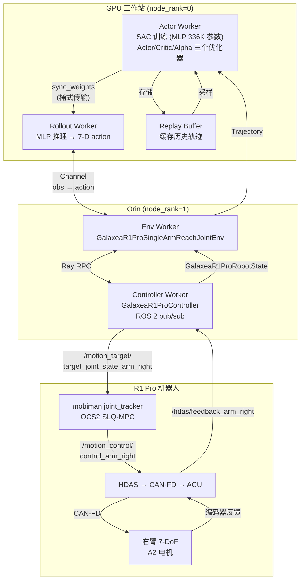
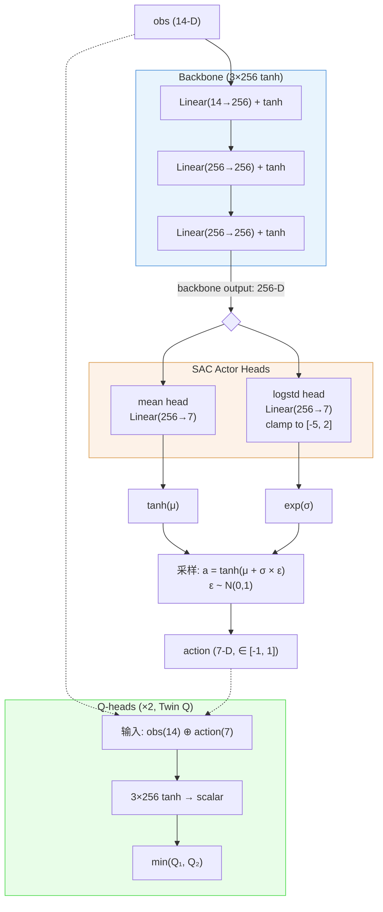
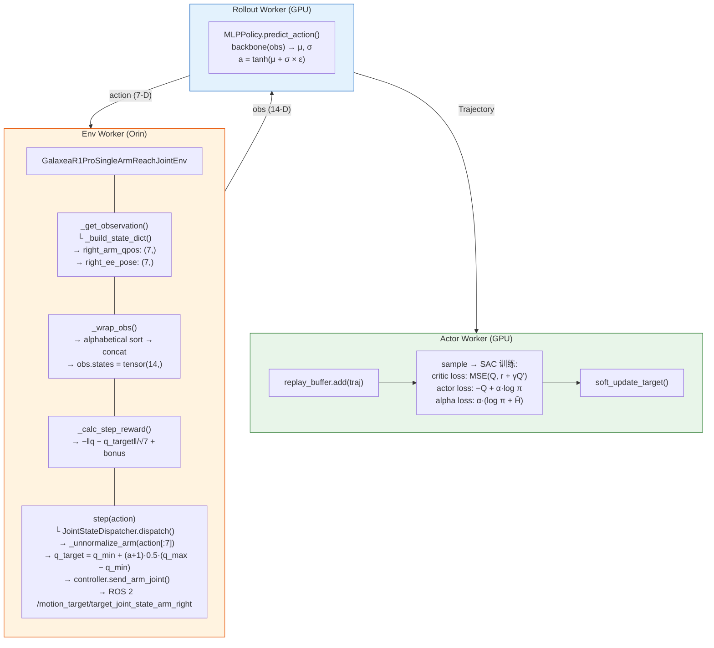

# 使用 RLinf MLP Policy + SAC 进行 R1 Pro M1 关节到达任务的完整实操指南

> **目标**：本文档是**完全自包含**的——工程师阅读本文档即可在 Galaxea R1 Pro 机器人及其 Jetson Orin 上，从零开始把"右臂关节到达任务"成功跑起来。所有代码、配置文件、命令均内联提供，不引用其他章节或外部配置。
>
> **任务代号**：M1 — 整个 R1 Pro RL 任务矩阵中**最简单**的冒烟测试任务。
>
> **最后更新**：2026-05-09

---

## 目录

1. [概述与目标](#1-概述与目标)
2. [前置条件](#2-前置条件)
3. [任务设计详解](#3-任务设计详解)
4. [Galaxea R1 Pro 机器人准备](#4-galaxea-r1-pro-机器人准备)
5. [RLinf 安装与集群配置](#5-rlinf-安装与集群配置)
6. [训练配置文件](#6-训练配置文件)
7. [（可选）SFT 预训练——安全的初始策略](#7-可选sft-预训练安全的初始策略)
8. [SAC 在线训练](#8-sac-在线训练)
9. [评估与部署](#9-评估与部署)
10. [PPO 替代方案](#10-ppo-替代方案)
11. [故障排除](#11-故障排除)

---

## 1. 概述与目标

### 1.1 M1 任务是什么

M1（"Milestone 1"）任务是 R1 Pro 上 **最简单的** RL 任务：

- **目标**：让右臂的 7 个关节角从当前值移动到一个固定的目标关节角。
- **无摄像头**：观测只有本体感知（proprioception），即当前关节角度和末端位姿。
- **无夹爪**：不控制夹爪，动作空间仅 7 维。
- **无 IK 依赖**：策略直接输出关节角目标（joint mode），不经过逆运动学。
- **无左臂、无躯干、无底盘**：只动右臂。

这个"三零依赖"（零 IK、零相机、零夹爪）的设计让 M1 成为验证"整个 RLinf ↔ R1 Pro 软件栈是否正确连通"的**冒烟测试**。如果 M1 能跑通并收敛，就证明：

1. GPU 工作站 ↔ Orin 的 Ray 集群通信正常
2. Orin 上的 ROS 2 控制器能正确收发关节状态
3. mobiman 的 joint tracker 正常工作
4. RLinf 的 SAC 训练管线（Actor → Rollout → Env → Replay Buffer → 梯度更新）端到端正常

### 1.2 为什么用 MLP + SAC

| 选择 | 理由 |
|------|------|
| **MLP 策略**（$3 \times 256$ tanh） | 输入 14 维、输出 7 维，参数量约 $336\text{K}$，CPU 推理 $< 1\text{ms}$。不需要 GPU 做推理，适合在 Orin 上低延迟运行。 |
| **SAC**（Soft Actor-Critic） | Off-policy 算法，样本效率远高于 PPO。真实机器人交互昂贵（$10\text{Hz}$ 控制频率 $\times$ $200$ 步/episode $\approx 20$ 秒/episode），SAC 通过 replay buffer 重复利用历史数据，比 PPO 节省 $5$-$10$ 倍交互次数。 |
| **异步训练** | 机器人 10Hz 步进速度慢，同步训练时 GPU 90% 时间在空闲等待。AsyncEmbodiedRunner 让 GPU 在等待新轨迹时对 replay buffer 中的旧数据持续训练。 |

### 1.3 成功标准

- **joint_l2**（7 关节与目标的 $L_2$ 距离）从初始约 $2.0$ 逐渐降低到 $< 0.05\;\text{rad}$
- 每轮 reward 从约 $-0.75$ 提升到接近 $0.0$（密集奖励）$+ 1.0$（稀疏奖金）
- 机器人手臂在 $10$-$20$ 个 episode 内可见明显趋向目标的运动

### 1.4 架构总览



---

## 2. 前置条件

### 2.1 硬件要求

| 设备 | 最低要求 | 说明 |
|------|---------|------|
| **GPU 工作站** | NVIDIA GPU 8+ GB 显存（如 RTX 4090/A100） | 运行 Actor（训练）和 Rollout（推理）。MLP 策略很小，单卡足够。 |
| **Galaxea R1 Pro** | 搭载 Jetson AGX Orin | 运行 Env Worker 和 ROS 2 Controller。Orin 上不需要 GPU 计算。 |
| **网络** | GPU 工作站与 Orin 在同一子网 | Ray 集群通信需要双向 TCP 连接。 |

### 2.2 网络端口

| 端口 | 用途 | 方向 |
|------|------|------|
| 6379 | Ray GCS（head 节点） | Orin → GPU 工作站 |
| 8265 | Ray Dashboard | 浏览器 → GPU 工作站 |
| 10000-10100 | Ray 对象传输 | 双向 |

确保防火墙不阻断以上端口。

### 2.3 软件要求

**GPU 工作站**：

- Python 3.10+（≤ 3.11.14）
- PyTorch 2.x（CUDA 支持）
- Ray 2.x
- RLinf（从源码安装）

**Orin（R1 Pro 车载）**：

- Ubuntu 22.04 + JetPack 5.x/6.x
- ROS 2 Humble
- Galaxea SDK（预装在 `/home/nvidia/galaxea/install`）
- Python 3.10+
- Ray 2.x（worker 模式）
- RLinf（从源码安装，仅需基础依赖）

### 2.4 Galaxea SDK 状态

确认以下组件已部署并可用：

```bash
# 在 Orin 上验证
source /home/nvidia/galaxea/install/setup.bash
ros2 topic list | grep hdas     # 应看到 /hdas/feedback_arm_right 等
ros2 topic list | grep motion   # 应看到 /motion_target/target_joint_state_arm_right
```

---

## 3. 任务设计详解

### 3.1 任务类完整代码

以下是 M1 任务类的完整实现，位于 `rlinf/envs/realworld/galaxear/tasks/r1_pro_single_arm_reach_joint.py`：

```python
"""M1 task: right-arm reach to a fixed JOINT target (joint mode).

Per design doc r1pro6op47.md §10.2, this is the very first real-robot
RL task we recommend running on R1 Pro.  It deliberately:

* Uses the **joint** action mode so the policy outputs 7 absolute
  joint angles directly to ``/motion_target/target_joint_state_arm_*``
  (no IK chain dependency, no relaxed_ik bring-up risk).
* Has **no gripper** and **no camera** (proprio-only); reward is
  purely a function of ``q - q_target``.
* Has **no left arm**, **no torso**, **no chassis**.

That triple-zero dependency profile makes it the perfect smoke-test
for "is the entire stack actually wired correctly?".
"""

from __future__ import annotations

from typing import Any

import numpy as np

from rlinf.envs.realworld.galaxear.r1_pro_env import (
    GalaxeaR1ProEnv,
)


class GalaxeaR1ProSingleArmReachJointEnv(GalaxeaR1ProEnv):
    """Right-arm reach to ``target_q_right`` in joint space.

    Reward: ``r = -||q_current - q_target||_2`` plus a sparse +1.0
    bonus when the L2 distance falls below ``joint_tolerance_rad``
    (default 0.05 rad).
    """

    DEFAULT_TARGET_Q_RIGHT = (
        0.5,
        0.5,
        0.0,
        -1.2,
        0.0,
        1.5,
        0.0,
    )
    DEFAULT_JOINT_TOLERANCE_RAD = 0.05

    def __init__(
        self,
        override_cfg: dict[str, Any],
        worker_info=None,
        hardware_info=None,
        env_idx: int = 0,
    ) -> None:
        cfg = dict(override_cfg or {})
        cfg.setdefault("use_joint_mode", True)
        cfg.setdefault("use_right_arm", True)
        cfg.setdefault("use_left_arm", False)
        cfg.setdefault("no_gripper", True)
        cfg.setdefault("use_torso", False)
        cfg.setdefault("use_chassis", False)
        # Pull task-specific keys out so GalaxeaR1ProRobotConfig doesn't
        # complain about unknown fields.
        self._target_q_right = np.asarray(
            cfg.pop("target_q_right", self.DEFAULT_TARGET_Q_RIGHT),
            dtype=np.float32,
        ).reshape(7)
        self._joint_tolerance = float(
            cfg.pop("joint_tolerance_rad", self.DEFAULT_JOINT_TOLERANCE_RAD)
        )
        super().__init__(
            override_cfg=cfg,
            worker_info=worker_info,
            hardware_info=hardware_info,
            env_idx=env_idx,
        )

    @property
    def task_description(self) -> str:
        return (
            "Move the right arm to the configured target joint angles "
            "and hold for ``success_hold_steps`` steps.  Joint-mode "
            "M1 bring-up task per r1pro6op47.md §10.2."
        )

    def _calc_step_reward(self, obs, sinfo) -> float:
        q = np.asarray(self._state.right_arm_qpos, dtype=np.float32).reshape(7)
        diff = q - self._target_q_right
        l2 = float(np.linalg.norm(diff))
        dense = -l2 / np.sqrt(7.0)
        bonus = 1.0 if l2 < self._joint_tolerance else 0.0
        if bonus > 0.0:
            self._success_hold_counter = self._success_hold_counter + 1
        else:
            self._success_hold_counter = 0
        return float(dense + bonus)
```

### 3.2 设计决策逐一解释

#### 3.2.1 为什么 `use_joint_mode=True`

关节模式 (joint mode) 让策略**直接输出 7 个关节角目标值**，动作通过 ROS 2 发送到 `/motion_target/target_joint_state_arm_right`，由 mobiman 的 joint tracker 跟踪执行。

相比末端位姿模式 (EE pose mode)：
- **无 IK 依赖**：不需要 relaxed_ik / trac_ik 在线求解，消除了 IK 奇异点和求解失败的风险
- **动作与观测同空间**：观测包含当前关节角 `q`，动作是目标关节角 `q_target`，二者直接可比
- **奖励直接**：`||q - q_target||_2` 就是动作效果的直接度量

#### 3.2.2 观测空间：14 维

当 `use_right_arm=True, use_left_arm=False, no_gripper=True, use_torso=False, use_chassis=False` 时，`_build_state_dict()` 返回：

```python
{
    "right_arm_qpos": np.ndarray(7,),   # 7 个关节角（rad）
    "right_ee_pose":  np.ndarray(7,),   # xyz(3) + quaternion xyzw(4)
}
```

`_wrap_obs()` 对 state dict 的 key **按字母序排序**后拼接：

```
"right_arm_qpos" (r 排在前) → 7 维
"right_ee_pose"  (r 排在前) → 7 维
```

由于 `right_arm_qpos` 和 `right_ee_pose` 按字母序排列，`right_arm_qpos` 排在 `right_ee_pose` 前面，总观测维度 = **14**。

> **注意**：虽然本任务的奖励函数只依赖 `right_arm_qpos`，但观测中仍包含 `right_ee_pose`。这是因为 `_build_state_dict()` 总是同时输出 qpos 和 ee_pose，移除 ee_pose 需要修改环境基类。保留 ee_pose 对训练无害——MLP 会学到忽略不相关的输入维度。

#### 3.2.3 动作空间：7 维 [-1, 1]

策略输出 7 维动作，每维在 $[-1, 1]$ 范围内。`JointStateDispatcher` 将其反归一化为绝对关节角度：

$$
q_{\text{target}} = q_{\min} + (\text{action} + 1) \times 0.5 \times (q_{\max} - q_{\min})
$$

其中 $q_{\min}$ 和 $q_{\max}$ 是每个关节的安全限位（URDF 限位减去 $0.1\;\text{rad}$ 安全余量）：

| 关节 | $q_{\min}$ (rad) | $q_{\max}$ (rad) | 零位含义 |
|------|------------|------------|---------|
| J1 | $-4.35$ | $1.21$ | 肩 yaw |
| J2 | $-3.04$ | $0.07$ | 肩 roll（右臂） |
| J3 | $-2.26$ | $2.26$ | 肩 yaw |
| J4 | $-1.99$ | $0.25$ | 肘弯曲 |
| J5 | $-2.26$ | $2.26$ | 腕 roll |
| J6 | $-0.95$ | $0.95$ | 腕 pitch |
| J7 | $-1.47$ | $1.47$ | 末端 roll |

**关键含义**：$\text{action} = 0$ 不对应关节零位，而是对应 $(q_{\min} + q_{\max}) / 2$（关节限位的中点）。策略从 $[-1, 1]$ 的"归一化空间"操作，完全覆盖关节可达范围。

#### 3.2.4 默认目标 `(0.5, 0.5, 0.0, -1.2, 0.0, 1.5, 0.0)` @#TODO 用新目标???

这组目标关节角描述一个"右臂微抬、肘部弯曲约 69°、腕部旋转"的姿态。每个值都在对应关节的安全限位范围内：

| 关节 | 目标 (rad) | 在限位范围内？ | 距 Home ($0.0$) 的距离 |
|------|-----------|--------------|-------------------|
| J1 | $0.5$ | ✓ ($\in [-4.35, 1.21]$) | $0.5$ |
| J2 | $0.5$ | ✗ **超出** ($\max=0.07$) | — |
| J3 | $0.0$ | ✓ ($\in [-2.26, 2.26]$) | $0.0$ |
| J4 | $-1.2$ | ✓ ($\in [-1.99, 0.25]$) | $1.2$ |
| J5 | $0.0$ | ✓ ($\in [-2.26, 2.26]$) | $0.0$ |
| J6 | $1.5$ | ✗ **超出** ($\max=0.95$) | — |
| J7 | $0.0$ | ✓ ($\in [-1.47, 1.47]$) | $0.0$ |

> **⚠ 重要发现**：默认目标的 $\text{J2}=0.5$ 和 $\text{J6}=1.5$ **超出了安全限位**。`JointStateDispatcher._unnormalize_arm` 会把策略输出 clip 到 $[q_{\min}, q_{\max}]$ 范围，所以实际下发的关节目标被限制在合法范围内。但**奖励函数使用的是未 clip 的目标值**，这意味着 $\|\mathbf{q} - \mathbf{q}_{\text{target}}\|$ 永远无法完全降为零。
>
> **建议**：如果发现训练收敛到一个非零平台，将目标修改为安全限位内的值，例如：
>
> ```yaml
> target_q_right: [0.5, 0.0, 0.0, -1.2, 0.0, 0.9, 0.0]
> ```

#### 3.2.5 奖励函数

##### 3.2.5.1 数学定义

设当前右臂 7 个关节的角度向量为 $\mathbf{q} = (q_1, q_2, \ldots, q_7)^\top \in \mathbb{R}^7$，目标关节角为 $\mathbf{q}^* = (q_1^*, q_2^*, \ldots, q_7^*)^\top \in \mathbb{R}^7$。定义关节误差的 L2 范数：

$$d(\mathbf{q}, \mathbf{q}^*) = \|\mathbf{q} - \mathbf{q}^*\|_2 = \sqrt{\sum_{i=1}^{7}(q_i - q_i^*)^2}$$

则每步奖励 $r_t$ 由**密集项**和**稀疏奖金**两部分组成：

$$\boxed{r_t = \underbrace{-\frac{d(\mathbf{q}_t,\, \mathbf{q}^*)}{\sqrt{n}}}_{\text{密集项 (dense)}} + \underbrace{c \cdot \mathbb{1}\bigl[d(\mathbf{q}_t,\, \mathbf{q}^*) < \epsilon\bigr]}_{\text{稀疏奖金 (sparse bonus)}}}$$

其中 $n = 7$（关节数）、$c = 1.0$（奖金系数）、$\epsilon = 0.05\text{ rad}$（成功阈值）、$\mathbb{1}[\cdot]$ 是指示函数。

对应代码实现：

```python
def _calc_step_reward(self, obs, sinfo) -> float:
    q = np.asarray(self._state.right_arm_qpos, dtype=np.float32).reshape(7)
    diff = q - self._target_q_right
    l2 = float(np.linalg.norm(diff))           # d(q, q*)
    dense = -l2 / np.sqrt(7.0)                 # 密集项
    bonus = 1.0 if l2 < self._joint_tolerance else 0.0  # 稀疏奖金
    return float(dense + bonus)
```

##### 3.2.5.2 密集项的作用与原理

**作用**：密集项 $r_{\text{dense}} = -d / \sqrt{n}$ 在每一步都向策略提供"方向信号"——关节越接近目标，奖励越高（越接近 0）。这是策略梯度方法能够学习的前提条件。

**$\sqrt{n}$ 归一化的原因**：

如果不做归一化，直接使用 $r = -d$，那么当 7 个关节各差 1 rad 时：

$$d = \sqrt{7 \times 1^2} = \sqrt{7} \approx 2.646 \quad\Rightarrow\quad r = -2.646$$

这个值的量级取决于关节数量 $n$ —— 如果换成 18 关节的整机任务，同样"每关节差 1 rad"会导致 $r = -\sqrt{18} \approx -4.24$，让奖励尺度随任务维度变化。除以 $\sqrt{n}$ 进行归一化后：

$$r_{\text{dense}} = -\frac{\sqrt{\sum_{i=1}^{n}(q_i - q_i^*)^2}}{\sqrt{n}} = -\sqrt{\frac{1}{n}\sum_{i=1}^{n}(q_i - q_i^*)^2} = -\text{RMS}(\mathbf{q} - \mathbf{q}^*)$$

即密集奖励实际上等于**关节误差的 RMS (Root Mean Square) 的负值**。这保证了无论关节数多少，"每个关节平均差 1 rad"时 $r_{\text{dense}} \approx -1.0$，使奖励的量级具有可解释性和跨任务可比性。

**值域分析**：

- 最坏情况：每个关节都在极限误差 $\pi$ rad 时，$d_{\max} = \pi\sqrt{7} \approx 8.31$，$r_{\text{dense}}^{\min} = -\pi \approx -3.14$
- 最好情况：$d = 0$，$r_{\text{dense}} = 0$
- 因此 $r_{\text{dense}} \in [-\pi,\, 0]$

**梯度特性**：$r_{\text{dense}}$ 关于 $\mathbf{q}$ 的梯度为：

$$\nabla_{\mathbf{q}} r_{\text{dense}} = -\frac{\mathbf{q} - \mathbf{q}^*}{\sqrt{n} \cdot \|\mathbf{q} - \mathbf{q}^*\|_2}$$

这是一个单位方向向量（除以 $\sqrt{n}$ 缩放后），始终指向目标。重要的是，**梯度的幅度与 $d$ 无关**：无论当前离目标多远，梯度大小恒为 $1/\sqrt{n}$。这是 L2 范数的固有性质——它在原点处不可微，但在其他位置梯度幅度恒定。这意味着密集奖励提供了**方向信号但没有"加速度"信号**，策略不会因为离目标远而获得更强的驱动力。

##### 3.2.5.3 稀疏奖金的作用与原理

**问题**：虽然密集项的梯度幅度恒定，但当 $d$ 很小时（比如 $d < 0.1$ rad），密集奖励在 $[-0.038, 0]$ 范围内的变化量极小，critic 的 Q 值估计难以区分"差 0.1 rad"和"差 0.01 rad"之间的微妙差异。在 SAC 的 critic 训练中，这种微小的 TD target 差异会被函数逼近的噪声淹没。

**解决方案**：在 $d < \epsilon$ 时引入一个**不连续的阶跃奖金** $+c$：

$$r_{\text{bonus}} = c \cdot \mathbb{1}[d < \epsilon] = \begin{cases} 1.0 & \text{if } d < 0.05 \\ 0.0 & \text{otherwise} \end{cases}$$

这在 $d = \epsilon$ 处制造了一个**值函数的突变**。考虑折扣累积回报，一旦策略学会进入 $d < \epsilon$ 区域，它每步额外获得 $+1.0$ 奖金，在 $\gamma = 0.96$ 下的累积价值为：

$$V_{\text{bonus}} = \sum_{k=0}^{T-1} \gamma^k \cdot c = c \cdot \frac{1 - \gamma^T}{1 - \gamma}$$

如果从进入成功区域到 episode 结束还剩 100 步，$V_{\text{bonus}} = 1.0 \times \frac{1 - 0.96^{100}}{1 - 0.96} \approx 24.0$。这个**远大于密集项**的信号为 critic 提供了清晰的"进入成功区域的价值"估计。

**组合效果**：

$$r_t = \underbrace{-\text{RMS}(\mathbf{q}_t - \mathbf{q}^*)}_{\in\, [-\pi,\, 0]} + \underbrace{\mathbb{1}[d_t < 0.05]}_{\in\, \{0,\, 1\}}$$

| 情况 | $d$ 范围 | $r_{\text{dense}}$ | $r_{\text{bonus}}$ | $r_t$ 范围 |
|------|---------|-------------------|-------------------|-----------|
| 远离目标 | $d \gg \epsilon$ | $\ll 0$ | $0$ | $\approx [-3.14, -0.04]$ |
| 接近但未达标 | $\epsilon < d < 0.3$ | $\approx [-0.11, -0.02]$ | $0$ | $\approx [-0.11, -0.02]$ |
| 达标 | $d < \epsilon$ | $\approx [-0.02, 0]$ | $1.0$ | $\approx [0.98, 1.0]$ |

**关键设计点**：奖金 $c = 1.0$ 远大于密集项在 $d \approx \epsilon$ 处的绝对值 $\approx 0.02$，因此跨越 $d = \epsilon$ 时奖励有**约 50 倍的跳变**（从 $-0.02$ 到 $+0.98$）。这让 critic 能非常容易地学到"$d < \epsilon$ 的状态价值远高于 $d > \epsilon$"。

##### 3.2.5.4 成功保持计数器

```python
if bonus > 0.0:
    self._success_hold_counter += 1
else:
    self._success_hold_counter = 0
```

仅在**连续** `success_hold_steps`（默认 5）步保持 $d < \epsilon$ 时判定任务成功。这防止策略"偶然路过"目标区域就算成功 —— 必须**稳定停留**。在 10 Hz 控制频率下，5 步 = 0.5 秒的保持时间，要求策略不仅到达目标，还要抑制过冲 (overshoot) 和振荡 (oscillation)。

##### 3.2.5.5 在 SAC 中的具体作用

SAC (Soft Actor-Critic) 的优化目标是最大化**带熵正则化的期望累积回报**：

$$J(\pi) = \sum_{t=0}^{T-1} \mathbb{E}_{(\mathbf{s}_t, \mathbf{a}_t) \sim \rho_\pi}\Big[\gamma^t \Big(r(\mathbf{s}_t, \mathbf{a}_t) + \alpha \mathcal{H}\big(\pi(\cdot|\mathbf{s}_t)\big)\Big)\Big]$$

其中 $\alpha$ 是熵温度系数，$\mathcal{H}(\pi(\cdot|\mathbf{s})) = -\mathbb{E}_{\mathbf{a} \sim \pi}[\log \pi(\mathbf{a}|\mathbf{s})]$ 是策略的熵。在 M1 任务中，$r(\mathbf{s}_t, \mathbf{a}_t)$ 就是上述奖励函数，$\mathbf{s}_t = (\mathbf{q}_t, \mathbf{p}_t^{\text{ee}}) \in \mathbb{R}^{14}$，$\mathbf{a}_t \in [-1, 1]^7$。

**奖励函数影响 SAC 的三个关键环节**：

**(1) Critic (Q 网络) 训练 —— TD target 计算**

SAC 使用 Bellman 方程训练 Twin Q 网络 $(Q_{\theta_1}, Q_{\theta_2})$，其 TD target 为：

$$y_t = r_t + \gamma \Big(\min_{j=1,2} Q_{\bar{\theta}_j}(\mathbf{s}_{t+1}, \tilde{\mathbf{a}}_{t+1}) - \alpha \log \pi_\phi(\tilde{\mathbf{a}}_{t+1}|\mathbf{s}_{t+1})\Big), \quad \tilde{\mathbf{a}}_{t+1} \sim \pi_\phi(\cdot|\mathbf{s}_{t+1})$$

$$\mathcal{L}_Q(\theta_j) = \mathbb{E}_{(\mathbf{s}_t, \mathbf{a}_t, r_t, \mathbf{s}_{t+1}) \sim \mathcal{B}}\Big[\big(Q_{\theta_j}(\mathbf{s}_t, \mathbf{a}_t) - y_t\big)^2\Big]$$

奖励 $r_t$ 直接进入 TD target $y_t$。由于奖励函数的组合设计：

- 当机器人远离目标时，$r_t \approx -0.5$（负值为主），使 $y_t$ 较低，Q 值将远离目标的状态-动作对评为"差"
- 当机器人接近目标且 $d < \epsilon$ 时，$r_t \approx +1.0$（正值），使 $y_t$ 显著升高。通过 Bellman 备份的递归传播，这个高奖励信号会**逆时间方向扩散**到更早的状态：

$$Q(\mathbf{s}_{t-1}, \mathbf{a}_{t-1}) \approx r_{t-1} + \gamma \cdot Q(\mathbf{s}_t, \mathbf{a}_t)$$

每步递推使 Q 值信号以 $\gamma = 0.96$ 的衰减率向过去传播。经过 $k$ 步传播后，稀疏奖金对 $Q(\mathbf{s}_{t-k}, \mathbf{a}_{t-k})$ 的贡献为 $\gamma^k \cdot c = 0.96^k$。在 50 步（5 秒）之前的状态仍能感受到 $0.96^{50} \approx 0.13$ 的信号 —— 足以驱动策略从 episode 早期就开始趋向目标。

**(2) Actor (策略) 更新 —— 梯度方向**

SAC 的 actor 损失为：

$$\mathcal{L}_\pi(\phi) = \mathbb{E}_{\mathbf{s}_t \sim \mathcal{B}}\Big[\alpha \log \pi_\phi(\tilde{\mathbf{a}}_t|\mathbf{s}_t) - \min_{j=1,2} Q_{\theta_j}(\mathbf{s}_t, \tilde{\mathbf{a}}_t)\Big], \quad \tilde{\mathbf{a}}_t \sim \pi_\phi(\cdot|\mathbf{s}_t)$$

策略更新的目标是最小化 $\mathcal{L}_\pi$，即**最大化 $Q$ 值同时最大化熵**。由于 Q 值已经"吸收"了奖励信号的结构，策略会学到：

- **导航阶段**（远离目标）：选择让密集奖励增大（L2 减小）的动作方向
- **精细调整阶段**（接近目标）：选择能跨过 $d = \epsilon$ 阈值获取 $+1.0$ 跳变的动作
- **保持阶段**（已达标）：选择让自己停留在 $d < \epsilon$ 区域的动作（抑制振荡）

**(3) 熵温度 $\alpha$ 自动调节**

SAC 通过以下损失自动调节 $\alpha$：

$$\mathcal{L}(\alpha) = \mathbb{E}_{\mathbf{a}_t \sim \pi_\phi}\Big[-\alpha \big(\log \pi_\phi(\mathbf{a}_t|\mathbf{s}_t) + \bar{\mathcal{H}}\big)\Big]$$

其中 $\bar{\mathcal{H}} = -n_a = -7$ 是目标熵。奖励函数的量级**间接影响**了 $\alpha$ 的平衡点：

- 如果奖励尺度太大（如不除以 $\sqrt{n}$），Q 值量级高，actor 的 $-Q$ 项主导 $\mathcal{L}_\pi$，$\alpha \log \pi$ 的影响被压缩 → $\alpha$ 被自动调低 → 探索不足
- 如果奖励尺度太小，Q 值量级低，$\alpha \log \pi$ 主导 → $\alpha$ 被调高 → 过度探索

$\sqrt{n}$ 归一化使奖励在 $[-\pi, +1]$ 的合理范围内，与 `initial_alpha = 0.01` 和 `target_entropy = -7.0` 的配置匹配，让 $\alpha$ 能稳定收敛到合适的探索-利用平衡点。

##### 3.2.5.6 为什么不使用其他奖励设计

| 替代方案 | 问题 |
|---------|------|
| $r = -\|\mathbf{q} - \mathbf{q}^*\|_2^2$（L2 平方） | 在 $d$ 较大时梯度 $\propto d$ 过大，Q 值估计不稳定；在 $d$ 较小时梯度 $\propto d$ 趋零，与 L1 问题类似 |
| $r = -\|\mathbf{q} - \mathbf{q}^*\|_1$（L1） | 对各关节独立，无法鼓励"同时到达"；梯度为常数 ±1 但方向不连续 |
| 纯稀疏 $r = \mathbb{1}[d < \epsilon]$ | 初始阶段 $d \gg \epsilon$ 时完全没有学习信号，策略纯靠随机探索"碰运气"到达目标区域，在真机上耗时不可接受 |
| 基于末端位姿的奖励 $r = -\|\mathbf{p}^{\text{ee}} - \mathbf{p}^*\|$ | M1 是关节空间任务，同一末端位姿可对应多组关节角（逆运动学冗余），策略可能找到不安全的关节构型 |
| Huber / smooth-L1 | 可行但增加一个超参数（$\delta$），且 M1 作为冒烟测试任务追求极简 |

#### 3.2.6 MLP 策略架构



参数量估算：
- Backbone: $14 \times 256 + 256 + 256 \times 256 + 256 + 256 \times 256 + 256 \approx 135\text{K}$
- Actor heads: $256 \times 7 \times 2 \approx 3.6\text{K}$
- Q-heads: $(14+7) \times 256 + 256 \times 256 + 256 \times 256 + 256 \times 1 \;\times\; 2 \;\times\; 2 \approx 197\text{K}$
- **总计约 $336\text{K}$ 参数**

### 3.3 数据流详解



---

## 4. Galaxea R1 Pro 机器人准备

> **⚠ 安全警告**：操作真实机器人前，务必：
> 1. 清空机器人工作空间内的所有障碍物
> 2. 确认急停按钮可用且在手边
> 3. 至少一人在机器人旁准备随时按急停
> 4. 首次运行时将关节速度限制设低（`arm_qvel_max` 默认已是保守值）

### 4.1 启动 Galaxea SDK

在 Orin 上执行：

```bash
# 1. 启动 HDAS（硬件抽象层，含 CAN-FD 配置）
cd /home/nvidia/galaxea/install/startup_config/share/startup_config/script
./robot_startup.sh boot ATCSystem/R1PROATC.d

# 2. 等待约 30 秒让所有节点完成初始化
sleep 30

# 3. 验证关键话题存在
source /home/nvidia/galaxea/install/setup.bash
ros2 topic list | grep -E "feedback_arm_right|target_joint_state"
```

应看到：
```
/hdas/feedback_arm_right
/motion_target/target_joint_state_arm_right
```

### 4.2 验证反馈数据

```bash
# 检查右臂关节反馈是否正常
ros2 topic echo /hdas/feedback_arm_right --once
```

应看到 7 个关节的 position/velocity/effort 值。如果看到全零或无输出，检查 CAN-FD 连线和 HDAS 日志：

```bash
tmux a -t hdas   # 查看 HDAS 的 tmux 窗口
```

### 4.3 验证 mobiman joint tracker

M1 任务使用 joint 模式，需要 mobiman 的 joint tracker 正常运行。验证方法：

```bash
# 检查 mobiman joint tracker 订阅者数量
ros2 topic info /motion_target/target_joint_state_arm_right
```

应看到至少 1 个 subscriber（mobiman 的 joint tracker 节点）。

### 4.4 确认 Home 位置

R1 Pro 的 Home 位置（URDF 零位）是所有关节角为 `0.0`，对应双臂自然下垂的姿态。在运行 RL 前，确保机器人处于或接近此姿态。

M1 任务配置的 `joint_reset_qpos_right`（episode 开始时的重置位置）默认为：

```
[0.0, 0.3, 0.0, -1.8, 0.0, 2.1, 0.0]
```

这是一个右臂微抬、肘部弯曲的安全姿态。每次 episode 开始时，机器人会慢速移动到此位置。

---

## 5. RLinf 安装与集群配置

### 5.1 GPU 工作站安装

```bash
# 克隆并安装 RLinf
cd /path/to/workspace
git clone <rlinf-repo-url> RLinf
cd RLinf

# 安装具身 RL 依赖（MLP policy 模式）
bash requirements/install.sh embodied --model mlp_policy

# 验证
python -c "import rlinf; print('RLinf OK')"
```

### 5.2 Orin 安装

Orin 上只需安装 RLinf 的基础依赖（不需要 PyTorch CUDA 版本）：

```bash
# 在 Orin 上
cd /path/to/RLinf
pip install -e ".[embodied-base]"

# 确保 ROS 2 Python 库可用
source /home/nvidia/galaxea/install/setup.bash
python -c "import rclpy; print('rclpy OK')"
```

### 5.3 必要的代码修补：`_wrap_obs` 修复

> **这是运行 M1 任务前唯一需要修改的源代码。**

M1 任务不使用摄像头（`cameras: []`），但 `_wrap_obs()` 方法会无条件访问 `raw_obs["frames"]`，导致 `KeyError` 崩溃。

**修改文件**：`rlinf/envs/realworld/realworld_env.py`，第 288-301 行

**修改前**（原始代码）：

```python
    def _wrap_obs(self, raw_obs):
        obs = {}

        # Process states
        full_states = []
        raw_states = OrderedDict(sorted(raw_obs["state"].items()))
        for value in raw_states.values():
            full_states.append(value)
        full_states = np.concatenate(full_states, axis=-1)
        obs["states"] = full_states

        # Process images
        if self.main_image_key not in raw_obs["frames"]:
            available_keys = list(raw_obs["frames"].keys())
            raise KeyError(
                f"main_image_key '{self.main_image_key}' not found in raw_obs['frames']. "
                f"Available keys: {available_keys}. "
                f"Please set 'main_image_key' in your env config to one of the available keys."
            )
        obs["main_images"] = raw_obs["frames"][self.main_image_key]
        raw_images = OrderedDict(sorted(raw_obs["frames"].items()))
        raw_images.pop(self.main_image_key)

        if raw_images:
            obs["extra_view_images"] = np.stack(list(raw_images.values()), axis=1)

        obs = to_tensor(obs)
        obs["task_descriptions"] = self.task_descriptions
        return obs
```

**修改后**（添加 None/空检查）：

```python
    def _wrap_obs(self, raw_obs):
        obs = {}

        # Process states
        full_states = []
        raw_states = OrderedDict(sorted(raw_obs["state"].items()))
        for value in raw_states.values():
            full_states.append(value)
        full_states = np.concatenate(full_states, axis=-1)
        obs["states"] = full_states

        # Process images (skip when no cameras configured)
        if self.main_image_key is not None and "frames" in raw_obs:
            if self.main_image_key not in raw_obs["frames"]:
                available_keys = list(raw_obs["frames"].keys())
                raise KeyError(
                    f"main_image_key '{self.main_image_key}' not found in raw_obs['frames']. "
                    f"Available keys: {available_keys}. "
                    f"Please set 'main_image_key' in your env config to one of the available keys."
                )
            obs["main_images"] = raw_obs["frames"][self.main_image_key]
            raw_images = OrderedDict(sorted(raw_obs["frames"].items()))
            raw_images.pop(self.main_image_key)

            if raw_images:
                obs["extra_view_images"] = np.stack(list(raw_images.values()), axis=1)

        obs = to_tensor(obs)
        obs["task_descriptions"] = self.task_descriptions
        return obs
```

**变更要点**：仅在第 289 行添加了 `if self.main_image_key is not None and "frames" in raw_obs:` 条件判断，将整个图像处理块包裹在条件内。当没有配置摄像头时（`cameras: []` → `main_image_key=None` 且 `raw_obs` 中不含 `"frames"` key），跳过图像处理。

**原因**：`_get_observation()` 在 `cameras` 为空时正确地不构建 `"frames"` key，但 `_wrap_obs()` 没有对应的 None-guard。这是一个 bug，而非设计选择。

**在两台机器上都需要应用此修改**（GPU 工作站和 Orin），因为 `realworld_env.py` 被两端的 Python 进程导入。

### 5.4 启动 Ray 集群

**步骤 1：在 GPU 工作站上启动 Ray Head 节点**

```bash
# 设置唯一的节点 rank（必须在 ray start 之前设置）
export RLINF_NODE_RANK=0

# 启动 head 节点
ray start --head --port=6379 --node-ip-address=<GPU_WORKSTATION_IP>
```

**步骤 2：在 Orin 上启动 Ray Worker 节点**

```bash
# SSH 到 Orin
ssh nvidia@<ORIN_IP>

# 设置节点 rank
export RLINF_NODE_RANK=1

# source ROS 2 和 Galaxea SDK（Controller Worker 需要）
source /opt/ros/humble/setup.bash
source /home/nvidia/galaxea/install/setup.bash

# 连接到 head 节点
ray start --address=<GPU_WORKSTATION_IP>:6379
```

**步骤 3：验证集群**

```bash
# 在 GPU 工作站上
ray status
```

应看到 2 个节点。

> **⚠ 重要**：`RLINF_NODE_RANK` 必须在 `ray start` 之前设置，因为 Ray 在启动时捕获环境变量。之后再设置无效。

### 5.5 环境变量汇总

**GPU 工作站**：

```bash
export RLINF_NODE_RANK=0
```

**Orin**：

```bash
export RLINF_NODE_RANK=1
export ROS_DOMAIN_ID=72           # 与 GalaxeaR1ProRobotConfig 默认值匹配
export RMW_IMPLEMENTATION=rmw_fastrtps_cpp
```

---

## 6. 训练配置文件

> **背景**：RLinf 的示例 YAML 配置文件经过 SafeNet DRM 加密，不可直接阅读。以下配置是根据 RLinf 源码中的默认值和 SAC Worker 实现逆向重建的，所有参数都有代码来源说明。

### 6.1 完整 YAML 配置

将以下内容保存为 `examples/embodiment/config/r1pro_m1_reach_joint_sac_mlp.yaml`：

```yaml
# ═══════════════════════════════════════════════════════════════════
# R1 Pro M1: 右臂关节到达任务 — SAC + MLP Policy
# 自包含配置文件，覆盖所有必要参数
# ═══════════════════════════════════════════════════════════════════

# ── 集群配置 ──────────────────────────────────────────────────────
cluster:
  num_nodes: 2                    # GPU 工作站 + Orin
  node_groups:
    - label: gpu
      node_ranks: [0]             # GPU 工作站
    - label: orin
      node_ranks: [1]             # Orin（R1 Pro 车载）

  component_placement:
    actor:
      node_group: gpu
      placement: "0"              # 1 个 GPU 用于训练
    rollout:
      node_group: gpu
      placement: "0"              # 共享同一 GPU 做推理
    env:
      node_group: orin
      placement: "0"              # Orin 上运行环境

# ── 环境配置 ──────────────────────────────────────────────────────
env:
  train:
    env_type: galaxear             # 注册的环境类型名
    total_num_envs: 1              # 真实机器人只有 1 个
    group_size: 1
    max_steps_per_rollout_epoch: 200  # 每个 episode 最多 200 步 (=20 秒@10Hz)
    auto_reset: true
    init_params:
      id: GalaxeaR1ProSingleArmReachJointEnv
      override_cfg:
        # ── 机器人硬件 ──
        is_dummy: false
        ros_domain_id: 72
        mobiman_launch_mode: "joint"   # 使用 joint tracker（非 EE pose）

        # ── 控制频率 ──
        step_frequency: 10.0          # 10Hz，与 HDAS 反馈频率匹配

        # ── 关节模式标志 ──
        use_joint_mode: true
        use_right_arm: true
        use_left_arm: false
        no_gripper: true
        use_torso: false
        use_chassis: false

        # ── 无摄像头 ──
        cameras: []

        # ── 任务参数 ──
        target_q_right: [0.5, 0.0, 0.0, -1.2, 0.0, 0.9, 0.0]
        joint_tolerance_rad: 0.05

        # ── 重置姿态 ──
        joint_reset_qpos_right: [0.0, 0.0, 0.0, -0.7, 0.0, 0.0, 0.0]

        # ── Episode 长度 ──
        max_num_steps: 200
        success_hold_steps: 5

  eval:
    env_type: galaxear
    total_num_envs: 1
    group_size: 1
    max_steps_per_rollout_epoch: 200
    auto_reset: false
    init_params:
      id: GalaxeaR1ProSingleArmReachJointEnv
      override_cfg:
        is_dummy: false
        ros_domain_id: 72
        mobiman_launch_mode: "joint"
        step_frequency: 10.0
        use_joint_mode: true
        use_right_arm: true
        use_left_arm: false
        no_gripper: true
        use_torso: false
        use_chassis: false
        cameras: []
        target_q_right: [0.5, 0.0, 0.0, -1.2, 0.0, 0.9, 0.0]
        joint_tolerance_rad: 0.05
        joint_reset_qpos_right: [0.0, 0.0, 0.0, -0.7, 0.0, 0.0, 0.0]
        max_num_steps: 200
        success_hold_steps: 5

# ── Actor（训练）配置 ─────────────────────────────────────────────
actor:
  model:
    model_type: mlp_policy
    obs_dim: 14                    # right_arm_qpos(7) + right_ee_pose(7)
    action_dim: 7                  # 7 关节角
    num_action_chunks: 1
    add_value_head: false
    add_q_head: true               # SAC 需要 Q-head
    q_head_type: default           # Twin Q（标准 SAC）
  global_batch_size: 128           # replay buffer 每次采样的 batch 大小
  micro_batch_size: 128            # 等于 global_batch_size（单 GPU 不分片）
  optim:
    lr: 3.0e-4                     # Actor 学习率
    weight_decay: 0.0
  critic_optim:
    lr: 3.0e-4                     # Critic 学习率（通常与 actor 相同）
    weight_decay: 0.0
  precision: fp32                  # MLP 小模型用 fp32 足矣
  fsdp_strategy: "NO_SHARD"       # 单 GPU 不需要分片
  enable_drq: false                # 无图像输入，不需要数据增强

# ── Rollout（推理）配置 ───────────────────────────────────────────
rollout:
  model:
    model_type: mlp_policy
    obs_dim: 14
    action_dim: 7
    num_action_chunks: 1
    add_value_head: false
    add_q_head: true
    q_head_type: default
  rollout_backend: huggingface     # MLP 用 HuggingFace 后端
  temperature: 1.0                 # SAC 采样温度

# ── 算法配置 ──────────────────────────────────────────────────────
algorithm:
  adv_type: embodied_sac           # SAC 优势类型
  loss_type: embodied_sac          # SAC 损失类型
  gamma: 0.96                      # 折扣因子（真机 episode 短，略低于 0.99）
  tau: 0.005                       # Target 网络软更新系数
  critic_actor_ratio: 4            # 每次 actor 更新做 4 次 critic 更新
  update_epoch: 32                 # 每轮 rollout 后训练 32 个 epoch
  agg_q: min                       # Twin Q 取 min（标准 SAC）
  backup_entropy: true             # Bellman backup 中包含熵项
  bootstrap_type: standard         # 标准 bootstrap（done 时截断）
  target_update_type: all          # 软更新整个 target 模型

  # ── 熵温度自动调节 ──
  entropy_tuning:
    alpha_type: softplus            # softplus 保证 α > 0
    initial_alpha: 0.01             # 初始熵权重（小值 = 少探索，安全）
    target_entropy: -7.0            # 目标熵 = -action_dim = -7
    optim:
      lr: 3.0e-4                   # α 优化器学习率

  # ── Replay Buffer ──
  replay_buffer:
    enable_cache: true
    cache_size: 10000               # 内存中缓存的 chunk 数
    sample_window_size: 10000       # 采样窗口（最近 N 条数据）
    min_buffer_size: 3              # 至少 3 条轨迹才开始训练
    auto_save: true                 # 自动保存 buffer 到磁盘
    auto_save_path: null            # null = 使用默认日志路径
    trajectory_format: pt           # PyTorch 格式
    enable_preload: false
    prefetch_size: 10

# ── Runner 配置 ───────────────────────────────────────────────────
runner:
  runner_type: async_embodied       # 异步训练（真机必须）
  max_steps: 500                    # 总训练步数（每步 = 1 次 update_epoch）
  save_interval: 50                 # 每 50 步保存 checkpoint
  val_check_interval: 100           # 每 100 步评估
  logger:
    logger_backends:
      - tensorboard
    log_path: ./logs/r1pro_m1_reach_joint_sac
```

### 6.2 参数逐项解释

#### 集群与放置

- `num_nodes: 2`：GPU 工作站 (rank=0) + Orin (rank=1)。
- `actor + rollout` 在 GPU 节点，共享同一个 GPU（同置模式）。MLP 很小，不需要分开。
- `env` 在 Orin 节点。Env Worker 通过 Ray RPC 调用 Controller Worker，Controller Worker 通过 ROS 2 与机器人通信。

#### 环境参数

- `env_type: galaxear`：对应 `rlinf/envs/__init__.py` 中注册的 `SupportedEnvType.GALAXEAR`。
- `id: GalaxeaR1ProSingleArmReachJointEnv`：`gym.make()` 的 id，会通过任务注册机制定位到 M1 任务类。
- `mobiman_launch_mode: "joint"`：告诉 Controller Worker 启动 mobiman 的 joint tracker（而非 EE pose tracker）。
- `target_q_right: [0.5, 0.0, 0.0, -1.2, 0.0, 0.9, 0.0]`：目标关节角（已修正 J2 和 J6 到安全范围内）。
- `joint_reset_qpos_right: [0.0, 0.0, 0.0, -0.7, 0.0, 0.0, 0.0]`：episode 开始时的重置姿态（肘部微弯 $-0.7\;\text{rad} \approx -40°$，安全且远离奇异点）。

#### SAC 算法

- `gamma: 0.96`：比经典的 $0.99$ 略低。因为真机 episode 只有 $200$ 步（$20$ 秒），较低的 $\gamma$ 让 agent 更关注近期奖励。
- `tau: 0.005`：Target 网络的软更新系数。每次参数更新后：$\theta_{\text{target}} = (1-\tau)\cdot\theta_{\text{target}} + \tau\cdot\theta$。
- `critic_actor_ratio: 4`：每 $1$ 次 actor 更新配 $4$ 次 critic 更新。Critic 需要更频繁更新以提供准确的 $Q$ 值估计。
- `update_epoch: 32`：每收到 $1$ 条新轨迹后，从 replay buffer 中采样并训练 $32$ 个 epoch。真机数据珍贵，充分利用。
- `initial_alpha: 0.01`：初始熵权重设为小值，让 SAC 早期不要过度探索（真机探索有安全风险）。
- `target_entropy: -7.0`：等于 $-\text{action\_dim}$，是 SAC 论文的标准设置。

#### Replay Buffer

- `min_buffer_size: 3`：至少收集 3 条完整轨迹后才开始训练。太早开始会导致 critic 过拟合。
- `cache_size: 10000`：内存中缓存约 10000 个时间步的数据（约 50 条完整轨迹）。
- `auto_save: true`：定期将 buffer 保存到磁盘，支持训练中断后恢复。

#### Runner

- `runner_type: async_embodied`：使用 `AsyncEmbodiedRunner`，让环境交互与训练解耦。GPU 在等待机器人执行动作时持续对旧数据训练。
- `max_steps: 500`：总训练 500 步。每步包含 `update_epoch=32` 个梯度更新，总计 16000 次梯度更新。

---

## 7. （可选）SFT 预训练——安全的初始策略

> **为什么需要 SFT？** SAC 初始阶段的策略是随机的，会产生完全随机的关节角目标。虽然 `JointStateDispatcher` 会将动作 clip 到关节限位内，但随机跳跃仍然可能产生不平滑的运动。SFT（Supervised Fine-Tuning）可以用简单的脚本化数据预训练一个"大致知道方向"的策略，让 SAC 的初始探索更安全。
>
> **如果你信任安全限位并接受初始随机探索的风险，可以跳过此步。**

### 7.1 脚本化数据采集

以下 Python 脚本在 Orin 上运行，采集"从重置位置线性插值到目标位置"的演示数据：

```python
#!/usr/bin/env python3
"""collect_m1_demo.py — 采集 M1 关节到达的脚本化演示数据。

在 Orin 上运行：
  python collect_m1_demo.py --episodes 20 --save_dir ./m1_demo_data
"""

import argparse
import os
import time

import numpy as np
import torch

# 配置
RESET_Q   = np.array([0.0, 0.0, 0.0, -0.7, 0.0, 0.0, 0.0], dtype=np.float32)
TARGET_Q  = np.array([0.5, 0.0, 0.0, -1.2, 0.0, 0.9, 0.0], dtype=np.float32)
Q_MIN     = np.array([-4.35, -3.04, -2.26, -1.99, -2.26, -0.95, -1.47], dtype=np.float32)
Q_MAX     = np.array([ 1.21,  0.07,  2.26,  0.25,  2.26,  0.95,  1.47], dtype=np.float32)
STEPS     = 200
OBS_DIM   = 14
ACT_DIM   = 7


def joint_to_action(q_target: np.ndarray) -> np.ndarray:
    """将绝对关节角目标反向映射为 [-1, 1] 归一化动作。"""
    # 反公式: a = 2 * (q_target - q_min) / (q_max - q_min) - 1
    a = 2.0 * (q_target - Q_MIN) / (Q_MAX - Q_MIN) - 1.0
    return np.clip(a, -1.0, 1.0).astype(np.float32)


def generate_episode(episode_idx: int) -> dict:
    """生成一条从 RESET_Q 到 TARGET_Q 的线性插值轨迹。"""
    states_list = []
    actions_list = []

    for t in range(STEPS):
        # 模拟当前关节状态（线性插值）
        alpha = min(t / (STEPS * 0.8), 1.0)  # 80% 步数内到达，留 20% 保持
        q_current = RESET_Q + alpha * (TARGET_Q - RESET_Q)

        # 构造 14-D 观测（简化：ee_pose 用零填充，训练时会被真实值替换）
        ee_pose = np.zeros(7, dtype=np.float32)
        obs = np.concatenate([q_current, ee_pose])  # 14-D

        # 动作：指向目标的归一化关节角
        action = joint_to_action(TARGET_Q)

        states_list.append(obs)
        actions_list.append(action)

    return {
        "states": torch.tensor(np.array(states_list), dtype=torch.float32),
        "action": torch.tensor(np.array(actions_list), dtype=torch.float32),
    }


def main():
    parser = argparse.ArgumentParser()
    parser.add_argument("--episodes", type=int, default=20)
    parser.add_argument("--save_dir", type=str, default="./m1_demo_data")
    args = parser.parse_args()

    os.makedirs(args.save_dir, exist_ok=True)

    for ep in range(args.episodes):
        data = generate_episode(ep)
        path = os.path.join(args.save_dir, f"episode_{ep:04d}.pt")
        torch.save(data, path)
        print(f"[{ep+1}/{args.episodes}] Saved {path}")

    print(f"Done. {args.episodes} episodes saved to {args.save_dir}")


if __name__ == "__main__":
    main()
```

### 7.2 SFT 训练配置

```yaml
# r1pro_m1_sft.yaml — M1 SFT 预训练配置
cluster:
  num_nodes: 1
  component_placement:
    actor:
      placement: "0"

actor:
  model:
    model_type: mlp_policy
    obs_dim: 14
    action_dim: 7
    num_action_chunks: 1
    add_value_head: false
    add_q_head: false               # SFT 不需要 Q-head
  global_batch_size: 64
  micro_batch_size: 64
  optim:
    lr: 1.0e-3
    weight_decay: 0.0
  precision: fp32

data:
  train_data_paths:
    - ./m1_demo_data

runner:
  runner_type: sft
  max_steps: 200
  save_interval: 50
  logger:
    logger_backends:
      - tensorboard
    log_path: ./logs/r1pro_m1_sft
```

### 7.3 运行 SFT

```bash
# 在 GPU 工作站上
cd /path/to/RLinf
python examples/embodiment/train_embodied_agent.py \
    --config-name r1pro_m1_sft
```

SFT 完成后，checkpoint 保存在 `./logs/r1pro_m1_sft/checkpoints/global_step_200/`。在 SAC 训练配置中通过 `runner.resume_dir` 加载此 checkpoint 作为初始策略。

---

## 8. SAC 在线训练

### 8.1 启动顺序（逐步执行）

> **关键**：以下步骤的顺序很重要。必须先启动机器人 SDK，再启动 Ray 集群，最后启动训练。

#### 步骤 1：在 Orin 上启动 Galaxea SDK

```bash
# SSH 到 Orin
ssh nvidia@<ORIN_IP>

# 启动整机
cd /home/nvidia/galaxea/install/startup_config/share/startup_config/script
./robot_startup.sh boot ATCSystem/R1PROATC.d

# 等待初始化完成
sleep 30

# 验证
source /home/nvidia/galaxea/install/setup.bash
ros2 topic echo /hdas/feedback_arm_right --once
```

#### 步骤 2：启动 Ray 集群

**在 GPU 工作站上**：

```bash
export RLINF_NODE_RANK=0
ray start --head --port=6379 --node-ip-address=<GPU_IP>
```

**在 Orin 上（新开终端）**：

```bash
export RLINF_NODE_RANK=1
source /opt/ros/humble/setup.bash
source /home/nvidia/galaxea/install/setup.bash
ray start --address=<GPU_IP>:6379
```

#### 步骤 3：验证 Ray 集群

```bash
# 在 GPU 工作站上
ray status
# 应看到 2 nodes
```

#### 步骤 4：启动训练

```bash
# 在 GPU 工作站上
cd /path/to/RLinf
python examples/embodiment/train_embodied_agent.py \
    --config-name r1pro_m1_reach_joint_sac_mlp
```

如果使用了 SFT 预训练，添加 resume 参数：

```bash
python examples/embodiment/train_embodied_agent.py \
    --config-name r1pro_m1_reach_joint_sac_mlp \
    runner.resume_dir=./logs/r1pro_m1_sft/checkpoints/global_step_200
```

### 8.2 训练过程中的预期行为

#### 前 3 个 episode（约 1 分钟）

- 策略输出随机动作，机器人手臂会"乱动"（但被关节限位约束在安全范围内）
- reward 约为 $-0.7$ 到 $-0.5$
- replay buffer 积累数据，尚未开始训练

#### 第 3-10 个 episode（约 5 分钟）

- replay buffer 达到 `min_buffer_size=3`，SAC 开始训练
- 手臂开始出现趋向目标的运动趋势
- reward 逐渐提升到 $-0.3$ 附近

#### 第 10-50 个 episode（约 15 分钟）

- 策略明显收敛，手臂稳定地移向目标
- joint_l2 降到 $0.1$-$0.2$ 附近
- 偶尔出现 sparse bonus ($+1.0$)

#### 第 50-200+ episode（约 1 小时+）

- joint_l2 持续降低到 $< 0.05$
- 每个 episode 都能稳定获得 sparse bonus
- success_hold_counter 经常达到 $5$（任务完成）

### 8.3 TensorBoard 监控

```bash
# 在 GPU 工作站上
tensorboard --logdir=./logs/r1pro_m1_reach_joint_sac --port=6006
```

关键指标：

| 指标 | 含义 | 健康趋势 |
|------|------|---------|
| `env/reward` | 每步奖励 | 从 -0.7 → 接近 +1.0 |
| `env/episode_length` | episode 长度 | 初始 200，后期可能更短（如果 auto_reset） |
| `actor/critic_loss` | Critic MSE 损失 | 先升后降 |
| `actor/actor_loss` | Actor 损失 | 逐渐下降 |
| `actor/alpha` | 熵温度系数 | 从 0.01 开始，自动调节 |
| `actor/q_value` | Q 值估计 | 逐渐升高 |

### 8.4 训练期间的安全注意事项

1. **始终有人在机器人旁边**，手握急停按钮
2. **观察关节运动是否平滑**：如果出现抖动或突变，可能是控制频率不匹配或 CAN 通信异常
3. **观察 TensorBoard 的 `alpha` 值**：如果 α 快速上升到 > 1.0，说明策略在过度探索，考虑降低 `initial_alpha` 或手动设置 `alpha_type: fixed_alpha`
4. **如果需要暂停**：直接 `Ctrl+C` 终止训练脚本。replay buffer 会自动保存到磁盘（`auto_save: true`）。恢复时使用 `runner.resume_dir` 指向最近的 checkpoint

---

## 9. 评估与部署

### 9.1 自包含部署脚本

以下脚本加载训练好的 checkpoint，在 R1 Pro 上运行推理循环：

```python
#!/usr/bin/env python3
"""deploy_m1_reach.py — 在 R1 Pro 上部署 M1 关节到达策略。

用法：
  python deploy_m1_reach.py \
    --checkpoint ./logs/r1pro_m1_reach_joint_sac/checkpoints/global_step_500 \
    --episodes 10
"""

import argparse
import time

import numpy as np
import torch
import torch.nn as nn

from rlinf.models.embodiment.mlp_policy.mlp_policy import MLPPolicy


# ── 配置 ──
Q_MIN = np.array([-4.35, -3.04, -2.26, -1.99, -2.26, -0.95, -1.47], dtype=np.float32)
Q_MAX = np.array([ 1.21,  0.07,  2.26,  0.25,  2.26,  0.95,  1.47], dtype=np.float32)
TARGET_Q = np.array([0.5, 0.0, 0.0, -1.2, 0.0, 0.9, 0.0], dtype=np.float32)
TOLERANCE = 0.05
STEP_FREQ = 10.0  # Hz


def load_policy(checkpoint_dir: str) -> MLPPolicy:
    """从 checkpoint 加载 MLPPolicy。"""
    model = MLPPolicy(
        obs_dim=14,
        action_dim=7,
        num_action_chunks=1,
        add_value_head=False,
        add_q_head=True,
        q_head_type="default",
    )
    # 查找 checkpoint 文件
    import glob
    ckpt_files = glob.glob(f"{checkpoint_dir}/*.pt") + \
                 glob.glob(f"{checkpoint_dir}/*.pth")
    if not ckpt_files:
        raise FileNotFoundError(f"No checkpoint found in {checkpoint_dir}")

    state_dict = torch.load(ckpt_files[0], map_location="cpu")
    if "model" in state_dict:
        state_dict = state_dict["model"]
    model.load_state_dict(state_dict, strict=False)
    model.eval()
    return model


def unnormalize_action(action: np.ndarray) -> np.ndarray:
    """将 [-1,1] 动作转换为绝对关节角。"""
    a = np.clip(action, -1.0, 1.0)
    return Q_MIN + (a + 1.0) * 0.5 * (Q_MAX - Q_MIN)


def main():
    parser = argparse.ArgumentParser()
    parser.add_argument("--checkpoint", required=True)
    parser.add_argument("--episodes", type=int, default=10)
    parser.add_argument("--max_steps", type=int, default=200)
    args = parser.parse_args()

    # 加载模型
    policy = load_policy(args.checkpoint)
    print(f"Policy loaded from {args.checkpoint}")

    # 延迟导入 ROS 2（仅在 Orin 上可用）
    import rclpy
    from rclpy.node import Node
    from sensor_msgs.msg import JointState

    rclpy.init()
    node = rclpy.create_node("m1_deploy")

    # 订阅右臂反馈
    latest_feedback = {"qpos": np.zeros(7, dtype=np.float32), "received": False}

    def feedback_cb(msg: JointState):
        latest_feedback["qpos"] = np.array(msg.position[:7], dtype=np.float32)
        latest_feedback["received"] = True

    node.create_subscription(
        JointState, "/hdas/feedback_arm_right", feedback_cb, 10
    )

    # 发布关节目标
    pub = node.create_publisher(JointState, "/motion_target/target_joint_state_arm_right", 10)

    # 等待首帧反馈
    print("Waiting for arm feedback...")
    while not latest_feedback["received"]:
        rclpy.spin_once(node, timeout_sec=0.1)
    print("Feedback received. Starting evaluation.")

    success_count = 0

    for ep in range(args.episodes):
        print(f"\n=== Episode {ep+1}/{args.episodes} ===")
        ep_reward = 0.0

        for step in range(args.max_steps):
            rclpy.spin_once(node, timeout_sec=0.0)

            # 构造观测
            q = latest_feedback["qpos"]
            ee_pose = np.zeros(7, dtype=np.float32)  # 简化
            obs = np.concatenate([q, ee_pose]).reshape(1, -1)
            obs_tensor = torch.tensor(obs, dtype=torch.float32)

            # 推理（确定性，不采样）
            with torch.no_grad():
                backbone_out = policy.backbone(obs_tensor)
                mean = policy.actor_mean(backbone_out)
                action = torch.tanh(mean)  # 确定性策略
                action_np = action.numpy().flatten()

            # 反归一化
            q_target = unnormalize_action(action_np)

            # 发布到 ROS 2
            msg = JointState()
            msg.position = q_target.tolist()
            pub.publish(msg)

            # 计算奖励
            diff = q - TARGET_Q
            l2 = float(np.linalg.norm(diff))
            reward = -l2 / np.sqrt(7.0) + (1.0 if l2 < TOLERANCE else 0.0)
            ep_reward += reward

            if l2 < TOLERANCE:
                print(f"  Step {step}: joint_l2={l2:.4f} [SUCCESS]")
            elif step % 50 == 0:
                print(f"  Step {step}: joint_l2={l2:.4f}")

            time.sleep(1.0 / STEP_FREQ)

        print(f"  Episode reward: {ep_reward:.2f}")
        if ep_reward > 0:
            success_count += 1

    print(f"\n=== Results: {success_count}/{args.episodes} episodes successful ===")

    node.destroy_node()
    rclpy.shutdown()


if __name__ == "__main__":
    main()
```

### 9.2 运行评估

```bash
# 在 Orin 上
source /opt/ros/humble/setup.bash
source /home/nvidia/galaxea/install/setup.bash

python deploy_m1_reach.py \
    --checkpoint ./logs/r1pro_m1_reach_joint_sac/checkpoints/global_step_500 \
    --episodes 10
```

### 9.3 评估标准

| 指标 | 合格标准 |
|------|---------|
| 成功率（$\text{joint\_l2} < 0.05$ 至少 1 次） | $> 80\%$ episodes |
| 平均 episode reward | $> 0.0$ |
| 到达时间（首次 $\text{joint\_l2} < 0.1$ 的步数） | $< 100$ 步（$< 10$ 秒） |

---

## 10. PPO 替代方案

虽然 SAC 是推荐的算法（样本效率高），但如果你更熟悉 PPO 或想对比，可以修改配置：

### 10.1 关键配置差异

```yaml
# PPO 配置与 SAC 的差异（仅列出需要修改的字段）

actor:
  model:
    add_q_head: false              # PPO 用 Value Head，不用 Q Head
    add_value_head: true

algorithm:
  adv_type: gae                    # GAE 优势计算（替换 embodied_sac）
  loss_type: actor_critic          # PPO actor-critic 损失
  gamma: 0.99
  gae_lambda: 0.95
  clip_ratio_high: 0.2
  clip_ratio_low: 0.2
  normalize_advantages: true
  update_epoch: 4                  # PPO 典型值
  # 删除 replay_buffer、entropy_tuning、tau、critic_actor_ratio 等 SAC 特有字段

runner:
  runner_type: async_ppo_embodied  # AsyncPPOEmbodiedRunner
```

### 10.2 PPO vs SAC 对比

| 维度 | SAC | PPO |
|------|-----|-----|
| **样本效率** | 高（off-policy，replay buffer 重用数据） | 低（on-policy，数据用完即弃） |
| **收敛速度** | 50-200 episodes | 500-2000 episodes |
| **调参难度** | 中（α 自动调节帮助很大） | 中（clip ratio、GAE λ） |
| **探索安全性** | 可通过 α 控制 | 相对保守 |
| **推荐场景** | 真机 RL（数据珍贵） | 仿真 RL（数据便宜） |

---

## 11. 故障排除

### 11.1 `KeyError: 'frames'` — `_wrap_obs` 崩溃

**症状**：训练启动后立即崩溃，报错 `KeyError: 'frames'` 或 `main_image_key '...' not found in raw_obs['frames']`

**原因**：未应用 §5.3 中描述的 `_wrap_obs` 修复

**解决**：按 §5.3 修改 `rlinf/envs/realworld/realworld_env.py` 第 289 行

### 11.2 `action_dim mismatch`

**症状**：模型初始化时报错 action_dim 不匹配

**原因**：配置中的 `action_dim` 与环境实际 action space 不符

**解决**：确认配置中 `actor.model.action_dim: 7` 和 `rollout.model.action_dim: 7`。M1 任务（`no_gripper=True, use_right_arm=True, use_left_arm=False`）的 action_dim 恒为 7。

### 11.3 机器人不动

**症状**：训练正常推进，TensorBoard 有数据，但机器人物理上不动

**可能原因及排查**：

1. **mobiman joint tracker 未启动**：
   ```bash
   # 在 Orin 上检查
   ros2 topic info /motion_target/target_joint_state_arm_right
   # subscriber 数量应 ≥ 1
   ```

2. **Controller Worker 未发布到正确话题**：
   ```bash
   ros2 topic echo /motion_target/target_joint_state_arm_right --once
   # 应看到策略输出的关节角
   ```

3. **HDAS 反馈停滞**：
   ```bash
   ros2 topic hz /hdas/feedback_arm_right
   # 频率应为 ~200 Hz
   ```

4. **`is_dummy: true` 被误设**：检查配置中 `is_dummy` 是否为 `false`

### 11.4 奖励不收敛（平台在 ~-0.3）

**症状**：奖励上升到约 -0.3 后不再提升

**可能原因**：

1. **默认目标超出关节限位**：`DEFAULT_TARGET_Q_RIGHT` 中 J2=0.5 和 J6=1.5 超出安全限位。使用修正后的目标值（§6.1 中的 `target_q_right`）
2. **`update_epoch` 太大**：过拟合 replay buffer 中的少量数据。尝试减小到 16
3. **学习率过高**：尝试降低到 `1.0e-4`

### 11.5 终端 stdout 被 debug print 淹没

**症状**：终端每 100ms 输出 `>>>_unnormalize_arm()/a: ...` 等调试信息

**原因**：`r1_pro_action_dispatcher.py` 的 `_unnormalize_arm` 方法中有 6 条 `print()` 语句（第 337、341、342、346、347、348 行）

**解决**：注释掉或删除这些 print 语句：

```python
# 在 rlinf/envs/realworld/galaxear/r1_pro_action_dispatcher.py 中
# 注释掉以下行：
# print(f">>>_unnormalize_arm()/a: {a}")
# print(f">>>_unnormalize_arm()/q_min: {q_min}")
# print(f">>>_unnormalize_arm()/q_max: {q_max}")
# print(f">>> [a + 1.0]>>{x}, [0.5 * (q_max - q_min)]>>{y}")
# print(f">>> (a + 1.0) * 0.5 * (q_max - q_min)>>{x * y}")
# print(f">>> q_min + (a + 1.0) * 0.5 * (q_max - q_min)>>{q_min.astype(np.float32) + x * y}")
```

### 11.6 Ray 集群连接失败

**症状**：`ray start --address=<GPU_IP>:6379` 报错 `ConnectionError`

**排查**：

1. 确认网络连通：`ping <GPU_IP>` 和 `ping <ORIN_IP>`
2. 确认端口开放：`nc -zv <GPU_IP> 6379`
3. 确认防火墙规则允许 6379 和 10000-10100
4. 确认两台机器上 Ray 版本一致

### 11.7 Replay Buffer 内存不足

**症状**：Orin 或 GPU 工作站 OOM（Out of Memory）

**解决**：减小 `replay_buffer.cache_size`（从 $10000$ 降到 $2000$）。M1 任务每条轨迹只占约 $14 \times 4 \times 200 \approx 11\text{KB}$（观测）$+ 7 \times 4 \times 200 \approx 5.6\text{KB}$（动作），$2000$ 条约占 $33\text{MB}$，不应触发 OOM。如果仍 OOM，检查是否有其他进程占用内存。

### 11.8 ROS 2 Domain ID 冲突

**症状**：Controller Worker 收不到反馈或发布的目标不被 mobiman 接收

**排查**：确认 Orin 上所有进程使用相同的 `ROS_DOMAIN_ID`。配置中默认 `ros_domain_id: 72`，而 Galaxea SDK 默认可能使用不同的值。

```bash
# 在 Orin 上检查当前 domain ID
echo $ROS_DOMAIN_ID

# 启动 ray 前设置
export ROS_DOMAIN_ID=72
```

如果 Galaxea SDK 使用其他 domain ID（如 41 或 0），将配置中的 `ros_domain_id` 改为匹配值。

---

## 附录 A：关键文件索引

| 文件路径 | 用途 |
|---------|------|
| `rlinf/envs/realworld/galaxear/tasks/r1_pro_single_arm_reach_joint.py` | M1 任务类 |
| `rlinf/envs/realworld/galaxear/r1_pro_env.py` | R1 Pro 环境基类 + `GalaxeaR1ProRobotConfig` |
| `rlinf/envs/realworld/galaxear/r1_pro_robot_state.py` | 机器人状态数据结构 |
| `rlinf/envs/realworld/galaxear/r1_pro_action_dispatcher.py` | 动作反归一化（`JointStateDispatcher`） |
| `rlinf/envs/realworld/galaxear/r1_pro_safety.py` | 关节限位定义 |
| `rlinf/envs/realworld/galaxear/r1_pro_controller.py` | Orin 上的 ROS 2 控制器 Worker |
| `rlinf/envs/realworld/realworld_env.py` | 真实环境基类（**需修补 `_wrap_obs`**） |
| `rlinf/models/embodiment/mlp_policy/mlp_policy.py` | MLP 策略 + SAC Q-head |
| `rlinf/workers/actor/fsdp_sac_policy_worker.py` | SAC Actor Worker |
| `rlinf/runners/async_embodied_runner.py` | 异步训练 Runner |

## 附录 B：反归一化公式速查

**策略输出**：$\text{action} \in [-1, 1]^7$

**`JointStateDispatcher._unnormalize_arm`**：

$$
q_{\text{target}} = q_{\min} + (\text{action} + 1) \times 0.5 \times (q_{\max} - q_{\min})
$$

**等价映射**：

$$
\begin{aligned}
\text{action} = -1 &\;\Rightarrow\; q_{\text{target}} = q_{\min} \\
\text{action} = 0 &\;\Rightarrow\; q_{\text{target}} = \frac{q_{\min} + q_{\max}}{2} \\
\text{action} = +1 &\;\Rightarrow\; q_{\text{target}} = q_{\max}
\end{aligned}
$$

**逆映射**（用于 SFT 数据生成）：

$$
\text{action} = \frac{2 \, (q_{\text{target}} - q_{\min})}{q_{\max} - q_{\min}} - 1
$$

## 附录 C：观测维度验证

```python
# _build_state_dict() 返回:
state_dict = {
    "right_arm_qpos": np.ndarray(7,),   # key "r..." 字母序靠前
    "right_ee_pose":  np.ndarray(7,),   # key "r..." 但 "a" < "e"
}

# _wrap_obs() 按字母序排序 key:
sorted_keys = sorted(state_dict.keys())
# = ["right_arm_qpos", "right_ee_pose"]
# "right_arm_qpos" 在前（因为 'a' < 'e'）

# 拼接:
obs["states"] = concat([state_dict["right_arm_qpos"],    # 7
                        state_dict["right_ee_pose"]])     # 7
# → obs["states"].shape = (14,)

# 因此: obs_dim = 14, action_dim = 7
```

---

> **版权**：本文档基于 RLinf 开源项目（Apache-2.0 License）编写。
>
> **作者**：RLinf R1 Pro 集成团队
>
> **最后更新**：2026-05-09
