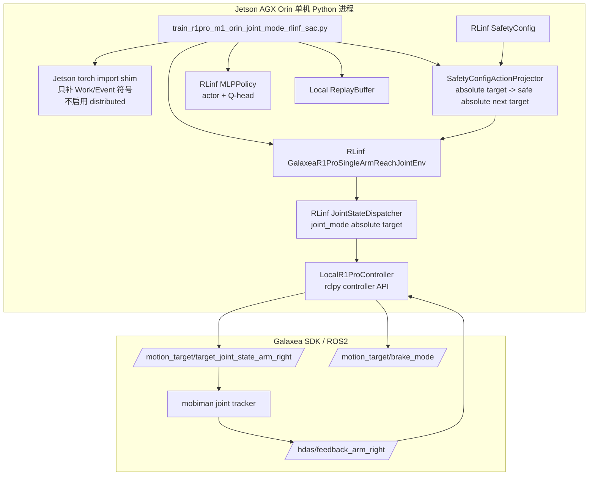

# R1 Pro Orin 单机 RLinf 真机强化学习实操指南：joint_mode 关节到达任务

> 本指南修正 `r1pro6op47_reach_joint2.md` 的双节点/Ray/FSDP 路径，使它能在当前 R1 Pro Orin 上运行。当前 Orin 的 NVIDIA Jetson PyTorch 可以用 CUDA，但 `torch.distributed.is_available() == False`，所以不能走 RLinf 的分布式 Scheduler/WorkerGroup/FSDP。  
> 本指南仍然使用 RLinf：`GalaxeaR1ProSingleArmReachJointEnv`、`SafetyConfig`、`GalaxeaR1ProSafetySupervisor`、`JointStateDispatcher`、`GalaxeaR1ProRobotState`、`MLPPolicy`。替换掉的只是分布式调度层。  
> **重要修正**：本文使用 `joint_mode`，不是 `joint_delta_mode`。策略输出语义是“归一化的绝对关节目标”。为了保证每个关节每次移动都安全，runner 在调用 RLinf env 前用 `SafetyConfig` 的限位和速度参数做动作投影，把策略想去的绝对目标投影成“当前状态附近的安全下一步绝对目标”。

---

## 0. 当前 Orin 真机环境事实

在当前 R1 Pro Orin 上已经确认：

```bash
source /opt/ros/humble/setup.bash
source /home/nvidia/galaxea/install/setup.bash

python - <<'PY'
import torch
import torch.distributed as dist
print("torch:", torch.__version__)
print("cuda:", torch.cuda.is_available())
print("dist:", dist.is_available())
print("has dist.Work:", hasattr(dist, "Work"))
PY
```

实际状态：

```text
torch: 2.4.0a0+07cecf4168.nv24.05
cuda: True
dist: False
has dist.Work: False
```

ROS2/Galaxea SDK 状态：

```bash
ros2 topic info /motion_target/target_joint_state_arm_right -v
ros2 topic echo /hdas/feedback_arm_right --once
```

当前环境显示：

- `/motion_target/target_joint_state_arm_right` 类型是 `sensor_msgs/msg/JointState`，已有 subscriber。
- `/hdas/feedback_arm_right` 可以收到右臂 7 关节反馈。
- 当前右臂反馈接近全零：

```text
position:
- 0.0
- 0.0
- 0.0
- 0.000425531914893617
- -0.000851063829787234
- 0.0
- 0.0
```

Galaxea SDK 中与 joint mode 对应的启动脚本和示例：

```text
/home/nvidia/galaxea/install/startup_config/share/startup_config/script/boot/modules/mobiman/start_mobiman_r1pro_joint.sh
/home/nvidia/galaxea/install/startup_config/share/startup_config/script/boot/modules/mobiman/start_mobiman_r1pro_joint_pid.sh
/home/nvidia/galaxea/install/mobiman/share/mobiman/scripts/robotOpenbox/R1Pro/r1pro_sample_code.py
```

SDK 示例使用的控制话题包括：

```text
/motion_target/target_joint_state_arm_right
/motion_target/target_joint_state_arm_left
/motion_target/target_position_gripper_right
/motion_target/brake_mode
```

所以 M1 应该走 joint tracker，也就是 RLinf 的 `joint_mode`。

---

## 1. 设计目标

本指南要达成的目标：

1. 在 Orin 单机上跑真机 RL，不启动 Ray，不使用 `torch.distributed`。
2. 继续复用 RLinf 的 R1 Pro 环境、任务、模型和安全配置。
3. 使用 `joint_mode`，也就是 `JointStateDispatcher` 的绝对关节目标语义。
4. 每个 episode 起点、reset 终点、任务目标都必须在 `SafetyConfig` 的安全范围内。
5. 每一步真实下发的关节目标都必须满足：

```text
q_safe_abs in [SafetyConfig.right_arm_q_min, SafetyConfig.right_arm_q_max]
abs(q_safe_abs - q_current) <= SafetyConfig.arm_qvel_max * SafetyConfig.dt_step * safety_step_scale
```

其中 `safety_step_scale <= 1.0`，默认取 `0.25`，用于第一次真机 RL 的保守限速。

---

## 2. 为什么 joint_mode 也能保证每步安全

`joint_mode` 的策略动作语义是绝对目标：

```text
policy action a in [-1, 1]^7
q_desired = q_min + (a + 1) * 0.5 * (q_max - q_min)
```

如果直接把 `a` 交给 `JointStateDispatcher`，dispatcher 会保证 `q_desired` 在 `[q_min, q_max]`，但不保证一步移动距离小。这正是上一版指南没有解决好的地方。

本文增加一个 **SafetyConfigActionProjector**：

```text
q_desired = unnormalize(policy_action)
q_abs     = clip(q_desired, safe_lo, safe_hi)
step_cap  = SafetyConfig.arm_qvel_max * SafetyConfig.dt_step * safety_step_scale
q_next    = clip(q_abs, q_current - step_cap, q_current + step_cap)
q_next    = clip(q_next, safe_lo, safe_hi)
safe_action = normalize(q_next)
```

然后把 `safe_action` 交给 RLinf env：

```text
env.step(safe_action)
```

这样仍然是 `joint_mode`：

- `JointStateDispatcher` 收到的是 absolute target 的归一化动作。
- 只是这个 absolute target 已经被投影成“本步安全可达的绝对目标”。
- 最终下发仍然是 `/motion_target/target_joint_state_arm_right` 的 `JointState.position`。

---

## 3. SafetyConfig 是唯一安全边界来源

不要在脚本里手写另一套 q limit。本文代码通过：

```python
from rlinf.envs.realworld.galaxear.r1_pro_safety import build_safety_config
```

构造 `SafetyConfig`，并使用这些字段：

```python
safety_cfg.right_arm_q_min
safety_cfg.right_arm_q_max
safety_cfg.arm_qvel_max
safety_cfg.dt_step
safety_cfg.l2_warning_margin_rad
safety_cfg.l2_critical_margin_rad
safety_cfg.bms_low_battery_threshold_pct
safety_cfg.feedback_stale_threshold_ms
```

当前默认值来自 `rlinf/envs/realworld/galaxear/r1_pro_safety.py`：

```text
right_arm_q_min = [-4.35, -3.04, -2.26, -1.99, -2.26, -0.95, -1.47]
right_arm_q_max = [ 1.21,  0.07,  2.26,  0.25,  2.26,  0.95,  1.47]
arm_qvel_max    = [ 1.6,   1.6,   1.6,   1.6,   4.0,   4.0,   4.0]
dt_step         = 0.10
l2_warning_margin_rad  = 0.15
l2_critical_margin_rad = 0.05
```

本文默认把真正可用范围收缩为：

```text
safe_lo = right_arm_q_min + l2_critical_margin_rad
safe_hi = right_arm_q_max - l2_critical_margin_rad
```

这样起点、reset 终点、任务目标和每一步目标都远离硬边界。

---

## 4. 总体架构



runner 替换掉的是：

```text
RLinf Cluster / WorkerGroup / Ray / FSDP
```

保留的是：

```text
RLinf R1 Pro task / env / SafetyConfig / JointStateDispatcher / MLPPolicy
```

---

## 5. 文件布局

需要新增两个文件：

```text
examples/embodiment/config/r1pro_m1_orin_joint_mode_rlinf_sac.yaml
toolkits/realworld_check/train_r1pro_m1_orin_joint_mode_rlinf_sac.py
```

下面给出完整内容。

---

## 6. 配置文件

创建 `examples/embodiment/config/r1pro_m1_orin_joint_mode_rlinf_sac.yaml`：

```yaml
# R1 Pro Orin local single-process RLinf SAC in joint_mode.
# The policy action is normalized absolute joint target.
# SafetyConfigActionProjector constrains every sent absolute target.

seed: 11
device: auto

runtime:
  ros_domain_id: 41
  rmw_implementation: rmw_cyclonedds_cpp
  galaxea_install_path: /home/nvidia/galaxea/install
  out_dir: logs/r1pro_m1_orin_joint_mode_rlinf_sac

  # Additional conservative multiplier on SafetyConfig.arm_qvel_max * dt_step.
  # 0.25 means at most 25% of the configured per-step velocity envelope.
  safety_step_scale: 0.25

  # Use l2_critical_margin_rad from SafetyConfig by default.
  # Set null to use SafetyConfig.l2_critical_margin_rad.
  safety_margin_rad: null

env:
  override_cfg:
    is_dummy: false
    ros_domain_id: 41
    ros_localhost_only: false
    galaxea_install_path: /home/nvidia/galaxea/install
    mobiman_launch_mode: joint

    # Correct mode: joint_mode, not joint_delta_mode.
    use_joint_mode: true
    joint_delta_mode: false
    use_new_dispatcher: true

    use_right_arm: true
    use_left_arm: false
    use_torso: false
    use_chassis: false
    no_gripper: true
    cameras: []

    step_frequency: 10.0
    max_num_steps: 200
    success_hold_steps: 5

    # M1 target: must pass SafetyConfig range check with margin.
    target_q_right: [0.18, -0.20, 0.0, -0.45, 0.0, 0.35, 0.0]
    joint_tolerance_rad: 0.05

    # Safe reset pose: also checked against SafetyConfig.
    home_q_right: [0.0, -0.10, 0.0, -0.30, 0.0, 0.20, 0.0]

    # JointState.velocity sent to mobiman. Projector is stricter than this.
    arm_qvel_max: [0.3, 0.3, 0.3, 0.3, 0.6, 0.6, 0.6]

    safety_cfg:
      # Defaults are from SafetyConfig. They are repeated here so the run is
      # explicit and auditable.
      right_arm_q_min: [-4.35, -3.04, -2.26, -1.99, -2.26, -0.95, -1.47]
      right_arm_q_max: [ 1.21,  0.07,  2.26,  0.25,  2.26,  0.95,  1.47]
      arm_qvel_max: [1.6, 1.6, 1.6, 1.6, 4.0, 4.0, 4.0]
      dt_step: 0.10
      l2_warning_margin_rad: 0.15
      l2_critical_margin_rad: 0.05
      feedback_stale_threshold_ms: 300.0
      operator_heartbeat_timeout_ms: 3000.0

sac:
  obs_dim: 14
  action_dim: 7
  gamma: 0.96
  tau: 0.005
  lr: 0.0003
  alpha: 0.01
  auto_alpha: true
  target_entropy: -7.0
  batch_size: 128
  replay_size: 20000
  start_steps: 300
  update_after: 256
  updates_per_env_step: 1

train:
  total_episodes: 120
  save_every_episodes: 10
  safe_reset_tolerance_rad: 0.025
  safe_reset_max_steps: 200

eval:
  episodes: 10
```

配置要点：

- `joint_delta_mode: false`：明确使用 joint_mode。
- `safety_cfg` 是安全边界来源。
- `SafetyConfigActionProjector` 使用 `safety_cfg` 把策略输出投影成安全下一步。
- `arm_qvel_max` 是发给 mobiman 的 velocity 字段；实际每步限幅还会被 projector 进一步收紧。

---

## 7. 完整 runner 代码

创建 `toolkits/realworld_check/train_r1pro_m1_orin_joint_mode_rlinf_sac.py`：

```python
#!/usr/bin/env python3
"""Run R1 Pro M1 joint reaching with RLinf components on Orin in joint_mode.

Uses:
  * RLinf GalaxeaR1ProSingleArmReachJointEnv
  * RLinf SafetyConfig via build_safety_config
  * RLinf JointStateDispatcher (joint_mode absolute target)
  * RLinf MLPPolicy and ForwardType.SAC / SAC_Q

Does not use:
  * Ray
  * RLinf WorkerGroup / Cluster / Channel
  * torch.distributed collectives
  * FSDP
"""

from __future__ import annotations

import argparse
import csv
import json
import math
import os
import random
import threading
import time
from dataclasses import dataclass
from pathlib import Path
from typing import Any

import numpy as np
import torch


def install_jetson_torch_import_shim() -> None:
    """Patch import-time symbols absent in distributed-disabled Jetson torch."""
    import torch.distributed as dist

    if not hasattr(dist, "Work"):
        class _StubWork:
            def wait(self, *args, **kwargs):
                raise RuntimeError("torch.distributed is disabled on this Orin.")

            def is_completed(self) -> bool:
                return False

        dist.Work = _StubWork  # type: ignore[attr-defined]

    if not hasattr(torch, "Event"):
        torch.Event = torch.cuda.Event if torch.cuda.is_available() else object  # type: ignore[attr-defined]


install_jetson_torch_import_shim()

from rlinf.envs.realworld.galaxear.r1_pro_controller import (  # noqa: E402
    GalaxeaR1ProController,
)
from rlinf.envs.realworld.galaxear.r1_pro_robot_state import (  # noqa: E402
    GalaxeaR1ProRobotState,
)
from rlinf.envs.realworld.galaxear.r1_pro_safety import (  # noqa: E402
    SafetyConfig,
    build_safety_config,
)
from rlinf.envs.realworld.galaxear.tasks.r1_pro_single_arm_reach_joint import (  # noqa: E402
    GalaxeaR1ProSingleArmReachJointEnv,
)
from rlinf.models.embodiment.base_policy import ForwardType  # noqa: E402
from rlinf.models.embodiment.mlp_policy.mlp_policy import MLPPolicy  # noqa: E402


def load_yaml(path: str | Path) -> dict[str, Any]:
    import yaml

    with open(path, "r", encoding="utf-8") as f:
        return yaml.safe_load(f)


def get(d: dict[str, Any], dotted: str, default: Any = None) -> Any:
    cur: Any = d
    for part in dotted.split("."):
        if not isinstance(cur, dict) or part not in cur:
            return default
        cur = cur[part]
    return cur


def set_seed(seed: int) -> None:
    random.seed(seed)
    np.random.seed(seed)
    torch.manual_seed(seed)
    if torch.cuda.is_available():
        torch.cuda.manual_seed_all(seed)


class LocalRef:
    """RPC-like result object because RLinf env calls .wait()[0]."""

    def __init__(self, value: Any = None):
        self._value = value

    def wait(self):
        return [self._value]


class LocalR1ProController:
    """Local rclpy implementation of the subset of GalaxeaR1ProController API."""

    DEFAULT_JOINT_NAMES = {
        "right": [f"arm_right_j{i + 1}" for i in range(7)],
        "left": [f"arm_left_j{i + 1}" for i in range(7)],
    }

    def __init__(
        self,
        *,
        ros_domain_id: int,
        ros_localhost_only: bool,
        use_right_arm: bool,
        use_left_arm: bool,
        **_: Any,
    ) -> None:
        os.environ["ROS_DOMAIN_ID"] = str(ros_domain_id)
        os.environ["ROS_LOCALHOST_ONLY"] = "1" if ros_localhost_only else "0"

        import rclpy
        from geometry_msgs.msg import PoseStamped
        from rclpy.executors import MultiThreadedExecutor
        from rclpy.qos import HistoryPolicy, QoSProfile, ReliabilityPolicy
        from sensor_msgs.msg import JointState
        from std_msgs.msg import Bool

        self.rclpy = rclpy
        self.JointState = JointState
        self.Bool = Bool
        self.PoseStamped = PoseStamped

        if not rclpy.ok():
            rclpy.init(args=[])
        self.node = rclpy.create_node(f"rlinf_local_joint_mode_controller_{os.getpid()}")
        self.executor = MultiThreadedExecutor(num_threads=4)
        self.executor.add_node(self.node)

        reliable = QoSProfile(
            reliability=ReliabilityPolicy.RELIABLE,
            history=HistoryPolicy.KEEP_LAST,
            depth=1,
        )
        from rclpy.qos import qos_profile_sensor_data

        self.state = GalaxeaR1ProRobotState()
        self.lock = threading.RLock()
        self.first_seen: dict[str, float] = {}
        self.pubs: dict[str, Any] = {}

        if use_right_arm:
            self.pubs["target_joint_state_arm_right"] = self.node.create_publisher(
                JointState, "/motion_target/target_joint_state_arm_right", reliable
            )
            self.node.create_subscription(
                JointState, "/hdas/feedback_arm_right", self._on_arm_right, qos_profile_sensor_data
            )
            self.node.create_subscription(
                PoseStamped, "/motion_control/pose_ee_arm_right", self._on_pose_right, qos_profile_sensor_data
            )
        if use_left_arm:
            self.pubs["target_joint_state_arm_left"] = self.node.create_publisher(
                JointState, "/motion_target/target_joint_state_arm_left", reliable
            )
        self.pubs["brake_mode"] = self.node.create_publisher(
            Bool, "/motion_target/brake_mode", reliable
        )

        try:
            from hdas_msg.msg import Bms, ControllerSignalStamped, FeedbackStatus

            self.node.create_subscription(Bms, "/hdas/bms", self._on_bms, qos_profile_sensor_data)
            self.node.create_subscription(
                ControllerSignalStamped, "/controller", self._on_controller_signal, qos_profile_sensor_data
            )
            self.node.create_subscription(
                FeedbackStatus, "/hdas/feedback_status_arm_right",
                lambda msg: self._on_status(msg, "right"),
                qos_profile_sensor_data,
            )
        except ImportError:
            pass

        self.running = True
        self.spin_thread = threading.Thread(target=self._spin, daemon=True)
        self.spin_thread.start()

    def _spin(self) -> None:
        while self.running and self.rclpy.ok():
            self.executor.spin_once(timeout_sec=0.05)
            self._update_feedback_age()

    def _stamp(self, key: str) -> None:
        self.first_seen[key] = time.time()

    def _update_feedback_age(self) -> None:
        now = time.time()
        with self.lock:
            for key, t0 in self.first_seen.items():
                self.state.feedback_age_ms[key] = (now - t0) * 1000.0
            self.state.is_alive = any(age < 1500.0 for age in self.state.feedback_age_ms.values())

    def _on_arm_right(self, msg) -> None:
        self._stamp("arm_right")
        with self.lock:
            if msg.position:
                self.state.right_arm_qpos = np.asarray(msg.position[:7], dtype=np.float32)
            if msg.velocity:
                self.state.right_arm_qvel = np.asarray(msg.velocity[:7], dtype=np.float32)
            if msg.effort:
                self.state.right_arm_qtau = np.asarray(msg.effort[:7], dtype=np.float32)

    def _on_pose_right(self, msg) -> None:
        self._stamp("pose_ee_arm_right")
        p = msg.pose.position
        q = msg.pose.orientation
        with self.lock:
            self.state.right_ee_pose = np.asarray(
                [p.x, p.y, p.z, q.x, q.y, q.z, q.w], dtype=np.float32
            )

    def _on_bms(self, msg) -> None:
        with self.lock:
            self.state.bms["capital_pct"] = float(
                getattr(msg, "capital", getattr(msg, "capital_pct", 100.0))
            )

    def _on_controller_signal(self, msg) -> None:
        data = getattr(msg, "data", msg)
        with self.lock:
            self._stamp("controller")
            self.state.controller_signal = {
                "mode": int(getattr(data, "mode", 0)),
                "swa": int(getattr(data, "swa", 0)),
                "swb": int(getattr(data, "swb", 0)),
                "swc": int(getattr(data, "swc", 0)),
                "swd": int(getattr(data, "swd", 0)),
            }

    def _on_status(self, msg, side: str) -> None:
        with self.lock:
            self.state.status_errors[side] = list(getattr(msg, "errors", []) or [])

    def get_state(self) -> GalaxeaR1ProRobotState:
        with self.lock:
            return self.state.copy()

    def is_robot_up(self) -> bool:
        return bool(self.get_state().is_alive)

    def send_arm_joints(self, side: str, qpos: list, qvel_max: list | None = None) -> None:
        topic = f"target_joint_state_arm_{side}"
        if topic not in self.pubs:
            raise ValueError(f"{topic} publisher not enabled")
        msg = self.JointState()
        msg.header.stamp = self.node.get_clock().now().to_msg()
        msg.name = list(self.DEFAULT_JOINT_NAMES.get(side, []))
        msg.position = [float(x) for x in list(qpos)[:7]]
        msg.velocity = [float(x) for x in (qvel_max or [0.3, 0.3, 0.3, 0.3, 0.6, 0.6, 0.6])[:7]]
        self.pubs[topic].publish(msg)

    def apply_brake(self, on: bool) -> None:
        msg = self.Bool()
        msg.data = bool(on)
        self.pubs["brake_mode"].publish(msg)

    def get_subscription_count(self, topic: str) -> int:
        for pub in self.pubs.values():
            if getattr(pub, "topic_name", "") == topic:
                return int(pub.get_subscription_count())
        return 0

    def shutdown(self) -> None:
        self.running = False
        time.sleep(0.1)
        self.executor.remove_node(self.node)
        self.node.destroy_node()


class LocalControllerRpcShim:
    def __init__(self, controller: LocalR1ProController):
        self.controller = controller

    def get_state(self):
        return LocalRef(self.controller.get_state())

    def is_robot_up(self):
        return LocalRef(self.controller.is_robot_up())

    def send_arm_joints(self, *args, **kwargs):
        return LocalRef(self.controller.send_arm_joints(*args, **kwargs))

    def apply_brake(self, *args, **kwargs):
        return LocalRef(self.controller.apply_brake(*args, **kwargs))

    def get_subscription_count(self, topic: str) -> int:
        return self.controller.get_subscription_count(topic)

    def shutdown(self) -> None:
        self.controller.shutdown()


def patch_rlinf_for_local_controller() -> None:
    """Make RLinf env use a local rclpy controller instead of Ray WorkerGroup."""

    def _launch_local_controller(**kwargs):
        return LocalControllerRpcShim(LocalR1ProController(**kwargs))

    GalaxeaR1ProController.launch_controller = staticmethod(_launch_local_controller)

    # Avoid env.__init__ doing a one-shot absolute reset. The runner performs
    # segmented joint_mode reset through SafetyConfigActionProjector.
    from rlinf.envs.realworld.galaxear import r1_pro_env

    r1_pro_env.GalaxeaR1ProEnv._reset_to_safe_pose = lambda self: None


class SafetyConfigActionProjector:
    """Project joint_mode absolute-target actions into SafetyConfig-safe actions."""

    def __init__(self, safety_cfg: SafetyConfig, step_scale: float, margin: float | None = None):
        self.cfg = safety_cfg
        self.q_min = np.asarray(safety_cfg.right_arm_q_min, dtype=np.float32)
        self.q_max = np.asarray(safety_cfg.right_arm_q_max, dtype=np.float32)
        self.margin = float(
            safety_cfg.l2_critical_margin_rad if margin is None else margin
        )
        self.safe_lo = self.q_min + self.margin
        self.safe_hi = self.q_max - self.margin
        self.step_cap = (
            np.asarray(safety_cfg.arm_qvel_max, dtype=np.float32)
            * float(safety_cfg.dt_step)
            * float(step_scale)
        )
        if not np.all(self.safe_hi > self.safe_lo):
            raise ValueError("SafetyConfig margins leave no valid joint range.")
        if not np.all(self.step_cap > 0):
            raise ValueError("step_cap must be positive.")

    def normalize(self, q_abs: np.ndarray) -> np.ndarray:
        q = np.asarray(q_abs, dtype=np.float32)
        return np.clip(2.0 * (q - self.q_min) / (self.q_max - self.q_min) - 1.0, -1.0, 1.0)

    def unnormalize(self, action: np.ndarray) -> np.ndarray:
        a = np.clip(np.asarray(action, dtype=np.float32), -1.0, 1.0)
        return self.q_min + (a + 1.0) * 0.5 * (self.q_max - self.q_min)

    def assert_inside(self, name: str, q_abs: np.ndarray) -> None:
        q = np.asarray(q_abs, dtype=np.float32)
        if not np.all((q >= self.safe_lo) & (q <= self.safe_hi)):
            raise RuntimeError(
                f"{name} outside SafetyConfig safe range: "
                f"q={q.tolist()}, safe_lo={self.safe_lo.tolist()}, safe_hi={self.safe_hi.tolist()}"
            )

    def project(self, policy_action: np.ndarray, q_current: np.ndarray) -> tuple[np.ndarray, dict[str, Any]]:
        q_current = np.asarray(q_current, dtype=np.float32)
        self.assert_inside("q_current", q_current)

        q_desired = self.unnormalize(policy_action)
        q_desired = np.clip(q_desired, self.safe_lo, self.safe_hi)

        q_step_lo = np.maximum(q_current - self.step_cap, self.safe_lo)
        q_step_hi = np.minimum(q_current + self.step_cap, self.safe_hi)
        q_safe = np.clip(q_desired, q_step_lo, q_step_hi)
        safe_action = self.normalize(q_safe)

        info = {
            "q_desired": q_desired.tolist(),
            "q_safe": q_safe.tolist(),
            "delta": (q_safe - q_current).tolist(),
            "step_cap": self.step_cap.tolist(),
        }
        return safe_action.astype(np.float32), info


class ReplayBuffer:
    def __init__(self, obs_dim: int, action_dim: int, size: int):
        self.obs = np.zeros((size, obs_dim), dtype=np.float32)
        self.next_obs = np.zeros((size, obs_dim), dtype=np.float32)
        self.actions = np.zeros((size, action_dim), dtype=np.float32)
        self.rewards = np.zeros((size, 1), dtype=np.float32)
        self.dones = np.zeros((size, 1), dtype=np.float32)
        self.size = size
        self.ptr = 0
        self.count = 0

    def add(self, obs, action, reward, next_obs, done) -> None:
        i = self.ptr
        self.obs[i] = obs
        self.actions[i] = action
        self.rewards[i] = reward
        self.next_obs[i] = next_obs
        self.dones[i] = float(done)
        self.ptr = (self.ptr + 1) % self.size
        self.count = min(self.count + 1, self.size)

    def sample(self, batch_size: int, device: torch.device) -> dict[str, torch.Tensor]:
        idx = np.random.randint(0, self.count, size=batch_size)
        return {
            "obs": torch.as_tensor(self.obs[idx], dtype=torch.float32, device=device),
            "actions": torch.as_tensor(self.actions[idx], dtype=torch.float32, device=device),
            "rewards": torch.as_tensor(self.rewards[idx], dtype=torch.float32, device=device),
            "next_obs": torch.as_tensor(self.next_obs[idx], dtype=torch.float32, device=device),
            "dones": torch.as_tensor(self.dones[idx], dtype=torch.float32, device=device),
        }


def flatten_obs(obs: dict[str, Any]) -> np.ndarray:
    state = obs["state"]
    parts = [np.asarray(state[k], dtype=np.float32).reshape(-1) for k in sorted(state)]
    return np.concatenate(parts).astype(np.float32)


def obs_tensor(x: torch.Tensor) -> dict[str, torch.Tensor]:
    return {"states": x}


def choose_device(cfg: dict[str, Any]) -> torch.device:
    want = str(get(cfg, "device", "auto"))
    if want == "cuda":
        return torch.device("cuda")
    if want == "cpu":
        return torch.device("cpu")
    return torch.device("cuda" if torch.cuda.is_available() else "cpu")


def make_policy(cfg: dict[str, Any], device: torch.device) -> MLPPolicy:
    return MLPPolicy(
        obs_dim=int(get(cfg, "sac.obs_dim")),
        action_dim=int(get(cfg, "sac.action_dim")),
        num_action_chunks=1,
        add_value_head=False,
        add_q_head=True,
        q_head_type="default",
    ).to(device)


@dataclass
class SACState:
    model: MLPPolicy
    target: MLPPolicy
    actor_opt: torch.optim.Optimizer
    critic_opt: torch.optim.Optimizer
    log_alpha: torch.Tensor
    alpha_opt: torch.optim.Optimizer

    @property
    def alpha(self) -> torch.Tensor:
        return self.log_alpha.exp()


def make_sac(cfg: dict[str, Any], device: torch.device) -> SACState:
    model = make_policy(cfg, device)
    target = make_policy(cfg, device)
    target.load_state_dict(model.state_dict())
    actor_params = [p for n, p in model.named_parameters() if not n.startswith("q_head.")]
    critic_params = list(model.q_head.parameters())
    lr = float(get(cfg, "sac.lr"))
    log_alpha = torch.tensor(
        math.log(float(get(cfg, "sac.alpha"))),
        dtype=torch.float32,
        device=device,
        requires_grad=True,
    )
    return SACState(
        model=model,
        target=target,
        actor_opt=torch.optim.Adam(actor_params, lr=lr),
        critic_opt=torch.optim.Adam(critic_params, lr=lr),
        log_alpha=log_alpha,
        alpha_opt=torch.optim.Adam([log_alpha], lr=lr),
    )


@torch.no_grad()
def act(sac: SACState, obs_np: np.ndarray, device: torch.device, deterministic: bool) -> np.ndarray:
    x = torch.as_tensor(obs_np[None, :], dtype=torch.float32, device=device)
    if deterministic:
        feat = sac.model.backbone(x)
        action = torch.tanh(sac.model.actor_mean(feat))
        return action.cpu().numpy()[0].astype(np.float32)
    action, _, _ = sac.model.forward(forward_type=ForwardType.SAC, obs=obs_tensor(x))
    return action.cpu().numpy()[0].astype(np.float32)


def update_sac(sac: SACState, batch: dict[str, torch.Tensor], cfg: dict[str, Any]) -> dict[str, float]:
    gamma = float(get(cfg, "sac.gamma"))
    tau = float(get(cfg, "sac.tau"))
    target_entropy = float(get(cfg, "sac.target_entropy"))

    obs = batch["obs"]
    actions = batch["actions"]
    rewards = batch["rewards"]
    next_obs = batch["next_obs"]
    dones = batch["dones"]

    with torch.no_grad():
        next_action, next_logp_each, _ = sac.model.forward(
            forward_type=ForwardType.SAC,
            obs=obs_tensor(next_obs),
        )
        next_logp = next_logp_each.sum(dim=-1, keepdim=True)
        q_next = sac.target.forward(
            forward_type=ForwardType.SAC_Q,
            obs=obs_tensor(next_obs),
            actions=next_action,
        )
        q_next_min = torch.min(q_next[:, :1], q_next[:, 1:2])
        target_q = rewards + gamma * (1.0 - dones) * (
            q_next_min - sac.alpha.detach() * next_logp
        )

    q = sac.model.forward(
        forward_type=ForwardType.SAC_Q,
        obs=obs_tensor(obs),
        actions=actions,
    )
    q_loss = torch.nn.functional.mse_loss(q[:, :1], target_q) + torch.nn.functional.mse_loss(q[:, 1:2], target_q)
    sac.critic_opt.zero_grad(set_to_none=True)
    q_loss.backward()
    sac.critic_opt.step()

    new_action, logp_each, _ = sac.model.forward(
        forward_type=ForwardType.SAC,
        obs=obs_tensor(obs),
    )
    logp = logp_each.sum(dim=-1, keepdim=True)
    q_pi = sac.model.forward(
        forward_type=ForwardType.SAC_Q,
        obs=obs_tensor(obs),
        actions=new_action,
    )
    q_pi_min = torch.min(q_pi[:, :1], q_pi[:, 1:2])
    actor_loss = (sac.alpha.detach() * logp - q_pi_min).mean()
    sac.actor_opt.zero_grad(set_to_none=True)
    actor_loss.backward()
    sac.actor_opt.step()

    alpha_loss = -(sac.log_alpha * (logp + target_entropy).detach()).mean()
    sac.alpha_opt.zero_grad(set_to_none=True)
    alpha_loss.backward()
    sac.alpha_opt.step()

    with torch.no_grad():
        for p, pt in zip(sac.model.q_head.parameters(), sac.target.q_head.parameters()):
            pt.data.mul_(1.0 - tau).add_(tau * p.data)

    return {
        "q_loss": float(q_loss.detach().cpu()),
        "actor_loss": float(actor_loss.detach().cpu()),
        "alpha": float(sac.alpha.detach().cpu()),
        "q_mean": float(q.mean().detach().cpu()),
    }


def patch_rlinf_for_local_controller() -> None:
    def _launch_local_controller(**kwargs):
        return LocalControllerRpcShim(LocalR1ProController(**kwargs))

    GalaxeaR1ProController.launch_controller = staticmethod(_launch_local_controller)

    # Prevent one-shot absolute reset inside env init/reset. We do segmented
    # joint_mode reset with SafetyConfigActionProjector instead.
    from rlinf.envs.realworld.galaxear import r1_pro_env

    r1_pro_env.GalaxeaR1ProEnv._reset_to_safe_pose = lambda self: None


def build_env(cfg: dict[str, Any]):
    patch_rlinf_for_local_controller()
    return GalaxeaR1ProSingleArmReachJointEnv(
        override_cfg=dict(get(cfg, "env.override_cfg")),
        worker_info=None,
        hardware_info=None,
        env_idx=0,
    )


def build_projector(cfg: dict[str, Any]) -> SafetyConfigActionProjector:
    safety_cfg = build_safety_config(dict(get(cfg, "env.override_cfg.safety_cfg") or {}))
    margin_value = get(cfg, "runtime.safety_margin_rad", None)
    margin = None if margin_value is None else float(margin_value)
    return SafetyConfigActionProjector(
        safety_cfg=safety_cfg,
        step_scale=float(get(cfg, "runtime.safety_step_scale")),
        margin=margin,
    )


def preflight(env, projector: SafetyConfigActionProjector, cfg: dict[str, Any]) -> None:
    st = env._controller.get_state().wait()[0]
    q_current = np.asarray(st.right_arm_qpos, dtype=np.float32)
    reset_q = np.asarray(get(cfg, "env.override_cfg.home_q_right"), dtype=np.float32)
    target_q = np.asarray(get(cfg, "env.override_cfg.target_q_right"), dtype=np.float32)

    projector.assert_inside("current q", q_current)
    projector.assert_inside("reset_q", reset_q)
    projector.assert_inside("target_q", target_q)

    sub_count = env._controller.get_subscription_count("/motion_target/target_joint_state_arm_right")
    if sub_count <= 0:
        raise RuntimeError("No subscriber on /motion_target/target_joint_state_arm_right")

    print("[PREFLIGHT] current_q:", q_current.tolist())
    print("[PREFLIGHT] reset_q:", reset_q.tolist())
    print("[PREFLIGHT] target_q:", target_q.tolist())
    print("[PREFLIGHT] safe_lo:", projector.safe_lo.tolist())
    print("[PREFLIGHT] safe_hi:", projector.safe_hi.tolist())
    print("[PREFLIGHT] step_cap:", projector.step_cap.tolist())
    print("[PREFLIGHT] target topic subscriber count:", sub_count)


def safe_env_step(env, projector: SafetyConfigActionProjector, policy_action: np.ndarray):
    st = env._controller.get_state().wait()[0]
    q_current = np.asarray(st.right_arm_qpos, dtype=np.float32)
    safe_action, proj_info = projector.project(policy_action, q_current)
    obs, reward, terminated, truncated, info = env.step(safe_action)
    info["projector"] = proj_info
    return obs, reward, terminated, truncated, info, safe_action


def safe_move_to_q(env, projector: SafetyConfigActionProjector, q_goal: np.ndarray, cfg: dict[str, Any]) -> np.ndarray:
    projector.assert_inside("q_goal", q_goal)
    tol = float(get(cfg, "train.safe_reset_tolerance_rad"))
    max_steps = int(get(cfg, "train.safe_reset_max_steps"))
    obs = env._get_observation()
    for _ in range(max_steps):
        st = env._controller.get_state().wait()[0]
        cur = np.asarray(st.right_arm_qpos, dtype=np.float32)
        err = q_goal - cur
        if float(np.linalg.norm(err)) <= tol:
            return flatten_obs(obs)
        # In joint_mode we create an absolute q target, normalize it, then let
        # the projector enforce SafetyConfig step caps.
        raw_action = projector.normalize(q_goal)
        obs, _, _, _, info, _ = safe_env_step(env, projector, raw_action)
        if info.get("safe_pause"):
            raise RuntimeError(f"safe reset paused by RLinf safety: {info}")
    raise RuntimeError(f"safe reset did not converge to {q_goal.tolist()}")


def save_checkpoint(path: Path, sac: SACState, step: int, cfg: dict[str, Any]) -> None:
    path.parent.mkdir(parents=True, exist_ok=True)
    torch.save(
        {
            "step": step,
            "cfg": cfg,
            "model": sac.model.state_dict(),
            "target": sac.target.state_dict(),
            "log_alpha": sac.log_alpha.detach().cpu(),
        },
        path,
    )


def load_checkpoint(path: Path, sac: SACState, device: torch.device) -> int:
    ckpt = torch.load(path, map_location=device)
    sac.model.load_state_dict(ckpt["model"])
    sac.target.load_state_dict(ckpt["target"])
    sac.log_alpha.data.copy_(ckpt["log_alpha"].to(device))
    return int(ckpt.get("step", 0))


def train(cfg: dict[str, Any], args: argparse.Namespace) -> None:
    set_seed(int(get(cfg, "seed")))
    device = choose_device(cfg)
    out_dir = Path(str(get(cfg, "runtime.out_dir")))
    out_dir.mkdir(parents=True, exist_ok=True)
    with open(out_dir / "config_snapshot.json", "w", encoding="utf-8") as f:
        json.dump(cfg, f, ensure_ascii=False, indent=2)

    env = build_env(cfg)
    projector = build_projector(cfg)
    preflight(env, projector, cfg)
    sac = make_sac(cfg, device)
    global_step = 0
    if args.resume:
        global_step = load_checkpoint(Path(args.resume), sac, device)

    buffer = ReplayBuffer(
        obs_dim=int(get(cfg, "sac.obs_dim")),
        action_dim=int(get(cfg, "sac.action_dim")),
        size=int(get(cfg, "sac.replay_size")),
    )
    reset_q = np.asarray(get(cfg, "env.override_cfg.home_q_right"), dtype=np.float32)
    batch_size = int(get(cfg, "sac.batch_size"))
    start_steps = int(get(cfg, "sac.start_steps"))
    update_after = int(get(cfg, "sac.update_after"))
    updates_per_step = int(get(cfg, "sac.updates_per_env_step"))
    total_episodes = int(get(cfg, "train.total_episodes"))
    save_every = int(get(cfg, "train.save_every_episodes"))

    metrics_path = out_dir / "train_metrics.csv"
    with open(metrics_path, "w", newline="", encoding="utf-8") as f:
        writer = csv.DictWriter(
            f,
            fieldnames=[
                "episode", "global_step", "episode_return", "episode_len",
                "final_joint_l2", "q_loss", "actor_loss", "alpha", "q_mean",
            ],
        )
        writer.writeheader()
        last_update = {"q_loss": 0.0, "actor_loss": 0.0, "alpha": 0.0, "q_mean": 0.0}

        try:
            for ep in range(1, total_episodes + 1):
                obs = safe_move_to_q(env, projector, reset_q, cfg)
                ep_ret = 0.0
                final_l2 = float("inf")
                ep_len = 0

                for t in range(int(get(cfg, "env.override_cfg.max_num_steps"))):
                    if global_step < start_steps:
                        raw_action = np.random.uniform(-1.0, 1.0, size=7).astype(np.float32)
                    else:
                        raw_action = act(sac, obs, device, deterministic=False)

                    next_raw, reward, terminated, truncated, info, safe_action = safe_env_step(
                        env, projector, raw_action
                    )
                    next_obs = flatten_obs(next_raw)
                    done = bool(terminated or truncated)

                    # Store the actually executed safe joint_mode action.
                    buffer.add(obs, safe_action, reward, next_obs, done)
                    obs = next_obs
                    ep_ret += float(reward)
                    ep_len = t + 1
                    global_step += 1

                    st = env._controller.get_state().wait()[0]
                    target_q = np.asarray(get(cfg, "env.override_cfg.target_q_right"), dtype=np.float32)
                    final_l2 = float(np.linalg.norm(st.right_arm_qpos - target_q))

                    if info.get("safe_pause"):
                        print("[SAFE_PAUSE]", info)
                        break

                    if buffer.count >= update_after:
                        for _ in range(updates_per_step):
                            batch = buffer.sample(batch_size, device)
                            last_update = update_sac(sac, batch, cfg)

                    if done:
                        break

                row = {
                    "episode": ep,
                    "global_step": global_step,
                    "episode_return": ep_ret,
                    "episode_len": ep_len,
                    "final_joint_l2": final_l2,
                    **last_update,
                }
                writer.writerow(row)
                f.flush()
                print("[EP]", row)

                if ep % save_every == 0:
                    save_checkpoint(out_dir / "checkpoints" / f"episode_{ep:04d}.pt", sac, global_step, cfg)

        except KeyboardInterrupt:
            print("[WARN] interrupted; braking and saving checkpoint")
            save_checkpoint(out_dir / "checkpoints" / "interrupted.pt", sac, global_step, cfg)
            env._controller.apply_brake(True).wait()
        finally:
            env._controller.apply_brake(True).wait()
            if hasattr(env._controller, "shutdown"):
                env._controller.shutdown()


def evaluate(cfg: dict[str, Any], args: argparse.Namespace) -> None:
    if not args.checkpoint:
        raise ValueError("--checkpoint is required for --eval")
    device = choose_device(cfg)
    env = build_env(cfg)
    projector = build_projector(cfg)
    preflight(env, projector, cfg)
    sac = make_sac(cfg, device)
    load_checkpoint(Path(args.checkpoint), sac, device)

    reset_q = np.asarray(get(cfg, "env.override_cfg.home_q_right"), dtype=np.float32)
    target_q = np.asarray(get(cfg, "env.override_cfg.target_q_right"), dtype=np.float32)
    episodes = int(get(cfg, "eval.episodes"))
    success = 0
    try:
        for ep in range(1, episodes + 1):
            obs = safe_move_to_q(env, projector, reset_q, cfg)
            ep_ret = 0.0
            final_l2 = float("inf")
            for t in range(int(get(cfg, "env.override_cfg.max_num_steps"))):
                raw_action = act(sac, obs, device, deterministic=True)
                next_raw, reward, terminated, truncated, info, _ = safe_env_step(
                    env, projector, raw_action
                )
                obs = flatten_obs(next_raw)
                ep_ret += float(reward)
                st = env._controller.get_state().wait()[0]
                final_l2 = float(np.linalg.norm(st.right_arm_qpos - target_q))
                if terminated or truncated or info.get("safe_pause"):
                    break
            ok = final_l2 < float(get(cfg, "env.override_cfg.joint_tolerance_rad"))
            success += int(ok)
            print(f"[EVAL] ep={ep} ret={ep_ret:+.3f} final_l2={final_l2:.4f} success={ok}")
    finally:
        env._controller.apply_brake(True).wait()
        if hasattr(env._controller, "shutdown"):
            env._controller.shutdown()
    print(f"[EVAL] success={success}/{episodes}")


def parse_args() -> argparse.Namespace:
    p = argparse.ArgumentParser()
    p.add_argument("--config", default="examples/embodiment/config/r1pro_m1_orin_joint_mode_rlinf_sac.yaml")
    p.add_argument("--resume", default=None)
    p.add_argument("--eval", action="store_true")
    p.add_argument("--checkpoint", default=None)
    return p.parse_args()


def main() -> None:
    args = parse_args()
    cfg = load_yaml(args.config)
    os.environ["ROS_DOMAIN_ID"] = str(get(cfg, "runtime.ros_domain_id"))
    os.environ["RMW_IMPLEMENTATION"] = str(get(cfg, "runtime.rmw_implementation"))
    print("[INFO] torch", torch.__version__, "cuda", torch.cuda.is_available())
    print("[INFO] torch.distributed intentionally unused")
    if args.eval:
        evaluate(cfg, args)
    else:
        train(cfg, args)


if __name__ == "__main__":
    main()
```

---

## 8. 为什么这仍然是用 RLinf

runner 复用的 RLinf 组件：

| 组件 | 路径 | 用途 |
|---|---|---|
| M1 任务 | `rlinf/envs/realworld/galaxear/tasks/r1_pro_single_arm_reach_joint.py` | joint reaching reward |
| 真机环境 | `rlinf/envs/realworld/galaxear/r1_pro_env.py` | Gym step/action/obs contract |
| 安全配置 | `rlinf/envs/realworld/galaxear/r1_pro_safety.py` | `SafetyConfig` 安全边界 |
| 动作下发 | `rlinf/envs/realworld/galaxear/r1_pro_action_dispatcher.py` | `JointStateDispatcher` joint_mode |
| 状态结构 | `rlinf/envs/realworld/galaxear/r1_pro_robot_state.py` | R1 Pro 状态 |
| 策略模型 | `rlinf/models/embodiment/mlp_policy/mlp_policy.py` | actor + Q-head |

替换的只有：

| 原分布式路径 | 本文路径 |
|---|---|
| Ray WorkerGroup controller | `LocalR1ProController` |
| RLinf Cluster/Scheduler | 单进程 Python loop |
| FSDP SAC worker | 本地 SAC update |
| torch distributed sync | 不使用 |

---

## 9. 启动步骤

### 9.1 source 环境

```bash
cd /home/nvidia/lg_ws/RL/RLinf
source .venv/bin/activate
source /opt/ros/humble/setup.bash
source /home/nvidia/galaxea/install/setup.bash
export ROS_DOMAIN_ID=41
export RMW_IMPLEMENTATION=rmw_cyclonedds_cpp
export PYTHONPATH=/home/nvidia/lg_ws/RL/RLinf:$PYTHONPATH
```

### 9.2 确认真机和话题

```bash
python - <<'PY'
import torch
import torch.distributed as dist
print(torch.__version__, torch.cuda.is_available(), dist.is_available())
PY

ros2 topic echo /hdas/feedback_arm_right --once
ros2 topic info /motion_target/target_joint_state_arm_right -v
```

`dist.is_available()` 是 `False` 没关系，本文不使用它。

### 9.3 启动训练

```bash
python toolkits/realworld_check/train_r1pro_m1_orin_joint_mode_rlinf_sac.py \
    --config examples/embodiment/config/r1pro_m1_orin_joint_mode_rlinf_sac.yaml
```

预期日志：

```text
[INFO] torch 2.4.0a0+07cecf4168.nv24.05 cuda True
[INFO] torch.distributed intentionally unused
[PREFLIGHT] current_q: [...]
[PREFLIGHT] reset_q: [...]
[PREFLIGHT] target_q: [...]
[PREFLIGHT] safe_lo: [...]
[PREFLIGHT] safe_hi: [...]
[PREFLIGHT] step_cap: [...]
[PREFLIGHT] target topic subscriber count: 1
```

### 9.4 恢复训练

```bash
python toolkits/realworld_check/train_r1pro_m1_orin_joint_mode_rlinf_sac.py \
    --config examples/embodiment/config/r1pro_m1_orin_joint_mode_rlinf_sac.yaml \
    --resume logs/r1pro_m1_orin_joint_mode_rlinf_sac/checkpoints/interrupted.pt
```

### 9.5 评估

```bash
python toolkits/realworld_check/train_r1pro_m1_orin_joint_mode_rlinf_sac.py \
    --config examples/embodiment/config/r1pro_m1_orin_joint_mode_rlinf_sac.yaml \
    --eval \
    --checkpoint logs/r1pro_m1_orin_joint_mode_rlinf_sac/checkpoints/episode_0050.pt
```

---

## 10. 安全验收标准

训练前必须通过：

- 当前反馈 `q_current` 在 `SafetyConfig.right_arm_q_min/max` 收缩后的安全区间内。
- `home_q_right` 在安全区间内。
- `target_q_right` 在安全区间内。
- `/motion_target/target_joint_state_arm_right` 有 subscriber。

训练时每一步必须满足：

```text
q_safe_abs in [safe_lo, safe_hi]
abs(q_safe_abs - q_current) <= step_cap
```

其中：

```text
safe_lo = SafetyConfig.right_arm_q_min + margin
safe_hi = SafetyConfig.right_arm_q_max - margin
step_cap = SafetyConfig.arm_qvel_max * SafetyConfig.dt_step * safety_step_scale
```

如果任何一步触发 RLinf safety 的 `safe_pause`，runner 应停止该 episode，必要时 brake。

---

## 11. 常见问题

### 11.1 为什么不是 `joint_delta_mode`

因为当前要求是 `joint_mode`。本文的策略输出仍是 absolute joint target 的归一化动作。每步安全不是靠 delta dispatcher，而是靠 `SafetyConfigActionProjector` 把 absolute target 投影成本步安全 absolute target。

### 11.2 为什么还要 patch `torch.distributed.Work`

这是 import-time shim。RLinf 一些模块在 import 时引用 `dist.Work` 类型，但本文不调用任何 distributed collective。shim 只是让 RLinf 模块能导入，不等于启用 distributed。

### 11.3 reset 为什么不直接调用 env.reset

RLinf 当前 dispatcher reset path 可能一次发送 absolute home。本文要求每次移动都安全，所以 runner patch 掉初始 one-shot reset，改用 `safe_move_to_q()` 分段 reset。每段仍然是 joint_mode absolute target，只是 target 被 projector 限幅。

### 11.4 训练不收敛怎么办

先降低目标距离，不要放宽安全：

```yaml
target_q_right: [0.08, -0.08, 0.0, -0.18, 0.0, 0.15, 0.0]
```

也可以降低探索：

```yaml
sac:
  alpha: 0.005
```

不要一开始就增大 `safety_step_scale`。

### 11.5 机器人不动

检查：

```bash
ros2 topic info /motion_target/target_joint_state_arm_right -v
ros2 topic echo /motion_target/target_joint_state_arm_right --once
ros2 topic echo /hdas/feedback_arm_right --once
```

如果 target topic 没有 subscriber，先启动 mobiman joint tracker。

---

## 12. 上真机检查清单

- [ ] 操作员手边有硬件急停。
- [ ] `torch.cuda.is_available()` 为 `True`。
- [ ] `torch.distributed.is_available()` 可为 `False`，本文不使用它。
- [ ] `ros2 topic echo /hdas/feedback_arm_right --once` 成功。
- [ ] `/motion_target/target_joint_state_arm_right` 有 subscriber。
- [ ] `joint_delta_mode: false`。
- [ ] `use_joint_mode: true`。
- [ ] 当前 q、home q、target q 都通过 `SafetyConfigActionProjector.assert_inside`。
- [ ] `safety_step_scale` 保守，首次建议 `0.25`。
- [ ] 第一次只跑少量 episode，确认动作方向和幅度。

---

## 13. 最小命令汇总

```bash
cd /home/nvidia/lg_ws/RL/RLinf
source .venv/bin/activate
source /opt/ros/humble/setup.bash
source /home/nvidia/galaxea/install/setup.bash
export ROS_DOMAIN_ID=41
export RMW_IMPLEMENTATION=rmw_cyclonedds_cpp
export PYTHONPATH=/home/nvidia/lg_ws/RL/RLinf:$PYTHONPATH

ros2 topic echo /hdas/feedback_arm_right --once
ros2 topic info /motion_target/target_joint_state_arm_right -v

python toolkits/realworld_check/train_r1pro_m1_orin_joint_mode_rlinf_sac.py \
    --config examples/embodiment/config/r1pro_m1_orin_joint_mode_rlinf_sac.yaml
```

---

## 14. 文档结束

本文的核心是：在 Orin 单机上继续使用 RLinf 的 R1 Pro env、`SafetyConfig`、`JointStateDispatcher` 和 `MLPPolicy`，但不使用不可用的 PyTorch distributed。训练采用 `joint_mode`，策略输出 absolute joint target；每一步下发前用 `SafetyConfigActionProjector` 根据 `SafetyConfig` 投影到安全的下一步 absolute target，从而保证起点、终点、reset 过程和每个关节的每次移动都在安全范围内。
