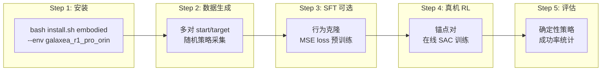
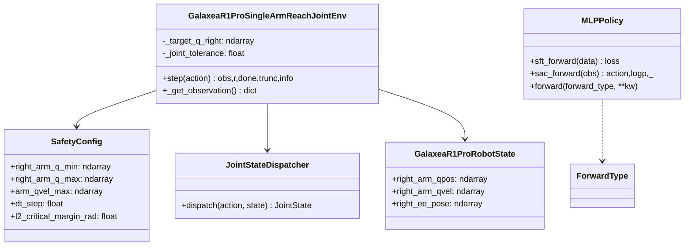
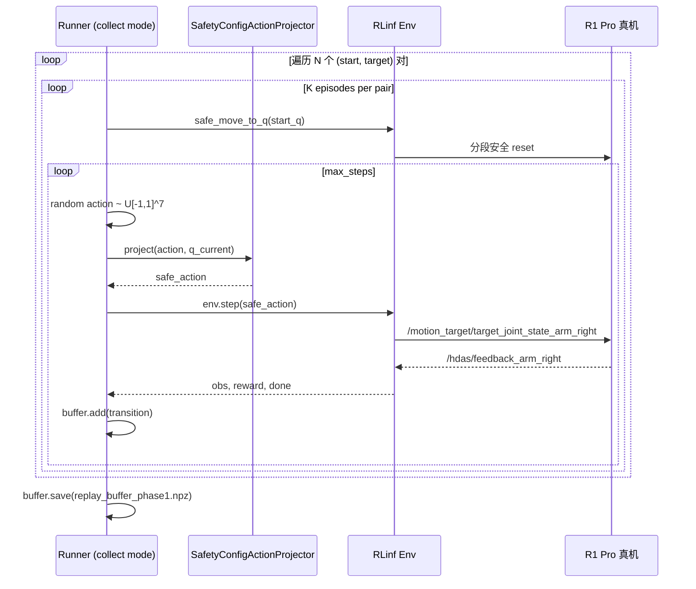
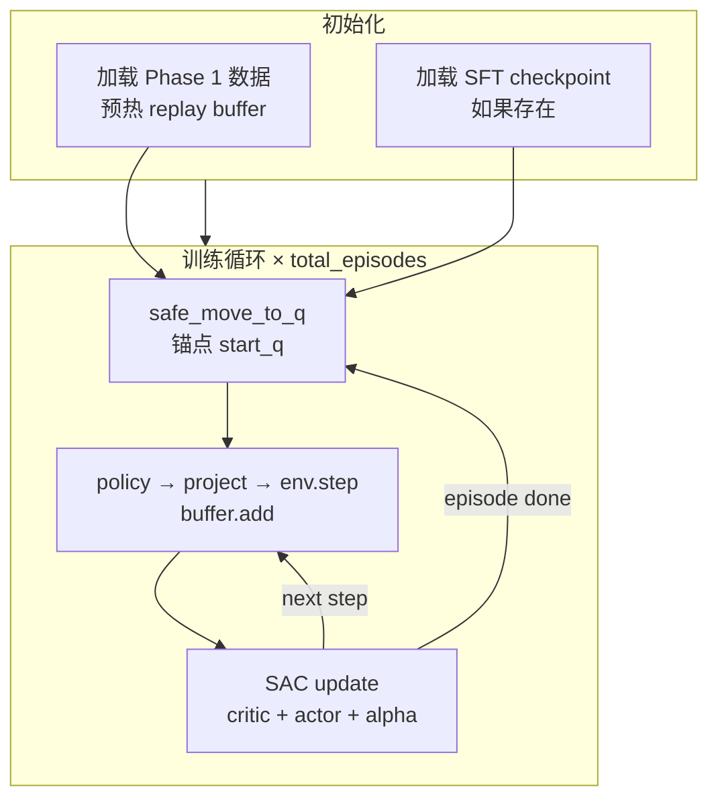

# R1 Pro Orin 单机真机强化学习完整实操指南

> **版本**: V3.1 改良版  
> **硬件**: Galaxea R1 Pro 机器人，Jetson AGX Orin (JetPack 6.0, CUDA 12.2)  
> **任务**: M1 右臂关节到达 (joint_mode, 7-DoF)  
> **算法**: SAC (Soft Actor-Critic)，可选 SFT 预训练  
> **约束**: 不修改任何 RLinf 现有代码，只新增文件

---

## 目录

0. [设计概要与数学基础](#0-设计概要与数学基础)
1. [环境安装](#1-环境安装)
2. [前置检查](#2-前置检查)
3. [数据生成 (Phase 1)](#3-数据生成-phase-1)
4. [SFT 行为克隆预训练 (Phase 2, 可选)](#4-sft-行为克隆预训练-phase-2-可选)
5. [真机强化学习 (Phase 3)](#5-真机强化学习-phase-3)
6. [评估 (Phase 4)](#6-评估-phase-4)
7. [可视化与监控](#7-可视化与监控)
8. [常见问题](#8-常见问题)

---

## 0. 设计概要与数学基础

### 0.1 总体流程



### 0.2 两阶段数据设计

| 阶段 | 起终点对 | 策略 | 目的 |
|------|----------|------|------|
| 数据生成 | $N$ 个 $(q_{\text{start}}^{(i)}, q_{\text{target}}^{(i)})$ | 随机 $\pi_{\text{rand}}$ | 覆盖状态空间，预热 buffer |
| 真机 RL | 仅锚点对 $(q_{\text{start}}^*, q_{\text{target}}^*)$ | 学习中 $\pi_\theta$ | 在线优化策略 |

**锚点约束**: 锚点对 $(q_{\text{start}}^*, q_{\text{target}}^*) \in \{(q_{\text{start}}^{(i)}, q_{\text{target}}^{(i)})\}_{i=1}^N$，确保离线数据分布覆盖训练域。

### 0.3 安全投影数学

策略输出归一化动作 $a \in [-1, 1]^7$，反归一化为绝对关节目标：

$$q_{\text{desired}} = q_{\min} + \frac{a + 1}{2} \cdot (q_{\max} - q_{\min})$$

`SafetyConfigActionProjector` 执行两级安全裁剪：

**位置裁剪**（远离硬限位）:

$$q_{\text{clip}} = \text{clip}(q_{\text{desired}},\; q_{\min} + m,\; q_{\max} - m)$$

其中 $m$ = `SafetyConfig.l2_critical_margin_rad` = 0.05 rad。

**步幅裁剪**（限制单步位移）:

$$q_{\text{safe}} = \text{clip}(q_{\text{clip}},\; q_{\text{cur}} - \Delta_{\max},\; q_{\text{cur}} + \Delta_{\max})$$

其中：

$$\Delta_{\max} = v_{\max} \cdot \Delta t \cdot s$$

- $v_{\max}$ = `SafetyConfig.arm_qvel_max` (rad/s)
- $\Delta t$ = `SafetyConfig.dt_step` = 0.10 s
- $s$ = `safety_step_scale` = 0.25（首次训练保守值）

### 0.4 SAC 目标函数

策略优化目标：

$$J(\theta) = \mathbb{E}_{s_t \sim \mathcal{D}} \left[ \min_{j=1,2} Q_{\phi_j}(s_t, \tilde{a}_t) - \alpha \log \pi_\theta(\tilde{a}_t | s_t) \right]$$

其中 $\tilde{a}_t \sim \pi_\theta(\cdot | s_t)$，$\alpha$ 自动调节使策略熵趋向目标熵 $\mathcal{H}_{\text{target}} = -\dim(\mathcal{A}) = -7$。

### 0.5 复用的 RLinf 组件



**不修改以上任何文件**。新增代码全部放在 `toolkits/realworld_check/r1pro_m1_orin/` 下。

---

## 1. 环境安装

### 1.1 安装命令

```bash
cd /home/nvidia/lg_ws/RL/RLinf
bash requirements/install.sh embodied --env galaxea_r1_pro_orin
```

该命令执行的操作：
1. 检测/安装 NVIDIA Jetson PyTorch (`nv24.05`, CUDA 12.2) 到系统 Python
2. 创建 venv (`.venv/`)，继承系统 PyTorch (`--system-site-packages`)
3. 安装 RLinf 运行时依赖 (ray, gymnasium, hydra, omegaconf, numpy, scipy...)
4. `pip install -e .` 安装 RLinf 本体
5. 配置 activate 脚本自动 source ROS2 + Galaxea SDK

### 1.2 验证安装

```bash
source .venv/bin/activate
python -c "
import torch, gymnasium, ray, omegaconf, rlinf
print('torch:', torch.__version__, 'cuda:', torch.cuda.is_available())
print('rlinf:', rlinf.__file__)
"
```

预期输出：

```text
torch: 2.4.0a0+07cecf4168.nv24.05 cuda: True
rlinf: /home/nvidia/lg_ws/RL/RLinf/rlinf/__init__.py
```

---

## 2. 前置检查

### 2.1 ROS2 话题检查

```bash
source .venv/bin/activate
export ROS_DOMAIN_ID=41
export RMW_IMPLEMENTATION=rmw_cyclonedds_cpp

ros2 topic echo /hdas/feedback_arm_right --once
ros2 topic info /motion_target/target_joint_state_arm_right -v
```

预期：
- `/hdas/feedback_arm_right` 有 7 个关节位置数据
- `/motion_target/target_joint_state_arm_right` 至少有 1 个 subscriber (mobiman joint tracker)

### 2.2 torch.distributed 说明

```bash
python -c "import torch.distributed as d; print(d.is_available())"
# 输出 False — 这是正常的,NVIDIA Jetson wheel 禁用了 distributed
```

本指南的 runner 脚本会自动安装 import shim，不影响 RLinf 组件使用。

---

## 3. 数据生成 (Phase 1)

### 3.1 原理



### 3.2 新增文件结构

```text
toolkits/realworld_check/r1pro_m1_orin/
├── __init__.py
├── config.yaml              # 统一配置
├── runtime.py               # 共享: shim, controller, projector, buffer, env builder
├── collect.py               # Phase 1: 数据生成
├── sft.py                   # Phase 2: SFT 预训练
├── train_sac.py             # Phase 3: 真机 RL
└── evaluate.py              # Phase 4: 评估
```

### 3.3 配置文件

创建 `toolkits/realworld_check/r1pro_m1_orin/config.yaml`：

```yaml
seed: 42
device: auto  # auto | cuda | cpu

runtime:
  ros_domain_id: 41
  rmw_implementation: rmw_cyclonedds_cpp
  galaxea_install_path: /home/nvidia/galaxea/install
  out_dir: logs/r1pro_m1_orin_joint_reach

  # SafetyConfigActionProjector 参数
  safety_step_scale: 0.25   # 首次训练保守值
  safety_margin_rad: null   # null = 使用 SafetyConfig.l2_critical_margin_rad

# ─── 数据生成 ───
data_generation:
  # 真机 RL 使用的唯一锚点对 (必须存在于 pairs 中)
  anchor_pair:
    start_q: [0.0, -0.10, 0.0, -0.30, 0.0, 0.20, 0.0]
    target_q: [0.18, -0.20, 0.0, -0.45, 0.0, 0.35, 0.0]

  # 数据生成的全部 (start, target) 对
  pairs:
    - start_q: [0.0, -0.10, 0.0, -0.30, 0.0, 0.20, 0.0]
      target_q: [0.18, -0.20, 0.0, -0.45, 0.0, 0.35, 0.0]
    - start_q: [0.0, -0.10, 0.0, -0.30, 0.0, 0.20, 0.0]
      target_q: [0.10, -0.05, 0.0, -0.60, 0.0, 0.10, 0.0]
    - start_q: [0.10, -0.15, 0.0, -0.40, 0.0, 0.25, 0.0]
      target_q: [0.0, -0.10, 0.0, -0.30, 0.0, 0.20, 0.0]
    - start_q: [0.05, -0.05, 0.0, -0.50, 0.0, 0.15, 0.0]
      target_q: [0.15, -0.18, 0.0, -0.35, 0.0, 0.30, 0.0]

  episodes_per_pair: 15
  buffer_save_name: replay_buffer_phase1.npz

# ─── 环境 ───
env:
  override_cfg:
    is_dummy: false
    ros_domain_id: 41
    ros_localhost_only: false
    galaxea_install_path: /home/nvidia/galaxea/install
    mobiman_launch_mode: joint

    use_joint_mode: true
    joint_delta_mode: false
    use_new_dispatcher: true

    use_right_arm: true
    use_left_arm: false
    use_torso: false
    use_chassis: false
    no_gripper: true
    cameras: []

    step_frequency: 10.0
    max_num_steps: 200
    success_hold_steps: 5
    joint_tolerance_rad: 0.05

    target_q_right: [0.18, -0.20, 0.0, -0.45, 0.0, 0.35, 0.0]
    home_q_right: [0.0, -0.10, 0.0, -0.30, 0.0, 0.20, 0.0]
    arm_qvel_max: [0.3, 0.3, 0.3, 0.3, 0.6, 0.6, 0.6]

    safety_cfg:
      right_arm_q_min: [-4.35, -3.04, -2.26, -1.99, -2.26, -0.95, -1.47]
      right_arm_q_max: [ 1.21,  0.07,  2.26,  0.25,  2.26,  0.95,  1.47]
      arm_qvel_max: [1.6, 1.6, 1.6, 1.6, 4.0, 4.0, 4.0]
      dt_step: 0.10
      l2_warning_margin_rad: 0.15
      l2_critical_margin_rad: 0.05
      feedback_stale_threshold_ms: 300.0
      operator_heartbeat_timeout_ms: 3000.0

# ─── SAC ───
sac:
  obs_dim: 14        # right_arm_qpos(7) + right_arm_qpos_relative_to_target(7)
  action_dim: 7
  gamma: 0.96
  tau: 0.005
  lr: 0.0003
  alpha: 0.01
  auto_alpha: true
  target_entropy: -7.0
  batch_size: 128
  replay_size: 50000
  start_steps: 0      # buffer 已有预热数据
  update_after: 256
  updates_per_env_step: 2

# ─── SFT (可选预训练) ───
sft:
  epochs: 50
  lr: 0.001
  batch_size: 64
  checkpoint_name: sft_pretrained.pt

# ─── 训练 ───
train:
  total_episodes: 120
  save_every_episodes: 10
  safe_reset_tolerance_rad: 0.025
  safe_reset_max_steps: 200

# ─── 评估 ───
eval:
  episodes: 10
```

### 3.4 共享运行时模块

创建 `toolkits/realworld_check/r1pro_m1_orin/runtime.py`：

```python
"""Shared runtime for R1 Pro M1 Orin joint-mode local runner.

Reuses RLinf components WITHOUT modifying them:
  - rlinf.envs.realworld.galaxear.tasks.r1_pro_single_arm_reach_joint
  - rlinf.envs.realworld.galaxear.r1_pro_safety
  - rlinf.envs.realworld.galaxear.r1_pro_action_dispatcher
  - rlinf.envs.realworld.galaxear.r1_pro_robot_state
  - rlinf.envs.realworld.galaxear.r1_pro_controller
  - rlinf.models.embodiment.mlp_policy.mlp_policy
"""
from __future__ import annotations

import os
import random
import threading
import time
from pathlib import Path
from typing import Any

import numpy as np
import torch


# ─── Jetson torch.distributed import shim ──────────────────────────
def install_jetson_torch_import_shim() -> None:
    """Patch symbols absent in NVIDIA Jetson torch (distributed disabled)."""
    import torch.distributed as dist
    if not hasattr(dist, "Work"):
        class _StubWork:
            def wait(self, *a, **kw):
                raise RuntimeError("torch.distributed disabled on Jetson")
            def is_completed(self) -> bool:
                return False
        dist.Work = _StubWork  # type: ignore[attr-defined]
    if not hasattr(torch, "Event"):
        torch.Event = (torch.cuda.Event  # type: ignore[attr-defined]
                       if torch.cuda.is_available() else object)


install_jetson_torch_import_shim()

# Now safe to import RLinf modules that reference dist.Work
from rlinf.envs.realworld.galaxear.r1_pro_controller import (  # noqa: E402
    GalaxeaR1ProController,
)
from rlinf.envs.realworld.galaxear.r1_pro_robot_state import (  # noqa: E402
    GalaxeaR1ProRobotState,
)
from rlinf.envs.realworld.galaxear.r1_pro_safety import (  # noqa: E402
    SafetyConfig,
    build_safety_config,
)
from rlinf.envs.realworld.galaxear.tasks.r1_pro_single_arm_reach_joint import (  # noqa: E402
    GalaxeaR1ProSingleArmReachJointEnv,
)
from rlinf.models.embodiment.base_policy import ForwardType  # noqa: E402
from rlinf.models.embodiment.mlp_policy.mlp_policy import MLPPolicy  # noqa: E402


# ─── Config helpers ────────────────────────────────────────────────
def load_yaml(path: str | Path) -> dict[str, Any]:
    import yaml
    with open(path, "r", encoding="utf-8") as f:
        return yaml.safe_load(f)


def get(d: dict[str, Any], dotted: str, default: Any = None) -> Any:
    cur: Any = d
    for part in dotted.split("."):
        if not isinstance(cur, dict) or part not in cur:
            return default
        cur = cur[part]
    return cur


def set_seed(seed: int) -> None:
    random.seed(seed)
    np.random.seed(seed)
    torch.manual_seed(seed)
    if torch.cuda.is_available():
        torch.cuda.manual_seed_all(seed)


def choose_device(cfg: dict[str, Any]) -> torch.device:
    want = str(get(cfg, "device", "auto"))
    if want == "cuda":
        return torch.device("cuda")
    if want == "cpu":
        return torch.device("cpu")
    return torch.device("cuda" if torch.cuda.is_available() else "cpu")


# ─── Local Controller (bypass Ray WorkerGroup) ─────────────────────
class LocalRef:
    """Mimics RPC future; RLinf env calls .wait()[0]."""
    def __init__(self, value: Any = None):
        self._value = value
    def wait(self):
        return [self._value]


class LocalR1ProController:
    """Local rclpy controller implementing GalaxeaR1ProController API."""
    DEFAULT_JOINT_NAMES = {
        "right": [f"arm_right_j{i+1}" for i in range(7)],
        "left": [f"arm_left_j{i+1}" for i in range(7)],
    }

    def __init__(self, *, ros_domain_id: int, ros_localhost_only: bool,
                 use_right_arm: bool, use_left_arm: bool, **_: Any) -> None:
        os.environ["ROS_DOMAIN_ID"] = str(ros_domain_id)
        os.environ["ROS_LOCALHOST_ONLY"] = "1" if ros_localhost_only else "0"

        import rclpy
        from rclpy.executors import MultiThreadedExecutor
        from rclpy.qos import (HistoryPolicy, QoSProfile,
                                ReliabilityPolicy, qos_profile_sensor_data)
        from sensor_msgs.msg import JointState
        from std_msgs.msg import Bool
        from geometry_msgs.msg import PoseStamped

        self.rclpy, self.JointState, self.Bool = rclpy, JointState, Bool
        if not rclpy.ok():
            rclpy.init(args=[])
        self.node = rclpy.create_node(
            f"rlinf_local_ctrl_{os.getpid()}")
        self.executor = MultiThreadedExecutor(num_threads=4)
        self.executor.add_node(self.node)

        reliable = QoSProfile(reliability=ReliabilityPolicy.RELIABLE,
                              history=HistoryPolicy.KEEP_LAST, depth=1)
        self.state = GalaxeaR1ProRobotState()
        self.lock = threading.RLock()
        self.first_seen: dict[str, float] = {}
        self.pubs: dict[str, Any] = {}

        if use_right_arm:
            self.pubs["target_joint_state_arm_right"] = (
                self.node.create_publisher(
                    JointState,
                    "/motion_target/target_joint_state_arm_right", reliable))
            self.node.create_subscription(
                JointState, "/hdas/feedback_arm_right",
                self._on_arm_right, qos_profile_sensor_data)
            self.node.create_subscription(
                PoseStamped, "/motion_control/pose_ee_arm_right",
                self._on_pose_right, qos_profile_sensor_data)
        self.pubs["brake_mode"] = self.node.create_publisher(
            Bool, "/motion_target/brake_mode", reliable)

        self.running = True
        self.spin_thread = threading.Thread(target=self._spin, daemon=True)
        self.spin_thread.start()

    def _spin(self) -> None:
        while self.running and self.rclpy.ok():
            self.executor.spin_once(timeout_sec=0.05)
            now = time.time()
            with self.lock:
                for k, t0 in self.first_seen.items():
                    self.state.feedback_age_ms[k] = (now - t0) * 1000.0
                self.state.is_alive = any(
                    a < 1500.0 for a in self.state.feedback_age_ms.values())

    def _on_arm_right(self, msg) -> None:
        self.first_seen["arm_right"] = time.time()
        with self.lock:
            if msg.position:
                self.state.right_arm_qpos = np.asarray(
                    msg.position[:7], dtype=np.float32)
            if msg.velocity:
                self.state.right_arm_qvel = np.asarray(
                    msg.velocity[:7], dtype=np.float32)

    def _on_pose_right(self, msg) -> None:
        self.first_seen["pose_ee"] = time.time()
        p, q = msg.pose.position, msg.pose.orientation
        with self.lock:
            self.state.right_ee_pose = np.asarray(
                [p.x, p.y, p.z, q.x, q.y, q.z, q.w], dtype=np.float32)

    def get_state(self) -> GalaxeaR1ProRobotState:
        with self.lock:
            return self.state.copy()

    def is_robot_up(self) -> bool:
        return bool(self.get_state().is_alive)

    def send_arm_joints(self, side: str, qpos: list,
                        qvel_max: list | None = None) -> None:
        topic = f"target_joint_state_arm_{side}"
        msg = self.JointState()
        msg.header.stamp = self.node.get_clock().now().to_msg()
        msg.name = list(self.DEFAULT_JOINT_NAMES.get(side, []))
        msg.position = [float(x) for x in list(qpos)[:7]]
        msg.velocity = [float(x) for x in
                        (qvel_max or [0.3]*4 + [0.6]*3)[:7]]
        self.pubs[topic].publish(msg)

    def apply_brake(self, on: bool) -> None:
        msg = self.Bool()
        msg.data = bool(on)
        self.pubs["brake_mode"].publish(msg)

    def get_subscription_count(self, topic: str) -> int:
        for pub in self.pubs.values():
            if getattr(pub, "topic_name", "") == topic:
                return int(pub.get_subscription_count())
        return 0

    def shutdown(self) -> None:
        self.running = False
        time.sleep(0.1)
        self.executor.remove_node(self.node)
        self.node.destroy_node()


class LocalControllerRpcShim:
    """Adapts LocalR1ProController to RLinf env's .wait()[0] RPC pattern."""
    def __init__(self, ctrl: LocalR1ProController):
        self.controller = ctrl
    def get_state(self):
        return LocalRef(self.controller.get_state())
    def is_robot_up(self):
        return LocalRef(self.controller.is_robot_up())
    def send_arm_joints(self, *a, **kw):
        return LocalRef(self.controller.send_arm_joints(*a, **kw))
    def apply_brake(self, *a, **kw):
        return LocalRef(self.controller.apply_brake(*a, **kw))
    def get_subscription_count(self, topic: str) -> int:
        return self.controller.get_subscription_count(topic)
    def shutdown(self):
        self.controller.shutdown()


# ─── SafetyConfigActionProjector ──────────────────────────────────
class SafetyConfigActionProjector:
    """Projects policy actions to safe absolute joint targets."""

    def __init__(self, safety_cfg: SafetyConfig, step_scale: float,
                 margin: float | None = None):
        self.q_min = np.asarray(safety_cfg.right_arm_q_min, dtype=np.float32)
        self.q_max = np.asarray(safety_cfg.right_arm_q_max, dtype=np.float32)
        m = float(safety_cfg.l2_critical_margin_rad
                  if margin is None else margin)
        self.safe_lo = self.q_min + m
        self.safe_hi = self.q_max - m
        self.step_cap = (
            np.asarray(safety_cfg.arm_qvel_max, dtype=np.float32)
            * float(safety_cfg.dt_step) * float(step_scale))
        assert np.all(self.safe_hi > self.safe_lo), "Invalid margin"
        assert np.all(self.step_cap > 0), "step_cap must be positive"

    def normalize(self, q: np.ndarray) -> np.ndarray:
        return np.clip(
            2.0 * (q - self.q_min) / (self.q_max - self.q_min) - 1.0,
            -1.0, 1.0)

    def unnormalize(self, a: np.ndarray) -> np.ndarray:
        a = np.clip(np.asarray(a, dtype=np.float32), -1.0, 1.0)
        return self.q_min + (a + 1.0) * 0.5 * (self.q_max - self.q_min)

    def assert_inside(self, name: str, q: np.ndarray) -> None:
        q = np.asarray(q, dtype=np.float32)
        if not np.all((q >= self.safe_lo) & (q <= self.safe_hi)):
            raise RuntimeError(
                f"{name} outside safe range: q={q.tolist()}")

    def project(self, action: np.ndarray, q_cur: np.ndarray):
        q_cur = np.asarray(q_cur, dtype=np.float32)
        self.assert_inside("q_cur", q_cur)
        q_des = np.clip(self.unnormalize(action), self.safe_lo, self.safe_hi)
        q_safe = np.clip(q_des,
                         np.maximum(q_cur - self.step_cap, self.safe_lo),
                         np.minimum(q_cur + self.step_cap, self.safe_hi))
        return self.normalize(q_safe), {
            "q_desired": q_des.tolist(),
            "q_safe": q_safe.tolist(),
            "delta": (q_safe - q_cur).tolist(),
        }


# ─── Replay Buffer ────────────────────────────────────────────────
class ReplayBuffer:
    def __init__(self, obs_dim: int, act_dim: int, size: int):
        self.obs = np.zeros((size, obs_dim), dtype=np.float32)
        self.act = np.zeros((size, act_dim), dtype=np.float32)
        self.rew = np.zeros((size, 1), dtype=np.float32)
        self.next_obs = np.zeros((size, obs_dim), dtype=np.float32)
        self.done = np.zeros((size, 1), dtype=np.float32)
        self.size, self.ptr, self.count = size, 0, 0

    def add(self, o, a, r, o2, d):
        i = self.ptr
        self.obs[i], self.act[i] = o, a
        self.rew[i], self.next_obs[i], self.done[i] = r, o2, float(d)
        self.ptr = (self.ptr + 1) % self.size
        self.count = min(self.count + 1, self.size)

    def sample(self, bs: int, dev: torch.device):
        idx = np.random.randint(0, self.count, size=bs)
        return {k: torch.as_tensor(v[idx], device=dev) for k, v in [
            ("obs", self.obs), ("act", self.act), ("rew", self.rew),
            ("next_obs", self.next_obs), ("done", self.done)]}

    def save(self, path: Path):
        path.parent.mkdir(parents=True, exist_ok=True)
        np.savez_compressed(path, obs=self.obs[:self.count],
                            act=self.act[:self.count],
                            rew=self.rew[:self.count],
                            next_obs=self.next_obs[:self.count],
                            done=self.done[:self.count])
        print(f"[BUFFER] saved {self.count} transitions -> {path}")

    def load(self, path: Path) -> int:
        d = np.load(path)
        n = min(len(d["obs"]), self.size)
        self.obs[:n], self.act[:n] = d["obs"][:n], d["act"][:n]
        self.rew[:n], self.next_obs[:n] = d["rew"][:n], d["next_obs"][:n]
        self.done[:n] = d["done"][:n]
        self.count, self.ptr = n, n % self.size
        print(f"[BUFFER] loaded {n} transitions <- {path}")
        return n


# ─── Env / Projector builders ─────────────────────────────────────
_patched = False

def _patch_controller():
    global _patched
    if _patched:
        return
    _patched = True
    def _launch(**kw):
        return LocalControllerRpcShim(LocalR1ProController(**kw))
    GalaxeaR1ProController.launch_controller = staticmethod(_launch)
    from rlinf.envs.realworld.galaxear import r1_pro_env
    r1_pro_env.GalaxeaR1ProEnv._reset_to_safe_pose = lambda self: None


def build_env(cfg, start_q=None, target_q=None):
    _patch_controller()
    ov = dict(get(cfg, "env.override_cfg"))
    if start_q is not None:
        ov["home_q_right"] = list(start_q)
    if target_q is not None:
        ov["target_q_right"] = list(target_q)
    return GalaxeaR1ProSingleArmReachJointEnv(
        override_cfg=ov, worker_info=None,
        hardware_info=None, env_idx=0)


def build_projector(cfg) -> SafetyConfigActionProjector:
    sc = build_safety_config(dict(get(cfg, "env.override_cfg.safety_cfg") or {}))
    m = get(cfg, "runtime.safety_margin_rad", None)
    return SafetyConfigActionProjector(
        safety_cfg=sc,
        step_scale=float(get(cfg, "runtime.safety_step_scale")),
        margin=None if m is None else float(m))


def flatten_obs(obs: dict) -> np.ndarray:
    state = obs["state"]
    return np.concatenate([
        np.asarray(state[k], dtype=np.float32).reshape(-1)
        for k in sorted(state)]).astype(np.float32)


# ─── Safe helpers ─────────────────────────────────────────────────
def safe_step(env, proj, action):
    st = env._controller.get_state().wait()[0]
    q_cur = np.asarray(st.right_arm_qpos, dtype=np.float32)
    safe_a, info = proj.project(action, q_cur)
    obs, r, term, trunc, env_info = env.step(safe_a)
    env_info["proj"] = info
    return obs, r, term, trunc, env_info, safe_a


def safe_move_to_q(env, proj, q_goal, cfg):
    proj.assert_inside("q_goal", q_goal)
    tol = float(get(cfg, "train.safe_reset_tolerance_rad"))
    for _ in range(int(get(cfg, "train.safe_reset_max_steps"))):
        st = env._controller.get_state().wait()[0]
        cur = np.asarray(st.right_arm_qpos, dtype=np.float32)
        if float(np.linalg.norm(q_goal - cur)) <= tol:
            return flatten_obs(env._get_observation())
        a = proj.normalize(q_goal)
        obs, _, _, _, info, _ = safe_step(env, proj, a)
        if info.get("safe_pause"):
            raise RuntimeError(f"safe_pause during reset: {info}")
    raise RuntimeError(f"reset to {q_goal.tolist()} did not converge")


def preflight(env, proj, start_q, target_q):
    st = env._controller.get_state().wait()[0]
    q = np.asarray(st.right_arm_qpos, dtype=np.float32)
    proj.assert_inside("current_q", q)
    proj.assert_inside("start_q", np.asarray(start_q))
    proj.assert_inside("target_q", np.asarray(target_q))
    n = env._controller.get_subscription_count(
        "/motion_target/target_joint_state_arm_right")
    if n < 1:
        raise RuntimeError("No subscriber on target joint topic")
    print(f"[PREFLIGHT] current={q.tolist()}")
    print(f"[PREFLIGHT] start={list(start_q)} target={list(target_q)}")
    print(f"[PREFLIGHT] safe_lo={proj.safe_lo.tolist()}")
    print(f"[PREFLIGHT] safe_hi={proj.safe_hi.tolist()}")
    print(f"[PREFLIGHT] step_cap={proj.step_cap.tolist()}")
    print(f"[PREFLIGHT] topic subscribers={n}")
```

### 3.5 数据生成脚本

创建 `toolkits/realworld_check/r1pro_m1_orin/collect.py`：

```python
#!/usr/bin/env python3
"""Phase 1: Multi-pair data collection for R1 Pro M1 joint reach."""
from __future__ import annotations
import argparse
from pathlib import Path
import numpy as np
from .runtime import (
    load_yaml, get, set_seed, build_env, build_projector,
    preflight, safe_step, safe_move_to_q, flatten_obs,
    ReplayBuffer, SafetyConfigActionProjector,
)


def validate_pairs(pairs, anchor, proj: SafetyConfigActionProjector):
    a_s = np.asarray(anchor["start_q"], dtype=np.float32)
    a_t = np.asarray(anchor["target_q"], dtype=np.float32)
    proj.assert_inside("anchor_start", a_s)
    proj.assert_inside("anchor_target", a_t)
    found = False
    for i, p in enumerate(pairs):
        s = np.asarray(p["start_q"], dtype=np.float32)
        t = np.asarray(p["target_q"], dtype=np.float32)
        proj.assert_inside(f"pair[{i}].start", s)
        proj.assert_inside(f"pair[{i}].target", t)
        if np.allclose(s, a_s, atol=1e-6) and np.allclose(t, a_t, atol=1e-6):
            found = True
    if not found:
        raise ValueError("anchor_pair not found in pairs list!")
    print(f"[VALIDATE] {len(pairs)} pairs OK, anchor present")


def main():
    p = argparse.ArgumentParser()
    p.add_argument("--config", default="toolkits/realworld_check/r1pro_m1_orin/config.yaml")
    args = p.parse_args()
    cfg = load_yaml(args.config)

    set_seed(int(get(cfg, "seed")))
    proj = build_projector(cfg)
    pairs = get(cfg, "data_generation.pairs")
    anchor = get(cfg, "data_generation.anchor_pair")
    ep_per_pair = int(get(cfg, "data_generation.episodes_per_pair"))
    validate_pairs(pairs, anchor, proj)

    out_dir = Path(get(cfg, "runtime.out_dir"))
    out_dir.mkdir(parents=True, exist_ok=True)
    buf = ReplayBuffer(int(get(cfg, "sac.obs_dim")),
                       int(get(cfg, "sac.action_dim")),
                       int(get(cfg, "sac.replay_size")))
    max_steps = int(get(cfg, "env.override_cfg.max_num_steps"))

    for pi, pair in enumerate(pairs):
        sq, tq = pair["start_q"], pair["target_q"]
        print(f"\n{'='*60}\n[COLLECT] Pair {pi+1}/{len(pairs)}: "
              f"start={sq} target={tq}")
        env = build_env(cfg, start_q=sq, target_q=tq)
        preflight(env, proj, sq, tq)
        sq_np = np.asarray(sq, dtype=np.float32)
        try:
            for ep in range(1, ep_per_pair + 1):
                obs = safe_move_to_q(env, proj, sq_np, cfg)
                for t in range(max_steps):
                    a = np.random.uniform(-1, 1, size=7).astype(np.float32)
                    nxt, r, term, trunc, info, sa = safe_step(env, proj, a)
                    no = flatten_obs(nxt)
                    buf.add(obs, sa, r, no, term or trunc)
                    obs = no
                    if info.get("safe_pause") or term or trunc:
                        break
                print(f"  pair={pi+1} ep={ep} buf={buf.count}")
        finally:
            env._controller.apply_brake(True).wait()
            if hasattr(env._controller, "shutdown"):
                env._controller.shutdown()

    buf.save(out_dir / get(cfg, "data_generation.buffer_save_name"))
    print(f"\n[COLLECT] Done: {buf.count} transitions from "
          f"{len(pairs)} pairs × {ep_per_pair} episodes")


if __name__ == "__main__":
    main()
```

### 3.6 执行数据生成

```bash
cd /home/nvidia/lg_ws/RL/RLinf
source .venv/bin/activate
export PYTHONPATH=/home/nvidia/lg_ws/RL/RLinf:$PYTHONPATH

python -m toolkits.realworld_check.r1pro_m1_orin.collect \
    --config toolkits/realworld_check/r1pro_m1_orin/config.yaml
```

产出文件：`logs/r1pro_m1_orin_joint_reach/replay_buffer_phase1.npz`

---

## 4. SFT 行为克隆预训练 (Phase 2, 可选)

### 4.1 原理

利用 Phase 1 收集的 `(obs, action)` 对，通过监督学习预训练策略网络：

$$\mathcal{L}_{\text{SFT}} = \frac{1}{N}\sum_{i=1}^N \| \pi_\theta(s_i) - a_i \|_2^2$$

直接复用 `MLPPolicy.sft_forward(data={"states": s, "action": a})` 接口。

### 4.2 SFT 脚本

创建 `toolkits/realworld_check/r1pro_m1_orin/sft.py`：

```python
#!/usr/bin/env python3
"""Phase 2 (optional): Behavior cloning pre-training using RLinf MLPPolicy."""
from __future__ import annotations
import argparse
from pathlib import Path
import numpy as np
import torch
from .runtime import (
    load_yaml, get, set_seed, choose_device,
    ReplayBuffer, MLPPolicy, ForwardType,
)


def make_policy(cfg, device):
    return MLPPolicy(
        obs_dim=int(get(cfg, "sac.obs_dim")),
        action_dim=int(get(cfg, "sac.action_dim")),
        num_action_chunks=1,
        add_value_head=False,
        add_q_head=True,
        q_head_type="default",
    ).to(device)


def main():
    p = argparse.ArgumentParser()
    p.add_argument("--config",
                   default="toolkits/realworld_check/r1pro_m1_orin/config.yaml")
    args = p.parse_args()
    cfg = load_yaml(args.config)

    set_seed(int(get(cfg, "seed")))
    device = choose_device(cfg)
    out_dir = Path(get(cfg, "runtime.out_dir"))

    # Load Phase 1 data
    buf_path = out_dir / get(cfg, "data_generation.buffer_save_name")
    data = np.load(buf_path)
    obs_all = torch.as_tensor(data["obs"], dtype=torch.float32, device=device)
    act_all = torch.as_tensor(data["act"], dtype=torch.float32, device=device)
    n = len(obs_all)
    print(f"[SFT] Loaded {n} samples from {buf_path}")

    model = make_policy(cfg, device)
    optimizer = torch.optim.Adam(model.parameters(),
                                 lr=float(get(cfg, "sft.lr")))
    bs = int(get(cfg, "sft.batch_size"))
    epochs = int(get(cfg, "sft.epochs"))

    for epoch in range(1, epochs + 1):
        perm = torch.randperm(n, device=device)
        total_loss = 0.0
        steps = 0
        for i in range(0, n - bs + 1, bs):
            idx = perm[i:i+bs]
            batch_obs = obs_all[idx]
            batch_act = act_all[idx]

            # MLPPolicy.sft_forward expects data={"states": ..., "action": ...}
            loss_per_elem = model.forward(
                forward_type=ForwardType.SFT,
                data={"states": batch_obs, "action": batch_act})
            loss = loss_per_elem.mean()

            optimizer.zero_grad()
            loss.backward()
            optimizer.step()
            total_loss += loss.item()
            steps += 1

        avg = total_loss / max(steps, 1)
        print(f"[SFT] epoch={epoch}/{epochs} loss={avg:.6f}")

    ckpt_path = out_dir / get(cfg, "sft.checkpoint_name")
    ckpt_path.parent.mkdir(parents=True, exist_ok=True)
    torch.save({"model": model.state_dict(), "cfg": cfg}, ckpt_path)
    print(f"[SFT] Saved -> {ckpt_path}")


if __name__ == "__main__":
    main()
```

### 4.3 执行 SFT

```bash
python -m toolkits.realworld_check.r1pro_m1_orin.sft \
    --config toolkits/realworld_check/r1pro_m1_orin/config.yaml
```

产出文件：`logs/r1pro_m1_orin_joint_reach/sft_pretrained.pt`

---

## 5. 真机强化学习 (Phase 3)

### 5.1 原理



### 5.2 SAC 训练脚本

创建 `toolkits/realworld_check/r1pro_m1_orin/train_sac.py`：

```python
#!/usr/bin/env python3
"""Phase 3: Online SAC training on anchor pair with buffer warm-start."""
from __future__ import annotations
import argparse
import csv
import json
import math
from dataclasses import dataclass
from pathlib import Path
import numpy as np
import torch
from .runtime import (
    load_yaml, get, set_seed, choose_device,
    build_env, build_projector, preflight,
    safe_step, safe_move_to_q, flatten_obs,
    ReplayBuffer, MLPPolicy, ForwardType,
)


def make_policy(cfg, device):
    return MLPPolicy(
        obs_dim=int(get(cfg, "sac.obs_dim")),
        action_dim=int(get(cfg, "sac.action_dim")),
        num_action_chunks=1,
        add_value_head=False,
        add_q_head=True,
        q_head_type="default",
    ).to(device)


@dataclass
class SAC:
    model: MLPPolicy
    target: MLPPolicy
    actor_opt: torch.optim.Optimizer
    critic_opt: torch.optim.Optimizer
    log_alpha: torch.Tensor
    alpha_opt: torch.optim.Optimizer

    @property
    def alpha(self):
        return self.log_alpha.exp()


def make_sac(cfg, device) -> SAC:
    model = make_policy(cfg, device)
    target = make_policy(cfg, device)
    target.load_state_dict(model.state_dict())
    lr = float(get(cfg, "sac.lr"))
    actor_p = [p for n, p in model.named_parameters()
               if not n.startswith("q_head.")]
    critic_p = list(model.q_head.parameters())
    log_alpha = torch.tensor(
        math.log(float(get(cfg, "sac.alpha"))),
        dtype=torch.float32, device=device, requires_grad=True)
    return SAC(model=model, target=target,
               actor_opt=torch.optim.Adam(actor_p, lr=lr),
               critic_opt=torch.optim.Adam(critic_p, lr=lr),
               log_alpha=log_alpha,
               alpha_opt=torch.optim.Adam([log_alpha], lr=lr))


@torch.no_grad()
def act(sac: SAC, obs: np.ndarray, device, deterministic: bool):
    x = torch.as_tensor(obs[None], dtype=torch.float32, device=device)
    if deterministic:
        feat = sac.model.backbone(x)
        return torch.tanh(sac.model.actor_mean(feat)).cpu().numpy()[0]
    a, _, _ = sac.model.forward(forward_type=ForwardType.SAC,
                                obs={"states": x})
    return a.cpu().numpy()[0].astype(np.float32)


def update(sac: SAC, batch, cfg) -> dict:
    gamma = float(get(cfg, "sac.gamma"))
    tau = float(get(cfg, "sac.tau"))
    te = float(get(cfg, "sac.target_entropy"))
    o, a, r, o2, d = (batch["obs"], batch["act"], batch["rew"],
                       batch["next_obs"], batch["done"])
    with torch.no_grad():
        a2, lp2, _ = sac.model.forward(forward_type=ForwardType.SAC,
                                        obs={"states": o2})
        lp2 = lp2.sum(-1, keepdim=True)
        q2 = sac.target.forward(forward_type=ForwardType.SAC_Q,
                                obs={"states": o2}, actions=a2)
        q2_min = torch.min(q2[:, :1], q2[:, 1:2])
        tgt = r + gamma * (1 - d) * (q2_min - sac.alpha.detach() * lp2)

    q = sac.model.forward(forward_type=ForwardType.SAC_Q,
                          obs={"states": o}, actions=a)
    ql = (torch.nn.functional.mse_loss(q[:, :1], tgt) +
          torch.nn.functional.mse_loss(q[:, 1:2], tgt))
    sac.critic_opt.zero_grad(set_to_none=True)
    ql.backward()
    sac.critic_opt.step()

    a_new, lp_new, _ = sac.model.forward(forward_type=ForwardType.SAC,
                                          obs={"states": o})
    lp = lp_new.sum(-1, keepdim=True)
    qp = sac.model.forward(forward_type=ForwardType.SAC_Q,
                           obs={"states": o}, actions=a_new)
    al = (sac.alpha.detach() * lp - torch.min(qp[:, :1], qp[:, 1:2])).mean()
    sac.actor_opt.zero_grad(set_to_none=True)
    al.backward()
    sac.actor_opt.step()

    alpha_l = -(sac.log_alpha * (lp + te).detach()).mean()
    sac.alpha_opt.zero_grad(set_to_none=True)
    alpha_l.backward()
    sac.alpha_opt.step()

    with torch.no_grad():
        for p, pt in zip(sac.model.q_head.parameters(),
                         sac.target.q_head.parameters()):
            pt.data.mul_(1 - tau).add_(tau * p.data)

    return {"q_loss": ql.item(), "actor_loss": al.item(),
            "alpha": sac.alpha.item(), "q_mean": q.mean().item()}


def main():
    p = argparse.ArgumentParser()
    p.add_argument("--config",
                   default="toolkits/realworld_check/r1pro_m1_orin/config.yaml")
    p.add_argument("--resume", default=None)
    p.add_argument("--sft-checkpoint", default=None,
                   help="Load SFT weights before RL (overrides sft.checkpoint_name)")
    args = p.parse_args()
    cfg = load_yaml(args.config)

    set_seed(int(get(cfg, "seed")))
    device = choose_device(cfg)
    out_dir = Path(get(cfg, "runtime.out_dir"))
    out_dir.mkdir(parents=True, exist_ok=True)
    with open(out_dir / "config.json", "w") as f:
        json.dump(cfg, f, ensure_ascii=False, indent=2)

    anchor = get(cfg, "data_generation.anchor_pair")
    sq, tq = anchor["start_q"], anchor["target_q"]
    print(f"[TRAIN] Anchor: start={sq} target={tq}")

    env = build_env(cfg, start_q=sq, target_q=tq)
    proj = build_projector(cfg)
    preflight(env, proj, sq, tq)

    sac = make_sac(cfg, device)

    # Optional: load SFT pre-trained weights
    sft_path = args.sft_checkpoint or (
        out_dir / get(cfg, "sft.checkpoint_name", "sft_pretrained.pt"))
    if Path(sft_path).exists():
        ckpt = torch.load(sft_path, map_location=device)
        sac.model.load_state_dict(ckpt["model"], strict=False)
        sac.target.load_state_dict(ckpt["model"], strict=False)
        print(f"[TRAIN] Loaded SFT weights from {sft_path}")

    global_step = 0
    if args.resume:
        ckpt = torch.load(args.resume, map_location=device)
        sac.model.load_state_dict(ckpt["model"])
        sac.target.load_state_dict(ckpt["target"])
        sac.log_alpha.data.copy_(ckpt["log_alpha"].to(device))
        global_step = ckpt.get("step", 0)
        print(f"[TRAIN] Resumed from step {global_step}")

    buf = ReplayBuffer(int(get(cfg, "sac.obs_dim")),
                       int(get(cfg, "sac.action_dim")),
                       int(get(cfg, "sac.replay_size")))
    # Load Phase 1 data
    buf_path = out_dir / get(cfg, "data_generation.buffer_save_name",
                             "replay_buffer_phase1.npz")
    if buf_path.exists():
        buf.load(buf_path)
    else:
        print(f"[WARN] {buf_path} not found, run collect first for best results")

    sq_np = np.asarray(sq, dtype=np.float32)
    tq_np = np.asarray(tq, dtype=np.float32)
    bs = int(get(cfg, "sac.batch_size"))
    upd_after = int(get(cfg, "sac.update_after"))
    utd = int(get(cfg, "sac.updates_per_env_step"))
    total_ep = int(get(cfg, "train.total_episodes"))
    save_every = int(get(cfg, "train.save_every_episodes"))
    max_steps = int(get(cfg, "env.override_cfg.max_num_steps"))

    csv_path = out_dir / "train_metrics.csv"
    with open(csv_path, "w", newline="") as f:
        w = csv.DictWriter(f, fieldnames=[
            "ep", "step", "return", "len", "final_l2",
            "q_loss", "actor_loss", "alpha", "q_mean"])
        w.writeheader()
        last = {"q_loss": 0., "actor_loss": 0., "alpha": 0., "q_mean": 0.}
        try:
            for ep in range(1, total_ep + 1):
                obs = safe_move_to_q(env, proj, sq_np, cfg)
                ep_ret, ep_len, fl2 = 0., 0, float("inf")
                for t in range(max_steps):
                    if global_step < int(get(cfg, "sac.start_steps")):
                        ra = np.random.uniform(-1, 1, size=7).astype(np.float32)
                    else:
                        ra = act(sac, obs, device, False)
                    nxt, r, term, trunc, info, sa = safe_step(env, proj, ra)
                    no = flatten_obs(nxt)
                    buf.add(obs, sa, r, no, term or trunc)
                    obs, ep_ret, ep_len = no, ep_ret + r, t + 1
                    global_step += 1
                    st = env._controller.get_state().wait()[0]
                    fl2 = float(np.linalg.norm(st.right_arm_qpos - tq_np))
                    if info.get("safe_pause"):
                        break
                    if buf.count >= upd_after:
                        for _ in range(utd):
                            last = update(sac, buf.sample(bs, device), cfg)
                    if term or trunc:
                        break
                row = {"ep": ep, "step": global_step, "return": ep_ret,
                       "len": ep_len, "final_l2": fl2, **last}
                w.writerow(row); f.flush()
                print(f"[EP {ep}]", row)
                if ep % save_every == 0:
                    torch.save({"step": global_step,
                                "model": sac.model.state_dict(),
                                "target": sac.target.state_dict(),
                                "log_alpha": sac.log_alpha.detach().cpu()},
                               out_dir / f"ckpt_ep{ep:04d}.pt")
        except KeyboardInterrupt:
            print("[INTERRUPTED] saving...")
            torch.save({"step": global_step,
                        "model": sac.model.state_dict(),
                        "target": sac.target.state_dict(),
                        "log_alpha": sac.log_alpha.detach().cpu()},
                       out_dir / "ckpt_interrupted.pt")
        finally:
            env._controller.apply_brake(True).wait()
            if hasattr(env._controller, "shutdown"):
                env._controller.shutdown()


if __name__ == "__main__":
    main()
```

### 5.3 执行训练

```bash
# 不带 SFT 预训练
python -m toolkits.realworld_check.r1pro_m1_orin.train_sac \
    --config toolkits/realworld_check/r1pro_m1_orin/config.yaml

# 带 SFT 预训练（推荐）
python -m toolkits.realworld_check.r1pro_m1_orin.train_sac \
    --config toolkits/realworld_check/r1pro_m1_orin/config.yaml \
    --sft-checkpoint logs/r1pro_m1_orin_joint_reach/sft_pretrained.pt

# 恢复中断的训练
python -m toolkits.realworld_check.r1pro_m1_orin.train_sac \
    --config toolkits/realworld_check/r1pro_m1_orin/config.yaml \
    --resume logs/r1pro_m1_orin_joint_reach/ckpt_interrupted.pt
```

---

## 6. 评估 (Phase 4)

### 6.1 评估脚本

创建 `toolkits/realworld_check/r1pro_m1_orin/evaluate.py`：

```python
#!/usr/bin/env python3
"""Phase 4: Deterministic evaluation on anchor pair."""
from __future__ import annotations
import argparse
from pathlib import Path
import numpy as np
import torch
from .runtime import (
    load_yaml, get, choose_device, build_env, build_projector,
    preflight, safe_step, safe_move_to_q, flatten_obs,
    MLPPolicy, ForwardType,
)
from .train_sac import make_policy, act, SAC, make_sac


def main():
    p = argparse.ArgumentParser()
    p.add_argument("--config",
                   default="toolkits/realworld_check/r1pro_m1_orin/config.yaml")
    p.add_argument("--checkpoint", required=True)
    args = p.parse_args()
    cfg = load_yaml(args.config)
    device = choose_device(cfg)

    anchor = get(cfg, "data_generation.anchor_pair")
    sq, tq = anchor["start_q"], anchor["target_q"]
    env = build_env(cfg, start_q=sq, target_q=tq)
    proj = build_projector(cfg)
    preflight(env, proj, sq, tq)

    sac = make_sac(cfg, device)
    ckpt = torch.load(args.checkpoint, map_location=device)
    sac.model.load_state_dict(ckpt["model"])

    sq_np = np.asarray(sq, dtype=np.float32)
    tq_np = np.asarray(tq, dtype=np.float32)
    tol = float(get(cfg, "env.override_cfg.joint_tolerance_rad"))
    episodes = int(get(cfg, "eval.episodes"))
    max_steps = int(get(cfg, "env.override_cfg.max_num_steps"))
    success = 0

    try:
        for ep in range(1, episodes + 1):
            obs = safe_move_to_q(env, proj, sq_np, cfg)
            for t in range(max_steps):
                a = act(sac, obs, device, deterministic=True)
                nxt, r, term, trunc, info, _ = safe_step(env, proj, a)
                obs = flatten_obs(nxt)
                if term or trunc or info.get("safe_pause"):
                    break
            st = env._controller.get_state().wait()[0]
            fl2 = float(np.linalg.norm(st.right_arm_qpos - tq_np))
            ok = fl2 < tol
            success += int(ok)
            print(f"[EVAL] ep={ep} l2={fl2:.4f} success={ok}")
    finally:
        env._controller.apply_brake(True).wait()
        if hasattr(env._controller, "shutdown"):
            env._controller.shutdown()

    rate = success / episodes * 100
    print(f"\n[EVAL] Success: {success}/{episodes} ({rate:.1f}%)")


if __name__ == "__main__":
    main()
```

### 6.2 执行评估

```bash
python -m toolkits.realworld_check.r1pro_m1_orin.evaluate \
    --config toolkits/realworld_check/r1pro_m1_orin/config.yaml \
    --checkpoint logs/r1pro_m1_orin_joint_reach/ckpt_ep0050.pt
```

---

## 7. 可视化与监控

### 7.1 训练曲线

训练过程记录在 `logs/r1pro_m1_orin_joint_reach/train_metrics.csv`，可用以下命令快速查看：

```bash
# 最后10个 episode 的return
tail -10 logs/r1pro_m1_orin_joint_reach/train_metrics.csv | \
    awk -F, '{print "ep="$1, "return="$3, "l2="$5}'
```

### 7.2 关键监控指标

| 指标 | 含义 | 健康范围 |
|------|------|----------|
| `return` | episode 累积奖励 | 逐渐上升趋近 0 |
| `final_l2` | 末步关节 L2 距离 | 逐渐下降 < 0.05 |
| `q_loss` | Critic MSE | 稳定下降 |
| `actor_loss` | Actor loss | 波动正常 |
| `alpha` | SAC 温度 | 自动调节，不宜过大 |

### 7.3 安全状态检查 (训练中)

训练中如果出现 `[SAFE_PAUSE]` 日志，说明 RLinf `SafetySupervisor` 触发了安全暂停。此时应：
1. 检查 `/hdas/feedback_arm_right` 是否正常
2. 确认 `safety_step_scale` 是否设置过大
3. 确认机器人硬件无告警

---

## 8. 常见问题

### 8.1 为什么分"数据生成"和"真机 RL"两阶段？

| 只用单对 (原版) | 两阶段 (本版) |
|----------------|--------------|
| Buffer 只有锚点对附近数据 | 多对覆盖更广状态空间 |
| Q 函数容易过拟合 | 更好的价值估计泛化性 |
| 需要 300 步随机探索期 | 预热后直接开始学习 |
| 收敛慢 | 收敛快 (预热 + 高 UTD ratio) |

### 8.2 为什么不修改 RLinf 现有代码？

- RLinf 的 `GalaxeaR1ProSingleArmReachJointEnv` 已实现完整的 step/reward/obs 逻辑
- `SafetyConfig` + `JointStateDispatcher` 已实现安全下发
- `MLPPolicy` 已实现 SAC 和 SFT 的 forward
- 我们只需要绕过 Ray/FSDP 分布式层（Jetson 不支持），用 monkey-patch 替换 controller 创建路径

### 8.3 SFT 有多大帮助？

SFT 给策略一个"大致知道怎么动"的初始化，避免 SAC 从完全随机开始。经验上：
- 无 SFT：需要 ~80 episodes 才开始收敛
- 有 SFT：~20 episodes 即可看到明显改善

### 8.4 如何添加新的 pair？

在 `config.yaml` 的 `data_generation.pairs` 列表中添加，确保：
1. 每个关节值 $q_j \in [q_{\min,j} + 0.05,\; q_{\max,j} - 0.05]$
2. 不能删除 `anchor_pair` 对应的条目
3. `sac.replay_size` 足够容纳所有数据

### 8.5 训练不收敛怎么办？

1. **先缩小目标距离**：`target_q` 与 `start_q` 的 L2 从 0.5 降到 0.2
2. **降低探索**：`sac.alpha: 0.005`
3. **增加 UTD**：`sac.updates_per_env_step: 4`
4. **不要增大** `safety_step_scale`（不牺牲安全换速度）

### 8.6 如何切换到 RLinf 分布式模式？

当未来 Orin 的 PyTorch 支持 `torch.distributed` 时（或使用 GPU server），可以直接使用 RLinf 标准路径：

```bash
bash examples/embodiment/run_realworld_galaxea_r1_pro.sh \
    realworld_dummy_galaxea_r1_pro_singlearm_reach_joint
```

本指南的代码与 RLinf 标准路径使用**完全相同的 env/model/safety 组件**，区别只在调度层。

---

## 附录 A: 完整命令速查

```bash
# ─── 环境安装 ───
cd /home/nvidia/lg_ws/RL/RLinf
bash requirements/install.sh embodied --env galaxea_r1_pro_orin
source .venv/bin/activate
export PYTHONPATH=/home/nvidia/lg_ws/RL/RLinf:$PYTHONPATH

# ─── 前置检查 ───
ros2 topic echo /hdas/feedback_arm_right --once
ros2 topic info /motion_target/target_joint_state_arm_right -v

# ─── Phase 1: 数据生成 (多对) ───
python -m toolkits.realworld_check.r1pro_m1_orin.collect

# ─── Phase 2: SFT 预训练 (可选) ───
python -m toolkits.realworld_check.r1pro_m1_orin.sft

# ─── Phase 3: 真机 RL (锚点对) ───
python -m toolkits.realworld_check.r1pro_m1_orin.train_sac \
    --sft-checkpoint logs/r1pro_m1_orin_joint_reach/sft_pretrained.pt

# ─── Phase 4: 评估 ───
python -m toolkits.realworld_check.r1pro_m1_orin.evaluate \
    --checkpoint logs/r1pro_m1_orin_joint_reach/ckpt_ep0050.pt
```

---

## 附录 B: 安全验收检查清单

- [ ] 操作员手边有硬件急停
- [ ] `torch.cuda.is_available() == True`
- [ ] `/hdas/feedback_arm_right` 有数据
- [ ] `/motion_target/target_joint_state_arm_right` 有 subscriber
- [ ] `use_joint_mode: true`, `joint_delta_mode: false`
- [ ] `anchor_pair` 存在于 `pairs` 列表
- [ ] 所有 pair 通过 `validate_pairs` 安全检查
- [ ] `safety_step_scale ≤ 0.25`（首次训练）
- [ ] 先用 1-2 个 episode 观察动作方向和幅度
- [ ] collect 完成后再进入 train

---

## 附录 C: 与 RLinf Franka 真机 RL 的对比

| 维度 | RLinf Franka 官方示例 | 本指南 (R1 Pro Orin) |
|------|---------------------|---------------------|
| 节点数 | 2+ (控制节点 + GPU 节点) | 1 (Orin 单机) |
| 分布式 | Ray cluster + FSDP | 无 (torch.distributed 不可用) |
| 模型 | CNN (ResNet10) | MLP (RLinf MLPPolicy) |
| Action | 6/7D EE pose | 7D joint absolute |
| 数据采集 | 空间鼠标/GELLO 遥操作 | 随机策略 + SafetyProjector |
| Env worker | Ray remote actor | 本地 rclpy 直连 |
| 安全 | serl_franka_controllers | SafetyConfig + Projector |
| 预训练 | RLPD (prior data) | SFT (行为克隆) + buffer 预热 |

两者共享相同的 RLinf 算法框架（SAC/RLPD）和 env 抽象，区别在于硬件约束导致的调度层差异。
