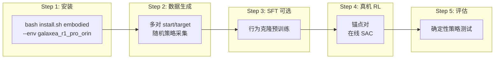
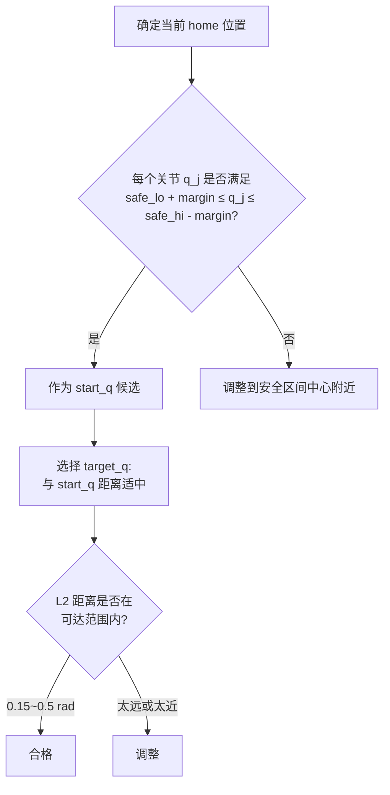
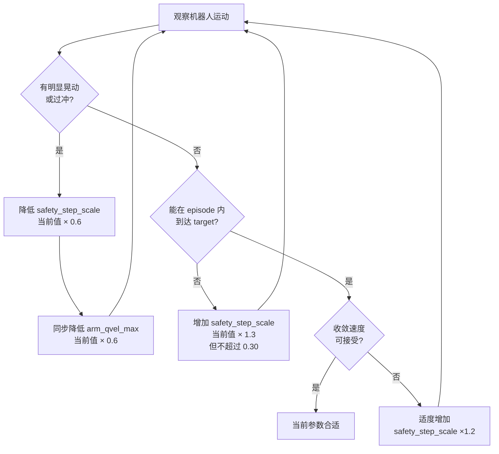

# R1 Pro Orin 单机真机强化学习完整实操指南 V3.2

> **基于**: `r1pro6op47_reach_joint3_1.md`  
> **新增**: 起终点对选择方法论 + 推荐参数; 速度调优方法论 + 推荐参数  
> **硬件**: Galaxea R1 Pro 机器人，Jetson AGX Orin (JetPack 6.0, CUDA 12.2)  
> **任务**: M1 右臂关节到达 (joint_mode, 7-DoF, SAC)  
> **约束**: 不修改任何 RLinf 现有代码，只新增文件

---

## 目录

0. [设计概要与数学基础](#0-设计概要与数学基础)
1. [如何选择起终点对](#1-如何选择起终点对)
2. [如何调整动作速度](#2-如何调整动作速度)
3. [环境安装](#3-环境安装)
4. [前置检查](#4-前置检查)
5. [数据生成 (Phase 1)](#5-数据生成-phase-1)
6. [SFT 行为克隆预训练 (Phase 2, 可选)](#6-sft-行为克隆预训练-phase-2-可选)
7. [真机强化学习 (Phase 3)](#7-真机强化学习-phase-3)
8. [评估 (Phase 4)](#8-评估-phase-4)
9. [可视化与监控](#9-可视化与监控)
10. [常见问题](#10-常见问题)

---

## 0. 设计概要与数学基础

### 0.1 总体流程



### 0.2 安全投影数学

策略输出归一化动作 $a \in [-1, 1]^7$，反归一化为绝对关节目标：

$$q_{\text{desired}} = q_{\min} + \frac{a + 1}{2} \cdot (q_{\max} - q_{\min})$$

位置裁剪（远离硬限位）：

$$q_{\text{clip}} = \text{clip}(q_{\text{desired}},\; q_{\min} + m,\; q_{\max} - m)$$

步幅裁剪（限制单步位移）：

$$q_{\text{safe}} = \text{clip}(q_{\text{clip}},\; q_{\text{cur}} - \Delta_{\max},\; q_{\text{cur}} + \Delta_{\max})$$

$$\Delta_{\max} = v_{\max} \cdot \Delta t \cdot s$$

### 0.3 SAC 目标

$$J(\theta) = \mathbb{E}_{s_t \sim \mathcal{D}} \left[ \min_{j=1,2} Q_{\phi_j}(s_t, \tilde{a}_t) - \alpha \log \pi_\theta(\tilde{a}_t | s_t) \right]$$

---

## 1. 如何选择起终点对

### 1.1 选择原则



**五条选择规则**:

1. **远离边界**: 起点和终点的每个关节值都必须满足：
$$q_{\min,j} + m_{\text{safe}} \leq q_j \leq q_{\max,j} - m_{\text{safe}}$$
其中 $m_{\text{safe}} \geq 3 \times$ `l2_critical_margin_rad` = 0.15 rad。这留出了足够的安全缓冲，即使策略探索时偏离也不会撞到限位。

2. **对窄范围关节特别保守**: R1 Pro 右臂 J2 范围很窄 $[-3.04, 0.07]$，有效安全范围只有 $[-2.89, -0.08]$。J4 范围 $[-1.99, 0.25]$，有效安全范围 $[-1.84, 0.10]$。这两个关节的值应该选在安全范围的中间 50% 区域。

3. **L2 距离适中**: 起终点之间的关节空间 L2 距离应在：
$$0.15 \leq \|q_{\text{target}} - q_{\text{start}}\|_2 \leq 0.50 \text{ rad}$$
- 太近 (< 0.15)：策略没有学习信号
- 太远 (> 0.50)：200 步 × 保守步幅可能到不了

4. **可物理 reset**: 起点应接近机器人自然 home 姿态（全零或附近），这样每个 episode reset 时移动距离小、安全。

5. **避免奇异构型**: 不要让多个关节同时接近其范围的极值。

### 1.2 R1 Pro 右臂关节安全范围速查表

| Joint | $q_{\min}$ | $q_{\max}$ | 安全下界 | 安全上界 | 有效宽度 | 推荐中位 |
|-------|-----------|-----------|---------|---------|---------|---------|
| J1 | -4.35 | 1.21 | -4.20 | 1.06 | 5.26 | -1.57 |
| J2 | -3.04 | 0.07 | -2.89 | -0.08 | 2.81 | -1.49 |
| J3 | -2.26 | 2.26 | -2.11 | 2.11 | 4.22 | 0.0 |
| J4 | -1.99 | 0.25 | -1.84 | 0.10 | 1.94 | -0.87 |
| J5 | -2.26 | 2.26 | -2.11 | 2.11 | 4.22 | 0.0 |
| J6 | -0.95 | 0.95 | -0.80 | 0.80 | 1.60 | 0.0 |
| J7 | -1.47 | 1.47 | -1.32 | 1.32 | 2.64 | 0.0 |

> 安全上下界 = $q_{\min/\max} \pm$ `l2_critical_margin_rad` (0.05) + 额外 0.10 rad 缓冲

### 1.3 推荐锚点对（供工程师直接使用）

经过以上原则筛选，推荐以下**锚点对**:

```yaml
anchor_pair:
  start_q: [0.0, -0.15, 0.0, -0.35, 0.0, 0.0, 0.0]
  target_q: [0.12, -0.30, 0.08, -0.55, 0.05, 0.15, 0.0]
```

**验证计算**:

| 维度 | start | target | 差值 | 安全下界 | 安全上界 | start✓ | target✓ |
|------|-------|--------|------|---------|---------|--------|---------|
| J1 | 0.0 | 0.12 | 0.12 | -4.20 | 1.06 | ✓ | ✓ |
| J2 | -0.15 | -0.30 | -0.15 | -2.89 | -0.08 | ✓ | ✓ |
| J3 | 0.0 | 0.08 | 0.08 | -2.11 | 2.11 | ✓ | ✓ |
| J4 | -0.35 | -0.55 | -0.20 | -1.84 | 0.10 | ✓ | ✓ |
| J5 | 0.0 | 0.05 | 0.05 | -2.11 | 2.11 | ✓ | ✓ |
| J6 | 0.0 | 0.15 | 0.15 | -0.80 | 0.80 | ✓ | ✓ |
| J7 | 0.0 | 0.0 | 0.0 | -1.32 | 1.32 | ✓ | ✓ |

$$\|q_{\text{target}} - q_{\text{start}}\|_2 = \sqrt{0.12^2 + 0.15^2 + 0.08^2 + 0.20^2 + 0.05^2 + 0.15^2} \approx 0.33 \text{ rad}$$

**为什么选这个对**:
- start_q 接近机器人 home（全零），J2/J4 略偏离零以远离 J2 上边界 (0.07)
- target_q 距离 0.33 rad——200步 × 步幅(下节计算) = 充分可达
- J4 从 -0.35 到 -0.55 是最大单关节差 (0.20 rad)，但距离 J4 边界还有 1.29 rad 余量
- J7 保持 0.0 不动——减少一个自由度简化问题
- 不存在任何关节同时接近边界的情况

### 1.4 推荐的数据生成多对

```yaml
pairs:
  # Pair 0: 锚点对（必须包含）
  - start_q: [0.0, -0.15, 0.0, -0.35, 0.0, 0.0, 0.0]
    target_q: [0.12, -0.30, 0.08, -0.55, 0.05, 0.15, 0.0]

  # Pair 1: 反向（从 target 回到 start 附近）
  - start_q: [0.10, -0.25, 0.05, -0.50, 0.03, 0.12, 0.0]
    target_q: [0.0, -0.15, 0.0, -0.35, 0.0, 0.0, 0.0]

  # Pair 2: 主要移动 J4+J6（学习肘部和腕部联动）
  - start_q: [0.0, -0.15, 0.0, -0.35, 0.0, 0.0, 0.0]
    target_q: [0.0, -0.20, 0.0, -0.65, 0.0, 0.25, 0.0]

  # Pair 3: 主要移动 J1+J2（学习肩部运动）
  - start_q: [0.0, -0.15, 0.0, -0.35, 0.0, 0.0, 0.0]
    target_q: [0.20, -0.40, 0.0, -0.35, 0.0, 0.0, 0.0]
```

---

## 2. 如何调整动作速度

### 2.1 速度公式

机器人每步的最大关节位移由三个参数决定：

$$\Delta_{\max,j} = v_{\max,j} \cdot \Delta t \cdot s$$

| 参数 | 含义 | 来源 | 可调? |
|------|------|------|-------|
| $v_{\max,j}$ | 关节 $j$ 速度上限 (rad/s) | `SafetyConfig.arm_qvel_max` | 不建议改（硬件限制） |
| $\Delta t$ | 控制步时长 (s) | `SafetyConfig.dt_step` = 0.10 | 可微调 |
| $s$ | 安全步幅缩放因子 | `safety_step_scale` | **主要调节旋钮** |

另外，发送给 mobiman joint tracker 的 `JointState.velocity` 字段控制 tracker 的**实际执行速度**:

```yaml
arm_qvel_max: [0.3, 0.3, 0.3, 0.3, 0.6, 0.6, 0.6]  # 发给 mobiman 的 velocity
```

### 2.2 两层速度控制


**第一层: Projector 步幅限制**（决定"每步目标跳多远"）:
$$\text{step\_cap}_j = v_{\max,j} \times \Delta t \times s$$

**第二层: Dispatcher 执行速度**（决定"关节多快到达目标"）:
$$\text{msg.velocity}_j = \text{arm\_qvel\_max\_cmd}_j$$

### 2.3 如何避免晃动

机器人晃动通常由以下原因引起：

1. **步幅过大 + 执行速度高**: 每步目标跳跃大，tracker 全速追踪，产生惯性过冲
2. **策略探索噪声大**: SAC 探索阶段动作方向快速切换
3. **控制频率与执行速度不匹配**: 目标更新频率低但执行速度快

**解决方案**: 同时降低两层速度，让每步移动小而慢：

| 场景 | `safety_step_scale` | `arm_qvel_max` (cmd) | 效果 |
|------|--------------------|-----------------------|------|
| 默认（晃动风险高） | 0.25 | [0.3, 0.3, 0.3, 0.3, 0.6, 0.6, 0.6] | 步幅适中，执行偏快 |
| **推荐（平滑运动）** | **0.15** | **[0.15, 0.15, 0.15, 0.15, 0.30, 0.30, 0.30]** | 步幅小，执行慢，几乎无晃动 |
| 极保守（首次接触） | 0.08 | [0.08, 0.08, 0.08, 0.08, 0.16, 0.16, 0.16] | 极慢但绝对安全 |

### 2.4 推荐速度参数（供工程师直接使用）

```yaml
runtime:
  safety_step_scale: 0.15   # 每步最大位移 = qvel_max × 0.10s × 0.15

env:
  override_cfg:
    step_frequency: 10.0    # 10 Hz 控制频率
    arm_qvel_max: [0.15, 0.15, 0.15, 0.15, 0.30, 0.30, 0.30]  # 发给 tracker
```

**计算验证**:

每步最大关节位移（J1-J4，速度上限 1.6 rad/s）：
$$\Delta_{\max} = 1.6 \times 0.10 \times 0.15 = 0.024 \text{ rad} \approx 1.4°$$

每步最大关节位移（J5-J7，速度上限 4.0 rad/s）：
$$\Delta_{\max} = 4.0 \times 0.10 \times 0.15 = 0.060 \text{ rad} \approx 3.4°$$

**到达锚点 target 所需最少步数** (最大单关节差 0.20 rad @ J4):
$$\text{steps}_{\min} = \frac{0.20}{0.024} \approx 9 \text{ 步}$$

在 200 步的 episode 内绰绰有余（即使策略不直奔目标，也有 ~20x 冗余）。

**发送给 tracker 的速度** (0.15 rad/s ≈ 8.6°/s):

这意味着 J1-J4 关节每秒最多转 8.6°——人眼看到的是缓慢、平滑的运动，不会产生惯性晃动。

### 2.5 速度调节决策流程



### 2.6 不同阶段的速度策略

| 阶段 | `safety_step_scale` | `arm_qvel_max` (cmd) | 理由 |
|------|--------------------|-----------------------|------|
| 首次接触真机 | 0.08 | [0.08, ..., 0.16, ...] | 确认一切正常 |
| 数据生成 (collect) | **0.15** | **[0.15, ..., 0.30, ...]** | 平滑采集 |
| 真机 RL 训练 | **0.15** | **[0.15, ..., 0.30, ...]** | 避免晃动 |
| 评估 (收敛后) | 0.20 | [0.20, ..., 0.40, ...] | 可适度加速 |

---

## 3. 环境安装

```bash
cd /home/nvidia/lg_ws/RL/RLinf
bash requirements/install.sh embodied --env galaxea_r1_pro_orin
```

验证：

```bash
source .venv/bin/activate
python -c "
import torch, gymnasium, rlinf
print('torch:', torch.__version__, 'cuda:', torch.cuda.is_available())
print('rlinf:', rlinf.__file__)
"
```

---

## 4. 前置检查

```bash
source .venv/bin/activate
export ROS_DOMAIN_ID=41
export RMW_IMPLEMENTATION=rmw_cyclonedds_cpp

# 确认关节反馈
ros2 topic echo /hdas/feedback_arm_right --once

# 确认 joint tracker 在监听
ros2 topic info /motion_target/target_joint_state_arm_right -v
```

---

## 5. 数据生成 (Phase 1)

### 5.1 配置文件

创建 `toolkits/realworld_check/r1pro_m1_orin/config.yaml`：

```yaml
seed: 42
device: auto

runtime:
  ros_domain_id: 41
  rmw_implementation: rmw_cyclonedds_cpp
  galaxea_install_path: /home/nvidia/galaxea/install
  out_dir: logs/r1pro_m1_orin_joint_reach

  # ════════════════════════════════════════════════════════════
  # 速度调优参数 (§2 推荐值)
  # ════════════════════════════════════════════════════════════
  safety_step_scale: 0.15   # 每步位移 = qvel_max × dt × 0.15
  safety_margin_rad: null   # 使用 SafetyConfig.l2_critical_margin_rad

data_generation:
  # ════════════════════════════════════════════════════════════
  # 锚点对 (§1 推荐值)
  # ════════════════════════════════════════════════════════════
  anchor_pair:
    start_q: [0.0, -0.15, 0.0, -0.35, 0.0, 0.0, 0.0]
    target_q: [0.12, -0.30, 0.08, -0.55, 0.05, 0.15, 0.0]

  pairs:
    - start_q: [0.0, -0.15, 0.0, -0.35, 0.0, 0.0, 0.0]
      target_q: [0.12, -0.30, 0.08, -0.55, 0.05, 0.15, 0.0]
    - start_q: [0.10, -0.25, 0.05, -0.50, 0.03, 0.12, 0.0]
      target_q: [0.0, -0.15, 0.0, -0.35, 0.0, 0.0, 0.0]
    - start_q: [0.0, -0.15, 0.0, -0.35, 0.0, 0.0, 0.0]
      target_q: [0.0, -0.20, 0.0, -0.65, 0.0, 0.25, 0.0]
    - start_q: [0.0, -0.15, 0.0, -0.35, 0.0, 0.0, 0.0]
      target_q: [0.20, -0.40, 0.0, -0.35, 0.0, 0.0, 0.0]

  episodes_per_pair: 15
  buffer_save_name: replay_buffer_phase1.npz

env:
  override_cfg:
    is_dummy: false
    ros_domain_id: 41
    ros_localhost_only: false
    galaxea_install_path: /home/nvidia/galaxea/install
    mobiman_launch_mode: joint

    use_joint_mode: true
    joint_delta_mode: false
    use_new_dispatcher: true

    use_right_arm: true
    use_left_arm: false
    use_torso: false
    use_chassis: false
    no_gripper: true
    cameras: []

    step_frequency: 10.0
    max_num_steps: 200
    success_hold_steps: 5
    joint_tolerance_rad: 0.05

    # 由 anchor_pair 在运行时覆盖
    target_q_right: [0.12, -0.30, 0.08, -0.55, 0.05, 0.15, 0.0]
    home_q_right: [0.0, -0.15, 0.0, -0.35, 0.0, 0.0, 0.0]

    # ════════════════════════════════════════════════════════════
    # 发给 mobiman tracker 的执行速度 (§2 推荐值, 避免晃动)
    # ════════════════════════════════════════════════════════════
    arm_qvel_max: [0.15, 0.15, 0.15, 0.15, 0.30, 0.30, 0.30]

    safety_cfg:
      right_arm_q_min: [-4.35, -3.04, -2.26, -1.99, -2.26, -0.95, -1.47]
      right_arm_q_max: [ 1.21,  0.07,  2.26,  0.25,  2.26,  0.95,  1.47]
      arm_qvel_max: [1.6, 1.6, 1.6, 1.6, 4.0, 4.0, 4.0]
      dt_step: 0.10
      l2_warning_margin_rad: 0.15
      l2_critical_margin_rad: 0.05
      feedback_stale_threshold_ms: 300.0
      operator_heartbeat_timeout_ms: 3000.0

sac:
  obs_dim: 14
  action_dim: 7
  gamma: 0.96
  tau: 0.005
  lr: 0.0003
  alpha: 0.01
  auto_alpha: true
  target_entropy: -7.0
  batch_size: 128
  replay_size: 50000
  start_steps: 0
  update_after: 256
  updates_per_env_step: 2

sft:
  epochs: 50
  lr: 0.001
  batch_size: 64
  checkpoint_name: sft_pretrained.pt

train:
  total_episodes: 120
  save_every_episodes: 10
  safe_reset_tolerance_rad: 0.025
  safe_reset_max_steps: 200

eval:
  episodes: 10
```

### 5.2 执行数据生成

```bash
cd /home/nvidia/lg_ws/RL/RLinf
source .venv/bin/activate
export PYTHONPATH=/home/nvidia/lg_ws/RL/RLinf:$PYTHONPATH

python -m toolkits.realworld_check.r1pro_m1_orin.collect \
    --config toolkits/realworld_check/r1pro_m1_orin/config.yaml
```
```bash
python -m toolkits.realworld_check.r1pro_m1_orin.collect_random_start \
    --config toolkits/realworld_check/r1pro_m1_orin/config.yaml
```

预期观察：
- 机器人缓慢、平滑地移动（每步 ≤ 1.4° @ J1-J4）
- 无明显晃动或过冲
- 每个 episode 200 步，约 20 秒

产出：`logs/r1pro_m1_orin_joint_reach/replay_buffer_phase1.npz`

---

## 6. SFT 行为克隆预训练 (Phase 2, 可选)

```bash
python -m toolkits.realworld_check.r1pro_m1_orin.sft \
    --config toolkits/realworld_check/r1pro_m1_orin/config.yaml
```

产出：`logs/r1pro_m1_orin_joint_reach/sft_pretrained.pt`

---

## 7. 真机强化学习 (Phase 3)

### 7.1 训练命令

```bash
# 带 SFT 预训练权重（推荐）
python -m toolkits.realworld_check.r1pro_m1_orin.train_sac \
    --config toolkits/realworld_check/r1pro_m1_orin/config.yaml \
    --sft-checkpoint logs/r1pro_m1_orin_joint_reach/sft_pretrained.pt

# 不带 SFT
python -m toolkits.realworld_check.r1pro_m1_orin.train_sac \
    --config toolkits/realworld_check/r1pro_m1_orin/config.yaml
```
```bash
python -m toolkits.realworld_check.r1pro_m1_orin.train_sac_random_start \
    --config toolkits/realworld_check/r1pro_m1_orin/config.yaml \
    --sft-checkpoint logs/r1pro_m1_orin_joint_reach/sft_pretrained.pt

```
### 7.2 训练时观察要点

| 现象 | 原因 | 处理 |
|------|------|------|
| 机器人几乎不动 | `safety_step_scale` 太小或 `arm_qvel_max` 太低 | 适度增大 (参考 §2.5 流程) |
| 机器人明显晃动 | 执行速度太高 | 降低 `arm_qvel_max` |
| episode return 不上升 | 起终点距离太远 | 换更近的 target (§1 方法) |
| 频繁 `[SAFE_PAUSE]` | 关节接近限位 | 检查 pair 是否离边界太近 |

### 7.3 恢复中断的训练

```bash
python -m toolkits.realworld_check.r1pro_m1_orin.train_sac \
    --config toolkits/realworld_check/r1pro_m1_orin/config.yaml \
    --resume logs/r1pro_m1_orin_joint_reach/ckpt_interrupted.pt
```

---

## 8. 评估 (Phase 4)

```bash
python -m toolkits.realworld_check.r1pro_m1_orin.evaluate \
    --config toolkits/realworld_check/r1pro_m1_orin/config.yaml \
    --checkpoint logs/r1pro_m1_orin_joint_reach/ckpt_ep0050.pt
```

成功标准: 末步关节 L2 距离 < `joint_tolerance_rad` (0.05 rad ≈ 2.9°)

---

## 9. 可视化与监控

训练 CSV 在 `logs/r1pro_m1_orin_joint_reach/train_metrics.csv`：

```bash
# 最近几个 episode 的表现
tail -5 logs/r1pro_m1_orin_joint_reach/train_metrics.csv
```

关键指标:

| 指标 | 含义 | 健康趋势 |
|------|------|----------|
| `return` | episode 累积奖励 | 逐渐上升趋近 0 |
| `final_l2` | 末步关节 L2 距离 | 逐渐下降 < 0.05 |
| `q_loss` | Critic loss | 稳定下降 |
| `alpha` | SAC 温度 | 自动调节 |

---

## 10. 常见问题

### 10.1 我应该先用极保守速度试跑吗？

**是的**。第一次接触真机时，建议用"极保守"参数试跑 1-2 个 episode：

```yaml
runtime:
  safety_step_scale: 0.08
env:
  override_cfg:
    arm_qvel_max: [0.08, 0.08, 0.08, 0.08, 0.16, 0.16, 0.16]
```

确认机器人动作方向正确、无异常后，再切换到推荐值 (`0.15`)。

### 10.2 如果我想用不同的起终点对怎么办？

按照 §1.1 的五条规则检查：

```python
import numpy as np

safe_lo = np.array([-4.35, -3.04, -2.26, -1.99, -2.26, -0.95, -1.47]) + 0.15
safe_hi = np.array([ 1.21,  0.07,  2.26,  0.25,  2.26,  0.95,  1.47]) - 0.15

my_start = np.array([...])  # 你的起点
my_target = np.array([...]) # 你的终点

assert np.all(my_start >= safe_lo) and np.all(my_start <= safe_hi), "start 不安全"
assert np.all(my_target >= safe_lo) and np.all(my_target <= safe_hi), "target 不安全"

l2 = np.linalg.norm(my_target - my_start)
assert 0.15 <= l2 <= 0.50, f"L2={l2:.3f} 不在推荐范围"
print(f"OK: L2 = {l2:.3f} rad")
```

### 10.3 arm_qvel_max 和 safety_cfg.arm_qvel_max 有什么区别？

| 参数 | 作用 | 位置 |
|------|------|------|
| `safety_cfg.arm_qvel_max` | Projector 计算 step_cap 的**硬件速度上限** | 不要改 |
| `env.override_cfg.arm_qvel_max` | 发给 mobiman tracker 的**执行速度** | **主要调节点** |

前者是"每步目标跳多远"的上限；后者是"关节实际多快运动"。两者协同控制平滑性。

### 10.4 为什么 J5-J7 的速度可以比 J1-J4 快？

J5-J7 是腕部关节，转动惯量小，硬件速度上限高（4.0 vs 1.6 rad/s）。即使执行速度设为 J1-J4 的 2 倍，由于惯量小也不会产生明显晃动。但如果仍有晃动，可以统一降为相同值。

### 10.5 训练不收敛时的参数调整优先级

1. **先缩小目标距离**（不改速度）——换一个更近的 target_q
2. **增加 UTD ratio**——`updates_per_env_step: 4`
3. **降低 alpha**——`sac.alpha: 0.005`
4. **不要增大 safety_step_scale** 来追求收敛——牺牲安全永远不值得

---

## 附录 A: 完整命令速查

```bash
# ─── 安装 ───
cd /home/nvidia/lg_ws/RL/RLinf
bash requirements/install.sh embodied --env galaxea_r1_pro_orin
source .venv/bin/activate
export PYTHONPATH=/home/nvidia/lg_ws/RL/RLinf:$PYTHONPATH

# ─── 前置检查 ───
ros2 topic echo /hdas/feedback_arm_right --once
ros2 topic info /motion_target/target_joint_state_arm_right -v

# ─── Phase 1: 数据生成 ───
python -m toolkits.realworld_check.r1pro_m1_orin.collect

# ─── Phase 2: SFT (可选) ───
python -m toolkits.realworld_check.r1pro_m1_orin.sft

# ─── Phase 3: 真机 RL ───
python -m toolkits.realworld_check.r1pro_m1_orin.train_sac \
    --sft-checkpoint logs/r1pro_m1_orin_joint_reach/sft_pretrained.pt

# ─── Phase 4: 评估 ───
python -m toolkits.realworld_check.r1pro_m1_orin.evaluate \
    --checkpoint logs/r1pro_m1_orin_joint_reach/ckpt_ep0050.pt
```

---

## 附录 B: 安全验收清单

- [ ] 操作员手边有硬件急停
- [ ] `torch.cuda.is_available() == True`
- [ ] `/hdas/feedback_arm_right` 正常
- [ ] `/motion_target/target_joint_state_arm_right` 有 subscriber
- [ ] `use_joint_mode: true`, `joint_delta_mode: false`
- [ ] `anchor_pair` 存在于 `pairs` 列表中
- [ ] 所有 pair 通过安全范围检查 (§1.1 五条规则)
- [ ] `safety_step_scale = 0.15`（推荐值）
- [ ] `arm_qvel_max = [0.15, ..., 0.30, ...]`（推荐值）
- [ ] 先用极保守参数试跑 1-2 episode 确认方向正确
- [ ] 观察无晃动后再开始正式训练

---

## 附录 C: 参数速查卡

| 参数 | 推荐值 | 调节方向 | 注意 |
|------|--------|----------|------|
| `safety_step_scale` | **0.15** | 晃动↑则↓, 太慢则↑ | 不超过 0.30 |
| `arm_qvel_max` (cmd) | **[0.15,0.15,0.15,0.15, 0.30,0.30,0.30]** | 与 step_scale 同向 | 发给 tracker |
| start_q | **[0.0, -0.15, 0.0, -0.35, 0.0, 0.0, 0.0]** | 接近 home | 远离 J2 上界 |
| target_q | **[0.12, -0.30, 0.08, -0.55, 0.05, 0.15, 0.0]** | L2≈0.33 | 200步可达 |
| L2 距离 | 0.33 rad | 0.15~0.50 | 太远不收敛 |
| 每步 J1-J4 位移 | 0.024 rad (1.4°) | — | 人眼可见缓慢 |
| 每步 J5-J7 位移 | 0.060 rad (3.4°) | — | 腕部稍快 |
| 到达 target 最少步数 | ~9 步 | — | 200步冗余 22x |
| step_frequency | 10 Hz | — | 与 dt_step 一致 |
