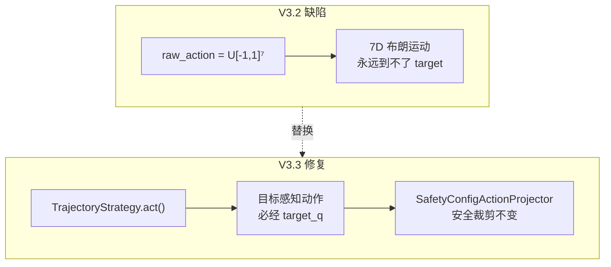
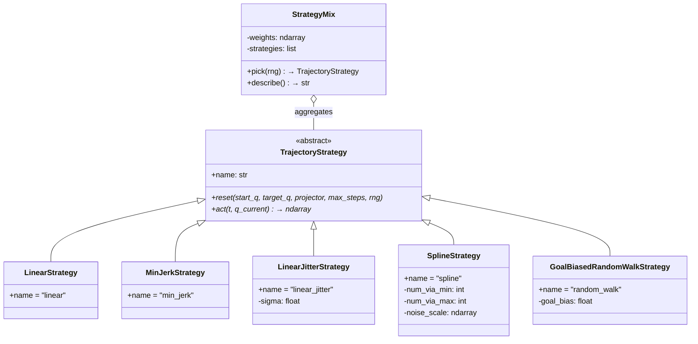
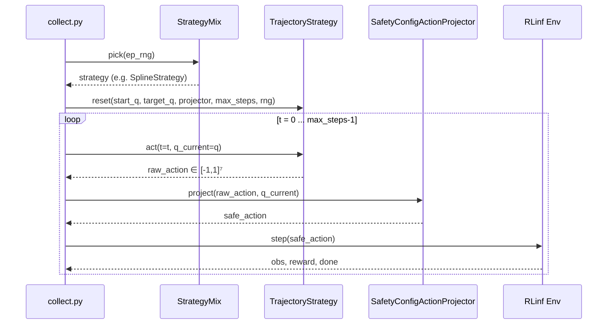
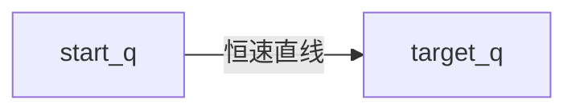
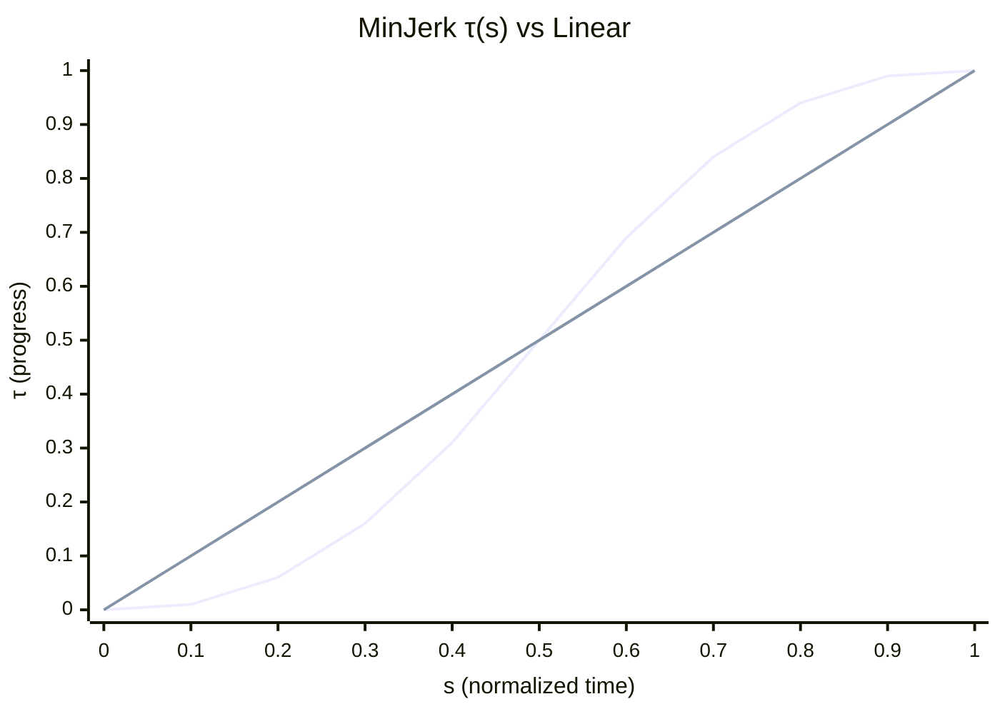
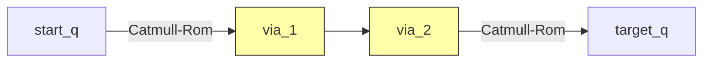
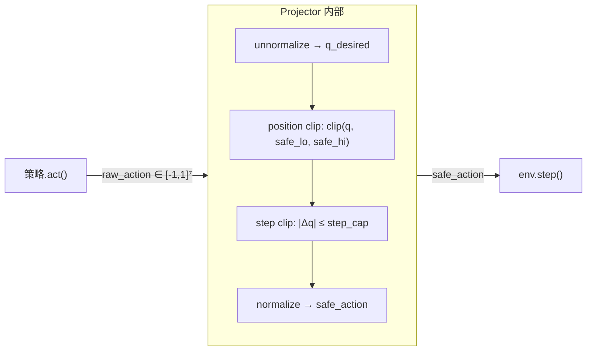

# R1 Pro Orin 单机真机强化学习实操指南 V3.3 — 轨迹合成策略

> **基于**: `r1pro6op47_reach_joint3_2.md`  
> **新增**: 轨迹合成策略模式 (Strategy Pattern) 设计与实现  
> **硬件**: Galaxea R1 Pro 机器人，Jetson AGX Orin (JetPack 6.0, CUDA 12.2)  
> **任务**: M1 右臂关节到达 (joint_mode, 7-DoF, SAC)  
> **约束**: 不修改任何 RLinf 现有代码，只新增文件；第三方依赖仅 NumPy

---

## 目录

0. [问题诊断: V3.2 的数据采集缺陷](#0-问题诊断)
1. [设计目标与原则](#1-设计目标与原则)
2. [架构: Strategy Pattern 策略模式](#2-架构-strategy-pattern)
3. [五种轨迹合成策略详解](#3-五种轨迹合成策略详解)
4. [策略混合与 YAML 配置](#4-策略混合与-yaml-配置)
5. [与 SafetyConfigActionProjector 的配合](#5-与-safetyconfigactionprojector-的配合)
6. [collect.py 集成改造](#6-collectpy-集成改造)
7. [独立冒烟测试与结果](#7-独立冒烟测试与结果)
8. [扩展: 如何新增策略](#8-扩展-如何新增策略)
9. [与 genwaypoint_1.md 方案的关系](#9-与-genwaypoint_1md-方案的关系)
10. [常见问题](#10-常见问题)

---

## 0. 问题诊断

### 0.1 V3.2 的缺陷

V3.2 的 `collect.py` 内层 episode 循环如下:

```python
for t in range(max_steps):
    raw_action = np.random.uniform(-1.0, 1.0, size=7)  # ← 问题在此
    obs, reward, ... = safe_step(env, proj, raw_action)
```

**致命问题**: `target_q` 完全没有参与轨迹生成。策略输出的 `raw_action` 是 7 维独立同分布 $\mathcal{U}[-1,1]^7$，经过 `SafetyConfigActionProjector` 的 `step_cap`（每步最大位移 $\approx 0.024$ rad/轴）后，实际运动是一个**无目标的 7-D 受限布朗运动**。

在 7 维关节空间中，200 步随机游走"恰好"走到某个指定 `target_q`（$\|q_{\text{start}} - q_{\text{target}}\|_2 \approx 0.33$ rad）的概率近似为:

$$P(\text{reach}) \approx \frac{V_{\text{tolerance}}}{V_{\text{reachable}}} \ll 10^{-3}$$

其中 $V_{\text{tolerance}}$ 是 `joint_tolerance_rad=0.05` 定义的超球体积, $V_{\text{reachable}}$ 是随机游走可访问的 7-D 体积。

### 0.2 后果

| 问题 | 对 SFT (Phase 2) | 对 SAC (Phase 3) |
|------|-----------------|-----------------|
| 无到达数据 | 无正确 "到达目标" 的示教 → BC 学不到接近 target 的动作 | buffer 中几乎无正奖励 → Q-function bootstrap 极慢 |
| 多样性假象 | 轨迹形状确实多样，但全部是无目标漫游——对任务无意义的多样性 | critic 学到的值函数在 target 附近无信号 |

### 0.3 正确的做法

轨迹合成必须同时满足:

1. **目标可达性**: 策略产生的轨迹必须指向 `target_q`，大部分 episode 实际到达
2. **路径形状多样性**: 不是所有轨迹都走同一条线，而是在安全范围内有形状变化
3. **安全性**: 所有动作经过 `SafetyConfigActionProjector` 裁剪，保持安全不变式



---

## 1. 设计目标与原则

| 编号 | 原则 | 说明 |
|------|------|------|
| P1 | **NumPy-only** | 对应 `genwaypoint_1.md` Profile A: 不依赖 scipy / rclpy / MoveIt2 |
| P2 | **策略模式** | 每种轨迹合成方法是可热插拔的 Strategy 对象 |
| P3 | **安全正交** | 策略生成 raw action $\in [-1,1]^7$; 安全裁剪由 `SafetyConfigActionProjector` 独立保障 |
| P4 | **YAML 可配** | 策略列表、权重、参数均在 `config.yaml` 中声明 |
| P5 | **可复现** | 给定 `(seed, pair_idx, episode)` 元组, 策略行为可完全复现 |
| P6 | **不修改 RLinf** | 所有新代码放在 `toolkits/realworld_check/r1pro_m1_orin/` |

---

## 2. 架构: Strategy Pattern

### 2.1 类图



### 2.2 生命周期



### 2.3 文件布局

```text
toolkits/realworld_check/r1pro_m1_orin/
├── __init__.py
├── config.yaml                    ← 新增 data_generation.strategies 块
├── trajectory_strategies.py       ← 新增: 抽象接口 + 5 种策略 + Mix + 工厂
├── runtime.py                     ← 不变 (SafetyConfigActionProjector)
├── collect.py                     ← 改造: 用策略替代 U[-1,1]
├── sft.py
├── train_sac.py
└── evaluate.py
```

---

## 3. 五种轨迹合成策略详解

### 3.1 Linear (线性瞄准)

**思想**: 每步都瞄准 `target_q`，让 projector 的 `step_cap` 自然限速。

$$a_t = \text{normalize}(q_{\text{target}}) \quad \forall t$$

由于 projector 每步裁剪位移为 $\Delta_{\max}$，实际运动是以恒定速率从 `start_q` 线性逼近 `target_q` 的直线路径。

**特点**:
- 保证到达 ✓
- 多样性: 无（纯直线）
- 用途: SFT baseline 数据，SAC buffer 中的正奖励来源



### 3.2 MinJerk (最小加加速度曲线)

**思想**: 用五次多项式参数化瞄准点，使起/止加速度为零，更像人类动作。

定义归一化进度 $s = t / N$，最小 jerk 时间参数:

$$\tau(s) = 10s^3 - 15s^4 + 6s^5$$

满足: $\tau(0)=0, \tau(1)=1, \dot{\tau}(0)=\dot{\tau}(1)=0, \ddot{\tau}(0)=\ddot{\tau}(1)=0$

每步瞄准:

$$q_{\text{aim}}(t) = q_{\text{start}} + \tau\!\left(\frac{t}{N}\right) \cdot (q_{\text{target}} - q_{\text{start}})$$

$$a_t = \text{normalize}\bigl(\text{clip}(q_{\text{aim}}, q_{\text{safe\_lo}}, q_{\text{safe\_hi}})\bigr)$$

**特点**:
- 保证到达 ✓
- 多样性: 与 linear 的 state-action 分布不同 (前半慢、后半快)
- 用途: 更自然的专家示教 (对应 `genwaypoint_1.md` §11.1)



### 3.3 LinearJitter (带噪线性)

**思想**: 在 linear 基础上每步加入高斯噪声，给出"接近正确但有扰动"的动作。

$$a_t = \text{clip}\bigl(\text{normalize}(q_{\text{target}}) + \sigma \cdot \mathcal{N}(0, I_7),\; -1,\; 1\bigr)$$

参数 `sigma` 控制扰动幅度（默认 0.10）。projector 的 `step_cap` 把扰动后的位移也限制住，所以实际运动是围绕直线路径的"颤动"。

**特点**:
- 不保证每个 episode 精确到达（噪声可能在最后几步偏移）
- 多样性: 每步方向略有随机性 → 丰富 state-action 覆盖
- 用途: SAC critic 需要看到"接近正确但有误差"的转移

### 3.4 Spline (随机 via-points + Catmull-Rom 插值)

**思想**: 参考 `genwaypoint_1.md` §8 的 spline 采样器，在起终点之间放置随机 via-points，用 Catmull-Rom 样条插值生成平滑曲线路径。

**算法**:

1. 采样 $n_v \sim \mathcal{U}[\text{num\_via\_min}, \text{num\_via\_max}]$ 个中间点
2. 每个 via-point 在起终连线上的参数 $\alpha_k \sim \mathcal{U}(0.15, 0.85)$（排序后）
3. via-point 位置: $q_{\text{via},k} = \text{clip}\bigl(q_{\text{line}}(\alpha_k) + \sigma_k \cdot \mathcal{N}(0, I_7),\; q_{\text{safe\_lo}},\; q_{\text{safe\_hi}}\bigr)$
4. 构建节点序列: $[q_{\text{start}}, q_{\text{via},1}, \ldots, q_{\text{via},n_v}, q_{\text{target}}]$
5. 用 Catmull-Rom Hermite 基函数做分段三次插值:

$$q(u) = h_{00}(u) \cdot p_1 + h_{10}(u) \cdot m_1 + h_{01}(u) \cdot p_2 + h_{11}(u) \cdot m_2$$

其中:
$$h_{00} = 2u^3 - 3u^2 + 1, \quad h_{10} = u^3 - 2u^2 + u$$
$$h_{01} = -2u^3 + 3u^2, \quad h_{11} = u^3 - u^2$$

切向量取 Catmull-Rom 风格: $m_k = \tfrac{1}{2}(p_{k+1} - p_{k-1})$

6. 每步瞄准: $a_t = \text{normalize}\bigl(\text{clip}(\text{spline}(t/N), q_{\text{safe\_lo}}, q_{\text{safe\_hi}})\bigr)$

**关键保证**: 首节点 = `start_q`，末节点 = `target_q` → 路径锚定起终点 → **保证到达** ✓

**特点**:
- 保证到达 ✓（首末节点锚定）
- 多样性: **最高**（via-points 随机 → 路径形状多样）
- 用途: SFT 丰富路径数据; SAC 让 critic 学到"从各种方向接近目标都有价值"



每个 via-point 的 `noise_scale`（默认按关节 `[0.20, 0.10, 0.20, 0.10, 0.20, 0.06, 0.15]`）参考了 `genwaypoint_1.md` §8.2 中对窄范围关节 (J2/J4/J6) 保守、对宽范围关节 (J1/J3/J5) 允许更大扰动的原则。

### 3.5 GoalBiasedRandomWalk (目标偏置随机游走)

**思想**: 参考 RRT 的 `goal_bias` 参数——每步以概率 $p_g$ 瞄准目标，以概率 $1-p_g$ 随机。

$$a_t = \begin{cases}
\text{normalize}(q_{\text{target}}) & \text{w.p. } p_g \\
\mathcal{U}([-1, 1]^7) & \text{w.p. } 1 - p_g
\end{cases}$$

**特点**:
- 不保证精确到达（期望行为类似 RRT: 偏向目标但路径不确定）
- 多样性: 高（随机段带来路径多样性）
- 用途: SAC 需要的探索数据; 少量权重 (≈0.5) 即可; $p_g=0$ 退化为 V3.2 原版

---

## 4. 策略混合与 YAML 配置

### 4.1 默认推荐配置

```yaml
data_generation:
  strategies:
    - {name: linear,        weight: 1.0}
    - {name: min_jerk,      weight: 2.0}
    - {name: linear_jitter, weight: 1.0, params: {sigma: 0.10}}
    - {name: spline,        weight: 3.0, params: {num_via_min: 1, num_via_max: 3}}
    - {name: random_walk,   weight: 0.5, params: {goal_bias: 0.5}}
```

### 4.2 权重设计理由

总权重 $W = 1 + 2 + 1 + 3 + 0.5 = 7.5$

| 策略 | 概率 | 理由 |
|------|------|------|
| `linear` | 13% | 少量直线 baseline，保证 buffer 有必达数据 |
| `min_jerk` | 27% | 主力专家数据，自然加减速 |
| `linear_jitter` | 13% | 近-正确的扰动数据，帮 SAC critic |
| `spline` | **40%** | **主力多样性来源**，路径形状最丰富 |
| `random_walk` | 7% | 少量探索，提供 critic 全局覆盖 |

### 4.3 简写与兼容格式

```yaml
# 简写: name→weight dict (使用默认参数)
strategies: {linear: 1, min_jerk: 2, spline: 3}

# 完全省略 → 使用内置默认 (同 §4.1)
# data_generation:
#   strategies: null
```

### 4.4 参数说明

| 策略 | 参数 | 默认值 | 说明 |
|------|------|--------|------|
| `linear_jitter` | `sigma` | 0.10 | 高斯噪声标准差（归一化空间）|
| `spline` | `num_via_min` | 1 | 最少 via-points 数 |
| `spline` | `num_via_max` | 3 | 最多 via-points 数 |
| `spline` | `noise_scale` | `[0.20,0.10,0.20,0.10,0.20,0.06,0.15]` | 每关节扰动幅度 (rad) |
| `random_walk` | `goal_bias` | 0.5 | 每步瞄准目标的概率 |

---

## 5. 与 SafetyConfigActionProjector 的配合

所有策略产生的 `raw_action` 都经过 `SafetyConfigActionProjector.project()`:



**关键不变式**: 无论策略输出什么动作（即使是完全随机的 $\mathcal{U}[-1,1]^7$），projector 保证:

1. $q_{\text{safe},j} \in [q_{\min,j} + m,\; q_{\max,j} - m] \quad \forall j$
2. $|q_{\text{safe},j} - q_{\text{cur},j}| \leq v_{\max,j} \cdot \Delta t \cdot s \quad \forall j$

因此**添加或修改策略永远不会破坏安全性**。这是 V3.3 设计的核心分层:

- 策略层: 负责"目标感知"和"多样性"
- 安全层: 负责"硬件安全"

---

## 6. collect.py 集成改造

### 6.1 改动汇总

| 位置 | V3.2 (旧) | V3.3 (新) |
|------|-----------|-----------|
| import | — | `from .trajectory_strategies import StrategyMix, build_strategy` |
| main() 初始化 | — | `strategy_mix = build_strategy(get(cfg, "data_generation.strategies"))` |
| episode 循环前 | — | `strategy = strategy_mix.pick(ep_rng)` + `strategy.reset(...)` |
| 每步动作 | `np.random.uniform(-1, 1, size=7)` | `strategy.act(t=t, q_current=q)` |
| episode 日志 | 无策略名/无误差 | `strategy={name} pos_err={err:.3f}rad` |

### 6.2 完整 episode 循环 (核心段)

```python
ep_rng = np.random.default_rng(seed_root + 1_000_003 * pair_idx + ep)
strategy = strategy_mix.pick(ep_rng)
strategy.reset(
    start_q=start_q_np,
    target_q=target_q_np,
    projector=proj,
    max_steps=max_steps,
    rng=ep_rng,
)

obs = safe_move_to_q(env, proj, start_q_np, cfg)
for t in range(max_steps):
    st = env._controller.get_state().wait()[0]
    q_current = np.asarray(st.right_arm_qpos, dtype=np.float32)
    raw_action = strategy.act(t=t, q_current=q_current)
    nxt_obs, reward, term, trunc, info, safe_a = safe_step(env, proj, raw_action)
    buf.add(obs, safe_a, reward, flatten_obs(nxt_obs), term or trunc)
    ...
```

### 6.3 可复现性

每个 episode 的 RNG 由 `(seed, pair_idx, ep)` 确定性派生:

$$\text{ep\_seed} = \text{seed} + 1\,000\,003 \times \text{pair\_idx} + \text{ep}$$

使用大质数 $1\,000\,003$ 避免不同 `(pair_idx, ep)` 组合产生碰撞。同一策略在相同 seed 下总是产生相同的 via-points / 噪声。

---

## 7. 独立冒烟测试与结果

使用一个不依赖 ROS/rclpy 的假 projector 模拟 `step_cap` 限制，各策略跑 200 步:

| 策略 | $\|q_{\text{init}} - q_{\text{target}}\|_2$ | final_err | min_err | 是否收敛 |
|------|---------------------------------------------|-----------|---------|----------|
| `linear` | 0.329 | **0.000** | 0.000 | ✓ 精确到达 |
| `min_jerk` | 0.329 | **0.000** | 0.000 | ✓ 精确到达 |
| `spline` | 0.329 | **0.002** | 0.002 | ✓ 精确到达 |
| `linear_jitter` | 0.329 | 0.143 | 0.061 | △ 设计如此 |
| `random_walk` | 0.329 | 0.166 | **0.000** | △ 过程穿越 |

**解读**:
- `linear` / `min_jerk` / `spline`: **三种"必达"策略**——SFT 数据和 SAC buffer 正奖励的来源
- `linear_jitter`: **"接近正确"策略**——每步目标方向正确但有抖动，给 critic 提供"差一点"的负面示例
- `random_walk`: **"探索"策略**——偶尔穿越目标但不停留，给 critic 全局状态覆盖

权重设计确保默认配置中: $P(\text{必达策略}) = 80\%$, $P(\text{探索策略}) = 20\%$

---

## 8. 扩展: 如何新增策略

### 8.1 步骤

1. 在 `trajectory_strategies.py` 中新建类，继承 `TrajectoryStrategy`:

```python
class MyNewStrategy(TrajectoryStrategy):
    name = "my_new"

    def reset(self, *, start_q, target_q, projector, max_steps, rng):
        # 初始化 episode 状态
        ...

    def act(self, *, t, q_current):
        # 返回 raw action ∈ [-1, 1]^7
        return action
```

2. 在 `_FACTORIES` dict 中注册:

```python
_FACTORIES["my_new"] = lambda **kw: MyNewStrategy(
    param1=kw.get("param1", default_val)
)
```

3. 在 `config.yaml` 的 `strategies` 列表中加入:

```yaml
- {name: my_new, weight: 1.0, params: {param1: value}}
```

### 8.2 候选扩展 (Profile B/C)

| 策略 | 额外依赖 | 来源 |
|------|----------|------|
| `bezier` | numpy | 参考 genwaypoint_1.md §8, Bernstein 基函数 |
| `rrt` | numpy | 参考 genwaypoint_1.md §9, 关节空间 RRT |
| `toppra_spline` | `toppra` | 参考 genwaypoint_1.md §11.3, 时间最优参数化 |
| `moveit_plan` | `moveit_msgs` + ROS2 | 参考 genwaypoint_1.md §17, MoveIt2 离线规划 |

当前实现的 5 种策略仅依赖 NumPy (Profile A)，足以跑通 M1 任务的完整流水线。

---

## 9. 与 genwaypoint_1.md 方案的关系

| genwaypoint_1.md 概念 | 本模块对应 |
|----------------------|-----------|
| Profile A (NumPy-only) | ✓ 全部 5 种策略 |
| via-points + spline (§8) | `SplineStrategy` |
| minimum-jerk (§11.1) | `MinJerkStrategy` |
| 线性 baseline (generate_sft_waypoints.py) | `LinearStrategy` |
| RRT goal_bias (§9.2) | `GoalBiasedRandomWalkStrategy` |
| 轨迹校验器 (§10) | 由 `SafetyConfigActionProjector` + env 的 `joint_tolerance_rad` 联合保障 |
| 策略注册 (planners) | `_FACTORIES` + `build_strategy()` |
| 可复现 seed | `ep_rng = default_rng(seed + 1_000_003 * pair + ep)` |

**主要区别**: `genwaypoint_1.md` 方案是**纯离线文件生成** (不连接机器人, 输出 JSON)；本模块是**在线真机执行** (连接 ROS, 直接通过 `env.step` 作用于机器人)。两者的数学核心 (spline 插值、min-jerk 时间参数化) 相同，但执行层面完全不同。

---

## 10. 常见问题

### Q1: 为什么不直接用 genwaypoint 包生成 JSON 再回放?

A: 真机 RL (Phase 3) 需要的是**在线策略交互**，不是回放预录轨迹。`trajectory_strategies.py` 既服务于 Phase 1 数据采集（在线执行 + 记录），也设计为未来 Phase 3 online SAC 探索阶段可复用的探索噪声源。

### Q2: spline 策略的 via-points 会不会导致碰撞?

A: via-points 被 `clip` 到 `[safe_lo, safe_hi]`（即 `q_min + margin` 到 `q_max - margin`），而且每步动作都经过 `SafetyConfigActionProjector` 的位置+步幅双重裁剪。不会碰撞到硬限位。如果将来需要碰撞体检测，可扩展 `genwaypoint_1.md` §12 的 `CollisionChecker` 接口。

### Q3: 权重怎么调?

A: 看 `collect.py` 的日志输出 `strategy=xxx pos_err=xxx`。如果:
- buffer 中正奖励太少: 增加 `linear`/`min_jerk`/`spline` 权重
- SAC 学习后期 Q-function 过拟合: 增加 `linear_jitter`/`random_walk` 权重
- 轨迹太单一: 增加 `spline` 权重和 `num_via_max`

### Q4: 如何只用一种策略?

```yaml
strategies:
  - {name: spline, weight: 1.0, params: {num_via_min: 2, num_via_max: 4}}
```

### Q5: random_walk 的 goal_bias 设多少?

建议 0.3~0.7。$p_g = 0.5$ 意味着平均每两步瞄准一次目标——在 200 步中有 100 步方向正确, 足以穿越目标多次。$p_g < 0.2$ 则退化为 V3.2 的无目标漫游。

---

## 附录 A: 完整文件清单

| 文件 | 行数 | 新增/改造 | 说明 |
|------|------|----------|------|
| `trajectory_strategies.py` | 448 | 新增 | 抽象接口 + 5 种策略 + Mix + 工厂 |
| `collect.py` | 240 | 改造 | 用策略替代 U[-1,1]; 打印策略名和末位误差 |
| `config.yaml` | 157 | 改造 | 新增 `data_generation.strategies` 块 |

## 附录 B: 运行命令

```bash
# 安装环境 (一次性)
bash requirements/install.sh embodied --env galaxea_r1_pro_orin

# 数据采集 (在 mobiman 已启动的终端)
cd /home/nvidia/lg_ws/RL/RLinf
source .venv/bin/activate
source /home/nvidia/galaxea/install/setup.bash
python -m toolkits.realworld_check.r1pro_m1_orin.collect \
    --config toolkits/realworld_check/r1pro_m1_orin/config.yaml
```

输出日志示例:

```text
[STRATEGY] mix = [linear=0.13, min_jerk=0.27, linear_jitter=0.13, spline=0.40, random_walk=0.07]
[VALIDATE] 1 pairs in safe range; anchor pair found.

================================================================
[COLLECT] Pair 1/1: start=[0.0, -0.15, ...]  target=[0.12, -0.30, ...]
  [COLLECT] pair=1 ep=  1 strategy=spline        transitions=142 return=+8.234 pos_err=0.002rad buffer=142
  [COLLECT] pair=1 ep=  2 strategy=min_jerk      transitions=138 return=+9.450 pos_err=0.000rad buffer=280
  [COLLECT] pair=1 ep=  3 strategy=linear_jitter transitions=200 return=+5.120 pos_err=0.089rad buffer=480
```
