# Galaxea R1 Pro 相机直连 RLinf 服务器：真机强化学习设计与实现方案

> **目标**：将 Galaxea R1 Pro 机器人的头部相机和腕部相机通过物理线缆直接连接到运行 RLinf 的 GPU 服务器，绕过 Jetson AGX Orin 的网络中转环节，将图像采集额外延迟从 10-29ms 降至 1-3ms，提升真机 RL 训练的控制回路频率与数据质量。
>
> **适用场景**：RLinf + R1 Pro 真机在线强化学习（SAC/RLPD、Async PPO、HG-DAgger），控制频率 10-30Hz。
>
> **版本**：v2.0 | **日期**：2026-04-23

---

## 目录

1. [问题分析：为什么要直连](#1-问题分析为什么要直连)
2. [R1 Pro 相机硬件深度分析](#2-r1-pro-相机硬件深度分析)
3. [直连方案总体架构](#3-直连方案总体架构)
4. [腕部相机直连方案（RealSense D405）](#4-腕部相机直连方案realsense-d405)
5. [头部相机直连方案（GMSL 相机）](#5-头部相机直连方案gmsl-相机)
6. [物理线缆选型与布线设计](#6-物理线缆选型与布线设计)
7. [GPU 服务器端硬件准备](#7-gpu-服务器端硬件准备)
8. [软件集成方案：RLinf 侧适配](#8-软件集成方案rlinf-侧适配)
9. [部署拓扑与配置示例](#9-部署拓扑与配置示例)
10. [实施步骤](#10-实施步骤)
11. [验证与测试](#11-验证与测试)
12. [BOM 清单与成本估算](#12-bom-清单与成本估算)
13. [风险与缓解](#13-风险与缓解)
14. [附录](#14-附录)

---

## 1. 问题分析：为什么要直连

### 1.1 当前网络传输路径的瓶颈

在 R1 Pro 的默认部署架构中，所有相机图像都经过机器人内部的 **Jetson AGX Orin** 处理后，以 ROS2 DDS compressed 话题的形式通过千兆以太网传输到外部训练服务器：

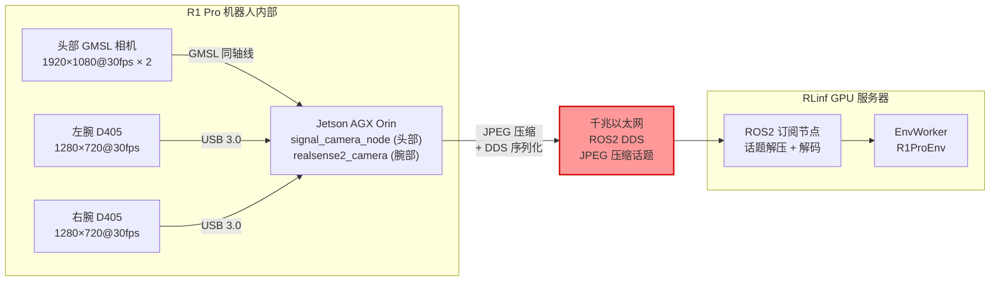

**延迟分解（网络传输路径，不含相机采集）**：

| 阶段 | 延迟 | 说明 |
|------|------|------|
| Orin 驱动处理 | 3-8ms | `signal_camera_node` / `realsense2_camera` ROS2 驱动 |
| JPEG 编码 | 2-5ms | Orin CPU 端编码（头部 1080p + 腕部 720p） |
| DDS 序列化 + QoS | 1-3ms | CDR 序列化，Best-Effort / Reliable QoS 开销 |
| 千兆以太网传输 | 1-5ms | 取决于帧大小（JPEG 约 50-200KB/帧）和网络拥塞 |
| DDS 反序列化 | 1-3ms | 服务器端解包 |
| JPEG 解码 | 2-5ms | 服务器 CPU 解码，深度帧额外解包 |
| **额外延迟总计** | **10-29ms** | **相机采集后到可用的额外延迟** |

在 **10Hz 控制频率**（100ms 周期）下，10-29ms 的额外延迟占据 10-29% 的控制周期。在 **20Hz**（50ms 周期）下占比高达 20-58%，严重制约控制响应性。

**实际观测**：根据 Galaxea 官方文档，腕部 D405 通过 ROS2 话题实际帧率约 **15Hz**（而非 D405 原生规格的 30fps），原因是 Orin 处理开销和 ROS2 管线压力。

### 1.2 直连的收益

将相机绕过 Orin，通过 USB 线缆直接连接到 RLinf 服务器后：

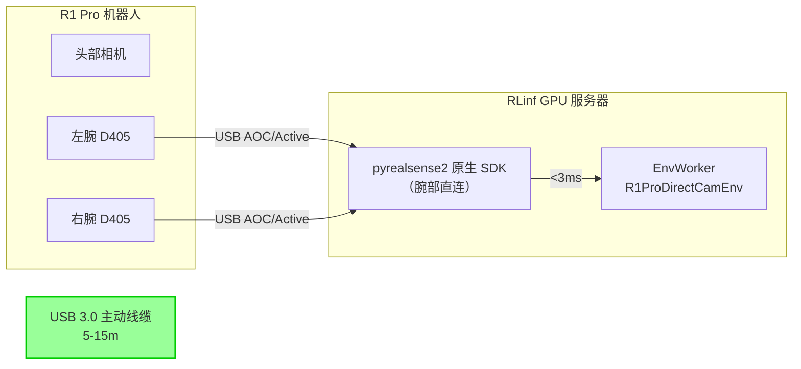

**直连延迟分解（不含相机采集）**：

| 阶段 | 延迟 | 说明 |
|------|------|------|
| USB 传输 | <0.01ms | 主动光纤线/铜线传输延迟 |
| SDK 帧处理 | 1-3ms | pyrealsense2 / pyzed 原生帧获取 |
| **额外延迟总计** | **1-3ms** | **相机采集后到可用的额外延迟** |

### 1.3 定量对比

```mermaid
gantt
    title 单次观测获取延迟对比 (ms)
    dateFormat X
    axisFormat %L

    section 网络路径 (改造前)
    相机采集 (30fps)  :crit, cam1, 0, 33
    Orin 驱动处理      :drv1, after cam1, 5
    JPEG 编码          :enc1, after drv1, 4
    DDS + 网络传输     :net1, after enc1, 6
    DDS 反序列化       :des1, after net1, 2
    JPEG 解码          :dec1, after des1, 4
    可用               :milestone, after dec1, 0

    section USB 直连 (改造后)
    相机采集 (30fps)  :crit, cam2, 0, 33
    USB + SDK 处理     :sdk2, after cam2, 2
    可用               :milestone, after sdk2, 0
```

| 指标 | 网络传输 | USB 直连 | 改善幅度 |
|------|---------|---------|---------|
| 额外延迟（不含采集） | 10-29ms | 1-3ms | **降低 80-90%** |
| 端到端延迟 | 43-62ms | 34-36ms | **降低 20-45%** |
| 可支持最高控制频率 | ~15Hz (实际) | ~28-30Hz | **提升 100%** |
| CPU 编解码开销 | 高（JPEG 编解码） | 无（原始帧） | 显著降低 |
| 图像质量 | 有损（JPEG 压缩） | 无损（原始帧） | 无压缩伪影 |
| 深度帧精度 | 有损（16UC1/32FC1 压缩） | 无损（原始深度帧） | 亚毫米精度保留 |
| Orin 负载 | 高（运行相机驱动+编码） | 低（仅 HDAS 控制） | Orin 释放资源 |

### 1.4 额外收益

- **保留完整 SDK 功能**：pyrealsense2 的硬件深度对齐、后处理滤波器、硬件同步等功能在直连时完全可用
- **降低 Orin 负载**：Orin 不再运行 `realsense2_camera` 和 `signal_camera_node`，释放 CPU/GPU 资源给 HDAS 关键控制任务（关节伺服、底盘导航）
- **代码简化**：不再需要 ROS2 订阅 + JPEG 解码逻辑，直接复用 RLinf 已有的 `RealSenseCamera` 类（`rlinf/envs/realworld/common/camera/realsense_camera.py`）
- **多相机硬件同步**：D405 支持 `inter_cam_sync_mode` 硬件同步，直连时可精确同步左右腕相机帧（网络路径下时间戳漂移可达 30ms）

---

## 2. R1 Pro 相机硬件深度分析

### 2.1 腕部相机：Intel RealSense D405（已确认）

R1 Pro 的每条手臂末端各安装一台 **Intel RealSense D405** 深度相机。该型号已由多个官方来源确认，包括 Galaxea ATC ROS2 SDK v2.1.3 更新日志中明确提及 "D405" 腕部相机。

```
┌───────────────────────────────────┐
│      Intel RealSense D405          │
│                                     │
│   ┌─────────────────────────┐      │
│   │  主动 IR 立体深度模组    │      │
│   │  ┌──┐  ┌──────┐  ┌──┐  │      │
│   │  │IR│  │IR Pro│  │IR│  │      │
│   │  │ L│  │ ject │  │ R│  │      │
│   │  └──┘  └──────┘  └──┘  │      │
│   │       RGB 传感器         │      │
│   └─────────────────────────┘      │
│                                     │
│   尺寸: 42 × 42 × 23 mm            │
│   重量: ~50-60g                     │
│   接口: USB-C (原生 USB 3.2 Gen 1)  │
│                                     │
└───────────────────────────────────┘
```

**关键规格**：

| 参数 | 值 |
|------|------|
| 型号 | Intel RealSense D405 |
| 深度技术 | 主动 IR 立体视觉（全局快门） |
| RGB 分辨率 | 1280×720 @ 30fps |
| 深度分辨率 | 1280×720 @ 30fps |
| 视场角 | 87° (H) × 58° (V) × 95° (D) |
| 最佳深度范围 | 7cm - 50cm（优化近距离操作） |
| **原生接口** | **USB-C (USB 3.2 Gen 1, 5 Gbps)** |
| 功耗 | ~700mW 典型，~1.5W 峰值 |
| SDK | librealsense2 + pyrealsense2 |
| R1 Pro 上数量 | 2（左腕 + 右腕），**可选配件** |

**当前连接方式**：每台 D405 通过 **USB-C to USB-A 适配线缆** 从相机的 USB-C 端口连接到机器人背板 USB-A 端口，内部路由到 Orin 的 USB 控制器。

**ROS2 话题**（当前路径）：
- `/hdas/camera_wrist_left/color/image_raw/compressed` (RGB, JPEG)
- `/hdas/camera_wrist_right/color/image_raw/compressed` (RGB, JPEG)
- `/hdas/camera_wrist_left/aligned_depth_to_color/image_raw` (深度, 16UC1)
- `/hdas/camera_wrist_right/aligned_depth_to_color/image_raw` (深度, 16UC1)

**相机序列号存储位置**（Orin 上）：
- `/opt/galaxea/sensor/realsense/RS_LEFT`
- `/opt/galaxea/sensor/realsense/RS_RIGHT`

> **直连关键优势**：D405 是标准 USB 设备，可以直接拔出背板 USB 口，改接到通往服务器的 USB 延长线。**无需任何接口转换**，RLinf 已有完整的 `RealSenseCamera` 实现。

### 2.2 头部相机：定制 GMSL 相机模组（品牌未公开）

R1 Pro 的头部相机**不是** Stereolabs ZED 2。根据 Galaxea 官方文档，头部相机是由 **`signal_camera_node`** 驱动的 **定制 GMSL 相机模组**，通过 GMSL（Gigabit Multimedia Serial Link）接口连接到 Orin 的 GMSL 端口。

> **重要澄清**：前一版方案中将头部相机识别为 "ZED 2" 是**未经验证的推测**。官方文档描述其为"立体双目系统"，使用 `signal_camera_node` 驱动，而 ZED 2 使用 `pyzed` / ZED SDK 驱动，两者完全不同。

**已确认的技术规格**：

| 参数 | 值 |
|------|------|
| 配置 | 2 个单目相机组成立体对 |
| 基线 | 120mm |
| 分辨率 | 1920 × 1080 @ 30fps |
| 视场角 | 118° (H) × 62° (V) |
| 工作温度 | -40°C 至 +85°C |
| **到 Orin 的接口** | **GMSL（经 Orin 的 8× GMSL 端口）** |
| 驱动 | `signal_camera_node`（Galaxea 专有 ROS2 节点） |
| 启动文件 | `signal_camera_head.py` |
| 深度输出 | `/hdas/camera_head/depth/depth_registered` (32FC1) |

**ROS2 话题**（当前路径）：
- `/hdas/camera_head/left_raw/image_raw_color/compressed` (RGB, JPEG)
- `/hdas/camera_head/depth/depth_registered` (深度, 32FC1)

> **注意**：头部 GMSL 相机的具体品牌和型号 Galaxea 未公开。其规格（1080p@30fps, 118° HFOV, -40~+85°C 工作温度）表明这是一款**汽车/工业级 GMSL 相机模组**（可能来自 Leopard Imaging、e-con Systems 或其他 Tier-1 供应商），但需要物理检查机器人或联系 Galaxea 确认。

### 2.3 底盘相机（参考，本方案不涉及）

R1 Pro 底盘有 5 个 GMSL 单目 RGB 相机（前左、前右、左、右、后），用于底盘导航，同样通过 GMSL 连接 Orin。RL 训练通常不使用底盘相机，本方案不涉及。

### 2.4 相机系统总览

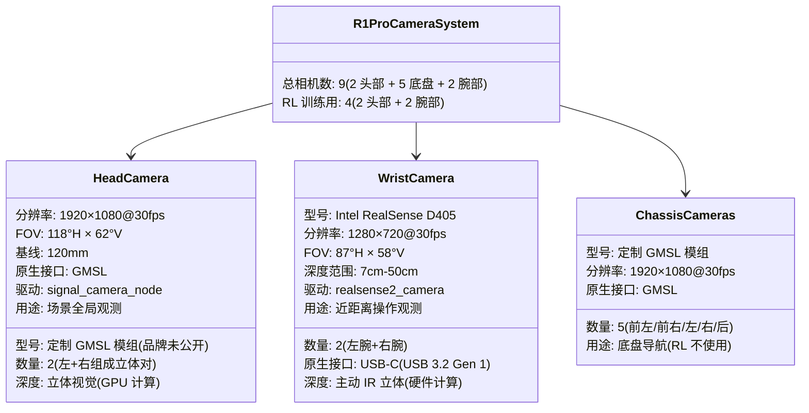

### 2.5 两类相机直连难度对比

| 维度 | 腕部 D405 (USB) | 头部 GMSL 相机 |
|------|----------------|---------------|
| **原生接口** | USB-C (标准 PC 可直接识别) | GMSL (标准 PC 无此接口) |
| **直连难度** | ★☆☆ 极易 | ★★★ 困难 |
| **需要额外硬件** | 仅 USB 延长线 | GMSL 解串器卡/适配器 |
| **RLinf 已有驱动** | ✅ `RealSenseCamera` 类 | ❌ 无（需新开发或替代方案） |
| **直连后 SDK** | pyrealsense2 (成熟) | 取决于解串器方案 |
| **推荐优先级** | **第一优先** | **第二优先 / 替代方案** |

---

## 3. 直连方案总体架构

### 3.1 分层策略：腕部优先，头部渐进

鉴于腕部和头部相机接口差异巨大，采用**分层递进**策略：

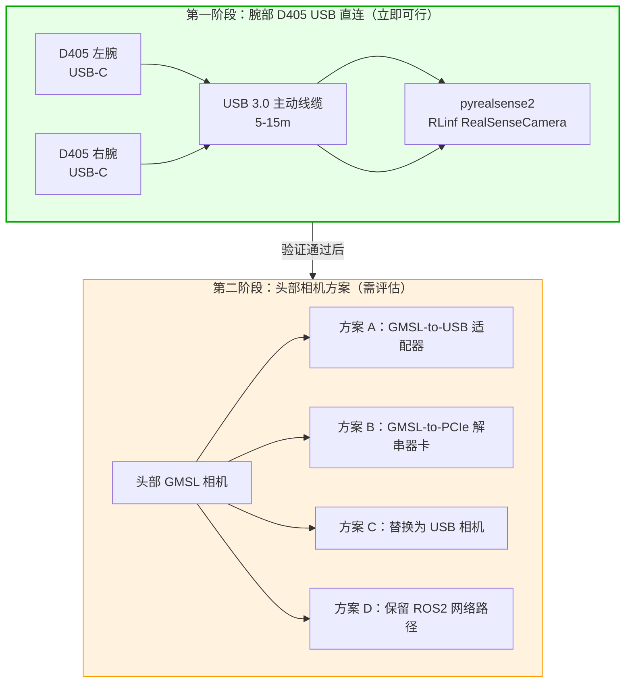

### 3.2 改造后总体拓扑

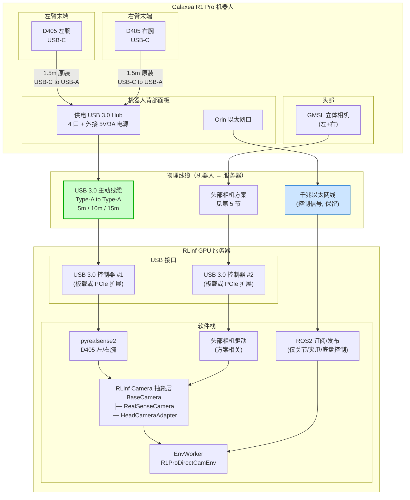

### 3.3 数据流分离原则

直连方案将 R1 Pro 的数据流分为两条独立路径：

| 数据类型 | 传输路径 | 协议 | 延迟要求 | 带宽 |
|---------|---------|------|---------|------|
| **图像数据**（RGB + 深度） | USB 3.0 线缆直连 | USB 原生协议 | <5ms | ~2-4 Gbps |
| **控制信号**（关节/夹爪/底盘） | 千兆以太网 | ROS2 DDS | <10ms | <10 Mbps |

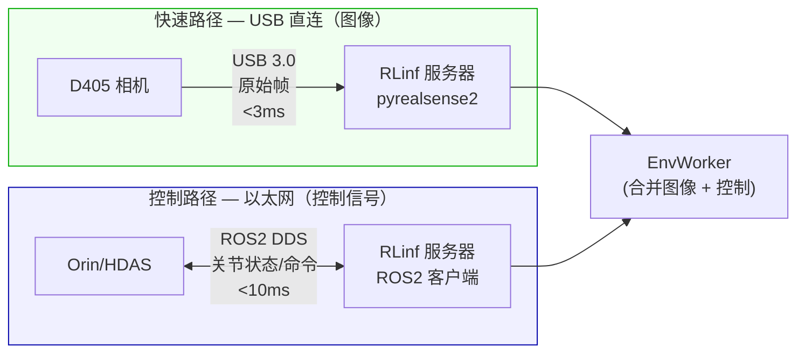

**为什么分离**：图像数据带宽大（每帧 1-2MB）、延迟敏感，适合 USB 直连；控制信号数据量小（每条 <1KB）、需要双向通信，适合以太网 + ROS2。两条路径独立互不干扰。

---

## 4. 腕部相机直连方案（RealSense D405）

### 4.1 直连原理

D405 是标准 USB 设备，原生接口就是 USB-C。在 R1 Pro 上，D405 通过 USB-C to USB-A 线缆连接到背板 USB 口，再内部连接到 Orin。

**直连改造**：将 D405 的 USB-A 端从 Orin 的背板 USB 口**拔出**，改接到通往 RLinf 服务器的 USB 延长线。

```
改造前：
  D405 ──USB-C─to─USB-A──→ R1 Pro 背板 USB ──→ Orin USB 控制器

改造后：
  D405 ──USB-C─to─USB-A──→ 供电 USB Hub ──USB 主动线缆──→ 服务器 USB 控制器
                            (机器人背部)     (5-15m)
```

### 4.2 USB 延长方案选型

根据机器人到服务器的距离，选择不同的 USB 延长方案：

#### 4.2.1 方案对比

| 方案 | 适用距离 | 额外延迟 | 成本 | 可靠性 | 推荐场景 |
|------|---------|---------|------|-------|---------|
| **A. 主动铜线** | 3-10m | <0.1ms | ¥150-300 | 高 | 服务器在机器人旁（实验室） |
| **B. 主动光纤线 (AOC)** | 10-30m | <0.1ms | ¥400-1500 | 高 | 服务器在邻近机房 |
| **C. USB-over-以太网** | 10-100m | ~1ms | ¥2000-5000 | 中 | 服务器在远处机房 |

#### 4.2.2 推荐方案 A：主动铜线（5-10m，最常见场景）

大多数实验室场景中，机器人与 GPU 服务器在同一房间内，距离 3-10m。

```
D405 (左腕)                    供电 USB 3.0 Hub                 RLinf 服务器
┌──────────┐   1.5m 原装线    ┌────────────────┐   5m 主动铜线   ┌──────────┐
│  USB-C   │── USB-C─to─A ──→│  Port 1        │               │          │
└──────────┘                  │                │── USB-A─to─A ─→│ USB 3.0  │
                              │  Port 2        │   主动铜线      │ 端口 #1  │
D405 (右腕)                   │                │               │          │
┌──────────┐   1.5m 原装线    │  [5V/3A 供电]  │               │ (独立    │
│  USB-C   │── USB-C─to─A ──→│                │               │  控制器) │
└──────────┘                  └────────────────┘               └──────────┘
                              机器人背部安装
```

**推荐产品**：

| 组件 | 推荐型号 | 价格 | 说明 |
|------|---------|------|------|
| 供电 USB Hub | Anker 4-Port USB 3.0 Hub (带电源适配器) | ¥120-180 | Intel 官方推荐兼容型号 |
| 5m 主动铜线 | Cable Matters 201503 Active USB 3.0 | ¥150-250 | 内置信号增强 IC |
| 备选 5m 线 | CableCreation Active USB-C Extension | ¥100-200 | USB-C 原生，无需转接 |

#### 4.2.3 方案 B：主动光纤线（10-30m）

当服务器在邻近机房或距离超过 10m 时：

```
供电 USB Hub                    USB 3.0 AOC                     RLinf 服务器
┌────────────────┐             (主动光纤线)                    ┌──────────┐
│  D405 左       │             ┌──────────────┐               │          │
│  D405 右       │── USB-A ──→│  电 → 光转换  │               │ USB 3.0  │
│  [5V 供电]     │             │  光纤芯      │── 光纤 15m ──→│ 端口     │
└────────────────┘             │  光 → 电转换  │               │          │
                               └──────────────┘               └──────────┘
                               ⚡ 需要两端供电
                               (Hub 端已有，服务器端 USB 供电)
```

**推荐产品**：

| 组件 | 推荐型号 | 价格 | 说明 |
|------|---------|------|------|
| 10m AOC | Newnex FireNEX-uLINK USB 3.0 AOC | ¥600-1000 | 工业级，经过机器视觉相机测试 |
| 15m AOC | Corning USB 3.0 光纤线 | ¥800-1500 | 高品质，无需中继 |

> **关键注意**：AOC 光纤线通常**不传输电力**。D405 需要 USB 供电（~1.5W），因此必须在相机端使用**供电 USB Hub** 提供电力。

#### 4.2.4 方案 C：USB-over-以太网（10-100m，特殊场景）

```
供电 USB Hub        Icron Raven 3104        Cat6a 以太网        Icron 接收器    服务器
┌────────┐        ┌──────────────┐         (100m)            ┌────────────┐  ┌──────┐
│ D405×2 │──USB──→│ USB→以太网   │──── Cat6a ──────────────→│ 以太网→USB │──│USB   │
│ [供电]  │        │ 编码/压缩    │                           │ 解码/恢复   │  │端口  │
└────────┘        └──────────────┘                           └────────────┘  └──────┘
                                    额外延迟 ~1ms
```

**推荐产品**：

| 组件 | 推荐型号 | 价格 | 说明 |
|------|---------|------|------|
| USB-over-Ethernet | Icron USB 3-2-1 Raven 3104 | ¥3000-5000 | 行业标准，4× USB 3.0 口，~1ms 延迟 |
| 备选 | StarTech USB31007IP | ¥2000-3500 | 点对点，免配置 |

### 4.3 USB 带宽规划

D405 的 USB 带宽需求：

| 分辨率 | 数据流 | FPS | 单相机带宽 | 2 相机带宽 |
|--------|-------|-----|-----------|-----------|
| 640×480 | depth + color | 30 | ~1.0 Gbps | ~2.0 Gbps |
| 640×480 | depth + color | 15 | ~0.5 Gbps | ~1.0 Gbps |
| 1280×720 | depth + color | 30 | ~2.0 Gbps | ~4.0 Gbps |
| 1280×720 | depth only | 30 | ~1.1 Gbps | ~2.2 Gbps |

**USB 3.0 控制器带宽**：5 Gbps（理论），实际约 3.2-4.0 Gbps。

**结论**：
- **640×480@30fps + depth + color**：2 台 D405 共需 ~2.0 Gbps，一个 USB 控制器即可 ✅
- **1280×720@30fps + depth + color**：2 台共需 ~4.0 Gbps，接近极限，建议用两个独立控制器或降低帧率
- **推荐 RL 训练配置**：640×480@30fps（帧最终会 resize 到 128×128 或 224×224，高分辨率浪费带宽）

### 4.4 pyrealsense2 软件集成

#### 4.4.1 RLinf 已有的 RealSenseCamera 类

RLinf 在 `rlinf/envs/realworld/common/camera/realsense_camera.py` 中已有完整的 RealSense 集成：

```python
# 已有代码 — 无需修改
class RealSenseCamera(BaseCamera):
    def __init__(self, camera_info: CameraInfo):
        import pyrealsense2 as rs
        # 按序列号连接特定设备
        self._config.enable_device(self._serial_number)
        self._config.enable_stream(rs.stream.color, W, H, rs.format.bgr8, fps)
        if self._enable_depth:
            self._config.enable_stream(rs.stream.depth, W, H, rs.format.z16, fps)
        self.profile = self._pipeline.start(self._config)
        self._align = rs.align(rs.stream.color)

    def _read_frame(self):
        frames = self._pipeline.wait_for_frames()
        aligned_frames = self._align.process(frames)
        color_frame = aligned_frames.get_color_frame()
        # 返回 BGR uint8 numpy array
        return True, np.asarray(color_frame.get_data())
```

**关键点**：`RealSenseCamera` 使用 `enable_device(serial_number)` 按序列号选定相机，支持多相机共存。当 D405 从 Orin USB 口改接到服务器 USB 口后，`pyrealsense2` 会自动枚举新设备，**零代码改动**即可工作。

#### 4.4.2 获取 D405 序列号

```python
import pyrealsense2 as rs

# 枚举所有已连接的 RealSense 设备
ctx = rs.context()
for dev in ctx.query_devices():
    print(f"设备: {dev.get_info(rs.camera_info.name)}")
    print(f"序列号: {dev.get_info(rs.camera_info.serial_number)}")
    print(f"USB 类型: {dev.get_info(rs.camera_info.usb_type_descriptor)}")
    # USB 类型 "3.2" = USB 3.x, "2.1" = USB 2.0 (带宽降级)
```

也可在 R1 Pro 的 Orin 上读取已存储的序列号：
```bash
cat /opt/galaxea/sensor/realsense/RS_LEFT    # 左腕序列号
cat /opt/galaxea/sensor/realsense/RS_RIGHT   # 右腕序列号
```

#### 4.4.3 低延迟优化

```python
import pyrealsense2 as rs

pipeline = rs.pipeline()
config = rs.config()
config.enable_device(serial_number)
config.enable_stream(rs.stream.color, 640, 480, rs.format.bgr8, 30)
config.enable_stream(rs.stream.depth, 640, 480, rs.format.z16, 30)

profile = pipeline.start(config)
device = profile.get_device()
depth_sensor = device.first_depth_sensor()

# 优化 1：减少帧队列深度（默认 16，改为 1，减少缓冲延迟）
depth_sensor.set_option(rs.option.frames_queue_size, 1)

# 优化 2：启用全局时间同步（主机时钟对齐）
if depth_sensor.supports(rs.option.global_time_enabled):
    depth_sensor.set_option(rs.option.global_time_enabled, 1)

# 优化 3：固定曝光时间（避免自动曝光带来的帧间延迟波动）
color_sensor = device.first_color_sensor()
color_sensor.set_option(rs.option.enable_auto_exposure, 0)
color_sensor.set_option(rs.option.exposure, 100)  # 微秒

# 优化 4：硬件同步（左右腕 D405，需要同步线缆）
# 0=default, 1=master, 2=slave
if depth_sensor.supports(rs.option.inter_cam_sync_mode):
    depth_sensor.set_option(rs.option.inter_cam_sync_mode, 1)  # 主相机
    # 另一台设置为 2 (slave)
```

#### 4.4.4 延迟基准测试

D405 直连 PC 的延迟基准（640×480@30fps, depth+color）：

| 阶段 | 典型延迟 | 说明 |
|------|---------|------|
| 传感器曝光 | 8-33ms | 取决于曝光设置 |
| 传感器读出 + USB 传输 | 5-10ms | USB 3.0 模式 |
| 深度处理（片上 ASIC） | 2-5ms | 立体匹配在 D405 硬件完成 |
| `wait_for_frames()` 返回 | 1-2ms | 软件开销 |
| **传感器到主机总计** | **~16-50ms** | 端到端（含曝光） |
| `np.asanyarray()` | <0.1ms | 零拷贝包装 |
| Depth-to-Color 对齐 | 1-3ms | CPU 处理 |

---

## 5. 头部相机直连方案（GMSL 相机）

### 5.1 GMSL 接口简介

**GMSL（Gigabit Multimedia Serial Link）** 是 Maxim Integrated（现 Analog Devices）开发的高速串行接口，广泛用于汽车和机器人相机系统。

| 特性 | GMSL1 | GMSL2 |
|------|-------|-------|
| 前向带宽 | 3.12 Gbps | 6 Gbps |
| 反向通道 | 9.6 kbps | 187.5 kbps |
| 线缆长度 | 最长 15m | 最长 15m |
| 线缆类型 | 50Ω 同轴线 (FAKRA) | 50Ω 同轴线 (FAKRA) |
| 线缆供电 (PoC) | 支持 (最大 1.7A) | 支持 (最大 1.7A) |
| 串行器芯片 | MAX9291/MAX96705 | MAX96717/MAX96717F |
| 解串器芯片 | MAX9286/MAX96706 | MAX96712/MAX96724 |

**核心问题**：标准 PC/服务器没有 GMSL 接口。需要额外硬件将 GMSL 信号转换为 PC 可识别的接口（USB 或 PCIe）。

### 5.2 四种头部相机方案

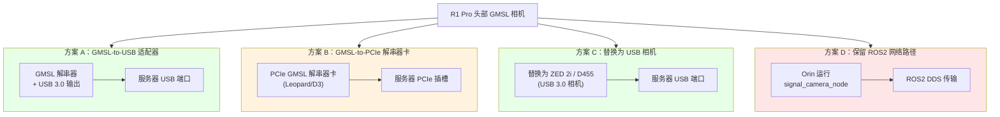

#### 5.2.1 方案 A：GMSL-to-USB 适配器（推荐，如果需要保留原装头部相机）

使用自包含的 GMSL 解串器盒将 GMSL 信号转为 USB 3.0 输出：

```
R1 Pro 头部                   GMSL 同轴线          GMSL-to-USB 适配器    服务器
┌──────────────┐            (原有或延长)          ┌───────────────┐    ┌──────┐
│ GMSL 相机 ×2 │── GMSL ──→  5-15m  ──────────→ │ 解串 + USB 输出│──→ │USB   │
│ (串行器端)    │                                 │               │    │3.0   │
└──────────────┘                                 └───────────────┘    └──────┘
                                                  需要外部供电
```

**可选产品**：

| 产品 | 输入 | 输出 | 价格 | 说明 |
|------|------|------|------|------|
| Sensing World GMSL2-USB3.0 | 1× GMSL2 | USB 3.0 | ¥1500-3000 | 紧凑，Windows/Linux 兼容 |
| Leopard Imaging LI-USB30-DESER | 4× GMSL1/2 | USB 3.0 | ¥3500-6000 | 多路，需 Linux 驱动 |
| Tieriv C1 Camera Kit | 1× GMSL2 | USB 3.0 | ¥2000-3000 | 开源驱动，ROS2 兼容 |

**优势**：保留原装头部相机，不修改机器人硬件
**挑战**：
- 适配器额外延迟 5-15ms（USB 封装开销）
- 需确认 R1 Pro 的 GMSL 版本（GMSL1 or GMSL2）和接插件类型
- 可能需要定制 V4L2/UVC 驱动
- 两路立体相机可能需要两个适配器

#### 5.2.2 方案 B：GMSL-to-PCIe 解串器卡（最低延迟，最高成本）

在服务器中安装 PCIe GMSL 解串器卡：

```
R1 Pro 头部                  GMSL 同轴线        PCIe 解串器卡         服务器
┌──────────────┐           (延长至服务器)      ┌──────────────┐     ┌──────┐
│ GMSL 相机 ×2 │── GMSL ──→ 5-15m ─────────→ │ MAX96712     │ ──→ │PCIe  │
│              │                               │ 4路 GMSL→PCIe│     │×4    │
└──────────────┘                               └──────────────┘     │插槽  │
                                                                    └──────┘
```

**可选产品**：

| 产品 | 输入数 | 接口 | 价格 | 说明 |
|------|--------|------|------|------|
| Leopard LI-JXAV-GMSL2-DESER | 8× GMSL2 | PCIe ×4 | ¥6000-12000 | Linux V4L2 驱动 |
| D3 Engineering DesignCore | 2-8× GMSL2 | PCIe ×4 | ¥4000-15000 | 生产级 |
| Entrust GMSL2 PCIe Card | 4× GMSL2 | PCIe ×4 | ¥4500-8000 | MAX96724 芯片 |

**优势**：最低延迟 (<2ms)，最高带宽，硬件时间戳
**挑战**：
- 仅 Linux 支持（无 Windows 驱动）
- 需安装内核驱动模块
- 价格高，占用 PCIe 插槽
- 需确认 GMSL 版本和相机兼容性

#### 5.2.3 方案 C：替换头部相机为 USB 相机（推荐，最简方案）

如果可以修改机器人硬件，在头部位置安装一台 USB 3.0 深度相机替换原装 GMSL 相机：

```
R1 Pro 头部                USB 3.0 主动线缆              服务器
┌──────────────┐          (10-15m)                    ┌──────────┐
│ 替换相机      │                                      │          │
│ (ZED 2i 或   │── USB-C ──→ AOC 或主动铜线 ─────────→│ USB 3.0  │
│  RealSense   │                                      │ 端口     │
│  D455)       │                                      │          │
└──────────────┘                                      └──────────┘
```

**候选替换相机**：

| 相机 | 接口 | 分辨率 | FOV | 深度范围 | 价格 | RLinf 支持 |
|------|------|--------|-----|---------|------|-----------|
| **Stereolabs ZED 2i** | USB-C 3.0 | 2208×1242 (2K) ~ 672×376 | 110°H | 0.3-20m | ¥3000-4000 | ✅ ZEDCamera |
| **Intel RealSense D455** | USB-C 3.2 | 1280×720 | 87°H | 0.6-6m | ¥2000-2500 | ✅ RealSenseCamera |
| **Intel RealSense D435i** | USB-C 3.1 | 1920×1080 | 87°H | 0.2-10m | ¥2000-2500 | ✅ RealSenseCamera |
| **Stereolabs ZED Mini** | USB-C 3.0 | 2208×1242 | 90°H | 0.1-15m | ¥3000-3500 | ✅ ZEDCamera |

**推荐选择**：
- **ZED 2i**：FOV (110°) 接近原装 (118°)，立体深度 0.3-20m，RLinf 已有 `ZEDCamera` 类，但**需要服务器有 NVIDIA GPU + CUDA**（ZED SDK 依赖）
- **RealSense D455**：纯 USB 设备无需 GPU，但 FOV (87°) 比原装 (118°) 窄

**优势**：
- RLinf 已有驱动（`RealSenseCamera` 或 `ZEDCamera`），零代码开发
- 标准 USB 3.0，与腕部 D405 共用相同的布线和 Hub 方案
- 最简部署，一天内可完成

**挑战**：
- 需要物理安装新相机到 R1 Pro 头部，可能需要 3D 打印支架
- 需要在头部附近引出 USB 线缆
- FOV 可能与原装相机不同，需要调整训练参数

#### 5.2.4 方案 D：保留头部 ROS2 网络路径（过渡方案）

如果头部相机直连暂时不可行，可以先只直连腕部 D405，头部相机保留 ROS2 路径：

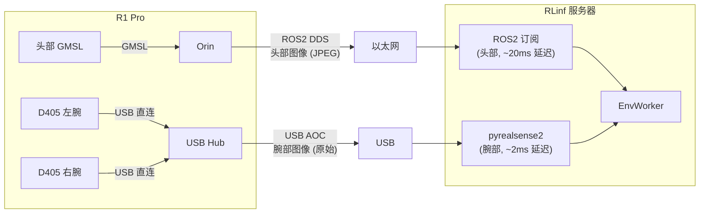

**优势**：最小改动，腕部已获得直连收益
**挑战**：头部图像仍有 10-29ms 额外延迟

### 5.3 头部相机方案推荐决策树

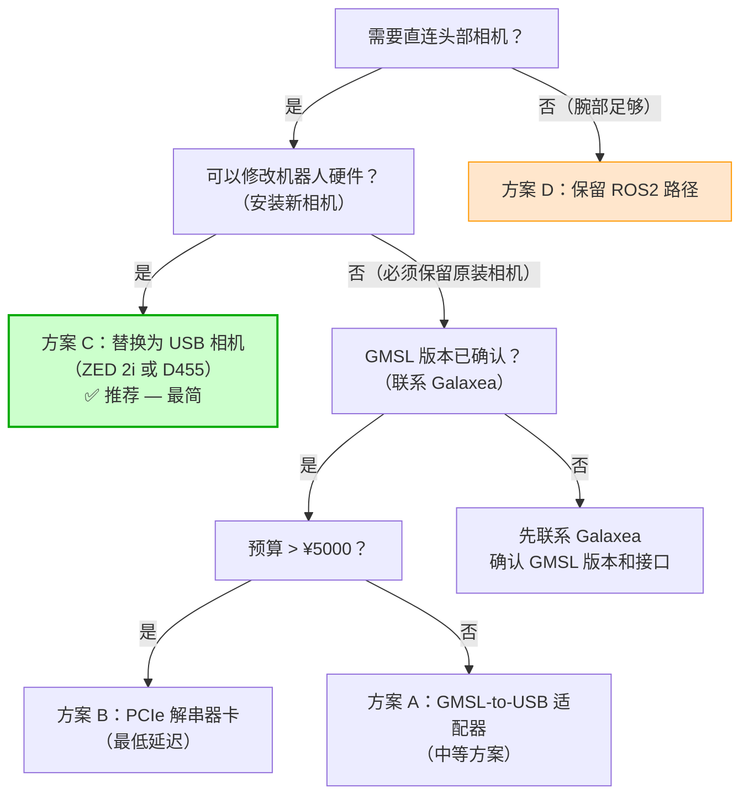

---

## 6. 物理线缆选型与布线设计

### 6.1 布线总体规划

```
                            ┌─────────────────────────┐
                            │      R1 Pro 机器人        │
                            │                           │
     ┌──── 头部 ────┐       │                           │
     │  GMSL 相机 ×2 │       │     ┌── 背部面板 ──────┐  │
     │  (或替换 USB  │       │     │                   │  │
     │   相机)       │       │     │  供电 USB Hub     │  │
     └──────┬───────┘       │     │  ┌──┬──┬──┬──┐   │  │
            │ USB-C          │     │  │P1│P2│P3│P4│   │  │
     ┌──────┘               │     │  └──┴──┴──┴──┘   │  │
     │                      │     │    ↑   ↑          │  │
     │ 沿机器人躯干          │     │    │   │          │  │
     │ 内部走线              │     │   左腕 右腕        │  │
     │                      │     │  D405 D405        │  │
     │  ┌── 左臂 ──┐        │     │                   │  │
     │  │ D405 左腕 │────────┼─────┼─ 1.5m USB 线 ────┘  │
     │  └──────────┘        │     │                      │
     │                      │     │  Orin 以太网口 ─────────── RJ45
     │  ┌── 右臂 ──┐        │     │                      │
     │  │ D405 右腕 │────────┼─────┼─ 1.5m USB 线 ────┘  │
     │  └──────────┘        │     │                      │
     │                      │     └──────────────────────┘
     │                      └─────────────────────────┘
     │                                │              │
     │                                │              │
     │ USB AOC #1                     │ USB AOC #2   │ 以太网
     │ (头部相机, 如适用)             │ (腕部 Hub)    │ (控制)
     │ 10-15m                         │ 5-15m        │
     ↓                                ↓              ↓
  ┌──────────────────────────────────────────────────────┐
  │                   RLinf GPU 服务器                      │
  │  USB 控制器 #1    USB 控制器 #2     以太网口            │
  │  (头部相机)       (腕部 D405×2)     (ROS2 控制)        │
  └──────────────────────────────────────────────────────┘
```

### 6.2 线缆路径设计

**腕部 D405 线缆路径**：
1. D405 原装 1.5m USB-C to USB-A 线缆从夹爪沿手臂内侧走线
2. 到达机器人背部面板，插入供电 USB Hub
3. Hub 通过 USB 3.0 主动线缆连接到服务器

**关键走线注意事项**：
- D405 原装 1.5m 线缆已经沿手臂走线到背板，**无需改变手臂内部走线**
- 只需将背板 USB-A 端从 Orin 口拔出，改接到 USB Hub
- Hub 放置在机器人背部，固定在外壳上（3M VHB 双面胶或螺丝固定）
- Hub 的 USB 上行口通过主动线缆引出到服务器

**头部相机线缆路径（方案 C 替换相机时）**：
1. USB 相机安装在头部，USB-C 线缆从头部沿颈部/躯干走线
2. 线缆通过线缆管理夹具（cable clip）固定在机器人背部
3. 在背部面板处引出，通过独立的 USB AOC 连接到服务器

### 6.3 线缆固定与保护


**防拉扯设计**：
- 在 Hub 端和服务器端各留 **30-50cm 的冗余长度**形成应力环 (stress relief loop)
- 使用魔术贴固定应力环，防止机器人移动时拉扯线缆
- 如果机器人底盘会移动，考虑使用**拖链** (cable carrier) 或**弹簧卷线器** (spring cable reel)

---

## 7. GPU 服务器端硬件准备

### 7.1 USB 控制器规划

| 配置 | 需要 | 说明 |
|------|------|------|
| **腕部 D405 ×2 (640×480@30fps)** | 1× USB 3.0 控制器 | 总带宽 ~2.0 Gbps，单控制器足够 |
| **腕部 D405 ×2 (1280×720@30fps)** | 2× USB 3.0 控制器 | 总带宽 ~4.0 Gbps，建议分开 |
| **+ 头部 USB 相机 ×1** | +1× USB 3.0 控制器 | 独立控制器，避免与腕部争抢带宽 |

**检查服务器板载 USB 控制器数量**：

```bash
# Linux
lspci | grep -i usb
# 输出示例:
# 00:14.0 USB controller: Intel Corporation ... xHCI Host Controller
# 02:00.0 USB controller: Renesas Technology Corp. uPD720201 ...

# 如果只有 1 个控制器，需要加装 PCIe USB 扩展卡
```

**推荐 PCIe USB 3.0 扩展卡**：

| 型号 | 端口数 | 独立控制器数 | 价格 | 说明 |
|------|--------|-------------|------|------|
| StarTech PEXUSB3S44V | 4 | 4 (各独立) | ¥400-600 | 每端口独立 5Gbps 带宽 |
| Inateck KT4004 | 4 | 1 (共享) | ¥100-200 | 共享带宽，适合低分辨率 |

### 7.2 软件依赖

```bash
# 腕部 D405 — pyrealsense2
pip install pyrealsense2
# 或从源码编译（获取最新功能）：
# git clone https://github.com/IntelRealSense/librealsense
# cd librealsense && mkdir build && cd build
# cmake .. -DBUILD_PYTHON_BINDINGS=ON
# make -j$(nproc) && sudo make install

# 头部相机 — 方案 C 替换为 ZED 2i 时
# 1. 安装 ZED SDK（需要 NVIDIA GPU + CUDA）
# 下载: https://www.stereolabs.com/developers/release
# chmod +x ZED_SDK_*.run && ./ZED_SDK_*.run
# 2. pyzed 已随 SDK 安装

# 头部相机 — 方案 C 替换为 D455 时
# 同 D405，使用 pyrealsense2，无需额外安装

# udev 规则（Linux，允许非 root 访问 RealSense）
# librealsense 安装时自动配置，或手动：
sudo cp librealsense/config/99-realsense-libusb.rules /etc/udev/rules.d/
sudo udevadm control --reload-rules && sudo udevadm trigger
```

### 7.3 验证设备连接

```bash
# 确认 D405 通过 USB 3.0 连接（非 USB 2.0 降级）
lsusb -t | grep -i "5000M"
# 应看到 D405 在 5000M（USB 3.0）速率下

# RealSense 官方诊断工具
rs-enumerate-devices
# 输出设备名称、序列号、固件版本、USB 类型

# 如果设备显示为 USB 2.1 而非 3.x：
# → 检查线缆（可能是 USB 2.0 线缆）
# → 检查 Hub（可能不支持 USB 3.0）
# → 检查控制器（可能是 USB 2.0 控制器）
```

---

## 8. 软件集成方案：RLinf 侧适配

### 8.1 架构设计

RLinf 已有的相机抽象层完全适配腕部 D405 直连场景，只需**配置变更**即可工作。头部相机需要根据所选方案做少量适配。

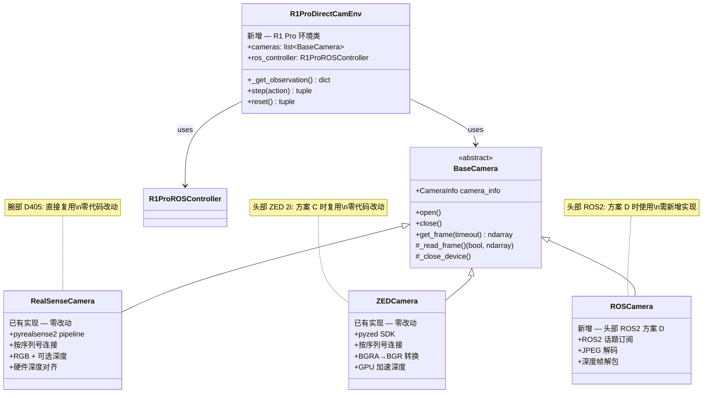

### 8.2 R1ProDirectCamEnv 环境类设计

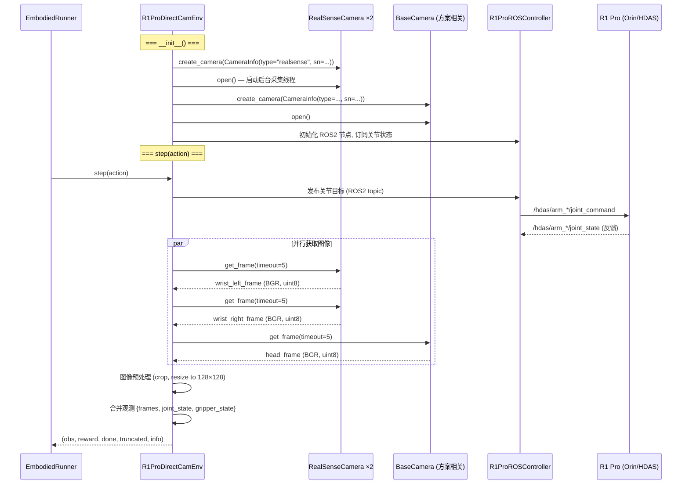

### 8.3 核心代码实现

```python
# rlinf/envs/realworld/r1pro/r1pro_env.py (新增)
from dataclasses import dataclass, field
from typing import Optional
import numpy as np
import gymnasium as gym

from rlinf.envs.realworld.common.camera import BaseCamera, CameraInfo, create_camera


@dataclass
class R1ProRobotConfig:
    """R1 Pro 直连相机环境配置."""
    # 腕部 D405 序列号
    wrist_camera_serials: list[str] = field(default_factory=list)
    wrist_camera_type: str = "realsense"
    wrist_camera_resolution: tuple[int, int] = (640, 480)
    wrist_camera_fps: int = 30
    wrist_enable_depth: bool = True

    # 头部相机配置
    head_camera_serial: Optional[str] = None
    head_camera_type: str = "realsense"  # "realsense" / "zed" / "ros"
    head_camera_resolution: tuple[int, int] = (640, 480)
    head_camera_fps: int = 30
    head_enable_depth: bool = True

    # 图像预处理
    image_size: tuple[int, int] = (128, 128)

    # ROS2 控制
    ros_domain_id: int = 0
    orin_ip: str = "192.168.1.100"

    # 控制参数
    control_frequency: int = 10  # Hz
    max_episode_steps: int = 300
    use_arm_ids: list[int] = field(default_factory=lambda: [0, 1])


class R1ProDirectCamEnv(gym.Env):
    """R1 Pro 环境：腕部/头部相机 USB 直连 + ROS2 关节控制."""

    def __init__(self, config: R1ProRobotConfig):
        self.config = config
        self._cameras: list[BaseCamera] = []
        self._camera_names: list[str] = []
        self._open_cameras()

    def _open_cameras(self):
        # 腕部 D405 (直连 USB)
        for i, sn in enumerate(self.config.wrist_camera_serials):
            name = f"wrist_{['left', 'right'][i]}"
            info = CameraInfo(
                name=name,
                serial_number=sn,
                camera_type=self.config.wrist_camera_type,
                resolution=self.config.wrist_camera_resolution,
                fps=self.config.wrist_camera_fps,
                enable_depth=self.config.wrist_enable_depth,
            )
            camera = create_camera(info)
            camera.open()
            self._cameras.append(camera)
            self._camera_names.append(name)

        # 头部相机 (直连 USB 或 ROS2 话题)
        if self.config.head_camera_serial:
            info = CameraInfo(
                name="head",
                serial_number=self.config.head_camera_serial,
                camera_type=self.config.head_camera_type,
                resolution=self.config.head_camera_resolution,
                fps=self.config.head_camera_fps,
                enable_depth=self.config.head_enable_depth,
            )
            camera = create_camera(info)
            camera.open()
            self._cameras.append(camera)
            self._camera_names.append("head")

    def _get_camera_frames(self) -> dict[str, np.ndarray]:
        frames = {}
        for camera, name in zip(self._cameras, self._camera_names):
            frame = camera.get_frame(timeout=5)
            # 裁剪 + 缩放到训练尺寸
            h, w = frame.shape[:2]
            target_h, target_w = self.config.image_size
            import cv2
            resized = cv2.resize(frame[:, :, :3], (target_w, target_h))
            frames[name] = resized
            if frame.shape[2] > 3:
                depth = cv2.resize(
                    frame[:, :, 3:],
                    (target_w, target_h),
                    interpolation=cv2.INTER_NEAREST,
                )
                frames[f"{name}_depth"] = depth
        return frames

    def _close_cameras(self):
        for camera in self._cameras:
            camera.close()
        self._cameras = []
        self._camera_names = []

    def close(self):
        self._close_cameras()
        super().close()
```

### 8.4 camera 工厂扩展（方案 D 头部 ROS2 时）

如果头部相机保留 ROS2 路径（方案 D），需要新增 `ROSCamera`：

```python
# rlinf/envs/realworld/common/camera/ros_camera.py (新增，方案 D 时)
import numpy as np
from typing import Optional
from .base_camera import BaseCamera, CameraInfo


class ROSCamera(BaseCamera):
    """通过 ROS2 话题获取相机帧的适配器."""

    def __init__(self, camera_info: CameraInfo):
        super().__init__(camera_info)
        import rclpy
        from sensor_msgs.msg import CompressedImage

        self._topic = camera_info.serial_number  # 复用 serial_number 存储话题名
        self._latest_frame: Optional[np.ndarray] = None
        self._node = None

    def open(self):
        import rclpy
        from rclpy.node import Node
        from sensor_msgs.msg import CompressedImage
        import cv2

        if not rclpy.ok():
            rclpy.init()

        self._node = rclpy.create_node(f"rlinf_cam_{self._camera_info.name}")
        self._sub = self._node.create_subscription(
            CompressedImage,
            self._topic,
            self._image_callback,
            qos_profile=10,
        )
        super().open()

    def _image_callback(self, msg):
        import cv2
        np_arr = np.frombuffer(msg.data, np.uint8)
        frame = cv2.imdecode(np_arr, cv2.IMREAD_COLOR)
        self._latest_frame = frame

    def _read_frame(self) -> tuple[bool, Optional[np.ndarray]]:
        import rclpy
        rclpy.spin_once(self._node, timeout_sec=0.01)
        if self._latest_frame is not None:
            return True, self._latest_frame
        return False, None

    def _close_device(self):
        if self._node:
            self._node.destroy_node()
```

更新工厂：

```python
# rlinf/envs/realworld/common/camera/__init__.py 中添加
def create_camera(camera_info: CameraInfo) -> BaseCamera:
    camera_type = camera_info.camera_type.lower()
    if camera_type == "zed":
        from .zed_camera import ZEDCamera
        return ZEDCamera(camera_info)
    if camera_type in ("realsense", "rs"):
        return RealSenseCamera(camera_info)
    if camera_type == "ros":
        from .ros_camera import ROSCamera
        return ROSCamera(camera_info)
    raise ValueError(f"Unsupported camera_type={camera_type!r}")
```

### 8.5 RLinf 训练配置

```yaml
# examples/embodiment/config/r1pro_sac_directcam.yaml

env:
  env_type: r1pro_direct
  train:
    total_num_envs: 1
    max_episode_steps: 300
    robot_config:
      # 腕部 D405 直连
      wrist_camera_serials: ["123456789", "987654321"]  # 从 rs-enumerate-devices 获取
      wrist_camera_type: "realsense"
      wrist_camera_resolution: [640, 480]
      wrist_camera_fps: 30
      wrist_enable_depth: true

      # 头部相机 — 方案 C (替换为 D455)
      head_camera_serial: "111222333"
      head_camera_type: "realsense"
      head_camera_resolution: [640, 480]
      head_camera_fps: 30
      head_enable_depth: true

      # 头部相机 — 方案 D (保留 ROS2) 的替代配置
      # head_camera_serial: "/hdas/camera_head/left_raw/image_raw_color/compressed"
      # head_camera_type: "ros"

      image_size: [128, 128]

      # ROS2 控制
      orin_ip: "192.168.1.100"
      control_frequency: 20  # 直连后可提升到 20Hz

algorithm:
  adv_type: embodied_sac
  loss_type: embodied_sac
  gamma: 0.96
  tau: 0.005
  critic_actor_ratio: 4
  update_epoch: 32

cluster:
  num_nodes: 2
  node_groups:
    - label: gpu
      node_ranks: 0
    - label: r1pro
      node_ranks: 1
      hardware:
        type: R1Pro
  component_placement:
    actor:
      node_group: gpu
      placement: 0
    rollout:
      node_group: gpu
      placement: 0
    env:
      node_group: r1pro
      placement: 0
```

### 8.6 与 RLinf 训练管线的集成

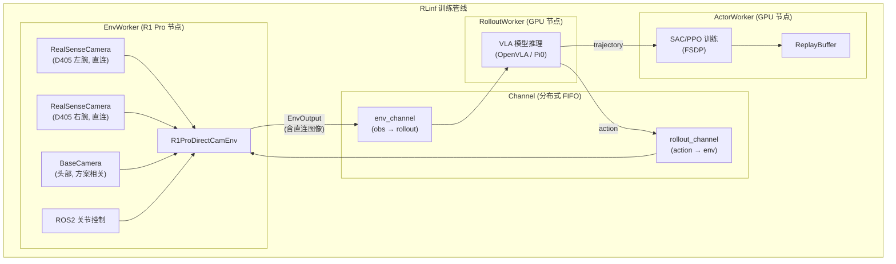

**关键集成点**：
1. `R1ProDirectCamEnv` 产生的 `EnvOutput` 与 Franka 环境格式完全一致（`obs["frames"]["wrist_left"]` 等），VLA 模型无需任何修改
2. 图像在 EnvWorker 进程内直接从 USB 获取，不经过网络，延迟最低
3. 图像以 CPU 张量形式通过 Channel 传输到 RolloutWorker，与现有管线完全兼容

---

## 9. 部署拓扑与配置示例

### 9.1 最小部署拓扑（单 GPU 服务器）

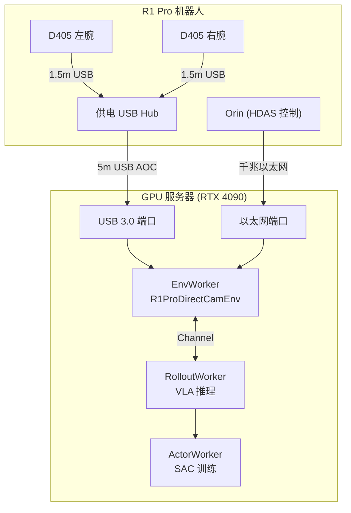

**硬件清单**：
- 1× GPU 服务器（RTX 4090, 至少 2 个独立 USB 3.0 控制器）
- 1× 供电 USB 3.0 Hub
- 1× 5m USB 3.0 主动铜线
- 1× 千兆以太网线

### 9.2 Cloud-Edge 部署拓扑（多 GPU）

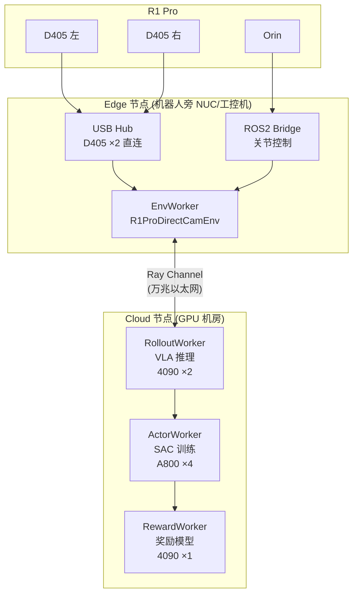

**优势**：Edge 节点紧邻机器人（USB 线缆短），Cloud 节点提供大规模 GPU 算力。图像在 Edge 获取后以 CPU 张量通过 Ray Channel 传到 Cloud。

---

## 10. 实施步骤

### 10.1 第一阶段：腕部 D405 直连（1-2 天）

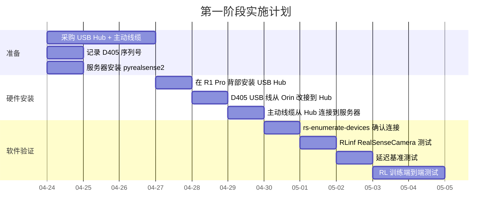

**详细步骤**：

1. **准备阶段**
   ```bash
   # 在 R1 Pro Orin 上记录 D405 序列号
   ssh galaxea@r1pro
   cat /opt/galaxea/sensor/realsense/RS_LEFT     # 记录左腕序列号
   cat /opt/galaxea/sensor/realsense/RS_RIGHT    # 记录右腕序列号

   # 在服务器上安装 pyrealsense2
   pip install pyrealsense2
   ```

2. **停止 Orin 相机驱动**
   ```bash
   # 在 Orin 上停止 realsense2_camera 节点
   ssh galaxea@r1pro
   # 停止 ROS2 相机 launch
   # (具体命令取决于 HDAS 的 systemd 服务配置)
   sudo systemctl stop hdas-camera-wrist.service  # 示例
   ```

3. **物理改接**
   - 关闭 R1 Pro 电源
   - 将左腕 D405 的 USB-A 端从 Orin 背板 USB 口拔出
   - 将右腕 D405 的 USB-A 端从 Orin 背板 USB 口拔出
   - 将两根 USB-A 插入供电 USB Hub
   - 用 USB 3.0 主动线缆连接 Hub 上行口到服务器
   - 开机

4. **验证连接**
   ```bash
   # 在服务器上
   rs-enumerate-devices
   # 应显示两台 D405，含序列号和 USB 3.x 状态

   # Python 验证
   python -c "
   import pyrealsense2 as rs
   ctx = rs.context()
   for dev in ctx.query_devices():
       print(dev.get_info(rs.camera_info.name),
             dev.get_info(rs.camera_info.serial_number),
             dev.get_info(rs.camera_info.usb_type_descriptor))
   "
   ```

5. **RLinf 集成测试**
   ```python
   from rlinf.envs.realworld.common.camera import CameraInfo, create_camera

   cam_left = create_camera(CameraInfo(
       name="wrist_left",
       serial_number="<左腕序列号>",
       camera_type="realsense",
       resolution=(640, 480),
       fps=30,
       enable_depth=True,
   ))
   cam_left.open()

   frame = cam_left.get_frame(timeout=5)
   print(f"Frame shape: {frame.shape}")  # (480, 640, 4) if depth enabled
   cam_left.close()
   ```

### 10.2 第二阶段：头部相机方案评估（1-2 周）

1. **联系 Galaxea** 确认头部 GMSL 相机的具体型号和 GMSL 版本
2. **评估方案 C（替换相机）的可行性**：
   - 测量 R1 Pro 头部相机安装空间
   - 设计/3D 打印 USB 相机支架
   - 选购 ZED 2i 或 D455
3. **如果不可替换**，评估方案 A（GMSL-to-USB 适配器）：
   - 确认 GMSL 版本和接插件类型
   - 采购适配器
   - 测试兼容性

### 10.3 第三阶段：RL 训练验证（1 周）

1. 使用 RLinf `AsyncEmbodiedRunner` + `R1ProDirectCamEnv` 运行 SAC 训练
2. 对比网络路径 vs 直连路径的训练指标（成功率、收敛速度）
3. 优化控制频率（从 10Hz 尝试提升到 20Hz）

---

## 11. 验证与测试

### 11.1 硬件连接验证清单

| 检查项 | 验证方法 | 预期结果 |
|--------|---------|---------|
| D405 USB 3.x 连接 | `rs-enumerate-devices` | usb_type = "3.2" |
| D405 序列号正确 | 比对记录的序列号 | 左右腕序列号匹配 |
| 帧率达标 | pyrealsense2 计时 | ≥28fps (640×480) |
| 深度帧有效 | 深度图可视化 | 近距离 (<50cm) 有有效深度 |
| Hub 供电充足 | 两台 D405 同时工作 | 无间歇断连 |
| 线缆无信号衰减 | `usb_type_descriptor` | 始终为 "3.2"，无降级 |

### 11.2 延迟基准测试

```python
import time
import pyrealsense2 as rs
import numpy as np

pipeline = rs.pipeline()
config = rs.config()
config.enable_device("<序列号>")
config.enable_stream(rs.stream.color, 640, 480, rs.format.bgr8, 30)
profile = pipeline.start(config)

# 预热
for _ in range(30):
    pipeline.wait_for_frames()

# 测量 100 帧的获取延迟
latencies = []
for _ in range(100):
    t0 = time.perf_counter_ns()
    frames = pipeline.wait_for_frames()
    color = np.asanyarray(frames.get_color_frame().get_data())
    t1 = time.perf_counter_ns()
    latencies.append((t1 - t0) / 1e6)  # ms

print(f"帧获取延迟 (ms):")
print(f"  均值: {np.mean(latencies):.2f}")
print(f"  中位数: {np.median(latencies):.2f}")
print(f"  P95: {np.percentile(latencies, 95):.2f}")
print(f"  P99: {np.percentile(latencies, 99):.2f}")
print(f"  最大: {np.max(latencies):.2f}")
print(f"  实际帧率: {1000/np.mean(latencies):.1f} fps")

pipeline.stop()
```

**预期结果**：
- 均值延迟: ~33ms (30fps 帧间隔)
- SDK 处理延迟: <2ms (从 wait_for_frames 到 numpy 可用)
- 实际帧率: ~29-30fps

### 11.3 端到端 RL 训练验证

| 测试 | 方法 | 通过标准 |
|------|------|---------|
| 环境 reset | `env.reset()` 返回有效 obs | obs 中含所有相机帧 |
| 环境 step | `env.step(action)` 正常执行 | 无超时、无断连 |
| 连续运行 | 300 步 episode ×10 | 无帧丢失、无 USB 断连 |
| SAC 训练 | 1000 步训练 | loss 正常下降 |
| 异步训练 | AsyncEmbodiedRunner | Channel 数据流正常 |
| 长时间稳定性 | 连续训练 8 小时 | 无累积内存泄漏 |

---

## 12. BOM 清单与成本估算

### 12.1 方案一：腕部直连 + 头部 ROS2（最小改动）

| 组件 | 型号/规格 | 数量 | 单价 (¥) | 总价 (¥) |
|------|----------|------|---------|---------|
| 供电 USB 3.0 Hub | Anker 4-Port + 5V/3A 适配器 | 1 | 150 | 150 |
| USB 3.0 主动铜线 | Cable Matters 201503, 5m | 1 | 200 | 200 |
| 线缆管理夹具 | 3M 粘贴式线缆夹 | 1包 | 30 | 30 |
| **总计** | | | | **¥380** |

### 12.2 方案二：腕部直连 + 头部替换 USB 相机

| 组件 | 型号/规格 | 数量 | 单价 (¥) | 总价 (¥) |
|------|----------|------|---------|---------|
| 供电 USB 3.0 Hub | Anker 4-Port + 5V/3A 适配器 | 1 | 150 | 150 |
| USB 3.0 主动铜线 (腕部) | Cable Matters 201503, 5m | 1 | 200 | 200 |
| USB 3.0 主动铜线 (头部) | CableCreation USB-C Active, 5m | 1 | 200 | 200 |
| 头部替换相机 (D455) | Intel RealSense D455 | 1 | 2200 | 2200 |
| 或 头部替换相机 (ZED 2i) | Stereolabs ZED 2i | 1 | 3500 | 3500 |
| 相机安装支架 | 3D 打印 / CNC 铝合金 | 1 | 100-300 | 200 |
| PCIe USB 3.0 扩展卡 | StarTech PEXUSB3S44V (如需) | 1 | 500 | 500 |
| 线缆管理夹具 | 3M 粘贴式线缆夹 | 1包 | 30 | 30 |
| **总计 (D455)** | | | | **¥3,480** |
| **总计 (ZED 2i)** | | | | **¥4,780** |

### 12.3 方案三：腕部直连 + 头部 GMSL 解串器

| 组件 | 型号/规格 | 数量 | 单价 (¥) | 总价 (¥) |
|------|----------|------|---------|---------|
| 供电 USB 3.0 Hub | Anker 4-Port | 1 | 150 | 150 |
| USB 3.0 主动铜线 (腕部) | 5m | 1 | 200 | 200 |
| GMSL-to-USB 适配器 | Sensing World GMSL2-USB3.0 | 2 | 2500 | 5000 |
| GMSL 同轴延长线 | FAKRA, 10m | 2 | 200 | 400 |
| 线缆管理 | | | | 50 |
| **总计** | | | | **¥5,800** |

---

## 13. 风险与缓解

### 13.1 风险评估矩阵

| 风险 | 概率 | 影响 | 缓解措施 |
|------|------|------|---------|
| **USB 断连**：长线缆或 Hub 导致 D405 间歇断连 | 中 | 高 | 使用 Intel 推荐的 Hub 型号；软件层面添加自动重连逻辑；设置 `frames_queue_size=1` 减少缓冲 |
| **USB 2.0 降级**：线缆/Hub 实际以 USB 2.0 速度运行 | 低 | 高 | 启动时检查 `usb_type_descriptor`，如果为 "2.1" 则告警并中止；采购前确认线缆/Hub 规格 |
| **供电不足**：Hub 供电不足导致设备不稳定 | 低 | 中 | 使用带外接电源适配器的 Hub（非总线供电） |
| **EMI 干扰**：机器人电机/驱动器电磁干扰 USB 信号 | 低 | 中 | 使用屏蔽线缆；USB 线缆远离电机线缆走线 |
| **GMSL 版本不兼容**（头部方案 A/B） | 中 | 高 | 先联系 Galaxea 确认 GMSL 版本再采购解串器 |
| **头部相机安装空间不足**（方案 C） | 中 | 中 | 先测量空间，再设计支架；D405 体积极小 (42×42×23mm) 更容易安装 |
| **线缆绊倒/拉扯** | 中 | 低 | 走线用地面保护槽；关键接头留应力环；固定线缆 |
| **Orin HDAS 依赖相机**：停止相机驱动影响 HDAS 其他功能 | 低 | 高 | 先在测试环境验证；确认 HDAS 关节控制不依赖相机节点 |

### 13.2 回滚方案

如果直连方案出现不可解决的问题，可以在 **10 分钟内回滚**：
1. 将 D405 USB-A 端从 Hub 拔出
2. 重新插入 Orin 背板 USB-A 口
3. 重启 Orin `realsense2_camera` 节点
4. 切换 RLinf 配置为 ROS2 话题模式

---

## 14. 附录

### 14.1 关键参考资料

| 资料 | URL | 说明 |
|------|-----|------|
| R1 Pro 硬件介绍 | https://docs.galaxea-dynamics.com/Guide/R1Pro/hardware_introduction/R1Pro_Hardware_Introduction/ | 相机规格 |
| R1 Pro 软件指南 (ROS2) | https://docs.galaxea-dynamics.com/Guide/R1Pro/software_introduction/R1Pro_Software_Guide_ROS2/ | 相机驱动配置 |
| Galaxea SDK v2.1.3 日志 | https://docs.galaxea-dynamics.com/Guide/sdk_change_log/ros2/v2.1.3/ | D405 确认 |
| R1 Pro VR 遥操教程 | https://docs.galaxea-dynamics.com/Guide/R1Pro/vr_teleop/ros2/R1Pro_VR_Teleop_Usage_Tutorial_ros2/ | 相机话题 |
| Intel RealSense D405 | https://www.intelrealsense.com/depth-camera-d405/ | 产品页 |
| librealsense GitHub | https://github.com/IntelRealSense/librealsense | SDK 源码 |
| pyrealsense2 API | https://intelrealsense.github.io/librealsense/python_docs/ | Python API 文档 |
| RLinf 相机抽象 | `rlinf/envs/realworld/common/camera/` | 已有实现 |
| RLinf Franka 环境 | `rlinf/envs/realworld/franka/franka_env.py` | 参考模式 |

### 14.2 RLinf 相机系统 UML 类图

```mermaid
classDiagram
    class CameraInfo {
        +name: str
        +serial_number: str
        +camera_type: str = "realsense"
        +resolution: tuple = (640, 480)
        +fps: int = 15
        +enable_depth: bool = False
    }

    class BaseCamera {
        <<abstract>>
        #_camera_info: CameraInfo
        #_frame_queue: Queue
        #_frame_capturing_thread: Thread
        +open()
        +close()
        +get_frame(timeout=5) ndarray
        #_capture_frames()
        #_read_frame()* (bool, ndarray)
        #_close_device()*
    }

    class RealSenseCamera {
        -_pipeline: rs.pipeline
        -_config: rs.config
        -_align: rs.align
        -_serial_number: str
        -_enable_depth: bool
        +_read_frame() (bool, ndarray)
        +_close_device()
        +get_device_serial_numbers()$ set~str~
    }

    class ZEDCamera {
        -_camera: sl.Camera
        -_image: sl.Mat
        -_depth: sl.Mat
        +_read_frame() (bool, ndarray)
        +_close_device()
        +get_device_serial_numbers()$ list~str~
    }

    class ROSCamera {
        -_node: rclpy.Node
        -_sub: Subscription
        -_topic: str
        -_latest_frame: ndarray
        +_read_frame() (bool, ndarray)
        +_close_device()
    }

    class create_camera {
        <<function>>
        (CameraInfo) → BaseCamera
        "realsense"/"rs" → RealSenseCamera
        "zed" → ZEDCamera
        "ros" → ROSCamera
    }

    BaseCamera <|-- RealSenseCamera
    BaseCamera <|-- ZEDCamera
    BaseCamera <|-- ROSCamera
    BaseCamera --> CameraInfo
    create_camera --> BaseCamera
    create_camera --> CameraInfo
```

### 14.3 D405 直连 vs 网络传输的数据流对比

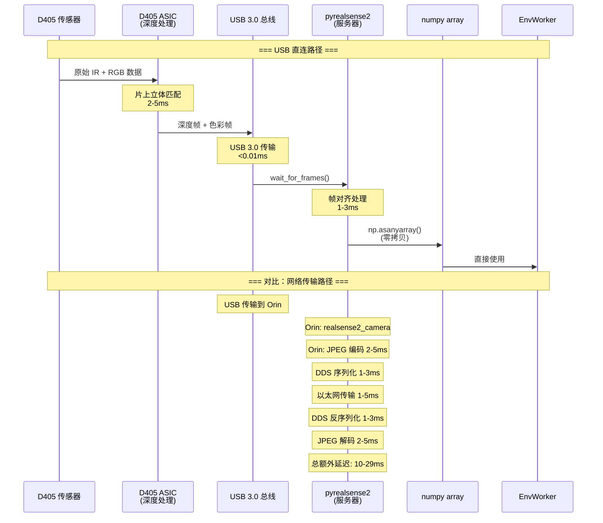

### 14.4 多相机 USB 带宽规划图

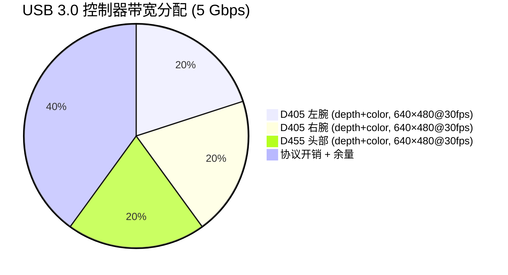

> 640×480@30fps 配置下，3 台相机总带宽约 3 Gbps，单个 USB 3.0 控制器（5 Gbps）可承载。如果使用 1280×720@30fps，则需要 2 个独立控制器。

### 14.5 故障排查指南

| 症状 | 可能原因 | 排查步骤 |
|------|---------|---------|
| `rs-enumerate-devices` 无输出 | USB 物理连接问题 | 检查线缆、Hub 电源、换端口试 |
| 设备显示 USB 2.1 | 线缆/Hub 不支持 USB 3.0 | 换线缆/Hub；检查控制器芯片组 |
| 帧率 <20fps | USB 带宽不足 | 降低分辨率；使用独立控制器 |
| 间歇断连 | Hub 供电不足 / EMI | 换供电 Hub；线缆远离电机线 |
| `pipeline.start()` 超时 | 设备被其他进程占用 | 确认 Orin 上的 realsense2_camera 已停止 |
| 深度帧全零 | 距离超出 D405 范围 | D405 最佳范围 7-50cm，确认被观察物体在范围内 |

---

> **版权声明**：本文档基于 RLinf 开源项目（Apache-2.0 License）和 Galaxea R1 Pro 公开文档编写。
>
> **RLinf**: https://github.com/RLinf/RLinf
> **Galaxea R1 Pro**: https://docs.galaxea-dynamics.com/Guide/R1Pro/
>
> **最后更新**: 2026-04-23
