# Galaxea R1 Pro 安全监督系统:实现分析、真机部署指南与差距评估

> **定位**:本文是 [r1pro5op47.md](r1pro5op47.md) 设计文档 §6.4 / §9 的**深度实现审计**,以及 [r1pro5op47_imp1.md](r1pro5op47_imp1.md) 第一阶段实施中安全相关代码的完整剖析。重点在于**能落地**——工程师读完本文应能在真机上安全地启动第一个 RL episode。
>
> 阅读对象:负责真机联调的工程师。
> 版本:safety_2 · 日期:2026-04-27

---

## 目录

1. [总体概述](#1-总体概述)
2. [部署前信息采集清单](#2-部署前信息采集清单)
3. [硬件规格与 ROS2 Topic 参考](#3-硬件规格与-ros2-topic-参考)
4. [五级闸门 + 三级停机设计架构](#4-五级闸门--三级停机设计架构)
5. [关键代码走读](#5-关键代码走读)
6. [调用流程与数据流](#6-调用流程与数据流)
7. [YAML 配置指南](#7-yaml-配置指南)
8. [测试与验证](#8-测试与验证) — 含 [§8.6 L3a TCP 安全盒测试用例](#86-l3a-tcp-安全盒测试用例的实现与使用) / [§8.7 R1 Pro 右臂 CLI 工具](#87-r1-pro-右臂位姿--安全盒-cli-工具的设计实现与使用)
9. [已知差距与建议](#9-已知差距与建议)
10. [附录](#10-附录)

---

## 1. 总体概述

### 1.1 安全系统在 RLinf 中的位置

```
Policy 输出 action ∈ [-1,1]^D
       │
       ▼
┌──────────────────────────────────────────────┐
│  GalaxeaR1ProEnv.step()                      │
│                                              │
│  ① controller.get_state()  →  RobotState     │
│  ② safety.validate(action, state, schema)    │  ← 本文重点
│  ③ if emergency_stop → apply_brake           │
│     elif safe_stop  → apply_brake            │
│     else            → _dispatch_action       │
│  ④ time.sleep 维持 step_frequency            │
│  ⑤ 再次 get_state → 构建 observation         │
└──────────────────────────────────────────────┘
```

安全监督器 (`GalaxeaR1ProSafetySupervisor`) 位于 `step()` 内部,是**每个动作**必须经过的门控——不是 Wrapper、不是可选项、不是 soft constraint。它:
- 接收原始 action、最新 RobotState 和 ActionSchema
- 返回 `SafetyInfo`(含 safe_action + 三级升级标志 + 人类可读 reasons + 度量)
- 不阻塞、不 sleep——只变换 action 或设置标志

### 1.2 与 Franka 安全的对比

| 维度 | Franka | Galaxea R1 Pro |
|------|--------|----------------|
| 安全层数 | 1 层(TCP box clip) | 5 层(L1-L5) |
| 预测性检查 | 无 | L3a 预测 EE 目标位置后裁剪 |
| 动作改写 | 无(只裁剪 pose) | L3a 裁剪后反向写回归一化 action |
| 双臂碰撞 | 不适用(单臂) | L3b 包围球模型 |
| 系统看门狗 | 无 | BMS / SWD / 错误码 / stale / 心跳 |
| 升级层级 | 无 | soft_hold / safe_stop / emergency_stop |
| 审计记录 | 无 | SafetyInfo.reason + metrics |

### 1.3 关键源文件索引

| 文件 | 行数 | 作用 |
|------|------|------|
| [r1_pro_safety.py](../../../rlinf/envs/realworld/galaxear/r1_pro_safety.py) | 458 | 核心监督器:SafetyConfig + SafetyInfo + L1-L5 |
| [r1_pro_env.py](../../../rlinf/envs/realworld/galaxear/r1_pro_env.py) | 737 | Env 的 step()/reset() 安全集成 |
| [r1_pro_controller.py](../../../rlinf/envs/realworld/galaxear/r1_pro_controller.py) | 705 | ROS2 控制器,订阅反馈 topic 填充 RobotState |
| [r1_pro_robot_state.py](../../../rlinf/envs/realworld/galaxear/r1_pro_robot_state.py) | 220 | 26 DoF + BMS + 错误码 + 看门狗字段的 dataclass |
| [r1_pro_action_schema.py](../../../rlinf/envs/realworld/galaxear/r1_pro_action_schema.py) | 163 | 按 stage 切分 action + 预测 EE 目标 |
| [r1_pro_wrappers.py](../../../rlinf/envs/realworld/galaxear/r1_pro_wrappers.py) | 450 | 摇杆 / VR / 双臂碰撞 / 平滑 4 个 wrapper |
| [r1_pro_camera_mux.py](../../../rlinf/envs/realworld/galaxear/r1_pro_camera_mux.py) | 293 | 相机多路复用 + 帧陈旧检测 |
| [test_galaxea_r1_pro_safety.py](../../../tests/unit_tests/test_galaxea_r1_pro_safety.py) | 183 | 11 个安全单元测试 |

---

## 2. 部署前信息采集清单

> 以下 9 项信息**必须**在真机首次联调前逐一确认。每项均标注了默认值来源、验证方法、以及若错误会导致的后果。

### 2.1 坐标系确认

| 项目 | 详情 |
|------|------|
| **依赖** | L3a 安全盒在 `torso_link4` 坐标系中定义 |
| **当前假设** | `state.right_ee_pose` / `left_ee_pose` 由 controller 从 mobiman 的 `pose_ee_arm_*` topic 获取,报告 frame 为 `torso_link4` |
| **验证方法** | `ros2 topic echo /motion_control/pose_ee_arm_right --once`,检查 `header.frame_id` |
| **若错误** | L3a 裁剪范围完全不对,臂可能撞到躯干或桌面 |

### 2.2 关节限位验证

| 项目 | 详情 |
|------|------|
| **当前默认值** | `arm_q_min = [-2.7, -1.8, -2.7, -3.0, -2.7, -0.1, -2.7]` rad |
| | `arm_q_max = [ 2.7,  1.8,  2.7,  0.0,  2.7,  3.7,  2.7]` rad |
| | `arm_qvel_max = [3.0, 3.0, 3.0, 3.0, 5.0, 5.0, 5.0]` rad/s |
| **验证方法** | 对照 A2 臂电机规格书(Galaxea SDK `install/config/*.yaml` 中通常有 `joint_limits`） |
| **注意** | L2 目前**仅为注释**,不直接强制;间接通过 L3a+L4 保护。J5-J7 qvel 上限为 5 rad/s,需确认是否与硬件一致 |

### 2.3 TCP 工作空间测量

| 项目 | 详情 |
|------|------|
| **当前默认值** | `right_ee_min = [0.20, -0.35, 0.05, -3.20, -0.30, -0.30]` |
| | `right_ee_max = [0.65,  0.35, 0.65,  3.20,  0.30,  0.30]` |
| | (左右对称) |
| **测量方法** | 1. 用示教器将臂移至物理极限位置,记录 EE pose<br/>2. 在 `torso_link4` frame 下取各轴 min/max<br/>3. 收缩 5-10cm 作为安全裕量 |
| **注意** | 物理工作空间可能因桌面、夹具、安全围栏而不对称——左右用相同默认值可能不合适 |

### 2.4 BMS Topic 语义

| 项目 | 详情 |
|------|------|
| **代码依赖** | `state.bms.get("capital_pct", 100.0)`,L5 比较 `< 25.0` |
| **controller 映射** | [r1_pro_controller.py:527-529](../../../rlinf/envs/realworld/galaxear/r1_pro_controller.py#L527-L529):`float(getattr(msg, "capital", getattr(msg, "capital_pct", 100.0)))` |
| **验证方法** | `ros2 topic echo /hdas/bms --once`,确认 `capital` 字段含义:是 SoC% (0-100)?还是 Wh?还是伏特? |
| **若错误** | 例如 `capital` 报告的是 48V 电压而非百分比 → `48 > 25` 永远不触发 safe_stop → 低电量时臂可能跌落 |

### 2.5 SWD 极性确认

| 项目 | 详情 |
|------|------|
| **代码依赖** | [r1_pro_safety.py:264-269](../../../rlinf/envs/realworld/galaxear/r1_pro_safety.py#L264-L269):`if state.controller_signal.get("swd", 0):` → truthy 则 `emergency_stop` |
| **已知问题** | R1 Pro 遥控器的三段开关通常报告 int 值 0/1/2;`swd=1` 是"中位"还是"下位(急停)"? |
| **验证方法** | 1. `ros2 topic echo /controller --once`<br/>2. 拨动 SWD 到三个位置,分别记录值<br/>3. 确认哪个值代表"急停"(DOWN) |
| **若错误** | SWD 的"安全位置"可能误判为急停 → 训练无法启动;或急停位不触发 → 失去最后一道硬件保护 |

### 2.6 CAN 总线配置

| 项目 | 详情 |
|------|------|
| **前提** | Orin 上 CAN 必须 UP 才能与 HDAS 通信 |
| **验证方法** | `ip link show can0`——必须看到 `state UP` |
| **初始化** | 通常 Orin 每次开机后运行 `bash ~/can.sh` |
| **enumerate 检查** | [galaxea_r1_pro.py](../../../rlinf/scheduler/hardware/robots/galaxea_r1_pro.py) 的 `_validate_can_link` 只 soft check(告警不报错) |

### 2.7 ROS_DOMAIN_ID 分配

| 项目 | 详情 |
|------|------|
| **默认值** | `72`([setup_before_ray_galaxea_r1_pro.sh](../../../ray_utils/realworld/setup_before_ray_galaxea_r1_pro.sh) 第 41 行) |
| **注意** | 多机器人实验室必须为每台机器人分配唯一 ID;否则 FMEA F3(跨控制)将发生 |
| **验证方法** | GPU server 和 Orin 上 `echo $ROS_DOMAIN_ID` 必须相同且与同实验室其他机器人不同 |

### 2.8 相机序列号与 Topic

| 项目 | 详情 |
|------|------|
| **USB-direct** | D405 序列号(例 `230322272869`),需与 YAML `wrist_direct_camera_serials` 一致 |
| **ROS2 相机** | 精确 topic 路径需与 Orin 上 `ros2 topic list` 对应 |
| **Mux 回退** | [r1_pro_camera_mux.py:167](../../../rlinf/envs/realworld/galaxear/r1_pro_camera_mux.py#L167) 推导 `/hdas/camera_{name}/color/image_raw/compressed`——确认此命名规范与 Orin 配置一致 |

### 2.9 DDS 跨主机配置

| 项目 | 详情 |
|------|------|
| **必须设置** | GPU server 和 Orin 上 `ROS_LOCALHOST_ONLY=0` |
| **可选** | `FASTRTPS_DEFAULT_PROFILES_FILE` 指向 FastDDS XML 配置(调 buffer、设 unicast peer) |
| **验证方法** | GPU server 上 `ros2 topic list` 应能看到 Orin 发布的 `/hdas/*` topic |

### 采集清单汇总

| # | 项目 | 信息来源 | 验证命令 | 默认值 | 必须覆盖? |
|---|------|---------|---------|--------|----------|
| 2.1 | 坐标系 | mobiman 文档 | `ros2 topic echo ...` | `torso_link4` | 确认即可 |
| 2.2 | 关节限位 | A2 臂规格书 | Galaxea SDK config | 见上 | 对照确认 |
| 2.3 | TCP 工作空间 | 现场测量 | 示教器 | 见上 | **必须** |
| 2.4 | BMS 语义 | hdas_msg 定义 | `ros2 topic echo /hdas/bms` | `capital_pct` | **必须** |
| 2.5 | SWD 极性 | 实测 | 拨动后 echo | `swd=1=DOWN` | **必须** |
| 2.6 | CAN | `~/can.sh` | `ip link show can0` | N/A | 每次开机 |
| 2.7 | DOMAIN_ID | 实验室规划 | `echo $ROS_DOMAIN_ID` | `72` | 多机环境必须 |
| 2.8 | 相机 | `rs-enumerate-devices` | `ros2 topic list` | 示例值 | **必须** |
| 2.9 | DDS | 网络配置 | `ros2 topic list`（跨主机） | N/A | 双节点必须 |

---

## 3. 硬件规格与 ROS2 Topic 参考

### 3.1 R1 Pro 与安全相关的物理特性

| 部件 | 自由度 | 安全关键特性 |
|------|-------|-------------|
| A2 臂 ×2 | 7 DoF 各 | **无机械制动器**——A2 fall-risk 规则(L5f)的根本原因 |
| G1 夹爪 ×2 | 1 DoF 各 (0-100mm) | 力控夹持;安全上不直接校验 |
| 躯干 | 4 DoF | 倾斜影响重心;L4 限速 |
| 底盘 | 3 DoF (v_x, v_y, ω_z) | 移动碰撞风险;L4 限速 + 刹车 |
| BMS | — | 低电量 < 25% → safe_stop;< 30% → 动作衰减 0.5× |
| 遥控器 (SWA-SWD) | — | SWD=DOWN → emergency_stop;SWA/SWB → 摇杆干预 |
| IMU ×2 | 躯干 + 底盘 | 当前不直接用于安全;预留倾倒检测 |

### 3.2 ROS2 Topic 完整映射

```mermaid
graph TB
    subgraph "HDAS CAN Bus → ROS2"
        fb_r["/hdas/feedback_arm_right<br/>JointState 100Hz"]
        fb_l["/hdas/feedback_arm_left<br/>JointState"]
        fb_gr["/hdas/feedback_gripper_right<br/>JointState"]
        fb_gl["/hdas/feedback_gripper_left<br/>JointState"]
        fb_t["/hdas/feedback_torso<br/>JointState"]
        fb_c["/hdas/feedback_chassis<br/>JointState"]
        imu_t["/hdas/imu_torso<br/>sensor_msgs/Imu"]
        imu_c["/hdas/imu_chassis<br/>sensor_msgs/Imu"]
        bms["/hdas/bms<br/>hdas_msg/bms"]
        ctrl["/controller<br/>hdas_msg/controller_signal_stamped"]
        stat_r["/hdas/feedback_status_arm_right<br/>hdas_msg/feedback_status"]
        stat_l["/hdas/feedback_status_arm_left<br/>hdas_msg/feedback_status"]
    end

    subgraph "Controller Node rclpy"
        SUB["Subscribers<br/>cb_state + cb_safety"]
        PUB["Publishers<br/>RELIABLE KEEP_LAST(1)"]
    end

    subgraph "mobiman 控制目标"
        tp_r["/motion_target/target_pose_arm_right<br/>PoseStamped"]
        tp_l["/motion_target/target_pose_arm_left<br/>PoseStamped"]
        tj_r["/motion_target/target_joint_state_arm_right<br/>JointState"]
        tj_l["/motion_target/target_joint_state_arm_left<br/>JointState"]
        tg_r["/motion_target/target_position_gripper_right<br/>JointState"]
        tg_l["/motion_target/target_position_gripper_left<br/>JointState"]
        ts_t["/motion_target/target_speed_torso<br/>TwistStamped"]
        ts_c["/motion_target/target_speed_chassis<br/>Twist"]
        brk["/motion_target/brake_mode<br/>std_msgs/Bool"]
    end

    fb_r & fb_l & fb_gr & fb_gl & fb_t & fb_c --> SUB
    imu_t & imu_c --> SUB
    bms & ctrl & stat_r & stat_l --> SUB

    PUB --> tp_r & tp_l & tj_r & tj_l
    PUB --> tg_r & tg_l
    PUB --> ts_t & ts_c & brk
```

### 3.3 Controller 回调 → RobotState 字段映射

| ROS2 Topic | 回调方法 | RobotState 字段 | 安全层级使用 |
|-----------|---------|----------------|-------------|
| `/hdas/feedback_arm_right` | `_on_arm_right_feedback` (L417) | `right_arm_qpos/qvel/qtau` | L2(预留), L3a(间接) |
| `/hdas/feedback_arm_left` | `_on_arm_left_feedback` (L433) | `left_arm_qpos/qvel/qtau` | 同上 |
| `/hdas/feedback_gripper_right` | `_on_gripper_right_feedback` (L449) | `right_gripper_pos/vel` | 当前不校验 |
| `/hdas/feedback_gripper_left` | `_on_gripper_left_feedback` (L457) | `left_gripper_pos/vel` | 当前不校验 |
| `/hdas/feedback_torso` | `_on_torso_feedback` (L465) | `torso_qpos/qvel` | L4(间接) |
| `/hdas/feedback_chassis` | `_on_chassis_feedback` (L477) | `chassis_qpos/qvel` | L4(间接) |
| `/hdas/imu_torso` | `_on_imu` (L489) | `imu_torso` dict | 预留倾倒检测 |
| `/hdas/imu_chassis` | `_on_imu` (L489) | `imu_chassis` dict | 预留倾倒检测 |
| `/hdas/bms` | `_on_bms` (L521) | `bms["capital_pct"]` | **L5a**: safe_stop; **L5f**: 衰减 |
| `/controller` | `_on_controller_signal` (L534) | `controller_signal["swd"]` | **L5c**: emergency_stop |
| `/hdas/feedback_status_arm_right` | `_on_status` (L545) | `status_errors["right"]` | **L5d**: soft_hold |
| `/hdas/feedback_status_arm_left` | `_on_status` (L545) | `status_errors["left"]` | **L5d**: soft_hold |

### 3.4 HDAS 自定义消息类型

| 消息类型 | 关键字段 | 安全用途 |
|---------|---------|---------|
| `hdas_msg/bms` | `voltage`, `current`, `capital`(或 `capital_pct`), `temperature` | L5a 电量检查 |
| `hdas_msg/controller_signal_stamped` | 嵌套 `data`: `swa/swb/swc/swd` (int), `mode` (int), 摇杆 `lx/ly/rx/ry` (float) | L5c SWD 急停 |
| `hdas_msg/feedback_status` | `errors` (list[int]) 错误码 | L5d 状态错误 |

**优雅降级**:若 `hdas_msg` 包不可导入([r1_pro_controller.py:384-390](../../../rlinf/envs/realworld/galaxear/r1_pro_controller.py#L384-L390)),controller 跳过 BMS/SWD/status 订阅,仅日志警告,几何安全 L1-L4 仍然工作。

### 3.5 反馈年龄追踪

[r1_pro_controller.py:400-410](../../../rlinf/envs/realworld/galaxear/r1_pro_controller.py#L400-L410):

```python
def _update_feedback_age(self) -> None:
    now = time.time()
    with self._state_lock:
        for src, t0 in self._feedback_first_seen.items():
            self._state.feedback_age_ms[src] = (now - t0) * 1000.0
        any_alive = any(age < 500.0 for age in self._state.feedback_age_ms.values())
        self._state.is_alive = any_alive
```

- 在 spin 线程每 50ms 调用一次
- `_stamp_first_seen(key)` 在每个回调中更新时间戳
- 追踪的源:`arm_right`, `arm_left`, `gripper_right`, `gripper_left`, `torso`, `chassis`
- 如果**任何**反馈源 age > `feedback_stale_threshold_ms` (默认 200ms),L5b 触发 soft_hold

---

## 4. 五级闸门 + 三级停机设计架构

### 4.1 设计哲学

1. **安全不是 Wrapper**:它在 `step()` 内部,每个 action 必须通过
2. **五级顺序执行**:L1 → L2 → L3a → L3b → L4 → L5,后级看到前级修改后的 action
3. **不阻塞**:supervisor 不 sleep,不等,只变换 action 或设标志后立即返回
4. **审计第一**:每次校验产出 `SafetyInfo`,包含 `reason` 列表和 `metrics` 字典

### 4.2 五级闸门详解

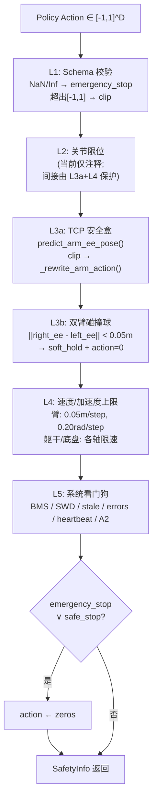

#### L1: Schema 校验 (r1_pro_safety.py:186-194)

| 检查 | 条件 | 升级 | action 处理 |
|------|------|------|------------|
| 有限性 | `np.isfinite(action)` 全 False | `emergency_stop` | `→ zeros` |
| 范围 | 任何元素 ∉ [-1, 1] | `clipped=True` | `np.clip(a, -1, 1)` |

#### L2: 关节限位 (r1_pro_safety.py:196-199)

**当前状态**:仅注释——"We do not have raw qpos in the action (only deltas), so L2 acts as a guard against absurdly large velocity demands."

L2 不直接校验 `q_min/q_max`。安全依赖 L3a(TCP 盒)和 L4(速度上限)的间接保护。**这是一个已知差距**,见 §9.1。

#### L3a: TCP 安全盒 (r1_pro_safety.py:202-231)

核心流程:

```
1. target = action_schema.predict_arm_ee_pose("right", action, state)
   → target = [x, y, z, roll, pitch, yaw] = cur_ee + action * scale

2. clipped_target = np.clip(target, right_ee_min, right_ee_max)

3. if clipped_target ≠ target:
     _rewrite_arm_action("right", action, clipped_target, state, schema)
     → 反向计算:delta = clipped_target - cur_ee; norm = delta / scale
     → 原地修改 action 向量中对应 arm 的 xyz/rpy 切片
     → 后续代码(dispatch、L4、L5)看到的是已修改的 action,完全透明
```

**默认安全盒参数** (torso_link4 frame):

| 参数 | X (前后) | Y (左右) | Z (上下) | Roll | Pitch | Yaw |
|------|---------|---------|---------|------|-------|-----|
| `right_ee_min` | 0.20 m | -0.35 m | 0.05 m | -3.20 rad | -0.30 rad | -0.30 rad |
| `right_ee_max` | 0.65 m | 0.35 m | 0.65 m | 3.20 rad | 0.30 rad | 0.30 rad |
| `left_ee_min` | 同右 | 同右 | 同右 | 同右 | 同右 | 同右 |
| `left_ee_max` | 同右 | 同右 | 同右 | 同右 | 同右 | 同右 |

#### L3b: 双臂碰撞球 (r1_pro_safety.py:234-247)

```python
d = ||predict_right_ee[:3] - predict_left_ee[:3]||
if d < dual_arm_min_distance_m (0.05m):
    soft_hold = True
    action = zeros
    reason = "L3b:dual_arm_collision d=0.032m"
```

| 参数 | 默认值 | 含义 |
|------|--------|------|
| `dual_arm_collision_enable` | `True` | 是否启用 |
| `dual_arm_sphere_radius_m` | 0.08 m | 每个 EE 的包围球半径 |
| `dual_arm_min_distance_m` | 0.05 m | TCP 间最小距离阈值 |

**与 wrapper 的互补**:wrapper `GalaxeaR1ProDualArmCollisionWrapper` 提供**软减速区**(`slow_zone=0.15m`),在 distance < 0.15m 时渐变衰减 action;L3b 是**硬冻结**,在 < 0.05m 时直接 soft_hold。

#### L4: 速度/加速度上限 (r1_pro_safety.py:364-439)

**臂**(每只):
```python
xyz_actual = action[idx:idx+3] * action_scale[0]  # 归一化 → 米
rpy_actual = action[idx+3:idx+6] * action_scale[1]  # 归一化 → 弧度
xyz_clipped = clip(xyz_actual, -max_linear_step_m, max_linear_step_m)
rpy_clipped = clip(rpy_actual, -max_angular_step_rad, max_angular_step_rad)
action[idx:idx+3] = xyz_clipped / action_scale[0]  # 米 → 归一化
action[idx+3:idx+6] = rpy_clipped / action_scale[1]  # 弧度 → 归一化
```

**躯干** (4D: v_x, v_z, w_pitch, w_yaw):
```python
limits = [torso_v_x_max, torso_v_z_max, torso_w_pitch_max, torso_w_yaw_max]
action[idx:idx+4] = clip(action[idx:idx+4], -limits, limits)
```

**底盘** (3D: v_x, v_y, w_z):
```python
limits = [chassis_v_x_max, chassis_v_y_max, chassis_w_z_max]
action[idx:idx+3] = clip(action[idx:idx+3], -limits, limits)
```

| 参数 | 默认值 | 含义 |
|------|--------|------|
| `max_linear_step_m` | 0.05 m | 臂每步最大线性位移 |
| `max_angular_step_rad` | 0.20 rad | 臂每步最大角位移 (~11.5°) |
| `torso_v_x_max` | 0.10 | 躯干前后速度上限 |
| `torso_v_z_max` | 0.10 | 躯干上下速度上限 |
| `torso_w_pitch_max` | 0.30 | 躯干俯仰角速度上限 |
| `torso_w_yaw_max` | 0.30 | 躯干偏航角速度上限 |
| `chassis_v_x_max` | 0.60 | 底盘前后速度上限 |
| `chassis_v_y_max` | 0.60 | 底盘横移速度上限 |
| `chassis_w_z_max` | 1.50 | 底盘旋转速度上限 |

#### L5: 系统看门狗 (r1_pro_safety.py:254-303)

| 子项 | 检查条件 | 升级 | reason 示例 |
|------|---------|------|-------------|
| **L5a BMS 低电** | `bms["capital_pct"] < 25.0` | `safe_stop` | `"L5:bms_low 22.3pct"` |
| **L5b 反馈陈旧** | `feedback_age_ms[src] > 200.0` | `soft_hold` | `"L5:stale arm_right 350ms"` |
| **L5c SWD 急停** | `controller_signal["swd"] == truthy` | `emergency_stop` | `"L5:SWD_DOWN"` |
| **L5d 状态错误** | `status_errors[side]` 非空 | `soft_hold` | `"L5:status_errors_right=[1,3]"` |
| **L5e 操作员心跳** | `heartbeat_age > 1500ms` | `soft_hold` | `"L5:operator_hb_age=2300ms"` |
| **L5f A2 跌落风险** | `bms["capital_pct"] < 30.0` | action *= 0.5 | `"L5:a2_fall_risk_dampen"` |

### 4.3 三级停机

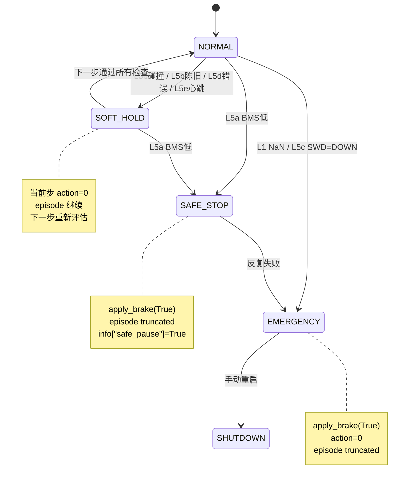

| 级别 | 触发 | Env 行为 | Episode 影响 |
|------|------|---------|-------------|
| `soft_hold` | L3b, L5b/d/e | 当前步 action 置零;episode 继续 | 不截断;下一步重新评估 |
| `safe_stop` | L5a | `apply_brake(True)` + `info["safe_pause"]=True` | episode 截断 |
| `emergency_stop` | L1 NaN, L5c SWD | `apply_brake(True)` + action 置零 | episode 截断 |

**最终冻结**(r1_pro_safety.py:292-294):无论之前哪级做了什么修改,只要 `emergency_stop ∨ safe_stop`,action 无条件置零。

### 4.4 SafetyInfo 审计记录

```python
@dataclass
class SafetyInfo:
    raw_action: np.ndarray       # 原始 policy 输出(不修改的副本)
    safe_action: np.ndarray      # 经过 L1-L5 处理后的安全动作
    clipped: bool = False        # 任何裁剪发生?
    soft_hold: bool = False      # 当前步暂停?
    safe_stop: bool = False      # 安全停止?
    emergency_stop: bool = False # 紧急停止?
    reason: List[str] = []       # 人类可读原因列表
    metrics: dict = {}           # MetricLogger 消费的度量

    @property
    def hold_or_stop(self) -> bool:
        return self.soft_hold or self.safe_stop or self.emergency_stop
```

**度量输出**:
```python
metrics = {
    "safety/clip_ratio": float(clipped),
    "safety/soft_hold": float(soft_hold),
    "safety/safe_stop": float(safe_stop),
    "safety/emergency_stop": float(emergency_stop),
    "safety/reason_count": float(len(reason)),
    "hw/bms_capital_pct": bms_pct,
}
```

---

## 5. 关键代码走读

### 5.1 SafetyConfig 构建:YAML → dataclass

**入口**:`build_safety_config(cfg_dict)` ([r1_pro_safety.py:442-457](../../../rlinf/envs/realworld/galaxear/r1_pro_safety.py#L442-L457))

```python
def build_safety_config(cfg_dict: Optional[dict]) -> SafetyConfig:
    if cfg_dict is None:
        return SafetyConfig()       # 所有默认值
    base = SafetyConfig()
    valid_keys = set(base.__dict__.keys())
    kwargs = {}
    for k, v in dict(cfg_dict).items():
        if k in valid_keys:          # 只接受已知 key
            kwargs[k] = v            # 未知 key 静默忽略(前向兼容)
    base_kwargs = {**base.__dict__, **kwargs}
    return SafetyConfig(**base_kwargs)
```

**`__post_init__`**:将 YAML 的 list 转为 `np.ndarray`(lines 105-113):

```python
for attr in ("arm_q_min", "arm_q_max", ...):
    v = getattr(self, attr)
    if isinstance(v, list):
        setattr(self, attr, np.asarray(v, dtype=np.float32))
```

**注意点**:
- 没有校验 `arm_q_min < arm_q_max` 或 `right_ee_min < right_ee_max`——配置错误会静默通过
- 拼写错误(如 `bms_low_battery_threhold_pct`)也会被静默忽略

### 5.2 validate() 完整管线

[r1_pro_safety.py:164-304](../../../rlinf/envs/realworld/galaxear/r1_pro_safety.py#L164-L304)——逐段注释:

```python
def validate(self, action, state, action_schema) -> SafetyInfo:
    action = np.asarray(action, dtype=np.float32).reshape(-1)
    info = SafetyInfo(
        raw_action=action.copy(),      # 保存原始 action 的副本(审计用)
        safe_action=action.copy(),     # 工作副本,后续各级原地修改
    )

    # ── L1 ──
    if not np.all(np.isfinite(info.safe_action)):
        info.safe_action = np.zeros_like(...)  # NaN → 立即清零
        info.emergency_stop = True             # 最高级别升级
    clipped = np.clip(info.safe_action, -1.0, 1.0)
    if not np.array_equal(clipped, info.safe_action):
        info.clipped = True
    info.safe_action = clipped

    # ── L3a ── (每只臂)
    target = action_schema.predict_arm_ee_pose("right", info.safe_action, state)
    if target is not None:
        clipped_target = self._clip_to_box(target, ee_min, ee_max, "L3a:...", info)
        self._rewrite_arm_action("right", info.safe_action, clipped_target, ...)
        # ↑ 原地修改 info.safe_action!后续 L3b/L4/L5 看到的是修改后的 action

    # ── L3b ── (只在 has_dual_arms 时)
    tgt_r = predict(...)   # 注意:使用 L3a 修改后的 action 重新预测!
    tgt_l = predict(...)
    d = ||tgt_r[:3] - tgt_l[:3]||
    if d < min_distance:
        info.soft_hold = True
        info.safe_action = zeros      # 冻结!

    # ── L4 ──
    info.safe_action = self._apply_velocity_caps(info.safe_action, ...)

    # ── L5 ── (各项独立检查,不互相依赖)
    # BMS → safe_stop
    # feedback_age → soft_hold
    # SWD → emergency_stop
    # status_errors → soft_hold
    # heartbeat → soft_hold
    # A2 fall-risk → action *= 0.5

    # 最终冻结
    if info.emergency_stop or info.safe_stop:
        info.safe_action = np.zeros_like(info.safe_action)

    # 组装 metrics
    info.metrics = {...}
    return info
```

**关键顺序依赖**:
- L3a **修改** action → L3b 使用修改后的 action 重新预测 EE → 如果 L3a 裁剪到盒边缘,L3b 用盒边缘位置判断碰撞
- L4 在 L3a/L3b 之后 → 即使 L3a 裁剪后的 action 仍可能被 L4 进一步裁剪
- L5 的 `action *= 0.5` 在 L4 之后 → 不会导致 L4 重新触发(0.5× 只会更小)
- 最终冻结在所有级之后 → 确保 emergency/safe_stop 时 action 一定是 zeros

### 5.3 _rewrite_arm_action:反向写回

[r1_pro_safety.py:322-363](../../../rlinf/envs/realworld/galaxear/r1_pro_safety.py#L322-L363):

```python
def _rewrite_arm_action(self, side, action, clipped_target_xyzrpy, state, schema):
    from scipy.spatial.transform import Rotation as R

    ee = state.get_ee_pose(side)          # [x,y,z, qx,qy,qz,qw] 共 7D
    cur_xyz = ee[:3].astype(np.float32)
    cur_eul = R.from_quat(ee[3:]).as_euler("xyz")  # 四元数 → 欧拉角

    delta_xyz = clipped_target_xyzrpy[:3] - cur_xyz  # 裁剪后的目标 - 当前位置
    delta_eul = clipped_target_xyzrpy[3:] - cur_eul  # 裁剪后的目标 - 当前姿态

    # 反归一化:物理量 / scale → 归一化动作
    scale_pos = max(float(schema.action_scale[0]), 1e-9)  # 防除零
    scale_ori = max(float(schema.action_scale[1]), 1e-9)
    norm_xyz = delta_xyz / scale_pos
    norm_rpy = delta_eul / scale_ori

    # 定位 action 中对应臂的切片
    idx = 0
    if schema.has_right_arm:
        if side == "right":
            action[idx:idx+3] = norm_xyz      # 原地修改!
            action[idx+3:idx+6] = norm_rpy
            return
        idx += schema.per_arm_dim             # 跳过右臂
    if schema.has_left_arm and side == "left":
        action[idx:idx+3] = norm_xyz
        action[idx+3:idx+6] = norm_rpy
```

**数学含义**:
```
原始 predict: target = cur + action * scale
裁剪后:      clipped_target = clip(target, min, max)
反向写回:    new_action = (clipped_target - cur) / scale
```

**注意**:欧拉角存在 gimbal lock 问题(pitch ≈ ±π/2 时 roll 和 yaw 耦合)。当前代码未处理此情况。

### 5.4 step() 安全集成

[r1_pro_env.py:399-457](../../../rlinf/envs/realworld/galaxear/r1_pro_env.py#L399-L457):

```python
def step(self, action):
    t0 = time.time()
    action = np.asarray(action, dtype=np.float32).reshape(-1)

    # ① 刷新状态
    if not self.config.is_dummy and self._controller is not None:
        self._state = self._controller.get_state().wait()[0]

    # ② 安全管线
    sinfo: SafetyInfo = self._safety.validate(action, self._state, self._action_schema)
    safe_action = sinfo.safe_action

    # ③ 执行或刹车
    if not self.config.is_dummy and self._controller is not None:
        if sinfo.emergency_stop:
            self._controller.apply_brake(True).wait()
        elif sinfo.safe_stop:
            self._controller.apply_brake(True).wait()
        else:
            self._dispatch_action(safe_action)

    # ④ 维持控制频率
    elapsed = time.time() - t0
    sleep_for = (1.0 / max(self.config.step_frequency, 1e-3)) - elapsed
    if sleep_for > 0:
        time.sleep(sleep_for)

    # ⑤ 刷新观测
    obs = self._get_observation()
    reward = self._calc_step_reward(obs, sinfo)

    info = {
        "safety_info": dict(sinfo.metrics),
        "safety_reasons": list(sinfo.reason),
    }
    if sinfo.safe_stop or sinfo.emergency_stop:
        info["safe_pause"] = True
        truncated = True    # ← 安全停止导致 episode 截断
    return obs, reward, terminated, truncated, info
```

### 5.5 heartbeat() 机制

[r1_pro_safety.py:148-162](../../../rlinf/envs/realworld/galaxear/r1_pro_safety.py#L148-L162):

```python
class GalaxeaR1ProSafetySupervisor:
    def __init__(self, cfg):
        self._cfg = cfg
        self._operator_heartbeat_ms = time.monotonic() * 1000.0  # 初始化为当前时间

    def heartbeat(self):
        self._operator_heartbeat_ms = time.monotonic() * 1000.0
```

L5e 检查(line 278-282):
```python
now_ms = time.monotonic() * 1000.0
hb_age = now_ms - self._operator_heartbeat_ms
if hb_age > self._cfg.operator_heartbeat_timeout_ms:  # 默认 1500ms
    info.soft_hold = True
```

> **P0 BUG**:当前代码中**没有任何地方调用 `heartbeat()`**。摇杆 wrapper 没有调用它,VR wrapper 没有调用它。这意味着 `_operator_heartbeat_ms` 在 `__init__` 时初始化为当前时间,之后永远不更新。**1.5 秒后,每一步都会触发 `soft_hold`**。见 §9.4。

---

## 6. 调用流程与数据流

### 6.1 正向路径:Policy Action → Motor Command

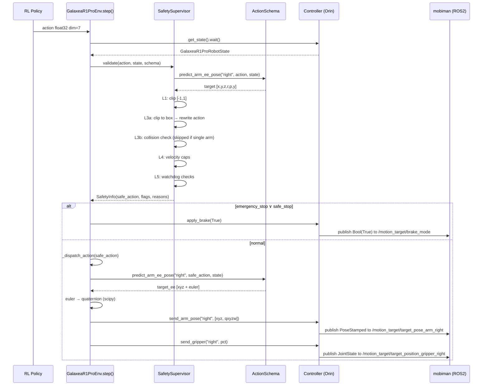

### 6.2 反馈路径:传感器 → Safety State

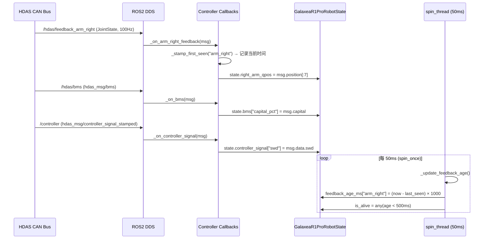

### 6.3 跨节点 RPC 架构

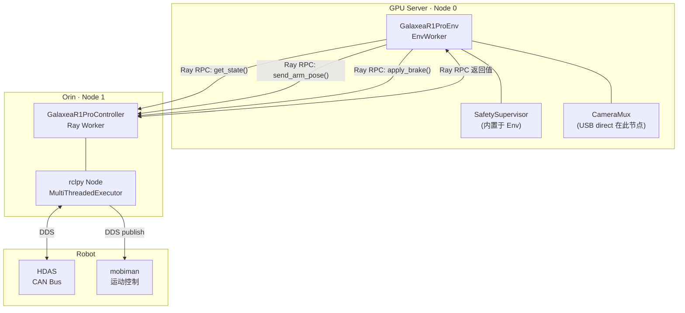

### 6.4 _dispatch_action 详细流

[r1_pro_env.py:478-508](../../../rlinf/envs/realworld/galaxear/r1_pro_env.py#L478-L508):

```
safe_action
    │
    ├── action_schema.split() → {right_xyz, right_rpy, right_gripper, ...}
    │
    ├── Right arm:
    │   predict_arm_ee_pose("right", safe_action, state)
    │   → target [xyz, euler]
    │   → Rotation.from_euler("xyz", euler).as_quat()
    │   → controller.send_arm_pose("right", [xyz, qxyzw])
    │   → controller.send_gripper("right", (gripper+1)*50)  # [-1,1] → [0,100]%
    │
    ├── Left arm: (同上,如启用)
    │
    ├── Torso:
    │   controller.send_torso_twist(torso_twist)  # 已由 L4 限速
    │
    └── Chassis:
        controller.send_chassis_twist(chassis_twist)  # 已由 L4 限速
```

### 6.5 Reset 安全编排

[r1_pro_env.py:512-565](../../../rlinf/envs/realworld/galaxear/r1_pro_env.py#L512-L565):

```
reset()
  │
  ├── BMS 检查:bms_pct < threshold? → 跳过运动,仅警告
  │
  ├── 右臂: _safe_go_to_rest("right", joint_reset_qpos_right)
  │   └── controller.go_to_rest(side, qpos, timeout=5s)
  │       └── 成功? → 继续
  │       └── 失败? → clear_errors → 重试 → 再失败 → RuntimeError
  │
  ├── 左臂: (同上,如启用)
  │
  ├── EE Pose 对齐: _send_pose(side, reset_ee_pose)
  │
  └── 底盘刹车: apply_brake(True) + send_chassis_twist(zeros)
```

---

## 7. YAML 配置指南

### 7.1 M1 单臂 Bring-Up(保守)

```yaml
env:
  train:
    override_cfg:
      is_dummy: false
      use_right_arm: true
      use_left_arm: false
      use_torso: false
      use_chassis: false
      step_frequency: 10.0
      action_scale: [0.03, 0.10, 1.0]     # 3cm/step 比默认 5cm 更保守
      safety_cfg:
        bms_low_battery_threshold_pct: 30.0  # 比默认 25% 更保守
        max_linear_step_m: 0.03             # 与 action_scale[0] 对应
        max_angular_step_rad: 0.15          # 比默认 0.20 更保守
        feedback_stale_threshold_ms: 150     # 比默认 200ms 更敏感
        right_ee_min: [0.25, -0.25, 0.10, -3.14, -0.20, -0.20]  # 收紧盒子
        right_ee_max: [0.55,  0.25, 0.55,  3.14,  0.20,  0.20]
        operator_heartbeat_timeout_ms: 999999.0  # 禁用心跳(见 §9.4)
```

### 7.2 M2 双臂

```yaml
env:
  train:
    override_cfg:
      use_right_arm: true
      use_left_arm: true
      action_scale: [0.04, 0.10, 1.0]
      safety_cfg:
        dual_arm_collision_enable: true
        dual_arm_min_distance_m: 0.08        # 比默认 0.05m 更保守
        dual_arm_sphere_radius_m: 0.10       # 包围球更大
        left_ee_min: [0.20, -0.35, 0.05, -3.20, -0.30, -0.30]
        left_ee_max: [0.65,  0.35, 0.65,  3.20,  0.30,  0.30]
      # 启用软减速 wrapper
      use_galaxea_r1_pro_dual_arm_collision: true
```

### 7.3 M3 全身(+ 躯干)

```yaml
env:
  train:
    override_cfg:
      use_torso: true
      safety_cfg:
        torso_v_x_max: 0.08                 # 初始更保守
        torso_v_z_max: 0.08
        torso_w_pitch_max: 0.20
        torso_w_yaw_max: 0.20
```

### 7.4 M4 移动操作(+ 底盘)

```yaml
env:
  train:
    override_cfg:
      use_chassis: true
      safety_cfg:
        chassis_v_x_max: 0.30               # 初始保守:0.3 m/s
        chassis_v_y_max: 0.30
        chassis_w_z_max: 0.80
        chassis_acc_x_max: 0.5              # 注意:加速度上限已定义但未强制(§9.6)
```

### 7.5 全 ROS2 变体安全配置差异

| 参数 | 默认双路径 | 全 ROS2 |
|------|-----------|--------|
| `step_frequency` | 10 Hz | 8 Hz |
| `feedback_stale_threshold_ms` | 200 ms | 250 ms |
| `soft_sync_window_ms` | 33 ms | 50 ms |
| `action_scale[0]` | 0.05 | 0.04(因频率低,减小位移) |

### 7.6 参数灵敏度分析

| 参数 | 太紧 | 太松 | 推荐范围 |
|------|------|------|---------|
| `max_linear_step_m` | `clip_ratio` 持续 >0.5 → 策略被截断,学习效率低(FMEA F9) | 臂高速运动 → 碰撞风险 | 0.03-0.08 m |
| `max_angular_step_rad` | 策略无法完成旋转任务 | 手腕快速旋转 → 可能丢持物 | 0.10-0.25 rad |
| `right_ee_min/max` | 工作空间过小 → stuck | 臂碰到躯干/桌面 | 现场测量 ± 5cm |
| `feedback_stale_threshold_ms` | DDS 抖动频繁触发 soft_hold | 在失去反馈很久后才反应 | 150-300 ms |
| `bms_low_battery_threshold_pct` | 频繁 safe_stop → 训练中断 | 低电量时臂可能跌落 | 20-30% |

---

## 8. 测试与验证

### 8.1 现有单元测试覆盖分析

[test_galaxea_r1_pro_safety.py](../../../tests/unit_tests/test_galaxea_r1_pro_safety.py) 共 11 个测试:

| 测试 | 覆盖级别 | 场景 |
|------|---------|------|
| `test_l1_schema_clip_to_unit_box` | L1 | action [2.0, -2.0, ...] → 裁剪到 [-1,1] |
| `test_l1_non_finite_action_emergency_stop` | L1 | NaN → emergency_stop + zeros |
| `test_l3a_clips_outside_ee_box` | L3a | EE 超出安全盒 → action 改写 + clipped |
| `test_l3b_dual_arm_collision_soft_hold` | L3b | TCP 距离 < min_distance → soft_hold + zeros |
| `test_l4_per_step_cap` | L4 | 超出步进上限 → clipped |
| `test_l5_bms_low_battery_safe_stop` | L5a | BMS 10% < 25% → safe_stop + zeros |
| `test_l5_swd_emergency_stop` | L5c | swd=1 → emergency_stop |
| `test_l5_status_errors_soft_hold` | L5d | errors 非空 → soft_hold |
| `test_l5_feedback_stale_soft_hold` | L5b | age > threshold → soft_hold |
| `test_build_safety_config_filters_unknown_keys` | Config | 未知 key 被过滤 |
| `test_safety_info_hold_or_stop` | SafetyInfo | `hold_or_stop` 属性聚合 |

**未覆盖**:
- L2(当前仅注释)
- L5e 心跳超时
- L5f A2 跌落风险衰减
- `_rewrite_arm_action` 的反向写回精度
- L4 躯干/底盘限速
- 多级升级交互(如同时 soft_hold + safe_stop)
- Gimbal lock 附近的欧拉角转换

### 8.2 Dummy 模式验证

```bash
# 1. 38 个单元测试
pytest tests/unit_tests/test_galaxea_r1_pro_*.py tests/unit_tests/test_ros2_camera_decode.py -v

# 2. gymnasium 烟测
python -c "
from rlinf.envs.realworld.galaxear import tasks
import gymnasium as gym
env = gym.make('GalaxeaR1ProPickPlace-v1',
    override_cfg={'is_dummy': True,
        'cameras': [
            {'name': 'wrist_right', 'backend': 'usb_direct', 'serial_number': 'abc'},
            {'name': 'head_left', 'backend': 'ros2', 'rgb_topic': '/x'},
        ]},
    worker_info=None, hardware_info=None, env_idx=0)
obs, _ = env.reset()
for _ in range(10):
    obs, r, term, trunc, info = env.step(env.action_space.sample() * 0)
    print('reasons:', info.get('safety_reasons', []))
"
```

dummy 模式下 SafetySupervisor 仍然运行(不跳过),但 state 为全零默认值:
- `bms["capital_pct"]` = 100.0 → L5a 不触发
- `controller_signal["swd"]` = 0 → L5c 不触发
- `feedback_age_ms` = {} → L5b 不触发
- 全零 EE 落在安全盒外 → **L3a 会触发**(`clip_ratio` 可能非零,属预期行为)

### 8.3 分阶段真机启动协议

| 阶段 | 操作 | 验证 | 安全配置 |
|------|------|------|---------|
| **S0 静态** | 上电,不发送任何命令 | `ros2 topic hz /hdas/feedback_arm_right` 稳定 ~100Hz | N/A |
| **S1 状态回读** | 运行 controller + dummy env,只读 state | `state.right_ee_pose` 合理;`bms["capital_pct"]` 合理;`swd` 极性正确 | N/A |
| **S2 Joint Reset** | 调用 `go_to_rest("right", known_safe_qpos)` | 臂移至预期姿态 | 仅 reset,不 step |
| **S3 单轴运动** | Policy 输出 [0.1, 0, 0, 0, 0, 0, 0](仅 dx) | 臂缓慢前移 ~3mm/step | `max_linear_step_m: 0.03`,紧安全盒 |
| **S4 6D 运动** | 随机 action * 0.1 | 各轴均有小幅运动 | 保守配置(§7.1) |
| **S5 逐步放松** | 扩大安全盒,提高速度上限 | 监控 `clip_ratio` < 0.1 | 按需调整 |
| **S6 完整训练** | SAC/PPO 正常训练 | 训练 loss 收敛;`safe_stop` = 0 | 正式配置 |

### 8.4 故障注入测试

| 故障 | 注入方法 | 预期行为 |
|------|---------|---------|
| NaN action | 在 env.step() 前手动设 `action[0] = float('nan')` | L1 → emergency_stop → brake |
| BMS 低 | 在 controller 回调中 mock `bms["capital_pct"] = 10.0` | L5a → safe_stop → brake → truncated |
| 反馈断流 | 停止 Orin 上的 `robot_startup.sh` | feedback_age_ms 持续增长 → L5b → soft_hold |
| SWD 急停 | 物理拨动 SWD 到 DOWN 位置 | L5c → emergency_stop → brake |
| 双臂碰撞 | 将两臂 EE 移至接近位置(通过 joint reset) | L3b → soft_hold → action=0 |
| USB 相机断连 | 拔 USB AOC 线 | Mux 检测超时 → 切换 ROS2 回退;如果 ROS2 也无数据 → L5b |

### 8.5 安全度量监控

| 度量 | 健康范围 | 异常说明 |
|------|---------|---------|
| `safety/clip_ratio` | < 0.10 | 持续 >0.5 → 安全盒太紧(FMEA F9) |
| `safety/soft_hold` | 偶发尖峰 | 持续 = 1.0 → 硬件问题(反馈断流 / 错误码) |
| `safety/safe_stop` | 0 | 任何非零值都应调查 |
| `safety/emergency_stop` | 0 | 任何非零值 = 严重事件 |
| `safety/reason_count` | < 2 | 持续 >3 → 多项安全检查同时触发 |
| `hw/bms_capital_pct` | > 40% | < 30% → 即将触发 A2 衰减 → 应充电 |

### 8.6 L3a TCP 安全盒测试用例的实现与使用

> 本节是 §8.1 中"未覆盖项"清单和 §9.8"_rewrite_arm_action 数值风险"的**直接回应**——我们为 L3a(五级闸门中**唯一会改写动作向量**的层)补齐了一套深度回归测试,文件:[`tests/unit_tests/test_galaxea_r1_pro_safety_l3a.py`](../../../tests/unit_tests/test_galaxea_r1_pro_safety_l3a.py)。

#### 8.6.1 调查结论:原有测试覆盖严重不足

[`test_galaxea_r1_pro_safety.py`](../../../tests/unit_tests/test_galaxea_r1_pro_safety.py) 中**只有 1 个**关于 L3a 的测试 `test_l3a_clips_outside_ee_box`(L85-L97),它只断言:

```python
assert info.clipped is True
assert any("L3a" in r for r in info.reason)
```

——只检查两个布尔/字符串信号,完全没有验证 L3a 真正在做的事。具体未覆盖项:

| # | 未覆盖的行为 | 严重性 | 与 §8.1/§9 的对应关系 |
|---|---|---|---|
| 1 | 反向写回 (`_rewrite_arm_action`) 的 round-trip 精度 | **高** | §8.1, §9.8 明确列为未覆盖 |
| 2 | Min 边界裁剪(原测试只覆盖 max) | 中 | §8.1 |
| 3 | Y / Z / Roll / Pitch / Yaw 各轴(原测试只测 X) | 中 | §8.1 |
| 4 | 左臂(单测的 schema 是单臂右) | 中 | §8.1 |
| 5 | 多轴同时越界 | 中 | §8.1 多级升级交互 |
| 6 | **盒内动作不被裁剪**(假阳性防护) | 高 | §8.1 |
| 7 | 双臂场景下"只裁剪越界臂" | 中 | §8.1 |
| 8 | L3a 不污染 gripper / 其他臂的切片 | 高 | 切片隔离合约 |
| 9 | 不同 `action_scale` 时反归一化分母正确 | 中 | §5.3 数学公式 |
| 10 | 无臂 schema(纯躯干/底盘)不触发 L3a | 低 | Schema gating |
| 11 | EE 已经在盒外时的恢复语义 | 高 | §5.3 边缘场景 |

#### 8.6.2 新增 16 个测试,按行为契约分组

新文件共 **16 个测试**(其中 3 个为参数化用例),按 9 组行为契约组织:

| 组 | 测试名 | 覆盖行为 |
|---|---|---|
| **No-clip happy path** | `test_l3a_action_inside_box_does_not_clip` | 小步动作保持 EE 在盒内 → 无 L3a reason 且 action 不变 |
| | `test_l3a_zero_action_inside_box_no_reason` | 零动作 + EE 严格在盒内 → 无 L3a reason |
| **Per-axis 边界** | `test_l3a_clips_each_xyz_max_face` (×3 参数化) | X / Y / Z 三个 max 面分别裁剪,验证反归一化数值 |
| | `test_l3a_clips_x_min_face_to_inside` | X 的 min 面裁剪,产生**负**的归一化步长 |
| **姿态轴** | `test_l3a_clips_yaw_max_face` | Yaw(`action_scale[1]` 路径)裁剪 |
| **Round-trip 精度** | `test_l3a_rewrite_round_trip_predicted_ee_equals_clipped` | `predict_ee(safe_action) == clipped_target`(§9.8 P0 价值) |
| | `test_l3a_rewrite_uses_action_scale_correctly` | 不同 `action_scale[0]` 时归一化分母正确 |
| **切片隔离** | `test_l3a_does_not_modify_gripper_dim` | L3a 切片只动 idx 0-5,gripper(idx 6)保持 |
| | `test_l3a_dual_arm_only_violating_arm_is_rewritten` | 双臂时只裁越界一臂,另一臂不动 |
| **多轴组合** | `test_l3a_clips_multiple_axes_simultaneously` | 多轴同时越界 → 一条 reason、多轴同时改写 |
| **Schema gating** | `test_l3a_skipped_when_no_arm_in_schema` | 纯躯干/底盘 schema → L3a 不触发 |
| **审计契约** | `test_l3a_clip_sets_metrics_and_keeps_raw_action` | `safety/clip_ratio = 1.0` 且 `raw_action` 完整保留 |
| **左臂对称** | `test_l3a_left_arm_clips_at_min_face_symmetric_to_right` | 左臂路径(idx 7-13)与右臂行为对称 |
| **盒外恢复** | `test_l3a_recovery_when_current_ee_already_outside_box` | EE 已经在盒外时,L3a 改写为**回拉**而非外推 |

#### 8.6.3 关键设计思想

**(1) 数学公式驱动的精确断言。** 不再只断言布尔值。每个测试基于 L3a 的核心等式:

```
原始预测:  target          = cur_ee + action × scale
盒裁剪:    clipped_target  = clip(target, ee_min, ee_max)
反向写回:  new_action      = (clipped_target - cur_ee) / scale
不变量:   predict(new_action) == clipped_target          (round-trip)
```

例如 `cur_x = 0.40`,`box_max_x = 0.42`,`action[0] = +1`,`scale = 0.05`:

```
predict_x = 0.40 + 1.0 × 0.05 = 0.45     (越界)
clipped   = 0.42                         (裁回 max 面)
new_a[0]  = (0.42 - 0.40) / 0.05 = 0.4   (反归一化)
```

测试用 `pytest.approx(0.4, abs=1e-5)` 直接断言这个具体数值,而非只断言"`info.clipped is True`"。

**(2) 干扰隔离 —— 让 L1 / L4 / L5 / L3b 都"哑火"。** 故意构造让其他层都**不**触发的场景,使 `info.reason` 中只能出现 L3a 字符串,从而干净地断言"L3a **单独**导致了某行为":

- `dual_arm_collision_enable=False` 显式关闭 L3b
- 选择 `cur` 与盒边距使物理位移恰好 ≤ `max_linear_step_m`,L4 不会再裁剪
- 默认 BMS 100%、SWD=0、心跳 OK,L5 各项不触发

**(3) `@pytest.mark.parametrize` 减少重复。** `test_l3a_clips_each_xyz_max_face` 一次跑 X/Y/Z 三个轴向,将来加新轴只需要增加一行参数。

**(4) Round-trip 测试是 P0 价值。** `test_l3a_rewrite_round_trip_predicted_ee_equals_clipped` 把改写后的 `safe_action` 喂回 `predict_arm_ee_pose`,验证再次预测的 EE **完全等于**裁剪后的目标。这正是 §9.8 警告的"_rewrite_arm_action 数值风险"——以前从未有测试守护这个不变量。一旦未来有人把欧拉角换成轴角/四元数,或调整 `_rewrite_arm_action` 的反归一化逻辑,该测试会立即捕获精度回退。

**(5) 恢复路径(EE 已在盒外)。** `test_l3a_recovery_when_current_ee_already_outside_box` 模拟"操作员手动把臂停在盒外、然后启动 RL"的真机情形(对应 §9.11 的 EE pose 来源风险)。验证 L3a 不会拒绝/冻结,而是产生**朝盒内移动的 action**(`safe_action[0] = -0.8`,负号表示回拉)。

#### 8.6.4 如何运行

完整 RLinf 环境(已按 [requirements/install.sh](../../../requirements/install.sh) 安装):

```bash
# 单文件
pytest tests/unit_tests/test_galaxea_r1_pro_safety_l3a.py -v

# 与 Galaxea 全部单元测试一并运行
pytest tests/unit_tests/test_galaxea_r1_pro_*.py -v

# 配合 §8.2 的 dummy 模式验证套路
pytest tests/unit_tests/test_galaxea_r1_pro_*.py tests/unit_tests/test_ros2_camera_decode.py -v
```

新文件**纯 numpy + scipy**,不依赖 GPU、Ray、ROS2、torch,**单文件运行 < 1 秒**。

期望输出:

```
collected 16 items

test_l3a_action_inside_box_does_not_clip                                 PASSED
test_l3a_zero_action_inside_box_no_reason                                PASSED
test_l3a_clips_each_xyz_max_face[0-0.42-0.4-1.0-0.05]                    PASSED
test_l3a_clips_each_xyz_max_face[1-0.32-0.3-1.0-0.05]                    PASSED
test_l3a_clips_each_xyz_max_face[2-0.4-0.38-1.0-0.05]                    PASSED
test_l3a_clips_x_min_face_to_inside                                      PASSED
test_l3a_clips_yaw_max_face                                              PASSED
test_l3a_rewrite_round_trip_predicted_ee_equals_clipped                  PASSED
test_l3a_rewrite_uses_action_scale_correctly                             PASSED
test_l3a_does_not_modify_gripper_dim                                     PASSED
test_l3a_dual_arm_only_violating_arm_is_rewritten                        PASSED
test_l3a_clips_multiple_axes_simultaneously                              PASSED
test_l3a_skipped_when_no_arm_in_schema                                   PASSED
test_l3a_clip_sets_metrics_and_keeps_raw_action                          PASSED
test_l3a_left_arm_clips_at_min_face_symmetric_to_right                   PASSED
test_l3a_recovery_when_current_ee_already_outside_box                    PASSED

============================== 16 passed in <1s ==============================
```

调试单个测试:

```bash
pytest tests/unit_tests/test_galaxea_r1_pro_safety_l3a.py::test_l3a_rewrite_round_trip_predicted_ee_equals_clipped -v -s
```

#### 8.6.5 测试套件的工程价值

回到 §9 的优先级矩阵:

| 差距 | 优先级 | 这套测试的作用 |
|---|---|---|
| §9.11 EE pose 未订阅 → L3a 在错误基准工作 | **P0** | 测试**为 §9.11 的修复提供参考实现**——一旦 EE pose 订阅加上,L3a 真正起作用,而 round-trip / 恢复路径测试立即作为"L3a 行为参考"指导调试 |
| §9.8 _rewrite_arm_action 数值风险(gimbal lock) | P3 | 测试**补上回归网**——任何未来的反归一化逻辑修改(轴角化、四元数化、加 gimbal lock 兜底)都会被 round-trip 测试守护 |

更重要的是,16 个测试中的每一个都把 §4.2 的设计文档**编码为可执行规范**。当后续 PR 修改 L3a 的预测/裁剪/写回三个步骤的任何一步,CI 会立即用具体数值断言告知:"安全契约被破坏,见测试 X"。

#### 8.6.6 未来可扩展项(本 PR 暂不实现)

按 §8.1 仍有 3 项 L3a 边缘行为可继续补充:

1. **Gimbal lock 附近的欧拉角转换**(pitch ≈ ±π/2 时 roll/yaw 耦合)——需要先决定是否把 `_rewrite_arm_action` 改为轴角/四元数(对应 §9.8 的设计决策)
2. **L3a + L4 协同**:当反向写回的归一化值 `|action| > 1` 时,L4 会进一步裁剪——已在 `test_l3a_recovery_when_current_ee_already_outside_box` 中部分覆盖,可单独加测验证联合裁剪精度
3. **L3a + L3b 联动**:L3a 把 EE 裁剪到盒边后,L3b 用裁剪后的 target 重新预测距离——§5.2 描述了顺序依赖但目前无测试

### 8.7 R1 Pro 右臂位姿 + 安全盒 CLI 工具的设计、实现与使用

> 本节记录 `toolkits/realworld_check/test_galaxea_r1_pro_controller.py` 的设计与实现。它把"命令行输入右臂末端位姿 → 安全盒裁剪 → 控制右臂运动"做成一个可直接用于 bring-up 的工具,用于连接 §8.3 的 S1/S2/S3 阶段和 §4.2 的 L3a TCP 安全盒设计。

#### 8.7.1 任务目标与落地文件

用户需求可以拆成 4 个工程目标:

| 目标 | 具体落地 |
|---|---|
| 命令行输入 R1 Pro 右臂末端位姿 | 支持 `--pose-euler`, `--pose-quat`, `--pose-delta` 单发模式,也支持 REPL 中的 `setpose`, `setposq`, `setdelta` |
| 控制右臂做运动 | Ray 后端复用 `GalaxeaR1ProController.send_arm_pose("right", pose7)`,rclpy 后端直接发布 `/motion_target/target_pose_arm_right` |
| 可以设置安全盒 | 支持 `--box-min`, `--box-max`,REPL 中支持 `setbox-min`, `setbox-max`;默认值来自 `SafetyConfig.right_ee_min/right_ee_max` |
| 超出安全盒时打印警告并停在盒边缘 | `clip_pose_to_box()` 逐轴 `np.clip`,打印 `L3a:right_ee_box ...` 风格警告,再把裁剪后的 pose 下发 |
| 命令行交互 Homing / Zeroing | 支持 `--home`, `--zero`, `--home-qpos`, `--zero-qpos`,REPL 中支持 `home`, `zero`, `set-home`, `set-zero`, `gethomes`;Home 与 Zero 是两个独立关节空间目标 |

代码文件:

| 文件 | 作用 |
|---|---|
| [`toolkits/realworld_check/test_galaxea_r1_pro_controller.py`](../../../toolkits/realworld_check/test_galaxea_r1_pro_controller.py) | CLI 主程序:参数解析、REPL、安全盒裁剪、Ray/rclpy 后端 |
| [`rlinf/envs/realworld/galaxear/r1_pro_safety.py`](../../../rlinf/envs/realworld/galaxear/r1_pro_safety.py) | `SafetyConfig` 默认安全盒和 delta 路径的完整 L1-L5 监督器 |
| [`rlinf/envs/realworld/galaxear/r1_pro_action_schema.py`](../../../rlinf/envs/realworld/galaxear/r1_pro_action_schema.py) | `ActionSchema.predict_arm_ee_pose()` 将归一化 delta 转为 EE target |
| [`rlinf/envs/realworld/galaxear/r1_pro_controller.py`](../../../rlinf/envs/realworld/galaxear/r1_pro_controller.py) | Ray 后端实际控制器;`send_arm_pose()` 发布 `PoseStamped` 到 mobiman |

工具放在 `toolkits/realworld_check/` 而不是 `examples/` 或 `rlinf/` 内部,原因是它更像真机联调脚本,与已有 `test_franka_controller.py` / `test_turtle2_controller.py` 属于同一类"人工 bring-up / sanity check"工具,不参与训练循环,也不引入新的公共 API。

#### 8.7.2 设计取舍

**取舍 1:同时支持 Ray 后端与纯 rclpy 后端。**

| 后端 | 适用场景 | 优点 | 限制 |
|---|---|---|---|
| `--backend ray` | RLinf 标准真机部署、Orin/GPU server 通过 Ray 连接 | 复用 `GalaxeaR1ProController`;可调用 `get_state`, `go_to_rest`, `send_gripper`, `apply_brake`;行为与训练路径一致 | 需要 Ray 集群已启动;依赖 RLinf scheduler |
| `--backend rclpy` | 在 Orin 上轻量验证 mobiman topic、无需 Ray | 只需 ROS2 环境;直接发布 `/motion_target/target_pose_arm_right` | 不订阅反馈;`getpos/getstate/home` 能力有限 |

这样设计是为了覆盖两个 bring-up 阶段:

1. **最小 ROS2 验证**:只想确认 mobiman 是否接收右臂 pose target,用 `--backend rclpy`。
2. **RLinf 集成验证**:想验证 Ray worker、controller RPC、状态回读和 gripper/brake,用 `--backend ray`。

**取舍 2:绝对位姿输入走轻量裁剪,归一化 delta 输入走完整监督器。**

绝对位姿(`pose-euler` / `pose-quat`)本身已经是目标 EE pose,不需要经过 `ActionSchema.predict_arm_ee_pose()` 的"当前 EE + delta × scale"预测。它只需要做:

```
target_xyzrpy → clip_pose_to_box() → euler_to_quat() → send_pose(pose7)
```

归一化 delta(`pose-delta` / `setdelta`)则模拟 `GalaxeaR1ProEnv.step()` 的策略输出路径,必须复用完整安全监督器:

```
delta7 → SafetySupervisor.validate(action, state, schema)
       → safe_action
       → ActionSchema.predict_arm_ee_pose()
       → euler_to_quat()
       → send_pose(pose7)
```

这让同一个工具既能服务"人工输入绝对目标点",也能服务"用 CLI 模拟 policy action"的调试需求。

**取舍 3:警告标签与生产 L3a 保持一致。**

`clip_pose_to_box()` 输出的 warning 前缀固定为 `L3a:right_ee_box`,与 `r1_pro_safety.py` 中 `_clip_to_box(..., "L3a:right_ee_box", info)` 一致。这样 operator 看到 CLI 输出时,能直接和训练日志中的 `safety_reasons` 对齐。

**取舍 4:CLI 内部禁用心跳超时。**

`ArmSafetyCLI._build_supervisor()` 在 delta 路径中把 `operator_heartbeat_timeout_ms` 设为 `999_999.0`,对应 §9.4 的临时方案 A。原因是 REPL 中 operator 可能停下来思考或输入命令,如果沿用默认 1500ms,几乎每次 `setdelta` 都会被 L5e `soft_hold` 截断,影响 bring-up。

**取舍 5:Home Position 与 Zero Position 明确分离。**

新增的关节空间命令不再把"回到默认 reset qpos"和"关节零点"混为一谈:

| 概念 | 默认 qpos(右臂 7 维,rad) | 用途 |
|---|---|---|
| Home Position | `[0.0, 0.3, 0.0, -1.8, 0.0, 2.1, 0.0]` | 操作员定义的安全就绪/收纳姿态,与 `GalaxeaR1ProRobotConfig.joint_reset_qpos_right` 保持一致 |
| Zero Position | `[0.0, 0.0, 0.0, 0.0, 0.0, 0.0, 0.0]` | 关节空间原点,主要用于校准、坐标系与运动学验证 |

两者默认**不相同**。Zero 看似简单,但对默认 `SafetyConfig.arm_q_min/arm_q_max` 而言,J4 的 `q_max=0.0`,所以 `q4=0.0` 正好位于上限边界。CLI 因此采用**严格内区间** L2 检查(`q_min < q < q_max`),默认会拒绝 Zero,除非 operator 显式使用 `--zero-skip-joint-check` 或 REPL 中的 `zero --force`。这样做的目的不是禁止 Zero,而是让操作员明确确认"这是一个标定/校准动作,不是普通安全回零"。

#### 8.7.3 模块结构与 UML

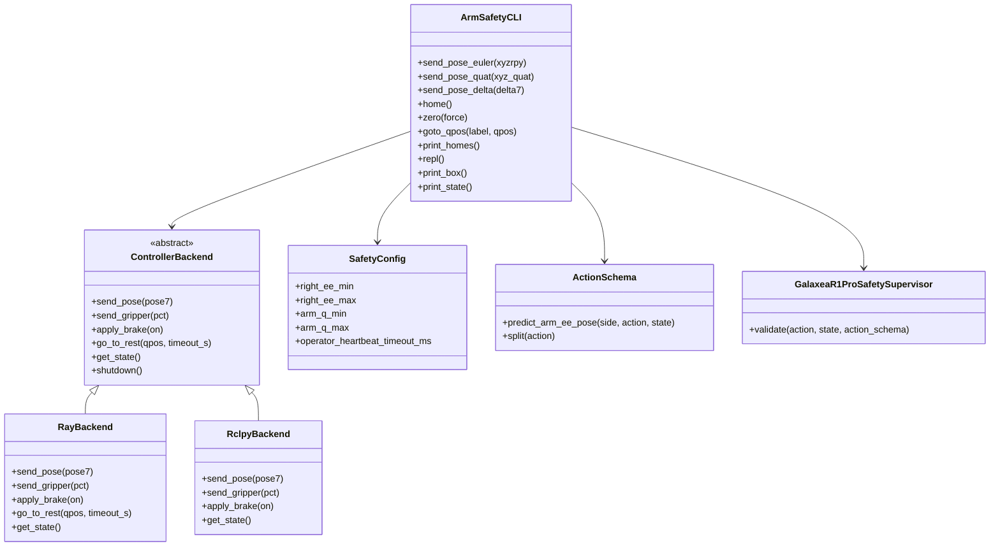

组件职责:

| 组件 | 职责 | 不负责 |
|---|---|---|
| `clip_pose_to_box()` | 对绝对 `[x,y,z,roll,pitch,yaw]` 做逐轴安全盒裁剪并生成 warning | 不做关节限位、不做碰撞检测、不订阅状态 |
| `ArmSafetyCLI` | 维护安全盒、解析输入、选择路径、调用后端、REPL、Home/Zero qpos 与 L2 检查 | 不直接操作 ROS2 topic/Ray RPC 细节 |
| `ControllerBackend` | 定义后端抽象接口 | 不实现具体通信 |
| `RayBackend` | 包装 `GalaxeaR1ProController.launch_controller()` 和 `.wait()` RPC | 不重写 controller 的 ROS2 publisher |
| `RclpyBackend` | 直接创建 ROS2 publisher 并发布 pose/gripper/brake | 不订阅 feedback,不等待 joint reset 收敛 |
| `GalaxeaR1ProSafetySupervisor` | delta 路径完整 L1-L5 安全管线 | 不处理绝对 pose 输入 |

#### 8.7.4 数据流

##### 绝对欧拉位姿路径(`--pose-euler` / `setpose`)

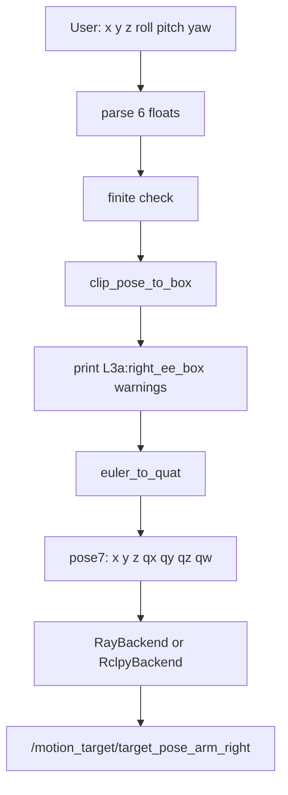

该路径最直接,适合人工指定绝对目标点。例如:

```bash
python toolkits/realworld_check/test_galaxea_r1_pro_controller.py \
  --backend rclpy \
  --pose-euler 0.80 0.0 0.30 -3.14 0.0 0.0
```

如果 `x=0.80` 超过默认 `right_ee_max[0]=0.65`,输出:

```text
[WARN]  L3a:right_ee_box x=+0.8000 -> +0.6500 (clipped to max face)
[INFO]  Sent pose7 = [...]
```

真正下发的是 `x=0.65` 的边界 pose,不是用户输入的 `0.80`。

##### 四元数位姿路径(`--pose-quat` / `setposq`)

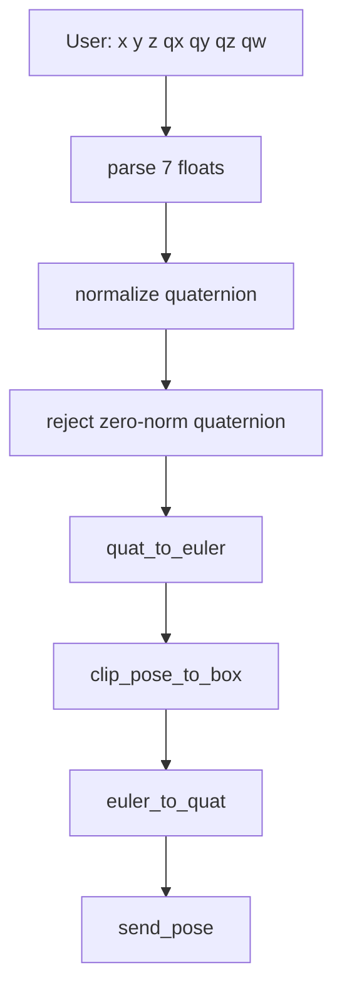

四元数输入最终仍会转换到欧拉角裁剪,因为安全盒的姿态边界定义就是 `[roll,pitch,yaw]`:

```python
right_ee_min = [x_min, y_min, z_min, roll_min, pitch_min, yaw_min]
right_ee_max = [x_max, y_max, z_max, roll_max, pitch_max, yaw_max]
```

实现中会先把用户输入四元数归一化,避免轻微非单位输入导致 `scipy Rotation` 报错或产生不可预期姿态;若四元数范数接近 0,直接拒绝下发。

##### 归一化 delta 路径(`--pose-delta` / `setdelta`)

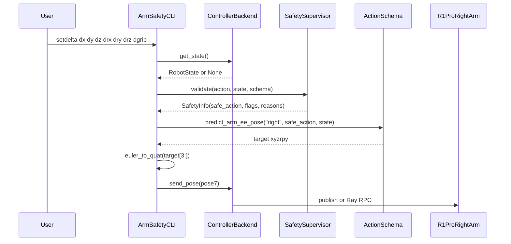

这条路径与 `GalaxeaR1ProEnv.step()` 最接近。它不仅做 L3a,还会经过 L1、L4、L5 等检查:

| 层级 | CLI delta 路径表现 |
|---|---|
| L1 | NaN/Inf → `emergency_stop`,拒绝下发并 `apply_brake(True)` |
| L3a | 预测 EE target 后裁剪到安全盒,再改写 `safe_action` |
| L4 | 步长过大时继续裁剪,打印 `L4:per_step_cap` |
| L5 | 如果 state 中有 BMS/SWD/stale/status 信息,会按生产逻辑触发 safe_stop/soft_hold/emergency_stop |

注意:当使用 `--backend rclpy` 或 `--dummy` 时,后端没有真实 `get_state()`,CLI 会用默认 `GalaxeaR1ProRobotState()` 作为 state,因此预测是从原点出发的"origin-anchored"行为。这适合离线验证 L1/L3a/L4 逻辑,不适合作为真机精确 delta 控制。真机 delta bring-up 推荐使用 `--backend ray`,并先修复/确认 §9.11 的 EE pose 订阅。

##### 关节空间 Home / Zero 路径(`--home`, `--zero`, `home`, `zero`)

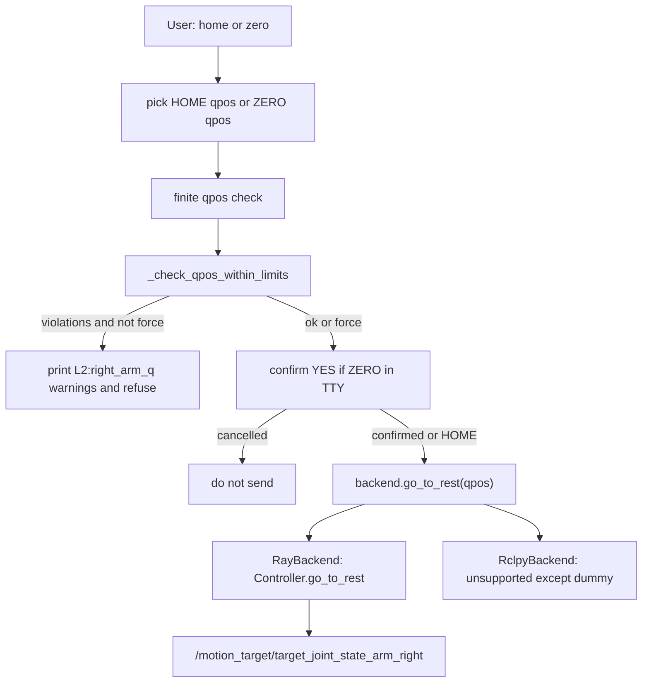

该路径不走 TCP 安全盒,因为 Home/Zero 是**关节空间目标**而不是 EE pose target。CLI 在发送前做一层轻量 L2 sanity check:

```
SafetyConfig.arm_q_min < qpos < SafetyConfig.arm_q_max
```

这里有意使用严格不等号。原因是关节目标若正好贴在软限位边界,控制器跟踪误差或过冲会把机械臂推到限位之外。因此默认 Zero Position(`[0,0,0,0,0,0,0]`)会因为 J4 等于 `q_max[3]=0.0` 而被拒绝:

```text
[WARN]  L2:right_arm_q J4=+0.0000 not strictly inside (-3.0000,+0.0000)
[ERROR] ZERO qpos violates SafetyConfig joint limits; refusing to send.
```

如果现场确认 Zero 是硬件/SDK 规定的标定动作,可以显式 override:

```bash
python toolkits/realworld_check/test_galaxea_r1_pro_controller.py \
  --backend ray \
  --zero --zero-skip-joint-check
```

或 REPL:

```text
r1pro> zero --force
Confirm move to ZERO? Type 'YES' to proceed: YES
```

#### 8.7.5 核心代码说明

##### `clip_pose_to_box()`:绝对 pose 的 L3a 裁剪

核心逻辑:

```python
target = np.asarray(target_xyzrpy, dtype=np.float32).reshape(-1)[:6]
lo = np.asarray(box_min, dtype=np.float32).reshape(-1)[:6]
hi = np.asarray(box_max, dtype=np.float32).reshape(-1)[:6]
clipped = np.clip(target, lo, hi)
```

然后逐轴比较 `target[i]` 与 `clipped[i]`,如果发生变化,构造类似:

```text
L3a:right_ee_box x=+0.8000 -> +0.6500 (clipped to max face)
```

这个函数只处理绝对 pose。它的数学语义是:

```
target_xyzrpy = 用户输入的绝对目标
safe_xyzrpy   = clip(target_xyzrpy, box_min, box_max)
```

与生产监督器中的 L3a 相比:

| 维度 | `clip_pose_to_box()` | `GalaxeaR1ProSafetySupervisor` L3a |
|---|---|---|
| 输入 | 绝对 `xyzrpy` | 归一化 action delta |
| 是否需要当前 EE | 不需要 | 需要 `state.get_ee_pose()` |
| 是否改写 action | 不涉及 action | 会调用 `_rewrite_arm_action()` |
| 适用场景 | 人工输入目标位姿 | 训练/策略输出 action |

##### `ControllerBackend`:隔离控制器后端差异

CLI 主流程只认识一个抽象接口:

```python
class ControllerBackend:
    def send_pose(self, pose7: np.ndarray) -> None: ...
    def send_gripper(self, pct: float) -> None: ...
    def apply_brake(self, on: bool) -> None: ...
    def go_to_rest(self, qpos: list[float], timeout_s: float = 5.0) -> bool: ...
    def get_state(self) -> Optional[GalaxeaR1ProRobotState]: ...
```

好处是安全盒逻辑和输入解析完全不关心底层到底是 Ray RPC 还是 ROS2 publisher。未来如果要加第三种后端(例如直接调用 Galaxea SDK),只需实现同样接口。

##### `RayBackend`:复用 RLinf 生产 controller

`RayBackend` 调用:

```python
GalaxeaR1ProController.launch_controller(
    node_rank=node_rank,
    ros_domain_id=ros_domain_id,
    use_left_arm=False,
    use_right_arm=True,
    mobiman_launch_mode="pose",
    is_dummy=is_dummy,
)
```

然后所有动作都变成同步 RPC:

```python
self._handle.send_arm_pose("right", pose7).wait()
self._handle.send_gripper("right", pct).wait()
self._handle.apply_brake(on).wait()
self._handle.get_state().wait()[0]
```

这与 `toolkits/realworld_check/test_franka_controller.py` 的风格一致,适合验证"CLI → Ray worker → Controller → ROS2 topic → mobiman"整条链路。

##### `RclpyBackend`:无 Ray 的最小 publisher

`RclpyBackend` 只创建 3 个 publisher:

| Publisher | Topic | 消息类型 | 用途 |
|---|---|---|---|
| `_pub_pose` | `/motion_target/target_pose_arm_right` | `geometry_msgs/PoseStamped` | 右臂 EE pose target |
| `_pub_grip` | `/motion_target/target_position_gripper_right` | `sensor_msgs/JointState` | 右夹爪位置百分比 |
| `_pub_brake` | `/motion_target/brake_mode` | `std_msgs/Bool` | brake on/off |

它与 `r1_pro_controller.py` 的 `send_arm_pose()` 保持同一 frame:

```python
msg.header.frame_id = "torso_link4"
```

这保证 CLI 的安全盒坐标系与 §2.1 / §4.2 的假设一致。

##### `send_pose_delta()`:复用完整 L1-L5 的路径

`send_pose_delta()` 的关键步骤:

1. 把用户输入解析为 7D action。
2. 从后端读取 `RobotState`;如果没有,使用默认 state 并打印提示。
3. 调用 `self._supervisor.validate(a, state, self._schema)`。
4. 打印 `info.reason` 中的所有 L1-L5 reason。
5. 如果 `emergency_stop` / `safe_stop` / `soft_hold`,拒绝下发。
6. 否则用 `ActionSchema.predict_arm_ee_pose("right", info.safe_action, state)` 得到最终 EE target。
7. 欧拉角转四元数,发送 `pose7`。

这条路径的价值是验证"策略 action 到安全目标 pose"的真实行为,尤其适合重现实训过程中某个 action 为什么被 L3a/L4 截断。

##### `goto_qpos()`, `home()`, `zero()`:关节空间 Home / Zero 路径

Home/Zero 相关逻辑集中在 `ArmSafetyCLI` 内部:

```python
def _check_qpos_within_limits(self, qpos) -> List[str]:
    q = np.asarray(qpos, dtype=np.float32).reshape(-1)[:7]
    for i in range(7):
        qi = float(q[i])
        lo = float(self._joint_q_min[i])
        hi = float(self._joint_q_max[i])
        if qi <= lo or qi >= hi:
            violations.append(
                f"L2:right_arm_q J{i + 1}={qi:+.4f} not strictly "
                f"inside ({lo:+.4f},{hi:+.4f})"
            )
```

几点需要注意:

- `q.size != 7` 或含 NaN/Inf 时立即拒绝,输出 `L1:non_finite_qpos` 或长度错误。
- L2 检查使用 `SafetyConfig.arm_q_min/arm_q_max`,与安全系统里定义的 A2 关节边界保持一致。
- 检查采用严格内区间,因此贴边目标也会 warning。
- `goto_qpos()` 是 `home()` 与 `zero()` 的公共路径,最终调用 `backend.go_to_rest(qpos, timeout_s=5.0)`。
- `zero()` 默认 `require_confirm=True`,在交互式 TTY 中要求用户输入 `YES`;`home()` 不要求确认,沿用原来的快速归位行为。

默认常量:

```python
_DEFAULT_HOME_QPOS = (0.0, 0.3, 0.0, -1.8, 0.0, 2.1, 0.0)
_DEFAULT_ZERO_QPOS = (0.0, 0.0, 0.0, 0.0, 0.0, 0.0, 0.0)
_DEFAULT_JOINT_RESET_QPOS = _DEFAULT_HOME_QPOS  # deprecated alias
```

为了兼容已有脚本,旧参数 `--joint-reset-qpos` 仍保留,但现在作为 `--home-qpos` 的 deprecated alias。用户传入时会打印:

```text
[DEPR]  --joint-reset-qpos is deprecated; use --home-qpos.
```

##### `repl()`:人工 bring-up 控制台

REPL 使用 `shlex.split()` 做分词,因此支持空格分隔的命令,也能自然处理 Ctrl+C / EOF。常用命令:

```text
setpose  x y z roll pitch yaw
setposq  x y z qx qy qz qw
setdelta dx dy dz drx dry drz dgrip
getbox
setbox-min x y z [roll pitch yaw]
setbox-max x y z [roll pitch yaw]
getpos
getstate
home
zero [--force]
set-home q1 q2 q3 q4 q5 q6 q7
set-zero q1 q2 q3 q4 q5 q6 q7
gethomes
brake on|off
gripper pct
q
```

`home` 默认使用 `GalaxeaR1ProRobotConfig.joint_reset_qpos_right` 的同一组关节;`zero` 默认使用全 0 关节原点:

```python
HOME = [0.0, 0.3, 0.0, -1.8, 0.0, 2.1, 0.0]
ZERO = [0.0, 0.0, 0.0, 0.0, 0.0, 0.0, 0.0]
```

Home 与 Zero 可在启动时分别覆盖:

```bash
python toolkits/realworld_check/test_galaxea_r1_pro_controller.py \
  --backend ray \
  --home-qpos 0.0 0.3 0.0 -1.8 0.0 2.1 0.0 \
  --zero-qpos -0.05 0.05 -0.05 -0.05 0.05 0.5 -0.05
```

#### 8.7.6 使用场景

##### 场景 A:离线验证安全盒裁剪(dummy)

适合在没有 ROS2/Ray/机器人时确认 CLI 解析和 L3a warning:

```bash
python toolkits/realworld_check/test_galaxea_r1_pro_controller.py \
  --backend rclpy --dummy \
  --pose-euler 0.80 0.0 0.30 -3.14 0.0 0.0
```

预期:

```text
[INFO]  Backend: rclpy (dummy)
[WARN]  L3a:right_ee_box x=+0.8000 -> +0.6500 (clipped to max face)
[INFO]  Sent pose7 = [...]
```

这里不会真正发 ROS2 topic,但可以验证:

- 安全盒默认值是否生效
- 超界 warning 是否可读
- 欧拉角是否能转为四元数
- 单发模式是否能正常退出

##### 场景 B:Orin 上纯 rclpy 直发

适合先验证 mobiman 是否能吃到目标 pose:

```bash
source /opt/ros/humble/setup.bash
export ROS_DOMAIN_ID=72
python toolkits/realworld_check/test_galaxea_r1_pro_controller.py \
  --backend rclpy \
  --box-min 0.25 -0.25 0.10 \
  --box-max 0.55  0.25 0.55
```

进入 REPL 后:

```text
r1pro> setpose 0.40 -0.10 0.30 -3.14 0.0 0.0
r1pro> setpose 0.60 -0.10 0.30 -3.14 0.0 0.0
r1pro> gripper 50
r1pro> brake on
r1pro> brake off
```

注意:`rclpy` 后端不订阅反馈,所以 `getpos` / `getstate` 会提示 N/A。这不是错误,而是轻量后端的设计边界。

##### 场景 C:RLinf / Ray 集成验证

适合在 RLinf 的真机部署链路上验证 controller worker:

```bash
ray start --head --port=6379
export ROS_DOMAIN_ID=72
python toolkits/realworld_check/test_galaxea_r1_pro_controller.py \
  --backend ray --node-rank 0 \
  --box-min 0.25 -0.25 0.10 \
  --box-max 0.55  0.25 0.55
```

可验证:

- `GalaxeaR1ProController.launch_controller()` 是否能启动
- Ray RPC 是否可用
- `get_state()` 是否能返回 BMS/SWD/feedback_age
- `send_arm_pose()` 是否能发布到 `/motion_target/target_pose_arm_right`
- `home` 是否能通过 joint tracker 回到安全姿态

单发 Homing:

```bash
python toolkits/realworld_check/test_galaxea_r1_pro_controller.py \
  --backend ray --home
```

单发 Zeroing(默认会先做 L2 检查,若默认 Zero 正好贴在关节边界会拒绝):

```bash
python toolkits/realworld_check/test_galaxea_r1_pro_controller.py \
  --backend ray --zero
```

强制 Zeroing(仅在现场确认物理空间安全、SDK/机械臂确实允许 Zero 姿态时使用):

```bash
python toolkits/realworld_check/test_galaxea_r1_pro_controller.py \
  --backend ray --zero --zero-skip-joint-check
```

REPL 中查看和修改 Home/Zero:

```text
r1pro> gethomes
r1pro> home
r1pro> zero
r1pro> zero --force
r1pro> set-home 0.0 0.3 0.0 -1.8 0.0 2.1 0.0
r1pro> set-zero -0.05 0.05 -0.05 -0.05 0.05 0.5 -0.05
```

##### 场景 D:用 delta 模拟策略输出

```bash
python toolkits/realworld_check/test_galaxea_r1_pro_controller.py \
  --backend ray \
  --pose-delta 1.0 0.0 0.0 0.0 0.0 0.0 0.0
```

或 REPL:

```text
r1pro> setdelta 0.1 0.0 0.0 0.0 0.0 0.0 0.0
```

这条路径会打印完整安全 reason,例如:

```text
[INFO]  L3a:right_ee_box
[INFO]  L4:per_step_cap
[INFO]  Sent pose7 = [...]
```

如果出现 `[ERROR] L1:non_finite_action` 或 `[EMERG] apply_brake(True)`,说明 action 已触发紧急停止逻辑,不会下发 pose。

##### 场景 E:现场逐步放宽安全盒

建议从保守盒开始:

```bash
--box-min 0.25 -0.25 0.10
--box-max 0.55  0.25 0.55
```

REPL 中逐步调整:

```text
r1pro> getbox
r1pro> setbox-max 0.58 0.25 0.55
r1pro> setpose 0.57 -0.10 0.30 -3.14 0.0 0.0
r1pro> setpose 0.60 -0.10 0.30 -3.14 0.0 0.0
```

当 `setpose 0.60 ...` 触发:

```text
[WARN]  L3a:right_ee_box x=+0.6000 -> +0.5800 (clipped to max face)
```

说明当前安全盒正在保护前向边界。现场调参时应观察机器人实际位置、桌面/夹具距离和 operator 安全距离,不要只根据软件 warning 放宽。

#### 8.7.7 故障排查

| 现象 | 可能原因 | 排查 / 处理 |
|---|---|---|
| `GalaxeaR1ProController.launch_controller failed` | Ray 未启动或 node_rank 不匹配 | 先运行 `ray start --head --port=6379`;单机 Orin 用 `--node-rank 0`;两节点部署按 §6.3/Ray 配置 |
| `rclpy import failed` | 未 source ROS2 环境 | `source /opt/ros/humble/setup.bash`;确认 `python -c "import rclpy"` 可执行 |
| `getpos` 显示 N/A 或 EE pose 为全 0 | rclpy 后端没有反馈;或 §9.11 的 EE pose 订阅尚未实现 | 用 `--backend ray` 获取更多状态;在 controller 中补 `/motion_control/pose_ee_arm_right` 订阅 |
| 频繁 `L3a:right_ee_box` | 安全盒太紧、坐标系错误、输入目标超界 | 先 `getbox`;确认 `torso_link4` frame;用小步 `setpose` 逐轴验证 |
| `box_min must be strictly less than box_max` | `--box-min/--box-max` 或 REPL `setbox-*` 配置反了 | 检查 6 个轴,尤其是只输入 xyz 时 rpy 会继承默认值 |
| `L1:non_finite_action` | 输入含 `nan` / `inf` | 检查命令行参数、上游脚本格式化输出 |
| `quaternion has zero norm` | `setposq` 输入了 `[0,0,0,0]` 姿态 | 使用单位四元数,例如 identity 为 `0 0 0 1` |
| delta 模式输出"origin-anchored"提示 | 后端没有真实 `get_state()` | rclpy/dummy 模式预期如此;真机 delta 控制用 Ray 后端并确认 EE pose 订阅 |
| `home` 显示 `TIMEOUT/UNSUPPORTED` | rclpy 后端不支持 joint reset,或 Ray 后端未收敛 | rclpy 下改用 `setpose` 控制;Ray 下检查 joint feedback 与 mobiman joint tracker |
| `zero` 显示 `L2:right_arm_q ... refusing to send` | Zero qpos 位于或超出 `SafetyConfig.arm_q_min/arm_q_max`;默认全 0 会贴到 J4 上限 | 优先使用安全的自定义 `--zero-qpos`;确认为标定动作时才用 `--zero-skip-joint-check` 或 `zero --force` |
| `zero` 等待 `YES` | 交互式 TTY 下的二次确认机制 | 输入 `YES` 才会继续;其它输入会取消;非 TTY 单发模式不提示 |
| `--joint-reset-qpos` 输出 `[DEPR]` | 旧参数现在是 `--home-qpos` 的兼容别名 | 后续脚本改用 `--home-qpos`;当前仍会按 Home Position 执行 |
| 机器人没有动但 CLI 显示 Sent | mobiman 未运行、ROS_DOMAIN_ID 不一致、topic 无订阅者、brake on | `ros2 topic list`;`ros2 topic echo /motion_target/target_pose_arm_right`;检查 `ROS_DOMAIN_ID`;执行 `brake off` |

建议现场调试顺序:

```bash
# 1. ROS2 topic 是否存在
ros2 topic list | grep motion_target

# 2. 观察 CLI 是否在发布目标
ros2 topic echo /motion_target/target_pose_arm_right --once

# 3. 观察 HDAS feedback 是否新鲜
ros2 topic hz /hdas/feedback_arm_right

# 4. 用 dummy 验证安全盒逻辑
python toolkits/realworld_check/test_galaxea_r1_pro_controller.py \
  --backend rclpy --dummy \
  --pose-euler 0.80 0.0 0.30 -3.14 0.0 0.0
```

#### 8.7.8 安全边界与后续改进

这个 CLI 是**右臂 bring-up 工具**,不是完整安全系统的替代品。它的安全边界如下:

| 能保证 | 不能保证 |
|---|---|
| 绝对 pose 输入不会超过配置的 TCP 安全盒 | 关节一定不越限(L2 仍未实现,见 §9.1) |
| delta 输入可复用 L1-L5 supervisor | rclpy 后端不具备反馈 watchdog 能力 |
| Home/Zero 在下发前做 L2 关节空间 sanity check | L2 检查只是静态 qpos 边界,不等价于 IK/碰撞/轨迹规划 |
| 越界时打印清晰 `L3a:right_ee_box` warning | 无 LiDAR / 外部避障(见 §9.7) |
| `safe_stop/emergency_stop` 时拒绝下发并尝试 brake | 不能替代硬件急停和现场 operator |
| Ray 后端可复用 controller 的状态回读 | EE pose 来源仍依赖 §9.11 修复 |

后续建议:

1. **补 EE pose 订阅后更新 `getpos` 文档**:一旦 `r1_pro_controller.py` 增加 `/motion_control/pose_ee_arm_right` 订阅,CLI 的 `getpos` 和 delta 路径会更可信。
2. **增加 `--dry-run`**:目前 `--dummy` 是不发布;如果将来希望连接真机但只打印将要发布的 pose,可加 dry-run 模式。
3. **增加路径插值**:当前每次命令是单个 target。若要从 A 平滑移动到 B,应按固定 step 频率插值,每步都过 `clip_pose_to_box()` 或 `SafetySupervisor.validate()`。
4. **为 Home/Zero 加轨迹级安全检查**:当前只检查目标 qpos 是否在静态限位内,未检查从当前姿态到目标姿态的中间路径是否碰撞或越限。
5. **把 CLI 输出接入 JSONL**:若要作为正式安全审计工具,可复用 §9.3 的事件报告建议,记录每次裁剪、safe_stop、emergency_stop、home/zero 操作。
6. **补单元测试**:当前关键数学行为已有 §8.6 的 L3a 单测覆盖;CLI 自身仍可增加 parser / backend dummy 的轻量单测,避免未来 flag 或 warning 文案漂移。

---

## 9. 已知差距与建议

### 9.1 L2 关节限位未强制 (P1)

**现状**:[r1_pro_safety.py:196-199](../../../rlinf/envs/realworld/galaxear/r1_pro_safety.py#L196-L199) 仅为注释。

**风险**:策略累积多步动作可能驱动关节超出机械极限。7-DoF 冗余臂的 TCP 可能在盒内但关节到限——L3a 无法检测此情况。

**建议**:实现 L2:
1. 在 `predict_arm_ee_pose` 同时预测下一步关节角(通过 Jacobian 或订阅 mobiman IK 解)
2. 裁剪 `q_next = clip(q_next, q_min + margin, q_max - margin)`
3. 如裁剪了,回退 action 中对应分量

### 9.2 RLINF_SAFETY_ACK 未实现 (P0)

**现状**:设计文档 §9.3 描述了 RECOVERY 状态:`RLINF_SAFETY_ACK=1` 环境变量确认后才允许 reset 执行运动。

**当前代码**:safe_stop 后 episode truncated → 训练循环调用 `reset()` → `_reset_to_safe_pose()` 立即执行运动,**无需操作员确认**。

**风险**:低电量 safe_stop 后,reset 可能在操作员不在场时移动臂。

**建议**:在 `reset()` 中增加:
```python
if self._last_safe_stop:
    ack = os.environ.get("RLINF_SAFETY_ACK", "0")
    if ack != "1":
        self._logger.warning("safe_stop 后等待 RLINF_SAFETY_ACK=1 ...")
        while os.environ.get("RLINF_SAFETY_ACK", "0") != "1":
            time.sleep(1.0)
    os.environ["RLINF_SAFETY_ACK"] = "0"  # 重置
    self._last_safe_stop = False
```

### 9.3 事件报告未实现 (P1)

**现状**:设计文档 §9.4 规定 JSONL 格式的事件报告 (`safety_incidents.jsonl`)。当前代码只将 `reason` 放入 `info["safety_reasons"]`,不持久化。

**建议**:在 `step()` 中:
```python
if sinfo.safe_stop or sinfo.emergency_stop:
    incident = {
        "ts": datetime.utcnow().isoformat() + "Z",
        "level": "EMERGENCY" if sinfo.emergency_stop else "SAFE_STOP",
        "reasons": sinfo.reason,
        "episode": self._episode_count,
        "step": self._num_steps,
        "action": sinfo.raw_action.tolist(),
        "bms": self._state.bms.copy(),
        "swd": self._state.controller_signal.get("swd", 0),
    }
    with open(f"{self._log_path}/safety_incidents.jsonl", "a") as f:
        f.write(json.dumps(incident) + "\n")
```

### 9.4 heartbeat() 未被调用 (P0)

**现状**:`heartbeat()` 方法存在(line 156),L5e 检查心跳年龄(line 278),默认 timeout 1500ms。但**没有任何 wrapper 或 UI 调用 `heartbeat()`**。

**后果**:SafetySupervisor 初始化 1.5 秒后,**每一步都会触发 `soft_hold`**,导致所有 action 被置零——训练完全无法进行。

**两个修复方案**:

**方案 A (推荐)**:默认禁用心跳检查,仅在操作员 UI 连接时启用:
```yaml
safety_cfg:
  operator_heartbeat_timeout_ms: 999999.0  # 默认禁用
```

**方案 B**:在摇杆/VR wrapper 中每步调用 `heartbeat()`:
```python
class GalaxeaR1ProJoystickIntervention:
    def step(self, action):
        if hasattr(self.unwrapped, '_safety'):
            self.unwrapped._safety.heartbeat()
        # ...
```

### 9.5 A2 跌落风险处理过于简单 (P1)

**现状**:BMS < 30% 时 `action *= 0.5`——只是衰减,不主动将臂移至安全悬挂位。

**风险**:A2 臂无机械制动器。如果电池耗尽时臂在伸展位置,会因重力跌落。

**建议**:当 BMS 首次跌至 `a2_fall_risk_pct` 以下时,主动调用 `_safe_go_to_rest()` 将臂移至自然悬挂姿态(重力安全位)。

### 9.6 底盘加速度上限已定义但未强制 (P2)

**现状**:`SafetyConfig` 定义了 `chassis_acc_x_max/y/w`(lines 94-96),但 `_apply_velocity_caps` 只裁剪绝对速度,不裁剪加速度(无 `_prev_chassis_twist` 追踪)。

Controller 中 `chassis_acc_limit` publisher 存在([r1_pro_controller.py:275-278](../../../rlinf/envs/realworld/galaxear/r1_pro_controller.py#L275-L278))但从未被调用。

**建议**:追踪前一步底盘速度,限制每步速度变化量:
```python
delta = chassis_twist - self._prev_chassis_twist
delta_clipped = np.clip(delta, -acc_limit / freq, acc_limit / freq)
chassis_twist = self._prev_chassis_twist + delta_clipped
self._prev_chassis_twist = chassis_twist.copy()
```

### 9.7 无 LiDAR 避障 (P2, M4)

**现状**:FMEA F11 描述了底盘高速接近障碍物的风险,建议 LiDAR 点云最近距离检查。当前安全监督器中没有 LiDAR 相关代码。

**建议**:M4 阶段添加 L5 子项:订阅 `/hdas/lidar_chassis_*`,如最近点 < 阈值 → soft_hold + 零速 + brake。

### 9.8 _rewrite_arm_action 数值风险 (P3)

- `action_scale[0]` 极小时,除法放大浮点误差
- 欧拉角在 pitch ≈ ±π/2 时存在 gimbal lock
- 建议:添加单测覆盖各种 EE 姿态(含 gimbal lock 附近)

### 9.9 SafetyConfig 参数校验缺失 (P2)

- `build_safety_config` 静默忽略未知 key → 拼写错误不可发现
- 无 `min < max` 元素级校验
- 建议:添加 `__post_init__` 校验 + 未知 key 打 warning

### 9.10 线程安全:heartbeat_ms (P3)

- `heartbeat()` 在 wrapper 线程写,`validate()` 在 env 线程读,无锁保护
- CPython GIL 下 float 赋值实际原子,风险极低
- 建议:低优先级;如需正式保证,加 `threading.Lock`

### 9.11 EE Pose 来源未在 Controller 中实现 (P1)

**现状**:`state.right_ee_pose` / `left_ee_pose` 在 `GalaxeaR1ProRobotState` 中定义(默认零向量),但在 `r1_pro_controller.py` 的回调中**没有订阅 EE pose topic**。当前代码中没有 `/motion_control/pose_ee_arm_right` 的订阅。

**后果**:L3a 安全盒依赖 `state.get_ee_pose(side)` 返回正确的 EE 位姿。如果 EE pose 始终为零,L3a 将在错误的基准上计算——target = 0 + action*scale,每步从原点出发,安全盒裁剪可能完全无效或过于激进。

**建议**:在 controller 中添加 EE pose 订阅:
```python
# 在 _init_subscribers 中增加
from geometry_msgs.msg import PoseStamped
if self._use_right_arm:
    self._subs.append(self._node.create_subscription(
        PoseStamped, "/motion_control/pose_ee_arm_right",
        self._on_ee_pose_right,
        qos_profile_sensor_data,
        callback_group=cb_state,
    ))

def _on_ee_pose_right(self, msg):
    with self._state_lock:
        p = msg.pose
        self._state.right_ee_pose = np.array([
            p.position.x, p.position.y, p.position.z,
            p.orientation.x, p.orientation.y, p.orientation.z, p.orientation.w,
        ], dtype=np.float32)
    self._stamp_first_seen("ee_right")
```

### 优先级矩阵

| # | 差距 | 影响 | 工作量 | 优先级 |
|---|------|------|--------|--------|
| 9.4 | heartbeat 未调用 → 每步 soft_hold | **关键**:训练完全无法进行 | 低 | **P0** |
| 9.11 | EE pose 未订阅 → L3a 在错误基准工作 | **关键**:安全盒无效 | 中 | **P0** |
| 9.2 | SAFETY_ACK 未实现 → 无操作员确认 | 高:safe_stop 后自动 reset | 中 | **P0** |
| 9.3 | 事件报告 → 无审计追踪 | 中:无法事后分析 | 低 | **P1** |
| 9.1 | L2 未强制 → 关节越限风险 | 中:L3a+L4 间接保护 | 高 | **P1** |
| 9.5 | A2 跌落风险 → 只衰减不主动归位 | 高:臂可能跌落 | 中 | **P1** |
| 9.6 | 底盘加速度未强制 | 低(M4 才需要) | 低 | **P2** |
| 9.7 | 无 LiDAR 避障 | 高(M4) / N/A(M1) | 高 | **P2** |
| 9.9 | Config 缺乏校验 | 低:可用性 | 低 | **P2** |
| 9.8 | 数值风险(gimbal lock) | 低:边缘情况 | 低 | **P3** |
| 9.10 | 线程安全 | 极低(CPython GIL) | 低 | **P3** |

---

## 10. 附录

### 附录 A: SafetyConfig 完整参数参考

| 参数 | 类型 | 默认值 | 安全层级 | 调参指导 |
|------|------|--------|---------|---------|
| `arm_q_min` | ndarray(7,) | [-2.7, -1.8, -2.7, -3.0, -2.7, -0.1, -2.7] | L2(预留) | 对照 A2 规格书 |
| `arm_q_max` | ndarray(7,) | [2.7, 1.8, 2.7, 0.0, 2.7, 3.7, 2.7] | L2(预留) | 对照 A2 规格书 |
| `arm_qvel_max` | ndarray(7,) | [3.0, 3.0, 3.0, 3.0, 5.0, 5.0, 5.0] | L2(预留) | J5-J7 更快 |
| `right_ee_min` | ndarray(6,) | [0.20, -0.35, 0.05, -3.20, -0.30, -0.30] | L3a | 现场测量 |
| `right_ee_max` | ndarray(6,) | [0.65, 0.35, 0.65, 3.20, 0.30, 0.30] | L3a | 现场测量 |
| `left_ee_min` | ndarray(6,) | 同 right | L3a | 现场测量(可能不对称) |
| `left_ee_max` | ndarray(6,) | 同 right | L3a | 现场测量(可能不对称) |
| `dual_arm_collision_enable` | bool | True | L3b | 单臂时可关闭 |
| `dual_arm_sphere_radius_m` | float | 0.08 | L3b | 包围球大小 |
| `dual_arm_min_distance_m` | float | 0.05 | L3b | TCP 最小距离 |
| `max_linear_step_m` | float | 0.05 | L4 | 与 action_scale[0] 配合 |
| `max_angular_step_rad` | float | 0.20 | L4 | 约 11.5° |
| `torso_v_x_max` | float | 0.10 | L4 | M3+ |
| `torso_v_z_max` | float | 0.10 | L4 | M3+ |
| `torso_w_pitch_max` | float | 0.30 | L4 | M3+ |
| `torso_w_yaw_max` | float | 0.30 | L4 | M3+ |
| `chassis_v_x_max` | float | 0.60 | L4 | M4 |
| `chassis_v_y_max` | float | 0.60 | L4 | M4 |
| `chassis_w_z_max` | float | 1.50 | L4 | M4 |
| `chassis_acc_x_max` | float | 1.0 | L4(未强制) | 见 §9.6 |
| `chassis_acc_y_max` | float | 0.5 | L4(未强制) | 见 §9.6 |
| `chassis_acc_w_max` | float | 0.8 | L4(未强制) | 见 §9.6 |
| `bms_low_battery_threshold_pct` | float | 25.0 | L5a | 低电安全停止 |
| `feedback_stale_threshold_ms` | float | 200.0 | L5b | 反馈超时 |
| `operator_heartbeat_timeout_ms` | float | 1500.0 | L5e | 建议设 999999 禁用(§9.4) |
| `a2_fall_risk_pct` | float | 30.0 | L5f | 低电衰减阈值 |
| `estop_swd_value_down` | bool | True | L5c | SWD 急停启用 |

### 附录 B: Safety Reason 字符串参考

| Reason 字符串 | 安全层级 | 含义 | 处置 |
|--------------|---------|------|------|
| `L1:non_finite_action` | L1 | action 含 NaN/Inf | emergency_stop;检查 policy 网络 |
| `L1:clipped_to_unit_box` | L1 | action 超出 [-1,1] | 正常裁剪;如频繁出现检查 policy 输出范围 |
| `L3a:right_ee_box` | L3a | 右臂 EE 超出安全盒 | 裁剪并改写;如频繁检查安全盒是否太紧 |
| `L3a:left_ee_box` | L3a | 左臂 EE 超出安全盒 | 同上 |
| `L3b:dual_arm_collision d=X.XXXm` | L3b | 双臂 TCP 距离 < 阈值 | soft_hold;检查 policy 是否学到碰撞行为 |
| `L4:per_step_cap` | L4 | 臂速度超限 | 裁剪;如频繁出现降低 action_scale |
| `L4:torso_cap` | L4 | 躯干速度超限 | 裁剪 |
| `L4:chassis_cap` | L4 | 底盘速度超限 | 裁剪 |
| `L5:bms_low X.X%` | L5a | 电量低 | safe_stop;充电 |
| `L5:stale SRC Xms` | L5b | 反馈超时 | soft_hold;检查 DDS 链路 |
| `L5:SWD_DOWN` | L5c | 软急停被拨下 | emergency_stop;拨回后需重启 |
| `L5:status_errors_SIDE=[...]` | L5d | 臂错误码 | soft_hold;`clear_errors()` |
| `L5:operator_hb_age=Xms` | L5e | 操作员心跳超时 | soft_hold;需调用 `heartbeat()` |
| `L5:a2_fall_risk_dampen` | L5f | 低电衰减 | action *= 0.5;充电 |

### 附录 C: 设计文档 vs 实现对照表

| 设计文档章节 | 设计内容 | 实现状态 | 差异 |
|-------------|---------|---------|------|
| §6.4.1 L1 Schema | NaN 检测 + 范围裁剪 | **已实现** | 一致 |
| §6.4.2 L2 Joint | 关节位置/速度限位 | **仅注释** | 间接由 L3a+L4 保护 |
| §6.4.3 L3a TCP Box | 预测 EE + 盒裁剪 + 动作改写 | **已实现** | 一致 |
| §6.4.4 L3b Collision | 包围球碰撞检测 | **已实现** | 一致 |
| §6.4.5 L4 Velocity | 速度/加速度/jerk 上限 | **部分实现** | 底盘加速度未强制 |
| §6.4.6 L5 Watchdog | BMS + SWD + stale + errors + heartbeat | **已实现** | heartbeat 无调用者 |
| §9.3 State Machine | NORMAL→SOFT_HOLD→SAFE_STOP→EMERGENCY→RECOVERY | **部分实现** | RECOVERY(SAFETY_ACK)未实现 |
| §9.4 Incident Report | JSONL 事件日志 | **未实现** | 无持久化审计 |
| FMEA F11 LiDAR | 底盘避障 | **未实现** | M4 阶段需补充 |
| FMEA F15 A2 Fall | 低电归位 | **部分实现** | 只衰减 0.5×,不主动归位 |

---

> **结论**:安全监督系统的核心架构(五级闸门 + 三级停机)已在代码中完整实现,覆盖了 M1 单臂 bring-up 所需的关键路径。但在真机首次联调前,**必须先解决三个 P0 问题**:
> 1. heartbeat 超时 bug(每步 soft_hold)——临时方案:YAML 中设 `operator_heartbeat_timeout_ms: 999999.0`
> 2. EE pose 未订阅——需在 controller 中添加 `/motion_control/pose_ee_arm_*` 订阅
> 3. SAFETY_ACK 缺失——safe_stop 后 reset 应等待操作员确认
>
> 同时建议按 §8.3 的分阶段协议推进:静态 → 状态回读 → Joint Reset → 单轴 → 6D → 完整训练。
