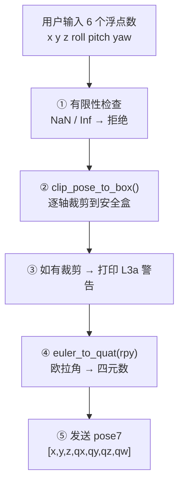
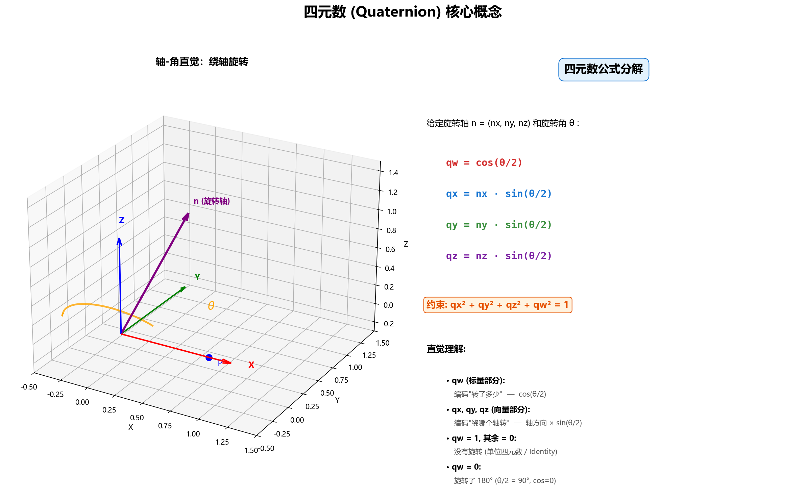
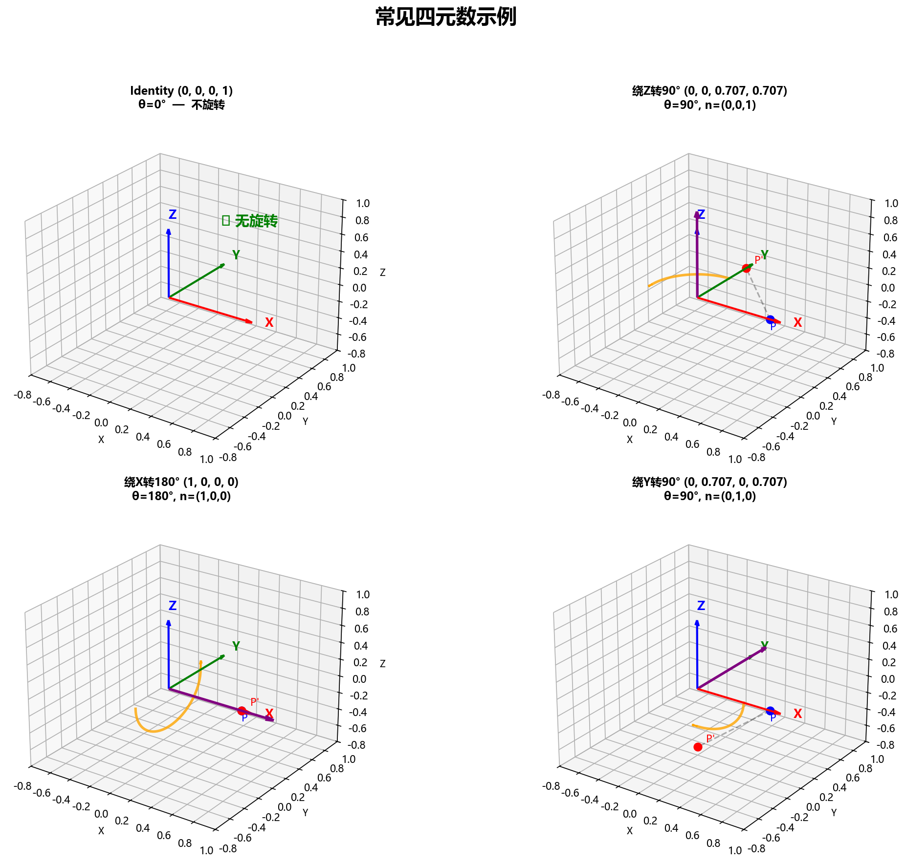
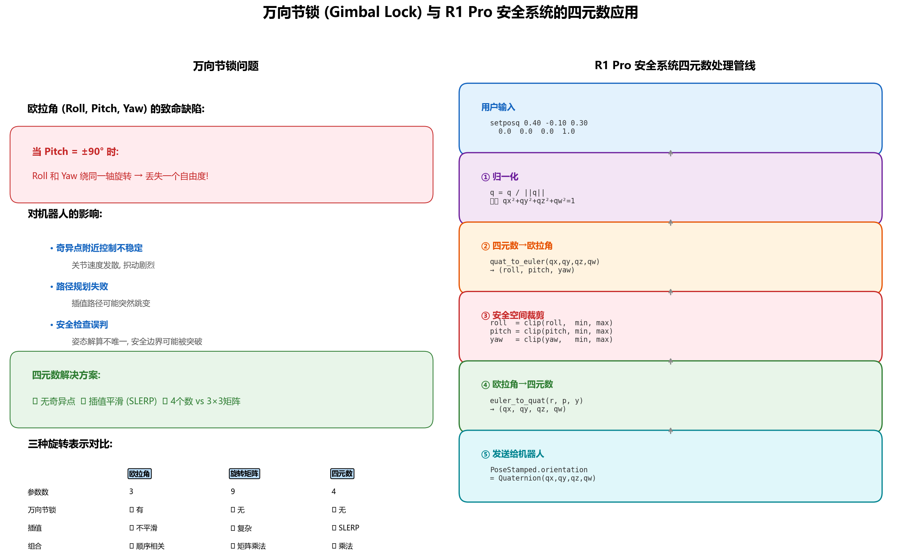
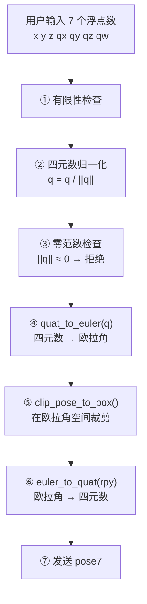
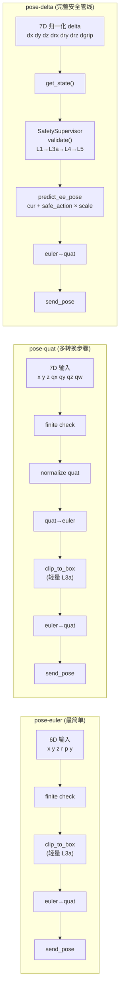

# Galaxea R1 Pro 安全实施 — 补充知识

> 本文档汇集对 [safety_2.md](safety_2.md) 各章节的深入解读，供部署工程师参考。

---

## 1. 坐标系确认的相关知识

> 对应 [safety_2.md §2.1 坐标系确认](safety_2.md#21-坐标系确认)

### 1.1 什么是 `torso_link4` 坐标系

`torso_link4` 是 R1 Pro URDF 运动链中的一个刚体链接 (link)，对应躯干 4 DoF 关节链的末端——即**双臂肩部的安装基座**。它本身不会动（相对于躯干末端），但会随躯干关节的运动而改变在世界坐标系中的位置和朝向。

在安全系统中，`torso_link4` 充当 **EE（末端执行器）位姿的参考原点**。选择它而非 `base_link`（底盘）的原因是：臂的可达工作空间相对于肩部基座是固定的，但底盘可以移动和旋转。如果以 `base_link` 为参考，躯干关节一旦转动，安全盒就需要同步做坐标变换，增加复杂性和出错风险。以 `torso_link4` 为参考，安全盒的数值边界始终稳定。

在官网的[手臂姿态控制](https://docs.galaxea-dynamics.com/zh/Guide/R1Pro/software_introduction/ros1/R1Pro_Software_Introduction_ROS1/#_15)中也提到:
```
当前末端姿态控制的相对位姿是URDF中gripper_link相对于torso_link4的姿态转换。以下图中的左臂为例，左臂的left_gripper_link坐标系相对于躯干的torso_link4坐标系的相对关系中，包含了x、y、z的偏移量以及orientation对应的旋转偏移。
```


### 1.2 什么是 frame（坐标帧）

`frame` 指 ROS2 TF 系统中的坐标帧 (coordinate frame)——一个固定在刚体上的三维坐标系，由原点 + 三个正交轴 (x, y, z) 定义。

当 mobiman 发布 EE 姿态 `[x, y, z, qx, qy, qz, qw]` 时，这 7 个数值表示 **EE 在 `torso_link4` 坐标帧下的位置和朝向**。在 ROS2 的 `PoseStamped` 消息中，`header.frame_id` 字段就是用来声明"这个 pose 是在哪个坐标帧中表达的"：

```python
# r1_pro_controller.py:571-573
msg = PoseStamped()
msg.header.stamp = self._node.get_clock().now().to_msg()
msg.header.frame_id = "torso_link4"   # 声明：下面的 xyz/quat 相对于 torso_link4
```

如果 `frame_id` 换成了 `base_link`，同一个 EE 物理位置对应的 `x, y, z` 数值会完全不同，因为参考原点变了。

### 1.3 为什么两个 EE 共用同一个参考坐标系

R1 Pro 有左右两个手臂、两个末端执行器（`pose_ee_arm_right` 和 `pose_ee_arm_left`），但它们的位姿都**相对于同一个 `torso_link4`** 来表达。这里要区分两个概念：

| 概念 | 含义 | 数量 |
|------|------|------|
| **被描述的坐标系** (target frame) | EE 自身的位姿 | 左右各一个 |
| **参考坐标系** (reference frame) | 度量 EE 位姿的"尺子原点" | 两臂共用一个 |

`torso_link4` 是参考坐标系，不是 EE 自身。两个 EE 都从同一个肩部基座生长出来：

```
torso_link4（参考原点，肩部基座）
├── right_ee_pose = [x, y, z, qx, qy, qz, qw]  ← 右手 EE 相对于 torso_link4 的位姿
└── left_ee_pose  = [x, y, z, qx, qy, qz, qw]  ← 左手 EE 相对于 torso_link4 的位姿
```

这也是 L3a 安全盒能工作的前提：`right_ee_min/max` 和 `left_ee_min/max` 都在同一个 `torso_link4` 坐标系下定义边界，所以可以直接拿 `state.right_ee_pose` 的 xyz 与边界值比较，不需要额外的坐标变换。

### 1.4 验证命令解读

safety_2.md 要求部署前执行：

```bash
ros2 topic echo /motion_control/pose_ee_arm_right --once
```

这条命令的含义：

| 部分 | 含义 |
|------|------|
| `ros2 topic echo` | 订阅一个 ROS2 话题并把收到的消息打印到终端 |
| `/motion_control/pose_ee_arm_right` | 话题名——mobiman 发布的右臂 EE 实时位姿 |
| `--once` | 只打印一条消息就退出 |

执行后终端会输出类似：

```yaml
header:
  stamp:
    sec: 1714200000
    nanosec: 123456789
  frame_id: "torso_link4"      # ← 重点检查这里
pose:
  position:
    x: 0.35
    y: -0.12
    z: 0.28
  orientation:
    x: 0.0
    y: 0.0
    z: 0.0
    w: 1.0
```

**验证目的**：确认 `frame_id` 确实是 `"torso_link4"`。如果实际输出的是 `"base_link"`、`"world"` 或其他值，说明代码中的坐标系假设与硬件不符，L3a 安全盒的边界值全部失效，必须在部署前修正。

### 1.5 相关代码位置

| 文件 | 行号 | 内容 |
|------|------|------|
| [r1_pro_controller.py](../../../rlinf/envs/realworld/galaxear/r1_pro_controller.py) | 573 | `msg.header.frame_id = "torso_link4"` — 发送 EE 目标时指定坐标帧 |
| [r1_pro_robot_state.py](../../../rlinf/envs/realworld/galaxear/r1_pro_robot_state.py) | 65, 94-96 | EE pose 字段定义，注释标注 `frame torso_link4` |
| [r1_pro_safety.py](../../../rlinf/envs/realworld/galaxear/r1_pro_safety.py) | 69-76 | L3a 安全盒参数，注释标注 `xyz + rpy in torso_link4` |


## 2. 关节限位验证的相关知识

**arm_q_min含义**
arm_q_min 是 R1 Pro A2 机械臂 7 个关节的最小角度限位，单位是弧度 (rad)。配合 arm_q_max 一起使用，定义了每个关节允许旋转的安全范围。

逐关节解读
A2 臂有 7 个旋转关节 (J1–J7)，数组中的 7 个元素一一对应：

|索引	|关节|	q_min (rad)|	q_max (rad)|	范围 (°)|	含义|
|------|------|------|------|------|------|
|0	|J1 (肩偏转)	|-2.7	|+2.7	|±154.7°	    |  对称，大范围旋转|
|1	|J2 (肩俯仰)	|-1.8	|+1.8	|±103.1°	    |  对称，范围较窄|
|2	|J3 (臂旋转)	|-2.7	|+2.7	|±154.7°	    |  对称|
|3	|J4 (肘关节)	|-3.0	|0.0	|单向 171.9°	|  不对称——肘只能向一侧弯|
|4	|J5 (腕偏转)	|-2.7	|+2.7	|±154.7°	    | 对称|
|5	|J6 (腕俯仰)	|-0.1	|3.7	|不对称 217.7°|	极不对称——几乎只能向一侧转|
|6	|J7 (腕旋转)	|-2.7	|+2.7	|±154.7°	    |  对称|

关键要点:
1. 这是"|软限位"而|非"硬限位"——定义在 r1_pro_safety.py:62-63 的 SafetyConfig 中，由 SafetySupervisor 的 L2 层检查。但 safety_2.md 指出 L2 目前仅为注释，不直接强制执行，实际保护依赖 L3a + L4。

2. J4 和 J6 的不对称性值得注意——J4 是肘关节，物理上只能向一个方向弯曲（想象人的手肘）；J6 是腕俯仰，结构决定了它的活动范围偏向一侧。这些值必须与 A2 臂硬件规格书一致，否则安全限位会"放过"超出物理极限的指令。

3. 左右臂共用同一组限位——代码注释写的是 right arm; left arm uses same。这在大多数情况下合理（A2 臂左右结构对称），但安装方式或线缆走向可能导致实际可达范围略有差异。

4. q 代表的是关节角度 (generalized coordinate)——在机器人学中 q 是广义坐标的标准符号，对旋转关节就是角度值。qvel 则是角速度，qtau 是力矩。

目前R1 Pro用的是A2臂:
- 但官网尚找不到说明文档. 但可参考:
  + [R1 Pro 硬件文档](https://docs.galaxea-dynamics.com/Guide/R1Pro/hardware_introduction/R1Pro_Hardware_Introduction/)
  + [R1 Pro 软件文档](https://docs.galaxea-dynamics.com/Guide/R1Pro/software_introduction/R1Pro_Software_Guide_ROS2/)
  + [Galaxea URDF GitHub 仓库](https://github.com/userguide-galaxea/URDF)
  + [A1臂官方文档](https://docs.galaxea-ai.com/Guide/A1/A1_Hardware_Guide/), A2 是 A1 的 7DoF 升级版，部分关节行程可能相似
- 参考**R1 Pro 机器上的 SDK**——Galaxea SDK 安装后，mobiman 包中应有 URDF 文件，里面的 `<joint><limit lower="..." upper="..."/></joint>` 就是关节限位的权威来源. 也就是R1 Pro 的 Orin 控制器上，Galaxea SDK 安装后通常在 `<sdk_root>/install/config/` 下有 YAML 文件，包含每个关节的 joint_limits（位置、速度、力矩上下限）.
- **URDF/Xacro 文件**:	R1 Pro 的 URDF 模型中，每个 `<joint>` 标签下通常有 `<limit lower="..." upper="..." velocity="..." effort="..."/>` 字段，这也是关节限位的权威来源之一

为什么 safety_2.md 强调"对照":
- RLinf 的 SafetyConfig 中写的 [-2.7, -1.8, ...] 只是默认值（注释标明 "tuned for M1 single-arm bring-up"）。如果这些默认值与实际 A2 臂硬件的物理极限不一致，安全限位就会出现两种风险：
  + 设得太宽 → 允许关节运动到物理极限之外 → 损坏电机或减速器
  + 设得太窄 → 不必要地限制工作空间 → 影响任务完成能力
- 所以部署前必须拿硬件规格书来交叉验证。


**arm_qvel_max 含义**
arm_qvel_max = [3.0, 3.0, 3.0, 3.0, 5.0, 5.0, 5.0] rad/s 是 Galaxea R1 Pro 机械臂 7 个关节的最大允许角速度上限。qvel是角速度的意思.

每个元素对应一个关节（J1 到 J7）：

|关节	|最大角速度	|说明|
|------|------|------|
|J1 (肩偏转)	|3.0 rad/s ≈ 172°/s	  |   基座大关节，惯量大，限速严
|J2 (肩俯仰)	|3.0 rad/s	          |   同上
|J3 (上臂旋转)|	3.0 rad/s	          |   同上
|J4 (肘)	|3.0 rad/s	              |   同上
|J5 (前臂旋转)|	5.0 rad/s ≈ 286°/s	|    末端小关节，惯量小，允许更快
|J6 (腕俯仰)	|5.0 rad/s	          |   同上
|J7 (腕旋转)	|5.0 rad/s	          |   同上

为什么前 4 个是 3.0，后 3 个是 5.0？
这遵循机械臂设计的物理规律：
J1-J4（近端关节）：靠近基座，承载整条臂的质量和惯量。如果这些关节速度过快，产生的动量大，碰撞冲击力高，且电机制动距离长。所以限速更严（3.0 rad/s）。
J5-J7（远端/腕部关节）：只驱动末端执行器（手腕和夹爪），惯量小得多。同样速度下冲击力远小于近端关节，因此允许更高速度（5.0 rad/s），也有助于灵巧操作。

在安全系统中的作用
文档 §2.2 的注释也说了：L2 目前仅为注释,不直接强制；间接通过 L3a+L4 保护。
即这组值目前是参考规格，安全系统并不直接用它做速度裁剪。实际保护靠上层的 L3a（工作空间裁剪）和 L4（动作幅度限制）间接约束速度。文档特别提醒需要对照 Galaxea SDK 的 joint_limits 配置和电机规格书确认这些值是否准确 — 如果硬件实际极限比这里写的小，运行时可能超速损伤电机。


## 3. TCP 工作空间测量的相关知识

> 对应 [safety_2.md §2.3 TCP 工作空间测量](safety_2.md#23-tcp-工作空间测量)

### 3.1 `right_ee_min` / `right_ee_max` 参数含义

`right_ee_min` 和 `right_ee_max` 是右臂末端执行器 (TCP/EE) 的 **6D 轴对齐安全包围盒 (AABB)** 的下界和上界，在 `torso_link4` 坐标系中定义，供 L3a 安全层裁剪使用。

以默认值为例：

```python
right_ee_min = [0.20, -0.35, 0.05, -3.20, -0.30, -0.30]
right_ee_max = [0.65,  0.35, 0.65,  3.20,  0.30,  0.30]
```

6 个分量的含义：

| 索引 | 物理量 | 坐标轴 | min 默认值 | max 默认值 | 含义 |
|------|--------|--------|-----------|-----------|------|
| 0 | X (前后) | `torso_link4` | 0.20 m | 0.65 m | EE 前后可达范围（防撞躯干 / 防过伸） |
| 1 | Y (左右) | 同上 | -0.35 m | 0.35 m | EE 左右可达范围 |
| 2 | Z (上下) | 同上 | 0.05 m | 0.65 m | EE 高度范围（防撞桌面/地面 / 防过高） |
| 3 | Roll | 欧拉角 xyz | -3.20 rad (≈-183°) | 3.20 rad (≈183°) | 绕 X 轴旋转范围（几乎不限制） |
| 4 | Pitch | 欧拉角 xyz | -0.30 rad (≈-17°) | 0.30 rad (≈17°) | 绕 Y 轴旋转范围（限制很紧，假设 EE 基本朝下） |
| 5 | Yaw | 欧拉角 xyz | -0.30 rad (≈-17°) | 0.30 rad (≈17°) | 绕 Z 轴旋转范围（同上） |

**姿态参数解读**：默认配置中 Roll 范围很宽（±183°），而 Pitch/Yaw 限制在 ±17°，说明默认假设任务中 EE 基本保持水平朝下（如桌面抓取），手腕只允许小幅偏转。如果任务需要大幅旋转手腕（如侧抓、翻转物体），需要放宽 Pitch/Yaw 的范围。

### 3.2 欧拉角 (Euler Angles)

欧拉角是描述三维空间中物体**姿态（朝向）**的一种方式。它将任意旋转分解为**绕三个轴依次旋转**的三个角度。

**为什么需要欧拉角？** 描述一个物体在三维空间中的完整状态需要 6 个自由度：3 个位置 (x, y, z) + 3 个姿态。位置容易理解，但姿态的表示方式有多种选择：

| 表示方式 | 维度 | 优点 | 缺点 |
|---------|------|------|------|
| **欧拉角** (roll, pitch, yaw) | 3 个标量 | 直觉易懂；最小参数化 | 存在万向节锁 (gimbal lock) |
| **四元数** (qx, qy, qz, qw) | 4 个标量 | 无万向节锁；插值平滑 | 不直觉；需归一化约束 |
| **旋转矩阵** | 3×3 = 9 个标量 | 数学运算方便 | 冗余；需正交约束 |

RLinf 安全系统中**同时使用了两种**：
- **四元数**：ROS2 topic 和 `RobotState` 中的 EE pose 使用 `[x, y, z, qx, qy, qz, qw]` 共 7 个值
- **欧拉角 (xyz 顺序)**：安全盒参数和 L3a 内部计算使用 `[x, y, z, roll, pitch, yaw]` 共 6 个值

代码中的转换（[r1_pro_action_schema.py:138](../../../rlinf/envs/realworld/galaxear/r1_pro_action_schema.py#L138)）：

```python
from scipy.spatial.transform import Rotation as R
cur_eul = R.from_quat(ee[3:]).as_euler("xyz")  # 四元数 → 欧拉角
```

**为什么安全盒用欧拉角而不用四元数？** 因为安全盒本质上是"每个维度独立裁剪"——`np.clip(target, ee_min, ee_max)` 逐元素比较。欧拉角的三个分量各自独立对应一个旋转轴，可以直接裁剪；四元数的 4 个分量相互耦合（必须满足 `qx²+qy²+qz²+qw²=1`），无法逐元素裁剪。

**Roll / Pitch / Yaw 的直觉理解**（以 EE 朝下为初始姿态）：

```
Roll  (绕 X 轴) → 手腕左右翻转（像转门把手）
Pitch (绕 Y 轴) → 手腕前后俯仰（像点头）
Yaw   (绕 Z 轴) → 手腕左右偏转（像摇头）
```

**万向节锁 (Gimbal Lock)**：当 Pitch ≈ ±90° 时，Roll 和 Yaw 的旋转轴重合，三个自由度退化为两个——此时欧拉角表示不唯一。safety_2.md §9.8 将此列为 P3 已知风险。当前系统中 Pitch 被限制在 ±0.30 rad (≈±17°)，远离 ±90°，因此实际风险很低。

### 3.3 L3a 预测公式 `target = cur_ee + action * scale`

L3a 安全层的核心逻辑是：**先预测动作执行后 EE 会到达的位置，再裁剪到安全盒内**。预测公式来自 [r1_pro_action_schema.py:139-140](../../../rlinf/envs/realworld/galaxear/r1_pro_action_schema.py#L139-L140)：

```python
nxt_xyz = cur_xyz + d[key_xyz] * float(self.action_scale[0])
nxt_eul = cur_eul + d[key_rpy] * float(self.action_scale[1])
```

即 `target = cur_ee + action * scale`。各变量含义：

| 变量 | 含义 | 来源 | 示例值 |
|------|------|------|--------|
| `cur_xyz` | 当前 EE 位置 [x, y, z]，单位 m | `state.get_ee_pose(side)[:3]`，来自 ROS2 反馈 | `[0.35, -0.12, 0.28]` |
| `cur_eul` | 当前 EE 姿态 [roll, pitch, yaw]，单位 rad | 四元数转换而来 | `[0.01, -0.05, 0.02]` |
| `d[key_xyz]` | 归一化位移动作，范围 [-1, 1] | RL 策略网络输出，经 L1 裁剪后 | `[0.6, -0.3, 0.1]` |
| `d[key_rpy]` | 归一化旋转动作，范围 [-1, 1] | 同上 | `[0.0, 0.2, -0.1]` |
| `action_scale[0]` | 位移缩放因子，单位 m | YAML 配置 `action_scale` 的第 1 个元素 | `0.05`（即每步最多 5cm） |
| `action_scale[1]` | 旋转缩放因子，单位 rad | YAML 配置 `action_scale` 的第 2 个元素 | `0.10`（即每步最多 0.1rad ≈ 5.7°） |
| `nxt_xyz` | 预测的下一步 EE 位置 [x, y, z] | 计算得出 | `[0.38, -0.135, 0.285]` |
| `nxt_eul` | 预测的下一步 EE 姿态 [roll, pitch, yaw] | 计算得出 | `[0.01, -0.03, 0.01]` |

**为什么这样计算？**

1. **RL 策略输出归一化动作**：策略网络输出的 action 在 [-1, 1] 范围内（由 L1 保证）。这是 RL 的标准做法——归一化输出有利于网络训练稳定性。

2. **`action_scale` 将归一化值转换为物理量**：`action * scale` 将无量纲的 [-1, 1] 转换为实际的米/弧度。当 `action_scale[0] = 0.05` 时，策略输出 `action = 1.0` 表示"这一步沿该轴移动 5cm"，`action = -0.5` 表示"反向移动 2.5cm"。

3. **增量控制 (delta control)**：`cur + delta` 是增量控制模式——策略不直接输出目标位置，而是输出相对于当前位置的**偏移量**。这比绝对位置控制更适合 RL，因为策略只需学习"往哪个方向移动多少"，不需要记住全局坐标。

**一个完整的数值示例**：

```
当前状态:
  cur_xyz = [0.35, -0.12, 0.28]  (EE 在 torso_link4 前方 35cm, 右侧 12cm, 高 28cm)
  cur_eul = [0.01, -0.05, 0.02]  (姿态接近水平朝下)

策略输出:
  action_xyz = [0.6, -0.3, 0.1]  (归一化: 前进 60%, 右移 30%, 上升 10%)
  action_rpy = [0.0, 0.2, -0.1]  (归一化: pitch 正向 20%, yaw 负向 10%)

缩放因子:
  action_scale = [0.05, 0.10]    (位移 5cm/step, 旋转 0.1rad/step)

预测:
  nxt_xyz = [0.35 + 0.6×0.05, -0.12 + (-0.3)×0.05, 0.28 + 0.1×0.05]
          = [0.35 + 0.03, -0.12 - 0.015, 0.28 + 0.005]
          = [0.38, -0.135, 0.285]

  nxt_eul = [0.01 + 0.0×0.10, -0.05 + 0.2×0.10, 0.02 + (-0.1)×0.10]
          = [0.01, -0.05 + 0.02, 0.02 - 0.01]
          = [0.01, -0.03, 0.01]

L3a 裁剪:
  target = [0.38, -0.135, 0.285, 0.01, -0.03, 0.01]
  ee_min = [0.20, -0.35,  0.05, -3.20, -0.30, -0.30]
  ee_max = [0.65,  0.35,  0.65,  3.20,  0.30,  0.30]
  → 全部在范围内，不裁剪
```

**如果 target 超出安全盒**：假设 `nxt_xyz[0] = 0.72`（超出 `ee_max[0] = 0.65`），L3a 会将其裁剪为 0.65，然后通过 `_rewrite_arm_action()` 反向计算新的归一化动作：

```
裁剪后: clipped_xyz[0] = 0.65
反向写回: new_action[0] = (0.65 - 0.35) / 0.05 = 6.0
→ 但这超出 [-1,1]，所以 L4 步进上限会进一步裁剪
```

### 3.4 "物理极限位置"的实际测量方法

safety_2.md §2.3 描述的"用示教器将臂移至物理极限位置，记录 EE pose"容易产生误解。7-DoF 机械臂以肩部为轴心，可达工作空间是一个复杂的连续体（近似环形/球壳状），有无数个"物理极限位置"——不可能也不需要逐点遍历。

**核心澄清**：你要测量的不是臂的完整可达空间包络，而是一个**任务相关的 6D 轴对齐包围盒 (AABB)**——只需确定 6 个轴各自的 min 和 max，共 12 个数值。

#### 3.4.1 安全盒与可达空间的关系

```
┌──────────────────────────────────────┐
│        臂的完整可达空间                │
│    (复杂的环形/球壳，不规则)           │
│                                      │
│      ┌────────────────────┐          │
│      │  AABB 安全盒        │          │
│      │  (简单矩形,         │          │
│      │   必然比真实         │          │
│      │   工作空间小)        │          │
│      │                    │          │
│      │  ┌──────────┐      │          │
│      │  │ 任务区域  │      │          │
│      │  └──────────┘      │          │
│      └────────────────────┘          │
│                                      │
└──────────────────────────────────────┘
```

- **AABB 故意保守**：矩形盒一定比真实的弧形工作空间小。盒内一些角落位置臂实际到不了，盒外一些臂能到的位置被排除——这没关系，安全盒的目的是**排除危险区域**，不是精确描述可达性
- **任务驱动而非运动学驱动**：你的任务只用到工作空间的一小部分，安全盒只需包住那部分再加裕量

#### 3.4.2 具体操作步骤

**第一步：确定任务区域**

不碰机器人，用眼睛/尺子确定任务中臂需要活动的物理区域：

```
例: 桌面抓取任务
- 桌面在 torso_link4 前方 0.25~0.60m (X)
- 桌面宽度覆盖左右 ±0.30m (Y)
- 桌面高度约 0.10m，抓取需抬高到 0.50m (Z)
```

**第二步：逐轴推到边界（6~12 个位姿）**

用示教器（或手动拖拽/零力矩模式）做以下测量，每个轴只需 1~2 个位姿：

| 操作 | 记录值 | 说明 |
|------|--------|------|
| 把 EE 推到任务区域内最远处 | x_max | X 轴上界 |
| 把 EE 拉到最近处 | x_min | X 轴下界 |
| 把 EE 移到最右边 | y_min (负值) | Y 轴下界 |
| 把 EE 移到最左边 | y_max | Y 轴上界 |
| 把 EE 压到最低处 | z_min | Z 轴下界 |
| 把 EE 举到最高处 | z_max | Z 轴上界 |
| 在典型位置旋转手腕到任务需要的极端姿态 | roll/pitch/yaw min/max | 各旋转轴边界 |

记录方式：每次到达边界位置后，执行 `ros2 topic echo /motion_control/pose_ee_arm_right --once`，读取 `position.x/y/z` 和 `orientation` 四元数（需转换为欧拉角）。

**第三步：收缩安全裕量**

在测量值基础上收缩 5-10cm（位置）或 0.05-0.10 rad（姿态），作为最终安全盒参数：

```
safety_ee_min[i] = measured_min[i] + margin
safety_ee_max[i] = measured_max[i] - margin
```

**第四步：验证并写入 YAML**

```yaml
safety_cfg:
  right_ee_min: [x_min, y_min, z_min, roll_min, pitch_min, yaw_min]
  right_ee_max: [x_max, y_max, z_max, roll_max, pitch_max, yaw_max]
```

#### 3.4.3 注意事项

1. **左右可能不对称**：默认配置左右臂使用相同的安全盒参数。但实际场景中，桌面偏向一侧、线缆走向、夹具安装位置等都可能导致左右臂的实际安全工作空间不同。需要分别测量。

2. **安全盒不能替代关节限位**：AABB 是笛卡尔空间的约束。7-DoF 冗余臂的同一个 TCP 位置可对应多种关节构型——TCP 在盒内不保证所有关节都在安全范围内。这是 safety_2.md §9.1 指出的 L2 缺失的风险。

3. **姿态轴的边界取决于任务**：桌面抓取任务中 EE 基本朝下，Pitch/Yaw 限制在 ±17° 足够；如果任务涉及侧抓或翻转，需要显著放宽。

4. **安全盒是运行时检查**，开销极低（6 次浮点比较），不影响控制频率。

### 3.5 ..spatial..Rotation的from_quat()有何用?
scipy.spatial.transform.Rotation的from_quat()函数有什么用? 用在这里是什么意思?

Rotation.from_quat() 从四元数 [x, y, z, w] 构造一个旋转对象。

在这行代码中，ee[3:] 是末端执行器（end-effector）位姿的后4个分量，即姿态的四元数表示。整行的作用是：将末端执行器的四元数姿态转换为欧拉角 (roll, pitch, yaw)，顺序为 "xyz"。

这是机器人控制中的常见操作——四元数无奇异性但不直观，欧拉角更适合作为策略网络的输入/输出或做增量控制计算。对应的就是文档中提到的 Quat2EulerWrapper 所做的事情。

## 4. RLinf 在 Orin 上的安装

> 对应 [r1pro5op47.md §5.2 推荐部署拓扑](r1pro5op47.md)、[§13.8 Runbook](r1pro5op47.md)、[附录 G.9-G.11](r1pro5op47.md)

### 4.1 结论

**Orin 节点上需要运行 Ray，也需要 RLinf 仓库代码（但只需最小安装，不需要 CUDA/PyTorch）。**

这是因为 `GalaxeaR1ProController` 是一个 **Ray Actor**——它在 Orin 上被远程实例化并常驻运行，通过 ROS2 与机器人本体通信，通过 Ray RPC 接收 GPU 服务器上 EnvWorker 的指令。Ray 是跨节点通信的基础设施，没有它 Controller 无法被拉起。

### 4.2 两节点架构

设计文档 §5.2（L648-696）定义了推荐的 2-Node 部署拓扑：

```
┌───────────────────────────────────────────────┐
│  Node 0: GPU Server (RLINF_NODE_RANK=0)       │
│                                               │
│  ActorGroup (FSDP 训练)                        │
│  RolloutGroup (VLA/CNN 推理)                    │
│  EnvWorker → GalaxeaR1ProEnv                   │
│  GalaxeaR1ProCameraMux (D405 USB + ROS2)       │
│  GalaxeaR1ProSafetySupervisor                  │
│                                               │
│  [GPU + CUDA + PyTorch + RLinf 完整安装]       │
└──────────────── Ray RPC ──────────────────────┘
                    │
                    ▼
┌───────────────────────────────────────────────┐
│  Node 1: Orin (RLINF_NODE_RANK=1)             │
│                                               │
│  GalaxeaR1ProController (Ray Actor)            │
│    ├── rclpy Node → ROS2 topics               │
│    ├── HDAS 传感器订阅                          │
│    └── mobiman 运动控制发布                      │
│                                               │
│  [ROS2 Humble + Galaxea SDK + CAN + Ray]      │
│  [不需要 CUDA / PyTorch]                       │
└───────────────── ROS2 DDS ────────────────────┘
                    │
                    ▼
           R1 Pro 机器人本体
```

**关键设计**：EnvWorker 运行在 GPU 服务器上（与推理 Worker 共置，避免图像跨网传输），Controller 运行在 Orin 上（与 ROS2/CAN 硬件同置，最低控制延迟）。两者通过 Ray RPC 通信。

### 4.3 Orin 上需要安装的依赖

设计文档附录 G.10（L7125-7136）给出了完整的依赖对照表：

| 依赖 | GPU Server | Orin | 说明 |
|------|:---:|:---:|------|
| Python 3.10 + RLinf 仓库 | ✓ | ✓ | Orin 上需要 RLinf 代码供 Ray 加载 Controller 类 |
| Ray | ✓ | ✓ | Orin 作为 Ray worker node 加入集群 |
| CUDA + PyTorch | ✓ | ✗ | Controller 是纯 CPU 进程，不需要 GPU 依赖 |
| ROS2 Humble | 视配置 | ✓ | Controller 的 `rclpy` 依赖 ROS2 |
| Galaxea SDK (`~/galaxea/install/`) | 形态 A 下不需要 | ✓ | HDAS/mobiman 消息定义在 SDK 中 |
| `hdas_msg` 自定义消息包 | 形态 A 下不需要 | ✓ | 传感器数据的 ROS2 消息类型 |
| CAN 接口 (`can0` UP) | ✗ | ✓ | 物理硬约束，臂通过 CAN 总线通信 |
| `pyrealsense2` | ✓ (D405 直连 GPU) | 视配置 | 腕部相机默认 USB 直连 GPU 服务器 |

**核心收益**：Controller 在 Orin 的最大好处是 GPU 服务器**完全不需要安装 Galaxea SDK / hdas_msg / colcon build**。SDK 升级时只需要动 Orin 一台机器。

### 4.4 启动流程

设计文档附录 C（L5341-5350）和附录 G.9（L7076-7107）给出了详细的启动步骤：

**Step 1：在 Orin 上启动 Ray worker**

```bash
cd ~/RLinf
export RLINF_NODE_RANK=1    # 关键！必须在 ray start 之前设置
source ray_utils/realworld/setup_before_ray_galaxea_r1_pro.sh
ray start --address=<gpu_server_ip>:6379
```

`setup_before_ray_galaxea_r1_pro.sh` 在 Orin 上会：
1. Source `/opt/ros/humble/setup.bash`（ROS2 环境）
2. Source `~/galaxea/install/setup.bash`（Galaxea SDK）
3. 检查 `can0` 接口是否 UP（否则尝试执行 `~/can.sh`）
4. 设置 `RLINF_NODE_RANK`、`ROS_DOMAIN_ID`、DDS profile 等环境变量
5. 设置 `PYTHONPATH` 包含 RLinf 仓库根目录

**Step 2：在 GPU 服务器上启动 Ray head + 训练**

```bash
cd ~/RLinf
export RLINF_NODE_RANK=0
source ray_utils/realworld/setup_before_ray_galaxea_r1_pro.sh
ray start --head --port=6379 --node-ip-address=<gpu_server_ip>

# 验证两节点就绪
ray status    # 应显示 2 nodes

# 启动训练（只在 head 节点执行）
bash examples/embodiment/run_realworld_galaxea_r1_pro.sh \
     realworld_galaxea_r1_pro_right_arm_rlpd_cnn_async
```

**Orin 上永远不起训练入口脚本**（附录 G.9.1, L7089），只 `ray start` 把节点加入集群，等待 Controller Worker 被远程实例化。

### 4.5 Controller 远程实例化过程

训练脚本启动后，RLinf 内部自动完成以下步骤（附录 G.9.3, L7109-7121）：

1. 读取 YAML，解析 `cluster.node_groups` 与 `component_placement`
2. `Hardware.enumerate(node_rank=0)` 在 GPU 服务器上做校验
3. `Hardware.enumerate(node_rank=1)` 通过 **Ray RPC 在 Orin 上**做校验
4. 创建各 WorkerGroup
5. 进入 `runner.train()` 循环
6. 第一次 `EnvWorker.init_worker()` 时，在 GPU 服务器进程内创建 `GalaxeaR1ProEnv`
7. `GalaxeaR1ProEnv._setup_hardware()` 调用 `GalaxeaR1ProController.launch_controller(node_rank=1)`
8. **Ray 在 Orin 节点上拉起 Controller 进程**，执行 `__init__`（`rclpy.init` / 创建 publishers / 启 spin 线程）
9. 后续 EnvWorker 通过 `self._controller.send_arm_pose(...).wait()` 远程调用

### 4.6 两种部署形态

设计文档附录 G.15（L7241-7247）总结了两种部署形态：

| 维度 | 形态 A（推荐）：Controller 在 Orin | 形态 B：Controller 在 GPU Server |
|------|------|------|
| GPU Server 依赖 | 不需要 ROS2/SDK/hdas_msg | 需要 colcon build hdas_msg |
| 控制延迟 | 最低（Orin 本地 ROS2） | +5-15ms（跨网 ROS2） |
| L5 安全 watchdog | 完整（Controller 本地检测） | 受网络延迟影响 |
| 维护复杂度 | Orin 需维护 RLinf 仓库 | GPU Server 需维护 ROS2 环境 |
| 适用条件 | 默认推荐 | 仅当团队不愿在 Orin 维护 RLinf + 控制频率 ≤10Hz + LAN 稳定 |

本方案全部按**形态 A** 编写。

### 4.7 Ray 在 Orin (ARM64) 上的安装注意事项

Orin 使用 ARM64 (aarch64) 架构。Ray 官方已支持 aarch64 Linux，但在 Jetson 平台上可能需要注意：

1. **预编译 wheel**：Ray 官方 PyPI 提供 aarch64 wheel，可直接 `pip install ray`。如果版本不可用，社区有[预编译的 aarch64 wheel](https://gist.github.com/abishekmuthian/aa0bf2feb02aedb3b38eef203b4b8cc4)
2. **源码编译**：Bazel 构建 Boost 库时 ARM64 汇编文件可能缺少默认条件，需要[社区补丁](https://discuss.ray.io/t/arm64-support-ci-integration/1893)
3. **版本对齐**：Orin 上的 Ray 版本必须与 GPU 服务器一致，否则 RPC 协议可能不兼容
4. **仅需 Ray Core**：Orin 上不需要 Ray 的 ML 库（`ray[default]` 即可，无需 `ray[tune]`/`ray[train]`）

### 4.8 验证 Controller 在 Orin 上运行

训练启动后，用以下命令验证（附录 G.11, L7138-7154）：

```bash
# 在 GPU Server 上
ray status                    # 应看到 2 nodes
ray list actors | grep -i controller
# 应看到 GalaxeaR1ProController-0-0，Node IP 是 Orin 的 IP

# 在 Orin 上
ros2 node list
# 应看到 /rlinf_galaxea_r1_pro_controller_<pid>

ros2 topic list | grep target_pose
# 应看到 Controller 创建的目标位姿 topic
```

### 4.9 与 Franka 现有模式的一致性

Galaxea R1 Pro 的部署架构完全复用了 RLinf 在 Franka 上已验证的模式。Franka 使用 NUC 作为控制节点，通过 `FrankaController.launch_controller(node_rank=controller_node_rank)` 将 Controller 部署到边缘节点。两者共享相同的 `Worker` 基类、Ray RPC 通信模式和 `node_groups` 配置语法。这意味着 Franka 部署中积累的运维经验（网络调优、Ray 集群管理、故障排查）可以直接迁移到 R1 Pro。


## 5. 用 Pink 和 CBF 做机器人安全约束

> 对 CBF（Control Barrier Function，控制屏障函数）在机器人安全约束中的应用进行介绍，特别是 [Pink](https://github.com/stephane-caron/pink) 库内置的 CBF 支持，及其与 RLinf 安全系统的关系。

### 5.1 Pink 简介

[Pink](https://github.com/stephane-caron/pink)（PyPI 包名 `pin-pink`）是由 Stéphane Caron 开发的 Python **逆运动学 (IK)** 求解库，基于 [Pinocchio](https://github.com/stack-of-tasks/pinocchio) 刚体动力学引擎和 QP（二次规划）求解器。

Pink 的核心工作方式：

1. **任务定义**：每个 IK 任务由一个残差函数 `e(q)` 和对应的任务雅可比 `J(q)` 定义（如"末端执行器到达目标位姿"）
2. **加权多任务**：多个任务可以同时定义，冲突通过权重机制解决——所有目标被归一化到统一量纲后加权求解
3. **QP 求解**：将所有任务目标和约束统一建模为一个二次规划问题，一次求解得到关节速度增量 `Δq`

```
minimize   Σ_i  w_i · ||J_i · Δq - e_i||²     (加权任务目标)
subject to  q_min ≤ q + Δq ≤ q_max              (关节限位)
            h(q) + α·ḣ(q)·Δq ≥ 0                (CBF 安全约束)
```

### 5.2 CBF（Control Barrier Function）原理

CBF 是一种来自控制理论的**安全约束形式化方法**，其核心思想是：

**定义一个"安全集合"，然后证明系统状态永远不会离开这个集合。**

#### 5.2.1 数学定义

给定一个安全集合 `C = {x : h(x) ≥ 0}`，其中 `h(x)` 是一个连续可微函数：

- `h(x) > 0`：状态在安全集合**内部**
- `h(x) = 0`：状态在安全集合**边界**上
- `h(x) < 0`：状态在安全集合**外部**（不安全）

CBF 要求控制输入 `u` 满足：

```
ḣ(x, u) + α · h(x) ≥ 0     (α > 0 为设计参数)
```

**直觉理解**：
- 当 `h(x)` 很大（远离边界）时，约束很宽松，系统可以自由运动
- 当 `h(x)` 接近 0（接近边界）时，约束变紧，要求 `ḣ ≥ -α·h`，即状态变化率不能太快地向不安全方向发展
- 当 `h(x) = 0`（在边界上）时，要求 `ḣ ≥ 0`，即不允许越过边界

参数 `α` 控制"安全裕量"的衰减速率：`α` 越大，系统越早开始减速。

#### 5.2.2 与传统方法的对比

| 方法 | 原理 | 优点 | 缺点 |
|------|------|------|------|
| **硬裁剪** (clamp/clip) | 超出限位时截断到边界值 | 实现简单 | 不连续、不平滑；可能产生抖动 |
| **势场法** (Potential Field) | 靠近边界时施加排斥力 | 连续 | 可能陷入局部极小值；需调参数 |
| **CBF** | 将安全约束嵌入 QP 优化 | 有形式化安全保证；平滑；与目标优化统一求解 | 需要计算雅可比；对模型精度有要求 |

#### 5.2.3 机器人场景中常见的 CBF 实例

| 安全约束 | h(x) 定义 | 含义 |
|---------|----------|------|
| 关节限位 | `h(q) = (q_max - q)(q - q_min)` | 关节角度在上下限之间 |
| 关节速度限制 | `h(q, q̇) = q̇_max² - q̇²` | 角速度不超限 |
| 碰撞避免 | `h(q) = d(q) - d_safe` | 与障碍物距离大于安全距离 |
| 自碰撞避免 | `h(q) = d_self(q) - d_min` | 臂的两个连杆之间距离大于阈值 |
| 工作空间限制 | `h(q) = (ee_max - ee(q))(ee(q) - ee_min)` | EE 在安全盒内 |

### 5.3 Pink 中的 CBF 实现

Pink 从 v3.x 开始内置 CBF 支持（由 [@domrachev03](https://github.com/domrachev03) 和 [@simeon-ned](https://github.com/simeon-ned) 贡献）。核心特性：

1. **作为 QP 不等式约束**：CBF 约束直接嵌入到 IK 求解的 QP 问题中，与运动学目标在同一个优化器中统一求解
2. **自动微分**：利用 Pinocchio 提供的运动学雅可比矩阵自动计算 `ḣ(q, Δq)`
3. **与 `solve_ik` 集成**：通过 `constraints` 参数传入，用法与任务 (task) 同层

典型使用方式：

```python
import pink
from pink.barriers import JointPositionBarrier, SelfCollisionBarrier

# 定义 IK 任务
ee_task = pink.tasks.FrameTask("ee_link", target_pose, cost=1.0)

# 定义 CBF 安全约束
joint_barrier = JointPositionBarrier(model, gain=10.0)      # 关节限位
collision_barrier = SelfCollisionBarrier(model, d_min=0.05)  # 自碰撞

# 统一求解：目标 + 安全约束
velocity = pink.solve_ik(
    configuration,
    tasks=[ee_task],
    barriers=[joint_barrier, collision_barrier],  # CBF 约束
    dt=0.01,
)
configuration.integrate_inplace(velocity, dt=0.01)
```

**与传统"先求解再裁剪"的区别**：

```
传统方式（RLinf 当前 L3a）：
  1. 策略输出 action
  2. 计算目标位姿 target = cur + action * scale
  3. 裁剪到安全盒: target = clip(target, ee_min, ee_max)    ← 可能不连续
  4. 发送给 Controller

Pink + CBF 方式：
  1. 策略输出 action → 转换为目标位姿（IK 任务）
  2. QP 同时优化：目标跟踪 + CBF 安全约束                   ← 平滑、有形式化保证
  3. 输出满足所有安全约束的关节速度
  4. 发送给 Controller
```

### 5.4 CBF 相关库生态

| 库 | 特点 | 适用场景 |
|----|------|---------|
| [Pink](https://github.com/stephane-caron/pink) | IK + CBF 统一求解，基于 Pinocchio | 关节空间 IK 级安全约束 |
| [Mink](https://github.com/kevinzakka/mink) | Pink 的 MuJoCo 移植版 | MuJoCo 仿真环境中的 IK + 安全 |
| [CBFkit](https://github.com/bardhh/cbfkit) | 纯 CBF 工具箱，支持 ROS2，基于 JAX | 通用 CBF 设计与验证，MPPI 控制 |
| [safe-control-gym](https://github.com/utiasDSL/safe-control-gym) | 安全控制基准环境 | CBF/CLF 算法的基准测试 |

### 5.5 与 RLinf R1 Pro 安全系统的关系

RLinf 当前的安全系统（[r1_pro_safety.py](../../../rlinf/envs/realworld/galaxear/r1_pro_safety.py)）采用 5 层分级保护（L1-L5），其中 L3a 使用的是**硬裁剪**方式（`np.clip`）。这种方式简单高效但存在已知局限：

| 维度 | RLinf 当前 (L3a clip) | 引入 Pink+CBF 后 |
|------|----------------------|------------------|
| **连续性** | 裁剪点不连续，可能产生抖动 | QP 解平滑连续 |
| **安全保证** | 经验性（盒子参数人工设定） | 形式化（Lyapunov 稳定性证明） |
| **多约束协调** | 逐层独立裁剪，可能冲突 | 所有约束在同一 QP 中统一求解 |
| **自碰撞** | 不支持（L2 缺失） | 可通过 `SelfCollisionBarrier` 支持 |
| **计算开销** | 极低（6 次浮点比较） | 需要 QP 求解（~1ms 级） |
| **依赖** | 无额外依赖 | 需要 Pinocchio + QP solver |
| **URDF 模型** | 不需要 | 需要完整的 URDF/Xacro |

**潜在集成方案**：如果未来要在 RLinf 中引入 CBF，最自然的方式是在 `r1_pro_action_schema.py` 的 `apply()` 方法中，将当前的 `np.clip` 替换为 Pink 的 `solve_ik` + barriers 调用。这需要：
1. 将 R1 Pro 的 URDF 加载到 Pinocchio 模型中
2. 定义关节限位、工作空间、自碰撞等 CBF 约束
3. 将策略输出的笛卡尔空间增量转换为 IK 任务
4. 用 Pink 统一求解，输出安全的关节速度指令

这属于 [safety_2.md §9.1](safety_2.md) 中提到的"L2 关节限位缺失"的一种解决路径——CBF 可以同时覆盖关节限位、速度限制和自碰撞避免，一步到位解决多个已知安全缺口。但代价是引入新依赖（Pinocchio、QP solver）和对 URDF 模型精度的要求。

### 5.6 参考资料

- [Pink GitHub](https://github.com/stephane-caron/pink) — Python IK + CBF 库
- [Pink PyPI (pin-pink)](https://pypi.org/project/pin-pink/) — 安装包
- [CBFkit](https://github.com/bardhh/cbfkit) — CBF 工具箱（含 ROS2 集成）
- [CBFkit 论文 (arXiv:2404.07158)](https://arxiv.org/html/2404.07158v1) — CBF 在机器人中的应用综述
- [Mink GitHub](https://github.com/kevinzakka/mink) — Pink 的 MuJoCo 移植版

## 6. Pi0.5 & 0 都是预测action delta
Pi0.5 预测的是 delta actions（相对动作）。

代码库中的关键证据：

数据配置注释（libero_dataconfig.py）明确写道："pi0 models are trained on delta actions (relative to the first state in each action chunk)"，Pi0 和 Pi0.5 都是如此。

Flow Matching 架构：模型预测的是速度向量 v_t，本质就是动作的变化率（delta）：


v_t = self.get_velocity(...)       # 预测速度
x0_pred = x_t - v_t * t_input      # 反推起始动作
x1_pred = x_t + v_t * (1 - t_input) # 推演目标动作
Pi0 vs Pi0.5 的区别：两者都是 delta actions，但数据预处理不同：

Pi0：extra_delta_transform=True（数据集是绝对动作，需要在线转为 delta）
Pi0.5：extra_delta_transform=False（数据集已经是 delta 格式）
所以在环境侧，RLinf 的 RelativeFrame wrapper 负责将模型输出的 delta 动作转换为机器人需要的绝对目标位姿。

## 7. Home 和 Zero Postion
机器人行业中,当一套动作做完后,手臂等部件回归初始状态,这个行为有个专业的叫法,叫什么?

这个动作通常叫 homing（回零/归零），或者叫 reset to home position。

常见的相关术语：

术语	含义
Homing	最常用，回到预定义的"home"位姿
Home position	那个初始位姿本身
Return to home	动作过程的描述
Zero position	所有关节角度为零的位姿（和 home 不一定相同）
在 RLinf 代码库中，对应的就是 reset() 方法 —— 每个 episode 结束后调用 env.reset() 将机器人回到初始位姿。配置中的 reset_joint_cycles 也是控制多久做一次关节重置（防止累积漂移）。

### 7.1 Opus 4.7 给 R1 Pro 设置的 Home Position

`_DEFAULT_HOME_QPOS = (0.0, 0.3, 0.0, -1.8, 0.0, 2.1, 0.0)` 不是凭空写的,但也不是来自 Galaxea 官方某份"必须遵守"的标定文档。它的依据可以分成 4 个层次。

#### 7.1.1. 直接来源:同生产环境 `joint_reset_qpos_right`

CLI 里这个常量是**镜像**于 RLinf 生产环境配置的:

```100:103:rlinf/envs/realworld/galaxear/r1_pro_env.py
    joint_reset_qpos_right: list = field(default_factory=lambda: [
        0.0, 0.3, 0.0, -1.8, 0.0, 2.1, 0.0,
    ])
    joint_reset_qpos_left: Optional[list] = None
```

设计文档里也是这个值:

```2845:2846:bt/docs/rwRL/r1pro5op47.md
    joint_reset_qpos_right: list[float] = field(default_factory=lambda: [
        0.0, 0.3, 0.0, -1.8, 0.0, 2.1, 0.0])
```

`env.reset()` 内部的 `_safe_go_to_rest("right", cfg.joint_reset_qpos_right)`(`r1_pro_env.py:540-541`)走的就是同一组关节。

> **设计意图**:CLI `home` 命令应当让臂回到训练 reset 时的同一姿态。如果 CLI 用一组,env 用另一组,operator 在 bring-up / 故障恢复时会看到不一致的"安全位",非常容易混淆。所以这是**单一事实源**(single source of truth),不是另起炉灶的常量。

#### 7.1.2. 历史血统:Franka "Ready Pose" 风格,适配到 A2

对比 RLinf 已有 Franka 实现:

```71:73:rlinf/envs/realworld/franka/franka_env.py
    joint_reset_qpos: list[float] = field(
        default_factory=lambda: [0, 0, 0, -1.9, -0, 2, 0]
    )
```

| 机器人 | reset qpos (rad) | 风格 |
|---|---|---|
| Franka(本仓库) | `[0, 0, 0, -1.9, 0, 2.0, 0]` | "简化版" Panda ready,J2/J3/J5/J7 全 0 |
| R1 Pro / Galaxea A2 | `[0, 0.3, 0, -1.8, 0, 2.1, 0]` | 同上,但 J2 抬高 ~17° |
| Franka 官方 ready(libfranka 例程) | `[0, -π/4, 0, -3π/4, 0, π/2, π/4]` ≈ `[0, -0.79, 0, -2.36, 0, 1.57, 0.79]` | 经典对称肘弯 |

R1 Pro 的版本本质上是**沿用 Franka 风格** —— 让所有"轴向" DOF(J1 / J3 / J5 / J7)归零,只让"弯曲" DOF(J2 / J4 / J6)定型 —— 这种 4-DOF 归零 + 3-DOF 定型的做法在 7-DoF 协作臂工程实践里非常常见,因为它:

- 把臂保持在矢状面内,左右无偏置
- 各轴向关节有最大往两侧旋转的余量
- 易记、易验证(只有 3 个非零数)

#### 7.1.3. 物理 / 几何含义(逐关节)

R1 Pro 右臂用的是 Galaxea A2(7-DoF),关节布局与 Panda 同构:

| 关节 | 角色 | 默认值 | 物理含义 |
|---|---|---|---|
| J1 | 肩 yaw | 0.0 | 肩部水平居中,正前方 |
| J2 | 肩 pitch | +0.3 (≈+17°) | 肩部略抬,把臂从下垂位"提起来" |
| J3 | 上臂 roll | 0.0 | 上臂不扭转 |
| **J4** | **肘 pitch** | **-1.8 (≈-103°)** | **肘部内屈成稍大于直角**,这是核心姿态决定项 |
| J5 | 前臂 roll | 0.0 | 前臂不扭转 |
| **J6** | **腕 pitch** | **+2.1 (≈+120°)** | **腕部前俯**,让 EE 工具轴朝前下方,正对桌面工作区 |
| J7 | 工具 roll | 0.0 | 工具不扭转 |

整体效果:**EE 落在躯干前下方约 30-40 cm 处的工作区上方**,朝向桌面,既不贴胸也不外展。这正好对应 `r1_pro_env.py` 默认 `reset_ee_pose_right = [0.35, -0.10, 0.45, -3.14, 0.0, 0.0]`(在 `torso_link4` frame 中,即 EE 在前 35 cm、左右居中、高 45 cm)。

#### 7.1.4. 安全性:相对 SafetyConfig 的关节限位余量

参照本文档 §4.2 / [`r1_pro_safety.py:62-65`](rlinf/envs/realworld/galaxear/r1_pro_safety.py#L62-L65) 中:

```
arm_q_min = [-2.7, -1.8, -2.7, -3.0, -2.7, -0.1, -2.7]
arm_q_max = [ 2.7,  1.8,  2.7,  0.0,  2.7,  3.7,  2.7]
```

| Joint | qpos | q_min | q_max | 距 q_min | 距 q_max | 评价 |
|---|---|---|---|---|---|---|
| J1 | 0.0 | -2.7 | +2.7 | 2.7 | 2.7 | 正中 |
| J2 | +0.3 | -1.8 | +1.8 | 2.1 | 1.5 | 余量充足 |
| J3 | 0.0 | -2.7 | +2.7 | 2.7 | 2.7 | 正中 |
| J4 | -1.8 | -3.0 | 0.0 | 1.2 | 1.8 | **关键关节,J4_max=0,所以必须为负;-1.8 取在中段** |
| J5 | 0.0 | -2.7 | +2.7 | 2.7 | 2.7 | 正中 |
| J6 | +2.1 | -0.1 | +3.7 | 2.2 | 1.6 | 余量充足 |
| J7 | 0.0 | -2.7 | +2.7 | 2.7 | 2.7 | 正中 |

每个关节最近限位的距离都 ≥ **1.2 rad ≈ 69°**,因此该姿态:

- 通过本文档 §8.7.5 的 L2 严格内区间检查(`q_min < q < q_max`),**不会被 CLI 拒绝**;
- 对 PID 控制器跟踪误差/过冲有充分容忍度;
- 远离 J4=0 的肘部"完全伸直"奇异点(J4 = 0 在 Panda 类机臂里是奇异/碰撞危险点)。

#### 7.1.5. 它"好"在哪里?为什么把它当作 Home

把上面综合起来,这个 qpos 同时满足以下 6 条工程标准:

1. **可达且远离限位** —— 关节余量 ≥ 1.2 rad(§4 表格)
2. **远离运动学奇异点** —— J4 ≈ -103° 离 J4=0(肘伸直奇异)足够远
3. **EE 落在工作区上方** —— 与 `reset_ee_pose_right = [0.35, -0.10, 0.45, ...]` 对得上,既不撞桌也不贴胸
4. **各轴向关节正中** —— 之后向左/右/任意方向继续运动都有最大余量
5. **左右对称基础** —— `joint_reset_qpos_left` 默认 `None` 时复用同一组数值,在 `r1_pro_env.py` 里 `_safe_go_to_rest` 会把它当作 left 的回零目标(实际部署需要根据双臂安装位/碰撞球做调整)
6. **训练-bring-up 一致性** —— CLI `home` 与 `env.reset()` 落到同一姿态,operator 看到的"home 后状态"就是策略训练时的 reset 状态

#### 7.1.6. 这值不是"绝对真理"——已知局限

也要老实说明,这个默认值不是 Galaxea 官方公布的"R1 Pro 标准 home pose",而是 RLinf 工程上选定的**默认值**。它有以下局限:

| 局限 | 说明 | 应对 |
|---|---|---|
| 与 Galaxea SDK 真实机械限位未对照 | `SafetyConfig.arm_q_min/q_max` 是 RLinf 设的软限位,真机 SDK / 关节编码器零点可能略有偏移 | bring-up 时按 §2.2 校验 A2 实际限位,必要时在 `--home-qpos` 中覆盖 |
| 不考虑 gripper / payload / 工具长度 | EE 实际位置会被 gripper(0-100mm)、夹持物体的几何尺寸所拉长 | 加装长工具时减小 J6 的前俯角 |
| 任务特化场景未优化 | pick-and-place、cap-tighten、移动操作等不同任务的最佳 Home 不同 | 在任务 YAML 中通过 `joint_reset_qpos_right` 覆盖,或在 CLI 中用 `--home-qpos` |
| 双臂场景下左右用同值可能互相干扰 | `joint_reset_qpos_left` 默认 `None`(=右臂同值),双臂同时摆到这个姿态在 `torso_link4` 系下可能出现 EE 重合 | 双臂任务必须显式给 `joint_reset_qpos_left`,或在 CLI 中扩展支持(本期单臂 CLI 不涉及) |
| 没有 CAD 自碰撞验证 | 当前数值只验证关节限位,没在 URDF / collision mesh 上做自碰撞判断 | 真机 dry-run 时人眼/慢速测试 |

#### 7.1.7. 一句话总结

> `(0.0, 0.3, 0.0, -1.8, 0.0, 2.1, 0.0)` = **"Franka Panda 风格 4-轴归零 + 3-轴定型"的 ready pose,被 RLinf 工程团队选作 R1 Pro 训练 reset 的默认目标关节,CLI Home 镜像了这一选择。** 它在所有 7 个关节都距 `SafetyConfig` 软限位 ≥ 1.2 rad,EE 落在躯干前下方工作区上方,远离肘奇异点,因此既适合 bring-up 回零,也适合训练 episode 之间的 reset。它不是 Galaxea 官方钦定的姿态,因此 CLI 提供 `--home-qpos` 与 `set-home` 来允许任务/操作员现场覆盖。


## 8. 三种位姿输入模式详解：pose-euler、pose-quat、pose-delta

> 对应 [safety_2.md §8.7 R1 Pro 右臂位姿 + 安全盒 CLI 工具](safety_2.md)
>
> 代码文件：[`toolkits/realworld_check/test_galaxea_r1_pro_controller.py`](../../../toolkits/realworld_check/test_galaxea_r1_pro_controller.py)

### 8.1 前置知识：描述"机械臂手到哪里、怎么摆"需要什么？

控制机械臂的末端执行器（夹爪/手）运动，本质上需要回答两个问题：

```
1. 去哪儿？ → 位置：三维空间坐标 (x, y, z)
2. 手怎么摆？ → 姿态：夹爪朝哪个方向
```

**位置** 容易理解——三维空间中的一个点，单位是米 (m)，在 `torso_link4` 坐标系中度量（关于 `torso_link4` 的含义参见本文档 §1.1）：

```
          z ↑ (上)
          │
          │     x → (前)
          │    ╱
          │   ╱
          │  ╱
          ├──────→ y (左)
       torso_link4
       (机器人肩部基座)
```

**姿态** 稍复杂——描述一个物体在三维空间中"朝哪个方向"有多种数学表达。这三种位姿模式的核心区别就在于：**用什么方式描述姿态**，以及**目标是绝对的还是相对的**。

### 8.2 三种模式一览

| 模式 | 输入维度 | 位置表达 | 姿态表达 | 目标类型 |
|------|---------|---------|---------|---------|
| `pose-euler` | 6D | 绝对坐标 `(x, y, z)` | 欧拉角 `(roll, pitch, yaw)` | 绝对目标 |
| `pose-quat` | 7D | 绝对坐标 `(x, y, z)` | 四元数 `(qx, qy, qz, qw)` | 绝对目标 |
| `pose-delta` | 7D | 相对偏移 `(dx, dy, dz)` | 相对旋转 `(drx, dry, drz)` + 夹爪 | 相对偏移 |

用一个比喻来理解这三种模式：

```
pose-euler:  "去北京市朝阳区XX路YY号，面朝南。"     → 精确的绝对地址 + 朝向
pose-quat:   "去 GPS 116.4074°E, 39.9042°N，面朝南。" → 同一地点，换一种坐标表达
pose-delta:  "从现在的位置往前走 3 步，右转 15°。"    → 相对当前位置的指令
```

### 8.3 模式一：pose-euler — 最直觉的绝对位姿

#### 8.3.1 输入格式

```
命令行:  --pose-euler  X    Y     Z    Roll  Pitch  Yaw
REPL:    setpose       0.40 -0.10 0.30 -3.14 0.0   0.0
```

6 个浮点数 = 3 个位置分量 + 3 个姿态分量，全部在 `torso_link4` 坐标系中。

#### 8.3.2 欧拉角 (Roll, Pitch, Yaw) 是什么

欧拉角把任意一个三维旋转分解为"依次绕三个轴旋转"的三个角度（单位：弧度）。在 RLinf 中采用 `xyz` 顺序（也叫 Tait-Bryan 角），三个分量各自对应一种直觉运动：

```
  ┌───────────────────────────────────────────────────────────────┐
  │                                                               │
  │   Roll (绕 x 轴)        Pitch (绕 y 轴)       Yaw (绕 z 轴)  │
  │                                                               │
  │      ╭──╮                   │                    │            │
  │     ╱    ╲                  │                    │            │
  │    ╱  ↻   ╲                 │↙                   │            │
  │   x───→ y             x───→╱y              x───→ y           │
  │  ╱                    ╱   ╱                ╱  ╲              │
  │ z                    z                    z    ↻             │
  │                                                               │
  │  想象：                想象：               想象：              │
  │  转门把手              点头                 摇头                │
  │  手腕绕自身             手腕前后俯仰         手腕左右偏转       │
  │  长轴旋转              (上下看)             (左右看)           │
  └───────────────────────────────────────────────────────────────┘
```

常见姿态数值举例：

| 姿态 | (Roll, Pitch, Yaw) | 含义 |
|------|---------------------|------|
| `(-3.14, 0.0, 0.0)` | Roll ≈ -π | 夹爪绕 x 轴旋转 180°，即**朝下**（最常见的桌面抓取姿态） |
| `(0.0, 0.0, 0.0)` | 全 0 | 夹爪与 `torso_link4` 坐标系同向（通常朝前，不朝下） |
| `(-3.14, 0.0, 0.785)` | Yaw ≈ π/4 | 朝下且顺时针旋转 45°（侧抓） |

#### 8.3.3 处理管线

`pose-euler` 的处理管线是三种模式中最简单的——用户输入的就是最终目标，只需检查安全盒并发送：



对应代码路径：[`test_galaxea_r1_pro_controller.py`](../../../toolkits/realworld_check/test_galaxea_r1_pro_controller.py) 的 `ArmSafetyCLI.send_pose_euler()` → `_send_clipped_xyzrpy()` → `clip_pose_to_box()` → `euler_to_quat()` → `backend.send_pose(pose7)`。

#### 8.3.4 数值示例

假设安全盒默认配置为：

```
box_min = [0.20, -0.35, 0.05, -3.20, -0.30, -0.30]
box_max = [0.65,  0.35, 0.65,  3.20,  0.30,  0.30]
```

**示例 A — 盒内目标（不裁剪）**：

```bash
setpose 0.40 -0.10 0.30 -3.14 0.0 0.0
```

```
输入: target = [0.40, -0.10, 0.30, -3.14, 0.0, 0.0]
裁剪: clip([0.40, -0.10, 0.30, -3.14, 0.0, 0.0],
           [0.20, -0.35, 0.05, -3.20, -0.30, -0.30],
           [0.65,  0.35, 0.65,  3.20,  0.30,  0.30])
     = [0.40, -0.10, 0.30, -3.14, 0.0, 0.0]  ← 全部在盒内，不变

输出: [INFO]  Sent pose7 = [+0.4000, -0.1000, +0.3000, +0.0000, +0.0000, -0.0008, +1.0000]
                                                         ↑ qx      qy       qz      qw
                                                         (roll=-π 对应的四元数)
```

**示例 B — 盒外目标（触发裁剪）**：

```bash
setpose 0.80 0.0 0.30 -3.14 0.0 0.0
```

```
输入: target = [0.80, 0.0, 0.30, -3.14, 0.0, 0.0]
裁剪: x=0.80 > box_max[0]=0.65 → 裁剪到 0.65

输出:
[WARN]  L3a:right_ee_box x=+0.8000 -> +0.6500 (clipped to max face)
[INFO]  Sent pose7 = [+0.6500, +0.0000, +0.3000, ...]
```

实际发送的是 `x=0.65`（安全盒边缘），不是用户输入的 `0.80`。机械臂不会超出安全盒。

#### 8.3.5 什么时候用

- 人工 bring-up 时，手动输入一个明确的目标点
- 从 TF2 / MoveIt / SLAM 获取了目标位姿的欧拉角表示
- 想逐步试探"机器人能不能安全到达这个点"
- 最简单、最直觉，适合刚接触 CLI 的操作员

### 8.4 模式二：pose-quat — 四元数姿态的绝对位姿

#### 8.4.1 输入格式

```
命令行:  --pose-quat  X    Y     Z    QX   QY   QZ   QW
REPL:    setposq      0.40 -0.10 0.30 0.0  0.0  0.0  1.0
```

7 个浮点数 = 3 个位置分量 + 4 个姿态分量（四元数）。

#### 8.4.2 为什么需要四元数及其详解

欧拉角虽然直觉，但有一个数学缺陷叫 **万向节锁 (Gimbal Lock)**——当 Pitch 角接近 ±90° 时，Roll 和 Yaw 的旋转轴重合，三个自由度退化为两个，姿态表示不再唯一。

四元数用 4 个数字 `(qx, qy, qz, qw)` 描述同一个旋转，没有万向节锁，而且旋转插值更平滑。代价是不太直觉：

| 姿态 | 欧拉角 (人类友好) | 四元数 (数学友好) |
|------|-----------------|-----------------|
| 不旋转 (identity) | `(0, 0, 0)` | `(0, 0, 0, 1)` |
| 夹爪朝下 (绕 x 翻 180°) | `(-3.14, 0, 0)` | `(1, 0, 0, 0)` 或 `(-1, 0, 0, 0)` |
| 绕 z 轴转 90° | `(0, 0, 1.57)` | `(0, 0, 0.707, 0.707)` |

四元数必须满足 `qx² + qy² + qz² + qw² = 1`（单位四元数）。CLI 会自动归一化用户输入，容忍轻微的非单位输入。

> **何时用四元数、何时用欧拉角？** 一个实用的判断标准：
> - 需要**人类阅读或手写**的场景 → 用欧拉角（直觉）
> - 需要**程序间传递或数学运算**的场景 → 用四元数（精确、无奇异）
>
> ROS2 的 `PoseStamped` 消息使用四元数，所以从 `ros2 topic echo` 看到的姿态就是四元数格式。

因此,**一句话概括**   
四元数 (Quaternion) 是用 4 个数 (qx, qy, qz, qw) 表示三维空间旋转的数学工具。它比欧拉角 (Roll/Pitch/Yaw) 多一个数，但彻底解决了"万向节锁"问题。

**核心直觉：轴-角表示:**    
任何三维旋转都可以描述为：绕某个轴 n = (nx, ny, nz)，旋转角度 θ。

四元数就是把这个"轴+角"用 4 个数编码：

|分量	|公式	         |编码的信息
|------|---|----|
|qw	|  cos(θ/2)	    |"转了多少" — 标量部分
|qx	|  nx · sin(θ/2)|	"绕哪个轴转" — X 分量
|qy	|  ny · sin(θ/2)|	"绕哪个轴转" — Y 分量
|qz	|  nz · sin(θ/2)|	"绕哪个轴转" — Z 分量   

约束条件：qx² + qy² + qz² + qw² = 1（单位四元数，在 4D 超球面上）。   


**为什么用 θ/2 而不是 θ?**    
这是四元数数学性质决定的。用半角使得两个旋转的组合可以直接用四元数乘法表示：
```
先转 q1，再转 q2  →  q_total = q2 × q1  （四元数乘法，非交换）
```
如果用 θ 而不是 θ/2，乘法公式会崩掉。半角是让"旋转组合 = 四元数乘法"成立的唯一选择。    

**常见四元数速查表**    
旋转	            qx	qy	       qz       qw	        解释
不旋转 (Identity)	0	  0	         0	      1         	θ=0, cos(0)=1, sin(0)=0
绕 Z 轴转 90°	    0	  0	         0.707   	0.707	      n=(0,0,1), θ=90°, sin(45°)=cos(45°)=0.707
绕 X 轴转 180°	  1	  0	         0	      0         	n=(1,0,0), θ=180°, sin(90°)=1, cos(90°)=0
绕 Y 轴转 90°	    0	  0.707	     0	      0.707      	n=(0,1,0), θ=90°
绕 Z 轴转 -90°	  0	  0	         -0.707	  0.707	      反方向，sin 变负


速记技巧：    
+ qw = 1 → 没旋转
+ qw = 0 → 旋转了 180°（cos(90°) = 0）
+ qw = 0.707 → 旋转了 90°（cos(45°) = 0.707）
+ 哪个 q 分量非零，就是绕哪个轴转（单轴旋转时）

**为什么不用欧拉角？— 万向节锁**
欧拉角 (Roll, Pitch, Yaw) 直觉好用，但有致命缺陷：
`
当 Pitch = ±90° 时，Roll 和 Yaw 绕同一根轴旋转，丢失一个自由度！
`
想象一个飞机：Pitch 拉到 90°（机头朝天），这时候 Roll（横滚）和 Yaw（偏航）都变成了"绕垂直轴转"，你无法区分它们。这就是`万向节锁 (Gimbal Lock)`。

对机器人的影响：
+ 奇异点附近关节速度发散，手臂抖动
+ 路径插值突然跳变（两个"看起来接近"的欧拉角，中间路径可能绕远路）
+ 安全检查误判（姿态解算不唯一）
四元数完全没有这个问题。


 **在 R1 Pro 安全系统中的应用**   
文档第 8.4 节的 pose-quat 模式，输入格式是：    
`setposq  X  Y  Z  QX  QY  QZ  QW`
例如：`setposq 0.40 -0.10 0.30 0.0 0.0 0.0 1.0`（位置 [0.4, -0.1, 0.3]，姿态不旋转）    

内部处理管线：    
```
用户四元数 → ① 归一化 (确保 ||q||=1)
           → ② 转欧拉角 (因为安全空间裁剪在欧拉角域做)
           → ③ 在 Roll/Pitch/Yaw 各维度 clip 到安全范围
           → ④ 裁剪后的欧拉角转回四元数
           → ⑤ 发送 PoseStamped 给机器人
```
为什么不直接在四元数域做裁剪？因为安全边界（"Roll 不超过 ±30°"）在欧拉角空间是简单的矩形约束，在四元数空间是复杂的超曲面——欧拉角裁剪更直觉、更可审计。

**实际使用建议**
+ 大多数情况用 (0, 0, 0, 1)（不旋转），让夹爪保持默认朝向
+ 想让夹爪绕 Z 轴转 90°：用 (0, 0, 0.707, 0.707)
+ 想让夹爪朝下（绕 X 转 180°）：用 (1, 0, 0, 0)
+ 不确定怎么算？ 用公式 qw=cos(θ/2), q{x,y,z}=n{x,y,z}·sin(θ/2)，或者用 Python：
```
from scipy.spatial.transform import Rotation
r = Rotation.from_euler('z', 90, degrees=True)
print(r.as_quat())  # 输出 [0, 0, 0.707, 0.707] (scipy 格式是 xyzw)
```

#### 8.4.3 处理管线

比 `pose-euler` 多了四元数归一化和双向转换步骤：



**为什么中间要转一次欧拉角？** 因为安全盒的姿态边界定义在欧拉角空间：

```python
# SafetyConfig 默认值
right_ee_min = [x_min, y_min, z_min, roll_min, pitch_min, yaw_min]
right_ee_max = [x_max, y_max, z_max, roll_max, pitch_max, yaw_max]
```

`np.clip()` 逐元素裁剪只在欧拉角的三个独立分量上有物理意义。四元数的 4 个分量相互耦合（满足单位约束 `||q||=1`），无法逐元素独立裁剪。所以管线是：

```
用户的四元数 → 转为欧拉角 → 安全盒裁剪 → 转回四元数 → 发送
```

对应代码：`ArmSafetyCLI.send_pose_quat()` 先归一化四元数、转欧拉角，然后调用同一个 `_send_clipped_xyzrpy()`。

#### 8.4.4 数值示例

从 ROS2 话题复制一个 EE 位姿：

```bash
# 先看当前位姿
ros2 topic echo /motion_control/pose_ee_arm_right --once
# 输出: position: {x: 0.35, y: -0.12, z: 0.28}
#        orientation: {x: 0.999, y: 0.001, z: -0.003, w: 0.012}

# 直接粘贴到 CLI
setposq 0.35 -0.12 0.28 0.999 0.001 -0.003 0.012
```

CLI 内部处理：

```
1. 归一化: ||q|| = √(0.999² + 0.001² + 0.003² + 0.012²) ≈ 0.9991
   q_norm = [0.999, 0.001, -0.003, 0.012] / 0.9991
          ≈ [0.9999, 0.001, -0.003, 0.012]

2. 四元数 → 欧拉角: rpy ≈ [-3.117, -0.006, 0.002]
   (接近 roll=-π，即夹爪朝下)

3. 安全盒裁剪: 全部在盒内，不裁剪

4. 欧拉角 → 四元数: 转回四元数

5. 发送 pose7
```

#### 8.4.5 什么时候用

- 从 `ros2 topic echo` 复制了一个四元数位姿，想直接粘贴到 CLI
- 从 MoveIt、TF2、SLAM 等系统获取了四元数格式的目标
- 想避免手动把四元数转换为欧拉角（容易出错）
- 适合有 ROS2 经验的工程师

### 8.5 模式三：pose-delta — 模拟策略输出的相对偏移

#### 8.5.1 输入格式

```
命令行:  --pose-delta  DX   DY   DZ   DRX  DRY  DRZ  DGRIP
REPL:    setdelta      0.1  0.0  0.0  0.0  0.0  0.0  0.5
```

7 个归一化浮点数，值域 `[-1, 1]`：6 个运动分量 + 1 个夹爪分量。

#### 8.5.2 核心区别：不说"去哪"，而说"怎么动"

前两种模式告诉机器人一个**绝对目标位置**——"把手放到 (0.40, -0.10, 0.30)"。不管手现在在哪，目标都是那个点。

`pose-delta` 完全不同。它告诉机器人一个**相对偏移**——"从现在的位置往前移一点、夹爪合拢一点"。最终手到达哪里，取决于手**现在在哪**。

```
pose-euler/quat:                     pose-delta:
"去 (0.40, -0.10, 0.30)"            "从这里往前 +0.1"

        目标固定                           目标随当前位置变化
    ┌──────────┐                      现在在 A → 去 A'
    │          │                      现在在 B → 去 B'
    │    ★     │  ← 同一个目标
    │          │                      ★ A →→→ ★ A'
    └──────────┘                        ★ B →→→ ★ B'
```

#### 8.5.3 归一化 delta 是什么

RL 策略网络（VLA、Pi0 等）不直接输出"往前移动 3 厘米"这样的物理量。它输出的是**归一化的 [-1, 1] 范围**的数值，然后乘以一个 `action_scale` 才变成实际的物理偏移：

```
实际位移 = action × action_scale

其中:
  action ∈ [-1, 1]           ← 策略网络输出
  action_scale[0] = 0.05 m   ← 位移缩放因子（每步最多 5cm）
  action_scale[1] = 0.10 rad ← 旋转缩放因子（每步最多 ~5.7°）
```

所以 `setdelta 1.0 0.0 0.0 0.0 0.0 0.0 0.0` 的含义是："沿 x 轴正方向移动 `1.0 × 0.05 = 5cm`"。

7 个分量的含义：

| 分量 | 含义 | 值域 | × scale 后的物理量 |
|------|------|------|-------------------|
| DX | x 方向位移 | [-1, 1] | ±5cm（默认 scale=0.05） |
| DY | y 方向位移 | [-1, 1] | ±5cm |
| DZ | z 方向位移 | [-1, 1] | ±5cm |
| DRX | 绕 x 轴旋转 (roll) | [-1, 1] | ±0.1rad ≈ ±5.7° |
| DRY | 绕 y 轴旋转 (pitch) | [-1, 1] | ±0.1rad |
| DRZ | 绕 z 轴旋转 (yaw) | [-1, 1] | ±0.1rad |
| DGRIP | 夹爪开合 | [-1, 1] | -1=全开, +1=全合 |

#### 8.5.4 为什么需要这个模式

这是三种模式中唯一与 **RL 训练路径一致**的模式。在训练中，策略网络输出 delta action，经过安全系统处理后变成机器人的控制指令。这个 CLI 模式让操作员能在 REPL 中**手动模拟策略的输出**，观察安全系统的完整反应。

典型用途：

```
调试场景：训练日志显示某个 action 被 L3a 裁剪了，想手动重现

  1. 从日志中找到那个 action: [0.8, -0.3, 0.1, 0.0, 0.2, -0.1, 0.5]
  2. 在 CLI 中输入:
     setdelta 0.8 -0.3 0.1 0.0 0.2 -0.1 0.5
  3. 观察输出：哪些安全层触发了、被裁剪到了多少
```

#### 8.5.5 处理管线（完整 L1-L5 安全管线）

这是三种模式中**最复杂**的路径，因为它走的是生产级安全管线，与 `GalaxeaR1ProEnv.step()` 内部的 action 处理流程相同：

```mermaid
flowchart TB
    Input["用户输入 7 个归一化浮点数<br/>dx dy dz drx dry drz dgrip"] --> GetState["① 从后端获取当前机器人状态<br/>backend.get_state()"]
    GetState --> NoState{"有状态？"}
    NoState -->|"否 (rclpy/dummy)"| ZeroState["使用零状态<br/>打印 origin-anchored 提示"]
    NoState -->|"是 (ray)"| Validate[""]
    ZeroState --> Validate["② SafetySupervisor.validate()<br/>完整 L1-L5 安全管线"]

    subgraph L1to5 ["安全管线内部"]
        direction TB
        L1["L1: NaN/Inf 检查"]
        L3a["L3a: 预测 EE 目标 → 安全盒裁剪 → 改写 action"]
        L4["L4: 单步步长上限 → 截断过大动作"]
        L5["L5: BMS/SWD/心跳 → 系统级安全"]
        L1 --> L3a --> L4 --> L5
    end

    Validate --> L1to5

    L1to5 --> Check{"安全结果"}
    Check -->|"emergency_stop"| Brake1["apply_brake(True)<br/>拒绝下发<br/>[EMERG]"]
    Check -->|"safe_stop"| Brake2["apply_brake(True)<br/>拒绝下发<br/>[SAFE]"]
    Check -->|"soft_hold"| Hold["拒绝下发 (不刹车)<br/>[HOLD]"]
    Check -->|"通过"| Predict["③ ActionSchema.predict_arm_ee_pose()<br/>safe_action + 当前 EE → 目标 EE"]
    Predict --> Convert["④ euler_to_quat()"]
    Convert --> Send["⑤ 发送 pose7"]
```

对应代码：`ArmSafetyCLI.send_pose_delta()` 调用 `self._supervisor.validate(a, state, self._schema)` 获取 `SafetyInfo`，根据标志位决定是否下发。

#### 8.5.6 数值示例

假设当前 EE 位置为 `[0.35, -0.12, 0.28]`（在 `torso_link4` 前方 35cm），`action_scale = [0.05, 0.10, 1.0]`：

**示例 A — 安全的小步移动**：

```bash
setdelta 0.1 0.0 0.0 0.0 0.0 0.0 0.0
```

```
action     = [0.1, 0.0, 0.0, 0.0, 0.0, 0.0, 0.0]
当前 EE    = [0.35, -0.12, 0.28, ...]
scale      = [0.05, 0.10, 1.0]

预测目标 x = 0.35 + 0.1 × 0.05 = 0.355  ← 前进 5mm
预测目标 y = -0.12 + 0.0 × 0.05 = -0.12  ← 不变
预测目标 z = 0.28 + 0.0 × 0.05 = 0.28    ← 不变

L3a 检查: [0.355, -0.12, 0.28] 全部在 [0.20..0.65, -0.35..0.35, 0.05..0.65] 内
→ 不裁剪，正常下发

输出:
[INFO]  Sent pose7 = [+0.3550, -0.1200, +0.2800, ...]
```

**示例 B — 触发 L3a 裁剪的大步移动**：

```bash
setdelta 1.0 0.0 0.0 0.0 0.0 0.0 0.0
```

```
action     = [1.0, 0.0, 0.0, 0.0, 0.0, 0.0, 0.0]
预测目标 x = 0.35 + 1.0 × 0.05 = 0.40    ← 前进 5cm

如果当前 EE 更靠前, 比如 x=0.62:
预测目标 x = 0.62 + 1.0 × 0.05 = 0.67 > box_max=0.65
→ L3a 裁剪到 0.65, 改写 safe_action

输出:
[INFO]  L3a:right_ee_box x 裁剪
[INFO]  Sent pose7 = [+0.6500, ...]
```

**示例 C — 触发 emergency_stop 的非法输入**：

```bash
setdelta nan 0.0 0.0 0.0 0.0 0.0 0.0
```

```
L1 检查: 发现 NaN → emergency_stop = True

输出:
[ERROR] L1:non_finite_action
[EMERG] apply_brake(True); refusing to publish target.
```

机械臂刹车锁死，不下发任何目标。

#### 8.5.7 "origin-anchored" 模式说明

当使用 `--backend rclpy` 或 `--dummy` 时，后端没有真实的 `get_state()` 能力——rclpy 后端只发布目标但不订阅反馈，dummy 后端根本不连接机器人。此时 CLI 会使用一个默认的 `GalaxeaR1ProRobotState()`（EE 位姿全零）作为 state：

```
[NOTE]  Backend does not expose state; using a zero EE snapshot.
        Predicted EE = action * scale (origin-anchored).
```

这意味着预测的 EE 目标是从**原点**出发的偏移，不是从真实 EE 位置出发。适合离线验证安全逻辑，**不适合**作为真机精确 delta 控制。真机 delta 控制应使用 `--backend ray`。

#### 8.5.8 什么时候用

- 调试训练中某个 action 被安全系统裁剪的原因
- 模拟策略行为，验证 L1/L3a/L4/L5 各层反应
- 验证 `action_scale` 配置是否合理
- 适合有 RL 训练经验的工程师

### 8.6 三种模式的处理管线对比



关键差异汇总：

| 维度 | pose-euler | pose-quat | pose-delta |
|------|-----------|-----------|------------|
| **输入维度** | 6 | 7 | 7 |
| **位姿类型** | 绝对目标 | 绝对目标 | 相对偏移 |
| **姿态表达** | 欧拉角 (直觉) | 四元数 (精确) | 归一化 delta |
| **需要当前 EE 状态** | 不需要 | 不需要 | 需要 |
| **安全检查层级** | 仅 L3a 盒裁剪 | 仅 L3a 盒裁剪 | 完整 L1-L5 |
| **可触发 emergency_stop** | 仅 NaN/Inf | 仅 NaN/Inf + 零范数四元数 | L1/L5 均可触发 |
| **可触发 brake** | 否 | 否 | 是 (L1/L5) |
| **与训练路径一致** | 否 | 否 | 是 (`env.step()` 同路径) |
| **代码入口** | `send_pose_euler()` | `send_pose_quat()` | `send_pose_delta()` |
| **公共路径** | `_send_clipped_xyzrpy()` | `_send_clipped_xyzrpy()` | `_supervisor.validate()` |
| **对后端的要求** | 任意 (含 dummy) | 任意 (含 dummy) | 推荐 ray (需 get_state) |
| **典型使用者** | 现场操作员 | ROS2 工程师 | RL 训练调试工程师 |

### 8.7 安全盒裁剪的数学语义对比

三种模式虽然都涉及 L3a 安全盒，但裁剪的数学对象不同：

```
pose-euler / pose-quat:
  裁剪对象 = 用户输入的绝对目标位姿
  公式:     safe_target = clip(user_target, box_min, box_max)
  裁剪后:   直接发送 safe_target

pose-delta:
  裁剪对象 = 预测的下一步 EE 位姿
  公式:     predicted_target = cur_ee + action × scale
            safe_target = clip(predicted_target, box_min, box_max)
            safe_action = (safe_target - cur_ee) / scale   ← 反向改写 action
  裁剪后:   用 safe_action 重新预测并发送
```

`pose-delta` 多了"反向改写 action"这一步（即 `_rewrite_arm_action()`），因为下游需要的是 safe_action 而不是 safe_target——action 还要经过 L4 步长上限等后续检查。

### 8.8 使用场景选择指南

```
需要控制机器人到某个明确位置？
├── 位姿数据来自 ROS2 topic (四元数格式)
│   └── → 用 pose-quat
├── 自己指定目标 (更直觉)
│   └── → 用 pose-euler
└── 不是指定绝对位置，而是模拟策略 action
    └── → 用 pose-delta

是否需要验证完整安全管线 (L1-L5)？
├── 是 → 只有 pose-delta 走完整管线
└── 否 → 三种都可以，euler 最简单

是否有真实机器人状态反馈？
├── 有 (--backend ray) → 三种都可以
└── 没有 (--backend rclpy / --dummy)
    ├── euler / quat → 正常工作（不依赖状态）
    └── delta → 可工作但为 origin-anchored（不精确）
```

### 8.9 欧拉角、四元数与安全盒的局限性

三种模式都有一个共同的已知局限：安全盒裁剪在**欧拉角空间**进行，而欧拉角存在万向节锁 (Gimbal Lock)——当 Pitch 接近 ±90° (±π/2 rad) 时，Roll 和 Yaw 退化为同一个旋转轴，此时的裁剪行为可能不符合物理预期。

当前系统中 Pitch 被默认限制在 ±0.30 rad (≈±17°)，远离 ±90°，因此实际风险很低。但如果任务需要大幅俯仰（如侧抓、翻转物体），需要注意这一局限。详见 [safety_2.md §9.8](safety_2.md) 的 P3 已知风险。

### 8.10 相关代码索引

| 功能 | 文件 | 关键行/函数 |
|------|------|------------|
| 绝对 pose 安全盒裁剪 | [`test_galaxea_r1_pro_controller.py`](../../../toolkits/realworld_check/test_galaxea_r1_pro_controller.py) | `clip_pose_to_box()` (L105-143) |
| 欧拉角 → 四元数 | 同上 | `euler_to_quat()` (L146-150) |
| 四元数 → 欧拉角 | 同上 | `quat_to_euler()` (L153-157) |
| 绝对 pose 公共发送路径 | 同上 | `_send_clipped_xyzrpy()` (L511-533) |
| 欧拉角输入 | 同上 | `send_pose_euler()` (L535-537) |
| 四元数输入 | 同上 | `send_pose_quat()` (L539-560) |
| Delta 输入 | 同上 | `send_pose_delta()` (L562-617) |
| 安全盒默认值 | [`r1_pro_safety.py`](../../../rlinf/envs/realworld/galaxear/r1_pro_safety.py) | `SafetyConfig.right_ee_min/max` (L69-76) |
| Delta → EE 预测公式 | [`r1_pro_action_schema.py`](../../../rlinf/envs/realworld/galaxear/r1_pro_action_schema.py) | `predict_arm_ee_pose()` (L130-145) |
| 完整 L1-L5 监督器 | [`r1_pro_safety.py`](../../../rlinf/envs/realworld/galaxear/r1_pro_safety.py) | `GalaxeaR1ProSafetySupervisor.validate()` |