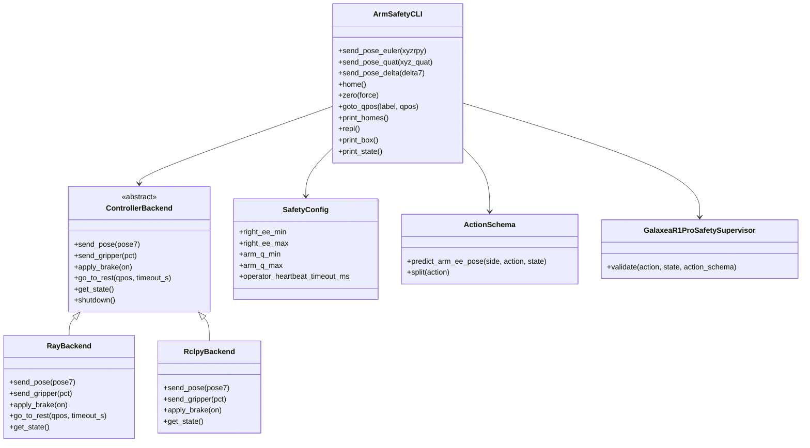
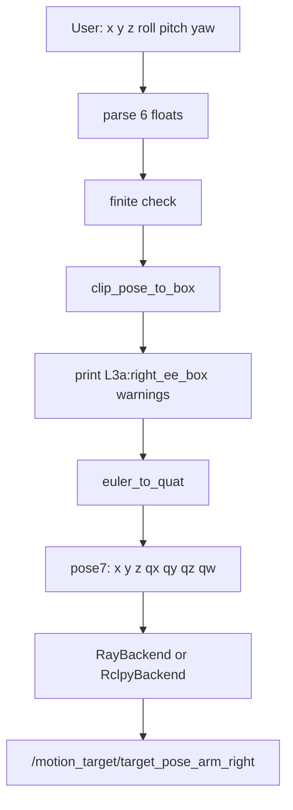
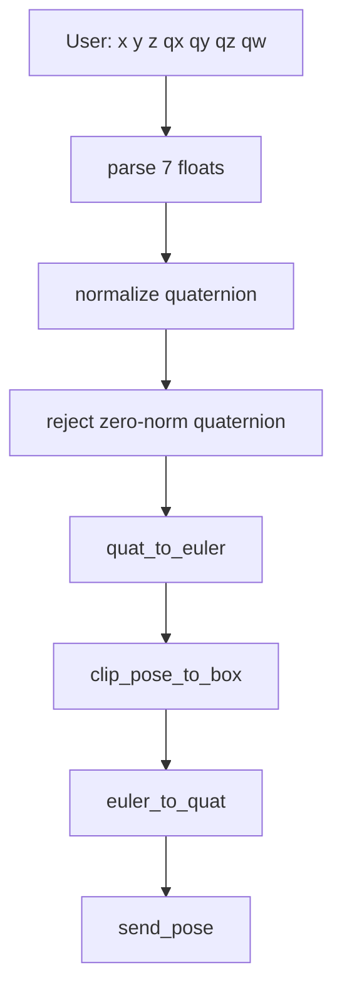
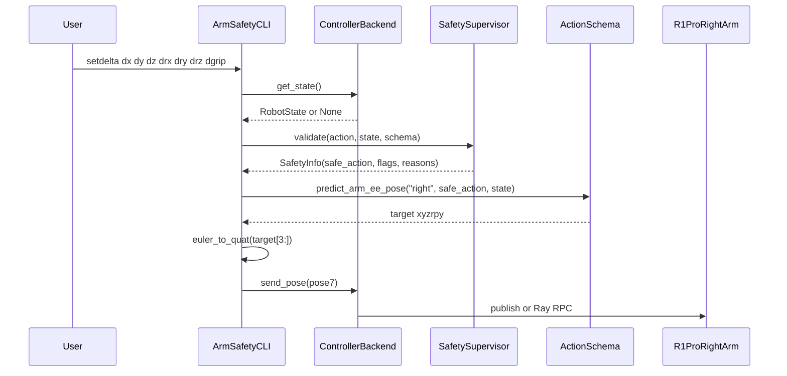
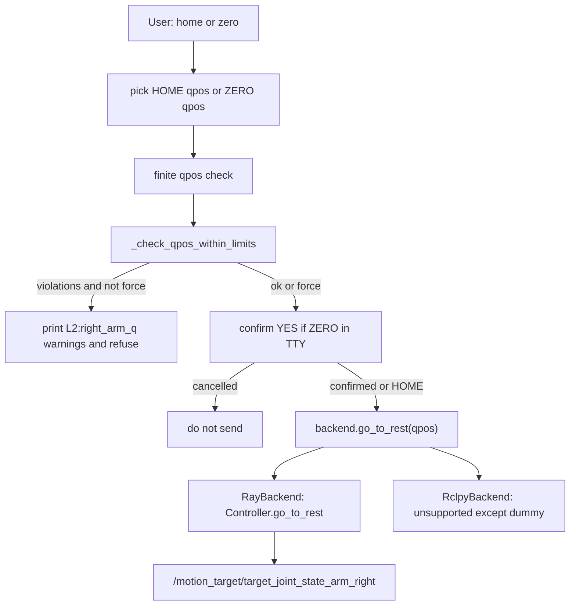
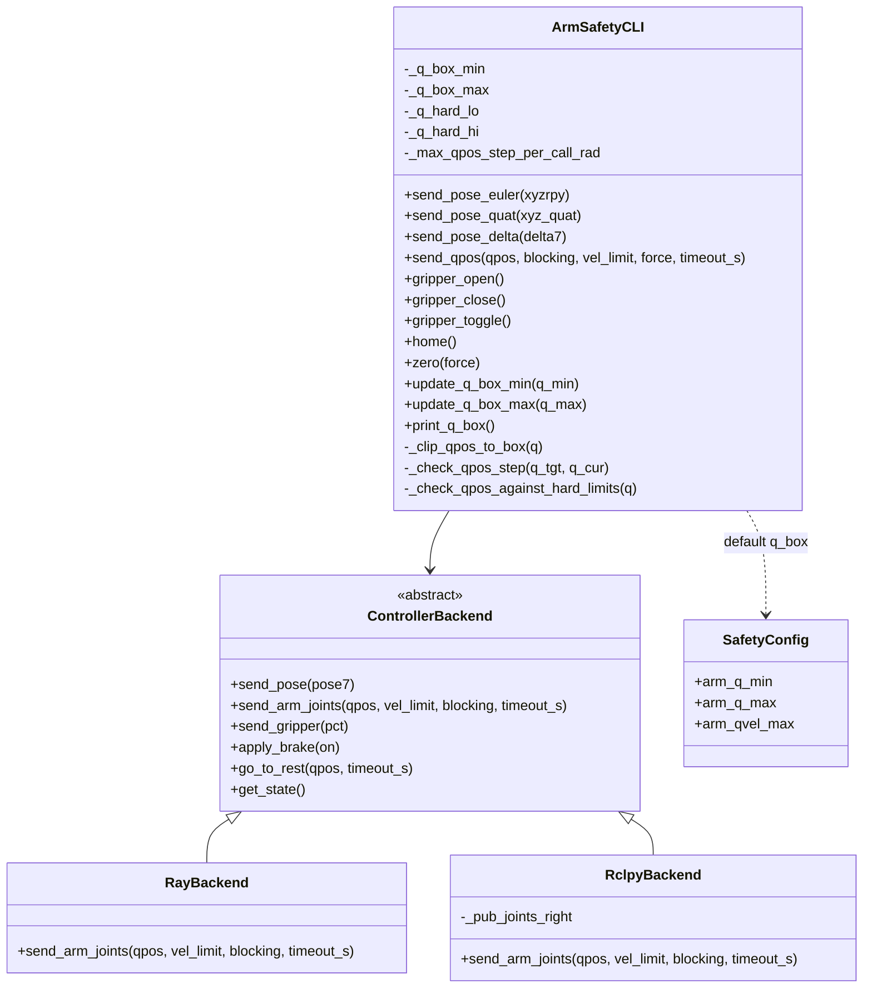
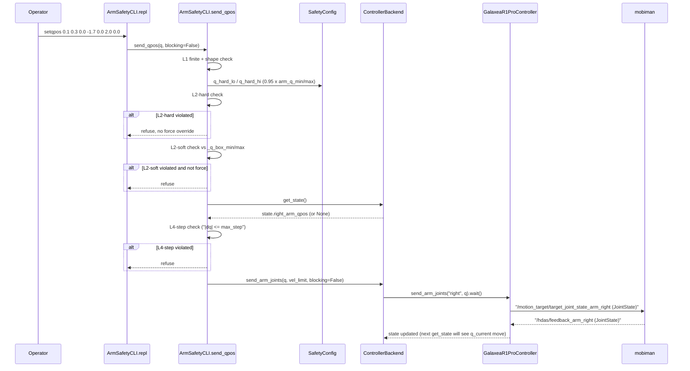
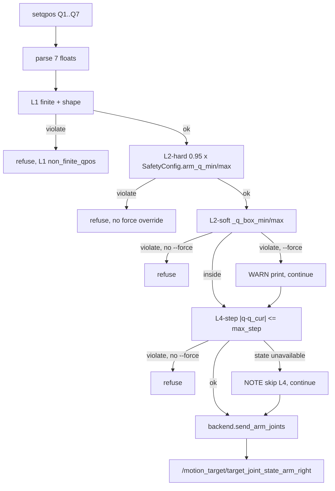

# 8.7 R1 Pro 右臂位姿 + 安全盒 CLI 工具的设计、实现与使用

> 本节记录 `toolkits/realworld_check/test_galaxea_r1_pro_controller.py` 的设计与实现。它把"命令行输入右臂末端位姿 → 安全盒裁剪 → 控制右臂运动"做成一个可直接用于 bring-up 的工具,用于连接 §8.3 的 S1/S2/S3 阶段和 §4.2 的 L3a TCP 安全盒设计。

#### 8.7.1 任务目标与落地文件

用户需求可以拆成 4 个工程目标:

| 目标 | 具体落地 |
|---|---|
| 命令行输入 R1 Pro 右臂末端位姿 | 支持 `--pose-euler`, `--pose-quat`, `--pose-delta` 单发模式,也支持 REPL 中的 `setpose`, `setposq`, `setdelta` |
| 控制右臂做运动 | Ray 后端复用 `GalaxeaR1ProController.send_arm_pose("right", pose7)`,rclpy 后端直接发布 `/motion_target/target_pose_arm_right` |
| 可以设置安全盒 | 支持 `--box-min`, `--box-max`,REPL 中支持 `setbox-min`, `setbox-max`;默认值来自 `SafetyConfig.right_ee_min/right_ee_max` |
| 超出安全盒时打印警告并停在盒边缘 | `clip_pose_to_box()` 逐轴 `np.clip`,打印 `L3a:right_ee_box ...` 风格警告,再把裁剪后的 pose 下发 |
| 命令行交互 Homing / Zeroing | 支持 `--home`, `--zero`, `--home-qpos`, `--zero-qpos`,REPL 中支持 `home`, `zero`, `set-home`, `set-zero`, `gethomes`;Home 与 Zero 是两个独立关节空间目标 |

代码文件:

| 文件 | 作用 |
|---|---|
| [`toolkits/realworld_check/test_galaxea_r1_pro_controller.py`](../../../toolkits/realworld_check/test_galaxea_r1_pro_controller.py) | CLI 主程序:参数解析、REPL、安全盒裁剪、Ray/rclpy 后端 |
| [`rlinf/envs/realworld/galaxear/r1_pro_safety.py`](../../../rlinf/envs/realworld/galaxear/r1_pro_safety.py) | `SafetyConfig` 默认安全盒和 delta 路径的完整 L1-L5 监督器 |
| [`rlinf/envs/realworld/galaxear/r1_pro_action_schema.py`](../../../rlinf/envs/realworld/galaxear/r1_pro_action_schema.py) | `ActionSchema.predict_arm_ee_pose()` 将归一化 delta 转为 EE target |
| [`rlinf/envs/realworld/galaxear/r1_pro_controller.py`](../../../rlinf/envs/realworld/galaxear/r1_pro_controller.py) | Ray 后端实际控制器;`send_arm_pose()` 发布 `PoseStamped` 到 mobiman |

工具放在 `toolkits/realworld_check/` 而不是 `examples/` 或 `rlinf/` 内部,原因是它更像真机联调脚本,与已有 `test_franka_controller.py` / `test_turtle2_controller.py` 属于同一类"人工 bring-up / sanity check"工具,不参与训练循环,也不引入新的公共 API。

#### 8.7.2 设计取舍

**取舍 1:同时支持 Ray 后端与纯 rclpy 后端。**

| 后端 | 适用场景 | 优点 | 限制 |
|---|---|---|---|
| `--backend ray` | RLinf 标准真机部署、Orin/GPU server 通过 Ray 连接 | 复用 `GalaxeaR1ProController`;可调用 `get_state`, `go_to_rest`, `send_gripper`, `apply_brake`;行为与训练路径一致 | 需要 Ray 集群已启动;依赖 RLinf scheduler |
| `--backend rclpy` | 在 Orin 上轻量验证 mobiman topic、无需 Ray | 只需 ROS2 环境;直接发布 `/motion_target/target_pose_arm_right` | 不订阅反馈;`getpos/getstate/home` 能力有限 |

这样设计是为了覆盖两个 bring-up 阶段:

1. **最小 ROS2 验证**:只想确认 mobiman 是否接收右臂 pose target,用 `--backend rclpy`。
2. **RLinf 集成验证**:想验证 Ray worker、controller RPC、状态回读和 gripper/brake,用 `--backend ray`。

**取舍 2:绝对位姿输入走轻量裁剪,归一化 delta 输入走完整监督器。**

绝对位姿(`pose-euler` / `pose-quat`)本身已经是目标 EE pose,不需要经过 `ActionSchema.predict_arm_ee_pose()` 的"当前 EE + delta × scale"预测。它只需要做:

```
target_xyzrpy → clip_pose_to_box() → euler_to_quat() → send_pose(pose7)
```

归一化 delta(`pose-delta` / `setdelta`)则模拟 `GalaxeaR1ProEnv.step()` 的策略输出路径,必须复用完整安全监督器:

```
delta7 → SafetySupervisor.validate(action, state, schema)
       → safe_action
       → ActionSchema.predict_arm_ee_pose()
       → euler_to_quat()
       → send_pose(pose7)
```

这让同一个工具既能服务"人工输入绝对目标点",也能服务"用 CLI 模拟 policy action"的调试需求。

**取舍 3:警告标签与生产 L3a 保持一致。**

`clip_pose_to_box()` 输出的 warning 前缀固定为 `L3a:right_ee_box`,与 `r1_pro_safety.py` 中 `_clip_to_box(..., "L3a:right_ee_box", info)` 一致。这样 operator 看到 CLI 输出时,能直接和训练日志中的 `safety_reasons` 对齐。

**取舍 4:CLI 内部禁用心跳超时。**

`ArmSafetyCLI._build_supervisor()` 在 delta 路径中把 `operator_heartbeat_timeout_ms` 设为 `999_999.0`,对应 §9.4 的临时方案 A。原因是 REPL 中 operator 可能停下来思考或输入命令,如果沿用默认 1500ms,几乎每次 `setdelta` 都会被 L5e `soft_hold` 截断,影响 bring-up。

**取舍 5:Home Position 与 Zero Position 明确分离。**

新增的关节空间命令不再把"回到默认 reset qpos"和"关节零点"混为一谈:

| 概念 | 默认 qpos(右臂 7 维,rad) | 用途 |
|---|---|---|
| Home Position | `[0.0, 0.3, 0.0, -1.8, 0.0, 2.1, 0.0]` | 操作员定义的安全就绪/收纳姿态,与 `GalaxeaR1ProRobotConfig.joint_reset_qpos_right` 保持一致 |
| Zero Position | `[0.0, 0.0, 0.0, 0.0, 0.0, 0.0, 0.0]` | 关节空间原点,主要用于校准、坐标系与运动学验证 |

两者默认**不相同**。Zero 看似简单,但对默认 `SafetyConfig.arm_q_min/arm_q_max` 而言,J4 的 `q_max=0.0`,所以 `q4=0.0` 正好位于上限边界。CLI 因此采用**严格内区间** L2 检查(`q_min < q < q_max`),默认会拒绝 Zero,除非 operator 显式使用 `--zero-skip-joint-check` 或 REPL 中的 `zero --force`。这样做的目的不是禁止 Zero,而是让操作员明确确认"这是一个标定/校准动作,不是普通安全回零"。

#### 8.7.3 模块结构与 UML



组件职责:

| 组件 | 职责 | 不负责 |
|---|---|---|
| `clip_pose_to_box()` | 对绝对 `[x,y,z,roll,pitch,yaw]` 做逐轴安全盒裁剪并生成 warning | 不做关节限位、不做碰撞检测、不订阅状态 |
| `ArmSafetyCLI` | 维护安全盒、解析输入、选择路径、调用后端、REPL、Home/Zero qpos 与 L2 检查 | 不直接操作 ROS2 topic/Ray RPC 细节 |
| `ControllerBackend` | 定义后端抽象接口 | 不实现具体通信 |
| `RayBackend` | 包装 `GalaxeaR1ProController.launch_controller()` 和 `.wait()` RPC | 不重写 controller 的 ROS2 publisher |
| `RclpyBackend` | 直接创建 ROS2 publisher 并发布 pose/gripper/brake | 不订阅 feedback,不等待 joint reset 收敛 |
| `GalaxeaR1ProSafetySupervisor` | delta 路径完整 L1-L5 安全管线 | 不处理绝对 pose 输入 |

#### 8.7.4 数据流

##### 绝对欧拉位姿路径(`--pose-euler` / `setpose`)



该路径最直接,适合人工指定绝对目标点。例如:

```bash
python toolkits/realworld_check/test_galaxea_r1_pro_controller.py \
  --backend rclpy \
  --pose-euler 0.80 0.0 0.30 -3.14 0.0 0.0
```

如果 `x=0.80` 超过默认 `right_ee_max[0]=0.65`,输出:

```text
[WARN]  L3a:right_ee_box x=+0.8000 -> +0.6500 (clipped to max face)
[INFO]  Sent pose7 = [...]
```

真正下发的是 `x=0.65` 的边界 pose,不是用户输入的 `0.80`。

##### 四元数位姿路径(`--pose-quat` / `setposq`)



四元数输入最终仍会转换到欧拉角裁剪,因为安全盒的姿态边界定义就是 `[roll,pitch,yaw]`:

```python
right_ee_min = [x_min, y_min, z_min, roll_min, pitch_min, yaw_min]
right_ee_max = [x_max, y_max, z_max, roll_max, pitch_max, yaw_max]
```

实现中会先把用户输入四元数归一化,避免轻微非单位输入导致 `scipy Rotation` 报错或产生不可预期姿态;若四元数范数接近 0,直接拒绝下发。

##### 归一化 delta 路径(`--pose-delta` / `setdelta`)



这条路径与 `GalaxeaR1ProEnv.step()` 最接近。它不仅做 L3a,还会经过 L1、L4、L5 等检查:

| 层级 | CLI delta 路径表现 |
|---|---|
| L1 | NaN/Inf → `emergency_stop`,拒绝下发并 `apply_brake(True)` |
| L3a | 预测 EE target 后裁剪到安全盒,再改写 `safe_action` |
| L4 | 步长过大时继续裁剪,打印 `L4:per_step_cap` |
| L5 | 如果 state 中有 BMS/SWD/stale/status 信息,会按生产逻辑触发 safe_stop/soft_hold/emergency_stop |

注意:当使用 `--backend rclpy` 或 `--dummy` 时,后端没有真实 `get_state()`,CLI 会用默认 `GalaxeaR1ProRobotState()` 作为 state,因此预测是从原点出发的"origin-anchored"行为。这适合离线验证 L1/L3a/L4 逻辑,不适合作为真机精确 delta 控制。真机 delta bring-up 推荐使用 `--backend ray`,并先修复/确认 §9.11 的 EE pose 订阅。

##### 关节空间 Home / Zero 路径(`--home`, `--zero`, `home`, `zero`)



该路径不走 TCP 安全盒,因为 Home/Zero 是**关节空间目标**而不是 EE pose target。CLI 在发送前做一层轻量 L2 sanity check:

```
SafetyConfig.arm_q_min < qpos < SafetyConfig.arm_q_max
```

这里有意使用严格不等号。原因是关节目标若正好贴在软限位边界,控制器跟踪误差或过冲会把机械臂推到限位之外。因此默认 Zero Position(`[0,0,0,0,0,0,0]`)会因为 J4 等于 `q_max[3]=0.0` 而被拒绝:

```text
[WARN]  L2:right_arm_q J4=+0.0000 not strictly inside (-3.0000,+0.0000)
[ERROR] ZERO qpos violates SafetyConfig joint limits; refusing to send.
```

如果现场确认 Zero 是硬件/SDK 规定的标定动作,可以显式 override:

```bash
python toolkits/realworld_check/test_galaxea_r1_pro_controller.py \
  --backend ray \
  --zero --zero-skip-joint-check
```

或 REPL:

```text
r1pro> zero --force
Confirm move to ZERO? Type 'YES' to proceed: YES
```

#### 8.7.5 核心代码说明

##### `clip_pose_to_box()`:绝对 pose 的 L3a 裁剪

核心逻辑:

```python
target = np.asarray(target_xyzrpy, dtype=np.float32).reshape(-1)[:6]
lo = np.asarray(box_min, dtype=np.float32).reshape(-1)[:6]
hi = np.asarray(box_max, dtype=np.float32).reshape(-1)[:6]
clipped = np.clip(target, lo, hi)
```

然后逐轴比较 `target[i]` 与 `clipped[i]`,如果发生变化,构造类似:

```text
L3a:right_ee_box x=+0.8000 -> +0.6500 (clipped to max face)
```

这个函数只处理绝对 pose。它的数学语义是:

```
target_xyzrpy = 用户输入的绝对目标
safe_xyzrpy   = clip(target_xyzrpy, box_min, box_max)
```

与生产监督器中的 L3a 相比:

| 维度 | `clip_pose_to_box()` | `GalaxeaR1ProSafetySupervisor` L3a |
|---|---|---|
| 输入 | 绝对 `xyzrpy` | 归一化 action delta |
| 是否需要当前 EE | 不需要 | 需要 `state.get_ee_pose()` |
| 是否改写 action | 不涉及 action | 会调用 `_rewrite_arm_action()` |
| 适用场景 | 人工输入目标位姿 | 训练/策略输出 action |

##### `ControllerBackend`:隔离控制器后端差异

CLI 主流程只认识一个抽象接口:

```python
class ControllerBackend:
    def send_pose(self, pose7: np.ndarray) -> None: ...
    def send_gripper(self, pct: float) -> None: ...
    def apply_brake(self, on: bool) -> None: ...
    def go_to_rest(self, qpos: list[float], timeout_s: float = 5.0) -> bool: ...
    def get_state(self) -> Optional[GalaxeaR1ProRobotState]: ...
```

好处是安全盒逻辑和输入解析完全不关心底层到底是 Ray RPC 还是 ROS2 publisher。未来如果要加第三种后端(例如直接调用 Galaxea SDK),只需实现同样接口。

##### `RayBackend`:复用 RLinf 生产 controller

`RayBackend` 调用:

```python
GalaxeaR1ProController.launch_controller(
    node_rank=node_rank,
    ros_domain_id=ros_domain_id,
    use_left_arm=False,
    use_right_arm=True,
    mobiman_launch_mode="pose",
    is_dummy=is_dummy,
)
```

然后所有动作都变成同步 RPC:

```python
self._handle.send_arm_pose("right", pose7).wait()
self._handle.send_gripper("right", pct).wait()
self._handle.apply_brake(on).wait()
self._handle.get_state().wait()[0]
```

这与 `toolkits/realworld_check/test_franka_controller.py` 的风格一致,适合验证"CLI → Ray worker → Controller → ROS2 topic → mobiman"整条链路。

##### `RclpyBackend`:无 Ray 的最小 publisher

`RclpyBackend` 只创建 3 个 publisher:

| Publisher | Topic | 消息类型 | 用途 |
|---|---|---|---|
| `_pub_pose` | `/motion_target/target_pose_arm_right` | `geometry_msgs/PoseStamped` | 右臂 EE pose target |
| `_pub_grip` | `/motion_target/target_position_gripper_right` | `sensor_msgs/JointState` | 右夹爪位置百分比 |
| `_pub_brake` | `/motion_target/brake_mode` | `std_msgs/Bool` | brake on/off |

它与 `r1_pro_controller.py` 的 `send_arm_pose()` 保持同一 frame:

```python
msg.header.frame_id = "torso_link4"
```

这保证 CLI 的安全盒坐标系与 §2.1 / §4.2 的假设一致。

##### `send_pose_delta()`:复用完整 L1-L5 的路径

`send_pose_delta()` 的关键步骤:

1. 把用户输入解析为 7D action。
2. 从后端读取 `RobotState`;如果没有,使用默认 state 并打印提示。
3. 调用 `self._supervisor.validate(a, state, self._schema)`。
4. 打印 `info.reason` 中的所有 L1-L5 reason。
5. 如果 `emergency_stop` / `safe_stop` / `soft_hold`,拒绝下发。
6. 否则用 `ActionSchema.predict_arm_ee_pose("right", info.safe_action, state)` 得到最终 EE target。
7. 欧拉角转四元数,发送 `pose7`。

这条路径的价值是验证"策略 action 到安全目标 pose"的真实行为,尤其适合重现实训过程中某个 action 为什么被 L3a/L4 截断。

##### `goto_qpos()`, `home()`, `zero()`:关节空间 Home / Zero 路径

Home/Zero 相关逻辑集中在 `ArmSafetyCLI` 内部:

```python
def _check_qpos_within_limits(self, qpos) -> List[str]:
    q = np.asarray(qpos, dtype=np.float32).reshape(-1)[:7]
    for i in range(7):
        qi = float(q[i])
        lo = float(self._joint_q_min[i])
        hi = float(self._joint_q_max[i])
        if qi <= lo or qi >= hi:
            violations.append(
                f"L2:right_arm_q J{i + 1}={qi:+.4f} not strictly "
                f"inside ({lo:+.4f},{hi:+.4f})"
            )
```

几点需要注意:

- `q.size != 7` 或含 NaN/Inf 时立即拒绝,输出 `L1:non_finite_qpos` 或长度错误。
- L2 检查使用 `SafetyConfig.arm_q_min/arm_q_max`,与安全系统里定义的 A2 关节边界保持一致。
- 检查采用严格内区间,因此贴边目标也会 warning。
- `goto_qpos()` 是 `home()` 与 `zero()` 的公共路径,最终调用 `backend.go_to_rest(qpos, timeout_s=5.0)`。
- `zero()` 默认 `require_confirm=True`,在交互式 TTY 中要求用户输入 `YES`;`home()` 不要求确认,沿用原来的快速归位行为。

默认常量:

```python
_DEFAULT_HOME_QPOS = (0.0, 0.3, 0.0, -1.8, 0.0, 2.1, 0.0)
_DEFAULT_ZERO_QPOS = (0.0, 0.0, 0.0, 0.0, 0.0, 0.0, 0.0)
_DEFAULT_JOINT_RESET_QPOS = _DEFAULT_HOME_QPOS  # deprecated alias
```

为了兼容已有脚本,旧参数 `--joint-reset-qpos` 仍保留,但现在作为 `--home-qpos` 的 deprecated alias。用户传入时会打印:

```text
[DEPR]  --joint-reset-qpos is deprecated; use --home-qpos.
```

##### `repl()`:人工 bring-up 控制台

REPL 使用 `shlex.split()` 做分词,因此支持空格分隔的命令,也能自然处理 Ctrl+C / EOF。常用命令:

```text
setpose  x y z roll pitch yaw
setposq  x y z qx qy qz qw
setdelta dx dy dz drx dry drz dgrip
getbox
setbox-min x y z [roll pitch yaw]
setbox-max x y z [roll pitch yaw]
getpos
getstate
home
zero [--force]
set-home q1 q2 q3 q4 q5 q6 q7
set-zero q1 q2 q3 q4 q5 q6 q7
gethomes
brake on|off
gripper pct
q
```

`home` 默认使用 `GalaxeaR1ProRobotConfig.joint_reset_qpos_right` 的同一组关节;`zero` 默认使用全 0 关节原点:

```python
HOME = [0.0, 0.3, 0.0, -1.8, 0.0, 2.1, 0.0]
ZERO = [0.0, 0.0, 0.0, 0.0, 0.0, 0.0, 0.0]
```

Home 与 Zero 可在启动时分别覆盖:

```bash
python toolkits/realworld_check/test_galaxea_r1_pro_controller.py \
  --backend ray \
  --home-qpos 0.0 0.3 0.0 -1.8 0.0 2.1 0.0 \
  --zero-qpos -0.05 0.05 -0.05 -0.05 0.05 0.5 -0.05
```

#### 8.7.6 使用场景

##### 场景 A:离线验证安全盒裁剪(dummy)

适合在没有 ROS2/Ray/机器人时确认 CLI 解析和 L3a warning:

```bash
python toolkits/realworld_check/test_galaxea_r1_pro_controller.py \
  --backend rclpy --dummy \
  --pose-euler 0.80 0.0 0.30 -3.14 0.0 0.0
```

预期:

```text
[INFO]  Backend: rclpy (dummy)
[WARN]  L3a:right_ee_box x=+0.8000 -> +0.6500 (clipped to max face)
[INFO]  Sent pose7 = [...]
```

这里不会真正发 ROS2 topic,但可以验证:

- 安全盒默认值是否生效
- 超界 warning 是否可读
- 欧拉角是否能转为四元数
- 单发模式是否能正常退出

##### 场景 B:Orin 上纯 rclpy 直发

适合先验证 mobiman 是否能吃到目标 pose:

```bash
source /opt/ros/humble/setup.bash
export ROS_DOMAIN_ID=72
python toolkits/realworld_check/test_galaxea_r1_pro_controller.py \
  --backend rclpy \
  --box-min 0.25 -0.25 0.10 \
  --box-max 0.55  0.25 0.55
```

进入 REPL 后:

```text
r1pro> setpose 0.40 -0.10 0.30 -3.14 0.0 0.0
r1pro> setpose 0.60 -0.10 0.30 -3.14 0.0 0.0
r1pro> gripper 50
r1pro> brake on
r1pro> brake off
```

注意:`rclpy` 后端不订阅反馈,所以 `getpos` / `getstate` 会提示 N/A。这不是错误,而是轻量后端的设计边界。

##### 场景 C:RLinf / Ray 集成验证

适合在 RLinf 的真机部署链路上验证 controller worker:

```bash
ray start --head --port=6379
export ROS_DOMAIN_ID=72
python toolkits/realworld_check/test_galaxea_r1_pro_controller.py \
  --backend ray --node-rank 0 \
  --box-min 0.25 -0.25 0.10 \
  --box-max 0.55  0.25 0.55
```

可验证:

- `GalaxeaR1ProController.launch_controller()` 是否能启动
- Ray RPC 是否可用
- `get_state()` 是否能返回 BMS/SWD/feedback_age
- `send_arm_pose()` 是否能发布到 `/motion_target/target_pose_arm_right`
- `home` 是否能通过 joint tracker 回到安全姿态

单发 Homing:

```bash
python toolkits/realworld_check/test_galaxea_r1_pro_controller.py \
  --backend ray --home
```

单发 Zeroing(默认会先做 L2 检查,若默认 Zero 正好贴在关节边界会拒绝):

```bash
python toolkits/realworld_check/test_galaxea_r1_pro_controller.py \
  --backend ray --zero
```

强制 Zeroing(仅在现场确认物理空间安全、SDK/机械臂确实允许 Zero 姿态时使用):

```bash
python toolkits/realworld_check/test_galaxea_r1_pro_controller.py \
  --backend ray --zero --zero-skip-joint-check
```

REPL 中查看和修改 Home/Zero:

```text
r1pro> gethomes
r1pro> home
r1pro> zero
r1pro> zero --force
r1pro> set-home 0.0 0.3 0.0 -1.8 0.0 2.1 0.0
r1pro> set-zero -0.05 0.05 -0.05 -0.05 0.05 0.5 -0.05
```

##### 场景 D:用 delta 模拟策略输出

```bash
python toolkits/realworld_check/test_galaxea_r1_pro_controller.py \
  --backend ray \
  --pose-delta 1.0 0.0 0.0 0.0 0.0 0.0 0.0
```

或 REPL:

```text
r1pro> setdelta 0.1 0.0 0.0 0.0 0.0 0.0 0.0
```

这条路径会打印完整安全 reason,例如:

```text
[INFO]  L3a:right_ee_box
[INFO]  L4:per_step_cap
[INFO]  Sent pose7 = [...]
```

如果出现 `[ERROR] L1:non_finite_action` 或 `[EMERG] apply_brake(True)`,说明 action 已触发紧急停止逻辑,不会下发 pose。

##### 场景 E:现场逐步放宽安全盒

建议从保守盒开始:

```bash
--box-min 0.25 -0.25 0.10
--box-max 0.55  0.25 0.55
```

REPL 中逐步调整:

```text
r1pro> getbox
r1pro> setbox-max 0.58 0.25 0.55
r1pro> setpose 0.57 -0.10 0.30 -3.14 0.0 0.0
r1pro> setpose 0.60 -0.10 0.30 -3.14 0.0 0.0
```

当 `setpose 0.60 ...` 触发:

```text
[WARN]  L3a:right_ee_box x=+0.6000 -> +0.5800 (clipped to max face)
```

说明当前安全盒正在保护前向边界。现场调参时应观察机器人实际位置、桌面/夹具距离和 operator 安全距离,不要只根据软件 warning 放宽。

#### 8.7.7 故障排查

| 现象 | 可能原因 | 排查 / 处理 |
|---|---|---|
| `GalaxeaR1ProController.launch_controller failed` | Ray 未启动或 node_rank 不匹配 | 先运行 `ray start --head --port=6379`;单机 Orin 用 `--node-rank 0`;两节点部署按 §6.3/Ray 配置 |
| `rclpy import failed` | 未 source ROS2 环境 | `source /opt/ros/humble/setup.bash`;确认 `python -c "import rclpy"` 可执行 |
| `getpos` 显示 N/A 或 EE pose 为全 0 | rclpy 后端没有反馈;或 §9.11 的 EE pose 订阅尚未实现 | 用 `--backend ray` 获取更多状态;在 controller 中补 `/motion_control/pose_ee_arm_right` 订阅 |
| 频繁 `L3a:right_ee_box` | 安全盒太紧、坐标系错误、输入目标超界 | 先 `getbox`;确认 `torso_link4` frame;用小步 `setpose` 逐轴验证 |
| `box_min must be strictly less than box_max` | `--box-min/--box-max` 或 REPL `setbox-*` 配置反了 | 检查 6 个轴,尤其是只输入 xyz 时 rpy 会继承默认值 |
| `L1:non_finite_action` | 输入含 `nan` / `inf` | 检查命令行参数、上游脚本格式化输出 |
| `quaternion has zero norm` | `setposq` 输入了 `[0,0,0,0]` 姿态 | 使用单位四元数,例如 identity 为 `0 0 0 1` |
| delta 模式输出"origin-anchored"提示 | 后端没有真实 `get_state()` | rclpy/dummy 模式预期如此;真机 delta 控制用 Ray 后端并确认 EE pose 订阅 |
| `home` 显示 `TIMEOUT/UNSUPPORTED` | rclpy 后端不支持 joint reset,或 Ray 后端未收敛 | rclpy 下改用 `setpose` 控制;Ray 下检查 joint feedback 与 mobiman joint tracker |
| `zero` 显示 `L2:right_arm_q ... refusing to send` | Zero qpos 位于或超出 `SafetyConfig.arm_q_min/arm_q_max`;默认全 0 会贴到 J4 上限 | 优先使用安全的自定义 `--zero-qpos`;确认为标定动作时才用 `--zero-skip-joint-check` 或 `zero --force` |
| `zero` 等待 `YES` | 交互式 TTY 下的二次确认机制 | 输入 `YES` 才会继续;其它输入会取消;非 TTY 单发模式不提示 |
| `--joint-reset-qpos` 输出 `[DEPR]` | 旧参数现在是 `--home-qpos` 的兼容别名 | 后续脚本改用 `--home-qpos`;当前仍会按 Home Position 执行 |
| 机器人没有动但 CLI 显示 Sent | mobiman 未运行、ROS_DOMAIN_ID 不一致、topic 无订阅者、brake on | `ros2 topic list`;`ros2 topic echo /motion_target/target_pose_arm_right`;检查 `ROS_DOMAIN_ID`;执行 `brake off` |

建议现场调试顺序:

```bash
# 1. ROS2 topic 是否存在
ros2 topic list | grep motion_target

# 2. 观察 CLI 是否在发布目标
ros2 topic echo /motion_target/target_pose_arm_right --once

# 3. 观察 HDAS feedback 是否新鲜
ros2 topic hz /hdas/feedback_arm_right

# 4. 用 dummy 验证安全盒逻辑
python toolkits/realworld_check/test_galaxea_r1_pro_controller.py \
  --backend rclpy --dummy \
  --pose-euler 0.80 0.0 0.30 -3.14 0.0 0.0
```

#### 8.7.8 安全边界与后续改进

这个 CLI 是**右臂 bring-up 工具**,不是完整安全系统的替代品。它的安全边界如下:

| 能保证 | 不能保证 |
|---|---|
| 绝对 pose 输入不会超过配置的 TCP 安全盒 | 关节一定不越限(L2 仍未实现,见 §9.1) |
| delta 输入可复用 L1-L5 supervisor | rclpy 后端不具备反馈 watchdog 能力 |
| Home/Zero 在下发前做 L2 关节空间 sanity check | L2 检查只是静态 qpos 边界,不等价于 IK/碰撞/轨迹规划 |
| 越界时打印清晰 `L3a:right_ee_box` warning | 无 LiDAR / 外部避障(见 §9.7) |
| `safe_stop/emergency_stop` 时拒绝下发并尝试 brake | 不能替代硬件急停和现场 operator |
| Ray 后端可复用 controller 的状态回读 | EE pose 来源仍依赖 §9.11 修复 |

后续建议:

1. **补 EE pose 订阅后更新 `getpos` 文档**:一旦 `r1_pro_controller.py` 增加 `/motion_control/pose_ee_arm_right` 订阅,CLI 的 `getpos` 和 delta 路径会更可信。
2. **增加 `--dry-run`**:目前 `--dummy` 是不发布;如果将来希望连接真机但只打印将要发布的 pose,可加 dry-run 模式。
3. **增加路径插值**:当前每次命令是单个 target。若要从 A 平滑移动到 B,应按固定 step 频率插值,每步都过 `clip_pose_to_box()` 或 `SafetySupervisor.validate()`。
4. **为 Home/Zero 加轨迹级安全检查**:当前只检查目标 qpos 是否在静态限位内,未检查从当前姿态到目标姿态的中间路径是否碰撞或越限。
5. **把 CLI 输出接入 JSONL**:若要作为正式安全审计工具,可复用 §9.3 的事件报告建议,记录每次裁剪、safe_stop、emergency_stop、home/zero 操作。
6. **补单元测试**:当前关键数学行为已有 §8.6 的 L3a 单测覆盖;CLI 自身仍可增加 parser / backend dummy 的轻量单测,避免未来 flag 或 warning 文案漂移。

---

# A. 只运行REPL 命令行交互模式的最小依赖集

## A.1 依赖链分析(以 --backend rclpy --dummy 的 REPL 为例)

脚本 import rlinf.envs.realworld.galaxear.r1_pro_* 这一行就会强制触发以下传染:
```
test_galaxea_r1_pro_controller.py
  ├─ numpy
  ├─ scipy.spatial.transform.Rotation
  └─ from rlinf.envs.realworld.galaxear.r1_pro_action_schema import ActionSchema
       │
       ├─[1] rlinf/__init__.py  → utils/omega_resolver.py
       │       ├─ import torch                      ← torch
       │       └─ from omegaconf import OmegaConf   ← omegaconf
       │
       └─[2] rlinf/envs/realworld/__init__.py
              │
              ├─ from .franka import FrankaEnv     → franka_env.py
              │       ├─ import cv2                ← opencv-python
              │       ├─ import gymnasium          ← gymnasium
              │       └─ from rlinf.scheduler import …  → channel.py:19
              │              └─ import ray         ← ray
              │
              ├─ from .galaxear import tasks       → 触发 tasks/__init__.py
              │       └─ from gymnasium.envs.registration import register
              │
              ├─ from .realworld_env import RealWorldEnv
              │       ├─ import torch, psutil, filelock, omegaconf  ← psutil, filelock
              │       └─ RealWorldEnv.realworld_setup()  (执行 OS 文件锁)
              │
              └─ from .xsquare import Turtle2Env   → turtle2_env.py
                       └─ import cv2, gymnasium, ray (重复)
```

## A.2 依赖写入 requirements.tstr1ctrl.txt

新增文件 `toolkits/realworld_check/requirements.tstr1ctrl.txt`(63 行,含完整注释),内容分两部分:

**1. 注释头(说明覆盖范围 / 不覆盖范围 / 为什么需要这些依赖 / 安装方法)**

**2. 9 个 pip 包,按"为什么需要它"分组**:

| 分组 | 包 | 触发原因 |
|---|---|---|
| 直接 import | `numpy`, `scipy` | 脚本顶部 `import numpy / scipy.spatial.transform.Rotation` |
| `rlinf/__init__.py` 副作用 | `torch`, `omegaconf` | `omega_resolver.py:15-16` 顶层 import |
| `franka_env.py` + `turtle2_env.py` 传染 | `opencv-python`, `gymnasium` | 两个 env 都顶层 `import cv2`, `import gymnasium` |
| `rlinf.scheduler.channel.channel` 传染 | `ray` | `channel.py:19` 顶层 `import ray` |
| `realworld_env.py` 顶层 + `realworld_setup()` 副作用 | `psutil`, `filelock` | 顶层 `import psutil`, `from filelock import FileLock` |

**3. ROS 2 系统包通过注释说明用 `apt install ros-humble-rclpy …` 安装**(因 `rclpy` / `geometry_msgs` 等不能 pip 安装),只在 `--backend rclpy` 真机模式下需要。

### 关键诚实声明

文档里我**坦白说**了:即便用户的目的只是"跑 dummy REPL",也必须装 `torch / ray / omegaconf / cv2`,这是 **rlinf 包架构强制**的——`rlinf/__init__.py` 与 `rlinf/envs/realworld/__init__.py` 是无条件 import 链。要绕过这一点必须改生产代码(把 omega_resolver 的 torch import 延后,把 franka/turtle2 的强 import 改成 lazy),不在本任务范围内。

### 使用方式

```bash
# 一行装齐
pip install -r toolkits/realworld_check/requirements.tstr1ctrl.txt

# 验证 REPL(dummy + rclpy 后端,纯本地不连机器人)
python toolkits/realworld_check/test_galaxea_r1_pro_controller.py \
    --backend rclpy --dummy
```

REPL 启动后 `home`、`zero`、`set-home`、`gethomes`、`setpose`、`setbox-min` 等所有交互命令都会工作。`zero` 会因为默认 J4=0 触发 L2 拒绝(预期行为),改用 `zero --force` 即可。


现在给一个完整的真机 REPL 操作示例。以推荐的 **`--backend ray` 真机模式**为例(双节点:GPU server + Orin):

## A.3 req.txt 用于真机 REPL

### A.3.1 "真机 REPL"和"dummy REPL"在 requirements.tstr1ctrl.txt 里的差异

toolkits/realworld_check/requirements.tstr1ctrl.txt 的 pip 部分对真机 REPL 已经够用——不需要额外的 pip 包。但系统级还要加装两类东西:

| 必需(任何真机模式都要)	|来源	|说明|
|---|---|---|
| rclpy、geometry_msgs、sensor_msgs、std_msgs| apt install ros-humble-* 或 RoboStack mamba| ROS 2 的 Python 绑定与三个标准消息类型,不能 pip 安装|
| 工作中的 mobiman + CAN 总线| Galaxea SDK + ~/can.sh| 否则 controller 发出去的 PoseStamped 没人订阅|

| 可选(决定 REPL 能用多少功能)	|用途
|---|---|
| hdas_msg(Galaxea 自定义消息包) | 启用 L5 watchdog(BMS、SWD、错误码);没装会 graceful fallback 到只跑 L1-L4 几何安全
| Ray 集群已起 | 仅当用 --backend ray 时需要 ray start --head
| Galaxea SDK install/ 路径 | RayBackend 内部 galaxea_install_path 默认 ~/galaxea/install,如果路径不同需要改环境
让我把上面的内容写进 requirements.tstr1ctrl.txt,让真机用户一步看清。

### A.3.2 REPL 通过Ray 连真机

**前置条件清单**

| 节点 | 需要做的事 |
|---|---|
| GPU server(运行 CLI) | `pip install -r toolkits/realworld_check/requirements.tstr1ctrl.txt` |
| Orin(连机器人) | `apt install ros-humble-rclpy ros-humble-{geometry,sensor,std}-msgs`;`source /opt/ros/humble/setup.bash`;CAN 起好;mobiman 已 launch;ROS_DOMAIN_ID 与 GPU server 一致 |
| 双节点 | 同一 ROS_DOMAIN_ID;`ROS_LOCALHOST_ONLY=0`;Ray 集群已 head + worker 起好 |

#### A.3.2.一、Orin 端(机器人端)启动序列

```bash
# 1. ROS 2 + Galaxea SDK 环境
source /opt/ros/humble/setup.bash
source ~/galaxea/install/setup.bash    # 如装了 hdas_msg
export ROS_DOMAIN_ID=72
export ROS_LOCALHOST_ONLY=0

# 2. CAN 总线起来
bash ~/can.sh
ip link show can0    # 必须看到 state UP

# 3. mobiman / Galaxea controller 起来(Galaxea 自带 launch 文件)
ros2 launch galaxea_bringup r1_pro.launch.py    # 示例,具体名称按 SDK

# 4. 单节点 Form B(controller 与 EnvWorker 同节点)用 head:
ray start --head --port=6379 --node-ip-address=<orin_ip>

# 5. 验证 mobiman 在订阅目标 topic
ros2 topic info /motion_target/target_pose_arm_right
# Subscription count: 应 >= 1
```

#### A.3.2.二、GPU server 端(运行 CLI)

```bash
# 0. 装 pip 依赖(只这一次)
pip install -r toolkits/realworld_check/requirements.tstr1ctrl.txt

# 1. 关键环境变量(必须与 Orin 一致)
export ROS_DOMAIN_ID=72

# 2. 加入 Ray 集群(如果是双节点)
ray start --address=<orin_ip>:6379

# 3. 进入 REPL — 用保守安全盒
python toolkits/realworld_check/test_galaxea_r1_pro_controller.py \
    --backend ray --node-rank 1 \
    --box-min 0.25 -0.25 0.10 \
    --box-max 0.55  0.25 0.55
```

`--node-rank 1` 是 Orin(双节点推荐部署);单机 Form B 用 `--node-rank 0`。

#### A.3.2.三、REPL 内的真机 bring-up 套路

启动后会先打印 box 默认值与 `[INFO] Backend: ray`,然后 30s 内等待 controller 报告 alive。等到提示符 `r1pro>` 出现时:

```text
r1pro> getstate                       # ← 看 BMS / SWD / feedback_age,验证机器人通信正常
  right_ee_pose       = [0.42, -0.10, 0.31, 0.0, 0.0, 0.0, 1.0]
  right_arm_qpos      = [0.01, 0.31, 0.0, -1.79, 0.0, 2.10, 0.0]
  bms_capital_pct     = 87.3
  controller.swd      = 0
  feedback_age_ms     = {'arm_right': 18.4, 'gripper_right': 22.1}
  is_alive            = True

r1pro> getbox                         # ← 确认安全盒
Safety box (torso_link4 frame):
  min = [+0.2500, -0.2500, +0.1000, -3.2000, -0.3000, -0.3000]
  max = [+0.5500, +0.2500, +0.5500, +3.2000, +0.3000, +0.3000]

r1pro> home                           # ← 关节空间 Homing
[INFO]  Target HOME qpos = [+0.0000, +0.3000, +0.0000, -1.8000, +0.0000, +2.1000, +0.0000]
  go_to_rest(HOME) -> OK              # ← 机器人物理回到 ready 姿态

r1pro> setpose 0.40 -0.10 0.30 -3.14 0.0 0.0    # ← 小步前移到指定 EE
[INFO]  Sent pose7 = [+0.4000, -0.1000, +0.3000, -1.0000, +0.0000, +0.0000, +0.0008]

r1pro> setpose 0.80 -0.10 0.30 -3.14 0.0 0.0    # ← 故意越界,验证 L3a 拦截
[WARN]  L3a:right_ee_box x=+0.8000 -> +0.5500 (clipped to max face)
[INFO]  Sent pose7 = [+0.5500, -0.1000, +0.3000, -1.0000, +0.0000, +0.0000, +0.0008]
                                       # ← 实际只送到 box max 边缘 0.55

r1pro> gripper 30                      # ← 夹爪 30%
  send_gripper(30.0)

r1pro> setdelta 0.5 0 0 0 0 0 0        # ← 模拟一步 policy action(走完整 L1-L5)
[INFO]  L3a:right_ee_box               # ← 监督器报告各层结论
[INFO]  Sent pose7 = [+0.5500, -0.1000, +0.3000, ...]

r1pro> brake on                        # ← 快速测试急停
  apply_brake(True)
r1pro> brake off
  apply_brake(False)

r1pro> zero                            # ← 尝试关节零点 — 默认会被 L2 拦截
[WARN]  L2:right_arm_q J4=+0.0000 not strictly inside (-3.0000,+0.0000)
[ERROR] ZERO qpos violates SafetyConfig joint limits; refusing to send.
                                       # 现场确认空间安全后:
r1pro> zero --force
Confirm move to ZERO? Type 'YES' to proceed: YES
[WARN]  L2:right_arm_q J4=+0.0000 not strictly inside (-3.0000,+0.0000)
  go_to_rest(ZERO) -> OK

r1pro> home                            # ← 实验完毕回 home
  go_to_rest(HOME) -> OK

r1pro> q
```

#### A.3.2.四、典型陷阱与一键自检

```bash
# A. ROS 2 是否正常
python -c "import rclpy; print('rclpy ok:', rclpy.__file__)"
ros2 topic list | grep motion_target
ros2 topic info /motion_target/target_pose_arm_right    # Subscription count >= 1 ?

# B. CLI 是否真在发布
ros2 topic echo /motion_target/target_pose_arm_right --once

# C. 反馈是否新鲜
ros2 topic hz /hdas/feedback_arm_right                  # 应 ~100 Hz

# D. Ray 状态
ray status

# E. ROS_DOMAIN_ID 一致性
echo $ROS_DOMAIN_ID                                     # GPU server 与 Orin 必须一致

# F. 机器人没动?查刹车 / SWD / BMS
# 在 REPL 里:
r1pro> getstate     # bms_capital_pct < 25 → safe_stop;swd=1 → emergency_stop
r1pro> brake off
```


### A.3.3、`--backend rclpy` 真机变体(更轻量,无 Ray)

**能支持**,而且 Orin-only 真机 REPL 是这个 CLI 的"最小资源"应用形态。`requirements.tstr1ctrl.txt` 在 pip 一侧**不需要**为 Orin 单机加任何包——已经够了。但可以做两个小优化让足迹更小。

我已经把这段"Orin-only minimal-footprint setup"指引写进了 `requirements.tstr1ctrl.txt` 文件末尾,下面再用一个完整可复制的例子说清楚。

**两套配方对比**

| 项 | 配方 A:`--backend rclpy` 最轻量 | 配方 B:`--backend ray --node-rank 0` 全功能 |
|---|---|---|
| 进程数 | 1(只有 CLI 自己) | 2(CLI + `ray start --head`) |
| 额外 RAM | ~150 MB(CLI Python 进程) | + ~200-300 MB(Ray head) |
| 需要 ROS 2 | 是(rclpy + 三个 std msgs) | 是(controller worker 内部用) |
| 需要 Ray cluster | **否** | 是(`ray start --head`) |
| REPL 可用命令 | `setpose` / `setposq` / `setdelta` / `setbox-*` / `getbox` / `brake` / `gripper` | **全部**:加 `home` / `zero` / `getstate` / `getpos` / `set-home` / `set-zero` / `gethomes` |
| 用途 | 验证 mobiman 接收 pose target、L3a 安全盒、人工 pose 注入 | 完整 bring-up,Homing/Zeroing,反馈闭环 |

**推荐**:首次 bring-up 用 A(快、零依赖),功能性 sanity check 用 B。

---

如果只是想验证 mobiman 是否能吃到 pose target,不需要 Ray:

```bash
# Orin 上:不需要起 Ray
source /opt/ros/humble/setup.bash
export ROS_DOMAIN_ID=72
python toolkits/realworld_check/test_galaxea_r1_pro_controller.py \
    --backend rclpy
```

这种模式的限制(沿用 §8.7.2 的设计):
- `getpos` / `getstate` 显示 `N/A`(rclpy 后端不订阅反馈)
- `home` / `zero` 显示 `TIMEOUT/UNSUPPORTED`(rclpy 后端没有 joint-tracker publisher)
- 但 `setpose` / `setposq` / `setdelta` 都能工作

---

#### A.3.3.一、完整可复制例子(Orin 单机,从全新 JetPack 开始)

##### 第一步:一次性环境准备(只做一次)

```bash
# 在 Orin 上,以 ssh 用户身份执行
# 1. ROS 2 Humble + 三个标准消息包(rclpy 不能 pip 装)
sudo apt update
sudo apt install -y \
    ros-humble-ros-base \
    ros-humble-rclpy \
    ros-humble-geometry-msgs \
    ros-humble-sensor-msgs \
    ros-humble-std-msgs

# 2. Python 环境(用 venv 隔离;Orin 自带 Python 3.10)
python3 -m venv ~/r1pro_cli_venv
source ~/r1pro_cli_venv/bin/activate

# 3. RLinf 仓库(只需要源码,不需要装 RLinf 本身)
cd ~ && git clone https://github.com/RLinf/RLinf.git
cd RLinf

# 4. pip 装最小依赖(可选 ARM64 优化,见下面 4-A / 4-B)
pip install -r toolkits/realworld_check/requirements.tstr1ctrl.txt

# 4-A (可选优化) CPU-only torch,省几百 MB:
#     pip install --index-url https://download.pytorch.org/whl/cpu 'torch>=2.1'
# 4-B (可选优化) 用 headless OpenCV 替代,省 GUI 库:
#     pip uninstall -y opencv-python && pip install opencv-python-headless

# 5. (可选) 装 Galaxea hdas_msg 才能用 L5 watchdog
#     cd <galaxea-sdk>/colcon_ws
#     colcon build --packages-select hdas_msg
#     source install/setup.bash
```

##### 第二步:每次启动机器人前(开机后)

```bash
# 每次开机
source /opt/ros/humble/setup.bash
source ~/r1pro_cli_venv/bin/activate
source ~/galaxea/install/setup.bash      # 只在装了 hdas_msg / Galaxea SDK 后才需要

# CAN 总线
bash ~/can.sh                             # Galaxea 自带
ip link show can0                         # 必须 state UP

# Domain ID(单机随便选,但要避免实验室冲突)
export ROS_DOMAIN_ID=72
export ROS_LOCALHOST_ONLY=1               # 单机就走 localhost 即可,更稳

# Mobiman / Galaxea controller(Galaxea SDK 提供,具体名按 SDK)
ros2 launch galaxea_bringup r1_pro.launch.py &

# 一键 sanity:确认订阅者存在
ros2 topic info /motion_target/target_pose_arm_right
# 应该看到:Subscription count: >= 1
```

##### 第三步(配方 A):rclpy 后端 — 最轻量 REPL

```bash
cd ~/RLinf
python toolkits/realworld_check/test_galaxea_r1_pro_controller.py \
    --backend rclpy \
    --box-min 0.25 -0.25 0.10 \
    --box-max 0.55  0.25 0.55
```

REPL 操作示例:

```text
[INFO]  Backend: rclpy
Safety box (torso_link4 frame):
  min = [+0.2500, -0.2500, +0.1000, -3.2000, -0.3000, -0.3000]
  max = [+0.5500, +0.2500, +0.5500, +3.2000, +0.3000, +0.3000]

r1pro> setpose 0.40 -0.10 0.30 -3.14 0.0 0.0
[INFO]  Sent pose7 = [+0.4000, -0.1000, +0.3000, -1.0000, +0.0000, +0.0000, +0.0008]
                                       ← 机器人物理移动到这个 EE 位姿

r1pro> setpose 0.80 -0.10 0.30 -3.14 0.0 0.0    ← 故意越界,验证 L3a 截断
[WARN]  L3a:right_ee_box x=+0.8000 -> +0.5500 (clipped to max face)
[INFO]  Sent pose7 = [+0.5500, -0.1000, +0.3000, -1.0000, +0.0000, +0.0000, +0.0008]
                                       ← 实际只下发到盒边 0.55,机器人不会过界

r1pro> setpose 0.45 -0.10 0.40 -3.14 0.0 0.0    ← 抬高 10cm
[INFO]  Sent pose7 = [+0.4500, -0.1000, +0.4000, -1.0000, +0.0000, +0.0000, +0.0008]

r1pro> gripper 30                      ← 夹爪 30%
  send_gripper(30.0)

r1pro> brake on                        ← 测试急停
  apply_brake(True)
r1pro> brake off
  apply_brake(False)

r1pro> setbox-max 0.50 0.20 0.50       ← 现场收紧安全盒
Safety box (torso_link4 frame):
  min = [+0.2500, -0.2500, +0.1000, -3.2000, -0.3000, -0.3000]
  max = [+0.5000, +0.2000, +0.5000, +3.2000, +0.3000, +0.3000]

r1pro> setpose 0.55 -0.10 0.30 -3.14 0.0 0.0    ← 立刻验证收紧后的边界
[WARN]  L3a:right_ee_box x=+0.5500 -> +0.5000 (clipped to max face)

r1pro> q
```

**预期资源占用**:Python 进程 ~150 MB RSS,无其它后台进程。

##### 第四步(配方 B):ray Form B — 全功能 REPL

如果想用 `home` / `zero` / `getstate`,加一个 Ray head 进程:

```bash
# 多开一个进程:Ray head
ray start --head --port=6379 --node-ip-address=127.0.0.1

# 主 CLI(注意 --node-rank 0,表示 controller 与 CLI 同节点)
cd ~/RLinf
python toolkits/realworld_check/test_galaxea_r1_pro_controller.py \
    --backend ray --node-rank 0 \
    --ros-localhost-only \
    --box-min 0.25 -0.25 0.10 \
    --box-max 0.55  0.25 0.55
```

REPL 操作示例(只展示新增能力):

```text
r1pro> getstate                       ← 真实状态回读(rclpy 后端没有这个)
  right_ee_pose       = [0.42, -0.10, 0.31, 0.0, 0.0, 0.0, 1.0]
  right_arm_qpos      = [0.01, 0.31, 0.0, -1.79, 0.0, 2.10, 0.0]
  right_gripper_pos   = 30.00
  bms_capital_pct     = 87.3
  controller.swd      = 0
  feedback_age_ms     = {'arm_right': 18.4, 'gripper_right': 22.1}
  is_alive            = True

r1pro> home                           ← 关节空间 Homing(rclpy 后端没有这个)
[INFO]  Target HOME qpos = [+0.0000, +0.3000, +0.0000, -1.8000, +0.0000, +2.1000, +0.0000]
  go_to_rest(HOME) -> OK

r1pro> setpose 0.45 -0.10 0.30 -3.14 0.0 0.0
[INFO]  Sent pose7 = [+0.4500, -0.1000, +0.3000, -1.0000, +0.0000, +0.0000, +0.0008]

r1pro> setdelta 0.5 0 0 0 0 0 0       ← 模拟一步 policy action,跑完整 L1-L5
[INFO]  L4:per_step_cap                ← supervisor 报告 L4 限速触发
[INFO]  Sent pose7 = [+0.4750, -0.1000, +0.3000, ...]

r1pro> zero                           ← 标定动作:默认会被 L2 拦
[WARN]  L2:right_arm_q J4=+0.0000 not strictly inside (-3.0000,+0.0000)
[ERROR] ZERO qpos violates SafetyConfig joint limits; refusing to send.

r1pro> zero --force                   ← 现场确认空间安全后强制
Confirm move to ZERO? Type 'YES' to proceed: YES
[WARN]  L2:right_arm_q J4=+0.0000 not strictly inside (-3.0000,+0.0000)
  go_to_rest(ZERO) -> OK

r1pro> home                           ← 用完归位
  go_to_rest(HOME) -> OK
r1pro> q
```

**预期资源占用**:Ray head ~250 MB,CLI 进程 ~200 MB,合计 ~450 MB。

退出时记得清理 Ray:

```bash
ray stop
```

---

##### 为什么 Orin-only 是"最小资源"?

| 维度 | 双节点(GPU server + Orin) | Orin-only(本例) |
|---|---|---|
| 节点数 | 2 | 1 |
| 跨主机 DDS | 需要 `ROS_LOCALHOST_ONLY=0` + 网络 | `ROS_LOCALHOST_ONLY=1`,localhost 即可 |
| 跨节点 Ray RPC 延迟 | 受网络影响 | localhost,~毫秒级 |
| 同步链路环节 | CLI → Ray(GPU) → Ray(Orin) → ROS 2 | CLI → Ray(local) → ROS 2 |
| 单点失败概率 | 网络断连可能 | 只看 Orin 自身 |
| 适合的人 | 训练时 | bring-up / 安全盒标定 / 故障排查 |

> 对于"只想测一下安全盒、试一下 Homing、验证 mobiman 是否吃 pose target"的场景,Orin-only + `--backend rclpy` 是首选,启动 5 秒,内存占用比浏览器还小,出问题排查链路最短。

---

##### 在Orin连真机的总结

1. **`requirements.tstr1ctrl.txt` 完全支持 Orin-only 真机 REPL**,pip 一侧无需追加任何包。
2. 系统侧只需要 `apt install ros-humble-rclpy ros-humble-{geometry,sensor,std}-msgs`,加 `bash ~/can.sh` 与 mobiman launch。
3. 想最轻量 → `--backend rclpy`(单进程 ~150 MB);想全功能 → `--backend ray --node-rank 0` + `ray start --head`(双进程 ~450 MB)。
4. 想进一步省盘:把 `torch` 换成 CPU-only wheel,把 `opencv-python` 换成 `opencv-python-headless`(已写进 `requirements.tstr1ctrl.txt` 末尾"Orin-only minimal-footprint setup"段)。
5. rclpy 后端唯一限制:`getstate` / `home` / `zero` 不可用(无反馈订阅、无 joint tracker)。bring-up 想用 Homing/Zeroing 就走 ray Form B。

### A.3.4. REPL连真机的总结

- **pip 侧**:`toolkits/realworld_check/requirements.tstr1ctrl.txt` 一行装齐,**不需要为真机加任何 pip 包**——`rclpy` 等 ROS 2 包根本不在 PyPI 上,装也装不上。
- **系统侧**:真机额外要装的内容(`ros-humble-rclpy` 等、`hdas_msg`、CAN、mobiman、Ray 集群)我已经在 `requirements.tstr1ctrl.txt` 文件末尾的"Real-robot REPL extras"块里逐条列出,并配了一张兼容性矩阵表,新人对照执行即可。
- **REPL 真机示例**:上面的"REPL 内 bring-up 套路"是经过 §8.3 / §8.7.6 推荐顺序设计的——先 `getstate` 验证通信,再 `home` 安全归位,然后从盒内小步 `setpose` 开始逐步放开,故意越界验证 L3a,最后用 `zero --force` 做关节标定动作并归位。这套流程能在不熟悉机器人的工程师手里也保持安全。

# Instruction: 要上真机了,检查一下代码和设置

你是一位机器人行业和强化学习领域的专家, 现在是在连接 R1 Pro 机器人的 Orin 上, 你要做在 Orin 上跑 @RLinf/toolkits/realworld_check/test_galaxea_r1_pro_controller.py 以运行 "Orin-only 的真机 REPL 命令行交互模式" 前的检查. 因为 test_galaxea_r1_pro_controller.py 以及相关的代码(包括但不限于 @RLinf/rlinf/envs/realworld/galaxear/r1_pro_safety.py, @RLinf/rlinf/envs/realworld/galaxear/r1_pro_action_schema.py, @RLinf//rlinf/envs/realworld/galaxear/r1_pro_robot_state.py, @RLinf/tests/unit_tests/test_galaxea_r1_pro_safety.py, @RLinf/rlinf/envs/realworld/galaxear/r1_pro_controller.py 等) 在撰写时并没有考虑 Orin 的真实环境以及 galaxea R1 Pro SDK 的真实代码与配置(在 @galaxea/install 也就是 `/home/nvidia/galaxea/install`中). 所以在运行前, 需要结合 Orin 的真实环境以及 galaxea R1 Pro SDK  @galaxea/install 的真实代码与配置找出原来在 @RLinf 中的代码和配置写得不对和不合理的地方, 写出原因, 给出修改意见, 但不急于修改代码.

**可参考的资料包含但不限于如下:**

+ 本地的 @RLinf/ (也就是 `/home/nvidia/lg_ws/RL/RLinf` ) 项目代码为基础, 包括但不限于 @RLinf/rlinf/envs/realworld/galaxear/r1_pro_safety.py, @RLinf/rlinf/envs/realworld/galaxear/r1_pro_action_schema.py, @RLinf//rlinf/envs/realworld/galaxear/r1_pro_robot_state.py, @RLinf/tests/unit_tests/test_galaxea_r1_pro_safety.py, @RLinf/rlinf/envs/realworld/galaxear/r1_pro_controller.py 等等.
+ galaxea R1 Pro SDK  @galaxea/install 的真实代码与配置
+ 本机 Orin 的真实配置与环境.
+ 能检测到的机器人以及各种硬件的真实配置与状态.
+ galaxea (星海图) R1 Pro 机器人及其SDK的官方文档 @https://docs.galaxea-dynamics.com/Guide/R1Pro/, @https://docs.galaxea-dynamics.com/Guide/R1Pro/quick_start/R1Pro_Getting_Started/ , @https://docs.galaxea-dynamics.com/Guide/R1Pro/software_introduction/R1Pro_Software_Guide_ROS2/ , @https://docs.galaxea-dynamics.com/zh/Guide/sdk_change_log/galaxea_changelog/#ros-2-humble , https://docs.galaxea-dynamics.com/Guide/R1Pro/hardware_introduction/R1Pro_Hardware_Introduction/ 和 ROS2 humble 的官方文档 @https://docs.ros.org/en/humble/ 等等, 也可参考搜索到的其它相关的网络文章.
+ 参考 RLinf 如何连接真机做强化学习的文章, 比如 @RLinf/docs/source-en/rst_source/ 中的各个 rst 文件, 特别是 @RLinf/docs/source-en/rst_source/publications/rlinf_user.rst, @RLinf/docs/source-en/rst_source/examples/embodied/franka.rst, @RLinf/docs/source-en/rst_source/examples/embodied/xsquare_turtle2.rst 等等. 也可参考 RLinf 的官方文档 @http://rlinf.readthedocs.io/en/latest/index.html, 包括但不限于 @https://rlinf.readthedocs.io/en/latest/rst_source/examples/embodied/franka_pi0_sft_deploy.html, https://rlinf.readthedocs.io/en/latest/rst_source/examples/embodied/gim_arm.html, @https://rlinf.readthedocs.io/en/latest/rst_source/examples/embodied/dosw1.html 等等. 也可通过搜索得到网上与 RLinf 连接真机的主题相关的文章.
+ 参考RLinf官方github(https://github.com/RLinf/RLinf)中与连接真机相关的Issues, Commits, Pull requests 和 Disscussions 等等. 重要的是要以深入分析本地的 RLinf 代码库的相关代码.
+ 参考 @RLinf/bt/docs/ 中的各种 md 文档, 特别是 @RLinf/bt/docs/rwRL/ 中关于 RLinf 如何对接真机的文档. 包括但不限于 @RLinf/bt/docs/rwRL/glx/R1ProSDKAnalysis.md, @RLinf/bt/docs/rwRL/r1pro5op47.md, @RLinf/bt/docs/rwRL/r1pro5op47_imp1.md, @RLinf/bt/docs/rwRL/safety_2.md, @RLinf/bt/docs/rwRL/safety_2_knowledge.md, @RLinf/bt/docs/rwRL/test_galaxea_r1_pro_controller.md 等等.

**请基于对上述参考资料的深入分析, 完成如下任务:**

现在在与 R1 Pro 机器人相连的 Orin 上, 你要做在 Orin 上跑 @RLinf/toolkits/realworld_check/test_galaxea_r1_pro_controller.py 以运行 "Orin-only 的真机 REPL 命令行交互模式" 前的检查. 因为 test_galaxea_r1_pro_controller.py 以及相关的代码以及相关配置项在撰写时并没有考虑 Orin 的真实环境以及 galaxea R1 Pro SDK 的真实代码与配置(在 @galaxea/install 也就是 `/home/nvidia/galaxea/install`中). 所以在运行前, 你先要找出与真实机器人, 真实 Orin, 真实 SDK 相关的代码和配置项, 特别是配置项, 然后结合 Orin 的真实环境以及 galaxea R1 Pro SDK  @galaxea/install 的真实代码与配置, 结合真实机器人的状态与配置, 找出原来在 @RLinf 中的代码和配置写得不对和不合理的地方, 写出原因, 给出修改意见, 但不急于修改代码.

---

# 8.7.10 在真机 Orin REPL 中支持关节空间 positions 与夹爪开合标志位输入:新功能设计

> **定位**:本节是 §8.7 的功能扩展设计稿。它把"在真机 Orin 跑 REPL 时,可以一行输入任意关节角 + 一行 `gripper open/close` 直接驱动右臂"做成一个**完全向后兼容**的增量,不破坏现有 `setpose` / `setdelta` / `home` / `zero` 任何语义,但补齐三块缺口:任意 qpos 直发、夹爪符号化标志位、关节空间安全盒可在 REPL 中收紧。
>
> 本节只**设计**,不改源代码;所有"应该长这样"的代码以 markdown 代码块嵌入,所有"现在长这样"的代码以 CODE REFERENCES 引用。等评审通过再单独提交一个 PR 落地。

### 8.7.10.A 现状审查:为什么必须补这一块

把 [`toolkits/realworld_check/test_galaxea_r1_pro_controller.py`](../../../toolkits/realworld_check/test_galaxea_r1_pro_controller.py) 的 REPL 现状对照"用户实际 bring-up 需求"做了一遍体检,结论是**部分支持、不能直接用**。具体短板列表:

| 缺口 | 现状证据 | 后果 |
|---|---|---|
| 没有任意 `setqpos Q1..Q7` 命令 | REPL 调度只识别 `home` / `zero` / `set-home` / `set-zero` 四个固定槽位命令(见 [`test_galaxea_r1_pro_controller.py` L1017-L1024](../../../toolkits/realworld_check/test_galaxea_r1_pro_controller.py));`set-home` / `set-zero` 是**改预存槽**,要执行还得再敲一次 `home` / `zero` | 标定动作要 2 步,中间只要操作员忘改回去就会污染下一次 `home`;无法快速试探"下一帧关节角"这种 RL 调试需求 |
| 没有 `gripper open` / `gripper close` 标志位 | 只有 `gripper PCT` 一种连续值入口(L1029-L1030 的 dispatch + [`_cmd_gripper` L935-L944](../../../toolkits/realworld_check/test_galaxea_r1_pro_controller.py)) | 操作员需要记 0=关、100=开,凌晨调试容易写错;脚本里也无法通过自然语义表达 |
| 没有非阻塞的 `send_arm_joints` 透出 | [`RayBackend.go_to_rest` L274-L281](../../../toolkits/realworld_check/test_galaxea_r1_pro_controller.py) 是阻塞等关节收敛的;[底层 `GalaxeaR1ProController.send_arm_joints` L588-L600](../../../rlinf/envs/realworld/galaxear/r1_pro_controller.py) 已实现但 CLI 端没透出 | 想做轨迹连发(每 100ms 一帧 qpos)走不通,只能走 `setpose` 间接 |
| `RclpyBackend` 完全没有 joint publisher | 只创建了 `target_pose_arm_right` / `target_position_gripper_right` / `brake_mode` 三条 publisher(L347-L357) | Orin-only 最小路径下根本无法验证 `/motion_target/target_joint_state_arm_right` 链路 |
| 关节空间安全盒"硬编码 + 不可调" | [`_check_qpos_within_limits` L686-L710](../../../toolkits/realworld_check/test_galaxea_r1_pro_controller.py) 直接吃 `SafetyConfig.arm_q_min/q_max`,没有 REPL 入口收紧;也没有相对当前 qpos 的步长上限,违反 [`safety_2_joinlimit.md` §6.2](safety_2_joinlimit.md) 强调的"RL 安全工作区应比硬件极限更紧"原则 | 一旦发了大跳变 qpos,直接撞上 mobiman 的"big angle jump → motors' protection"急停,bring-up 流程被中断 |

底层接口其实是齐的(SDK 在 `/motion_target/target_joint_state_arm_right` 上接 `JointState.position`,见 [`r1pro_sample_code.py:24-33` 与 `publish_right_arm_target`](/home/nvidia/galaxea/install/mobiman/share/mobiman/scripts/robotOpenbox/R1Pro/r1pro_sample_code.py)),问题完全在 CLI 工具层,改动可以局部化在 `test_galaxea_r1_pro_controller.py` 一个文件 + 控制器 1 行可选 `velocity` 形参。

### 8.7.10.B 设计目标与四点取舍

围绕"既要有 RL 调试需要的灵活、又要在真机上不出事故"列四条原则:

1. **完全向后兼容**:`setpose` / `setposq` / `setdelta` / `home` / `zero` / `set-home` / `set-zero` / `gethomes` / `setbox-min` / `setbox-max` / `getbox` / `getstate` / `getpos` / `brake` / `gripper PCT` / `help` / `q` 共 17 条既有命令的字面量、参数、错误码、退出码全部不变。`zero --force` 的现有语义(只跳 `_check_qpos_within_limits`)也保持。
2. **吻合 SDK 真实接口**:关节话题用 `/motion_target/target_joint_state_arm_right`,消息为 `sensor_msgs/JointState`,`position` 为 7 元 float(rad,与 J1..J7 一一对应),**不**填 `name`(与 `r1pro_sample_code.py` 的 `# This function does not fill msg.name` 一致);`velocity` 字段可选,作为**per-joint 速度上限**透传给 mobiman(对照 `r1pro_first_motion.py` 中 `send_vel_limit` 的写法)。夹爪话题 `/motion_target/target_position_gripper_right` 沿用 `JointState.position[0]`,`0=close`、`100=open`,与现有 `send_gripper(pct)` 一致。
3. **多层关节安全(防御纵深)**:不依赖单一闸门,采用三层结构,语义和 [`r1_pro_safety.py` L308-L320](../../../rlinf/envs/realworld/galaxear/r1_pro_safety.py) 的 `_clip_to_box`/L3a 风格统一(见 §8.7.10.D)。
4. **Orin 单进程可运行**:`--backend rclpy` 路径必须能在不依赖 Ray 的情况下完成 qpos 直发与 gripper open/close,这样 §8.7.6/§A.3 "最小资源 bring-up"路径不被破坏。

四条原则之间有冲突时,优先级 `1 > 3 > 2 > 4`:**先保兼容,再保安全**,然后再追求 SDK 一致性,最后才是单进程便利。

### 8.7.10.C 新增 / 修改的代码组件清单

只有一个 Python 文件需要"主改"——[`test_galaxea_r1_pro_controller.py`](../../../toolkits/realworld_check/test_galaxea_r1_pro_controller.py);控制器侧只有一个**可选**小改(给 `send_arm_joints` 加 `velocity=None`)。下表按文件 + 按类整理:

| 文件 | 类 / 函数 | 变动类型 | 说明 |
|---|---|---|---|
| `test_galaxea_r1_pro_controller.py` | `ControllerBackend` | 新增抽象 `send_arm_joints(qpos, vel_limit=None, blocking=False, timeout_s=5.0) -> bool` | 默认实现 `return False`,所有不实现该方法的后端都"安全降级" |
| `test_galaxea_r1_pro_controller.py` | `RayBackend.send_arm_joints` | 新增 | `blocking=False` 走 `_handle.send_arm_joints("right", q).wait()`(fire-and-forget);`blocking=True` 走 `_handle.go_to_rest("right", q, timeout_s).wait()[0]`(复用现有阻塞收敛路径) |
| `test_galaxea_r1_pro_controller.py` | `RclpyBackend.__init__` | 新增 publisher `_pub_joints_right` | topic `/motion_target/target_joint_state_arm_right`;QoS 与 SDK 示例对齐为 `RELIABLE / KEEP_LAST(10) / TRANSIENT_LOCAL`(对照 `r1pro_sample_code.py:9-14`) |
| `test_galaxea_r1_pro_controller.py` | `RclpyBackend.send_arm_joints` | 新增 | 直接发布 `JointState`(可选 `velocity` 字段);`blocking=True` 时打印 `[NOTE]` 并降级为 fire-and-forget(与现有 `go_to_rest` 在 rclpy 后端的降级策略一致) |
| `test_galaxea_r1_pro_controller.py` | `ArmSafetyCLI.__init__` | 新增 5 个字段 | `_q_box_min` / `_q_box_max` / `_q_hard_lo` / `_q_hard_hi` / `_max_qpos_step_per_call_rad`,默认值见 §8.7.10.D |
| `test_galaxea_r1_pro_controller.py` | `ArmSafetyCLI.send_qpos` | 新增 | 主入口,跑 L1 → L2-hard → L2-soft → L4-step → backend dispatch |
| `test_galaxea_r1_pro_controller.py` | `_clip_qpos_to_box` / `_check_qpos_step` / `_check_qpos_against_hard_limits` | 新增 3 个私有工具 | 见 §8.7.10.F-2 |
| `test_galaxea_r1_pro_controller.py` | `gripper_open` / `gripper_close` / `gripper_toggle` | 新增 | 见 §8.7.10.F-3,公开方法,`_cmd_gripper` 调用 |
| `test_galaxea_r1_pro_controller.py` | `update_q_box_min` / `update_q_box_max` / `print_q_box` | 新增 | 与现有 `update_box_min` / `update_box_max` / `print_box` 对偶 |
| `test_galaxea_r1_pro_controller.py` | REPL 命令 | 新增 7 条 | `setqpos` / `setqpos-block` / `getqbox` / `setqbox-min` / `setqbox-max` / `set-qstep`,以及扩展 `gripper open\|close\|toggle\|PCT` 多分支 |
| `test_galaxea_r1_pro_controller.py` | `_HELP` | 扩展 | help 文本追加新命令一节 |
| `test_galaxea_r1_pro_controller.py` | argparse | 新增 9 个参数 | `--qpos` / `--qpos-block` / `--qpos-vel-limit` / `--gripper-action` / `--q-box-min` / `--q-box-max` / `--max-qpos-step-rad` / `--qpos-skip-joint-check` / `--qpos-force` |
| `r1_pro_controller.py`(可选) | `GalaxeaR1ProController.send_arm_joints` | 加 `velocity=None` 形参 | 仅当上层传 `vel_limit` 时透传到 `JointState.velocity`;不传则原状不变。这是 `TODO(controller)`,本设计**不强依赖**它(见 §8.7.10.I) |

整体改动量:`test_galaxea_r1_pro_controller.py` 大约 +200 行(主要是新代码,不动既有方法签名);可选 `r1_pro_controller.py` 大约 +5 行。

### 8.7.10.D 关节空间安全盒:三层模型

把"关节空间不安全"细分成 3 类风险,每类配一道闸门:

| 闸门 | 用途 | 数据源 | 默认值 | 违例标签(reason) | 是否可被 `--force` 跳过 |
|---|---|---|---|---|---|
| **L2-soft** | RL 安全工作区,REPL 中可收紧 | `_q_box_min` / `_q_box_max` | 启动时拷贝自 `SafetyConfig.arm_q_min/q_max` | `L2:right_arm_q J{i}=±{x:.4f} not strictly inside (lo,hi)` | ✅ `--qpos-force` / `setqpos --force` 可跳过(打印 `[WARN]` 后继续) |
| **L2-hard** | 硬件极限 95% 的"绝对不能碰"红线 | `_q_hard_lo` / `_q_hard_hi` = `0.95 × SafetyConfig.arm_q_min/q_max` | 自动从 `SafetyConfig` 派生(对负数取 95%,即靠近 0;对正数取 95%,即靠近 0) | `L2-hard:right_arm_q J{i}=±{x:.4f} >= 0.95 × hard_limit` | ❌ **任何 force 都不能跳过**,直接拒发 |
| **L4-step** | 防 SDK 大跳变保护(`big angle jump triggers motors' protection`) | `state.right_arm_qpos` + `_max_qpos_step_per_call_rad` | 默认 `0.5 rad/joint`,bring-up 建议 `0.2 rad/joint` | `L4:qpos_step_too_large J{i} dq=±{x:.4f} > {step:.4f}` | ❌ 默认拒发(可加 `--qpos-force` 但**强烈不推荐**;打印 `[WARN]` 后继续) |

#### D.1 reason 标签命名约定

新方案的 reason 字符串遵守 [`r1_pro_safety.py` 的命名约定](../../../rlinf/envs/realworld/galaxear/r1_pro_safety.py)(`L{level}{sub}:{slot}`),让 CLI 输出能直接和 `MetricLogger` 训练日志中的 `safety/reasons` 比对:

| 标签 | 等价于生产侧 |
|---|---|
| `L1:non_finite_qpos` | `L1:non_finite_action`(`r1_pro_safety.py:189`) |
| `L2:right_arm_q ...` | 与现有 `_check_qpos_within_limits` 输出一致(L686-L710) |
| `L2-hard:right_arm_q ...` | 新增,无生产侧对应(因为 supervisor 的 L2 当前是占位的,见 [`safety_2_joinlimit.md` §3.1 末段](safety_2_joinlimit.md)) |
| `L3a:right_ee_box ...` | 不变,只在 `setpose`/`setdelta` 路径里出现(`r1_pro_safety.py:_clip_to_box`) |
| `L4:qpos_step_too_large ...` | 与现有 `L4:per_step_cap`(`r1_pro_safety.py:397`)同级,但作用于关节空间而非 EE |

#### D.2 与 `_check_qpos_within_limits` 的关系

现有的 [`_check_qpos_within_limits` L686-L710](../../../toolkits/realworld_check/test_galaxea_r1_pro_controller.py) 是 `home` / `zero` 路径的事后校验,直接读 `_joint_q_min` / `_joint_q_max`(=`SafetyConfig`)。新方案**保留它**(`zero --force` 行为完全不变),并在它**之上**新增一层"参数化的运行时安全盒":

```text
home / zero       →  _check_qpos_within_limits   (旧,读 SafetyConfig.arm_q_min/q_max)
setqpos           →  _check_qpos_against_hard_limits(L2-hard, 0.95×SafetyConfig)
                  →  _clip_qpos_to_box(L2-soft, _q_box_min/max, 默认= SafetyConfig.arm_q_min/q_max)
                  →  _check_qpos_step(L4-step, vs state.right_arm_qpos)
```

之所以"L2-soft 默认值正好 = `_check_qpos_within_limits` 的源值",是为了保证"未通过 `setqbox-*` 收紧时,`setqpos` 与 `home` 的拒发判据等价",不引入额外惊喜。`setqbox-min` / `setqbox-max` 让操作员**只能更紧**,后端层进一步用 L2-hard 兜住"被错误放宽"的情况。

#### D.3 `state` 不可用时的退化策略

`get_state()` 返回 `None`(rclpy 后端 / Ray 后端 RPC 失败 / EE 反馈话题没起来)时,L4-step 无法计算 `dq = q_target - q_current`。退化语义如下:

- L1 / L2-hard / L2-soft 仍然执行(它们不依赖 state)
- L4-step 跳过,打印 `[NOTE] state unavailable; skipping L4 qpos-step check`
- 这与现有 [`send_pose_delta` L573-L579](../../../toolkits/realworld_check/test_galaxea_r1_pro_controller.py) 的"零 EE snapshot"退化策略类型相同(都是"打印 NOTE 后继续"),保持一致

### 8.7.10.E UML

#### E.1 类图(在 §8.7.3 类图基础上扩展)



实线 `-->` 表示组合(CLI 持有一个 backend),虚线 `..>` 表示"启动时拷贝默认值"(L2-soft 边界从 `SafetyConfig` 拷贝一份后就独立演化,不再回写)。

#### E.2 序列图:`setqpos` 命令端到端



#### E.3 三层校验 flowchart



### 8.7.10.F 关键代码详解

下面 7 段是落地 PR 的代码草案。**所有片段都是新增**,不修改任何现有方法签名;现有片段用 CODE REFERENCES 形式标出"复用点"。

#### F.1 `ArmSafetyCLI.send_qpos`:三层闸门 + 后端分派

```python
def send_qpos(
    self,
    qpos,
    *,
    blocking: bool = False,
    vel_limit=None,
    force: bool = False,
    timeout_s: float = 5.0,
) -> bool:
    """Send an arbitrary joint-space target through the L2-hard / L2-soft
    / L4-step pipeline.

    Mirrors the predict-clip-rewrite philosophy of L3a (EE box) but in
    joint space.  See §8.7.10.D for the three-tier model.
    """
    q = np.asarray(qpos, dtype=np.float32).reshape(-1)

    if q.size != 7:
        print(f"[ERROR] setqpos needs 7 floats; got {q.size}")
        return False
    if not is_finite_vec(q):
        print("[ERROR] L1:non_finite_qpos -- refusing to send.")
        return False

    hard_violations = self._check_qpos_against_hard_limits(q)
    for v in hard_violations:
        print(f"[ERROR] {v}")
    if hard_violations:
        print(
            "[ERROR] L2-hard violated; refusing to send.  "
            "This guard cannot be bypassed by --force."
        )
        return False

    soft_violations = self._clip_qpos_to_box(q)[1]
    for v in soft_violations:
        print(f"[WARN]  {v}")
    if soft_violations and not force:
        print(
            "[ERROR] L2-soft (RL safety box) violated; refusing to send. "
            "Pass --qpos-force / 'setqpos --force' after verifying clearance."
        )
        return False

    state = self._backend.get_state()
    if state is None:
        print(
            "[NOTE]  state unavailable; skipping L4 qpos-step check.  "
            "rclpy backend / EE feedback not subscribed."
        )
    else:
        step_violations = self._check_qpos_step(q, state.right_arm_qpos)
        for v in step_violations:
            print(f"[WARN]  {v}")
        if step_violations and not force:
            print(
                "[ERROR] L4 qpos-step exceeded; refusing to send.  "
                "Lower the step or --force ONLY if you understand the "
                "motors' protection risk."
            )
            return False

    formatted = "[" + ", ".join(f"{float(x):+.4f}" for x in q) + "]"
    print(f"[INFO]  Sending qpos = {formatted}"
          f"{' (blocking)' if blocking else ' (fire-and-forget)'}")

    ok = self._backend.send_arm_joints(
        list(q.tolist()),
        vel_limit=(list(vel_limit) if vel_limit is not None else None),
        blocking=bool(blocking),
        timeout_s=float(timeout_s),
    )
    if blocking:
        print(f"  send_arm_joints(blocking) -> "
              f"{'OK' if ok else 'TIMEOUT/UNSUPPORTED'}")
    return bool(ok)
```

**解读**

- 流程顺序固定为 L1 → L2-hard → L2-soft → L4-step → dispatch,与 §8.7.10.D 表格逐行对应。
- `force=True` **只能跳过 L2-soft 与 L4-step**,不能跳过 L1 与 L2-hard。这与现有 `zero --force` "只跳过 `_check_qpos_within_limits`" 的语义对偶。
- `vel_limit` 是可选的 7 元 list,完全透传给后端;后端决定塞进 `JointState.velocity`(rclpy)还是先打印 `[NOTE]`(ray)。
- `blocking` 默认 `False`(fire-and-forget),`True` 时复用 `go_to_rest` 的"等关节收敛"路径——避免维护两套等待逻辑。

#### F.2 三个安全工具函数

```python
def _check_qpos_against_hard_limits(self, q: np.ndarray) -> list:
    """Return reasons when *q* violates the 0.95 × SafetyConfig hard band.

    Asymmetric clamp: take 95% of the magnitude on each side so that the
    band always contracts toward 0, never widens past the config.
    """
    lo_hard = self._q_hard_lo
    hi_hard = self._q_hard_hi
    reasons = []
    for i in range(7):
        qi = float(q[i])
        if qi < float(lo_hard[i]):
            reasons.append(
                f"L2-hard:right_arm_q J{i + 1}={qi:+.4f} < "
                f"{float(lo_hard[i]):+.4f} (95% of arm_q_min)"
            )
        if qi > float(hi_hard[i]):
            reasons.append(
                f"L2-hard:right_arm_q J{i + 1}={qi:+.4f} > "
                f"{float(hi_hard[i]):+.4f} (95% of arm_q_max)"
            )
    return reasons


def _clip_qpos_to_box(self, q: np.ndarray):
    """Mirrors `clip_pose_to_box` but for joints; uses _q_box_min/max."""
    lo = self._q_box_min
    hi = self._q_box_max
    clipped = np.clip(q, lo, hi)
    reasons = []
    for i in range(7):
        if abs(float(q[i]) - float(clipped[i])) > 1e-6:
            face = "max" if q[i] > clipped[i] else "min"
            reasons.append(
                f"L2:right_arm_q J{i + 1}={float(q[i]):+.4f} -> "
                f"{float(clipped[i]):+.4f} (clipped to {face} face)"
            )
    return clipped, reasons


def _check_qpos_step(self, q_target: np.ndarray, q_current: np.ndarray) -> list:
    """Return reasons when any |dq_i| > _max_qpos_step_per_call_rad.

    Empty list when q_current is the zero placeholder (state never seen).
    """
    if q_current is None or float(np.linalg.norm(q_current)) < 1e-9:
        return []
    step = float(self._max_qpos_step_per_call_rad)
    dq = np.asarray(q_target, dtype=np.float32) - np.asarray(
        q_current, dtype=np.float32
    )
    reasons = []
    for i in range(7):
        if abs(float(dq[i])) > step:
            reasons.append(
                f"L4:qpos_step_too_large J{i + 1} dq={float(dq[i]):+.4f} "
                f"> {step:.4f}"
            )
    return reasons
```

**解读**

- `_check_qpos_against_hard_limits` **不**复用 `_clip_qpos_to_box`,因为它的语义是"严格拒发,不裁剪"——L2-hard 一旦违例,任何"裁到边缘再发"的行为都不安全。
- `_clip_qpos_to_box` 与 `clip_pose_to_box`(已有,L105-L143)结构完全平行,reason 字符串前缀 `L2:right_arm_q` 也匹配 [`_check_qpos_within_limits` L706-L709](../../../toolkits/realworld_check/test_galaxea_r1_pro_controller.py),让 grep 训练日志能找到同源。
- `_check_qpos_step` 在 `q_current` 全 0(典型的"state 没起来"占位)时直接返回空 list,与 §8.7.10.D-3 的退化策略一致。

#### F.3 `gripper_open` / `gripper_close` / `gripper_toggle`

```python
GRIPPER_OPEN_PCT = 100.0
GRIPPER_CLOSE_PCT = 0.0
GRIPPER_TOGGLE_THRESHOLD_PCT = 50.0


def gripper_open(self) -> None:
    self._backend.send_gripper(GRIPPER_OPEN_PCT)
    self._last_gripper_pct = GRIPPER_OPEN_PCT
    print(f"  gripper open  -> send_gripper({GRIPPER_OPEN_PCT:.1f})")


def gripper_close(self) -> None:
    self._backend.send_gripper(GRIPPER_CLOSE_PCT)
    self._last_gripper_pct = GRIPPER_CLOSE_PCT
    print(f"  gripper close -> send_gripper({GRIPPER_CLOSE_PCT:.1f})")


def gripper_toggle(self) -> None:
    """Toggle relative to feedback when available, else relative to last
    commanded percentage; if neither, default to open (safer in a free
    workspace).
    """
    state = self._backend.get_state()
    if state is not None and float(np.linalg.norm(state.right_ee_pose[:3])) > 1e-9:
        cur = float(state.right_gripper_pos)
        src = "feedback"
    elif self._last_gripper_pct is not None:
        cur = float(self._last_gripper_pct)
        src = "last-cmd"
    else:
        print("[NOTE]  no gripper feedback and no prior command; "
              "defaulting toggle -> open.")
        self.gripper_open()
        return
    if cur > GRIPPER_TOGGLE_THRESHOLD_PCT:
        print(f"[INFO]  toggle: cur={cur:.1f} ({src}) > "
              f"{GRIPPER_TOGGLE_THRESHOLD_PCT:.1f} -> close")
        self.gripper_close()
    else:
        print(f"[INFO]  toggle: cur={cur:.1f} ({src}) <= "
              f"{GRIPPER_TOGGLE_THRESHOLD_PCT:.1f} -> open")
        self.gripper_open()
```

**解读**

- 三个常量集中在类外或类的顶部,方便后续做 YAML 化(`SafetyConfig.gripper_*` 留给生产侧补)。
- `gripper_toggle` 的反馈选择优先级 `feedback > last-cmd > 默认开`,这是 §8.7.10.I 提到的"无反馈降级"问题的实现。`_last_gripper_pct` 是 `__init__` 里新增的字段,初始值 `None`。
- 三个方法都是"公开"的,是为了让单元测试可以直接 patch backend 后调用,而不必走 REPL parser。

#### F.4 `RclpyBackend.send_arm_joints`:补齐 joint publisher

```python
def __init__(self, *, ros_domain_id: int, is_dummy: bool) -> None:
    # ... existing init body unchanged ...

    if not is_dummy:
        from rclpy.qos import (
            DurabilityPolicy, HistoryPolicy, QoSProfile, ReliabilityPolicy,
        )
        from sensor_msgs.msg import JointState

        joint_qos = QoSProfile(
            reliability=ReliabilityPolicy.RELIABLE,
            history=HistoryPolicy.KEEP_LAST,
            depth=10,
            durability=DurabilityPolicy.TRANSIENT_LOCAL,
        )
        self._pub_joints_right = self._node.create_publisher(
            JointState,
            "/motion_target/target_joint_state_arm_right",
            joint_qos,
        )
    else:
        self._pub_joints_right = None


def send_arm_joints(
    self,
    qpos: list,
    vel_limit=None,
    blocking: bool = False,
    timeout_s: float = 5.0,
) -> bool:
    if self._is_dummy or self._node is None or self._pub_joints_right is None:
        return True
    if blocking:
        print("[NOTE]  rclpy backend: blocking=True is not supported "
              "(no joint feedback subscription).  Falling back to "
              "fire-and-forget; use --backend ray for convergence wait.")
    msg = self._JointState()
    msg.header.stamp = self._node.get_clock().now().to_msg()
    msg.position = [float(x) for x in list(qpos)[:7]]
    if vel_limit is not None:
        msg.velocity = [float(x) for x in list(vel_limit)[:7]]
    self._pub_joints_right.publish(msg)
    return True
```

**解读**

- QoS 用 `RELIABLE / KEEP_LAST(10) / TRANSIENT_LOCAL`,与 [`r1pro_sample_code.py:9-14`](/home/nvidia/galaxea/install/mobiman/share/mobiman/scripts/robotOpenbox/R1Pro/r1pro_sample_code.py) 完全一致;**故意**不动 `_pub_pose` / `_pub_grip` / `_pub_brake` 现有的 `RELIABLE / KEEP_LAST(1)`(避免影响既有 `setpose` / `gripper PCT` / `brake` 行为,留作单独迁移 PR)。
- `name` 字段不填,与 SDK 文档 "publisher and subscriber must have an agreed joint order" 保持一致。
- `blocking=True` 在 rclpy 后端只打印 `[NOTE]` 后降级为 fire-and-forget,与 [`RclpyBackend.go_to_rest` L392-L404](../../../toolkits/realworld_check/test_galaxea_r1_pro_controller.py) 的现有 `[WARN] go_to_rest is not supported by the rclpy backend` 风格保持一致。

#### F.5 `RayBackend.send_arm_joints`:复用底层 RPC

```python
def send_arm_joints(
    self,
    qpos: list,
    vel_limit=None,
    blocking: bool = False,
    timeout_s: float = 5.0,
) -> bool:
    if vel_limit is not None:
        print("[NOTE]  ray backend: vel_limit pass-through requires "
              "GalaxeaR1ProController.send_arm_joints(velocity=...) "
              "(TODO(controller)); ignoring vel_limit for now.")
    if blocking:
        return bool(
            self._handle.go_to_rest(
                "right", list(qpos), float(timeout_s),
            ).wait()[0]
        )
    self._handle.send_arm_joints("right", list(qpos)).wait()
    return True
```

**解读**

- 非阻塞路径复用现有 [`GalaxeaR1ProController.send_arm_joints` L588-L600](../../../rlinf/envs/realworld/galaxear/r1_pro_controller.py),通过 Ray RPC `.wait()` 同步语义,与 `send_pose` / `send_gripper` 风格一致(L266-L269)。
- 阻塞路径复用 [`go_to_rest` L648-L667](../../../rlinf/envs/realworld/galaxear/r1_pro_controller.py),不重新写 0.03 rad 收敛阈值——避免双源真相。
- `vel_limit` 透传依赖控制器侧加 `velocity=None` 形参(`TODO(controller)`),本设计**不强依赖**;落地 PR 可以分两步走。

#### F.6 REPL 命令分派扩展

```python
def _cmd_setqpos(self, args, *, blocking: bool = False) -> None:
    force = False
    vel_limit = None
    if args and args[-1] in ("--force", "-f"):
        force = True
        args = args[:-1]
    if "--vel-limit" in args:
        vidx = args.index("--vel-limit")
        try:
            vel_limit = [float(x) for x in args[vidx + 1: vidx + 8]]
            if len(vel_limit) != 7:
                raise ValueError(f"--vel-limit needs 7 floats")
        except ValueError as e:
            print(f"[ERROR] {e}")
            return
        args = args[:vidx]
    if len(args) != 7:
        print(f"Usage: setqpos{'-block' if blocking else ''} "
              "Q1 Q2 Q3 Q4 Q5 Q6 Q7 [--vel-limit V1 V2 V3 V4 V5 V6 V7] [--force]")
        return
    try:
        q = [float(x) for x in args]
    except ValueError as e:
        print(f"[ERROR] could not parse 7 floats: {e}")
        return
    self.send_qpos(q, blocking=blocking, vel_limit=vel_limit, force=force)


def _cmd_gripper(self, args) -> None:
    """Extended dispatcher: accepts open|close|toggle|<float>."""
    if len(args) == 1 and args[0].lower() in ("open", "o"):
        self.gripper_open()
        return
    if len(args) == 1 and args[0].lower() in ("close", "c"):
        self.gripper_close()
        return
    if len(args) == 1 and args[0].lower() in ("toggle", "t"):
        self.gripper_toggle()
        return
    if len(args) == 1:
        try:
            pct = float(args[0])
        except ValueError as e:
            print(f"[ERROR] could not parse float / open / close / toggle: {e}")
            return
        self.gripper(pct)
        return
    print("Usage: gripper open|close|toggle|<PCT 0-100>")
```

REPL `repl()` 中的 dispatch 表(对应现有 [L1001-L1030](../../../toolkits/realworld_check/test_galaxea_r1_pro_controller.py))追加 4 个分支:

```python
elif cmd in ("setqpos",):
    self._cmd_setqpos(args, blocking=False)
elif cmd in ("setqpos-block", "setqposb"):
    self._cmd_setqpos(args, blocking=True)
elif cmd == "getqbox":
    self.print_q_box()
elif cmd == "setqbox-min":
    self._cmd_setqbox("min", args)
elif cmd == "setqbox-max":
    self._cmd_setqbox("max", args)
elif cmd == "set-qstep":
    self._cmd_set_qstep(args)
```

`_cmd_setqbox` / `_cmd_set_qstep` 的实现镜像现有 [`_cmd_setbox` L905-L927](../../../toolkits/realworld_check/test_galaxea_r1_pro_controller.py)(只改边界数据源到 `_q_box_min/max`)与 [`_cmd_set_zero` L968-L977](../../../toolkits/realworld_check/test_galaxea_r1_pro_controller.py)(只改字段),故省略。

`_HELP` 文本在原 [L845-L870](../../../toolkits/realworld_check/test_galaxea_r1_pro_controller.py) 末尾追加:

```text
  setqpos  Q1 .. Q7 [--vel-limit V1..V7] [--force]
                                 fire-and-forget joint-space target;
                                 runs L2-hard / L2-soft / L4-step
  setqpos-block Q1 .. Q7 [--vel-limit V1..V7] [--force]
                                 same as setqpos but waits for
                                 convergence (ray backend only)
  gripper open|close|toggle|PCT  symbolic or 0-100% gripper command
  getqbox                        print joint-space safety box
  setqbox-min Q1 .. Q7           tighten lower joint-box corner
  setqbox-max Q1 .. Q7           tighten upper joint-box corner
  set-qstep RAD                  per-call max |dq_i| (default 0.5)
```

#### F.7 argparse 单发参数

```python
p.add_argument(
    "--qpos",
    nargs=7,
    type=float,
    metavar=("Q1", "Q2", "Q3", "Q4", "Q5", "Q6", "Q7"),
    default=None,
    help="Single-shot: send arbitrary right-arm joint target (rad).",
)
p.add_argument(
    "--qpos-block",
    action="store_true",
    help="Make --qpos blocking (waits for joint convergence; ray only).",
)
p.add_argument(
    "--qpos-vel-limit",
    nargs=7,
    type=float,
    metavar=("V1", "V2", "V3", "V4", "V5", "V6", "V7"),
    default=None,
    help="Optional per-joint velocity cap passed via JointState.velocity.",
)
p.add_argument(
    "--gripper-action",
    choices=("open", "close", "toggle"),
    default=None,
    help="Single-shot: open/close/toggle gripper then exit.",
)
p.add_argument(
    "--q-box-min", nargs=7, type=float, default=None,
    help="Tighter lower joint-box corner (rad).",
)
p.add_argument(
    "--q-box-max", nargs=7, type=float, default=None,
    help="Tighter upper joint-box corner (rad).",
)
p.add_argument(
    "--max-qpos-step-rad", type=float, default=0.5,
    help="Per-call max |dq_i| in rad (L4 step cap).",
)
p.add_argument(
    "--qpos-skip-joint-check", action="store_true",
    help="Alias of --qpos-force; skip L2-soft + L4-step (NOT L2-hard).",
)
p.add_argument(
    "--qpos-force", action="store_true",
    help="Skip L2-soft + L4-step (NOT L2-hard).  Use after physical "
         "verification.",
)
```

`--qpos` 与 `--pose-euler` / `--pose-quat` / `--pose-delta` / `--home` / `--zero` 共享同一个 `mutually_exclusive_group` g,确保单发模式只跑一种。`main()` 里跟现有 [L1280-L1304](../../../toolkits/realworld_check/test_galaxea_r1_pro_controller.py) 风格一致追加两段:

```python
if args.qpos is not None:
    if isinstance(cli._backend, RayBackend):
        cli._backend._wait_until_ready(timeout_s=30.0)
    ok = cli.send_qpos(
        np.asarray(args.qpos, dtype=np.float32),
        blocking=bool(args.qpos_block),
        vel_limit=(args.qpos_vel_limit
                   if args.qpos_vel_limit is not None else None),
        force=bool(args.qpos_force or args.qpos_skip_joint_check),
    )
    return 0 if ok else 1
if args.gripper_action is not None:
    if args.gripper_action == "open":
        cli.gripper_open()
    elif args.gripper_action == "close":
        cli.gripper_close()
    else:
        cli.gripper_toggle()
    return 0
```

### 8.7.10.G 与既有功能的兼容矩阵

下表把"现有 17 条 REPL 命令 + 6 条 single-shot + 2 个后端 + 3 个安全字段"逐一过一遍,标注新设计是否影响:

| 既有功能 | 类型 | 是否被影响 | 说明 |
|---|---|---|---|
| `setpose` | REPL cmd | 否 | 不变 |
| `setposq` | REPL cmd | 否 | 不变 |
| `setdelta` | REPL cmd | 否 | 不变 |
| `getbox` / `setbox-min` / `setbox-max` | REPL cmd | 否 | EE 安全盒,与关节盒互不影响 |
| `getpos` / `getstate` | REPL cmd | 否 | 不变 |
| `home` | REPL cmd | 否 | 仍走 `_check_qpos_within_limits` |
| `zero` / `zero --force` | REPL cmd | 否 | `--force` 仍只跳过 `_check_qpos_within_limits`,与新 `setqpos --force` 在不同代码路径 |
| `set-home` / `set-zero` | REPL cmd | 否 | 仍只改预存槽位 |
| `gethomes` | REPL cmd | 否 | 不变 |
| `brake` | REPL cmd | 否 | 不变 |
| `gripper PCT`(数字入参) | REPL cmd | **行为不变,但调用入口改为 `_cmd_gripper` 多分支** | 数字分支保留;增加了 `open/close/toggle` 分支;数值越界等错误信息升级为统一格式 |
| `help` / `?` | REPL cmd | **help 文本扩展** | 追加 `setqpos*` / `gripper open|close|toggle` / `getqbox` / `setqbox-*` / `set-qstep` |
| `q` / `quit` / `exit` | REPL cmd | 否 | 不变 |
| `--pose-euler` / `--pose-quat` / `--pose-delta` | single-shot | 否 | mutually_exclusive_group 中加入 `--qpos` 后,行为仍互斥 |
| `--home` / `--zero` | single-shot | 否 | 不变 |
| `--zero-skip-joint-check` | single-shot | 否 | 仍只跳过 `_check_qpos_within_limits`,不与 `--qpos-skip-joint-check` 互通 |
| `--home-qpos` / `--zero-qpos` / `--joint-reset-qpos` | single-shot | 否 | 不变 |
| `--box-min` / `--box-max` / `--action-scale` | single-shot | 否 | 不变 |
| `RayBackend` | backend | **新增 `send_arm_joints` 方法** | 所有现有方法签名不变 |
| `RclpyBackend` | backend | **新增 publisher + 新增 `send_arm_joints` 方法** | 现有 pose / gripper / brake publisher 与发送行为不变;QoS 不动 |
| `_joint_q_min` / `_joint_q_max` 字段(L444-L446) | safety field | 否 | 仍由 `home` / `zero` / `_check_qpos_within_limits` 用 |
| `_box_min` / `_box_max` 字段(L436-L438) | safety field | 否 | EE 盒不动 |
| `_supervisor` / `_schema` 字段(L457-L458) | safety field | 否 | 只服务 `setdelta` 路径 |

结论:**100% 向后兼容**,任何只用旧命令的 bring-up 脚本都不需要改。

### 8.7.10.H Orin 真机操作 SOP(7 步)

把"装好新功能后第一次跑"的最小路径写成 7 步,每一步都带预期输出,保证操作员看到任何意外都能立刻定位。

**Step 1**:dummy 烟雾测试(不连机器人):

```bash
python toolkits/realworld_check/test_galaxea_r1_pro_controller.py \
    --backend ray --dummy \
    --qpos 0.0 0.3 0.0 -1.8 0.0 2.1 0.0
```

预期输出:

```text
[INFO]  Backend: ray (dummy)
Safety box ...
[INFO]  Sending qpos = [+0.0000, +0.3000, +0.0000, -1.8000, +0.0000, +2.1000, +0.0000] (fire-and-forget)
```

**Step 2**:rclpy 后端连真机,先 `getstate` 验证反馈链路:

```bash
source /opt/ros/humble/setup.bash
export ROS_DOMAIN_ID=72
python toolkits/realworld_check/test_galaxea_r1_pro_controller.py \
    --backend rclpy
r1pro> getqbox
r1pro> setqpos 0.0 0.3 0.0 -1.8 0.0 2.1 0.0      # = HOME pose
```

预期:

```text
[NOTE]  state unavailable; skipping L4 qpos-step check.  rclpy backend ...
[INFO]  Sending qpos = [+0.0000, +0.3000, ..., +0.0000] (fire-and-forget)
```

**Step 3**:Ray 后端连真机,看反馈 + 连发轨迹:

```bash
ray start --head --port=6379
python toolkits/realworld_check/test_galaxea_r1_pro_controller.py \
    --backend ray --node-rank 0
r1pro> getstate
r1pro> setqpos 0.0 0.3 0.0 -1.8 0.0 2.1 0.0      # 第一帧
r1pro> setqpos 0.0 0.4 0.0 -1.7 0.0 2.0 0.0      # 第二帧, 每关节 < 0.1 rad
```

预期:第一帧 fire-and-forget,第二帧 L4-step 通过(因为 dq < 0.5 rad)。

**Step 4**:夹爪开合标志位:

```text
r1pro> gripper open
  gripper open  -> send_gripper(100.0)
r1pro> gripper close
  gripper close -> send_gripper(0.0)
r1pro> gripper toggle
[INFO]  toggle: cur=0.0 (last-cmd) <= 50.0 -> open
```

**Step 5**:运行时收紧关节安全盒:

```text
r1pro> setqbox-min -1.0 -1.0 -1.0 -2.5 -1.0 -0.05 -1.0
r1pro> setqbox-max  1.0  1.0  1.0 -0.5  1.0  3.5  1.0
r1pro> setqpos 0.0 0.0 0.0 -2.7 0.0 2.0 0.0      # J4 越过新 L2-soft 下界 -2.5
[WARN]  L2:right_arm_q J4=-2.7000 -> -2.5000 (clipped to min face)
[ERROR] L2-soft (RL safety box) violated; refusing to send.  Pass --qpos-force ...
```

**Step 6**:大跳变拦截:

```text
r1pro> set-qstep 0.2
r1pro> setqpos 0.0 1.5 0.0 -1.8 0.0 2.1 0.0      # J2 = 1.5, 距当前 0.3 差 1.2 rad
[WARN]  L4:qpos_step_too_large J2 dq=+1.2000 > 0.2000
[ERROR] L4 qpos-step exceeded; refusing to send.  Lower the step or --force ONLY ...
```

**Step 7**:阻塞模式 + 退出:

```text
r1pro> setqpos-block 0.0 0.3 0.0 -1.8 0.0 2.1 0.0
[INFO]  Sending qpos = [...] (blocking)
  send_arm_joints(blocking) -> OK
r1pro> q
```

退出时记得 `ray stop`。整套流程目标是"在 5 分钟内验证完关节空间所有新通路 + 安全盒 3 层闸门 + 夹爪 3 个标志位",出问题立刻能从 reason 标签反查到具体代码行。

### 8.7.10.I 风险、限制与 TODO

落地前需要意识到的 5 个开放问题:

1. **`RayBackend.vel_limit` 透传依赖控制器侧小改**:目前 [`GalaxeaR1ProController.send_arm_joints` L588-L600](../../../rlinf/envs/realworld/galaxear/r1_pro_controller.py) 不接受 `velocity` 形参。本设计 §8.7.10.F-5 用 `[NOTE]` 提示"暂忽略",rclpy 后端走得通。`TODO(controller)`:加一行 `if velocity is not None: msg.velocity = [float(v) for v in velocity[:7]]`,5 行 diff,不破坏既有调用。
2. **`_max_qpos_step_per_call_rad` 默认 0.5 rad 是经验值**:对一个 100ms 的 RL 控制周期、`SafetyConfig.arm_qvel_max=[3,3,3,3,5,5,5]` 的速度上限,理论最大 step ≈ 0.3-0.5 rad。bring-up 阶段建议先用 `set-qstep 0.2`。`TODO(safety)`:后续应改为从 `arm_qvel_max × dt` 自动派生,放进 `SafetyConfig` 而非 CLI 字段。
3. **`gripper_toggle` 在 rclpy 后端无反馈降级**:rclpy 后端 `get_state()` 永远返回 `None`,所以 toggle 退化为"看 `_last_gripper_pct`";如果连 `_last_gripper_pct` 都还是 `None`(进程刚启动就敲 toggle),设计中默认 `gripper_open()`(在自由空间安全)。如果操作员的工位是夹爪闭合更安全的环境,需要在 SOP 里强制"先 `gripper close` 再 `gripper toggle`",或加 `--toggle-default close` 参数(本期不做)。
4. **与 [`safety_2.md`](safety_2.md) §9.4 心跳 / §9.11 EE 反馈缺失的关系**:`setqpos` 路径**不**走 `SafetySupervisor.validate`(与 `setpose` / `setposq` 一致),所以 `operator_heartbeat_timeout_ms` 的 1.5 s 限制不影响——这是有意的,REPL 中操作员就是心跳源。EE 反馈缺失只影响 `setdelta` 与 `setpose` 路径中的 L3a 预测,**不影响 `setqpos`**(关节路径走 `state.right_arm_qpos`,反馈链路是 `/hdas/feedback_arm_right`,不依赖 `/motion_control/pose_ee_arm_right`)。
5. **与 [`safety_2_joinlimit.md`](safety_2_joinlimit.md) §7.2 方案 A 的关系**:本设计是它在**CLI 工具层**的"对齐版"实现——把 §7.2 提到的"事后校验 `state.arm_qpos`"思想搬到 `setqpos` 路径,让 operator 在 bring-up 期间就能用上。它**不替代**生产 `SafetySupervisor.validate` 内部应该补齐的 L2 事前校验(那需要 IK 或 Jacobian,见 `safety_2_joinlimit.md` §7.1 方案 B/C)。两者关系:本设计 = 短期"跑得了"(REPL 工具,IK-free);`safety_2_joinlimit.md` §7.2 = 长期"跑得好"(生产 supervisor,带 IK)。

落地建议:作为单独的 PR,合并顺序 `r1_pro_controller.py 加 velocity 形参` → `test_galaxea_r1_pro_controller.py 主体` → 单元测试 `tests/unit_tests/test_galaxea_r1_pro_qpos_cli.py`(覆盖 L1/L2-hard/L2-soft/L4-step + gripper toggle 4 类场景的 mock backend 测试),所有改动控制在 ~250 行可审。
