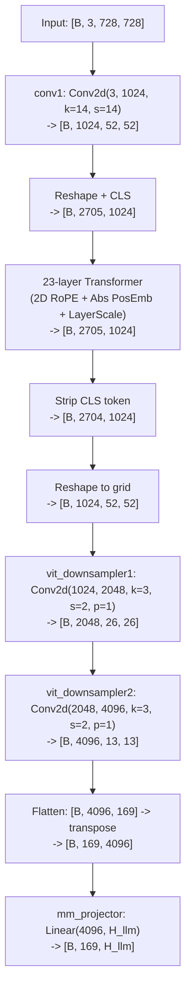
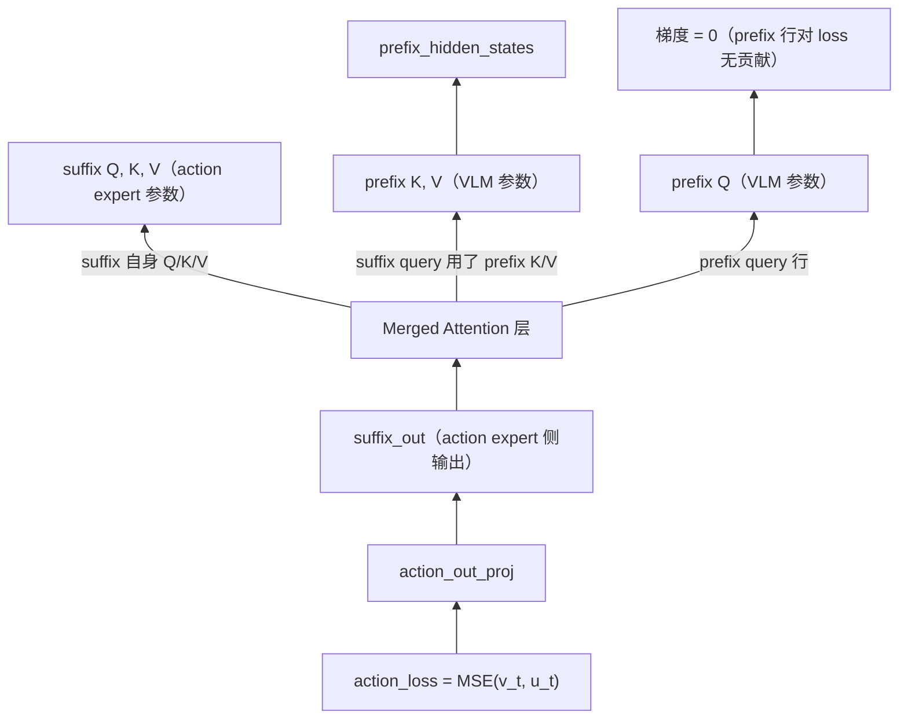
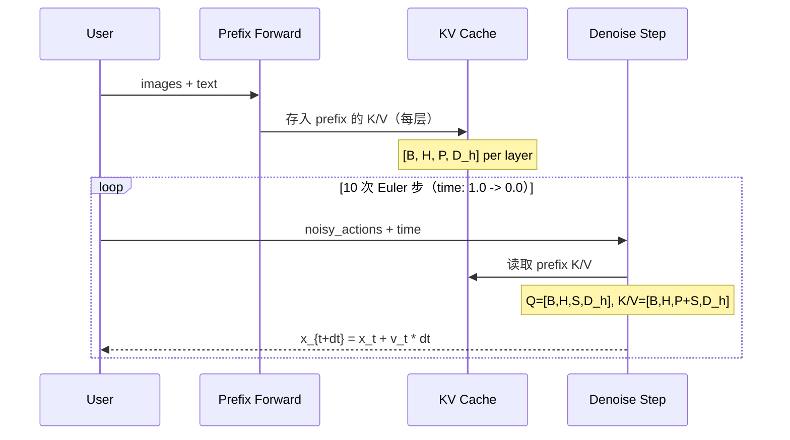
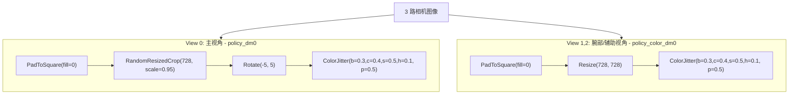

# DM0 深度技术分析

> 本文是对 `docs/DM0_Deep_Analysis.zh-CN.md` 的深度补充。前文覆盖了论文主张、高层一致性和横向比较；本文聚焦六个前文未充分展开的技术盲区，做逐函数、逐公式、逐张量级的下钻分析。

---

## 目录

1. [PE 视觉编码器架构深度拆解](#1-pe-视觉编码器架构深度拆解)
2. [Attention Mask 与梯度流分析](#2-attention-mask-与梯度流分析)
3. [Flow Matching 公式论文-代码逐项对齐](#3-flow-matching-公式论文-代码逐项对齐)
4. [DM0 vs pi0/CogACT/OFT/MemVLA 逐函数级对比](#4-dm0-vs-pi0cogactoftmemvla-逐函数级对比)
5. [数据增强与归一化流水线](#5-数据增强与归一化流水线)
6. [DM0Prog 进度预测与 Tokenization 细节](#6-dm0prog-进度预测与-tokenization-细节)
7. [论文-实现一致性逐公式审计清单](#7-论文-实现一致性逐公式审计清单)
8. [综合结论与开放问题](#8-综合结论与开放问题)

---

## 1. PE 视觉编码器架构深度拆解

DM0 使用的 Perception Encoder（PE）不是标准的 CLIP/SigLIP，而是一个自带 4x 空间下采样卷积的自定义 ViT。这是现有分析完全没有拆开讲的部分。

### 1.1 配置预设

`PE_LANG_L14_728`（`dexbotic/model/modules/mm_vision/pe/pe_configuration.py`）：

| 参数 | 值 | 含义 |
|------|----|------|
| `image_size` | 728 | 输入分辨率 |
| `patch_size` | 14 | 每个 patch 覆盖 14x14 像素 |
| `width` | 1024 | Transformer 隐藏维度 |
| `layers` | 23 | Transformer 层数 |
| `heads` | 16 | 注意力头数 |
| `mlp_ratio` | 4.0 | MLP 扩展比 |
| `pool_type` | `"none"` | 不做池化，保留全部 patch token |
| `use_cls_token` | True | 使用 CLS token（但 forward 时剥离） |
| `use_rope2d` | True | 2D 旋转位置编码 |
| `use_ln_post` | False | 不用后置 LayerNorm |
| `ls_init_value` | 0.1 | LayerScale 初始值 |

### 1.2 张量形状变化全流水线



关键数值推导：

- patch 嵌入后空间尺寸：`728 / 14 = 52`，token 数 = `52^2 = 2704`
- 加 CLS：`2704 + 1 = 2705`
- 下采样第一层：`floor((52 + 2*1 - 3) / 2 + 1) = 26`
- 下采样第二层：`floor((26 + 2*1 - 3) / 2 + 1) = 13`
- 最终 token 数：`13^2 = 169`，通道：`1024 * 4 = 4096`

### 1.3 与 CLIP/SigLIP 的关键差异

| 维度 | PE（DM0） | CLIP（Dexbotic-Base/CogACT） | SigLIP |
|------|----------|---------------------------|--------|
| 位置编码 | 2D RoPE + 绝对位置（双重） | 1D 绝对位置 | 1D 绝对位置 |
| 空间下采样 | 两层 Conv(3x3, s=2) 内置 | 无 | 无 |
| 输出 token 数 | 169（分辨率 728 时） | 576（分辨率 336 时）| 729（分辨率 384 时）|
| 输出通道 | 4096（width*4） | 1024 | 1152 |
| `hidden_size` 声明 | 1024（不等于实际输出维） | 1024（一致） | 1152（一致） |

### 1.4 投影器衔接

`PEVisionTower.hidden_size` 返回 `config.width = 1024`，但实际输出通道是 `4096`。因此 `mm_projector` 必须使用 `linear4x`（即 `Linear(mm_hidden_size * 4, hidden_size)`）才能正确对齐维度。这是一个需要配置正确才能工作的隐式约定。

```python
# builder.py 中 linear4x 的逻辑
linear_nx_match = re.match(r"^linear(\d+)x$", projector_type)
if linear_nx_match:
    multiplier = int(linear_nx_match.group(1))  # 4
    return nn.Linear(config.mm_hidden_size * multiplier, config.hidden_size)
    # = Linear(1024 * 4, H_llm) = Linear(4096, H_llm)
```

### 1.5 图像预处理

PE 使用 `SiglipImageProcessor`（mean/std 均为 0.5），而非 CLIP 的专用处理器。这意味着归一化公式为 `(pixel / 255 - 0.5) / 0.5 = pixel / 127.5 - 1`，即映射到 `[-1, 1]`。

---

## 2. Attention Mask 与梯度流分析

### 2.1 cumsum 机制的完整语义

`make_attn_mask_2d` 的核心只有四行：

```python
cumsum = torch.cumsum(attn_mask, dim=1)
attn_mask_2d = cumsum[:, None, :] <= cumsum[:, :, None]
# 即：key 位置 j 的 cumsum <= query 位置 i 的 cumsum 时，j 可被 i 看到
```

`attn_mask` 中 `1` 的含义：在该位置开始一个新的"注意力段"，使 cumsum 跳升。`0` 表示与前一 token 同段。

### 2.2 数值示例：prefix 3 token + suffix 4 token

假设 3 个 prefix（图像/文本 token）和 4 个 suffix（action token）：

- prefix 的 `attn_mask`：`[1, 1, 1]`（每个 token 各自成段）
- suffix 的 `attn_mask`：`[1, 0, 0, 0]`（整块 action 共享一个段）
- 拼接后 cumsum：

| 位置 | 0 | 1 | 2 | 3 | 4 | 5 | 6 |
|------|---|---|---|---|---|---|---|
| 段 | P | P | P | S | S | S | S |
| attn_mask | 1 | 1 | 1 | 1 | 0 | 0 | 0 |
| cumsum | 1 | 2 | 3 | 4 | 4 | 4 | 4 |

### 2.3 Attention Pattern 矩阵

条件 `cumsum[key] <= cumsum[query]`（行=query, 列=key, `T`=可见, `.`=遮蔽）：

```
         key: P0  P1  P2  S0  S1  S2  S3
query P0:     T   .   .   .   .   .   .
query P1:     T   T   .   .   .   .   .
query P2:     T   T   T   .   .   .   .
query S0:     T   T   T   T   T   T   T
query S1:     T   T   T   T   T   T   T
query S2:     T   T   T   T   T   T   T
query S3:     T   T   T   T   T   T   T
```

四个关键结论：

1. **prefix 内部**：严格下三角因果（P0 只看自己，P1 看 P0+P1，...）
2. **prefix 看不到 suffix**：因为 suffix 的 cumsum(4) > 任何 prefix 的 cumsum(1-3)
3. **suffix 能看到全部 prefix**：suffix 的 cumsum(4) >= prefix 的 cumsum(1-3)
4. **suffix 内部全连接**：所有 suffix 的 cumsum 都是 4，`4 <= 4` 恒成立

第 4 点尤其重要：suffix 的 action token 之间不是时间因果关系，而是**互相可见**。这意味着 action chunk 内的每个 timestep 都能参考其他 timestep，这对建模一段平滑轨迹是合理的。

### 2.4 魔数 `-2.3819763e38`

```python
attn_mask_4d = torch.where(attn_mask_2d, 0.0, -2.3819763e38)
```

这个值约等于 `-torch.finfo(torch.float32).max / 1.43`。用有限大负数替代 `-inf`，避免在 bf16 混合精度下出现 `nan`。softmax 后被遮蔽位置的权重 `exp(-2.38e38) ≈ 0`。

### 2.5 梯度流关键路径

训练时 `loss = MSE(v_t, u_t)` 的梯度如何流经 merged attention：



关键发现：

- **action expert 全路径**：被 action_loss 更新
- **VLM 的 K/V 投影**：被 suffix query 使用，梯度非零，会通过 `k_proj`、`v_proj` 和更早的 `input_layernorm` 反传到 VLM
- **VLM 的 Q 投影**：只影响 prefix 行的 attention 输出，而 prefix 行不参与 loss 计算，梯度为零
- **VLM 的 MLP**：如果 `o_proj` 和 MLP 在 prefix 侧的输出只被 prefix Q 使用（不被 suffix 侧用到），则也不接收梯度

这意味着**论文中声称的 "gradient decoupling" 在开源实现中部分自然存在**（prefix Q/MLP 路径不受影响），但 **K/V 路径仍然会被动作损失更新**。

### 2.6 推理 KV Cache 策略



每个去噪步只重新计算 suffix 的嵌入和 attention，prefix 的 KV 全程复用，避免重复编码图像和文本。

---

## 3. Flow Matching 公式论文-代码逐项对齐

### 3.1 论文公式（Section 2.2, 式 (3)）

论文写的是：

\[
\tilde{a}_{t:t+H} = \tau A_{t:t+H} + (1-\tau)\varepsilon, \quad \varepsilon \sim \mathcal{N}(0, I)
\]

- \(\tau = 0\)：纯噪声
- \(\tau = 1\)：纯动作

目标向量场：\(A_{t:t+H} - \varepsilon\)

### 3.2 代码实现（dm0_arch.py, L434-443）

```python
time = Beta(1.5, 1.0).sample((B,)) * 0.999 + 0.001  # t ∈ (0.001, 1.0)
x_t = time * noise + (1 - time) * actions              # 插值
u_t = noise - actions                                    # 目标
```

- `t = 0`：纯动作
- `t = 1`：纯噪声

目标向量场：\(\varepsilon - A\)

### 3.3 对应关系

| 概念 | 论文 | 代码 |
|------|------|------|
| 时间变量 | \(\tau\) | `time`（= `1 - tau`） |
| 噪声端 | \(\tau = 0\) | `t = 1` |
| 动作端 | \(\tau = 1\) | `t = 0` |
| 插值公式 | \(\tau A + (1-\tau)\varepsilon\) | `t * \varepsilon + (1-t) * A` |
| 目标方向 | \(A - \varepsilon\) | \(\varepsilon - A\) |
| 符号关系 | | `u_code = -u_paper` |

**核心结论**：论文与代码的时间方向刚好相反（`t_code = 1 - tau_paper`），目标向量场也差一个负号。这并不是 bug——推理时代码从 `t = 1`（噪声）出发，用 `dt = -1/steps` 向 `t = 0`（动作）积分：

```python
# _denoise_step
return x_t + v_t * dt, time + dt  # dt < 0, time 递减
```

因为 `v_t` 学的是 `noise - actions`（从动作指向噪声），而 `dt < 0`，所以 `x_t + v_t * dt` 实际上是沿着 `actions - noise` 方向走，与从噪声走向动作的物理意义一致。

### 3.4 Beta(1.5, 1.0) 时间分布

```
Beta(1.5, 1.0) 的概率密度偏向 t ∈ (0.5, 1.0)

PDF(t) ∝ t^0.5 * (1-t)^0 = √t

均值 = 1.5/(1.5+1.0) = 0.6
```

由于代码中 `t = 1` 对应噪声端，`Beta(1.5, 1.0)` 使训练**偏向采样靠近噪声端的时间步**。直觉：模型需要更多练习"如何从接近纯噪声的状态开始去噪"，因为这是最难的部分。

### 3.5 训练与推理完整流程

```mermaid
flowchart LR
    subgraph train [Training]
        sampleNoise["采样 noise ~ N(0,I)\ntime ~ Beta(1.5,1.0)*0.999+0.001"]
        interpolate["x_t = t*noise + (1-t)*actions"]
        target["u_t = noise - actions"]
        embedPrefix["Embed prefix(images+text)"]
        embedSuffix["Embed suffix(x_t, time)"]
        merged["Merged Attention(VLM + ActionExpert)"]
        predict["v_t = action_out_proj(suffix_out)"]
        trainLoss["loss = MSE(v_t, u_t)"]

        sampleNoise --> interpolate --> target
        embedPrefix --> merged
        embedSuffix --> merged
        merged --> predict --> trainLoss
    end

    subgraph infer [Inference]
        initNoise["x = noise ~ N(0,I)\nt = 1.0, dt = -0.1"]
        cachePrefix["Prefix forward -> KV cache"]
        denoiseLoop["Euler loop: x = x + v_t * dt\nt = t + dt"]
        output["t ≈ 0 时 x ≈ clean actions"]

        initNoise --> cachePrefix --> denoiseLoop --> output
    end
```

---

## 4. DM0 vs pi0/CogACT/OFT/MemVLA 逐函数级对比

### 4.1 类继承关系

```mermaid
classDiagram
    class DexboticVLMModel {
        +llm
        +mm_vision_tower
        +mm_projector
    }
    class DexboticForCausalLM {
        +model: DexboticVLMModel
        +lm_head
    }

    class DM0Model {
        +action_expert: Qwen3ForCausalLM
        +action_in_proj
        +action_out_proj
        +action_time_mlp_in/out
    }
    class DM0ForCausalLM {
        +_compute_merged_layer()
        +_merged_attention_forward()
        +forward()
        +inference_action()
    }

    class Pi0Model {
        +action_expert: AutoModel
        +state_proj
        +action_in_proj
        +action_out_proj
        +action_time_mlp_in/out
    }
    class Pi0ForCausalLM {
        +_inner_forward_mot()
        +embed_prefix()
        +embed_suffix()
    }

    class CogActModel {
        +action_head: DiT
    }
    class CogACTForCausalLM {
        +inference_action(): DDIM
    }

    class OFTModel {
        +action_head: DiT or Linear
    }
    class OFTForCausalLM {
        +insert_action_embedding()
    }

    class MemVLAModel {
        +per_cog_mem_bank: PerCogMemBank
        +action_head: DiT
    }

    DexboticVLMModel <|-- DM0Model
    DexboticVLMModel <|-- Pi0Model
    DexboticVLMModel <|-- CogActModel
    DexboticVLMModel <|-- OFTModel
    DexboticVLMModel <|-- MemVLAModel
    DexboticForCausalLM <|-- DM0ForCausalLM
    DexboticForCausalLM <|-- Pi0ForCausalLM
    DexboticForCausalLM <|-- CogACTForCausalLM
    DexboticForCausalLM <|-- OFTForCausalLM
    DexboticForCausalLM <|-- MemVLAForCausalLM
```



### 4.2 逐维度完整对比表

| 维度 | DM0 | pi0 | CogACT | OFT | MemVLA |
|------|-----|-----|--------|-----|--------|
| **VLM 骨干** | Qwen3 | Gemma | 通用 LLM | 通用 LLM | 通用 LLM |
| **动作建模** | Flow Matching + Euler | Flow Matching + Euler | Diffusion DiT + DDIM | Diffusion DiT + scheduler / L1 | Diffusion DiT + DDIM |
| **动作专家构造** | `Qwen3ForCausalLM`（删 embed_tokens） | `AutoModel.from_config` | 独立 DiT head | DiT/Linear head 插入 LLM 序列 | DiT head + per_attn |
| **VLM-Action 融合方式** | Merged attention（逐层 QKV 拼接） | Merged attention（逐层 QKV 拼接） | 最后 token cognition feature -> DiT | Action embedding 插入 LLM input_embeds | cognition + perception token -> DiT |
| **State 输入** | 不进入网络 | 显式 `state_proj` -> 1 个 token | 无 | `use_proprio` 可选 | 无 |
| **Suffix 长度** | chunk_size (50) | chunk_size + 1 (51, 含 state) | N/A | action_embed_len | N/A |
| **Suffix 内部注意力** | 全连接（cumsum 共段） | 全连接（同机制） | N/A（DiT 独立） | N/A（LLM 内因果） | N/A |
| **RoPE 实现** | Qwen3 层内 + q_norm/k_norm | Gemma 外部预计算 | LLM 原生 | LLM 原生 | LLM 原生 |
| **精度策略** | bf16 开关 + 选择性 FP32 | 无等价逻辑 | 默认 | 默认 | 默认 |
| **matmul_precision** | `"high"` | `"highest"` | 默认 | 默认 | 默认 |
| **推理 KV Cache** | Prefix 缓存 + suffix 每步重算 | 同 | 无（LLM 单次前向） | 每步全 LLM 前向 | 无 + memory bank |
| **推理步数** | Euler 10 步 | Euler 10 步 | DDIM 10 步 | scheduler N 步 | DDIM 10 步 |
| **CFG 支持** | 无 | 无 | 有 (cfg_scale) | 无 | 有 |
| **Memory 机制** | 无 | 无 | 无 | 无 | PerCogMemBank |
| **模型规模** | 2.4B | ~3B (PaliGemma) | 7B | 7B | 7B |

### 4.3 DM0 vs pi0 关键代码差异

**Suffix 构造对比**：

DM0（无 state token）：

```python
# dm0_arch.py L355-404
def get_suffix_hidden_states(self, noisy_actions, time):
    time_embeddings = posemb_sincos(time, ...)
    action_hidden_states = self.model.action_in_proj(noisy_actions)
    fused = torch.cat([action_hidden_states, time_embeddings_expanded], dim=2)
    hidden_states = action_time_mlp_out(silu(action_time_mlp_in(fused)))
    # suffix 长度 = chunk_size
```

pi0（有 state token）：

```python
# pi0_arch.py L272-316
def embed_suffix(self, states, noisy_actions, time):
    state_token = self.model.state_proj(states).unsqueeze(1)  # [B,1,H]
    tokens.append(state_token)  # 第 0 位是 state
    action_time_tokens = mlp(cat([action_in_proj(noisy), time_expand], dim=-1))
    tokens.append(action_time_tokens)
    # suffix 长度 = 1 + chunk_size
```

**RoPE 差异**：

DM0 在层内调用 Qwen3 的 rotary + q_norm/k_norm：

```python
# dm0_arch.py L173-177
query = layer.self_attn.q_norm(
    layer.self_attn.q_proj(prenorm_embeds).view(...)
).transpose(1, 2)
```

pi0 无 q_norm/k_norm，在外部预计算 RoPE：

```python
# pi0_arch.py L147-151
query = layer.self_attn.q_proj(prenorm_embeds).view(...).transpose(1, 2)
# 无 q_norm
```

### 4.4 CogACT/OFT/MemVLA 的根本路线差异

**CogACT**：先让 LLM 完整前向，取最后一个有效 token 作为 `cognition_features`，再送入独立的 DiT action head 做扩散。VLM 和动作头是"串行"的。

```python
# cogact_arch.py L119-120
cognition_features = last_hidden_state.gather(1, expanded_indices.unsqueeze(1))
loss = self.model.action_head_module.loss(actions_repeated, cognition_features_repeated)
```

**OFT**：把噪声动作嵌入插入到 LLM 的 input_embeds 中间，LLM 直接处理 action token，再从对应位置提取隐状态预测噪声或动作。

```python
# oft_arch.py L123, L169
inputs_embeds, attention_mask, non_padding_lengths = self.insert_action_embedding(
    inputs_embeds, attention_mask, action_embeds)
```

**MemVLA**：在 CogACT 基础上增加了 `PerCogMemBank`（感知-认知记忆库），在 episode 级别维护跨时间步的记忆。

```python
# memvla_arch.py L622-632
cog_tokens = self.model.per_cog_mem_bank.process_batch_cog(cog_tokens, episode_ids, timesteps)
per_tokens = self.model.per_cog_mem_bank.process_batch_per(per_tokens, episode_ids, timesteps)
```

**DM0 与它们的根本区别**：DM0 不是"先 LLM 再 action head"，而是让 VLM 和 action expert 在每一层都通过 merged attention 交换信息。这在计算上更紧密耦合，但也意味着动作预测能利用更深层的多模态表征。

---

## 5. 数据增强与归一化流水线

### 5.1 三视角增强策略



设计意图：主视角承受更强的几何增强（随机裁剪 + 旋转），增强空间不变性；腕部视角只做颜色增强，保持几何精确。

### 5.2 发现：aug_policy 默认值命名不一致

`dm0_exp.py` 默认配置：

```python
aug_policy: str | list[str] = field(
    default_factory=lambda: ["dm0", "dm0_color", "dm0_color"]
)
```

但 `augmentations.py` 中注册的键是 `"color_dm0"`（不是 `"dm0_color"`）：

```python
NAME2AUG = {
    ...
    'dm0': policy_dm0,
    'color_dm0': policy_color_dm0,  # 注意键名
}
```

`libero_dm0.py` 用的是正确的 `["dm0", "color_dm0", "color_dm0"]`。**默认配置可能存在 KeyError 风险**。

### 5.3 ActionNorm 两种模式

| 模式 | `use_quantiles=True` | `use_quantiles=False` |
|------|---------------------|----------------------|
| 公式 | \(\frac{x - q_{01}}{q_{99} - q_{01} + 10^{-6}} \times 2 - 1\) | \(\frac{x - \mu}{\sigma + 10^{-6}}\) |
| 范围 | 映射到 \([-1, 1]\)（大部分数据） | 无固定范围（z-score） |
| 鲁棒性 | 对极端值鲁棒（1%/99% 分位数） | 受离群点影响 |
| DM0 默认 | 是 | |
| Libero 特化 | | 是 |

### 5.4 DeltaAction 细节

```python
delta_action = action - state  # 逐元素
delta_action[..., non_delta_mask] = action[..., non_delta_mask]  # 夹爪保留绝对值
```

对于 periodic 维度（如角度），额外做环绕修正：

```python
if delta > periodic_range / 2:
    delta -= periodic_range
elif delta < -periodic_range / 2:
    delta += periodic_range
```

### 5.5 AddTrajectory 的滑窗构造

对时刻 t，轨迹块 `trajectory[t]` 的构造：

```
trajectory[t, 0, :] = action[t]      # 当前步
trajectory[t, 1, :] = action[t+1]    # 下一步
...
trajectory[t, 49, :] = action[t+49]  # 第 49 步
```

不足时用 `padding_mode="last"` 补最后一帧。最终形状 `[N, 50, D]`。

### 5.6 255-bin 离散化

`ActionNormAnd2String` 中的量化公式（用于离散 VLM 路径，非 DM0 连续路径）：

```python
bin = round((action + 1) / 2 * 254)  # action ∈ [-1,1] -> bin ∈ [0, 254]
bin = clip(bin, 0, 254)               # 共 255 个 bin
```

反量化：`action = bin / 254 * 2 - 1`

---

## 6. DM0Prog 进度预测与 Tokenization 细节

### 6.1 DM0Prog 的 progress 机制

`DM0ProgForCausalLM`（`dm0_prog_arch.py`）在基础 DM0 上新增：

- `progress_in_proj: Linear(1, action_hidden)` — 标量 progress 投射到隐藏维
- `progress_out_proj: Linear(action_hidden, 1)` — 从隐藏维回预测标量

Suffix 布局变化：

```
基础 DM0:  [action_0, action_1, ..., action_49]         (50 tokens)
DM0Prog:   [progress, action_0, action_1, ..., action_49] (51 tokens)
```

推理时 progress 条件固定不变，但每步去噪都会从 progress 位置读出 `end_progress`：

```python
end_progress = self.model.progress_out_proj(
    suffix_out[:, -chunk_size - 1 : -chunk_size]  # 恰好是 progress 槽位
)
```

所有去噪步的 `end_progress` 最后取 `torch.min`。

文件头注释 `"with progress prediction support for inference only"` 的含义：**当前仓库中 DM0Prog 没有重写 `forward`，因此 progress 损失没有接入训练**，只在推理路径扩展了 progress 条件化和预测功能。

### 6.2 DM0Tokenization 的 "step" 模板

`conv_step` 模板（`conversation.py`）：

```
system = "A chat between a curious user and an artificial intelligence assistant. ..."
roles = ("USER", "ASSISTANT")
sep = " "          # USER 后的分隔符
sep2 = "<|im_end|>"  # ASSISTANT 后的分隔符
```

生成的 token 序列格式：

```
[system_tokens] [space] USER: [text_tokens] [space] ASSISTANT: [response_tokens] [<|im_end|>]
```

### 6.3 三套掩码的含义

| 掩码 | 含义 | system/role | USER content | ASSISTANT content | padding |
|------|------|-------------|-------------|------------------|---------|
| `token_mask` | 有效 token vs padding | True | True | True | False |
| `ar_mask` | 注意力段标记（全 1 = 因果） | 1 | 1 | 1 | 0 |
| `loss_mask` | 是否计算 LM loss | False | False | **True** | False |

`labels` 的构造：

```python
labels = np.where(loss_mask, input_ids, IGNORE_INDEX)
# 只有 ASSISTANT 的 content token 参与交叉熵损失
```

### 6.4 与 Pi0/Pi05 Tokenization 的关键区别

| 项 | DM0Tokenization | Pi0Tokenization | Pi05Tokenization |
|----|-----------------|-----------------|------------------|
| 分词器 | HuggingFace 通用 | Gemma sp_model | Gemma sp_model |
| 模板格式 | `system + USER:/ASSISTANT:` | 单条文本 + BOS + `\n` | 多轮 `User:/Assistant:` |
| 图像处理 | `<im_start><image><im_end>` | 无特殊标记 | 移除 `<image>` |
| Loss 范围 | 仅 ASSISTANT content | 全序列 | 仅 assistant 文本 |
| 最大长度 | `model_max_length`(200) | 48 | 200 |

---

## 7. 论文-实现一致性逐公式审计清单

| 编号 | 论文描述 | 开源实现 | 一致性 | 说明 |
|------|---------|---------|--------|------|
| F-1 | \(\tilde{a} = \tau A + (1-\tau)\varepsilon\) | `x_t = t*noise + (1-t)*actions` | 符号反转 | `t_code = 1 - tau_paper`，数学等价 |
| F-2 | 目标 \(A - \varepsilon\) | `u_t = noise - actions` | 符号反转 | `u_code = -u_paper`，配合反向 dt 自洽 |
| F-3 | \(L_{total} = \lambda L_{AR} + L_{FM}\) | `loss = action_loss`（仅 FM） | **缺失 L_AR** | labels 传入但未使用，lm_head 仅兼容用 |
| F-4 | 梯度解耦：embodied 数据上 FM 梯度不回传 VLM | 无 detach / 分支 | **不一致** | 但 K/V 以外的 VLM 参数天然梯度近零 |
| F-5 | \(o_t = [I_t, s_t]\) | `states` 不进入网络 | **不一致** | issue #73 确认为 optional |
| F-6 | Spatial Scaffolding（subtask/bbox/trajectory/discrete） | 部分痕迹（subtask 在数据脚本中有） | **不完整** | 无显式 loss head |
| F-7 | 模型基于 Qwen3-1.7B | `DM0Config.llm_config` 由配置决定 | 配置一致 | 需 checkpoint config.json 确认 |
| F-8 | PE 编码器 + 3x3 stride-2 下采样 | `PerceptionEncoderWithDownsample` 实现 | 一致 | 728->52->26->13 |
| F-9 | 多视角 3 路图像 | `num_images=3` + `image_masks` | 一致 | |
| F-10 | Action horizon H=50 | `chunk_size=50` | 一致 | |
| F-11 | 255-bin 离散化 | `ActionNormAnd2String(vocab_size=255)` | 实现存在 | 但 DM0 训练路径不使用此功能 |
| F-12 | 500 模板 + keyframe sampling | 无模板库或 keyframe 逻辑可见 | **不可验证** | |

### 新发现（相比前文）

1. **Flow Matching 符号反转**：前文说"一致"，实际上 `t` 和 `tau` 的定义方向相反，向量场也差一个负号。数学上自洽但字面不一致。
2. **PE hidden_size 声明不一致**：`PEVisionTower.hidden_size = 1024` 但实际输出 4096，依赖 projector 配置正确。
3. **aug_policy 默认值 bug**：`dm0_exp.py` 中 `"dm0_color"` 与注册表 `"color_dm0"` 不匹配。
4. **bf16 选择性转换**中 float32 保留条件包含 `"conv1"` 字符串，但 PE 模型中对应的是 `vision_tower.conv1` 而非 `vision_model.conv1`，可能对不上。
5. **DM0Prog 只有推理路径**：progress 损失未接入训练。

---

## 8. 综合结论与开放问题

### 结论

1. DM0 的 PE 视觉编码器是一个精心设计的组件：2D RoPE + 绝对位置双重编码 + 4x Conv 下采样，产出 169 个 4096 维的紧凑视觉 token。这比 CLIP 的 576 个 1024 维 token 更高效，但需要 `linear4x` 投影器配合。

2. Merged attention 的 cumsum 机制优雅地实现了"prefix 因果 + suffix 全连接 + suffix->prefix 单向跨注意力"的三重 pattern。suffix 内部全连接允许 action chunk 的各 timestep 互相参考，有助于生成平滑连贯的轨迹。

3. Flow Matching 的论文-代码对应虽然符号方向相反，但 Euler 积分的 `dt < 0` 确保了推理方向的一致性。Beta(1.5, 1.0) 偏向噪声端采样是合理的训练策略。

4. DM0 与 pi0 在实现上高度同构（都是 dual-expert merged attention + flow matching），核心差异在于：(a) DM0 无 state token，(b) DM0 用 Qwen3 + q_norm/k_norm，(c) DM0 有选择性 bf16 策略。

5. DM0 与 CogACT/OFT/MemVLA 是不同的架构范式：DM0 是"逐层融合"，CogACT/MemVLA 是"先认知后动作"，OFT 是"动作嵌入序列内"。

### 开放问题

1. **梯度解耦的真实效果**：虽然 Q 路径天然无梯度，但 K/V 路径仍会被动作损失影响 VLM。论文的 "Knowledge Insulation" 在什么程度上被自然实现了？

2. **PE 的 hidden_size 声明**：`mm_hidden_size = 1024` 但实际需要 4096 维投影，这个隐式约定是否有更好的工程方式？

3. **DM0Prog 的训练路径**：progress 头已就绪，但缺少训练损失。这是有意为之（依赖 mid-training checkpoint）还是待补完？

4. **aug_policy 命名**：`dm0_exp.py` 默认值是否需要修正为 `"color_dm0"`？

5. **完整 L_AR + L_FM 训练**：当前仓库是否只公开了 post-training/SFT 路径，而 mid-training 的完整 recipe（含离散 token 监督和梯度解耦）保留在内部？
