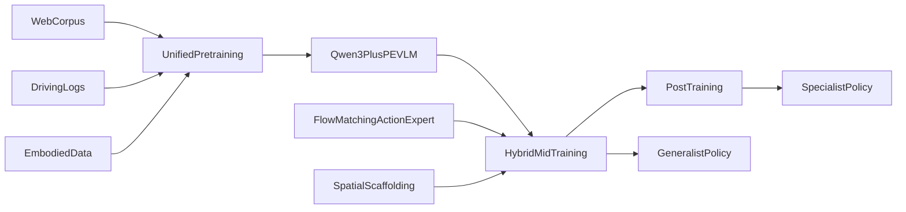
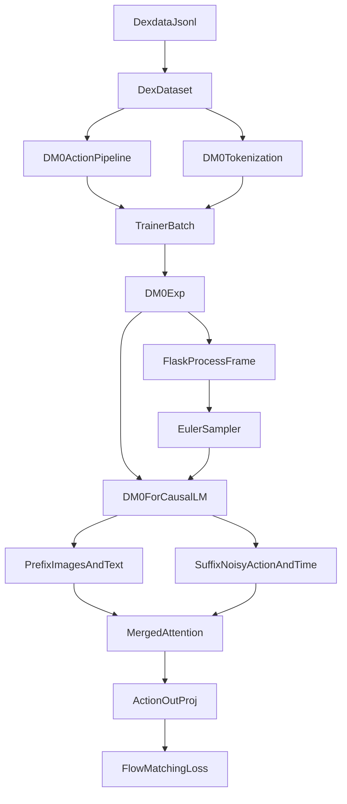

# DM0 深度分析报告

本文基于以下公开证据交叉整理：

- 论文原文：[DM0 An Embodied-Native Vision-Language-Action Model towards Physical AI](./DM0%20An%20Embodied-Native%20Vision-Language-Action%20Model%20towards%20Physical%20AI.pdf)
- 仓库文档：[DM0.md](./DM0.md)、[ModelZoo.md](./ModelZoo.md)、[Tutorial.md](./Tutorial.md)、[web_docs/3. Architecture.md](./web_docs/3.%20Architecture.md)
- 核心源码：[dm0_arch.py](../dexbotic/model/dm0/dm0_arch.py)、[dm0_utils.py](../dexbotic/model/dm0/dm0_utils.py)、[dm0_exp.py](../dexbotic/exp/dm0_exp.py)、[libero_dm0.py](../playground/benchmarks/libero/libero_dm0.py)、[process.py](../dexbotic/tokenization/process.py)
- 框架层源码：[base_exp.py](../dexbotic/exp/base_exp.py)、[trainer.py](../dexbotic/exp/trainer.py)、[dex_dataset.py](../dexbotic/data/dataset/dex_dataset.py)、[dexbotic_arch.py](../dexbotic/model/dexbotic_arch.py)
- GitHub 公开线索：[`release 0.2.0`](https://github.com/dexmal/dexbotic/releases/tag/0.2.0)、[`feat: support DM0 model`](https://github.com/dexmal/dexbotic/commit/85c8452cf0cc0543bed36478634a4f91a56ba5d3)、[`issue #64`](https://github.com/dexmal/dexbotic/issues/64)、[`issue #69`](https://github.com/dexmal/dexbotic/issues/69)、[`issue #73`](https://github.com/dexmal/dexbotic/issues/73)、[`issue #76`](https://github.com/dexmal/dexbotic/issues/76)、[`issue #77`](https://github.com/dexmal/dexbotic/issues/77)
- 辅助外部材料：[`OpenVLA`](https://arxiv.org/abs/2406.09246)、[`π0`](https://arxiv.org/abs/2410.24164)、[`CogACT`](https://arxiv.org/abs/2411.19650)、[`DM0 第三方解读`](https://www.themoonlight.io/review/dm0-an-embodied-native-vision-language-action-model-towards-physical-ai)、[`VLA benchmark experiences`](https://arxiv.org/abs/2511.11298)

## 一页结论

- DM0 要解决的核心问题不是“怎么再做一个动作头”，而是如何让 VLA 从一开始就具备物理接地能力，而不是先在互联网语义数据上预训练、再拿少量具身数据补课。
- 论文声称 DM0 的优势来自三件事的组合：`Embodied-Native` 多源预训练、`Hybrid Training Architecture`、`Embodied Spatial Scaffolding`。其中真正让 DM0 与 `OpenVLA`、`π0/π0.5`、`CogACT/OFT` 拉开路线差异的，主要是前两项，而不是 `flow matching` 本身。
- `flow matching + action chunk` 是有效的，但它不是 DM0 的独门绝招，因为 `π0` 同样是 flow model；DM0 更特别的地方在于“数据与训练范式”，而不是“采样器公式”。
- 从开源代码看，Dexbotic 已经实现了 DM0 的核心连续动作策略路径：双专家、merged attention、基于时间噪声的 flow matching、Euler 采样、多视角输入、统一 32 维动作接口、Flask 推理服务。
- 但如果严格按论文定义审计，当前仓库并不是论文完整 recipe 的逐项公开复现。最重要的偏差有三个：`L_AR + L_FM` 没有完整公开实现、论文中的 hybrid gradient decoupling 在代码里看不到、`state` 在公开实现中并没有作为显式网络条件真正进入 DM0 主干。
- 因此最准确的结论是：这个仓库公开了“DM0 的核心动作策略实现 + specialist/downstream 微调路径”，但没有把论文里完整的多源混合训练体系、全部 spatial scaffolding 监督，以及完整的 manipulation+navigation 训练配方都无歧义地公开出来。

## 证据等级与阅读方法

我会把结论按证据强度区分：

- `A级`：论文原文、源码、官方仓库 issue/release/commit
- `B级`：仓库文档、官方 benchmark 表、官方模型说明
- `C级`：第三方解读、相关 VLA 论文摘要、经验性 benchmark 总结

凡是涉及“DM0 为什么更强”的判断，我都会区分：

- 论文直接证明
- 代码侧可观察到的工程优势
- 缺少消融、只能谨慎推断

## DM0 解决了哪些问题

论文在 `Introduction` 里把目标说得很清楚：DM0 主要是想打破 VLA 里常见的 `Pretrain-then-Adapt` 路线。

### 1. 传统 VLA 的物理接地不足

论文认为，很多 VLA 先在大规模互联网视觉语言数据上获得语义能力，再用有限机器人数据做适配。这种方式的问题是：

- 互联网数据擅长语义知识，但不擅长连续控制、接触动力学、空间约束和具身交互。
- 模型的“世界理解”强，但“物理可执行性”弱。
- 结果就是到了真实机器人阶段，经常需要很重的 task-specific adaptation。

### 2. 语义能力与动作能力之间的冲突

论文明确点名两个风险：

- `module fragmentation`：导航和操作拆成不同系统，难以统一。
- `catastrophic forgetting`：为了学动作，反而把已有的语义与推理能力冲掉。

### 3. 推理与控制之间还有一道鸿沟

即便 VLM 能理解指令，也不等于它能稳定地产生低层连续控制。DM0 论文把这层问题定义为“高层 reasoning 到低层 control 的桥接”。

### 4. 论文真正的野心

DM0 不是只想做操作 policy，而是想走 `manipulation + navigation` 的统一路线。论文除了 Table30，还给了 `ObjectNav` 结果，就是在强调“Physical AI 不该只是一只机械臂的 VLA”。

## DM0 的核心方法

论文把 DM0 拆成三个技术支柱：



### 1. Embodied-Native 多源预训练

论文不是把具身数据放到最后微调，而是在 pretraining 阶段就把这些源头混进去：

- web corpus
- driving scenes / autonomous driving logs
- embodied grounding / caption / spatial relation / reasoning 数据

这一步的论文逻辑很强：如果物理先验从一开始就进入模型，那么模型对空间关系、目标约束、轨迹可执行性的表示会更自然。

### 2. Hybrid Training Architecture

论文的表述是：

- VLM 负责 embodied reasoning text 与离散动作 token
- action expert 负责连续动作 flow matching
- 对 embodied 数据，action expert 的梯度不应该破坏 VLM 的泛化语义表征
- 对 non-embodied 数据，VLM 继续训练，以维持通用能力

这本质上是一种 `Knowledge Insulation` 风格的训练哲学。

### 3. Embodied Spatial Scaffolding

论文列出的层级监督是：

- `subtask prediction`
- `goal bounding box prediction`
- `end-effector trajectory prediction`
- `discrete action prediction`

它想表达的思想不是“再加几个头”，而是把复杂具身任务拆成一串越来越接近控制的中间表征，让解空间被逐步约束。

### 4. Flow Matching 动作专家

DM0 的动作生成不是离散 token 分类，也不是传统自回归动作序列，而是：

- 生成连续动作轨迹块
- 一个 chunk 覆盖未来 50 步
- 训练时从 `x_t = t * noise + (1 - t) * action` 学 velocity / vector field
- 推理时用 Euler 迭代从噪声走回动作

这套东西是 DM0 的动作执行核心，但需要强调：它是“现代连续动作 VLA 的重要共性”，不完全是 DM0 独有。

## 哪些方法看起来真正有效

下面这张表专门回答“其中有效的方法又是哪些、能使它比其它同类算法好的方法又是哪些”。

| 方法 | 从论文看是否有效 | 是否像 DM0 的独特优势 | 我的判断 |
| --- | --- | --- | --- |
| Embodied-Native 多源预训练 | 是。论文所有主结果都服务于这个核心论点 | 是 | 这是 DM0 最核心的差异化来源，也是它最像“范式升级”的部分 |
| Hybrid gradient / KI 风格解耦 | 论文强烈主张，但没有公开消融表逐项证明 | 是 | 很可能重要，但现阶段更像“强设计假设 + 经验结论” |
| Spatial Scaffolding | 论文主张强，文本与图示丰富，但缺少模块级消融 | 是 | 很可能对长程任务和可解释性有帮助，但公开证据不够硬 |
| Flow matching + action chunk | 是 | 不是 | 它是有效的，但 `π0` 也在用，所以它不是 DM0 相比 `π0` 的关键护城河 |
| Qwen3 + PE 视觉骨干 | 很可能有效 | 部分是 | 这是强骨干带来的底盘优势，但论文没把它与方法创新完全隔离 |
| 3 视角输入 + 32D 统一动作接口 | 工程上有效 | 不是 | 更像部署与跨 embodiment 兼容性的优势，不是论文算法创新本体 |
| Progress 支持 | 局部有效 | 不是主线 | 在论文中只用于部分重复性任务；在仓库里是 `DM0Prog` 扩展，不是基础 DM0 的核心训练逻辑 |

### 我认为最可能真正让 DM0 比同类更强的，是下面三项的组合

1. `Embodied-Native` 多源数据而不是事后适配  
2. 尝试在保留 VLM 泛化能力的同时学习动作的 hybrid training 思路  
3. 用 spatial scaffolding 把 reasoning 和 control 之间的鸿沟缩短  

### 我认为不应被过度吹大的，是下面两项

1. `flow matching` 本身  
原因：`π0` 也是 flow model，DM0 不可能仅靠这一点就解释所有优势。

2. `连续动作 chunk` 本身  
原因：OFT、π0 等同类路线都在向 chunked continuous action 靠近，这已经更像是 VLA 主流工程选择，而不是 DM0 的独占创新。

## DM0 比同类 VLA 好在什么地方

### 论文直接证明的优势

论文最硬的直接证据不是 Libero，而是 `RoboChallenge Table30`。

#### Specialist

- DM0: `62.00`
- Spirit-v1.5: `51.00`
- GigaBrain-0.1: `51.67`
- π0.5: `42.67`

#### Generalist

- DM0: `37.3 / 49.08`
- π0.5: `17.67 / 31.27`
- π0: `9.0 / 20.22`

这说明如果只按论文自己的主战场来评价，DM0 的 strongest claim 是：

- 在真实机器人长程桌面任务上，它比几类开源 generalist VLA 更强
- 它在 generalist 设置下的优势尤其明显
- 它不是只在 specialist 小范围 task-specific setting 下领先

### 论文直接证明的第二个优势：统一 manipulation + navigation 的叙事

`docs/DM0.md` 还给出了 `ObjectNav` 结果：

- HM3D SR: `73.5`
- MP3D SR: `45.3`

这不是说 DM0 已经绝对统治导航，而是说明论文确实试图把 manipulation 和 navigation 放进一个共同的 Embodied-Native 框架里。

### 不能过度声称的地方

这里必须克制：

- 从 Dexbotic 自己的公开文档看，DM0 并没有在所有仿真 benchmark 上都明显压过所有同类。
- 例如 `docs/DM0.md` 里 DM0 在 Libero 的平均值是 `94.1`，而 `docs/ModelZoo.md` 里 `MemVLA` 是 `96.7`，`DB-MemVLA` 是 `97.0`。
- 也就是说，DM0 的公开 strongest evidence 更偏 `Table30 real-world` 与 “统一操作+导航” 的路线，而不是“所有 simulation 都第一”。

## 广泛横向比较

### 论文直接对比到的模型

| 模型 | 论文是否直接对比 | 结论 |
| --- | --- | --- |
| Spirit-v1.5 | 是 | DM0 specialist 更强 |
| GigaBrain-0.1 | 是 | DM0 specialist 更强 |
| π0.5 | 是 | DM0 specialist/generalist 都更强 |
| π0 | 是，但主要在 generalist | DM0 generalist 更强 |

### 更广义的同类方法比较

| 家族 | 代表 | 主要范式 | DM0 更好的地方 | 需要保留的边界 |
| --- | --- | --- | --- | --- |
| OpenVLA 家族 | OpenVLA | 互联网预训练 VLM + 机器人数据微调，偏离散动作 token 化路线 | DM0 强调 physical priors 从 pretraining 开始进入；真实 Table30 叙事更强 | OpenVLA 的开放性、LoRA 微调与 consumer GPU 友好性是它自己的优势，DM0 不一定在可用性上更优 |
| Flow VLA 家族 | π0 / π0.5 | 预训练 VLM 上叠 flow matching action model | DM0 的差异不在 flow，而在 embodied-native 数据与 hybrid training 思路 | 如果只比 flow matching，本质上 DM0 与 π0 属于近亲路线 |
| VLM + diffusion action module | CogACT | 用 VLM cognition feature 条件化扩散动作模块 | DM0 更强调统一 physical priors 和真实世界 Table30 结果 | CogACT 在仿真和多个 embodiment 上也很强，DM0 论文没有直接 head-to-head 它 |
| OpenVLA-OFT | OFT | 优化微调配方、并行解码、chunked continuous actions、速度和成功率兼顾 | DM0 更像在追求“大一统的 embodied-native pretraining” | OFT 的主命题是 fine-tuning speed/success，和 DM0 不完全是同一个优化目标 |
| Memory-augmented VLA | MemVLA | cognition + perception memory bank + diffusion action expert | DM0 架构更直接，没有额外 memory bank 复杂度 | MemVLA 在 Dexbotic 文档里的部分 simulation 指标强于 DM0，DM0 不能简单说“全面更好” |

### 仓库内实现层面的关键差异

| 模型 | 动作建模 | 状态输入 | 关键结构 |
| --- | --- | --- | --- |
| DM0 | flow matching + Euler sampling | `state` 在公开实现里近乎可选 | dual expert + merged attention |
| π0 | flow matching | 显式 `state_proj` 生成 state token | dual stream + merged attention |
| CogACT | diffusion action transformer / DDIM | 不是 DM0 这种 prefix-suffix 融合方式 | 从最后 cognition feature 驱动动作头 |
| OFT | 连续动作嵌入插入到 LLM 序列，扩散或 L1 regression | `use_proprio` 时显式使用 states | action tokens inserted into sequence |
| MemVLA | diffusion + perceptual/cognitive memory bank | 依赖 episode/timestep 记忆上下文 | `PerCogMemBank` |

## Dexbotic 代码库如何设计并实现 DM0

### 框架层

Dexbotic 的总体设计是一个比较清晰的三层结构：

- 数据层：`DexDataset`
- 模型层：`DexboticVLMModel` 及各 VLA 子类
- 实验层：`BaseExp` / `DM0Exp` / `DexboticTrainer`

`docs/web_docs/3. Architecture.md` 已经给了框架图，而 DM0 只是把它专门化。

### DM0 的关键文件

| 文件 | 作用 |
| --- | --- |
| [dm0_arch.py](../dexbotic/model/dm0/dm0_arch.py) | DM0 主模型，双专家、merged attention、flow matching、Euler 推理 |
| [dm0_utils.py](../dexbotic/model/dm0/dm0_utils.py) | 自定义 attention mask 和时间位置编码 |
| [dm0_prog_arch.py](../dexbotic/model/dm0/dm0_prog_arch.py) | progress 扩展版本 |
| [dm0_exp.py](../dexbotic/exp/dm0_exp.py) | 训练、归一化统计、Flask 推理服务、数据管线配置 |
| [libero_dm0.py](../playground/benchmarks/libero/libero_dm0.py) | Libero 任务级配置 |
| [process.py](../dexbotic/tokenization/process.py) | `DM0Tokenization`，对齐 OpenPI 风格的 step template |

### 训练与推理数据流



### 1. 数据层怎么组织

`DM0ActionConfig` 的动作流水线会做：

- `PadState(ndim=32)`
- `PadAction(ndim=32)`
- `AddTrajectory(trajectory_length=50)`
- `DeltaAction`
- `ActionNorm`
- `LoadMultiModal(return_masks=True)`

这说明 Dexbotic 在工程上把“不同机器人动作维度不同”的问题，统一投射成了 `32D max-length action space`，这和 `issue #76` 的官方回复一致。

### 2. 模型层怎么组织

DM0 不是“一个 VLM 外接一个 action head”那么简单，而是：

- `self.model.llm` 负责 prefix 语义流
- `self.model.action_expert.model` 负责 suffix 动作流
- `_compute_merged_layer()` 在每一层把两个模块的 `Q/K/V` 拼起来做一次共享 attention
- 然后再把输出切回两个模块各自继续走后续层

这正是 DM0 最关键、最像论文图的地方。

```145:213:dexbotic/model/dm0/dm0_arch.py
    def _compute_merged_layer(
        self,
        layer_idx: int,
        module_list: List[nn.Module],
        input_embeds_list: List[torch.FloatTensor],
        position_ids: torch.LongTensor,
        past_key_values: DynamicCache | None,
        attention_mask: torch.Tensor,
        use_cache: bool,
    ) -> List[torch.FloatTensor]:
        """Compute a single merged attention layer across multiple modules."""
        query_list, key_list, value_list = [], [], []
        seq_len_list = []
        layers = [module.layers[layer_idx] for module in module_list]

        for module_idx, (layer, input_embeds) in enumerate(
            zip(layers, input_embeds_list)
        ):
            if input_embeds is None:
                seq_len_list.append(0)
            else:
                prenorm_embeds = layer.input_layernorm(input_embeds)
                batch_size, seq_len, _ = prenorm_embeds.shape
                seq_len_list.append(seq_len)

                if layer.self_attn.q_proj.weight.dtype == torch.bfloat16:
                    prenorm_embeds = prenorm_embeds.to(torch.bfloat16)

                query = layer.self_attn.q_norm(
                    layer.self_attn.q_proj(prenorm_embeds).view(
                        batch_size, seq_len, -1, layer.self_attn.head_dim
                    )
                ).transpose(1, 2)
                key = layer.self_attn.k_norm(
                    layer.self_attn.k_proj(prenorm_embeds).view(
                        batch_size, seq_len, -1, layer.self_attn.head_dim
                    )
                ).transpose(1, 2)
                value = (
                    layer.self_attn.v_proj(prenorm_embeds)
                    .view(batch_size, seq_len, -1, layer.self_attn.head_dim)
                    .transpose(1, 2)
                )

                if layer.self_attn.q_proj.weight.dtype == torch.bfloat16:
                    query = query.to(torch.bfloat16)
                    key = key.to(torch.bfloat16)

                query_list.append(query)
                key_list.append(key)
                value_list.append(value)

        query_states = torch.cat(query_list, dim=2)
        key_states = torch.cat(key_list, dim=2)
        value_states = torch.cat(value_list, dim=2)
```

### 3. 动作生成怎么实现

核心训练逻辑非常直接：

- 采样高斯噪声
- 采样 `Beta(1.5, 1.0)` 的时间
- 构造 `x_t`
- 目标是 `u_t = noise - actions`
- 后缀输出经 `action_out_proj` 后，对 `u_t` 做 MSE

```428:500:dexbotic/model/dm0/dm0_arch.py
        # Sample noise and time
        noise = torch.normal(
            mean=torch.zeros_like(actions),
            std=torch.ones_like(actions),
        ).to(device=actions.device, dtype=actions.dtype)

        time = (
            torch.distributions.Beta(1.5, 1.0).sample((batch_size,)).to(actions.device)
            * 0.999
            + 0.001
        ).to(dtype=actions.dtype)

        # Flow matching interpolation
        time_expanded = time[..., None, None]
        x_t = time_expanded * noise + (1 - time_expanded) * actions
        u_t = noise - actions

        # Embed prefix (images + language)
        prefix_hidden_states, prefix_padding_mask, prefix_attn_mask = (
            self.get_prefix_hidden_states(
                input_ids, attention_mask, images, image_masks
            )
        )

        # Embed suffix (actions + time)
        suffix_hidden_states, suffix_padding_mask, suffix_attn_mask = (
            self.get_suffix_hidden_states(x_t, time)
        )

        if self.model.config.bf16:
            suffix_hidden_states = suffix_hidden_states.to(dtype=torch.bfloat16)
            prefix_hidden_states = prefix_hidden_states.to(dtype=torch.bfloat16)

        # Build full attention mask [B, P+S, P+S]
        full_padding_mask = torch.cat([prefix_padding_mask, suffix_padding_mask], dim=1)
        full_attn_mask = torch.cat([prefix_attn_mask, suffix_attn_mask], dim=1)
        attn_mask_2d = make_attn_mask_2d(
            padding_mask=full_padding_mask, attn_mask=full_attn_mask
        )
        attn_mask = make_attn_mask_4d(attn_mask_2d, dtype=prefix_hidden_states.dtype)

        # Forward through merged attention
        module_list = [
            self.model.llm,
            self.model.action_expert.model,
        ]

        (prefix_out, suffix_out), _ = self._merged_attention_forward(
            module_list=module_list,
            attention_mask=attn_mask,
            position_ids=positions,
            past_key_values=None,
            input_embeds_list=[prefix_hidden_states, suffix_hidden_states],
            use_cache=False,
        )

        # Compute flow matching loss
        if actions.dtype == torch.float32:
            suffix_out = suffix_out.to(torch.float32)
        suffix_out_final = suffix_out[:, -self.model.config.chunk_size :]
        v_t = self.model.action_out_proj(suffix_out_final)
        action_loss = F.mse_loss(v_t, u_t, reduction="mean")

        loss = action_loss
```

### 4. 推理服务怎么实现

`DM0InferenceConfig.run()` 会启动 Flask，并对 `/process_frame` 做：

- 图像读入、按视角补零或截断
- `state` 缺失时默认补成全零
- 调用 `input_transform` 做 pad + norm
- 调 `model.inference_action()`
- `ActionDenorm + AbsoluteAction`

```469:521:dexbotic/exp/dm0_exp.py
        if states is not None:   
            if isinstance(states, str):
                batch_states = np.array(json.loads(states))
                if batch_states.ndim == 1:
                    batch_states = batch_states[None]
                assert batch_states.shape[0] == batch_size, (
                    f"Batch inference requires states to be a list with length {batch_size}, "
                    f"but got length {len(batch_states)}."
                )
            elif isinstance(states, (list, tuple)) and all(
                isinstance(s, str) for s in states
            ):
                assert len(states) == batch_size, (
                    f"Batch inference requires states to be a list with length {batch_size}, "
                    f"but got {type(states)} with length {len(states)}."
                )
                batch_states = [json.loads(s) for s in states]
                batch_states = np.array(batch_states)
        else:
            batch_states = np.zeros(
                (
                    batch_size,
                    self.model.model.config.action_dim,
                ),
                dtype=np.float32,
            )

        inference_args = {
            "input_ids": batch_input_ids,
            "attention_mask": batch_attention_mask,
            "images": batch_images_tensor,
            "image_masks": batch_image_masks,
            "state": batch_states,
            "meta_data": {
                "non_delta_mask": np.array(self.non_delta_mask),
            },
        }

        inputs = self.input_transform(inference_args)
        inputs["states"] = inputs["state"]
        inputs = {
            k: v.to(self.device) if isinstance(v, torch.Tensor) else v
            for k, v in inputs.items()
        }
        actions = self.model.inference_action(**inputs)
        outputs = {
            k: v.detach().cpu().numpy() if isinstance(v, torch.Tensor) else v
            for k, v in inputs.items()
        }
        outputs["action"] = actions.detach().cpu().numpy()
        outputs = self.output_transform(outputs)
        logger.info(f"Processing time: {time.monotonic() - t0}")
        return outputs["action"][..., : self.action_dim].tolist()
```

## 与论文是否一致

我的结论是：`部分一致，而且是“核心动作推理一致，完整训练配方不一致”`。

### 一致的部分

| 论文点 | 开源实现 | 结论 |
| --- | --- | --- |
| dual expert | 有 `llm` 和 `action_expert` | 一致 |
| merged attention | `_compute_merged_layer()` 逐层拼接 Q/K/V | 一致 |
| flow matching 连续动作 | `x_t`、`u_t`、MSE、Euler sampling 全都在 | 一致 |
| chunked action trajectory | `chunk_size=50` | 一致 |
| 多视角输入 | `num_images=3`、`image_masks`、DM0 augment policy | 一致 |
| 统一大动作空间 | `action_dim=32`、PadState/PadAction | 一致 |
| 推理服务 | Flask `/process_frame` | 一致 |

### 关键不一致 1：论文的 `L_total = L_AR + L_FM` 没有在公开训练路径中完整实现

论文明确说：

- VLM 预测 embodied reasoning text 和 discrete action tokens
- action expert 预测 continuous actions
- 总损失是 `L_AR + L_FM`

但开源 `DM0ForCausalLM.forward()` 里：

- `labels` 进来了，却没有被使用
- `lm_head` 只是“for compatibility”
- `loss = action_loss`

并且 `DexboticTrainer.compute_loss()` 只是拿模型返回的单个 `loss`，不会在 trainer 侧额外拼一个语言损失。

```170:182:dexbotic/exp/trainer.py
    def compute_loss(self, model, inputs, return_outputs=False, *args, **kwargs):
        loss, outputs = super().compute_loss(model, inputs, return_outputs=True)
        loss_keys = [_ for _ in outputs if _.endswith("_loss")]

        for loss_key in loss_keys:
            if outputs[loss_key] is None or torch.isclose(
                outputs[loss_key], torch.zeros_like(outputs[loss_key])
            ):
                if loss_key not in self.loss_cache:
                    self.loss_cache[loss_key] = 0.0
                continue
            self.loss_cache[loss_key] = outputs[loss_key].detach().item()
        return (loss, outputs) if return_outputs else loss
```

这意味着当前公开训练路径更像：

- 一个基于 DM0 结构的连续动作 fine-tuning 路径
- 而不是论文完整的 `AR reasoning/discrete-action + continuous-action` 联合训练实现

### 关键不一致 2：论文的 hybrid gradient decoupling 在代码里看不到

论文说得非常明确：对 embodied 数据，action expert 的梯度不应该回传破坏 VLM 语义表征。

但在当前实现里：

- prefix hidden states 直接来自图像和文本编码
- suffix 通过 merged attention 与 prefix 共同参与每层注意力
- `action_loss` 从 `suffix_out` 回传时，并没有看到 `detach()`、梯度门控、数据类型分支，或者“embodied / non-embodied”两路训练逻辑

对 `dm0` 目录全文检索也没有看到 `detach`、`Knowledge Insulation`、hybrid gradient 相关控制。

所以从公开代码能得出的最保守判断是：

- 当前开源实现不会自动实现论文描述中的梯度隔离策略
- 动作损失会影响整个 merged-attention 路径上的参数

### 关键不一致 3：论文把 `state` 作为观测的一部分，但公开 DM0 实现里 `state` 没有真正进入主网络

论文在公式里写的是 `o_t = [I_t, s_t]`。

但 DM0 的公开实现里：

- `forward()` 虽然接收 `states`
- `inference_action()` 也接收 `states`
- 实际网络路径只对 `images + text` 做 prefix，对 `noisy_actions + time` 做 suffix
- `state` 主要用来提供 batch size、做 delta/absolute action 转换和归一化

这也是为什么 GitHub 上会有人直接提这个问题，而官方在 [`issue #73`](https://github.com/dexmal/dexbotic/issues/73) 回答说 `state` 对 DM0 来说是 optional。

对比一下 `π0` 的仓库实现就更明显了：`π0` 的 suffix 里确实有一个显式的 `state_token`。

```272:303:dexbotic/model/pi0/pi0_arch.py
    def embed_suffix(
        self,
        states: Optional[torch.FloatTensor] = None,
        noisy_actions: Optional[torch.FloatTensor] = None,
        time: Optional[torch.FloatTensor] = None,
    ):
        input_mask = []
        ar_mask = []
        tokens = []

        state_token = self.model.state_proj(states).unsqueeze(1)
        tokens.append(state_token)
        input_mask.append(
            torch.ones((states.shape[0], 1), device=states.device, dtype=torch.bool)
        )
        ar_mask.append(True)

        time_emb = posemb_sincos(
            time,
            self.model.action_in_proj.out_features,
            min_period=4e-3,
            max_period=4.0,
        )
        time_emb = time_emb.unsqueeze(1)
        time_tokens = time_emb.expand(-1, self.model.config.chunk_size, -1)
        action_tokens = self.model.action_in_proj(noisy_actions)
        action_time_tokens = torch.cat(
            [action_tokens, time_tokens.to(action_tokens.dtype)], dim=-1
        )
        action_time_tokens = self.model.action_time_mlp_in(action_time_tokens)
        action_time_tokens = self.model.action_time_activation(action_time_tokens)
        action_time_tokens = self.model.action_time_mlp_out(action_time_tokens)
```

### 关键不一致 4：Embodied Spatial Scaffolding 只看到了局部痕迹，没有看到论文级完整实现

论文里的 scaffolding 包括：

- subtask
- goal box
- 2D trajectory
- discrete action tokens

公开仓库里能看到的只有部分痕迹：

- `DM0Tokenization` 和通用 conversation pipeline 表明系统能处理多种文本 supervision
- 数据转换脚本里能看到 `subtask`
- `DM0Prog` 提供了 progress 相关扩展

但没有看到：

- 明确的 goal bbox 监督头
- 明确的 2D waypoint / trajectory 文本或专门损失头
- 明确的离散动作 token AR loss 在 DM0 开源训练路径里被启用

所以更准确地说：

- 仓库里保留了“可能支持这些能力的部分接口和扩展点”
- 但公开版并没有把论文里的 spatial scaffolding 训练全链路完整暴露出来

### 关键不一致 5：论文讲统一 manipulation + navigation，公开代码证据主要集中在 manipulation

论文和 `docs/DM0.md` 给了 `ObjectNav` 结果，但仓库里当前最直接可见的 DM0 脚本主要是：

- `playground/benchmarks/libero/libero_dm0.py`
- `playground/benchmarks/table30/dm0_stack_bowls.py`

也就是说：

- 论文层面有统一 manipulation + navigation 的主张
- 开源代码层面，当前最完整、最容易追踪的是 manipulation 路径

因此“DM0 已经在这个仓库里完整统一实现了 manipulation + navigation 训练框架”这个说法，证据还不够硬。

## GitHub 公开线索说明了什么

| 线索 | 信息含义 |
| --- | --- |
| [`release 0.2.0`](https://github.com/dexmal/dexbotic/releases/tag/0.2.0) | 2026-02-10 正式对外发布 DM0 |
| [`feat: support DM0 model`](https://github.com/dexmal/dexbotic/commit/85c8452cf0cc0543bed36478634a4f91a56ba5d3) | 一次性引入 `dm0_arch.py`、`dm0_exp.py`、`dm0_prog_arch.py`、DM0 augment policy、PE 视觉编码器相关模块、`docs/DM0.md`、`libero_dm0.py` |
| [`issue #64`](https://github.com/dexmal/dexbotic/issues/64) | 暴露了 DM0 对 `norm_stats` 和动作维度一致性比较敏感 |
| [`issue #69`](https://github.com/dexmal/dexbotic/issues/69) | 官方明确说 DM0 推理并不包含与 state 相关的核心计算逻辑 |
| [`issue #73`](https://github.com/dexmal/dexbotic/issues/73) | 官方明确说 `state` 对 DM0 是 optional，这与论文表述存在张力 |
| [`issue #76`](https://github.com/dexmal/dexbotic/issues/76) | 官方解释 `action_dim=32` 是为了兼容不同 embodiment 的 max-length；预训练用 hybrid action representation |
| [`issue #77`](https://github.com/dexmal/dexbotic/issues/77) | 官方说明下游 RoboChallenge 微调是 whole VLA full fine-tuning，简单任务约 `40k` steps 往往够用 |
| [`PR 搜索结果`](https://github.com/dexmal/dexbotic/pulls?q=DM0) | 当前没有标题匹配 `DM0` 的公开 PR 结果 |
| [`Discussions`](https://github.com/dexmal/dexbotic/discussions) | 页面 404，说明公开 discussions 线索缺失 |

这组公开线索的价值很大，因为它们补足了代码和论文之间的“口径差”：

- `issue #73` / `#69` 基本坐实了 `state` 的可选性质
- `issue #76` 解释了为什么 `action_dim=32`
- `issue #77` 解释了下游训练是全量微调，不是 LoRA

## 最终判断

### 1. DM0 解决了哪些问题

DM0 试图解决的是：

- VLA 缺乏物理接地
- 语义能力与动作能力相互干扰
- reasoning 与 low-level control 之间缺乏中间桥梁
- manipulation 与 navigation 难以统一

### 2. 它比同类 VLA 好在什么地方

如果只按论文最硬的证据看，DM0 的优势主要体现在：

- 真实机器人 Table30 上的 specialist/generalist 表现
- 在保留多模态理解能力的同时做 continuous control
- 有野心把 manipulation 和 navigation 放进一个共同框架

### 3. 哪些方法最可能让它更强

我认为最关键的是：

1. `Embodied-Native` 多源预训练  
2. 论文设想中的 hybrid training / semantic preservation  
3. spatial scaffolding 对长程具身任务的结构化约束  

### 4. 哪些方法有效，但不是 DM0 独有优势

主要是：

1. `flow matching`
2. `chunked continuous actions`
3. 多视角输入

这些方法是有效的，但并不足以单独解释 DM0 相对 `π0`、`OFT` 等近邻方法的差异。

### 5. 这个仓库是否与论文一致

结论不是“完全一致”，也不是“完全不一致”，而是：

- `动作模型核心一致`
- `完整训练 recipe 不完全一致`

更具体地说：

- 一致：双专家、merged attention、flow matching、Euler sampling、多视角、32D 动作接口、推理服务
- 不完全一致：`L_AR + L_FM` 联合目标、hybrid gradient decoupling、`state` 显式条件、完整 spatial scaffolding、navigation 训练代码公开度

### 6. 最准确的工程结论

如果你想把这个仓库当成论文“完整开源版”来读，会失望；但如果你把它当成：

- 一个把 DM0 关键动作建模思想落成了可训练、可部署代码的仓库
- 一个偏向下游 specialist / benchmark / inference 的公开实现
- 一个保留了大量论文痕迹、但没有把全部 pretraining/mid-training recipe 完整公开的版本

那它其实是相当有价值、而且非常值得研究的。

## 附：一句话回答你的原问题

- `DM0 解决了什么问题？`  
解决 VLA 缺少物理接地、推理与控制脱节、以及传统 internet-native VLM 迁移到机器人时容易碎片化和遗忘的问题。

- `它比同类 VLA 好在哪里？`  
最核心不是 flow matching，而是 embodied-native 多源预训练、试图保留泛化语义能力的 hybrid training，以及面向长程任务的 spatial scaffolding；这些让它在真实机器人 Table30 上显得特别强。

- `它用了什么方法，其中有效的是哪些？`  
用了双专家、merged attention、flow matching、action chunk、三阶段训练、多源数据、spatial scaffolding。真正最像“决定性因素”的是多源 embodied-native 预训练和 hybrid/scaffolding 这两层；flow matching 更像必要但不独特的现代动作建模底座。

- `代码库如何实现 DM0？`  
通过 `DM0Exp + DexDataset + DM0Tokenization + DM0ForCausalLM + FlaskInference` 这条链路，把多视角图像、文本和动作轨迹块送进双专家 merged attention 模型，再用 flow matching 训练和 Euler 采样推理。

- `实现得与论文一致吗？`  
部分一致。动作核心一致，但完整论文训练配方并未在当前开源代码中逐项公开复现。
