# DM0 中的 DeltaAction 机制分析

本文基于 `dexbotic` 本地代码库中的 DM0 实现，系统解释 `delta = action - state` 的缘由、数学原理、代码实现、数据流与程序调用流，以及这种方法和当前工程实现各自的优点、缺点与风险。

## 1. 问题定义

在本仓库的 DM0 训练数据构造阶段，几个核心概念的语义如下：

- `state`：当前帧的机器人状态向量，通常是 7D 的 `[x, y, z, roll, pitch, yaw, gripper]`，之后会 pad 到 32 维。
- `action`：在 `AddAction` 之后，首先不是底层电机指令，而是“未来绝对目标状态”。
- `trajectory`：由 `AddTrajectory` 把单步绝对目标扩展成未来多步绝对目标块。
- `delta_action`：由 `DeltaAction` 把未来绝对目标块改写成“相对当前状态的未来动作块”。

也就是说，本仓库里训练标签的构造路径不是“直接读取数据集里的动作”，而是：

```text
当前状态序列
-> 未来绝对目标
-> 未来绝对轨迹块
-> 未来相对轨迹块
```

这条路径由 `DM0ActionConfig.build_action_process_func()` 明确给出：

```python
Pipeline(
    [
        ToDict(),
        ToNumpy(),
        AddAction(predict_length=1),
        PadState(ndim=32, axis=-1),
        PadAction(ndim=32, axis=-1),
        AddTrajectory(trajectory_length=50, flatten=False, padding_mode="last"),
        DeltaAction(enable=True),
        ActionNorm(statistic_mapping=statistic_mapping, use_quantiles=True),
        LoadMultiModal(return_masks=True),
        ToList(),
    ]
)
```

## 2. 为什么要计算相对动作

把动作表示成 `delta = action - state`，是机器人学习里很常见的一种工程做法。其核心思想是：对策略来说，“接下来往左移 2cm”通常比“目标绝对坐标是某个具体位置”更容易泛化。

在 `dexbotic` 这套实现里，使用相对动作主要有四个原因：

1. **泛化更好**：相同的局部运动在不同绝对位置上的 delta 更一致，而绝对坐标会随起始位姿大幅变化。
2. **分布更集中**：大多数控制周期里的变化幅度较小，delta 常常集中在零附近，更利于回归或 flow matching 学习。
3. **多步预测更稳定**：DM0 一次预测未来 50 步轨迹块。将目标改写为相对动作后，轨迹块的数值范围更平滑。
4. **跨平台更容易迁移**：不同具身平台的绝对关节范围可能差异很大，但“每一步移动多少”往往更可比。

但需要明确，相对动作不是唯一正确的动作表示，而是一种工程上很实用的选择。它成立的前提是：`state` 与 `action` 的各维语义必须足够对齐，且相邻帧之间的变化不能过于剧烈。

## 3. 数学原理

### 3.1 平移维的相对动作

对平移维，例如末端 3D 坐标 `[x, y, z]`，相对动作就是普通逐维差分：

```python
delta_pos = target_pos - current_pos
```

例如：

```python
current_pos = [0.50, 0.10, 0.20]
target_pos  = [0.52, 0.11, 0.20]
delta_pos   = [0.02, 0.01, 0.00]
```

这表示“在当前基础上，x 前进 2cm，y 前进 1cm，z 不变”。

### 3.2 旋转维的相对动作

本仓库里旋转维并不是用四元数或旋转矩阵来做严格的 SO(3) 相对变换，而是采用一种更轻量的工程近似：

1. 先对欧拉角各维逐维相减
2. 再对周期维做 wrap 修正

即：

```python
delta_rot = target_rot - current_rot
delta_rot = wrap(delta_rot)
```

其中 `wrap` 的目标，是把差值折回最短角度区间。若周期范围为 `2pi`，则目标区间通常是 `[-pi, pi]`。

例如：

```python
current_yaw = -3.12
target_yaw  =  3.13
raw_delta   =  6.25
wrapped     = -0.033...
```

含义并不是“要转一整圈”，而是“跨过边界后，只需要沿最短方向旋转很小一段角度”。

这一步很重要，因为角度是周期变量。若不做 wrap，`179° -> -179°` 会被误算成 `-358°` 的巨大动作，严重污染动作分布。

### 3.3 夹爪维为什么不做差分

本仓库通过 `non_delta_mask` 指定某些维度不做差分。默认 7D 场景里，`gripper` 就属于这种维度。

原因是：

- 夹爪开合常常更像“目标状态”而非“连续位移”
- 它可能是离散或半离散控制量
- 与当前状态相减并不总是具有清晰的物理意义

因此在 `DeltaAction` 中，夹爪这类维度会在差分后被覆盖回绝对值：

```python
delta_action[..., non_delta_mask] = action[..., non_delta_mask]
```

所以对 7D 动作而言，可以把各维规则记成一句话：

```text
xyz 学位移，rpy 学最短角度差，gripper 学绝对目标值。
```

## 4. DM0 代码中的实现

### 4.1 训练侧主流程

DM0 的动作处理链路定义在 `dexbotic/exp/dm0_exp.py` 中：

```python
ToDict()
-> ToNumpy()
-> AddAction(predict_length=1)
-> PadState(ndim=32)
-> PadAction(ndim=32)
-> AddTrajectory(trajectory_length=50, flatten=False, padding_mode="last")
-> DeltaAction(enable=True)
-> ActionNorm(use_quantiles=True)
-> LoadMultiModal()
-> ToList()
```

其中 `AddAction`、`AddTrajectory`、`DeltaAction` 都定义在 `dexbotic/data/dataset/transform/action.py`。

### 4.2 AddAction：把下一帧状态当作绝对目标

`AddAction` 的核心逻辑是：

```python
state = episode_data_dict["state"]
action = state[self.predict_length :]
episode_data_dict["action"] = action
episode_data_dict["abs_action"] = action
for key in episode_data_dict.keys():
    if key == "meta_data":
        continue
    episode_data_dict[key] = episode_data_dict[key][: len(action)]
```

当 `predict_length=1` 时，含义是：

```text
当前帧 state[t] 的监督目标 action[t] = state[t+1]
```

所以这里的 `action` 其实首先是“未来绝对状态目标”。

### 4.3 AddTrajectory：构造未来多步绝对目标块

`AddTrajectory` 会把单步绝对目标扩展成未来轨迹块：

```python
trajectory = [action]
for i in range(1, self.trajectory_length):
    _next_action = np.copy(action[i:])
    _next_action = self.pad(_next_action, len(action), non_delta_mask)
    trajectory.append(_next_action)
trajectory = np.stack(trajectory, axis=-1)  # N D T
trajectory = np.transpose(trajectory, (0, 2, 1))  # N T D
```

输出形状从：

```text
action: [N, D]
```

变成：

```text
action: [N, T, D]
```

在 DM0 默认配置里，`T = 50`。

### 4.4 DeltaAction：绝对目标减当前状态

`DeltaAction` 的核心实现是：

```python
state = episode_data_dict["state"]
action = episode_data_dict["action"]

if action.ndim == state.ndim:
    delta_action = action - state
elif action.ndim == state.ndim + 1:
    delta_action = action - state[..., None, :]
else:
    raise ValueError(...)
```

如果 `action` 是 `[N, T, D]` 的轨迹块，而 `state` 是 `[N, D]`，就通过广播变成：

```text
delta_action[n, t, d] = action[n, t, d] - state[n, d]
```

这说明训练标签的真实语义是：

```text
以当前状态为锚点，未来第 1/2/.../T 步目标分别离当前状态多远
```

### 4.5 周期维的 wrap 修正

在 `DeltaAction` 中，周期维通过 `periodic_mask` 与 `periodic_range` 控制：

```python
if periodic_mask is not None:
    for dim in periodic_mask:
        delta_action[..., dim] = np.where(
            delta_action[..., dim] > periodic_range / 2,
            delta_action[..., dim] - periodic_range,
            delta_action[..., dim],
        )
        delta_action[..., dim] = np.where(
            delta_action[..., dim] < -periodic_range / 2,
            delta_action[..., dim] + periodic_range,
            delta_action[..., dim],
        )
```

对 `CALVIN` 之类的 7D 末端位姿数据，默认配置是：

```python
meta_data = {
    "non_delta_mask": [6],
    "periodic_mask": [3, 4, 5],
    "periodic_range": 2 * math.pi,
}
```

这意味着：

- 第 `3,4,5` 维被视为旋转角
- 第 `6` 维被视为夹爪绝对目标

### 4.6 推理端的逆变换：AbsoluteAction

模型推理输出的是归一化空间中的 delta 轨迹。服务端在输出前会执行：

```python
ToNumpy()
-> ActionDenorm(...)
-> AbsoluteAction()
```

`AbsoluteAction` 的核心逻辑是：

```python
if action.ndim == state.ndim:
    abs_action = state + action
elif action.ndim == state.ndim + 1:
    abs_action = state[..., None, :] + action

abs_action[..., non_delta_mask] = action[..., non_delta_mask]
```

也就是说，推理服务端会把 delta 重新加回当前状态，恢复成绝对动作轨迹；而 `non_delta_mask` 维继续保留网络输出的绝对值。

## 5. 数据流与程序调用流

下面这张图把训练侧与推理侧放在一起：

```mermaid
flowchart TD
    subgraph trainFlow [训练侧]
        dataSource[DataSourceMetaData]
        registerStep[register_dataset]
        dexDataset[DexDataset]
        toDict[ToDict]
        toNumpy[ToNumpy]
        addAction[AddAction]
        padState[PadState]
        padAction[PadAction]
        addTrajectory[AddTrajectory]
        deltaAction[DeltaAction]
        actionNorm[ActionNorm]
        loadMultiModal[LoadMultiModal]
        toList[ToList]
        dm0Model[DM0Model]

        dataSource --> registerStep --> dexDataset
        dexDataset --> toDict --> toNumpy --> addAction --> padState --> padAction --> addTrajectory --> deltaAction --> actionNorm --> loadMultiModal --> toList --> dm0Model
    end

    subgraph inferFlow [推理侧]
        httpReq[HTTPRequest]
        padStateInfer[PadState]
        actionNormInfer[ActionNorm]
        inferModel[model.inference_action]
        actionDenorm[ActionDenorm]
        absoluteAction[AbsoluteAction]
        httpResp[HTTPResponse]
        dexClient[DexClient]
        clientDelta[client.delta_action]

        httpReq --> padStateInfer --> actionNormInfer --> inferModel --> actionDenorm --> absoluteAction --> httpResp --> dexClient --> clientDelta
    end
```



### 5.1 训练侧数据流

训练数据流大致如下：

1. 各数据集在 `dexbotic/data/data_source/*_official.py` 中注册 `meta_data`
2. `DexDataset` 在取样时把 `meta_data` 注入到 episode
3. `ToDict` 把帧列表整理成 episode dict
4. `AddAction` 根据 `state[1:]` 构造未来绝对目标
5. `AddTrajectory` 构造未来 50 步目标块
6. `DeltaAction` 计算相对动作块
7. `ActionNorm` 把 delta 轨迹归一化到模型更容易学习的范围
8. 模型在归一化后的相对动作空间中训练

### 5.2 程序调用流

从程序角度看，调用链可以概括为：

```text
DM0DataConfig._build_dataset()
-> DM0ActionConfig.build_action_process_func()
-> DexDataset(...)
-> DexDataset.__getitem__()
-> self.action_process_func(...)
-> Pipeline.__call__()
-> ToDict / AddAction / AddTrajectory / DeltaAction / ...
```

其中 `meta_data` 的注入路径是：

```text
data_source meta_data
-> register_dataset(...)
-> CONVERSATION_DATA
-> DexDataset.dataset_map
-> DexDataset.unsafe_getitem()
-> ToDict(meta_data=...)
-> episode_data_dict["meta_data"]
-> DeltaAction / AddTrajectory / AbsoluteAction
```

### 5.3 推理侧数据流

推理服务的逻辑是：

```text
HTTP 请求
-> PadState
-> ActionNorm
-> model.inference_action
-> ActionDenorm
-> AbsoluteAction
-> 返回绝对动作轨迹
```

然后客户端 `DexClient` 如果开启 `use_delta=True`，会再次通过 `delta_action()` 按上一时刻动作做链式恢复。

## 6. 真实 7D 数值例子

下面用一个真实 7D 例子串起来说明四个阶段的数据变化。为了便于展示，将 `trajectory_length=50` 缩成 `3`。

### 6.1 原始状态序列

```python
s0 = [0.50, 0.10, 0.20,  3.13, 0.20, -3.12, 0]
s1 = [0.52, 0.11, 0.20, -3.12, 0.25,  3.13, 1]
s2 = [0.55, 0.15, 0.19, -3.10, 0.30, -3.11, 1]
s3 = [0.56, 0.18, 0.18, -3.08, 0.28, -3.09, 0]
s4 = [0.57, 0.20, 0.18, -3.07, 0.27, -3.08, 0]
```

原始形状：

```text
state_raw.shape = [5, 7]
```

### 6.2 AddAction 后

```python
state =
[
  s0,
  s1,
  s2,
  s3,
]  # [4, 7]

action_abs =
[
  s1,
  s2,
  s3,
  s4,
]  # [4, 7]
```

此时 `action_abs[0] = s1`，表示“当前是 `s0` 时，下一步绝对目标是 `s1`”。

### 6.3 AddTrajectory 后

```python
action_abs_traj =
[
  [s1, s2, s3],
  [s2, s3, s4],
  [s3, s4, s4],
  [s4, s4, s4],
]  # [4, 3, 7]
```

对于第 0 个样本，未来绝对目标块为：

```python
[
  [0.52, 0.11, 0.20, -3.12, 0.25,  3.13, 1],
  [0.55, 0.15, 0.19, -3.10, 0.30, -3.11, 1],
  [0.56, 0.18, 0.18, -3.08, 0.28, -3.09, 0],
]
```

### 6.4 DeltaAction 后

对第 0 个样本，相对动作块是：

```python
delta_traj[0] =
[
  [0.02, 0.01,  0.00, 0.033, 0.05, -0.033, 1],
  [0.05, 0.05, -0.01, 0.053, 0.10,  0.010, 1],
  [0.06, 0.08, -0.02, 0.073, 0.08,  0.030, 0],
]
```

其中：

- `x,y,z` 是普通差分
- `roll,yaw` 因跨越 `+-pi` 边界，做了 wrap 修正
- `gripper` 直接保留目标值，不是差分

### 6.5 客户端恢复

客户端的 `delta_action()` 逻辑是：

```python
original_action = np.copy(last_action)
original_action[6:] = 0
action = original_action + delta_action
action[3:6] = wrap_to_minus_pi_pi(action[3:6])
```

对第一个 delta：

```python
last_action = s0
delta = [0.02, 0.01, 0.00, 0.033, 0.05, -0.033, 1]
```

恢复后：

```python
exec_1 = [0.52, 0.11, 0.20, -3.12, 0.25, 3.13, 1]
```

第一步可以严格回到 `s1`。

但对于第二步，客户端使用的是：

```python
exec_2 = exec_1 + delta_traj[0][1]
```

而训练标签的真实语义却是：

```python
delta_traj[0][1] = s2 - s0
```

所以从第二步开始，客户端的链式执行与训练标签的“相对当前状态的未来轨迹块”语义并不严格同义。

## 7. 优点、缺点与实现风险

### 7.1 相对动作这个方法本身的优点

1. **泛化性强**：比绝对动作更不依赖具体初始位姿。
2. **学习更稳定**：小位移、小角度的分布更集中，回归更容易。
3. **更适合多步轨迹块建模**：未来 50 步的 delta 轨迹通常比绝对轨迹更平滑。
4. **与归一化配合更自然**：DM0 使用分位数归一化时，delta 空间通常更容易得到稳定统计量。

### 7.2 相对动作这个方法本身的缺点

1. **依赖状态与动作同语义对齐**：否则 `action - state` 可能失去物理意义。
2. **旋转不是严格几何表示**：欧拉角逐维相减只是工程近似，不是真正的 SO(3) 增量。
3. **多步误差容易累积**：一旦在执行时通过递推恢复绝对动作，误差可能逐步放大。
4. **需要额外规则**：像夹爪这种维度往往不能直接做差，需要 `non_delta_mask` 一类配置。

### 7.3 当前 dexbotic 实现的优点

1. **结构清晰**：`AddAction -> AddTrajectory -> DeltaAction` 三步解耦，语义明确。
2. **元数据驱动**：`non_delta_mask`、`periodic_mask`、`periodic_range` 使不同数据布局可复用同一套逻辑。
3. **训练与逆变换成对设计**：`DeltaAction` 与 `AbsoluteAction` 形成相对完整的前后处理闭环。
4. **适合 DM0 的轨迹块建模**：用相对动作块作为监督，与 `trajectory_length=50` 的设计天然匹配。

### 7.4 当前 dexbotic 实现的缺点与风险

1. **欧拉角 wrap 只是工程近似**：对大姿态变化或复杂旋转组合，逐维 wrap 可能不够准确。
2. **配置一致性要求高**：`non_delta_mask` / `periodic_mask` 若与真实数据语义不一致，会产生隐蔽错误。
3. **训练标签与客户端执行语义存在差异**：训练时第 `k` 步标签是 `s_{t+k} - s_t`，而客户端第 `k` 步执行更像“相对上一步结果递推”。
4. **客户端实现写死了 7D 假设**：`client.py` 中直接用 `3:6` 作为旋转维，用 `6:` 作为绝对维，这不如训练侧的 `meta_data` 方案通用。
5. **服务端与客户端都可能做逆变换**：服务端已经通过 `AbsoluteAction()` 把 delta 转为绝对动作；若客户端仍按 `use_delta=True` 再做一次累加，需要额外确认部署语义，避免重复叠加。
6. **推理端周期元数据未完全对齐**：推理配置里默认只显式注入了 `non_delta_mask`，周期维处理是否与训练端完全一致，需要部署时再单独核对。

## 8. 结论摘要

在 `dexbotic` 的 DM0 实现中，`DeltaAction` 不是一个孤立的小技巧，而是整个动作监督构造链路中的核心步骤：

- `AddAction` 把未来状态变成绝对目标
- `AddTrajectory` 把绝对目标扩成未来轨迹块
- `DeltaAction` 把未来轨迹块变成相对当前状态的动作块

这套设计的本质，是用更集中、更平滑、更容易泛化的 delta 空间来训练模型。对 7D 末端位姿来说，其实际规则是：

```text
xyz 做普通差分
rpy 做欧拉角逐维差分并 wrap
gripper 保留绝对值
```

这种方法在工程上非常实用，但也带来了若干必须明确意识到的代价：旋转表示是近似的，配置必须一致，多步执行与训练标签语义并不完全等价，服务端和客户端的逆变换职责也需要严格对齐。
