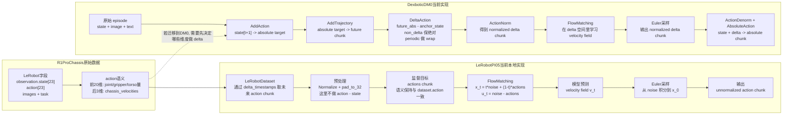
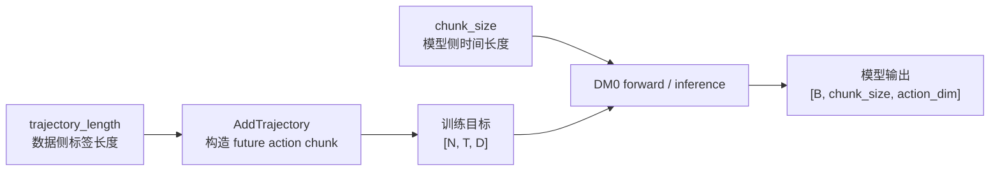
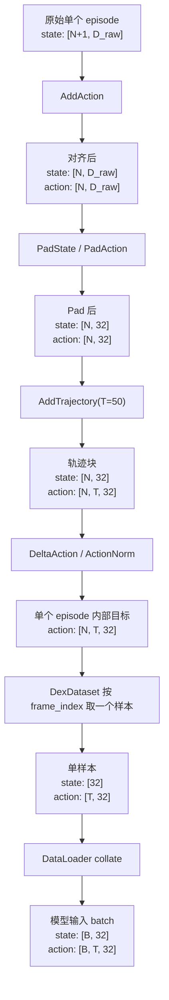

# DM0 中的 DeltaAction 机制分析

本文基于 `dexbotic` 本地代码库中的 DM0 实现，系统解释 `delta = action - state` 的缘由、数学原理、代码实现、数据流与程序调用流，以及这种方法和当前工程实现各自的优点、缺点与风险。

## 1. 问题定义

在本仓库的 DM0 训练数据构造阶段，几个核心概念的语义如下：

- `state`：当前帧的机器人状态向量，通常是 7D 的 `[x, y, z, roll, pitch, yaw, gripper]`，之后会 pad 到 32 维。
- `action`：在 `AddAction` 之后，首先不是底层电机指令，而是“未来绝对目标状态”。
- `trajectory`：由 `AddTrajectory` 把单步绝对目标扩展成未来多步绝对目标块。
- `delta_action`：由 `DeltaAction` 把未来绝对目标块改写成“相对当前状态的未来动作块”。

也就是说，本仓库里训练标签的构造路径不是“直接读取数据集里的动作”，而是：

```text
当前状态序列
-> 未来绝对目标
-> 未来绝对轨迹块
-> 未来相对轨迹块
```

这条路径由 `DM0ActionConfig.build_action_process_func()` 明确给出：

```python
Pipeline(
    [
        ToDict(),
        ToNumpy(),
        AddAction(predict_length=1),
        PadState(ndim=32, axis=-1),
        PadAction(ndim=32, axis=-1),
        AddTrajectory(trajectory_length=50, flatten=False, padding_mode="last"),
        DeltaAction(enable=True),
        ActionNorm(statistic_mapping=statistic_mapping, use_quantiles=True),
        LoadMultiModal(return_masks=True),
        ToList(),
    ]
)
```

## 2. 为什么要计算相对动作

把动作表示成 `delta = action - state`，是机器人学习里很常见的一种工程做法。其核心思想是：对策略来说，“接下来往左移 2cm”通常比“目标绝对坐标是某个具体位置”更容易泛化。

在 `dexbotic` 这套实现里，使用相对动作主要有四个原因：

1. **泛化更好**：相同的局部运动在不同绝对位置上的 delta 更一致，而绝对坐标会随起始位姿大幅变化。
2. **分布更集中**：大多数控制周期里的变化幅度较小，delta 常常集中在零附近，更利于回归或 flow matching 学习。
3. **多步预测更稳定**：DM0 一次预测未来 50 步轨迹块。将目标改写为相对动作后，轨迹块的数值范围更平滑。
4. **跨平台更容易迁移**：不同具身平台的绝对关节范围可能差异很大，但“每一步移动多少”往往更可比。

但需要明确，相对动作不是唯一正确的动作表示，而是一种工程上很实用的选择。它成立的前提是：`state` 与 `action` 的各维语义必须足够对齐，且相邻帧之间的变化不能过于剧烈。

## 3. 数学原理

### 3.1 平移维的相对动作

对平移维，例如末端 3D 坐标 `[x, y, z]`，相对动作就是普通逐维差分：

```python
delta_pos = target_pos - current_pos
```

例如：

```python
current_pos = [0.50, 0.10, 0.20]
target_pos  = [0.52, 0.11, 0.20]
delta_pos   = [0.02, 0.01, 0.00]
```

这表示“在当前基础上，x 前进 2cm，y 前进 1cm，z 不变”。

### 3.2 旋转维的相对动作

本仓库里旋转维并不是用四元数或旋转矩阵来做严格的 SO(3) 相对变换，而是采用一种更轻量的工程近似：

1. 先对欧拉角各维逐维相减
2. 再对周期维做 wrap 修正

即：

```python
delta_rot = target_rot - current_rot
delta_rot = wrap(delta_rot)
```

其中 `wrap` 的目标，是把差值折回最短角度区间。若周期范围为 `2pi`，则目标区间通常是 `[-pi, pi]`。

例如：

```python
current_yaw = -3.12
target_yaw  =  3.13
raw_delta   =  6.25
wrapped     = -0.033...
```

含义并不是“要转一整圈”，而是“跨过边界后，只需要沿最短方向旋转很小一段角度”。

这一步很重要，因为角度是周期变量。若不做 wrap，`179° -> -179°` 会被误算成 `-358°` 的巨大动作，严重污染动作分布。

### 3.3 夹爪维为什么不做差分

本仓库通过 `non_delta_mask` 指定某些维度不做差分。默认 7D 场景里，`gripper` 就属于这种维度。

原因是：

- 夹爪开合常常更像“目标状态”而非“连续位移”
- 它可能是离散或半离散控制量
- 与当前状态相减并不总是具有清晰的物理意义

因此在 `DeltaAction` 中，夹爪这类维度会在差分后被覆盖回绝对值：

```python
delta_action[..., non_delta_mask] = action[..., non_delta_mask]
```

所以对 7D 动作而言，可以把各维规则记成一句话：

```text
xyz 学位移，rpy 学最短角度差，gripper 学绝对目标值。
```

## 4. DM0 代码中的实现

### 4.1 训练侧主流程

DM0 的动作处理链路定义在 `dexbotic/exp/dm0_exp.py` 中：

```python
ToDict()
-> ToNumpy()
-> AddAction(predict_length=1)
-> PadState(ndim=32)
-> PadAction(ndim=32)
-> AddTrajectory(trajectory_length=50, flatten=False, padding_mode="last")
-> DeltaAction(enable=True)
-> ActionNorm(use_quantiles=True)
-> LoadMultiModal()
-> ToList()
```

其中 `AddAction`、`AddTrajectory`、`DeltaAction` 都定义在 `dexbotic/data/dataset/transform/action.py`。

### 4.2 AddAction：把下一帧状态当作绝对目标

`AddAction` 的核心逻辑是：

```python
state = episode_data_dict["state"]
action = state[self.predict_length :]
episode_data_dict["action"] = action
episode_data_dict["abs_action"] = action
for key in episode_data_dict.keys():
    if key == "meta_data":
        continue
    episode_data_dict[key] = episode_data_dict[key][: len(action)]
```

当 `predict_length=1` 时，含义是：

```text
当前帧 state[t] 的监督目标 action[t] = state[t+1]
```

所以这里的 `action` 其实首先是“未来绝对状态目标”。

### 4.3 AddTrajectory：构造未来多步绝对目标块

`AddTrajectory` 会把单步绝对目标扩展成未来轨迹块：

```python
trajectory = [action]
for i in range(1, self.trajectory_length):
    _next_action = np.copy(action[i:])
    _next_action = self.pad(_next_action, len(action), non_delta_mask)
    trajectory.append(_next_action)
trajectory = np.stack(trajectory, axis=-1)  # N D T
trajectory = np.transpose(trajectory, (0, 2, 1))  # N T D
```

输出形状从：

```text
action: [N, D]
```

变成：

```text
action: [N, T, D]
```

在 DM0 默认配置里，`T = 50`。

### 4.4 DeltaAction：绝对目标减当前状态

`DeltaAction` 的核心实现是：

```python
state = episode_data_dict["state"]
action = episode_data_dict["action"]

if action.ndim == state.ndim:
    delta_action = action - state
elif action.ndim == state.ndim + 1:
    delta_action = action - state[..., None, :]
else:
    raise ValueError(...)
```

如果 `action` 是 `[N, T, D]` 的轨迹块，而 `state` 是 `[N, D]`，就通过广播变成：

```text
delta_action[n, t, d] = action[n, t, d] - state[n, d]
```

这说明**训练标签的真实语义**是：

```text
以当前状态为锚点，未来第 1/2/.../T 步目标分别离当前状态多远
```

### 4.5 周期维的 wrap 修正

在 `DeltaAction` 中，周期维通过 `periodic_mask` 与 `periodic_range` 控制：

```python
if periodic_mask is not None:
    for dim in periodic_mask:
        delta_action[..., dim] = np.where(
            delta_action[..., dim] > periodic_range / 2,
            delta_action[..., dim] - periodic_range,
            delta_action[..., dim],
        )
        delta_action[..., dim] = np.where(
            delta_action[..., dim] < -periodic_range / 2,
            delta_action[..., dim] + periodic_range,
            delta_action[..., dim],
        )
```

对 `CALVIN` 之类的 7D 末端位姿数据，默认配置是：

```python
meta_data = {
    "non_delta_mask": [6],
    "periodic_mask": [3, 4, 5],
    "periodic_range": 2 * math.pi,
}
```

这意味着：

- 第 `3,4,5` 维被视为旋转角
- 第 `6` 维被视为夹爪绝对目标

### 4.6 推理端的逆变换：AbsoluteAction

模型推理输出的是归一化空间中的 delta 轨迹。服务端在输出前会执行：

```python
ToNumpy()
-> ActionDenorm(...)
-> AbsoluteAction()
```

`AbsoluteAction` 的核心逻辑是：

```python
if action.ndim == state.ndim:
    abs_action = state + action
elif action.ndim == state.ndim + 1:
    abs_action = state[..., None, :] + action

abs_action[..., non_delta_mask] = action[..., non_delta_mask]
```

也就是说，推理服务端会把 delta 重新加回当前状态，恢复成绝对动作轨迹；而 `non_delta_mask` 维继续保留网络输出的绝对值。

## 5. 数据流与程序调用流

下面这张图把训练侧与推理侧放在一起：

```mermaid
flowchart TD
    subgraph trainFlow [训练侧]
        dataSource[DataSourceMetaData]
        registerStep[register_dataset]
        dexDataset[DexDataset]
        toDict[ToDict]
        toNumpy[ToNumpy]
        addAction[AddAction]
        padState[PadState]
        padAction[PadAction]
        addTrajectory[AddTrajectory]
        deltaAction[DeltaAction]
        actionNorm[ActionNorm]
        loadMultiModal[LoadMultiModal]
        toList[ToList]
        dm0Model[DM0Model]

        dataSource --> registerStep --> dexDataset
        dexDataset --> toDict --> toNumpy --> addAction --> padState --> padAction --> addTrajectory --> deltaAction --> actionNorm --> loadMultiModal --> toList --> dm0Model
    end

    subgraph inferFlow [推理侧]
        httpReq[HTTPRequest]
        padStateInfer[PadState]
        actionNormInfer[ActionNorm]
        inferModel[model.inference_action]
        actionDenorm[ActionDenorm]
        absoluteAction[AbsoluteAction]
        httpResp[HTTPResponse]
        dexClient[DexClient]
        clientDelta[client.delta_action]

        httpReq --> padStateInfer --> actionNormInfer --> inferModel --> actionDenorm --> absoluteAction --> httpResp --> dexClient --> clientDelta
    end
```



### 5.1 训练侧数据流

训练数据流大致如下：

1. 各数据集在 `dexbotic/data/data_source/*_official.py` 中注册 `meta_data`
2. `DexDataset` 在取样时把 `meta_data` 注入到 episode
3. `ToDict` 把帧列表整理成 episode dict
4. `AddAction` 根据 `state[1:]` 构造未来绝对目标
5. `AddTrajectory` 构造未来 50 步目标块
6. `DeltaAction` 计算相对动作块
7. `ActionNorm` 把 delta 轨迹归一化到模型更容易学习的范围
8. 模型在归一化后的相对动作空间中训练

### 5.2 程序调用流

从程序角度看，调用链可以概括为：

```text
DM0DataConfig._build_dataset()
-> DM0ActionConfig.build_action_process_func()
-> DexDataset(...)
-> DexDataset.__getitem__()
-> self.action_process_func(...)
-> Pipeline.__call__()
-> ToDict / AddAction / AddTrajectory / DeltaAction / ...
```

其中 `meta_data` 的注入路径是：

```text
data_source meta_data
-> register_dataset(...)
-> CONVERSATION_DATA
-> DexDataset.dataset_map
-> DexDataset.unsafe_getitem()
-> ToDict(meta_data=...)
-> episode_data_dict["meta_data"]
-> DeltaAction / AddTrajectory / AbsoluteAction
```

### 5.3 推理侧数据流

推理服务的逻辑是：

```text
HTTP 请求
-> PadState
-> ActionNorm
-> model.inference_action
-> ActionDenorm
-> AbsoluteAction
-> 返回绝对动作轨迹
```

然后客户端 `DexClient` 如果开启 `use_delta=True`，会再次通过 `delta_action()` 按上一时刻动作做链式恢复。

## 6. 真实 7D 数值例子

下面用一个真实 7D 例子串起来说明四个阶段的数据变化。为了便于展示，将 `trajectory_length=50` 缩成 `3`。

### 6.1 原始状态序列

```python
s0 = [0.50, 0.10, 0.20,  3.13, 0.20, -3.12, 0]
s1 = [0.52, 0.11, 0.20, -3.12, 0.25,  3.13, 1]
s2 = [0.55, 0.15, 0.19, -3.10, 0.30, -3.11, 1]
s3 = [0.56, 0.18, 0.18, -3.08, 0.28, -3.09, 0]
s4 = [0.57, 0.20, 0.18, -3.07, 0.27, -3.08, 0]
```

原始形状：

```text
state_raw.shape = [5, 7]
```

### 6.2 AddAction 后

```python
state =
[
  s0,
  s1,
  s2,
  s3,
]  # [4, 7]

action_abs =
[
  s1,
  s2,
  s3,
  s4,
]  # [4, 7]
```

此时 `action_abs[0] = s1`，表示“当前是 `s0` 时，下一步绝对目标是 `s1`”。

### 6.3 AddTrajectory 后

```python
action_abs_traj =
[
  [s1, s2, s3],
  [s2, s3, s4],
  [s3, s4, s4],
  [s4, s4, s4],
]  # [4, 3, 7]
```

对于第 0 个样本，未来绝对目标块为：

```python
[
  [0.52, 0.11, 0.20, -3.12, 0.25,  3.13, 1],
  [0.55, 0.15, 0.19, -3.10, 0.30, -3.11, 1],
  [0.56, 0.18, 0.18, -3.08, 0.28, -3.09, 0],
]
```

### 6.4 DeltaAction 后

对第 0 个样本，相对动作块是：

```python
delta_traj[0] =
[
  [0.02, 0.01,  0.00, 0.033, 0.05, -0.033, 1],
  [0.05, 0.05, -0.01, 0.053, 0.10,  0.010, 1],
  [0.06, 0.08, -0.02, 0.073, 0.08,  0.030, 0],
]
```

其中：

- `x,y,z` 是普通差分
- `roll,yaw` 因跨越 `+-pi` 边界，做了 wrap 修正
- `gripper` 直接保留目标值，不是差分

### 6.5 客户端恢复

客户端的 `delta_action()` 逻辑是：

```python
original_action = np.copy(last_action)
original_action[6:] = 0
action = original_action + delta_action
action[3:6] = wrap_to_minus_pi_pi(action[3:6])
```

对第一个 delta：

```python
last_action = s0
delta = [0.02, 0.01, 0.00, 0.033, 0.05, -0.033, 1]
```

恢复后：

```python
exec_1 = [0.52, 0.11, 0.20, -3.12, 0.25, 3.13, 1]
```

第一步可以严格回到 `s1`。

但对于第二步，客户端使用的是：

```python
exec_2 = exec_1 + delta_traj[0][1]
```

而**训练标签的真实语义**却是：

```python
delta_traj[0][1] = s2 - s0
```

所以从第二步开始，客户端的链式执行与训练标签的“相对当前状态的未来轨迹块”语义并不严格同义。

## 7. 优点、缺点与实现风险

### 7.1 相对动作这个方法本身的优点

1. **泛化性强**：比绝对动作更不依赖具体初始位姿。
2. **学习更稳定**：小位移、小角度的分布更集中，回归更容易。
3. **更适合多步轨迹块建模**：未来 50 步的 delta 轨迹通常比绝对轨迹更平滑。
4. **与归一化配合更自然**：DM0 使用分位数归一化时，delta 空间通常更容易得到稳定统计量。

### 7.2 相对动作这个方法本身的缺点

1. **依赖状态与动作同语义对齐**：否则 `action - state` 可能失去物理意义。
2. **旋转不是严格几何表示**：欧拉角逐维相减只是工程近似，不是真正的 SO(3) 增量。
3. **多步误差容易累积**：一旦在执行时通过递推恢复绝对动作，误差可能逐步放大。
4. **需要额外规则**：像夹爪这种维度往往不能直接做差，需要 `non_delta_mask` 一类配置。

### 7.3 当前 dexbotic 实现的优点

1. **结构清晰**：`AddAction -> AddTrajectory -> DeltaAction` 三步解耦，语义明确。
2. **元数据驱动**：`non_delta_mask`、`periodic_mask`、`periodic_range` 使不同数据布局可复用同一套逻辑。
3. **训练与逆变换成对设计**：`DeltaAction` 与 `AbsoluteAction` 形成相对完整的前后处理闭环。
4. **适合 DM0 的轨迹块建模**：用相对动作块作为监督，与 `trajectory_length=50` 的设计天然匹配。

### 7.4 当前 dexbotic 实现的缺点与风险

1. **欧拉角 wrap 只是工程近似**：对大姿态变化或复杂旋转组合，逐维 wrap 可能不够准确。
2. **配置一致性要求高**：`non_delta_mask` / `periodic_mask` 若与真实数据语义不一致，会产生隐蔽错误。
3. **训练标签与客户端执行语义存在差异**：训练时第 `k` 步标签是 `s_{t+k} - s_t`，而客户端第 `k` 步执行更像“相对上一步结果递推”。
4. **客户端实现写死了 7D 假设**：`client.py` 中直接用 `3:6` 作为旋转维，用 `6:` 作为绝对维，这不如训练侧的 `meta_data` 方案通用。
5. **服务端与客户端都可能做逆变换**：服务端已经通过 `AbsoluteAction()` 把 delta 转为绝对动作；若客户端仍按 `use_delta=True` 再做一次累加，需要额外确认部署语义，避免重复叠加。
6. **推理端周期元数据未完全对齐**：推理配置里默认只显式注入了 `non_delta_mask`，周期维处理是否与训练端完全一致，需要部署时再单独核对。

## 8. 结论摘要

在 `dexbotic` 的 DM0 实现中，`DeltaAction` 不是一个孤立的小技巧，而是整个动作监督构造链路中的核心步骤：

- `AddAction` 把未来状态变成绝对目标
- `AddTrajectory` 把绝对目标扩成未来轨迹块
- `DeltaAction` 把未来轨迹块变成相对当前状态的动作块

这套设计的本质，是用更集中、更平滑、更容易泛化的 delta 空间来训练模型。对 7D 末端位姿来说，其实际规则是：

```text
xyz 做普通差分
rpy 做欧拉角逐维差分并 wrap
gripper 保留绝对值
```

这种方法在工程上非常实用，但也带来了若干必须明确意识到的代价：旋转表示是近似的，配置必须一致，多步执行与训练标签语义并不完全等价，服务端和客户端的逆变换职责也需要严格对齐。

## 9. Pi0.5的Action, Velocity以及R1 Pro chassis 数据集的Action与DM0的Delta Action的区别与详解

前面几节主要分析的是 DM0 自己的 `DeltaAction` 机制。但在与 `lerobot/pi0.5`、`R1 Pro chassis` 数据集做对照时，很容易把几个不同层面的“动作”与“速度”概念混在一起。这里专门把它们拆开说明。

### 9.1 先区分三个容易混淆的概念

在这三类系统里，至少同时存在下面三个不同层面的对象：

1. **数据集字段里的 `action`**  
   这是数据记录下来的原始动作语义，例如绝对关节角目标、夹爪开合量、底盘速度命令，或者它们的混合。

2. **表示变换意义上的 `delta action`**  
   这是像 DM0 中那样，由 `action - state` 构造出来的“相对当前状态的动作表示”。

3. **Flow Matching 里的 `velocity field`**  
   这是模型训练时在去噪 ODE 空间里学习的速度场，例如 `u_t = noise - actions`、`v_t = model(x_t, obs, t)`。它是采样动力学量，不等于机器人控制意义上的 delta action。

很多误解都来自把第 2 类和第 3 类混成一件事。它们都叫“速度”或“增量”，但语义层级完全不同：

- `delta action` 是**动作表示**
- `velocity field` 是**生成过程中的动力学量**

### 9.2 三者并排对照表

| 对比项 | `lerobot/pi0.5`（当前本地实现） | `dexbotic/DM0` | `R1 Pro chassis` 原始数据集 |
|---|---|---|---|
| 训练直接监督什么 | 直接监督数据集里的 `ACTION` chunk | 不直接监督原始 `dataset.action`；先构造未来绝对目标，再转成 delta chunk | 原始单步 `action[23]` |
| `action` 的训练语义 | 与数据集 `ACTION` 字段同语义 | 以当前 `state` 为锚点的未来相对动作块 | 一个混合语义的 23 维向量 |
| 是否显式做 `action - state` | 否 | 是 | 否 |
| `state` 是否参与标签构造 | 当前本地 `pi0.5` 主路径里否 | 是，既参与构造 delta，也参与推理恢复 absolute | 数据集中有 `observation.state[23]`，但数据本身没有自动做 `action - state` |
| 模型里的 `velocity` 是什么 | 去噪时间上的速度场 `v_t` | 也是去噪时间上的速度场，但它定义在 delta-action 空间上 | 不适用，数据集本身没有 `v_t` |
| 推理输出 | action chunk，语义与数据集 `ACTION` 一致 | 先输出 delta chunk，再通过 `ActionDenorm + AbsoluteAction` 恢复 absolute chunk | 数据集只提供原始 action 帧 |
| 是否需要 `state + delta` 恢复 | 当前本地 `pi0.5` 源码默认不需要 | 需要 | 只有在人为把它改写成 delta 表示时才需要 |
| 一句话概括 | 学的是“数据集原本定义的动作块” | 学的是“相对当前状态的未来 delta 轨迹块” | 不是统一的 absolute 或 delta，而是多种动作语义混合在一起 |

### 9.3 `R1 Pro chassis` 数据集的 `ACTION` 到底是什么

对这套数据来说，先不要急着问“它是 absolute 还是 delta”，因为它本身就是一个**混合语义向量**。

根据 `lerobot/bt/pi05/alig/data_convert.md` 与 `trainr1/config.py` 的描述，这套数据的 `action[23]` 布局如下：

| 索引 | 维度 | 含义 |
|---|---:|---|
| `[0:7]` | 7 | `left_arm`，左臂关节角度 |
| `[7:14]` | 7 | `right_arm`，右臂关节角度 |
| `[14]` | 1 | `left_gripper` |
| `[15]` | 1 | `right_gripper` |
| `[16:20]` | 4 | `torso` |
| `[20:23]` | 3 | `chassis_velocities = (linear_x, linear_y, angular_z)` |

因此这 23 维并不能整体简单归类为：

- 纯 absolute action
- 纯 delta action
- 纯 velocity command

更准确地说：

- 前 `20` 维更像关节/躯干/夹爪目标量
- 后 `3` 维明确是底盘速度命令

所以如果直接问“`R1 Pro chassis` 的 action 是不是 delta action”，答案通常是：**不是统一意义上的 delta action，它是一个混合动作语义向量**。

### 9.4 `lerobot/pi0.5` 当前本地实现中的 `action` 和 `velocity`

#### 9.4.1 `pi0.5` 并没有做 DM0 式 `action - state`

在当前本地 `lerobot/pi0.5` 实现里，`processor_pi05.py` 的前后处理主要做的是：

- 归一化/反归一化
- state 的离散化文本拼接
- 图像与文本 tokenization
- action padding / unpadding

并没有出现像 DM0 那样的：

```python
delta = action - state
absolute = state + delta
```

相反，当前 `pi0.5` 的输出后处理只是：

```python
UnnormalizerProcessorStep(...)
-> DeviceProcessorStep("cpu")
```

这说明至少在当前本地主路径里，`pi0.5` 默认假设：

```text
模型输出的 action 与数据集 ACTION 的语义相同
```

#### 9.4.2 `action_delta_indices` 不是“action value delta”

`PI05Config` 中有：

```python
@property
def action_delta_indices(self) -> list:
    return list(range(self.chunk_size))
```

这个名字很容易误导，但它在 LeRobot 数据集工厂里的含义其实是：

```text
未来哪些时间偏移的 action 要被取出来组成一个 chunk
```

也就是：

```python
delta_timestamps[key] = [i / fps for i in action_delta_indices]
```

这里的 `delta` 是 **timestamp delta**，不是 **action value delta**。

因此，`pi0.5` 当前本地实现做的是：

```text
从数据集中取未来 T 步的 action chunk
-> 归一化
-> 用 flow matching 建模这个 chunk
```

而不是：

```text
先把 action 改写成 action - state
-> 再去训练
```

#### 9.4.3 `pi0.5` 里的 `velocity v_t` 到底是什么

`pi0.5` 的训练前向是：

```python
time_expanded = time[:, None, None]
x_t = time_expanded * noise + (1 - time_expanded) * actions
u_t = noise - actions
...
v_t = self.action_out_proj(suffix_out)
loss = mse(u_t, v_t)
```

这里的：

- `actions` 是训练目标动作块
- `u_t = noise - actions` 是目标速度场
- `v_t` 是模型预测速度场

这个 `v_t` 是：

```text
生成模型在去噪时间 t 上的 velocity field
```

不是：

- 机器人任务空间里的“相对动作”
- 也不是底盘控制里的 `linear_x, linear_y, angular_z`

换句话说：

```text
Flow Matching 的 velocity != DM0 的 delta action
```

它们都可以被口语化叫成“速度”或“增量”，但并不是一回事。

#### 9.4.4 `pi0.5` 最终输出的是什么

`sample_actions()` 会从噪声开始做 Euler 采样：

```python
x_t = noise
for step in range(num_steps):
    v_t = denoise_step(x_t)
    x_t = x_t + dt * v_t
return x_t
```

最终返回的是采样后的 `x_0`，也就是：

```text
action chunk
```

它的语义与训练目标 `actions` 保持一致。因此在当前本地 `pi0.5` 实现里：

- 如果数据集 `ACTION` 是绝对动作块，就学绝对动作块
- 如果数据集 `ACTION` 是相对动作块，就学相对动作块
- 如果数据集 `ACTION` 是混合语义动作块，就学混合语义动作块

对你现在这套 `R1 Pro chassis` 数据来说，当前 `pi0.5` 路径学到的就是那 23 维混合语义 action chunk。

### 9.5 DM0 的 `delta action` 与 `pi0.5` 的根本差别

DM0 与当前本地 `pi0.5` 的最核心区别在于：

- `pi0.5`：**直接在数据集定义好的动作空间里训练**
- `DM0`：**先把动作目标改写到 delta 空间，再在 delta 空间里训练**

DM0 的训练链路是：

```text
state sequence
-> AddAction
-> future absolute target
-> AddTrajectory
-> future absolute chunk
-> DeltaAction
-> future delta chunk anchored at current state
-> ActionNorm
-> model
```

这里的 `DeltaAction` 明确执行了：

```python
delta_action = action - state[..., None, :]
delta_action[..., non_delta_mask] = action[..., non_delta_mask]
delta_action[..., periodic_mask] = wrap(...)
```

所以对 DM0 来说，模型学到的 `action` 已经不是原始动作语义，而是：

```text
以当前 state 为锚点的未来 delta trajectory
```

推理时还需要再走：

```text
ActionDenorm + AbsoluteAction
```

把 delta 恢复回 absolute action chunk。

这一步正是当前本地 `pi0.5` 主路径默认没有的。

### 9.6 三者的数据流对照图

下面这张图把三者的关系放到一个统一视角里：



### 9.7 最容易混淆的几个问题

#### 问题 1：`pi0.5` 预测的是不是 delta action？

基于当前本地 `src/lerobot/policies/pi05` 代码，答案是：

```text
默认不是 DM0 式的 delta action。
```

更准确地说，当前本地 `pi0.5` 预测的是：

```text
与数据集 ACTION 字段同语义的 future action chunk
```

#### 问题 2：`velocity` 不就是 `delta action` 吗？

不一定，要看你说的是哪一个 `velocity`。

- 若你说的是底盘 `linear_x, linear_y, angular_z`，那它是**控制命令语义上的速度**
- 若你说的是 `pi0.5` 模型里的 `v_t`，那它是**flow matching 去噪空间里的 velocity field**
- 若你说的是 DM0 的 `delta = action - state`，那它是**动作表示上的相对动作**

这三者在名字上都像“速度/增量”，但不是同一个对象。

#### 问题 3：为什么 `pi0.5` 和 DM0 都有 `velocity`，语义却不同？

因为它们都用了 flow matching，所以模型内部都会出现：

```text
velocity field v_t
```

但关键差异在于：

- `pi0.5` 的 `v_t` 定义在“当前动作表示空间”上
- `DM0` 的 `v_t` 定义在“delta-action 表示空间”上

也就是说，**内部生成建模框架相似，不代表监督目标语义相同**。

#### 问题 4：`R1 Pro chassis` 的 `ACTION` 能不能直接当 DM0 的 delta action？

通常不能直接这么说。

原因有两层：

1. 它本身是混合语义动作向量，不是统一的 delta 量
2. 其中后 3 维是底盘速度，前 20 维更像关节/躯干/夹爪量

如果真要把这套数据放进 DM0 的 delta 逻辑里，需要先明确：

- 哪些维度应做 `action - state`
- 哪些维度应像 `gripper` 一样保持绝对值
- 哪些维度属于周期量，需要 wrap

也就是说，不能把整个 23 维一刀切地全部当成 DM0 风格 delta。

### 9.8 一句话总结

可以把三者的关系压缩成下面三句话：

1. `R1 Pro chassis` 数据集定义了一个**混合语义**的 `action[23]`
2. 当前本地 `lerobot/pi0.5` 默认是**直接学习这个数据集动作块本身**
3. `dexbotic/DM0` 则是**先把目标改写成以当前 state 为锚点的 delta trajectory，再在这个 delta 空间里训练与采样**

因此：

```text
DM0 的 delta action 不是 pi0.5 的 v_t
pi0.5 的 v_t 也不是 R1 Pro chassis 数据集里的底盘 velocity
```

它们处在三个不同层级上，必须分开理解。

## 10. DM0连续推理上的优化可能

前面已经说明，DM0 在训练时学习的是“以当前状态为锚点的未来 delta trajectory”，推理时则通过 `ActionDenorm + AbsoluteAction` 把预测结果恢复成 absolute action chunk。围绕这条链路，一个很自然的问题是：既然模型一次能预测未来 50 步，那么在连续控制里应该怎样使用这 50 步，才能更稳定、更准确？

这一节专门总结当前 `dexbotic` 的实际做法、它和理想的滚动重规划之间的区别，以及可能的优化方向。

### 10.1 当前 `dexbotic` 实现的真实行为

当前客户端不是“每执行一步就重新推理一次”，而是：

1. 当 `action_queue` 为空时，向 `/process_frame` 发起一次请求
2. 一次拿回一个未来动作块
3. 把这个动作块放进 `action_queue`
4. 后续每个控制周期只 `popleft()` 一个动作执行
5. 等队列空了，再发起下一次推理

也就是说，当前实现更接近：

```text
一次规划 50 步
-> 开环执行这 50 步
-> 再规划下一块 50 步
```

而不是：

```text
每执行 1 步
-> 立刻基于新观测重新规划未来 50 步
```

客户端逻辑可以概括为：

```python
if len(self.action_queue) == 0:
    self.acquire_new_action(observation, prompt)

action = self.action_queue.popleft()
self.last_act = action
return action
```

因此，如果第一次推理从第 0 步出发预测了未来 50 步，那么**当前代码并不会在第 1 步时立即再推一次“剩余 49 步”**。而是通常会把第一次得到的 50 步块先逐步消费完，再重新请求下一块 50 步动作。

### 10.2 模型内部预测的是什么，接口最终输出的又是什么

在 DM0 的标准推理链里，要区分两个层面：

1. **模型内部采样结果**  
   这是未来 50 步的 **delta chunk**

2. **服务端接口返回结果**  
   这是经过 `ActionDenorm + AbsoluteAction` 恢复后的 **absolute chunk**

所以，若训练时 `trajectory_length=50`，当前标准服务端推理通常会：

- 内部采样未来 50 步 delta trajectory
- 再把它恢复成未来 50 步 absolute action
- 最终把这 50 步 absolute chunk 返回给客户端

因此更准确地说：

- 如果问“模型预测什么”，答案是：**未来 50 步 delta chunk**
- 如果问“接口输出什么”，答案是：**未来 50 步 absolute action chunk**

### 10.3 第二次推理是不是“从第 1 步开始预测剩余 49 步”

从模型结构上说，即使把系统改造成“每步都重推”，第二次推理也不应理解成“只预测剩余 49 步”。更准确的理解应该是：

- 第一次推理：从当前时刻 `t=0` 出发，预测未来 horizon `50`
- 第二次推理：在执行了第 1 步后，基于新的观测与状态，从新的当前时刻 `t=1` 再预测未来 horizon `50`

也就是说，第二次推理通常还是会输出一个**完整的 50 步 horizon**，只是这个 horizon 与上一次预测在时间上有大量重叠。

所以，“第二次推理预测后面 49 步”这句话从直觉上不算全错，但从严格实现上说，更准确的表述是：

```text
第二次推理会重新预测一个新的 50 步 horizon，
而不是只计算一个 49 步残余块。
```

### 10.4 第二次推理会不会更准

这个问题要先区分“相对步数”与“绝对未来时刻”。

#### 情况 A：比较“第 3 个相对步”

- 第一次推理的“第 3 步”对应未来时刻 `t=3`
- 第二次推理如果在 `t=1` 再发起，它的“第 3 步”对应未来时刻 `t=4`

这两个并不是同一个物理目标时刻，所以不能直接比较谁更准。

#### 情况 B：比较“同一个绝对未来时刻”

例如都比较未来真实时刻 `t=3`：

- 第一次推理从 `t=0` 看 `t=3`，是向前看 3 步
- 第二次推理从 `t=1` 看 `t=3`，是向前看 2 步

在这种比较下，**后一次重推通常更有机会更准**，原因有两个：

1. **预测 horizon 更短**  
   同一个未来时刻，离当前越近，一般越容易预测

2. **条件观测更新了**  
   新的图像、新的状态、更接近真实执行后的系统位置，通常能提供更准确的条件信息

但这不是数学保证，只是常见经验趋势。它还会受到以下因素影响：

- 模型本身误差
- 执行动作后的状态偏差
- 视觉观测噪声
- 推理时采样误差
- 动作执行延迟

### 10.5 为什么 DM0 特别适合做滚动重规划

DM0 学的是：

```text
以当前 state 为锚点的未来 delta trajectory
```

这意味着每次重新推理时，模型都会：

- 重新读取新的当前状态
- 重新构造以该状态为锚点的未来相对轨迹

因此从方法论上说，DM0 非常适合做：

```text
receding horizon / MPC 风格的滚动重规划
```

因为每次新推理都会基于最新状态重建一个新的 delta trajectory，而不是死守第一次预测时的旧锚点。

也正因为如此，如果系统能够负担更高推理频率，那么通常：

- **每步重推 50 步**
会比
- **一次推 50 步然后整块开环执行**

更稳健。

### 10.6 当前实现的局限

当前 `dexbotic` 默认行为并没有充分利用这种“每步重锚定”的优势。它的局限主要在于：

1. **长 horizon 开环执行**  
   第一次预测得到的第 20、30、40、50 步动作，在执行过程中不会被新观测修正

2. **误差逐步积累**  
   执行误差、环境扰动、感知误差都会在 50 步块内部累积

3. **后段动作通常更不可靠**  
   对同一个 chunk 来说，越往后的预测通常越受模型外推误差影响

4. **与 delta 表示的“局部修正优势”不完全匹配**  
   delta trajectory 的优势之一恰恰是便于局部修正，而当前实现采用整块缓存、整块消费，削弱了这一点

### 10.7 可行的优化方向

围绕 DM0 当前的连续推理机制，至少有下面几种优化思路。

#### 方案 A：缩短实际执行窗口，保留 50 步预测

这是最直接、风险最小的优化：

- 模型仍然一次预测 50 步
- 但只执行前 `k` 步，例如前 1、2、5、10 步
- 然后立即基于最新观测重新推理一个新的 50 步块

这相当于：

```text
长预测 horizon + 短执行 horizon
```

优点：

- 保留长 horizon 的规划能力
- 同时利用频繁重规划提升稳定性
- 减少后半段低置信度动作的直接执行

这是最符合 DM0 方法特性的优化方向。

#### 方案 B：每步重规划 50 步

这是更激进的 receding-horizon 版本：

- 每执行一步
- 就重新请求一次未来 50 步

优点：

- 每一步都用最新观测
- 对同一未来时刻的预测通常更近、更可能更准确
- 对环境扰动更鲁棒

缺点：

- 推理成本显著上升
- 服务端吞吐与延迟压力更大
- 若推理时间接近控制周期，可能引入实时性问题

#### 方案 C：重叠块融合

若连续推理频率较高，可以把两次预测的重叠部分做融合，例如：

- 仅使用最新块覆盖旧块
- 或对重叠时间段做加权平均
- 或按“越近时刻优先使用最新预测”的策略更新队列

优点：

- 能平滑切换两次预测
- 减少块边界处的动作跳变

缺点：

- 实现复杂度高
- 若融合规则设计不好，可能引入不一致的控制语义

#### 方案 D：基于置信度或时间位置裁剪

如果观察到 chunk 后半段误差较大，可以显式规定：

- 只执行前若干步
- 或对越远未来的步给予更低权重

这实际上是把“后半段更不可靠”的经验规律工程化。

#### 方案 E：把 action queue 改为短队列

当前是一次填满 50 步。也可以改成：

- 保持模型输出 50 步
- 但只向队列中塞前 `k` 步
- 其余部分直接丢弃

这在实现上比“复杂重叠融合”简单，但效果上能接近“短执行 horizon”的方案。

### 10.8 哪个优化最值得优先尝试

从工程收益比来看，最值得优先尝试的是：

```text
方案 A：保持预测 50 步，但只执行前少量步，然后重新推理
```

原因是：

1. **不需要改模型训练目标**
2. **不需要改 `trajectory_length=50` 的训练配置**
3. **能直接利用 DM0 的 delta trajectory + 当前 state anchor 机制**
4. **实现成本低于“每步重规划 + 重叠融合”**
5. **通常能显著改善长块开环执行的误差积累问题**

如果要进一步做真机闭环优化，可以把执行步数 `k` 作为超参数调节，例如测试：

- `k = 1`
- `k = 2`
- `k = 5`
- `k = 10`

从而在“控制稳定性”和“推理成本”之间找到平衡点。

### 10.9 一句话总结

对于 DM0 来说，一次推理确实通常会产生未来 50 步动作块；但当前 `dexbotic` 默认实现是“整块缓存、整块消费”，而不是“每步滚动重规划”。

若从控制优化角度看，更合理的方向通常不是把第二次推理理解成“预测剩余 49 步”，而是：

```text
每次都重新预测一个新的 50 步 horizon，
但只执行前若干步，再基于新观测重规划。
```

这更符合 DM0 的 delta-action 表示优势，也更容易提升连续控制中的稳定性与精度。

## 11. 绕环修正与Delta Action及其实例

前面的章节已经从代码和数据流角度解释了 `DeltaAction` 的整体机制。本节进一步聚焦一个在机器人动作表示里非常关键、也最容易被误解的细节：**绕环修正（wrap-around correction）**。

它和 `DeltaAction` 的关系非常直接：

- `DeltaAction` 负责把未来绝对目标改写成“相对当前状态的动作差”
- 绕环修正负责确保**周期性维度上的动作差**表达的是“最短旋转路径”，而不是跨越周期边界后产生的假大动作

### 11.1 什么是“绕环修正”

“绕环修正”是机器人控制、计算机图形学、姿态估计中很常见的术语。它主要用于处理**周期变量**，最典型的就是角度。

位置变量是线性的，例如：

```text
8 -> 10 的差值是 +2
```

但角度变量不是线性的，它具有“绕一圈回到原点”的性质。例如：

- `π` 和 `-π` 表示同一个边界位置
- `179°` 和 `-179°` 实际上只差 `2°`
- 但如果直接做普通减法，会得到 `-358°`

这显然不符合真实控制语义。  
因此所谓“绕环修正”，就是：

```text
把角度差值重新映射到一个最短等价区间，
例如 [-π, π] 或 [-180°, 180°]
```

这样模型学到的是“最短旋转方向”，而不是跨边界造成的伪大动作。

### 11.2 为什么绕环修正必须和 DeltaAction 一起看

在 DM0 中，`DeltaAction` 的核心是：

```text
delta = action - state
```

这对线性维度没问题，但对角度维度不够。原因是：

- 普通减法默认变量在数轴上线性分布
- 角度实际上是定义在圆上的周期变量

所以对于周期维度，DM0 不是简单地“相减后结束”，而是：

```text
先相减
-> 再做 wrap
-> 把差值折回最短角度区间
```

换句话说：

```text
绕环修正不是 DeltaAction 之外的附加装饰，
而是周期维度上的 DeltaAction 正确定义的一部分。
```

### 11.3 DM0 代码里是怎么实现的

训练侧 `DeltaAction` 的关键实现如下：

```python
state = episode_data_dict['state']
action = episode_data_dict['action']

if action.ndim == state.ndim:
    delta_action = action - state
elif action.ndim == state.ndim + 1:
    delta_action = action - state[..., None, :]

if periodic_mask is not None:
    for dim in periodic_mask:
        delta_action[..., dim] = np.where(
            delta_action[..., dim] > periodic_range / 2,
            delta_action[..., dim] - periodic_range,
            delta_action[..., dim],
        )
        delta_action[..., dim] = np.where(
            delta_action[..., dim] < -periodic_range / 2,
            delta_action[..., dim] + periodic_range,
            delta_action[..., dim],
        )

delta_action[..., non_delta_mask] = action[..., non_delta_mask]
```

这段逻辑的含义非常明确：

1. 先对所有维度做 `action - state`
2. 对 `periodic_mask` 指定的维度再做 wrap
3. 对 `non_delta_mask` 指定的维度覆盖回绝对值

所以对不同维度来说，`DeltaAction` 的真实语义并不完全一样：

- **线性维度**：普通相对位移
- **周期维度**：最短角度差
- **非 delta 维度**：绝对目标值

### 11.4 周期维度是怎么指定的

在 DM0 里，哪些维度是周期量，不是写死在模型主体里的，而是通过数据集 `meta_data` 提供。例如 `CALVIN`：

```python
meta_data = {
    'non_delta_mask': [6],
    'periodic_mask': [3, 4, 5],
    'periodic_range': 2 * math.pi,
}
```

这意味着：

- 第 `3,4,5` 维被当作周期维度
- 周期长度是 `2π`
- 第 `6` 维（例如 gripper）不做 delta，而保留绝对值

在典型的 7D 末端动作 `[x, y, z, roll, pitch, yaw, gripper]` 里，这基本对应：

- `0:3`：位置维 `xyz`
- `3:6`：姿态维 `rpy`
- `6`：夹爪维

### 11.5 一个最直观的角度例子

假设当前 `yaw = 179°`，目标 `yaw = -179°`。

如果直接做差：

```python
raw_delta = -179 - 179 = -358°
```

这会让模型误以为需要大幅反向转动将近一整圈。

但物理上最短路径其实只是：

```python
wrapped_delta = +2°
```

反过来也是一样：

```python
current_yaw = -179°
target_yaw  = 179°
raw_delta   = 358°
wrapped_delta = -2°
```

也就是说，绕环修正的原则可以概括成一句话：

```text
永远选择同一姿态差的最短等价表示。
```

### 11.6 为什么这样做

#### 1. 避免边界造成假大动作

如果不做绕环修正，那么：

- 姿态几乎没变
- 标签数值却突然跳到一个很大的正值或负值

这会导致训练信号出现人为的非连续性。

#### 2. 让损失函数看到更真实的误差

DM0 的训练是连续动作回归，后面又会接归一化和 flow matching。  
如果标签出现这种“跨边界伪大跳变”，那么：

- MSE 会被夸大
- 统计量会被污染
- 模型更难学到平滑策略

所以绕环修正本质上是在保证：

```text
模型学习到的是“真实的几何差异”，
不是“坐标表示的人为跳变”。
```

#### 3. 多步轨迹块里尤其重要

DM0 不是只预测一步，而是预测未来 50 步轨迹块。  
如果周期维不做 wrap，那么：

- 每一帧都可能在边界处出现巨大跳变
- 整条未来轨迹会出现很多尖峰
- 这会显著破坏 chunk 的平滑性

因此，绕环修正对于多步轨迹建模比单步预测更重要。

### 11.7 一个 7D DeltaAction 小例子

下面给一个简化的 7D 例子：

```python
state  = [0.50, 0.10, 0.20,  3.13, 0.20, -3.12, 0]
action = [0.52, 0.11, 0.20, -3.12, 0.25,  3.13, 1]
```

其中维度语义为：

```text
[x, y, z, roll, pitch, yaw, gripper]
```

#### 第一步：普通相减

```python
raw_delta =
[
  0.02,        # x
  0.01,        # y
  0.00,        # z
 -6.25,        # roll
  0.05,        # pitch
  6.25,        # yaw
  1,           # gripper
]
```

#### 第二步：对周期维做 wrap

若 `roll/yaw` 属于 `periodic_mask`，则：

- `-6.25` 会被修正为大约 `+0.033`
- `+6.25` 会被修正为大约 `-0.033`

#### 第三步：对 gripper 保持绝对值

`gripper` 不做“当前减目标”的相对差，而是直接保留目标值 `1`。

所以最终的 `delta_action` 会变成：

```python
delta_action =
[
  0.02,
  0.01,
  0.00,
  0.033,
  0.05,
 -0.033,
  1,
]
```

这就是一个完整的“DeltaAction + 绕环修正 + non_delta_mask”联合例子。

### 11.8 推理时的逆变换也会遇到绕环问题

训练时要在 `DeltaAction` 里做绕环修正；推理时把 delta 恢复成 absolute action，也同样会遇到周期边界问题。

因此 `AbsoluteAction` 里也有一层周期修正逻辑，大意是：

```text
先做 state + delta
-> 再把周期维折回合法区间
```

也就是说，DM0 对周期维的处理是**前后对称成对设计**的：

- 训练前向：构造 delta 时做 wrap
- 推理后处理：恢复 absolute 时再次做 wrap

### 11.9 当前实现里还存在一个工程细节

从本地代码分析还能看到一个实现层面的现象：

- 训练侧的周期处理主要依赖 `meta_data` 中的 `periodic_mask` / `periodic_range`
- 但客户端有一部分逻辑又把 `3:6` 维写死成旋转维来处理

这意味着当前项目里其实同时存在两层语义：

1. **通用 transform 语义**：由 `meta_data` 决定哪些维度是周期维
2. **7D 末端位姿场景语义**：客户端直接假设 `3:6` 是姿态角

这对 7D 场景是方便的，但从软件工程角度也意味着：

```text
若未来动作布局变化，
客户端的硬编码逻辑可能与训练侧 meta_data 语义脱节。
```

### 11.10 一句话总结

“绕环修正”不是机器人领域里一个模糊的行话，而是对周期性动作维度做**最短路径差值修正**的具体机制。

把它和 `DeltaAction` 放在一起理解，可以压缩成一句话：

```text
DeltaAction 负责把未来目标改写成相对当前状态的动作差，
而绕环修正负责确保周期维度上的这个“动作差”表达的是最短真实旋转，而不是跨边界造成的假大跳变。
```

如果不做这一步，DM0 在旋转维上的标签、统计量、损失和推理恢复都会失真；做了这一步，模型才真正学到“局部连续、几何合理”的相对动作表示。

## 12. trajectory_length和chunk_size的关系

这一节专门回答一个在阅读 DM0 代码时非常容易混淆的问题：

```text
DM0 的 trajectory_length=50 和模型里的 chunk_size=50，到底是不是一回事？
```

先给结论：

1. **语义上，它们都在表达“未来动作块长度”**
2. **实现上，它们不在同一层，也不是同一个变量**
3. **在当前 `dexbotic` 的 DM0 实现里，它们应当保持相等**
4. **改其中一个，不会自动联动修改另一个**

### 12.1 两个参数分别属于哪一层

| 参数 | 所在层 | 当前默认值 | 控制什么 | 本质含义 |
|---|---|---:|---|---|
| `trajectory_length` | 数据预处理层 | `50` | `AddTrajectory` 把单步动作扩成多长的未来轨迹块 | 训练标签的时间长度 |
| `chunk_size` | 模型配置层 | `50` | 模型 forward / sampling 的动作序列长度 | 模型一次建模的时间长度 |

也就是说：

- `trajectory_length` 决定的是“老师给学生多长的监督答案”
- `chunk_size` 决定的是“学生一次输出多长的动作序列”

在当前 DM0 实现里，老师给 `50` 步，学生也输出 `50` 步，所以两者语义上高度对应。

### 12.2 数据侧：`trajectory_length` 是怎么生效的

DM0 的动作处理链在 `DM0ActionConfig.build_action_process_func()` 中定义：

```python
@dataclass
class DM0ActionConfig(ActionConfig):
    trajectory_length: int = field(default=50)

    def build_action_process_func(self) -> Pipeline:
        statistic_mapping = self._read_norm_stats(self.statistic_mapping)
        action_config = Pipeline(
            [
                ToDict(),
                ToNumpy(),
                AddAction(predict_length=1),
                PadState(ndim=32, axis=-1),
                PadAction(ndim=32, axis=-1),
                AddTrajectory(trajectory_length=50, flatten=False, padding_mode="last"),
                DeltaAction(enable=True),
                ActionNorm(statistic_mapping=statistic_mapping, use_quantiles=True),
                LoadMultiModal(return_masks=True),
                ToList(),
            ]
        )
```

这里有一个非常重要的实现细节：

```text
虽然 DM0ActionConfig 有 trajectory_length 字段，
但 AddTrajectory(...) 当前是写死 50 的，
并没有直接使用 self.trajectory_length。
```

`AddTrajectory` 自己的实现是：

```python
episode_data_dict['meta_data']['trajectory_length'] = self.trajectory_length
action = episode_data_dict['action']  # shape: N D

trajectory = [action]
for i in range(1, self.trajectory_length):
    _next_action = np.copy(action[i:])
    _next_action = self.pad(_next_action, len(action), non_delta_mask)
    trajectory.append(_next_action)

trajectory = np.stack(trajectory, axis=-1)  # N D T
trajectory = np.transpose(trajectory, (0, 2, 1))  # N T D
episode_data_dict['action'] = trajectory
```

这说明：

- 数据侧最终会构造出 `[N, T, D]`
- 其中 `T = trajectory_length`

所以数据侧的 `trajectory_length` 的真实含义是：

```text
每个训练样本的未来动作块长度
```

### 12.3 模型侧：`chunk_size` 是怎么生效的

模型配置里有独立的 `chunk_size`：

```python
class DM0Config(DexboticConfig):
    action_dim: int = 32
    chunk_size: int = 50
```

训练 forward 时，模型按 `chunk_size` 取 suffix 的动作 token：

```python
suffix_out_final = suffix_out[:, -self.model.config.chunk_size :]
v_t = self.model.action_out_proj(suffix_out_final)
action_loss = F.mse_loss(v_t, u_t, reduction="mean")
```

推理时采样噪声的形状也直接由 `chunk_size` 决定：

```python
noise = torch.normal(
    0,
    1,
    size=(batch_size, self.model.config.chunk_size, self.config.action_dim),
    device=device,
    dtype=dtype,
)
```

因此模型侧的 `chunk_size` 的真实含义是：

```text
模型一次前向/采样要处理多少个动作时间步
```

### 12.4 两者的关系图



这张图表达的是：

- `trajectory_length` 决定数据给出的监督目标长度
- `chunk_size` 决定模型自身处理与输出的长度
- 在当前 DM0 里，这两条链必须对齐

### 12.5 如果我把 trajectory_length 改成 32，chunk_size 会自动变成 32 吗

不会。

原因有两个：

1. `trajectory_length` 和 `chunk_size` 是两个独立变量
2. 当前 `DM0ActionConfig` 里的 `AddTrajectory(...)` 还写死成了 `50`

所以如果你只改：

```python
trajectory_length: int = 32
```

那很可能出现的情况是：

- 配置字段看起来是 `32`
- 数据侧真正 `AddTrajectory(...)` 仍然还是 `50`
- 模型里的 `chunk_size` 也仍然还是 `50`

因此更准确地说：

```text
当前实现里，trajectory_length 和 chunk_size 都要分别手动核对和修改。
```

### 12.6 两者的数值可以不同吗

从概念上说，可以不同，因为它们不是同一个参数。  
但从**当前 DM0 实现**来说，通常不应该不同。

#### 情况 A：`trajectory_length > chunk_size`

例如：

```text
trajectory_length = 50
chunk_size = 32
```

这意味着数据给模型的 `actions` 是 `[B, 50, 32]`，而模型只输出后 `32` 个时间步。  
这样很容易在 loss 计算时出现时间维不一致的问题。

#### 情况 B：`trajectory_length < chunk_size`

例如：

```text
trajectory_length = 32
chunk_size = 50
```

这种情况有时不会立刻报 shape 错，但会产生更隐蔽的训练/推理语义错位：

- 训练数据只监督 32 步
- 推理时模型却按 50 步去采样输出

也就是说：

```text
训练看到的 horizon 和推理输出的 horizon 不一致
```

这通常比直接报错更危险。

### 12.7 当前实现里应满足的约束条件

在当前 `dexbotic/DM0` 实现里，最重要的约束是：

```text
trajectory_length == chunk_size
```

除此之外，还应满足：

| 约束 | 原因 |
|---|---|
| `trajectory_length == chunk_size` | 数据监督长度必须与模型时间维一致 |
| 有效 episode 长度 `>= trajectory_length` | `AddTrajectory` 默认不启用 `padding_action`，长度不足会断言失败 |
| 训练和推理使用同一 horizon | 否则会出现语义错位 |
| 修改 horizon 后最好重算 `norm_stats` | DM0 的统计量是在 `Pad -> Trajectory -> Delta` 后的目标空间上统计的 |
| 旧 checkpoint 不能想当然直接当作新 horizon 模型用 | 原 checkpoint 的训练时间视界可能与新设定不一致 |

### 12.8 一个实用判断标准

如果你问：

```text
“DM0 的 trajectory_length=50 是不是就是 chunk_size=50？”
```

最准确的回答不是“完全是”，也不是“完全不是”，而是：

```text
它们在当前实现里共同指向同一个 50 步动作块长度，
但一个是数据侧参数，一个是模型侧参数。
语义上必须对齐，实现上需要分别维护。
```

### 12.9 一句话总结

你可以把它记成：

```text
trajectory_length = 数据侧 chunk 长度
chunk_size       = 模型侧 chunk 长度
当前 DM0 默认两者都为 50，并且最好始终保持相等
```

## 13. 变量"N, B, T, D"的含义以及它们在数据流中的变化

阅读 DM0 数据流时，最容易混淆的就是下面四个字母：

- `N`
- `B`
- `T`
- `D`

它们都可能出现在类似 `[N, T, D]`、`[B, T, D]` 这样的张量形状里，但表示的含义并不一样。

### 13.1 四个维度分别是什么意思

| 符号 | 含义 | 所属层面 |
|---|---|---|
| `N` | 单个 episode 内部可形成的时间样本数 | 轨迹时间维 |
| `B` | 一次并行送进模型的样本数 | batch 维 |
| `T` | 每个样本对应的未来动作块长度 | 时间 horizon |
| `D` | 动作向量维度，进入模型前通常 pad 到 32 | 特征维 |

其中最容易混的是：

- `N` 不是 batch size
- `B` 才是 batch size

### 13.2 一个最简直观解释

你可以这样理解：

- `N`：一条轨迹里有多少个时间位置可拿来训练
- `B`：一次训练拿多少个时间位置并行处理
- `T`：每个时间位置往未来看多少步
- `D`：每一步动作有多少维

### 13.3 完整形状流转图

下面这张图把 `DM0` 从原始 episode 到最终送进模型的完整维度流转串起来：



### 13.4 完整形状流转表

| 阶段 | 操作 | `state` 形状 | `action` 形状 | 这里的主角是谁 |
|---|---|---:|---:|---|
| 1 | 原始 episode | `[N+1, D_raw]` | 通常还未构造成监督目标 | `N+1` |
| 2 | `AddAction` | `[N, D_raw]` | `[N, D_raw]` | `N` |
| 3 | `PadState / PadAction` | `[N, 32]` | `[N, 32]` | `N, D` |
| 4 | `AddTrajectory` | `[N, 32]` | `[N, T, 32]` | `N, T, D` |
| 5 | `DeltaAction / ActionNorm` | `[N, 32]` | `[N, T, 32]` | `N, T, D` |
| 6 | `DexDataset` 取一个 `frame_index` | `[32]` | `[T, 32]` | `T, D` |
| 7 | DataLoader 拼 batch | `[B, 32]` | `[B, T, 32]` | `B, T, D` |
| 8 | 模型训练/推理 | `[B, 32]` | `[B, T, 32]` | `B, T, D` |

### 13.5 每一步的语义流转表

不仅形状会变化，`action` 的语义也会变化。下面这张表把“形状变化”和“语义变化”放在一起看。

| 阶段 | 操作 | `state` 形状 | `action` 形状 | 此时 `action` 的语义 |
|---|---|---:|---:|---|
| 1 | 原始 episode | `[N+1, D_raw]` | 未统一 | 原始数据，还不是 DM0 最终监督目标 |
| 2 | `AddAction` | `[N, D_raw]` | `[N, D_raw]` | **未来绝对目标** |
| 3 | `PadState / PadAction` | `[N, 32]` | `[N, 32]` | 仍是**未来绝对目标** |
| 4 | `AddTrajectory` | `[N, 32]` | `[N, T, 32]` | **未来绝对轨迹块** |
| 5 | `DeltaAction` | `[N, 32]` | `[N, T, 32]` | **未来 delta 轨迹块** |
| 6 | `ActionNorm` | `[N, 32]` | `[N, T, 32]` | **归一化后的未来 delta 轨迹块** |
| 7 | 取单样本 | `[32]` | `[T, 32]` | 单个训练样本的 delta 轨迹块 |
| 8 | 拼 batch | `[B, 32]` | `[B, T, 32]` | batch 级 delta 轨迹块 |
| 9 | 推理后 `ActionDenorm` | `[B, 32]` | `[B, T, 32]` | **反归一化后的 delta 轨迹块** |
| 10 | 推理后 `AbsoluteAction` | `[B, 32]` | `[B, T, 32]` | **未来绝对轨迹块** |

也就是说，DM0 的 `action` 在整条链路中至少经历了三次关键语义变化：

```text
未来绝对目标
-> 未来绝对轨迹块
-> 未来 delta 轨迹块
-> 推理后再恢复成未来绝对轨迹块
```

### 13.6 为什么 `N` 不是 batch size

`N` 出现在 `AddTrajectory` 这样的数据变换里，代表的是：

```text
单个 episode 内部有多少个时间位置可以形成训练样本
```

例如：

- 原始 episode 有 `101` 帧状态
- `AddAction(predict_length=1)` 后可形成 `100` 个监督位置
- 那么 `N = 100`

这时数据形状可能是：

```text
state:  [100, 32]
action: [100, 50, 32]
```

这里的 `100` 不是 batch，而是单条轨迹内部的时间长度。

### 13.7 为什么 `B` 才是 batch size

真正送入模型前，`DexDataset` 不会把整条 `[N, T, D]` 一次都送进去，而是先按 `frame_index` 取其中一个样本：

```python
data = self.action_process_func(episode_data_list, meta_data=meta_data)
if isinstance(data, list):
    data = data[frame_index]
```

此时：

```text
state:  [D]
action: [T, D]
```

然后多个这样的样本再由 DataLoader 拼成 batch：

```text
state:  [B, D]
action: [B, T, D]
```

模型 forward 里也明确把：

```python
batch_size = actions.shape[0]
```

当作 batch size 使用。

### 13.8 一个具体数字例子

假设：

- 原始 episode 有 `101` 帧状态
- `D_raw = 7`
- `trajectory_length = 50`
- pad 后 `D = 32`
- DataLoader 一次取 `B = 16`

那么数据流就是：

| 阶段 | `state` | `action` |
|---|---|---|
| 原始 | `[101, 7]` | 无 |
| `AddAction` 后 | `[100, 7]` | `[100, 7]` |
| Pad 后 | `[100, 32]` | `[100, 32]` |
| `AddTrajectory` 后 | `[100, 32]` | `[100, 50, 32]` |
| `DeltaAction` 后 | `[100, 32]` | `[100, 50, 32]` |
| 取单样本后 | `[32]` | `[50, 32]` |
| 拼 batch 后 | `[16, 32]` | `[16, 50, 32]` |

这里：

- `100` 是 `N`
- `16` 是 `B`
- `50` 是 `T`
- `32` 是 `D`

### 13.9 一句话总结

你可以把这四个符号记成下面这句话：

```text
N 是单条轨迹里的时间样本数，
B 是一次并行训练的样本数，
T 是每个样本往未来看的动作块长度，
D 是每一步动作的特征维度。
```

如果把 DM0 的数据流再压缩成一句话，就是：

```text
单个 episode 先在时间维上形成 [N, T, D] 的监督目标，
再从中按 frame_index 取单样本，最后由 DataLoader 拼成 [B, T, D] 送进模型。
```
