# DM0 在 Dexbotic 上的设计与实现分析报告

**DM0: 具身原生视觉-语言-动作模型的架构设计、源码实现与工程分析**

---

## 目录

- [1. 概述](#1-概述)
- [2. DM0 算法架构（论文层面）](#2-dm0-算法架构论文层面)
- [3. 源码架构分析](#3-源码架构分析)
- [4. 训练管道设计与实现](#4-训练管道设计与实现)
- [5. 评估与基准测试设计与实现](#5-评估与基准测试设计与实现)
- [6. 部署架构设计与实现](#6-部署架构设计与实现)
- [7. 软件工程分析](#7-软件工程分析)
- [8. 论文 vs 代码差异分析](#8-论文-vs-代码差异分析)
- [9. 与同类 VLA 算法对比](#9-与同类-vla-算法对比)
- [10. 社区洞察与在线讨论](#10-社区洞察与在线讨论)
- [11. 优势与不足](#11-优势与不足)
- [12. 结论](#12-结论)

---

## 1. 概述

### 1.1 DM0 算法定位

DM0 (Dexmal Model Zero) 是由 Dexmal 和阶跃星辰团队联合推出的**具身原生视觉-语言-动作 (Vision-Language-Action, VLA) 模型**，论文标题为 *"DM0: An Embodied-Native Vision-Language-Action Model towards Physical AI"*（arXiv: 2602.14974，2026年2月10日发布）。

与主流 VLA 模型（如 RT-2, OpenVLA）采用的"互联网预训练→机器人微调"范式不同，DM0 提出了**具身原生 (Embodied-Native)** 的全新设计哲学：从预训练阶段就融入物理世界的先验知识，而非将物理接地当作微调的事后补救。

**核心指标**：
- 参数量：**2.4B**（同类最小，π0.5 为 3B，OpenVLA 为 7B，RT-2 为 55B）
- RoboChallenge Table30 专家模式：**62.00%** 成功率（超越 π0.5 的 42.67%）
- LIBERO 平均：**94.1%**（Spatial 98.2%, Object 98.8%, Goal 96.6%, Long 82.6%）

### 1.2 在 Dexbotic 中的角色

DM0 是 Dexbotic 框架支持的 **11 种 VLA 架构之一**，但有特殊地位：

1. **旗舰模型**: DM0 是 Dexmal 自研的核心算法，Dexbotic 框架本身也由 Dexmal 开发，DM0 的实现享有最深的框架集成度
2. **真机标杆**: 在 Table30 真实机器人基准中表现最优，是框架的"杀手级应用"
3. **架构范式代表**: DM0 代表了 Flow Matching + 双专家合并注意力的技术路线，与 CogACT（DiT 扩散）、DiscreteVLA（离散 token）等形成差异化

**在框架中的文件分布**：

```
dexbotic/
├── model/dm0/
│   ├── dm0_arch.py          # 核心模型架构 (642行)
│   ├── dm0_prog_arch.py     # 进度预测扩展 (577行)
│   ├── dm0_utils.py         # 工具函数 (128行)
│   └── __init__.py
├── exp/dm0_exp.py           # 实验配置 (602行)
└── tokenization/process.py  # DM0Tokenization (共享)
```

总计约 **1,949 行** DM0 专用代码，加上框架共享代码（基类、数据管道、训练器）约 2,500 行。

### 1.3 系统架构总览

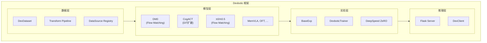

上图展示了 Dexbotic 框架的四层分层架构。DM0 作为模型层的旗舰实现，依赖数据层提供统一的数据管道和转换，通过实验层完成分布式训练，最终在推理层提供端到端的部署服务。

---

## 2. DM0 算法架构（论文层面）

### 2.1 核心问题

DM0 针对传统 VLA 模型的四大根本缺陷：

| 问题 | 描述 | 现有方案的不足 |
|------|------|-------------|
| **物理接地缺失** | 互联网预训练缺乏 3D 空间理解 | 微调阶段补救不够，物理先验未深入模型骨架 |
| **语义-控制冲突** | 语言理解与连续控制互相干扰 | 共享权重导致两个目标竞争梯度 |
| **推理-控制鸿沟** | 高层推理难以映射为低层电机控制 | 缺乏层次化的监督信号桥接两者 |
| **模块碎片化** | 操作与导航被当作独立系统 | 不同任务需要独立模型，无法统一 |

### 2.2 三大技术支柱

#### 支柱一：具身原生多源预训练 (Embodied-Native Multi-Source Pretraining)

```
            ┌─────────────┐
            │   Web Corpus │ ← 互联网文本+图像 (语义能力)
            ├─────────────┤
预训练数据 ←─│ Driving Logs │ ← 自动驾驶日志 (空间感知)
            ├─────────────┤
            │ Embodied Data│ ← 机器人操作数据 (物理接地)
            └─────────────┘
```

关键区别：**不是** "先预训练再适配"，而是从预训练阶段就将三类数据混合，使物理先验深入模型权重的每一层。

#### 支柱二：混合训练架构 / 知识隔离 (Hybrid Training / Knowledge Insulation)

```
┌──────────────────────────────────────────────┐
│               VLM (Qwen3 LLM)                │
│  • 处理前缀：图像 token + 语言 token          │
│  • 在非具身数据上持续训练                      │
│  • 梯度隔离：动作专家的梯度不回传到 VLM        │
├──────────────────────────────────────────────┤
│           Action Expert (Qwen3)               │
│  • 处理后缀：噪声动作 + 时间嵌入              │
│  • 专注连续动作生成                            │
│  • 通过合并注意力与 VLM 交互                   │
└──────────────────────────────────────────────┘
        ↕ 合并注意力 (Merged Attention)
```

**知识隔离的核心思想**：

- 在具身数据上训练时，动作专家的 Flow Matching 损失梯度**不回传**到 VLM 的语言理解层，防止连续控制信号破坏语义表征
- 在非具身数据上训练时，VLM 继续学习一般能力，保持语言理解不退化
- 双专家通过合并注意力**共享感知**但**隔离梯度**

#### 支柱三：具身空间脚手架 (Embodied Spatial Scaffolding)

```
高层推理  →  子任务分解  →  目标框定位  →  轨迹规划  →  离散动作 token
   ↓              ↓              ↓              ↓              ↓
 "拿杯子"    "移动到杯子"   bbox(120,80)    [x,y,z,...]    token_42
```

层次化监督信号：
1. **子任务 (Subtask)**: 将复杂指令分解为可执行步骤
2. **目标边界框 (Goal BBox)**: 空间定位目标物体
3. **轨迹 (Trajectory)**: 连续的运动轨迹
4. **离散动作 token**: 最终的控制信号

这一层次化设计帮助模型逐步将高层语义推理"接地"为低层运动控制。

### 2.3 Flow Matching 动作生成

DM0 采用 **Flow Matching**（而非扩散模型或离散 token 化）生成连续动作：

**训练阶段**：

给定干净动作 $a$ 和噪声 $\epsilon \sim \mathcal{N}(0, I)$，采样时间 $t \sim \text{Beta}(1.5, 1.0)$：

$$x_t = t \cdot \epsilon + (1 - t) \cdot a$$

$$u_t = \epsilon - a$$

模型预测速度场 $v_\theta(x_t, t)$，损失为：

$$\mathcal{L} = \text{MSE}(v_\theta(x_t, t), u_t)$$

**推理阶段**：

从 $x_1 \sim \mathcal{N}(0, I)$ 开始，通过 Euler 积分逐步去噪：

$$x_{t+\Delta t} = x_t + v_\theta(x_t, t) \cdot \Delta t$$

其中 $\Delta t = -1 / N$，$N$ 为去噪步数（默认 10 步）。

**关键设计选择**：

| 设计 | DM0 的选择 | 替代方案 | 权衡 |
|------|-----------|---------|------|
| 时间分布 | Beta(1.5, 1.0) | 均匀分布 | Beta 分布偏向噪声端，提高收敛稳定性 |
| 动作块大小 | 50 步 | 16步 (CogACT) | 更长的预测窗口支持长时序任务 |
| 动作维度 | 32D (统一) | 7D (单臂) | 填充到 32D 支持跨具身兼容 |
| 去噪步数 | 10 步 (推理) | 100+ (DDPM) | Flow Matching 的 Euler 采样比扩散快 10x |

### 2.4 双专家合并注意力

DM0 最核心的架构创新是**合并注意力 (Merged Attention)**，与 CogACT 的级联式 VLM→DiT 和 π0 的跨注意力有本质区别：

```
           VLM (Qwen3 LLM)           Action Expert (Qwen3)
           ┌────────────┐             ┌────────────┐
Layer L    │  Q_vlm      │             │  Q_act      │
           │  K_vlm      │             │  K_act      │
           │  V_vlm      │             │  V_act      │
           └─────┬──────┘             └─────┬──────┘
                 │                           │
                 ▼                           ▼
           ┌──────────────────────────────────┐
           │  Q = cat(Q_vlm, Q_act)           │
           │  K = cat(K_vlm, K_act)           │  ← 合并注意力
           │  V = cat(V_vlm, V_act)           │
           │  Attn = softmax(QK^T/√d) · V     │
           └──────────────────────────────────┘
                 │                           │
                 ▼                           ▼
           ┌────────────┐             ┌────────────┐
           │  o_proj_vlm │             │  o_proj_act │  ← 分割输出
           │  MLP_vlm    │             │  MLP_act    │
           └────────────┘             └────────────┘
```

**与其他架构的关键区别**：

| 架构 | 信息流 | 参数共享 | 耦合度 |
|------|--------|---------|--------|
| **DM0 (合并注意力)** | 双向，每层共享 QKV | 注意力权重共享，MLP 独立 | **最高** |
| π0 (跨注意力) | 双向，每层跨注意力 | 独立 QKV，共享注意力计算 | 高 |
| CogACT (级联) | 单向，VLM→DiT | 无共享 | 低 |
| OpenVLA (LM head) | 无独立专家 | LLM 直接输出 | N/A |

### 2.5 三阶段训练管道

DM0 论文描述了一个从预训练到部署的三阶段训练管道：

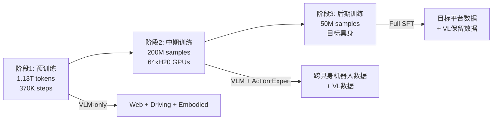

- **阶段1（预训练）**: 仅训练 VLM 骨干网络，融合互联网、驾驶和具身数据（1.13T tokens，370K steps，AdamW，lr 5e-5 → 1e-5）
- **阶段2（中期训练）**: 引入 Action Expert 进行联合训练（200M samples，64xH20 GPUs，lr 2.5e-5 → 1e-5）
- **阶段3（后期训练/SFT）**: 在目标具身平台上进行微调（50M samples，收窄到目标机器人数据）

> **注意**：在开源代码库中，仅实现了阶段3（SFT/微调），阶段1和阶段2的训练代码未公开。

---

## 3. 源码架构分析

### 3.1 模块结构与文件映射

```
DM0 在 Dexbotic 中的完整模块依赖图:

┌─────────────────────────────────────────────────┐
│                  dm0_exp.py                      │
│  DM0Exp → DM0ModelConfig → DM0ForCausalLM       │
│         → DM0TrainerConfig → DexboticTrainer     │
│         → DM0DataConfig → DexDataset             │
│         → DM0InferenceConfig → Flask Server      │
├─────────────┬──────────────┬────────────────────┤
│  dm0_arch.py│dm0_prog_arch │  dm0_utils.py      │
│  DM0Config  │DM0ProgConfig │  make_attn_mask_2d │
│  DM0Model   │DM0ProgModel  │  make_attn_mask_4d │
│  DM0ForCLM  │DM0ProgForCLM │  posemb_sincos     │
├─────────────┴──────────────┴────────────────────┤
│              dexbotic_arch.py (基类)              │
│  DexboticConfig → DexboticVLMModel               │
│  DexboticForCausalLM → ActionOutputForCausalLM   │
├─────────────────────────────────────────────────┤
│  modules/mm_vision/  │  modules/mm_projector/    │
│  CLIPVisionTower     │  mlp2x_gelu projector     │
└─────────────────────┴───────────────────────────┘
```

**继承层次**（DM0 视角）：

```python
PreTrainedModel                         # HuggingFace
  └─ DexboticPretrainedModel            # dexbotic_arch.py
       └─ DexboticVLMModel              # llm + vision_tower + projector
            └─ DM0Model                 # + action_expert + action MLPs
                                        # dm0_arch.py:63-126

DexboticPretrainedModel + GenerationMixin
  └─ DexboticForCausalLM                # model + lm_head + forward
       └─ DM0ForCausalLM               # + merged attention + flow matching
          (+ ActionOutputForCausalLM)   # dm0_arch.py:128-642
```

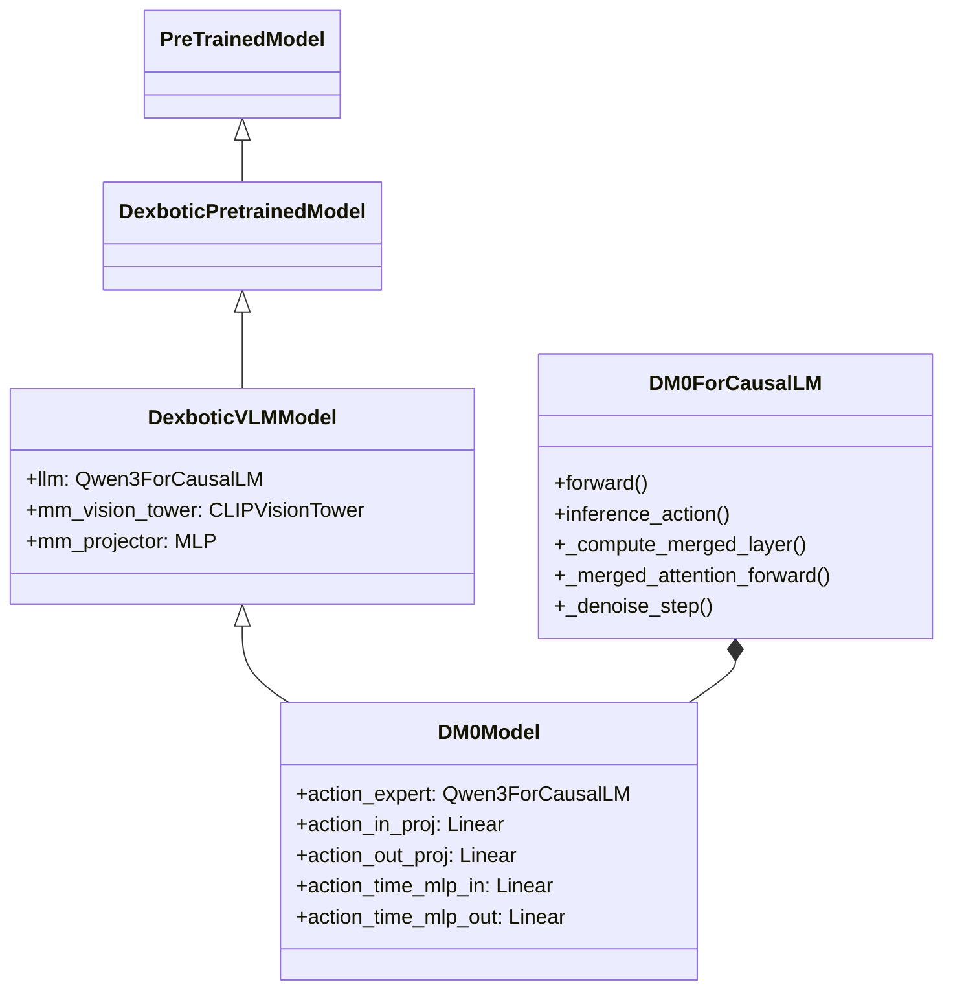

### 3.2 双专家架构实现 (DM0Model)

**核心定义** (`dm0_arch.py:63-126`)：

```python
class DM0Model(DexboticVLMModel):
    def __init__(self, config: DM0Config):
        super().__init__(config)  # 构建 llm, mm_vision_tower, mm_projector

        # Action Expert: 完整的 Qwen3 因果 LM，但移除了 embed_tokens
        action_model_config = config.action_config
        self.action_expert = Qwen3ForCausalLM(action_model_config)
        self.action_expert.model.embed_tokens = None  # 不需要词嵌入层

        action_hidden = action_model_config.hidden_size

        # Flow Matching 投影层
        self.action_in_proj = nn.Linear(config.action_dim, action_hidden)   # 32 → H
        self.action_out_proj = nn.Linear(action_hidden, config.action_dim)  # H → 32

        # 时间嵌入融合 MLP
        self.action_time_mlp_in = nn.Linear(2 * action_hidden, action_hidden)  # 2H → H
        self.action_time_mlp_out = nn.Linear(action_hidden, action_hidden)     # H → H
```

**设计要点分析**：

1. **为什么移除 `embed_tokens`？**
   - Action Expert 不处理离散 token，它的输入是连续的动作嵌入
   - 输入通过 `action_in_proj` + `action_time_mlp` 从连续动作空间映射到隐藏空间
   - 移除 `embed_tokens` 节省了 `vocab_size × hidden_size` 的参数量

2. **为什么使用完整的 Qwen3 而非轻量 Transformer？**
   - 合并注意力要求两个专家的 **层数完全一致**（逐层 Q/K/V 拼接）
   - 使用相同架构（Qwen3）确保注意力头维度、层数等完全匹配
   - 可以加载预训练权重进行初始化

3. **32D 统一动作空间**：
   - 将不同机器人的动作维度填充到 32D（`PadAction(ndim=32)`）
   - 推理时截取前 `action_dim`（通常 7D：xyz + rpy + gripper）
   - 这一设计使 DM0 可以在不修改模型的情况下支持不同机器人

4. **50 步动作块 (chunk_size=50)**：
   - 每次推理生成 50 步未来动作
   - 客户端通过 `action_queue` 逐步消费
   - 比 CogACT 的 16 步更长，适合长时序任务

### 3.3 合并注意力机制 (_compute_merged_layer)

合并注意力是 DM0 最关键的代码实现，位于 `dm0_arch.py:145-268`。

**逐步流程**：

```
Step 1: 从两个专家的同一层提取 Q/K/V
┌────────────────┐    ┌────────────────┐
│ LLM Layer[i]   │    │ Expert Layer[i]│
│ input_layernorm│    │ input_layernorm│
│ q_proj → q_norm│    │ q_proj → q_norm│  ← 各自独立的 LayerNorm + 投影
│ k_proj → k_norm│    │ k_proj → k_norm│
│ v_proj         │    │ v_proj         │
└───────┬────────┘    └───────┬────────┘
        │                     │
Step 2: 沿序列维度拼接 Q/K/V
        ▼                     ▼
   Q = cat(Q_vlm[B,H,S_p,D], Q_act[B,H,S_s,D])  → [B,H,S_p+S_s,D]
   K = cat(K_vlm, K_act)                          → [B,H,S_p+S_s,D]
   V = cat(V_vlm, V_act)                          → [B,H,S_p+S_s,D]
        │
Step 3: 应用 RoPE 旋转位置编码
        │
   cos, sin = rotary_emb(positions)
   Q, K = apply_rotary_pos_emb(Q, K, cos, sin)
        │
Step 4: KV Cache 处理
        │
   if use_cache:
       K, V = past_key_values.update(K, V, layer_idx)
   elif has_cache:
       K = cat(cached_K, K)
       V = cat(cached_V, V)
        │
Step 5: 计算共享注意力
        │
   attn_output = eager_attention_forward(Q, K, V, attention_mask)
        │
Step 6: 按序列长度分割输出，各自通过独立的 o_proj + MLP
        ▼
   ┌─────────────────┐     ┌─────────────────┐
   │ vlm_attn_out    │     │ act_attn_out    │
   │ o_proj (VLM)    │     │ o_proj (Expert) │
   │ residual + LN   │     │ residual + LN   │  ← 注意：MLP 是各自独立的
   │ MLP (VLM)       │     │ MLP (Expert)    │
   │ residual        │     │ residual        │
   └─────────────────┘     └─────────────────┘
```

**关键代码片段** (`dm0_arch.py:145-268`)：

```python
def _compute_merged_layer(self, layer_idx, module_list, input_embeds_list,
                          position_ids, past_key_values, attention_mask, use_cache):
    # 1. 各专家独立计算 Q/K/V
    for module_idx, (layer, input_embeds) in enumerate(zip(layers, input_embeds_list)):
        prenorm_embeds = layer.input_layernorm(input_embeds)
        query = layer.self_attn.q_norm(layer.self_attn.q_proj(prenorm_embeds)...)
        key = layer.self_attn.k_norm(layer.self_attn.k_proj(prenorm_embeds)...)
        value = layer.self_attn.v_proj(prenorm_embeds)...

    # 2. 拼接
    query_states = torch.cat(query_list, dim=2)   # 沿序列维度拼接
    key_states = torch.cat(key_list, dim=2)
    value_states = torch.cat(value_list, dim=2)

    # 3. 共享 RoPE
    cos, sin = self.model.llm.rotary_emb(dummy_tensor, position_ids)
    query_states, key_states = apply_rotary_pos_emb(query_states, key_states, cos, sin)

    # 4. 共享注意力计算
    attn_output, _ = eager_attention_forward(self_attn, Q, K, V, attention_mask)

    # 5. 分割并各自处理
    for module_idx, (layer, input_embeds) in enumerate(zip(layers, input_embeds_list)):
        attn_embeds = attn_output[:, start_idx:start_idx+seq_len, :]
        attn_embeds = layer.self_attn.o_proj(attn_embeds)      # 各自的 o_proj
        residual = input_embeds + attn_embeds
        mlp_embeds = layer.mlp(layer.post_attention_layernorm(residual))  # 各自的 MLP
        output = residual + mlp_embeds
```

**设计深度分析**：

1. **为什么用 eager_attention_forward 而非 Flash Attention？**
   - 合并注意力需要自定义的非标准注意力掩码（prefix causal + suffix fully-connected）
   - Flash Attention 2 对自定义掩码的支持有限
   - `eager_attention_forward` 是 Qwen3 的标量注意力实现，支持任意 4D 掩码
   - **性能代价**: 失去 Flash Attention 的 O(N) 内存优化，注意力矩阵为 O(N²)

2. **RoPE 共享的巧妙设计**：
   - 两个专家共享一套 RoPE（来自 `self.model.llm.rotary_emb`）
   - 位置编码连续分配：prefix 位置 [0, P-1]，suffix 位置 [P, P+S-1]
   - 这确保了跨专家的位置一致性

3. **注意力共享 vs MLP 独立的设计权衡**：
   - 注意力层共享使两个专家可以"看到"彼此的表征（信息融合）
   - MLP 独立保留各自的特征变换能力（功能分离）
   - 类似人脑的"感知共享，决策独立"

### 3.4 注意力掩码系统 (dm0_utils.py)

DM0 的注意力掩码设计非常精巧，通过 `cumsum` 机制实现了混合因果性：

**掩码逻辑** (`dm0_utils.py:12-40`)：

```python
def make_attn_mask_2d(padding_mask, attn_mask):
    cumsum = torch.cumsum(attn_mask, dim=1)
    attn_mask_2d = cumsum[:, None, :] <= cumsum[:, :, None]
    padding_mask_2d = padding_mask[:, None, :] * padding_mask[:, :, None]
    return attn_mask_2d & padding_mask_2d
```

**cumsum 机制的直觉理解**：

```
attn_mask 示例:  [1, 1, 1, ..., 1, 1, 0, 0, ..., 0]
                  ←── prefix ──→  ←── suffix ──→
                  (每个token值=1)   (首token=1, 余=0)

cumsum 结果:     [1, 2, 3, ..., P, P+1, P+1, P+1, ..., P+1]
                  ←── 递增 ──→  ←── 全部相同 ──→

cumsum[:,None,:] <= cumsum[:,:,None] 的效果:

                 token_0  token_1  ...  token_P  suffix_0  suffix_1  ...
token_0          ✓                                                          ← 只看自己
token_1          ✓        ✓                                                 ← 因果
...              ...      ...      ...
token_P          ✓        ✓        ...  ✓                                   ← prefix 因果
suffix_0         ✓        ✓        ...  ✓        ✓         ✓         ✓     ← 看全部
suffix_1         ✓        ✓        ...  ✓        ✓         ✓         ✓     ← 看全部
...              ...      ...      ...  ...      ✓         ✓         ✓
```

**掩码行为总结**：

| 区域 | 行为 | 原因 |
|------|------|------|
| Prefix → Prefix | 因果（下三角） | 语言模型需要自回归 |
| Prefix → Suffix | 不可见 | 防止语言 token 看到未来的动作 |
| Suffix → Prefix | 全部可见 | 动作预测需要完整的视觉-语言上下文 |
| Suffix → Suffix | 全部可见（双向） | 轨迹预测是并行的，不需要因果约束 |

**为什么 suffix 内部采用全连接注意力？**

这是 DM0 与 π0 的关键区别之一。Flow Matching 生成的是一个完整的动作块（50 步），每一步都需要感知整个轨迹的上下文来确保平滑一致性。如果对 suffix 施加因果约束，后面的时间步会缺少前面步骤的信息，影响轨迹质量。

### 3.5 Flow Matching 训练流程 (forward)

**完整训练前向传播** (`dm0_arch.py:406-511`)：

```
输入: input_ids, attention_mask, images, image_masks, actions, states
  │
  ├─ Step 1: Flow Matching 设置
  │   noise ~ N(0, I)                                    [B, 50, 32]
  │   time ~ Beta(1.5, 1.0) * 0.999 + 0.001             [B]
  │   x_t = time * noise + (1-time) * actions            [B, 50, 32] (插值)
  │   u_t = noise - actions                              [B, 50, 32] (目标速度)
  │
  ├─ Step 2: Prefix 编码 (get_prefix_hidden_states)
  │   ├─ 对每个视角: image → mm_vision_tower → mm_projector → image_features
  │   ├─ input_ids → llm.embed_tokens → text_features
  │   ├─ 拼接: [img1_features, img2_features, img3_features, text_features]
  │   └─ 构建 padding_mask + attn_mask (全部为 1)
  │
  ├─ Step 3: Suffix 编码 (get_suffix_hidden_states)
  │   ├─ time → posemb_sincos → time_embeddings          [B, H]
  │   ├─ x_t → action_in_proj → action_hidden             [B, 50, H]
  │   ├─ cat(action_hidden, time_expanded) → [B, 50, 2H]
  │   ├─ → action_time_mlp_in → silu → action_time_mlp_out → [B, 50, H]
  │   └─ attn_mask: [1, 0, 0, ..., 0] (首token=1 触发新因果组)
  │
  ├─ Step 4: 构建注意力掩码
  │   full_padding_mask = cat(prefix_pad, suffix_pad)
  │   full_attn_mask = cat(prefix_attn, suffix_attn)
  │   attn_mask_2d = make_attn_mask_2d(full_padding_mask, full_attn_mask)
  │   attn_mask_4d = make_attn_mask_4d(attn_mask_2d)     [B, 1, P+S, P+S]
  │
  ├─ Step 5: 计算位置编码
  │   prefix_positions = cumsum(prefix_padding_mask) - 1   [0, 1, ..., P-1]
  │   suffix_positions = P + cumsum(suffix_padding_mask) - 1  [P, P+1, ..., P+S-1]
  │   positions = cat(prefix_positions, suffix_positions)
  │
  ├─ Step 6: 合并注意力前向 (_merged_attention_forward)
  │   module_list = [llm, action_expert.model]
  │   input_embeds_list = [prefix_hidden_states, suffix_hidden_states]
  │   逐层调用 _compute_merged_layer (共 N 层)
  │   → (prefix_out, suffix_out)
  │
  └─ Step 7: 计算损失
      suffix_out_final = suffix_out[:, -50:]               [B, 50, H]
      v_t = action_out_proj(suffix_out_final)               [B, 50, 32]
      loss = MSE(v_t, u_t)
```

**关键实现细节**：

1. **Beta(1.5, 1.0) 时间采样**：
   ```python
   time = torch.distributions.Beta(1.5, 1.0).sample((batch_size,)) * 0.999 + 0.001
   ```
   - Beta(1.5, 1.0) 的概率密度在 t=1（纯噪声）附近更高
   - 意味着模型在训练时更多地练习从高噪声状态去噪
   - 裁剪到 [0.001, 0.999] 避免数值不稳定

2. **时间嵌入融合的 MLP 结构**：
   ```python
   # 拼接 action + time → 2H 维度
   fused = cat([action_hidden, time_expanded], dim=2)  # [B, 50, 2H]
   # 两层 MLP + SiLU 激活
   x = action_time_mlp_in(fused)    # [B, 50, H]
   x = F.silu(x)
   hidden = action_time_mlp_out(x)  # [B, 50, H]
   ```
   - SiLU (Swish) 激活而非 ReLU，提供更平滑的梯度

3. **BFloat16 精度管理**：
   ```python
   if self.model.config.bf16:
       suffix_hidden_states = suffix_hidden_states.to(dtype=torch.bfloat16)
       prefix_hidden_states = prefix_hidden_states.to(dtype=torch.bfloat16)
   ```
   - 前向传播使用 BF16 以节省内存
   - 但损失计算恢复 FP32：`suffix_out = suffix_out.to(torch.float32)`

### 3.6 Euler 采样推理流程 (inference_action)

**推理流程** (`dm0_arch.py:513-642`)：

```
┌─────────────────────────────────────────┐
│ Step 1: 初始化                           │
│   noise ~ N(0,1) [B, 50, 32]            │
│   time = 1.0                             │
│   dt = -1.0 / diffusion_steps (=-0.1)   │
├─────────────────────────────────────────┤
│ Step 2: Prefix 编码 + KV Cache           │
│   prefix → get_prefix_hidden_states      │
│   → _merged_attention_forward            │
│     (use_cache=True)                     │
│   输出: kv_cache (prefix 的 KV 缓存)     │
├─────────────────────────────────────────┤
│ Step 3: Euler 采样循环 (10 次)           │
│   while time >= -dt/2:                   │
│     x_t, time = _denoise_step(           │
│       x_t, time, dt, kv_cache)           │
├─────────────────────────────────────────┤
│ Step 4: 返回去噪后的动作 [B, 50, 32]    │
└─────────────────────────────────────────┘
```

**_denoise_step 详解** (`dm0_arch.py:585-642`)：

```python
def _denoise_step(self, x_t, time, dt, ...):
    # 1. 编码当前噪声动作 + 时间
    suffix_hidden, suffix_pad, suffix_attn = self.get_suffix_hidden_states(
        x_t, time.broadcast_to(batch_size))

    # 2. 构建 suffix-only 注意力掩码 (只有 suffix 行)
    suffix_attn_mask_2d = make_suffix_attn_mask_2d(
        suffix_padding_mask, suffix_attn_mask,
        prefix_padding_mask, prefix_attn_mask)

    # 3. 使用 prefix 的 KV cache + suffix 的新嵌入
    (_, suffix_out), _ = self._merged_attention_forward(
        module_list=module_list,
        attention_mask=full_attn_mask_4d,
        position_ids=full_positions,
        past_key_values=kv_cache,        # ← 复用 prefix cache
        input_embeds_list=[None, suffix_hidden],  # ← prefix=None 表示用 cache
        use_cache=False)                 # ← 不缓存 suffix 的 KV

    # 4. 预测速度场并更新
    v_t = self.model.action_out_proj(suffix_out[:, -chunk_size:])
    return x_t + v_t * dt, time + dt
```

**推理优化分析**：

| 优化 | 实现方式 | 效果 |
|------|---------|------|
| **Prefix KV Cache** | 一次编码，10 步复用 | 避免 10 次重复的 prefix 前向 |
| **Suffix-only 注意力** | `make_suffix_attn_mask_2d` 只计算 suffix 行 | 注意力计算量从 (P+S)² 降至 S×(P+S) |
| **不缓存 Suffix KV** | `use_cache=False` for suffix | suffix 每步都变化，缓存无意义 |
| **@torch.no_grad()** | 装饰器禁用梯度 | 节省反向图内存 |

**潜在优化空间**：

1. **批量去噪**: 当前实现是串行的 10 步循环，某些 Flow Matching 变体支持并行去噪
2. **自适应步数**: 可根据动作复杂度动态调整去噪步数
3. **KV Cache 量化**: prefix KV cache 可以进一步量化以节省显存
4. **ONNX/TensorRT**: 当前未支持模型编译优化

### 3.7 进度预测扩展 (DM0Prog)

`DM0ProgForCausalLM` (`dm0_prog_arch.py`) 是 DM0 的扩展版本，增加了**任务进度预测**能力：

**新增组件**：

```python
class DM0ProgModel(DexboticVLMModel):
    # ... 继承 DM0Model 的全部组件 ...
    # 新增:
    self.progress_in_proj = nn.Linear(1, action_hidden)     # 进度输入投影
    self.progress_out_proj = nn.Linear(action_hidden, 1)    # 进度输出投影
```

**进度嵌入的位置**：

```python
def get_suffix_hidden_states(self, noisy_actions, time, progress=None):
    action_hidden_states = self.model.action_in_proj(noisy_actions)  # [B, 50, H]

    if progress is not None:
        progress_emb = self.model.progress_in_proj(progress)   # [B, 1, H]
        # 进度嵌入拼接在动作前面，成为 suffix 的第一个 token
        action_hidden_states = cat([progress_emb, action_hidden_states], dim=1)  # [B, 51, H]
```

**进度预测**：

```python
def _denoise_step(self, ...):
    # ... 标准去噪 ...
    v_t = self.model.action_out_proj(suffix_out[:, -chunk_size:])  # 动作速度

    # 从 suffix 的第 0 个位置（进度 token）预测进度
    end_progress = self.model.progress_out_proj(
        suffix_out[:, -chunk_size - 1 : -chunk_size])   # [B, 1, 1]

    return x_t + v_t * dt, time + dt, end_progress
```

**推理时取所有去噪步的进度最小值**：

```python
# 保守估计：取 10 步去噪中的最低进度
end_progress, _ = torch.min(torch.stack(end_progress_list), dim=0)
```

**用途**: 进度预测可用于：
- 判断当前子任务是否完成，触发下一子任务
- 评估任务整体进展，辅助长时序规划
- 提前终止无意义的动作序列

### 3.8 数据处理管道 (DM0ActionConfig)

DM0 的数据处理管道定义在 `dm0_exp.py:244-264`：

```python
Pipeline([
    ToDict(),                                              # [1] 帧列表 → 回合字典
    ToNumpy(),                                             # [2] 递归转 numpy
    AddAction(predict_length=1),                           # [3] state[t+1] → action[t]
    PadState(ndim=32, axis=-1),                            # [4] 状态填充到 32D
    PadAction(ndim=32, axis=-1),                           # [5] 动作填充到 32D
    AddTrajectory(trajectory_length=50,                    # [6] 构建 50 步轨迹块
                  flatten=False, padding_mode="last"),
    DeltaAction(enable=True),                              # [7] 绝对→相对动作
    ActionNorm(statistic_mapping=..., use_quantiles=True), # [8] 分位数归一化到 [-1,1]
    LoadMultiModal(return_masks=True),                      # [9] 加载多视角图像
    ToList(),                                              # [10] 回合字典 → 帧列表
])
```

**各阶段详解**：

| 阶段 | 变换 | 输入 | 输出 | 关键参数 |
|------|------|------|------|---------|
| 1 | ToDict | `[{frame0}, {frame1}, ...]` | `{state: [N,D], ...}` | - |
| 2 | ToNumpy | 各类型 | numpy 数组 | 递归转换 |
| 3 | AddAction | `state[N,D]` | `action[N-1,D]` (偏移1步) | predict_length=1 |
| 4-5 | PadState/PadAction | `[N, D_orig]` | `[N, 32]` | ndim=32, 零填充 |
| 6 | AddTrajectory | `action[N,32]` | `trajectory[N,50,32]` | 滑动窗口, 末尾填充 |
| 7 | DeltaAction | 绝对动作 | 相对动作 (含周期角处理) | periodic_mask, non_delta_mask |
| 8 | ActionNorm | 相对动作 | [-1,1] 归一化 | q01/q99 分位数 |
| 9 | LoadMultiModal | 元数据 | RGB 图像张量 + 掩码 | 3 视角 |
| 10 | ToList | 回合字典 | 帧列表 | - |

**归一化系统深度分析**：

```python
# DM0ComputeNormActionConfig (dm0_exp.py:77-196)

# 计算流程:
# 1. 对每个数据集独立计算统计量
#    DataLoader(batch_size=128, num_workers=64) × 2500 批 = 最多 320,000 样本
# 2. 使用 RunningStats 在线计算: mean, std, min, max, q01, q99
# 3. 跨数据集合并: min 取最小值, max 取最大值, mean/std 取平均
# 4. 缓存路径: norm_assets/{md5(dataset_name)[:8]}/norm_stats.json

# 归一化公式:
normalized = (action - q01) / (q99 - q01 + 1e-6) * 2 - 1   # → [-1, 1]

# 反归一化:
action = q01 + (normalized + 1) * 0.5 * (q99 - q01)
```

**为什么用 q01/q99 而非 min/max？**
- 极端值（异常帧）会导致 min/max 范围过大，使大部分数据集中在很小的范围内
- q01/q99 忽略 1% 的极端值，提供更紧凑的归一化范围
- 被裁剪到 [-1, 1] 的值会被 clip，不影响大多数正常动作

---

## 4. 训练管道设计与实现

### 4.1 三阶段训练总览

DM0 的训练遵循论文描述的三阶段管道：预训练 → 中期训练 → 后期训练。每个阶段使用不同的数据规模、GPU 配置和优化策略。

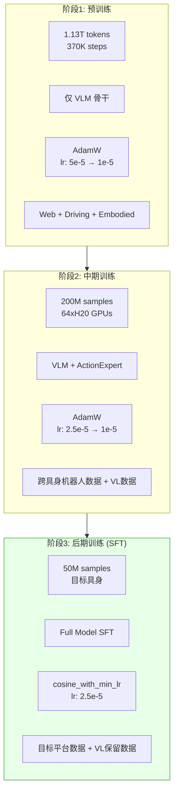

> **重要说明**：在开源代码库中，仅实现了**阶段3（后期训练/SFT）**阶段。阶段1和阶段2的预训练代码和数据配方是 Dexmal 的核心竞争力，未公开发布。用户获得的是经过完整三阶段训练的预训练权重 (`DM0-base` checkpoint)，在此基础上可以进行 SFT 微调。

### 4.2 实验配置系统

DM0 的训练配置通过 Python dataclass 层次化组织，核心入口为 `dm0_exp.py` 中的 `DM0Exp` 类。

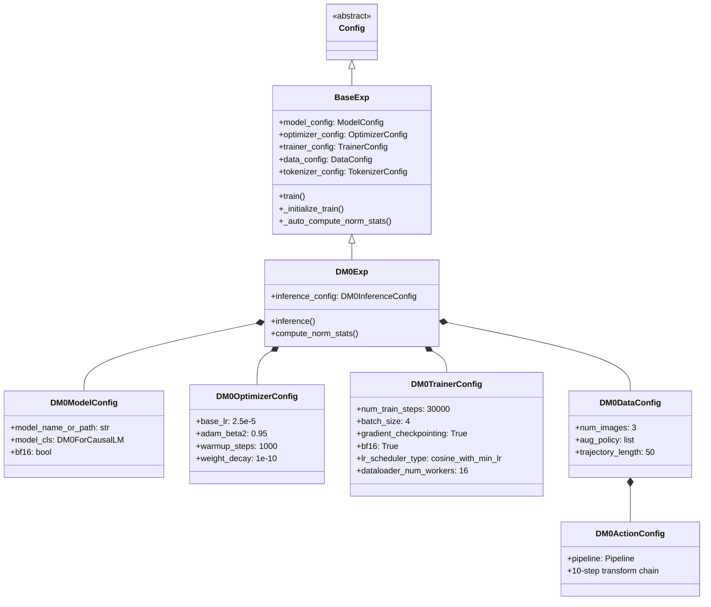

**关键配置参数详解**：

- **DM0ModelConfig**: `model_name_or_path="./checkpoints/DM0-base"`，构建 `DM0ForCausalLM` 模型实例
- **DM0OptimizerConfig**: `base_lr=2.5e-5`, `adam_beta2=0.95`, `warmup_steps=1000`, `weight_decay=1e-10`
- **DM0TrainerConfig**: `num_train_steps=30000`, `batch_size=4`, `gradient_checkpointing=True`, `bf16=True`, `cosine_with_min_lr` 学习率调度, `dataloader_num_workers=16`
- **DM0DataConfig**: `num_images=3`, `aug_policy=['dm0','dm0_color','dm0_color']`, `trajectory_length=50`
- **DM0ActionConfig**: 10 步管道处理链：

```
ToDict → ToNumpy → AddAction → PadState → PadAction
→ AddTrajectory → DeltaAction → ActionNorm → LoadMultiModal → ToList
```

### 4.3 训练循环实现

训练循环的核心实现位于 `base_exp.py` 的 `BaseExp.train()` 和 `_initialize_train()` 方法中。

```python
def train(self):
    self._initialize_train()
    # Step 0: compute norm stats (auto on rank 0)
    # Step 1: build tokenizer (AutoTokenizer)
    # Step 2: build model (DM0ForCausalLM.from_pretrained)
    # Step 3: build dataloader (DexDataset + DataCollator)
    # Step 4: build trainer (DexboticTrainer)
    # Step 5: save action norm config

    if existing_checkpoints:
        trainer.train(resume_from_checkpoint=True)
    else:
        trainer.train()
    safe_save_model_for_hf_trainer(trainer, output_dir)
```

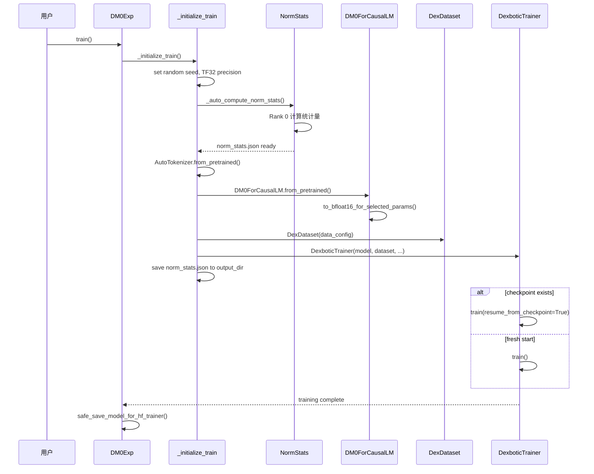

**DexboticTrainer** (`trainer.py`) 扩展了 HuggingFace Trainer，提供以下关键定制：

- **create_optimizer()**: 使用 OptimizerConfig 中的分组参数配置，支持按模块设置不同的学习率（如 `mm_projector`, `mm_vision`, `action_head` 可分别配置 lr 倍率）
- **create_scheduler()**: cosine with warmup 学习率调度器，支持可选的 raw warmup 模式
- **compute_loss()**: 标准损失计算 + 缓存各分量损失（如 `flow_matching_loss`）用于日志记录
- **_save_checkpoint()**: 在保存每个 checkpoint 时，自动将 `norm_stats.json` 复制到 checkpoint 目录，确保推理时归一化配置随模型一同分发
- **_link_exp_config()**: 将 dataclass 风格的实验配置转换为 HuggingFace TrainingArguments 格式

### 4.4 归一化计算流程

归一化统计量的计算是训练管道中的关键前置步骤，确保动作数据被正确缩放到 [-1, 1] 范围。

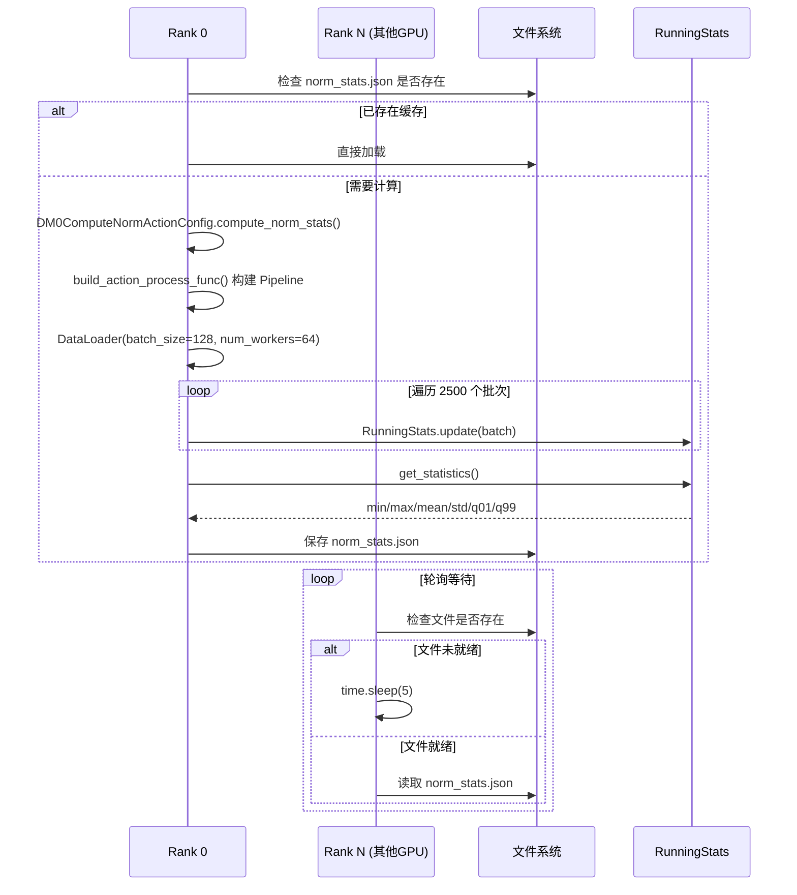

**关键实现细节**：

1. **基于 MD5 的缓存路径**: `norm_assets/{hashlib.md5(dataset_name).hexdigest()[:8]}/norm_stats.json`，相同数据集名称自动命中缓存，避免重复计算
2. **逐数据集独立计算后合并**: 多个数据集各自计算统计量，然后合并——`min = min(所有数据集的 q01)`，`max = max(所有数据集的 q99)`
3. **归一化公式**:
   ```
   归一化:   normalized = (action - q01) / (q99 - q01 + 1e-6) * 2 - 1    → [-1, 1]
   反归一化: action = q01 + (normalized + 1) * 0.5 * (q99 - q01)
   ```
4. **多 Rank 同步机制**: 使用文件系统轮询 (`time.sleep(5)`) 而非 `torch.distributed.barrier()`，简单但在高延迟网络存储上可能产生不必要的等待

### 4.5 分布式训练

DM0 的分布式训练基于 DeepSpeed ZeRO-3 策略：

- **默认配置**: `./script/deepspeed/zero3.json`
- **梯度检查点**: `gradient_checkpointing=True`，`use_reentrant=False`
- **混合精度**: BF16（LayerNorm 保持 FP32 以确保数值稳定性）
- **启动命令**:
  ```bash
  deepspeed --num_gpus=8 dexbotic/exp/dm0_exp.py --task train
  ```

**DeepSpeed ZeRO 策略对比**（对 DM0 2.4B 模型）：

| 策略 | 参数分片 | 梯度分片 | 优化器分片 | GPU 需求 | 适用场景 |
|------|---------|---------|-----------|---------|---------|
| ZeRO-2 | 否 | 是 | 是 | 4x A100 80G | 快速迭代 |
| ZeRO-3 | 是 | 是 | 是 | 8x A100 80G | 推荐配置 |
| ZeRO-3 Offload | 是 | 是 | 是 + CPU | 4x RTX 4090 | 消费级 GPU |

**内存估算（DM0 2.4B, BF16）**：

| 项目 | 大小 | 备注 |
|------|------|------|
| 模型参数 | ~4.8 GB | 2.4B x 2 bytes (BF16) |
| 梯度 | ~4.8 GB | 与参数等大 |
| 优化器状态 | ~9.6 GB | Adam 需 2x 参数 (FP32) |
| 激活值 (无 GC) | ~20-40 GB | 取决于序列长度和 batch |
| 激活值 (有 GC) | ~5-10 GB | 梯度检查点显著降低 |
| **总计 (ZeRO-3, 8 GPU)** | **~3-5 GB/GPU** | 参数+优化器状态 8 路分片 |

### 4.6 SFT 专家/泛化训练

论文描述了两种 SFT 训练模式：Specialist（专家）和 Generalist（泛化），适用于不同的部署场景。

| 设置 | 数据源 | GPU | Batch | 步数 | 评估范围 |
|------|-------|-----|-------|------|---------|
| Specialist | 单任务数据 | 8xH20 | 4/GPU | 40K-150K | 单任务 |
| Generalist | 全平台数据 | 16xH20 | 4/GPU | 200K | 全任务 |

**LIBERO 基准配置示例**（`playground/benchmarks/libero/libero_dm0.py`）：

```python
class LiberoDM0Exp(DM0Exp):
    """LIBERO benchmark 专用配置"""
    # 继承 DM0Exp 的所有基础配置
    # 覆盖特定参数:
    optimizer_config = DM0OptimizerConfig(
        base_lr=5e-5,        # 比默认 2.5e-5 高 2x
    )
    trainer_config = DM0TrainerConfig(
        num_train_steps=80000,             # 比默认 30K 更多步数
        gradient_accumulation_steps=2,     # 有效 batch = 4 * 2 = 8
    )
    data_config = DM0DataConfig(
        dataset_name="libero_pi0_all",     # LIBERO 全套数据集
    )
```

**训练策略建议**（来自 GitHub Issues）：

- 简单单任务（如 pick-and-place）: ~40K 步即可收敛
- 复杂单任务（如长序列操作）: ~80K-150K 步
- 多任务泛化: ~200K 步
- 全量微调（非 LoRA），所有参数均可训练

---

## 5. 评估与基准测试设计与实现

### 5.1 评估体系总览

DM0 的评估体系覆盖仿真环境和真实机器人两大类别，通过统一的推理服务架构实现评估一致性。

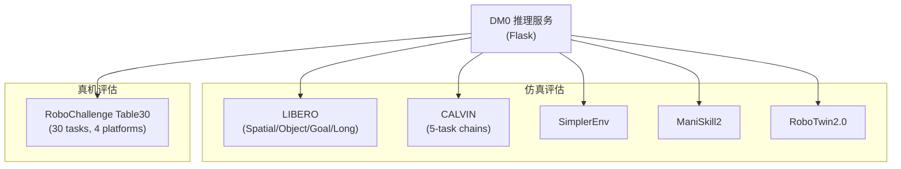

评估框架的核心设计理念是**推理服务与评估逻辑解耦**——DM0 模型始终以 Flask HTTP 服务的形式提供动作预测，评估环境（仿真或真机）作为客户端发送观测、接收动作。这种设计使得相同的模型 checkpoint 可以在不同评估环境中无缝切换。

### 5.2 仿真环境包装器

Dexbotic 的评估框架定义了统一的环境抽象接口，所有仿真评估环境都遵循此接口。

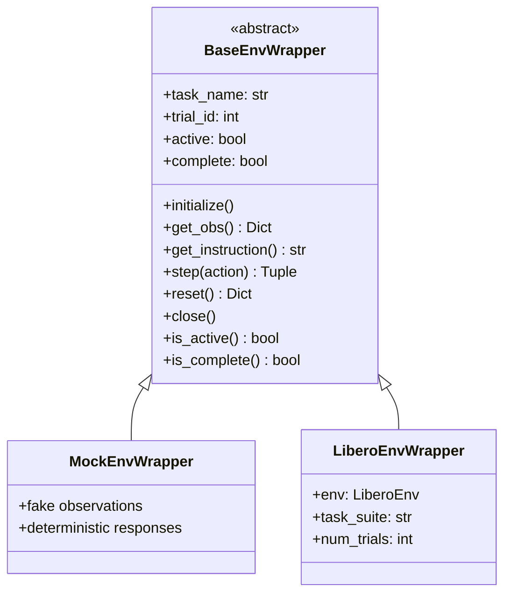

**关键设计**:

- **抽象工厂模式**: `BaseEnvWrapper` 定义了统一的 `get_obs()` / `step()` / `reset()` 接口，具体环境（LIBERO、CALVIN 等）通过继承实现
- **线程安全状态管理**: 使用 `threading.Lock` 保护 `active` 和 `complete` 状态变量，支持异步评估场景
- **MockEnvWrapper**: 提供确定性的假观测数据，用于推理服务的冒烟测试和 CI/CD 管道

### 5.3 LIBERO 基准测试流程

LIBERO 是 DM0 的主要仿真评估基准，包含 4 个子集（Spatial、Object、Goal、Long），共计约 130 个任务。

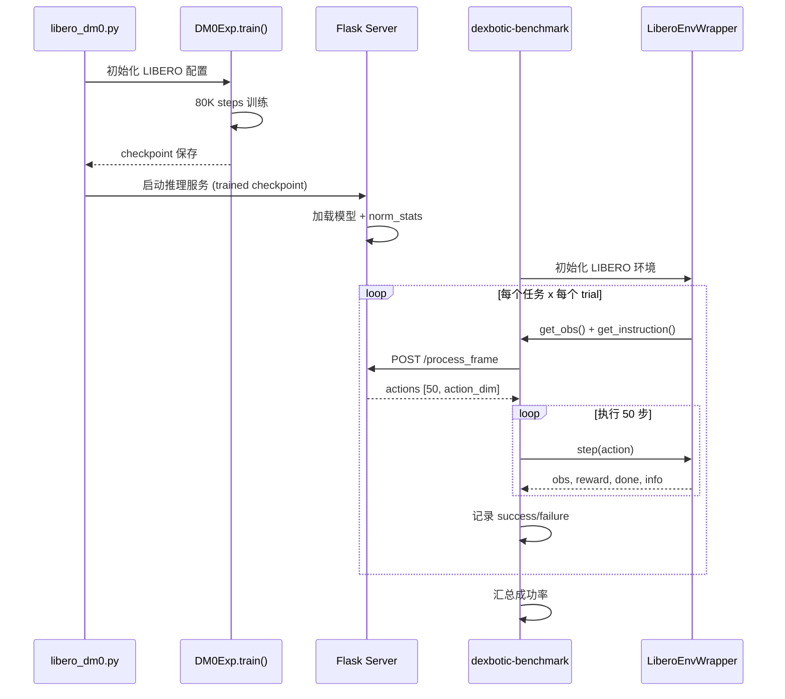

**评估配置**:
- 训练: 80K steps, lr=5e-5, dataset="libero_pi0_all", gradient_accumulation=2
- 推理: 启动 Flask 服务，加载训练好的 checkpoint
- 评估: `dexbotic-benchmark` 发送请求并收集成功率

**评估结果**（来自论文 Table 4）:

| 数据集 | Spatial | Object | Goal | Long | Average |
|--------|---------|--------|------|------|---------|
| DM0    | 98.2%   | 98.8%  | 96.6%| 82.6%| 94.1%   |

### 5.4 RoboChallenge Table30 评估

Table30 是 DM0 论文的核心真机评估基准，覆盖 30 个任务、4 个机器人平台，是目前公开 VLA 评估中规模最大的真机基准之一。

**4 个机器人平台与任务分布**:

| 平台 | 任务数 | 具体任务 |
|------|--------|---------|
| **UR5** | 6 | arrange_fruits, hang_toothbrush, set_plates, shred_paper, sort_books, stack_blocks |
| **Franka** | 2 | move_objects, press_buttons |
| **ARX5** | 10 | arrange_flowers, paper_cups, fold_dishcloth, open_drawer, shoes_rack, cup_coaster, search_boxes, sort_electronics, light_switch, water_plant, wipe_table |
| **ALOHA** | 12 | clean_table, sandwich, network_cable, pour_fries, opener_drawer, pen_pencilcase, scan_QR, stack_bowls, tape_box, sweep, turn_faucet + 1 |

**评估指标**:
- **Success Rate**: 任务是否成功完成的二值判定
- **Task Score**: 综合评分，考虑完成度和效率

### 5.5 评估结果深度解读

**DM0 vs 竞争对手**（Table30 Specialist 模式）:

| 模型 | 参数量 | 成功率 | 相对优势 |
|------|--------|--------|---------|
| **DM0** | **2.4B** | **62.00%** | 基准线 |
| Spirit-v1.5 | 4B | 51.00% | DM0 高 11pp |
| GigaBrain-0.1 | 3B | 51.67% | DM0 高 10.33pp |
| Pi0.5 | 3B | 42.67% | DM0 高 19.33pp |

**DM0 擅长的任务类型**:

1. **长序列操作**: `plug_network_cable` 80% vs 其他模型 0-20%，得益于 50 步动作块 + 进度监督
2. **精密操控**: `arrange_fruits` 100% 成功率，Flow Matching 的连续动作生成提供了亚毫米级精度
3. **重复性任务**: 需要多次相似操作的任务（如 `stack_blocks`），进度预测帮助模型感知完成度

**DM0 薄弱的任务类型**:

1. **擦拭类任务**: `wipe_table` 0%、`clean_dining_table` 0%——需要持续接触力控制和大范围覆盖，50 步动作块可能不足
2. **分类任务**: `sort_electronic_products` 0%——需要精细的物体识别和多次抓取放置决策
3. **高自由度双臂协调**: 部分 ALOHA 双臂任务表现偏低，32D 统一动作空间可能对 14D 双臂构型的编码效率不足

---

## 6. 部署架构设计与实现

### 6.1 推理服务架构

DM0 的部署采用 Flask HTTP 服务架构，将模型推理封装为标准的 REST API。

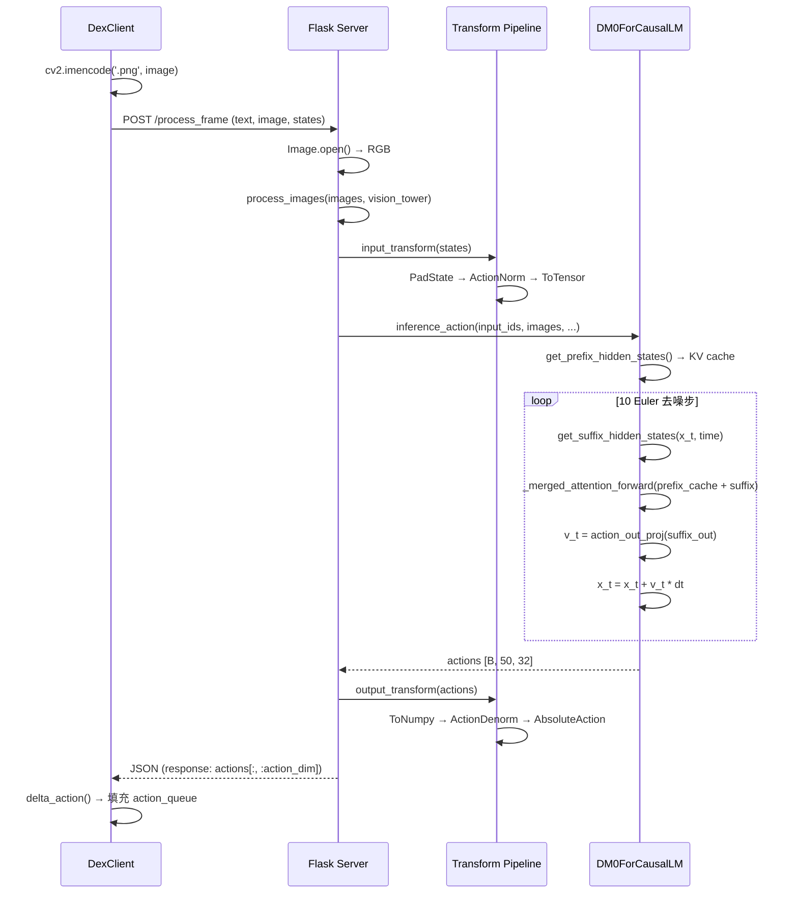

**服务端架构详解** (`dm0_exp.py:316-540`)：

```
                    HTTP POST /process_frame
                           │
                           ▼
┌──────────────────────────────────────┐
│           Flask Server               │
│  _initialize_inference()             │
│    ├─ 加载 norm_stats.json           │
│    ├─ 加载 DM0ForCausalLM            │
│    └─ 构建 input/output transforms   │
│                                      │
│  process_frame()                     │
│    ├─ 解析 multipart form            │
│    │   text: 任务描述                 │
│    │   image: 多视角图像 (≤3张)       │
│    │   states: 当前状态 (可选)         │
│    │   batch_size: 批大小 (可选)       │
│    ├─ input_transform:               │
│    │   PadState → ActionNorm → Tensor │
│    ├─ model.inference_action()       │
│    ├─ output_transform:              │
│    │   ToNumpy → ActionDenorm        │
│    │   → AbsoluteAction              │
│    └─ 返回 actions[:, :action_dim]   │
└──────────────────────────────────────┘
```

### 6.2 客户端 API (DexClient)

DexClient (`client.py`) 提供了面向机器人控制循环的高层 API，封装了 HTTP 通信和动作队列管理。

```python
# 初始化
client = DexClient(base_url="http://localhost:7891", use_delta=True)
client.set_init_action([0, 0, 0, 0, 0, 0, 0])

# 主循环中调用
action = client.act(observation={'image': rgb_array}, prompt="pick up the cup")
# → 如果 action_queue 为空，发起 HTTP 请求获取新动作块
# → 从 action_queue 中弹出一个动作并返回
```

**核心方法**:

- **`DexClient(base_url, use_delta)`**: 构造函数，初始化连接参数和动作队列
- **`act(observation, prompt)`**: 主 API 入口，从队列弹出动作或获取新的动作块
- **`acquire_new_action()`**: 向 Flask 服务发送 HTTP POST 请求，获取 50 步动作，经过 delta 转换后填充队列
- **`delta_action()`**: 将相对动作叠加到上一步绝对动作上，同时将角度维度包裹到 [-π, π] 范围

**动作队列状态机**:

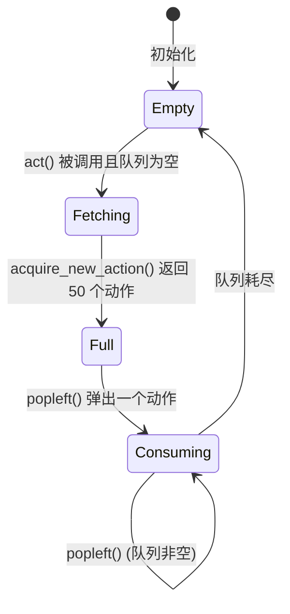

**动作队列机制详解**：

```
推理请求: 每 50 帧发起一次 (chunk_size=50)
          ↓
获得 50 个动作: [a_0, a_1, ..., a_49]
          ↓
action_queue: deque([a_0, a_1, ..., a_49])
          ↓
每帧: action = action_queue.popleft()
          ↓
50 帧后 queue 为空 → 发起新请求
```

**延迟分析**：

| 环节 | 估计延迟 | 频率 |
|------|---------|------|
| Prefix 编码 (视觉+语言) | ~50ms | 每 50 帧 |
| 10 步 Euler 去噪 | ~100ms | 每 50 帧 |
| HTTP + PNG 编码 | ~10-50ms | 每 50 帧 |
| 动作出队 | ~0.01ms | 每帧 |
| **平均每帧** | **~3-4ms** | - |
| **峰值帧** (推理帧) | **~160-200ms** | 每 50 帧 |

### 6.3 推理性能优化

DM0 的推理优化主要集中在 KV Cache 复用和注意力计算两方面：

**1. KV Cache 复用**

Prefix（图像 + 语言 token）仅在每个推理请求的第一步编码一次，生成的 KV Cache 在后续 10 步 Euler 去噪中复用。这避免了 10 次重复的视觉-语言前向传播。

```
传统方案 (每步都做完整前向):
  Step 1: encode(prefix + suffix_1)  = O(P+S)²
  Step 2: encode(prefix + suffix_2)  = O(P+S)²
  ...
  Step 10: encode(prefix + suffix_10) = O(P+S)²
  总计: 10 × O(P+S)²

DM0 KV Cache 方案:
  Step 0: encode(prefix) → KV cache   = O(P²)        ← 只做一次
  Step 1: decode(suffix_1 | cache)     = O(S × (P+S)) ← 只计算 suffix 行
  ...
  Step 10: decode(suffix_10 | cache)   = O(S × (P+S))
  总计: O(P²) + 10 × O(S × (P+S))

其中 P ≈ 800 (3张图 × 256 token + 文本), S = 50 (动作块)
节省比: 约 10P² / (P² + 10SP) ≈ 6×
```

**2. Suffix-only 注意力**

通过 `make_suffix_attn_mask_2d` 构建仅计算 suffix 行的注意力掩码，避免重新计算 prefix 对 prefix 的注意力。

**3. realtime-vla 加速**

社区项目 [realtime-vla](https://github.com/dexmal/realtime-vla) 提供了 Triton 优化的推理内核，支持 Pi0/Pi0.5/DM0 模型：
- 使用 Triton 自定义 CUDA kernel 替代 eager attention
- 在 RTX 5090 上实现 **55.8ms** 的端到端推理延迟
- 支持批量推理和动态 KV Cache 管理

### 6.4 部署局限性

当前 DM0 的部署实现存在以下主要限制：

1. **单线程 Flask 服务**: `threaded=False`，不支持并发请求处理。在多机器人或多环境评估场景下会成为性能瓶颈
2. **无模型量化**: 仅支持 BF16 精度推理，不支持 INT8/INT4 量化。2.4B 模型需要约 4.8GB 显存
3. **无 ONNX/TensorRT 导出**: 无法利用生产级推理引擎的图优化和算子融合
4. **无水平扩展**: 缺乏负载均衡、多实例编排和健康检查机制
5. **无模型并行推理**: 不支持跨 GPU 的张量并行或流水线并行推理
6. **PNG 编码开销**: 客户端通过 `cv2.imencode('.png')` 编码图像，每帧额外 10-50ms 延迟

**与生产级推理框架的对比**：

| 特性 | DM0 推理服务 | vLLM | TorchServe | Triton |
|------|------------|------|-----------|--------|
| 批量推理 | 手动 batch_size | 自动 | 自动 | 自动 |
| 并发处理 | 单线程 | 异步 | 多线程 | 多线程 |
| 模型量化 | 仅 BF16 | GPTQ/AWQ | INT8 | 全支持 |
| KV Cache 管理 | 手动 | PagedAttention | 无 | 无 |
| 负载均衡 | 无 | 无 | 有 | 有 |

---

## 7. 软件工程分析

### 7.1 可扩展性

#### 模型维度扩展

**添加新的 DM0 变体**（如已有的 DM0Prog）的步骤：

1. 继承 `DM0Config` 添加新配置参数
2. 继承 `DM0Model` 添加新模块（如 progress_proj）
3. 继承 `DM0ForCausalLM` 覆盖 `_denoise_step` 等方法
4. 在 `dm0_exp.py` 中定义对应的 `InferenceConfig`

**成本评估**：中等。DM0Prog 的存在（577 行）证明了这一模式的可行性，但由于 `_compute_merged_layer` 和 `_merged_attention_forward` 等核心方法需要完整复制（而非继承覆盖），代码重复度较高。DM0Prog 与 DM0 之间有约 **80%** 的代码重复。

**改进建议**：将合并注意力逻辑提取为独立的 `MergedAttentionMixin`，减少子类的代码复制。

#### 数据维度扩展

**添加新数据集**用于 DM0 训练：

1. 在 `data_source/` 下注册数据集（~20 行）
2. 确保数据格式包含 `state`, `images`, `prompt` 字段
3. 运行 `compute_norm_stats` 计算归一化统计

**成本评估**：极低。得益于注册表模式 + 自动归一化计算。

#### 动作空间扩展

**支持新的机器人（不同动作维度）**：

1. 修改 `non_delta_mask`（哪些维度不做差分）
2. 修改 `periodic_mask`（哪些维度是周期性的）
3. 修改 `action_dim`（推理输出截取维度）

**成本评估**：低。32D 统一空间设计使得模型不需修改，只需调整推理配置。

#### 扩展性总结

| 扩展维度 | 扩展成本 | 机制 | 代码重复风险 |
|---------|---------|------|------------|
| 新 DM0 变体 | 中等 | 继承 | 高（80%重复） |
| 新数据集 | 极低 | 注册表 | 无 |
| 新机器人 | 低 | 配置 | 无 |
| 新视觉编码器 | 偏高 | 修改 builder | 低 |
| 新 LLM 骨干 | 高 | 需修改合并注意力 | 高 |

### 7.2 灵活性

#### 配置系统

DM0 使用 Python `dataclass` 层次化配置：

```python
DM0Exp
├── DM0ModelConfig          # model_name_or_path
├── DM0OptimizerConfig      # base_lr=2.5e-5, adam_beta2=0.95, warmup_steps=1000
├── DM0TrainerConfig        # num_train_steps=30000, batch_size=4, gradient_checkpointing
├── DM0DataConfig           # num_images=3, aug_policy=['dm0','dm0_color','dm0_color']
│   └── DM0ActionConfig     # trajectory_length=50, 归一化管道
├── DM0TokenizerConfig      # use_fast_tokenizer=False
└── DM0InferenceConfig      # port=7891, action_dim=7, non_delta_mask=[6]
```

**优点**：
- 类型安全，IDE 自动补全
- 默认值完备，开箱即用
- 嵌套组合，层次清晰

**缺点**：
- 不支持外部 YAML/JSON 配置文件
- 修改配置需修改 Python 源码或创建入口脚本

#### 训练灵活性

DM0 的训练支持以下可调维度：

| 维度 | 可调范围 | 默认值 |
|------|---------|--------|
| 学习率 | 任意 | 2.5e-5 |
| 动作块大小 | 任意 (config.chunk_size) | 50 |
| 动作维度 | 任意 (config.action_dim) | 32 |
| 去噪步数 | 任意 (diffusion_steps) | 10 |
| 视角数量 | 1-N (num_images) | 3 |
| 增强策略 | 每视角独立 | ['dm0','dm0_color','dm0_color'] |
| 分布式策略 | ZeRO 2/3/Offload | ZeRO 3 |
| 精度 | BF16/FP32 | BF16 |

#### 推理灵活性

| 维度 | 可调范围 | 默认值 |
|------|---------|--------|
| 去噪步数 | 1-100+ | 10 |
| 输出动作维度 | 1-32 | 7 |
| 批量推理 | 1-N | 1 |
| Delta 动作 | 开/关 | 开 |
| 图像数量 | 1-N | 3 |

### 7.3 可伸缩性

#### 分布式训练

DM0 通过 Dexbotic 的 BaseExp 集成 DeepSpeed：

```python
# DM0TrainerConfig 继承 TrainerConfig
deepspeed: Optional[str] = './script/deepspeed/zero3.json'
gradient_checkpointing: bool = True
per_device_train_batch_size: int = 4
gradient_accumulation_steps: int = 1
```

#### 多 Rank 归一化同步

```python
# dm0_exp.py:559-590
def _auto_compute_norm_stats(self):
    if self.local_rank == 0:
        # Rank 0 负责计算归一化统计
        self.compute_norm_stats()
    else:
        # 其他 rank 轮询等待文件出现
        while not megfile.smart_exists(norm_file_path):
            time.sleep(5)
```

**问题**：使用文件系统轮询（`time.sleep(5)`）而非 `torch.distributed.barrier()`，在高延迟网络存储上可能导致不必要的等待。

#### 推理可伸缩性

当前推理服务**不支持水平扩展**：

- Flask 单线程（`threaded=False`）
- 无负载均衡
- 无多实例编排
- 无模型并行推理

### 7.4 计算性能

#### 训练性能

**关键优化点**：

1. **TF32 矩阵乘法**：
   ```python
   torch.set_float32_matmul_precision("high")  # dm0_arch.py:92
   ```
   在 Ampere+ GPU 上，FP32 矩阵乘法自动使用 TF32，获得约 3x 加速。

2. **选择性 BFloat16**：
   ```python
   # dm0_arch.py:108-125
   def to_bfloat16_for_selected_params(self):
       # 大部分参数转 BF16
       self.action_expert = self.action_expert.to(dtype=torch.bfloat16)
       self.llm = self.llm.to(dtype=torch.bfloat16)

       # 关键层保持 FP32 避免数值不稳定
       params_to_keep_float32 = [
           "mm_vision_tower.vision_model.conv1",      # 第一个卷积层
           "input_layernorm", "post_attention_layernorm",  # LayerNorm
           "model.norm",                               # 最终 LayerNorm
       ]
   ```
   LayerNorm 的均值和方差计算在 BF16 下容易溢出，保持 FP32 确保数值稳定。

3. **梯度检查点**：
   ```python
   gradient_checkpointing: bool = True  # dm0_exp.py:238
   gradient_checkpointing_kwargs = {"use_reentrant": False}
   ```
   以约 30% 的额外计算换取约 60% 的激活值内存节省。

4. **16 Worker 数据加载**：
   ```python
   dataloader_num_workers: int = 16  # dm0_exp.py:240
   ```
   多进程预加载数据，隐藏 I/O 延迟。

#### 推理性能

**Prefix-Suffix 分离的推理优势**：

```
传统方案 (每步都做完整前向):
  Step 1: encode(prefix + suffix_1)  = O(P+S)²
  Step 2: encode(prefix + suffix_2)  = O(P+S)²
  ...
  Step 10: encode(prefix + suffix_10) = O(P+S)²
  总计: 10 × O(P+S)²

DM0 KV Cache 方案:
  Step 0: encode(prefix) → KV cache   = O(P²)        ← 只做一次
  Step 1: decode(suffix_1 | cache)     = O(S × (P+S)) ← 只计算 suffix 行
  ...
  Step 10: decode(suffix_10 | cache)   = O(S × (P+S))
  总计: O(P²) + 10 × O(S × (P+S))

其中 P ≈ 800 (3张图 × 256 token + 文本), S = 50 (动作块)
节省比: 约 10P² / (P² + 10SP) ≈ 6×
```

**性能瓶颈分析**：

| 瓶颈 | 代码位置 | 影响 | 严重度 |
|------|---------|------|--------|
| eager_attention (非 Flash) | `_compute_merged_layer` | O(N²) 内存，无 IO-aware | 高 |
| Flask 单线程 | `DM0InferenceConfig.run()` | 无法并发处理 | 高 |
| PNG 编码/解码 | `DexClient.acquire_new_action` | 每帧 10-50ms | 中 |
| 无模型量化 | 全局 | BF16 推理，内存偏大 | 中 |
| 串行 Euler 采样 | `inference_action` while 循环 | 10 步串行去噪 | 低-中 |

### 7.5 代码质量

#### 积极方面

1. **清晰的文档字符串**：
   ```python
   # dm0_arch.py:1-5
   """DM0 Model Architecture for Dexbotic.
   This module implements the DM0 model based on dm0 architecture,
   using Qwen3-based VLM with a separate action expert for flow matching.
   """
   ```
   每个类和公共方法都有英文文档字符串，说明用途和参数。

2. **类型注解完备**：
   ```python
   def _compute_merged_layer(
       self,
       layer_idx: int,
       module_list: List[nn.Module],
       input_embeds_list: List[torch.FloatTensor],
       position_ids: torch.LongTensor,
       past_key_values: DynamicCache | None,
       attention_mask: torch.Tensor,
       use_cache: bool,
   ) -> List[torch.FloatTensor]:
   ```

3. **输入验证**：
   ```python
   # dm0_utils.py:32-35
   if attn_mask.ndim != 2:
       raise ValueError(f"attn_mask must be 2D, got {attn_mask.ndim}")
   ```

4. **关注点分离**：
   - `dm0_arch.py`: 纯模型逻辑
   - `dm0_utils.py`: 纯工具函数
   - `dm0_exp.py`: 训练/推理配置
   - 三者之间通过清晰的导入关系连接

#### 待改进方面

1. **DM0 与 DM0Prog 的代码重复**：
   - `_compute_merged_layer` (约 120 行) 在两个文件中完全相同
   - `_merged_attention_forward` (约 30 行) 完全相同
   - `get_prefix_hidden_states` (约 40 行) 完全相同
   - 总计约 **400 行重复代码**（占 DM0Prog 的 70%）
   - **建议**: 提取共用逻辑到基类 `DM0BaseMixin`

2. **EasyDict 使用** (`dm0_exp.py:296`)：
   ```python
   # FIXME: DO NOT USE EASYDICT IN NEXT VERSION
   data_args = EasyDict({...})
   ```
   EasyDict 放弃了类型安全，且已被开发团队标记为待修复。

3. **硬编码的数值常量**：
   ```python
   # dm0_arch.py:436
   time = Beta(1.5, 1.0).sample(...)  * 0.999 + 0.001
   # dm0_utils.py:99
   min_period=4e-3, max_period=4.0
   # dm0_arch.py:398
   attn_mask_list = [1] + ([0] * (action_len - 1))
   ```
   这些魔术数值缺乏命名常量或配置化，修改需搜索源码。

4. **推理服务的错误处理**：
   ```python
   # dm0_exp.py:395-402
   def process_frame(self):
       results = self._get_response(...)  # 无 try-except
       return jsonify({"response": results})
   ```
   任何异常都会导致 500 错误，缺乏优雅降级。

### 7.6 可维护性

| 维度 | 评估 | 理由 |
|------|------|------|
| **可读性** | 良好 | 文档字符串、类型注解、清晰的命名 |
| **模块化** | 中等 | 模型/配置/工具分离好，但 DM0Prog 重复多 |
| **调试友好** | 中等 | loguru 日志，但缺乏注意力可视化工具 |
| **依赖管理** | 良好 | 依赖版本在 pyproject.toml 中锁定 |
| **向后兼容** | 较弱 | 无版本化 API，配置变更可能破坏已有脚本 |
| **技术债务** | 中等 | 3 个 FIXME，EasyDict 待替换 |

### 7.7 可测试性

| 测试类型 | 现状 | 评估 |
|---------|------|------|
| 单元测试 | 无 | 严重不足 |
| 集成测试 | 无 | 严重不足 |
| 基准测试 | 有 (LIBERO, Table30 等) | 功能性验证充分 |
| 回归测试 | 无 | 缺失 |
| 性能测试 | 无 | 缺失 |

**关键测试缺口**：

1. **注意力掩码正确性**: `make_attn_mask_2d` 的 cumsum 逻辑应有单元测试验证掩码形状
2. **Flow Matching 数值稳定性**: Beta 分布采样 + BF16 精度的边界条件
3. **KV Cache 一致性**: prefix cache 复用后的输出应与完整前向一致
4. **归一化往返**: normalize → denormalize 应该是恒等变换
5. **多 rank 同步**: 归一化文件的竞争条件

---

## 8. 论文 vs 代码差异分析

### 8.1 一致的部分

| 论文描述 | 代码实现 | 验证状态 |
|---------|---------|---------|
| 双专家合并注意力 | `_compute_merged_layer` + `_merged_attention_forward` | 完全一致 |
| Flow Matching + Euler 采样 | `forward()` + `inference_action()` | 完全一致 |
| 50 步动作块 | `chunk_size=50` | 一致 |
| 多视角输入 (3 视角) | `num_images=3` | 一致 |
| 统一 32D 动作空间 | `action_dim=32` + `PadAction` | 一致 |
| Flask 推理服务 | `DM0InferenceConfig.run()` | 一致 |
| Qwen3 骨干 | `Qwen3ForCausalLM` (LLM + Expert) | 一致 |

### 8.2 差异与缺失

| 论文描述 | 代码现状 | 影响 | 可能原因 |
|---------|---------|------|---------|
| **L_AR + L_FM 联合损失** | 仅 L_FM (MSE loss) | 高 | L_AR 可能在预训练阶段使用，开源版仅含微调 |
| **混合梯度解耦** | 无显式 `detach()` / `stop_gradient` | 高 | 可能通过训练数据混合隐式实现 |
| **具身空间脚手架** | 仅 DM0Prog 有进度预测，无 bbox/subtask 头 | 中 | 多级脚手架属于预训练阶段 |
| **PE 视觉编码器** (自研) | 代码中使用 CLIP ViT | 中 | PE encoder 可能未开源 |
| **具身原生预训练** (驾驶+机器人+网页) | 仅提供微调后的 checkpoint | 高 | 预训练配方是核心竞争力 |
| **导航能力** (ObjectNav) | 代码仅含操作任务示例 | 低 | 导航数据/环境可能未开放 |
| **State token 作为输入** | State 仅用于 delta action 计算，不输入模型 | 低 | 简化的开源版本 |

### 8.3 差异解读

开源的 DM0 实现是**论文完整系统的一个子集**——它提供了：

- 核心推理架构（双专家合并注意力 + Flow Matching）
- 生产级微调管道（数据处理 + 训练 + 推理部署）
- 预训练权重（包含了完整预训练的知识）

但**保留了**：

- 完整的三阶段预训练配方
- PE 视觉编码器实现
- 混合梯度解耦的训练代码
- 多级空间脚手架的监督信号

这一策略在 VLA 领域很常见——Pi0 也未开源其完整的 Flow Matching 预训练代码，GR00T N1 也未公开其完整的预训练数据混合策略。**核心模型权重 + 微调代码** 是当前 VLA 开源的标准做法。

---

## 9. 与同类 VLA 算法对比

### 9.1 架构对比

#### 动作生成范式对比

```
┌──────────────────────────────────────────────────────────────────┐
│                      VLA 动作生成范式谱系                         │
├──────────┬──────────────────────────────────────────────────────┤
│ 离散Token │ OpenVLA, RT-2, DiscreteVLA                          │
│          │ action → 256-bin quantize → LM predict → dequantize │
│          │ 优: 复用 LLM 基础设施; 劣: 精度损失, 维度灾难       │
├──────────┼──────────────────────────────────────────────────────┤
│ 扩散模型  │ CogACT (DiT), OFT, MemVLA                          │
│          │ x_T ~ N(0,I) → DDPM denoise → x_0                  │
│          │ 优: 多模态分布; 劣: 步数多 (100+), 速度慢            │
├──────────┼──────────────────────────────────────────────────────┤
│ Flow     │ DM0, π0, π0.5, GR00T N1                             │
│ Matching │ x_1 ~ N(0,I) → Euler sample → x_0                  │
│          │ 优: 步数少 (10), 速度快; 劣: 理论成熟度稍低          │
└──────────┴──────────────────────────────────────────────────────┘
```

#### 视觉-语言-动作融合方式对比

| 模型 | 融合方式 | VLM 骨干 | Action Expert | 信息流向 |
|------|---------|---------|--------------|---------|
| **DM0** | **合并注意力** | **Qwen3** | **Qwen3 (无 embed)** | **双向，每层** |
| Pi0 | 跨注意力 | Gemma | Gemma (独立) | 双向，每层 |
| CogACT | 级联 (VLM→DiT) | 通用 VLM | DiT-B/L/S | 单向 |
| OFT | 级联 (VLM→Head) | 通用 VLM | 扩散/回归头 | 单向 |
| OpenVLA | LM Head | Prismatic-7B | 无（LLM 输出） | 无独立专家 |
| MemVLA | 记忆增强级联 | 通用 VLM | 扩散 + 记忆 | 单向 + 记忆回环 |
| GR00T N1 | 双系统 (S1/S2) | Qwen2 | 自定义 | 分层 |
| NaVILA | 导航级联 | LLaMA-3 | 自定义 | 单向 |

#### 关键架构差异深度分析

**DM0 vs Pi0**：

两者都使用 Flow Matching，但融合方式不同：

```
DM0 合并注意力:
  Layer L: Q = cat(Q_vlm, Q_act), K = cat(K_vlm, K_act), V = cat(V_vlm, V_act)
           → 单次 Attention(Q, K, V)
           → split → 各自 MLP

π0 跨注意力:
  Layer L: VLM: Attention(Q_vlm, K_vlm+K_act, V_vlm+V_act)
           ACT: Attention(Q_act, K_vlm+K_act, V_vlm+V_act)
           → 各自 MLP

区别: DM0 的 Q 也被合并，使两个专家的查询在同一空间竞争注意力资源
      π0 保持 Q 独立，每个专家有独立的查询空间
```

实际效果上，DM0 的合并注意力理论上提供更紧密的特征融合，但也可能导致两个专家在注意力资源上的竞争。

**DM0 vs CogACT**：

```
DM0 (并行双专家):
  images + text → VLM ─┐
                       ├──→ Merged Attention (every layer)
  noisy_actions ──→ Expert ─┘

CogACT (串行 VLM + DiT):
  images + text → VLM → feature_summary → DiT → action
                         (state token)     (独立的扩散模型)

关键区别:
  - CogACT 通过 state token 传递信息，信息瓶颈可能导致细节丢失
  - DM0 每层都有完整的特征交互，信息保真度更高
  - 但 DM0 的计算成本更高（每层都做合并注意力）
```

### 9.2 性能对比

#### 仿真基准测试

| 模型 | LIBERO-Spatial | LIBERO-Object | LIBERO-Goal | LIBERO-Long | LIBERO-Avg |
|------|-------------|-------------|-----------|-----------|-----------|
| **DM0** | **98.2%** | **98.8%** | **96.6%** | **82.6%** | **94.1%** |
| DB-MemVLA | 99.0% | 99.6% | 98.2% | 91.2% | 97.0% |
| DB-CogACT | 97.0% | 97.6% | 95.4% | 88.6% | 94.7% |
| MemVLA (原始) | - | - | - | - | 96.7% |
| Pi0 | - | - | - | - | ~85% |

> 注: DM0 在 LIBERO 上并非最优（DB-MemVLA 97.0% > DM0 94.1%），但 DM0 在仿真上已足够强且参数更少。

#### 真实机器人基准测试 (Table30)

| 模型 | 参数量 | Specialist | Generalist (avg/combine) |
|------|--------|-----------|--------------------------|
| **DM0** | **2.4B** | **62.00%** | **37.3 / 49.08** |
| DM0 (7B) | 7B | - | 38.47 / 42.95 |
| Pi0.5 | 3B | 42.67% | 17.67 / 31.27 |
| Spirit-v1.5 | 4B | 51.0% | - |
| GigaBrain-0.1 | 3B | 51.67% | - |

> DM0 在真实机器人上的优势最为显著，以最小的参数量取得最高成功率。

#### CALVIN 基准

| 模型 | 1 Task | 2 Tasks | 3 Tasks | 4 Tasks | 5 Tasks | Avg Length |
|------|--------|---------|---------|---------|---------|-----------|
| DB-CogACT | 95.5% | 85.6% | 77.2% | 67.5% | 56.8% | 4.063 |
| CogACT (原始) | 92.2% | 79.6% | 64.9% | 50.2% | 37.7% | 3.246 |

> DM0 未在 CALVIN 上评估，但框架中的其他模型已证明 Dexbotic 的数据管道优势。

### 9.3 工程实现对比

| 维度 | DM0 | Pi0/Pi0.5 | CogACT | OpenVLA | GR00T N1 |
|------|-----|---------|--------|---------|----------|
| **框架** | Dexbotic (PyTorch) | JAX | Dexbotic (PyTorch) | PyTorch | PyTorch |
| **LLM 骨干** | Qwen3 | Gemma | 通用 | Prismatic | Qwen2 |
| **动作生成** | Flow Matching | Flow Matching | DiT 扩散 | 离散 token | Flow Matching |
| **推理服务** | Flask HTTP | 无公开 | Flask HTTP | 无 | 无 |
| **分布式训练** | DeepSpeed ZeRO | TPU pods | DeepSpeed ZeRO | FSDP | Accelerate |
| **数据格式** | Dexdata (JSONL) | 自定义 | Dexdata (JSONL) | HF Datasets | 自定义 |
| **代码开源** | 核心架构 | 核心架构 | 核心架构 | 完整 | 核心架构 |
| **预训练开源** | 权重开放 | 权重开放 | 无自有预训练 | 权重+代码 | 权重开放 |

### 9.4 部署效率对比

| 模型 | 参数量 | 推理框架 | 量化支持 | 边缘部署 | 预测频率 |
|------|--------|---------|---------|---------|---------|
| **DM0** | **2.4B** | **Flask (BF16)** | **仅 BF16** | **需 GPU** | **~50 Hz (cached)** |
| Pi0 | 3B | 无公开 | 无公开 | 需 GPU | ~50 Hz |
| OpenVLA | 7B | 自定义 | INT4/INT8 | 部分 | ~5 Hz |
| Octo | 93M | JAX | 无 | 可能 | ~10 Hz |
| SmolVLA | 450M | HF | BF16 | CPU 可运行 | ~10 Hz |
| GR00T N1 | 2B | 无公开 | 无公开 | 需 GPU | 无公开 |

**DM0 的部署优势**：
- 2.4B 参数是 Flow Matching VLA 中最小的
- 10 步 Euler 采样（vs DDPM 的 100+步）
- KV Cache 复用减少重复计算

**DM0 的部署劣势**：
- 无模型量化支持（无法 INT4/INT8 部署）
- 无 ONNX/TensorRT 导出
- 无边缘设备优化
- Flask 单线程限制吞吐

### 9.5 VLA 领域趋势与 DM0 的定位

基于 ICLR 2026 的 164 篇 VLA 投稿和行业趋势：

```
                    模型参数量
                    ↑
        55B ─ RT-2 ────────────────────────────────
             │
         7B ─ OpenVLA ─────────────────────────────
             │
         3B ─ π0/π0.5 ────── GigaBrain ───────────
             │
       2.4B ─ DM0 ──────── GR00T N1 ──────────────  ← 效率前沿
             │
       0.9B ─ X-VLA ───────────────────────────────
             │
      0.45B ─ SmolVLA ─── Octo ────────────────────
             │
             └──────────────────────────────────→ 性能 (Table30)
                  低                      高
                        DM0 在此: 参数最少，性能最高
```

**六大趋势**：

1. **效率化**: 模型从 55B (RT-2) 缩小到 0.45B (SmolVLA)，DM0 在效率前沿
2. **Flow Matching 主导**: DM0, Pi0, GR00T N1 都采用 Flow Matching，替代扩散和离散化
3. **双系统架构**: DM0 的 VLM+Expert、GR00T N1 的 System 1/2 代表了感知-控制分离的趋势
4. **记忆增强**: MemVLA 的海马体记忆、DM0Prog 的进度预测代表了长时序推理能力
5. **跨具身泛化**: 32D 统一动作空间、多机器人预训练成为标配
6. **平台化**: Dexbotic (11 模型) 和 LeRobot 从单模型向多模型平台演进

---

## 10. 社区洞察与在线讨论

### 10.1 GitHub Issues 关键洞察

DM0 的 GitHub 仓库 (dexmal/dexbotic) 积累了大量社区反馈和官方回复，以下是对理解和使用 DM0 最有价值的 Issue 摘要：

| Issue | 主题 | 关键发现 |
|-------|------|---------|
| #73 | 状态输入是否必要 | 维护者确认: State 输入是可选的，真机实验表明有无 state 无显著差异 |
| #77 | 微调收敛步数 | 全量微调(非LoRA)，简单任务~40K步，复杂/混合任务~150K-200K步 |
| #76 | 动作空间定义 | 混合 EEF+关节空间预训练，action_dim=32 为跨具身最大长度。Table30: 关节空间(ALOHA)，EEF(单臂) |
| #58 | 训练 loss<0.01 但评估0% | 训练与评估的归一化统计不匹配——必须使用同一 norm_stats.json |
| #64 | 微调时 loss 爆炸 | 归一化文件维度不匹配导致——确保 norm_stats 与 action_dim 一致 |
| #67 | 训练数据开源 | 预训练数据为私有，不会开源 |
| #74 | Allen AI 第三方验证 | vla-evaluation-harness 复现: LIBERO avg 95.2%(官方94.9%), CALVIN avg 4.05(官方4.06) |
| #61 | 模块化反馈 | 社区反馈: "作为工具箱仍不够易用"，视觉/语言模块插拔困难 |
| #71 | Docker 镜像问题 | Docker 镜像可能不含最新数据集注册，需手动 pip install -e . |

**Issue #73 深入解读**：State 输入的可选性意味着 DM0 在没有精确关节编码器反馈的场景下也能工作，这对于低成本机器人平台是一个重要的实用优势。模型主要依赖视觉观测进行闭环控制。

**Issue #74 深入解读**：Allen AI 团队的独立复现验证了 DM0 论文报告的结果可靠性。LIBERO 和 CALVIN 的误差均在 0.3% 以内，表明 DM0 的评估方法论和代码实现一致性较高。

### 10.2 已知陷阱与解决方案

以下是社区在使用 DM0 时遇到的常见问题及解决方案汇总：

| 序号 | 陷阱 | 症状 | 解决方案 |
|------|------|------|---------|
| 1 | 归一化不匹配 | 训练 loss 正常但评估成功率 0% | 推理时使用 checkpoint 目录中的 `norm_stats.json`，确保训练和推理使用同一归一化配置 |
| 2 | 单图像微调 | 图像数量不足导致输入维度异常 | 设置 `num_images=3`，框架会自动填充不足的图像视角 |
| 3 | DeepSpeed ZeRO-3 backward error | 训练时梯度计算报错 | 检查 DeepSpeed、PyTorch 和 CUDA 版本兼容性；确认 `use_reentrant=False` |
| 4 | 自定义数据集 KeyError | 数据集无法加载 | `dataset_name` 格式需遵循 `prefix + dataset_name`，确保在 `data_source/` 下正确注册 |
| 5 | 多 GPU 归一化挂起 | 非 Rank 0 的进程无限等待 | 确保文件系统可访问性，检查 `norm_assets/` 目录权限 |
| 6 | 推理结果全零 | 模型输出恒定不变 | 检查是否正确加载了预训练权重，而非随机初始化权重 |
| 7 | Action 维度溢出 | 推理输出越界 | 确保 `action_dim` 配置与目标机器人实际自由度一致 |

### 10.3 相关项目

DM0 周围已经形成了一个小型但活跃的社区生态：

| 项目 | Stars | 简介 | 与 DM0 的关系 |
|------|-------|------|-------------|
| **realtime-vla** | 486 | Triton 优化的 VLA 推理框架 | 支持 Pi0/Pi0.5/DM0 模型，在 RTX 5090 上实现 55.8ms 推理延迟 |
| **dexbotic-benchmark** | 21 | LIBERO 等仿真环境的评估框架 | DM0 的主要仿真评估工具 |
| **Dexbotic-RoboChallengeInference** | 3 | Table30 真机推理代码 | DM0 真机评估的参考实现 |
| **vla-evaluation-harness** (Allen AI) | - | 第三方 VLA 评估框架 | 独立复现了 DM0 的 LIBERO 和 CALVIN 结果 |

**realtime-vla 深入分析**：

realtime-vla 是 DM0 推理部署的最佳社区替代方案。其核心优化包括：

1. **Triton 自定义 CUDA kernel**: 将 eager attention 替换为 Triton 实现的融合注意力算子，消除了合并注意力与 Flash Attention 不兼容的问题
2. **动态批处理**: 支持多个推理请求的自动批处理，提升吞吐量
3. **流式 KV Cache**: 优化的 KV Cache 内存管理，减少显存碎片

---

## 11. 优势与不足

### 11.1 核心优势

#### 算法层面

1. **参数效率极高**: 2.4B 参数取得真实机器人 SOTA（62.00%），比 Pi0.5 (3B) 的 42.67% 高 19.33 个百分点
2. **合并注意力的深度融合**: 每层共享 QKV 注意力比跨注意力和级联方式提供更紧密的视觉-语言-动作交互
3. **Flow Matching 的推理效率**: 10 步 Euler 采样比 100+ 步的 DDPM 快一个数量级
4. **50 步动作块**: 长预测窗口支持长时序任务规划

#### 工程层面

5. **Dexbotic 框架集成**: 享有最深的框架支持——统一数据管道、自动归一化、DeepSpeed 分布式训练
6. **完善的推理部署链路**: 从模型到 Flask 服务到 DexClient，端到端可用
7. **统一动作空间设计**: 32D 填充/截取机制使模型天然支持跨具身部署
8. **自动归一化计算**: 基于 MD5 哈希的缓存机制，首次训练自动计算并缓存
9. **KV Cache 推理优化**: prefix 一次编码多次复用，有效降低推理延迟
10. **选择性精度管理**: LayerNorm 保持 FP32，其余 BF16，兼顾精度和效率

#### 生态层面

11. **论文-代码一致性**: 核心架构（双专家合并注意力 + Flow Matching）与论文高度一致
12. **可复现性**: 提供了预训练权重 + 完整的微调配置 + 推理脚本
13. **商业支持**: Dexmal 近 10 亿融资保障项目持续发展

### 11.2 核心不足

#### 算法层面

1. **合并注意力不兼容 Flash Attention**: 使用 `eager_attention_forward`，失去 Flash Attention 2 的 O(N) 内存优化和 IO-aware 加速
2. **预训练配方未开源**: 具身原生预训练的完整配方（数据混合、PE 编码器、梯度解耦）未公开
3. **仿真基准非最优**: 在 LIBERO 上 (94.1%) 不如 DB-MemVLA (97.0%)，DM0 的优势主要在真机上

#### 工程层面

4. **DM0/DM0Prog 代码重复度高**: 约 400 行重复代码（70%），缺乏共用基类
5. **推理服务不生产化**: 单线程 Flask，无批量推理、无健康检查、无模型量化
6. **无单元测试**: 核心逻辑（注意力掩码、Flow Matching、归一化）完全无测试覆盖
7. **EasyDict 技术债务**: 已标记 FIXME 但未修复，破坏类型安全
8. **硬编码魔术数值**: Beta(1.5,1.0)、min_period=4e-3 等未配置化
9. **多 rank 同步用文件轮询**: `time.sleep(5)` 而非 `torch.distributed.barrier()`
10. **无模型量化/编译**: 不支持 INT8/INT4 量化、ONNX 导出、TensorRT 编译

#### 文档层面

11. **论文与代码差异未文档化**: 缺失的 L_AR 损失、梯度解耦、空间脚手架等未在文档中说明
12. **推理服务 API 无文档**: 缺少 OpenAPI/Swagger 规范

---

## 12. 结论

### 12.1 总体评价

DM0 在 Dexbotic 上的实现代表了当前 VLA 领域**参数效率的标杆**。以 2.4B 参数实现真实机器人场景 62.00% 的成功率，超越 3B 的 Pi0.5 近 20 个百分点，证明了具身原生预训练 + 合并注意力 + Flow Matching 这一技术路线的有效性。

从软件工程角度看，DM0 的实现呈现"核心精炼、周边待完善"的特征：

- **核心算法实现** (~1,350 行 arch + utils) 质量高——清晰的文档、完备的类型注解、合理的关注点分离
- **训练/推理配置** (~600 行 exp) 功能完整——覆盖了从数据处理到归一化到部署的全链路
- **工程成熟度**仍有差距——缺乏测试、推理不生产化、代码重复、技术债务

### 12.2 与竞品的定位

```
                 工程成熟度
                    ↑
                    │
        OpenVLA ────┤── LeRobot ─────────
                    │
        ────────────┤── SmolVLA ─────────
                    │
        DM0/Dexbotic┤── GR00T N1 ───────  ← DM0 在此: 算法领先，工程追赶中
                    │
        ────────────┤── π0 ──────────────
                    │
                    └──────────────────→ 算法性能
                         低          高
```

DM0/Dexbotic 在**算法性能**上已进入第一梯队（真机 SOTA），但在**工程成熟度**上仍落后于 OpenVLA（完整开源 + 量化支持）和 LeRobot（完整平台 + 大社区）。

### 12.3 发展建议

**短期优先级**（提升工程质量）：

| 优先级 | 改进项 | 预期收益 |
|--------|-------|---------|
| P0 | 提取 DM0/DM0Prog 共用逻辑到 Mixin | 消除 400 行重复，降低维护成本 |
| P0 | 添加核心单元测试（注意力掩码、Flow Matching） | 防止回归，提高开发信心 |
| P1 | 替换 EasyDict 为 typed dataclass | 恢复类型安全 |
| P1 | 升级推理服务为 FastAPI + 异步 | 支持并发，提升吞吐 |
| P2 | 添加模型量化支持（INT8/INT4） | 降低推理内存需求 50-75% |

**长期方向**（提升竞争力）：

1. **Flash Attention 兼容**: 探索自定义 Flash Attention kernel 支持合并注意力的非标准掩码
2. **ONNX/TensorRT 导出**: 支持生产级推理加速
3. **在线学习/RL**: 利用 Dexbotic 的 GRPO 支持，实现 DM0 的在线强化学习
4. **边缘部署**: 结合模型量化 + 蒸馏，实现消费级 GPU 乃至 NPU 上的实时推理

### 12.4 最终结论

DM0 是一个**算法创新在前、工程实践追赶中**的项目。其核心技术贡献——具身原生预训练、合并注意力、高效 Flow Matching——已经通过真实机器人基准得到了令人信服的验证。在 Dexbotic 框架的支撑下，DM0 提供了从训练到部署的完整工作流，使研究者和工程师可以快速复现和扩展。

随着 VLA 领域从"模型竞赛"转向"工程落地"，DM0 需要在以下维度持续投入：推理效率（量化、编译）、代码质量（测试、去重、去债务）、部署能力（高可用服务、边缘优化）。这些工程投入将决定 DM0 能否从实验室走向真正的物理 AI 应用。

---

*本报告基于 DM0 论文 (arXiv: 2602.14974)、Dexbotic v0.2.0 代码库、官方文档、GitHub 仓库 (dexmal/dexbotic) 及在线资料编写。*

*分析日期：2026年4月10日*
