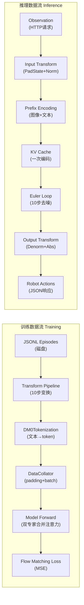
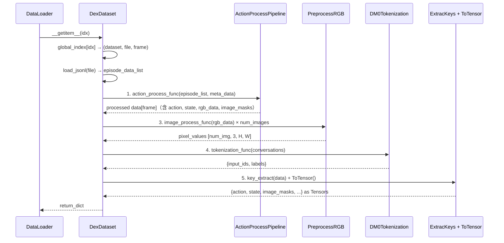
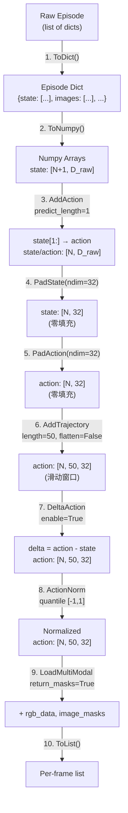
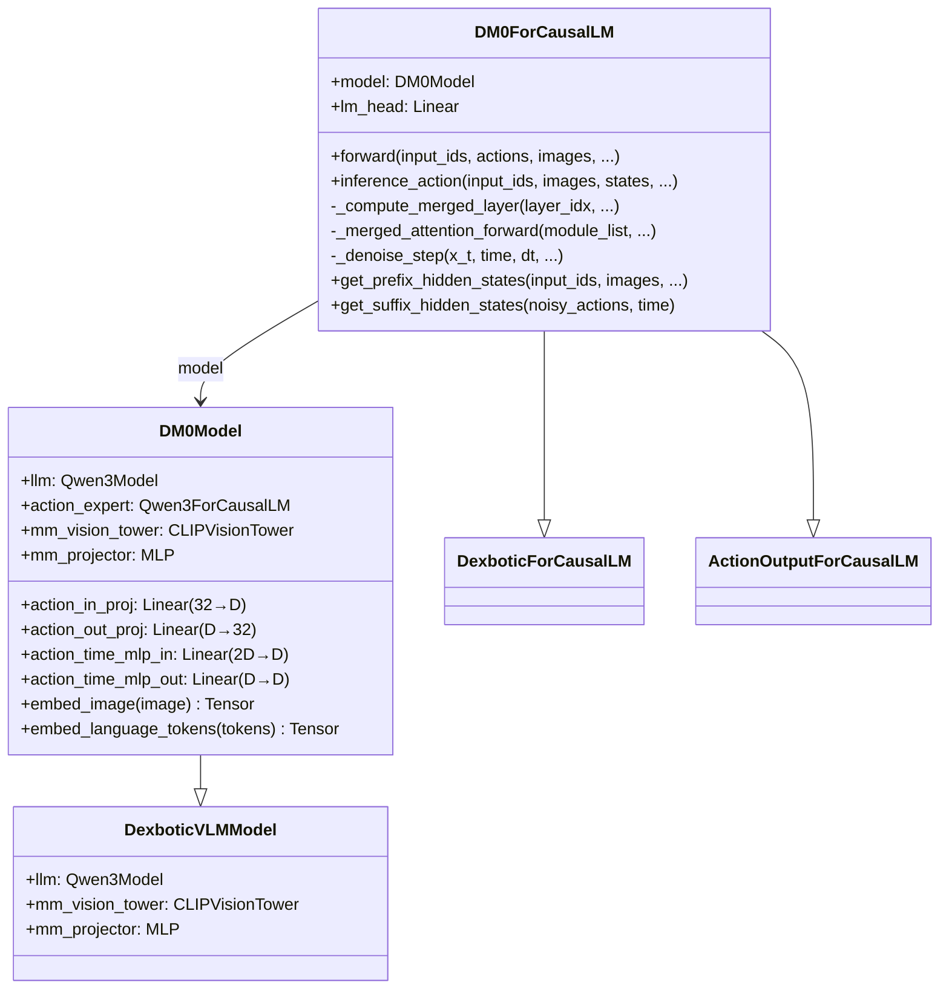
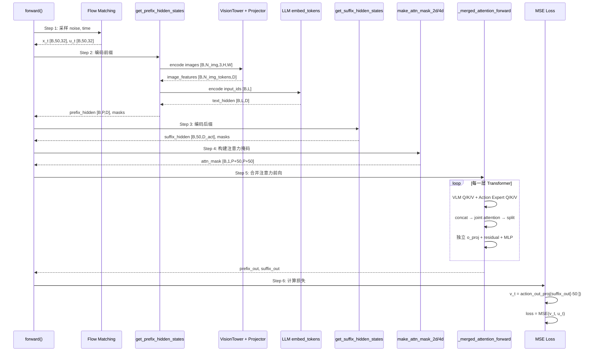
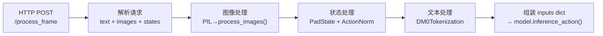
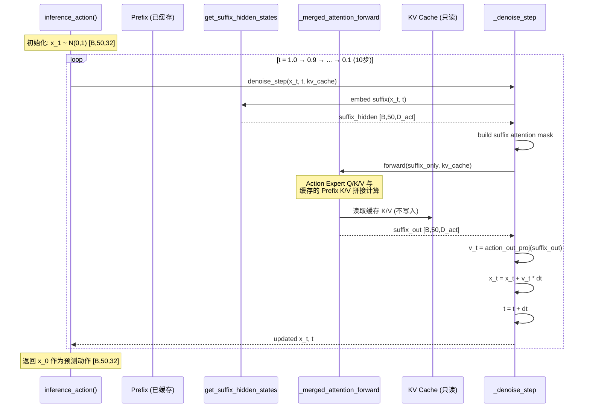
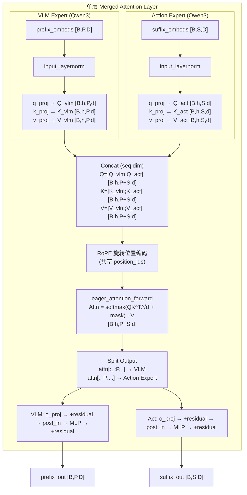
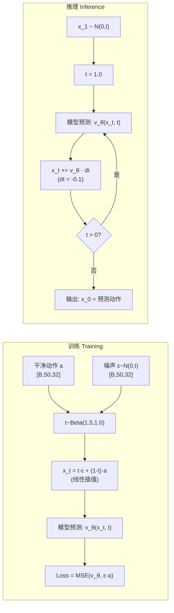

# DM0 数据流深度分析

**DM0 VLA 模型训练与推理数据流全链路分析**

---
dm0_designanly.md
仔细分析 DM0 算法的论文 @dexbotic/bt/docs/dm0/DM0 An Embodied-Native Vision-Language-Action Model towards Physical AI.pdf, 分析@dexbotic/README.md 和 @dexbotic/docs/ 里的每一篇文章, 以及 @dexbotic/bt/docs 中的每一篇文章, 深入分析时要基于本地的这个 @dexbotic/ 代码库, 解释一下DM0在训练和推理时, 数据是怎么流动与被处理的, 要有核心代码的讲解, 要图文并茂(辅以各种UML图), 并把这些分析和解释的内容写入 @dexbotic/bt/docs/dm0/dm0_designanly_data.md 中.

## 目录

- [1. 概述](#1-概述)
- [2. 训练数据流](#2-训练数据流)
  - [2.1 数据加载与索引构建](#21-数据加载与索引构建)
  - [2.2 动作处理管道](#22-动作处理管道)
  - [2.3 图像预处理](#23-图像预处理)
  - [2.4 Tokenization](#24-tokenization)
  - [2.5 数据整理 (Collation)](#25-数据整理-collation)
  - [2.6 模型前向传播](#26-模型前向传播)
- [3. 推理数据流](#3-推理数据流)
  - [3.1 输入处理](#31-输入处理)
  - [3.2 前缀编码与 KV 缓存](#32-前缀编码与-kv-缓存)
  - [3.3 Euler 去噪循环](#33-euler-去噪循环)
  - [3.4 动作输出与后处理](#34-动作输出与后处理)
- [4. 核心机制详解](#4-核心机制详解)
  - [4.1 合并注意力机制](#41-合并注意力机制)
  - [4.2 Flow Matching 数学与实现](#42-flow-matching-数学与实现)
  - [4.3 注意力掩码 (cumsum 机制)](#43-注意力掩码-cumsum-机制)
  - [4.4 时间嵌入与 KV 缓存优化](#44-时间嵌入与-kv-缓存优化)
- [5. 数据格式与 Tensor 维度参考](#5-数据格式与-tensor-维度参考)
- [6. 端到端示例](#6-端到端示例)

---

## 1. 概述

本文档聚焦于 DM0 VLA 模型在**训练和推理阶段的完整数据流动路径**，从原始数据的磁盘加载、变换处理、tokenization、batch 整理，到模型内部的前向计算与损失计算（训练），以及从观测输入到动作输出的完整推理链路。

DM0 的核心架构特征：
- **双专家合并注意力**：VLM (Qwen3 LLM) 处理视觉-语言前缀，Action Expert (Qwen3) 处理动作后缀，二者在每一层 Transformer 中通过 Q/K/V 拼接实现联合注意力
- **Flow Matching 动作生成**：连续速度场预测 + Euler 积分，而非离散 token 或扩散模型
- **50 步动作块**：每次预测 50 个时间步的连续动作轨迹

**关键常量**：

| 常量 | 值 | 含义 |
|------|---|------|
| `action_dim` | 32 | 统一动作空间维度（跨具身填充） |
| `chunk_size` | 50 | 动作预测块大小（50 个时间步） |
| `diffusion_steps` | 10 | 推理去噪步数（Euler 采样） |
| `num_images` | 3 | 多视角相机数量 |
| `model_max_length` | 200 | 文本 token 最大长度 |
| `IGNORE_INDEX` | -100 | 标签中的忽略标记 |
| `IMAGE_TOKEN_INDEX` | -200 | 图像占位 token |

### 端到端数据流概览



---

## 2. 训练数据流

### 2.1 数据加载与索引构建

**源文件**: `dexbotic/data/dataset/dex_dataset.py`

DM0 使用 `DexDataset` 统一加载所有训练数据。数据以 JSONL 格式存储，每个 episode 对应一个 `.jsonl` 文件，每行是一帧数据（包含 state、action、images URL、prompt 等字段）。

#### 索引构建

`DexDataset.__init__()` 通过 `_build_dataset_index()` 构建三级索引 `(dataset_index, file_index, frame_index)`：

```python
# dex_dataset.py:114-174
def _build_dataset_index(self):
    for dataset_info in self.datasets_info:
        data_path = dataset_info["annotations"]
        frequency = dataset_info["frequency"]      # 数据集采样频率
        meta_data = dataset_info["meta_data"]       # 含 non_delta_mask 等

        data_index = self._get_index_cache(data_path)["data"]  # {jsonl_file: num_samples}
        # ... 按 frequency 采样 ...
        for jsonl_file, num_samples in sampled_data_index:
            for frame_index in range(num_samples):
                global_index.append((dataset_index, file_index, frame_index))
```

**`index_cache.json`** 机制：首次加载时扫描所有 `.jsonl` 文件统计帧数，缓存到 `index_cache.json` 以加速后续启动。

#### 数据获取管道

`unsafe_getitem(idx)` 是核心数据获取方法，包含 5 个步骤：



5 步管道的核心代码（`dex_dataset.py:189-281`）：

```python
def unsafe_getitem(self, idx) -> dict:
    # 1. 处理 episode 数据（动作变换管道）
    data = self.action_process_func(episode_data_list, meta_data=meta_data)
    data = data[frame_index]                   # 取出目标帧

    # 3. RGB 预处理（多视角独立处理）
    rgb_data = data.pop("rgb_data", [])
    pixel_values = [proc(d) for proc, d in zip(self.image_process_func, rgb_data)]
    return_dict["image"] = torch.stack(pixel_values, dim=0)  # [num_img, 3, H, W]

    # 4. Tokenization
    tokenized_dict = self.tokenization_func(conversations, has_image=True)
    return_dict["input_ids"] = tokenized_dict["input_ids"]
    return_dict["labels"] = tokenized_dict["labels"]

    # 5. 提取其余字段 + 转为 Tensor
    return_dict.update(self.key_extract_func(data, other_keys))
    return_dict = ToTensor()(return_dict)
    return return_dict
```

---

### 2.2 动作处理管道

**源文件**: `dexbotic/exp/dm0_exp.py:247-264`, `dexbotic/data/dataset/transform/action.py`

DM0 的动作处理管道由 `DM0ActionConfig.build_action_process_func()` 构建，包含 10 个步骤：



#### 各步骤详解

**Step 3 - AddAction**: 通过时间位移生成动作标签。`action = state[1:]`，即当前帧的动作是下一帧的状态。同时裁切所有字段到相同长度。

**Step 6 - AddTrajectory**: 为每一帧构建 50 步未来动作窗口：

```python
# action.py:156-212
# 对于帧 i，轨迹为 action[i:i+50]
# 若不足 50 步，用 padding_mode='last' 填充最后一帧
trajectory = [action]
for i in range(1, self.trajectory_length):
    _next_action = np.copy(action[i:])
    _next_action = self.pad(_next_action, len(action), non_delta_mask)
    trajectory.append(_next_action)
trajectory = np.stack(trajectory, axis=-1)       # [N, D, T]
trajectory = np.transpose(trajectory, (0, 2, 1)) # [N, T, D] = [N, 50, 32]
```

**Step 7 - DeltaAction**: 计算相对动作 `delta = action - state`，使策略更具泛化性。对于 `non_delta_mask` 指定的维度（如夹爪开合），保持绝对值不变。对于周期性维度（如旋转角），进行绕环修正。

**Step 8 - ActionNorm**: 基于分位数 (q01, q99) 归一化到 `[-1, 1]`：

```python
# 归一化公式
normalized = (data - q01) / (q99 - q01) * 2.0 - 1.0
```

#### Tensor 形状演变表（以 7-DoF 机械臂为例）

| 步骤 | action 形状 | state 形状 | 说明 |
|------|-----------|-----------|------|
| Raw | N/A | [N+1, 7] | 原始关节状态 |
| AddAction | [N, 7] | [N, 7] | 位移 1 步生成动作 |
| PadAction | [N, 32] | [N, 32] | 零填充到 32 维 |
| AddTrajectory | [N, 50, 32] | [N, 32] | 50 步滑动窗口 |
| DeltaAction | [N, 50, 32] | [N, 32] | 相对动作表示 |
| ActionNorm | [N, 50, 32] | [N, 32] | 归一化到 [-1, 1] |

---

### 2.3 图像预处理

**源文件**: `dexbotic/data/dataset/rgb_preprocess.py`, `dexbotic/data/dataset/augmentations.py`

DM0 默认使用 3 个相机视角（`num_images=3`），每个视角独立预处理。不同视角可使用不同的增强策略：

```python
# dm0_exp.py:280-281
aug_policy: list[str] = ["dm0", "dm0_color", "dm0_color"]
# 视角0（主视角）: "dm0" - 几何增强 + 颜色增强
# 视角1（腕部）: "dm0_color" - 仅颜色增强
# 视角2（辅助）: "dm0_color" - 仅颜色增强
```

预处理流程：
1. **PadToSquare**: 填充为正方形（`image_pad_mode='zero'`，用黑色填充）
2. **增强**（取决于 aug_policy）：
   - `dm0`: RandomResizedCrop + Rotate(-5, +5) + ColorJitter
   - `dm0_color`: 仅 ColorJitter(brightness=0.3, contrast=0.4, saturation=0.5, hue=0.1)
3. **CLIP ImageProcessor**: Resize + Normalize（CLIP 标准化参数）

输出：每个视角一个 `[3, H, W]` tensor（如 CLIP ViT-L/14 为 `[3, 336, 336]`），最终 stack 为 `[num_img, 3, H, W]`。

---

### 2.4 Tokenization

**源文件**: `dexbotic/tokenization/process.py:184-299`

`DM0Tokenization` 使用 `step` 对话模板（类 ChatML 格式），将任务指令编码为 token 序列：

```
格式: "<system_prompt><sep>USER: <prompt><sep>ASSISTANT: "
```

核心流程：

```python
# process.py:202-299
class DM0Tokenization:
    def __call__(self, conversations, **kwargs):
        # 1. 编码系统提示
        system_prompt = f"{conv.system}{conv.sep}"
        tokens = tokenizer.encode(system_prompt)
        loss_mask = [False] * len(tokens)       # 系统提示不计算损失

        # 2. 编码用户消息
        role_str = f"USER: "
        content_str = f"{text}{sep}"
        tokens.extend(tokenizer.encode(role_str + content_str))
        loss_mask.extend([False] * len(role_tokens + content_tokens))

        # 3. 编码助手消息（SFT 模式下为空）
        # DM0 训练只使用 Flow Matching 损失，不计算文本损失

        # 4. 填充/截断到 model_max_length=200
        if len(tokens) < self._max_len:
            tokens += [pad_token_id] * (self._max_len - len(tokens))

        # 5. 构建 labels
        input_ids = np.asarray(tokens)
        labels = np.where(loss_mask, input_ids, IGNORE_INDEX)  # -100
```

> **重要**：在 DM0 训练中，文本 `labels` 实际上不参与损失计算（只有 Flow Matching 的 MSE 损失），`input_ids` 仅作为前缀条件输入。

输出 tensor：
- `input_ids`: `[200]` (int64)
- `labels`: `[200]` (int64, 大部分为 IGNORE_INDEX)

---

### 2.5 数据整理 (Collation)

**源文件**: `dexbotic/data/collator.py`

`DataCollatorForSupervisedDataset` 将多个样本整理为 batch：

```python
# collator.py:16-67
def __call__(self, instances):
    # 1. Pad input_ids 和 labels
    input_ids = pad_sequence(input_ids, padding_value=pad_token_id)  # [B, L]
    labels = pad_sequence(labels, padding_value=IGNORE_INDEX)         # [B, L]

    # 2. 截断到 model_max_length
    input_ids = input_ids[:, :self.tokenizer.model_max_length]

    # 3. 计算 attention_mask
    attention_mask = input_ids.ne(pad_token_id)  # [B, L] bool

    # 4. Stack 其他字段
    batch['images'] = torch.stack([inst['image'] for inst in instances])    # [B, N_img, 3, H, W]
    batch['actions'] = torch.stack([inst['action'] for inst in instances])  # [B, 50, 32]
    batch['states'] = torch.stack([inst['state'] for inst in instances])    # [B, 32]
    batch['image_masks'] = torch.stack([inst['image_masks'] ...])           # [B, N_img]
```

> **注意**: `mapping_keys` 字典中 `'image' -> 'images'`、`'action' -> 'actions'`、`'state' -> 'states'` 的键名映射。

**输出 batch 维度表**：

| Key | Shape | Dtype | 说明 |
|-----|-------|-------|------|
| `input_ids` | `[B, L]` | int64 | 文本 token，L ≤ 200 |
| `labels` | `[B, L]` | int64 | 损失标签（DM0 中未使用） |
| `attention_mask` | `[B, L]` | bool | 非 padding 位置为 True |
| `images` | `[B, N_img, 3, H, W]` | float32 | 多视角图像 |
| `actions` | `[B, 50, 32]` | float32 | 50 步动作轨迹 |
| `states` | `[B, 32]` | float32 | 当前机器人状态 |
| `image_masks` | `[B, N_img]` | bool | 有效视角标记 |

---

### 2.6 模型前向传播

**源文件**: `dexbotic/model/dm0/dm0_arch.py:406-511`

这是 DM0 训练中最核心的数据流环节。`DM0ForCausalLM.forward()` 将 batch 数据转化为 Flow Matching 损失。

#### 模型类图



#### 6 步前向传播详解



##### Step 1: Noise & Time 采样

```python
# dm0_arch.py:427-444
# 采样高斯噪声
noise = torch.normal(mean=torch.zeros_like(actions), std=torch.ones_like(actions))
# noise: [B, 50, 32]

# 采样时间 t ~ Beta(1.5, 1.0)，裁剪到 [0.001, 1.0]
time = torch.distributions.Beta(1.5, 1.0).sample((batch_size,)) * 0.999 + 0.001
# time: [B]

# Flow Matching 线性插值
time_expanded = time[..., None, None]                    # [B, 1, 1]
x_t = time_expanded * noise + (1 - time_expanded) * actions  # 噪声插值 [B, 50, 32]
u_t = noise - actions                                    # 目标速度场 [B, 50, 32]
```

> **关键理解**: `x_t` 是介于纯噪声 (`t=1`) 和干净动作 (`t=0`) 之间的插值。模型需要预测从 `x_t` 指向噪声方向的速度场 `u_t`（用于推理时反向积分）。Beta(1.5, 1.0) 分布偏向大 `t` 值，让模型更多地学习高噪声水平的去噪。

##### Step 2: 前缀 Hidden States

```python
# dm0_arch.py:307-353
def get_prefix_hidden_states(self, input_ids, attention_mask, images, image_masks):
    # images: [B, N_img, 3, H, W] → transpose → [N_img, B, 3, H, W]
    images = images.transpose(0, 1)
    image_masks = image_masks.transpose(0, 1)

    for image, image_mask in zip(images, image_masks):
        # 视觉编码：image → VisionTower → Projector
        image_hidden = self.encode_images(image)        # [B, N_img_tokens, D]
        hidden_states_list.append(image_hidden)
        # padding_mask: 用 image_mask 扩展到每个 image token
        padding_mask_list.append(
            image_mask.unsqueeze(1).expand(batch_size, num_img_tokens)
        )
        attn_mask_list += [1] * num_img_tokens          # 每个 token 都是新 causal 组

    # 文本编码
    text_hidden = self.model.embed_language_tokens(input_ids)  # [B, L, D]
    hidden_states_list.append(text_hidden)
    attn_mask_list += [1] * num_lang_tokens

    # 拼接所有前缀
    hidden_states = torch.cat(hidden_states_list, dim=1)  # [B, P, D]
    # P = N_img * N_img_tokens + L (如: 3*257 + 30 = 801)
```

> **前缀 attn_mask**: 全为 `[1, 1, 1, ..., 1]`，结合 cumsum 机制产生严格因果（lower triangular）注意力模式。

##### Step 3: 后缀 Hidden States

```python
# dm0_arch.py:355-404
def get_suffix_hidden_states(self, noisy_actions, time):
    # 时间嵌入：正弦余弦位置编码
    time_embeddings = posemb_sincos(time, dim=D_action)  # [B, D_action]

    # 动作投影
    action_hidden = self.model.action_in_proj(noisy_actions)  # [B, 50, D_action]

    # 融合：[action_embed, time_embed] → MLP
    time_expanded = time_embeddings[:, None, :].expand_as(action_hidden)
    fused = torch.cat([action_hidden, time_expanded], dim=2)  # [B, 50, 2*D_action]
    x = self.model.action_time_mlp_in(fused)                  # [B, 50, D_action]
    x = F.silu(x)
    hidden_states = self.model.action_time_mlp_out(x)          # [B, 50, D_action]

    # 后缀 attn_mask: [1, 0, 0, ..., 0]
    # 第一个 token 启动新 causal 组，其余在同组内（双向可见）
    attn_mask = [1] + [0] * (action_len - 1)
```

> **后缀 attn_mask 语义**: 首个 action token 的 `1` 创建新 causal 分组边界，其余 `0` 表示在同一组内。由于 cumsum 值相同，同组 token 之间双向可见（详见 [4.3 节](#43-注意力掩码-cumsum-机制)）。

##### Step 4: 注意力掩码构建

```python
# dm0_arch.py:461-470
# 拼接前缀和后缀的 padding_mask 和 attn_mask
full_padding_mask = torch.cat([prefix_padding_mask, suffix_padding_mask], dim=1)
full_attn_mask = torch.cat([prefix_attn_mask, suffix_attn_mask], dim=1)

# cumsum 机制生成 2D 掩码 → 4D 掩码
attn_mask_2d = make_attn_mask_2d(full_padding_mask, full_attn_mask)  # [B, P+S, P+S]
attn_mask = make_attn_mask_4d(attn_mask_2d, dtype=bfloat16)          # [B, 1, P+S, P+S]
```

##### Step 5: 合并注意力前向

```python
# dm0_arch.py:480-493
module_list = [self.model.llm, self.model.action_expert.model]

(prefix_out, suffix_out), _ = self._merged_attention_forward(
    module_list=module_list,
    attention_mask=attn_mask,            # [B, 1, P+S, P+S]
    position_ids=positions,              # [B, P+S]
    input_embeds_list=[prefix_hidden_states, suffix_hidden_states],
    use_cache=False,                     # 训练不缓存
)
# prefix_out: [B, P, D_llm]  —— VLM 输出（未使用）
# suffix_out: [B, 50, D_act] —— Action Expert 输出
```

##### Step 6: 损失计算

```python
# dm0_arch.py:496-511
# 取后缀最后 chunk_size 个 token
suffix_out_final = suffix_out[:, -self.model.config.chunk_size:]  # [B, 50, D_act]

# 投影回动作空间
v_t = self.model.action_out_proj(suffix_out_final)  # [B, 50, 32]

# MSE 损失：预测速度场 vs 目标速度场
action_loss = F.mse_loss(v_t, u_t, reduction="mean")
loss = action_loss
```

> **注意**: DM0 训练**只有** Flow Matching 损失（MSE），不包含语言建模损失。文本 `labels` 虽然存在但未参与损失计算。

---

## 3. 推理数据流

### 3.1 输入处理

**源文件**: `dexbotic/exp/dm0_exp.py:404-521`

推理通过 Flask HTTP 服务接收观测数据：



关键代码（`dm0_exp.py:404-513`）：

```python
def _get_response(self, text, images, states, batch_size=1):
    # 1. 图像处理：PIL → model.process_images() → [B, N_img, 3, H, W]
    batch_images = [[Image.open(i).convert("RGB") for i in imgs] for imgs in images]
    batch_images_tensor = [self.model.process_images(imgs).to(dtype=...) for imgs in batch_images]

    # 2. 图像掩码：有效视角 True，填充视角 False
    batch_image_masks = [torch.tensor([True]*num_images + [False]*(N-num_images)) ...]

    # 3. 文本 Tokenization
    batch_input_ids = [self.tokenization_func([{"from": "human", "value": p}])["input_ids"] for p in text]
    batch_attention_mask = [ids != pad_token_id for ids in batch_input_ids]

    # 4. 状态处理
    batch_states = np.array(json.loads(states))  # 解析 JSON

    # 5. 输入变换管道
    inference_args = {input_ids, attention_mask, images, image_masks, state, meta_data}
    inputs = self.input_transform(inference_args)
    # input_transform = Pipeline([PadState(ndim=32), ActionNorm(quantile), ToTensor()])

    # 6. 模型推理
    actions = self.model.inference_action(**inputs)  # [B, 50, 32]
```

---

### 3.2 前缀编码与 KV 缓存

**源文件**: `dexbotic/model/dm0/dm0_arch.py:513-568`

推理的核心优化：**前缀（图像+文本）只编码一次，KV 缓存被所有去噪步骤复用**。

```python
# dm0_arch.py:540-568
def inference_action(self, input_ids, attention_mask, images, image_masks, diffusion_steps=10, **kwargs):
    # Step 1: 编码前缀（与训练相同的 get_prefix_hidden_states）
    prefix_hidden, prefix_padding_mask, prefix_attn_mask = \
        self.get_prefix_hidden_states(input_ids, attention_mask, images, image_masks)

    # Step 2: 构建前缀注意力掩码
    prefix_attn_mask_2d = make_attn_mask_2d(prefix_padding_mask, prefix_attn_mask)
    prefix_attn_mask_4d = make_attn_mask_4d(prefix_attn_mask_2d)

    # Step 3: 前缀前向 + KV 缓存
    _, kv_cache = self._merged_attention_forward(
        module_list=[self.model.llm, self.model.action_expert.model],
        attention_mask=prefix_attn_mask_4d,
        past_key_values=DynamicCache(),     # 初始化空缓存
        input_embeds_list=[prefix_hidden, None],  # 只有 VLM 输入，Action Expert 无输入
        use_cache=True,                     # 存储 KV
    )
    # kv_cache: 每层存储 K/V，shape [B, n_heads, P, head_dim]
```

> **关键**: 此步中 `input_embeds_list=[prefix_hidden, None]`，Action Expert 不接收任何输入（seq_len=0），因此只有 VLM 的 Q/K/V 被计算并存入缓存。

---

### 3.3 Euler 去噪循环

**源文件**: `dexbotic/model/dm0/dm0_arch.py:570-641`

从纯噪声 `x_1 ~ N(0,1)` 开始，通过 10 步 Euler 积分逐步去噪到干净动作 `x_0`。



`_denoise_step()` 核心代码：

```python
# dm0_arch.py:585-641
def _denoise_step(self, x_t, time, dt, batch_size, prefix_padding_mask, prefix_attn_mask,
                  module_list, kv_cache):
    # 1. 编码当前噪声动作 + 时间
    suffix_hidden, suffix_padding_mask, suffix_attn_mask = \
        self.get_suffix_hidden_states(x_t, time.broadcast_to(batch_size))

    # 2. 构建 suffix → prefix+suffix 的注意力掩码
    suffix_attn_mask_2d = make_suffix_attn_mask_2d(
        suffix_padding_mask, suffix_attn_mask,
        prefix_padding_mask, prefix_attn_mask,    # 前缀掩码用于确定 suffix 能看到哪些 prefix
    )
    full_attn_mask_4d = make_attn_mask_4d(suffix_attn_mask_2d)  # [B, 1, 50, P+50]

    # 3. 合并注意力前向（只有 Action Expert 有输入）
    (_, suffix_out), _ = self._merged_attention_forward(
        module_list=module_list,
        attention_mask=full_attn_mask_4d,
        past_key_values=kv_cache,               # 读取前缀 KV 缓存
        input_embeds_list=[None, suffix_hidden], # VLM 无输入，Action Expert 有
        use_cache=False,                         # 不更新缓存
    )

    # 4. 预测速度场 + Euler 更新
    v_t = self.model.action_out_proj(suffix_out[:, -self.model.config.chunk_size:])
    return x_t + v_t * dt, time + dt  # dt < 0, 时间递减
```

> **KV 缓存机制**：在 `_compute_merged_layer()` 中，当 `use_cache=False` 且 `past_key_values` 存在时，代码将缓存的 K/V 与当前 suffix 的 K/V 拼接（`torch.cat`），但**不**将新的 K/V 写回缓存。这确保了：
> - 每个去噪步骤都能看到完整的前缀上下文
> - 缓存大小固定不增长
> - 10 步去噪中前缀 K/V 只计算 1 次

---

### 3.4 动作输出与后处理

**源文件**: `dexbotic/exp/dm0_exp.py:514-521`, `dexbotic/client.py`

模型输出 `[B, 50, 32]` 的归一化 delta 动作后，需要逆变换还原为真实机器人命令：

```python
# dm0_exp.py:514-521
actions = self.model.inference_action(**inputs)  # [B, 50, 32]

# 输出变换管道
outputs["action"] = actions.detach().cpu().numpy()
outputs = self.output_transform(outputs)
# output_transform = Pipeline([
#     ToNumpy(),
#     ActionDenorm(use_quantiles=True),   # 逆归一化: (data+1)/2 * (q99-q01) + q01
#     AbsoluteAction(),                   # delta → absolute: abs = state + delta
# ])

# 截断到实际机器人 DoF
return outputs["action"][..., :self.action_dim].tolist()  # 如 7-DoF: [B, 50, 7]
```

**客户端 (`DexClient`) 的 delta 累积**：

```python
# client.py:62-76
def delta_action(self, last_action, delta_action):
    original_action = np.copy(last_action)
    original_action[6:] = 0                  # 夹爪维度清零（non_delta）
    action = original_action + delta_action  # delta 累积到上一步的绝对动作
    # 旋转角绕环修正 (wrap to [-π, π])
    action[3:6] = np.where(action[3:6] > math.pi, action[3:6] - 2*math.pi, action[3:6])
    action[3:6] = np.where(action[3:6] < -math.pi, action[3:6] + 2*math.pi, action[3:6])
    return action
```

---

## 4. 核心机制详解

### 4.1 合并注意力机制

**源文件**: `dexbotic/model/dm0/dm0_arch.py:145-298`

DM0 最核心的架构创新是**合并注意力 (Merged Attention)**——在每一层 Transformer 中，VLM 和 Action Expert 的 Q/K/V 被拼接后做**一次**联合注意力计算。

#### 单层合并注意力流程



核心代码（`dm0_arch.py:145-268`）：

```python
def _compute_merged_layer(self, layer_idx, module_list, input_embeds_list, ...):
    # 1. 各专家独立计算 Q/K/V
    for module_idx, (layer, input_embeds) in enumerate(zip(layers, input_embeds_list)):
        if input_embeds is None:
            seq_len_list.append(0)  # 推理时 VLM 无输入
            continue
        prenorm = layer.input_layernorm(input_embeds)
        query = layer.self_attn.q_norm(layer.self_attn.q_proj(prenorm).view(...))
        key = layer.self_attn.k_norm(layer.self_attn.k_proj(prenorm).view(...))
        value = layer.self_attn.v_proj(prenorm).view(...)
        query_list.append(query)
        key_list.append(key)
        value_list.append(value)

    # 2. 拼接 Q/K/V（沿序列维度）
    query_states = torch.cat(query_list, dim=2)  # [B, n_heads, P+S, head_dim]
    key_states = torch.cat(key_list, dim=2)
    value_states = torch.cat(value_list, dim=2)

    # 3. 共享 RoPE
    cos, sin = rotary_emb(dummy_tensor, position_ids)
    query_states, key_states = apply_rotary_pos_emb(query_states, key_states, cos, sin)

    # 4. KV 缓存处理（推理时）
    if past_key_values is not None:
        if use_cache:
            key_states, value_states = past_key_values.update(key_states, value_states, layer_idx)
        elif cache_length > layer_idx:
            key_states = torch.cat([past_key_values.key_cache[layer_idx], key_states], dim=-2)
            value_states = torch.cat([past_key_values.value_cache[layer_idx], value_states], dim=-2)

    # 5. 联合注意力计算
    attn_output = eager_attention_forward(query_states, key_states, value_states, attention_mask)

    # 6. 分割输出 + 独立后处理
    attn_output = attn_output.view(batch_size, sum(seq_len_list), -1)
    for module_idx, (layer, input_embeds) in enumerate(zip(layers, input_embeds_list)):
        attn_embeds = attn_output[:, start_idx:start_idx+seq_len, :]
        attn_embeds = layer.self_attn.o_proj(attn_embeds)     # 各自的 o_proj
        residual = input_embeds + attn_embeds                  # 各自的残差连接
        postnorm = layer.post_attention_layernorm(residual)    # 各自的 LayerNorm
        mlp_out = layer.mlp(postnorm)                          # 各自的 MLP
        output = residual + mlp_out                            # 各自的残差连接
```

> **关键区别**：
> - Q/K/V 由**各自专家的权重**独立计算（参数不共享）
> - 注意力计算是**联合的**（一次 softmax 覆盖所有 token）
> - o_proj、MLP、LayerNorm 由**各自专家独立处理**（参数不共享）
> - 通过注意力掩码控制信息流向（prefix 看不到 suffix，suffix 能看到所有）

---

### 4.2 Flow Matching 数学与实现

DM0 使用 **Conditional Flow Matching** 生成连续动作，核心思想是学习一个速度场，将噪声分布 `N(0,I)` 运输到数据分布。



#### 数学公式

**训练**:

给定干净动作 $a$ 和噪声 $\epsilon \sim \mathcal{N}(0, I)$，采样时间 $t \sim \text{Beta}(1.5, 1.0)$：

- 插值: $x_t = t \cdot \epsilon + (1 - t) \cdot a$
- 目标速度场: $u_t = \epsilon - a$
- 训练目标: $\mathcal{L} = \mathbb{E}\left[\|v_\theta(x_t, t) - u_t\|^2\right]$

**推理** (Euler ODE Solver):

从 $x_1 \sim \mathcal{N}(0, I)$ 开始，步长 $\Delta t = -1/N$（N=10）：

$$x_{t+\Delta t} = x_t + v_\theta(x_t, t) \cdot \Delta t$$

每步时间递减: $t \leftarrow t + \Delta t$，从 1.0 降至约 0.0。

#### 与扩散模型的关键区别

| 特性 | Flow Matching (DM0) | DDPM 扩散 |
|------|---------------------|-----------|
| 前向过程 | 线性插值 $x_t = t\epsilon + (1-t)a$ | 加噪 $x_t = \sqrt{\bar\alpha_t}a + \sqrt{1-\bar\alpha_t}\epsilon$ |
| 预测目标 | 速度场 $v_\theta$ | 噪声 $\epsilon_\theta$ |
| 采样方法 | Euler ODE (确定性) | DDPM/DDIM (随机/确定性) |
| 推理步数 | 10 步即可 | 通常 50-1000 步 |
| 方差调度 | 无（线性插值） | 需要精心设计 noise schedule |

---

### 4.3 注意力掩码 (cumsum 机制)

**源文件**: `dexbotic/model/dm0/dm0_utils.py:12-40`

DM0 使用一种优雅的 **cumsum 掩码机制**来控制 prefix/suffix 之间的注意力流向。

#### `make_attn_mask_2d` 原理

```python
# dm0_utils.py:12-40
def make_attn_mask_2d(padding_mask, attn_mask):
    cumsum = torch.cumsum(attn_mask, dim=1)
    # 规则: token i 能看到 token j 当且仅当 cumsum[j] <= cumsum[i]
    attn_mask_2d = cumsum[:, None, :] <= cumsum[:, :, None]
    # 同时需要两者都不是 padding
    padding_mask_2d = padding_mask[:, None, :] * padding_mask[:, :, None]
    return attn_mask_2d & padding_mask_2d
```

#### 具体数值示例

以 P=4 (prefix tokens)，S=3 (suffix action tokens) 为例：

```
attn_mask:
  prefix:  [1, 1, 1, 1]       ← 每个 prefix token 的 mask 都是 1
  suffix:  [1, 0, 0]           ← 首个 suffix token 是 1，其余是 0

cumsum:
  prefix:  [1, 2, 3, 4]       ← 逐步递增
  suffix:  [5, 5, 5]           ← 首个 +1 后保持不变

注意力矩阵 (cumsum[j] <= cumsum[i]):

query\key   P0  P1  P2  P3  S0  S1  S2
   P0       T   F   F   F   F   F   F    cumsum[P0]=1
   P1       T   T   F   F   F   F   F    cumsum[P1]=2
   P2       T   T   T   F   F   F   F    cumsum[P2]=3
   P3       T   T   T   T   F   F   F    cumsum[P3]=4
   S0       T   T   T   T   T   T   T    cumsum[S0]=5
   S1       T   T   T   T   T   T   T    cumsum[S1]=5
   S2       T   T   T   T   T   T   T    cumsum[S2]=5
```

**产生三种注意力模式**：

1. **Prefix 内部**: 严格因果（下三角）—— 每个 prefix token 只能看到自己和之前的 token
2. **Suffix → Prefix**: 全连接 —— 每个 suffix token 能看到**所有** prefix token
3. **Suffix 内部**: 全连接 —— suffix token 之间双向可见（cumsum 相同）
4. **Prefix → Suffix**: **完全屏蔽** —— prefix token 看不到任何 suffix token（`cumsum[S] > cumsum[P]`）

> **设计意义**: Action tokens 需要参考所有视觉-语言上下文来预测动作，同时动作块内的 50 个 token 互相可见使得模型能进行跨时间步的轨迹规划。而 prefix 不需要看到动作，保持其纯粹的语言/视觉理解功能。

---

### 4.4 时间嵌入与 KV 缓存优化

#### 正弦余弦时间嵌入

**源文件**: `dexbotic/model/dm0/dm0_utils.py:95-128`

```python
def posemb_sincos(time, dim, min_period=4e-3, max_period=4.0):
    # 对数均匀分布的频率
    fraction = torch.linspace(0.0, 1.0, dim // 2)
    period = min_period * (max_period / min_period) ** fraction

    scaling_factor = 1.0 / period * 2 * math.pi
    sin_input = scaling_factor[None, :] * time[:, None]
    return torch.cat([torch.sin(sin_input), torch.cos(sin_input)], dim=1)
    # 输出: [B, dim]
```

时间 `t` 被编码为多尺度的正弦/余弦信号，频率从低 (`max_period=4.0`，对应慢变化) 到高 (`min_period=4e-3`，对应快变化) 对数均匀分布。这使得模型能精确区分不同的去噪阶段。

#### KV 缓存计算量优化

| 阶段 | 计算内容 | 注意力计算量 |
|------|---------|------------|
| **前缀编码（1次）** | 所有图像+文本 → KV 缓存 | $O(P^2)$ |
| **每步去噪（10次）** | 50 个 action token，读取 prefix KV | $O(S \times (P+S))$ |
| **总计（有缓存）** | $P^2 + 10 \times S \times (P+S)$ | |
| **总计（无缓存）** | $10 \times (P+S)^2$ | |

以 P=801, S=50 为例：
- **有缓存**: $801^2 + 10 \times 50 \times 851 = 641,601 + 425,500 = 1,067,101$
- **无缓存**: $10 \times 851^2 = 7,242,010$
- **加速比**: **约 6.8x**

---

## 5. 数据格式与 Tensor 维度参考

### 训练全链路 Tensor 演变

| 阶段 | 数据 | 形状 | Dtype |
|------|------|------|-------|
| 磁盘 | JSONL episode | 文本行列表 | string |
| AddAction 后 | action | `[N, D_raw]` | float64 |
| PadAction 后 | action | `[N, 32]` | float64 |
| AddTrajectory 后 | action | `[N, 50, 32]` | float64 |
| ActionNorm 后 | action | `[N, 50, 32]` | float64 |
| DexDataset 输出 | action | `[50, 32]` | float32 |
| | image | `[N_img, 3, H, W]` | float32 |
| | input_ids | `[L]` | int64 |
| DataCollator 输出 | actions | `[B, 50, 32]` | float32 |
| | images | `[B, N_img, 3, H, W]` | float32 |
| | input_ids | `[B, L]` | int64 |
| Forward: noise | noise | `[B, 50, 32]` | float32 |
| Forward: time | time | `[B]` | float32 |
| Forward: x_t | x_t | `[B, 50, 32]` | float32 |
| Forward: prefix_hidden | hidden | `[B, P, D]` | bf16 |
| Forward: suffix_hidden | hidden | `[B, 50, D_act]` | bf16 |
| Forward: attn_mask | mask | `[B, 1, P+50, P+50]` | bf16 |
| Forward: v_t | prediction | `[B, 50, 32]` | float32 |
| Forward: loss | scalar | `[1]` | float32 |

### 推理全链路 Tensor 演变

| 阶段 | 数据 | 形状 | Dtype |
|------|------|------|-------|
| HTTP 输入 | images (PNG bytes) | variable | uint8 |
| | text | string | - |
| | states (JSON) | `[D_raw]` | float64 |
| process_images 后 | images | `[B, N_img, 3, H, W]` | float32 |
| PadState 后 | state | `[B, 32]` | float32 |
| ActionNorm 后 | state | `[B, 32]` | float32 |
| Tokenization 后 | input_ids | `[B, L]` | int64 |
| 前缀编码 | prefix_hidden | `[B, P, D]` | bf16 |
| KV Cache | key_cache per layer | `[B, n_heads, P, head_dim]` | bf16 |
| 初始噪声 | x_1 | `[B, 50, 32]` | float32 |
| 每步 suffix_hidden | hidden | `[B, 50, D_act]` | bf16 |
| 每步 attn_mask | mask | `[B, 1, 50, P+50]` | bf16 |
| 最终输出 | x_0 (actions) | `[B, 50, 32]` | float32 |
| ActionDenorm 后 | actions | `[B, 50, 32]` | float64 |
| AbsoluteAction 后 | actions | `[B, 50, 32]` | float64 |
| HTTP 响应 | actions | `[B, 50, D_robot]` | float64 |

### 模型内部各层维度（以 Qwen3-0.6B 为例）

| 组件 | 参数 | 值 |
|------|------|---|
| hidden_size (D) | VLM & Action Expert | 1024 |
| num_attention_heads | | 16 |
| head_dim | | 64 |
| num_hidden_layers | | 28 |
| intermediate_size (MLP) | | 3072 |
| vocab_size | VLM only | 151936 |
| action_dim | 输入/输出 | 32 |
| chunk_size | 动作 token 数 | 50 |

---

## 6. 端到端示例

以一个具体的训练 batch 为例，追踪数据在每个阶段的完整维度变化：

**配置**: B=4, CLIP ViT-L/14 (257 image tokens per view), 3 camera views, text "pick up the cup" (tokenized to ~30 tokens), 7-DoF robot arm

```
=== 数据加载 ===
DexDataset.__getitem__(idx)
  └─ action: [50, 32] (float32)
  └─ image:  [3, 3, 336, 336] (float32)
  └─ state:  [32] (float32)
  └─ input_ids: [200] (int64)
  └─ image_masks: [3] (bool: [T, T, T])

=== DataCollator ===
batch:
  └─ actions:       [4, 50, 32]
  └─ images:        [4, 3, 3, 336, 336]
  └─ states:        [4, 32]
  └─ input_ids:     [4, 200]
  └─ attention_mask: [4, 200]
  └─ image_masks:   [4, 3]

=== Forward: Step 1 - Flow Matching ===
  noise:  [4, 50, 32]
  time:   [4]              (values in [0.001, 1.0])
  x_t:    [4, 50, 32]      (noise-action interpolation)
  u_t:    [4, 50, 32]      (target velocity)

=== Forward: Step 2 - Prefix ===
  每个视角: image [4, 3, 336, 336] → VisionTower → [4, 257, 1024]
  3 个视角: cat → image_hidden [4, 771, 1024]
  text: input_ids [4, 200] → embed_tokens → [4, 200, 1024]
  注意: 有效 text tokens 约 30 个，其余为 padding
  prefix_hidden: [4, 971, 1024]     (P = 771 + 200 = 971)
  prefix_attn_mask: [4, 971]        (全 1)

=== Forward: Step 3 - Suffix ===
  time_emb: posemb_sincos → [4, 1024]
  action_proj: [4, 50, 32] → action_in_proj → [4, 50, 1024]
  fused: cat([action, time_expanded], dim=2) → [4, 50, 2048]
  MLP: → [4, 50, 1024]
  suffix_hidden: [4, 50, 1024]      (S = 50)
  suffix_attn_mask: [4, 50]         ([1, 0, 0, ..., 0])

=== Forward: Step 4 - Attention Mask ===
  full_attn_mask: [4, 1021]         (P+S = 971+50)
  cumsum: [4, 1021]                 ([1,2,...,971,972,972,...,972])
  attn_mask_2d: [4, 1021, 1021]     (bool)
  attn_mask_4d: [4, 1, 1021, 1021]  (bf16, 0 or -2.38e38)

=== Forward: Step 5 - Merged Attention (28层) ===
  每层:
    VLM: Q_vlm [4, 16, 971, 64], K_vlm, V_vlm (相同shape)
    Act: Q_act [4, 16, 50, 64],  K_act, V_act (相同shape)
    Concat: Q [4, 16, 1021, 64], K, V (相同shape)
    RoPE → Attention → Split
    VLM out: [4, 971, 1024] + residual + MLP
    Act out: [4, 50, 1024]  + residual + MLP

  最终:
    prefix_out: [4, 971, 1024]  (未使用)
    suffix_out: [4, 50, 1024]

=== Forward: Step 6 - Loss ===
  suffix_out_final: [4, 50, 1024]
  v_t = action_out_proj → [4, 50, 32]
  loss = MSE(v_t, u_t)     scalar
```

---

**文档版本**: v1.0 | **基于代码库**: dexbotic (commit d9943a7) | **日期**: 2026-04-10
