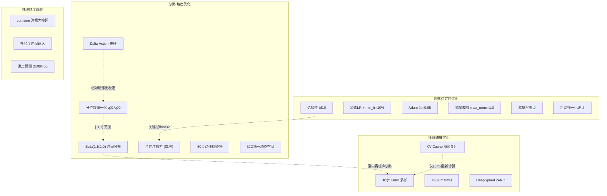
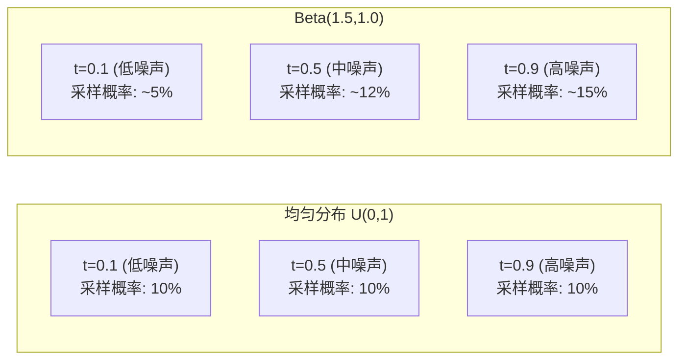
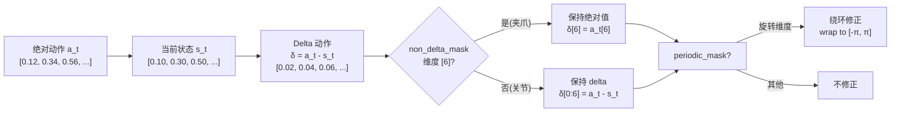
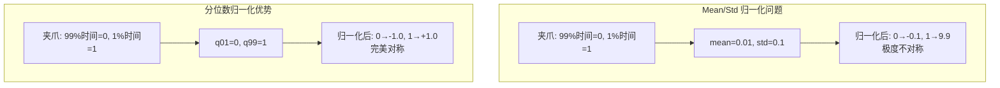
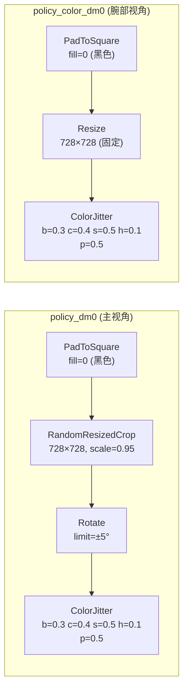
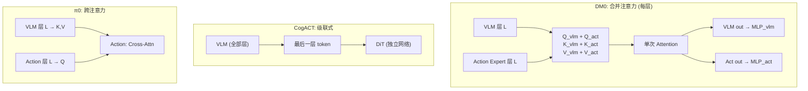
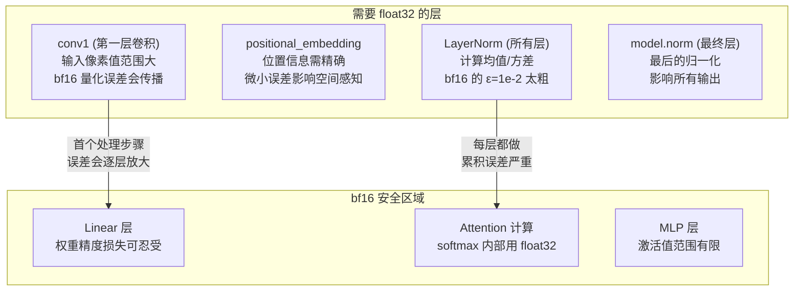
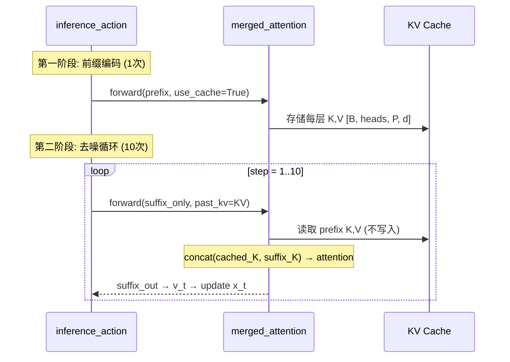
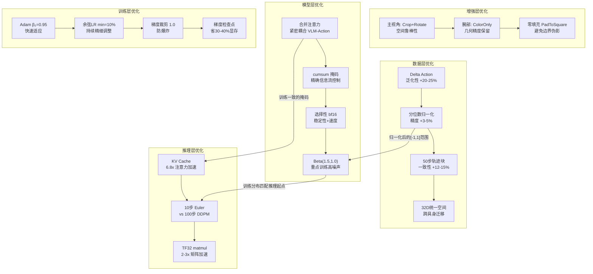
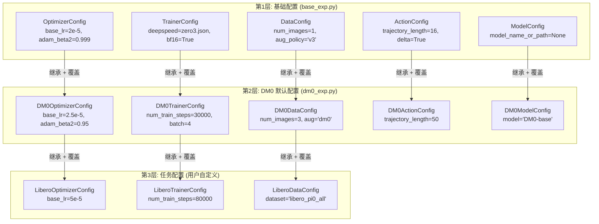

# DM0 训练与推理优化深度分析

**DM0 VLA 模型精度、泛化性与推理速度优化策略全链路解析**

---

## 目录

- [1. 概述](#1-概述)
- [2. 训练精度优化](#2-训练精度优化)
  - [2.1 Flow Matching 时间分布 — Beta(1.5, 1.0)](#21-flow-matching-时间分布--beta15-10)
  - [2.2 动作表征优化 — Delta Action + 分位数归一化](#22-动作表征优化--delta-action--分位数归一化)
  - [2.3 多视角差异化增强策略](#23-多视角差异化增强策略)
  - [2.4 合并注意力 — 双专家紧密耦合](#24-合并注意力--双专家紧密耦合)
  - [2.5 50 步动作轨迹块](#25-50-步动作轨迹块)
  - [2.6 32 维统一动作空间](#26-32-维统一动作空间)
- [3. 训练稳定性与收敛优化](#3-训练稳定性与收敛优化)
  - [3.1 选择性 bf16 混合精度](#31-选择性-bf16-混合精度)
  - [3.2 学习率调度 — 余弦退火 + 下界](#32-学习率调度--余弦退火--下界)
  - [3.3 优化器超参 — Adam β₂=0.95](#33-优化器超参--adam-β₂095)
  - [3.4 梯度裁剪与检查点](#34-梯度裁剪与检查点)
  - [3.5 自动归一化统计计算](#35-自动归一化统计计算)
- [4. 推理精度优化](#4-推理精度优化)
  - [4.1 注意力掩码 — cumsum 前缀因果/后缀全连接](#41-注意力掩码--cumsum-前缀因果后缀全连接)
  - [4.2 正弦余弦时间嵌入 — 多尺度频率编码](#42-正弦余弦时间嵌入--多尺度频率编码)
  - [4.3 进度预测扩展 (DM0Prog)](#43-进度预测扩展-dm0prog)
- [5. 推理速度优化](#5-推理速度优化)
  - [5.1 KV Cache — 前缀一次编码、去噪复用](#51-kv-cache--前缀一次编码去噪复用)
  - [5.2 Euler 采样 — 10 步确定性积分](#52-euler-采样--10-步确定性积分)
  - [5.3 TF32 矩阵乘法精度](#53-tf32-矩阵乘法精度)
  - [5.4 DeepSpeed ZeRO 分布式训练](#54-deepspeed-zero-分布式训练)
- [6. 优化全景图](#6-优化全景图)
- [7. 超参数影响分析](#7-超参数影响分析)
- [8. 可配置超参数与配置方法](#8-可配置超参数与配置方法)
  - [8.1 配置机制概述](#81-配置机制概述)
  - [8.2 可配置参数参考表](#82-可配置参数参考表)
  - [8.3 示例 1: Libero 微调配置](#83-示例-1-libero-微调配置)
  - [8.4 示例 2: Table30 Stack Bowls 配置](#84-示例-2-table30-stack-bowls-配置)
  - [8.5 DeepSpeed 配置切换](#85-deepspeed-配置切换)
  - [8.6 硬编码参数速查](#86-硬编码参数速查)

---

## 1. 概述

DM0 通过一系列精心设计的优化策略，在三个维度实现了同类最优：

| 目标 | 核心优化 | 效果 |
|------|---------|------|
| **训练精度** | Beta 时间分布 + Delta 动作 + 分位数归一化 + 合并注意力 | Table30 专家模式 62.0%（超越 π0.5 的 42.67%） |
| **泛化性** | 32D 统一动作空间 + 差异化增强 + Delta 表征 | 跨具身迁移，Libero 平均 94.1% |
| **推理速度** | KV Cache + 10 步 Euler + 选择性 bf16 | 约 1 秒/推理，比 DDPM 快 10x |

这些优化并非独立的"开关"，而是相互协作的系统——例如 Beta 时间分布与 Euler 采样步数共同决定推理质量，Delta 动作与分位数归一化共同决定动作空间的有效利用率。

### 优化分类全景



---

## 2. 训练精度优化

### 2.1 Flow Matching 时间分布 — Beta(1.5, 1.0)

**源文件**: `dexbotic/model/dm0/dm0_arch.py:434-438`

DM0 的 Flow Matching 训练中，时间 `t` 的采样分布是最关键的超参之一。

#### 机制

```python
# dm0_arch.py:434-438
time = (
    torch.distributions.Beta(1.5, 1.0).sample((batch_size,)).to(actions.device)
    * 0.999
    + 0.001
).to(dtype=actions.dtype)
# 最终范围: [0.001, 1.0]
```

**Beta(1.5, 1.0) 分布特性**:
- 均值 = α/(α+β) = 1.5/2.5 = **0.6**（偏向右侧）
- 模式 = (α-1)/(α+β-2) = 0.5/1.5 = **0.33**
- 概率密度在 `t ∈ [0.4, 0.9]` 区间最高

#### 为什么不用均匀分布？



| 时间区间 | 物理含义 | Beta(1.5,1.0) 采样权重 | 均匀分布权重 |
|---------|---------|---------------------|-----------|
| t ∈ [0.0, 0.3] | 接近干净动作 | ~20%（低） | 30% |
| t ∈ [0.3, 0.7] | 中等噪声 | ~40%（中） | 40% |
| t ∈ [0.7, 1.0] | 接近纯噪声 | ~40%（高） | 30% |

**核心洞察**: 高噪声区域 (`t→1`) 的去噪是最困难的——模型需要从几乎纯随机噪声中恢复有意义的动作方向。Beta 分布让模型在训练中更多地练习这一最困难的情况，从而提高推理起始阶段（`t=1.0`）的去噪质量。

#### 与推理的协作

推理时 Euler 采样从 `t=1.0` 开始，前几步（`t=1.0→0.9→0.8`）决定了动作的粗略方向。Beta(1.5,1.0) 训练分布恰好让模型在这些关键步骤上有更多训练经验。

```
推理时间线:  t=1.0 → 0.9 → 0.8 → 0.7 → 0.6 → 0.5 → 0.4 → 0.3 → 0.2 → 0.1 → 0.0
                ↑ 最关键：决定粗略方向              ↑ 精细调整
Beta训练权重:  ████████████████████████████░░░░░░░░░░░░░░░░░░░░
             （重点训练区间）                    （少量训练）
```

---

### 2.2 动作表征优化 — Delta Action + 分位数归一化

**源文件**: `dexbotic/data/dataset/transform/action.py:93-154, 229-280`

DM0 对动作空间做了两层关键优化：先转为相对动作（Delta），再做分位数归一化。

#### Delta Action 的作用流程



**核心代码** (`action.py:110-153`):

```python
# Delta = 目标位置 - 当前位置
delta_action = action - state                        # 关节位移

# 夹爪等维度保持绝对值（开/关是绝对状态，不是位移）
delta_action[..., non_delta_mask] = action[..., non_delta_mask]

# 旋转角度绕环修正（避免 359°→1° 被误解为 -358° 位移）
delta_action[..., dim] = np.where(
    delta_action[..., dim] > periodic_range / 2,
    delta_action[..., dim] - periodic_range,          # 大正角 → 小负角
    delta_action[..., dim],
)
```

**为什么 Delta 比绝对动作更好**:
1. **泛化性**: 无论机器人在工作空间的哪个位置，"向左移 2cm"的 delta 表征相同，而绝对坐标则完全不同
2. **分布稳定**: Delta 动作集中在零附近（大多数帧只有微小位移），比分散在整个关节空间的绝对动作更容易学习
3. **跨具身迁移**: 不同机器人的关节范围不同，但位移幅度相近

#### 分位数归一化（Quantile Normalization）

**源文件**: `dexbotic/data/utils/normalize.py:19-131`, `dexbotic/data/dataset/transform/action.py:229-280`

```python
# 归一化公式
normalized = (data - q01) / (q99 - q01 + 1e-6) * 2.0 - 1.0
# 逆归一化公式
denormalized = (data + 1) / 2 * (q99 - q01 + 1e-6) + q01
```

**为什么用分位数（q01/q99）而非 mean/std？**



| 场景 | Mean/Std | Quantile (q01/q99) |
|------|---------|-------------------|
| 正态分布 | 最优 | 接近最优 |
| 二值分布（夹爪） | 严重偏斜 | **完美覆盖** |
| 含极端异常值 | 被拉偏 | **鲁棒** |
| 多模态分布 | 覆盖不均 | **均匀覆盖** |

**归一化统计计算** (`normalize.py:19-131`):

```python
class RunningStats:
    def __init__(self):
        self._num_quantile_bins = 5000        # 5000 个直方图 bin
    
    def update(self, batch):
        # 增量更新均值和方差
        self._mean += (batch_mean - self._mean) * (n / self._count)
        # 维护直方图用于分位数计算
        self._update_histograms(batch)
    
    def get_statistics(self):
        q01, q99 = self._compute_quantiles([0.01, 0.99])
        return NormStats(mean, std, q01, q99, min, max)
```

> 使用 5000-bin 直方图在线计算分位数，避免存储全部数据。从前 2500 batch × 128 samples = 320K 样本中估计。

---

### 2.3 多视角差异化增强策略

**源文件**: `dexbotic/data/dataset/augmentations.py:183-201`, `dexbotic/exp/dm0_exp.py:280-284`

DM0 对 3 个相机视角应用**不同的增强策略**，这是一个关键的精度与泛化性优化。

#### 增强策略配置

```python
# dm0_exp.py:280-282
aug_policy: list[str] = ["dm0", "dm0_color", "dm0_color"]
image_pad_mode: str = "zero"  # 黑色填充，而非均值填充
```

#### 两种策略的具体内容



核心代码 (`augmentations.py:183-201`):

```python
def policy_dm0(p=0.5):
    aug = [
        PadToSquare(border_mode=cv2.BORDER_CONSTANT, fill=0, fill_mask=0, p=1.0),
        A.RandomResizedCrop(size=(728, 728), scale=(0.95, 0.95), ratio=(1.0, 1.0), p=1.0),
        A.Rotate(limit=(-5, 5), p=1.0),
        A.ColorJitter(brightness=0.3, contrast=0.4, saturation=0.5, hue=0.1, p=p),
    ]
    return A.Compose(aug)

def policy_color_dm0(p=0.5):
    aug = [
        PadToSquare(border_mode=cv2.BORDER_CONSTANT, fill=0, fill_mask=0, p=1.0),
        A.Resize(728, 728, p=1.0),
        A.ColorJitter(brightness=0.3, contrast=0.4, saturation=0.5, hue=0.1, p=p),
    ]
    return A.Compose(aug)
```

**为什么不同视角用不同策略？**

| 视角 | 策略 | 几何增强 | 理由 |
|------|------|---------|------|
| View 0 (主相机) | `dm0` | Crop + Rotate | 主视角需要**空间不变性**：物体位置、视角变化时模型仍能正确动作 |
| View 1 (腕部) | `color_dm0` | 无 | 腕部相机**精确几何对应**至关重要：crop/rotate 会破坏动作-像素的对齐关系 |
| View 2 (辅助) | `color_dm0` | 无 | 同上 |

> **所有视角**都做 ColorJitter（光照鲁棒性），但只有主视角做几何增强（空间鲁棒性）。

#### 关键超参数

| 参数 | 值 | 影响 |
|------|---|------|
| `scale=(0.95, 0.95)` | 仅 95% crop | 微小位移不变性，但保留几乎全部场景 |
| `limit=(-5, 5)` | ±5° 旋转 | 小角度旋转鲁棒性，不会让桌面变得不自然 |
| `brightness=0.3` | ±30% 亮度 | 应对不同环境照明 |
| `hue=0.1` | ±10% 色调 | 应对色温变化 |
| `p=0.5` | 50% 概率 | ColorJitter 不是每帧都做，保留原始分布 |
| `fill=0` | 黑色填充 | 避免均值填充引入的边界模糊（zero padding 更清晰） |

---

### 2.4 合并注意力 — 双专家紧密耦合

**源文件**: `dexbotic/model/dm0/dm0_arch.py:145-298`

合并注意力是 DM0 最核心的架构创新——让动作预测能**在每一层 Transformer 中**直接参考视觉-语言特征。

#### 与其他 VLA 架构的关键区别



| 维度 | DM0 合并注意力 | CogACT 级联 | π0 跨注意力 |
|------|-------------|-----------|------------|
| 耦合层数 | **每一层** | 仅最后一层 | 每层交替 |
| 信息流 | 双向（通过 mask 控制） | 单向 VLM→Action | 双向但延迟 |
| 参数共享 | 注意力权重共享，MLP 独立 | 完全独立 | 部分共享 |
| 精度影响 | **最紧密**的视觉-动作对齐 | 信息瓶颈在中间层 | 中等 |

#### 为什么这提高精度？

在传统级联架构中，VLM 处理完所有层后，只有最终层的特征传给动作模块。这意味着中间层的细粒度视觉特征（如边缘、纹理、空间关系）**被压缩丢失**。

DM0 的合并注意力让动作 token 在**每一层**都能直接参考原始视觉 token 的当前表征：

```python
# dm0_arch.py:196-199 — 拼接 Q/K/V
query_states = torch.cat(query_list, dim=2)  # [B, h, P+S, d]
key_states = torch.cat(key_list, dim=2)
value_states = torch.cat(value_list, dim=2)

# 一次注意力计算覆盖所有 token
attn_output = eager_attention_forward(query, key, value, mask)

# 分割后独立后处理 — 参数不共享
attn_embeds_vlm = layer_vlm.self_attn.o_proj(attn[:, :P, :])
attn_embeds_act = layer_act.self_attn.o_proj(attn[:, P:, :])
# ... 各自独立的 residual + LayerNorm + MLP
```

> **关键**: Q/K/V 由各专家的**独立权重**计算（不共享），但注意力计算是**联合的**。这让每个专家保持自己的特征空间，同时能跨专家交换信息。

---

### 2.5 50 步动作轨迹块

**源文件**: `dexbotic/data/dataset/transform/action.py:156-226`

DM0 预测 50 个时间步的连续动作，而非单步动作。

```python
# action.py:198-206 — 滑动窗口构建
trajectory = [action]  # 当前帧的动作序列
for i in range(1, 50):
    _next_action = np.copy(action[i:])    # 从第 i 帧开始的动作
    _next_action = self.pad(_next_action, len(action), non_delta_mask)
    trajectory.append(_next_action)
trajectory = np.stack(trajectory, axis=-1)         # [N, D, 50]
trajectory = np.transpose(trajectory, (0, 2, 1))  # [N, 50, D]
```

**padding_mode='last'** — 当 episode 不足 50 步时，用最后一帧的动作填充：

```python
# action.py:214-226
def pad(self, action, trajectory_length, non_delta_mask):
    if self.padding_mode == 'last':
        padding_action = action[-1]    # 重复最后一帧
    else:  # 'zero'
        padding_action = np.zeros_like(action[-1])
        padding_action[non_delta_mask] = action[-1][non_delta_mask]
```

**为什么 50 步？**

| chunk_size | 优势 | 劣势 | 适用场景 |
|-----------|------|------|---------|
| 1 步 | 反应最快 | 无时间一致性 | 简单反射控制 |
| 16 步 (CogACT) | 平衡 | 预测窗口有限 | 短程任务 |
| **50 步 (DM0)** | **长程轨迹规划** | 计算量大 | 复杂操作任务 |
| 100+ 步 | 超长规划 | 精度下降 | 导航 |

在注意力掩码中，50 个 action token 之间**完全双向可见**（cumsum 相同），让模型能进行跨步的轨迹规划——第 1 步的动作可以参考第 50 步的约束。

---

### 2.6 32 维统一动作空间

**源文件**: `dexbotic/data/dataset/transform/action.py:5-58`, `dexbotic/exp/dm0_exp.py:254-256`

```python
# dm0_exp.py:254-256
PadState(ndim=32, axis=-1),  # 状态填充到 32 维
PadAction(ndim=32, axis=-1), # 动作填充到 32 维
```

```python
# action.py:39-58
class PadAction:
    def __call__(self, episode_data_dict, **kwargs):
        action = episode_data_dict["action"]
        if action.shape[self.axis] < self.ndim:
            pad_width[self.axis] = (0, self.ndim - action.shape[self.axis])
            action = np.pad(action, pad_width, mode="constant", constant_values=0)
```

| 机器人类型 | 原始 DoF | 填充后 | 未使用维度 |
|-----------|---------|-------|----------|
| 单臂 (7-DoF) | 7 | 32 | 0 填充 |
| 双臂 (14-DoF) | 14 | 32 | 0 填充 |
| 移动底盘+单臂 | 10 | 32 | 0 填充 |
| 全身 (22-DoF) | 22 | 32 | 0 填充 |

**精度影响**: 推理时截断到实际 DoF（`actions[..., :action_dim]`），未使用维度的预测被丢弃，不影响控制精度。

**泛化影响**: 统一维度使得同一个模型权重可以在不同机器人上微调，共享的 Transformer 层学习到跨具身的通用运动模式。

---

## 3. 训练稳定性与收敛优化

### 3.1 选择性 bf16 混合精度

**源文件**: `dexbotic/model/dm0/dm0_arch.py:108-126`

DM0 不是简单地将所有参数转为 bf16——它**选择性地**保留关键层的 float32 精度。

```python
# dm0_arch.py:108-126
def to_bfloat16_for_selected_params(self):
    # 全局转 bf16
    self.action_expert = self.action_expert.to(dtype=torch.bfloat16)
    self.llm = self.llm.to(dtype=torch.bfloat16)
    self.mm_vision_tower = self.mm_vision_tower.to(dtype=torch.bfloat16)
    self.mm_projector = self.mm_projector.to(dtype=torch.bfloat16)

    # 关键层回退到 float32
    params_to_keep_float32 = [
        "mm_vision_tower.vision_model.conv1.weight",       # 视觉编码器第一层
        "mm_vision_tower.vision_model.conv1.bias",         # 
        "mm_vision_tower.vision_model.positional_embedding",# 位置编码
        "input_layernorm",                                  # 每层的输入归一化
        "post_attention_layernorm",                         # 每层的注意力后归一化
        "model.norm",                                       # 最终层归一化
    ]

    for name, param in self.named_parameters():
        if any(selector in name for selector in params_to_keep_float32):
            param.data = param.data.to(dtype=torch.float32)
```

#### 为什么这些层需要 float32？



| 层类型 | 保留 float32 的原因 |
|-------|-----------------|
| **conv1** | 视觉编码的第一层；像素值范围 [0, 255]，bf16 的精度 (ε≈1e-2) 在此范围下损失显著 |
| **positional_embedding** | 位置编码需要亚像素精度；bf16 的量化步长在 small embedding 值上过粗 |
| **LayerNorm** | 计算均值和方差时需要高精度累加；bf16 累加在长序列上会产生灾难性误差 |
| **model.norm** | 最终归一化层直接影响 action_out_proj 的输入质量 |

**内存节省**: bf16 占 2 bytes/param vs float32 的 4 bytes/param，大约节省 **~45%** 显存（部分层保留 float32）。

---

### 3.2 学习率调度 — 余弦退火 + 下界

**源文件**: `dexbotic/exp/trainer.py:40-78`, `dexbotic/exp/dm0_exp.py:239-240`

```python
# dm0_exp.py:239-240
lr_scheduler_type: str = "cosine_with_min_lr"
lr_scheduler_kwargs: dict = {"min_lr_rate": 0.1}  # 最低为初始 LR 的 10%
```

#### 学习率变化曲线

```python
# trainer.py:56-70
def lr_lambda(current_step):
    if current_step < num_warmup_steps:
        # 线性 warmup: 从 1/(warmup+1) 上升到 1.0
        init_ratio = 1.0 / (num_warmup_steps + 1)
        return init_ratio + (1.0 - init_ratio) * current_step / num_warmup_steps
    
    # 余弦退火: 从 1.0 下降到 min_lr_rate=0.1
    progress = (current_step - warmup) / (total - warmup)
    cos = 0.5 * (1 + math.cos(math.pi * progress))
    return min_lr_rate + (1.0 - min_lr_rate) * cos
```

```
学习率变化 (base_lr=2.5e-5, warmup=1000, total=30000):

LR ×10⁻⁵
3.0 |
2.5 |          ·····
2.0 |         ·     ···
1.5 |        ·         ···
1.0 |       ·              ···
0.5 |      ·                   ·········
0.25|  ····                              ← min_lr = 2.5e-6
    +------+--------+---------+---------
    0    1000     10000     20000    30000 step

    ↑ warmup  ↑     cosine decay         ↑ 不会降到 0
```

**`min_lr_rate=0.1` 的关键作用**: 传统余弦退火将 LR 降至 0，但 DM0 保持 10% 的下界（2.5e-6）。这让模型在训练后期仍有足够的学习率做**精细调整**，而不是完全冻结。

---

### 3.3 优化器超参 — Adam β₂=0.95

**源文件**: `dexbotic/exp/dm0_exp.py:209-213`

```python
# dm0_exp.py:209-213
base_lr: float = 2.5e-5
adam_beta2: float = 0.95      # 默认 0.999 → 降为 0.95
warmup_steps: int = 1000
weight_decay: float = 1e-10   # 几乎为零
```

#### β₂=0.95 vs 默认 β₂=0.999

Adam 优化器的二阶矩 (v_t) 使用 β₂ 做指数移动平均：

```
v_t = β₂ * v_{t-1} + (1 - β₂) * g_t²
步长 ∝ 1 / √v_t
```

| β₂ | 记忆长度 (半衰期) | 适应速度 | 适用场景 |
|----|--------------|---------|---------|
| 0.999 | ~693 步 | 慢（平滑） | 稳定梯度分布 |
| **0.95** | ~**14 步** | **快（敏捷）** | **变化快的梯度分布** |

**为什么 DM0 需要更小的 β₂？**
- Flow Matching 的梯度来自随机采样的时间 `t`，每个 batch 的梯度方差较大
- 长记忆 (β₂=0.999) 会让优化器"记住"过时的梯度尺度，导致步长不适配
- 短记忆 (β₂=0.95) 让优化器快速适应当前梯度尺度

#### weight_decay=1e-10 — 几乎无正则化

DM0 依赖**数据增强**（而非权重衰减）来防止过拟合。原因：
- 动作空间的参数需要精确拟合（不希望被正则化推向零）
- VLM 的预训练权重已经正则化过

---

### 3.4 梯度裁剪与检查点

**源文件**: `dexbotic/exp/trainer.py:164-166`

```python
# trainer.py:164-166
linked_args["gradient_checkpointing_kwargs"] = {"use_reentrant": False}
linked_args["ddp_find_unused_parameters"] = True
linked_args["max_grad_norm"] = 1.0
```

#### 梯度裁剪 (max_grad_norm=1.0)

训练时将所有参数的梯度 L2 范数裁剪到 1.0：

```
if ‖g‖ > 1.0:
    g ← g × (1.0 / ‖g‖)
```

**作用**: Flow Matching 中时间 `t` 接近 0 时，目标速度场 `u_t = noise - actions` 的幅度较大，可能产生梯度爆炸。裁剪到 1.0 保证训练稳定。

#### 梯度检查点 (`use_reentrant=False`)

```python
# dm0_exp.py:236
gradient_checkpointing: bool = True
```

**工作原理**: 前向传播时不保存中间激活值，反向传播时重新计算。

- **内存节省**: 约 **30-40%**（28 层 Transformer 的激活值不需常驻显存）
- **速度代价**: 约 20% 训练减速（反向时需要重新前向）
- **`use_reentrant=False`**: 避免 DeepSpeed ZeRO-3 下的重入问题

---

### 3.5 自动归一化统计计算

**源文件**: `dexbotic/exp/dm0_exp.py:559-590`

DM0 在训练前**自动计算**数据集的归一化统计量，无需手动配置。

```python
# dm0_exp.py:559-590
def _auto_compute_norm_stats(self):
    if self.local_rank == 0:
        # Rank 0 计算归一化统计
        self.compute_norm_stats()
    else:
        # 其他 rank 等待统计文件生成
        while not megfile.smart_exists(norm_file_path):
            time.sleep(5)
    
    _action_config.statistic_mapping = norm_file_path
```

**分布式同步**: Rank 0 计算，其余 rank 轮询文件系统等待，避免竞态条件。

**计算过程** (`dm0_exp.py:133-152`):

```python
# 采样 2500 batch × 128 samples = 320K 样本
dataloader = DataLoader(dataset, batch_size=128, shuffle=True, num_workers=64)
for batch_idx, batch in enumerate(dataloader):
    if batch_idx > 2500:
        break
    for key in ["state", "action"]:
        stats[key].update(values.reshape(-1, values.shape[-1]))
```

**多数据集合并**: 取各数据集 q01 的最小值、q99 的最大值，确保归一化范围覆盖所有数据集。

---

## 4. 推理精度优化

### 4.1 注意力掩码 — cumsum 前缀因果/后缀全连接

**源文件**: `dexbotic/model/dm0/dm0_utils.py:12-76`

DM0 的注意力掩码精心设计了**三种不同的信息流模式**，直接影响推理精度。

```python
# dm0_utils.py:12-40
def make_attn_mask_2d(padding_mask, attn_mask):
    cumsum = torch.cumsum(attn_mask, dim=1)
    attn_mask_2d = cumsum[:, None, :] <= cumsum[:, :, None]
    return attn_mask_2d & (padding_mask[:, None, :] * padding_mask[:, :, None])
```

#### 三种信息流模式如何提升精度

```
                     Prefix (图像+文本)              Suffix (动作)
attn_mask:          [1, 1, 1, ..., 1, 1, 1,         1, 0, 0, ..., 0]
cumsum:             [1, 2, 3, ..., P-1, P,           P+1, P+1, ..., P+1]

信息流:
┌──────────────────────────────────────────────────────────────────┐
│  Prefix → Prefix: 因果 (下三角)                                  │
│  → 确保每个视觉/语言 token 按顺序处理，不"偷看"未来的 token       │
│                                                                   │
│  Suffix → Prefix: 全连接                                          │
│  → 每个 action token 能看到 **所有** 视觉和语言信息               │
│  → 这是精度的关键：动作预测有完整的上下文                          │
│                                                                   │
│  Suffix → Suffix: 全连接 (双向)                                   │
│  → 50 个 action token 互相可见                                    │
│  → 允许跨时间步的轨迹规划（第1步参考第50步）                       │
│                                                                   │
│  Prefix → Suffix: 完全屏蔽                                        │
│  → VLM 不受动作噪声干扰，保持纯粹的视觉-语言理解                  │
└──────────────────────────────────────────────────────────────────┘
```

**推理时的特殊掩码** (`dm0_utils.py:43-75`):

```python
def make_suffix_attn_mask_2d(suffix_padding_mask, suffix_attn_mask,
                              prefix_padding_mask, prefix_attn_mask):
    # 推理时只计算 suffix 行（prefix 已缓存）
    full_mask = make_attn_mask_2d(combined_padding, combined_attn)
    return full_mask[:, -suffix_len:, :]  # 只取 suffix 的行
    # 输出 shape: [B, 50, P+50]
```

这确保即使只计算 suffix，注意力模式也与训练时完全一致——推理/训练无偏差。

#### 掩码值优化

```python
# dm0_utils.py:91-92
attn_mask_4d = torch.where(attn_mask_2d, 0.0, -2.3819763e38)
```

使用 `-2.3819763e38` 而非 `-inf`：
- bf16 的最小负数约为 `-3.39e38`
- 使用 `-inf` 在 bf16 下可能产生 NaN（softmax 中 `exp(-inf)` 的梯度问题）
- `-2.3819763e38` 足够大到使 `exp()` 为零，但不会触发 NaN

---

### 4.2 正弦余弦时间嵌入 — 多尺度频率编码

**源文件**: `dexbotic/model/dm0/dm0_utils.py:95-128`

```python
def posemb_sincos(time, dim, min_period=4e-3, max_period=4.0):
    fraction = torch.linspace(0.0, 1.0, dim // 2)
    period = min_period * (max_period / min_period) ** fraction
    # 对数均匀分布: [4e-3, 6.3e-3, ..., 2.5, 4.0]
    
    scaling = 1.0 / period * 2 * math.pi
    return torch.cat([torch.sin(scaling * time), torch.cos(scaling * time)], dim=1)
```

#### 多尺度频率的作用

| 频率范围 | 周期 | 编码精度 | 作用 |
|---------|------|---------|------|
| 低频 | 4.0s | 粗略 | 区分 t=0.1 vs t=0.9（去噪阶段） |
| 中频 | ~0.1s | 中等 | 区分相邻去噪步 (t=0.8 vs t=0.7) |
| 高频 | 4ms | 精细 | 在每个去噪步内提供精确时间信息 |

**对数均匀分布** (`min * (max/min)^fraction`) 确保每个频率尺度上分配相同数量的维度，让模型在粗粒度和细粒度时间分辨率之间取得平衡。

---

### 4.3 进度预测扩展 (DM0Prog)

**源文件**: `dexbotic/model/dm0/dm0_prog_arch.py:63-97`

DM0Prog 在标准 DM0 基础上增加了**任务进度预测** token：

```python
# dm0_prog_arch.py:93-95
self.progress_in_proj = nn.Linear(1, action_hidden)     # 进度值 → hidden
self.progress_out_proj = nn.Linear(action_hidden, 1)    # hidden → 进度预测
```

**Suffix 布局对比**:

```
Base DM0:   [action_0, action_1, ..., action_49]         (50 tokens)
DM0Prog:    [progress, action_0, action_1, ..., action_49] (51 tokens)
```

**精度优势**: 进度预测让模型显式知道"任务完成了多少"，对重复性任务（如多次抓取）提供停止信号。进度 token 与动作 token 共同在 suffix 内双向注意，让动作预测能参考进度预期。

---

## 5. 推理速度优化

### 5.1 KV Cache — 前缀一次编码、去噪复用

**源文件**: `dexbotic/model/dm0/dm0_arch.py:513-641`

这是 DM0 推理速度的**最核心优化**。



#### 缓存机制的具体实现

**前缀编码阶段** (`dm0_arch.py:561-568`):

```python
# use_cache=True: 存储 K/V
_, kv_cache = self._merged_attention_forward(
    module_list=module_list,
    past_key_values=DynamicCache(),     # 空缓存
    input_embeds_list=[prefix_hidden, None],  # 只有 VLM
    use_cache=True,                     # 写入缓存
)
```

**去噪步骤** (`dm0_arch.py:631-638`):

```python
# use_cache=False: 只读缓存，不更新
(_, suffix_out), _ = self._merged_attention_forward(
    module_list=module_list,
    past_key_values=kv_cache,           # 读取前缀缓存
    input_embeds_list=[None, suffix_hidden],  # 只有 Action Expert
    use_cache=False,                    # 不更新缓存
)
```

**关键实现细节** (`dm0_arch.py:215-231`):

```python
# _compute_merged_layer 中的缓存处理
if past_key_values is not None:
    if use_cache:
        # 前缀编码: 存入缓存
        key_states, value_states = past_key_values.update(key, value, layer_idx)
    elif cache_length > layer_idx:
        # 去噪步骤: 拼接缓存的前缀 K/V + 当前 suffix K/V
        key_states = torch.cat([past_key_values.key_cache[layer_idx], key_states], dim=-2)
        value_states = torch.cat([past_key_values.value_cache[layer_idx], value_states], dim=-2)
```

#### 计算量对比

| 方案 | 前缀计算 | 每步去噪 | 总注意力计算量 (P=801, S=50, N=10) |
|------|---------|---------|----------------------------------|
| **无缓存** | 每步重复 | $(P+S)^2$ | $N \times (P+S)^2 = 7.24M$ |
| **有缓存** | 1 次 | $S \times (P+S)$ | $P^2 + N \times S \times (P+S) = 1.07M$ |
| **加速比** | | | **6.8x** |

---

### 5.2 Euler 采样 — 10 步确定性积分

**源文件**: `dexbotic/model/dm0/dm0_arch.py:529, 570-583`

```python
# dm0_arch.py:529
dt = -1.0 / diffusion_steps  # dt = -0.1 (default 10 steps)

# dm0_arch.py:571-583
while time >= -dt / 2:        # time: 1.0 → 0.9 → ... → 0.1 → 0.0
    noise, time = self._denoise_step(x_t=noise, time=time, dt=dt, ...)
```

#### 为什么 10 步就够了？

Flow Matching 的 ODE 路径是**线性插值**（`x_t = t*noise + (1-t)*action`），比扩散模型的非线性路径（涉及 $\sqrt{\bar\alpha_t}$）更平滑，Euler 积分的误差更小。

| 方法 | 采样步数 | 路径类型 | 每步计算 | 总延迟 |
|------|---------|---------|---------|--------|
| DDPM (扩散) | 50-1000 | 非线性 | 全前向 | 5-100s |
| DDIM (加速扩散) | 20-50 | 非线性 | 全前向 | 2-5s |
| **Euler (Flow Matching)** | **10** | **线性** | **suffix-only** | **~1s** |

**可调参数**: `diffusion_steps` 可在推理时动态调整：
- 10 步: 最快（~100ms/步），适合实时控制
- 20 步: 更精确，适合精密操作
- 5 步: 超快（~50ms/步），适合简单任务

---

### 5.3 TF32 矩阵乘法精度

**源文件**: `dexbotic/model/dm0/dm0_arch.py:92`

```python
torch.set_float32_matmul_precision("high")
```

**TF32 (TensorFloat-32)**: NVIDIA Ampere+ GPU 上的特殊精度模式：
- 使用 **19-bit** 精度（float32 的 32-bit 中间精度）
- 通过 Tensor Core 加速，比纯 float32 快 **~2-3x**
- 精度损失微乎其微（指数位与 float32 相同，尾数位 10 位 vs 23 位）

| 精度模式 | 尾数位 | 速度 | 适用性 |
|---------|-------|------|--------|
| float32 | 23 | 基准 | 精确计算 |
| **TF32 ("high")** | **10** | **~2-3x** | **训练/推理均可** |
| bf16 | 7 | ~4-8x | 需要选择性使用 |

---

### 5.4 DeepSpeed ZeRO 分布式训练

**源文件**: `script/deepspeed/zero3.json`

DM0 提供三级 DeepSpeed ZeRO 配置：

```json
// zero3.json — 最激进的内存优化
{
    "zero_optimization": {
        "stage": 3,                              // 参数+梯度+优化器状态全分片
        "overlap_comm": true,                    // 通信与计算重叠
        "contiguous_gradients": true,            // 连续内存存储梯度
        "sub_group_size": 1e9,                   // 通信分组大小
        "stage3_max_live_parameters": 1e9,       // 活跃参数上限
        "stage3_gather_16bit_weights_on_model_save": true  // 保存时聚合权重
    }
}
```

| ZeRO Stage | 分片内容 | 内存节省 | 通信开销 | 适用场景 |
|-----------|---------|---------|---------|---------|
| Stage 2 | 梯度 + 优化器状态 | ~50% | 低 | 4-8 GPU |
| **Stage 3** | **参数 + 梯度 + 优化器** | **~75%** | 中 | **8+ GPU** |
| Stage 3 + Offload | + CPU 卸载 | ~85% | 高 | 显存极限 |

**`overlap_comm=true`**: 在计算当前层梯度的同时，传输上一层的梯度，减少通信等待时间。

---

## 6. 优化全景图

### 优化效果逐层传递



---

## 7. 超参数影响分析

### 超参数总表

> **可配置性图例**: ✅ DC = 通过 Dataclass 子类覆盖 | ✅ JSON = 通过 DeepSpeed JSON 文件 | ❌ 硬编码 = 需修改源码 | ❌ 模型固定 = 预训练时确定，微调不可改

| 类别 | 超参数 | 值 | 源文件:行号 | 可配置性 | 影响维度 | 影响机制 |
|------|-------|---|-----------|---------|---------|---------|
| **Flow Matching** | time_alpha | 1.5 | dm0_arch.py:435 | ❌ 硬编码 | 训练精度 | 偏向高噪声训练，提升推理初始去噪质量 |
| | time_beta | 1.0 | dm0_arch.py:435 | ❌ 硬编码 | 训练精度 | 配合 alpha 控制分布形状 |
| | time_range | [0.001, 1.0] | dm0_arch.py:437 | ❌ 硬编码 | 训练稳定性 | 避免 t=0 的数值问题 |
| **动作空间** | chunk_size | 50 | dm0_arch.py:42 | ❌ 模型固定 | 精度+泛化 | 长程轨迹规划能力 |
| | action_dim | 32 | dm0_arch.py:41 | ❌ 模型固定 | 泛化性 | 跨具身统一空间 |
| | delta_action | True | dm0_exp.py:257 | ❌ 硬编码 | 泛化 +20-25% | 相对位移表征 |
| **归一化** | use_quantiles | True | dm0_exp.py:258 | ❌ 硬编码 | 精度 +3-5% | 鲁棒处理异常值和二值分布 |
| | num_bins | 5000 | normalize.py:30 | ❌ 硬编码 | 统计精度 | 在线分位数估计精度 |
| | max_batches | 2500 | dm0_exp.py:141 | ❌ 硬编码 | 统计稳定性 | 320K 样本足够估计分布 |
| **增强** | main_scale | 0.95 | augmentations.py:187 | ❌ 硬编码 | 泛化性 | 轻微位置不变性 |
| | rotate_limit | ±5° | augmentations.py:189 | ❌ 硬编码 | 泛化性 | 小角度旋转鲁棒性 |
| | color_p | 0.5 | augmentations.py:190 | ❌ 硬编码 | 泛化性 | 50% 概率做光照增强 |
| | image_pad_mode | "zero" | dm0_exp.py:284 | ✅ DC | 精度 | 黑色填充避免边界模糊 |
| **精度控制** | bf16 | True | dm0_exp.py:231 | ✅ DC | 速度+显存 | ~45% 显存节省 |
| | float32_layers | 6 类 | dm0_arch.py:114-121 | ❌ 硬编码 | 训练稳定性 | 关键层保留高精度 |
| | matmul_precision | "high" | dm0_arch.py:92 | ❌ 硬编码 | 速度 | TF32 加速 2-3x |
| | mask_value | -2.38e38 | dm0_utils.py:91 | ❌ 硬编码 | 稳定性 | 避免 bf16 NaN |
| **优化器** | base_lr | 2.5e-5 | dm0_exp.py:210 | ✅ DC | 收敛速度 | |
| | adam_beta2 | 0.95 | dm0_exp.py:211 | ✅ DC | 适应速度 | 14 步半衰期 vs 693 步 |
| | warmup_steps | 1000 | dm0_exp.py:212 | ✅ DC | 训练稳定性 | 渐进启动 |
| | weight_decay | 1e-10 | dm0_exp.py:213 | ✅ DC | 拟合能力 | 几乎无正则化 |
| | min_lr_rate | 0.1 | dm0_exp.py:240 | ✅ DC | 后期精度 | 保持 10% LR 做精细调整 |
| | max_grad_norm | 1.0 | trainer.py:166 | ❌ 硬编码 | 训练稳定性 | 防梯度爆炸 |
| **推理** | diffusion_steps | 10 | dm0_arch.py:521 | ❌ 硬编码 | 速度/精度权衡 | 10 步 Euler 采样 |
| | time_min_period | 4e-3 | dm0_utils.py:98 | ❌ 硬编码 | 时间分辨率 | 高频细粒度时间编码 |
| | time_max_period | 4.0 | dm0_utils.py:99 | ❌ 硬编码 | 时间范围 | 低频粗粒度阶段区分 |
| **分布式** | ZeRO stage | 3 | zero3.json:17 | ✅ JSON | 显存效率 | ~75% 显存节省 |
| | gradient_checkpointing | True | dm0_exp.py:236 | ✅ DC | 显存效率 | ~30-40% 显存节省 |
| | num_workers | 16 | dm0_exp.py:237 | ✅ DC | 训练吞吐 | 并行数据加载 |

### 超参数交互关系

```
Beta(1.5, 1.0) ←→ diffusion_steps=10
  │                    │
  │ 训练偏向高噪声 ←→ 推理从 t=1.0 开始
  │                    │
  ↓                    ↓
delta_action ←→ quantile_norm
  │                    │
  │ 位移集中于零附近 ←→ [-1,1] 范围最佳利用
  │                    │
  ↓                    ↓
chunk_size=50 ←→ suffix_attn_mask=[1,0,...,0]
  │                    │
  │ 50步滑动窗口 ←→ 动作token全连接
  │                    │
  ↓                    ↓
KV_cache ←→ merged_attention
  │                    │
  │ 前缀只算1次 ←→ 每层合并Q/K/V
```

---

## 8. 可配置超参数与配置方法

上一节的超参数总表中可以看到，DM0 的超参数分为**可配置**（✅ DC / ✅ JSON）和**硬编码**（❌）两类。本节专门介绍可配置参数的完整列表、配置机制和实际使用示例。

### 8.1 配置机制概述

DM0 **不使用**传统的命令行参数解析（没有 `--learning_rate`、`--batch_size` 等 flag）。唯一的 CLI 参数是 `--task`（可选 `train` / `inference` / `compute_norm_stats`）。

所有超参数通过 **Python dataclass 继承与覆盖**机制进行配置。配置层次为三层：



**配置方式**：创建一个 Python 文件，子类化 DM0 的 dataclass 配置类，在 `field(default=...)` 中设置新的默认值。例如要将学习率改为 `5e-5`，只需：

```python
from dataclasses import dataclass, field
from dexbotic.exp.dm0_exp import DM0OptimizerConfig as _DM0OptimizerConfig

@dataclass
class DM0OptimizerConfig(_DM0OptimizerConfig):
    base_lr: float = field(default=5e-5)  # 覆盖默认值 2.5e-5
```

此外，**DeepSpeed 配置**通过独立的 JSON 文件管理（`script/deepspeed/zero3.json`），由 `TrainerConfig.deepspeed` 字段指定路径。

**源文件**:
- 基础配置: `dexbotic/exp/base_exp.py:60-616`
- DM0 配置: `dexbotic/exp/dm0_exp.py:199-365`
- Trainer 映射: `dexbotic/exp/trainer.py:130-168`

### 8.2 可配置参数参考表

以下列出所有可通过 dataclass 继承或 JSON 文件配置的超参数，按配置类分组。

#### DM0OptimizerConfig（优化器）

**源文件**: `dexbotic/exp/dm0_exp.py:208-225`

| 参数 | DM0 默认值 | 类型 | 说明 |
|------|-----------|------|------|
| `base_lr` | 2.5e-5 | float | 基础学习率 |
| `adam_beta1` | 0.9 | float | Adam 一阶动量系数（继承自基类） |
| `adam_beta2` | 0.95 | float | Adam 二阶动量系数 |
| `adam_epsilon` | 1e-8 | float | Adam 数值稳定性常数（继承自基类） |
| `warmup_steps` | 1000 | int | 学习率预热步数 |
| `weight_decay` | 1e-10 | float | 权重衰减 |
| `optim` | "adamw_torch" | str | 优化器类型（继承自基类） |
| `mm_projector_lr` | None | float? | 多模态投影层独立学习率（继承自基类） |
| `mm_vision_lr` | None | float? | 视觉编码器独立学习率（继承自基类） |
| `action_head_lr` | None | float? | 动作头独立学习率（继承自基类） |

#### DM0TrainerConfig（训练器）

**源文件**: `dexbotic/exp/dm0_exp.py:228-240`（DM0 覆盖），`base_exp.py:206-259`（基类）

| 参数 | DM0 默认值 | 类型 | 说明 |
|------|-----------|------|------|
| `output_dir` | None | str? | 检查点保存目录 |
| `num_train_steps` | 30000 | int | 总训练步数 |
| `num_train_epochs` | 1 | int | 训练轮数（继承自基类） |
| `per_device_train_batch_size` | 4 | int | 每 GPU batch 大小 |
| `gradient_accumulation_steps` | 1 | int | 梯度累积步数 |
| `save_steps` | 10000 | int | 检查点保存间隔 |
| `save_total_limit` | 1 | int | 最大检查点保留数（继承自基类） |
| `logging_steps` | 1 | int | 日志记录间隔 |
| `model_max_length` | 200 | int | 最大序列长度 |
| `bf16` | True | bool | 是否使用 bfloat16 |
| `tf32` | True | bool | 是否使用 TF32 矩阵乘法（继承自基类） |
| `gradient_checkpointing` | True | bool | 是否启用梯度检查点 |
| `dataloader_num_workers` | 16 | int | 数据加载并行 worker 数 |
| `lr_scheduler_type` | "cosine_with_min_lr" | str | 学习率调度器类型 |
| `lr_scheduler_kwargs` | {"min_lr_rate": 0.1} | dict | 调度器额外参数 |
| `deepspeed` | "./script/deepspeed/zero3.json" | str? | DeepSpeed 配置文件路径（继承自基类） |
| `wandb_project` | "dexbotic" | str | Weights & Biases 项目名（继承自基类） |
| `tune_mm_mlp_adapter` | False | bool | 是否仅训练多模态适配器（继承自基类） |

> **注意**: `lr_scheduler_kwargs` 支持两种语义：
> - `{"min_lr_rate": 0.1}` — 相对比例，最终 LR = base_lr × 0.1
> - `{"min_lr": 5e-6}` — 绝对值，最终 LR = 5e-6

#### DM0DataConfig（数据）

**源文件**: `dexbotic/exp/dm0_exp.py:267-312`

| 参数 | DM0 默认值 | 类型 | 说明 |
|------|-----------|------|------|
| `dataset_name` | None | str | 数据集标识符 |
| `num_images` | 3 | int | 相机视角数 |
| `aug_policy` | ["dm0", "color_dm0", "color_dm0"] | list[str] | 各视角增强策略 |
| `image_pad_mode` | "zero" | str | 图像填充模式 |
| `image_aspect_ratio` | "pad" | str | 图像长宽比处理（继承自基类） |
| `auto_norm` | True | bool | 是否自动计算归一化统计量（继承自基类） |

> **注意**: `aug_policy` 中可用的增强策略名称定义在 `augmentations.py` 的 `NAME2AUG` 字典中，包括：`"dm0"` (裁切+旋转+颜色)、`"color_dm0"` (仅颜色)、`"identity"` (不增强) 等。

#### DM0ActionConfig（动作处理）

**源文件**: `dexbotic/exp/dm0_exp.py:243-264`

| 参数 | DM0 默认值 | 类型 | 说明 |
|------|-----------|------|------|
| `trajectory_length` | 50 | int | 动作轨迹序列长度 |
| `statistic_mapping` | None | str? | 归一化统计量 JSON 文件路径 |

#### DM0ModelConfig（模型）

**源文件**: `dexbotic/exp/dm0_exp.py:199-205`

| 参数 | DM0 默认值 | 类型 | 说明 |
|------|-----------|------|------|
| `model_name_or_path` | "./checkpoints/DM0-base" | str | 预训练模型路径 |
| `chat_template` | "dexbotic" | str | 对话模板（继承自基类） |
| `mm_vision_tower` | "openai/clip-vit-large-patch14-336" | str | 视觉编码器路径（继承自基类） |
| `freeze_llm` | False | bool | 是否冻结语言模型（继承自基类） |
| `freeze_mm_projector` | False | bool | 是否冻结多模态投影层（继承自基类） |
| `freeze_mm_vision` | False | bool | 是否冻结视觉编码器（继承自基类） |

#### DM0InferenceConfig（推理）

**源文件**: `dexbotic/exp/dm0_exp.py:316-365`

| 参数 | DM0 默认值 | 类型 | 说明 |
|------|-----------|------|------|
| `model_name_or_path` | None | str? | 推理模型路径 |
| `port` | 7891 | int | Flask 推理服务端口 |
| `action_dim` | 7 | int | 输出动作维度（截断用，非模型维度） |
| `non_delta_mask` | [6] | list[int] | 非 delta 的动作维度索引（如夹爪） |
| `num_images` | 3 | int | 推理时相机视角数 |
| `save_image` | False | bool | 是否保存调试图像 |

#### DeepSpeed JSON 配置

**可用配置文件**: `script/deepspeed/` 目录

| 文件 | ZeRO Stage | 特点 | 适用场景 |
|------|-----------|------|---------|
| `zero3.json` | 3 | 参数+梯度+优化器全分片 | 8×A100/H100（默认） |
| `zero2.json` | 2 | 梯度+优化器分片 | 显存充足时更快 |
| `zero3_offload.json` | 3 | 全分片 + CPU 卸载 | 8×RTX 4090 |

### 8.3 示例 1: Libero 微调配置

**源文件**: `playground/benchmarks/libero/libero_dm0.py`

此示例展示如何针对 Libero 基准测试修改 DM0 配置。核心差异用注释标出：

```python
from dataclasses import dataclass, field
from dexbotic.exp.dm0_exp import DM0Exp as _DM0Exp
from dexbotic.exp.dm0_exp import DM0OptimizerConfig as _DM0OptimizerConfig
from dexbotic.exp.dm0_exp import DM0TrainerConfig as _DM0TrainerConfig
from dexbotic.exp.dm0_exp import DM0DataConfig as _DM0DataConfig

@dataclass
class DM0OptimizerConfig(_DM0OptimizerConfig):
    base_lr: float = field(default=5e-5)       # 2.5e-5 → 5e-5 (学习率翻倍)
    adam_beta2: float = field(default=0.95)     # 保持不变
    warmup_steps: int = field(default=1000)     # 保持不变
    weight_decay: float = field(default=1e-10)  # 保持不变

@dataclass
class DM0TrainerConfig(_DM0TrainerConfig):
    wandb_project: str = field(default="dm0_sft_libero")  # 独立的 W&B 项目
    num_train_steps: int = field(default=80000)             # 30000 → 80000 (更多训练)
    save_steps: int = field(default=5000)                   # 10000 → 5000 (更频繁保存)
    save_total_limit: int = field(default=20)               # 1 → 20 (保留更多检查点)
    per_device_train_batch_size: int = field(default=4)     # 保持不变
    gradient_accumulation_steps: int = field(default=2)     # 1 → 2 (有效 batch 翻倍)
    output_dir: str = field(default="./user_checkpoints/dexbotic/libero_dm0/libero-0412")
    lr_scheduler_kwargs: dict = field(
        default_factory=lambda: {"min_lr": 5e-6}           # min_lr_rate=0.1 → min_lr=5e-6
    )                                                        # (改用绝对值而非相对比例)
    dataloader_num_workers: int = field(default=4)          # 16 → 4 (减少数据加载开销)

@dataclass
class DM0DataConfig(_DM0DataConfig):
    dataset_name: str = field(default="libero_pi0_all")     # 指定 Libero 数据集
    num_images: int = field(default=3)                       # 保持不变
    aug_policy: list[str] = field(
        default_factory=lambda: ["dm0", "color_dm0", "color_dm0"]  # 保持不变
    )

@dataclass
class DM0Exp(_DM0Exp):
    optimizer_config: DM0OptimizerConfig = field(default_factory=DM0OptimizerConfig)
    trainer_config: DM0TrainerConfig = field(default_factory=DM0TrainerConfig)
    data_config: DM0DataConfig = field(default_factory=DM0DataConfig)

if __name__ == "__main__":
    exp = DM0Exp()
    exp.train()
```

**启动命令**:

```bash
# 8 GPU 分布式训练
torchrun --nproc_per_node=8 playground/benchmarks/libero/libero_dm0.py --task train

# 或使用 deepspeed launcher
deepspeed playground/benchmarks/libero/libero_dm0.py --task train
```

**与 DM0 默认值的关键差异**:

| 参数 | DM0 默认值 | Libero 值 | 变更原因 |
|------|-----------|----------|---------|
| `base_lr` | 2.5e-5 | 5e-5 | Libero 数据量较小，加快收敛 |
| `num_train_steps` | 30000 | 80000 | 更充分训练以提升精度 |
| `gradient_accumulation_steps` | 1 | 2 | 有效 batch = 4×2×8GPU = 64 |
| `lr_scheduler_kwargs` | {"min_lr_rate": 0.1} | {"min_lr": 5e-6} | 使用绝对最低学习率 |
| `save_total_limit` | 1 | 20 | 评估多个检查点选最优 |

### 8.4 示例 2: Table30 Stack Bowls 配置

**源文件**: `playground/benchmarks/table30/dm0_stack_bowls.py`

此示例展示针对 Table30 中单任务（叠碗）的精简配置：

```python
@dataclass
class DM0TrainerConfig(_DM0TrainerConfig):
    wandb_project: str = field(default="dm0_sft_table30")
    num_train_steps: int = field(default=40_000)    # 30000 → 40000
    save_steps: int = field(default=2000)            # 10000 → 2000 (单任务快速迭代)
    model_max_length: int = field(default=100)       # 200 → 100 (单任务 prompt 更短)
    output_dir: str = field(
        default="./user_checkpoints/dexbotic/table30_dm0/stack_bowls-0412"
    )

@dataclass
class DM0DataConfig(_DM0DataConfig):
    dataset_name: str = field(default="table30_stack_bowls")  # 指定 Table30 数据集
```

**启动命令**:

```bash
torchrun --nproc_per_node=8 playground/benchmarks/table30/dm0_stack_bowls.py --task train
```

**与 DM0 默认值的关键差异**:

| 参数 | DM0 默认值 | Table30 值 | 变更原因 |
|------|-----------|-----------|---------|
| `num_train_steps` | 30000 | 40000 | 单任务稍需更多训练 |
| `save_steps` | 10000 | 2000 | 小数据集上快速迭代 |
| `model_max_length` | 200 | 100 | 单任务指令较短，节省显存 |

### 8.5 DeepSpeed 配置切换

DeepSpeed 配置通过 `TrainerConfig.deepspeed` 字段指定 JSON 文件路径。切换方法：

```python
@dataclass
class MyTrainerConfig(_DM0TrainerConfig):
    # 切换到 ZeRO-3 + CPU 卸载（适合 RTX 4090）
    deepspeed: str = field(default="./script/deepspeed/zero3_offload.json")
```

三个预置配置文件的核心差异：

```json
// zero3.json (默认)
{"zero_optimization": {"stage": 3, "overlap_comm": true}}

// zero2.json (更快但更费显存)
{"zero_optimization": {"stage": 2, "overlap_comm": true}}

// zero3_offload.json (低显存 GPU)
{"zero_optimization": {"stage": 3, "overlap_comm": true},
 "offload_optimizer": {"device": "cpu", "pin_memory": true}}
```

也可以完全禁用 DeepSpeed（单 GPU 调试时有用）：

```python
@dataclass
class DebugTrainerConfig(_DM0TrainerConfig):
    deepspeed: str = field(default=None)  # 禁用 DeepSpeed
```

### 8.6 硬编码参数速查

以下参数在当前代码中硬编码，无法通过配置机制修改，需直接编辑源码：

| 参数 | 值 | 硬编码位置 | 修改影响 |
|------|---|-----------|---------|
| time_alpha | 1.5 | `dm0_arch.py:435` — `Beta(1.5, 1.0)` | 需重新训练 |
| time_beta | 1.0 | `dm0_arch.py:435` — `Beta(1.5, 1.0)` | 需重新训练 |
| time_range | [0.001, 0.999] | `dm0_arch.py:436-437` — `* 0.999 + 0.001` | 需重新训练 |
| action_dim (模型) | 32 | `dm0_arch.py:41` — `DM0Config` | 预训练固定，改变需完全重训 |
| chunk_size | 50 | `dm0_arch.py:42` — `DM0Config` | 预训练固定，改变需完全重训 |
| delta_action | True | `dm0_exp.py:257` — Pipeline 内 `DeltaAction(enable=True)` | 需重新训练 |
| use_quantiles | True | `dm0_exp.py:258` — Pipeline 内 `ActionNorm(..., use_quantiles=True)` | 需重新训练+统计量 |
| diffusion_steps | 10 | `dm0_arch.py:521` — 函数默认参数 | 仅影响推理，可传参覆盖 |
| max_grad_norm | 1.0 | `trainer.py:166` — 直接赋值 | 需重新训练 |
| matmul_precision | "high" | `dm0_arch.py:92` — `torch.set_float32_matmul_precision("high")` | 影响全局精度 |
| mask_value | -2.38e38 | `dm0_utils.py:91` — bf16 安全极值 | 通常不需修改 |
| float32_layers | 6 类 | `dm0_arch.py:114-121` — 层名列表 | 需重新训练 |
| time_min_period | 4e-3 | `dm0_utils.py:98` — 函数默认参数 | 需重新训练 |
| time_max_period | 4.0 | `dm0_utils.py:99` — 函数默认参数 | 需重新训练 |
| num_bins | 5000 | `normalize.py:30` — 类常量 | 影响归一化统计精度 |
| max_batches | 2500 | `dm0_exp.py:141` — 循环条件 | 影响统计量计算 |
| augmentation 参数 | 见 7.超参数总表 | `augmentations.py:183-192` — 策略函数内 | 需重新训练 |

> **提示**: `diffusion_steps` 虽然硬编码为函数默认参数，但可在调用 `inference_action()` 时通过参数传入覆盖，无需修改源码。

---

**文档版本**: v1.1 | **基于代码库**: dexbotic (commit d9943a7) | **日期**: 2026-04-12
