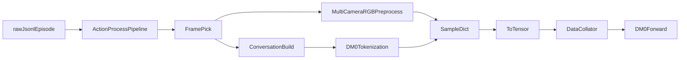
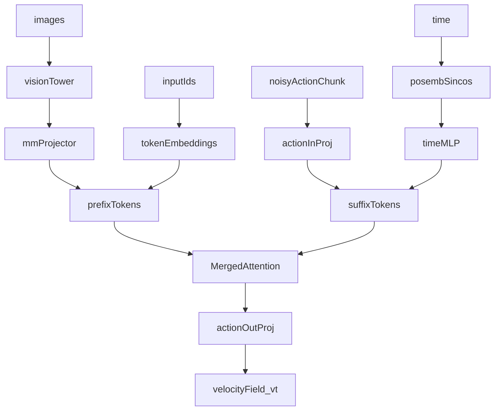
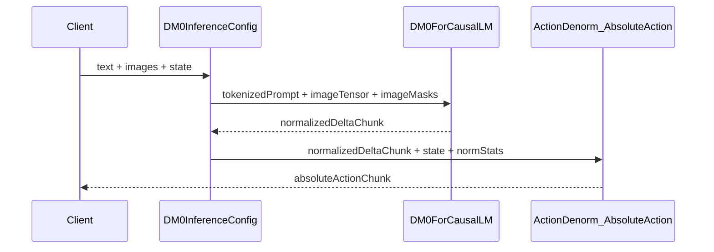
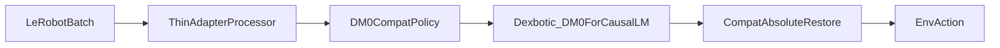
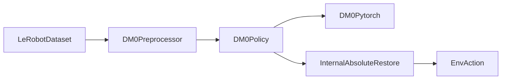
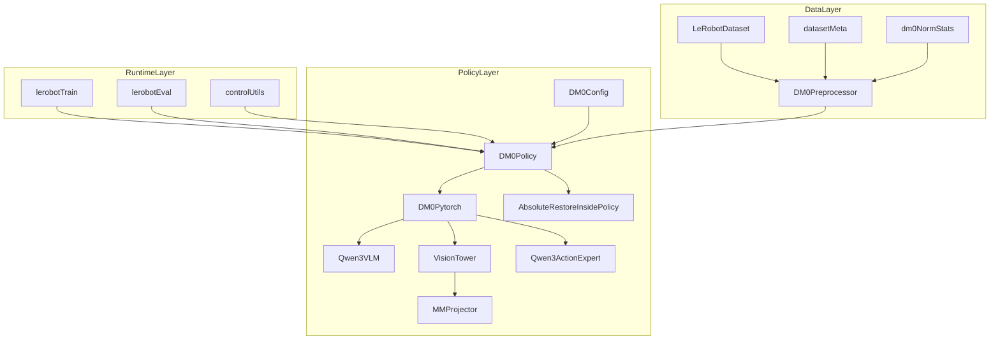
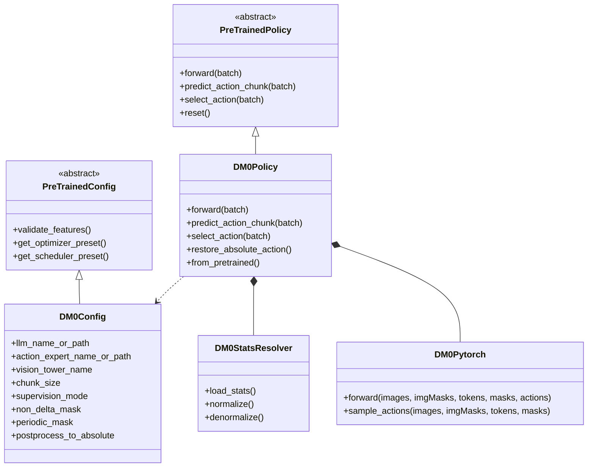
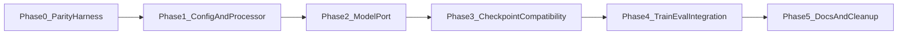

# DM0 从 Dexbotic 迁移到 LeRobot 作为 VLA Policy 的深度设计方案

> 版本: v1.0  
> 日期: 2026-04-13  
> 分析环境: `/mnt/r/Venv/lerobot-venv/`  
> 分析对象:
> - `/home/Luogang/SRC/Robot/dexbotic`
> - `/home/Luogang/SRC/Robot/lerobot`
>
> 核心结论:
> - 推荐主线采用 `lerobot` 原生 `in-tree policy` 迁移。
> - 推荐保留一个短期 `wrapper-first` 适配层，但只把它当作权重与动作输出对齐的 Phase 0 校验器，不当作长期架构。
> - 迁移成败不在于“能否把 DM0 模型类 import 进来”，而在于是否把 `DM0 的目标空间`、`DM0 的归一化统计量`、`DM0 的绝对动作恢复` 正确嵌入 `lerobot` 的 `policy + processor + dataset` 契约。
>
> 事实说明:
> - 本次对两个仓库内的本地源码与相关 Markdown 文档做了深度分析。
> - 两个仓库当前均未发现 `*.pdf` 文件，因此本文只能分析 Markdown 对 PDF 的引用线索，不能逐页核对论文 PDF 正文。
> - 在指定虚拟环境中已验证 `transformers` 能成功导入 `Qwen3ForCausalLM`，说明 `Qwen3` 主干依赖不是阻塞项；但由于当前分析环境不具备真实训练 GPU 条件，显存与吞吐仍需在训练机上验证。

## 目录

1. [执行摘要](#1-执行摘要)
2. [分析范围与证据基础](#2-分析范围与证据基础)
3. [Dexbotic 中 DM0 的真实实现边界](#3-dexbotic-中-dm0-的真实实现边界)
4. [LeRobot 中可承接 DM0 的抽象层](#4-lerobot-中可承接-dm0-的抽象层)
5. [两个框架之间真正的迁移断点](#5-两个框架之间真正的迁移断点)
6. [两条迁移路线对比](#6-两条迁移路线对比)
7. [推荐主方案：原生 in-tree DM0 policy](#7-推荐主方案原生-in-tree-dm0-policy)
8. [文件级实现蓝图](#8-文件级实现蓝图)
9. [分阶段实施路线](#9-分阶段实施路线)
10. [验证方案](#10-验证方案)
11. [风险与缓解](#11-风险与缓解)
12. [为什么这样设计](#12-为什么这样设计)
13. [结论](#13-结论)

---

## 1. 执行摘要

这次迁移如果只从“模型类”视角看，会很容易误判复杂度。`dexbotic` 里的 DM0 实际上不是一个孤立的 `nn.Module`，而是一套被强耦合到 `DexDataset + transform pipeline + HF Trainer + norm_stats + Flask inference` 的完整系统。`lerobot` 则不是这种一体化风格，它的核心组织方式是：

`dataset meta -> feature inference -> preprocessor/postprocessor -> PreTrainedPolicy -> train/eval/control loop`

因此，DM0 迁移的核心不是“把 `dm0_arch.py` 搬到 `lerobot`”，而是把下面三件事重建成 `lerobot` 的原生能力：

1. **目标空间重建**  
   DM0 训练目标不是普通的 `dataset.action`，而是“未来绝对目标块 -> 相对当前状态的 delta 块 -> 分位数归一化后”的动作空间。

2. **统计量语义重建**  
   DM0 的 `norm_stats.json` 不是普通数据集统计量，而是对上述“目标空间”计算出来的专用统计量。这个语义必须单独建模。

3. **推理闭环重建**  
   DM0 推理输出先是“归一化 delta 轨迹块”，之后才会通过 `ActionDenorm + AbsoluteAction` 恢复为可执行动作。`lerobot` 的 postprocessor 默认拿不到当前 `state`，所以这一步不能照抄 `dexbotic` 的外部推理链，而要内聚到 `DM0Policy.select_action()` 或其内部 helper 中。

本次分析最终推荐的路线是：

- **主路线**: 在 `lerobot/src/lerobot/policies/dm0/` 下原生实现 `DM0Config + DM0Policy + processor_dm0 + modules/*`。
- **过渡路线**: 同时做一个极薄的 `wrapper-first` 校验层，只用于比较 `dexbotic` 原始 DM0 与 `lerobot` 新 DM0 在同一输入上的 target 构造、归一化、采样输出是否一致。

一句话概括：

> **长期正确答案是“原生迁移”；最稳妥的工程路径是“原生迁移为主，wrapper 校验为辅”。**

---

## 2. 分析范围与证据基础

### 2.1 代码与文档范围

| 类别 | 仓库 | 重点对象 | 本文用途 |
|---|---|---|---|
| 核心模型 | `dexbotic` | `dexbotic/model/dm0/dm0_arch.py` | 还原 DM0 真正的前向、采样、Merged Attention 语义 |
| 数据与动作语义 | `dexbotic` | `dexbotic/exp/dm0_exp.py`、`dexbotic/data/dataset/transform/action.py`、`dexbotic/data/dataset/transform/output.py`、`dexbotic/data/dataset/dex_dataset.py` | 还原训练标签、统计量、推理后处理语义 |
| 训练胶水 | `dexbotic` | `dexbotic/exp/base_exp.py`、`dexbotic/exp/trainer.py`、`dexbotic/data/collator.py` | 说明 DM0 为何是“一体化系统” |
| tokenization | `dexbotic` | `dexbotic/tokenization/process.py` | 识别文本条件的真实复杂度 |
| policy 契约 | `lerobot` | `src/lerobot/policies/pretrained.py`、`src/lerobot/configs/policies.py` | 定义迁移后必须满足的最小接口 |
| factory / dataset / processor | `lerobot` | `src/lerobot/policies/factory.py`、`src/lerobot/datasets/factory.py`、`src/lerobot/datasets/utils.py`、`src/lerobot/processor/*` | 定义如何接入训练、评估、推理主链路 |
| 相近策略 | `lerobot` | `src/lerobot/policies/pi0/*`、`src/lerobot/policies/pi05/*` | 找到最适合借鉴的 VLA 骨架 |
| 主循环 | `lerobot` | `src/lerobot/scripts/lerobot_train.py`、`src/lerobot/scripts/lerobot_eval.py`、`src/lerobot/utils/control_utils.py` | 识别推理、评估、真机闭环对 policy 的真实要求 |
| 设计文档 | 两者 | `designlerobot.md`、`dm0_designanly.md`、`delta_action.md`、`aligdesign.md` 等 | 验证与扩展源码层结论 |

### 2.2 PDF 分析结论

本地两个仓库当前均未检出 `*.pdf` 文件。因此：

- 本文对“论文原文”的分析只能依赖仓库中的 Markdown 引用与源码实现对照。
- 若后续把 DM0 论文 PDF 加入仓库，需要补做“论文公式/图示/训练细节 vs 本地实现”的二次审计。

### 2.3 关键环境结论

在指定虚拟环境中已做过一个最小依赖核验：

- `transformers` 可以导入 `Qwen3ForCausalLM`
- 说明 `DM0` 所需的 `Qwen3` 主干在当前 Python 依赖层面是可承接的
- 但 GPU / CUDA / FlashAttention / 显存占用并未在真实训练节点完成验证

这意味着：

- **依赖不是主要风险**
- **语义与架构对齐才是主要风险**

---

## 3. Dexbotic 中 DM0 的真实实现边界

### 3.1 DM0 在 dexbotic 中不是单文件，而是四层系统

| 层次 | 关键文件 | 职责 | 对迁移的启示 |
|---|---|---|---|
| 模型层 | `dexbotic/model/dm0/dm0_arch.py` | Qwen3 VLM、Action Expert、Merged Attention、Flow Matching、Euler 采样 | 这是算法本体 |
| 工具层 | `dexbotic/model/dm0/dm0_utils.py` | attention mask、时间位置编码 | 这是可直接移植的数学/掩码工具 |
| 数据层 | `dexbotic/exp/dm0_exp.py`、`dexbotic/data/dataset/transform/action.py`、`dexbotic/data/dataset/dex_dataset.py` | 目标构造、delta 语义、统计量、RGB/文本装配 | 这是迁移最容易被低估的部分 |
| 训练/部署层 | `dexbotic/exp/base_exp.py`、`dexbotic/exp/trainer.py`、`dexbotic/data/collator.py`、`DM0InferenceConfig` | HF Trainer、checkpoint、norm_stats、Flask 服务 | 这些不能原样搬进 `lerobot`，必须重构成 `policy + processor + train/eval loop` |

### 3.2 DM0 训练目标到底是什么

DM0 在 `dexbotic` 中的动作处理链路如下：

```python
# 来源: dexbotic/exp/dm0_exp.py
Pipeline(
    [
        ToDict(),
        ToNumpy(),
        AddAction(predict_length=1),
        PadState(ndim=32, axis=-1),
        PadAction(ndim=32, axis=-1),
        AddTrajectory(trajectory_length=50, flatten=False, padding_mode="last"),
        DeltaAction(enable=True),
        ActionNorm(statistic_mapping=statistic_mapping, use_quantiles=True),
        LoadMultiModal(return_masks=True),
        ToList(),
    ]
)
```

这段代码说明，DM0 训练时的 `action` 不是“原始数据集记录的底层控制命令”，而是被改写过的监督目标。它的真实语义链是：

```text
当前状态 state[t]
-> 未来绝对目标 state[t+1]
-> 未来 50 步绝对目标块
-> 以当前状态为锚点的 delta 目标块
-> 分位数归一化后的训练标签
```

其中最关键的两步来自 `AddAction` 与 `DeltaAction`：

```python
# 来源: dexbotic/data/dataset/transform/action.py
action = state[self.predict_length :]
episode_data_dict["action"] = action
episode_data_dict["abs_action"] = action

if action.ndim == state.ndim:
    delta_action = action - state
elif action.ndim == state.ndim + 1:
    delta_action = action - state[..., None, :]

delta_action[..., non_delta_mask] = action[..., non_delta_mask]
episode_data_dict["action"] = delta_action
```

这意味着：

1. `AddAction(predict_length=1)` 默认把 `state[t+1]` 当作 `action[t]`
2. `AddTrajectory(trajectory_length=50)` 再把这个单步目标扩成未来 `50` 步块
3. `DeltaAction` 不是逐步差分，而是**整个未来块相对当前状态**的差
4. `non_delta_mask` 指定的维度（如 gripper）保留绝对目标，不做差分
5. `periodic_mask` 指定的维度（如欧拉角）会做周期 wrap 修正

这与普通 `lerobot` policy 常见的“直接监督 dataset.action chunk”有本质差异。

### 3.3 DM0 的 target 统计量不是普通 dataset stats

`dexbotic` 对 DM0 的归一化统计量是先构造完 target，再做统计。计算逻辑如下：

```python
# 来源: dexbotic/exp/dm0_exp.py
Pipeline(
    [
        ToDict(),
        ToNumpy(),
        AddAction(predict_length=1),
        PadState(ndim=32, axis=-1),
        PadAction(ndim=32, axis=-1),
        AddTrajectory(trajectory_length=50, flatten=False, padding_mode="last"),
        DeltaAction(enable=True),
        ToList(),
    ]
)

norm_keys = ["state", "action"]
stats[key].update(values.reshape(-1, values.shape[-1]))
```

这里有一个非常关键、也是迁移里最容易出错的点：

> `DM0` 的 `norm_stats.json` 是对“Pad 后、Trajectory 后、Delta 后”的目标空间做统计，而不是对 `LeRobotDataset.action` 原始字段做统计。

因此，**不能直接把 `dataset.meta.stats["action"]` 当作 DM0 的归一化统计量**。否则：

- 训练时看到的是一个统计分布
- 推理时恢复的是另一个统计分布
- 模型一开始就会在 target space 上错位

这是本文最终推荐单独设计 `dm0_norm_stats.json` 的根本原因。

### 3.4 DM0 的数据装配是真正的多模态 pipeline

`DexDataset` 的 `unsafe_getitem()` 说明了单个样本是如何从 `jsonl` 变成训练 batch 的：

```python
# 来源: dexbotic/data/dataset/dex_dataset.py
data = self.action_process_func(episode_data_list, meta_data=meta_data)
if isinstance(data, list):
    data = data[frame_index]
data.update({"meta_data": meta_data})

pixel_values = [
    image_process_func(data)
    for image_process_func, data in zip(self.image_process_func, rgb_data, strict=True)
]
return_dict["image"] = torch.stack(pixel_values, dim=0)

tokenized_dict = self.tokenization_func(conversations=conversations, has_image=True)
return_dict["input_ids"] = tokenized_dict["input_ids"]
return_dict["labels"] = tokenized_dict["labels"]
return_dict.update(self.key_extract_func(data, other_keys))
return_dict = ToTensor()(return_dict)
```

可以把它总结成：



这条链路的迁移含义是：

- `DexDataset` 风格的“边读边构造 target”在 `lerobot` 中要改写为 `processor` 风格
- 多视角图像与 `image_masks` 必须保留
- prompt 构造要保留，但不一定需要完整复制 `dexbotic` 的 `labels/loss_mask` 机制

### 3.5 当前 DM0 的文本 tokenization 比看起来更简单

`DM0Tokenization` 代码如下：

```python
# 来源: dexbotic/tokenization/process.py
system_prompt = f"{conv.system}{conv.sep}"
tokens = list(self.tokenizer.encode(system_prompt, add_special_tokens=False))

for msg in conversations:
    role_str = f"{role}: "
    role_tokens = list(self.tokenizer.encode(role_str, add_special_tokens=False))
    content_tokens = list(self.tokenizer.encode(content_str, add_special_tokens=False))

labels = np.where(np.asarray(loss_mask), input_ids, IGNORE_INDEX)
```

它会产出：

- `input_ids`
- `labels`
- `token_mask`
- `ar_mask`
- `loss_mask`

但从模型前向来看，DM0 当前真正用于动作学习的是 `input_ids` 与 `attention_mask`，并不是语言交叉熵损失。看 `DM0ForCausalLM.forward()`：

```python
# 来源: dexbotic/model/dm0/dm0_arch.py
prefix_hidden_states, prefix_padding_mask, prefix_attn_mask = (
    self.get_prefix_hidden_states(
        input_ids, attention_mask, images, image_masks
    )
)

suffix_hidden_states, suffix_padding_mask, suffix_attn_mask = (
    self.get_suffix_hidden_states(x_t, time)
)

(prefix_out, suffix_out), _ = self._merged_attention_forward(
    module_list=module_list,
    attention_mask=attn_mask,
    position_ids=positions,
    past_key_values=None,
    input_embeds_list=[prefix_hidden_states, suffix_hidden_states],
    use_cache=False,
)

v_t = self.model.action_out_proj(suffix_out_final)
action_loss = F.mse_loss(v_t, u_t, reduction="mean")
```

这说明一个很重要的迁移简化：

> 在 `lerobot` 版 DM0 的第一阶段实现里，文本侧只需要保证“条件提示词等价”，不必完整迁移 `dexbotic` 的 SFT label 体系。

换句话说，**DM0 当前的动作学习目标本质上是 Flow Matching MSE，不是语言建模损失**。

### 3.6 DM0 的模型骨架：Prefix 是图像+语言，Suffix 是噪声动作+时间

DM0 模型初始化的关键部分如下：

```python
# 来源: dexbotic/model/dm0/dm0_arch.py
self.action_expert = Qwen3ForCausalLM(action_model_config)
self.action_expert.model.embed_tokens = None

self.action_in_proj = nn.Linear(config.action_dim, action_hidden)
self.action_out_proj = nn.Linear(action_hidden, config.action_dim)
self.action_time_mlp_in = nn.Linear(2 * action_hidden, action_hidden)
self.action_time_mlp_out = nn.Linear(action_hidden, action_hidden)
```

训练前向的关键过程如下：

```python
# 来源: dexbotic/model/dm0/dm0_arch.py
noise = torch.normal(mean=torch.zeros_like(actions), std=torch.ones_like(actions))
time = torch.distributions.Beta(1.5, 1.0).sample((batch_size,)).to(actions.device) * 0.999 + 0.001

x_t = time_expanded * noise + (1 - time_expanded) * actions
u_t = noise - actions

prefix_hidden_states = self.get_prefix_hidden_states(input_ids, attention_mask, images, image_masks)
suffix_hidden_states = self.get_suffix_hidden_states(x_t, time)

(prefix_out, suffix_out), _ = self._merged_attention_forward(...)
v_t = self.model.action_out_proj(suffix_out_final)
action_loss = F.mse_loss(v_t, u_t, reduction="mean")
```

可以把它抽象成下图：



最重要的观察是：

> 在当前本地实现中，`state` 并不直接作为模型条件输入参与前向，它主要用于 target 构造与推理后的绝对动作恢复。

这意味着：

- 从**工程骨架**看，DM0 比 `PI0` 更像 `PI05`
- 从**动作语义**看，DM0 又比 `PI05` 多了一层 “anchor state -> absolute restore” 依赖

### 3.7 DM0 推理不是“模型直接输出可执行动作”

推理采样代码如下：

```python
# 来源: dexbotic/model/dm0/dm0_arch.py
_, kv_cache = self._merged_attention_forward(
    module_list=module_list,
    attention_mask=prefix_attn_mask_4d,
    position_ids=positions,
    past_key_values=DynamicCache(),
    input_embeds_list=[prefix_hidden_states, None],
    use_cache=True,
)

while time >= -dt / 2:
    noise, time = self._denoise_step(
        x_t=noise,
        time=time,
        dt=dt,
        batch_size=batch_size,
        prefix_padding_mask=prefix_padding_mask,
        prefix_attn_mask=prefix_attn_mask,
        module_list=module_list,
        kv_cache=kv_cache,
    )

return noise
```

这段代码返回的其实是**归一化动作空间里的采样结果**，真正变成环境可执行动作还要走 `DM0InferenceConfig` 的后处理：

```python
# 来源: dexbotic/exp/dm0_exp.py
self.output_transform = Pipeline(
    [
        ToNumpy(),
        ActionDenorm(statistic_mapping=self.norm_stats, strict=False, use_quantiles=True),
        AbsoluteAction(),
    ]
)
```

所以 DM0 推理闭环其实是：



这对 `lerobot` 迁移有直接影响：

- 不能假设 `policy.select_action()` 输出的已经是环境动作
- 必须明确“谁来做绝对动作恢复”

### 3.8 为什么 DM0 不能直接照搬进 lerobot

`dexbotic` 的训练器与 checkpoint 机制说明了它是高度一体化的：

```python
# 来源: dexbotic/data/collator.py
mapping_keys = {
    'image': 'images',
    'action': 'actions',
    'state': 'states',
    'image_masks': 'image_masks',
}
```

```python
# 来源: dexbotic/exp/trainer.py
class DexboticTrainer(Trainer):
    ...
    self._copy_norm_stats_to_checkpoint(output_dir)
```

这意味着本地 DM0 假设：

- batch key 命名方式是 `dexbotic` 风格
- checkpoint 除了模型权重，还天然捆绑了 `norm_stats.json`
- 推理侧直接走 `Flask` 服务，不经 `lerobot_eval.py` / `control_utils.py`

这恰恰是 `lerobot` 没有的假设。因此，迁移的本质不是 copy 文件，而是**把耦合系统拆成 `lerobot` 可接受的模块边界**。

---

## 4. LeRobot 中可承接 DM0 的抽象层

### 4.1 LeRobot 的 policy 契约是硬边界

`PreTrainedPolicy` 定义了所有 policy 都必须实现的核心接口：

```python
# 来源: lerobot/src/lerobot/policies/pretrained.py
class PreTrainedPolicy(nn.Module, HubMixin, abc.ABC):
    @abc.abstractmethod
    def get_optim_params(self) -> dict:
        ...

    @abc.abstractmethod
    def reset(self):
        ...

    @abc.abstractmethod
    def forward(self, batch: dict[str, Tensor]) -> tuple[Tensor, dict | None]:
        ...

    @abc.abstractmethod
    def predict_action_chunk(self, batch: dict[str, Tensor], **kwargs) -> Tensor:
        ...

    @abc.abstractmethod
    def select_action(self, batch: dict[str, Tensor], **kwargs) -> Tensor:
        ...
```

迁移后的 DM0 必须满足这五件事：

1. 能被 optimizer 正确拿到参数
2. 能在环境 reset 时清空 action queue / cache
3. `forward()` 能产出训练 loss
4. `predict_action_chunk()` 能批量输出 chunk
5. `select_action()` 能给评估和真机 loop 返回一步动作

### 4.2 LeRobot 不是直接读 dataset，而是先推断 feature 契约

`make_policy()` 的关键逻辑如下：

```python
# 来源: lerobot/src/lerobot/policies/factory.py
features = dataset_to_policy_features(ds_meta.features)
cfg.output_features = {key: ft for key, ft in features.items() if ft.type is FeatureType.ACTION}
if not cfg.input_features:
    cfg.input_features = {key: ft for key, ft in features.items() if key not in cfg.output_features}

policy_cls = get_policy_class(cfg.type)
policy = policy_cls.from_pretrained(**kwargs) if cfg.pretrained_path else policy_cls(**kwargs)
```

而 `dataset_to_policy_features()` 会把数据集特征转换为 `PolicyFeature`：

```python
# 来源: lerobot/src/lerobot/datasets/utils.py
if ft["dtype"] in ["image", "video"]:
    type = FeatureType.VISUAL
elif key.startswith(OBS_STR):
    type = FeatureType.STATE
elif key.startswith(ACTION):
    type = FeatureType.ACTION
```

因此，DM0 迁移之后要想自然地接到 `lerobot` 主链路，最稳的做法是：

- 让相机输入继续走 `observation.images.*`
- 让当前状态继续走 `observation.state`
- 让环境动作继续走 `action`
- 把 `DM0` 专有语义放进 `processor` 与 `policy` 内部，而不是破坏 `LeRobotDataset` 的标准特征命名

### 4.3 LeRobot 的 processor 工厂是第二个硬边界

`factory.make_pre_post_processors()` 的关键逻辑如下：

```python
# 来源: lerobot/src/lerobot/policies/factory.py
elif isinstance(policy_cfg, PI05Config):
    from lerobot.policies.pi05.processor_pi05 import make_pi05_pre_post_processors
    processors = make_pi05_pre_post_processors(
        config=policy_cfg,
        dataset_stats=kwargs.get("dataset_stats"),
    )
else:
    processors = _make_processors_from_policy_config(
        config=policy_cfg,
        dataset_stats=kwargs.get("dataset_stats"),
    )
```

这说明：

- 原生 in-tree 策略通常会在 `factory.py` 中加显式分支
- 也可以依赖命名约定走动态导入
- 但无论哪种方式，本质都必须给出 `make_dm0_pre_post_processors()`

### 4.4 训练主循环对 policy 的期望很清晰

`lerobot_train.py` 里 policy 的使用方式如下：

```python
# 来源: lerobot/src/lerobot/scripts/lerobot_train.py
preprocessor, postprocessor = make_pre_post_processors(...)
optimizer, lr_scheduler = make_optimizer_and_scheduler(cfg, policy)

loss, output_dict = policy.forward(batch)
accelerator.backward(loss)
optimizer.step()

if has_method(accelerator.unwrap_model(policy, keep_fp32_wrapper=True), "update"):
    accelerator.unwrap_model(policy, keep_fp32_wrapper=True).update()
```

这意味着 DM0 迁移后如果想完整享受 `lerobot` 的训练能力，就必须自然兼容：

- `forward(batch)` 的 loss 语义
- optimizer / scheduler 预设
- 可选的 `update()` 钩子
- processor 加载与保存

### 4.5 评估与真机闭环对 `select_action()` 的要求更苛刻

`lerobot_eval.py` 的 rollout 主链如下：

```python
# 来源: lerobot/src/lerobot/scripts/lerobot_eval.py
observation = preprocessor(observation)
with torch.inference_mode():
    action = policy.select_action(observation)
action = postprocessor(action)
observation, reward, terminated, truncated, info = env.step(action_numpy)
```

`control_utils.predict_action()` 的主链也是一样：

```python
# 来源: lerobot/src/lerobot/utils/control_utils.py
observation = preprocessor(observation)
action = policy.select_action(observation)
action = postprocessor(action)
return action
```

这个接口形状有一个对 DM0 极其重要的后果：

> `postprocessor` 只拿得到 `action`，拿不到当前 `observation.state`。

因此，DM0 若需要“用当前 state 把 delta 输出恢复为 absolute action”，就有两个选择：

1. 改 `lerobot` 全局 processor 契约  
2. 在 `DM0Policy.select_action()` 内部完成恢复

本文明确推荐第二种，因为它对 `lerobot` 侵入最小。

### 4.6 DM0 最接近哪一个现有 policy

| 维度 | `PI0` | `PI05` | `DM0` 当前本地实现 | 结论 |
|---|---|---|---|---|
| 动作块长度 | `50` | `50` | `50` | 三者一致 |
| 生成范式 | Flow Matching | Flow Matching | Flow Matching | 三者一致 |
| 归一化 | `MEAN_STD` | `QUANTILES` | `QUANTILES` | DM0 更接近 `PI05` |
| 图像处理 | PaliGemma 内置视觉塔 | PaliGemma + OpenPI 风格增强 | 独立 vision tower + projector | `PI05` 工程骨架更接近 |
| 独立 state 输入 | 有 | 无 | 当前前向里基本无 | DM0 更接近 `PI05` |
| 推理动作队列 | 有 | 有 | 需自行加到 `lerobot` 版 | 可直接借鉴 `PI05` |
| EMA / OpenPI 对齐工程 | 一般 | 非常成熟 | 本地无 `lerobot` 风格实现 | `PI05` 最值得借鉴 |

`PI05Config` 的一些字段与 DM0 高度同向：

```python
# 来源: lerobot/src/lerobot/policies/pi05/configuration_pi05.py
chunk_size: int = 50
n_action_steps: int = 50
num_inference_steps: int = 10

normalization_mapping = {
    "VISUAL": NormalizationMode.IDENTITY,
    "STATE": NormalizationMode.QUANTILES,
    "ACTION": NormalizationMode.QUANTILES,
}

@property
def action_delta_indices(self) -> list:
    return list(range(self.chunk_size))
```

因此结论是：

- **工程模板**首选 `PI05`
- **状态相关接口经验**可以参考 `PI0`
- 但 `DM0` 仍有自己独立的 `Qwen3 + 独立视觉塔 + Merged Attention + absolute restore` 特性，不能直接复制 `PI05`

---

## 5. 两个框架之间真正的迁移断点

### 5.1 最容易误判的三个事实

#### 事实一：当前本地 DM0 的 `state` 主要是几何锚点，不是主模型输入

从 `dm0_arch.py` 的 `forward()` 和 `inference_action()` 可见，模型主路径的 prefix 由 `images + language` 组成，suffix 由 `noisy actions + time` 组成；`state` 在本地代码里主要用于：

- 构造 delta 目标
- 推理后做绝对动作恢复

这和很多人直觉里“VLA 一定会显式吃 state”并不一样。

#### 事实二：DM0 的统计量不是 `LeRobotDataset.action` 的统计量

DM0 的统计量是在**目标空间**上计算出来的，而不是原始动作空间。这是迁移里第一大语义陷阱。

#### 事实三：`lerobot` 的 postprocessor 默认拿不到当前 state

这会直接迫使我们把 `AbsoluteAction` 类逻辑从“外部推理后处理”挪到 `policy.select_action()` 内部。

### 5.2 迁移断点矩阵

| 断点 | `dexbotic` 的假设 | `lerobot` 的假设 | 必须怎么改 |
|---|---|---|---|
| 训练 target | target 是 transform pipeline 动态构造的 | target 通常直接来自 dataset batch | 通过 `processor_dm0.py` 重建 target 语义 |
| 统计量 | `norm_stats.json` 附着在 DM0 目标空间上 | `dataset.meta.stats` 通常附着在原始 feature 上 | 设计 `dm0_norm_stats.json` sidecar |
| 状态用途 | state 用于 delta 构造和绝对恢复 | postprocessor 默认看不到 state | 在 policy 内部做绝对恢复 |
| 模型骨架 | Qwen3 + 独立 vision tower + projector | 现有 VLA 多为 PaliGemma/OpenPI 路线 | 单独实现 `modeling_dm0.py` |
| 权重加载 | `dexbotic` checkpoint 命名与 `lerobot` 不同 | `from_pretrained()` 假设 `lerobot` 存档格式 | 实现 key remap 与 source format 兼容层 |
| 数据源 | `DexDataset` 读 jsonl + registry | `LeRobotDataset` 读 Parquet / 视频 / meta | 用标准 `LeRobotDataset`，把 dex 语义放入 processor |
| 推理入口 | Flask 服务自己拼前后处理 | `select_action()` 挂到 eval/control loop | 重写为 `lerobot` 原生闭环 |
| 多视角 | 明确 `image_masks` 与空相机填充 | 通过缺失图像 key / empty camera 支持 | 在 `DM0Policy._preprocess_images()` 中保留 mask 语义 |

### 5.3 一个不该采用的思路

不建议直接把下面这套整体搬进 `lerobot`：

- `DM0Exp`
- `DexDataset`
- `DexboticTrainer`
- `DM0InferenceConfig`

因为这样做的结果不是“DM0 迁到了 `lerobot`”，而是“在 `lerobot` 仓库里嵌入了一套 `dexbotic` 子系统”。这会带来：

- 两套训练入口
- 两套统计量生命周期
- 两套推理闭环
- 两套 processor 语义
- 长期无法享受 `lerobot` 的 eval/control/Hub/PEFT 主链

---

## 6. 两条迁移路线对比

### 6.1 路线 A：`wrapper-first`

思路是：

- 尽量复用 `dexbotic` 的 `DM0ForCausalLM`
- 在 `lerobot` 外层包一层 `PreTrainedPolicy`
- 用最薄的 processor 把 `lerobot` batch 转成 `dexbotic` 所需输入

它的架构大致如下：



优点：

- 初期最容易跑通
- 最容易与现有 `dexbotic` checkpoint 做 parity check
- 能尽快验证 `Qwen3 + merged attention + Euler sampling` 是否在 `lerobot` 环境里可工作

缺点：

- 长期保留 `dexbotic` 的内部假设
- 统计量和 target 语义仍然偏“外来系统”
- 很难自然对齐 `lerobot` 的 dataset / processor / eval / Hub 约定
- 后续维护成本高，代码债大

适合用途：

- **只适合作为 Phase 0 校验器**

### 6.2 路线 B：`native in-tree`

思路是：

- 在 `lerobot/src/lerobot/policies/dm0/` 下按原生策略方式重建 DM0
- 用 `processor_dm0.py` 重建目标空间与 prompt 构造
- 用 `DM0Policy` 自己处理绝对动作恢复与 action queue

它的架构如下：



优点：

- 真正接入 `lerobot` 主线
- 训练、评估、真机部署闭环统一
- 更容易维护、测试、发布到 Hub
- 更利于未来把 DM0 做成稳定 policy，而不是一次性脚本

缺点：

- 初期工作量更大
- 需要认真处理 checkpoint key remap
- 需要认真处理 `dm0_norm_stats` 生命周期

适合用途：

- **主线长期方案**

### 6.3 决策矩阵

| 维度 | `wrapper-first` | `native in-tree` | 更优者 |
|---|---:|---:|---|
| 初期跑通速度 | 5 | 3 | A |
| 与 `lerobot` 训练主链兼容性 | 2 | 5 | B |
| 与 `lerobot` 评估/真机主链兼容性 | 2 | 5 | B |
| 语义清晰度 | 2 | 5 | B |
| 长期维护成本 | 1 | 5 | B |
| 测试与 CI 友好度 | 2 | 5 | B |
| checkpoint 长期演进能力 | 3 | 5 | B |
| 总分 | 17 | 33 | B |

### 6.4 推荐决策

本文的明确推荐是：

1. **主方案使用 `native in-tree`**
2. **把 `wrapper-first` 仅作为 Phase 0 校验层**

也就是说，最合理的路径不是二选一，而是：

> **架构上选 B，工程推进上先短暂借 A 做对齐校验。**

---

## 7. 推荐主方案：原生 in-tree DM0 policy

### 7.1 总体架构



### 7.2 设计原则

1. **不破坏 `LeRobotDataset` 标准命名**  
   图像仍是 `observation.images.*`，状态仍是 `observation.state`，环境动作仍是 `action`。

2. **把 DM0 语义放进 `processor + policy`，不放进全局框架魔改**  
   目标构造、统计量、绝对动作恢复都尽量局部化。

3. **训练语义和推理语义分开设计，但共享同一份 `dm0_norm_stats`**  
   训练用来标准化 target，推理用来反标准化生成结果。

4. **与 `dexbotic` checkpoint 兼容，但不把 `dexbotic` 的运行时整体搬进来**  
   兼容的是“算法与权重”，不是“整套运行时”。

### 7.3 数据契约设计

建议在 `DM0Config` 中显式引入监督语义模式：

| 字段 | 含义 | 默认建议 | 设计理由 |
|---|---|---|---|
| `supervision_mode` | 监督信号来源 | `state_as_action` | 与 `dexbotic` 当前 DM0 完全一致 |
| `non_delta_mask` | 不做 delta 的维度 | 例如 `[6]` | gripper 等维度通常保留绝对值 |
| `periodic_mask` | 周期维度 | 例如 `[3, 4, 5]` | 欧拉角需要 wrap |
| `periodic_range` | 周期范围 | `2*pi` | 与本地 DM0 一致 |
| `postprocess_to_absolute` | 推理时是否恢复绝对动作 | `true` | 与当前 `dexbotic` 行为一致 |

其中 `supervision_mode` 推荐支持两种：

#### 模式 A：`state_as_action`

这是最接近 `dexbotic` 当前实现的模式：

```text
future_absolute_target = future_state[1:]
delta_target = future_absolute_target - current_state
```

它要求：

- preprocessor 能拿到当前时刻和未来时刻的 `observation.state`
- `DM0Config.observation_delta_indices` 动态返回 `range(chunk_size + 1)`
- `DM0Config.action_delta_indices` 返回 `None`

#### 模式 B：`dataset_action`

这是更贴近标准 `lerobot` 数据语义的模式：

```text
future_absolute_target = future_action_chunk
delta_target = future_absolute_target - current_state
```

它要求：

- 数据集里的 `action` 与 `state` 在几何语义上可对齐
- `DM0Config.action_delta_indices` 动态返回 `range(chunk_size)`
- `DM0Config.observation_delta_indices` 返回 `None`

我的建议是：

- **主默认值使用 `state_as_action`**，保证 first implementation 最大限度贴近本地 DM0
- **保留 `dataset_action` 作为扩展模式**，用于未来原生 `lerobot` 数据集

### 7.4 目标构造必须进入 `processor_dm0.py`

建议新增一个核心步骤 `DM0BuildTrajectoryTargetStep`，其伪代码如下：

```python
if supervision_mode == "state_as_action":
    future_abs = future_state[:, 1:, :]
else:
    future_abs = future_action[:, :, :]

future_abs = pad_to_dim(future_abs, max_action_dim)
anchor_state = pad_to_dim(current_state, max_state_dim)

delta = future_abs - anchor_state[:, None, :]
delta[..., non_delta_mask] = future_abs[..., non_delta_mask]
delta[..., periodic_mask] = wrap_periodic(delta[..., periodic_mask], periodic_range)
```

这一步必须发生在训练前处理阶段，而不是模型内部，原因有三：

1. 它本质上属于数据语义而不是网络计算图
2. 它决定统计量空间
3. 它应该在 parity test 中能被单独验证

### 7.5 `dm0_norm_stats.json` 必须独立存在

这是本方案最关键的设计之一。

建议新增 `DM0StatsResolver` 或等价 helper，维护一份单独的 DM0 统计量文件，例如：

```json
{
  "state": {
    "min": [...],
    "max": [...],
    "mean": [...],
    "std": [...]
  },
  "action": {
    "min": [...],
    "max": [...],
    "mean": [...],
    "std": [...]
  }
}
```

推荐来源优先级：

1. checkpoint 目录下的 `dm0_norm_stats.json`
2. dataset 根目录或 `meta/` 下的 `dm0_norm_stats.json`
3. 显式 `DM0Config.dm0_stats_path`

为什么不能只依赖 `dataset.meta.stats`：

- `dataset.meta.stats["action"]` 统计的是原始数据特征
- DM0 需要的是“目标块 + delta + pad 后”的统计
- 两者不是同一个随机变量

### 7.6 `select_action()` 内部必须做绝对动作恢复

由于 `lerobot` 的 postprocessor 默认只拿到 `action`，拿不到当前 `state`，所以 `DM0` 的绝对恢复必须内聚到 policy 内部。

建议 `DM0Policy.select_action()` 的逻辑是：

```python
normalized_delta_chunk = self.predict_action_chunk(batch)
delta_chunk = self.denorm_actions(normalized_delta_chunk)
absolute_chunk = self.restore_absolute_action(delta_chunk, batch["dm0.anchor_state"])
env_chunk = absolute_chunk[:, :, :original_action_dim]
queue.extend(env_chunk[:, :n_action_steps])
return queue.popleft()
```

这件事不能放进 postprocessor 的原因不是“喜好”，而是 `lerobot_eval.py` 和 `control_utils.py` 的接口现实。

### 7.7 `DM0Policy` 的内部职责

建议 `DM0Policy` 分成两层：

#### 层 1：`DM0Pytorch`

负责：

- Qwen3 VLM 与 Qwen3 Action Expert 组装
- 视觉塔与 projector
- merged attention
- flow matching 前向
- Euler 采样

#### 层 2：`DM0Policy`

负责：

- `PreTrainedPolicy` 契约实现
- 训练 batch 解包
- action queue 缓存
- checkpoint 兼容加载
- 绝对动作恢复
- 与 `lerobot` train/eval/control loop 对接

推荐类图如下：



### 7.8 `processor_dm0.py` 的建议结构

建议 preprocessor 的步骤顺序如下：

```python
input_steps = [
    RenameObservationsProcessorStep(rename_map={}),
    AddBatchDimensionProcessorStep(),
    DM0CaptureAnchorStateStep(),
    DM0BuildTrajectoryTargetStep(...),     # 训练时有 action / future_state 才执行
    DM0NormalizeStep(dm0_stats),
    DM0ConversationBuilderStep(chat_template="step"),
    TokenizerProcessorStep(
        tokenizer_name=config.tokenizer_name_or_path,
        max_length=config.tokenizer_max_length,
        padding="max_length",
        padding_side="right",
    ),
    DeviceProcessorStep(device=config.device),
]
```

建议 postprocessor 尽量保持极薄：

```python
output_steps = [
    DeviceProcessorStep(device="cpu"),
]
```

这里有一个看起来“反直觉”但实际更正确的选择：

> `AbsoluteAction` 不再放到 postprocessor，而是放到 `DM0Policy.select_action()` 内部。

原因前面已经论证过：postprocessor 没有当前 state。

### 7.9 `DM0Config` 的建议字段分组

建议 `configuration_dm0.py` 至少包含下面这些字段：

#### 模型字段

- `llm_name_or_path`
- `action_expert_name_or_path`
- `vision_tower_name`
- `mm_projector_type`
- `tokenizer_name_or_path`
- `dtype`

#### 动作与采样字段

- `chunk_size`
- `n_action_steps`
- `max_action_dim`
- `max_state_dim`
- `num_inference_steps`
- `time_sampling_beta_alpha`
- `time_sampling_beta_beta`
- `time_sampling_scale`
- `time_sampling_offset`
- `min_period`
- `max_period`

#### 语义字段

- `supervision_mode`
- `non_delta_mask`
- `periodic_mask`
- `periodic_range`
- `postprocess_to_absolute`
- `tokenizer_chat_template`
- `dm0_stats_path`

#### 训练字段

- `gradient_checkpointing`
- `freeze_vision_encoder`
- `train_expert_only`
- `optimizer_lr`
- `optimizer_betas`
- `optimizer_eps`
- `optimizer_weight_decay`
- `optimizer_grad_clip_norm`
- `scheduler_warmup_steps`
- `scheduler_decay_steps`
- `scheduler_decay_lr`

#### feature 契约字段

- `validate_features()`  
  填充缺失的 `observation.state`、`action`、空相机特征

- `observation_delta_indices` / `action_delta_indices`  
  根据 `supervision_mode` 动态切换

### 7.10 `modeling_dm0.py` 的建议实现重心

建议保留本地 DM0 的三个算法核心：

1. `Merged Attention`
2. `Flow Matching`
3. `Euler Sampling + Prefix KV Cache`

推荐直接迁移或轻度改写的工具函数：

- `make_attn_mask_2d`
- `make_attn_mask_4d`
- `make_suffix_attn_mask_2d`
- `posemb_sincos`

推荐保留的模型结构：

- 独立 `vision tower`
- 独立 `mm projector`
- 独立 `action expert`
- `action_in_proj` / `action_out_proj`
- `time_mlp`

推荐保留的推理结构：

- prefix 先算一次并缓存 KV
- suffix 走 Euler 迭代

### 7.11 checkpoint 兼容设计

建议 `DM0Policy.from_pretrained()` 支持两种来源：

| 来源 | 说明 | 处理方式 |
|---|---|---|
| `lerobot` 原生 | `config.json + model.safetensors + processor json` | 走标准 `from_pretrained` |
| `dexbotic` 原生 | `config.json + model.safetensors/bins + norm_stats.json` | 进入兼容分支，做 key remap + 统计量迁移 |

建议增加字段：

- `pretrained_source_format: "lerobot" | "dexbotic" | "auto"`

建议兼容层做三件事：

1. 识别 checkpoint 来源
2. 重映射 state_dict key
3. 把 `norm_stats.json` 转存为 `dm0_norm_stats.json`

### 7.12 为什么推荐显式修改 `factory.py`

理论上，`dm0` 也可以完全依赖 `PreTrainedConfig.register_subclass("dm0")` 与动态导入命名约定。但我仍然建议在 `factory.py` 中加显式分支，原因有三：

1. 与仓库现有主流策略保持一致
2. 搜索和维护更直观
3. 便于后续给 DM0 传 `dataset_meta`、`dm0_stats` 之类的额外参数

---

## 8. 文件级实现蓝图

### 8.1 必需新增文件

| 文件 | 主要内容 | 作用 |
|---|---|---|
| `lerobot/src/lerobot/policies/dm0/__init__.py` | 导出 `DM0Config` | 统一导入入口 |
| `lerobot/src/lerobot/policies/dm0/configuration_dm0.py` | `DM0Config`、监督模式与统计量配置 | 定义契约 |
| `lerobot/src/lerobot/policies/dm0/modeling_dm0.py` | `DM0Pytorch`、`DM0Policy`、checkpoint 兼容加载 | 承载算法本体 |
| `lerobot/src/lerobot/policies/dm0/processor_dm0.py` | target 构造、DM0 stats、prompt 构造、tokenizer 装配 | 承载数据语义 |
| `lerobot/src/lerobot/policies/dm0/modules/attention.py` | merged attention 与 mask 工具 | 降低 `modeling_dm0.py` 复杂度 |
| `lerobot/src/lerobot/policies/dm0/modules/utils.py` | `posemb_sincos`、periodic wrap、padding、helper | 算法工具 |
| `lerobot/src/lerobot/policies/dm0/modules/vision.py` | vision tower / projector build helper | 与本地 DM0 的独立视觉塔设计对齐 |
| `lerobot/tests/policies/dm0/test_processor_dm0.py` | target 构造与 stats 单测 | 防止语义漂移 |
| `lerobot/tests/policies/dm0/test_modeling_dm0.py` | 前向/采样/shape 单测 | 防止模型接口回归 |
| `lerobot/tests/policies/dm0/test_checkpoint_dm0.py` | `dexbotic` checkpoint 兼容测试 | 防止权重映射失效 |
| `lerobot/docs/source/policy_dm0_README.md` | 使用方式、训练方式、已知限制 | 文档化 |

### 8.2 建议修改文件

| 文件 | 修改点 | 原因 |
|---|---|---|
| `lerobot/src/lerobot/policies/factory.py` | 加 `DM0Config` / `DM0Policy` / `make_dm0_pre_post_processors` 分支 | 原生接入 |
| `lerobot/src/lerobot/policies/__init__.py` | 可选导出 `DM0Config` | 提高 discoverability |
| `lerobot/src/lerobot/scripts/lerobot_train.py` | 通常无需接口级修改 | 设计目标就是不改主循环 |

### 8.3 可选新增文件

| 文件 | 用途 | 是否主线必须 |
|---|---|---|
| `lerobot/bt/dm0/compute_dm0_norm_stats.py` | 生成 `dm0_norm_stats.json` | 建议有 |
| `lerobot/bt/dm0/parity_check_dm0.py` | `dexbotic` vs `lerobot` 单样本输出对齐 | 强烈建议 |
| `lerobot/bt/dm0/train_dm0_local.sh` | 参考 `bt/pi05/train.sh` 的训练脚本 | 建议有 |
| `lerobot/src/lerobot/policies/dm0_compat/*` | 临时 wrapper-first 适配层 | 仅 Phase 0 可选 |

### 8.4 推荐的最小可交付类与函数

| 文件 | 建议符号 |
|---|---|
| `configuration_dm0.py` | `DM0Config` |
| `processor_dm0.py` | `DM0CaptureAnchorStateStep`、`DM0BuildTrajectoryTargetStep`、`DM0NormalizeStep`、`DM0ConversationBuilderStep`、`make_dm0_pre_post_processors` |
| `modeling_dm0.py` | `DM0Pytorch`、`DM0Policy`、`_fix_dexbotic_state_dict_keys` |
| `modules/attention.py` | `make_attn_mask_2d`、`make_attn_mask_4d`、`make_suffix_attn_mask_2d` |
| `modules/utils.py` | `posemb_sincos`、`wrap_periodic_dims`、`pad_vector_to_dim` |
| `modules/vision.py` | `build_vision_tower`、`build_mm_projector` |

---

## 9. 分阶段实施路线

### 9.1 路线图



### 9.2 每阶段目标

#### Phase 0：Parity Harness

目标：

- 用临时 wrapper 或独立脚本比较同一输入上的：
  - target 构造结果
  - `dm0_norm_stats`
  - 采样前后的 chunk 输出

成功标准：

- `processor` 侧 target 与本地 `dexbotic` 对齐
- 归一化 / 反归一化结果对齐
- 单 batch 推理输出误差在可接受范围内

#### Phase 1：Config + Processor

目标：

- 先在 `lerobot` 中把数据语义打通
- 完成 `DM0Config` 与 `processor_dm0.py`

成功标准：

- `make_policy()` 可成功实例化 `dm0`
- preprocessor 可把标准 `LeRobotDataset` batch 变成 DM0 所需 batch

#### Phase 2：Model Port

目标：

- 完成 `DM0Pytorch` 与 `DM0Policy`
- 跑通 `forward()` 与 `predict_action_chunk()`

成功标准：

- 训练/推理 shape 正确
- Euler 采样可运行
- action queue 逻辑正确

#### Phase 3：Checkpoint Compatibility

目标：

- 支持从 `dexbotic` checkpoint 加载
- 支持把 stats 一并迁移进 `lerobot`

成功标准：

- `from_pretrained()` 能加载 `dexbotic` 权重
- 单 batch 推理与本地输出接近

#### Phase 4：Train / Eval Integration

目标：

- 用 `lerobot_train.py` 跑 smoke training
- 用 `lerobot_eval.py` 或 `control_utils.predict_action()` 跑通闭环

成功标准：

- loss 正常下降
- eval loop 无接口异常
- absolute restore 与 env action 维度一致

#### Phase 5：Docs / Cleanup

目标：

- 补齐 README、测试、脚本
- 移除仅用于 Phase 0 的临时兼容胶水

---

## 10. 验证方案

### 10.1 单元测试

| 测试项 | 目的 | 通过标准 |
|---|---|---|
| `DM0BuildTrajectoryTargetStep` | 验证 `state_as_action` 与 `dataset_action` 两种模式 | 与手工构造结果一致 |
| `Delta + periodic wrap` | 验证 gripper 与欧拉角语义 | 与 `dexbotic` 一致 |
| `DM0NormalizeStep` | 验证 stats 使用的是 DM0 target space | normalize / denormalize 可逆 |
| `DM0ConversationBuilderStep` | 验证 prompt 形状与 tokenizer 输入 | token 长度与 mask 合法 |
| `DM0Policy.select_action` | 验证 action queue 与 absolute restore | 返回形状正确，无 NaN |

### 10.2 对齐测试

建议新增一个 parity 脚本，对同一批输入同时调用：

- `dexbotic` 原始 DM0
- `lerobot` 新 DM0

对比以下中间量：

1. 构造后的 `delta target`
2. `dm0_norm_stats` 的 `min/max/mean/std`
3. 归一化后的 `action chunk`
4. `predict_action_chunk()` 的归一化输出
5. 恢复 absolute 后的最终动作

优先级从高到低依次是：

1. target 对齐
2. stats 对齐
3. normalized action 对齐
4. final action 对齐

### 10.3 训练 smoke test

建议先做非常小的 smoke training：

- 数据量：1 到 8 个 episode
- step 数：10 到 50
- 目标：只验证
  - 前向不报错
  - backward 不报错
  - loss 为有限值
  - checkpoint 能保存并回载

### 10.4 评估闭环测试

至少需要验证三条链路：

1. `lerobot_train.py` 训练链
2. `lerobot_eval.py` rollout 链
3. `control_utils.predict_action()` 真机/控制推理链

重点检查：

- `select_action()` 输出是否已经是环境动作空间
- postprocessor 是否保持轻薄且无重复反归一化
- `n_action_steps` 的 action queue 是否与环境 step 频率一致

### 10.5 成功判据

建议把成功判据定为四级：

| 等级 | 判据 |
|---|---|
| L1 | 代码结构接入完成，能实例化、能前向、能采样 |
| L2 | target / stats / normalized output 与 `dexbotic` 对齐 |
| L3 | 可通过 `lerobot_train.py` 稳定训练并保存 checkpoint |
| L4 | 可通过 `lerobot_eval.py` 或真机控制链跑完整闭环 |

---

## 11. 风险与缓解

| 风险 | 具体表现 | 缓解方案 |
|---|---|---|
| `Qwen3` 依赖版本差异 | 权重能下但模型类或 config 不兼容 | 在 `from_pretrained()` 前先做最小导入校验；把 `transformers` 版本写入文档 |
| 目标空间统计量错用 | loss 不收敛、推理动作漂移 | 单独维护 `dm0_norm_stats.json` |
| `state_as_action` 与原数据语义不匹配 | target 无法解释或几何含义错误 | 显式引入 `supervision_mode`，不同数据集分别配置 |
| 绝对动作恢复放错位置 | `eval` 与真机 loop 输出错误动作 | 把恢复逻辑内聚到 `DM0Policy.select_action()` |
| checkpoint key 不一致 | 无法加载 `dexbotic` 权重 | 设计 `pretrained_source_format` 与 remap 层 |
| 多相机数量不一致 | 图像 shape/mask 错乱 | 延续 `empty_cameras` 与 `image_masks` 机制 |
| 显存压力超预期 | Qwen3 + vision + expert 占用高 | 先支持 `bfloat16`、gradient checkpointing、train-expert-only |
| PDF 缺失导致论文细节不完整 | 文档层面对论文结论存在盲区 | 把“源码可证事实”和“论文侧推断”明确分开 |
| 当前分析环境无真实 GPU | 无法直接验证吞吐和稳定性 | 把显存 / 速度验证放进 Phase 4 训练节点完成 |

---

## 12. 为什么这样设计

1. **因为 `lerobot` 的核心价值在于统一 train/eval/control/Hub 主链，所以 DM0 必须变成原生 policy，而不是仓库内嵌一套 `dexbotic` 运行时。**

2. **因为 DM0 的真正难点是“目标空间语义”，所以 target 构造与 stats 必须被显式建模，而不是隐含在脚本里。**

3. **因为当前本地 DM0 的 `state` 主要是后处理锚点，所以 `PI05` 比 `PI0` 更适合作为工程骨架。**

4. **因为 `lerobot` 的 postprocessor 默认拿不到当前 state，所以 absolute restore 必须内聚到 policy，而不是照搬 `dexbotic` 的外部推理管线。**

5. **因为需要兼容已有 `dexbotic` checkpoint，所以必须保留一层 source-format 兼容与 key remap，而不是假设两边存档天然同构。**

6. **因为最小化主循环改动可以显著降低风险，所以推荐把特殊逻辑都塞回 `dm0` policy 与 processor，而不是去改 `lerobot_train.py` 的公共接口。**

7. **因为短期对齐验证仍然很重要，所以推荐保留一个短命的 `wrapper-first` parity harness，但绝不把它当成最终架构。**

---

## 13. 结论

把 DM0 从 `dexbotic` 迁移到 `lerobot`，正确的问题表述不是“如何移植一个模型文件”，而是：

> **如何把一个依赖目标空间构造、专用统计量、外部绝对动作恢复与独立推理服务的一体化 VLA 系统，重构为 `lerobot` 原生的 policy。**

基于本地源码与文档分析，最佳答案是：

- **架构上选 `native in-tree`**
- **工程上先做 Phase 0 parity harness**
- **设计上把 `dm0_norm_stats`、`supervision_mode`、`policy 内部 absolute restore` 作为三条不可妥协的底线**

如果只追求“最快跑起来”，`wrapper-first` 可以在短时间内给出正反馈；但如果目标是“让 DM0 真正成为 `lerobot` 的一个可训练、可评估、可部署、可维护的 VLA policy”，那么原生迁移是唯一正确的长期路线。
