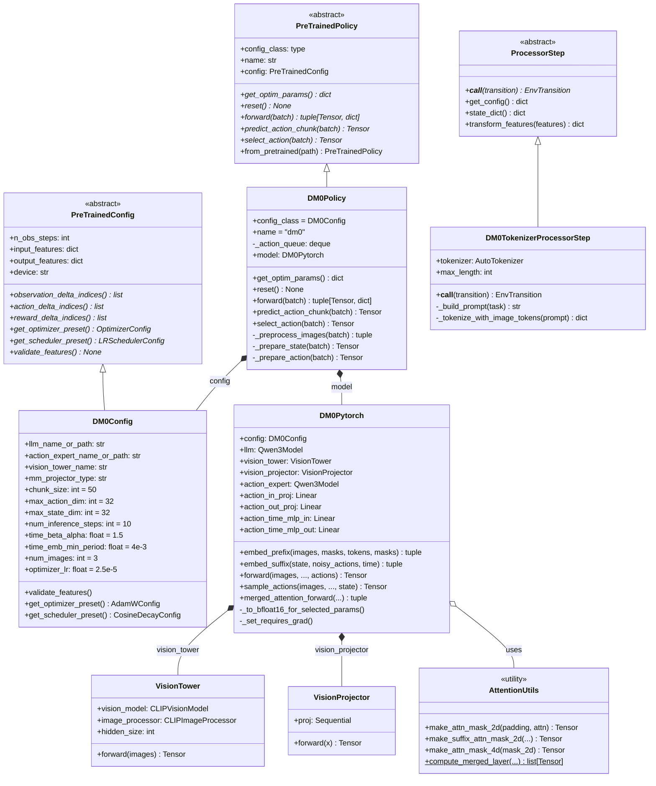
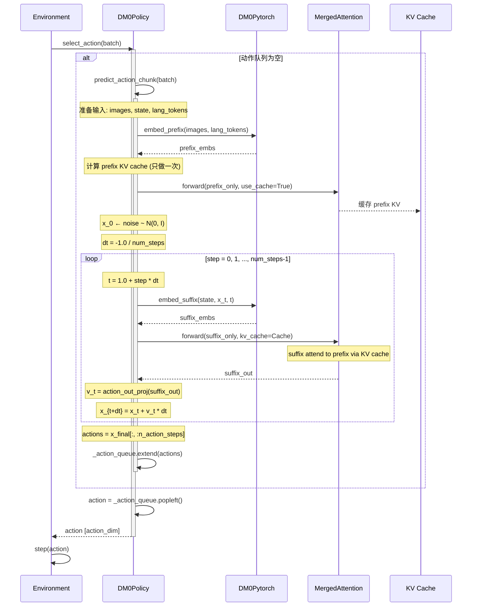
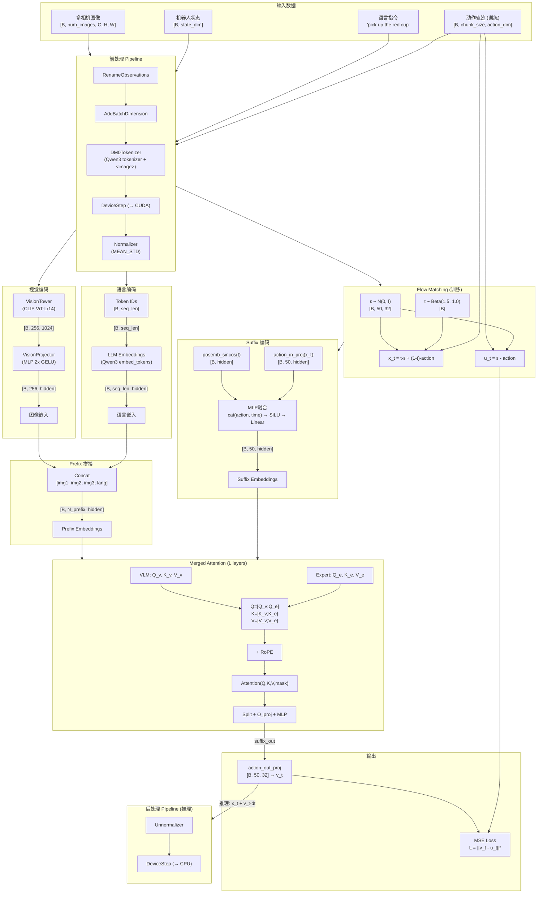
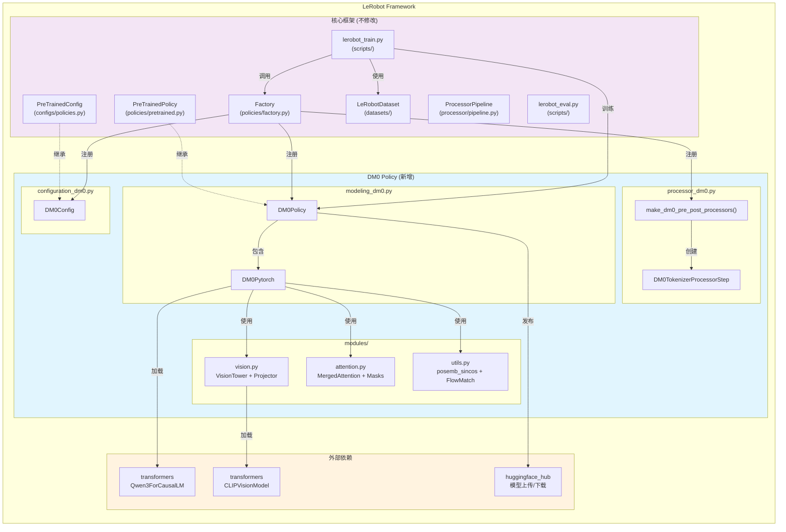

# DM0 算法迁移到 LeRobot 框架 - 设计与实现方案

> **版本**: v1.0  
> **日期**: 2026-04-10  
> **范围**: 将 dexbotic 项目中的 DM0 VLA (Vision-Language-Action) 模型完整迁移到 HuggingFace LeRobot 框架

---

## 目录

1. [概述](#1-概述)
2. [架构对比分析](#2-架构对比分析)
3. [整体迁移架构设计](#3-整体迁移架构设计)
4. [目录结构与文件规划](#4-目录结构与文件规划)
5. [核心模块设计](#5-核心模块设计)
   - 5.1 [配置模块 (Configuration)](#51-配置模块-configuration)
   - 5.2 [模型模块 (Modeling)](#52-模型模块-modeling)
   - 5.3 [处理器模块 (Processor)](#53-处理器模块-processor)
   - 5.4 [工厂注册 (Factory)](#54-工厂注册-factory)
6. [核心代码详细设计](#6-核心代码详细设计)
   - 6.1 [Flow Matching 训练](#61-flow-matching-训练)
   - 6.2 [Merged Attention 机制](#62-merged-attention-机制)
   - 6.3 [Euler 采样推理](#63-euler-采样推理)
   - 6.4 [Vision-Language 编码](#64-vision-language-编码)
7. [数据管道适配](#7-数据管道适配)
8. [UML 图](#8-uml-图)
   - 8.1 [类图](#81-类图)
   - 8.2 [训练时序图](#82-训练时序图)
   - 8.3 [推理时序图](#83-推理时序图)
   - 8.4 [数据流图](#84-数据流图)
   - 8.5 [组件图](#85-组件图)
9. [测试方案](#9-测试方案)
10. [迁移步骤与里程碑](#10-迁移步骤与里程碑)
11. [风险与缓解措施](#11-风险与缓解措施)
12. [附录](#12-附录)

---

## 1. 概述

### 1.1 项目背景

**DM0** 是 dexbotic 项目中的 Vision-Language-Action (VLA) 模型, 基于以下关键技术:
- **Qwen3** 作为 VLM (Vision-Language Model) 骨干网络
- **CLIP/SigLIP** 作为视觉编码器
- **Flow Matching** 作为动作生成范式 (区别于传统扩散模型)
- **Merged Attention** 实现 VLM 与动作专家 (Action Expert) 的联合注意力

**LeRobot** 是 HuggingFace 的开源机器人学习框架, 提供:
- 统一的 Policy 抽象 (`PreTrainedPolicy` / `PreTrainedConfig`)
- 标准化的数据管道 (`LeRobotDataset` v3.0)
- 完整的训练/评估/部署流水线
- HuggingFace Hub 集成用于模型共享

### 1.2 迁移目标

将 DM0 作为 LeRobot 的 **in-tree policy** 集成, 使其能够:
1. 通过 `lerobot-train --policy.type=dm0` 命令行直接训练
2. 使用 LeRobot 标准数据集格式
3. 兼容 LeRobot 的评估和部署管道
4. 支持 HuggingFace Hub 模型发布
5. 支持 PEFT (LoRA) 微调
6. 支持多 GPU 分布式训练

### 1.3 参考案例

本设计主要参考 LeRobot 中与 DM0 架构最相似的 **PI0 Policy** (`src/lerobot/policies/pi0/`), 因为两者共享几乎相同的设计范式:
- 都使用 VLM + Action Expert 双模型结构
- 都使用 Flow Matching 进行动作生成
- 都使用 Merged Attention (交错注意力) 连接两个模型
- 都使用正弦时间嵌入 + MLP 融合

同时参考了 LeRobot 社区的实际 PR 案例:
- PR #2545 (MultiTaskDiT) - 标准 in-tree policy 添加流程
- PR #3085 (GR00T N1.6) - 大型 VLA 模型集成模式
- PR #2961 (DynamicVLA) - VLM-based policy 集成

---

## 2. 架构对比分析

### 2.1 DM0 vs PI0 核心组件对比

| 组件 | DM0 (dexbotic) | PI0 (lerobot) | 迁移策略 |
|------|---------------|---------------|---------|
| **VLM 骨干** | Qwen3ForCausalLM | PaliGemma (Gemma 2B) | 替换为 Qwen3, 需适配 tokenizer |
| **视觉编码器** | CLIP/SigLIP (独立模块) | PaliGemma 内置 SigLIP | 保留独立视觉塔 + 投影器 |
| **动作专家** | Qwen3ForCausalLM (无 embed_tokens) | PiGemmaForCausalLM | 保留 Qwen3 动作专家 |
| **注意力机制** | Merged Attention (共享 Q/K/V 拼接) | Interleaved Processing (相同模式) | 直接复用 |
| **时间嵌入** | posemb_sincos (min=4e-3, max=4.0) | create_sinusoidal_pos_embedding (相同) | 直接复用 |
| **Flow Matching** | x_t = t*noise + (1-t)*action, u_t = noise - action | 完全相同 | 直接复用 |
| **推理方法** | Euler 采样, dt = -1/steps | 完全相同 | 直接复用 |
| **数据归一化** | 分位数归一化 (q01, q99) | 多种模式 (MEAN_STD, MIN_MAX等) | 需适配 |
| **配置系统** | Python dataclass + argparse | draccus ChoiceRegistry | 需重写配置类 |
| **数据集** | 自定义 DexDataset + 注册表 | LeRobotDataset v3.0 | 需适配数据格式 |
| **训练器** | 自定义 Trainer (基于 HF Trainer) | lerobot_train.py + Accelerate | 需适配训练循环 |

### 2.2 关键差异分析

#### 差异 1: VLM 骨干网络

DM0 使用 **Qwen3** 作为 VLM, 而 PI0 使用 PaliGemma (Gemma). 两者在以下方面不同:
- **注意力实现**: Qwen3 使用 QKV Norm (q_norm/k_norm), Gemma 不使用
- **RoPE 实现**: 都使用旋转位置编码, 但实现细节不同
- **词汇表**: Qwen3 使用自己的分词器, PaliGemma 使用 SentencePiece

**迁移策略**: 保留 Qwen3 骨干, 但需通过 `transformers` 库加载, 并适配 LeRobot 的 tokenizer 接口.

#### 差异 2: 视觉模块组织

DM0 使用独立的 vision_tower + projector 架构 (类似 LLaVA), PI0 使用 PaliGemma 内置的 SigLIP.

**迁移策略**: 保留 DM0 的独立视觉模块设计, 通过配置指定视觉编码器类型.

#### 差异 3: 数据归一化

DM0 使用基于分位数的归一化 (`(value - q01) / (q99 - q01) * 2 - 1`), 而 LeRobot 的标准归一化模式包括 MEAN_STD 和 MIN_MAX.

**迁移策略**: 实现自定义 `ProcessorStep` 支持分位数归一化, 同时也支持 LeRobot 的标准归一化模式.

#### 差异 4: 对话模板与 Tokenization

DM0 使用 LLaVA 风格的对话模板 (`<image>` 标记 + ChatML 格式), PI0 使用 PaliGemma 的简单拼接.

**迁移策略**: 通过自定义 `ProcessorStep` 处理 DM0 特有的对话模板, 并在 processor 中集成分词.

---

## 3. 整体迁移架构设计

### 3.1 设计原则

1. **最小侵入**: 不修改 LeRobot 核心代码, 仅通过标准扩展点集成
2. **保持一致**: 遵循 LeRobot 的命名约定和代码风格
3. **功能完整**: 支持训练、评估、推理、Hub 发布的完整流程
4. **向后兼容**: 支持加载 dexbotic 格式的预训练权重

### 3.2 集成方式

选择 **In-Tree Policy** 方式 (而非第三方插件), 理由:
- DM0 的 Merged Attention 机制与 PI0 高度相似, 可复用基础设施
- In-tree 可以更好地利用 LeRobot 的测试和 CI 框架
- 便于与社区共享和维护

### 3.3 架构总览

```
LeRobot Framework
├── src/lerobot/
│   ├── policies/
│   │   ├── dm0/                    ← 新增: DM0 Policy
│   │   │   ├── __init__.py
│   │   │   ├── configuration_dm0.py
│   │   │   ├── modeling_dm0.py
│   │   │   ├── processor_dm0.py
│   │   │   └── modules/
│   │   │       ├── __init__.py
│   │   │       ├── vision.py       ← 视觉编码器
│   │   │       ├── attention.py    ← Merged Attention
│   │   │       └── utils.py        ← 时间嵌入等工具
│   │   └── factory.py              ← 修改: 添加 DM0 注册
│   └── ...
├── tests/
│   └── policies/
│       └── dm0/                    ← 新增: DM0 测试
│           ├── test_dm0_policy.py
│           └── test_dm0_processor.py
└── docs/
    └── source/
        └── policy_dm0_README.md    ← 新增: DM0 文档
```

---

## 4. 目录结构与文件规划

### 4.1 新增文件清单

```
src/lerobot/policies/dm0/
├── __init__.py                     # 导出 DM0Config
├── configuration_dm0.py            # DM0Config 配置类
├── modeling_dm0.py                 # DM0Policy + DM0Pytorch 模型类
├── processor_dm0.py                # make_dm0_pre_post_processors()
└── modules/
    ├── __init__.py
    ├── vision.py                   # VisionTower, VisionProjector
    ├── attention.py                # MergedAttention, mask 工具
    └── utils.py                    # posemb_sincos, flow matching 工具
```

### 4.2 需修改文件清单

```
src/lerobot/policies/factory.py     # 添加 DM0 到工厂函数
```

### 4.3 测试文件清单

```
tests/policies/dm0/
├── __init__.py
├── test_dm0_policy.py              # Policy 级别测试
├── test_dm0_processor.py           # Processor 管道测试
├── test_dm0_modules.py             # 子模块单元测试
└── test_dm0_backward_compat.py     # 权重加载兼容性测试
```

---

## 5. 核心模块设计

### 5.1 配置模块 (Configuration)

**文件**: `src/lerobot/policies/dm0/configuration_dm0.py`

```python
from dataclasses import dataclass, field
from lerobot.configs.policies import PreTrainedConfig
from lerobot.configs.types import NormalizationMode
from lerobot.optim.optimizers import AdamWConfig
from lerobot.optim.schedulers import CosineDecayWithWarmupSchedulerConfig


@PreTrainedConfig.register_subclass("dm0")
@dataclass
class DM0Config(PreTrainedConfig):
    """DM0 VLA Policy 配置.
    
    DM0 使用 Qwen3 VLM + Qwen3 Action Expert 架构,
    通过 Flow Matching 进行连续动作预测.
    """
    
    # === 模型架构 ===
    llm_name_or_path: str = "Qwen/Qwen3-0.6B"       # VLM 骨干路径
    action_expert_name_or_path: str = "Qwen/Qwen3-0.6B"  # 动作专家路径
    vision_tower_name: str = "openai/clip-vit-large-patch14"  # 视觉编码器
    mm_projector_type: str = "mlp2x_gelu"             # 视觉投影器类型
    
    # === 动作空间 ===
    chunk_size: int = 50          # 动作预测长度 (action horizon)
    n_action_steps: int = 50      # 实际执行步数
    max_action_dim: int = 32      # 最大动作维度 (用于 padding)
    max_state_dim: int = 32       # 最大状态维度 (用于 padding)
    
    # === Flow Matching ===
    num_inference_steps: int = 10  # 推理时去噪步数
    time_beta_alpha: float = 1.5   # Beta 分布 alpha 参数
    time_beta_beta: float = 1.0    # Beta 分布 beta 参数
    time_min: float = 0.001        # 时间最小值
    time_max: float = 0.999        # 时间最大值
    
    # === 时间嵌入 ===
    time_emb_min_period: float = 4e-3
    time_emb_max_period: float = 4.0
    
    # === 视觉 ===
    image_resolution: tuple[int, int] = (224, 224)
    num_images: int = 3            # 最大相机视角数
    empty_cameras: int = 0         # 空相机填充数
    
    # === 训练 ===
    dtype: str = "bfloat16"
    gradient_checkpointing: bool = False
    freeze_vision_encoder: bool = False
    train_expert_only: bool = False
    
    # === 优化器 ===
    optimizer_lr: float = 2.5e-5
    optimizer_betas: tuple[float, float] = (0.9, 0.95)
    optimizer_eps: float = 1e-8
    optimizer_weight_decay: float = 1e-10
    scheduler_warmup_steps: int = 1000
    scheduler_decay_steps: int = 30000
    scheduler_decay_lr: float = 2.5e-6
    
    # === Tokenizer ===
    tokenizer_name: str = "Qwen/Qwen3-0.6B"
    tokenizer_max_length: int = 200
    chat_template: str = "chatml"
    
    # === 归一化 ===
    normalization_mapping: dict[str, NormalizationMode] = field(
        default_factory=lambda: {
            "VISUAL": NormalizationMode.IDENTITY,
            "STATE": NormalizationMode.MEAN_STD,
            "ACTION": NormalizationMode.MEAN_STD,
        }
    )
    
    # === delta indices ===
    @property
    def observation_delta_indices(self) -> None:
        return None
    
    @property
    def action_delta_indices(self) -> list:
        return list(range(self.chunk_size))
    
    @property
    def reward_delta_indices(self) -> None:
        return None
    
    def validate_features(self) -> None:
        """验证输入/输出特征配置."""
        if not self.image_features and not self.robot_state_feature:
            raise ValueError(
                "DM0 requires at least one image or robot state feature."
            )
    
    def get_optimizer_preset(self) -> AdamWConfig:
        return AdamWConfig(
            lr=self.optimizer_lr,
            betas=self.optimizer_betas,
            eps=self.optimizer_eps,
            weight_decay=self.optimizer_weight_decay,
        )
    
    def get_scheduler_preset(self) -> CosineDecayWithWarmupSchedulerConfig:
        return CosineDecayWithWarmupSchedulerConfig(
            num_warmup_steps=self.scheduler_warmup_steps,
            num_decay_steps=self.scheduler_decay_steps,
            min_lr=self.scheduler_decay_lr,
        )
```

**设计说明**:
- 使用 `@PreTrainedConfig.register_subclass("dm0")` 注册到 draccus ChoiceRegistry
- 所有原始 DM0 的配置参数都映射为 dataclass 字段
- `max_action_dim` / `max_state_dim` 用于 padding, 与 PI0 的设计一致
- 归一化默认使用 `MEAN_STD`, 可通过命令行覆盖为分位数模式

### 5.2 模型模块 (Modeling)

**文件**: `src/lerobot/policies/dm0/modeling_dm0.py`

#### 5.2.1 DM0Pytorch 类 (核心神经网络)

```python
class DM0Pytorch(nn.Module):
    """DM0 核心 PyTorch 模型.
    
    架构:
    ┌─────────────────┐    ┌──────────────────┐
    │  Qwen3 VLM      │    │ Qwen3 Action     │
    │  (Language +     │    │ Expert           │
    │   Vision)        │    │ (无 embed_tokens) │
    │                  │    │                  │
    │  ┌────────────┐  │    │                  │
    │  │VisionTower │  │    │                  │
    │  │+ Projector │  │    │                  │
    │  └────────────┘  │    │                  │
    └────────┬─────────┘    └────────┬─────────┘
             │                       │
             └───────┬───────────────┘
                     │
              Merged Attention
              (共享 QKV 拼接)
                     │
              action_out_proj
                     │
              Velocity v_t
    """
    
    def __init__(self, config: DM0Config):
        super().__init__()
        self.config = config
        
        # 1. 加载 VLM 骨干 (Qwen3)
        self.llm = Qwen3ForCausalLM.from_pretrained(
            config.llm_name_or_path
        ).model  # 只取 model 部分, 不要 lm_head
        
        # 2. 构建视觉模块
        self.vision_tower = build_vision_tower(config.vision_tower_name)
        self.vision_projector = build_vision_projector(
            config.mm_projector_type,
            mm_hidden_size=self.vision_tower.hidden_size,
            hidden_size=self.llm.config.hidden_size,
        )
        
        # 3. 构建动作专家 (Qwen3, 无 embed_tokens)
        self.action_expert = Qwen3ForCausalLM.from_pretrained(
            config.action_expert_name_or_path
        ).model
        self.action_expert.embed_tokens = None
        
        action_hidden = self.action_expert.config.hidden_size
        
        # 4. 动作投影层
        self.action_in_proj = nn.Linear(config.max_action_dim, action_hidden)
        self.action_out_proj = nn.Linear(action_hidden, config.max_action_dim)
        
        # 5. 时间 MLP 融合层
        self.action_time_mlp_in = nn.Linear(2 * action_hidden, action_hidden)
        self.action_time_mlp_out = nn.Linear(action_hidden, action_hidden)
        
        # 6. dtype 转换
        if config.dtype == "bfloat16":
            self._to_bfloat16_for_selected_params()
        
        # 7. 冻结策略
        self._set_requires_grad()
    
    def _to_bfloat16_for_selected_params(self):
        """选择性转换为 bfloat16, 保留 layernorm 和视觉前处理为 float32."""
        self.action_expert = self.action_expert.to(dtype=torch.bfloat16)
        self.llm = self.llm.to(dtype=torch.bfloat16)
        self.vision_tower = self.vision_tower.to(dtype=torch.bfloat16)
        self.vision_projector = self.vision_projector.to(dtype=torch.bfloat16)
        
        params_to_keep_float32 = [
            "vision_model.conv1", "positional_embedding",
            "input_layernorm", "post_attention_layernorm", "model.norm",
        ]
        for name, param in self.named_parameters():
            if any(s in name for s in params_to_keep_float32):
                param.data = param.data.to(dtype=torch.float32)
    
    def _set_requires_grad(self):
        """根据配置冻结模型参数."""
        if self.config.freeze_vision_encoder:
            for p in self.vision_tower.parameters():
                p.requires_grad = False
        if self.config.train_expert_only:
            for p in self.llm.parameters():
                p.requires_grad = False
            for p in self.vision_tower.parameters():
                p.requires_grad = False
            for p in self.vision_projector.parameters():
                p.requires_grad = False
```

#### 5.2.2 DM0Policy 类 (LeRobot 接口层)

```python
class DM0Policy(PreTrainedPolicy):
    """DM0 Policy - LeRobot PreTrainedPolicy 接口实现.
    
    实现 5 个必需的抽象方法:
    - get_optim_params(): 返回优化器参数组
    - reset(): 重置动作缓存
    - forward(batch): 训练前向传播, 返回 (loss, log_dict)
    - predict_action_chunk(batch): 预测完整动作序列
    - select_action(batch): 选择单步动作
    """
    
    config_class = DM0Config
    name = "dm0"
    
    def __init__(self, config: DM0Config, **kwargs):
        super().__init__(config)
        config.validate_features()
        self.model = DM0Pytorch(config)
        self.reset()
    
    def reset(self):
        self._action_queue = deque([], maxlen=self.config.n_action_steps)
    
    def get_optim_params(self) -> dict:
        return [{"params": self.parameters()}]
    
    def forward(self, batch: dict[str, Tensor]) -> tuple[Tensor, dict | None]:
        """训练前向传播 - Flow Matching 损失计算."""
        # ... 详见 6.1 节
    
    def predict_action_chunk(self, batch: dict[str, Tensor]) -> Tensor:
        """预测完整动作块 - Euler 采样推理."""
        # ... 详见 6.3 节
    
    def select_action(self, batch: dict[str, Tensor]) -> Tensor:
        """选择单步动作 - 从动作队列中取出."""
        self.eval()
        if len(self._action_queue) == 0:
            actions = self.predict_action_chunk(batch)
            actions = actions[:, :self.config.n_action_steps]
            self._action_queue.extend(actions.transpose(0, 1))
        return self._action_queue.popleft()
```

### 5.3 处理器模块 (Processor)

**文件**: `src/lerobot/policies/dm0/processor_dm0.py`

```python
def make_dm0_pre_post_processors(
    config: DM0Config,
    dataset_stats: dict[str, dict[str, Tensor]] | None = None,
) -> tuple[PolicyProcessorPipeline, PolicyProcessorPipeline]:
    """创建 DM0 的前处理和后处理管道.
    
    前处理管道:
    1. RenameObservationsProcessorStep - 重命名观测键
    2. AddBatchDimensionProcessorStep - 添加 batch 维度
    3. DM0TokenizerProcessorStep - Qwen3 分词 + <image> 标记处理
    4. DeviceProcessorStep - 移至目标设备
    5. NormalizerProcessorStep - 归一化状态和动作
    
    后处理管道:
    1. UnnormalizerProcessorStep - 反归一化动作
    2. DeviceProcessorStep - 移至 CPU
    """
    
    # 前处理步骤
    input_steps = [
        RenameObservationsProcessorStep(rename_map={}),
        AddBatchDimensionProcessorStep(),
        DM0TokenizerProcessorStep(
            tokenizer_name=config.tokenizer_name,
            max_length=config.tokenizer_max_length,
            chat_template=config.chat_template,
        ),
        DeviceProcessorStep(device=config.device),
        NormalizerProcessorStep(
            features={**config.input_features, **config.output_features},
            norm_map=config.normalization_mapping,
            stats=dataset_stats,
            device=config.device,
        ),
    ]
    
    # 后处理步骤
    output_steps = [
        UnnormalizerProcessorStep(
            features=config.output_features,
            norm_map=config.normalization_mapping,
            stats=dataset_stats,
        ),
        DeviceProcessorStep(device="cpu"),
    ]
    
    return (
        PolicyProcessorPipeline(steps=input_steps, name="dm0_preprocessor"),
        PolicyProcessorPipeline(steps=output_steps, name="dm0_postprocessor"),
    )
```

#### 自定义 ProcessorStep

```python
@ProcessorStepRegistry.register("dm0_tokenizer")
class DM0TokenizerProcessorStep(ProcessorStep):
    """DM0 专用分词器处理步骤.
    
    处理 Qwen3 分词 + <image> 特殊标记:
    1. 将任务描述包装为 ChatML 对话格式
    2. 处理 <image> 标记, 替换为 IMAGE_TOKEN_INDEX (-200)
    3. 进行 padding 到 max_length
    """
    
    def __init__(self, tokenizer_name: str, max_length: int, chat_template: str):
        self.tokenizer = AutoTokenizer.from_pretrained(tokenizer_name)
        self.max_length = max_length
        self.chat_template = chat_template
    
    def __call__(self, transition: EnvTransition) -> EnvTransition:
        task = transition.complementary_data.get("task", "")
        prompt = self._build_prompt(task)
        tokens = self._tokenize_with_image_tokens(prompt)
        transition.observation["input_ids"] = tokens["input_ids"]
        transition.observation["attention_mask"] = tokens["attention_mask"]
        return transition
    
    def _build_prompt(self, task: str) -> str:
        """构建 ChatML 格式的提示."""
        return f"<image>\n{task}"
    
    def _tokenize_with_image_tokens(self, prompt: str) -> dict:
        """处理包含 <image> 标记的分词."""
        # 分割 <image> 标记, 用 IMAGE_TOKEN_INDEX 替换
        # ... 复用 dexbotic tokenizer_image_token 逻辑
```

### 5.4 工厂注册 (Factory)

**文件**: `src/lerobot/policies/factory.py` (修改)

需要在三个函数中添加 DM0 的入口:

```python
# 1. get_policy_class() 中添加:
elif name == "dm0":
    from lerobot.policies.dm0.modeling_dm0 import DM0Policy
    return DM0Policy

# 2. make_policy_config() 中添加:
elif policy_type == "dm0":
    from lerobot.policies.dm0.configuration_dm0 import DM0Config
    return DM0Config(**kwargs)

# 3. make_pre_post_processors() 中添加:
elif isinstance(policy_cfg, DM0Config):
    from lerobot.policies.dm0.processor_dm0 import make_dm0_pre_post_processors
    processors = make_dm0_pre_post_processors(policy_cfg, dataset_stats)
```

同时在 factory.py 顶部添加导入:
```python
from lerobot.policies.dm0.configuration_dm0 import DM0Config
```

---

## 6. 核心代码详细设计

### 6.1 Flow Matching 训练

Flow Matching 是 DM0 的核心训练范式, 区别于 DDPM 等离散扩散模型, 它使用连续时间的确定性路径:

**数学公式**:
- 噪声路径: `x_t = t * noise + (1 - t) * action`  (t 从 0 到 1)
- 目标速度: `u_t = noise - action`  (常数速度场)
- 损失函数: `L = MSE(v_t, u_t)`  (v_t 为模型预测速度)

```python
# DM0Policy.forward() 实现

def forward(self, batch: dict[str, Tensor]) -> tuple[Tensor, dict | None]:
    """Flow Matching 训练前向传播.
    
    数据流:
    1. 从 batch 中提取图像、状态、动作、语言指令
    2. 采样噪声 ε ~ N(0, I) 和时间 t ~ Beta(1.5, 1.0)
    3. 计算噪声路径: x_t = t * ε + (1-t) * a
    4. 计算目标速度: u_t = ε - a
    5. 前向传播: 编码 prefix (图像+语言) 和 suffix (x_t + t)
    6. Merged Attention 计算
    7. 投影得到预测速度 v_t
    8. MSE 损失: L = ||v_t - u_t||²
    
    Args:
        batch: 包含以下键的字典:
            - observation.images.*: 图像张量 [B, C, H, W]
            - observation.state: 状态张量 [B, state_dim]
            - action: 动作张量 [B, chunk_size, action_dim]
            - task: 语言指令
    
    Returns:
        (loss, log_dict): 标量损失和日志字典
    """
    # --- 1. 准备输入 ---
    images, img_masks = self._preprocess_images(batch)
    state = self._prepare_state(batch)       # [B, max_state_dim]
    actions = self._prepare_action(batch)     # [B, chunk_size, max_action_dim]
    lang_tokens = batch["input_ids"]          # [B, seq_len]
    lang_masks = batch["attention_mask"]      # [B, seq_len]
    
    # --- 2. 采样噪声和时间 ---
    batch_size = actions.shape[0]
    noise = torch.randn_like(actions)         # ε ~ N(0, I)
    
    time = (
        torch.distributions.Beta(
            self.config.time_beta_alpha,
            self.config.time_beta_beta
        ).sample((batch_size,)).to(actions.device)
        * self.config.time_max + self.config.time_min
    ).to(dtype=actions.dtype)
    
    # --- 3. Flow Matching 插值 ---
    time_expanded = time[:, None, None]       # [B, 1, 1]
    x_t = time_expanded * noise + (1 - time_expanded) * actions  # 噪声路径
    u_t = noise - actions                     # 目标速度 (常数)
    
    # --- 4. 编码 Prefix (图像 + 语言) ---
    prefix_embs, prefix_pad_mask, prefix_attn_mask = self.model.embed_prefix(
        images, img_masks, lang_tokens, lang_masks
    )
    
    # --- 5. 编码 Suffix (噪声动作 + 时间) ---
    suffix_embs, suffix_pad_mask, suffix_attn_mask = self.model.embed_suffix(
        state, x_t, time
    )
    
    # --- 6. Merged Attention 计算 ---
    # 构建注意力掩码: prefix 内部因果, suffix 可看到 prefix + 自身
    full_pad_mask = torch.cat([prefix_pad_mask, suffix_pad_mask], dim=1)
    full_attn_mask = torch.cat([prefix_attn_mask, suffix_attn_mask], dim=1)
    attn_mask_2d = make_attn_mask_2d(full_pad_mask, full_attn_mask)
    attn_mask_4d = make_attn_mask_4d(attn_mask_2d, dtype=prefix_embs.dtype)
    
    positions = self._compute_positions(prefix_pad_mask, suffix_pad_mask)
    
    (_, suffix_out), _ = self.model.merged_attention_forward(
        module_list=[self.model.llm, self.model.action_expert],
        attention_mask=attn_mask_4d,
        position_ids=positions,
        input_embeds_list=[prefix_embs, suffix_embs],
    )
    
    # --- 7. 投影得到预测速度 ---
    v_t = self.model.action_out_proj(
        suffix_out[:, -self.config.chunk_size:]
    )
    
    # --- 8. MSE 损失 ---
    # 只计算实际动作维度的损失 (忽略 padding 维度)
    action_dim = batch["action"].shape[-1]
    loss_per_dim = F.mse_loss(
        v_t[..., :action_dim], u_t[..., :action_dim], reduction="none"
    )
    loss = loss_per_dim.mean()
    
    log_dict = {
        "loss": loss.item(),
        "loss_per_dim": loss_per_dim.mean(dim=(0, 1)).detach(),
    }
    
    return loss, log_dict
```

**关键设计点**:

1. **Beta 时间采样**: 使用 Beta(1.5, 1.0) 分布, 偏向高噪声时间步, 有利于训练稳定性
2. **动作维度 Padding**: 动作被 pad 到 `max_action_dim`, 损失只在实际维度上计算
3. **注意力掩码设计**:
   - Prefix 内部: 全可见 (因果掩码由 `attn_mask` 的 cumsum 机制实现)
   - Suffix → Prefix: 全可见 (suffix 的第一个 token attn_mask=1, 使其 cumsum 大于所有 prefix)
   - Suffix 内部: 因果 (后续 token attn_mask=0, cumsum 递增)
   - Prefix → Suffix: 不可见 (由于 cumsum 大小关系)

### 6.2 Merged Attention 机制

Merged Attention 是 DM0 的核心创新之一, 让 VLM 和 Action Expert 在每一层共享注意力计算:

```python
# modules/attention.py

def compute_merged_layer(
    layer_idx: int,
    module_list: list[nn.Module],         # [llm, action_expert]
    input_embeds_list: list[Tensor],      # [prefix_embs, suffix_embs]
    position_ids: Tensor,                 # [B, P+S]
    attention_mask: Tensor,               # [B, 1, P+S, P+S]
    past_key_values: DynamicCache | None,
    use_cache: bool,
) -> list[Tensor]:
    """计算单层 Merged Attention.
    
    核心思想:
    ┌─────────────────────────────────┐
    │       Merged Attention Layer    │
    │                                 │
    │  VLM Layer_i     Expert Layer_i │
    │  ┌─────────┐    ┌────────────┐  │
    │  │LayerNorm│    │ LayerNorm  │  │
    │  │Q_v, K_v,│    │Q_e, K_e,  │  │
    │  │V_v      │    │V_e        │  │
    │  └────┬────┘    └─────┬──────┘  │
    │       │               │         │
    │       └───┬───────┬───┘         │
    │           │       │             │
    │     Q=[Q_v;Q_e]  K=[K_v;K_e]   │
    │     V=[V_v;V_e]                 │
    │           │                     │
    │     ┌─────┴─────┐              │
    │     │  RoPE +    │              │
    │     │  Attention │              │
    │     └─────┬─────┘              │
    │           │                     │
    │     Split → O_proj → Residual   │
    │           → MLP → Residual      │
    └─────────────────────────────────┘
    
    流程:
    1. 对每个模块的当前层, 独立计算 LayerNorm 和 Q/K/V
    2. 拼接所有模块的 Q/K/V: Q_merged = [Q_vlm; Q_expert]
    3. 应用 RoPE 旋转位置编码
    4. 计算统一的注意力 (使用 4D attention_mask 控制可见性)
    5. 按序列长度切分注意力输出
    6. 各模块独立执行 O_proj + 残差 + MLP + 残差
    
    此机制使得:
    - Action Expert 的 Query 可以 attend 到 VLM 的 Key/Value
    - 实现了隐式的跨模型信息传递
    - 无需额外的 cross-attention 模块
    """
    query_list, key_list, value_list = [], [], []
    seq_len_list = []
    layers = [module.layers[layer_idx] for module in module_list]
    
    # Step 1: 各模块独立计算 Q/K/V
    for layer, input_embeds in zip(layers, input_embeds_list):
        if input_embeds is None:
            seq_len_list.append(0)
            continue
        
        prenorm = layer.input_layernorm(input_embeds)
        B, S, _ = prenorm.shape
        seq_len_list.append(S)
        
        # Qwen3 特有: Q/K Norm
        q = layer.self_attn.q_norm(
            layer.self_attn.q_proj(prenorm).view(B, S, -1, layer.self_attn.head_dim)
        ).transpose(1, 2)
        k = layer.self_attn.k_norm(
            layer.self_attn.k_proj(prenorm).view(B, S, -1, layer.self_attn.head_dim)
        ).transpose(1, 2)
        v = layer.self_attn.v_proj(prenorm).view(
            B, S, -1, layer.self_attn.head_dim
        ).transpose(1, 2)
        
        query_list.append(q)
        key_list.append(k)
        value_list.append(v)
    
    # Step 2: 拼接 Q/K/V
    query_states = torch.cat(query_list, dim=2)   # [B, H, S_total, D]
    key_states = torch.cat(key_list, dim=2)
    value_states = torch.cat(value_list, dim=2)
    
    # Step 3: 应用 RoPE
    cos, sin = rotary_emb(dummy_tensor, position_ids)
    query_states, key_states = apply_rotary_pos_emb(
        query_states, key_states, cos, sin
    )
    
    # Step 4: KV Cache 处理 (推理时使用)
    if past_key_values is not None and use_cache:
        key_states, value_states = past_key_values.update(
            key_states, value_states, layer_idx
        )
    
    # Step 5: 计算注意力
    attn_output = eager_attention_forward(
        query_states, key_states, value_states, attention_mask
    )  # [B, S_total, H*D]
    
    # Step 6: 按模块切分并独立处理残差 + MLP
    output_list = []
    start_idx = 0
    for layer, input_embeds, seq_len in zip(layers, input_embeds_list, seq_len_list):
        if seq_len == 0:
            output_list.append(None)
            continue
        
        attn_slice = attn_output[:, start_idx:start_idx + seq_len]
        start_idx += seq_len
        
        attn_out = layer.self_attn.o_proj(attn_slice)
        residual = input_embeds + attn_out
        mlp_out = layer.mlp(layer.post_attention_layernorm(residual))
        output_list.append(residual + mlp_out)
    
    return output_list
```

### 6.3 Euler 采样推理

```python
# DM0Policy.predict_action_chunk() 实现

@torch.no_grad()
def predict_action_chunk(self, batch: dict[str, Tensor]) -> Tensor:
    """使用 Euler 采样的推理前向传播.
    
    算法 (Euler 方法求解 ODE):
    ────────────────────────────────────
    输入: 观测 (图像, 语言, 状态)
    输出: 预测动作序列 [B, chunk_size, action_dim]
    
    1. x_0 ← ε ~ N(0, I)              # 从纯噪声开始
    2. dt ← -1.0 / num_steps          # 时间步长 (负方向)
    3. 编码 prefix (图像+语言)         # 只计算一次
    4. 缓存 prefix KV                  # 避免重复计算
    5. for step in range(num_steps):
    6.     t ← 1.0 + step * dt         # 从 t=1 到 t≈0
    7.     v_t ← model(x_t, t, prefix) # 预测速度
    8.     x_{t+dt} ← x_t + v_t * dt   # Euler 更新
    9. return x_final                   # 去噪后的动作
    ────────────────────────────────────
    
    关键优化:
    - Prefix KV Cache: prefix 的 Key/Value 在所有去噪步骤中重复使用
    - 只有 suffix (噪声动作+时间) 在每步重新编码
    """
    self.eval()
    
    # 准备输入
    images, img_masks = self._preprocess_images(batch)
    state = self._prepare_state(batch)
    lang_tokens = batch["input_ids"]
    lang_masks = batch["attention_mask"]
    
    batch_size = state.shape[0]
    num_steps = self.config.num_inference_steps
    dt = -1.0 / num_steps
    
    # 初始噪声
    noise = torch.randn(
        batch_size, self.config.chunk_size, self.config.max_action_dim,
        device=state.device, dtype=state.dtype
    )
    
    # 编码 prefix (只做一次)
    prefix_embs, prefix_pad_mask, prefix_attn_mask = self.model.embed_prefix(
        images, img_masks, lang_tokens, lang_masks
    )
    
    # 计算 prefix KV cache
    prefix_attn_2d = make_attn_mask_2d(prefix_pad_mask, prefix_attn_mask)
    prefix_attn_4d = make_attn_mask_4d(prefix_attn_2d, dtype=prefix_embs.dtype)
    prefix_positions = torch.cumsum(prefix_pad_mask, dim=1) - 1
    
    _, kv_cache = self.model.merged_attention_forward(
        module_list=[self.model.llm, self.model.action_expert],
        attention_mask=prefix_attn_4d,
        position_ids=prefix_positions,
        past_key_values=DynamicCache(),
        input_embeds_list=[prefix_embs, None],
        use_cache=True,
    )
    
    # Euler 采样循环
    x_t = noise
    time = torch.tensor(1.0, device=state.device, dtype=state.dtype)
    
    for step in range(num_steps):
        # 编码当前 suffix
        suffix_embs, suffix_pad_mask, suffix_attn_mask = self.model.embed_suffix(
            state, x_t, time.expand(batch_size)
        )
        
        # 构建 suffix → prefix+suffix 的注意力掩码
        suffix_attn_2d = make_suffix_attn_mask_2d(
            suffix_pad_mask, suffix_attn_mask,
            prefix_pad_mask, prefix_attn_mask,
        )
        full_attn_4d = make_attn_mask_4d(suffix_attn_2d, dtype=suffix_embs.dtype)
        
        # 位置 ID: 从 prefix 末尾继续
        prefix_offsets = prefix_pad_mask.sum(dim=-1, keepdim=True)
        suffix_positions = prefix_offsets + torch.cumsum(suffix_pad_mask, dim=1) - 1
        
        # 前向传播 (使用 prefix KV cache)
        (_, suffix_out), _ = self.model.merged_attention_forward(
            module_list=[self.model.llm, self.model.action_expert],
            attention_mask=full_attn_4d,
            position_ids=suffix_positions,
            past_key_values=kv_cache,
            input_embeds_list=[None, suffix_embs],
            use_cache=False,
        )
        
        # 预测速度并更新
        v_t = self.model.action_out_proj(
            suffix_out[:, -self.config.chunk_size:]
        )
        x_t = x_t + v_t * dt
        time = time + dt
    
    # 截断到实际动作维度
    action_dim = self.config.action_feature.shape[0]
    return x_t[..., :action_dim]
```

### 6.4 Vision-Language 编码

```python
# modules/vision.py

class VisionTower(nn.Module):
    """视觉编码器 (CLIP/SigLIP).
    
    与 PI0 的区别:
    - PI0: 使用 PaliGemma 内置的 SigLIP, 输入为 [-1, 1]
    - DM0: 使用独立的 CLIP/SigLIP, 输入为标准 ImageNet 归一化
    
    输出: 图像 patch token 序列 [B, N_patches, vision_hidden_size]
    """
    
    def __init__(self, model_name: str):
        super().__init__()
        self.vision_model = CLIPVisionModel.from_pretrained(model_name)
        self.image_processor = CLIPImageProcessor.from_pretrained(model_name)
        self.select_layer = -2
    
    @property
    def hidden_size(self) -> int:
        return self.vision_model.config.hidden_size
    
    def forward(self, images: Tensor) -> Tensor:
        outputs = self.vision_model(images, output_hidden_states=True)
        features = outputs.hidden_states[self.select_layer]
        return features[:, 1:]  # 去掉 CLS token


class VisionProjector(nn.Module):
    """视觉特征投影器 (vision_hidden_size → llm_hidden_size).
    
    支持多种投影类型:
    - 'linear': 单层线性
    - 'mlp2x_gelu': 两层 MLP + GELU (默认, 与 LLaVA 一致)
    """
    
    def __init__(self, projector_type: str, mm_hidden_size: int, hidden_size: int):
        super().__init__()
        if projector_type == "mlp2x_gelu":
            self.proj = nn.Sequential(
                nn.Linear(mm_hidden_size, hidden_size),
                nn.GELU(),
                nn.Linear(hidden_size, hidden_size),
            )
        elif projector_type == "linear":
            self.proj = nn.Linear(mm_hidden_size, hidden_size)
    
    def forward(self, x: Tensor) -> Tensor:
        return self.proj(x)
```

**Prefix 编码流程**:
```python
# DM0Pytorch.embed_prefix()

def embed_prefix(
    self,
    images: list[Tensor],      # 多视角图像列表
    img_masks: list[Tensor],   # 有效图像掩码
    lang_tokens: Tensor,       # 语言 token IDs
    lang_masks: Tensor,        # 语言注意力掩码
) -> tuple[Tensor, Tensor, Tensor]:
    """编码 Prefix (图像 + 语言).
    
    数据流:
    ┌──────────┐   ┌──────────┐   ┌──────────┐
    │ Camera 1 │   │ Camera 2 │   │ Camera 3 │
    │ [B,C,H,W]│   │ [B,C,H,W]│   │ [B,C,H,W]│
    └─────┬────┘   └─────┬────┘   └─────┬────┘
          │              │              │
          ▼              ▼              ▼
    ┌──────────────────────────────────────┐
    │          VisionTower (CLIP)          │
    │     [B, N_patches, vision_dim]      │
    └──────────────┬───────────────────────┘
                   │
                   ▼
    ┌──────────────────────────────────────┐
    │       VisionProjector (MLP)         │
    │     [B, N_patches, llm_dim]         │
    └──────────────┬───────────────────────┘
                   │
                   ▼
    ┌──────────────────────────────────────┐
    │           拼接 + 语言编码            │
    │  [img1_tokens; img2_tokens; ...;    │
    │   lang_tokens]                       │
    │  → [B, N_total, llm_dim]            │
    └──────────────────────────────────────┘
    
    Returns:
        embs: [B, N_total, hidden_size]
        pad_mask: [B, N_total] (bool)
        attn_mask: [B, N_total] (int32, 用于 cumsum 因果掩码)
    """
    embs_list, pad_list, attn_list = [], [], []
    
    # 编码每个相机视角
    for image, mask in zip(images, img_masks):
        img_embs = self.vision_tower(image)
        img_embs = self.vision_projector(img_embs)
        B, N = img_embs.shape[:2]
        
        embs_list.append(img_embs)
        pad_list.append(mask.unsqueeze(1).expand(B, N))
        attn_list.extend([1] * N)
    
    # 编码语言
    lang_embs = self.llm.embed_tokens(lang_tokens)
    embs_list.append(lang_embs)
    pad_list.append(lang_masks)
    attn_list.extend([1] * lang_embs.shape[1])
    
    # 拼接
    embs = torch.cat(embs_list, dim=1)
    pad_mask = torch.cat(pad_list, dim=1)
    attn_mask = torch.tensor(attn_list, device=embs.device, dtype=torch.int32)
    attn_mask = attn_mask.unsqueeze(0).expand(B, -1)
    
    return embs, pad_mask, attn_mask
```

**Suffix 编码流程**:
```python
# DM0Pytorch.embed_suffix()

def embed_suffix(
    self,
    state: Tensor,           # [B, max_state_dim]
    noisy_actions: Tensor,   # [B, chunk_size, max_action_dim]
    timestep: Tensor,        # [B] or scalar
) -> tuple[Tensor, Tensor, Tensor]:
    """编码 Suffix (状态 + 噪声动作 + 时间).
    
    数据流:
    ┌───────────┐   ┌──────────────┐   ┌──────────┐
    │  timestep │   │ noisy_actions│   │  state   │
    │   [B]     │   │[B,T,act_dim] │   │[B,s_dim] │
    └─────┬─────┘   └──────┬───────┘   └────┬─────┘
          │                │                 │
          ▼                ▼                 │
    ┌──────────┐    ┌──────────────┐         │
    │ posemb_  │    │ action_in_   │         │
    │ sincos() │    │ proj         │         │
    │[B,hidden]│    │[B,T,hidden]  │         │
    └─────┬────┘    └──────┬───────┘         │
          │                │                 │
          └───┬────────────┘                 │
              │                              │
              ▼                              │
    ┌──────────────────┐                     │
    │ cat + MLP 融合   │                     │
    │ [action; time]   │                     │
    │ → SiLU → Linear  │                     │
    │ [B, T, hidden]   │                     │
    └────────┬─────────┘                     │
             │                               │
             └───────────────────────────────┘
             (state 不参与 suffix, 作为额外输入)
    
    注意力掩码设计:
    - 第一个 action token: attn_mask=1 (可看到所有 prefix)
    - 后续 action tokens: attn_mask=0 (只看到自身和之前的 action tokens + prefix)
    """
    # 时间嵌入 (正弦余弦)
    time_embs = posemb_sincos(
        timestep,
        dim=self.action_in_proj.out_features,
        min_period=self.config.time_emb_min_period,
        max_period=self.config.time_emb_max_period,
    )
    
    # 动作投影
    action_embs = self.action_in_proj(noisy_actions)   # [B, T, hidden]
    
    # 时间广播 + 拼接 + MLP 融合
    time_expanded = time_embs[:, None, :].expand_as(action_embs)
    fused = torch.cat([action_embs, time_expanded], dim=-1)
    x = self.action_time_mlp_in(fused)
    x = F.silu(x)
    suffix_embs = self.action_time_mlp_out(x)          # [B, T, hidden]
    
    B, T = suffix_embs.shape[:2]
    pad_mask = torch.ones(B, T, device=suffix_embs.device, dtype=torch.bool)
    
    # 注意力掩码: [1, 0, 0, ..., 0]
    attn_values = [1] + [0] * (T - 1)
    attn_mask = torch.tensor(attn_values, device=suffix_embs.device, dtype=torch.int32)
    attn_mask = attn_mask.unsqueeze(0).expand(B, -1)
    
    return suffix_embs, pad_mask, attn_mask
```

---

## 7. 数据管道适配

### 7.1 数据格式映射

| DM0 (dexbotic) 数据键 | LeRobot 数据键 | 说明 |
|----------------------|---------------|------|
| `images_0`, `images_1`, ... | `observation.images.cam_0`, ... | 多相机图像 |
| `state` | `observation.state` | 机器人关节状态 |
| `action` | `action` | 机器人动作 |
| `instruction` / `conversation` | `task` | 语言指令 |
| `depth_0`, `depth_1`, ... | (暂不支持) | 深度图 |

### 7.2 数据加载流程

```
LeRobotDataset v3.0
    │
    ├── data/chunk-*/file-*.parquet    → observation.state, action
    ├── videos/observation.images.*/   → observation.images.*
    └── meta/
        ├── info.json                  → features, shapes, fps
        ├── stats.json                 → 归一化统计量
        └── tasks.parquet              → task 描述
    │
    ▼
make_dataset(cfg)
    │
    ▼
LeRobotDataset.__getitem__(idx)
    │
    ├── observation.images.cam_0: Tensor [C, H, W]  (视觉)
    ├── observation.state: Tensor [state_dim]        (状态)
    ├── action: Tensor [chunk_size, action_dim]      (动作轨迹)
    └── task: str                                     (语言指令)
    │
    ▼
Preprocessor Pipeline
    │
    ├── RenameObservationsProcessorStep
    ├── AddBatchDimensionProcessorStep
    ├── DM0TokenizerProcessorStep       ← DM0 特有
    ├── DeviceProcessorStep
    └── NormalizerProcessorStep
    │
    ▼
DM0Policy.forward(batch)
```

### 7.3 从 DexDataset 迁移到 LeRobotDataset

原始 DM0 使用的 `DexDataset` 需要通过数据转换脚本迁移:

```python
# 数据转换脚本 (非集成代码, 一次性迁移工具)

def convert_dex_to_lerobot(
    dex_data_path: str,
    lerobot_repo_id: str,
    fps: int = 10,
):
    """将 DexDataset 格式转换为 LeRobotDataset v3.0 格式.
    
    DexDataset 格式:
    - JSON annotations 文件列出所有 episode
    - 每个 episode 是一个 HDF5 或 pickle 文件
    - 包含 images_0, images_1, state, action 等键
    
    LeRobotDataset v3.0 格式:
    - Parquet 文件存储表格数据 (state, action)
    - MP4 视频文件存储图像序列
    - JSON/Parquet 元数据
    """
    # ... 转换实现
```

### 7.4 归一化策略

DM0 原始使用分位数归一化, LeRobot 支持多种模式. 推荐策略:

```python
# 方案 A: 使用 LeRobot 标准的 MEAN_STD (推荐, 与 PI0 一致)
normalization_mapping = {
    "VISUAL": NormalizationMode.IDENTITY,
    "STATE": NormalizationMode.MEAN_STD,
    "ACTION": NormalizationMode.MEAN_STD,
}

# 方案 B: 保持与原始 DM0 兼容的分位数归一化
# 需要自定义 ProcessorStep
@ProcessorStepRegistry.register("quantile_normalizer")
class QuantileNormalizerProcessorStep(ProcessorStep):
    """基于 q01/q99 分位数的归一化.
    
    公式: normalized = (value - q01) / (q99 - q01) * 2 - 1
    """
    pass
```

---

## 8. UML 图

### 8.1 类图



### 8.2 训练时序图

```mermaid
sequenceDiagram
    participant Train as lerobot_train.py
    participant Policy as DM0Policy
    participant Model as DM0Pytorch
    participant VT as VisionTower
    participant VP as VisionProjector
    participant LLM as Qwen3 VLM
    participant Expert as Qwen3 Expert
    participant MA as MergedAttention
    
    Train->>Train: cfg = parse(TrainPipelineConfig)
    Train->>Train: dataset = make_dataset(cfg)
    Train->>Policy: make_policy(cfg.policy, ds_meta)
    activate Policy
    Policy->>Model: DM0Pytorch(config)
    Model->>VT: build_vision_tower()
    Model->>VP: build_vision_projector()
    Model->>LLM: Qwen3.from_pretrained()
    Model->>Expert: Qwen3.from_pretrained()
    Policy-->>Train: policy
    deactivate Policy
    
    loop 每个训练步骤
        Train->>Train: batch = next(dataloader)
        Train->>Policy: forward(batch)
        activate Policy
        
        Note over Policy: 采样 noise ~ N(0,I)
        Note over Policy: 采样 time ~ Beta(1.5, 1.0)
        Note over Policy: x_t = t*noise + (1-t)*action
        Note over Policy: u_t = noise - action
        
        Policy->>Model: embed_prefix(images, lang_tokens)
        activate Model
        Model->>VT: forward(images)
        VT-->>Model: image_features [B, N_patches, vis_dim]
        Model->>VP: forward(image_features)
        VP-->>Model: projected [B, N_patches, hidden]
        Model->>LLM: embed_tokens(lang_tokens)
        LLM-->>Model: lang_embs [B, N_lang, hidden]
        Model-->>Policy: prefix_embs, masks
        deactivate Model
        
        Policy->>Model: embed_suffix(state, x_t, time)
        activate Model
        Note over Model: posemb_sincos(time)
        Note over Model: action_in_proj(x_t)
        Note over Model: MLP fusion(action + time)
        Model-->>Policy: suffix_embs, masks
        deactivate Model
        
        Policy->>MA: merged_attention_forward([LLM, Expert])
        activate MA
        loop 每层 (L layers)
            MA->>LLM: LayerNorm + Q/K/V proj (prefix)
            MA->>Expert: LayerNorm + Q/K/V proj (suffix)
            Note over MA: Q = [Q_vlm; Q_expert]
            Note over MA: K = [K_vlm; K_expert]
            Note over MA: V = [V_vlm; V_expert]
            Note over MA: Apply RoPE
            Note over MA: Attention(Q, K, V, mask)
            Note over MA: Split → O_proj → Residual + MLP
        end
        MA-->>Policy: (prefix_out, suffix_out)
        deactivate MA
        
        Note over Policy: v_t = action_out_proj(suffix_out)
        Note over Policy: loss = MSE(v_t, u_t)
        
        Policy-->>Train: (loss, log_dict)
        deactivate Policy
        
        Train->>Train: accelerator.backward(loss)
        Train->>Train: optimizer.step()
    end
```

### 8.3 推理时序图



### 8.4 数据流图



### 8.5 组件图



---

## 9. 测试方案

### 9.1 测试层次

```
┌─────────────────────────────────────────┐
│          端到端测试 (E2E)                │
│   • 完整训练循环 (少量步数)              │
│   • 推理 + 评估循环                      │
│   • Hub 保存/加载                        │
├─────────────────────────────────────────┤
│          集成测试 (Integration)           │
│   • Policy + Processor 管道              │
│   • Policy + Dataset 兼容性              │
│   • 预训练权重加载                        │
│   • 多 GPU 训练 (可选)                   │
├─────────────────────────────────────────┤
│          单元测试 (Unit)                  │
│   • DM0Config 验证                       │
│   • VisionTower 前向传播                 │
│   • MergedAttention 正确性               │
│   • Flow Matching 数学正确性             │
│   • Attention Mask 正确性                │
│   • 时间嵌入正确性                        │
│   • Processor 步骤                       │
└─────────────────────────────────────────┘
```

### 9.2 单元测试

**文件**: `tests/policies/dm0/test_dm0_modules.py`

```python
class TestDM0Modules:
    """DM0 子模块单元测试."""
    
    def test_posemb_sincos_shape(self):
        """验证正弦余弦时间嵌入的输出形状."""
        time = torch.tensor([0.0, 0.5, 1.0])
        emb = posemb_sincos(time, dim=256)
        assert emb.shape == (3, 256)
    
    def test_posemb_sincos_range(self):
        """验证嵌入值在 [-1, 1] 范围内."""
        time = torch.rand(100)
        emb = posemb_sincos(time, dim=128)
        assert emb.min() >= -1.0 and emb.max() <= 1.0
    
    def test_flow_matching_interpolation(self):
        """验证 Flow Matching 插值公式.
        
        当 t=0 时, x_t = action (无噪声)
        当 t=1 时, x_t = noise (纯噪声)
        """
        action = torch.randn(2, 50, 7)
        noise = torch.randn_like(action)
        
        # t=0: x_t 应该等于 action
        t0 = torch.zeros(2, 1, 1)
        x_0 = t0 * noise + (1 - t0) * action
        assert torch.allclose(x_0, action)
        
        # t=1: x_t 应该等于 noise
        t1 = torch.ones(2, 1, 1)
        x_1 = t1 * noise + (1 - t1) * action
        assert torch.allclose(x_1, noise)
    
    def test_flow_matching_velocity(self):
        """验证目标速度场是常数: u_t = noise - action."""
        action = torch.randn(2, 50, 7)
        noise = torch.randn_like(action)
        u_t = noise - action
        
        # 验证 u_t 不依赖于 t
        assert u_t.shape == action.shape
    
    def test_attn_mask_2d_causality(self):
        """验证注意力掩码的因果性.
        
        - 对角线及以下为 True (可见)
        - 对角线以上为 False (不可见)
        """
        pad_mask = torch.ones(1, 5, dtype=torch.bool)
        attn_mask = torch.tensor([[1, 0, 0, 0, 0]], dtype=torch.int32)
        mask_2d = make_attn_mask_2d(pad_mask, attn_mask)
        
        # 位置 0 只能看到自己
        assert mask_2d[0, 0, 0] == True
        # 位置 4 可以看到 0-4
        for j in range(5):
            assert mask_2d[0, 4, j] == True
    
    def test_suffix_attn_mask_prefix_visible(self):
        """验证 suffix 可以看到 prefix."""
        prefix_pad = torch.ones(1, 3, dtype=torch.bool)
        prefix_attn = torch.ones(1, 3, dtype=torch.int32)
        suffix_pad = torch.ones(1, 2, dtype=torch.bool)
        suffix_attn = torch.tensor([[1, 0]], dtype=torch.int32)
        
        mask = make_suffix_attn_mask_2d(
            suffix_pad, suffix_attn, prefix_pad, prefix_attn
        )
        
        # suffix[0] 应该能看到 prefix[0:3]
        assert mask[0, 0, 0] == True  # 看到 prefix[0]
        assert mask[0, 0, 1] == True  # 看到 prefix[1]
        assert mask[0, 0, 2] == True  # 看到 prefix[2]
    
    def test_vision_tower_output_shape(self):
        """验证视觉编码器输出形状."""
        tower = VisionTower("openai/clip-vit-large-patch14")
        images = torch.randn(2, 3, 224, 224)
        features = tower(images)
        # CLIP ViT-L/14: 224/14 = 16, 16x16 = 256 patches
        assert features.shape == (2, 256, 1024)
    
    def test_vision_projector_output_shape(self):
        """验证视觉投影器输出形状."""
        proj = VisionProjector("mlp2x_gelu", mm_hidden_size=1024, hidden_size=896)
        x = torch.randn(2, 256, 1024)
        out = proj(x)
        assert out.shape == (2, 256, 896)
    
    def test_merged_attention_seq_length(self):
        """验证 Merged Attention 保持序列长度."""
        # 使用 mock 模块验证拼接和切分的正确性
        prefix_len, suffix_len = 100, 50
        prefix_embs = torch.randn(1, prefix_len, 512)
        suffix_embs = torch.randn(1, suffix_len, 512)
        
        # 验证输出序列长度保持不变
        # (需要实际模块, 此处仅示意)
```

### 9.3 策略级别测试

**文件**: `tests/policies/dm0/test_dm0_policy.py`

```python
class TestDM0Policy:
    """DM0 Policy 集成测试."""
    
    @pytest.fixture
    def config(self):
        """创建测试配置 (小模型)."""
        return DM0Config(
            llm_name_or_path="Qwen/Qwen3-0.6B",
            action_expert_name_or_path="Qwen/Qwen3-0.6B",
            chunk_size=10,
            max_action_dim=7,
            max_state_dim=7,
            num_images=1,
            num_inference_steps=2,
            input_features={
                "observation.images.cam_0": PolicyFeature(
                    type=FeatureType.VISUAL, shape=(3, 224, 224)
                ),
                "observation.state": PolicyFeature(
                    type=FeatureType.STATE, shape=(7,)
                ),
            },
            output_features={
                "action": PolicyFeature(
                    type=FeatureType.ACTION, shape=(7,)
                ),
            },
        )
    
    def test_forward_loss_shape(self, config):
        """验证训练前向传播返回标量 loss."""
        policy = DM0Policy(config)
        batch = self._make_dummy_batch(config)
        loss, log_dict = policy.forward(batch)
        assert loss.dim() == 0  # 标量
        assert loss.item() > 0
        assert "loss" in log_dict
    
    def test_forward_backward(self, config):
        """验证训练可以进行反向传播."""
        policy = DM0Policy(config)
        batch = self._make_dummy_batch(config)
        loss, _ = policy.forward(batch)
        loss.backward()
        
        # 验证梯度存在
        for name, param in policy.named_parameters():
            if param.requires_grad:
                assert param.grad is not None, f"No gradient for {name}"
    
    def test_predict_action_chunk_shape(self, config):
        """验证推理输出形状正确."""
        policy = DM0Policy(config)
        batch = self._make_dummy_batch(config, training=False)
        
        with torch.no_grad():
            actions = policy.predict_action_chunk(batch)
        
        assert actions.shape == (1, config.chunk_size, 7)
    
    def test_select_action_shape(self, config):
        """验证单步动作选择形状正确."""
        policy = DM0Policy(config)
        batch = self._make_dummy_batch(config, training=False)
        
        with torch.no_grad():
            action = policy.select_action(batch)
        
        assert action.shape == (1, 7)
    
    def test_select_action_queue(self, config):
        """验证动作队列机制."""
        config.n_action_steps = 5
        policy = DM0Policy(config)
        batch = self._make_dummy_batch(config, training=False)
        
        # 第一次调用应该填充队列
        action1 = policy.select_action(batch)
        assert len(policy._action_queue) == 4  # 5-1 = 4 remaining
        
        # 后续调用应该从队列取出
        action2 = policy.select_action(batch)
        assert len(policy._action_queue) == 3
    
    def test_reset(self, config):
        """验证 reset 清空动作队列."""
        policy = DM0Policy(config)
        batch = self._make_dummy_batch(config, training=False)
        policy.select_action(batch)
        assert len(policy._action_queue) > 0
        
        policy.reset()
        assert len(policy._action_queue) == 0
    
    def test_save_load_pretrained(self, config, tmp_path):
        """验证模型保存和加载."""
        policy = DM0Policy(config)
        policy.save_pretrained(tmp_path)
        
        loaded = DM0Policy.from_pretrained(tmp_path)
        
        # 验证权重一致
        for (n1, p1), (n2, p2) in zip(
            policy.named_parameters(), loaded.named_parameters()
        ):
            assert n1 == n2
            assert torch.allclose(p1, p2)
    
    def test_peft_wrapping(self, config):
        """验证 PEFT (LoRA) 包装."""
        config.pretrained_path = "dummy_path"
        policy = DM0Policy(config)
        
        from peft import LoraConfig
        lora_config = LoraConfig(
            r=8,
            target_modules=["q_proj", "v_proj"],
        )
        peft_policy = policy.wrap_with_peft(peft_config=lora_config)
        
        # 验证参数被冻结
        trainable = sum(p.numel() for p in peft_policy.parameters() if p.requires_grad)
        total = sum(p.numel() for p in peft_policy.parameters())
        assert trainable < total
    
    def _make_dummy_batch(self, config, training=True):
        """创建测试用的 dummy batch."""
        B = 1
        batch = {
            "observation.images.cam_0": torch.randn(B, 3, 224, 224),
            "observation.state": torch.randn(B, 7),
            "input_ids": torch.randint(0, 1000, (B, 50)),
            "attention_mask": torch.ones(B, 50, dtype=torch.bool),
        }
        if training:
            batch["action"] = torch.randn(B, config.chunk_size, 7)
            batch["action_is_pad"] = torch.zeros(
                B, config.chunk_size, dtype=torch.bool
            )
        return batch
```

### 9.4 处理器测试

**文件**: `tests/policies/dm0/test_dm0_processor.py`

```python
class TestDM0Processor:
    """DM0 Processor 管道测试."""
    
    def test_tokenizer_step(self):
        """验证分词器处理步骤."""
        step = DM0TokenizerProcessorStep(
            tokenizer_name="Qwen/Qwen3-0.6B",
            max_length=200,
            chat_template="chatml",
        )
        transition = EnvTransition(
            complementary_data={"task": "pick up the red cup"}
        )
        result = step(transition)
        assert "input_ids" in result.observation
        assert "attention_mask" in result.observation
    
    def test_full_pipeline(self, config):
        """验证完整预处理管道."""
        preprocessor, postprocessor = make_dm0_pre_post_processors(
            config, dataset_stats=None
        )
        
        obs = {
            "observation.images.cam_0": torch.randn(3, 224, 224),
            "observation.state": torch.randn(7),
            "task": "pick up the cup",
        }
        
        processed = preprocessor(obs)
        assert "observation.images.cam_0" in processed
        assert "observation.state" in processed
    
    def test_postprocessor_unnormalize(self, config, mock_stats):
        """验证后处理反归一化."""
        _, postprocessor = make_dm0_pre_post_processors(
            config, dataset_stats=mock_stats
        )
        
        action = torch.randn(1, 7)  # 归一化后的动作
        result = postprocessor(action)
        # 验证反归一化被正确应用
```

### 9.5 端到端测试

```python
class TestDM0E2E:
    """DM0 端到端测试."""
    
    @pytest.mark.slow
    def test_training_loop(self):
        """验证完整训练循环 (5 步)."""
        cfg = TrainPipelineConfig(
            policy=DM0Config(
                llm_name_or_path="Qwen/Qwen3-0.6B",
                chunk_size=5,
                max_action_dim=7,
            ),
            dataset=DatasetConfig(repo_id="lerobot/pusht"),
            steps=5,
            batch_size=2,
        )
        train(cfg)
    
    @pytest.mark.slow
    def test_eval_loop(self):
        """验证评估循环."""
        # ... 在 PushT 环境中运行几个 episode
    
    @pytest.mark.slow
    def test_cli_invocation(self):
        """验证命令行调用."""
        result = subprocess.run(
            ["lerobot-train", "--policy.type=dm0", "--steps=2"],
            capture_output=True,
        )
        assert result.returncode == 0
```

### 9.6 向后兼容性测试

```python
class TestDM0BackwardCompat:
    """验证从 dexbotic 格式加载预训练权重."""
    
    def test_load_dexbotic_weights(self):
        """加载原始 dexbotic 格式的权重到新的 DM0Policy."""
        # 需要实现 key mapping
        dexbotic_state_dict = torch.load("path/to/dexbotic/model.pth")
        
        policy = DM0Policy(config)
        mapped_state_dict = _map_dexbotic_keys(dexbotic_state_dict)
        policy.load_state_dict(mapped_state_dict, strict=False)
    
    def test_key_mapping(self):
        """验证权重键名映射正确."""
        mapping = {
            "model.llm.layers.0.self_attn.q_proj.weight":
                "model.llm.layers.0.self_attn.q_proj.weight",
            "model.action_expert.model.layers.0.self_attn.q_proj.weight":
                "model.action_expert.layers.0.self_attn.q_proj.weight",
            "model.mm_vision_tower.vision_model.encoder.layers.0.self_attn.q_proj.weight":
                "model.vision_tower.vision_model.encoder.layers.0.self_attn.q_proj.weight",
        }
        # 验证每个映射对的存在性
```

---

## 10. 迁移步骤与里程碑

### Phase 1: 基础框架 (1-2 周)

| 步骤 | 任务 | 验证标准 |
|------|------|---------|
| 1.1 | 创建目录结构和 `__init__.py` | 文件存在 |
| 1.2 | 实现 `DM0Config` (configuration_dm0.py) | 单元测试通过 |
| 1.3 | 实现 `modules/utils.py` (posemb_sincos, mask 工具) | 单元测试通过 |
| 1.4 | 实现 `modules/vision.py` (VisionTower, Projector) | 输出形状正确 |
| 1.5 | 在 `factory.py` 中注册 DM0 | `get_policy_class("dm0")` 返回正确类 |

### Phase 2: 核心模型 (2-3 周)

| 步骤 | 任务 | 验证标准 |
|------|------|---------|
| 2.1 | 实现 `modules/attention.py` (MergedAttention) | 注意力掩码正确性测试 |
| 2.2 | 实现 `DM0Pytorch` (模型核心) | embed_prefix/suffix 形状正确 |
| 2.3 | 实现 `DM0Policy.forward()` (训练) | loss > 0 且可反向传播 |
| 2.4 | 实现 `DM0Policy.predict_action_chunk()` (推理) | 输出形状正确 |
| 2.5 | 实现 `DM0Policy.select_action()` (动作选择) | 队列机制正确 |

### Phase 3: 处理器与数据 (1-2 周)

| 步骤 | 任务 | 验证标准 |
|------|------|---------|
| 3.1 | 实现 `DM0TokenizerProcessorStep` | 分词输出正确 |
| 3.2 | 实现 `make_dm0_pre_post_processors()` | 管道可运行 |
| 3.3 | 编写数据转换脚本 (DexDataset → LeRobotDataset) | 数据可加载 |
| 3.4 | 验证 LeRobotDataset 兼容性 | E2E 数据流通 |

### Phase 4: 集成与测试 (1-2 周)

| 步骤 | 任务 | 验证标准 |
|------|------|---------|
| 4.1 | 端到端训练测试 (PushT 或 LIBERO) | 训练循环完成 |
| 4.2 | 预训练权重加载测试 | 原始模型权重可加载 |
| 4.3 | PEFT (LoRA) 微调测试 | 微调可运行 |
| 4.4 | Hub 保存/加载测试 | 模型可发布/加载 |
| 4.5 | 多 GPU 训练测试 | Accelerate DDP 可运行 |

### Phase 5: 文档与优化 (1 周)

| 步骤 | 任务 | 验证标准 |
|------|------|---------|
| 5.1 | 编写 policy_dm0_README.md | 文档完整 |
| 5.2 | 添加 gradient checkpointing 支持 | 内存减少 |
| 5.3 | 添加 torch.compile 支持 (可选) | 推理加速 |
| 5.4 | 代码审查与清理 | 符合 LeRobot 代码规范 |

---

## 11. 风险与缓解措施

### 11.1 技术风险

| 风险 | 影响 | 可能性 | 缓解措施 |
|------|------|--------|---------|
| Qwen3 注意力实现与 Merged Attention 不兼容 | 高 | 低 | 已验证 Qwen3 的 Q/K/V 投影与 eager attention 兼容 |
| 视觉编码器精度问题 (bf16 vs fp32) | 中 | 中 | 保留 DM0 原始的选择性 dtype 转换策略 |
| 数据格式转换丢失信息 | 高 | 低 | 编写验证脚本对比转换前后数据一致性 |
| LeRobot v0.6.0 API 变更 | 中 | 高 | 关注 Issue #3134 (v0.6.0 路线图), 特别是 Processor 重构 |
| KV Cache 在 Merged Attention 中的正确性 | 高 | 中 | 与原始 dexbotic 实现进行数值对比测试 |

### 11.2 兼容性风险

| 风险 | 缓解措施 |
|------|---------|
| LeRobot Processor API 重构 (v0.6.0) | 使用抽象接口, 减少对具体 ProcessorStep 的依赖 |
| Feature rename_map 问题 (#3181/#3240) | 在 processor 中显式处理 rename, 不依赖全局 rename_map |
| torch.compile 不兼容 | 初期不启用 compile, 后续逐步适配 |

### 11.3 性能风险

| 风险 | 缓解措施 |
|------|---------|
| Merged Attention 计算量大 | 支持 gradient checkpointing |
| 多相机图像编码慢 | 支持 vision encoder 冻结 |
| 大 VLM 内存不足 | 支持 PEFT/LoRA 微调, 支持 DeepSpeed ZeRO |

---

## 12. 附录

### 12.1 关键文件路径参考

**DM0 原始代码** (dexbotic):
- 模型架构: `dexbotic/model/dm0/dm0_arch.py`
- 模型工具: `dexbotic/model/dm0/dm0_utils.py`
- 基础架构: `dexbotic/model/dexbotic_arch.py`
- 视觉模块: `dexbotic/model/modules/mm_vision/`
- 投影器: `dexbotic/model/modules/mm_projector/`
- 分词: `dexbotic/tokenization/`
- 数据集: `dexbotic/data/dataset/dex_dataset.py`
- 训练配置: `dexbotic/exp/dm0_exp.py`
- 推理客户端: `dexbotic/client.py`

**LeRobot 参考代码** (lerobot):
- Policy 基类: `src/lerobot/policies/pretrained.py`
- Config 基类: `src/lerobot/configs/policies.py`
- 工厂: `src/lerobot/policies/factory.py`
- PI0 参考实现: `src/lerobot/policies/pi0/`
- 处理器: `src/lerobot/processor/pipeline.py`
- 训练脚本: `src/lerobot/scripts/lerobot_train.py`
- 数据集: `src/lerobot/datasets/lerobot_dataset.py`

### 12.2 命令行使用示例

```bash
# 从头训练 DM0
lerobot-train \
    --policy.type=dm0 \
    --policy.llm_name_or_path=Qwen/Qwen3-0.6B \
    --policy.action_expert_name_or_path=Qwen/Qwen3-0.6B \
    --policy.vision_tower_name=openai/clip-vit-large-patch14 \
    --policy.chunk_size=50 \
    --policy.max_action_dim=7 \
    --policy.max_state_dim=7 \
    --policy.num_images=3 \
    --dataset.repo_id=lerobot/aloha_sim_insertion_human \
    --steps=30000 \
    --batch_size=4

# 加载预训练模型微调
lerobot-train \
    --policy.type=dm0 \
    --policy.pretrained_path=my-org/dm0-base \
    --dataset.repo_id=lerobot/my_custom_dataset \
    --peft.method_type=LORA \
    --peft.r=64 \
    --peft.target_modules="q_proj,v_proj" \
    --steps=5000

# 评估
lerobot-eval \
    --policy.type=dm0 \
    --policy.pretrained_path=my-org/dm0-finetuned \
    --env.type=libero \
    --eval.n_episodes=50
```

### 12.3 DM0 vs PI0 权重映射表

| DM0 (dexbotic) 权重键 | DM0 (lerobot) 权重键 |
|----------------------|---------------------|
| `model.llm.*` | `model.llm.*` |
| `model.action_expert.model.*` | `model.action_expert.*` |
| `model.mm_vision_tower.*` | `model.vision_tower.*` |
| `model.mm_projector.*` | `model.vision_projector.*` |
| `model.action_in_proj.*` | `model.action_in_proj.*` |
| `model.action_out_proj.*` | `model.action_out_proj.*` |
| `model.action_time_mlp_in.*` | `model.action_time_mlp_in.*` |
| `model.action_time_mlp_out.*` | `model.action_time_mlp_out.*` |

### 12.4 LeRobot 社区参考

- 官方文档: [bring_your_own_policies.mdx](https://huggingface.co/docs/lerobot/main/en/bring_your_own_policies)
- 处理器指南: [introduction_processors.mdx](https://huggingface.co/docs/lerobot/main/en/introduction_processors)
- 数据集格式: [lerobot-dataset-v3.mdx](https://huggingface.co/docs/lerobot/main/en/lerobot-dataset-v3)
- v0.6.0 路线图: [Issue #3134](https://github.com/huggingface/lerobot/issues/3134)
- PR 参考: [#2545 (MultiTaskDiT)](https://github.com/huggingface/lerobot/pull/2545), [#3085 (GR00T)](https://github.com/huggingface/lerobot/pull/3085)
